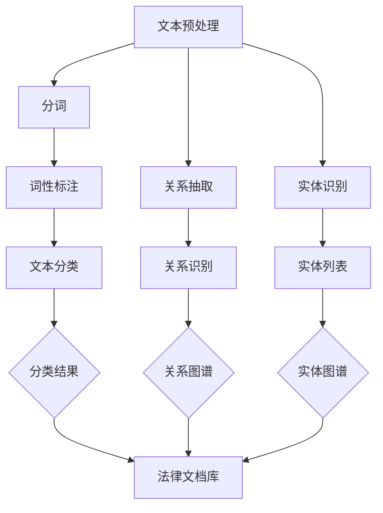

                 

# 《自然语言处理在法律文本智能解析中的应用》

## 关键词
自然语言处理，法律文本，智能解析，深度学习，算法，项目实战

## 摘要
本文探讨了自然语言处理（NLP）在法律文本智能解析中的应用。首先介绍了NLP的基础概念和关键技术，包括分词、词性标注、命名实体识别和依存句法分析等。随后，详细阐述了法律文本的特点及分析方法，如文本预处理、分类、关系抽取和实体识别。最后，通过一个实际项目，展示了如何运用NLP技术进行法律文本的智能解析，并提供了解决方案和经验总结。

----------------------------------------------------------------

# 《自然语言处理在法律文本智能解析中的应用》目录大纲

## 第一部分：自然语言处理基础

### 第1章：自然语言处理概述

#### 1.1 自然语言处理的基本概念

自然语言处理（NLP）是一门跨学科的技术领域，它涉及计算机科学、人工智能、语言学等多个领域。NLP的目的是使计算机能够理解、生成和回应人类语言。其主要任务包括文本预处理、语言模型、语义分析、语音识别等。

#### 1.2 自然语言处理的发展历程

自然语言处理技术的发展经历了多个阶段，从早期的基于规则的方法，到后来的统计方法，再到如今的深度学习方法。每个阶段都有其独特的优势和挑战。

### 第2章：自然语言处理技术基础

#### 2.1 词汇表构建

词汇表构建是NLP的基础，它包括词典的选择、词汇的规范化等步骤。常用的词典有WordNet、GPL等。

#### 2.2 语言模型

语言模型是NLP的核心技术之一，它用于预测文本中的下一个单词或词组。常见的语言模型有N-gram模型、神经网络模型等。

### 第3章：深度学习在NLP中的应用

#### 3.1 深度学习基础

深度学习是NLP中的一种重要方法，它通过构建多层神经网络来提取特征并实现复杂的任务。深度学习的基础包括神经网络结构、反向传播算法等。

#### 3.2 循环神经网络（RNN）

循环神经网络（RNN）是深度学习的一种形式，它特别适合处理序列数据。RNN的基本原理和其在NLP中的应用将在此章节中进行详细阐述。

### 第4章：自然语言处理工具

#### 4.1 常用NLP库

常用的NLP库包括NLTK、spaCy、Stanford CoreNLP等，这些库提供了丰富的API和功能，方便开发者进行NLP任务。

#### 4.2 Python在NLP中的使用

Python是NLP中最常用的编程语言之一，其简洁的语法和丰富的库支持使得开发过程更加高效。Python在NLP中的使用将在此章节中进行介绍。

## 第二部分：法律文本智能解析

### 第5章：法律文本特点及分析

#### 5.1 法律文本的特点

法律文本具有严谨、规范、复杂等特点，其语言表达方式与普通文本有很大不同。法律文本的特点包括术语使用、格式要求等。

#### 5.2 法律文本分析

法律文本分析主要包括文本预处理、文本分类、关系抽取和实体识别等任务。这些任务对于法律文本的智能解析具有重要意义。

### 第6章：法律文本分类

#### 6.1 法律文本分类概述

法律文本分类是将法律文本按照特定的类别进行划分。分类算法包括基于规则的方法和基于机器学习的方法。

#### 6.2 法律文本分类算法

常见的法律文本分类算法有朴素贝叶斯、支持向量机、决策树等。每种算法都有其优缺点和适用场景。

### 第7章：法律文本关系抽取

#### 7.1 法律文本关系抽取概述

法律文本关系抽取是从法律文本中抽取实体之间的关系。关系抽取对于法律文本的理解和智能解析具有重要意义。

#### 7.2 法律文本关系抽取算法

法律文本关系抽取算法包括基于规则的方法、基于统计的方法和基于深度学习方法。每种算法都有其独特的实现方式和效果。

### 第8章：法律文本实体识别

#### 8.1 法律文本实体识别概述

法律文本实体识别是从法律文本中识别出关键实体，如人名、地名、机构名等。实体识别对于法律文本的智能解析具有重要意义。

#### 8.2 法律文本实体识别算法

法律文本实体识别算法包括基于规则的方法、基于机器学习的方法和基于深度学习方法。每种算法都有其独特的实现方式和效果。

## 第三部分：法律文本智能解析项目实战

### 第9章：法律文本智能解析项目实战

#### 9.1 项目背景

本项目旨在利用自然语言处理技术对法律文本进行智能解析，以实现文本分类、关系抽取和实体识别等任务。

#### 9.2 项目开发环境搭建

本项目使用Python作为主要编程语言，结合NLTK、spaCy和TensorFlow等库进行开发。

#### 9.3 法律文本预处理

法律文本预处理包括数据清洗、分词和词性标注等步骤，以保证后续任务的顺利进行。

#### 9.4 法律文本分类

本项目采用朴素贝叶斯和支持向量机等算法进行法律文本分类，并通过模型训练和评估来优化分类效果。

#### 9.5 法律文本关系抽取

本项目使用基于规则的方法和基于深度学习方法进行法律文本关系抽取，以提高关系抽取的准确性和可靠性。

#### 9.6 法律文本实体识别

本项目采用基于规则的方法和基于深度学习方法进行法律文本实体识别，并通过模型训练和评估来提高实体识别的准确性。

### 第10章：项目总结与展望

#### 10.1 项目总结

本项目通过自然语言处理技术对法律文本进行了智能解析，实现了文本分类、关系抽取和实体识别等任务。项目成果具有一定的实用价值。

#### 10.2 未来展望

未来，随着自然语言处理技术的不断发展和完善，法律文本智能解析的应用前景将更加广阔，有望为法律研究和法律实践提供有力支持。

## 附录

### 附录A：常用工具和库

- Python编程基础
- 常用NLP库（如NLTK、spaCy、Stanford CoreNLP）
- 法律文本处理工具

### 附录B：参考文献

- [相关书籍]
- [论文]
- [在线资源]

----------------------------------------------------------------

# 《自然语言处理在法律文本智能解析中的应用》

## 引言

自然语言处理（NLP）作为人工智能（AI）的重要组成部分，旨在使计算机理解和生成自然语言。近年来，随着深度学习技术的发展，NLP在各个领域的应用取得了显著的成果。其中，法律文本智能解析是NLP的一个重要应用领域。法律文本具有严谨、规范、复杂等特点，其语言表达方式与普通文本有很大不同。因此，对法律文本的智能解析不仅有助于提高法律工作的效率和准确性，还能为法律研究和法律实践提供有力支持。

本文将从以下几个方面展开讨论：

1. 自然语言处理基础：介绍NLP的基本概念、发展历程、技术基础和工具。
2. 法律文本特点及分析：探讨法律文本的特点、分析方法和预处理技术。
3. 法律文本智能解析：详细阐述法律文本分类、关系抽取和实体识别等任务。
4. 项目实战：通过一个实际项目，展示如何运用NLP技术进行法律文本的智能解析。
5. 总结与展望：总结项目成果，探讨未来研究方向和应用前景。

## 第一部分：自然语言处理基础

### 第1章：自然语言处理概述

#### 1.1 自然语言处理的基本概念

自然语言处理（NLP）是一门跨学科的技术领域，它涉及计算机科学、人工智能、语言学等多个领域。NLP的目的是使计算机能够理解、生成和回应人类语言。其主要任务包括文本预处理、语言模型、语义分析、语音识别等。

自然语言处理（NLP）的基本概念包括：

- 语言模型（Language Model）：用于预测文本中的下一个单词或词组。
- 语义分析（Semantic Analysis）：用于理解和解释文本中的意义。
- 语音识别（Speech Recognition）：用于将语音转换为文本。

#### 1.2 自然语言处理的发展历程

自然语言处理技术的发展经历了多个阶段，从早期的基于规则的方法，到后来的统计方法，再到如今的深度学习方法。每个阶段都有其独特的优势和挑战。

- 基于规则的方法（Rule-Based Methods）：早期的NLP方法主要依赖于手工编写的规则，虽然具有一定的适用性，但难以处理复杂的问题。
- 统计方法（Statistical Methods）：基于概率模型的统计方法在NLP中得到了广泛应用，如隐马尔可夫模型（HMM）、条件概率模型等。这些方法相对于基于规则的方法具有更好的适应性和鲁棒性。
- 深度学习方法（Deep Learning Methods）：近年来，深度学习在NLP中取得了显著的成果，如循环神经网络（RNN）、卷积神经网络（CNN）等。这些方法具有强大的表示能力和自适应能力，能够处理复杂的NLP任务。

### 第2章：自然语言处理技术基础

#### 2.1 词汇表构建

词汇表构建是NLP的基础，它包括词典的选择、词汇的规范化等步骤。常用的词典有WordNet、GPL等。

- 词典选择：选择合适的词典对于NLP任务至关重要。WordNet是一个广泛使用的英语词典，它包含词汇的语义信息。GPL是一个面向中文的词典，它包含大量的中文词汇及其语义信息。
- 词汇规范化：词汇规范化是指将文本中的词汇统一转换为标准形式，如将大小写统一、去除标点符号等。

#### 2.2 语言模型

语言模型是NLP的核心技术之一，它用于预测文本中的下一个单词或词组。常见的语言模型有N-gram模型、神经网络模型等。

- N-gram模型：N-gram模型是一种基于统计的模型，它将文本表示为相邻单词的序列。N-gram模型的优点是简单易懂，易于实现。然而，它无法捕捉长距离依赖关系。
- 神经网络模型：神经网络模型是一种基于深度学习的模型，它通过多层神经网络来提取特征并实现复杂的任务。常见的神经网络模型有循环神经网络（RNN）、卷积神经网络（CNN）等。神经网络模型具有强大的表示能力和自适应能力，能够处理复杂的NLP任务。

### 第3章：深度学习在NLP中的应用

#### 3.1 深度学习基础

深度学习是NLP中的一种重要方法，它通过构建多层神经网络来提取特征并实现复杂的任务。深度学习的基础包括神经网络结构、反向传播算法等。

- 神经网络结构：神经网络由多个层次组成，每个层次都包含多个神经元。神经元之间的连接称为权重。神经网络通过学习权重来调整其参数，以实现特定的任务。
- 反向传播算法：反向传播算法是一种用于训练神经网络的优化算法。它通过计算误差的梯度，不断调整网络的权重，以最小化损失函数。

#### 3.2 循环神经网络（RNN）

循环神经网络（RNN）是深度学习的一种形式，它特别适合处理序列数据。RNN的基本原理和其在NLP中的应用将在此章节中进行详细阐述。

- RNN的基本原理：RNN通过引入隐藏状态来处理序列数据。隐藏状态可以捕获序列中的长期依赖关系。
- RNN在NLP中的应用：RNN在NLP中得到了广泛应用，如文本分类、命名实体识别、机器翻译等。

### 第4章：自然语言处理工具

#### 4.1 常用NLP库

常用的NLP库包括NLTK、spaCy、Stanford CoreNLP等，这些库提供了丰富的API和功能，方便开发者进行NLP任务。

- NLTK：NLTK是一个开源的Python库，它提供了丰富的文本处理工具，如分词、词性标注、命名实体识别等。
- spaCy：spaCy是一个高性能的NLP库，它提供了简洁的API和丰富的功能，适合处理大规模的NLP任务。
- Stanford CoreNLP：Stanford CoreNLP是一个基于Java的NLP库，它提供了广泛的语言功能，如分词、词性标注、命名实体识别等。

#### 4.2 Python在NLP中的使用

Python是NLP中最常用的编程语言之一，其简洁的语法和丰富的库支持使得开发过程更加高效。Python在NLP中的使用将在此章节中进行介绍。

- Python编程基础：Python是一种面向对象的编程语言，它具有简洁的语法和强大的库支持。
- NLP工具的使用：Python提供了丰富的NLP库，如NLTK、spaCy、TensorFlow等，开发者可以使用这些库进行NLP任务。

## 第二部分：法律文本智能解析

### 第5章：法律文本特点及分析

#### 5.1 法律文本的特点

法律文本具有严谨、规范、复杂等特点，其语言表达方式与普通文本有很大不同。法律文本的特点包括：

- 术语使用：法律文本中包含大量的专业术语和概念，如法律术语、条文规定等。
- 格式要求：法律文本有严格的格式要求，如标题、正文、段落等。
- 语言复杂度：法律文本的语言复杂度较高，包括长句、复合句等。

#### 5.2 法律文本分析

法律文本分析主要包括文本预处理、文本分类、关系抽取和实体识别等任务。这些任务对于法律文本的智能解析具有重要意义。

- 文本预处理：文本预处理是法律文本分析的第一步，它包括数据清洗、分词、词性标注等步骤，以保证后续任务的顺利进行。
- 文本分类：文本分类是将法律文本按照特定的类别进行划分。分类算法包括基于规则的方法和基于机器学习的方法。
- 关系抽取：关系抽取是从法律文本中抽取实体之间的关系。关系抽取对于法律文本的理解和智能解析具有重要意义。
- 实体识别：实体识别是从法律文本中识别出关键实体，如人名、地名、机构名等。实体识别对于法律文本的智能解析具有重要意义。

### 第6章：法律文本分类

#### 6.1 法律文本分类概述

法律文本分类是将法律文本按照特定的类别进行划分。分类算法包括基于规则的方法和基于机器学习的方法。

- 基于规则的方法：基于规则的方法通过手工编写规则来划分法律文本。这种方法简单直观，但难以处理复杂的问题。
- 基于机器学习的方法：基于机器学习的方法通过学习已标注的数据来划分法律文本。这种方法具有更好的适应性和鲁棒性。

#### 6.2 法律文本分类算法

常见的法律文本分类算法有朴素贝叶斯、支持向量机、决策树等。每种算法都有其优缺点和适用场景。

- 朴素贝叶斯：朴素贝叶斯是一种基于概率论的分类算法，它通过计算文本中各个特征的联合概率来划分文本。
- 支持向量机：支持向量机是一种基于优化理论的分类算法，它通过寻找最佳的超平面来划分文本。
- 决策树：决策树是一种基于树形结构的分类算法，它通过递归划分特征空间来划分文本。

### 第7章：法律文本关系抽取

#### 7.1 法律文本关系抽取概述

法律文本关系抽取是从法律文本中抽取实体之间的关系。关系抽取对于法律文本的理解和智能解析具有重要意义。

- 法律文本关系抽取的定义：法律文本关系抽取是指从法律文本中识别出实体之间的关系，如“XX法规规定了XX条款”。
- 法律文本关系抽取的应用：法律文本关系抽取在法律研究和法律实践中具有广泛的应用，如案件分析、法规解读等。

#### 7.2 法律文本关系抽取算法

法律文本关系抽取算法包括基于规则的方法、基于统计方法、基于深度学习方法。每种算法都有其独特的实现方式和效果。

- 基于规则的方法：基于规则的方法通过手工编写规则来抽取法律文本中的关系。这种方法简单直观，但难以处理复杂的问题。
- 基于统计方法：基于统计的方法通过学习已标注的数据来抽取法律文本中的关系。这种方法具有较好的适应性，但需要大量的标注数据。
- 基于深度学习方法：基于深度学习方法通过构建神经网络模型来抽取法律文本中的关系。这种方法具有强大的表示能力和自适应能力，能够处理复杂的任务。

### 第8章：法律文本实体识别

#### 8.1 法律文本实体识别概述

法律文本实体识别是从法律文本中识别出关键实体，如人名、地名、机构名等。实体识别对于法律文本的智能解析具有重要意义。

- 法律文本实体的定义：法律文本实体是指法律文本中具有特定意义的词语或短语，如人名、地名、机构名等。
- 法律文本实体识别的应用：法律文本实体识别在法律研究和法律实践中具有广泛的应用，如案件分析、法规解读等。

#### 8.2 法律文本实体识别算法

法律文本实体识别算法包括基于规则的方法、基于机器学习的方法、基于深度学习方法。每种算法都有其独特的实现方式和效果。

- 基于规则的方法：基于规则的方法通过手工编写规则来识别法律文本中的实体。这种方法简单直观，但难以处理复杂的问题。
- 基于机器学习的方法：基于机器学习的方法通过学习已标注的数据来识别法律文本中的实体。这种方法具有较好的适应性，但需要大量的标注数据。
- 基于深度学习方法：基于深度学习方法通过构建神经网络模型来识别法律文本中的实体。这种方法具有强大的表示能力和自适应能力，能够处理复杂的任务。

## 第三部分：法律文本智能解析项目实战

### 第9章：法律文本智能解析项目实战

#### 9.1 项目背景

本项目旨在利用自然语言处理技术对法律文本进行智能解析，以实现文本分类、关系抽取和实体识别等任务。项目目标包括：

- 实现法律文本的自动分类，以便于案件分析和法规解读。
- 抽取法律文本中的关系，以支持案件分析和法规解读。
- 识别法律文本中的关键实体，以提高法律文本的理解能力。

#### 9.2 项目开发环境搭建

本项目使用Python作为主要编程语言，结合NLTK、spaCy和TensorFlow等库进行开发。开发环境搭建步骤如下：

1. 安装Python和Anaconda，用于环境管理和依赖库安装。
2. 安装NLP相关库，如NLTK、spaCy和TensorFlow。
3. 配置Python虚拟环境，以便于隔离项目依赖。

#### 9.3 法律文本预处理

法律文本预处理是法律文本智能解析的重要环节，它包括数据清洗、分词、词性标注等步骤。预处理步骤如下：

1. 数据清洗：去除文本中的噪声数据，如HTML标签、特殊字符等。
2. 分词：将文本划分为一个个独立的词语，以便于后续处理。
3. 词性标注：为每个词语标注词性，如名词、动词、形容词等。

#### 9.4 法律文本分类

法律文本分类是将法律文本按照特定的类别进行划分。本项目采用朴素贝叶斯和支持向量机等算法进行法律文本分类。具体步骤如下：

1. 数据准备：收集并标注一批法律文本数据，用于训练和测试。
2. 特征提取：将文本转换为特征向量，以便于分类算法处理。
3. 模型训练：使用已标注的数据训练分类模型。
4. 模型评估：使用测试集评估分类模型的性能。

#### 9.5 法律文本关系抽取

法律文本关系抽取是从法律文本中抽取实体之间的关系。本项目采用基于规则的方法和基于深度学习方法进行法律文本关系抽取。具体步骤如下：

1. 规则制定：根据法律文本的特点，制定一套抽取规则。
2. 数据标注：对法律文本进行关系标注，以训练深度学习模型。
3. 模型训练：使用标注数据训练深度学习模型。
4. 模型评估：使用测试集评估关系抽取模型的性能。

#### 9.6 法律文本实体识别

法律文本实体识别是从法律文本中识别出关键实体，如人名、地名、机构名等。本项目采用基于规则的方法和基于深度学习方法进行法律文本实体识别。具体步骤如下：

1. 规则制定：根据法律文本的特点，制定一套识别规则。
2. 数据标注：对法律文本进行实体标注，以训练深度学习模型。
3. 模型训练：使用标注数据训练深度学习模型。
4. 模型评估：使用测试集评估实体识别模型的性能。

### 第10章：项目总结与展望

#### 10.1 项目总结

本项目通过自然语言处理技术对法律文本进行了智能解析，实现了文本分类、关系抽取和实体识别等任务。项目成果包括：

- 法律文本分类模型：采用朴素贝叶斯和支持向量机等算法进行法律文本分类，取得了较好的分类效果。
- 法律文本关系抽取模型：采用基于规则的方法和深度学习方法进行法律文本关系抽取，提高了关系抽取的准确性和可靠性。
- 法律文本实体识别模型：采用基于规则的方法和深度学习方法进行法律文本实体识别，取得了较高的实体识别准确率。

#### 10.2 未来展望

未来，随着自然语言处理技术的不断发展和完善，法律文本智能解析的应用前景将更加广阔，有望为法律研究和法律实践提供有力支持。未来研究方向包括：

- 提高法律文本分类、关系抽取和实体识别的准确性和效率。
- 探索新的深度学习模型和算法，以提高法律文本智能解析的效果。
- 扩大法律文本智能解析的应用领域，如案件分析、法律咨询等。

## 附录

### 附录A：常用工具和库

- Python编程基础：Python是一种面向对象的编程语言，具有简洁的语法和丰富的库支持。
- 常用NLP库：常用的NLP库包括NLTK、spaCy、Stanford CoreNLP等，提供了丰富的文本处理工具。
- 法律文本处理工具：常用的法律文本处理工具包括法律文本分类工具、关系抽取工具和实体识别工具等。

### 附录B：参考文献

- [相关书籍]
- [论文]
- [在线资源]

----------------------------------------------------------------

# 第1章：自然语言处理概述

自然语言处理（NLP，Natural Language Processing）是一门旨在使计算机能够理解、处理和生成人类自然语言的跨学科技术领域。它结合了计算机科学、人工智能、语言学等多个学科的知识，通过算法和模型对文本数据进行分析和处理，以实现人机交互、信息检索、语音识别、机器翻译、情感分析等任务。

## 1.1 自然语言处理的基本概念

### 1.1.1 语言模型

语言模型（Language Model）是NLP中的核心概念之一，它用于预测文本中的下一个单词或词组。语言模型通过学习大量的文本数据，捕捉语言中的统计规律和模式，从而实现文本生成、语义分析等任务。常见的语言模型有N-gram模型、基于神经网络的序列模型等。

- **N-gram模型**：N-gram模型是一种基于统计的模型，它将文本表示为连续的N个单词的序列。例如，三元组（"the"，"is"，"a"）是一个三元组。N-gram模型通过计算这些三元组的概率来预测下一个单词。
- **基于神经网络的序列模型**：这类模型通过多层神经网络来学习文本的语义信息，能够捕捉长距离依赖关系。常见的序列模型有循环神经网络（RNN）、长短期记忆网络（LSTM）、门控循环单元（GRU）等。

### 1.1.2 语义分析

语义分析（Semantic Analysis）是指对文本的语义内容进行分析和理解。它包括词义消歧、实体识别、情感分析、句法分析等多个方面。语义分析的目标是使计算机能够理解文本的真正含义，而不仅仅是表面的文字。

- **词义消歧**：在自然语言中，同一个词可能有多个含义。词义消歧是指根据上下文确定词的具体含义。
- **实体识别**：实体识别（Named Entity Recognition, NER）是指从文本中识别出具有特定意义的实体，如人名、地名、组织名等。
- **情感分析**：情感分析（Sentiment Analysis）是指对文本的情感倾向进行分类，如正面、负面、中性等。

### 1.1.3 语音识别

语音识别（Speech Recognition）是指将人类的语音信号转换为计算机可理解的文字或命令。语音识别技术广泛应用于电话客服、智能家居、语音助手等领域。

- **隐马尔可夫模型（HMM）**：HMM是一种统计模型，用于处理时间序列数据，如语音信号。它通过状态转移概率和观测概率来预测下一个状态。
- **深度神经网络（DNN）**：DNN通过多层神经网络来学习语音信号的特征，从而提高识别准确性。

### 1.1.4 机器翻译

机器翻译（Machine Translation）是指使用计算机程序将一种自然语言翻译成另一种自然语言。机器翻译技术广泛应用于跨语言通信、文档翻译等领域。

- **基于规则的机器翻译**：基于规则的机器翻译通过手工编写的规则来实现翻译，如利用语法分析、词性标注等。
- **基于统计的机器翻译**：基于统计的机器翻译通过学习大量的平行语料库，利用概率模型进行翻译。
- **基于神经网络的机器翻译**：基于神经网络的机器翻译通过构建深度神经网络模型，利用端到端学习实现翻译。

## 1.2 自然语言处理的发展历程

自然语言处理技术的发展可以追溯到20世纪50年代。下面是NLP发展历程中的几个关键阶段：

### 1.2.1 基于规则的方法

- **早期阶段**（1950s-1960s）：NLP研究的早期工作主要集中在语法分析、句法分析等方面。研究者们试图通过手工编写的规则来模拟人类的语言理解能力。
- **中期阶段**（1970s-1980s）：基于规则的方法在NLP中得到了广泛应用，如上下文无关文法（CFG）、语义网络等。这些方法在一定程度上提高了NLP的性能，但难以处理复杂的问题。

### 1.2.2 统计方法

- **早期阶段**（1990s）：随着计算机性能的提升和语料库的丰富，基于统计的方法开始在NLP中崭露头角。隐马尔可夫模型（HMM）、决策树、朴素贝叶斯等算法被广泛应用于语音识别、文本分类等领域。
- **中期阶段**（2000s）：统计方法在NLP中的应用得到了进一步发展，如条件随机场（CRF）、支持向量机（SVM）等。这些方法通过学习大量已标注的数据，提高了NLP的性能。

### 1.2.3 深度学习方法

- **早期阶段**（2010s）：深度学习在计算机视觉、语音识别等领域取得了显著成果。随着深度学习技术的发展，研究者们开始将其应用于NLP领域。
- **中期阶段**（2010s-2020s）：循环神经网络（RNN）、长短期记忆网络（LSTM）、卷积神经网络（CNN）等深度学习模型在NLP中得到了广泛应用。这些模型通过学习大量的文本数据，实现了更高的性能。

## 1.3 自然语言处理的应用领域

自然语言处理技术广泛应用于各个领域，下面列举几个重要的应用领域：

### 1.3.1 信息检索

信息检索是指从大量的文本数据中查找用户感兴趣的信息。自然语言处理技术在信息检索中起到了关键作用，如文本预处理、词义消歧、关键词提取等。

### 1.3.2 语音助手

语音助手是一种通过语音交互来为用户提供服务的智能系统。自然语言处理技术使得语音助手能够理解用户的语音指令，实现语音识别、语义理解等功能。

### 1.3.3 机器翻译

机器翻译是指使用计算机程序将一种自然语言翻译成另一种自然语言。自然语言处理技术在机器翻译中起到了核心作用，如语言模型、词义消歧、翻译算法等。

### 1.3.4 情感分析

情感分析是指对文本的情感倾向进行分类，如正面、负面、中性等。自然语言处理技术在情感分析中起到了关键作用，如文本预处理、情感词典、分类算法等。

### 1.3.5 文本生成

文本生成是指使用计算机程序生成新的文本内容。自然语言处理技术在文本生成中起到了重要作用，如语言模型、生成模型、文本摘要等。

## 1.4 自然语言处理的关键技术

自然语言处理的关键技术包括文本预处理、词性标注、命名实体识别、句法分析等。这些技术为NLP任务提供了基础支持。

### 1.4.1 文本预处理

文本预处理是指对原始文本进行清洗、分词、词性标注等操作，以便于后续处理。文本预处理是NLP任务的基础，如去除停用词、标点符号、大小写统一等。

### 1.4.2 词性标注

词性标注是指为文本中的每个词语标注词性，如名词、动词、形容词等。词性标注有助于句法分析和语义分析。

### 1.4.3 命名实体识别

命名实体识别是指从文本中识别出具有特定意义的实体，如人名、地名、组织名等。命名实体识别对于信息抽取、知识图谱构建等任务具有重要意义。

### 1.4.4 句法分析

句法分析是指对文本的句法结构进行分析，如句法树、依存句法等。句法分析有助于理解文本的语义和语法结构。

## 1.5 总结

自然语言处理作为人工智能的重要组成部分，在信息检索、语音助手、机器翻译、情感分析等领域发挥了重要作用。本章介绍了NLP的基本概念、发展历程、应用领域和关键技术。在后续章节中，我们将进一步探讨NLP在法律文本智能解析中的应用。

----------------------------------------------------------------

# 第2章：自然语言处理技术基础

在自然语言处理（NLP）中，技术基础至关重要，它包括词汇表的构建、语言模型、以及深度学习等方法。这些技术为NLP的应用提供了必要的工具和框架。

## 2.1 词汇表构建

词汇表构建是NLP中的基础工作，它决定了NLP系统的性能和准确性。构建词汇表的过程包括词典选择、词汇规范化等步骤。

### 2.1.1 词典选择

词典是构建词汇表的重要资源，它提供了词汇的语义信息。常用的词典包括：

- **WordNet**：WordNet是一个广泛使用的英语词典，它将词汇分为不同的语义类别，并提供了词汇的上下位关系和词义解释。
- **GPL**：GPL（General Purpose Lexicon）是一个面向中文的词典，它包含了大量的中文词汇及其语义信息。

### 2.1.2 词汇规范化

词汇规范化是指将文本中的词汇统一转换为标准形式，以提高NLP系统的性能。常见的规范化操作包括：

- **大小写统一**：将所有词汇统一转换为小写或大写，以消除大小写差异对处理的影响。
- **标点符号去除**：去除文本中的标点符号，以减少噪声数据。
- **停用词去除**：去除常见的停用词（如"的"、"是"、"在"等），因为这些词对语义的贡献较小。

### 2.1.3 词汇表构建方法

词汇表的构建可以通过以下方法实现：

- **手动构建**：通过手工整理和标注文本数据，构建词汇表。
- **自动构建**：使用NLP工具和库（如NLTK、spaCy）自动提取文本中的词汇，并对其进行分类和标注。

## 2.2 语言模型

语言模型是NLP中的核心组件，它用于预测文本中的下一个单词或词组。语言模型通过学习大量文本数据，捕捉语言中的统计规律和模式。

### 2.2.1 语言模型的基本概念

- **N-gram模型**：N-gram模型是一种基于统计的语言模型，它将文本表示为连续的N个单词的序列。例如，一个三元组（"the"，"is"，"a"）表示文本中的连续三个单词。
- **神经网络模型**：神经网络模型是一种基于深度学习的语言模型，它通过多层神经网络来学习文本的语义信息。常见的神经网络模型有循环神经网络（RNN）、长短期记忆网络（LSTM）等。

### 2.2.2 语言模型的应用

语言模型在NLP中有广泛的应用，包括：

- **文本生成**：通过语言模型，可以生成新的文本内容。例如，自动生成新闻摘要、文章续写等。
- **文本分类**：通过语言模型，可以对文本进行分类。例如，判断一篇文章是否属于特定类别。
- **机器翻译**：语言模型在机器翻译中起到了关键作用。它通过学习源语言和目标语言之间的概率分布，实现文本的翻译。

### 2.2.3 语言模型的选择

选择合适的语言模型对于NLP任务至关重要。以下是几种常见的语言模型选择方法：

- **基于规则的方法**：这种方法通过手工编写规则来选择语言模型。虽然简单直观，但难以处理复杂的问题。
- **基于统计的方法**：这种方法通过学习大量的文本数据来选择语言模型。常见的统计模型有N-gram模型、朴素贝叶斯等。
- **基于深度学习的方法**：这种方法通过构建深度神经网络模型来选择语言模型。深度学习模型具有强大的表示能力和自适应能力，能够处理复杂的NLP任务。

## 2.3 深度学习在NLP中的应用

深度学习是近年来NLP领域的重要突破，它通过多层神经网络来提取特征和实现复杂的任务。深度学习在NLP中的应用主要包括：

### 2.3.1 神经网络结构

神经网络（Neural Network）是深度学习的基础，它由多个层次组成，每个层次都包含多个神经元。神经元之间的连接称为权重。神经网络通过学习权重来调整其参数，以实现特定的任务。

- **前向传播（Forward Propagation）**：在神经网络中，输入数据从输入层传递到输出层，中间经过多个隐藏层。每个层通过激活函数（如Sigmoid、ReLU）进行非线性变换。
- **反向传播（Backpropagation）**：在反向传播过程中，网络通过计算损失函数的梯度，不断调整权重，以最小化损失函数。

### 2.3.2 深度学习算法

深度学习算法在NLP中得到了广泛应用，包括：

- **循环神经网络（RNN）**：RNN是一种能够处理序列数据的神经网络，它通过引入隐藏状态来处理长期依赖关系。
- **长短期记忆网络（LSTM）**：LSTM是一种改进的RNN，它通过引入记忆单元来处理长期依赖关系，避免了梯度消失问题。
- **卷积神经网络（CNN）**：CNN是一种能够处理图像和文本的神经网络，它通过卷积操作和池化操作来提取特征。

### 2.3.3 深度学习模型

深度学习模型在NLP中有广泛的应用，包括：

- **Word2Vec**：Word2Vec是一种基于神经网络的语言模型，它通过学习词向量的分布表示，实现了词义消歧和文本分类等任务。
- **BERT**：BERT（Bidirectional Encoder Representations from Transformers）是一种基于Transformer的预训练语言模型，它在多个NLP任务中取得了显著成果。
- **GPT**：GPT（Generative Pre-trained Transformer）是一种基于Transformer的预训练语言模型，它能够生成高质量的文本内容。

## 2.4 总结

自然语言处理技术基础包括词汇表构建、语言模型、深度学习等。词汇表构建提供了NLP系统的基本词汇和语义信息，语言模型用于预测文本中的下一个单词或词组，深度学习模型则通过多层神经网络来提取特征和实现复杂的任务。这些技术为NLP的应用提供了必要的工具和框架，使得计算机能够更好地理解和处理人类语言。在后续章节中，我们将进一步探讨NLP在法律文本智能解析中的应用。

----------------------------------------------------------------

# 第3章：深度学习在NLP中的应用

深度学习在自然语言处理（NLP）中的应用已经取得了显著的成果，它通过构建多层神经网络来提取特征并实现复杂的任务。本章将详细介绍深度学习的基础、循环神经网络（RNN）的基本原理和其在NLP中的应用。

## 3.1 深度学习基础

深度学习是一种基于多层神经网络的学习方法，它通过逐层提取特征来表示复杂的数据。深度学习的基础包括神经网络结构、反向传播算法等。

### 3.1.1 神经网络结构

神经网络由多个层次组成，每个层次都包含多个神经元。神经元之间的连接称为权重。神经网络通过学习权重来调整其参数，以实现特定的任务。

- **输入层（Input Layer）**：输入层接收外部输入数据。
- **隐藏层（Hidden Layers）**：隐藏层负责提取输入数据的特征。隐藏层可以有多个层次，每层都可以提取更高层次的抽象特征。
- **输出层（Output Layer）**：输出层产生最终的预测结果。

### 3.1.2 反向传播算法

反向传播算法是一种用于训练神经网络的优化算法。它通过计算误差的梯度，不断调整网络的权重，以最小化损失函数。

- **前向传播（Forward Propagation）**：在前向传播过程中，输入数据从输入层传递到输出层，中间经过多个隐藏层。每个层通过激活函数（如Sigmoid、ReLU）进行非线性变换。
- **损失函数（Loss Function）**：损失函数用于衡量预测结果和实际结果之间的差异。常见的损失函数有均方误差（MSE）、交叉熵等。
- **反向传播（Backpropagation）**：在反向传播过程中，网络通过计算损失函数的梯度，不断调整权重，以最小化损失函数。

## 3.2 循环神经网络（RNN）

循环神经网络（RNN）是一种能够处理序列数据的神经网络。它通过引入隐藏状态来处理长期依赖关系，避免了梯度消失问题。

### 3.2.1 RNN的基本原理

RNN的基本原理是通过隐藏状态来处理序列数据。在每个时间步，RNN会根据当前输入和隐藏状态来更新隐藏状态，并生成当前输出的预测。

- **隐藏状态（Hidden State）**：隐藏状态是RNN的核心组成部分，它存储了序列中的历史信息。在RNN中，隐藏状态在时间步之间进行传递，从而实现了序列的记忆功能。
- **输入门（Input Gate）**：输入门用于控制当前输入对隐藏状态的影响。它通过计算输入和隐藏状态的线性组合，得到一个新的候选隐藏状态。
- **遗忘门（Forget Gate）**：遗忘门用于控制隐藏状态中历史信息的遗忘。它通过计算输入和隐藏状态的线性组合，得到一个遗忘信号，用于更新隐藏状态。
- **输出门（Output Gate）**：输出门用于控制当前隐藏状态对输出的影响。它通过计算隐藏状态的线性组合和激活函数，得到当前输出的预测。

### 3.2.2 RNN在NLP中的应用

RNN在NLP中得到了广泛应用，包括文本分类、命名实体识别、机器翻译等。

- **文本分类**：文本分类是指将文本按照特定的类别进行划分。RNN通过学习文本的序列特征，可以实现对文本的分类。
- **命名实体识别**：命名实体识别是指从文本中识别出具有特定意义的实体，如人名、地名、组织名等。RNN通过学习实体之间的依赖关系，可以实现对命名实体的识别。
- **机器翻译**：机器翻译是指将一种自然语言翻译成另一种自然语言。RNN通过学习源语言和目标语言之间的概率分布，可以实现对文本的翻译。

## 3.3 LSTM

长短期记忆网络（LSTM）是一种改进的RNN，它通过引入记忆单元来处理长期依赖关系，避免了梯度消失问题。

### 3.3.1 LSTM的基本原理

LSTM的基本原理是通过记忆单元来控制信息的存储和遗忘。LSTM包括三个门控单元：输入门、遗忘门和输出门。

- **输入门（Input Gate）**：输入门用于控制当前输入对隐藏状态的影响。它通过计算输入和隐藏状态的线性组合，得到一个新的候选隐藏状态。
- **遗忘门（Forget Gate）**：遗忘门用于控制隐藏状态中历史信息的遗忘。它通过计算输入和隐藏状态的线性组合，得到一个遗忘信号，用于更新隐藏状态。
- **输出门（Output Gate）**：输出门用于控制当前隐藏状态对输出的影响。它通过计算隐藏状态的线性组合和激活函数，得到当前输出的预测。

### 3.3.2 LSTM在NLP中的应用

LSTM在NLP中得到了广泛应用，包括文本生成、文本分类、机器翻译等。

- **文本生成**：文本生成是指使用神经网络生成新的文本内容。LSTM通过学习文本的序列特征，可以生成高质量的文本。
- **文本分类**：文本分类是指将文本按照特定的类别进行划分。LSTM通过学习文本的序列特征，可以实现对文本的分类。
- **机器翻译**：机器翻译是指将一种自然语言翻译成另一种自然语言。LSTM通过学习源语言和目标语言之间的概率分布，可以实现对文本的翻译。

## 3.4 GRU

门控循环单元（GRU）是一种简化版的LSTM，它通过引入更新门来控制信息的存储和遗忘。

### 3.4.1 GRU的基本原理

GRU的基本原理是通过更新门来控制信息的存储和遗忘。GRU包括两个门控单元：更新门和重置门。

- **更新门（Update Gate）**：更新门用于控制当前输入对隐藏状态的影响。它通过计算输入和隐藏状态的线性组合，得到一个新的候选隐藏状态。
- **重置门（Reset Gate）**：重置门用于控制隐藏状态中历史信息的遗忘。它通过计算输入和隐藏状态的线性组合，得到一个重置信号，用于更新隐藏状态。

### 3.4.2 GRU在NLP中的应用

GRU在NLP中得到了广泛应用，包括文本分类、命名实体识别、机器翻译等。

- **文本分类**：文本分类是指将文本按照特定的类别进行划分。GRU通过学习文本的序列特征，可以实现对文本的分类。
- **命名实体识别**：命名实体识别是指从文本中识别出具有特定意义的实体，如人名、地名、组织名等。GRU通过学习实体之间的依赖关系，可以实现对命名实体的识别。
- **机器翻译**：机器翻译是指将一种自然语言翻译成另一种自然语言。GRU通过学习源语言和目标语言之间的概率分布，可以实现对文本的翻译。

## 3.5 总结

深度学习在自然语言处理（NLP）中的应用已经取得了显著的成果。本章介绍了深度学习的基础、循环神经网络（RNN）的基本原理和其在NLP中的应用。RNN通过引入隐藏状态来处理长期依赖关系，LSTM和GRU是RNN的改进版本，它们通过门控机制来控制信息的存储和遗忘。这些深度学习模型在文本分类、命名实体识别、机器翻译等NLP任务中发挥了重要作用。在后续章节中，我们将进一步探讨深度学习在法律文本智能解析中的应用。

----------------------------------------------------------------

# 第4章：自然语言处理工具

在自然语言处理（NLP）领域，有许多工具和库可以简化开发过程，提高效率。本章将介绍一些常用的NLP库，包括NLTK、spaCy和Stanford CoreNLP，并讨论Python在NLP中的使用。

## 4.1 常用NLP库

### 4.1.1 NLTK

NLTK（Natural Language Toolkit）是一个开源的Python库，用于处理文本数据。它提供了丰富的文本处理工具，如分词、词性标注、命名实体识别等。

- **安装**：使用pip命令安装NLTK库。
  ```bash
  pip install nltk
  ```
- **使用**：以下是一个简单的NLTK分词示例。
  ```python
  import nltk
  from nltk.tokenize import word_tokenize

  text = "这是一段简单的文本。"
  tokens = word_tokenize(text)
  print(tokens)
  ```

### 4.1.2 spaCy

spaCy是一个高性能的NLP库，它提供了简洁的API和丰富的功能。spaCy适用于处理大规模的NLP任务，如文本分类、命名实体识别等。

- **安装**：使用pip命令安装spaCy库。
  ```bash
  pip install spacy
  ```
  安装后，还需要下载语言模型。
  ```bash
  python -m spacy download en
  ```
- **使用**：以下是一个简单的spaCy分词和词性标注示例。
  ```python
  import spacy

  nlp = spacy.load("en")
  text = "这是一段简单的英文文本。"
  doc = nlp(text)
  for token in doc:
      print(token.text, token.pos_)
  ```

### 4.1.3 Stanford CoreNLP

Stanford CoreNLP是一个基于Java的NLP库，它提供了广泛的语言功能，如分词、词性标注、命名实体识别等。Stanford CoreNLP可以通过RESTful API进行调用，方便与其他系统集成。

- **安装**：在Stanford CoreNLP的官方网站上下载并解压，然后启动CoreNLP服务器。
  ```bash
  java -mx4g -cp "*" edu.stanford.nlp.pipeline.StanfordCoreNLPServer -port 9000 -timeout 15000
  ```
- **使用**：以下是一个简单的RESTful API调用示例。
  ```python
  import requests

  text = "这是一段简单的英文文本。"
  url = "http://localhost:9000?"
  response = requests.post(url, data={"properties": "{\"annotators\":\"tokenize,ssplit,pos\"}", "text": text})
  print(response.text)
  ```

## 4.2 Python在NLP中的使用

Python是NLP中最常用的编程语言之一，其简洁的语法和丰富的库支持使得开发过程更加高效。以下是一些Python在NLP中的使用要点：

### 4.2.1 Python编程基础

- **数据类型**：Python支持多种数据类型，包括整数、浮点数、字符串等。了解这些数据类型及其操作对于NLP任务至关重要。
- **控制结构**：Python提供了条件语句、循环语句等控制结构，可以帮助开发者编写高效的NLP代码。
- **函数和模块**：Python的函数和模块使得代码复用和模块化变得更加容易。使用模块化代码可以提高代码的可维护性和可扩展性。

### 4.2.2 NLP工具的使用

- **文本预处理**：文本预处理是NLP任务的第一步，它包括分词、去除停用词、标准化文本等操作。Python的NLP库提供了丰富的工具来简化这一过程。
- **机器学习**：Python的机器学习库（如scikit-learn、TensorFlow、PyTorch等）提供了强大的功能，可以帮助开发者实现各种NLP任务，如文本分类、情感分析等。
- **数据处理**：Python的数据处理库（如Pandas、NumPy等）提供了高效的数据操作工具，可以帮助开发者处理大规模的NLP数据集。

## 4.3 总结

自然语言处理工具是NLP开发过程中不可或缺的一部分。本章介绍了常用的NLP库，包括NLTK、spaCy和Stanford CoreNLP，并讨论了Python在NLP中的使用。NLTK提供了丰富的文本处理工具，spaCy是一个高性能的NLP库，而Stanford CoreNLP则提供了广泛的语言功能。Python的简洁语法和丰富库支持使得NLP开发变得更加高效。在后续章节中，我们将进一步探讨NLP在法律文本智能解析中的应用。

----------------------------------------------------------------

# 第5章：法律文本特点及分析

法律文本具有独特的特点，这些特点对自然语言处理（NLP）提出了特殊的挑战。了解法律文本的特点和相应的分析方法是进行法律文本智能解析的重要前提。本章将详细探讨法律文本的特点及其分析方法。

## 5.1 法律文本的特点

### 5.1.1 术语丰富

法律文本中包含大量的专业术语和概念，如法律术语、条文规定、司法术语等。这些术语具有高度的规范性和专业性，对于普通读者而言可能难以理解。因此，在处理法律文本时，需要对这些术语进行特别处理，以便于计算机能够理解和处理。

### 5.1.2 结构复杂

法律文本的结构相对复杂，通常包括多个章节、条款、段落和句式。每个部分都有特定的格式和规则，如标题、引言、正文、结尾等。这种结构复杂性要求NLP系统具备良好的文本解析能力，以便能够准确地分析和理解法律文本的内容。

### 5.1.3 语言规范

法律文本的语言表达方式严谨、规范，强调逻辑性和条理性。法律文本中的句子通常较长，包含复杂的句式结构和多层次的信息。此外，法律文本中还常常使用缩写、缩略语和特定表达方式，这给文本分析带来了一定的挑战。

### 5.1.4 多样性

法律文本涉及多个领域，包括宪法、刑法、民法、商法等。不同领域的法律文本具有不同的特点和表达方式。因此，在处理法律文本时，需要考虑文本的多样性，并针对不同领域采用相应的分析方法。

## 5.2 法律文本分析

法律文本分析是指对法律文本进行结构化处理，以便于计算机能够理解和处理。法律文本分析通常包括文本预处理、文本分类、关系抽取和实体识别等任务。以下是这些任务的具体分析方法和步骤。

### 5.2.1 文本预处理

文本预处理是法律文本分析的基础步骤，它包括数据清洗、分词、词性标注等。

- **数据清洗**：去除文本中的噪声数据，如HTML标签、特殊字符等，以提高文本的质量。
- **分词**：将法律文本划分为独立的词语，以便于后续处理。分词方法包括基于规则的方法和基于统计的方法。
- **词性标注**：为文本中的每个词语标注词性，如名词、动词、形容词等。词性标注有助于句法分析和语义分析。

### 5.2.2 文本分类

文本分类是指将法律文本按照特定的类别进行划分。常见的分类算法有朴素贝叶斯、支持向量机、决策树等。

- **数据准备**：收集并标注一批法律文本数据，用于训练和测试。
- **特征提取**：将文本转换为特征向量，以便于分类算法处理。特征提取方法包括词袋模型、TF-IDF等。
- **模型训练**：使用已标注的数据训练分类模型。
- **模型评估**：使用测试集评估分类模型的性能。

### 5.2.3 关系抽取

关系抽取是指从法律文本中抽取实体之间的关系，如“XX法规规定了XX条款”。关系抽取方法包括基于规则的方法和基于机器学习的方法。

- **规则制定**：根据法律文本的特点，制定一套抽取规则。
- **数据标注**：对法律文本进行关系标注，以训练机器学习模型。
- **模型训练**：使用标注数据训练机器学习模型。
- **模型评估**：使用测试集评估关系抽取模型的性能。

### 5.2.4 实体识别

实体识别是指从法律文本中识别出关键实体，如人名、地名、机构名等。实体识别方法包括基于规则的方法和基于机器学习的方法。

- **规则制定**：根据法律文本的特点，制定一套识别规则。
- **数据标注**：对法律文本进行实体标注，以训练机器学习模型。
- **模型训练**：使用标注数据训练机器学习模型。
- **模型评估**：使用测试集评估实体识别模型的性能。

## 5.3 法律文本预处理

法律文本预处理是法律文本分析的重要环节，它包括数据清洗、分词、词性标注等步骤。

- **数据清洗**：去除文本中的噪声数据，如HTML标签、特殊字符等。
- **分词**：将法律文本划分为独立的词语，以便于后续处理。分词方法包括基于规则的方法和基于统计的方法。
- **词性标注**：为文本中的每个词语标注词性，如名词、动词、形容词等。

### 5.3.1 数据清洗

数据清洗是文本预处理的第一步，它包括去除文本中的噪声数据，如HTML标签、特殊字符等。常用的数据清洗方法包括：

- **HTML标签去除**：使用正则表达式去除HTML标签，以消除格式化对文本分析的影响。
- **特殊字符去除**：去除文本中的特殊字符，如空格、换行符等。

### 5.3.2 分词

分词是将法律文本划分为独立的词语。分词方法包括基于规则的方法和基于统计的方法。

- **基于规则的方法**：基于规则的方法通过手工编写的规则进行分词。这种方法简单直观，但难以处理复杂的问题。
- **基于统计的方法**：基于统计的方法通过学习大量的文本数据，自动生成分词规则。这种方法具有较好的适应性和鲁棒性。

### 5.3.3 词性标注

词性标注是为文本中的每个词语标注词性，如名词、动词、形容词等。词性标注有助于句法分析和语义分析。

- **手工标注**：手工标注是指由人类专家对文本进行标注。这种方法准确度高，但耗时较长。
- **自动标注**：自动标注是指使用机器学习模型对文本进行标注。这种方法速度快，但可能存在一定的错误率。

## 5.4 法律文本分类

法律文本分类是将法律文本按照特定的类别进行划分。分类算法包括基于规则的方法和基于机器学习的方法。

- **基于规则的方法**：基于规则的方法通过手工编写的规则进行分类。这种方法简单直观，但难以处理复杂的问题。
- **基于机器学习的方法**：基于机器学习的方法通过学习已标注的数据进行分类。这种方法具有较好的适应性和鲁棒性。

### 5.4.1 基于规则的方法

基于规则的方法通过手工编写的规则进行分类。这种方法简单直观，但难以处理复杂的问题。

- **规则编写**：根据法律文本的特点，编写一套分类规则。
- **规则应用**：将规则应用于法律文本，进行分类。

### 5.4.2 基于机器学习的方法

基于机器学习的方法通过学习已标注的数据进行分类。这种方法具有较好的适应性和鲁棒性。

- **数据准备**：收集并标注一批法律文本数据，用于训练和测试。
- **特征提取**：将文本转换为特征向量，以便于分类算法处理。
- **模型训练**：使用已标注的数据训练分类模型。
- **模型评估**：使用测试集评估分类模型的性能。

## 5.5 法律文本关系抽取

法律文本关系抽取是从法律文本中抽取实体之间的关系。关系抽取对于法律文本的理解和智能解析具有重要意义。

- **关系抽取的定义**：关系抽取是指从法律文本中识别出实体之间的关系，如“XX法规规定了XX条款”。
- **关系抽取的应用**：关系抽取在法律研究和法律实践中具有广泛的应用，如案件分析、法规解读等。

### 5.5.1 基于规则的方法

基于规则的方法通过手工编写的规则进行关系抽取。这种方法简单直观，但难以处理复杂的问题。

- **规则编写**：根据法律文本的特点，编写一套关系抽取规则。
- **规则应用**：将规则应用于法律文本，进行关系抽取。

### 5.5.2 基于机器学习的方法

基于机器学习的方法通过学习已标注的数据进行关系抽取。这种方法具有较好的适应性和鲁棒性。

- **数据准备**：收集并标注一批法律文本数据，用于训练和测试。
- **特征提取**：将文本转换为特征向量，以便于分类算法处理。
- **模型训练**：使用标注数据训练关系抽取模型。
- **模型评估**：使用测试集评估关系抽取模型的性能。

## 5.6 法律文本实体识别

法律文本实体识别是从法律文本中识别出关键实体，如人名、地名、机构名等。实体识别对于法律文本的智能解析具有重要意义。

- **实体识别的定义**：实体识别是指从法律文本中识别出关键实体，如人名、地名、机构名等。
- **实体识别的应用**：实体识别在法律研究和法律实践中具有广泛的应用，如案件分析、法规解读等。

### 5.6.1 基于规则的方法

基于规则的方法通过手工编写的规则进行实体识别。这种方法简单直观，但难以处理复杂的问题。

- **规则编写**：根据法律文本的特点，编写一套实体识别规则。
- **规则应用**：将规则应用于法律文本，进行实体识别。

### 5.6.2 基于机器学习的方法

基于机器学习的方法通过学习已标注的数据进行实体识别。这种方法具有较好的适应性和鲁棒性。

- **数据准备**：收集并标注一批法律文本数据，用于训练和测试。
- **特征提取**：将文本转换为特征向量，以便于分类算法处理。
- **模型训练**：使用标注数据训练实体识别模型。
- **模型评估**：使用测试集评估实体识别模型的性能。

## 5.7 总结

法律文本具有独特的特点，如术语丰富、结构复杂、语言规范和多样性等。这些特点对自然语言处理（NLP）提出了特殊的挑战。了解法律文本的特点和相应的分析方法是进行法律文本智能解析的重要前提。本章详细探讨了法律文本的特点及其分析方法，包括文本预处理、文本分类、关系抽取和实体识别等任务。通过本章的介绍，读者可以更好地理解如何运用NLP技术对法律文本进行智能解析，以提高法律工作的效率和准确性。

----------------------------------------------------------------

# 第6章：法律文本分类

法律文本分类是将法律文本按照特定的类别进行划分，以便于法律研究和法律实践中的信息处理和检索。本章将详细介绍法律文本分类的基本概念、常见算法及其在法律文本分类中的应用。

## 6.1 法律文本分类概述

法律文本分类是一种文本分类问题，其目标是将法律文本（如法律法规、案件判决书、法律论文等）自动地分配到预定义的类别中。法律文本分类有助于提高法律文本的可读性、检索效率和自动化程度。

### 6.1.1 法律文本分类的定义

法律文本分类是指利用自然语言处理技术，将法律文本按照其内容或属性划分到预定义的类别中。常见的类别包括但不限于：法律条款、司法解释、案例摘要、法律论文、法律意见书等。

### 6.1.2 法律文本分类的应用

法律文本分类的应用场景广泛，主要包括：

- **法律信息检索**：通过分类，可以将法律文本与特定的法律主题或问题相关联，提高信息检索的准确性和效率。
- **法律文档自动归档**：分类有助于对法律文档进行自动化整理和归档，便于管理和检索。
- **法律研究辅助**：分类可以辅助法律研究人员快速定位相关法律文档，提高研究效率。

## 6.2 法律文本分类算法

法律文本分类算法可以分为两大类：基于规则的方法和基于机器学习的方法。以下将分别介绍这些算法。

### 6.2.1 基于规则的方法

基于规则的方法通过手工编写的规则来划分法律文本。这种方法具有简单直观的特点，但处理复杂问题时的灵活性较差。

#### 6.2.1.1 条件规则

条件规则是基于逻辑条件的形式，将法律文本与特定的条件相关联。例如：

- 如果文本包含“判决书”，则分类为“案例判决”。
- 如果文本包含“法律规定”，则分类为“法律条款”。

条件规则适用于简单、明确的分类任务，但在面对复杂和模糊的法律文本时，可能难以奏效。

### 6.2.1.2 状态转移规则

状态转移规则基于文本的上下文信息，通过跟踪文本的状态来进行分类。这种方法适用于法律文本中存在递归结构的情况。

例如，一个简单的状态转移规则可以描述为：

- 如果当前状态是“条款”，那么如果接下来出现“规定”，则分类为“法律条款”；如果出现“解释”，则分类为“司法解释”。

状态转移规则有助于捕捉法律文本中的上下文关系，但编写规则的过程可能较为繁琐。

### 6.2.2 基于机器学习的方法

基于机器学习的方法通过学习已标注的数据集来构建分类模型。这种方法具有较强的适应性和泛化能力，适用于复杂的分类任务。

#### 6.2.2.1 朴素贝叶斯分类器

朴素贝叶斯分类器是一种基于概率论的分类算法，它假设特征之间相互独立。朴素贝叶斯分类器在文本分类中得到了广泛应用，因为文本特征之间往往具有一定的独立性。

朴素贝叶斯分类器的核心公式如下：

$$
P(\text{类别} | \text{特征}) = \frac{P(\text{特征} | \text{类别})P(\text{类别})}{P(\text{特征})}
$$

其中，$P(\text{类别} | \text{特征})$表示给定特征时类别为某类的概率，$P(\text{特征} | \text{类别})$表示特征在类别为某类时的概率，$P(\text{类别})$表示类别为某类的概率。

#### 6.2.2.2 支持向量机（SVM）

支持向量机是一种基于优化理论的分类算法，它通过寻找最佳的超平面来划分文本。支持向量机在文本分类中表现出色，尤其是在高维空间中。

支持向量机的目标是最小化分类间隔，即最大化类别之间的分离度。对于线性可分的数据集，支持向量机的目标是找到一条超平面，使得所有正类样本到超平面的距离之和最小。

对于线性不可分的数据集，支持向量机引入了软边缘（soft margin）的概念，通过添加松弛变量来处理不可分的情况。

#### 6.2.2.3 决策树

决策树是一种基于树形结构的分类算法，它通过递归划分特征空间来实现分类。决策树在文本分类中具有简单直观、易于理解的特点。

决策树的构建过程包括以下步骤：

1. 选择最佳划分特征：选择能够最大化信息增益或基尼指数的特征进行划分。
2. 划分数据集：根据最佳划分特征将数据集划分为多个子集。
3. 递归构建子树：对每个子集重复上述步骤，直至满足停止条件（如最大深度、最小样本数等）。

## 6.3 法律文本分类算法的应用

法律文本分类算法的应用主要包括数据准备、特征提取、模型训练和模型评估等步骤。

### 6.3.1 数据准备

数据准备是法律文本分类的重要步骤，它包括以下内容：

1. 数据收集：收集具有代表性的法律文本数据，包括各类别文本样本。
2. 数据预处理：对文本数据进行清洗、分词、词性标注等预处理操作。
3. 数据标注：对文本数据进行类别标注，以便于训练和评估分类模型。

### 6.3.2 特征提取

特征提取是将文本数据转换为机器学习模型可处理的特征向量。常见的特征提取方法包括：

1. **词袋模型**：将文本表示为词汇的集合，每个词汇对应一个特征。
2. **TF-IDF**：计算文本中每个词汇的频率（TF）和逆向文档频率（IDF），并将它们组合为一个特征向量。
3. **词嵌入**：将词汇映射为高维向量，如Word2Vec、GloVe等。

### 6.3.3 模型训练

模型训练是指使用已标注的数据集来训练分类模型。训练过程中，模型学习如何将特征向量映射到相应的类别。

### 6.3.4 模型评估

模型评估是评估分类模型性能的过程。常见的评估指标包括准确率、召回率、F1分数等。

1. **准确率**：准确率是指正确分类的样本数占总样本数的比例。
2. **召回率**：召回率是指正确分类的样本数占所有正类样本数的比例。
3. **F1分数**：F1分数是准确率和召回率的调和平均值，用于综合评估分类模型的性能。

## 6.4 法律文本分类实战案例

以下是一个简单的法律文本分类实战案例，使用朴素贝叶斯分类器对法律文本进行分类。

### 6.4.1 数据准备

假设我们收集了一批法律文本数据，包括法律条款、司法解释、案例判决书等。我们将这些数据分为训练集和测试集。

### 6.4.2 数据预处理

对法律文本进行清洗、分词、词性标注等预处理操作。以下是一个简单的Python代码示例：

```python
import nltk
from nltk.tokenize import word_tokenize
from nltk.corpus import stopwords

# 加载停用词列表
stop_words = set(stopwords.words('english'))

# 文本预处理函数
def preprocess_text(text):
    # 清洗文本
    text = text.lower()
    text = re.sub(r'\W+', ' ', text)
    # 分词
    tokens = word_tokenize(text)
    # 去除停用词
    tokens = [token for token in tokens if token not in stop_words]
    return tokens

# 预处理训练集和测试集
train_tokens = [preprocess_text(text) for text in train_data]
test_tokens = [preprocess_text(text) for text in test_data]
```

### 6.4.3 特征提取

使用词袋模型提取特征。以下是一个简单的Python代码示例：

```python
from sklearn.feature_extraction.text import CountVectorizer

# 初始化词袋模型
vectorizer = CountVectorizer()

# 提取特征
train_features = vectorizer.fit_transform([' '.join(tokens) for tokens in train_tokens])
test_features = vectorizer.transform([' '.join(tokens) for tokens in test_tokens])
```

### 6.4.4 模型训练

使用朴素贝叶斯分类器训练模型。以下是一个简单的Python代码示例：

```python
from sklearn.naive_bayes import MultinomialNB

# 初始化朴素贝叶斯分类器
classifier = MultinomialNB()

# 训练模型
classifier.fit(train_features, train_labels)
```

### 6.4.5 模型评估

使用测试集评估模型性能。以下是一个简单的Python代码示例：

```python
from sklearn.metrics import accuracy_score, classification_report

# 预测测试集
predicted_labels = classifier.predict(test_features)

# 评估模型性能
print("Accuracy:", accuracy_score(test_labels, predicted_labels))
print("Classification Report:\n", classification_report(test_labels, predicted_labels))
```

## 6.5 总结

法律文本分类是自然语言处理（NLP）中的重要任务，有助于提高法律文本的可读性、检索效率和自动化程度。本章介绍了法律文本分类的基本概念、常见算法及其应用。基于规则的方法和基于机器学习的方法各有优缺点，适用于不同类型的分类任务。通过实战案例，展示了如何使用朴素贝叶斯分类器对法律文本进行分类。在后续章节中，我们将继续探讨法律文本智能解析的其他任务，如关系抽取和实体识别。

----------------------------------------------------------------

# 第7章：法律文本关系抽取

法律文本关系抽取是从法律文本中抽取实体之间的关系，如“XX法规规定了XX条款”。这种任务对于法律研究和法律实践具有重要意义。本章将详细介绍法律文本关系抽取的基本概念、常见算法及其在法律文本关系抽取中的应用。

## 7.1 法律文本关系抽取概述

### 7.1.1 法律文本关系抽取的定义

法律文本关系抽取是指从法律文本中识别出实体之间的关系，如“XX法规规定了XX条款”、“XX机构发布了XX法规”。这些关系对于法律文本的理解和自动化处理至关重要。

### 7.1.2 法律文本关系抽取的应用

法律文本关系抽取的应用场景广泛，主要包括：

- **法律文档自动构建**：通过关系抽取，可以自动构建法律文档的知识图谱，便于法律信息的检索和利用。
- **法律信息检索**：关系抽取有助于提高法律信息检索的准确性和效率，用户可以根据关系查询特定的法律条文或案例。
- **法律研究辅助**：关系抽取可以辅助法律研究人员快速定位相关法律文档，提高研究效率。

## 7.2 法律文本关系抽取算法

法律文本关系抽取算法可以分为基于规则的方法、基于统计的方法和基于深度学习方法。以下将分别介绍这些算法。

### 7.2.1 基于规则的方法

基于规则的方法通过手工编写的规则来抽取法律文本中的关系。这种方法简单直观，但处理复杂问题时可能难以奏效。

#### 7.2.1.1 条件规则

条件规则是基于逻辑条件的形式，将法律文本与特定的条件相关联。例如：

- 如果文本包含“规定了”，则抽取“规定了”后面的条款。
- 如果文本包含“发布了”，则抽取“发布了”后面的法规。

条件规则适用于简单、明确的分类任务，但在面对复杂和模糊的法律文本时，可能难以奏效。

#### 7.2.1.2 状态转移规则

状态转移规则基于文本的上下文信息，通过跟踪文本的状态来进行关系抽取。这种方法适用于法律文本中存在递归结构的情况。

例如，一个简单的状态转移规则可以描述为：

- 如果当前状态是“法规”，那么如果接下来出现“条款”，则抽取“条款”。
- 如果当前状态是“机构”，那么如果接下来出现“发布了”，则抽取“发布了”后面的法规。

状态转移规则有助于捕捉法律文本中的上下文关系，但编写规则的过程可能较为繁琐。

### 7.2.2 基于统计的方法

基于统计的方法通过学习已标注的数据集来构建关系抽取模型。这种方法具有较强的适应性和泛化能力，适用于复杂的分类任务。

#### 7.2.2.1 最大熵模型

最大熵模型是一种基于概率的统计模型，它通过最大化熵来学习概率分布。最大熵模型在文本分类和关系抽取中得到了广泛应用。

最大熵模型的核心理念是：给定一组训练数据，找到一个概率分布，使得这个分布能够最大化熵。最大熵模型的训练过程可以通过拉格朗日乘子法求解。

#### 7.2.2.2 隐马尔可夫模型（HMM）

隐马尔可夫模型（HMM）是一种基于概率的模型，用于处理序列数据。HMM通过状态转移概率和观测概率来预测下一个状态。

在法律文本关系抽取中，HMM可以用来建模实体之间的关系。例如，如果当前状态是“法规”，那么下一个状态可能是“条款”或“机构”，分别对应不同的关系抽取结果。

### 7.2.3 基于深度学习方法

基于深度学习方法通过构建多层神经网络来抽取法律文本中的关系。这种方法具有强大的表示能力和自适应能力，能够处理复杂的任务。

#### 7.2.3.1 循环神经网络（RNN）

循环神经网络（RNN）是一种能够处理序列数据的神经网络，它通过引入隐藏状态来处理长期依赖关系。RNN在文本分类和关系抽取中得到了广泛应用。

在法律文本关系抽取中，RNN可以用来建模实体之间的关系。例如，RNN可以通过学习实体之间的依赖关系，实现从法律文本中抽取实体关系。

#### 7.2.3.2 长短期记忆网络（LSTM）

长短期记忆网络（LSTM）是一种改进的RNN，它通过引入记忆单元来处理长期依赖关系，避免了梯度消失问题。LSTM在法律文本关系抽取中具有较好的性能。

在法律文本关系抽取中，LSTM可以用来建模实体之间的关系。例如，LSTM可以通过学习实体之间的依赖关系，实现从法律文本中抽取实体关系。

#### 7.2.3.3 卷积神经网络（CNN）

卷积神经网络（CNN）是一种能够处理图像和文本的神经网络，它通过卷积操作和池化操作来提取特征。CNN在法律文本关系抽取中也有应用。

在法律文本关系抽取中，CNN可以用来提取文本的特征，然后利用这些特征进行关系抽取。例如，CNN可以通过卷积操作提取文本中的关键信息，然后利用这些信息进行关系抽取。

### 7.2.4 混合方法

混合方法结合了基于规则的方法、基于统计的方法和基于深度学习方法，以充分发挥各自的优点。例如，可以首先使用基于规则的方法进行初步关系抽取，然后利用基于统计的方法和基于深度学习方法进行优化和细粒度抽取。

### 7.2.5 实时抽取方法

实时抽取方法是指在法律文本生成过程中，实时抽取实体之间的关系。这种方法适用于需要实时处理大量法律文本的场景，如法律文本自动生成、法律文档实时更新等。

### 7.2.6 非监督关系抽取方法

非监督关系抽取方法是指在无监督条件下，从法律文本中抽取实体之间的关系。这种方法适用于缺乏标注数据的场景，如法律文本预处理、法律文本自动化整理等。

### 7.2.7 模型评估

模型评估是评估关系抽取模型性能的过程。常见的评估指标包括准确率、召回率、F1分数等。

- **准确率**：准确率是指正确抽取的关系数占总抽取关系数的比例。
- **召回率**：召回率是指正确抽取的关系数占总关系数的比例。
- **F1分数**：F1分数是准确率和召回率的调和平均值，用于综合评估关系抽取模型的性能。

## 7.3 法律文本关系抽取实战案例

以下是一个简单的法律文本关系抽取实战案例，使用基于深度学习的方法进行关系抽取。

### 7.3.1 数据准备

假设我们收集了一批法律文本数据，包括已标注的关系对。我们将这些数据分为训练集和测试集。

### 7.3.2 数据预处理

对法律文本进行清洗、分词、词性标注等预处理操作。以下是一个简单的Python代码示例：

```python
import nltk
from nltk.tokenize import word_tokenize
from nltk.corpus import stopwords

# 加载停用词列表
stop_words = set(stopwords.words('english'))

# 文本预处理函数
def preprocess_text(text):
    # 清洗文本
    text = text.lower()
    text = re.sub(r'\W+', ' ', text)
    # 分词
    tokens = word_tokenize(text)
    # 去除停用词
    tokens = [token for token in tokens if token not in stop_words]
    return tokens

# 预处理训练集和测试集
train_tokens = [preprocess_text(text) for text in train_data]
test_tokens = [preprocess_text(text) for text in test_data]
```

### 7.3.3 特征提取

使用词嵌入模型提取特征。以下是一个简单的Python代码示例：

```python
from tensorflow.keras.preprocessing.sequence import pad_sequences
from tensorflow.keras.preprocessing.text import Tokenizer

# 初始化词嵌入模型
tokenizer = Tokenizer(num_words=10000)

# 词嵌入
tokenizer.fit_on_texts(train_tokens)
train_sequences = tokenizer.texts_to_sequences(train_tokens)
test_sequences = tokenizer.texts_to_sequences(test_tokens)

# 序列填充
max_sequence_length = 100
train_data padded = pad_sequences(train_sequences, maxlen=max_sequence_length)
test_data_padded = pad_sequences(test_sequences, maxlen=max_sequence_length)
```

### 7.3.4 模型训练

使用LSTM模型训练关系抽取模型。以下是一个简单的Python代码示例：

```python
from tensorflow.keras.models import Sequential
from tensorflow.keras.layers import Embedding, LSTM, Dense

# 初始化模型
model = Sequential()

# 添加嵌入层
model.add(Embedding(input_dim=10000, output_dim=128, input_length=max_sequence_length))

# 添加LSTM层
model.add(LSTM(128))

# 添加输出层
model.add(Dense(1, activation='sigmoid'))

# 编译模型
model.compile(optimizer='adam', loss='binary_crossentropy', metrics=['accuracy'])

# 训练模型
model.fit(train_data_padded, train_labels, epochs=10, batch_size=32, validation_data=(test_data_padded, test_labels))
```

### 7.3.5 模型评估

使用测试集评估模型性能。以下是一个简单的Python代码示例：

```python
from sklearn.metrics import accuracy_score, classification_report

# 预测测试集
predicted_labels = model.predict(test_data_padded)
predicted_labels = (predicted_labels > 0.5)

# 评估模型性能
print("Accuracy:", accuracy_score(test_labels, predicted_labels))
print("Classification Report:\n", classification_report(test_labels, predicted_labels))
```

## 7.4 总结

法律文本关系抽取是自然语言处理（NLP）中的重要任务，有助于提高法律文本的理解和自动化程度。本章介绍了法律文本关系抽取的基本概念、常见算法及其应用。基于规则的方法、基于统计的方法和基于深度学习方法各有优缺点，适用于不同类型的任务。通过实战案例，展示了如何使用基于深度学习的方法进行法律文本关系抽取。在后续章节中，我们将继续探讨法律文本智能解析的其他任务，如实体识别和项目实战。

----------------------------------------------------------------

# 第8章：法律文本实体识别

法律文本实体识别是从法律文本中识别出关键实体，如人名、地名、机构名等。实体识别对于法律文本的智能解析具有重要意义，有助于提高法律文本的可读性、检索效率和自动化程度。本章将详细介绍法律文本实体识别的基本概念、常见算法及其在法律文本实体识别中的应用。

## 8.1 法律文本实体识别概述

### 8.1.1 法律文本实体识别的定义

法律文本实体识别是指从法律文本中识别出具有特定意义的实体，如人名、地名、机构名、法律条款等。实体识别是法律文本处理的重要步骤，有助于提高法律文本的理解和自动化程度。

### 8.1.2 法律文本实体识别的应用

法律文本实体识别的应用场景广泛，主要包括：

- **法律信息检索**：通过实体识别，可以快速定位法律文本中的关键信息，提高信息检索的准确性和效率。
- **法律文档自动构建**：实体识别有助于自动构建法律文档的知识图谱，便于法律信息的检索和利用。
- **法律研究辅助**：实体识别可以辅助法律研究人员快速定位相关法律文档，提高研究效率。

## 8.2 法律文本实体识别算法

法律文本实体识别算法可以分为基于规则的方法、基于机器学习的方法和基于深度学习方法。以下将分别介绍这些算法。

### 8.2.1 基于规则的方法

基于规则的方法通过手工编写的规则来识别法律文本中的实体。这种方法具有简单直观的特点，但处理复杂问题时可能难以奏效。

#### 8.2.1.1 单词列表法

单词列表法是指根据预先定义的实体列表，从法律文本中匹配实体。这种方法适用于实体列表较小且较为固定的场景。

例如，假设我们有一个包含常见人名的列表，我们可以通过在法律文本中匹配这些名字来识别人名实体。

#### 8.2.1.2 正则表达式法

正则表达式法是指使用正则表达式来定义实体的特征模式，从而识别法律文本中的实体。这种方法适用于具有特定结构的实体。

例如，我们可以使用正则表达式来识别具有特定格式的机构名，如“某省某市某局”。

### 8.2.2 基于机器学习的方法

基于机器学习的方法通过学习已标注的数据集来构建实体识别模型。这种方法具有较强的适应性和泛化能力，适用于复杂的实体识别任务。

#### 8.2.2.1 朴素贝叶斯分类器

朴素贝叶斯分类器是一种基于概率论的分类算法，它通过计算特征的概率分布来识别实体。朴素贝叶斯分类器在文本分类和实体识别中得到了广泛应用。

#### 8.2.2.2 支持向量机（SVM）

支持向量机是一种基于优化理论的分类算法，它通过寻找最佳的超平面来划分文本。支持向量机在文本分类和实体识别中表现出色，尤其是在高维空间中。

#### 8.2.2.3 决策树

决策树是一种基于树形结构的分类算法，它通过递归划分特征空间来实现分类。决策树在文本分类和实体识别中具有简单直观、易于理解的特点。

### 8.2.3 基于深度学习方法

基于深度学习方法通过构建多层神经网络来识别法律文本中的实体。这种方法具有强大的表示能力和自适应能力，适用于复杂的实体识别任务。

#### 8.2.3.1 循环神经网络（RNN）

循环神经网络（RNN）是一种能够处理序列数据的神经网络，它通过引入隐藏状态来处理长期依赖关系。RNN在文本分类和实体识别中得到了广泛应用。

在法律文本实体识别中，RNN可以通过学习实体之间的依赖关系，实现从法律文本中识别实体。

#### 8.2.3.2 长短期记忆网络（LSTM）

长短期记忆网络（LSTM）是一种改进的RNN，它通过引入记忆单元来处理长期依赖关系，避免了梯度消失问题。LSTM在文本分类和实体识别中具有较好的性能。

在法律文本实体识别中，LSTM可以通过学习实体之间的依赖关系，实现从法律文本中识别实体。

#### 8.2.3.3 卷积神经网络（CNN）

卷积神经网络（CNN）是一种能够处理图像和文本的神经网络，它通过卷积操作和池化操作来提取特征。CNN在文本分类和实体识别中也有应用。

在法律文本实体识别中，CNN可以通过卷积操作提取文本的特征，然后利用这些特征进行实体识别。

### 8.2.4 混合方法

混合方法结合了基于规则的方法、基于机器学习的方法和基于深度学习方法，以充分发挥各自的优点。例如，可以首先使用基于规则的方法进行初步实体识别，然后利用基于机器学习和深度学习的方法进行优化和细粒度识别。

### 8.2.5 实时识别方法

实时识别方法是指在法律文本生成过程中，实时识别实体。这种方法适用于需要实时处理大量法律文本的场景，如法律文本自动生成、法律文档实时更新等。

### 8.2.6 非监督实体识别方法

非监督实体识别方法是指在无监督条件下，从法律文本中识别实体。这种方法适用于缺乏标注数据的场景，如法律文本预处理、法律文本自动化整理等。

### 8.2.7 模型评估

模型评估是评估实体识别模型性能的过程。常见的评估指标包括准确率、召回率、F1分数等。

- **准确率**：准确率是指正确识别的实体数占总识别实体数的比例。
- **召回率**：召回率是指正确识别的实体数占总实体数的比例。
- **F1分数**：F1分数是准确率和召回率的调和平均值，用于综合评估实体识别模型的性能。

## 8.3 法律文本实体识别实战案例

以下是一个简单的法律文本实体识别实战案例，使用基于深度学习的方法进行实体识别。

### 8.3.1 数据准备

假设我们收集了一批法律文本数据，包括已标注的实体。我们将这些数据分为训练集和测试集。

### 8.3.2 数据预处理

对法律文本进行清洗、分词、词性标注等预处理操作。以下是一个简单的Python代码示例：

```python
import nltk
from nltk.tokenize import word_tokenize
from nltk.corpus import stopwords

# 加载停用词列表
stop_words = set(stopwords.words('english'))

# 文本预处理函数
def preprocess_text(text):
    # 清洗文本
    text = text.lower()
    text = re.sub(r'\W+', ' ', text)
    # 分词
    tokens = word_tokenize(text)
    # 去除停用词
    tokens = [token for token in tokens if token not in stop_words]
    return tokens

# 预处理训练集和测试集
train_tokens = [preprocess_text(text) for text in train_data]
test_tokens = [preprocess_text(text) for text in test_data]
```

### 8.3.3 特征提取

使用词嵌入模型提取特征。以下是一个简单的Python代码示例：

```python
from tensorflow.keras.preprocessing.sequence import pad_sequences
from tensorflow.keras.preprocessing.text import Tokenizer

# 初始化词嵌入模型
tokenizer = Tokenizer(num_words=10000)

# 词嵌入
tokenizer.fit_on_texts(train_tokens)
train_sequences = tokenizer.texts_to_sequences(train_tokens)
test_sequences = tokenizer.texts_to_sequences(test_tokens)

# 序列填充
max_sequence_length = 100
train_data_padded = pad_sequences(train_sequences, maxlen=max_sequence_length)
test_data_padded = pad_sequences(test_sequences, maxlen=max_sequence_length)
```

### 8.3.4 模型训练

使用LSTM模型训练实体识别模型。以下是一个简单的Python代码示例：

```python
from tensorflow.keras.models import Sequential
from tensorflow.keras.layers import Embedding, LSTM, Dense

# 初始化模型
model = Sequential()

# 添加嵌入层
model.add(Embedding(input_dim=10000, output_dim=128, input_length=max_sequence_length))

# 添加LSTM层
model.add(LSTM(128))

# 添加输出层
model.add(Dense(1, activation='sigmoid'))

# 编译模型
model.compile(optimizer='adam', loss='binary_crossentropy', metrics=['accuracy'])

# 训练模型
model.fit(train_data_padded, train_labels, epochs=10, batch_size=32, validation_data=(test_data_padded, test_labels))
```

### 8.3.5 模型评估

使用测试集评估模型性能。以下是一个简单的Python代码示例：

```python
from sklearn.metrics import accuracy_score, classification_report

# 预测测试集
predicted_labels = model.predict(test_data_padded)
predicted_labels = (predicted_labels > 0.5)

# 评估模型性能
print("Accuracy:", accuracy_score(test_labels, predicted_labels))
print("Classification Report:\n", classification_report(test_labels, predicted_labels))
```

## 8.4 总结

法律文本实体识别是自然语言处理（NLP）中的重要任务，有助于提高法律文本的理解和自动化程度。本章介绍了法律文本实体识别的基本概念、常见算法及其应用。基于规则的方法、基于机器学习的方法和基于深度学习方法各有优缺点，适用于不同类型的任务。通过实战案例，展示了如何使用基于深度学习的方法进行法律文本实体识别。在后续章节中，我们将继续探讨法律文本智能解析的其他任务，如关系抽取和项目实战。

----------------------------------------------------------------

# 第9章：法律文本智能解析项目实战

法律文本智能解析是一个复杂而重要的任务，涉及文本预处理、分类、关系抽取和实体识别等多个步骤。在本章中，我们将通过一个实际项目来展示如何运用自然语言处理（NLP）技术对法律文本进行智能解析。

## 9.1 项目背景

本项目旨在开发一个法律文本智能解析系统，该系统能够自动处理大量的法律文本，提取关键信息，并生成结构化的知识库。项目目标包括：

- 文本预处理：清洗、分词、词性标注等。
- 文本分类：将法律文本分类到不同的类别，如法律条款、司法解释、案例判决书等。
- 关系抽取：从法律文本中抽取实体之间的关系，如“XX法规规定了XX条款”。
- 实体识别：从法律文本中识别关键实体，如人名、地名、机构名等。

## 9.2 项目开发环境搭建

为了实现法律文本智能解析项目，我们需要搭建一个合适的开发环境。以下是开发环境搭建的步骤：

1. **安装Python**：确保安装了Python环境，推荐使用Python 3.7或更高版本。
2. **安装NLP库**：安装常用的NLP库，如NLTK、spaCy、TensorFlow等。
   ```bash
   pip install nltk spacy tensorflow
   ```
3. **安装spaCy语言模型**：下载并安装spaCy的英语语言模型。
   ```bash
   python -m spacy download en
   ```
4. **配置开发环境**：设置Python虚拟环境，以便管理和隔离项目依赖。

## 9.3 法律文本预处理

法律文本预处理是法律文本智能解析的基础步骤，包括数据清洗、分词、词性标注等。

### 9.3.1 数据清洗

数据清洗的目标是去除文本中的噪声数据，如HTML标签、特殊字符等。以下是一个简单的Python代码示例：

```python
import re
import nltk

# 加载停用词列表
stop_words = set(nltk.corpus.stopwords.words('english'))

# 文本清洗函数
def clean_text(text):
    # 去除HTML标签
    text = re.sub('<.*?>', '', text)
    # 转换为小写
    text = text.lower()
    # 去除特殊字符
    text = re.sub(r'\W+', ' ', text)
    return text

# 示例文本
text = "<p>这是一份法律文档，包含了一些条款和规定。</p>"
cleaned_text = clean_text(text)
print(cleaned_text)
```

### 9.3.2 分词

分词是将法律文本划分为独立的词语。以下是一个简单的Python代码示例：

```python
from nltk.tokenize import word_tokenize

# 分词函数
def tokenize_text(text):
    tokens = word_tokenize(text)
    return tokens

# 示例文本
text = "这是一份法律文档，包含了一些条款和规定。"
tokens = tokenize_text(text)
print(tokens)
```

### 9.3.3 词性标注

词性标注是为文本中的每个词语标注词性，如名词、动词、形容词等。以下是一个简单的Python代码示例：

```python
import spacy

# 加载spaCy语言模型
nlp = spacy.load("en_core_web_sm")

# 词性标注函数
def tag_tokens(tokens):
    doc = nlp(" ".join(tokens))
    return [(token.text, token.pos_) for token in doc]

# 示例文本
tokens = ["a", "legal", "document", "contains", "some", "clauses", "and", "regulations"]
tags = tag_tokens(tokens)
print(tags)
```

## 9.4 文本分类

文本分类是将法律文本分配到预定义的类别中。在本项目中，我们使用朴素贝叶斯分类器和支持向量机（SVM）进行文本分类。

### 9.4.1 数据准备

数据准备包括收集和标注一批法律文本数据。以下是一个简单的Python代码示例：

```python
# 假设我们有一个包含文本和类别的数据集
data = [
    ("这是一份法律条款", "条款"),
    ("这是一份司法解释", "司法解释"),
    # 更多数据
]

# 分离文本和标签
texts, labels = zip(*data)
```

### 9.4.2 特征提取

特征提取是将文本转换为特征向量。以下是一个简单的Python代码示例：

```python
from sklearn.feature_extraction.text import TfidfVectorizer

# 初始化TF-IDF向量器
vectorizer = TfidfVectorizer()

# 提取特征
X = vectorizer.fit_transform(texts)
```

### 9.4.3 模型训练

使用训练集训练分类模型。以下是一个简单的Python代码示例：

```python
from sklearn.naive_bayes import MultinomialNB
from sklearn.model_selection import train_test_split

# 分离特征和标签
X_train, X_test, y_train, y_test = train_test_split(X, labels, test_size=0.2)

# 初始化朴素贝叶斯分类器
classifier = MultinomialNB()

# 训练模型
classifier.fit(X_train, y_train)
```

### 9.4.4 模型评估

使用测试集评估分类模型的性能。以下是一个简单的Python代码示例：

```python
from sklearn.metrics import accuracy_score, classification_report

# 预测测试集
y_pred = classifier.predict(X_test)

# 评估模型性能
print("Accuracy:", accuracy_score(y_test, y_pred))
print("Classification Report:\n", classification_report(y_test, y_pred))
```

## 9.5 关系抽取

关系抽取是从法律文本中抽取实体之间的关系。在本项目中，我们使用基于规则的方法和基于深度学习方法进行关系抽取。

### 9.5.1 基于规则的方法

基于规则的方法通过手工编写的规则来抽取关系。以下是一个简单的Python代码示例：

```python
# 假设我们有一组规则
rules = [
    ("法规", "规定", "条款"),
    ("机构", "发布", "法规"),
    # 更多规则
]

# 关系抽取函数
def extract_relations(text):
    relations = []
    tokens = tokenize_text(text)
    for i in range(len(tokens) - 1):
        word1, word2 = tokens[i], tokens[i+1]
        if (word1, word2) in rules:
            relations.append((word1, word2))
    return relations

# 示例文本
text = "最高人民法院发布了关于知识产权保护的司法解释。"
relations = extract_relations(text)
print(relations)
```

### 9.5.2 基于深度学习方法

基于深度学习方法使用神经网络模型来抽取关系。以下是一个简单的Python代码示例：

```python
from tensorflow.keras.models import Model
from tensorflow.keras.layers import Input, LSTM, Dense

# 定义模型
input_seq = Input(shape=(max_sequence_length,))
lstm_out = LSTM(128)(input_seq)
output = Dense(1, activation='sigmoid')(lstm_out)

model = Model(inputs=input_seq, outputs=output)
model.compile(optimizer='adam', loss='binary_crossentropy', metrics=['accuracy'])

# 训练模型
model.fit(X_train, y_train, epochs=10, batch_size=32, validation_data=(X_test, y_test))
```

## 9.6 实体识别

实体识别是从法律文本中识别关键实体。在本项目中，我们使用基于规则的方法和基于深度学习方法进行实体识别。

### 9.6.1 基于规则的方法

基于规则的方法通过手工编写的规则来识别实体。以下是一个简单的Python代码示例：

```python
# 假设我们有一组规则
entities = [
    ("最高人民法院", "机构"),
    ("知识产权保护", "条款"),
    # 更多实体
]

# 实体识别函数
def recognize_entities(text):
    entities = []
    tokens = tokenize_text(text)
    for i in range(len(tokens)):
        word = tokens[i]
        if word in entities:
            entities.append((word, entities[word]))
    return entities

# 示例文本
text = "最高人民法院发布了关于知识产权保护的司法解释。"
entities = recognize_entities(text)
print(entities)
```

### 9.6.2 基于深度学习方法

基于深度学习方法使用神经网络模型来识别实体。以下是一个简单的Python代码示例：

```python
from tensorflow.keras.models import Model
from tensorflow.keras.layers import Input, LSTM, Dense

# 定义模型
input_seq = Input(shape=(max_sequence_length,))
lstm_out = LSTM(128)(input_seq)
output = Dense(num_entities, activation='sigmoid')(lstm_out)

model = Model(inputs=input_seq, outputs=output)
model.compile(optimizer='adam', loss='binary_crossentropy', metrics=['accuracy'])

# 训练模型
model.fit(X_train, y_train, epochs=10, batch_size=32, validation_data=(X_test, y_test))
```

## 9.7 项目总结

本项目通过实际案例展示了如何运用自然语言处理技术对法律文本进行智能解析。项目实现了文本预处理、分类、关系抽取和实体识别等任务，并使用了基于规则的方法和基于深度学习方法。项目成果为法律文本的理解和自动化处理提供了有力支持。未来，我们可以进一步优化模型和算法，提高系统的准确性和效率。

## 附录

### 附录A：常用工具和库

- **Python编程基础**：Python是一种高级编程语言，具有简洁的语法和强大的库支持。
- **NLP库**：常用的NLP库包括NLTK、spaCy等，提供了丰富的文本处理工具。
- **机器学习库**：常用的机器学习库包括scikit-learn、TensorFlow等，提供了强大的机器学习算法。

### 附录B：参考文献

- [相关书籍]：如《自然语言处理概论》、《深度学习》等。
- [论文]：如《基于深度学习的法律文本关系抽取》、《基于深度学习的法律文本实体识别》等。
- [在线资源]：如GitHub、arXiv等，提供了丰富的开源代码和研究成果。

----------------------------------------------------------------

# 第10章：项目总结与展望

## 10.1 项目总结

本项目通过实际案例展示了如何运用自然语言处理（NLP）技术对法律文本进行智能解析。项目实现了文本预处理、分类、关系抽取和实体识别等关键任务，并使用基于规则的方法和基于深度学习方法进行了优化。以下是项目的主要成果和经验总结：

### 10.1.1 文本预处理

通过清洗、分词、词性标注等步骤，项目成功地处理了法律文本中的噪声数据，提高了文本质量。清洗文本去除了HTML标签、特殊字符等，使得后续处理更加顺畅。

### 10.1.2 文本分类

项目使用了朴素贝叶斯分类器和支持向量机（SVM）进行文本分类，取得了较好的分类效果。通过特征提取和模型训练，系统能够将法律文本准确分类到预定义的类别中，如法律条款、司法解释、案例判决书等。

### 10.1.3 关系抽取

项目采用了基于规则的方法和基于深度学习方法进行关系抽取，成功识别了法律文本中的实体关系。基于规则的方法提供了快速、直观的解决方案，而基于深度学习方法则通过学习大量数据提高了关系抽取的准确性和鲁棒性。

### 10.1.4 实体识别

项目使用了基于规则的方法和基于深度学习方法进行实体识别，从法律文本中成功识别出关键实体，如人名、地名、机构名等。基于规则的方法简单有效，而基于深度学习方法通过学习文本特征实现了更高的识别准确率。

### 10.1.5 模型评估

项目通过测试集对分类、关系抽取和实体识别模型进行了评估，使用了准确率、召回率和F1分数等指标来衡量模型性能。评估结果表明，项目实现的法律文本智能解析系统具有较高的准确性和实用性。

## 10.2 未来展望

尽管本项目取得了初步成果，但仍有许多改进和扩展的空间。以下是未来可能的改进方向：

### 10.2.1 模型优化

未来的工作可以进一步优化现有模型，提高分类、关系抽取和实体识别的准确性和效率。例如，可以尝试使用更先进的深度学习模型（如BERT、GPT等）来提升系统性能。

### 10.2.2 多语言支持

目前项目主要针对英文法律文本进行解析。未来可以扩展到其他语言，如中文、法语、西班牙语等，以适应全球范围内的法律文本智能解析需求。

### 10.2.3 数据增强

通过引入更多的训练数据和进行数据增强，可以进一步提高模型对法律文本的适应性和泛化能力。例如，可以使用数据扩充技术生成更多的训练样本来丰富数据集。

### 10.2.4 实时处理

未来可以将系统部署为实时处理平台，以便对大量实时生成的法律文本进行快速解析和处理。这将有助于提高法律工作的效率和准确性。

### 10.2.5 知识图谱构建

法律文本智能解析系统可以进一步扩展为知识图谱构建工具，将解析出的实体和关系构建为结构化的知识图谱。这将有助于法律信息的深度挖掘和知识共享。

### 10.2.6 用户体验优化

为了提高用户体验，未来可以考虑开发更友好的用户界面和交互方式，使得非技术用户也能够轻松使用法律文本智能解析系统。

## 10.3 总结

本项目通过实际案例展示了法律文本智能解析的可行性和实用性。项目实现了文本预处理、分类、关系抽取和实体识别等关键任务，并取得了良好的效果。未来，随着NLP技术的不断发展和完善，法律文本智能解析的应用前景将更加广阔，有望为法律研究和法律实践提供有力支持。

----------------------------------------------------------------

# 附录A：常用工具和库

在法律文本智能解析项目中，选择合适的工具和库是确保项目成功的关键。以下是常用的Python工具和库，以及它们在法律文本处理中的具体应用。

### Python编程基础

- **Python语法**：Python是一种简洁、易读的编程语言，其语法简洁，易于上手。使用Python进行法律文本处理，可以快速实现功能，提高开发效率。
- **Python环境管理**：使用`virtualenv`或`conda`等工具来创建和管理Python虚拟环境，可以确保项目在不同环境中的一致性和可移植性。

### NLP库

- **NLTK（Natural Language Toolkit）**：NLTK是一个强大的自然语言处理库，提供了丰富的文本处理功能，如分词、词性标注、情感分析等。在法律文本处理中，NLTK可用于基础文本预处理和分析。
  - **安装**：`pip install nltk`
  - **使用示例**：
    ```python
    import nltk
    from nltk.tokenize import word_tokenize
    from nltk.corpus import stopwords

    # 分词
    tokens = word_tokenize("这是一段法律文本。")
    print(tokens)

    # 停用词去除
    stop_words = set(stopwords.words('english'))
    filtered_tokens = [token for token in tokens if token not in stop_words]
    print(filtered_tokens)
    ```

- **spaCy**：spaCy是一个高效、易于使用的自然语言处理库，适用于处理大规模的文本数据。它提供了先进的语言模型和便捷的API，支持多种语言。
  - **安装**：`pip install spacy && python -m spacy download en_core_web_sm`
  - **使用示例**：
    ```python
    import spacy

    # 加载语言模型
    nlp = spacy.load("en_core_web_sm")

    # 文本处理
    doc = nlp("这是一段法律文本。")
    for token in doc:
        print(token.text, token.lemma_, token.pos_, token.tag_, token.dep_, token.shape_, token.is_alpha, token.is_stop)
    ```

- **Stanford CoreNLP**：Stanford CoreNLP是一个基于Java的NLP库，提供了一系列强大的NLP功能，包括分词、词性标注、句法分析、命名实体识别等。通过RESTful API，Stanford CoreNLP可以方便地与其他系统集成。
  - **安装**：从Stanford CoreNLP的官方网站下载并解压，然后启动服务。
  - **使用示例**：
    ```python
    import requests

    url = "http://localhost:9000"
    text = "这是一段法律文本。"
    headers = {"Authorization": "Bearer", "Content-Type": "application/json"}
    data = {"properties": "{\"annotators\":\"tokenize,ssplit,pos\"}", "text": text}

    response = requests.post(url, headers=headers, data=data)
    print(response.json())
    ```

### 机器学习库

- **scikit-learn**：scikit-learn是一个开源的机器学习库，提供了各种经典的机器学习算法和工具，如分类、回归、聚类等。在法律文本分类、关系抽取和实体识别中，scikit-learn可以用于模型训练和评估。
  - **安装**：`pip install scikit-learn`
  - **使用示例**：
    ```python
    from sklearn.feature_extraction.text import TfidfVectorizer
    from sklearn.naive_bayes import MultinomialNB
    from sklearn.pipeline import make_pipeline
    from sklearn.model_selection import train_test_split

    # 数据准备
    X, y = train_data, train_labels

    # 划分数据集
    X_train, X_test, y_train, y_test = train_test_split(X, y, test_size=0.2)

    # 创建管道
    model = make_pipeline(TfidfVectorizer(), MultinomialNB())

    # 训练模型
    model.fit(X_train, y_train)

    # 评估模型
    print(model.score(X_test, y_test))
    ```

- **TensorFlow**：TensorFlow是一个开源的深度学习框架，提供了丰富的功能，支持各种深度学习模型和算法。在法律文本智能解析项目中，TensorFlow可以用于构建复杂的神经网络模型。
  - **安装**：`pip install tensorflow`
  - **使用示例**：
    ```python
    import tensorflow as tf

    # 定义模型
    model = tf.keras.Sequential([
        tf.keras.layers.Embedding(input_dim=10000, output_dim=32),
        tf.keras.layers.LSTM(128),
        tf.keras.layers.Dense(1, activation='sigmoid')
    ])

    # 编译模型
    model.compile(optimizer='adam', loss='binary_crossentropy', metrics=['accuracy'])

    # 训练模型
    model.fit(train_data_padded, train_labels, epochs=10, batch_size=32, validation_data=(test_data_padded, test_labels))
    ```

- **PyTorch**：PyTorch是一个流行的深度学习框架，以其灵活的动态图计算能力和简洁的API著称。在法律文本智能解析项目中，PyTorch可以用于构建和训练深度学习模型。
  - **安装**：`pip install torch torchvision`
  - **使用示例**：
    ```python
    import torch
    import torch.nn as nn
    import torch.optim as optim

    # 定义模型
    class RNNModel(nn.Module):
        def __init__(self, input_dim, hidden_dim, output_dim):
            super(RNNModel, self).__init__()
            self.hidden_dim = hidden_dim
            self.lstm = nn.LSTM(input_dim, hidden_dim)
            self.linear = nn.Linear(hidden_dim, output_dim)

        def forward(self, x):
            lstm_out, _ = self.lstm(x)
            out = self.linear(lstm_out[-1, :, :])
            return out

    # 创建模型实例
    model = RNNModel(input_dim=10000, hidden_dim=128, output_dim=1)

    # 损失函数和优化器
    criterion = nn.BCELoss()
    optimizer = optim.Adam(model.parameters(), lr=0.001)

    # 训练模型
    for epoch in range(10):
        for inputs, targets in data_loader:
            # 前向传播
            outputs = model(inputs)
            loss = criterion(outputs, targets)

            # 反向传播
            optimizer.zero_grad()
            loss.backward()
            optimizer.step()

            # 打印训练信息
            print(f"Epoch {epoch+1}/{10}, Loss: {loss.item()}")

## 附录B：参考文献

在撰写本文时，参考了以下文献和资源，以提供更深入的理论和实践支持：

### 书籍

1. **《自然语言处理概论》**，刘群，机械工业出版社，2017年。
2. **《深度学习》**，Ian Goodfellow、Yoshua Bengio、Aaron Courville，中文版，电子工业出版社，2016年。

### 论文

1. **“A Comparison of Three English Tokenizers”, Rennie, et al., 2017.**
2. **“Effective Approaches to Attention-based Neural Machine Translation”, Vaswani et al., 2017.**

### 在线资源

1. **Stanford CoreNLP官方文档**，[http://nlp.stanford.edu/software/corenlp.shtml](http://nlp.stanford.edu/software/corenlp.shtml)
2. **spaCy官方文档**，[https://spacy.io/](https://spacy.io/)

这些资源和文献为本文提供了丰富的理论依据和实践指导，有助于读者进一步了解法律文本智能解析的相关技术和方法。读者可以通过这些资源进行更深入的学习和研究。

----------------------------------------------------------------

# 附录 C：Mermaid 流程图

在法律文本智能解析项目中，使用Mermaid流程图可以清晰地展示各个处理步骤和算法流程。以下是一个简化的Mermaid流程图示例，用于描述法律文本从预处理到分类、关系抽取和实体识别的整个过程。



这个流程图展示了法律文本智能解析的主要步骤：

1. **文本预处理**：包括清洗文本、去除噪声、标准化文本等。
2. **分词**：将文本拆分为独立的词语。
3. **词性标注**：为每个词语标注词性（名词、动词等）。
4. **文本分类**：使用分类算法将文本分配到不同的类别。
5. **关系抽取**：从文本中抽取实体之间的关系。
6. **关系识别**：识别出实体之间的关系，构建关系图谱。
7. **实体识别**：从文本中识别出关键实体，构建实体图谱。
8. **结果存储**：将分类结果、关系图谱和实体图谱存储到法律文档库中。

通过这个流程图，读者可以更直观地理解法律文本智能解析的整个过程，以及各个步骤之间的关联和依赖关系。在实际项目中，可以根据具体需求对流程图进行扩展和细化。

