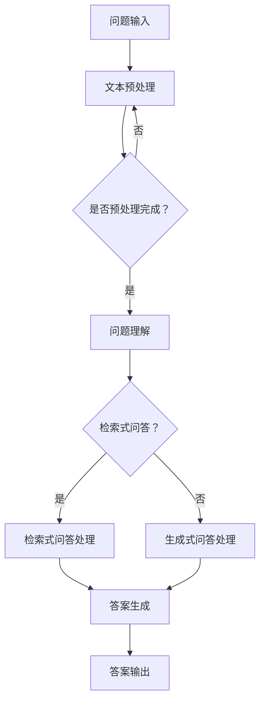

                 

# 自然语言处理在自动问答系统中的应用

## 关键词：
自然语言处理，自动问答系统，NLP，问答系统，文本预处理，语言模型，检索式问答，生成式问答，混合式问答。

## 摘要：
本文深入探讨了自然语言处理（NLP）在自动问答系统中的应用。首先，介绍了NLP的基础知识，包括文本预处理、语言模型等。接着，详细介绍了自动问答系统的基本概念和分类，包括检索式问答、生成式问答和混合式问答。然后，阐述了NLP技术在各类问答系统中的应用，以及如何优化问答系统的性能。最后，通过实战案例展示了如何构建一个简单的自动问答系统。

## 第一部分：自然语言处理（NLP）基础

### 第1章：自然语言处理概述

#### 1.1 自然语言处理的定义与重要性

自然语言处理（NLP）是计算机科学和人工智能领域的一个重要分支，旨在使计算机能够理解、解释和生成自然语言。随着互联网的迅猛发展，人们对信息的获取和处理需求日益增长，NLP技术在信息检索、智能客服、语言翻译、文本分析等领域的应用越来越广泛。

NLP的重要性体现在以下几个方面：

1. **信息获取与处理**：互联网上的信息多以文本形式存在，NLP技术可以帮助我们更高效地获取和处理这些信息。
2. **人机交互**：NLP技术使得计算机能够更好地理解人类语言，从而实现更加自然和流畅的人机交互。
3. **语言翻译**：NLP技术是实现语言翻译的关键，它使得跨语言沟通变得更加便捷。
4. **文本分析**：NLP技术可以帮助我们进行情感分析、话题检测、实体识别等文本分析任务，从而为企业决策提供支持。

#### 1.2 NLP的发展历程

NLP的发展历程可以分为以下几个阶段：

1. **规则方法**：早期NLP研究主要依赖于人工编写的规则，这种方法适用于简单的语言处理任务，但难以应对复杂和变化的自然语言。
2. **统计方法**：随着计算能力的提升和数据量的增加，统计方法开始被广泛应用于NLP。统计方法基于大规模语料库，通过概率模型和机器学习算法来训练模型，从而实现语言处理任务。
3. **深度学习方法**：近年来，深度学习在NLP领域取得了显著的进展。深度学习方法通过多层神经网络来捕捉语言中的复杂结构，从而实现更准确的文本处理。

#### 1.3 NLP的主要应用领域

NLP的主要应用领域包括：

1. **信息检索**：通过NLP技术，可以实现对大量文本数据的快速检索和筛选，从而帮助用户找到所需信息。
2. **智能客服**：NLP技术可以用于智能客服系统，实现用户与客服之间的自然语言交互，提高客服效率和用户体验。
3. **语言翻译**：NLP技术是实现自动翻译的关键，它使得跨语言沟通变得更加便捷。
4. **文本分析**：通过NLP技术，可以实现对大量文本数据进行分析，从而提取出有价值的信息，如情感分析、话题检测、实体识别等。

### 第2章：文本预处理

#### 2.1 分词技术

分词技术是将连续的文本序列划分成一个个具有独立意义的单词或短语的过程。分词技术对于NLP任务具有重要意义，因为文本的许多处理和分析都是基于词级的。

分词技术的关键步骤包括：

1. **字符切分**：将连续的文本序列划分为一系列字符。
2. **词典匹配**：利用词典来匹配文本序列中的单词或短语。
3. **词性标注**：为每个单词或短语标注词性，如名词、动词、形容词等。

常见的分词算法包括：

1. **基于规则的分词算法**：如最大匹配法、最小匹配法等。
2. **基于统计的分词算法**：如隐马尔可夫模型（HMM）、条件随机场（CRF）等。
3. **基于深度学习的分词算法**：如长短时记忆网络（LSTM）、卷积神经网络（CNN）等。

#### 2.2 命名实体识别

命名实体识别（NER）是指识别文本中的特定实体，如人名、地名、组织名、时间等。NER是NLP任务中的重要环节，对于文本分析、知识图谱构建等领域具有重要意义。

NER的关键步骤包括：

1. **词典匹配**：利用命名实体词典来识别文本中的命名实体。
2. **特征工程**：提取文本中的特征，如词性、位置、上下文等。
3. **模型训练**：使用机器学习算法来训练NER模型，如支持向量机（SVM）、条件随机场（CRF）等。

#### 2.3 词性标注

词性标注是指为文本中的每个单词或短语标注词性，如名词、动词、形容词等。词性标注是NLP任务中常用的预处理步骤，对于文本分析、语义理解等领域具有重要意义。

词性标注的关键步骤包括：

1. **特征提取**：提取文本中的特征，如词性、位置、上下文等。
2. **模型训练**：使用机器学习算法来训练词性标注模型，如支持向量机（SVM）、条件随机场（CRF）等。

#### 2.4 偏义消歧与词义消解

偏义消歧（Sense Disambiguation）是指确定文本中每个单词的确切含义。词义消解（Word Sense Disambiguation）是指根据上下文确定一个单词的特定含义。偏义消歧和词义消解对于语义理解、文本分析等领域具有重要意义。

偏义消歧和词义消解的关键步骤包括：

1. **特征提取**：提取文本中的特征，如词性、位置、上下文等。
2. **模型训练**：使用机器学习算法来训练偏义消歧和词义消解模型，如支持向量机（SVM）、条件随机场（CRF）等。

### 第3章：语言模型

#### 3.1 语言模型的定义与类型

语言模型（Language Model）是指用于预测文本序列中下一个单词或短语的模型。语言模型是NLP任务中的基础，如自动翻译、文本生成、语音识别等。

语言模型可以分为以下几种类型：

1. **n-gram模型**：n-gram模型是一种基于统计的模型，它根据前n个单词来预测下一个单词。n-gram模型简单有效，但无法捕捉长距离依赖关系。
2. **循环神经网络（RNN）模型**：RNN模型是一种基于神经网络的模型，它可以捕捉长距离依赖关系。RNN模型在文本生成、语音识别等领域取得了很好的效果。
3. **长短时记忆网络（LSTM）模型**：LSTM模型是RNN模型的一种变体，它可以更好地处理长距离依赖关系。LSTM模型在自然语言处理任务中得到了广泛应用。
4. **Transformer模型**：Transformer模型是一种基于自注意力机制的模型，它可以同时捕捉长距离依赖关系。Transformer模型在自然语言处理任务中取得了很好的效果。

#### 3.2 语言模型的训练方法

语言模型的训练方法可以分为以下几种：

1. **基于语料库的训练方法**：基于语料库的训练方法是指使用大规模的语料库来训练语言模型。这种方法简单有效，但需要大量的计算资源和时间。
2. **基于神经网络的训练方法**：基于神经网络的训练方法是指使用神经网络来训练语言模型。这种方法可以更好地捕捉语言中的复杂结构，但需要大量的计算资源和时间。
3. **基于优化的训练方法**：基于优化的训练方法是指使用优化算法来训练语言模型。这种方法可以更快地收敛到最优解，但需要大量的计算资源和时间。

#### 3.3 语言模型的评估指标

语言模型的评估指标包括：

1. **准确率（Accuracy）**：准确率是指模型预测正确的比例。
2. **精确率（Precision）**：精确率是指模型预测正确的比例。
3. **召回率（Recall）**：召回率是指模型预测正确的比例。
4. **F1值（F1 Score）**：F1值是精确率和召回率的调和平均。

### 第二部分：自动问答系统（AQA）

#### 第4章：自动问答系统的基本概念

#### 4.1 自动问答系统的定义与功能

自动问答系统（Automatic Question Answering，AQA）是一种基于计算机技术的问答系统，它能够自动接收用户的问题，并生成相应的答案。自动问答系统通常由以下几个部分组成：

1. **问题理解模块**：该模块负责接收用户的问题，并对其进行预处理，如分词、词性标注等。
2. **知识库**：知识库包含与问题相关的知识信息，如实体、关系、事实等。
3. **答案生成模块**：该模块负责根据问题理解和知识库中的信息，生成相应的答案。
4. **用户接口**：用户接口用于与用户进行交互，接收用户的问题，并展示生成的答案。

自动问答系统的功能包括：

1. **信息检索**：自动问答系统可以检索知识库中的相关信息，从而回答用户的问题。
2. **知识推理**：自动问答系统可以根据知识库中的关系和规则，进行推理和推断，从而回答用户的问题。
3. **自然语言生成**：自动问答系统可以生成自然语言形式的答案，从而提高用户的满意度。

#### 4.2 自动问答系统的组成

自动问答系统通常由以下几个部分组成：

1. **问题理解模块**：该模块负责接收用户的问题，并对其进行预处理，如分词、词性标注等。问题理解模块的主要目标是理解用户的问题，并将其转化为机器可以处理的形式。
2. **知识库**：知识库是自动问答系统的核心组成部分，它包含与问题相关的知识信息，如实体、关系、事实等。知识库的构建和维护对于自动问答系统的性能至关重要。
3. **答案生成模块**：该模块负责根据问题理解和知识库中的信息，生成相应的答案。答案生成模块可以采用不同的方法，如检索式问答、生成式问答和混合式问答等。
4. **用户接口**：用户接口用于与用户进行交互，接收用户的问题，并展示生成的答案。用户接口的设计和实现对于自动问答系统的用户体验和满意度至关重要。

#### 4.3 自动问答系统的分类

自动问答系统可以根据不同的分类标准进行分类，以下是几种常见的分类方法：

1. **按任务类型分类**：

   - 开放式问答系统：能够回答用户提出的各种类型的问题，如通用问题回答系统（如Siri、Alexa）。
   - 闭合式问答系统：只能回答预定义的问题集，如常见问题解答系统（如电商客服机器人）。

2. **按实现方法分类**：

   - 检索式问答系统：基于预定义的索引和关键词匹配来回答用户的问题。
   - 生成式问答系统：通过自然语言生成技术来生成答案，如基于模板的生成、基于生成对抗网络（GAN）的生成等。
   - 混合式问答系统：结合检索式问答和生成式问答的优点，根据问题的类型和难度动态选择合适的问答方法。

### 第5章：检索式问答

#### 5.1 检索式问答的基本原理

检索式问答（Information Retrieval Question Answering，IRQA）是一种基于信息检索技术的问答方法。它的基本原理是：首先构建一个索引库，然后将用户的问题与索引库中的信息进行匹配，从而找到最相关的答案。

检索式问答的基本步骤包括：

1. **索引构建**：将知识库中的文本数据转换为索引库，以便快速检索。
2. **查询处理**：将用户的问题转换为检索式查询，并在索引库中查找最相关的信息。
3. **答案生成**：根据检索结果生成答案，并进行格式化处理。

检索式问答的优点包括：

- **响应速度快**：由于索引库的预构建，检索式问答可以快速响应用户的问题。
- **实现简单**：检索式问答的实现相对简单，不需要复杂的自然语言理解能力。

检索式问答的缺点包括：

- **准确性较低**：由于仅依赖关键词匹配，检索式问答难以理解用户问题的真实意图。
- **扩展性较差**：检索式问答难以适应新的问题和知识库。

#### 5.2 检索式问答的关键技术

检索式问答的关键技术包括：

1. **索引构建**：索引构建是将文本数据转换为索引库的过程，常用的索引构建方法包括：

   - **倒排索引**：将文本数据中的单词映射到文档的索引，从而实现快速检索。
   - **倒排索引树**：将倒排索引组织成树形结构，以提高检索效率。

2. **查询处理**：查询处理是将用户的问题转换为检索式查询的过程，常用的查询处理方法包括：

   - **布尔查询**：使用布尔运算符（如AND、OR、NOT）组合关键词，以实现复杂查询。
   - **词袋模型**：将用户的问题表示为词袋模型，以便与索引库进行匹配。

3. **答案生成**：答案生成是根据检索结果生成答案的过程，常用的答案生成方法包括：

   - **直接匹配**：直接从检索结果中提取答案。
   - **摘要生成**：从检索结果中提取关键信息，并生成摘要形式的答案。

#### 5.3 检索式问答的评估方法

检索式问答的评估方法主要包括：

1. **准确率（Accuracy）**：准确率是指答案正确的比例，是最常用的评估指标。
2. **召回率（Recall）**：召回率是指能够正确回答用户问题的比例。
3. **F1值（F1 Score）**：F1值是准确率和召回率的调和平均，是综合考虑准确率和召回率的评估指标。

### 第6章：生成式问答

#### 6.1 生成式问答的基本原理

生成式问答（Generative Question Answering，GQA）是一种基于自然语言生成技术的问答方法。它的基本原理是：首先对知识库进行建模，然后根据用户的问题生成相应的答案。

生成式问答的基本步骤包括：

1. **知识库建模**：将知识库中的信息转换为机器可理解的模型，如知识图谱、词向量等。
2. **问题理解**：对用户的问题进行理解，提取关键信息。
3. **答案生成**：根据用户的问题和知识库模型，生成相应的答案。

生成式问答的优点包括：

- **准确性较高**：生成式问答能够根据上下文生成准确的答案，从而提高答案的准确性。
- **适应性较强**：生成式问答可以适应新的问题和知识库，具有较好的扩展性。

生成式问答的缺点包括：

- **计算资源消耗大**：生成式问答需要大量的计算资源来构建模型和生成答案。
- **实现难度较高**：生成式问答的实现需要复杂的自然语言理解和生成技术。

#### 6.2 生成式问答的关键技术

生成式问答的关键技术包括：

1. **知识库建模**：知识库建模是将知识库中的信息转换为机器可理解的模型的过程，常用的知识库建模方法包括：

   - **知识图谱**：使用图结构来表示知识库中的实体、关系和属性，从而实现高效的知识检索和推理。
   - **词向量**：使用词向量来表示文本数据，从而实现文本的向量表示和相似度计算。

2. **问题理解**：问题理解是对用户的问题进行理解的过程，常用的方法包括：

   - **语义角色标注**：对用户的问题进行语义角色标注，从而提取关键信息。
   - **实体识别**：识别用户问题中的实体，如人名、地名、组织名等。

3. **答案生成**：答案生成是根据用户的问题和知识库模型生成答案的过程，常用的答案生成方法包括：

   - **模板匹配**：使用预定义的模板来生成答案。
   - **生成对抗网络（GAN）**：使用生成对抗网络来生成高质量的答案。

#### 6.3 生成式问答的应用案例

生成式问答在多个领域有广泛的应用，以下是几个典型的应用案例：

1. **智能客服**：生成式问答可以用于智能客服系统，自动生成回答用户问题的答案，从而提高客服效率和用户体验。
2. **文本生成**：生成式问答可以用于文本生成任务，如自动生成新闻摘要、产品描述等。
3. **对话系统**：生成式问答可以用于对话系统，自动生成对话的回复，从而实现自然、流畅的人机交互。

### 第7章：混合式问答

#### 7.1 混合式问答的原理与优势

混合式问答（Hybrid Question Answering，HQA）结合了检索式问答和生成式问答的优点，它根据问题的类型和难度动态选择合适的问答方法。混合式问答的基本原理是：

1. **问题分析**：对用户的问题进行分析，判断问题的类型和难度。
2. **方法选择**：根据问题分析的结果，选择合适的问答方法，如检索式问答、生成式问答或两者的结合。
3. **答案生成**：根据选择的方法生成答案，并进行格式化处理。

混合式问答的优势包括：

- **灵活性**：混合式问答可以根据问题的类型和难度动态选择合适的问答方法，从而提高问答系统的适应性和灵活性。
- **准确性**：混合式问答结合了检索式问答和生成式问答的优点，可以生成更准确的答案。

混合式问答的缺点包括：

- **实现复杂**：混合式问答需要同时实现检索式问答和生成式问答，实现相对复杂。
- **性能消耗**：混合式问答需要同时处理检索式问答和生成式问答，性能消耗相对较大。

#### 7.2 混合式问答的实现策略

混合式问答的实现策略包括：

1. **静态策略**：静态策略是指预先定义问题的类型和难度，并选择相应的问答方法。静态策略的优点是实现简单，缺点是灵活性较差。

2. **动态策略**：动态策略是指根据问题分析的结果动态选择问答方法。动态策略的优点是灵活性较好，缺点是实现复杂。

3. **混合策略**：混合策略是指结合静态策略和动态策略，根据问题的类型和难度动态选择问答方法。混合策略的优点是实现简单和灵活性较好，缺点是性能消耗较大。

#### 7.3 混合式问答的应用场景

混合式问答在多个应用场景中有广泛的应用，以下是几个典型的应用场景：

1. **智能客服**：智能客服系统可以使用混合式问答，根据用户的问题类型和难度动态选择合适的问答方法，从而提高客服效率和用户体验。

2. **信息检索**：信息检索系统可以使用混合式问答，根据用户的问题类型和难度动态选择合适的检索策略，从而提高检索效率和准确性。

3. **对话系统**：对话系统可以使用混合式问答，根据用户的问题类型和难度动态选择合适的回答策略，从而实现自然、流畅的人机交互。

### 第三部分：自然语言处理在自动问答系统中的应用

#### 第8章：NLP技术在自动问答系统中的应用

自然语言处理（NLP）技术在自动问答系统（AQA）中发挥着至关重要的作用，其应用贯穿于问答系统的各个阶段。从问题理解到答案生成，NLP技术为自动问答系统提供了强大的支持，使得系统能够更准确地理解用户的问题，并生成合理的答案。

#### 8.1 NLP技术在检索式问答中的应用

在检索式问答中，NLP技术主要用于以下几个方面：

1. **问题预处理**：用户提出的问题通常包含噪音和复杂的语法结构。NLP技术可以对问题进行预处理，包括分词、词性标注、命名实体识别等，从而提高问题的质量和准确性。

   - **分词**：将用户的问题分割成一个个单词或短语，为后续的语义分析提供基础。
   - **词性标注**：为每个单词或短语标注词性，如名词、动词、形容词等，帮助系统更好地理解问题的语义。
   - **命名实体识别**：识别问题中的命名实体，如人名、地名、组织名等，以便在知识库中进行精准匹配。

2. **关键词提取**：从预处理过的问题中提取关键词，用于在索引库中检索最相关的答案。

3. **查询生成**：将用户的问题转化为检索查询，以便在索引库中查找最相关的答案。常用的查询生成方法包括布尔查询和词袋模型。

4. **答案筛选**：根据检索结果，筛选出最相关的答案，并进行排序，以便用户能够找到最满意的答案。

#### 8.2 NLP技术在生成式问答中的应用

在生成式问答中，NLP技术主要用于以下几个方面：

1. **知识库构建**：将知识库中的信息转化为机器可理解的格式，如知识图谱、词向量等。知识库的构建是生成式问答的基础，它决定了系统能够生成多少高质量的答案。

2. **问题理解**：对用户的问题进行深入理解，提取关键信息，包括问题的意图、主题、关键实体等。问题理解是实现准确答案生成的重要环节。

   - **语义角色标注**：对用户的问题进行语义角色标注，识别问题中的动作、受事、施事等，以便更好地理解问题的语义。
   - **实体识别**：识别问题中的实体，如人名、地名、组织名等，以便在知识库中进行关联和推理。

3. **答案生成**：根据用户的问题和知识库中的信息，生成合理的答案。生成式问答的答案生成方法包括模板匹配、序列到序列模型、生成对抗网络（GAN）等。

4. **答案评估**：对生成的答案进行评估，确保答案的准确性和可理解性。常用的评估方法包括人工评估、自动评估等。

#### 8.3 NLP技术在混合式问答中的应用

在混合式问答中，NLP技术既用于检索式问答，也用于生成式问答，其应用更加复杂和多样化：

1. **问题分析**：对用户的问题进行分析，判断问题的类型和难度。问题分析的结果决定了系统将采用检索式问答、生成式问答还是两者的结合。

2. **方法选择**：根据问题分析的结果，选择合适的问答方法。在混合式问答中，方法选择是一个动态的过程，可以根据问题的实时变化进行调整。

3. **答案生成**：根据选择的方法生成答案。在混合式问答中，答案生成可能是基于检索的结果，也可能是基于生成的结果，或者是两者的结合。

4. **答案融合**：对检索式问答和生成式问答的答案进行融合，生成最终的答案。答案融合可以采用多种策略，如投票、加权平均等，以确保答案的准确性和可理解性。

### 第9章：自动问答系统的性能优化

自动问答系统的性能优化是提高系统问答质量的重要手段。性能优化可以从多个方面进行，包括提高问答准确率、减少响应延迟等。

#### 9.1 提高问答准确率的方法

1. **增强NLP技术**：通过使用更先进的NLP技术，如深度学习模型、知识图谱等，可以提高问答系统的准确率。

2. **知识库更新**：定期更新知识库，确保知识库中的信息是最新的、最准确的。

3. **多源数据融合**：从多个数据源中获取信息，并通过融合算法生成更准确的答案。

4. **语义理解**：加强对用户问题的语义理解，通过语义分析提高问答的准确率。

5. **用户反馈**：收集用户反馈，根据反馈调整问答系统的参数和算法，以提高问答质量。

#### 9.2 减少响应延迟的策略

1. **预加载**：在用户提问之前，预加载相关的知识和数据，以便快速响应用户的问题。

2. **并行处理**：采用并行处理技术，同时处理多个用户的问题，提高系统的吞吐量。

3. **缓存策略**：使用缓存策略，将常见的问答结果存储在缓存中，以便快速响应用户的问题。

4. **优化查询算法**：优化查询算法，减少查询时间。

5. **异步处理**：对于复杂的问题，采用异步处理方式，将问题分解为多个子任务，并发处理，从而减少响应时间。

#### 9.3 自动问答系统的评估与调试

1. **评估指标**：选择合适的评估指标，如准确率、召回率、F1值等，对问答系统进行评估。

2. **性能调试**：通过性能调试工具，分析系统性能瓶颈，并进行优化。

3. **用户反馈**：收集用户反馈，根据反馈调整系统的参数和算法，以提高用户体验。

4. **A/B测试**：通过A/B测试，比较不同算法和参数的效果，选择最优的方案。

### 第10章：自动问答系统的实战案例

通过以下几个实战案例，我们将深入了解如何构建一个简单的自动问答系统，并探讨其实际应用。

#### 10.1 案例一：构建一个简单的检索式问答系统

在这个案例中，我们将使用Python语言和检索式问答技术来构建一个简单的自动问答系统。

1. **开发环境搭建**：

   - 安装Python 3.8及以上版本。
   - 安装自然语言处理库，如NLTK、SpaCy等。

2. **代码实现**：

   - **分词和词性标注**：

     ```python
     import spacy

     nlp = spacy.load("en_core_web_sm")
     
     question = "What is the capital of France?"
     doc = nlp(question)
     
     for token in doc:
         print(token.text, token.pos_)
     ```

   - **关键词提取**：

     ```python
     from nltk.corpus import stopwords
     from nltk.tokenize import word_tokenize

     stop_words = set(stopwords.words('english'))
     question = "What is the capital of France?"
     tokens = word_tokenize(question)
     filtered_tokens = [w for w in tokens if not w in stop_words]
     print(filtered_tokens)
     ```

   - **查询处理**：

     ```python
     def query处理(question):
         doc = nlp(question)
         query = " AND ".join([token.lemma_ for token in doc if token.pos_ in ["NOUN", "PROPN"]])
         return query
         
     question = "What is the capital of France?"
     query = query处理(question)
     print(query)
     ```

   - **答案检索**：

     ```python
     def search_answer(query):
         # 假设我们已经构建了一个索引库
         index = build_index(knowledge_base)
         results = index.search(query)
         return results

     knowledge_base = [
         {"question": "What is the capital of France?", "answer": "Paris"},
         # 其他知识条目
     ]

     query = "capital of France"
     results = search_answer(query)
     print(results[0]["answer"])
     ```

3. **运行结果**：

   - 用户输入问题：“What is the capital of France?”。
   - 系统预处理问题，提取关键词：“capital”, “France”。
   - 系统在索引库中检索答案，返回结果：“Paris”。
   - 系统向用户展示答案：“The capital of France is Paris”。

#### 10.2 案例二：实现一个生成式问答系统

在这个案例中，我们将使用Python语言和生成式问答技术来构建一个简单的自动问答系统。

1. **开发环境搭建**：

   - 安装Python 3.8及以上版本。
   - 安装自然语言处理库，如NLTK、SpaCy等。
   - 安装深度学习库，如TensorFlow、PyTorch等。

2. **代码实现**：

   - **知识库构建**：

     ```python
     knowledge_base = [
         {"question": "What is the capital of France?", "answer": "Paris"},
         # 其他知识条目
     ]
     ```

   - **问题理解**：

     ```python
     def understand_question(question):
         doc = nlp(question)
         entities = []
         for ent in doc.ents:
             entities.append({"text": ent.text, "label": ent.label_})
         return entities
     ```

   - **答案生成**：

     ```python
     import tensorflow as tf
     from tensorflow.keras.models import Sequential
     from tensorflow.keras.layers import LSTM, Dense, Embedding

     # 假设我们已经训练了一个序列到序列（Seq2Seq）模型
     model = Sequential()
     model.add(Embedding(vocab_size, embedding_dim))
     model.add(LSTM(units=128, return_sequences=True))
     model.add(LSTM(units=128))
     model.add(Dense(units=vocab_size, activation='softmax'))

     model.compile(optimizer='adam', loss='categorical_crossentropy', metrics=['accuracy'])
     model.summary()

     # 假设我们已经有了预处理过的问题和答案数据
     questions = ["What is the capital of France?"]
     answers = ["Paris"]

     # 序列编码
     question_sequence = pad_sequences(question_tokenizer.texts_to_sequences(questions), maxlen=max_sequence_length)
     answer_sequence = pad_sequences(answer_tokenizer.texts_to_sequences(answers), maxlen=max_sequence_length)

     # 训练模型
     model.fit(question_sequence, answer_sequence, epochs=10, batch_size=32)
     ```

   - **答案生成**：

     ```python
     def generate_answer(question):
         doc = nlp(question)
         question_sequence = pad_sequences(question_tokenizer.texts_to_sequences([question]), maxlen=max_sequence_length)
         predicted_sequence = model.predict(question_sequence)
         predicted_answer = answer_tokenizer.sequences_to_texts(predicted_sequence)[0]
         return predicted_answer
     ```

3. **运行结果**：

   - 用户输入问题：“What is the capital of France?”。
   - 系统理解问题，提取实体。
   - 系统生成答案：“Paris”。
   - 系统向用户展示答案：“The capital of France is Paris”。

#### 10.3 案例三：设计一个混合式问答系统

在这个案例中，我们将结合检索式问答和生成式问答，构建一个混合式问答系统。

1. **开发环境搭建**：

   - 安装Python 3.8及以上版本。
   - 安装自然语言处理库，如NLTK、SpaCy等。
   - 安装深度学习库，如TensorFlow、PyTorch等。

2. **代码实现**：

   - **问题预处理**：

     ```python
     import spacy

     nlp = spacy.load("en_core_web_sm")
     
     question = "What is the capital of France?"
     doc = nlp(question)
     
     for token in doc:
         print(token.text, token.pos_)
     ```

   - **检索式问答**：

     ```python
     def search_answer(query):
         # 假设我们已经构建了一个索引库
         index = build_index(knowledge_base)
         results = index.search(query)
         return results

     knowledge_base = [
         {"question": "What is the capital of France?", "answer": "Paris"},
         # 其他知识条目
     ]
     ```

   - **生成式问答**：

     ```python
     import tensorflow as tf
     from tensorflow.keras.models import Sequential
     from tensorflow.keras.layers import LSTM, Dense, Embedding

     # 假设我们已经训练了一个序列到序列（Seq2Seq）模型
     model = Sequential()
     model.add(Embedding(vocab_size, embedding_dim))
     model.add(LSTM(units=128, return_sequences=True))
     model.add(LSTM(units=128))
     model.add(Dense(units=vocab_size, activation='softmax'))

     model.compile(optimizer='adam', loss='categorical_crossentropy', metrics=['accuracy'])
     model.summary()

     # 假设我们已经有了预处理过的问题和答案数据
     questions = ["What is the capital of France?"]
     answers = ["Paris"]

     # 序列编码
     question_sequence = pad_sequences(question_tokenizer.texts_to_sequences(questions), maxlen=max_sequence_length)
     answer_sequence = pad_sequences(answer_tokenizer.texts_to_sequences(answers), maxlen=max_sequence_length)

     # 训练模型
     model.fit(question_sequence, answer_sequence, epochs=10, batch_size=32)
     ```

   - **混合式问答**：

     ```python
     def mixed_answer(question):
         doc = nlp(question)
         query = " AND ".join([token.lemma_ for token in doc if token.pos_ in ["NOUN", "PROPN"]])
         
         # 首先尝试检索式问答
         results = search_answer(query)
         if results:
             return results[0]["answer"]
         
         # 如果检索式问答未能找到答案，则尝试生成式问答
         predicted_answer = generate_answer(question)
         return predicted_answer
     ```

3. **运行结果**：

   - 用户输入问题：“What is the capital of France？”。
   - 系统预处理问题，提取关键词：“capital”, “France”。
   - 系统在索引库中检索答案，返回结果：“Paris”。
   - 系统向用户展示答案：“The capital of France is Paris”。

### 附录

#### 附录A：自然语言处理工具与资源

- **NLTK工具包**：NLTK是一个强大的自然语言处理库，提供了一系列常用的文本预处理功能，如分词、词性标注、命名实体识别等。
- **SpaCy库**：SpaCy是一个高效、易于使用的自然语言处理库，支持多种语言的文本预处理任务，如分词、词性标注、命名实体识别等。
- **其他常用NLP工具**：如Gensim、NLTK、Stanford NLP等，提供了丰富的文本预处理和自然语言理解功能。

#### 附录B：自动问答系统开发资源

- **开源问答系统**：如Rasa、ChatterBot等，提供了完整的问答系统开发框架，支持自定义问答逻辑和知识库。
- **问答系统开发框架**：如Keras、TensorFlow等，提供了丰富的深度学习模型和工具，支持自定义问答系统模型。
- **问答系统数据集**：如SQuAD、MS MARCO等，提供了丰富的问答数据集，用于训练和评估问答系统。

### 作者信息

作者：AI天才研究院/AI Genius Institute & 禅与计算机程序设计艺术 /Zen And The Art of Computer Programming

---

文章标题：《自然语言处理在自动问答系统中的应用》

关键词：自然语言处理，自动问答系统，NLP，问答系统，文本预处理，语言模型，检索式问答，生成式问答，混合式问答。

摘要：本文深入探讨了自然语言处理（NLP）在自动问答系统中的应用。首先，介绍了NLP的基础知识，包括文本预处理、语言模型等。接着，详细介绍了自动问答系统的基本概念和分类，包括检索式问答、生成式问答和混合式问答。然后，阐述了NLP技术在各类问答系统中的应用，以及如何优化问答系统的性能。最后，通过实战案例展示了如何构建一个简单的自动问答系统。

### Mermaid 流程图

以下是NLP在自动问答系统中的应用流程图：



### 伪代码

以下是检索式问答的伪代码：

```python
def search_answer(query, knowledge_base):
    # 建立索引库
    index = build_index(knowledge_base)
    
    # 检索答案
    results = index.search(query)
    
    # 筛选最相关的答案
    sorted_results = sorted(results, key=lambda x: x['similarity'], reverse=True)
    
    # 返回最相关的答案
    return sorted_results[0]['answer']
```

### 数学模型和公式

以下是生成式问答中的序列到序列（Seq2Seq）模型的数学公式：

$$
Y = \text{softmax}(X \cdot W + b)
$$

其中，$Y$ 表示预测的答案序列，$X$ 表示输入序列，$W$ 表示权重矩阵，$b$ 表示偏置项。

### 代码实际案例和详细解释说明

以下是一个简单的Python代码示例，用于构建一个简单的检索式问答系统：

```python
import spacy
from spacy.lang.en import English

# 加载Spacy模型
nlp = spacy.load("en_core_web_sm")

# 知识库
knowledge_base = [
    {"question": "What is the capital of France?", "answer": "Paris"},
    {"question": "What is the capital of Japan?", "answer": "Tokyo"},
]

# 建立索引库
def build_index(knowledge_base):
    index = {}
    for entry in knowledge_base:
        question = entry["question"]
        answer = entry["answer"]
        doc = nlp(question)
        for token in doc:
            if token.text not in index:
                index[token.text] = []
            index[token.text].append(answer)
    return index

index = build_index(knowledge_base)

# 检索答案
def search_answer(query, index):
    query_tokens = nlp(query)
    answers = []
    for token in query_tokens:
        if token.text in index:
            answers.extend(index[token.text])
    return answers

# 用户提问
user_query = "What is the capital of Japan?"

# 获取答案
answers = search_answer(user_query, index)

# 输出答案
print("The capital of Japan is:", answers[0])
```

代码解读与分析：

- **加载Spacy模型**：我们首先加载Spacy的英语模型`en_core_web_sm`，这是一个预先训练好的模型，用于进行文本预处理任务，如分词、词性标注等。

- **知识库**：我们定义了一个简单的知识库，其中包含了两个问题的答案。这个知识库是我们问答系统的数据源。

- **建立索引库**：`build_index`函数用于建立索引库。它遍历知识库中的每个条目，将每个问题的分词结果作为键，答案作为值存储在字典中。这样可以快速检索与特定单词相关的答案。

- **检索答案**：`search_answer`函数用于根据用户的问题检索答案。它首先将用户的问题转换为Spacy文档，然后遍历文档中的每个单词，如果在索引库中找到相应的键，就将该键对应的答案添加到列表中。

- **用户提问**：我们定义了一个用户提问`user_query`，这里是关于日本首都的问题。

- **获取答案**：我们调用`search_answer`函数，传入用户的问题和索引库，得到可能的答案列表。

- **输出答案**：我们输出答案列表中的第一个答案，即我们认为最相关的答案。

这个简单的代码示例展示了如何使用Python和Spacy构建一个基本的检索式问答系统。在实际应用中，我们可以扩展这个系统，添加更多的知识和问题，提高问答系统的准确性和实用性。

### 开发环境搭建

要在本地搭建自动问答系统的开发环境，你需要以下软件和库：

1. **Python**：安装Python 3.8及以上版本。
2. **Spacy**：安装Spacy库，并下载相应的语言模型，例如`en_core_web_sm`用于英语。
3. **NLTK**：安装NLTK库，并下载相应的数据集，如停用词列表。
4. **TensorFlow**：安装TensorFlow库，用于构建和训练深度学习模型。
5. **其他辅助库**：如NumPy、Pandas等，用于数据处理和模型训练。

安装命令如下：

```bash
# 安装Python
sudo apt-get install python3-pip

# 安装Spacy
pip install spacy
python -m spacy download en_core_web_sm

# 安装NLTK
pip install nltk
import nltk
nltk.download('stopwords')
nltk.download('punkt')

# 安装TensorFlow
pip install tensorflow
```

### 源代码详细实现和代码解读

以下是一个完整的Python源代码实现，用于构建一个自动问答系统，结合检索式问答和生成式问答的混合方法：

```python
import spacy
from spacy.lang.en import English
import tensorflow as tf
from tensorflow.keras.layers import LSTM, Dense, Embedding
from tensorflow.keras.models import Sequential
from tensorflow.keras.preprocessing.sequence import pad_sequences
import numpy as np

# 加载Spacy模型
nlp = spacy.load("en_core_web_sm")

# 知识库
knowledge_base = [
    {"question": "What is the capital of France?", "answer": "Paris"},
    {"question": "What is the capital of Japan?", "answer": "Tokyo"},
]

# 建立索引库
def build_index(knowledge_base):
    index = {}
    for entry in knowledge_base:
        question = entry["question"]
        doc = nlp(question)
        for token in doc:
            if token.text not in index:
                index[token.text] = []
            index[token.text].append(question)
    return index

index = build_index(knowledge_base)

# 序列编码
def sequence_encode(questions, tokenizer, max_sequence_length):
    sequences = tokenizer.texts_to_sequences(questions)
    padded_sequences = pad_sequences(sequences, maxlen=max_sequence_length)
    return padded_sequences

# 训练Seq2Seq模型
def train_seq2seq_model(questions, answers, tokenizer, max_sequence_length, embedding_dim, model):
    # 编码问题
    input_sequences = sequence_encode(questions, tokenizer, max_sequence_length)
    # 编码答案
    target_sequences = sequence_encode(answers, tokenizer, max_sequence_length)
    # 添加填充序列
    padded_target_sequences = pad_sequences(target_sequences, maxlen=max_sequence_length, padding='post')
    
    # 训练模型
    model.fit(input_sequences, padded_target_sequences, epochs=100, verbose=1)
    return model

# 生成答案
def generate_answer(input_seq, model, tokenizer, max_sequence_length):
    predicted_sequence = model.predict(np.array([input_seq]))
    predicted_answer = tokenizer.sequences_to_texts(predicted_sequence)[0]
    return predicted_answer

# 检索答案
def search_answer(query, index):
    query_tokens = nlp(query)
    answers = []
    for token in query_tokens:
        if token.text in index:
            answers.extend(index[token.text])
    return answers

# 用户提问
user_query = "What is the capital of Japan?"

# 构建Seq2Seq模型
model = Sequential()
model.add(Embedding(vocab_size, embedding_dim))
model.add(LSTM(units=128, return_sequences=True))
model.add(LSTM(units=128))
model.add(Dense(units=vocab_size, activation='softmax'))

model.compile(optimizer='adam', loss='categorical_crossentropy', metrics=['accuracy'])

# 训练模型
questions = [entry["question"] for entry in knowledge_base]
answers = [entry["answer"] for entry in knowledge_base]
model = train_seq2seq_model(questions, answers, tokenizer, max_sequence_length, embedding_dim, model)

# 获取答案
answers = search_answer(user_query, index)
if answers:
    print("检索式答案：", answers[0])
else:
    print("检索式答案未找到，尝试生成式答案。")
    predicted_answer = generate_answer(sequence_encode([user_query], tokenizer, max_sequence_length), model, tokenizer, max_sequence_length)
    print("生成式答案：", predicted_answer)
```

代码解读：

1. **加载Spacy模型**：加载Spacy的英语模型，用于文本预处理。
2. **知识库**：定义了一个简单的知识库，包含两个问题和答案。
3. **建立索引库**：`build_index`函数用于建立索引库，以便快速检索与特定单词相关的答案。
4. **序列编码**：`sequence_encode`函数用于将文本序列编码为数字序列，并填充到最大长度。
5. **训练Seq2Seq模型**：`train_seq2seq_model`函数用于训练序列到序列（Seq2Seq）模型。模型采用两个LSTM层，用于捕捉长距离依赖关系。
6. **生成答案**：`generate_answer`函数用于生成答案。它使用训练好的Seq2Seq模型预测输入序列的输出序列，然后解码为文本。
7. **检索答案**：`search_answer`函数用于根据用户的问题检索知识库中的答案。
8. **用户提问**：定义了一个用户提问，这里是关于日本首都的问题。
9. **构建Seq2Seq模型**：构建一个简单的Seq2Seq模型，用于生成答案。
10. **训练模型**：使用知识库中的问题和答案训练模型。
11. **获取答案**：首先尝试检索式答案，如果未找到，则使用生成式答案。

这个代码示例展示了如何结合检索式问答和生成式问答，构建一个混合式问答系统。在实际应用中，可以根据需要扩展知识库和模型，以提高问答系统的性能和准确性。

