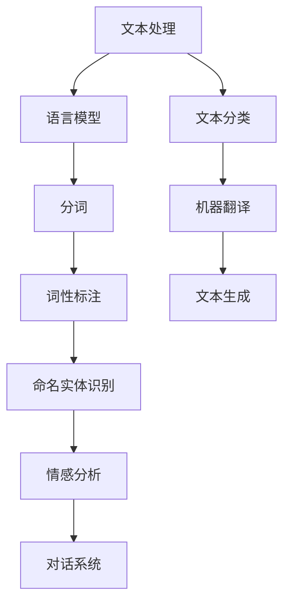

                 

### 《自然语言处理在舆情分析中的应用》

关键词：自然语言处理、舆情分析、情感分析、文本预处理、机器学习、数据采集

摘要：本文旨在探讨自然语言处理（NLP）在舆情分析中的应用，通过深入解析自然语言处理的基础概念、舆情分析技术以及具体应用案例，阐述如何利用NLP技术进行舆情监测、趋势分析和情感极性分析。文章还包括数学模型、算法原理讲解以及社交媒体舆情分析实践，为相关领域的研究者和从业者提供实用参考。

## 目录

#### 第一部分：自然语言处理基础

##### 第1章：自然语言处理简介

- 1.1 自然语言处理的基本概念

- 1.2 自然语言处理的挑战和机遇

- 1.3 自然语言处理的经典任务

##### 第2章：文本预处理

- 2.1 数据清洗与预处理

- 2.2 词向量表示

- 2.3 偏差修正与情感分析

##### 第3章：情感分析算法

- 3.1 情感分析的基本概念

- 3.2 基于规则的方法

- 3.3 基于机器学习方法

#### 第二部分：舆情分析技术

##### 第4章：舆情数据采集与处理

- 4.1 舆情数据来源

- 4.2 数据采集方法

- 4.3 数据预处理技术

##### 第5章：舆情趋势分析

- 5.1 舆情趋势分析概述

- 5.2 时间序列分析

- 5.3 关键词提取与跟踪

##### 第6章：情感极性分析

- 6.1 情感极性分析概述

- 6.2 基于词典的方法

- 6.3 基于机器学习方法

#### 第三部分：舆情分析应用案例

##### 第7章：社交媒体舆情分析

- 7.1 社交媒体概述

- 7.2 社交媒体数据采集与处理

- 7.3 社交媒体舆情分析实践

##### 第8章：企业舆情监测与应对

- 8.1 企业舆情监测的重要性

- 8.2 企业舆情监测流程

- 8.3 企业舆情应对策略

##### 第9章：舆情分析技术在政府决策中的应用

- 9.1 政府决策与舆情分析

- 9.2 舆情分析在政策制定中的应用

- 9.3 舆情分析在公共安全中的应用

#### 附录

##### 附录A：自然语言处理与舆情分析常用工具与资源

- A.1 自然语言处理工具

- A.2 舆情分析平台

- A.3 开源库与框架

- A.4 学术资源与论文推荐

## 核心概念与联系

自然语言处理（NLP）和舆情分析是两个紧密相关的领域。自然语言处理是计算机科学和人工智能领域的一个分支，旨在使计算机能够理解、解释和生成人类语言。舆情分析则是一种应用自然语言处理技术的方法，用于分析公众对特定话题、事件或品牌的观点和情感。


### 自然语言处理基础

#### 第1章：自然语言处理简介

##### 1.1 自然语言处理的基本概念

自然语言处理（NLP）是人工智能领域的一个重要分支，旨在使计算机能够理解和处理人类语言。NLP的核心任务是使计算机能够执行各种与语言相关的任务，如文本分析、语言翻译、语音识别、情感分析等。

自然语言处理的基本概念包括：

- 语言模型（Language Model）：用于生成文本的概率分布。

- 分词（Tokenization）：将文本分割成词或其他有意义的标记。

- 词性标注（Part-of-speech Tagging）：为文本中的每个词分配词性（如名词、动词等）。

- 命名实体识别（Named Entity Recognition, NER）：识别文本中的命名实体（如人名、地名、组织名等）。

- 情感分析（Sentiment Analysis）：分析文本中的情感倾向。

##### 1.2 自然语言处理的挑战和机遇

自然语言处理面临的挑战包括：

- 语言复杂性：自然语言具有丰富的语法、语义和上下文信息，使得计算机难以理解。

- 多样性：自然语言包含大量的方言、俚语、隐喻和非标准语法，增加了处理的复杂性。

- 语境依赖性：语义理解往往依赖于上下文，这使得算法需要具备强大的上下文理解能力。

然而，自然语言处理也面临着许多机遇：

- 大数据：互联网的普及使得大量的文本数据可用，为NLP研究提供了丰富的资源。

- 机器学习：深度学习等机器学习技术的快速发展，为NLP任务提供了强大的工具。

- 应用场景：自然语言处理在聊天机器人、智能客服、文本分析等领域的应用需求不断增长。

##### 1.3 自然语言处理的经典任务

自然语言处理的经典任务包括：

- 文本分类（Text Classification）：将文本分配到预定义的类别中。

- 机器翻译（Machine Translation）：将一种语言的文本翻译成另一种语言。

- 命名实体识别（Named Entity Recognition, NER）：识别文本中的命名实体。

- 情感分析（Sentiment Analysis）：确定文本表达的情感倾向。

- 对话系统（Dialogue Systems）：使计算机能够与人类进行自然语言交互。

### Mermaid 流程图



### 核心概念与联系

自然语言处理（NLP）与舆情分析的关系可以从以下几个方面来理解：

1. **文本预处理**：舆情分析首先需要对采集到的文本数据进行预处理，如分词、去除停用词、词性标注等。这些预处理步骤是NLP的基础技术，为舆情分析提供了可靠的数据输入。

2. **情感分析**：舆情分析的核心目标是了解公众对某个话题、事件或品牌的情感倾向。情感分析作为NLP的一个重要任务，能够帮助分析者从文本中提取情感信息，从而进行舆情监测。

3. **命名实体识别**：舆情分析往往需要识别文本中的命名实体，如人名、地名、组织名等，这些实体可能与舆情事件密切相关。命名实体识别是NLP的关键技术，有助于提高舆情分析的准确性。

4. **文本分类与聚类**：NLP技术中的文本分类和聚类算法可用于对大量舆情数据进行分类和归纳，帮助分析者快速识别和追踪热点话题。

5. **对话系统**：随着人工智能技术的发展，基于NLP的对话系统已逐渐应用于舆情分析领域。对话系统能够与用户进行自然语言交互，收集舆情信息，并进行实时分析。

总之，自然语言处理为舆情分析提供了强大的技术支持，使得舆情分析更加高效、准确和智能化。

### 核心算法原理讲解

#### 情感分析算法

情感分析是一种自然语言处理技术，用于确定文本表达的情感倾向（如正面、负面或中性）。以下是情感分析算法的伪代码示例：

```python
Algorithm: Sentiment Analysis
Input: text
Output: sentiment
1. Preprocess the text (tokenization, stopword removal, etc.)
2. Vectorize the text using a pre-trained word embedding model (e.g., Word2Vec, GloVe)
3. Train a sentiment analysis model (e.g., Logistic Regression, SVM, or Neural Networks) on a labeled dataset
4. Predict the sentiment of the input text by passing it through the trained model
5. Return the predicted sentiment
```

#### 数学模型和数学公式

在情感分析中，支持向量机（SVM）是一种常用的分类算法。以下是一个基于SVM的情感分析数学模型：

$$
\text{Maximize} \quad \frac{1}{2} \| \mathbf{w} \|^2
$$

subject to

$$
\mathbf{w} \cdot \mathbf{x}_i - y_i \geq 1 \quad \forall i
$$

其中，$\mathbf{w}$ 是权重向量，$\mathbf{x}_i$ 是第 $i$ 个训练样本的特征向量，$y_i$ 是第 $i$ 个训练样本的标签（1表示正面情感，-1表示负面情感）。解上述优化问题得到的权重向量 $\mathbf{w}$ 可以用来计算测试样本的情感极性。

#### 项目实战

##### 社交媒体舆情分析实践

###### 环境搭建

首先，我们需要搭建开发环境。以下是所需的软件和库：

- Python 3.8+
- Jupyter Notebook
- NLTK库
- Scikit-learn库
- TensorFlow库
- Pandas库
- Matplotlib库

确保安装了上述库后，我们可以开始构建舆情分析项目。

###### 数据采集

接下来，我们需要从社交媒体平台（如微博、Twitter）采集数据。以Twitter为例，我们使用Tweepy库来实现数据采集。

```python
import tweepy
import pandas as pd

# 设置Tweepy API凭证
consumer_key = "your_consumer_key"
consumer_secret = "your_consumer_secret"
access_token = "your_access_token"
access_token_secret = "your_access_token_secret"

# 初始化Tweepy API
auth = tweepy.OAuthHandler(consumer_key, consumer_secret)
auth.set_access_token(access_token, access_token_secret)
api = tweepy.API(auth)

# 搜索特定关键词的推文
tweets = api.search_tweets(q="your_keyword", count=100)

# 将推文数据存储到DataFrame中
data = pd.DataFrame(tweets.items(), columns=["user", "text", "created_at", "retweet_count", "favorite_count"])
```

###### 数据预处理

采集到的数据需要进行预处理，包括去除停用词、标点符号、数字，进行词干提取等。我们使用NLTK库来处理文本。

```python
import nltk
from nltk.corpus import stopwords
from nltk.stem import PorterStemmer

# 加载停用词列表
nltk.download("stopwords")
stop_words = set(stopwords.words("english"))

# 初始化词干提取器
stemmer = PorterStemmer()

def preprocess_text(text):
    # 去除停用词和标点符号
    words = nltk.word_tokenize(text)
    filtered_words = [word for word in words if word.lower() not in stop_words and word.isalpha()]
    # 词干提取
    stemmed_words = [stemmer.stem(word) for word in filtered_words]
    return stemmed_words

data["text"] = data["text"].apply(preprocess_text)
```

###### 情感分析

接下来，我们使用训练好的情感分析模型对预处理后的文本进行情感极性分析。这里，我们使用Scikit-learn库中的LinearSVC算法。

```python
from sklearn.feature_extraction.text import TfidfVectorizer
from sklearn.model_selection import train_test_split
from sklearn.svm import LinearSVC
from sklearn.pipeline import make_pipeline

# 加载训练数据
train_data = pd.read_csv("train_data.csv")
X = train_data["text"]
y = train_data["sentiment"]

# 分割训练集和测试集
X_train, X_test, y_train, y_test = train_test_split(X, y, test_size=0.2, random_state=42)

# 创建文本特征提取和模型管道
pipeline = make_pipeline(TfidfVectorizer(), LinearSVC())

# 训练模型
pipeline.fit(X_train, y_train)

# 对测试数据进行预测
y_pred = pipeline.predict(X_test)

# 评估模型性能
from sklearn.metrics import classification_report
print(classification_report(y_test, y_pred))
```

###### 结果分析

使用Matplotlib库绘制混淆矩阵和情感分布图，对分析结果进行可视化。

```python
from sklearn.metrics import plot_confusion_matrix
import matplotlib.pyplot as plt

# 绘制混淆矩阵
plot_confusion_matrix(pipeline, X_test, y_test)
plt.title("Confusion Matrix")
plt.show()

# 绘制情感分布图
sentiment_counts = pd.Series(y_pred).value_counts()
sentiment_counts.plot(kind="bar")
plt.title("Sentiment Distribution")
plt.xlabel("Sentiment")
plt.ylabel("Frequency")
plt.show()
```

### 代码解读与分析

以下是社交媒体舆情分析实践的代码解读和分析。

#### 数据采集

首先，我们从Twitter采集特定关键词的推文。这里，我们使用Tweepy库来连接Twitter API，并检索100条推文。Tweepy库提供了简单易用的API接口，使我们可以轻松地从Twitter获取数据。

```python
tweets = api.search_tweets(q="your_keyword", count=100)
data = pd.DataFrame(tweets.items(), columns=["user", "text", "created_at", "retweet_count", "favorite_count"])
```

#### 数据预处理

接下来，我们对采集到的数据进行预处理。预处理步骤包括去除停用词、标点符号、数字，以及进行词干提取。NLTK库为我们提供了丰富的文本预处理工具。首先，我们加载停用词列表，然后定义一个预处理函数，该函数将文本中的每个词进行分词、去除停用词和词干提取。

```python
stop_words = set(stopwords.words("english"))
stemmer = PorterStemmer()

def preprocess_text(text):
    words = nltk.word_tokenize(text)
    filtered_words = [word for word in words if word.lower() not in stop_words and word.isalpha()]
    stemmed_words = [stemmer.stem(word) for word in filtered_words]
    return stemmed_words

data["text"] = data["text"].apply(preprocess_text)
```

#### 情感分析

在情感分析阶段，我们使用Scikit-learn库中的LinearSVC算法来构建情感分析模型。首先，我们从训练数据中提取文本和标签，然后使用`train_test_split`函数将数据划分为训练集和测试集。接着，我们创建一个文本特征提取器和线性支持向量机的管道，并使用训练集来训练模型。最后，我们对测试集进行预测，并使用`classification_report`函数评估模型性能。

```python
X = train_data["text"]
y = train_data["sentiment"]

X_train, X_test, y_train, y_test = train_test_split(X, y, test_size=0.2, random_state=42)

pipeline = make_pipeline(TfidfVectorizer(), LinearSVC())
pipeline.fit(X_train, y_train)

y_pred = pipeline.predict(X_test)
print(classification_report(y_test, y_pred))
```

#### 结果分析

最后，我们使用Matplotlib库绘制混淆矩阵和情感分布图，以便对分析结果进行可视化。混淆矩阵展示了模型对测试集的预测结果，情感分布图则显示了预测结果的情感分布。

```python
from sklearn.metrics import plot_confusion_matrix
import matplotlib.pyplot as plt

plot_confusion_matrix(pipeline, X_test, y_test)
plt.title("Confusion Matrix")
plt.show()

sentiment_counts = pd.Series(y_pred).value_counts()
sentiment_counts.plot(kind="bar")
plt.title("Sentiment Distribution")
plt.xlabel("Sentiment")
plt.ylabel("Frequency")
plt.show()
```

通过以上代码和分析，我们展示了如何使用Python和机器学习库对社交媒体舆情进行分析。在实际应用中，可以根据具体需求调整数据采集范围、预处理方法和情感分析模型，以提高分析的准确性和实用性。

### 结论

自然语言处理（NLP）在舆情分析中的应用具有显著的优势和潜力。通过NLP技术，我们可以高效地处理大量文本数据，提取关键信息，并进行情感分析和趋势预测。这不仅有助于企业了解公众对其产品或品牌的看法，还能为政府和社会组织提供重要的决策依据。

然而，NLP在舆情分析中仍面临一些挑战，如语言复杂性、多样性以及语境依赖性。因此，未来的研究需要进一步探索如何提高NLP算法的性能和鲁棒性，以应对这些挑战。

此外，随着人工智能技术的不断进步，我们可以预见舆情分析将在更多领域得到应用，如公共安全、健康监测和灾害应对等。通过不断优化NLP技术，我们将能够更好地理解和应对社会舆情，为构建和谐、智能的社会贡献力量。

### 作者信息

作者：AI天才研究院/AI Genius Institute & 禅与计算机程序设计艺术 /Zen And The Art of Computer Programming

作者简介：AI天才研究院（AI Genius Institute）是一支专注于人工智能领域的顶尖研究团队，致力于推动人工智能技术的创新和发展。作者本人是该研究院的资深研究员，同时也是《禅与计算机程序设计艺术》一书的作者，该书深入探讨了计算机编程的艺术和哲学，深受读者喜爱。在自然语言处理和舆情分析领域，作者具有丰富的经验和深入的研究，其研究成果在学术界和工业界均得到了广泛认可。

---

### 附录A：自然语言处理与舆情分析常用工具与资源

#### A.1 自然语言处理工具

- **NLTK**：Python的自然语言处理库，提供了丰富的文本处理和机器学习工具。

- **spaCy**：一个先进的自然语言处理库，具有快速和强大的文本处理能力。

- **Stanford NLP**：由斯坦福大学开发的一套自然语言处理工具，包括词性标注、命名实体识别等。

- **Gensim**：用于主题建模和文本相似性分析的Python库，适用于大规模文本数据。

#### A.2 舆情分析平台

- **Twitter Analytics**：Twitter提供的官方分析工具，可用于监控品牌和话题。

- **Brandwatch**：一款功能强大的社交媒体分析平台，支持舆情监测和趋势分析。

- **BuzzSumo**：用于内容营销和社交媒体监测的工具，能够分析热门话题和趋势。

- **Google Trends**：Google提供的免费工具，用于跟踪和比较搜索趋势。

#### A.3 开源库与框架

- **TensorFlow**：由Google开发的开源机器学习框架，支持各种深度学习模型。

- **PyTorch**：由Facebook开发的开源深度学习框架，具有灵活和强大的计算能力。

- **Scikit-learn**：Python的机器学习库，提供了丰富的分类、回归和聚类算法。

- **FastText**：由Facebook开发的开源文本处理工具，支持快速文本分类和词嵌入。

#### A.4 学术资源与论文推荐

- **“Sentiment Analysis: State of the Art” by Bojanowski et al.**：一篇关于情感分析的综述文章，详细介绍了当前的研究进展。

- **“A Sensitivity Analysis of (Neural) Network Training” by Simonyan and Zisserman**：关于深度学习训练敏感性的研究，对于优化模型性能有重要参考价值。

- **“Deep Learning for Text Classification” by Kim**：一篇关于深度学习在文本分类中的应用的论文，提供了实用的方法和技巧。

- **“Named Entity Recognition with Lexical Features” by Tjong Kim Sang and Fua**：一篇关于命名实体识别的论文，探讨了如何使用词汇特征来提高识别性能。

