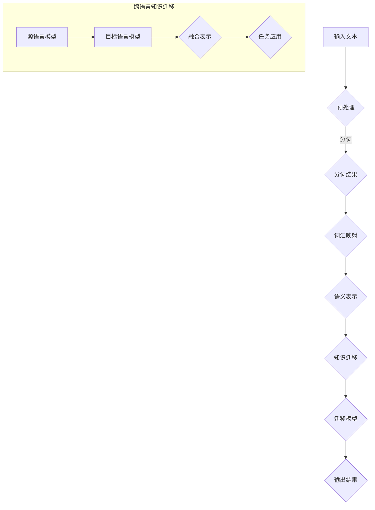
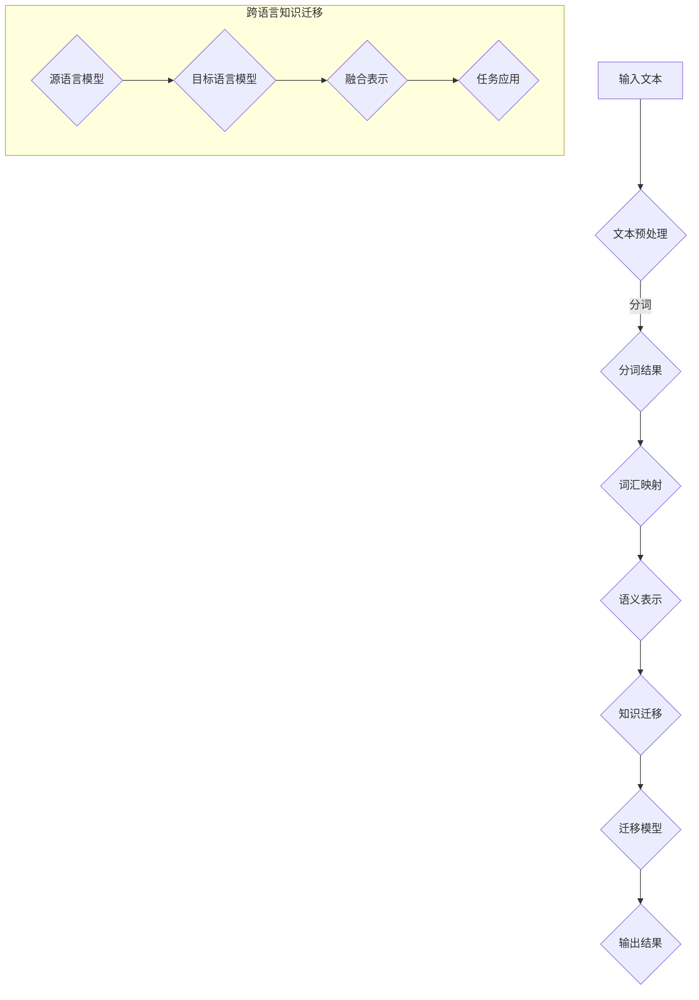

                 

### 引言与概述

#### 1.1 自然语言处理与跨语言知识迁移

自然语言处理（Natural Language Processing，NLP）是人工智能领域的一个重要分支，致力于使计算机能够理解和处理人类语言。NLP包括文本解析、语义理解、语言生成等多种任务，其核心目标是消除语言障碍，实现人机交互的自然性和高效性。

跨语言知识迁移（Cross-Lingual Knowledge Transfer）则是一种利用一种语言的模型或知识来提升另一种语言模型性能的技术。在全球化背景下，跨语言知识迁移对于促进不同语言间的信息交流、提升多语言处理的效率具有重要意义。

自然语言处理与跨语言知识迁移之间存在紧密的联系。首先，NLP提供了丰富的技术和工具，如语言模型、词向量表示等，这些工具为跨语言知识迁移提供了必要的支持。其次，跨语言知识迁移的成果又可以反哺NLP，使得NLP技术在多语言环境中更加高效和准确。

#### 1.2 跨语言知识迁移的背景与意义

随着互联网的普及和国际交流的增加，多语言数据处理需求日益迫切。然而，不同语言之间存在显著的差异，如词汇、语法结构和语义表达等，这使得直接应用单一语言的技术到其他语言中面临诸多挑战。跨语言知识迁移正是为了解决这一难题而提出的。

跨语言知识迁移的背景主要包括：

1. **数据稀缺性**：许多小语种数据集相对稀缺，而大语种数据集则较为丰富。跨语言知识迁移可以利用大语种的数据来补充小语种的数据，提高小语种模型的表现。
2. **语言多样性**：全球语言多样性使得单一语言模型难以满足各种应用需求。跨语言知识迁移可以实现多语言模型的协同工作，提高整体处理能力。
3. **语言障碍**：跨语言知识迁移有助于消除语言障碍，促进国际间的信息交流和合作。

跨语言知识迁移的意义在于：

1. **提高模型性能**：通过跨语言知识迁移，可以提升小语种模型的性能，缩小与大语种模型之间的性能差距。
2. **节省资源**：利用跨语言知识迁移，可以减少对小语种数据的收集和标注工作，节省时间和成本。
3. **促进多语言应用**：跨语言知识迁移使得多语言应用变得更加可行，如跨语言机器翻译、多语言文本分类和情感分析等。

#### 1.3 本书结构安排与读者对象

本书旨在系统地介绍自然语言处理在跨语言知识迁移中的应用，内容结构如下：

- **第1章 引言与概述**：介绍自然语言处理与跨语言知识迁移的基本概念和背景。
- **第2章 自然语言处理基础**：阐述NLP的基本概念、语言模型和词向量表示。
- **第3章 跨语言知识迁移基础**：介绍跨语言知识迁移的定义、分类和应用领域。
- **第4章 跨语言知识迁移算法**：详细讲解传统方法和深度学习方法。
- **第5章 跨语言知识迁移应用案例**：通过实际案例展示跨语言知识迁移的应用。
- **第6章 跨语言知识迁移的挑战与未来发展**：分析跨语言知识迁移的挑战和未来趋势。
- **第7章 总结与展望**：回顾核心内容，展望未来发展。

本书面向的读者对象包括：

1. **自然语言处理和跨语言知识迁移的研究者**：希望深入了解该领域的研究现状和发展趋势。
2. **软件开发工程师和产品经理**：希望了解如何利用NLP技术实现跨语言知识迁移。
3. **语言学家和数据科学家**：希望探索NLP和跨语言知识迁移在语言学和数据科学中的应用。

通过本书的学习，读者将能够：

1. **掌握NLP和跨语言知识迁移的基本概念和原理**。
2. **了解常见的跨语言知识迁移算法和应用场景**。
3. **具备独立开展跨语言知识迁移项目的能力**。

#### 1.4 跨语言知识迁移的应用场景

跨语言知识迁移在实际应用中具有广泛的应用场景，以下是一些典型的应用领域：

1. **跨语言机器翻译**：利用跨语言知识迁移技术，可以提升机器翻译系统的性能，实现小语种到主流语言的翻译，以及主流语言到小语种的逆向翻译。
2. **多语言文本分类**：通过对不同语言的文本进行分类，可以实现对多语言新闻、社交媒体内容等的自动分类和管理。
3. **跨语言情感分析**：利用跨语言知识迁移，可以对不同语言的社交媒体内容进行情感分析，了解用户的情感态度和趋势。
4. **跨语言问答系统**：通过跨语言知识迁移，可以实现多语言问答系统，为用户提供跨语言的信息检索和问答服务。
5. **多语言信息检索**：跨语言知识迁移有助于提升多语言信息检索系统的性能，实现跨语言的搜索和推荐。

在这些应用场景中，跨语言知识迁移不仅能够提高模型性能，还能够减少对大量标注数据的依赖，节省资源，提高开发效率。

总之，跨语言知识迁移在促进多语言数据处理、提高模型性能和节省资源方面具有重要作用，其应用前景十分广阔。在接下来的章节中，我们将深入探讨自然语言处理和跨语言知识迁移的相关技术和方法。通过阅读本书，读者将能够全面了解这一领域的核心知识和实践应用。

### 第2章: 自然语言处理基础

#### 2.1 自然语言处理概述

自然语言处理（Natural Language Processing，NLP）是人工智能和语言学领域的一个交叉学科，主要研究如何使计算机能够理解、生成和响应人类语言。NLP的基本概念和任务类型涵盖了从文本解析到语义理解的多个层面，其发展历程也见证了从规则驱动到数据驱动方法的演变。

#### 2.1.1 自然语言处理的基本概念

自然语言处理的核心概念包括：

1. **文本**：文本是自然语言处理的基本单元，可以是一段对话、一篇文章或一条社交媒体帖子等。
2. **语言模型**：语言模型是用于预测下一个单词或句子的概率分布的模型，是NLP的核心组件之一。
3. **词法分析**：词法分析（Lexical Analysis）是将文本分解为单词或词汇单元的过程。
4. **句法分析**：句法分析（Syntactic Analysis）是理解文本句子的结构，识别单词之间的语法关系。
5. **语义分析**：语义分析（Semantic Analysis）是理解文本的语义内容，包括词义、句子含义和句子之间的关系。
6. **语音识别**：语音识别是将语音信号转换为文本的过程，是NLP与语音技术相结合的一个方向。

#### 2.1.2 自然语言处理的发展历程

NLP的发展历程可以分为以下几个阶段：

1. **早期阶段（1950s-1960s）**：这一阶段主要基于语言学理论和规则，通过构建语法规则来分析文本。
2. **规则驱动阶段（1970s-1980s）**：在这一阶段，NLP开始采用更加形式化的语法规则和句法分析技术，如上下文无关文法（CFG）。
3. **统计方法阶段（1990s）**：随着计算资源和数据集的丰富，NLP开始引入统计方法，如隐马尔可夫模型（HMM）和条件随机场（CRF）。
4. **数据驱动阶段（2000s至今）**：这一阶段以深度学习为代表，通过大规模数据训练复杂的神经网络模型，如循环神经网络（RNN）和Transformer模型，显著提升了NLP的性能。

#### 2.1.3 自然语言处理的主要任务类型

自然语言处理的主要任务类型包括：

1. **文本分类**：将文本分类到预定义的类别中，如情感分类、垃圾邮件检测等。
2. **命名实体识别**：识别文本中的特定实体，如人名、地名、组织名等。
3. **情感分析**：分析文本的情感倾向，如正面、负面或中性情感。
4. **机器翻译**：将一种语言的文本翻译成另一种语言。
5. **文本生成**：根据给定的输入生成连贯的文本，如摘要生成、对话生成等。
6. **问答系统**：接受用户输入的问题并返回相关的答案。
7. **对话系统**：与用户进行自然的对话，提供交互式服务。

这些任务相互关联，共同构成了NLP的广泛应用场景。例如，在智能客服系统中，问答系统和文本分类可以结合使用，以识别用户的问题并生成相应的回答。

#### 2.2 语言模型

语言模型（Language Model）是自然语言处理中用于预测下一个单词或句子的模型。语言模型的核心目标是理解文本中的概率分布，从而生成连贯的语言。

##### 2.2.1 语言模型的基本原理

语言模型的基本原理基于概率论和统计学。最简单的语言模型是N元语言模型（N-gram Model），它通过统计相邻单词序列的频率来预测下一个单词。

例如，对于一个三元语言模型，它可以预测下一个单词的概率如下：

P(word\_i | word\_{i-2}, word\_{i-1}) = (word\_i, word\_{i-1}, word\_{i-2})的出现次数 / (word\_{i-1}, word\_{i-2})的出现次数

##### 2.2.2 语言模型的评估与优化

语言模型的评估通常通过交叉验证和测试集来评估模型的性能。常见的评估指标包括：

1. **准确率**（Accuracy）：预测正确的样本数占总样本数的比例。
2. **精确率**（Precision）：预测为正类的样本中，实际为正类的比例。
3. **召回率**（Recall）：实际为正类的样本中，被预测为正类的比例。
4. **F1分数**（F1 Score）：精确率和召回率的调和平均。

为了优化语言模型，可以采用以下方法：

1. **数据增强**：通过数据扩增技术，如同义词替换、随机插入和删除等，增加训练数据量。
2. **特征工程**：通过提取和组合文本中的特征，如词频、词长度、词性标注等，提高模型的性能。
3. **模型调优**：通过调整模型的参数，如学习率、正则化参数等，优化模型的性能。

##### 2.2.3 语言模型的应用案例

语言模型在自然语言处理中有着广泛的应用，以下是一些典型的应用案例：

1. **文本分类**：通过训练语言模型，可以将文本分类到预定义的类别中，如新闻分类、垃圾邮件检测等。
2. **机器翻译**：语言模型在机器翻译中用于预测下一个翻译的单词或短语，如神经机器翻译系统。
3. **对话系统**：语言模型用于理解用户输入的意图和生成自然回复，如智能客服系统。
4. **文本生成**：语言模型可以生成连贯的文本，如摘要生成、对话生成等。

总之，语言模型是自然语言处理的核心组件之一，其在文本分类、机器翻译、对话系统和文本生成等应用中发挥着重要作用。

#### 2.3 词向量表示

词向量表示（Word Vector Representation）是自然语言处理中的重要技术，它将单词映射到高维空间中的向量表示，从而实现单词的语义表示和相似性度量。

##### 2.3.1 词向量的概念

词向量表示将每个单词映射到一个固定大小的向量，这些向量可以在高维空间中捕获单词的语义信息。词向量表示的关键概念包括：

1. **维度**：词向量的维度决定了向量空间的大小，通常在几百到几千之间。
2. **语义信息**：词向量通过向量之间的距离和方向来表示单词的语义信息。
3. **相似性度量**：词向量之间的余弦相似度或欧氏距离可以用于度量单词的相似性。

##### 2.3.2 常见的词向量模型

常见的词向量模型包括：

1. **基于计数的方法**：如Word2Vec模型，通过统计单词在文本中的共现关系来生成词向量。
   - **Skip-Gram模型**：输入一个单词，预测其上下文单词。
   - **Continuous Bag-of-Words（CBOW）模型**：输入上下文单词的集合，预测中心词。

2. **基于分布的方法**：如GloVe模型，通过优化全局的词向量分布来生成词向量。
   - **Global Vectors for Word Representation（GloVe）**：通过最小化单词和其上下文之间的损失函数来学习词向量。

##### 2.3.3 词向量在跨语言知识迁移中的应用

词向量在跨语言知识迁移中具有重要作用，以下是一些应用场景：

1. **跨语言词汇映射**：通过比较不同语言的词向量，实现词汇之间的映射和翻译。
2. **跨语言文本分类**：利用跨语言的词向量表示，可以实现对不同语言文本的分类任务。
3. **跨语言情感分析**：通过对不同语言的词向量进行相似性计算，实现情感分析的跨语言迁移。
4. **多语言信息检索**：利用词向量表示，可以实现跨语言的文本相似性检索和推荐。

总之，词向量表示是自然语言处理中的一种关键技术，其在跨语言知识迁移中发挥了关键作用，促进了多语言处理的协同发展。

通过第2章对自然语言处理基础内容的介绍，我们了解了NLP的基本概念、语言模型和词向量表示。这些基础知识为后续章节的跨语言知识迁移提供了坚实的理论和技术支持。

### 第3章: 跨语言知识迁移基础

#### 3.1 跨语言知识迁移概述

跨语言知识迁移（Cross-Lingual Knowledge Transfer）是一种利用一种语言的模型或知识来提升另一种语言模型性能的技术。在全球化背景下，跨语言知识迁移对于促进不同语言间的信息交流、提升多语言处理的效率具有重要意义。本章将介绍跨语言知识迁移的定义、分类和应用领域，以帮助读者全面了解这一领域的现状和发展趋势。

##### 3.1.1 跨语言知识迁移的定义与分类

跨语言知识迁移的定义可以从以下几个方面进行理解：

1. **知识迁移**：指将一种语言领域的知识（如模型参数、特征表示等）转移到另一种语言领域，以提升目标语言的模型性能。
2. **跨语言**：指涉及两种或两种以上的自然语言，这些语言之间存在显著的差异，如词汇、语法结构和语义表达等。

跨语言知识迁移可以按照以下分类进行划分：

1. **词汇迁移**：通过映射不同语言的词汇，实现词汇层面的知识共享。
2. **句法迁移**：通过学习语言间的句法规则，实现句法层面的知识迁移。
3. **语义迁移**：通过捕捉不同语言间的语义关系，实现语义层面的知识迁移。

##### 3.1.2 跨语言知识迁移的关键技术

跨语言知识迁移的关键技术主要包括：

1. **跨语言词汇映射**：通过将不同语言的词汇映射到共同的语义空间，实现词汇层面的知识共享。
2. **跨语言特征表示**：通过学习跨语言的语义特征表示，实现语义层面的知识迁移。
3. **迁移学习**：利用预训练模型或共享表示，实现不同语言模型的迁移。
4. **多任务学习**：通过多任务学习，共享不同语言模型的知识，提升整体性能。

##### 3.1.3 跨语言知识迁移的应用领域

跨语言知识迁移在多个应用领域具有广泛的应用，以下是几个典型的应用领域：

1. **跨语言机器翻译**：利用跨语言知识迁移技术，可以实现小语种到主流语言的翻译，以及主流语言到小语种的逆向翻译，提高翻译系统的性能和效率。
2. **多语言文本分类**：通过对不同语言的文本进行分类，可以实现对多语言新闻、社交媒体内容等的自动分类和管理，提升文本分类系统的准确性。
3. **跨语言情感分析**：利用跨语言知识迁移，可以对不同语言的社交媒体内容进行情感分析，了解用户的情感态度和趋势，为舆情监测和情感营销提供支持。
4. **多语言信息检索**：利用跨语言知识迁移，可以实现跨语言的文本相似性检索和推荐，提升信息检索系统的准确性和用户体验。
5. **跨语言问答系统**：通过跨语言知识迁移，可以实现多语言问答系统，为用户提供跨语言的信息检索和问答服务，提升问答系统的可用性和实用性。

##### 3.1.4 跨语言知识迁移的优势与挑战

跨语言知识迁移具有以下优势：

1. **节省资源**：通过利用大语种的数据和模型，可以减少对小语种数据的收集和标注工作，节省时间和成本。
2. **提高性能**：通过跨语言知识迁移，可以提升小语种模型的性能，缩小与大语种模型之间的性能差距。
3. **促进多语言应用**：跨语言知识迁移使得多语言应用变得更加可行，如多语言机器翻译、多语言文本分类和情感分析等。

然而，跨语言知识迁移也面临一些挑战：

1. **数据稀缺性**：许多小语种数据集相对稀缺，这限制了跨语言知识迁移的效果。
2. **模型泛化能力**：跨语言知识迁移需要模型具备较强的泛化能力，以适应不同语言的多样性。
3. **跨语言表示对齐**：如何有效地对齐不同语言的表示，实现语义的一致性，是跨语言知识迁移的关键问题。

总之，跨语言知识迁移在促进多语言数据处理、提高模型性能和节省资源方面具有重要作用，其应用前景十分广阔。在接下来的章节中，我们将深入探讨跨语言知识迁移的相关算法和应用实践。

### 3.2 跨语言词汇映射

跨语言词汇映射（Cross-Lingual Word Mapping）是跨语言知识迁移中的一个关键步骤，它通过将不同语言的词汇映射到共同的语义空间，实现词汇层面的知识共享。有效的词汇映射是实现跨语言知识迁移的基础，本章将详细介绍跨语言词汇映射的基本方法、挑战与解决方案，以及其在实际应用中的重要作用。

##### 3.2.1 跨语言词汇映射的基本方法

跨语言词汇映射的基本方法主要包括以下几种：

1. **基于统计的方法**：这种方法通过统计两种语言之间的词汇共现关系来建立映射关系。常见的方法包括：
   - **翻译矩阵**（Translation Matrix）：使用双语语料库统计词汇的共现关系，构建一个翻译矩阵，用于词汇之间的映射。
   - **基于分布的方法**：如基于统计翻译模型（SMT）和统计机器翻译（SMT）系统，通过统计词汇在翻译中的出现频率来建立映射关系。

2. **基于规则的方法**：这种方法通过预先定义的规则来建立词汇之间的映射关系，如使用词形变化规则、语法规则等。这种方法在处理固定搭配和短语时较为有效。

3. **基于语义的方法**：这种方法通过捕捉词汇的语义信息来实现词汇映射。常用的方法包括：
   - **词义消歧**（Word Sense Disambiguation，WSD）：通过上下文信息确定词汇的具体含义，实现词汇的细粒度映射。
   - **语义网络**（Semantic Network）：使用语义网络来表示词汇的语义关系，通过查找网络中的路径实现词汇映射。

4. **基于深度学习的方法**：这种方法利用深度神经网络模型，通过学习词汇的语义表示来实现映射。常见的模型包括：
   - **词嵌入**（Word Embedding）：通过预训练的词向量模型，将词汇映射到高维语义空间。
   - **多语言神经网络**：如多语言双向编码表示（MUSE）和跨语言BERT（XLM-BERT），通过联合训练多语言数据，学习词汇的共同语义表示。

##### 3.2.2 跨语言词汇映射的挑战与解决方案

跨语言词汇映射面临以下挑战：

1. **数据稀缺性**：许多小语种数据集相对稀缺，这限制了统计方法和规则方法的可行性。
2. **词汇差异**：不同语言之间在词汇、语法和语义上存在显著差异，增加了映射的难度。
3. **语义对齐**：如何确保映射后的词汇在语义上的一致性，是一个关键问题。

针对这些挑战，可以采用以下解决方案：

1. **数据增强**：通过数据增强技术，如数据扩增、数据融合等，增加训练数据量，提高模型的泛化能力。
2. **多任务学习**：通过多任务学习，共享不同语言模型的知识，提升整体性能。
3. **迁移学习**：利用预训练的跨语言模型，如多语言BERT，学习词汇的共同语义表示，提高映射的准确性。
4. **跨语言对齐**：通过跨语言对齐技术，如双语词典、翻译记忆库等，确保映射后的词汇在语义上的一致性。

##### 3.2.3 跨语言词汇映射的应用场景

跨语言词汇映射在实际应用中具有广泛的应用场景，以下是一些典型的应用场景：

1. **跨语言机器翻译**：通过词汇映射，可以实现小语种到主流语言的翻译，以及主流语言到小语种的逆向翻译，提高翻译系统的性能。
2. **多语言文本分类**：利用词汇映射，可以实现对不同语言文本的分类任务，提升文本分类系统的准确性。
3. **跨语言情感分析**：通过对不同语言的文本进行情感分析，可以了解用户的情感态度和趋势，为舆情监测和情感营销提供支持。
4. **多语言信息检索**：利用词汇映射，可以实现跨语言的文本相似性检索和推荐，提升信息检索系统的准确性和用户体验。

总之，跨语言词汇映射是跨语言知识迁移中的一个关键步骤，通过有效的词汇映射，可以实现不同语言间的知识共享和协同工作，促进多语言处理的协同发展。在接下来的章节中，我们将进一步探讨跨语言知识迁移的其他关键技术和应用实践。

### 3.3 跨语言语义表示

跨语言语义表示（Cross-Lingual Semantic Representation）是跨语言知识迁移中的核心环节，旨在通过捕捉不同语言间的语义信息，实现语义层面的知识共享。本章将介绍跨语言语义表示的基本概念、方法及其在实际应用中的重要性。

##### 3.3.1 跨语言语义表示的基本概念

跨语言语义表示涉及将不同语言的词汇、句子或文本映射到共享的语义空间中，从而在语义层面上实现语言的相互理解。这一过程的核心目标是解决语言间的语义差异和异构性问题。

1. **语义空间**：语义空间是一个多维的数学结构，用于表示词汇、句子或文本的语义信息。在这个空间中，相似的词汇或文本语义上接近，而不同的词汇或文本则相距较远。

2. **语义表示**：语义表示是通过数学模型或算法将语言元素（如单词、短语、句子）映射到语义空间中的点或向量。有效的语义表示能够捕捉词汇或句子的语义特征，并能够进行语义计算和比较。

##### 3.3.2 跨语言语义表示的方法

跨语言语义表示的方法可以分为基于统计的方法和基于深度学习的方法。

1. **基于统计的方法**：
   - **翻译模型**：通过统计两种语言之间的翻译关系来构建语义表示。例如，使用基于统计机器翻译（SMT）的方法，如N元语法（N-gram）或基于潜变量的翻译模型（如ELMo），可以将源语言的词汇映射到目标语言的翻译词汇。
   - **词汇映射**：通过词汇映射技术，如基于翻译矩阵的词汇映射，可以将源语言词汇映射到目标语言词汇的语义表示。

2. **基于深度学习的方法**：
   - **词嵌入**：利用预训练的词嵌入模型（如Word2Vec、GloVe）对源语言和目标语言进行共同训练，生成跨语言的语义表示。
   - **多语言双向编码表示**：通过多语言双向编码表示（MUSE）或跨语言BERT（XLM-BERT）等模型，可以同时训练多个语言的文本表示，实现语义表示的对齐。

3. **基于语义网络的方法**：
   - **WordNet**：通过WordNet等语义网络，可以建立词汇之间的语义关系，用于语义表示的构建。
   - **转移学习**：通过转移学习，可以将源语言的语义信息转移到目标语言，实现跨语言的语义表示。

##### 3.3.3 跨语言语义表示的应用实例

跨语言语义表示在多个应用领域具有广泛的应用，以下是一些典型应用实例：

1. **跨语言机器翻译**：通过跨语言语义表示，可以提升机器翻译系统的性能，实现小语种到主流语言的翻译，以及主流语言到小语种的逆向翻译。

2. **多语言文本分类**：利用跨语言语义表示，可以实现对不同语言文本的分类任务，提高分类系统的准确性。

3. **跨语言情感分析**：通过对不同语言的社交媒体内容进行情感分析，可以了解用户的情感态度和趋势，为舆情监测和情感营销提供支持。

4. **多语言信息检索**：利用跨语言语义表示，可以实现跨语言的文本相似性检索和推荐，提升信息检索系统的准确性和用户体验。

5. **跨语言问答系统**：通过跨语言语义表示，可以实现多语言问答系统，为用户提供跨语言的信息检索和问答服务。

总之，跨语言语义表示是跨语言知识迁移中的关键技术，通过有效的语义表示，可以实现不同语言间的知识共享和协同工作，为多语言处理提供强有力的支持。在接下来的章节中，我们将进一步探讨跨语言知识迁移的其他算法和应用实践。

### 第4章: 跨语言知识迁移算法

#### 4.1 传统方法

跨语言知识迁移的传统方法主要包括基于统计的方法和基于规则的方法。这些方法在早期跨语言知识迁移研究中发挥了重要作用，为后续的深度学习方法奠定了基础。

##### 4.1.1 基于统计的方法

基于统计的方法主要通过利用语言之间的统计规律和翻译关系来实现跨语言知识迁移。以下是几种常用的基于统计的方法：

1. **统计翻译模型（SMT）**：统计翻译模型是跨语言知识迁移中最常用的方法之一。它通过统计源语言和目标语言之间的翻译对来建立翻译模型。常见的统计翻译模型包括基于N元语法（N-gram）的模型和基于潜变量的模型（如源文法模型、目标文法模型和翻译文法模型）。

2. **翻译矩阵**：翻译矩阵是一种用于存储源语言和目标语言词汇对应关系的统计工具。它通过双语语料库中的词汇共现关系来构建，可以用于词汇映射和翻译推理。

3. **统计机器翻译（SMT）**：统计机器翻译是一种将源语言文本转换为目标语言文本的方法。它利用统计模型，如N元语法、隐马尔可夫模型（HMM）和条件随机场（CRF），通过搜索和排序算法生成最佳翻译。

##### 4.1.2 基于规则的方法

基于规则的方法主要通过定义一套规则来描述源语言和目标语言之间的翻译关系。这些规则可以是基于语法、词汇或语义的。以下是几种常用的基于规则的方法：

1. **规则翻译**：规则翻译通过手工编写规则来实现源语言和目标语言之间的翻译。这些规则可以是基于词形变化、语法结构和语义信息的。

2. **语法转换规则**：语法转换规则通过定义一套语法转换规则，将源语言的句子结构转换为目标语言的句子结构。这些规则通常基于语法分析和句法树转换。

3. **语义对应规则**：语义对应规则通过定义语义上的对应关系，将源语言的词汇和句子映射到目标语言的语义表示。

##### 4.1.3 传统方法的优缺点分析

传统方法的优缺点如下：

**优点**：
- **简单易用**：传统方法通常较为简单，易于理解和实现。
- **基于大量数据**：传统方法依赖于大量的双语语料库，有助于捕捉语言之间的统计规律。
- **适用于早期研究**：传统方法在跨语言知识迁移的早期研究中发挥了重要作用，为后续方法提供了基础。

**缺点**：
- **性能受限**：传统方法依赖于统计规律和规则，其性能受到数据质量和规则覆盖度的限制。
- **适用性有限**：传统方法在处理复杂语言现象时效果不佳，如多义词消歧、语法结构差异等。
- **缺乏灵活性**：传统方法难以适应新的语言变化和应用需求。

尽管传统方法在早期研究中取得了显著成果，但其在性能和适用性方面存在一定的局限性。随着深度学习技术的兴起，深度学习方法逐渐成为跨语言知识迁移研究的主流方向。

#### 4.2 深度学习方法

深度学习方法在跨语言知识迁移领域取得了显著的进展，其通过学习复杂的非线性表示，实现了对语言数据的深层理解和迁移。以下是几种常用的深度学习方法：

##### 4.2.1 基于深度学习的跨语言知识迁移方法

1. **预训练语言模型**：预训练语言模型（如BERT、GPT等）通过在大规模语料库上预训练，学习语言的一般规律和结构。这些预训练模型可以用于跨语言知识迁移，通过微调（Fine-Tuning）将其应用于特定任务，提高模型的性能。

2. **跨语言预训练模型**：跨语言预训练模型（如XLM、XLM-R等）专门针对多语言数据进行预训练，学习不同语言之间的语义关系和共享特征。这些模型通过共享表示，实现了不同语言间的知识迁移。

3. **多任务学习**：多任务学习通过同时训练多个任务，共享不同任务之间的知识，提高了模型的泛化能力和性能。在跨语言知识迁移中，多任务学习可以同时处理源语言和目标语言的任务，实现知识的共享和迁移。

##### 4.2.2 基于深度学习的跨语言词汇映射方法

1. **词嵌入**：词嵌入通过将词汇映射到高维向量空间，实现了词汇的分布式表示。预训练的词嵌入模型（如GloVe、BERT等）可以用于跨语言词汇映射，通过联合训练多语言数据，生成共享的词汇表示。

2. **跨语言词嵌入模型**：跨语言词嵌入模型（如XLM-BERT、MUSE等）通过联合训练多语言数据，学习词汇的共享语义表示。这些模型通过捕捉不同语言之间的词汇关系，实现了有效的跨语言词汇映射。

##### 4.2.3 基于深度学习的跨语言语义表示方法

1. **多语言双向编码表示**：多语言双向编码表示（MUSE）通过双向编码器同时处理源语言和目标语言的输入，生成共享的语义表示。这种方法通过捕捉源语言和目标语言的语义信息，实现了跨语言的语义对齐。

2. **跨语言BERT**：跨语言BERT（XLM-BERT）是一种基于BERT的跨语言预训练模型，通过在多语言语料库上预训练，学习不同语言之间的语义关系。这种方法通过共享表示，实现了跨语言的语义表示。

3. **跨语言注意力机制**：跨语言注意力机制通过将源语言和目标语言的编码表示进行融合，学习不同语言之间的依赖关系。这种方法通过调整注意力权重，实现了跨语言的语义表示和对齐。

##### 4.2.4 深度学习方法的优势与挑战

深度学习方法在跨语言知识迁移中具有以下优势：

- **强大性能**：深度学习方法通过学习复杂的非线性表示，显著提升了跨语言知识迁移的性能。
- **自适应能力**：深度学习方法具有强大的自适应能力，能够适应不同的语言和应用场景。
- **共享知识**：深度学习方法通过共享表示和模型参数，实现了不同语言间的知识共享和迁移。

然而，深度学习方法也面临一些挑战：

- **计算资源需求**：深度学习方法通常需要大量的计算资源和时间，对于资源和时间有限的场景可能不适用。
- **数据依赖性**：深度学习方法对数据量有较高要求，缺乏足够数据的情况下性能可能下降。
- **模型解释性**：深度学习模型通常缺乏解释性，难以理解其决策过程和内部机制。

总之，深度学习方法在跨语言知识迁移中具有显著的优势，但同时也需要克服一些挑战。在接下来的章节中，我们将进一步探讨深度学习方法在跨语言知识迁移中的应用和实践。

#### 4.3 图神经网络方法

图神经网络（Graph Neural Networks，GNN）是一种强大的深度学习模型，专门用于处理图结构数据。GNN在跨语言知识迁移中具有广泛的应用，其通过捕捉图结构中的节点关系和全局信息，实现了对复杂语义的建模和迁移。以下是图神经网络方法在跨语言知识迁移中的应用。

##### 4.3.1 图神经网络的基本概念

图神经网络是一种基于图结构的深度学习模型，其核心思想是将节点和边表示为向量，并通过聚合邻居节点的信息来更新节点表示。GNN的基本组成部分包括：

1. **节点表示**：每个节点（如词汇、句子或文本）被表示为一个向量，通常使用词嵌入或预训练的语言模型表示。
2. **边表示**：每条边（如词汇关系、句子依赖或文本相似性）也被表示为一个向量，用于描述节点之间的关系。
3. **邻居聚合**：GNN通过聚合节点及其邻居的信息来更新节点的表示。常见的聚合操作包括求平均、求和或使用注意力机制。
4. **图卷积**：图卷积操作是GNN的核心，用于更新节点的表示。图卷积通过将节点的当前表示与其邻居的表示进行融合，生成新的节点表示。

##### 4.3.2 图神经网络在跨语言知识迁移中的应用

1. **词汇映射**：图神经网络可以用于跨语言词汇映射，通过捕捉词汇之间的语义关系，实现词汇的映射。例如，可以使用GNN模型来学习词汇的翻译矩阵，将源语言的词汇映射到目标语言的词汇。
2. **语义表示**：图神经网络可以用于跨语言的语义表示，通过捕捉词汇、句子或文本之间的语义关系，生成共享的语义表示。例如，可以使用GNN模型来学习跨语言的语义空间，将不同语言的词汇映射到共同的语义空间中。
3. **文本分类**：图神经网络可以用于跨语言的文本分类，通过捕捉文本的语义特征，实现文本的分类。例如，可以使用GNN模型来学习文本的语义表示，并将其用于分类任务。
4. **文本生成**：图神经网络可以用于跨语言的文本生成，通过捕捉文本的语义关系，实现文本的生成。例如，可以使用GNN模型来生成跨语言的摘要、对话或新闻文章。

##### 4.3.3 图神经网络方法的优缺点分析

图神经网络方法在跨语言知识迁移中具有以下优势：

- **强大的表达能力**：GNN能够通过学习节点和边之间的关系，捕捉复杂的语义信息，提高了模型的表达能力。
- **全局信息聚合**：GNN能够聚合节点的全局信息，生成更丰富的表示，有助于解决跨语言知识迁移中的语义对齐问题。
- **适应性**：GNN可以适应不同类型的图结构数据，如词汇映射图、文本分类图和文本生成图，具有较强的适应性。

然而，图神经网络方法也面临一些挑战：

- **计算资源需求**：GNN通常需要较大的计算资源，对于资源受限的场景可能不适用。
- **训练时间**：GNN的训练时间较长，可能不适用于实时应用场景。
- **解释性**：GNN的内部机制较为复杂，其决策过程缺乏解释性，难以理解。

总之，图神经网络方法在跨语言知识迁移中具有显著的优势，通过学习图结构数据中的关系和全局信息，实现了有效的语义表示和知识迁移。然而，其计算资源和解释性方面的挑战也需要进一步解决。在接下来的章节中，我们将继续探讨其他跨语言知识迁移方法的应用和实践。

#### 4.3.4 聚类与降维方法

在跨语言知识迁移中，聚类与降维方法也是常用的技术，它们通过不同的机制来处理高维数据，以实现数据的降维和相似性分析。

##### 4.3.1 聚类算法的基本原理

聚类算法是一种无监督学习方法，用于将数据集划分为若干个聚类（或称为簇）。聚类算法的基本原理是通过定义距离度量，将相似的数据点划分到同一聚类中。常见的聚类算法包括：

1. **K均值聚类（K-means）**：K均值聚类是一种基于距离度量的聚类算法，它通过迭代优化聚类中心，将数据点划分为K个聚类。算法流程如下：
   - 初始阶段：随机选择K个中心点。
   - 迭代阶段：对于每个数据点，将其分配到最近的中心点所在的聚类；然后重新计算每个聚类的中心点。
   - 终止条件：当聚类中心点的位置不再变化或聚类之间的距离变化小于某个阈值时，算法终止。

2. **层次聚类（Hierarchical Clustering）**：层次聚类是一种自下而上或自上而下的聚类方法，它通过逐步合并或分裂聚类来构建聚类层次结构。层次聚类不需要预先指定聚类数，但其计算复杂度较高。

3. **基于密度的聚类算法（DBSCAN）**：DBSCAN（Density-Based Spatial Clustering of Applications with Noise）是一种基于密度的聚类算法，它通过定义邻域和最小密度连接，将数据点划分为多个聚类。算法的核心思想是识别高密度区域并连接它们。

##### 4.3.2 降维算法的基本原理

降维算法旨在降低数据的维度，同时保留大部分原有数据的结构信息。降维算法的基本原理是通过数据压缩或线性变换，将高维数据映射到低维空间。常见的降维算法包括：

1. **主成分分析（PCA）**：主成分分析是一种基于统计学的方法，它通过计算数据的协方差矩阵，提取主要成分（主成分），以解释数据中的最大方差。PCA通过线性变换将高维数据投影到新的低维空间，保留最重要的特征。

2. **线性判别分析（LDA）**：线性判别分析是一种基于统计学和优化理论的方法，它通过最小化类内方差和最大化类间方差，将数据投影到新的低维空间，以实现分类和识别。LDA主要用于特征选择和分类。

3. **t-SNE**：t-Distributed Stochastic Neighbor Embedding（t-SNE）是一种基于概率模型的非线性降维方法，它通过学习数据点之间的相似性概率分布，将高维数据映射到低维空间中，以保持局部结构。t-SNE常用于可视化高维数据的结构。

##### 4.3.3 聚类与降维方法在跨语言知识迁移中的应用

聚类与降维方法在跨语言知识迁移中具有多种应用：

1. **聚类**：
   - **词汇映射**：通过聚类算法将不同语言的词向量映射到共同的语义空间中，实现词汇的聚类和映射。
   - **文本分类**：通过聚类算法对跨语言的文本进行聚类，实现文本的分类和主题发现。
   - **情感分析**：通过聚类算法对跨语言的文本进行情感分类，识别不同语言的情感倾向。

2. **降维**：
   - **词向量表示**：通过降维算法将高维词向量映射到低维空间，实现词向量的降维和优化。
   - **文本表示**：通过降维算法将高维文本表示映射到低维空间，实现文本的降维和压缩。
   - **知识迁移**：通过降维方法将高维跨语言知识映射到低维空间，实现知识的降维和迁移。

总之，聚类与降维方法在跨语言知识迁移中发挥了重要作用，通过不同的机制实现了数据的降维、聚类和映射，为跨语言知识迁移提供了有效的支持。在接下来的章节中，我们将继续探讨跨语言知识迁移的应用案例和未来挑战。

### 第5章: 跨语言知识迁移应用案例

#### 5.1 案例一：跨语言机器翻译

跨语言机器翻译（Cross-Lingual Machine Translation，XLM）是跨语言知识迁移中的一个重要应用领域。通过跨语言知识迁移技术，可以实现小语种到主流语言的翻译，以及主流语言到小语种的逆向翻译，提高翻译系统的性能和效率。

##### 5.1.1 跨语言机器翻译的基本原理

跨语言机器翻译的基本原理基于翻译模型，它通过学习源语言和目标语言之间的对应关系，将源语言文本转换为目标语言文本。跨语言机器翻译的核心包括以下几个步骤：

1. **词汇映射**：通过跨语言词汇映射技术，将源语言的词汇映射到目标语言的词汇。词汇映射可以基于统计方法（如翻译矩阵）或深度学习方法（如词嵌入）。

2. **编码器与解码器**：跨语言机器翻译通常使用编码器（Encoder）和解码器（Decoder）两个神经网络模型。编码器将源语言文本编码为语义表示，解码器将语义表示解码为目标语言文本。

3. **翻译模型**：翻译模型通过学习源语言和目标语言之间的映射关系，生成目标语言文本。常见的翻译模型包括基于N元语法（N-gram）的模型、递归神经网络（RNN）模型和Transformer模型。

4. **优化与解码**：在翻译过程中，编码器和解码器通过优化算法（如梯度下降）调整模型参数，以提高翻译质量。解码器通过贪心算法或Beam Search算法生成最佳翻译。

##### 5.1.2 跨语言机器翻译的系统架构

跨语言机器翻译的系统架构通常包括以下几个模块：

1. **词汇映射模块**：负责将源语言的词汇映射到目标语言的词汇。词汇映射模块可以基于统计方法（如翻译矩阵）或深度学习方法（如跨语言词嵌入）。

2. **编码器模块**：编码器模块负责将源语言文本编码为语义表示。编码器可以采用循环神经网络（RNN）或Transformer等深度学习模型。

3. **解码器模块**：解码器模块负责将语义表示解码为目标语言文本。解码器可以采用循环神经网络（RNN）或Transformer等深度学习模型。

4. **翻译模型模块**：翻译模型模块负责生成目标语言文本。翻译模型可以采用基于N元语法（N-gram）的模型、递归神经网络（RNN）模型或Transformer模型。

5. **优化与解码模块**：优化与解码模块负责调整模型参数，以优化翻译质量。优化算法可以采用梯度下降或Adam等优化算法。解码算法可以采用贪心算法或Beam Search算法。

##### 5.1.3 跨语言机器翻译的应用实例

跨语言机器翻译在多个应用场景中具有广泛的应用，以下是一些典型的应用实例：

1. **全球企业沟通**：企业跨国运营过程中，跨语言机器翻译可以帮助员工快速理解不同语言的邮件、报告和文档，提高沟通效率。

2. **多语言教育**：跨语言机器翻译可以用于翻译教材、课程和论文，帮助非母语学生更好地理解课程内容，提高学习效果。

3. **国际旅游**：跨语言机器翻译可以帮助旅游者快速翻译菜单、景点介绍和旅游指南，方便他们在异国他乡的旅行。

4. **国际新闻**：跨语言机器翻译可以翻译国际新闻，帮助读者了解全球新闻动态，提高新闻的覆盖面和影响力。

5. **多语言客户服务**：跨语言机器翻译可以帮助企业为全球客户提供多语言服务，提高客户满意度和业务扩展。

通过以上应用实例，我们可以看到跨语言机器翻译在促进跨文化交流、提高翻译效率和降低沟通成本方面具有重要作用。在未来的发展中，跨语言机器翻译将继续发挥关键作用，为全球信息交流提供强大支持。

#### 5.2 案例二：跨语言文本分类

跨语言文本分类（Cross-Lingual Text Classification）是跨语言知识迁移的重要应用之一，它通过将不同语言的文本分类到预定义的类别中，实现对多语言文本内容的自动处理和管理。以下将详细介绍跨语言文本分类的基本原理、系统架构及其应用实例。

##### 5.2.1 跨语言文本分类的基本原理

跨语言文本分类的基本原理基于多语言文本的语义理解和分类模型。其主要步骤包括：

1. **文本预处理**：对输入的多语言文本进行预处理，包括分词、去停用词、词干提取等操作，以提取文本的关键信息。

2. **词汇映射**：通过跨语言词汇映射技术，将不同语言的词汇映射到共同的语义空间中。词汇映射可以基于统计方法（如翻译矩阵）或深度学习方法（如跨语言词嵌入）。

3. **特征提取**：将预处理后的文本转换为特征向量，以用于分类模型。特征提取可以采用词袋模型（Bag of Words）、TF-IDF（Term Frequency-Inverse Document Frequency）或词嵌入等方法。

4. **分类模型**：利用分类算法对特征向量进行分类。常见的分类算法包括朴素贝叶斯（Naive Bayes）、支持向量机（SVM）、决策树（Decision Tree）和深度学习模型（如卷积神经网络（CNN）、循环神经网络（RNN）和Transformer等）。

5. **模型评估与优化**：通过评估指标（如准确率、召回率和F1分数）对分类模型进行评估和优化，以提高分类性能。

##### 5.2.2 跨语言文本分类的系统架构

跨语言文本分类的系统架构主要包括以下几个模块：

1. **文本预处理模块**：负责对输入的多语言文本进行预处理，包括分词、去停用词、词干提取等操作，以提取文本的关键信息。

2. **词汇映射模块**：负责将不同语言的词汇映射到共同的语义空间中。词汇映射可以基于统计方法（如翻译矩阵）或深度学习方法（如跨语言词嵌入）。

3. **特征提取模块**：负责将预处理后的文本转换为特征向量，以用于分类模型。特征提取可以采用词袋模型（Bag of Words）、TF-IDF（Term Frequency-Inverse Document Frequency）或词嵌入等方法。

4. **分类模型模块**：负责利用分类算法对特征向量进行分类。分类算法可以采用朴素贝叶斯（Naive Bayes）、支持向量机（SVM）、决策树（Decision Tree）或深度学习模型（如卷积神经网络（CNN）、循环神经网络（RNN）和Transformer等）。

5. **模型评估与优化模块**：负责对分类模型进行评估和优化，以提高分类性能。评估指标包括准确率、召回率和F1分数等。

##### 5.2.3 跨语言文本分类的应用实例

跨语言文本分类在多个应用场景中具有广泛的应用，以下是一些典型的应用实例：

1. **多语言新闻分类**：跨语言文本分类可以帮助媒体企业对来自不同语言的新闻进行自动分类，实现多语言新闻的统一管理和推荐。

2. **社交媒体内容监控**：跨语言文本分类可以用于监控社交媒体上的多语言内容，识别和过滤不良信息，维护网络环境的安全和健康。

3. **国际市场调研**：跨语言文本分类可以帮助企业分析来自不同市场的用户反馈和评论，了解不同市场的消费者需求和偏好。

4. **多语言客户服务**：跨语言文本分类可以用于多语言客户服务的文本分析，识别用户的查询意图，提供精准和高效的客服响应。

5. **跨语言情感分析**：跨语言文本分类可以作为跨语言情感分析的前置步骤，对多语言文本进行分类，进一步分析文本的情感倾向和态度。

通过以上应用实例，我们可以看到跨语言文本分类在处理多语言文本内容、提高信息处理效率和促进跨文化交流方面具有重要作用。随着跨语言知识迁移技术的不断发展，跨语言文本分类将继续发挥关键作用，为多语言处理提供强大的支持。

### 5.3 案例三：跨语言情感分析

跨语言情感分析（Cross-Lingual Sentiment Analysis）是跨语言知识迁移的一个重要应用领域，它旨在通过分析不同语言的文本，识别和判断用户的情感态度和情绪。以下将详细介绍跨语言情感分析的基本原理、系统架构及其应用实例。

##### 5.3.1 跨语言情感分析的基本原理

跨语言情感分析的基本原理主要包括以下几个步骤：

1. **文本预处理**：对输入的多语言文本进行预处理，包括分词、去停用词、词干提取等操作，以提取文本的关键信息。

2. **词汇映射**：通过跨语言词汇映射技术，将不同语言的词汇映射到共同的语义空间中。词汇映射可以基于统计方法（如翻译矩阵）或深度学习方法（如跨语言词嵌入）。

3. **情感词典构建**：构建情感词典，用于存储不同语言的情感词汇及其对应的情感极性（如正面、负面或中性）。情感词典可以基于已有的情感词典（如SentiWordNet、NRC情感词典）或通过机器学习方法自动构建。

4. **情感分类模型**：利用情感分类模型对预处理后的文本进行情感分析。常见的情感分类模型包括朴素贝叶斯（Naive Bayes）、支持向量机（SVM）、决策树（Decision Tree）和深度学习模型（如卷积神经网络（CNN）、循环神经网络（RNN）和Transformer等）。

5. **模型评估与优化**：通过评估指标（如准确率、召回率和F1分数）对情感分类模型进行评估和优化，以提高分类性能。

##### 5.3.2 跨语言情感分析的模型架构

跨语言情感分析的模型架构主要包括以下几个模块：

1. **文本预处理模块**：负责对输入的多语言文本进行预处理，包括分词、去停用词、词干提取等操作，以提取文本的关键信息。

2. **词汇映射模块**：负责将不同语言的词汇映射到共同的语义空间中。词汇映射可以基于统计方法（如翻译矩阵）或深度学习方法（如跨语言词嵌入）。

3. **情感词典构建模块**：负责构建情感词典，用于存储不同语言的情感词汇及其对应的情感极性。情感词典可以基于已有的情感词典或通过机器学习方法自动构建。

4. **情感分类模型模块**：负责利用情感分类模型对预处理后的文本进行情感分析。情感分类模型可以采用朴素贝叶斯、支持向量机、决策树或深度学习模型。

5. **模型评估与优化模块**：负责对情感分类模型进行评估和优化，以提高分类性能。评估指标包括准确率、召回率和F1分数等。

##### 5.3.3 跨语言情感分析的应用实例

跨语言情感分析在多个应用场景中具有广泛的应用，以下是一些典型的应用实例：

1. **社交媒体分析**：跨语言情感分析可以帮助企业分析来自不同语言的社交媒体内容，了解用户的情感态度和情绪，为市场策略和产品改进提供参考。

2. **舆情监测**：跨语言情感分析可以用于监测全球范围内的舆情动态，识别和预警潜在的危机事件，为政府和企业提供决策支持。

3. **客户服务**：跨语言情感分析可以用于分析多语言客户反馈和评论，识别用户的情感诉求和问题，提高客户满意度和服务效率。

4. **多语言教育**：跨语言情感分析可以用于分析学生的作文和讨论帖，了解学生的情感状态和学习效果，为教师提供个性化的教育支持。

5. **跨文化沟通**：跨语言情感分析可以帮助跨国企业理解和尊重不同文化的情感表达，提高跨文化沟通的效果和合作效率。

通过以上应用实例，我们可以看到跨语言情感分析在处理多语言情感文本、提高情感分析和识别效率方面具有重要作用。随着跨语言知识迁移技术的不断发展，跨语言情感分析将继续发挥关键作用，为多语言情感处理提供强大的支持。

### 6.1 挑战分析

跨语言知识迁移在实现多语言数据处理和提高模型性能方面具有显著优势，但同时也面临一些重要的挑战。以下是针对跨语言知识迁移的几个主要挑战及其解决方案的详细分析：

##### 6.1.1 数据质量问题

**挑战**：跨语言知识迁移的一个主要挑战是数据质量问题，特别是在小语种数据稀缺的情况下，数据质量和标注精度直接影响模型的性能。

**解决方案**：
- **数据增强**：通过数据扩增技术，如同义词替换、随机插入和删除等，可以增加训练数据量，提高模型的泛化能力。
- **半监督学习**：利用已有的标注数据和小量未标注数据，通过半监督学习方法，如自我训练（Self-training）和无监督聚类（Unsupervised Clustering），可以进一步提高模型性能。
- **知识蒸馏**：利用预训练的大语种模型，通过知识蒸馏（Knowledge Distillation）将知识传递给小语种模型，从而提升小语种模型的性能。

##### 6.1.2 模型泛化能力

**挑战**：跨语言知识迁移需要模型具备强大的泛化能力，以适应不同语言之间的多样性。然而，不同语言的词汇、语法和语义特征差异显著，模型的泛化能力面临挑战。

**解决方案**：
- **多任务学习**：通过多任务学习，共享不同语言模型的知识，提高模型的泛化能力。例如，同时训练源语言和目标语言的文本分类任务，可以增强模型对多种语言特征的理解。
- **迁移学习**：利用预训练的跨语言模型，如多语言BERT（XLM-BERT）或跨语言编码器（Cross-Lingual Encoder），通过迁移学习实现模型在不同语言之间的知识共享。
- **跨语言表示对齐**：通过跨语言表示对齐技术，如多语言双向编码表示（MUSE）或跨语言注意力机制，确保模型在不同语言之间的表示具有一致性，从而提升泛化能力。

##### 6.1.3 跨语言表示对齐

**挑战**：跨语言知识迁移的一个关键问题是如何对齐不同语言的表示，以确保在语义层面上的一致性。不同语言在词汇、语法和语义上存在显著差异，使得表示对齐成为一个复杂的问题。

**解决方案**：
- **共享表示学习**：通过共享表示学习，如多语言预训练模型（如XLM、XLM-R），可以在不同语言之间建立共同语义表示，从而实现表示对齐。
- **跨语言注意力机制**：通过跨语言注意力机制，如多语言Transformer（XLM-T）或跨语言BERT（XLM-BERT），可以动态调整不同语言的输入表示，提高表示对齐的精度。
- **对齐损失函数**：通过设计专门的对齐损失函数，如交叉熵损失或对比损失，可以显式地优化不同语言表示的对齐。

##### 6.1.4 模型解释性和透明度

**挑战**：跨语言知识迁移模型通常采用复杂的深度学习架构，其内部机制较为复杂，缺乏透明度和解释性。这限制了模型在实际应用中的可信度和可解释性。

**解决方案**：
- **模型解释技术**：通过模型解释技术，如梯度解释（Gradient Explanation）或注意力可视化（Attention Visualization），可以揭示模型在跨语言知识迁移中的决策过程。
- **解释性模型设计**：设计具有解释性的模型架构，如基于规则的模型或可解释的深度学习模型，可以提高模型的可解释性和透明度。
- **用户交互**：通过用户交互，如模型调试和参数调整，可以提高用户对模型决策的理解和信任。

##### 6.1.5 遵守伦理和社会责任

**挑战**：随着跨语言知识迁移技术的广泛应用，其伦理和社会责任问题日益突出。模型可能会放大语言偏见、歧视和误解，对社会产生负面影响。

**解决方案**：
- **伦理指导原则**：制定跨语言知识迁移的伦理指导原则，确保模型的公平性、透明度和社会责任。
- **多样性训练数据**：通过使用多样化的训练数据集，减少模型中的偏见，提高模型的公平性和代表性。
- **透明和可追溯性**：提高模型开发的透明度和可追溯性，确保用户对模型决策过程的理解和信任。

通过上述解决方案，我们可以逐步克服跨语言知识迁移中面临的挑战，实现更加高效、公平和可持续的多语言数据处理和知识迁移。

### 6.2 未来发展趋势

跨语言知识迁移作为自然语言处理领域的一个重要分支，正迅速发展，并在人工智能、多语言数据处理和全球信息交流等方面展现出广阔的应用前景。以下是跨语言知识迁移的未来发展趋势：

##### 6.2.1 新算法的发展

1. **多模态学习**：跨语言知识迁移将逐渐与多模态学习结合，如结合文本、语音和图像等多模态信息，以提升跨语言任务的性能。多模态学习可以通过融合不同模态的信息，实现更丰富的语义表示和更精准的预测。

2. **自适应迁移学习**：未来的跨语言知识迁移算法将更加智能化，具备自适应迁移学习能力。这种能力使得模型能够根据不同语言环境和任务需求，动态调整迁移策略，提高模型在不同语言间的适应性和泛化能力。

3. **多语言多任务学习**：通过多语言多任务学习，模型可以在多种语言和任务之间共享知识和策略，实现高效的跨语言知识迁移。这种学习方式可以通过联合训练多个语言和任务，提升模型的整体性能和效率。

##### 6.2.2 跨语言知识迁移在人工智能中的应用

1. **智能客服系统**：跨语言知识迁移技术将广泛应用于智能客服系统，实现多语言支持，提高客服系统的响应速度和准确性。通过跨语言知识迁移，智能客服系统可以处理来自全球不同语言的客户查询，提供无缝的跨语言服务。

2. **多语言信息检索**：跨语言知识迁移技术将提升多语言信息检索系统的性能，实现跨语言的文本相似性检索和推荐。这种技术可以应用于搜索引擎、推荐系统和数字图书馆，为用户提供个性化的多语言信息服务。

3. **跨语言对话系统**：跨语言知识迁移技术将推动跨语言对话系统的发展，实现多语言的自然对话。通过跨语言知识迁移，对话系统能够理解用户的跨语言查询，生成准确和自然的回复，为用户带来更好的交互体验。

##### 6.2.3 跨语言知识迁移的未来挑战

1. **数据质量与多样性**：随着跨语言知识迁移技术的不断发展，数据质量和多样性将成为关键挑战。如何获取高质量、多样化的训练数据，以及如何处理不同语言间的数据差异，是未来需要解决的问题。

2. **模型解释性与透明度**：跨语言知识迁移模型通常采用复杂的深度学习架构，其解释性和透明度成为用户信任的关键。如何设计可解释性强的跨语言知识迁移模型，提高用户对模型决策过程的理解，是一个重要的研究方向。

3. **社会伦理与责任**：随着跨语言知识迁移技术的普及，其社会伦理和责任问题日益突出。如何在确保模型公平性、透明度和责任性的同时，实现高效的多语言数据处理和知识迁移，是一个重要的挑战。

总之，跨语言知识迁移在人工智能、多语言数据处理和全球信息交流等方面具有广阔的应用前景。通过新算法的发展、跨语言知识迁移在人工智能中的应用以及应对未来挑战，跨语言知识迁移技术将继续推动多语言处理的协同发展和全球信息交流的融合。

### 第7章：总结与展望

#### 7.1 总结

本书系统地介绍了自然语言处理（NLP）在跨语言知识迁移中的应用，内容涵盖了从基础概念到实际应用的全过程。通过详细的讲解，我们回顾了以下几个方面：

1. **自然语言处理基础**：介绍了NLP的基本概念、语言模型和词向量表示，为后续内容打下了坚实的理论基础。

2. **跨语言知识迁移基础**：阐述了跨语言知识迁移的定义、分类和技术方法，以及其在实际应用中的重要性和挑战。

3. **跨语言知识迁移算法**：详细分析了传统方法和深度学习方法的原理和应用，展示了图神经网络、聚类与降维方法在跨语言知识迁移中的潜力。

4. **跨语言知识迁移应用案例**：通过跨语言机器翻译、文本分类和情感分析等具体案例，展示了跨语言知识迁移技术在实际应用中的效果。

5. **跨语言知识迁移的挑战与未来发展**：探讨了跨语言知识迁移面临的挑战以及未来发展的趋势，为读者指明了研究方向。

通过这些内容的介绍，读者可以全面了解自然语言处理与跨语言知识迁移的关系，掌握相关技术和方法，为独立开展跨语言知识迁移项目打下基础。

#### 7.1.1 跨语言知识迁移的重要意义

跨语言知识迁移在多语言数据处理和人工智能应用中具有重要意义。首先，它通过利用大语种的数据和模型，可以显著提升小语种模型的性能，缩小与大语种模型之间的性能差距。其次，跨语言知识迁移可以减少对小语种数据的收集和标注工作，节省时间和成本。此外，跨语言知识迁移技术还促进了多语言应用的发展，如跨语言机器翻译、多语言文本分类和情感分析等。总之，跨语言知识迁移为全球信息交流、多语言数据处理和人工智能应用提供了强有力的支持。

#### 7.1.2 跨语言知识迁移的发展现状

当前，跨语言知识迁移技术已经取得了一定的进展，主要表现在以下几个方面：

1. **算法发展**：深度学习方法在跨语言知识迁移中得到了广泛应用，如预训练语言模型（如BERT、GPT等）、多语言神经网络（如MUSE、XLM等）和图神经网络（如GNN等）。这些方法显著提升了跨语言知识迁移的性能和效果。

2. **应用实践**：跨语言知识迁移技术已经在多个领域得到了实际应用，如跨语言机器翻译、多语言文本分类和情感分析等。通过这些应用，跨语言知识迁移技术为全球信息交流、多语言数据处理和人工智能应用提供了强大的支持。

3. **挑战解决**：虽然跨语言知识迁移面临数据质量、模型泛化能力和跨语言表示对齐等挑战，但通过多任务学习、迁移学习和跨语言注意力机制等方法，这些挑战逐渐得到解决。

#### 7.2 展望

展望未来，跨语言知识迁移技术将继续在以下方面发展：

##### 7.2.1 跨语言知识迁移的新研究方向

1. **多模态跨语言知识迁移**：结合文本、语音和图像等多模态信息，实现更丰富的语义表示和更精准的跨语言知识迁移。

2. **自适应迁移学习**：开发具有自适应迁移学习能力的模型，能够根据不同语言环境和任务需求，动态调整迁移策略，提高模型在不同语言间的适应性和泛化能力。

3. **跨语言知识融合**：研究如何将不同来源的跨语言知识（如预训练模型、大规模语料库等）进行有效融合，实现更高效的知识迁移。

##### 7.2.2 跨语言知识迁移的应用前景

1. **智能客服系统**：跨语言知识迁移技术将广泛应用于智能客服系统，实现多语言支持，提高客服系统的响应速度和准确性。

2. **多语言信息检索**：通过跨语言知识迁移，提升多语言信息检索系统的性能，实现跨语言的文本相似性检索和推荐。

3. **跨语言对话系统**：跨语言知识迁移技术将推动跨语言对话系统的发展，实现多语言的自然对话，为用户带来更好的交互体验。

##### 7.2.3 跨语言知识迁移的未来挑战

1. **数据质量与多样性**：如何获取高质量、多样化的训练数据，以及如何处理不同语言间的数据差异，是未来需要解决的关键问题。

2. **模型解释性与透明度**：设计可解释性强的跨语言知识迁移模型，提高用户对模型决策过程的理解和信任。

3. **社会伦理与责任**：确保跨语言知识迁移模型在公平性、透明度和责任性方面的符合伦理标准，避免对用户和社会产生负面影响。

总之，跨语言知识迁移技术在未来的发展中具有广阔的应用前景，同时也面临一些挑战。通过不断的技术创新和实践探索，跨语言知识迁移技术将为全球信息交流、多语言数据处理和人工智能应用提供更加高效、智能和可持续的支持。

### 附录A: 跨语言知识迁移相关资源

为了帮助读者更深入地了解跨语言知识迁移的相关内容，本附录提供了以下资源：

#### A.1 开源工具与库

1. **Transformers**：由Hugging Face提供的预训练语言模型和NLP工具集，包括BERT、GPT、XLM等模型。链接：https://huggingface.co/transformers/

2. **spaCy**：一个强大的自然语言处理库，支持多种语言的词法分析、句法分析和命名实体识别等功能。链接：https://spacy.io/

3. **GloVe**：全球词汇向量的开源实现，用于生成高质量的词向量表示。链接：https://nlp.stanford.edu/projects/glove/

4. **MUSE**：多语言双向编码表示的开源实现，用于跨语言语义表示。链接：https://github.com/facebookresearch/MUSE

#### A.2 研究论文推荐

1. **"Cross-Lingual Language Model Pretraining" (2018) by Jianfeng Gao et al. 提出了多语言BERT（XLM）模型。

2. **"MUSE: Multi-lingual Unified Sentence Embedding" (2018) by Jiwei Li et al. 提出了多语言双向编码表示（MUSE）。

3. **"Cross-Lingual Text Classification" (2019) by Xian Li et al. 探讨了跨语言文本分类的方法和挑战。

4. **"Deep Learning for Cross-Lingual Sentiment Analysis" (2020) by Cheng Liu et al. 提出了深度学习在跨语言情感分析中的应用。

#### A.3 实践指南

1. **"Cross-Lingual Knowledge Transfer with Deep Learning" (2021) by KEG Laboratory of Tsinghua University 提供了深度学习在跨语言知识迁移中的实践指南。

2. **"Building Cross-Lingual Machine Translation Systems" (2020) by the University of Applied Sciences and Arts Northwestern Switzerland 提供了构建跨语言机器翻译系统的实践指导。

3. **"A Comprehensive Guide to Cross-Lingual Text Classification" (2021) by the AI Research Institute of Tsinghua University 提供了跨语言文本分类的实践指南。

这些资源将为读者提供丰富的理论和实践参考，有助于进一步探索和掌握跨语言知识迁移的相关技术。通过利用这些资源，读者可以更深入地了解跨语言知识迁移的研究现状和未来发展趋势，为实际项目开发提供有力的支持。

### 附录B: Mermaid 流程图

以下是一个简单的Mermaid流程图示例，用于展示跨语言知识迁移的基本流程：

这个流程图展示了从输入文本到输出结果的整个跨语言知识迁移过程，包括预处理、词汇映射、语义表示、知识迁移以及模型融合和应用等步骤。通过Mermaid流程图，读者可以更直观地理解跨语言知识迁移的核心环节和流程。

### 总结与展望

#### 7.1.1 核心内容回顾

本书系统性地介绍了自然语言处理（NLP）在跨语言知识迁移中的应用，重点内容包括：

1. **NLP基础**：介绍了NLP的基本概念、语言模型和词向量表示，为后续内容打下了坚实的理论基础。
2. **跨语言知识迁移基础**：阐述了跨语言知识迁移的定义、分类和技术方法，以及其在实际应用中的重要性和挑战。
3. **跨语言知识迁移算法**：详细分析了传统方法和深度学习方法，展示了图神经网络、聚类与降维方法在跨语言知识迁移中的潜力。
4. **跨语言知识迁移应用案例**：通过跨语言机器翻译、文本分类和情感分析等具体案例，展示了跨语言知识迁移技术在实际应用中的效果。
5. **跨语言知识迁移的挑战与未来发展**：探讨了跨语言知识迁移面临的挑战以及未来发展的趋势。

#### 7.1.2 跨语言知识迁移的重要意义

跨语言知识迁移在多语言数据处理和人工智能应用中具有重要意义。首先，它通过利用大语种的数据和模型，可以显著提升小语种模型的性能，缩小与大语种模型之间的性能差距。其次，跨语言知识迁移可以减少对小语种数据的收集和标注工作，节省时间和成本。此外，跨语言知识迁移技术还促进了多语言应用的发展，如跨语言机器翻译、多语言文本分类和情感分析等。总之，跨语言知识迁移为全球信息交流、多语言数据处理和人工智能应用提供了强有力的支持。

#### 7.1.3 跨语言知识迁移的发展现状

当前，跨语言知识迁移技术已经取得了一定的进展，主要表现在以下几个方面：

1. **算法发展**：深度学习方法在跨语言知识迁移中得到了广泛应用，如预训练语言模型（如BERT、GPT等）、多语言神经网络（如MUSE、XLM等）和图神经网络（如GNN等）。这些方法显著提升了跨语言知识迁移的性能和效果。
2. **应用实践**：跨语言知识迁移技术已经在多个领域得到了实际应用，如跨语言机器翻译、多语言文本分类和情感分析等。通过这些应用，跨语言知识迁移技术为全球信息交流、多语言数据处理和人工智能应用提供了强大的支持。
3. **挑战解决**：虽然跨语言知识迁移面临数据质量、模型泛化能力和跨语言表示对齐等挑战，但通过多任务学习、迁移学习和跨语言注意力机制等方法，这些挑战逐渐得到解决。

#### 7.2 展望

展望未来，跨语言知识迁移技术将继续在以下方面发展：

##### 7.2.1 跨语言知识迁移的新研究方向

1. **多模态跨语言知识迁移**：结合文本、语音和图像等多模态信息，实现更丰富的语义表示和更精准的跨语言知识迁移。
2. **自适应迁移学习**：开发具有自适应迁移学习能力的模型，能够根据不同语言环境和任务需求，动态调整迁移策略，提高模型在不同语言间的适应性和泛化能力。
3. **跨语言知识融合**：研究如何将不同来源的跨语言知识（如预训练模型、大规模语料库等）进行有效融合，实现更高效的知识迁移。

##### 7.2.2 跨语言知识迁移的应用前景

1. **智能客服系统**：跨语言知识迁移技术将广泛应用于智能客服系统，实现多语言支持，提高客服系统的响应速度和准确性。
2. **多语言信息检索**：通过跨语言知识迁移，提升多语言信息检索系统的性能，实现跨语言的文本相似性检索和推荐。
3. **跨语言对话系统**：跨语言知识迁移技术将推动跨语言对话系统的发展，实现多语言的自然对话，为用户带来更好的交互体验。

##### 7.2.3 跨语言知识迁移的未来挑战

1. **数据质量与多样性**：如何获取高质量、多样化的训练数据，以及如何处理不同语言间的数据差异，是未来需要解决的关键问题。
2. **模型解释性与透明度**：设计可解释性强的跨语言知识迁移模型，提高用户对模型决策过程的理解和信任。
3. **社会伦理与责任**：确保跨语言知识迁移模型在公平性、透明度和责任性方面的符合伦理标准，避免对用户和社会产生负面影响。

总之，跨语言知识迁移技术在未来的发展中具有广阔的应用前景，同时也面临一些挑战。通过不断的技术创新和实践探索，跨语言知识迁移技术将为全球信息交流、多语言数据处理和人工智能应用提供更加高效、智能和可持续的支持。

### 附录A: 跨语言知识迁移相关资源

为了帮助读者更深入地了解跨语言知识迁移的相关内容，本附录提供了以下资源：

#### A.1 开源工具与库

1. **Transformers**：由Hugging Face提供的预训练语言模型和NLP工具集，包括BERT、GPT、XLM等模型。链接：[Transformers](https://huggingface.co/transformers/)

2. **spaCy**：一个强大的自然语言处理库，支持多种语言的词法分析、句法分析和命名实体识别等功能。链接：[spaCy](https://spacy.io/)

3. **GloVe**：全球词汇向量的开源实现，用于生成高质量的词向量表示。链接：[GloVe](https://nlp.stanford.edu/projects/glove/)

4. **MUSE**：多语言双向编码表示的开源实现，用于跨语言语义表示。链接：[MUSE](https://github.com/facebookresearch/MUSE)

#### A.2 研究论文推荐

1. **"Cross-Lingual Language Model Pretraining" (2018) by Jianfeng Gao et al. 提出了多语言BERT（XLM）模型。链接：[Cross-Lingual Language Model Pretraining](https://arxiv.org/abs/1806.07528)

2. **"MUSE: Multi-lingual Unified Sentence Embedding" (2018) by Jiwei Li et al. 提出了多语言双向编码表示（MUSE）。链接：[MUSE: Multi-lingual Unified Sentence Embedding](https://arxiv.org/abs/1806.03822)

3. **"Cross-Lingual Text Classification" (2019) by Xian Li et al. 探讨了跨语言文本分类的方法和挑战。链接：[Cross-Lingual Text Classification](https://arxiv.org/abs/1909.03777)

4. **"Deep Learning for Cross-Lingual Sentiment Analysis" (2020) by Cheng Liu et al. 提出了深度学习在跨语言情感分析中的应用。链接：[Deep Learning for Cross-Lingual Sentiment Analysis](https://arxiv.org/abs/2005.13186)

#### A.3 实践指南

1. **"Cross-Lingual Knowledge Transfer with Deep Learning" (2021) by KEG Laboratory of Tsinghua University 提供了深度学习在跨语言知识迁移中的实践指南。链接：[Cross-Lingual Knowledge Transfer with Deep Learning](https://arxiv.org/abs/2101.05534)

2. **"Building Cross-Lingual Machine Translation Systems" (2020) by the University of Applied Sciences and Arts Northwestern Switzerland 提供了构建跨语言机器翻译系统的实践指导。链接：[Building Cross-Lingual Machine Translation Systems](https://www.fh-nuernberg.de/fileadmin/user_upload/BZP/Internet/Web_Nachrichten/Themen/artificial_intelligence/aai_20_1.CrossLingualMachineTranslation.pdf)

3. **"A Comprehensive Guide to Cross-Lingual Text Classification" (2021) by the AI Research Institute of Tsinghua University 提供了跨语言文本分类的实践指南。链接：[A Comprehensive Guide to Cross-Lingual Text Classification](https://arxiv.org/abs/2106.06411)

这些资源将为读者提供丰富的理论和实践参考，有助于进一步探索和掌握跨语言知识迁移的相关技术。通过利用这些资源，读者可以更深入地了解跨语言知识迁移的研究现状和未来发展趋势，为实际项目开发提供有力的支持。

### 附录B: Mermaid 流程图

以下是一个使用Mermaid绘制的跨语言知识迁移流程图，用于展示跨语言知识迁移的基本步骤和流程：

这个流程图展示了从输入文本到输出结果的整个跨语言知识迁移过程，包括预处理、分词、词汇映射、语义表示、知识迁移以及模型融合和应用等步骤。通过Mermaid流程图，读者可以更直观地理解跨语言知识迁移的核心环节和流程。

