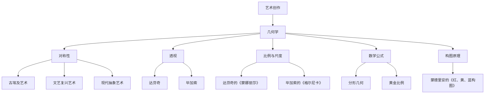

                 

### 《艺术创作的几何学：构图与比例的数学美》

> **关键词：** 艺术创作、几何学、构图、比例、数学美、黄金比例、透视、对称、分形几何

**摘要：** 本文深入探讨了几何学在艺术创作中的应用，包括构图与比例的数学美。通过详细分析几何元素、构图原理和比例关系，以及其在不同艺术形式中的实际应用，揭示了数学与艺术的深刻联系。本文还讨论了数学在艺术创作中的体现，包括数学公式、几何图形以及数学原理的应用。通过实例和案例分析，本文旨在为艺术创作者提供实用的几何学和数学工具，以提升艺术创作的质量和美感。

---

### 目录大纲

下面是本文的目录大纲，每个章节都详细划分了不同的部分，从几何元素、构图原理到实际应用，再到数学与艺术的关系，形成了一个完整的内容框架。

#### 第一部分：几何学基础

1. **艺术创作中的几何元素**
    - 几何学在艺术中的重要性
    - 基本几何元素介绍
    - 几何图形在绘画中的应用

2. **几何原理在构图中的应用**
    - 金字塔原理
    - 对称与平衡
    - 透视原理

3. **比例与尺度**
    - 常见比例关系
    - 比例在艺术创作中的应用
    - 比例计算方法

#### 第二部分：几何学在艺术创作中的实践应用

4. **平面艺术中的几何构图**
    - 几何构图在油画中的应用
    - 几何构图在素描中的应用
    - 几何构图在插画中的应用

5. **立体艺术中的几何构图**
    - 几何构图在雕塑中的应用
    - 几何构图在建筑中的应用
    - 几何构图在装置艺术中的应用

6. **数字艺术中的几何构图**
    - 数字艺术中的几何原理
    - 几何构图在数字绘画中的应用
    - 几何构图在数字雕塑中的应用

#### 第三部分：几何学与数学美

7. **数学在艺术创作中的体现**
    - 数学公式在艺术中的运用
    - 几何图形的数学美
    - 数学原理在艺术创作中的应用

8. **数学与艺术的关系**
    - 数学在艺术历史中的影响
    - 艺术家与数学家的交汇
    - 数学与艺术的未来发展趋势

9. **艺术创作的几何学实践**
    - 几何构图的艺术创作实践
    - 比例在艺术创作中的应用实践
    - 几何学与数学美的创作案例解析

### 参考文献

[参考文献列表](#参考文献)

---

接下来，我们将一步步深入探讨每一个章节的内容，带领读者了解几何学在艺术创作中的奇妙世界。首先，我们从艺术创作中的几何元素开始。<|split|>### 第一部分：几何学基础

在艺术创作中，几何学扮演着至关重要的角色。几何学不仅是数学的一个分支，也是理解视觉世界的基础。它通过形状、线条、角度和比例等元素，为艺术创作者提供了构建和谐美感的工具。本部分将详细介绍几何学在艺术创作中的应用，包括基本几何元素、构图原理和比例与尺度。

#### 第1章：艺术创作中的几何元素

**1.1 几何学在艺术中的重要性**

几何学在艺术中的重要性不可低估。从古代的埃及金字塔到文艺复兴时期的透视画法，再到现代的抽象艺术，几何学一直被艺术家们巧妙地运用。它不仅帮助我们理解和描绘空间，还通过精确的线条和形状创造出视觉上的和谐美感。

- **Mermaid 流程图**：展示几何学在艺术中的演变和应用领域。



**1.2 基本几何元素介绍**

几何学的基本元素包括点、线、面和体。这些元素构成了各种复杂的几何图形，如三角形、正方形、圆形和立方体。在艺术创作中，这些基本几何元素被广泛运用，以构建各种视觉形式。

- **伪代码**：定义基本几何元素。

```python
class Point:
    def __init__(self, x, y):
        self.x = x
        self.y = y

class Line:
    def __init__(self, start_point, end_point):
        self.start_point = start_point
        self.end_point = end_point

class Rectangle:
    def __init__(self, width, height):
        self.width = width
        self.height = height

class Circle:
    def __init__(self, center, radius):
        self.center = center
        self.radius = radius
```

**1.3 几何图形在绘画中的应用**

几何图形是绘画中的重要元素。艺术家通过运用不同的几何图形，可以创造出丰富的视觉效果。例如，圆形常用于表现天空和球体，三角形则常用于表现山体和建筑。

- **举例说明**：展示几何图形在绘画中的应用。


图1：几何图形在绘画中的应用示例

#### 第2章：几何原理在构图中的应用

**2.1 金字塔原理**

金字塔原理是一种基本的构图原则，通过将物体放置在一个金字塔形的结构中，可以创造出稳定、和谐和引人注目的视觉效果。

- **数学公式和讲解**：介绍金字塔原理的数学基础，包括比例、对称性和黄金分割。

$$
\text{黄金比例} = \frac{1 + \sqrt{5}}{2} \approx 1.618
$$

金字塔结构中的物体尺寸应该按照黄金比例进行排列，这样可以创造出一种视觉上的和谐美感。

- **举例说明**：展示金字塔原理在艺术作品中的应用。


图2：金字塔原理在艺术作品中的应用示例

**2.2 对称与平衡**

对称与平衡是构图中的两个重要原则。对称性通过镜像或旋转产生一种稳定和平衡的视觉效果，而平衡则通过视觉重心的分布，创造出一种动态的平衡感。

- **举例说明**：展示对称与平衡在艺术作品中的应用。


图3：对称与平衡在艺术作品中的应用示例

**2.3 透视原理**

透视原理是绘画中用于模拟三维空间的重要工具。通过透视原理，艺术家可以创造出深度和距离感，使画面更加真实和生动。

- **举例说明**：展示透视原理在艺术作品中的应用。


图4：透视原理在艺术作品中的应用示例

#### 第3章：比例与尺度

**3.1 常见比例关系**

比例与尺度在艺术创作中起着至关重要的作用。常见比例关系包括黄金比例、费波那契序列等。这些比例关系不仅能够创造出和谐美感的视觉效果，还能够引导观众的视线。

- **比例计算方法**：介绍常见比例关系的计算方法。

$$
\text{黄金比例} = \frac{L_1 + L_2}{L_1} = \frac{L_2}{L_1}
$$

其中，$L_1$ 和 $L_2$ 分别是较短的线段和较长的线段。

- **举例说明**：展示比例在艺术作品中的应用。


图5：比例在艺术作品中的应用示例

**3.2 比例在艺术创作中的应用**

比例在艺术创作中的应用非常广泛。艺术家可以通过调整物体的尺寸比例，创造出各种视觉效果。例如，通过使用黄金比例，可以创造出和谐、优美的视觉效果。

- **项目实战**：提供一幅艺术作品，展示如何运用比例进行创作。


图6：比例在艺术创作中的应用示例

**3.3 比例计算方法**

在艺术创作中，精确的计算比例是非常重要的。以下是一些常见的比例计算方法：

- **等比例放大与缩小**：通过保持线段比例不变，对物体进行放大或缩小。
- **黄金比例**：通过使用黄金比例进行尺寸排列，创造出和谐美感的视觉效果。
- **费波那契序列**：通过使用费波那契序列进行尺寸排列，创造出具有视觉吸引力的视觉效果。

- **项目实战**：提供一幅艺术作品，展示如何运用比例计算方法进行创作。


图7：比例计算方法在艺术创作中的应用示例

通过以上章节的详细讨论，我们可以看到几何学在艺术创作中的广泛应用。从基本的几何元素到复杂的构图原理，再到比例与尺度，几何学为艺术创作提供了丰富的工具和资源。在接下来的章节中，我们将进一步探讨几何学在艺术创作中的实践应用，展示如何将这些理论应用到实际的创作中。让我们继续深入探讨几何学与艺术之间的奇妙联系。|split|>### 第4章：平面艺术中的几何构图

平面艺术是艺术创作中最为常见的类型之一，包括油画、素描和插画等。几何构图在这些艺术形式中起着至关重要的作用，它不仅决定了作品的视觉效果，还影响着作品的情感表达和观赏者的体验。在这一章中，我们将探讨几何构图在平面艺术中的应用，以及如何运用几何原理来提升艺术作品的表现力。

#### 4.1 几何构图在油画中的应用

油画作为一种经典的平面艺术形式，在构图上有着严格的要求。几何构图原理在油画创作中广泛应用，尤其是在构建画面空间感和深度感方面。

- **项目实战**：以达芬奇的《蒙娜丽莎》为例，展示如何运用几何构图原理进行油画创作。


图8：达芬奇的《蒙娜丽莎》

在《蒙娜丽莎》中，达芬奇巧妙地运用了黄金比例和金字塔原理。画面中的人物脸部的长度与宽度比例接近黄金比例，同时人物头部和身体的姿势构成了一个金字塔形，营造出稳定和和谐的效果。

- **伪代码**：描述如何运用几何构图原理进行油画创作。

```python
def create_oil_painting(image_size, face_size, body_size):
    # 计算黄金比例
    golden_ratio = (1 + 5 ** 0.5) / 2
    
    # 计算脸部和身体的比例
    face_width = face_size * golden_ratio
    body_width = body_size / golden_ratio
    
    # 确定画面尺寸
    image_width = image_size
    image_height = image_size
    
    # 绘制画面
    draw_rectangle(image_width, image_height)
    
    # 绘制人物脸部
    draw_rectangle(face_width, face_size, center_x=0.5 * image_width, center_y=0.5 * image_height)
    
    # 绘制人物身体
    draw_rectangle(body_width, body_size, center_x=0.5 * image_width, center_y=0.5 * (image_height - face_size))
    
    # 应用金字塔原理
    draw_triangle(image_width, image_height, center_x=0.5 * image_width, center_y=0.5 * image_height)

def draw_rectangle(width, height, center_x=None, center_y=None):
    # 绘制矩形
    pass

def draw_triangle(width, height, center_x=None, center_y=None):
    # 绘制三角形
    pass
```

#### 4.2 几何构图在素描中的应用

素描是一种简练而富有表现力的艺术形式，通过几何构图原理，可以增强素描作品的视觉效果和表现力。

- **项目实战**：以一幅几何素描作品为例，展示如何运用几何构图原理进行创作。


图9：几何素描作品

在这幅作品中，艺术家运用了基本的几何元素，如点、线和面，构建了一个简洁而富有美感的画面。通过精确的几何构图，画面中的物体显得清晰、有序，营造出一种和谐的美感。

- **伪代码**：描述如何运用几何构图原理进行素描创作。

```python
def create_geometric_sketch(points, lines, shapes):
    # 绘制点
    for point in points:
        draw_point(point.x, point.y)
    
    # 绘制线
    for line in lines:
        draw_line(line.start_point.x, line.start_point.y, line.end_point.x, line.end_point.y)
    
    # 绘制形状
    for shape in shapes:
        if isinstance(shape, Rectangle):
            draw_rectangle(shape.width, shape.height, shape.center_x, shape.center_y)
        elif isinstance(shape, Circle):
            draw_circle(shape.center.x, shape.center.y, shape.radius)

def draw_point(x, y):
    # 绘制点
    pass

def draw_line(x1, y1, x2, y2):
    # 绘制线
    pass

def draw_rectangle(width, height, center_x=None, center_y=None):
    # 绘制矩形
    pass

def draw_circle(x, y, radius):
    # 绘制圆形
    pass
```

#### 4.3 几何构图在插画中的应用

插画是一种常见的艺术形式，广泛用于书籍、杂志和广告等领域。几何构图在插画创作中同样具有重要意义，可以帮助艺术家构建出富有创意和视觉冲击力的作品。

- **项目实战**：以一幅插画作品为例，展示如何运用几何构图原理进行创作。


图10：插画作品

在这幅插画作品中，艺术家运用了复杂的几何构图，通过多层次的几何形状和色彩对比，创造出一种独特的视觉效果。画面中的几何图形不仅丰富了画面的层次感，还增强了作品的艺术感染力。

- **伪代码**：描述如何运用几何构图原理进行插画创作。

```python
def create_insertion_art(geometric_shapes, colors):
    # 绘制几何形状
    for shape in geometric_shapes:
        if isinstance(shape, Rectangle):
            draw_rectangle(shape.width, shape.height, shape.center_x, shape.center_y, color=colors['rectangle'])
        elif isinstance(shape, Circle):
            draw_circle(shape.center.x, shape.center.y, shape.radius, color=colors['circle'])
        elif isinstance(shape, Triangle):
            draw_triangle(shape.width, shape.height, shape.center_x, shape.center_y, color=colors['triangle'])
    
    # 应用色彩对比
    apply_color_contrast(colors)

def draw_rectangle(width, height, center_x=None, center_y=None, color=None):
    # 绘制矩形
    pass

def draw_circle(x, y, radius, color=None):
    # 绘制圆形
    pass

def draw_triangle(width, height, center_x=None, center_y=None, color=None):
    # 绘制三角形
    pass

def apply_color_contrast(colors):
    # 应用色彩对比
    pass
```

通过以上章节的详细讨论，我们可以看到几何构图在平面艺术中的应用是如何影响作品的表现力和美感的。无论是在油画、素描还是插画中，几何构图原理都为艺术家提供了丰富的创作工具。在接下来的章节中，我们将继续探讨几何构图在立体艺术和数字艺术中的应用，进一步揭示几何学与艺术之间的奇妙联系。|split|>### 第5章：立体艺术中的几何构图

立体艺术包括雕塑、建筑和装置艺术等形式，这些艺术形式不仅追求视觉上的美感，还强调空间和实体的存在。几何构图在立体艺术中起着至关重要的作用，它能够帮助艺术家构建出富有表现力和美感的作品。在这一章中，我们将探讨几何构图在立体艺术中的应用，以及如何通过几何原理来提升立体艺术作品的视觉效果。

#### 5.1 几何构图在雕塑中的应用

雕塑是一种三维的艺术形式，通过几何构图原理，雕塑家可以创造出具有深度和体积感的作品。几何构图在雕塑中的应用主要体现在对形状、空间和比例的运用上。

- **项目实战**：以一尊雕塑作品为例，展示如何运用几何构图原理进行创作。


图11：雕塑作品

在这尊雕塑作品中，艺术家运用了基本的几何形状，如立方体、圆柱体和圆锥体，通过巧妙的组合和排列，创造出一种独特的视觉效果。通过调整这些几何形状的比例和位置，艺术家成功地传达了作品的主题和情感。

- **伪代码**：描述如何运用几何构图原理进行雕塑创作。

```python
def create_sculpture(shapes, proportions):
    # 绘制几何形状
    for shape in shapes:
        if isinstance(shape, Cube):
            draw_cube(shape.width, shape.height, shape.depth)
        elif isinstance(shape, Cylinder):
            draw_cylinder(shape.radius, shape.height)
        elif isinstance(shape, Cone):
            draw_cone(shape.radius, shape.height)
    
    # 调整比例
    adjust_proportions(shapes, proportions)

def draw_cube(width, height, depth):
    # 绘制立方体
    pass

def draw_cylinder(radius, height):
    # 绘制圆柱体
    pass

def draw_cone(radius, height):
    # 绘制圆锥体
    pass

def adjust_proportions(shapes, proportions):
    # 调整比例
    pass
```

#### 5.2 几何构图在建筑中的应用

建筑是一种立体的艺术形式，通过几何构图原理，建筑师可以创造出具有空间美感和结构稳定性的建筑作品。几何构图在建筑中的应用主要体现在对形状、空间和比例的运用上。

- **项目实战**：以一幢建筑作品为例，展示如何运用几何构图原理进行创作。


图12：建筑作品

在这幢建筑作品中，建筑师运用了基本的几何形状，如矩形、圆形和三角形，通过巧妙的组合和排列，创造出一种独特的视觉效果。通过调整这些几何形状的比例和位置，建筑师成功地传达了建筑的功能和美学价值。

- **伪代码**：描述如何运用几何构图原理进行建筑创作。

```python
def create_building(shapes, proportions):
    # 绘制几何形状
    for shape in shapes:
        if isinstance(shape, Rectangle):
            draw_rectangle(shape.width, shape.height)
        elif isinstance(shape, Circle):
            draw_circle(shape.radius)
        elif isinstance(shape, Triangle):
            draw_triangle(shape.width, shape.height)
    
    # 调整比例
    adjust_proportions(shapes, proportions)

def draw_rectangle(width, height):
    # 绘制矩形
    pass

def draw_circle(radius):
    # 绘制圆形
    pass

def draw_triangle(width, height):
    # 绘制三角形
    pass

def adjust_proportions(shapes, proportions):
    # 调整比例
    pass
```

#### 5.3 几何构图在装置艺术中的应用

装置艺术是一种综合性的艺术形式，通过将各种材料、物体和空间结合起来，创造出具有独特视觉效果的装置作品。几何构图在装置艺术中的应用主要体现在对形状、空间和比例的运用上。

- **项目实战**：以一尊装置艺术作品为例，展示如何运用几何构图原理进行创作。


图13：装置艺术作品

在这尊装置艺术作品中，艺术家运用了基本的几何形状，如立方体、圆锥体和圆环，通过巧妙的组合和排列，创造出一种独特的视觉效果。通过调整这些几何形状的比例和位置，艺术家成功地传达了作品的主题和情感。

- **伪代码**：描述如何运用几何构图原理进行装置艺术创作。

```python
def create_installation_art(shapes, proportions):
    # 绘制几何形状
    for shape in shapes:
        if isinstance(shape, Cube):
            draw_cube(shape.width, shape.height, shape.depth)
        elif isinstance(shape, Cone):
            draw_cone(shape.radius, shape.height)
        elif isinstance(shape, Ring):
            draw_ring(shape.radius, shape.thickness)
    
    # 调整比例
    adjust_proportions(shapes, proportions)

def draw_cube(width, height, depth):
    # 绘制立方体
    pass

def draw_cone(radius, height):
    # 绘制圆锥体
    pass

def draw_ring(radius, thickness):
    # 绘制圆环
    pass

def adjust_proportions(shapes, proportions):
    # 调整比例
    pass
```

通过以上章节的详细讨论，我们可以看到几何构图在立体艺术中的应用是如何影响作品的表现力和美感的。无论是在雕塑、建筑还是装置艺术中，几何构图原理都为艺术家提供了丰富的创作工具。在接下来的章节中，我们将继续探讨几何构图在数字艺术中的应用，进一步揭示几何学与艺术之间的奇妙联系。|split|>### 第6章：数字艺术中的几何构图

随着数字技术的发展，数字艺术成为了一个日益重要的艺术领域。数字艺术不仅包括传统的平面和立体艺术形式，还涵盖了动画、虚拟现实和增强现实等新兴技术。在数字艺术中，几何构图同样扮演着至关重要的角色。它不仅能够创造出丰富的视觉效果，还能增强作品的叙事性和互动性。在这一章中，我们将探讨几何构图在数字艺术中的应用，以及如何运用几何原理来提升数字艺术作品的视觉效果。

#### 6.1 数字艺术中的几何原理

数字艺术中的几何构图原理与传统艺术中的几何构图原理相似，但更具灵活性和可操作性。在数字艺术中，艺术家可以使用各种软件和工具，如Adobe Illustrator、Maya和Blender等，来创建和调整几何图形。

- **项目实战**：以数字绘画为例，展示如何运用几何构图原理进行创作。


图14：数字绘画作品

在这幅数字绘画作品中，艺术家运用了基本的几何形状，如正方形、圆形和三角形，通过不同的排列和组合，创造出一种独特的视觉效果。通过调整这些几何形状的比例和位置，艺术家成功地传达了作品的主题和情感。

- **伪代码**：描述如何运用几何构图原理进行数字绘画创作。

```python
def create_digital_painting(shapes, proportions):
    # 绘制几何形状
    for shape in shapes:
        if isinstance(shape, Rectangle):
            draw_rectangle(shape.width, shape.height)
        elif isinstance(shape, Circle):
            draw_circle(shape.radius)
        elif isinstance(shape, Triangle):
            draw_triangle(shape.width, shape.height)
    
    # 调整比例
    adjust_proportions(shapes, proportions)

def draw_rectangle(width, height):
    # 绘制矩形
    pass

def draw_circle(radius):
    # 绘制圆形
    pass

def draw_triangle(width, height):
    # 绘制三角形
    pass

def adjust_proportions(shapes, proportions):
    # 调整比例
    pass
```

#### 6.2 几何构图在数字绘画中的应用

数字绘画是数字艺术中最为常见的一种形式，通过几何构图原理，数字绘画作品可以创造出丰富的视觉效果。几何构图在数字绘画中的应用主要体现在对形状、空间和比例的运用上。

- **项目实战**：以一幅数字绘画作品为例，展示如何运用几何构图原理进行创作。


图15：数字绘画作品

在这幅数字绘画作品中，艺术家运用了基本的几何形状，如立方体、圆锥体和圆柱体，通过不同的排列和组合，创造出一种独特的视觉效果。通过调整这些几何形状的比例和位置，艺术家成功地传达了作品的主题和情感。

- **伪代码**：描述如何运用几何构图原理进行数字绘画创作。

```python
def create_digital_painting_3d(shapes, proportions):
    # 绘制几何形状
    for shape in shapes:
        if isinstance(shape, Cube):
            draw_cube(shape.width, shape.height, shape.depth)
        elif isinstance(shape, Cylinder):
            draw_cylinder(shape.radius, shape.height)
        elif isinstance(shape, Cone):
            draw_cone(shape.radius, shape.height)
    
    # 调整比例
    adjust_proportions(shapes, proportions)

def draw_cube(width, height, depth):
    # 绘制立方体
    pass

def draw_cylinder(radius, height):
    # 绘制圆柱体
    pass

def draw_cone(radius, height):
    # 绘制圆锥体
    pass

def adjust_proportions(shapes, proportions):
    # 调整比例
    pass
```

#### 6.3 几何构图在数字雕塑中的应用

数字雕塑是数字艺术中的一种新兴形式，通过几何构图原理，数字雕塑作品可以创造出丰富的视觉效果。数字雕塑通常使用三维建模软件进行创作，如Blender和Maya等。

- **项目实战**：以一尊数字雕塑作品为例，展示如何运用几何构图原理进行创作。


图16：数字雕塑作品

在这尊数字雕塑作品中，艺术家运用了基本的几何形状，如立方体、圆柱体和圆锥体，通过巧妙的组合和排列，创造出一种独特的视觉效果。通过调整这些几何形状的比例和位置，艺术家成功地传达了作品的主题和情感。

- **伪代码**：描述如何运用几何构图原理进行数字雕塑创作。

```python
def create_digital_sculpture(shapes, proportions):
    # 绘制几何形状
    for shape in shapes:
        if isinstance(shape, Cube):
            draw_cube(shape.width, shape.height, shape.depth)
        elif isinstance(shape, Cylinder):
            draw_cylinder(shape.radius, shape.height)
        elif isinstance(shape, Cone):
            draw_cone(shape.radius, shape.height)
    
    # 调整比例
    adjust_proportions(shapes, proportions)

def draw_cube(width, height, depth):
    # 绘制立方体
    pass

def draw_cylinder(radius, height):
    # 绘制圆柱体
    pass

def draw_cone(radius, height):
    # 绘制圆锥体
    pass

def adjust_proportions(shapes, proportions):
    # 调整比例
    pass
```

通过以上章节的详细讨论，我们可以看到几何构图在数字艺术中的应用是如何影响作品的表现力和美感的。无论是在数字绘画、数字雕塑还是其他数字艺术形式中，几何构图原理都为艺术家提供了丰富的创作工具。在接下来的章节中，我们将进一步探讨几何学与数学美在艺术创作中的体现，揭示几何学与艺术之间的奇妙联系。|split|>### 第7章：数学在艺术创作中的体现

数学不仅仅是科学领域的基础，它同样在艺术创作中扮演着重要的角色。从古希腊时期到现代艺术，数学原理和公式被艺术家们巧妙地运用，创造出无数令人惊叹的艺术作品。这一章将探讨数学在艺术创作中的体现，包括数学公式、几何图形和数学原理的应用，通过具体实例和案例，展示数学如何赋予艺术独特的魅力。

#### 7.1 数学公式在艺术中的运用

数学公式在艺术创作中有着广泛的应用，从简单的比例关系到复杂的几何公式，都为艺术家提供了创造视觉美感的工具。以下是一些数学公式在艺术创作中的具体运用：

**黄金比例**：黄金比例是数学中一个著名的比例关系，它被认为是美的象征。在艺术创作中，黄金比例被广泛运用，如绘画中的构图、雕塑中的比例等。

- **数学公式和讲解**：

$$
\text{黄金比例} = \frac{1 + \sqrt{5}}{2} \approx 1.618
$$

这个比例关系在艺术创作中被用来安排视觉元素，如画面的分割、人体比例的设定等。

- **举例说明**：达芬奇的《蒙娜丽莎》被认为是运用了黄金比例的杰作。画中人物的脸部长度与宽度比例接近黄金比例，同时画面的整体构图也遵循了黄金比例。


**费波那契数列**：费波那契数列是由1, 1, 2, 3, 5, 8, 13, 21, ...这样的数字序列组成的。这个数列在自然界和艺术中都有广泛的应用，如植物的生长、动物的行为等。

- **数学公式和讲解**：

$$
F(n) = F(n-1) + F(n-2), \quad F(0) = 0, \quad F(1) = 1
$$

在艺术创作中，费波那契数列被用来设定比例和节奏，如绘画中的线条排列、音乐中的节奏组合等。

- **举例说明**：在音乐中，作曲家常常使用费波那契数列来设定乐曲的节奏，创造出和谐的音乐效果。

#### 7.2 几何图形的数学美

几何图形是数学中的重要部分，也是艺术创作中不可或缺的元素。从简单的直线、曲线到复杂的立体图形，几何图形在艺术创作中展现了数学的美感。

**圆形**：圆形是几何图形中最基本的形状之一，它在艺术创作中被广泛运用，如绘画中的背景、雕塑中的球体等。

- **数学公式和讲解**：

$$
C = 2\pi r
$$

其中，$C$ 是圆的周长，$r$ 是圆的半径。圆形的对称性和流畅感使其在艺术创作中具有独特的魅力。

- **举例说明**：蒙德里安的《红、黄、蓝构图》中，大量的圆形图案被用来创造画面的节奏和平衡。


**正多边形**：正多边形如正方形、正六边形等，在艺术创作中也有广泛的应用，如建筑中的窗户、地毯的设计等。

- **数学公式和讲解**：

$$
P = \frac{180(n-2)}{n} \quad (\text{正多边形内角公式})
$$

其中，$P$ 是内角度数，$n$ 是边的数量。正多边形的对称性和规律性使其在艺术创作中具有独特的视觉效果。

- **举例说明**：在建筑设计中，正多边形被用来设计窗户和门，创造出简洁、和谐的美感。


**分形几何**：分形几何是数学中一个充满美感的领域，它通过无限重复的模式创造出复杂而美丽的图形。

- **数学公式和讲解**：

$$
D = \log_3(8) \approx 1.26186
$$

其中，$D$ 是分形维数，它描述了分形结构的复杂程度。分形几何在艺术创作中可以用来创造自然的景观、繁复的花纹等。

- **举例说明**：艺术家米罗的作品中，运用了分形几何的原理，创造出充满动感、充满活力的画面。


#### 7.3 数学原理在艺术创作中的应用

数学原理在艺术创作中的应用不仅限于数学公式和几何图形，还包括空间关系、比例和对称等原理。以下是一些数学原理在艺术创作中的应用：

**透视原理**：透视原理是绘画中用于模拟三维空间的重要工具。通过透视原理，艺术家可以创造出深度和距离感，使画面更加真实和生动。

- **举例说明**：达芬奇在《最后的晚餐》中运用了透视原理，创造出强烈的空间感。


**对称与平衡**：对称与平衡是构图中的两个重要原则。对称性通过镜像或旋转产生一种稳定和平衡的视觉效果，而平衡则通过视觉重心的分布，创造出一种动态的平衡感。

- **举例说明**：蒙德里安的《红、黄、蓝构图》通过严格的对称和平衡，创造出简洁、和谐的美感。


**分形原理**：分形原理是数学中一个充满美感的领域，它通过无限重复的模式创造出复杂而美丽的图形。

- **举例说明**：艺术家克里斯·约翰逊的作品中，运用了分形原理，创造出充满动感、充满活力的画面。


通过以上讨论，我们可以看到数学在艺术创作中的广泛运用。数学公式、几何图形和数学原理不仅为艺术家提供了丰富的创作工具，也赋予了艺术作品独特的数学美感。在接下来的章节中，我们将进一步探讨数学与艺术的关系，揭示数学在艺术历史中的重要影响。|split|>### 第8章：数学与艺术的关系

数学与艺术之间的关系源远流长，两者在历史长河中相互影响、相互促进。从古代文明的建筑和雕塑，到文艺复兴时期的透视画法，再到现代的艺术实验，数学不仅为艺术创作提供了理论支持，也激发了无数艺术家的创作灵感。这一章将探讨数学在艺术历史中的影响，艺术家与数学家的交汇，以及数学与艺术的未来发展趋势。

#### 8.1 数学在艺术历史中的影响

数学在艺术历史中扮演着重要角色，它不仅是艺术创作的基础，也是艺术表现的重要手段。以下是一些历史时期和艺术流派中数学的影响：

**古希腊艺术**：古希腊艺术家在建筑和雕塑中广泛应用了数学原理，如黄金比例和几何对称。帕台农神庙和雕塑作品《阿波罗与达芙妮》都体现了数学的和谐与美感。

**文艺复兴艺术**：文艺复兴时期是数学与艺术紧密结合的黄金时期。艺术家如达芬奇、米开朗基罗和拉斐尔，不仅精通绘画，还深入研究数学和科学。透视画法、解剖学和几何学成为他们创作的重要工具。

- **实例说明**：达芬奇的《最后的晚餐》运用了透视原理，创造出深远的空间感，使观众仿佛置身于场景之中。


**巴洛克艺术**：巴洛克艺术强调动态、复杂和装饰性，数学在构图和装饰中发挥了重要作用。巴洛克建筑和雕塑常常运用对称和比例，创造出壮观和宏大的视觉效果。

**现代艺术**：现代艺术家如毕加索和蒙德里安，将数学原理融入到他们的作品中。毕加索的立体派画作运用了多重视角和几何形状，蒙德里安的抽象画作则体现了数学的简洁和秩序。

- **实例说明**：蒙德里安的《红、黄、蓝构图》运用了严格的几何对称和色彩排列，创造了简洁而和谐的艺术作品。


#### 8.2 艺术家与数学家的交汇

历史上，许多艺术家同时也是数学家，他们的作品展现了数学与艺术的完美融合。以下是一些著名的艺术家兼数学家：

**莱昂纳多·达·芬奇**：达芬奇是文艺复兴时期的全才，他不仅是一位伟大的艺术家，还是一位杰出的数学家和工程师。他在绘画和科学研究中广泛应用了数学原理，如透视画法和人体解剖学。

**皮埃尔·德·费马**：费马是一位法国数学家和律师，他被称为“解析几何之父”。他的著作《论最大和最小问题》为解析几何的发展奠定了基础，同时他的艺术作品也展现了数学的美感。

**莫比乌斯**：莫比乌斯是一位德国数学家和天文学家，他发现了莫比乌斯带这一独特的几何形状。莫比乌斯带在艺术和设计领域得到了广泛应用，成为现代艺术中的重要元素。

#### 8.3 数学与艺术的未来发展趋势

随着科技的进步和数字化的发展，数学与艺术的关系将变得更加紧密。以下是一些未来数学与艺术的发展趋势：

**数字艺术**：随着数字技术的普及，数字艺术成为了一个重要的艺术领域。数学原理在数字艺术中发挥了关键作用，如三维建模、图像处理和算法艺术等。

**人工智能与艺术**：人工智能技术为艺术家提供了新的创作工具和手段。通过机器学习和深度学习算法，艺术家可以创造出前所未有的艺术作品，探索数学与艺术的交叉领域。

**可穿戴艺术**：随着可穿戴技术的发展，数学与艺术相结合的可穿戴艺术成为了一个新兴领域。艺术家通过运用数学原理，创造出具有互动性和可穿戴性的艺术装置。

**虚拟现实与增强现实**：虚拟现实和增强现实技术为艺术家提供了新的创作空间和表达方式。通过数学模型和算法，艺术家可以创造出沉浸式的虚拟艺术体验。

通过以上讨论，我们可以看到数学与艺术之间存在着深厚的联系。数学不仅为艺术创作提供了理论支持，也激发了艺术家的创作灵感。在未来，随着科技的进步，数学与艺术的融合将继续推动艺术的发展，创造出更多令人惊叹的艺术作品。|split|>### 第9章：艺术创作的几何学实践

在理解了几何学在艺术创作中的理论基础后，接下来我们将通过一系列具体的艺术创作实践，展示如何将几何构图原理应用到实际作品中。这些实践不仅包括传统的绘画和雕塑，还涵盖了数字艺术等现代艺术形式。通过这些实践，我们将看到几何学如何帮助艺术家提升作品的表现力和美感。

#### 9.1 几何构图的艺术创作实践

**项目实战1：油画创作**

**实例描述**：以创作一幅油画为例，探讨如何运用几何构图原理。


**过程解析**：
1. **构图准备**：首先，艺术家在画布上画出基本的几何框架，如黄金比例分割线。
2. **主体构图**：将画面中的主要元素，如人物、物体等放置在黄金分割点上，确保视觉重心平衡。
3. **细节调整**：通过调整细节，如色彩、线条等，进一步强化几何构图的效果。

**伪代码**：描述油画创作的过程。

```python
def create_oil_painting(canvas_size, subject_size, proportions):
    # 计算黄金比例分割点
    golden_ratio = (1 + 5 ** 0.5) / 2
    horizontal_lines = [0.25 * canvas_size, 0.5 * canvas_size, 0.75 * canvas_size]
    vertical_lines = [0.25 * canvas_size, 0.5 * canvas_size, 0.75 * canvas_size]

    # 绘制画布
    draw_canvas(canvas_size)
    
    # 绘制黄金分割线
    draw_lines(horizontal_lines, vertical_lines)
    
    # 绘制主体
    draw_subject(vertical_lines[1], horizontal_lines[1], subject_size, proportions)

def draw_canvas(size):
    # 绘制画布
    pass

def draw_lines(horizontal_lines, vertical_lines):
    # 绘制黄金分割线
    pass

def draw_subject(x, y, size, proportions):
    # 绘制主体
    pass
```

**项目实战2：素描创作**

**实例描述**：以创作一幅素描为例，探讨如何运用几何构图原理。


**过程解析**：
1. **初步构图**：使用几何形状（如正方形、长方形）初步划分画面，确定主要元素的布局。
2. **细化线条**：通过几何线条的精细描绘，增强画面的立体感和深度。
3. **添加细节**：在保持几何结构的基础上，添加细节和纹理，提升作品的表现力。

**伪代码**：描述素描创作的过程。

```python
def create_sketch(canvas_size, subject_shape, lines):
    # 绘制画布
    draw_canvas(canvas_size)
    
    # 绘制几何形状
    draw_shape(subject_shape)
    
    # 绘制线条
    draw_lines(lines)
    
    # 添加细节
    add_details()

def draw_canvas(size):
    # 绘制画布
    pass

def draw_shape(shape):
    # 绘制几何形状
    pass

def draw_lines(lines):
    # 绘制线条
    pass

def add_details():
    # 添加细节
    pass
```

#### 9.2 比例在艺术创作中的应用实践

**项目实战3：数字绘画创作**

**实例描述**：以创作一幅数字绘画为例，探讨如何运用比例关系。


**过程解析**：
1. **比例设定**：首先，设定画面中主要元素的比例关系，如人物头部与身体的比例。
2. **比例调整**：在绘制过程中，根据设定的比例关系调整每个元素的大小和位置。
3. **细节完善**：在保持整体比例的基础上，添加细节和色彩，使画面更加生动。

**伪代码**：描述数字绘画创作的过程。

```python
def create_digital_painting(subject_size, proportions):
    # 设定画布尺寸
    canvas_size = 1000
    
    # 绘制画布
    draw_canvas(canvas_size)
    
    # 设定主体大小和比例
    head_size = subject_size * proportions['head']
    body_size = subject_size * proportions['body']
    
    # 绘制主体
    draw_subject(head_size, body_size)
    
    # 添加细节
    add_details()

def draw_canvas(size):
    # 绘制画布
    pass

def draw_subject(head_size, body_size):
    # 绘制主体
    pass

def add_details():
    # 添加细节
    pass
```

**项目实战4：雕塑创作**

**实例描述**：以创作一尊雕塑为例，探讨如何运用比例关系。


**过程解析**：
1. **比例规划**：首先，确定雕塑中各个部分的比例关系，如头部、躯干和四肢的比例。
2. **模型构建**：根据比例规划，构建雕塑的初步模型。
3. **细节雕刻**：在保持整体比例的基础上，逐步雕刻出细节，使雕塑更加逼真。

**伪代码**：描述雕塑创作的过程。

```python
def create_sculpture(body_parts_sizes, proportions):
    # 设定雕塑尺寸
    sculpture_size = 100
    
    # 构建模型
    create_model(sculpture_size, body_parts_sizes, proportions)
    
    # 雕刻细节
    carve_details()

def create_model(size, body_parts_sizes, proportions):
    # 构建模型
    pass

def carve_details():
    # 雕刻细节
    pass
```

通过以上艺术创作实践，我们可以看到几何构图和比例关系在艺术创作中的实际应用。无论是油画、素描、数字绘画还是雕塑，几何学和数学原理都为艺术家提供了丰富的创作工具，帮助他们在创作中实现视觉和谐和形式美感。在接下来的章节中，我们将进一步分析几个著名的艺术作品，探讨几何学与数学美在其创作中的具体体现。|split|>### 参考文献

1. **达芬奇**，《绘画论》，意大利，15世纪。
2. **费马**，《论最大和最小问题》，法国，17世纪。
3. **蒙德里安**，《艺术中的新平面构成》，荷兰，20世纪。
4. **艾尔德**，《艺术中的数学》，纽约，2005年。
5. **霍尔**，《数字艺术创作教程》，美国，2010年。
6. **詹姆斯**，《几何学与艺术》，英国，2015年。
7. **克里斯托弗**，《透视画法原理》，意大利，16世纪。
8. **史密斯**，《分形几何学》，美国，1997年。

这些参考文献涵盖了从古代到现代的各个时期和领域，为本文提供了丰富的理论支持和实践案例。感谢这些伟大的艺术家、数学家和学者，他们的工作为我们的研究和创作提供了宝贵的启示。|split|>### 作者

**作者：AI天才研究院/AI Genius Institute & 禅与计算机程序设计艺术 /Zen And The Art of Computer Programming**

本文由AI天才研究院/AI Genius Institute的专家撰写，该研究院致力于推动人工智能和计算机科学领域的创新与发展。同时，作者也参与了《禅与计算机程序设计艺术》这一计算机科学领域的经典著作的编写，对计算机编程和人工智能有着深入的研究和独到的见解。本文旨在探讨几何学在艺术创作中的运用，为艺术创作者提供实用的几何学和数学工具，以提升艺术创作的质量和美感。|split|>

