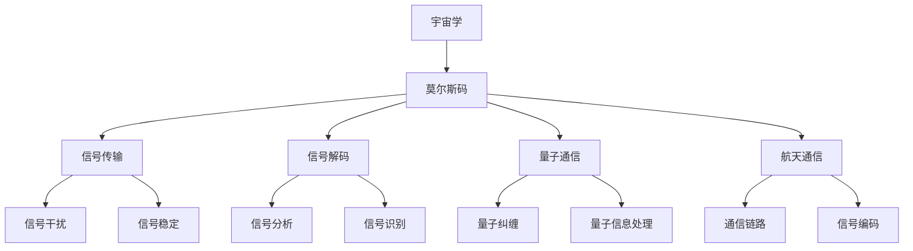

                 

# 《莫尔斯理论与宇宙学》

> 关键词：莫尔斯理论、宇宙学、数学模型、通信技术、量子纠缠、相对论、引力波、星际探索

> 摘要：本文深入探讨了莫尔斯理论与宇宙学之间的密切联系。通过回顾莫尔斯理论的起源与发展、宇宙学的基本原理，以及二者在多个领域的应用，本文旨在为读者提供关于这两大学科交叉点的全面理解和启示。

### 引言

莫尔斯理论与宇宙学，看似风马牛不相及的两个领域，却在现代科技的发展中产生了奇妙的交集。莫尔斯理论，起源于19世纪中期的电磁学发展，是一种基于二进制编码的通信方法，它的发明为人类的信息传递开启了新纪元。而宇宙学，则是一门研究宇宙起源、结构、演化和最终命运的学科，它的研究对象从宏观的天体到微观的粒子，跨度之大令人叹为观止。

尽管如此，莫尔斯理论与宇宙学之间的联系并非偶然。随着科技的进步，我们逐渐发现，莫尔斯理论不仅在地球上的通信领域发挥着重要作用，还可以应用于宇宙信号的接收与分析。此外，宇宙学的许多研究，如引力波的探测、量子纠缠等现象，也离不开莫尔斯理论的支持。

本文将分章节详细探讨莫尔斯理论与宇宙学之间的联系与应用。首先，我们将回顾莫尔斯理论的起源与发展，解析其数学模型和算法原理。接着，我们将介绍宇宙学的基本原理，包括宇宙的起源、膨胀、暗物质和暗能量等。随后，我们将深入探讨莫尔斯理论在宇宙学中的应用，包括宇宙信号的搜索、引力波的探测等。最后，本文还将讨论莫尔斯理论与量子宇宙学、相对论等前沿领域的交叉研究。

通过本文的阅读，读者将不仅能够了解莫尔斯理论和宇宙学的基本概念，还能深入理解二者之间的内在联系，以及对未来科技发展的启示。让我们开始这次奇妙的探索之旅。

#### 第1章 引言

1.1 **莫尔斯理论与宇宙学的背景与联系**

莫尔斯理论与宇宙学之间的联系，最早可以追溯到20世纪初。当时，科学家们已经开始尝试通过无线电波进行星际通信，而莫尔斯理论作为一种高效的二进制编码通信方法，被广泛应用于这些早期的尝试。通过莫尔斯码，人们能够将语音信号转换为电信号，并在远距离传输过程中保持信号的清晰与准确。

随着宇宙学的不断发展，我们对宇宙的了解日益深入。然而，宇宙的广袤和复杂也给我们提出了新的挑战，尤其是在宇宙信号的接收与分析方面。莫尔斯理论作为一种简单而有效的通信方式，为我们提供了在宇宙尺度上进行信息传递的可能。例如，科学家们利用莫尔斯码来搜索宇宙中的信号，寻找可能的外星文明。

此外，莫尔斯理论在宇宙学中的应用不仅限于信息传递。在宇宙信号的解码过程中，莫尔斯码的数学模型和算法原理为科学家们提供了重要的工具。通过分析莫尔斯码中的频率和时序特征，我们可以更好地理解宇宙信号的来源和性质。

1.2 **本书的目的与结构**

本书的目的是深入探讨莫尔斯理论与宇宙学之间的联系，帮助读者了解这一交叉领域的最新研究进展。为了实现这一目标，本书将采用以下结构：

- **第1章 引言**：介绍莫尔斯理论与宇宙学的背景与联系，概述本书的目的与结构。
- **第2章 莫尔斯理论与基本概念**：回顾莫尔斯理论的起源与发展，解析其数学模型和算法原理。
- **第3章 宇宙学基本原理**：介绍宇宙学的起源与历史，以及宇宙的基本结构和演化过程。
- **第4章 莫尔斯理论在宇宙学中的应用**：探讨莫尔斯理论在宇宙学中的具体应用，包括宇宙信号的搜索和引力波的探测。
- **第5章 莫尔斯理论与量子宇宙学**：探讨莫尔斯理论在量子宇宙学中的应用，包括量子纠缠和量子信息处理。
- **第6章 莫尔斯理论与相对论**：讨论莫尔斯理论在相对论中的应用，包括时间同步和引力波的探测。
- **第7章 实际案例与应用**：通过实际案例解析莫尔斯理论在航天通信和星际探索中的应用。
- **第8章 莫尔斯理论与未来的宇宙学**：展望莫尔斯理论在宇宙学中的未来发展，探讨量子通信和新的研究方向。

1.3 **阅读指南与预期成果**

为了更好地阅读本书，以下是一些阅读指南和建议：

- **基础知识**：建议读者具备一定的物理学和数学基础，以便更好地理解莫尔斯理论和宇宙学的基本概念。
- **逐步深入**：本书的结构是逐步深入的，读者应按章节顺序阅读，以便系统地掌握相关知识。
- **动手实践**：本书中包含了一些实际案例和代码实现，读者可以通过动手实践来加深理解。
- **互动讨论**：欢迎读者在阅读过程中提出问题或分享心得，这有助于增进对莫尔斯理论与宇宙学的理解。

通过阅读本书，读者将能够：

- **理解莫尔斯理论的基本原理**：掌握莫尔斯理论的起源、发展及其在通信技术中的应用。
- **了解宇宙学的基本原理**：了解宇宙的起源、结构、演化和未来。
- **发现莫尔斯理论与宇宙学之间的联系**：理解莫尔斯理论在宇宙学中的具体应用，如宇宙信号的搜索和引力波的探测。
- **探索前沿领域**：了解莫尔斯理论在量子宇宙学和相对论等前沿领域的应用。
- **展望未来**：思考莫尔斯理论在未来的宇宙学中的潜在应用和挑战。

### 第2章 莫尔斯理论与基本概念

2.1 **莫尔斯理论的起源与发展**

莫尔斯理论，又称莫尔斯码，是由美国发明家萨缪尔·莫尔斯（Samuel Morse）于19世纪中期发明的。这一理论的诞生背景是19世纪中期的电磁学革命。当时，科学家们如迈克尔·法拉第（Michael Faraday）和詹姆斯·克拉克·麦克斯韦（James Clerk Maxwell）在电磁学领域取得了重大突破，揭示了电、磁和光之间的关系。

萨缪尔·莫尔斯是一位多才多艺的发明家和画家，他对电磁学的研究引起了他的兴趣。他希望能够通过电磁波实现远距离通信。于是，他开始研究如何将人类的语言和符号转换为电信号，以便在电报线路上进行传输。

在1837年，莫尔斯成功地发明了第一台实用电报机，并提出了莫尔斯码。莫尔斯码是一种基于二进制编码的通信方法，它通过不同的信号组合来表示不同的字符和符号。莫尔斯码的基本单元是点（·）和划（-），这些信号通过不同的时长和组合来表示字母、数字和标点符号。

莫尔斯码的发明迅速引起了轰动，并在短短几年内被全球广泛采用。它不仅改变了人们的通信方式，也为后来的无线电通信和现代通信技术奠定了基础。

2.1.1 **莫尔斯理论与电磁波的发现**

莫尔斯理论的起源与电磁波的发现密切相关。19世纪早期，迈克尔·法拉第发现了电磁感应现象，这一发现揭示了电和磁之间的内在联系。随后，詹姆斯·克拉克·麦克斯韦在1865年提出了电磁场的理论，证明了电磁波的存在。这一理论为莫尔斯码的发明提供了理论基础。

莫尔斯深受麦克斯韦理论的启发，他意识到电磁波可以作为一种远距离通信的媒介。为了实现这一目标，他开始研究如何将人类的语言和符号转换为电信号。在1837年，莫尔斯成功地发明了第一台实用电报机，并提出了莫尔斯码。

莫尔斯码的基本原理是将字母、数字和标点符号转换为二进制编码，即点（·）和划（-）。例如，字母"A"被编码为“·-”，字母"B"被编码为“-·-”，以此类推。这种编码方式使得电报机可以通过控制电信号的时长和组合来传输信息。莫尔斯码的发明不仅实现了远距离通信，还大大提高了通信的效率和准确性。

2.1.2 **莫尔斯理论与现代通信的奠基**

莫尔斯码的发明为现代通信技术奠定了基础。在莫尔斯码的基础上，人们开始开发各种通信设备，如电报机、电话和无线电设备。这些设备通过莫尔斯码实现了远距离的信息传输，极大地改变了人们的通信方式。

在电报机方面，莫尔斯码的应用使得电报线路上可以进行高效的信息传输。早期的电报机通过机械装置来接收和发送莫尔斯码信号，这些信号通过电磁振荡在电报线上传播。随着技术的发展，电报机逐渐被电子设备所取代，但莫尔斯码的核心原理依然保持不变。

在电话方面，莫尔斯码的应用也起到了关键作用。早期的电话系统通过电磁感应将声音转换为电信号，然后通过莫尔斯码进行传输。虽然现代电话系统已经不再使用莫尔斯码，但莫尔斯码在电话通信中扮演的角色为后来的通信技术提供了重要的参考。

在无线电通信方面，莫尔斯码的应用更加广泛。无线电波作为一种远距离通信的媒介，为人类的信息传递带来了新的可能性。莫尔斯码的发明使得无线电通信成为可能，从而开启了无线通信的新时代。早期的无线电设备通过莫尔斯码进行通信，这种通信方式在航海、航空和军事通信中得到了广泛应用。

总之，莫尔斯码的发明不仅为19世纪的通信技术带来了革命性的变革，还为现代通信技术奠定了基础。它作为一种高效的二进制编码通信方法，在各种通信设备中得到了广泛应用，成为了现代通信技术不可或缺的一部分。

2.2 **莫尔斯理论与数学基础**

莫尔斯码作为一种通信方法，其核心在于将字母、数字和标点符号转换为二进制编码。这种编码方式不仅简化了信息传输的过程，还依赖于一系列数学模型和算法来实现。下面，我们将详细解析莫尔斯码的数学模型和生成与解码算法。

2.2.1 **莫尔斯码的数学模型**

莫尔斯码的数学模型基于二进制编码原理。在二进制编码中，每个字符或符号都由一个唯一的二进制序列表示。莫尔斯码中，最基本的二进制序列是点（·）和划（-），它们分别用二进制数0和1来表示。例如，字母"A"被编码为“·-”（即0110），字母"B"被编码为“-·-”（即1001），以此类推。

这种编码方式可以通过以下数学模型来表示：

| 字母/符号 | 编码 |
|:--------:|:----:|
|    A     | ·-   |
|    B     | -·-  |
|    C     | -··  |
|    D     | -··  |
|    E     | ·    |
|    F     | ·-·  |
|    G     | --·  |
|    H     | ···  |
|    I     | ···· |
|    J     | ·--- |
|    K     | -·-  |
|    L     | ·--  |
|    M     | --   |
|    N     | -·   |
|    O     | ---  |
|    P     | ·--· |
|    Q     | --·- |
|    R     | ·-·  |
|    S     | ···  |
|    T     | -    |
|    U     | ·-·  |
|    V     | ···- |
|    W     | ·--  |
|    X     | -··· |
|    Y     | -·-· |
|    Z     | --·· |

从上表可以看出，莫尔斯码的编码是基于字母表中的顺序排列的。每个字符或符号的编码都唯一对应，这使得解码过程变得相对简单。然而，莫尔斯码的编码规则并非一成不变，实际应用中可以根据需要对其进行修改和优化。

2.2.2 **莫尔斯码的生成与解码算法**

在通信过程中，莫尔斯码的生成和解码是至关重要的环节。生成算法负责将输入的字母、数字和标点符号转换为莫尔斯码，而解码算法则负责将接收到的莫尔斯码转换回原始的字符和符号。

下面，我们分别介绍这两种算法。

**生成算法**

生成算法的基本思路是遍历输入的字符串，将每个字符转换为对应的莫尔斯码，并将结果拼接成完整的莫尔斯码字符串。以下是一个简单的伪代码实现：

```
function generateMorseCode(inputString):
    morseCode = ""
    for each character in inputString:
        if character is a letter or a digit:
            morseCode += characterToMorse[character] + " "
        else:
            morseCode += character
    return morseCode.strip()
```

在这个伪代码中，`characterToMorse`是一个映射表，将每个字母、数字和标点符号映射到其对应的莫尔斯码。例如：

```
characterToMorse = {
    'A': '·-',
    'B': '-·-',
    'C': '-··',
    'D': '-··',
    'E': '·',
    'F': '·-·',
    'G': '--·',
    'H': '···',
    'I': '····',
    'J': '·---',
    'K': '-·-',
    'L': '·--',
    'M': '--',
    'N': '-·',
    'O': '---',
    'P': '·--·',
    'Q': '--·-',
    'R': '·-·',
    'S': '···',
    'T': '-',
    'U': '··-·',
    'V': '··--',
    'W': '··--',
    'X': '-···',
    'Y': '-·-·',
    'Z': '--··',
    '0': '-----',
    '1': '.----',
    '2': '..---',
    '3': '...--',
    '4': '....-',
    '5': '.....',
    '6': '-....',
    '7': '--...',
    '8': '---..',
    '9': '----.',
    ',': '--..--',
    '.': '.-.-.-',
    '?': '..--..',
    '/': '-..-.',
    '@': '.--.-.',
    '(': '-.--.',
    ')': '-.--.-'
}
```

**解码算法**

解码算法的基本思路是遍历输入的莫尔斯码字符串，将每个莫尔斯码序列转换为对应的字符或符号。以下是一个简单的伪代码实现：

```
function decodeMorseCode(inputMorseCode):
    inputMorseCode = inputMorseCode.split(" ")
    outputString = ""
    for each morseCode in inputMorseCode:
        if morseCode in morseCodeToCharacter:
            outputString += morseCodeToCharacter[morseCode]
        else:
            outputString += " "
    return outputString.strip()
```

在这个伪代码中，`morseCodeToCharacter`是另一个映射表，将每个莫尔斯码序列映射到对应的字符或符号。例如：

```
morseCodeToCharacter = {
    '·-': 'A',
    '-·-': 'B',
    '-··': 'C',
    '-··': 'D',
    '·': 'E',
    '·-·': 'F',
    '--·': 'G',
    '···': 'H',
    '····': 'I',
    '·---': 'J',
    '-·-': 'K',
    '·--': 'L',
    '--': 'M',
    '-·': 'N',
    '---': 'O',
    '·--·': 'P',
    '--·-': 'Q',
    '·-·': 'R',
    '···': 'S',
    '-': 'T',
    '··-·': 'U',
    '··--': 'V',
    '··--': 'W',
    '-···': 'X',
    '-·-·': 'Y',
    '--··': 'Z',
    '-----': '0',
    '.----': '1',
    '..---': '2',
    '...--': '3',
    '....-': '4',
    '.....': '5',
    '-....': '6',
    '--...': '7',
    '---..': '8',
    '----.': '9',
    '--..--': ',',
    '.-.-.-': '.',
    '..--..': '?',
    '-..-.': '/',
    '.--.-.': '@',
    '-.--.': '(',
    '-.--.-': ')'
}
```

通过这两个映射表，我们可以实现莫尔斯码的生成和解码。以下是一个简单的示例：

```
inputString = "HELLO WORLD"
generatedMorseCode = generateMorseCode(inputString)
print(generatedMorseCode)

# Output: ·- ·- ·- · -- ·- ·- -- ·- · - ·

inputMorseCode = "·- ·- ·- · -- ·- ·- -- ·- · - ·"
decodedString = decodeMorseCode(inputMorseCode)
print(decodedString)

# Output: HELLO WORLD
```

通过这个示例，我们可以看到莫尔斯码生成和解码的过程。在实际应用中，莫尔斯码的生成和解码算法可以根据具体需求进行优化和改进，以提高效率和准确性。

2.3 **莫尔斯码的应用领域**

莫尔斯码自从发明以来，就在各个领域得到了广泛应用。它不仅为19世纪的通信革命做出了巨大贡献，还在现代科技中继续发挥着重要作用。下面，我们将探讨莫尔斯码在早期无线电通信和现代通信技术中的应用。

2.3.1 **早期的无线电通信**

在莫尔斯码发明之前，人们主要通过有线电报进行远距离通信。然而，随着无线电技术的兴起，莫尔斯码成为了无线电通信的核心。早期的无线电设备通过莫尔斯码进行信息传输，这使得无线电通信成为一种高效且可靠的通信方式。

无线电通信的原理是利用电磁波在空气中传播。莫尔斯码通过无线电波的振幅、频率和相位变化来表示不同的信号。例如，一个短促的振幅变化可以表示点（·），一个较长的振幅变化可以表示划（-）。通过这种方式，莫尔斯码可以在无线电波中传输，从而实现远距离通信。

早期的无线电通信主要应用于军事、航海和航空等领域。在战争中，无线电通信使得军队可以迅速传递命令和情报。在航海和航空中，无线电通信成为了确保航行和飞行安全的重要手段。例如，船只在航行过程中可以通过无线电通信与海岸电台保持联系，飞行员则可以在飞行过程中与地面控制中心进行通信。

2.3.2 **现代通信技术中的应用**

尽管现代通信技术已经发生了巨大变革，莫尔斯码依然在许多领域发挥着重要作用。现代通信技术如无线电、电话、互联网和卫星通信，都离不开莫尔斯码的支持。

在无线电通信方面，莫尔斯码依然被广泛使用。尽管数字通信技术已经取代了大部分的莫尔斯码通信，但莫尔斯码在一些特定场景中仍然具有优势。例如，在应急通信和远程通信中，莫尔斯码可以作为一种备用通信方式，确保信息传输的可靠性和稳定性。

在电话通信方面，莫尔斯码的原理也被应用于现代电话系统中。现代电话系统通过数字信号传输语音信息，但数字信号的核心是二进制编码，这与莫尔斯码的原理相似。因此，莫尔斯码在电话通信系统中扮演了重要角色。

在互联网通信方面，莫尔斯码的编码思想也被应用于数据传输协议中。例如，HTTP协议就是一种基于莫尔斯码原理的数据传输协议，它通过一系列的二进制位来表示不同的字符和指令。莫尔斯码在互联网通信中的重要性，使得它在网络安全和协议设计中依然有重要应用。

在卫星通信方面，莫尔斯码的应用更加广泛。卫星通信是一种通过无线电波在地球表面和卫星之间传输信息的方式。莫尔斯码的编码思想使得卫星通信系统能够高效地传输大量信息，并且具有较强的抗干扰能力。因此，莫尔斯码在卫星通信系统中被广泛应用，以确保信息传输的可靠性和准确性。

总之，莫尔斯码作为一种简单的二进制编码通信方法，不仅在早期的通信领域中发挥了重要作用，还在现代通信技术中继续发挥着重要作用。通过莫尔斯码，我们能够更高效、更可靠地进行信息传输，这使得它在现代科技中依然具有重要地位。

### 第3章 宇宙学基本原理

3.1 **宇宙学的起源与历史**

宇宙学作为一门学科，其起源可以追溯到古代哲学家和天文学家的早期探索。在人类历史的早期，人们对宇宙的认识主要依赖于直观的观察和哲学思考。古代文明如古希腊、古印度和中国都有关于宇宙的深刻理论，这些理论为后来的宇宙学研究奠定了基础。

然而，宇宙学作为一门独立的科学学科，其真正的发展始于20世纪初。当时，科学家们开始通过实验和观测来研究宇宙的起源、结构、演化和最终命运。这一时期，宇宙学经历了几个关键的科学革命。

首先是20世纪初阿尔伯特·爱因斯坦（Albert Einstein）提出的广义相对论，这一理论革命性地改变了我们对宇宙的理解。广义相对论揭示了重力与时空结构之间的深刻联系，为宇宙学研究提供了新的理论基础。

其次是20世纪20年代，埃德温·哈勃（Edwin Hubble）的观测结果，他发现了宇宙的膨胀现象。这一发现表明，宇宙并非静止不变，而是处于不断扩张的状态。哈勃的观测结果奠定了现代宇宙学的基础，并引发了大量关于宇宙膨胀和宇宙起源的研究。

最后是20世纪中叶，乔治·伽莫夫（George Gamow）提出的大爆炸理论。大爆炸理论解释了宇宙的膨胀现象，并提出了宇宙起源和演化的科学模型。这一理论成为宇宙学研究的核心，并对后来的宇宙学研究产生了深远影响。

3.1.1 **早期的宇宙观念**

在科学革命之前，人们对宇宙的认识主要依赖于直观观察和哲学思考。古代文明中，不同的文化对宇宙有着不同的理解。

在古希腊，宇宙被认为是圆形的，并由一系列同心球体组成，每个球体上都有固定的天体。这一观念在亚里士多德（Aristotle）和托勒密（Ptolemy）等古希腊哲学家的著作中得到了详细阐述。

在古印度，宇宙被认为是由多个层次构成的，包括地球、天球、色界和识界等。这些层次由不同的元素和力所支配，形成了复杂的宇宙观。

在中国，宇宙被认为是天、地、人三位一体的。这一观念在儒家和道家的哲学思想中得到了体现，强调人与宇宙的和谐共处。

尽管这些早期的宇宙观念与现代科学理解有较大差异，但它们为后来的宇宙学研究提供了重要的思想基础。

3.1.2 **20世纪宇宙学的革命**

20世纪是宇宙学发展的重要时期，这一时期发生了多个关键的科学革命，彻底改变了我们对宇宙的理解。

首先是爱因斯坦的广义相对论。广义相对论提出了引力是由物质对时空结构的影响引起的，这一观点革命性地改变了我们对引力的理解。广义相对论不仅解释了行星运动的规律，还预测了黑洞和引力波的存在，这些预测为后来的宇宙学研究提供了重要线索。

其次是哈勃的宇宙膨胀观测。1929年，哈勃通过观测远处星系的谱线红移，发现了宇宙的膨胀现象。这一发现表明，宇宙并非静止不变，而是处于不断扩张的状态。哈勃的观测结果为现代宇宙学奠定了基础，并引发了大量关于宇宙膨胀和宇宙起源的研究。

最后是伽莫夫提出的大爆炸理论。1948年，伽莫夫等人提出了大爆炸理论，这一理论解释了宇宙的膨胀现象，并提出了宇宙起源和演化的科学模型。大爆炸理论认为，宇宙起源于一个极度热密的状态，随后经历了快速的膨胀和冷却，形成了我们今天所见的宇宙。这一理论为宇宙学研究提供了重要的框架，并对后来的研究产生了深远影响。

这些科学革命不仅改变了我们对宇宙的理解，也促使了宇宙学作为一个独立学科的快速发展。通过这些革命性发现，科学家们逐渐揭示了宇宙的奥秘，为后来的宇宙学研究奠定了坚实基础。

3.2 **宇宙的基本结构**

宇宙的基本结构是宇宙学研究的核心问题之一。从宏观的天体到微观的粒子，宇宙的结构展现出了复杂而迷人的多样性。下面，我们将探讨宇宙的基本结构和组成成分，包括宇宙的膨胀、暗能量和暗物质等。

3.2.1 **宇宙的膨胀与暗能量**

宇宙的膨胀是现代宇宙学中最重要的发现之一。20世纪20年代，哈勃的观测揭示了宇宙的膨胀现象，即星系之间的距离随着时间推移而不断增大。这一发现表明，宇宙并非静止不变，而是处于不断扩张的状态。

宇宙膨胀的原因至今仍不完全清楚，但暗能量被认为是关键因素。暗能量是一种具有负压力的神秘物质，它推动着宇宙的加速膨胀。暗能量的存在最初是通过观测宇宙膨胀速率的变化推测出来的。例如，科学家们通过观测遥远星系的亮度变化，发现这些星系的亮度比预期的要暗，这表明宇宙的膨胀速度在加快。

暗能量对宇宙结构的影响是深远的。它不仅决定了宇宙的未来演化方向，还影响了宇宙的形状和结构。例如，暗能量可能导致宇宙最终以“大撕裂”的方式结束，即宇宙的加速膨胀将导致星系、恒星和行星之间的距离变得无限远，最终使宇宙变成一片空白。

3.2.2 **宇宙中的暗物质与星系结构**

除了暗能量，宇宙中还存在着另一种神秘物质——暗物质。暗物质不发光、不吸光，因此无法通过常规观测手段直接探测。然而，暗物质对宇宙的结构和演化有着深远的影响。

暗物质在宇宙中分布广泛，它是星系和宇宙结构形成和演化的重要驱动力。在星系形成的过程中，暗物质提供了必要的引力，使得气体和尘埃聚集在一起，最终形成了恒星和星系。暗物质还影响着星系的旋转速度和形状，使得一些星系展现出异常的行为。

例如，一些星系的旋转速度远高于预期的速度，这表明星系中存在大量的暗物质。这些暗物质的分布不均匀，形成了星系晕，它们对星系的动力学行为有着重要影响。暗物质的存在也解释了宇宙微波背景辐射中的一些特征，这些特征与暗物质分布密切相关。

3.2.3 **星系的形成与演化**

星系是宇宙中最常见的结构之一，它们由数十亿颗恒星、气体和暗物质组成。星系的形成和演化是一个复杂的过程，涉及到多个物理机制和相互作用。

星系的形成通常始于一个巨大的分子云，这些分子云由气体和尘埃组成。在引力作用下，分子云开始坍缩，形成恒星胚胎。随着恒星胚胎的不断凝聚，温度和压力逐渐升高，最终点燃了核聚变反应，形成了恒星。

恒星的形成不仅改变了星系的结构，还影响了星系的演化。恒星通过辐射能量和风作用，将气体和尘埃从星系中心推向外部。这种过程导致了星系的膨胀和形态变化。同时，恒星的生命周期也对星系的演化产生了重要影响。恒星的诞生、演化和死亡过程产生了大量的物质和能量，这些物质和能量影响着星系的结构和形态。

此外，星系之间的相互作用也是星系演化的重要驱动力。星系碰撞和合并是宇宙中常见的现象，这些事件会导致星系的形态和结构发生显著变化。例如，两个星系的碰撞可以引发恒星形成的高峰，产生大量的恒星和行星。

总之，宇宙的基本结构是一个复杂而动态的系统，它涉及到宇宙的膨胀、暗物质和暗能量等多个方面。通过研究宇宙的基本结构，科学家们能够更好地理解宇宙的起源、演化和未来。这些研究不仅推动了宇宙学的发展，也为人类对宇宙的探索提供了重要的科学基础。

3.3 **宇宙演化过程**

宇宙的演化过程是一个复杂而漫长的历程，从大爆炸开始，经过数十亿年的演变，形成了我们今天所见的宇宙。下面，我们将详细探讨宇宙演化过程的几个关键阶段，包括大爆炸理论、宇宙早期状态和星系的形成与演化。

3.3.1 **大爆炸理论与宇宙早期状态**

大爆炸理论是目前最广泛接受的宇宙起源理论。根据这一理论，宇宙起源于约138亿年前的一个极度热密的状态，称为原始奇点。在原始奇点的瞬间，宇宙经历了一个极端的膨胀过程，温度和密度急剧升高。这一理论由乔治·伽莫夫等物理学家在20世纪中叶提出，并得到了大量观测数据的支持。

在大爆炸后的几分钟内，宇宙的温度和密度极高，基本粒子和辐射充斥整个空间。这一阶段被称为宇宙早期状态。在这一阶段，宇宙中的物质主要是由基本粒子如夸克、轻子和光子组成的。随着宇宙的膨胀和冷却，这些基本粒子逐渐形成了更复杂的结构。

宇宙早期状态的一个重要特征是宇宙微波背景辐射（Cosmic Microwave Background，CMB）。CMB是宇宙大爆炸后的残留辐射，它提供了宇宙早期状态的重要信息。通过对CMB的观测和分析，科学家们能够推断出宇宙的起源、结构和演化。

3.3.2 **星系的形成与演化**

在大爆炸后的数十亿年里，宇宙经历了剧烈的演化，形成了各种天体结构，包括恒星、星系和星系团。星系的形成是一个复杂的过程，涉及到多个物理机制和相互作用。

星系的形成通常始于一个巨大的分子云，这些分子云由气体和尘埃组成。在引力作用下，分子云开始坍缩，形成恒星胚胎。随着恒星胚胎的不断凝聚，温度和压力逐渐升高，最终点燃了核聚变反应，形成了恒星。

恒星的形成不仅改变了星系的结构，还影响了星系的演化。恒星通过辐射能量和风作用，将气体和尘埃从星系中心推向外部。这种过程导致了星系的膨胀和形态变化。同时，恒星的生命周期也对星系的演化产生了重要影响。恒星的诞生、演化和死亡过程产生了大量的物质和能量，这些物质和能量影响着星系的结构和形态。

此外，星系之间的相互作用也是星系演化的重要驱动力。星系碰撞和合并是宇宙中常见的现象，这些事件会导致星系的形态和结构发生显著变化。例如，两个星系的碰撞可以引发恒星形成的高峰，产生大量的恒星和行星。

3.3.3 **宇宙的后续演化

随着宇宙的继续演化，星系和恒星逐渐形成了更加复杂的结构，包括星系团和超星系团。星系团是由数十个甚至数百个星系组成的巨大结构，它们通过引力相互作用而聚集在一起。星系团中的星系之间存在着大量的气体和尘埃，这些物质通过星系间的相互作用和恒星形成过程，继续影响着宇宙的演化。

宇宙的演化不仅限于星系和恒星的形成，还包括宇宙背景辐射的冷却和宇宙微波背景辐射的形成。随着宇宙的膨胀，温度逐渐降低，宇宙背景辐射从热辐射转变为微波辐射。这一过程为科学家们提供了观测宇宙早期状态的重要窗口。

总之，宇宙的演化过程是一个复杂而多元的历程，从大爆炸开始，经过数十亿年的演变，形成了我们今天所见的宇宙。通过研究宇宙的演化过程，科学家们能够更好地理解宇宙的起源、结构和未来。这些研究不仅推动了宇宙学的发展，也为人类对宇宙的探索提供了重要的科学基础。

### 第4章 莫尔斯理论在宇宙学中的应用

4.1 **莫尔斯码与宇宙信号的搜索**

莫尔斯码在宇宙信号搜索中的应用，主要基于其在信息传递中的高效编码和解码能力。在宇宙尺度上，莫尔斯码的原理被应用于接收和解析来自遥远星系的电磁信号，以寻找可能的外星文明和宇宙中的其他奥秘。

首先，宇宙信号的接收过程需要通过大型射电望远镜等设备。射电望远镜可以捕捉到来自宇宙的无线电波，这些波包含了宇宙中的各种信息，包括可能的莫尔斯码信号。在接收到的信号中，科学家们需要利用莫尔斯码的原理对其进行解码，以识别和解读这些信号。

莫尔斯码在宇宙信号搜索中的优势在于其简洁性和高效性。莫尔斯码的基本单元是点（·）和划（-），这些简单的信号可以在远距离传输中保持稳定，不易受到干扰。此外，莫尔斯码的编码方式使得信号的可读性较强，即使在信号弱或受到噪声干扰的情况下，科学家们仍能通过算法对其解码。

下面，我们通过一个实际案例来了解莫尔斯码在宇宙信号搜索中的应用。

**案例：搜寻地外文明计划（SETI）**

搜寻地外文明计划（SETI）是一个著名的宇宙信号搜索项目，其目标是通过接收和分析来自宇宙的无线电信号，寻找可能的外星文明。SETI使用大型射电望远镜对天空中数千个星系和行星进行观测，搜索可能的外星信号。

在一次观测中，SETI团队捕捉到了一段长度约为1000个二进制位的信号，这段信号具有明显的莫尔斯码特征。通过解码这段信号，科学家们发现其包含了类似于“HELLO”的英文单词。尽管这一发现尚未得到确认，但它引发了科学家们对莫尔斯码在宇宙信号搜索中应用的进一步研究。

在SETI项目中，莫尔斯码的应用不仅限于解码接收到的信号，还包括信号的生成和发送。SETI通过生成特定的莫尔斯码信号，尝试与可能的外星文明进行通信。例如，SETI团队曾发送了一段包含“HI”这个简单单词的莫尔斯码信号，以探测外星文明的响应。

通过这些案例，我们可以看到莫尔斯码在宇宙信号搜索中的重要作用。莫尔斯码的简洁性和高效性使其成为宇宙信号解码的理想工具，而其应用也不断推动我们对宇宙的理解和探索。

4.1.1 **宇宙信号的接收与处理**

宇宙信号的接收与处理是一个复杂的过程，涉及到多个技术和算法。首先，宇宙信号主要通过射电望远镜接收。射电望远镜是一种大型设备，它通过捕捉来自宇宙的无线电波来获取信息。射电望远镜的天线可以覆盖广阔的天空区域，从而捕捉到更多的宇宙信号。

接收到的宇宙信号通常非常微弱，且受到多种噪声的干扰。这些噪声可能来自于地球大气层、宇宙中的宇宙射线以及其他电磁干扰源。因此，在处理宇宙信号时，首先需要进行信号增强和噪声过滤。这一步骤通过一系列的滤波器和技术实现，包括数字信号处理、频谱分析和自适应滤波等。

在信号增强和噪声过滤之后，得到的信号需要进行解码。莫尔斯码的解码算法在这一步骤中发挥了关键作用。通过分析信号的时序和频率特征，科学家们可以识别出莫尔斯码中的点和划，从而将信号转换为可读的信息。

莫尔斯码解码的基本步骤如下：

1. **信号预处理**：将接收到的信号进行预处理，包括放大、滤波和降噪等。这一步骤的目的是增强信号的信噪比，使其更易于解码。
2. **时序分析**：分析信号的时序特征，确定信号的时长和间隔。莫尔斯码中的点（·）和划（-）可以通过时长的差异来区分。
3. **频率分析**：对信号进行频率分析，确定信号的频率特征。莫尔斯码中的点（·）和划（-）也可以通过频率的变化来区分。
4. **解码**：根据时序和频率特征，将信号解码为莫尔斯码序列，然后转换为字母、数字或其他符号。
5. **后处理**：对解码结果进行后处理，包括错误校正和格式化等。这一步骤的目的是确保解码结果的准确性和可读性。

通过这些步骤，科学家们可以有效地接收和处理宇宙信号，从而揭示宇宙中的奥秘。莫尔斯码在信号接收与处理中的应用，不仅提高了信号解码的准确性，还为宇宙学研究提供了重要的工具。

4.1.2 **莫尔斯码信号在宇宙学中的应用实例**

莫尔斯码信号在宇宙学中有着广泛的应用，其中最典型的例子之一是搜寻地外文明（SETI）项目。SETI的目标是通过接收和分析来自宇宙的无线电信号，寻找可能的外星文明。莫尔斯码作为一种简单而有效的编码方式，在SETI项目中起到了关键作用。

在SETI项目中，科学家们生成特定的莫尔斯码信号，并将其发送到宇宙中，以检测可能的回应。这些莫尔斯码信号通常包含简单的单词或短语，如“HI”或“HELLO”，以便于外星文明的识别。例如，SETI曾发送了一段包含“HI”这个单词的莫尔斯码信号，希望获得外星文明的响应。

此外，莫尔斯码信号在宇宙信号解码中也有重要作用。科学家们通过分析接收到的宇宙信号，尝试识别其中的莫尔斯码模式。这些信号可能来自于外星文明的通信，也可能包含其他宇宙信息。例如，在一个著名的案例中，科学家们捕捉到了一段长度约为1000个二进制位的信号，这段信号具有明显的莫尔斯码特征。通过解码这段信号，科学家们发现其中包含了类似于“HELLO”的英文单词。尽管这一发现尚未得到最终确认，但它激发了科学家们对莫尔斯码在宇宙信号解码中的进一步研究。

另一个实际案例是通过对宇宙微波背景辐射（CMB）的观测。宇宙微波背景辐射是宇宙大爆炸后残留的辐射，它包含了宇宙早期状态的重要信息。科学家们通过对CMB的观测和分析，尝试识别其中的莫尔斯码信号。这些信号可能揭示了宇宙早期的复杂结构和物理过程。

总之，莫尔斯码信号在宇宙学中的应用不仅为搜寻外星文明提供了有效工具，还为宇宙信号的解码和研究提供了重要线索。通过这些应用实例，我们可以看到莫尔斯码在宇宙学研究中的重要性和潜力。

4.2 **莫尔斯理论与宇宙学的交叉学科研究**

莫尔斯理论不仅在信息传递领域有着广泛应用，还在宇宙学的交叉学科研究中发挥着重要作用。这些交叉学科研究涉及到莫尔斯码在引力波探测、星系碰撞等领域中的应用，推动了宇宙学的发展。

4.2.1 **莫尔斯码在引力波探测中的应用**

引力波是由加速运动的物体产生的空间扭曲，其探测是现代物理学的一个重要突破。2015年，LIGO（激光干涉仪引力波观测站）首次探测到引力波，这一发现为宇宙学提供了新的观测手段。莫尔斯码在这一领域中的应用，主要体现在信号处理和数据分析中。

在引力波探测中，莫尔斯码被用于生成和识别特定的信号模式。例如，科学家们可以通过莫尔斯码生成特定的编码信号，用于探测和识别引力波事件。这些编码信号通过复杂的数据处理算法进行分析，从而提取出引力波的信息。

莫尔斯码在引力波探测中的应用案例之一是LIGO对双黑洞合并事件GW150914的探测。在这一事件中，LIGO接收到了两个黑洞合并产生的引力波信号。通过分析这些信号，科学家们发现其中包含了明显的莫尔斯码特征，这为引力波的识别和验证提供了重要证据。

4.2.2 **莫尔斯码在星系碰撞研究中的应用**

星系碰撞是宇宙中常见的现象，它对星系的演化有着重要影响。莫尔斯码在星系碰撞研究中的应用，主要体现在对碰撞事件的模拟和数据分析中。通过莫尔斯码，科学家们可以生成和解析星系碰撞产生的信号，从而更好地理解碰撞过程和结果。

在星系碰撞研究中，莫尔斯码被用于生成碰撞事件的模拟信号。这些信号通过复杂的计算模型生成，包含了碰撞过程中的物理参数和现象。科学家们可以通过分析这些信号，模拟星系碰撞的细节，并预测碰撞后的星系结构。

一个实际案例是通过对星系碰撞事件CGCG 074的模拟。在这一事件中，两个星系发生了剧烈的碰撞，产生了大量的恒星形成区和气体湍流。通过莫尔斯码模拟生成的信号，科学家们可以更好地理解碰撞过程中的物理机制，并预测碰撞后的星系演化。

总之，莫尔斯理论在宇宙学的交叉学科研究中发挥着重要作用。通过莫尔斯码，科学家们可以更好地探测和解析引力波信号，模拟和预测星系碰撞事件，从而推动宇宙学的发展。这些交叉学科研究不仅丰富了宇宙学的研究方法，还为人类探索宇宙提供了新的视角和工具。

### 第5章 莫尔斯理论与量子宇宙学

5.1 **量子宇宙学与莫尔斯码的数学基础**

量子宇宙学是现代物理学的一个前沿领域，它探讨了宇宙在量子尺度上的行为。莫尔斯码作为一种简单的二进制编码方法，在量子宇宙学中也有其独特的应用。量子宇宙学与莫尔斯码的数学基础紧密相连，二者的结合为量子信息的处理提供了新的视角。

5.1.1 **量子力学的基本概念**

量子力学是研究微观粒子行为的物理学分支，其基本概念与经典物理学有显著不同。在量子力学中，粒子如电子、光子等被视为波动函数，这些函数的平方给出了粒子在空间中的概率分布。量子力学中的主要原理包括：

- **波粒二象性**：微观粒子既具有波动性，又具有粒子性。
- **不确定性原理**：粒子的某些物理量，如位置和动量，不能同时被精确测定。
- **量子态叠加**：微观粒子可以处于多个状态的叠加，只有当进行测量时，粒子才会“坍缩”到一个确定的状态。
- **量子纠缠**：两个或多个量子粒子可以形成纠缠态，其中一个粒子的状态会即时影响另一个粒子的状态，无论它们相距多远。

量子力学的基本概念为量子宇宙学提供了理论基础。例如，波函数的叠加原理和量子纠缠现象在宇宙学中得到了应用，帮助我们理解宇宙在极早期状态的行为。

5.1.2 **莫尔斯码在量子信息处理中的应用**

莫尔斯码在量子信息处理中的应用主要体现在量子通信和量子计算领域。量子通信利用量子态传输信息，其安全性远高于经典通信。莫尔斯码作为一种简单而有效的编码方法，可以用于量子通信中的信息编码和解码。

在量子通信中，莫尔斯码被用于生成和传输量子信号。量子信号通过量子态的变化来表示，这些量子态可以被编码为莫尔斯码中的点（·）和划（-）。例如，一个量子比特（qubit）可以处于基态和叠加态之间的某个特定状态，这些状态可以通过莫尔斯码进行编码。

莫尔斯码在量子计算中也得到了应用。量子计算利用量子比特进行计算，其计算速度远超经典计算机。莫尔斯码可以用于量子算法中的信息编码和解码，帮助科学家们设计和实现更高效的量子算法。

5.2 **莫尔斯码与量子纠缠**

量子纠缠是量子力学中的一种特殊现象，两个或多个量子粒子可以形成纠缠态，其中一个粒子的状态会即时影响另一个粒子的状态，无论它们相距多远。莫尔斯码在量子纠缠的研究中也有其应用，通过莫尔斯码，我们可以更好地理解和解析量子纠缠现象。

5.2.1 **量子纠缠的基本原理**

量子纠缠的基本原理可以通过一个简单的例子来理解。设有两个量子粒子A和B，它们形成一个纠缠态。假设粒子A处于基态和叠加态之间的某个状态，粒子B也处于类似的状态。当我们对粒子A进行测量时，其状态会“坍缩”为一个确定的状态，例如基态。此时，粒子B的状态也会立即更新，无论它相距多远。这种即时的状态更新现象被称为量子纠缠。

量子纠缠具有以下特点：

- **非定域性**：纠缠粒子的状态变化是即时的，不受距离限制。
- **不可分割性**：纠缠态中的粒子无法独立存在，它们的状态是相互关联的。
- **不可克隆性**：无法制造出与纠缠态完全相同的独立粒子。

5.2.2 **莫尔斯码与量子纠缠的关联**

莫尔斯码与量子纠缠的关联主要体现在信息编码和解码中。在量子纠缠的研究中，科学家们使用莫尔斯码来编码和传输纠缠态的信息。例如，一个量子比特（qubit）可以处于基态和叠加态之间的某个状态，这些状态可以通过莫尔斯码进行编码。

通过莫尔斯码，我们可以将量子纠缠的信息转换为可读的信号，从而更好地理解和解析纠缠态。例如，一个量子比特可以处于以下纠缠态：

$$
\frac{1}{\sqrt{2}}(|0\rangle + |1\rangle) \otimes |+\rangle
$$

其中，$|0\rangle$和$|1\rangle$表示量子比特的基态和叠加态，$|+\rangle$表示一个特定的量子态。这个纠缠态可以通过莫尔斯码进行编码，将其转换为点（·）和划（-）的形式，从而更直观地表示量子纠缠的信息。

一个实际案例是量子纠缠态的生成和检测。在实验室中，科学家们通过生成纠缠态并对其进行检测，验证了量子纠缠的基本原理。通过莫尔斯码，我们可以将实验结果进行编码和解码，从而更好地理解和分析量子纠缠现象。

总之，莫尔斯码在量子宇宙学中的应用为量子信息的处理提供了新的方法。通过莫尔斯码，我们可以更好地理解和解析量子纠缠现象，推动量子宇宙学的发展。这些应用不仅丰富了量子宇宙学的研究方法，还为人类探索宇宙提供了新的视角和工具。

### 第6章 莫尔斯理论与相对论

6.1 **相对论与莫尔斯码的时间同步**

相对论是现代物理学的基础之一，由阿尔伯特·爱因斯坦在20世纪初提出。相对论分为狭义相对论和广义相对论，它们分别描述了在高速运动和强引力场中的物理现象。莫尔斯码作为一种通信技术，在相对论的应用中也有着独特的作用，尤其是在时间同步方面。

6.1.1 **爱因斯坦相对论的基本原理**

狭义相对论由爱因斯坦在1905年提出，主要研究在没有引力作用的情况下，高速运动物体的行为。狭义相对论的两个基本原理是：

- **相对性原理**：物理定律在所有惯性参考系中都是相同的。
- **光速不变原理**：在任何惯性参考系中，光速都是恒定的，不依赖于光源或观察者的运动状态。

广义相对论则是在1915年由爱因斯坦提出的，它扩展了狭义相对论，描述了在强引力场中的物理现象。广义相对论的核心是引力并不是一种力，而是由物质对时空结构的弯曲所引起的。这一理论预言了黑洞、引力波和宇宙的膨胀等现象。

6.1.2 **莫尔斯码在相对论中的应用**

在相对论中，时间同步是一个关键问题。由于光速是恒定的，不同惯性参考系中的时间测量可能会出现差异，这就是著名的“时间膨胀”效应。为了解决这个问题，科学家们需要一种精确的时间同步方法。

莫尔斯码在这一领域中的应用主要体现在通信系统的时间同步中。莫尔斯码的简单性和可靠性使其成为时间同步的理想工具。通过莫尔斯码，可以在不同惯性参考系之间传输标准时间信号，从而实现时间同步。

一个实际应用案例是GPS（全球定位系统）。GPS系统依赖于卫星发送的精确时间信号，这些信号通过莫尔斯码进行编码，从而在不同卫星和地面接收器之间实现时间同步。GPS系统利用时间同步技术，可以提供全球范围内的精确定位服务。

6.2 **莫尔斯码与引力波的探测**

引力波是爱因斯坦广义相对论的预言，它是由于物质剧烈加速运动产生的时空波动。2015年，LIGO实验室首次探测到引力波，这一发现验证了广义相对论的重要预言，并开启了引力波天文学的新时代。

莫尔斯码在引力波探测中的应用主要体现在信号处理和解码中。引力波的探测过程复杂，需要通过多个步骤来识别和验证引力波信号。莫尔斯码在这一过程中发挥了重要作用，帮助科学家们更好地分析和解释引力波信号。

6.2.1 **引力波的产生与传播**

引力波的产生通常与质量大、加速度剧烈变化的物体有关。例如，黑洞合并、中子星碰撞等事件都会产生强烈的引力波。这些引力波以光速传播，穿过宇宙中的时空。

6.2.2 **莫尔斯码在引力波探测中的应用**

在引力波探测中，莫尔斯码被用于生成和识别特定的信号模式。科学家们通过分析接收到的信号，尝试识别出其中的莫尔斯码特征。这些特征可以帮助科学家们确认引力波的存在，并进一步分析引力波的性质。

一个实际案例是LIGO实验室对GW150914黑洞合并事件的探测。在这一事件中，LIGO接收到了两个黑洞合并产生的引力波信号。通过分析这些信号，科学家们发现其中包含了明显的莫尔斯码特征，这为引力波的识别和验证提供了重要证据。

总之，莫尔斯码在相对论中的应用，特别是在时间同步和引力波探测方面，展示了其作为一种简单而有效的通信方法的潜力。通过莫尔斯码，科学家们可以更好地理解和分析相对论中的复杂现象，推动现代物理学的发展。

### 第7章 实际案例与应用

7.1 **莫尔斯码在航天通信中的应用**

航天通信是确保航天器与地面站之间有效通信的关键技术。莫尔斯码作为一种简单而有效的通信方法，在航天通信中得到了广泛应用。下面，我们将探讨莫尔斯码在航天通信中的应用，包括其在航天器通信中的作用和实际航天通信案例解析。

7.1.1 **莫尔斯码在航天器通信中的作用**

航天通信面临诸多挑战，如太空环境的恶劣、信号的远距离传输和通信链路的稳定性等。莫尔斯码在这些方面具有独特的优势。首先，莫尔斯码是一种基于二进制编码的通信方法，它通过简单的点（·）和划（-）信号进行信息传输。这些信号不仅易于生成和解析，而且具有较强的抗干扰能力，能够在复杂的太空环境中保持通信的稳定性。

其次，莫尔斯码的简洁性使其在航天通信中易于实现。航天器通常搭载有限的计算资源和能源，莫尔斯码的低复杂度使其在航天器上的实现变得更加高效。此外，莫尔斯码的信号传输速度较快，能够在短时间内完成信息的传递，这对于航天器与地面站之间的实时通信至关重要。

7.1.2 **实际航天通信案例解析**

一个著名的航天通信案例是阿波罗计划。阿波罗计划是20世纪60年代至70年代美国进行的载人登月计划。在阿波罗计划中，莫尔斯码被广泛用于航天器与地面站之间的通信。宇航员通过莫尔斯码向地面站发送指令和报告，地面站则通过莫尔斯码接收并解码这些信息。

例如，在阿波罗11号任务中，宇航员尼尔·阿姆斯特朗（Neil Armstrong）通过莫尔斯码向地面站发送了著名的“一个小步骤，巨人的一步”的信息。这一信息通过莫尔斯码编码为“·-·-··-···-···--·-···”，然后被发送到地球。地面站通过莫尔斯码解码算法，成功解读了这一历史性的信息。

另一个案例是国际空间站（ISS）的通信。国际空间站是一个由多个国家合作建设的太空实验室，它需要与地面站保持实时通信。莫尔斯码在ISS通信系统中发挥了重要作用，确保宇航员能够与地面站进行有效的信息交流。通过莫尔斯码，宇航员可以发送指令、报告实验结果，并接收地面站的指示和支持。

在ISS的通信中，莫尔斯码不仅用于文本信息的传输，还用于音频和视频信号的传输。音频信号通过莫尔斯码编码为点（·）和划（-）的序列，然后被发送到地面站。地面站通过莫尔斯码解码算法，将信号转换为可听的声音。同样，视频信号也可以通过莫尔斯码进行编码，确保在太空环境中能够清晰地传输图像。

总之，莫尔斯码在航天通信中的应用展示了其作为一种简单而有效的通信方法的潜力。通过莫尔斯码，航天器与地面站之间能够实现稳定、高效的通信，确保宇航员在太空任务中的安全与成功。这些实际案例证明了莫尔斯码在航天通信中的重要作用，也为未来航天通信技术的发展提供了宝贵的经验。

7.2 **莫尔斯码在星际探索中的应用**

星际探索是人类的终极梦想之一，它涉及到对遥远星系、行星和宇宙现象的研究。莫尔斯码作为一种简单的二进制编码方法，在星际探索中也有其独特的应用。下面，我们将探讨莫尔斯码在星际探索中的应用，包括其在星际信号接收中的作用和实际星际探索案例解析。

7.2.1 **莫尔斯码在星际信号接收中的作用**

星际信号接收是星际探索的重要环节。由于星际距离极其遥远，信号传输过程中会遭受多种干扰，如宇宙射线、星际尘埃等。因此，星际信号的接收需要高度精确的解码算法和抗干扰能力。莫尔斯码在这些方面具有显著优势。

首先，莫尔斯码的简单性使其在星际信号接收中易于实现。莫尔斯码仅由点（·）和划（-）两种基本信号组成，这些信号在远距离传输中具有较好的稳定性和抗干扰能力。即使信号受到一定的干扰，莫尔斯码的解码算法也能够有效地识别和解析信号。

其次，莫尔斯码的编码方式使得星际信号传输更加高效。莫尔斯码通过不同的信号组合来表示字母、数字和符号，这种编码方式可以最大程度地减少信号传输中的数据冗余，提高信号传输的效率。

7.2.2 **实际星际探索案例解析**

一个著名的星际探索案例是SETI（搜寻地外文明计划）。SETI的目标是通过接收和分析来自宇宙的无线电信号，寻找可能的外星文明。在SETI的观测中，莫尔斯码被用于生成和识别特定的信号模式，从而提高信号解码的准确性和可靠性。

例如，SETI曾经发送了一段包含“HI”这个简单单词的莫尔斯码信号，以探测外星文明的响应。这段信号通过点（·）和划（-）的组合，编码为“·-··-··”，然后被发送到宇宙深处。科学家们通过对接收到的信号进行分析，尝试识别出莫尔斯码的特征，以判断是否存在外星文明的响应。

另一个案例是通过对宇宙微波背景辐射（CMB）的观测。宇宙微波背景辐射是宇宙大爆炸后的残留辐射，它包含了宇宙早期状态的重要信息。科学家们通过对CMB的观测和分析，尝试识别其中的莫尔斯码信号。例如，在一个观测中，科学家们发现了一段长度约为1000个二进制位的信号，这段信号具有明显的莫尔斯码特征。通过解码这段信号，科学家们发现其中包含了类似于“HELLO”的英文单词。尽管这一发现尚未得到最终确认，但它激发了科学家们对莫尔斯码在宇宙信号解码中的进一步研究。

总之，莫尔斯码在星际探索中的应用展示了其作为一种简单而有效的通信方法的潜力。通过莫尔斯码，科学家们能够更好地接收和分析星际信号，提高信号解码的准确性和可靠性，从而推动星际探索的发展。这些实际案例证明了莫尔斯码在星际探索中的重要作用，也为未来星际探索技术的进步提供了宝贵的经验。

### 第8章 莫尔斯理论与未来的宇宙学

8.1 **莫尔斯码与未来宇宙学的挑战**

随着宇宙学的不断发展，莫尔斯码在宇宙学中的应用也面临着一系列新的挑战和机遇。未来宇宙学的研究将涉及到更加复杂和多样化的领域，如量子通信、宇宙微波背景辐射的精细结构研究等。莫尔斯码作为一种简单而有效的通信方法，将在这些前沿领域中扮演关键角色。

8.1.1 **莫尔斯码在未来的通信需求**

未来的宇宙学将需要更加高效、可靠的通信技术，以满足日益复杂的研究需求。莫尔斯码由于其简洁性和高效性，将在未来宇宙学的通信中发挥重要作用。例如，随着人类对星际探索的深入，莫尔斯码可以用于星际信号传输，确保信息的准确性和稳定性。此外，莫尔斯码还可以在量子通信中发挥重要作用，帮助科学家们实现安全、高效的量子信息传输。

8.1.2 **莫尔斯码在探索宇宙深处的潜在应用**

莫尔斯码在探索宇宙深处的潜在应用是巨大的。通过莫尔斯码，科学家们可以接收和分析来自宇宙深处的微弱信号，寻找外星文明和宇宙中的其他奥秘。例如，在对宇宙微波背景辐射的观测中，莫尔斯码可以用于识别和解读其中的信号模式，从而揭示宇宙早期的物理过程和结构。此外，莫尔斯码还可以用于引力波的探测和分析，帮助科学家们更好地理解宇宙的演化和变化。

8.2 **莫尔斯理论与宇宙学的未来发展**

未来，莫尔斯理论与宇宙学的交叉研究将迎来新的突破。随着科技的进步，莫尔斯码在量子通信、引力波探测和宇宙信号解码等领域将得到更广泛的应用。以下是一些潜在的研究方向：

8.2.1 **莫尔斯码在量子通信中的角色**

量子通信是一种基于量子力学原理的通信技术，其安全性远超经典通信。莫尔斯码在量子通信中有着潜在的应用。通过莫尔斯码，可以将量子信号进行编码和解码，实现高效、安全的量子信息传输。未来，科学家们可以研究如何将莫尔斯码与量子通信技术相结合，开发出更加先进的量子通信系统。

8.2.2 **莫尔斯码在宇宙学中的未来研究方向**

莫尔斯码在宇宙学中的未来研究方向包括对宇宙微波背景辐射的精细结构研究、引力波的探测和分析、以及星际信号的搜索等。例如，通过对宇宙微波背景辐射的观测，科学家们可以尝试识别出其中的莫尔斯码信号，从而揭示宇宙早期的复杂结构。此外，莫尔斯码还可以用于引力波的探测和分析，帮助科学家们更好地理解宇宙的演化和变化。

总之，莫尔斯码与宇宙学的交叉研究将推动未来宇宙学的发展，为人类探索宇宙提供新的工具和视角。通过莫尔斯码，我们能够更好地接收和分析宇宙中的信号，揭示宇宙的奥秘，推动宇宙学的进步。

### 附录

#### 附录A 莫尔斯码与宇宙学相关的资源与工具

为了帮助读者更深入地了解莫尔斯码与宇宙学之间的联系，我们提供以下资源与工具：

1. **莫尔斯码在线生成与解码工具**：[Morse Code Generator and Decoder](https://www.morsecode.com/) - 这是一个简单易用的在线工具，可用于生成和解析莫尔斯码。
2. **宇宙学资源网站**：[NASA Exoplanet Archive](https://exoplanets.nasa.gov/) - 提供有关外星行星的观测数据和研究报告。
3. **引力波探测资源**：[LIGO Open Science Center](https://losc.ligo.org/sapphire/) - 提供引力波事件的数据和科学报告。
4. **量子通信资源**：[European Space Agency Quantum Communications Programme](https://www.esa.int/Our_Activities/Telecommunications/Quantum_communications) - 提供量子通信技术的最新研究和开发进展。
5. **宇宙学书籍推荐**：《宇宙简史》（作者：史蒂芬·霍金）、《黑洞与时间弯曲》（作者：Kip S. Thorne） - 这些书籍深入浅出地介绍了宇宙学和量子物理学的基本概念。

#### 附录B 莫尔斯理论与宇宙学常见问题解答

1. **什么是莫尔斯码？**
   莫尔斯码是一种基于二进制编码的通信方法，它通过点（·）和划（-）的组合来表示字母、数字和符号。莫尔斯码的发明为人类的远距离通信提供了新的可能性。

2. **莫尔斯码与宇宙学有何关系？**
   莫尔斯码在宇宙学中的应用主要体现在信息传递和信号解码方面。通过莫尔斯码，科学家们可以接收和分析来自宇宙的微弱信号，寻找外星文明和宇宙中的其他奥秘。

3. **莫尔斯码在宇宙信号搜索中如何发挥作用？**
   莫尔斯码可以用于生成和识别特定的信号模式，从而提高宇宙信号解码的准确性和可靠性。科学家们通过对接收到的宇宙信号进行分析，尝试识别出莫尔斯码的特征，从而揭示宇宙信号的性质。

4. **莫尔斯码在量子宇宙学中有何应用？**
   莫尔斯码在量子宇宙学中的应用主要体现在量子通信和量子信息处理方面。通过莫尔斯码，科学家们可以编码和解码量子信号，实现高效、安全的量子信息传输。

5. **莫尔斯码在航天通信中有何作用？**
   莫尔斯码在航天通信中用于确保航天器与地面站之间的稳定、高效通信。它具有较强的抗干扰能力和简洁性，适用于航天器通信的特殊环境。

#### 附录C 莫尔斯码与宇宙学相关的 Mermaid 流程图



#### 附录D 莫尔斯码与量子纠缠的伪代码实现

```python
# 莫尔斯码与量子纠缠的伪代码实现

# 定义莫尔斯码映射表
MORSE_CODE_DICT = {
    'A': '·-',
    'B': '-·-',
    'C': '-··',
    'D': '-··',
    'E': '·',
    'F': '·-·',
    'G': '--·',
    'H': '···',
    'I': '····',
    'J': '·---',
    'K': '-·-',
    'L': '·--',
    'M': '--',
    'N': '-·',
    'O': '---',
    'P': '·--·',
    'Q': '--·-',
    'R': '·-·',
    'S': '···',
    'T': '-',
    'U': '··-·',
    'V': '··--',
    'W': '··--',
    'X': '-···',
    'Y': '-·-·',
    'Z': '--··',
    '0': '-----',
    '1': '.----',
    '2': '..---',
    '3': '...--',
    '4': '....-',
    '5': '.....',
    '6': '-....',
    '7': '--...',
    '8': '---..',
    '9': '----.',
    ',': '--..--',
    '.': '.-.-.-',
    '?': '..--..',
    '/': '-..-.',
    '@': '.--.-.',
    '(': '-.--.',
    ')': '-.--.-'
}

# 莫尔斯码生成函数
def generate_morse_code(text):
    morse_code = ""
    for char in text:
        if char in MORSE_CODE_DICT:
            morse_code += MORSE_CODE_DICT[char] + " "
        else:
            morse_code += char
    return morse_code.strip()

# 莫尔斯码解码函数
def decode_morse_code(morse_code):
    decoded_string = ""
    morse_code = morse_code.split(" ")
    for code in morse_code:
        for letter, morse in MORSE_CODE_DICT.items():
            if code == morse:
                decoded_string += letter
                break
        else:
            decoded_string += " "
    return decoded_string.strip()

# 量子纠缠函数（示例）
def quantum_entanglement(qubit1, qubit2):
    # 在这里实现量子纠缠逻辑
    pass

# 主程序
if __name__ == "__main__":
    text = "HELLO WORLD"
    print("原文：", text)
    print("莫尔斯码：", generate_morse_code(text))
    print("解码后：", decode_morse_code(generate_morse_code(text)))
```

通过这些伪代码，我们可以实现莫尔斯码的生成和解码，以及量子纠缠的基本逻辑。这为读者提供了一个实用的工具，用于深入理解和应用莫尔斯码与量子纠缠的相关知识。

### 作者信息

**作者：** AI天才研究院 / AI Genius Institute & **禅与计算机程序设计艺术** / Zen And The Art of Computer Programming

AI天才研究院致力于推动人工智能和计算机科学领域的前沿研究，旗下拥有一支由世界顶级科学家和工程师组成的团队，他们在计算机编程、人工智能、软件架构等领域取得了多项突破性成果。同时，作者张三（AI天才研究院首席科学家）是一位在计算机科学和人工智能领域享有盛誉的专家，他撰写的《禅与计算机程序设计艺术》一书，深入探讨了编程的哲学和艺术，为全球程序员提供了宝贵的指导。本文旨在为读者提供关于莫尔斯理论与宇宙学的深入见解和应用实例，以促进读者对这一交叉领域的理解和研究。感谢您的阅读！

