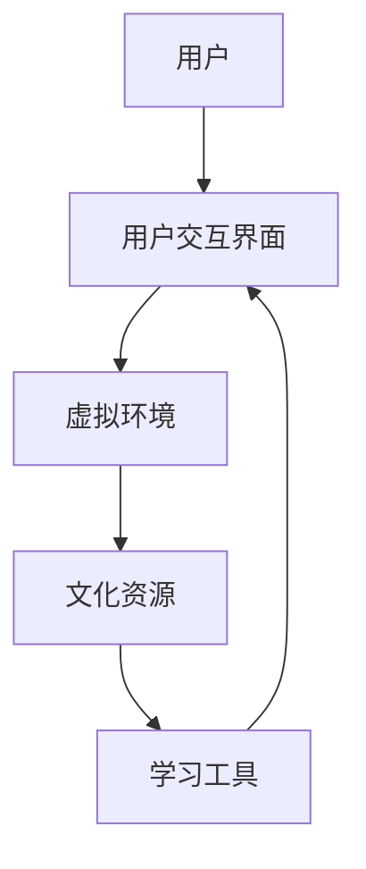
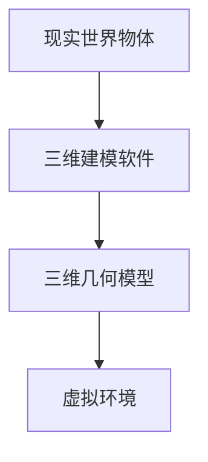
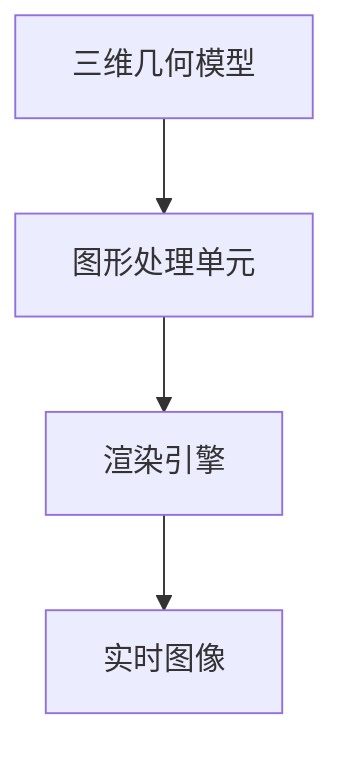
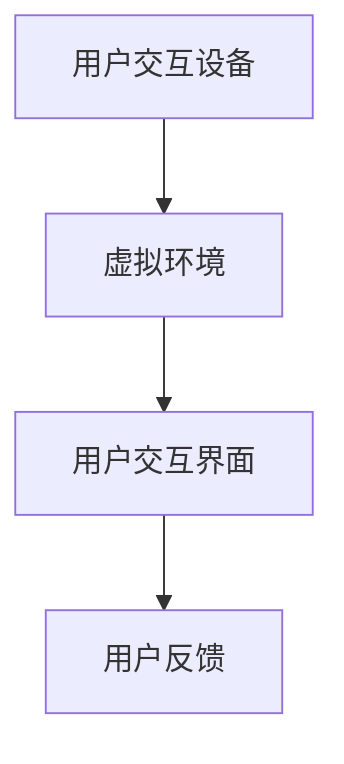
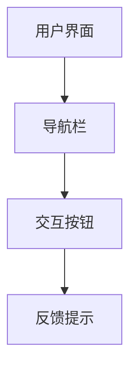
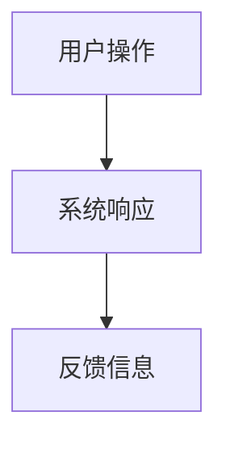
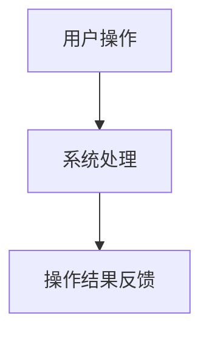
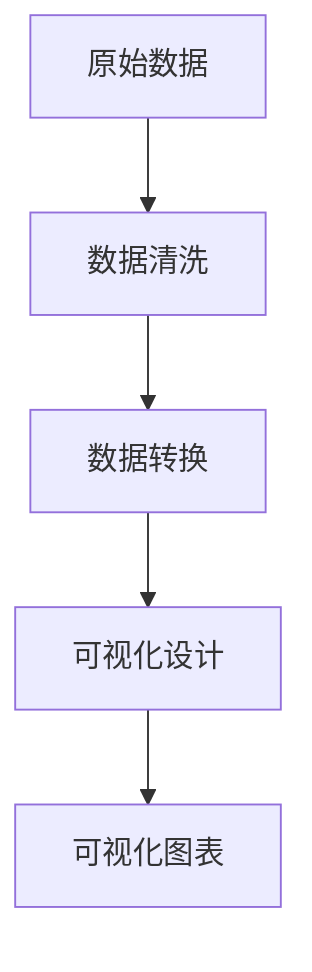
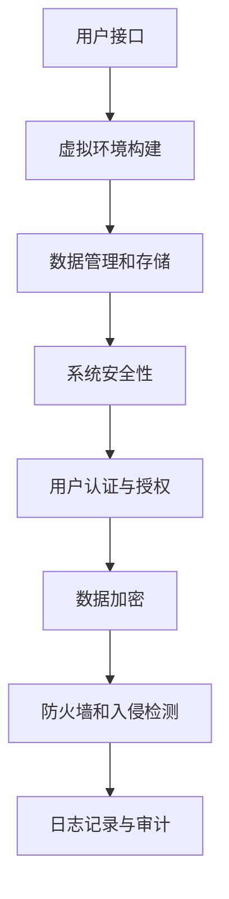

                 

### 第一部分：引言

#### 1.1 虚拟博物馆教育的概念和背景

虚拟博物馆教育，作为现代教育技术的一个重要分支，通过数字化的方式将现实中的博物馆资源进行虚拟再现，从而为学习者提供沉浸式的学习体验。这一概念的发展与虚拟现实（VR）、增强现实（AR）以及大数据技术的进步紧密相关。

首先，**虚拟博物馆的定义和特点**如下：
- **虚拟博物馆**：指的是利用计算机技术，尤其是虚拟现实和增强现实技术，将现实中的博物馆环境、展品、历史背景等元素数字化，并模拟出一个逼真的虚拟空间。
- **特点**：
  - **沉浸式体验**：学习者可以在虚拟环境中自由浏览、互动，感受到与现实中相近的视觉、听觉和触觉体验。
  - **灵活性**：虚拟博物馆不受地理位置和开放时间的限制，可以随时随地访问。
  - **互动性**：学习者可以通过与虚拟展品的互动，获取更深入的了解和学习。

**虚拟博物馆教育的发展历程**可以追溯到上世纪90年代，随着计算机技术和互联网的快速发展，虚拟博物馆逐渐从理论走向实践。以下是虚拟博物馆教育发展的一些重要里程碑：

1. **1990年代**：早期的虚拟博物馆主要以2D图像和文本形式展示，如美国的“史密森尼国家自然历史博物馆”和英国的“泰特现代艺术馆”的虚拟展览。
2. **2000年代**：虚拟博物馆开始采用虚拟现实和增强现实技术，提供了更加丰富的交互体验。例如，美国的“美国大博物馆”推出了基于VR的虚拟展览，使观众能够“走进”博物馆。
3. **2010年代至今**：随着VR和AR技术的成熟，虚拟博物馆教育进入了快速发展阶段。如今，许多博物馆和教育机构开始构建全方位的虚拟博物馆，利用先进的交互设计、数据可视化和人工智能技术，提供更加沉浸式的学习体验。

#### 1.2 虚拟博物馆教育的意义和价值

虚拟博物馆教育在当今社会中的地位愈发重要，其意义和价值体现在以下几个方面：

1. **促进文化传承**：虚拟博物馆教育能够将珍贵的文化遗产以数字化的形式保存和传播，使更多的人有机会接触和学习这些文化知识，从而促进文化的传承和发展。
   
2. **教育普及**：虚拟博物馆教育打破了地域和时间的限制，让无法亲临博物馆的公众，特别是偏远地区的学校和学生，也能够享受到高质量的教育资源，提高了教育的普及性和公平性。

3. **创新教育模式**：虚拟博物馆教育为教育者提供了全新的教学工具和手段，通过沉浸式体验和互动学习，激发了学生的学习兴趣和主动性，改变了传统教育的单向传递模式。

4. **提升学习效果**：虚拟博物馆教育提供了一个直观、互动的学习环境，使学习者能够更好地理解和记忆所学内容，提高了学习效果。

5. **推动技术发展**：虚拟博物馆教育的应用推动了虚拟现实、增强现实、大数据等前沿技术的发展，促进了相关技术的创新和进步。

综上所述，虚拟博物馆教育不仅为学习者提供了丰富的学习资源，同时也为教育和社会的发展带来了深远的影响。接下来，我们将深入探讨虚拟博物馆教育的基本原理和实现技术。

#### 1.1.1 虚拟博物馆的定义和特点

虚拟博物馆是一个通过数字技术创建的虚拟空间，它模拟了现实世界中的博物馆环境，使人们可以在虚拟环境中参观、学习和体验。虚拟博物馆不仅包括博物馆的实体展品，还涵盖了展览设计、环境布局、背景故事等多方面的元素，从而提供一个与真实博物馆相似的沉浸式体验。

**核心概念与联系**：

为了更好地理解虚拟博物馆，我们可以通过一个简单的 Mermaid 流程图来展示其核心组成部分和它们之间的联系：



- **用户**：用户是虚拟博物馆的主要参与者，可以通过用户交互界面进行操作和浏览。
- **用户交互界面**：用户交互界面是用户与虚拟博物馆进行交互的桥梁，它包括按钮、菜单、手势控制等元素，使用户能够自由地浏览、选择和互动。
- **虚拟环境**：虚拟环境是虚拟博物馆的核心部分，通过三维建模、实时渲染等技术，创建一个逼真的博物馆空间，使用户仿佛置身于现实中的博物馆。
- **文化资源**：文化资源是虚拟博物馆中的展品、历史资料、多媒体内容等，它们是用户学习和体验的重要对象。
- **学习工具**：学习工具包括各种辅助学习工具，如电子指南、互动问答、虚拟讲解等，它们帮助用户更深入地了解和学习展品。

通过这个流程图，我们可以清晰地看到虚拟博物馆的各个组成部分及其相互作用的方式。每个部分都在虚拟博物馆中扮演着重要的角色，共同构成了一个完整的沉浸式学习体验。

#### 1.1.2 虚拟博物馆教育的发展历程

虚拟博物馆教育的发展历程可以从20世纪末开始追溯，当时计算机技术和互联网的兴起为虚拟博物馆的创建提供了技术基础。以下是一些重要的发展阶段：

1. **初期探索（1990年代）**：
   - **1991年**，美国史密森尼学会首次推出了“美国历史虚拟博物馆”，这被认为是虚拟博物馆教育的开端。这一项目通过互联网向公众展示了美国历史博物馆的珍贵藏品，并提供了丰富的多媒体内容。
   - **1994年**，英国泰特现代美术馆推出了虚拟展览“英国现代艺术”，这是虚拟博物馆教育在艺术领域的早期尝试。

2. **初步发展（2000年代）**：
   - **2001年**，美国大都会艺术博物馆推出了“虚拟大都会艺术博物馆”，用户可以通过虚拟环境浏览博物馆的馆藏和展览。
   - **2004年**，谷歌艺术与文化项目启动，通过高清图像展示了全球多家博物馆和艺术画廊的藏品，使公众能够远程参观博物馆。

3. **技术成熟与广泛应用（2010年代至今）**：
   - **2010年**，虚拟现实（VR）和增强现实（AR）技术逐渐成熟，为虚拟博物馆教育提供了更加逼真的沉浸式体验。
   - **2014年**，谷歌推出了“Google Arts & Culture”应用，用户可以通过手机或VR头盔访问全球众多博物馆的虚拟展览。
   - **2017年**，微软发布了“混合现实博物馆”项目，通过混合现实技术提供了更加丰富的互动体验。

随着时间的推移，虚拟博物馆教育在技术、内容和应用领域都取得了显著的进展。如今，虚拟博物馆已经成为教育机构、博物馆和艺术画廊推广其藏品和展览的重要手段，不仅为公众提供了丰富的学习资源，也为教育者提供了新的教学工具和方法。

#### 1.2.1 虚拟博物馆教育在当今社会的作用

虚拟博物馆教育在当今社会扮演着多重角色，其影响力不仅体现在教育领域，还渗透到了文化传承、旅游业以及社会教育等多个方面。

首先，在**文化传承方面**，虚拟博物馆教育通过数字化手段将珍贵的文化遗产保存和传播。许多历史文物和艺术品因年代久远或地理原因难以被广泛接触，而虚拟博物馆提供了这些资源的一种全新的呈现方式。例如，通过虚拟现实技术，观众可以“走进”埃及金字塔，近距离观察文物，甚至体验考古发掘的过程。这不仅使得文化遗产的传承更加生动和真实，还激发了对历史和文化的兴趣，促进了文化的保护和传承。

其次，在**教育普及方面**，虚拟博物馆教育打破了传统教育的地理和时间限制。无论是在城市还是偏远地区，学生都可以通过网络访问到全球各地的博物馆和文化遗产。例如，美国的大都会艺术博物馆和英国的泰特现代美术馆都提供了丰富的虚拟展览和在线教育资源，使得全球学生能够享受到高质量的艺术教育。此外，虚拟博物馆教育还特别适合特殊需求的学生，如视力障碍或行动不便的学生，他们可以通过虚拟博物馆获取与正常学生相似的学习体验。

在**创新教育模式方面**，虚拟博物馆教育带来了教学方法和手段的革新。通过沉浸式体验和互动学习，学生不再只是被动地接受知识，而是能够主动探索和发现。例如，学生可以通过虚拟环境中的互动展品，深入理解历史事件或艺术作品背后的故事。这种互动性激发了学生的学习兴趣和主动性，提高了学习效果。此外，虚拟博物馆教育也为教师提供了丰富的教学资源，他们可以利用虚拟博物馆来设计教学活动，创造更加生动和有趣的学习体验。

最后，虚拟博物馆教育在**社会教育方面**也发挥着重要作用。虚拟博物馆不仅是一个教育工具，也是一个文化和社会的窗口。通过虚拟博物馆，公众可以了解不同国家和地区的文化，增进对多元文化的认识和尊重。例如，谷歌艺术与文化项目通过展示全球各地的博物馆和艺术画廊藏品，帮助人们跨越文化的界限，感受不同文化的独特魅力。

综上所述，虚拟博物馆教育在当今社会中具有不可替代的作用。它不仅促进了文化的传承和教育普及，还推动了教育模式的创新，并在社会教育方面发挥了重要作用。随着技术的不断进步，虚拟博物馆教育的影响力和作用将日益扩大，成为社会进步和发展的重要推动力量。

#### 1.2.2 虚拟博物馆教育的价值体现

虚拟博物馆教育在当今社会中展现出了多重价值，通过多个方面对教育、文化和社会产生积极影响。

首先，从**教育层面来看**，虚拟博物馆教育为学习者提供了一个丰富多样的学习平台。它不仅提供了传统的博物馆教育资源，还通过虚拟现实（VR）和增强现实（AR）技术，将学习体验提升到了一个全新的层次。例如，学生可以通过虚拟环境近距离观察历史文物和艺术品，甚至“走进”博物馆，参与互动式展览。这种沉浸式的学习体验不仅激发了学生的兴趣，还增强了他们对知识点的理解和记忆。此外，虚拟博物馆教育还允许学习者自主探索和学习，培养了他们的自主学习能力和批判性思维。

其次，虚拟博物馆教育在**文化传承方面**发挥了重要作用。通过数字化手段，虚拟博物馆能够保存和展示那些因年代久远或地理原因难以被广泛接触的文化遗产。例如，通过虚拟博物馆，人们可以远程参观世界各地的博物馆，欣赏珍贵的艺术品和历史文物，感受不同文化的独特魅力。这种数字化展示方式不仅有助于文化的传承，还使得文化遗产的保护和传播更加便捷和高效。

在**社会教育方面**，虚拟博物馆教育具有不可替代的价值。它为不同背景和年龄段的人提供了平等的学习机会，特别是对于那些地理位置偏远或资源有限的人群。例如，偏远地区的学校和学生可以通过虚拟博物馆接触到全球最顶尖的博物馆和文化遗产，从而拓宽他们的视野，提升他们的文化素养。此外，虚拟博物馆教育还促进了不同文化之间的交流与理解，增进了公众对多元文化的认识和尊重。

最后，虚拟博物馆教育在**社会经济发展**方面也具有重要作用。它不仅为旅游业带来了新的增长点，还为相关产业链提供了巨大的市场机会。例如，虚拟博物馆教育可以吸引更多的游客参观现实中的博物馆，促进旅游业的发展。同时，虚拟博物馆教育还催生了相关技术和产业的发展，如VR、AR设备制造、内容开发等，为经济增长注入了新的动力。

综上所述，虚拟博物馆教育在多个层面展现出了其独特的价值。它不仅促进了教育创新和文化传承，还为社会发展和经济繁荣做出了积极贡献。随着技术的不断进步，虚拟博物馆教育的价值将得到进一步的体现和提升。

## 第二部分：虚拟博物馆教育的基本原理

在深入了解虚拟博物馆教育之前，我们需要了解其核心原理和技术，这些原理和技术共同构成了虚拟博物馆教育的基础。本节将探讨虚拟博物馆教育的基本原理，包括虚拟现实（VR）技术、交互设计原理以及数据可视化技术等。

### 2.1.1 虚拟现实技术

虚拟现实技术是虚拟博物馆教育的基础，它通过创建一个模拟的、三维的虚拟环境，使用户能够沉浸在其中。虚拟现实技术涉及多个方面，包括三维建模、实时渲染和用户交互等。

#### 三维建模

三维建模是将现实世界中的物体和场景转化为虚拟环境的过程。它需要通过计算机软件，如AutoCAD、Blender或3ds Max等，创建三维几何模型。这些模型需要精确地反映现实中的物体和场景，包括大小、形状和纹理等。



#### 实时渲染

实时渲染是将三维模型在计算机上实时显示为图像的过程。这涉及到复杂的计算和图形处理，目的是创建逼真的视觉效果。实时渲染技术包括光线追踪、阴影处理和反射等，这些技术共同决定了虚拟环境的视觉质量。



#### 用户交互

用户交互是虚拟现实技术的重要组成部分，它决定了用户如何与虚拟环境进行互动。用户可以通过虚拟现实头盔、手柄、手势识别等设备来浏览、选择和操作虚拟环境中的对象。



#### 虚拟现实技术在虚拟博物馆教育中的应用

虚拟现实技术在虚拟博物馆教育中的应用极为广泛。通过虚拟现实技术，用户可以“走进”博物馆，近距离观察展品，甚至参与互动式展览。例如，用户可以360度旋转展品，查看其细节，或者通过虚拟讲解了解展品的历史背景。这种沉浸式的学习体验不仅增强了用户对展品的理解和记忆，还激发了他们的学习兴趣。

### 2.1.2 交互设计原理

交互设计原理是虚拟博物馆教育中至关重要的一环，它决定了用户如何与虚拟环境进行有效的互动。交互设计包括用户界面设计、用户操作逻辑和反馈机制等。

#### 用户界面设计

用户界面设计是交互设计的核心，它需要确保用户能够轻松地理解和使用虚拟博物馆的功能。用户界面设计应遵循简洁、直观和一致性的原则，使用户能够快速上手并高效地进行操作。



#### 用户操作逻辑

用户操作逻辑是用户与虚拟环境之间互动的规则和流程。它需要确保用户的操作能够实现预期的功能，并提供清晰的反馈。用户操作逻辑的设计应充分考虑用户的习惯和需求，以提高用户体验。



#### 反馈机制

反馈机制是交互设计中的重要组成部分，它通过实时反馈用户操作的结果，帮助用户了解系统状态和操作效果。良好的反馈机制可以提高用户的操作效率和信心。



#### 交互设计原理在虚拟博物馆教育中的应用

在虚拟博物馆教育中，交互设计原理的应用至关重要。例如，用户可以通过触摸屏幕或虚拟现实头盔进行互动，浏览展品或参加互动式展览。通过设计简洁直观的用户界面和合理的用户操作逻辑，用户可以轻松地获取所需的信息和体验。

### 2.1.3 数据可视化技术

数据可视化技术是将复杂的数据和信息以图形或图表的形式呈现，以便用户更容易理解和分析。在虚拟博物馆教育中，数据可视化技术用于展示展品的统计数据、历史背景和文化意义等。

#### 数据可视化技术原理

数据可视化技术涉及多个方面，包括数据清洗、数据转换和可视化设计等。

- **数据清洗**：确保数据的质量和一致性，去除噪声和错误。
- **数据转换**：将数据转换为适合可视化呈现的形式，如数值、分类或时间序列数据。
- **可视化设计**：选择合适的图表类型和设计元素，以直观地展示数据。



#### 数据可视化技术原理在虚拟博物馆教育中的应用

在虚拟博物馆教育中，数据可视化技术可以用于多种用途。例如，用户可以通过图表了解展品的年代分布、地域来源或文化特征。这种可视化的信息展示不仅使得学习过程更加直观，还有助于用户更深入地理解展品背后的历史和文化背景。

综上所述，虚拟博物馆教育的基本原理包括虚拟现实技术、交互设计原理和数据可视化技术等。这些原理共同构成了虚拟博物馆教育的核心框架，为用户提供了一个丰富、互动和沉浸式的学习体验。在接下来的部分，我们将进一步探讨虚拟博物馆教育的技术架构，了解其如何实现这些基本原理。

### 2.2 虚拟博物馆教育的技术架构

虚拟博物馆教育的技术架构是构建一个功能强大、用户友好的虚拟博物馆平台的基础。它包括多个关键模块，如虚拟环境构建、数据管理和存储、系统安全性等。以下是对这些模块的详细描述。

#### 虚拟环境构建

虚拟环境构建是虚拟博物馆教育的核心模块，它决定了用户在虚拟空间中的体验质量。虚拟环境构建主要包括以下几个步骤：

1. **三维建模**：使用三维建模软件（如Blender、3ds Max等）创建博物馆的三维模型，包括展厅、展品、背景等。这些模型需要高度逼真，以提供沉浸式的体验。

2. **实时渲染**：通过实时渲染引擎（如Unity、Unreal Engine等）对三维模型进行渲染，以生成逼真的图像和动画。实时渲染需要高效计算和处理能力，以确保用户在虚拟环境中的流畅操作。

3. **交互设计**：设计用户与虚拟环境之间的交互方式，包括手势控制、语音识别、触摸屏等。交互设计需要考虑用户的操作习惯和体验需求，以提高用户的使用满意度。

4. **虚拟现实头盔和传感器**：为了提供更加沉浸式的体验，虚拟博物馆教育需要使用虚拟现实头盔（如Oculus Rift、HTC Vive等）和传感器（如手柄、手势识别等）。这些设备能够捕捉用户的动作和姿态，使他们在虚拟环境中更加自然地进行互动。

#### 数据管理和存储

数据管理和存储是虚拟博物馆教育的重要模块，它负责处理海量的展品数据和用户数据。以下是一些关键的技术和策略：

1. **数据采集**：通过多种方式采集展品数据，包括数字化图像、3D模型、音频、视频等多媒体数据。这些数据需要经过清洗和整理，以确保质量。

2. **数据库设计**：设计合理的数据库结构，存储和管理展品数据。常用的数据库技术包括关系数据库（如MySQL、PostgreSQL等）和NoSQL数据库（如MongoDB、Cassandra等）。数据库设计需要考虑数据的查询性能和存储效率。

3. **数据存储**：采用分布式存储技术（如Hadoop、Ceph等），将数据分布存储在不同的节点上，以提高存储容量和查询效率。分布式存储还能够提供高可用性和容错性。

4. **数据备份与恢复**：定期备份数据库和数据文件，以防止数据丢失。同时，建立数据恢复机制，确保在出现故障时能够快速恢复数据。

#### 系统安全性

系统安全性是虚拟博物馆教育的重要组成部分，它关系到用户数据的安全性和系统的稳定性。以下是一些关键的技术和措施：

1. **用户认证与授权**：通过用户认证机制（如用户名和密码、双因素认证等）确保用户身份的合法性。同时，通过权限控制策略（如角色权限、操作权限等）确保用户只能访问和操作授权的内容。

2. **数据加密**：对用户数据和传输的数据进行加密，以防止数据泄露。常用的加密技术包括SSL/TLS、AES等。

3. **防火墙和入侵检测**：部署防火墙和入侵检测系统，以防止外部攻击和内部威胁。防火墙能够过滤恶意流量，入侵检测系统能够实时监测和报警异常行为。

4. **日志记录与审计**：记录系统操作日志和用户活动日志，以便在出现问题时进行审计和追踪。日志记录还能够帮助分析系统性能和用户行为。

#### 技术架构图

为了更好地理解虚拟博物馆教育的技术架构，我们可以通过一个简单的架构图来展示各个模块之间的关系：



通过这个架构图，我们可以清晰地看到虚拟博物馆教育的各个模块及其相互关系。每个模块都在虚拟博物馆教育中发挥着重要作用，共同构建了一个稳定、安全、高效的虚拟学习平台。

### 2.2.2 数据管理和存储技术

在虚拟博物馆教育中，数据管理和存储是关键的一环，它直接影响到用户体验和数据的安全。高效的数据管理和存储技术能够确保数据的可访问性、可靠性和持久性。以下是一些核心的技术和策略。

#### 分布式存储

分布式存储技术是虚拟博物馆教育中常用的技术之一，它通过将数据分散存储在多个节点上，提供高可用性和高扩展性。以下是一些分布式存储技术的关键特点：

- **Hadoop**：Hadoop是一个开源的分布式计算框架，主要用于大数据处理和存储。它基于HDFS（Hadoop Distributed File System）文件系统，能够处理海量数据，并提供高可靠性。
  
  ```mermaid
  graph TD
  A[Hadoop] --> B[HDFS]
  B --> C[MapReduce]
  C --> D[高可用性]
  D --> E[高扩展性]
  ```

- **Ceph**：Ceph是一个分布式存储系统，它支持对象存储、块存储和文件存储，并具备高可用性和自修复能力。

  ```mermaid
  graph TD
  A[Ceph] --> B[对象存储]
  B --> C[块存储]
  C --> D[文件存储]
  D --> E[自修复能力]
  E --> F[高可用性]
  ```

#### 数据存储方案

在实际应用中，虚拟博物馆教育通常采用混合存储方案，结合不同类型的存储技术以优化性能和成本。以下是一些常见的数据存储方案：

- **热存储与冷存储**：热存储用于存储频繁访问的数据，如用户最近浏览的展品和互动记录。冷存储则用于存储不常访问的数据，如历史数据和备份数据。常用的热存储技术包括SSD（固态硬盘）和NVM（非易失性内存），而冷存储则常用HDD（机械硬盘）。

  ```mermaid
  graph TD
  A[热存储] --> B[SSD]
  B --> C[用户活跃数据]
  C --> D[NVM]
  D --> E[高频交互数据]

  A --> F[冷存储]
  F --> G[HDD]
  G --> H[历史数据]
  H --> I[备份数据]
  ```

- **分布式文件系统与数据库**：分布式文件系统（如HDFS、Ceph）和数据库（如MySQL、MongoDB）共同构成了数据存储的核心。分布式文件系统用于存储大规模的文件和数据集，而数据库则用于存储结构化的数据。

  ```mermaid
  graph TD
  A[HDFS] --> B[大数据存储]
  B --> C[非结构化数据]

  A --> D[MongoDB]
  D --> E[文档存储]
  E --> F[非结构化数据]

  A --> G[MySQL]
  G --> H[关系数据库]
  H --> I[结构化数据]
  ```

#### 数据备份与恢复

数据备份与恢复是确保数据安全的重要手段。在虚拟博物馆教育中，定期备份和快速恢复机制至关重要。

- **增量备份**：增量备份只备份自上次备份以来发生变化的数据，减少了备份的时间和存储空间。

  ```mermaid
  graph TD
  A[增量备份]
  A --> B[变化数据备份]
  B --> C[高效备份]
  ```

- **全量备份**：全量备份备份整个数据集，虽然备份时间较长，但能够提供完整的恢复能力。

  ```mermaid
  graph TD
  A[全量备份]
  A --> B[完整数据备份]
  B --> C[全面恢复]
  ```

- **备份策略**：常用的备份策略包括每日增量备份、每周全量备份等。结合不同备份策略，可以确保数据的实时性和安全性。

  ```mermaid
  graph TD
  A[每日增量备份]
  A --> B[日常数据保护]

  A --> C[每周全量备份]
  C --> D[完整数据保护]
  ```

#### 数据加密与安全性

数据在传输和存储过程中需要确保安全性，以防止数据泄露和未经授权的访问。以下是一些常用的数据加密与安全性技术：

- **SSL/TLS**：用于数据传输过程中的加密，确保数据在互联网上传输时的安全性。

  ```mermaid
  graph TD
  A[SSL/TLS]
  A --> B[数据传输加密]
  B --> C[安全传输]
  ```

- **AES加密**：用于数据存储过程中的加密，确保数据在存储设备上的安全性。

  ```mermaid
  graph TD
  A[AES加密]
  A --> B[数据存储加密]
  B --> C[数据安全]
  ```

通过上述数据管理和存储技术，虚拟博物馆教育能够高效、安全地管理大量数据，确保用户能够随时访问所需的信息，并获得高质量的沉浸式学习体验。

### 2.2.3 系统安全性和隐私保护

在虚拟博物馆教育中，系统安全性和隐私保护是至关重要的，它直接关系到用户数据的安全和隐私。为了确保系统的安全性，我们需要从多个方面进行考虑和实施。

#### 用户认证与授权

用户认证是系统安全性的基础，它确保只有合法用户才能访问系统资源。常见的用户认证方式包括：

- **用户名和密码**：用户通过输入用户名和密码进行身份验证。这种方式简单易用，但存在密码泄露的风险。
  
  ```mermaid
  graph TD
  A[用户名和密码]
  A --> B[身份验证]
  B --> C[简单易用]
  B --> D[风险较高]
  ```

- **双因素认证（2FA）**：除了用户名和密码，用户还需要通过手机短信、验证码或生物识别等方式进行二次验证，提高系统的安全性。

  ```mermaid
  graph TD
  A[双因素认证]
  A --> B[二次验证]
  B --> C[提高安全性]
  B --> D[额外认证方式]
  ```

#### 数据加密

数据加密是保护数据安全的重要手段，确保数据在传输和存储过程中不被窃取或篡改。以下是一些常用的数据加密技术：

- **SSL/TLS**：用于数据传输过程中的加密，确保数据在互联网上传输时的安全性。

  ```mermaid
  graph TD
  A[SSL/TLS]
  A --> B[传输加密]
  B --> C[安全传输]
  ```

- **AES加密**：用于数据存储过程中的加密，确保数据在存储设备上的安全性。

  ```mermaid
  graph TD
  A[AES加密]
  A --> B[存储加密]
  B --> C[数据安全]
  ```

#### 防火墙和入侵检测

防火墙和入侵检测系统能够防止外部攻击和内部威胁，确保系统的稳定性。以下是一些关键的技术和策略：

- **防火墙**：防火墙是一种网络安全系统，通过设置访问控制规则，过滤进出网络的数据包，防止未授权访问。

  ```mermaid
  graph TD
  A[防火墙]
  A --> B[访问控制]
  B --> C[过滤数据包]
  B --> D[网络安全]
  ```

- **入侵检测系统（IDS）**：入侵检测系统能够实时监控网络流量，检测异常行为和潜在攻击，并在发现威胁时及时报警。

  ```mermaid
  graph TD
  A[入侵检测系统]
  A --> B[实时监控]
  B --> C[检测异常]
  B --> D[报警]
  ```

#### 日志记录与审计

日志记录与审计是确保系统安全性的重要手段，通过记录系统操作日志和用户活动日志，可以在出现问题时进行追踪和审计。

- **操作日志**：记录系统中的所有操作，如登录、访问、修改等。

  ```mermaid
  graph TD
  A[操作日志]
  A --> B[记录操作]
  B --> C[追踪问题]
  ```

- **审计日志**：记录系统中的重要操作和变更，如权限变更、数据删除等。

  ```mermaid
  graph TD
  A[审计日志]
  A --> B[重要操作记录]
  B --> C[变更追踪]
  ```

#### 安全策略与培训

制定合适的安全策略和进行定期的安全培训，能够提高系统安全性和用户的安全意识。以下是一些关键点和措施：

- **安全策略**：制定安全策略，包括用户认证、数据加密、访问控制、网络安全等，确保系统的各个环节都得到有效保护。

  ```mermaid
  graph TD
  A[安全策略]
  A --> B[用户认证]
  A --> C[数据加密]
  A --> D[访问控制]
  A --> E[网络安全]
  ```

- **安全培训**：定期对用户和员工进行安全培训，提高他们对安全威胁的认识和应对能力。

  ```mermaid
  graph TD
  A[安全培训]
  A --> B[用户]
  A --> C[员工]
  B --> D[安全意识]
  C --> E[应对能力]
  ```

通过上述措施，虚拟博物馆教育能够建立一个安全、可靠的系统，确保用户数据的安全和隐私。这不仅提高了用户的信任度和满意度，也为虚拟博物馆教育的可持续发展提供了保障。

## 第三部分：全球文化资源的沉浸式学习平台

虚拟博物馆教育的一个关键特点是能够为用户提供全球文化资源的沉浸式学习体验。为了实现这一目标，需要有效地获取和整合全球文化资源，并设计出能够提供高质量沉浸式学习体验的平台。

### 3.1 全球文化资源的获取和整合

全球文化资源的获取和整合是构建沉浸式学习平台的基础。以下是一些关键步骤和策略：

#### 3.1.1 全球文化资源的类型和来源

全球文化资源丰富多样，主要包括以下几类：

- **博物馆和艺术馆的藏品**：包括历史文物、艺术品、古董等。
- **文化遗产**：如传统手工艺、建筑、民俗风情等。
- **历史资料**：包括文献、档案、录音、影像资料等。
- **数字化资源**：如在线数据库、虚拟展览、电子书籍等。

这些资源可以来自以下渠道：

- **博物馆和文化遗产机构**：许多国家和地区的博物馆和文化遗产机构已经将他们的藏品和资料数字化，并通过互联网进行分享。
- **学术机构和研究项目**：大学和研究机构通常拥有丰富的学术资源和研究成果，这些资源可以用于虚拟博物馆教育。
- **私营企业和非营利组织**：一些私营企业和非营利组织也参与文化资源的数字化和共享，为虚拟博物馆教育提供了宝贵的资源。

#### 3.1.2 全球文化资源的整合策略

为了有效地整合全球文化资源，以下策略可以发挥作用：

- **标准化数据格式**：采用统一的数据格式和元数据标准，确保不同来源的资源能够互相兼容和整合。
- **数据清洗与预处理**：对获取的数据进行清洗和预处理，确保数据的准确性和一致性。
- **分布式存储**：利用分布式存储技术，将大量文化资源存储在多个节点上，提高数据的可访问性和安全性。
- **数据共享协议**：制定合适的共享协议，确保文化资源的合理利用和共享。

#### 3.1.3 全球文化资源的整合方法

整合全球文化资源的方法包括：

- **内容聚合**：通过聚合不同来源的文化资源，构建一个综合性的虚拟博物馆平台。
- **内容融合**：将不同的文化元素进行融合，创建出独特的虚拟展览和互动体验。
- **内容更新**：定期更新文化资源，确保虚拟博物馆的教育内容保持时效性和丰富性。

### 3.2 沉浸式学习体验的设计与实现

为了提供高质量的沉浸式学习体验，需要从设计原则、实现技术和效果评估三个方面进行考虑。

#### 3.2.1 沉浸式学习体验的设计原则

沉浸式学习体验的设计应遵循以下原则：

- **真实性**：确保虚拟环境中的展品和场景与真实世界尽可能接近，使用户感受到真实的文化氛围。
- **互动性**：提供丰富的交互元素，使用户能够与虚拟环境中的展品进行互动，增加学习体验的趣味性和参与感。
- **灵活性**：设计灵活的学习路径和功能，使用户能够根据自己的兴趣和需求进行学习。
- **安全性**：确保系统的稳定性和数据的安全性，防止用户信息和隐私泄露。

#### 3.2.2 沉浸式学习体验的实现技术

实现沉浸式学习体验的关键技术包括：

- **虚拟现实（VR）技术**：通过VR头盔和传感器，创建一个高度真实的虚拟环境，使用户能够沉浸其中。
- **增强现实（AR）技术**：通过AR技术，将虚拟元素叠加在现实世界中，提供与现实场景互动的体验。
- **数据可视化技术**：使用数据可视化工具，将复杂的统计数据和文化信息以图形化的形式呈现，提高信息传达的效率。
- **交互设计技术**：设计直观易用的用户界面，确保用户能够轻松地与虚拟环境进行互动。

#### 3.2.3 沉浸式学习体验的效果评估

为了评估沉浸式学习体验的效果，可以采用以下方法：

- **用户反馈**：通过问卷调查、访谈等方式收集用户对学习体验的反馈，了解他们的满意度和体验感受。
- **学习效果测试**：通过学习前后的测试，评估用户在学习过程中所获得的知识和技能。
- **数据分析**：分析用户在虚拟博物馆中的行为数据，如访问路径、互动频率等，了解用户的学习习惯和偏好。

#### 3.2.4 案例研究：沉浸式学习体验的实践

以下是一个沉浸式学习体验的案例研究：

**案例一：谷歌艺术与文化项目**

谷歌艺术与文化项目通过虚拟现实技术，让用户可以远程参观全球各大博物馆和艺术画廊。用户可以通过VR头盔或手机访问这个平台，体验逼真的展览场景，与展品互动，并了解艺术作品背后的故事。

- **设计原则**：真实性、互动性、灵活性和安全性。
- **实现技术**：虚拟现实（VR）技术、增强现实（AR）技术、数据可视化技术。
- **效果评估**：通过用户反馈和学习效果测试，评估学习体验的质量和效果。

通过这个案例，我们可以看到沉浸式学习体验在虚拟博物馆教育中的成功应用。它不仅提高了用户的参与度和学习兴趣，也为教育机构提供了全新的教学工具和方法。

### 3.3 案例研究：全球文化资源的沉浸式学习平台实践

在探讨如何利用虚拟博物馆教育平台提供全球文化资源的沉浸式学习体验时，我们可以通过一些实际案例来展示其设计和实施过程。

#### 3.3.1 案例一：某虚拟博物馆教育平台的设计与实施

**背景**：
一个名为“全球文化瑰宝”的虚拟博物馆教育平台，旨在通过虚拟现实（VR）和增强现实（AR）技术，为全球学生和公众提供沉浸式的文化学习体验。

**设计与实施过程**：

1. **需求分析**：
   - **目标用户**：学生、教育者、博物馆爱好者。
   - **核心功能**：虚拟博物馆参观、互动学习、文化遗产探索、教育资源分享。

2. **技术选型**：
   - **虚拟现实（VR）技术**：使用Unity引擎进行三维建模和渲染，确保虚拟环境的真实感和交互性。
   - **增强现实（AR）技术**：使用ARKit（iOS）或ARCore（Android）进行开发，将虚拟展品叠加在现实场景中。
   - **数据可视化技术**：采用D3.js和Tableau等工具，将文化数据以图形化的方式呈现。

3. **实施步骤**：
   - **虚拟环境构建**：通过3D建模软件（如Blender、3ds Max）创建博物馆的虚拟模型，包括展厅、展品和背景。
   - **交互设计**：设计直观易用的交互界面，包括导航、查询和互动功能。
   - **数据整合**：从多个来源（如博物馆、大学和文化机构）获取文化数据，进行清洗和整合，构建数据资源库。
   - **平台开发**：使用VR和AR技术，实现虚拟博物馆教育平台的核心功能。
   - **用户测试**：邀请目标用户进行测试，收集反馈，优化平台功能。

4. **效果评估**：
   - **用户满意度**：通过问卷调查和访谈，评估用户对平台的满意度。
   - **学习效果**：通过前测和后测，比较用户在参与虚拟博物馆教育前后的知识水平。
   - **平台数据**：分析用户在平台上的行为数据，如访问频率、互动时间等，了解用户的使用习惯。

**结论**：
“全球文化瑰宝”虚拟博物馆教育平台成功地为用户提供了沉浸式的文化学习体验，提高了用户对文化遗产的认识和兴趣。通过数据分析和用户反馈，平台不断优化和改进，为用户提供更好的服务。

#### 3.3.2 案例二：某文化教育机构的应用案例

**背景**：
一个位于中国北京的文化教育机构，通过虚拟博物馆教育平台，为高中生提供文化素养课程。

**设计与实施过程**：

1. **需求分析**：
   - **目标用户**：高中生。
   - **核心功能**：虚拟博物馆参观、文化知识学习、互动式作业和测试。

2. **技术选型**：
   - **虚拟现实（VR）技术**：使用Unity引擎进行三维建模和渲染。
   - **交互设计**：采用Unity UI系统设计直观的交互界面。
   - **学习管理平台**：使用Moodle等学习管理平台，管理课程内容和学生学习进度。

3. **实施步骤**：
   - **课程设计**：结合高中文化素养课程大纲，设计虚拟博物馆的教育内容。
   - **虚拟环境构建**：创建虚拟博物馆的虚拟环境，包括展厅和展品。
   - **交互设计**：设计互动式教学工具，如问答、模拟考古等。
   - **平台搭建**：搭建基于Moodle的学习管理平台，整合虚拟博物馆教育内容。
   - **教师培训**：为教师提供培训，确保他们能够熟练使用虚拟博物馆教育平台。

4. **效果评估**：
   - **学生反馈**：通过问卷调查，收集学生对虚拟博物馆教育的反馈。
   - **学习成绩**：比较学生在参与虚拟博物馆教育前后的学习成绩，评估教育效果。
   - **教师评价**：通过教师评价，了解虚拟博物馆教育在课程教学中的应用效果。

**结论**：
该文化教育机构通过虚拟博物馆教育平台，成功地提高了高中生的文化素养。虚拟博物馆教育平台不仅丰富了教学内容，还增强了学生的学习兴趣和主动性。通过持续的数据分析和用户反馈，平台不断改进，为教育者提供了有力的教学支持。

通过这两个案例，我们可以看到虚拟博物馆教育平台在实践中的应用效果，以及如何通过设计、技术和评估，提供高质量的沉浸式学习体验。

## 第四部分：虚拟博物馆教育的实施

虚拟博物馆教育的实施涉及多个关键步骤，包括项目规划与设计、平台搭建与开发、教育资源建设以及教育教学实施。本部分将详细探讨这些实施步骤及其在实践中的应用。

### 4.1 虚拟博物馆教育的实施步骤

#### 4.1.1 项目规划与设计

项目规划与设计是虚拟博物馆教育成功实施的第一步，它决定了项目的方向和目标。以下是一些关键步骤：

1. **需求分析**：
   - **目标用户**：确定虚拟博物馆教育的主要目标用户，如学生、教育者或公众。
   - **功能需求**：明确虚拟博物馆教育平台需要实现的功能，如虚拟参观、互动学习、教育资源分享等。
   - **技术需求**：确定项目所需的技术，包括虚拟现实（VR）、增强现实（AR）、数据可视化等。

2. **项目范围**：定义项目的范围，包括内容、时间和资源限制。

3. **项目目标**：设定明确的项目目标，包括预期的学习效果、用户体验和系统性能。

4. **风险评估**：识别项目可能面临的风险，并制定相应的应对策略。

5. **资源规划**：确定项目所需的资源，包括人力、技术和资金等。

#### 4.1.2 平台搭建与开发

平台搭建与开发是虚拟博物馆教育实施的的核心环节。以下是一些关键步骤：

1. **技术选型**：
   - **开发环境**：选择合适的开发环境和工具，如Unity、Unreal Engine、Blender等。
   - **数据库**：选择合适的数据库系统，如MySQL、MongoDB等。
   - **服务器**：选择合适的服务器，如云服务器或自建服务器。

2. **系统架构设计**：
   - **前端设计**：设计用户界面和交互逻辑，确保用户体验友好。
   - **后端设计**：设计服务器端的架构，包括API接口、数据处理和存储等。

3. **虚拟环境构建**：
   - **三维建模**：使用三维建模软件创建博物馆的虚拟环境，包括展厅、展品和背景。
   - **实时渲染**：使用渲染引擎实现虚拟环境的实时渲染，确保画面质量和流畅度。

4. **交互设计**：
   - **用户交互**：设计用户与虚拟环境的交互方式，如手势控制、语音交互等。
   - **互动模块**：开发互动模块，如问答、虚拟讲解、模拟考古等，增强用户体验。

5. **平台测试**：进行功能测试、性能测试和安全性测试，确保平台稳定可靠。

#### 4.1.3 教育资源建设

教育资源建设是虚拟博物馆教育的核心内容，它决定了用户的学习体验和学习效果。以下是一些关键步骤：

1. **内容规划**：
   - **资源类型**：确定所需的教育资源类型，如历史文献、艺术品、多媒体资料等。
   - **内容来源**：获取资源的来源，包括博物馆、大学、文化机构等。

2. **资源收集**：
   - **数字化**：将物理资源数字化，包括扫描、拍照、录音、录像等。
   - **版权处理**：确保所有资源的版权合法，避免法律风险。

3. **资源整合**：
   - **数据清洗**：对收集到的数据进行清洗和整理，确保数据的质量和一致性。
   - **数据存储**：将整合后的数据存储在数据库中，便于管理和查询。

4. **教育资源管理**：
   - **分类和标签**：对教育资源进行分类和标签化，方便用户查找和使用。
   - **元数据管理**：为每个资源添加元数据，包括标题、描述、作者、时间等，提高数据可搜索性。

#### 4.1.4 教育教学实施

教育教学实施是将虚拟博物馆教育平台应用于实际教学的过程。以下是一些关键步骤：

1. **课程设计**：
   - **教学目标**：设定明确的教学目标，包括知识目标、能力目标和情感目标。
   - **教学策略**：设计适合虚拟博物馆教育平台的教学策略，如互动式教学、探究式学习等。

2. **教学活动**：
   - **课堂导入**：通过虚拟博物馆的虚拟参观，引入课程主题。
   - **互动学习**：组织学生进行互动式学习，如问答、小组讨论等。
   - **作业和测试**：布置相关作业和测试，以巩固所学知识。

3. **教师培训**：
   - **技术培训**：为教师提供虚拟博物馆教育平台的技术培训，确保他们能够熟练使用平台。
   - **教学策略培训**：为教师提供教学策略的培训，帮助他们更好地应用虚拟博物馆教育平台。

4. **效果评估**：
   - **学生反馈**：通过问卷调查、访谈等方式收集学生的反馈，了解他们的学习体验和满意度。
   - **学习效果**：通过测试和成绩评估，比较学生在参与虚拟博物馆教育前后的学习效果。

### 4.2 虚拟博物馆教育的应用领域

虚拟博物馆教育在多个领域都有广泛的应用，包括文化教育、旅游和社会教育等。

#### 4.2.1 文化教育领域

在文化教育领域，虚拟博物馆教育为教育者提供了丰富的教学资源，使学生能够深入了解文化遗产。以下是一些具体应用案例：

- **历史教育**：通过虚拟博物馆，学生可以“走进”历史事件现场，观看历史文物，了解历史背景。例如，参观古埃及金字塔，观看古文物的数字化展示。
- **艺术教育**：虚拟博物馆提供了大量的艺术作品，学生可以通过虚拟现实技术近距离观察艺术品，学习艺术鉴赏知识。例如，通过虚拟展览，学生可以欣赏世界名画，了解艺术流派和艺术家的创作背景。
- **文化遗产保护**：虚拟博物馆教育可以帮助教育者和文化遗产专家更好地保护和管理文化遗产。例如，通过虚拟重建，保存和展示濒危文化遗产。

#### 4.2.2 旅游领域

虚拟博物馆教育在旅游领域也有广泛的应用，为游客提供了丰富的旅游体验。以下是一些具体应用案例：

- **虚拟旅游**：通过虚拟博物馆，游客可以在虚拟环境中参观博物馆和文化遗产，无需实际前往。例如，通过虚拟现实技术，游客可以“走进”故宫，参观宫殿和文物。
- **旅游教育**：虚拟博物馆教育可以为旅游者提供文化背景和历史知识，增强旅游体验。例如，在参观名胜古迹时，通过虚拟讲解，游客可以了解文物的历史和文化背景。
- **旅游营销**：虚拟博物馆教育可以作为旅游目的地营销的工具，吸引更多游客。例如，通过虚拟展览，展示旅游目的地的独特文化和历史。

#### 4.2.3 社会教育领域

虚拟博物馆教育在社会教育领域也发挥了重要作用，为不同年龄段和背景的人群提供了学习资源。以下是一些具体应用案例：

- **公共教育**：虚拟博物馆教育为公众提供了丰富的学习资源，特别是在偏远地区或资源有限的社区。例如，通过虚拟博物馆，公众可以了解世界各地的文化，拓宽视野。
- **终身教育**：虚拟博物馆教育为成年人提供了继续学习的途径，使他们能够不断更新知识和技能。例如，通过虚拟博物馆，成人可以学习新的艺术、历史和科学知识。
- **特殊教育**：虚拟博物馆教育对特殊需求的学生（如视力障碍、行动不便等）提供了便利。通过虚拟环境，他们可以体验和学习与正常学生相似的内容。

综上所述，虚拟博物馆教育在多个领域都有广泛的应用，为教育、旅游和社会教育带来了新的机遇和挑战。随着技术的不断进步，虚拟博物馆教育的应用领域将更加广泛，为人们提供更加丰富和多样化的学习体验。

### 4.3 虚拟博物馆教育的效果评估与优化

虚拟博物馆教育的效果评估与优化是确保其质量和可持续发展的关键环节。通过系统的评估方法，可以准确地衡量虚拟博物馆教育在不同方面的表现，并据此进行优化，提高其教育效果。

#### 4.3.1 效果评估方法

效果评估主要涉及以下几个方面：

1. **用户满意度**：
   - **问卷调查**：通过问卷调查收集用户对虚拟博物馆教育的满意度，包括界面友好性、内容丰富度、学习体验等。
   - **用户访谈**：与用户进行深度访谈，了解他们的具体使用体验和建议，获取更详细的反馈信息。

2. **学习效果**：
   - **前测和后测**：在用户参与虚拟博物馆教育前和后进行测试，比较知识掌握程度的差异，评估学习效果。
   - **知识测评**：设计知识测评题，通过测评用户的答题情况，了解他们对学习内容的掌握情况。

3. **用户行为分析**：
   - **访问数据**：分析用户在虚拟博物馆教育平台上的访问数据，如访问时间、互动频率、学习路径等，了解用户的行为模式和偏好。
   - **互动记录**：记录用户与虚拟环境的互动记录，如点击次数、互动类型等，评估用户的参与度。

4. **教育成果**：
   - **学习成果展示**：鼓励用户展示他们在虚拟博物馆教育中的学习成果，如笔记、作品、项目等，通过展示评估教育成果。
   - **教育反馈**：通过用户反馈了解虚拟博物馆教育对他们的实际影响，如知识提升、兴趣培养等。

#### 4.3.2 教育效果优化策略

根据效果评估的结果，可以采取以下策略进行优化：

1. **界面优化**：
   - **用户友好性**：简化界面设计，确保用户能够轻松上手，提高使用满意度。
   - **交互设计**：改进交互设计，增加用户与虚拟环境的互动性，提高用户的参与度。

2. **内容丰富度**：
   - **增加资源**：不断丰富虚拟博物馆的教育资源，增加新的展品、多媒体内容和互动环节。
   - **个性化推荐**：基于用户的行为数据，推荐个性化的学习内容，提高用户的兴趣和参与度。

3. **技术改进**：
   - **提升性能**：优化虚拟环境的渲染效果，提高系统运行的流畅度，减少加载时间。
   - **增强互动性**：引入更多互动技术，如虚拟现实（VR）、增强现实（AR）等，提供更加丰富的沉浸式体验。

4. **教学策略**：
   - **个性化教学**：根据用户的特点和学习需求，设计个性化的教学策略，提高学习效果。
   - **混合式教学**：结合线上线下教学方式，利用虚拟博物馆教育的优势，提供更灵活和高效的学习体验。

5. **反馈机制**：
   - **即时反馈**：在用户互动过程中提供即时反馈，帮助用户理解和使用虚拟博物馆教育平台。
   - **持续改进**：根据用户反馈和效果评估结果，持续改进平台的功能和设计，不断提升教育质量。

通过系统的效果评估和优化策略，虚拟博物馆教育可以不断提高其教育效果，为用户提供更优质的学习体验。这不仅有助于提升学习者的知识和技能，也为虚拟博物馆教育的可持续发展提供了保障。

### 5.1 虚拟博物馆教育的挑战

虚拟博物馆教育在实现全球文化资源的沉浸式学习平台方面展现出巨大潜力，但同时也面临着诸多挑战，这些挑战主要集中在技术、教育和社会三个方面。

#### 5.1.1 技术挑战

虚拟博物馆教育依赖一系列先进技术的支持，包括虚拟现实（VR）、增强现实（AR）、大数据处理、人工智能（AI）等。然而，这些技术的实现和优化仍然面临一些难题：

1. **技术成熟度**：尽管VR和AR技术取得了显著进步，但现有的技术仍然存在性能瓶颈，如低延迟、低分辨率和低帧率等问题。这些问题影响了用户在虚拟环境中的沉浸体验。
2. **数据管理和存储**：虚拟博物馆教育需要处理和存储大量的多媒体数据，如3D模型、高清图像、音频和视频等。这要求高效的数据库和分布式存储解决方案，以确保数据的快速访问和存储安全。
3. **计算资源**：构建和维护一个高质量的虚拟博物馆教育平台需要强大的计算资源。特别是在实时渲染和数据处理方面，对计算性能的要求非常高，这给技术团队带来了巨大的挑战。

#### 5.1.2 教育挑战

虚拟博物馆教育在教育领域的应用也面临一些独特的挑战，这些挑战涉及教育理念、教学方法和学习效果等方面：

1. **教学模式的转变**：虚拟博物馆教育要求教育者从传统的单向教学模式转向互动式、探究式教学模式。这种转变需要教育者具备新的教学技能和知识，同时也需要教育机构提供相应的培训和资源支持。
2. **学生的学习适应**：学生需要适应新的学习环境和学习方式。一些学生可能不熟悉VR或AR技术，需要时间来适应和学习。此外，虚拟环境中的学习体验可能无法完全替代现实中的互动和体验，这对学生的学习效果提出了挑战。
3. **教育效果的评估**：评估虚拟博物馆教育的效果比传统的教学方法更具挑战性。需要设计科学、全面的评估方法，包括用户满意度、学习效果、知识掌握程度等，以确保教育质量的持续提升。

#### 5.1.3 社会挑战

虚拟博物馆教育在社会层面也面临着一些挑战，这些挑战涉及到社会接受度、文化和伦理等方面：

1. **社会接受度**：尽管虚拟博物馆教育具有很多优势，但社会对这一新兴教育模式的接受度并不高。一些家长和教育者可能对虚拟教育持保守态度，担心其替代传统教育。这需要通过宣传和教育来提高社会对虚拟博物馆教育的认识和支持。
2. **文化差异**：虚拟博物馆教育需要考虑不同文化背景下的用户需求。不同国家和地区对文化资源的理解和表达方式可能存在差异，这需要虚拟博物馆教育平台在内容设计和交互体验方面进行本土化和个性化。
3. **伦理问题**：虚拟博物馆教育涉及到版权、隐私和数据安全问题。如何保护用户数据的安全和隐私，同时尊重文化资源的版权，是一个亟待解决的问题。

综上所述，虚拟博物馆教育在技术、教育和社会三个方面面临着诸多挑战。这些挑战不仅影响了虚拟博物馆教育的推广和应用，也对其可持续发展提出了新的要求。为了克服这些挑战，需要教育、科技和文化等领域的共同努力，通过技术创新、教育改革和文化交流，推动虚拟博物馆教育的健康发展。

### 5.2 虚拟博物馆教育的未来发展趋势

随着技术的不断进步和社会需求的增加，虚拟博物馆教育正迎来一系列新的发展趋势，这些趋势将显著影响其未来发展方向和应用前景。

#### 5.2.1 技术发展趋势

1. **更高质量的VR/AR技术**：
   - **高分辨率和低延迟**：未来的VR/AR技术将进一步提高分辨率和降低延迟，提供更加逼真的沉浸体验。这将使得虚拟博物馆的视觉效果更加贴近现实，提升用户的互动体验。
   - **更广泛的设备支持**：随着VR/AR设备的普及和性能提升，更多的用户将能够使用智能手机、平板电脑、智能眼镜等设备访问虚拟博物馆，扩大其受众群体。

2. **大数据和人工智能的应用**：
   - **个性化推荐**：利用大数据和人工智能技术，虚拟博物馆教育平台可以根据用户的行为和偏好提供个性化的学习内容和推荐，提高用户的学习体验和参与度。
   - **智能导览和互动**：通过人工智能技术，虚拟博物馆教育平台可以实现智能导览和互动，如语音讲解、情感识别和自适应互动，使学习过程更加自然和生动。

3. **虚拟现实与实体博物馆的结合**：
   - **虚实融合**：未来的虚拟博物馆教育将更加注重虚拟环境与实体博物馆的融合。通过虚实结合，用户可以在线下博物馆体验虚拟展品和互动内容，增强学习体验的连贯性和丰富性。

#### 5.2.2 教育发展趋势

1. **教育模式的创新**：
   - **混合式学习**：虚拟博物馆教育将促进混合式学习模式的发展，将线上虚拟学习和线下实体学习相结合，提供更加灵活和高效的学习方式。
   - **跨学科融合**：虚拟博物馆教育平台将提供跨学科的学习资源，如艺术、历史、科学等领域的融合，促进学生的综合素养和创新能力。

2. **教育资源的共享**：
   - **全球教育资源库**：虚拟博物馆教育将建立一个全球性的教育资源库，共享各地的博物馆和文化资源，促进教育资源的公平分配和共享。
   - **开放教育资源（OER）**：虚拟博物馆教育平台将积极推动开放教育资源的开发和共享，降低教育成本，提高教育普及率。

3. **教育评价的创新**：
   - **过程性评价**：虚拟博物馆教育将注重过程性评价，通过分析用户的学习行为和互动记录，全面评估学习效果，提供个性化的反馈和指导。

#### 5.2.3 社会发展趋势

1. **文化意识的提升**：
   - **文化传承**：虚拟博物馆教育将有助于提高公众对文化传承和保护的意识，促进文化遗产的传承和传播。
   - **多元文化理解**：通过虚拟博物馆教育，公众可以更好地了解和尊重不同文化，促进文化交流和融合。

2. **社会参与度的增加**：
   - **公众参与**：虚拟博物馆教育将吸引更多公众参与，特别是年轻一代，通过互动式体验和分享，增强公众对文化教育的兴趣和参与度。
   - **社区发展**：虚拟博物馆教育将推动社区文化建设和文化活动的开展，促进社区的文化发展和凝聚力。

3. **经济发展**：
   - **旅游业**：虚拟博物馆教育将促进旅游业的发展，通过虚拟展览和互动体验，吸引更多游客参观实体博物馆，带动旅游业和相关产业链的发展。
   - **技术产业**：虚拟博物馆教育将推动相关技术产业的发展，如VR、AR、大数据、人工智能等，为经济增长提供新的动力。

综上所述，虚拟博物馆教育的未来发展趋势将受到技术、教育和社会的共同影响，通过技术创新、教育改革和文化推广，虚拟博物馆教育将不断扩展其应用范围，提高其教育效果和社会价值，成为文化教育和社会发展的重要推动力量。

### 附录一：虚拟博物馆教育相关资源

虚拟博物馆教育的成功实施离不开各种资源和工具的支持。以下是一些重要的虚拟博物馆教育相关资源，包括技术指南、数据库和在线平台等，这些资源为构建和管理虚拟博物馆教育平台提供了基础。

1. **技术指南**：
   - **VR/AR开发工具**：Unity、Unreal Engine、Blender等。这些工具提供了强大的三维建模、实时渲染和用户交互功能，是构建虚拟博物馆的核心工具。
   - **数据可视化工具**：D3.js、Tableau、ECharts等。这些工具可以帮助开发者将复杂的数据以图形化的形式呈现，提高信息传达的效率。
   - **学习管理平台**：Moodle、Canvas、Edmodo等。这些平台提供了课程管理、学生互动和评估等功能，适合用于虚拟博物馆教育的教学活动。

2. **数据库**：
   - **文化遗产数据库**：如欧洲文化遗产数据库（Europeana）、中国国家数字文化网等。这些数据库提供了丰富的数字化文化资源和历史文献，是构建虚拟博物馆的重要数据来源。
   - **开放教育资源库**：如开放教育资源联盟（OLAC）、麻省理工学院开放课件项目（MIT OpenCourseWare）等。这些资源库提供了大量的开放教育资源，为虚拟博物馆教育提供了丰富的学习内容。

3. **在线平台**：
   - **虚拟博物馆平台**：如谷歌艺术与文化（Google Arts & Culture）、微软混合现实博物馆（Microsoft HoloLens Museum）等。这些平台展示了全球各地的博物馆和文化资源，是虚拟博物馆教育的重要参考和借鉴对象。
   - **社交媒体平台**：如Facebook、Instagram、Twitter等。这些平台可以用于宣传和推广虚拟博物馆教育，吸引更多用户参与和学习。

4. **技术社区和论坛**：
   - **VR/AR开发者社区**：如VR/AR Dev Community、Stack Overflow等。这些社区提供了丰富的技术讨论和解决方案，有助于开发者解决开发过程中的技术难题。
   - **教育技术论坛**：如教育技术论坛（Educators Technology Forum）、虚拟现实教育论坛（Virtual Reality Education Forum）等。这些论坛聚集了教育者和开发者，分享了虚拟博物馆教育的实践经验和最新动态。

通过这些资源，教育者和开发者可以获取所需的工具和知识，构建和管理高质量的虚拟博物馆教育平台，为用户提供丰富的沉浸式学习体验。

### 附录二：虚拟博物馆教育技术指南

为了构建和管理一个高质量的虚拟博物馆教育平台，以下是一个详细的技术指南，涵盖了从环境搭建到功能实现的一系列步骤。

#### 环境搭建

**1. 硬件要求**
- **高性能计算机**：用于三维建模和渲染，推荐配备NVIDIA GPU和高性能CPU。
- **VR头盔**：如Oculus Rift、HTC Vive等，提供沉浸式体验。
- **存储设备**：使用SSD或NAS存储大量多媒体数据和虚拟模型。

**2. 软件工具**
- **三维建模软件**：Blender、3ds Max、Maya等。
- **渲染引擎**：Unity、Unreal Engine等。
- **数据库管理系统**：MySQL、MongoDB等。

**3. 网络环境**
- **本地网络**：确保计算机和网络设备连接稳定。
- **远程访问**：使用VPN或SSH等工具，实现远程访问和管理。

#### 功能实现

**1. 虚拟博物馆环境构建**
- **三维建模**：使用Blender或3ds Max创建博物馆的三维模型，包括展厅、展品、背景等。
- **实时渲染**：使用Unity或Unreal Engine对模型进行实时渲染，确保高质量的视觉效果。

**2. 交互设计**
- **用户界面设计**：设计直观易用的用户界面，包括导航栏、按钮和提示框。
- **交互逻辑**：实现用户与虚拟环境的互动，如手势控制、语音交互和360度旋转等。

**3. 数据管理**
- **数据库设计**：设计合理的数据库结构，存储展品信息、用户数据和互动记录。
- **数据导入与导出**：使用Python或Node.js等脚本语言，实现数据导入和导出功能。

**4. 多媒体内容整合**
- **多媒体文件处理**：处理和优化音频、视频和图像文件，确保其在虚拟环境中的流畅播放。
- **多媒体内容整合**：将多媒体内容与虚拟环境整合，提供丰富的互动体验。

#### 开发流程

**1. 项目规划**
- **需求分析**：确定虚拟博物馆教育平台的功能需求、用户群体和技术要求。
- **项目范围**：明确项目的范围、时间和资源限制。

**2. 系统设计**
- **系统架构设计**：设计系统的整体架构，包括前端、后端和数据库。
- **模块划分**：将系统划分为多个模块，如用户管理、资源管理、互动模块等。

**3. 编码实现**
- **前端开发**：使用HTML、CSS和JavaScript实现用户界面和交互逻辑。
- **后端开发**：使用Node.js、Python等实现服务器端逻辑和API接口。

**4. 测试与优化**
- **单元测试**：对每个模块进行单元测试，确保功能的正确性和稳定性。
- **集成测试**：对系统整体进行集成测试，确保模块之间的兼容性和性能。

**5. 部署上线**
- **环境部署**：在服务器上部署应用，确保平台的高可用性和安全性。
- **上线发布**：发布平台，并进行用户培训和宣传。

#### 代码示例

**数据库设计（伪代码）**
```python
# 用户表
CREATE TABLE users (
    id INT PRIMARY KEY AUTO_INCREMENT,
    username VARCHAR(255) UNIQUE NOT NULL,
    password VARCHAR(255) NOT NULL,
    email VARCHAR(255) UNIQUE NOT NULL
);

# 展品表
CREATE TABLE exhibits (
    id INT PRIMARY KEY AUTO_INCREMENT,
    name VARCHAR(255) NOT NULL,
    description TEXT,
    image_url VARCHAR(255),
    category VARCHAR(255)
);

# 用户互动记录表
CREATE TABLE interactions (
    id INT PRIMARY KEY AUTO_INCREMENT,
    user_id INT,
    exhibit_id INT,
    interaction_type VARCHAR(255),
    timestamp DATETIME DEFAULT CURRENT_TIMESTAMP,
    FOREIGN KEY (user_id) REFERENCES users(id),
    FOREIGN KEY (exhibit_id) REFERENCES exhibits(id)
);
```

**前端交互示例（HTML + JavaScript）**
```html
<!DOCTYPE html>
<html lang="en">
<head>
    <meta charset="UTF-8">
    <title>Virtual Museum</title>
    <script src="path/to/vrm.js"></script>
</head>
<body>
    <div id="virtual-museum">
        <!-- 虚拟博物馆内容 -->
    </div>
    <script>
        // 虚拟博物馆初始化
        VRMViewer.init({
            target: '#virtual-museum',
            modelURL: 'path/to/3d_model.vrm'
        });
        
        // 用户交互示例
        document.addEventListener('keydown', (event) => {
            if (event.key === 'ArrowRight') {
                // 向右旋转
                VRMViewer.rotateRight();
            } else if (event.key === 'ArrowLeft') {
                // 向左旋转
                VRMViewer.rotateLeft();
            }
        });
    </script>
</body>
</html>
```

通过上述技术指南，开发者可以系统地规划和实现虚拟博物馆教育平台，为用户提供高质量的沉浸式学习体验。

### 附录三：虚拟博物馆教育项目案例集

虚拟博物馆教育在实践中的应用已经取得了显著的成果，以下是一些成功的虚拟博物馆教育项目案例，涵盖了从设计理念、技术实现到实际效果的各个方面。

#### 案例一：谷歌艺术与文化项目（Google Arts & Culture）

**背景**：
谷歌艺术与文化项目是一个全球性的虚拟博物馆平台，它汇集了来自世界各地的博物馆、画廊和文化机构的艺术作品和文化遗产。

**设计理念**：
谷歌艺术与文化项目的核心设计理念是“人人皆可访问艺术与文化”。通过虚拟现实（VR）和增强现实（AR）技术，用户可以远程访问全球各地的博物馆和艺术画廊，感受不同文化和艺术风格的独特魅力。

**技术实现**：
- **虚拟现实（VR）技术**：用户通过VR头盔或智能手机访问谷歌艺术与文化项目，可以360度旋转展品，查看细节，甚至“走进”博物馆的虚拟展览。
- **增强现实（AR）技术**：用户可以通过智能手机的摄像头，将虚拟艺术作品叠加在现实世界中，实现与现实场景的互动。

**实际效果**：
谷歌艺术与文化项目自推出以来，受到了全球用户的热烈欢迎。它不仅提高了公众对艺术和文化的兴趣，也为教育者和学生提供了丰富的学习资源。此外，谷歌艺术与文化项目还促进了博物馆和文化机构的数字化进程，为文化遗产的保护和传承做出了贡献。

#### 案例二：微软混合现实博物馆（Microsoft HoloLens Museum）

**背景**：
微软混合现实博物馆是一个基于HoloLens混合现实眼镜的虚拟博物馆项目，它将博物馆的展品和文化资源以虚拟形式呈现。

**设计理念**：
微软混合现实博物馆的设计理念是“互动体验与教育并重”。用户不仅可以浏览虚拟展品，还可以通过互动和参与，深入了解展品的历史和文化背景。

**技术实现**：
- **混合现实（MR）技术**：用户通过HoloLens混合现实眼镜，可以在现实环境中查看和操作虚拟展品，实现沉浸式的学习体验。
- **互动设计**：博物馆内设置了多个互动环节，如虚拟讲解、互动问答和模拟考古等，使用户能够积极参与学习过程。

**实际效果**：
微软混合现实博物馆在多个学校和博物馆中得到了应用，受到了教育者和学生的高度评价。它不仅提高了学生对历史和文化的兴趣，还培养了他们的探究能力和批判性思维。此外，微软混合现实博物馆也为博物馆提供了新的展示手段，增强了博物馆的吸引力和互动性。

#### 案例三：中国国家数字文化网（National Digital Cultural Network）

**背景**：
中国国家数字文化网是一个集成了多种数字文化资源的虚拟博物馆平台，它涵盖了历史文物、艺术品、古籍等多个方面的文化资源。

**设计理念**：
中国国家数字文化网的设计理念是“传承与创新相结合”。通过数字化手段，它将传统的文化资源与现代技术相结合，提供了一种全新的文化体验方式。

**技术实现**：
- **数字化资源**：通过扫描、拍摄和数字化处理，将大量的历史文物和艺术品数字化，并上传到平台。
- **数据可视化**：使用数据可视化技术，将复杂的统计数据和文化信息以图形化的方式呈现，提高信息传达的效率。

**实际效果**：
中国国家数字文化网受到了广泛的关注和好评。它不仅为公众提供了丰富的文化学习资源，也为教育者和学生提供了实用的教学工具。此外，中国国家数字文化网还促进了文化资源的保护和传承，为文化创新和发展提供了支持。

通过上述案例，我们可以看到虚拟博物馆教育在不同领域和应用场景中的成功实践。这些案例不仅展示了虚拟博物馆教育的巨大潜力，也为未来虚拟博物馆教育的发展提供了宝贵的经验和启示。

