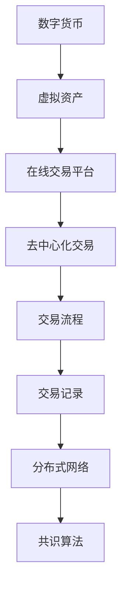
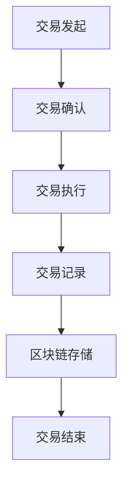
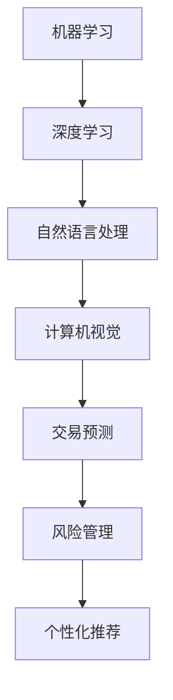
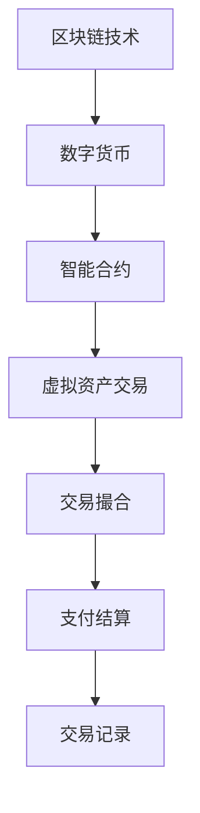

                 

# 《虚拟经济：AI驱动的新型价值交换》

> **关键词：虚拟经济、AI、价值交换、智能合约、区块链、数据安全**
> 
> **摘要：本文将探讨虚拟经济这一新型经济形态，以及人工智能如何驱动其价值交换。通过对虚拟经济的理论基础、AI的应用、面临的挑战及其未来展望的深入分析，揭示AI在虚拟经济中的重要地位和潜力。**

## 第一部分：虚拟经济的理论基础

### 1.1 虚拟经济的定义与特点

#### 1.1.1 虚拟经济的概念

虚拟经济，是指基于数字技术，尤其是互联网技术，进行的虚拟商品或服务的交易活动。它不同于传统的实体经济，以物理形态的商品交易为主，而是以数字化的信息和服务为主要交易对象。

虚拟经济的核心概念包括：**数字货币**、**虚拟资产**、**在线交易平台**和**去中心化交易**。数字货币，如比特币、以太坊等，是一种基于区块链技术的虚拟货币，具有去中心化、匿名性和安全性等特点。虚拟资产，如虚拟商品、虚拟房地产、虚拟货币等，是虚拟经济中的主要交易对象。在线交易平台，则是提供虚拟交易服务的网站或应用程序。去中心化交易，意味着交易不再依赖中央机构，而是通过分布式网络进行，提高了交易的透明度和安全性。

#### 1.1.2 虚拟经济的特征

虚拟经济具有以下几个显著特征：

- **数字化**：虚拟经济的交易活动完全依赖于数字技术，包括互联网、区块链等。
- **去中心化**：虚拟经济的交易不再依赖于中央机构，而是通过分布式网络进行，提高了交易的透明度和安全性。
- **匿名性**：虚拟经济中的交易参与者可以匿名进行，保护了用户的隐私。
- **全球化**：虚拟经济不受地理限制，用户可以在全球范围内进行交易。
- **高效率**：虚拟经济通过自动化技术和去中心化交易，提高了交易效率，降低了交易成本。

### 1.2 虚拟经济的产生背景与影响

#### 1.2.1 虚拟经济的起源

虚拟经济的兴起，可以追溯到20世纪末和21世纪初的互联网浪潮。随着互联网的普及和技术的进步，虚拟经济逐渐从传统的实体经济中分离出来，成为一种独立的经济形态。特别是在2009年比特币的诞生，标志着虚拟经济正式进入人们的生活。

#### 1.2.2 虚拟经济对现实经济的影响

虚拟经济的出现，对现实经济产生了深远的影响：

- **经济模式的变革**：虚拟经济的出现，挑战了传统的经济模式，推动了经济的数字化转型。
- **资源配置的优化**：虚拟经济通过去中心化和自动化技术，提高了资源的配置效率。
- **金融创新的推动**：虚拟经济推动了金融创新，如数字货币、智能合约等，改变了传统的金融交易模式。
- **国际贸易的便利**：虚拟经济降低了国际贸易的门槛，促进了全球贸易的发展。

### 1.3 虚拟经济的运行机制

#### 1.3.1 虚拟经济的交易流程

虚拟经济的交易流程主要包括以下几个步骤：

1. **交易发起**：交易者通过在线交易平台发起交易请求。
2. **交易确认**：交易请求经过分布式网络确认，确保交易的真实性。
3. **交易执行**：交易请求被确认后，交易者按照约定进行交易。
4. **交易记录**：交易记录被永久存储在区块链上，确保交易的可追溯性。

#### 1.3.2 虚拟经济的信用体系

虚拟经济的信用体系主要依赖于区块链技术和智能合约。区块链技术通过去中心化和分布式存储，确保了交易记录的真实性和不可篡改性。智能合约则通过代码自动执行交易规则，提高了交易的透明度和安全性。

- **区块链技术**：区块链技术通过分布式存储和共识算法，确保了交易记录的真实性和不可篡改性。每个区块都包含一定数量的交易记录，并通过密码学方法确保数据的安全性和完整性。
- **智能合约**：智能合约是运行在区块链上的计算机程序，用于自动执行交易规则。当交易满足智能合约的条件时，智能合约会自动执行相应的操作，如转移数字货币或执行其他操作。

## 第二部分：AI在虚拟经济中的应用

### 2.1 AI在虚拟经济中的价值

#### 2.1.1 AI优化虚拟经济交易

AI技术在虚拟经济中的应用，主要表现在以下几个方面：

- **交易预测**：AI可以通过分析历史交易数据和市场趋势，预测未来的交易价格和交易量，帮助交易者做出更明智的交易决策。
- **风险管理**：AI可以实时监控交易风险，并提供风险预警和风险控制策略，降低交易风险。
- **交易自动化**：AI可以通过智能合约和自动化交易系统，实现交易的自动化执行，提高交易效率和降低成本。

#### 2.1.2 AI提升虚拟经济效率

AI技术在提升虚拟经济效率方面具有显著的优势：

- **数据分析**：AI可以处理海量交易数据，提取有价值的信息，帮助交易者更好地理解市场趋势和用户需求。
- **个性化推荐**：AI可以通过分析用户的交易行为和偏好，提供个性化的交易推荐，提高交易的成功率和用户满意度。
- **智能客服**：AI可以自动化处理用户咨询和交易问题，提供24/7的智能客服服务，提高用户体验。

### 2.2 AI驱动的虚拟经济模式

#### 2.2.1 智能合约

智能合约是AI在虚拟经济中最重要的应用之一。智能合约通过代码自动执行交易规则，确保了交易的透明性和安全性。智能合约的核心特点是**不可篡改**和**自动执行**，这使得交易更加高效和安全。

- **不可篡改**：智能合约的代码和交易记录被永久存储在区块链上，无法被篡改，保证了交易的真实性和可靠性。
- **自动执行**：智能合约在满足预设条件时，会自动执行相应的操作，如转移数字货币或执行其他操作，提高了交易的效率。

#### 2.2.2 区块链与虚拟经济

区块链技术是AI在虚拟经济中应用的基础。区块链通过分布式存储和共识算法，确保了交易记录的真实性和不可篡改性。区块链与AI的融合，可以进一步优化虚拟经济的运行机制：

- **数据共享**：区块链技术可以实现数据的分布式存储和共享，提高了数据的透明度和可追溯性。
- **去中心化交易**：区块链技术可以实现去中心化的交易，降低了交易成本和中介费用。
- **智能合约执行**：区块链技术可以支持智能合约的自动执行，提高了交易的效率和安全性。

### 2.3 AI驱动的虚拟经济应用案例

#### 2.3.1 虚拟货币交易

虚拟货币交易是AI在虚拟经济中最重要的应用领域之一。AI技术通过分析市场数据和交易行为，预测虚拟货币的价格走势，帮助交易者做出更明智的交易决策。

- **价格预测**：AI可以通过分析历史价格数据和市场趋势，预测虚拟货币的价格走势，帮助交易者制定交易策略。
- **风险控制**：AI可以实时监控交易风险，并提供风险预警和风险控制策略，降低交易风险。

#### 2.3.2 虚拟资产投资

虚拟资产投资是AI在虚拟经济中的另一个重要应用领域。AI可以通过分析投资数据和市场趋势，提供投资建议和投资策略，帮助投资者实现资产的增值。

- **投资建议**：AI可以通过分析投资数据和市场趋势，提供个性化的投资建议，帮助投资者制定投资策略。
- **风险管理**：AI可以实时监控投资风险，并提供风险预警和风险控制策略，降低投资风险。

## 第三部分：AI在虚拟经济中的挑战与对策

### 3.1 虚拟经济中的数据安全

#### 3.1.1 数据隐私保护

在虚拟经济中，数据隐私保护是一个重要的问题。AI技术的应用，虽然提高了虚拟经济的效率和安全性，但也带来了数据隐私的挑战。

- **匿名化技术**：通过匿名化技术，可以保护用户的隐私。例如，对用户数据进行脱敏处理，使数据无法直接关联到具体的用户。
- **加密技术**：加密技术可以确保数据在传输和存储过程中的安全性。例如，使用对称加密和非对称加密技术，对数据进行加密和解密。

#### 3.1.2 数据安全风险

虚拟经济中的数据安全风险主要包括以下几个方面：

- **数据泄露**：数据泄露可能导致用户的个人信息和交易记录被非法获取。
- **数据篡改**：数据篡改可能导致交易记录被篡改，影响交易的公平性和安全性。
- **网络攻击**：网络攻击可能导致虚拟经济系统被破坏，影响系统的稳定性和安全性。

### 3.2 虚拟经济中的法律与监管

#### 3.2.1 虚拟经济法律框架

虚拟经济的发展，需要相应的法律框架进行规范。目前，全球范围内的虚拟经济法律框架尚不完善，需要进一步完善和健全。

- **数字货币监管**：需要制定数字货币的监管政策，确保数字货币的合法性和安全性。
- **虚拟资产交易监管**：需要制定虚拟资产交易的监管政策，确保交易的合法性和公平性。
- **网络安全监管**：需要加强网络安全监管，防范网络攻击和数据泄露。

#### 3.2.2 虚拟经济监管挑战

虚拟经济的监管，面临着以下几个挑战：

- **跨区域性**：虚拟经济具有跨区域性的特点，监管需要跨区域合作，提高监管的效率和效果。
- **技术创新**：虚拟经济的快速发展，带来了新的技术创新，监管需要不断更新和适应。
- **法律滞后**：虚拟经济的发展速度远快于法律的制定，导致法律滞后于现实需求。

### 3.3 虚拟经济中的可持续发展

#### 3.3.1 AI驱动的绿色虚拟经济

虚拟经济的可持续发展，是当前社会关注的焦点。AI技术在绿色虚拟经济中的应用，可以促进虚拟经济的可持续发展。

- **能源效率优化**：AI可以通过优化能源消耗，提高虚拟经济的能源效率。
- **碳排放管理**：AI可以通过碳排放管理，减少虚拟经济活动中的碳排放。

#### 3.3.2 虚拟经济的可持续性发展策略

虚拟经济的可持续性发展，需要采取一系列策略：

- **绿色发展**：推动虚拟经济的绿色发展，减少对环境的负面影响。
- **科技创新**：通过科技创新，提高虚拟经济的效率和可持续性。
- **政策支持**：政府需要出台支持虚拟经济可持续发展的政策，鼓励企业和个人积极参与。

## 第四部分：AI驱动的虚拟经济未来展望

### 4.1 AI驱动的虚拟经济趋势

#### 4.1.1 虚拟经济的未来发展方向

随着AI技术的不断进步，虚拟经济将继续发展，并呈现出以下趋势：

- **智能化**：AI将进一步提升虚拟经济的智能化水平，实现更加智能化的交易和服务。
- **去中心化**：虚拟经济将继续向去中心化方向发展，减少对中心化机构的依赖，提高交易的透明度和安全性。
- **全球化**：虚拟经济将实现全球化的连接，促进全球贸易和经济一体化。

#### 4.1.2 AI在虚拟经济中的未来发展潜力

AI在虚拟经济中的未来发展潜力巨大：

- **交易预测**：AI将进一步提升交易预测的准确性，帮助交易者做出更明智的交易决策。
- **风险管理**：AI将进一步提高风险管理的效率和效果，降低交易风险。
- **个性化服务**：AI将实现更加个性化的交易和服务，提高用户体验和满意度。

### 4.2 AI驱动的虚拟经济战略规划

#### 4.2.1 企业在虚拟经济中的AI应用策略

企业在虚拟经济中的AI应用策略主要包括以下几个方面：

- **数据驱动的决策**：通过AI技术，企业可以更好地理解市场数据和用户行为，实现数据驱动的决策。
- **智能化的交易与服务**：通过AI技术，企业可以提供更加智能化的交易和服务，提高用户满意度。
- **风险管理与控制**：通过AI技术，企业可以实时监控交易风险，并提供风险控制策略，降低交易风险。

#### 4.2.2 国家层面虚拟经济AI发展战略

国家层面虚拟经济AI发展战略主要包括以下几个方面：

- **政策支持**：政府需要出台支持虚拟经济和AI发展的政策，鼓励企业和个人积极参与。
- **技术创新**：政府需要加大对AI技术和虚拟经济相关技术的研发投入，推动技术创新。
- **人才培养**：政府需要加大对AI和虚拟经济人才的培养力度，提高人才素质。

### 4.3 AI驱动的虚拟经济创新实践

#### 4.3.1 创新虚拟经济模型

AI驱动的虚拟经济创新实践，主要体现在以下几个方面：

- **去中心化的交易平台**：通过去中心化的交易平台，实现更加公平和透明的交易。
- **智能合约应用**：通过智能合约，实现自动化和智能化的交易规则执行。
- **虚拟资产投资**：通过AI技术，提供更加精准的虚拟资产投资建议。

#### 4.3.2 跨界融合的虚拟经济创新

虚拟经济的创新不仅体现在技术层面，还体现在与其他行业的融合：

- **金融科技**：虚拟经济与金融科技的融合，推动了数字货币和智能合约的发展。
- **共享经济**：虚拟经济与共享经济的融合，推动了共享资产和共享服务的创新。
- **物联网**：虚拟经济与物联网的融合，推动了智慧城市和智能物流的发展。

## 附录

### 附录 A：AI与虚拟经济相关技术概述

#### A.1 人工智能基础技术

人工智能基础技术主要包括以下几个方面：

- **机器学习**：通过数据训练模型，实现自动识别和预测。
- **深度学习**：一种特殊的机器学习方法，通过多层神经网络实现复杂的特征提取和预测。
- **自然语言处理**：通过算法理解和生成自然语言，实现人机交互。

#### A.2 虚拟经济关键技术

虚拟经济关键技术主要包括以下几个方面：

- **区块链技术**：一种分布式数据库技术，通过共识算法确保数据的一致性和安全性。
- **数字货币**：基于区块链技术的一种虚拟货币，具有去中心化、匿名性和安全性等特点。
- **智能合约**：一种运行在区块链上的计算机程序，用于自动执行交易规则。

#### A.3 AI与虚拟经济的交叉应用

AI与虚拟经济的交叉应用，主要体现在以下几个方面：

- **交易预测**：通过AI技术，预测虚拟货币的价格走势，帮助交易者做出更明智的交易决策。
- **风险管理**：通过AI技术，实时监控交易风险，并提供风险控制策略。
- **个性化推荐**：通过AI技术，分析用户的交易行为和偏好，提供个性化的交易推荐。

## 后记

本文从虚拟经济的理论基础、AI的应用、面临的挑战及其未来展望等方面，深入探讨了虚拟经济这一新型经济形态。AI作为推动虚拟经济发展的关键力量，其应用前景广阔，但也面临着一系列的挑战。只有通过技术创新和协同合作，才能推动虚拟经济的可持续发展，实现经济的高质量增长。

**作者：AI天才研究院/AI Genius Institute & 禅与计算机程序设计艺术 /Zen And The Art of Computer Programming**<|im_end|>### 1.1 虚拟经济的定义与特点

#### 1.1.1 虚拟经济的概念

虚拟经济，是指基于数字技术，尤其是互联网技术，进行的虚拟商品或服务的交易活动。它不同于传统的实体经济，以物理形态的商品交易为主，而是以数字化的信息和服务为主要交易对象。

虚拟经济的核心概念包括：**数字货币**、**虚拟资产**、**在线交易平台**和**去中心化交易**。数字货币，如比特币、以太坊等，是一种基于区块链技术的虚拟货币，具有去中心化、匿名性和安全性等特点。虚拟资产，如虚拟商品、虚拟房地产、虚拟货币等，是虚拟经济中的主要交易对象。在线交易平台，则是提供虚拟交易服务的网站或应用程序。去中心化交易，意味着交易不再依赖中央机构，而是通过分布式网络进行，提高了交易的透明度和安全性。

#### 1.1.2 虚拟经济的特征

虚拟经济具有以下几个显著特征：

- **数字化**：虚拟经济的交易活动完全依赖于数字技术，包括互联网、区块链等。
- **去中心化**：虚拟经济的交易不再依赖于中央机构，而是通过分布式网络进行，提高了交易的透明度和安全性。
- **匿名性**：虚拟经济中的交易参与者可以匿名进行，保护了用户的隐私。
- **全球化**：虚拟经济不受地理限制，用户可以在全球范围内进行交易。
- **高效率**：虚拟经济通过自动化技术和去中心化交易，提高了交易效率，降低了交易成本。

#### 1.1.3 虚拟经济的核心概念详解

为了更深入地理解虚拟经济的概念，我们需要详细探讨其核心概念，包括数字货币、虚拟资产、在线交易平台和去中心化交易。

**数字货币**：数字货币是虚拟经济中最基础的组成部分之一。与传统货币不同，数字货币是完全数字化的，不存在物理形态。它们通常通过区块链技术实现发行、交易和存储。比特币和以太坊是最著名的两种数字货币。比特币是第一个去中心化的加密货币，以太坊则是一个去中心化的智能合约平台，不仅支持数字货币的交易，还支持智能合约的执行。

**虚拟资产**：虚拟资产是指那些在虚拟经济中具有价值和可交易性的数字资产。这包括虚拟商品、虚拟房地产、数字艺术品、游戏内的虚拟货币等。虚拟资产的价值通常由市场供求关系决定，而其交易则通常通过在线平台进行。例如，虚拟房地产在虚拟世界如第二人生（Second Life）中可以买卖，而数字艺术品则可以在区块链平台如以太坊上的ERC-721标准上交易。

**在线交易平台**：在线交易平台是虚拟经济中的关键基础设施，它们提供了交易的市场环境，使得买卖双方能够便捷地交换虚拟资产。这些平台通常具有用户友好的界面、安全可靠的交易机制、以及各种交易工具和数据分析功能。著名的在线交易平台包括Coinbase、Binance、Ebay等，它们为用户提供了多样化的交易选择。

**去中心化交易**：去中心化交易是虚拟经济的重要特点之一，它意味着交易活动不再依赖中央机构进行协调。相反，交易是通过分布式网络中的多个参与者共同完成的。区块链技术是实现去中心化交易的关键技术，它通过分布式账本和共识算法，确保了交易记录的真实性和不可篡改性。例如，比特币和以太坊网络就是通过区块链实现了去中心化交易。

**Mermaid 流程图：虚拟经济的核心概念**



通过这个流程图，我们可以看到虚拟经济的核心概念是如何相互关联和共同构建一个高效、透明、安全的交易环境。

综上所述，虚拟经济的数字化、去中心化、匿名性、全球化和高效率等特征，使其成为现代社会经济发展的重要组成部分。随着数字技术和区块链技术的不断发展，虚拟经济将不断成熟和壮大，为全球经济带来新的机遇和挑战。

### 1.2 虚拟经济的产生背景与影响

#### 1.2.1 虚拟经济的起源

虚拟经济的起源可以追溯到互联网的兴起。20世纪90年代，随着互联网的普及，电子商务开始崛起，人们通过互联网进行商品和服务的交易，这标志着虚拟经济的萌芽。随着时间的推移，互联网技术的不断进步，尤其是移动互联网和智能手机的普及，虚拟经济逐渐从电子商务扩展到更为广泛的领域，包括虚拟商品交易、数字资产交易、虚拟房地产交易等。

2009年，比特币的诞生是虚拟经济的重要里程碑。比特币作为一种去中心化的数字货币，不仅改变了人们对货币和交易的传统认知，也为虚拟经济提供了一种全新的运行机制。随后，以太坊等智能合约平台的出现，进一步拓展了虚拟经济的应用范围，使得虚拟经济从简单的交易活动演变为一个复杂的生态系统。

#### 1.2.2 虚拟经济对现实经济的影响

虚拟经济的兴起对现实经济产生了深远的影响，这些影响主要体现在以下几个方面：

- **经济模式的变革**：虚拟经济的出现，打破了传统经济模式的边界，推动了经济活动的数字化转型。企业和消费者逐渐适应并依赖数字化平台进行交易和互动，传统商业模式面临着巨大的挑战和机遇。

- **资源配置的优化**：虚拟经济通过去中心化和自动化技术，优化了资源的配置。资源不再受地理限制，全球范围内的供需关系可以更加高效地匹配，提高了资源的利用效率。

- **金融创新的推动**：虚拟经济推动了金融领域的创新，数字货币、区块链、智能合约等新技术在金融领域得到了广泛应用。这些创新不仅改变了传统的金融交易模式，也为金融市场的参与者提供了更多的选择和机会。

- **国际贸易的便利**：虚拟经济降低了国际贸易的门槛，使得跨境交易变得更加便捷和高效。企业可以通过虚拟经济平台轻松进入全球市场，消费者也可以享受全球范围内的商品和服务。

- **社会结构的变革**：虚拟经济对社会的结构产生了深远的影响。虚拟经济的参与者不再受限于地理位置，个人的社会角色和职业选择变得更加多样化和灵活。同时，虚拟经济的崛起也带来了新的就业机会和创业机会，为社会的经济发展注入了新的活力。

#### 1.2.3 虚拟经济的影响案例分析

为了更直观地理解虚拟经济对现实经济的影响，我们可以通过一些具体案例进行分析。

**案例1：电子商务平台**

电子商务平台如亚马逊、阿里巴巴等，是虚拟经济的典型代表。这些平台通过互联网技术，将全球的买卖双方连接起来，提供了便捷的购物和交易体验。电子商务平台的兴起，不仅改变了消费者的购物习惯，也对传统的零售行业产生了巨大冲击。许多传统零售商不得不通过线上渠道进行转型，以适应市场变化。

**案例2：数字货币交易**

数字货币交易平台的兴起，是虚拟经济在金融领域的体现。平台如Coinbase、Binance等，提供了数字货币的买卖、存储和交易服务。数字货币的交易不仅为投资者提供了新的投资渠道，也推动了金融市场的创新。例如，比特币在市场中的价格波动吸引了大量投资者的关注，成为了一种重要的投资工具。

**案例3：虚拟房地产交易**

虚拟房地产交易在虚拟经济中越来越受到关注。例如，虚拟世界第二人生中的房地产交易，吸引了大量的虚拟资产投资者。虚拟房地产的价值由市场供需关系决定，交易过程完全通过在线平台进行。这种模式不仅为虚拟经济提供了新的交易对象，也为现实中的房地产交易提供了一种创新思路。

通过以上案例，我们可以看到虚拟经济对现实经济的影响是多方面且深远的。它不仅改变了经济活动的模式和结构，也为社会带来了新的机遇和挑战。

总之，虚拟经济的兴起是技术进步和社会发展的必然结果。随着互联网、区块链等技术的不断发展，虚拟经济将继续对现实经济产生深远的影响，推动经济和社会的数字化转型。

### 1.3 虚拟经济的运行机制

#### 1.3.1 虚拟经济的交易流程

虚拟经济的交易流程是一个复杂而系统的过程，它涉及多个环节，包括交易发起、交易确认、交易执行和交易记录等。以下是虚拟经济交易流程的详细步骤：

1. **交易发起**：交易流程的起点是交易者的交易请求。交易者可以是个人或企业，他们通过在线交易平台发起交易请求。交易请求通常包括交易的类型、数量、价格等基本信息。

2. **交易确认**：交易请求被提交后，系统会对交易请求进行初步验证。这一步骤确保交易请求的有效性和完整性。验证内容包括交易者的身份认证、交易金额的合法性等。验证通过后，交易请求将被分发到分布式网络中的多个节点进行确认。

3. **交易执行**：交易请求在分布式网络中经过确认后，交易者将按照约定进行交易。这一步骤包括数字货币或虚拟资产的转移，以及交易费用的支付。交易执行的过程是自动化的，通过智能合约进行操作。智能合约是运行在区块链上的计算机程序，它根据预设的条件自动执行相应的操作，如转移数字货币或执行其他交易行为。

4. **交易记录**：交易完成后，交易记录将被永久存储在区块链上。区块链是一种分布式数据库，通过密码学方法确保数据的安全性和不可篡改性。交易记录包括交易的时间、金额、参与者等信息，这些信息是公开透明的，任何用户都可以进行查看和验证。

**交易流程的Mermaid流程图**



通过这个流程图，我们可以清晰地看到虚拟经济交易的基本步骤和各步骤之间的关系。交易发起是交易流程的起点，交易确认确保交易的有效性，交易执行是实际的操作过程，交易记录将交易信息永久存储在区块链上，最终完成交易流程。

#### 1.3.2 虚拟经济的信用体系

虚拟经济的信用体系是其稳定运行的关键组成部分。与传统经济中的信用体系不同，虚拟经济的信用体系依赖于区块链技术和智能合约来实现。

**区块链技术**：区块链技术通过分布式存储和共识算法，确保了交易记录的真实性和不可篡改性。每个区块都包含一定数量的交易记录，并通过密码学方法将这些记录加密存储。区块链的分布式特性使得交易记录无法被单独篡改，保证了整个系统的透明性和可信度。

**智能合约**：智能合约是运行在区块链上的计算机程序，用于自动执行交易规则。智能合约通过代码定义了交易的条款和条件，当交易满足这些条件时，智能合约会自动执行相应的操作，如转移数字货币或执行其他交易行为。智能合约的不可篡改性确保了交易规则的执行公正性和透明度。

**信用评价机制**：虚拟经济中的信用评价机制通常基于用户的交易历史和行为数据。平台会根据用户的交易记录、交易金额、交易频率等指标，对用户的信用进行评分。高信用评分的用户在交易中会获得更多的信任和优惠，而低信用评分的用户可能会受到限制。

**信用体系的优势**：

- **透明性**：区块链技术确保了交易记录的公开透明，用户可以随时查看和验证交易信息，增强了系统的可信度。
- **安全性**：智能合约的不可篡改性保证了交易规则的严格执行，减少了欺诈和违约的风险。
- **高效性**：信用体系的自动化和去中心化特性，提高了交易效率，降低了交易成本。

**信用体系的实现示例**：

假设在一个虚拟商品交易平台上，用户A想购买用户B的虚拟商品。用户A的信用评分较高，因此平台允许其享受更多的交易优惠。以下是交易信用体系的具体实现步骤：

1. 用户A通过在线交易平台发起购买请求，平台对用户A的信用评分进行验证。
2. 用户A和用户B的信用评分都满足交易要求，平台生成智能合约，智能合约中包含了交易条款和条件。
3. 用户A按照智能合约的要求支付虚拟货币，智能合约自动执行支付操作。
4. 用户B收到支付后，将虚拟商品交付给用户A，智能合约记录交易完成。
5. 交易完成后，平台会根据用户A的交易行为和信用评分，调整其信用评分。

通过这个示例，我们可以看到虚拟经济信用体系如何通过区块链技术和智能合约实现交易的透明性、安全性和高效性。

综上所述，虚拟经济的运行机制通过交易流程和信用体系的相互配合，实现了高效、透明和安全的交易环境。这些机制的运行不仅依赖于数字技术和区块链技术，也依赖于智能合约的应用，为虚拟经济的发展提供了坚实的基础。

### 2.1 AI在虚拟经济中的价值

#### 2.1.1 AI优化虚拟经济交易

人工智能（AI）技术在虚拟经济中的应用，显著提升了交易的效率、透明度和安全性。以下是AI在虚拟经济交易中的具体优化作用：

1. **交易预测**：AI可以通过分析历史交易数据和市场趋势，预测虚拟货币和虚拟资产的价格波动。这种预测能力帮助交易者制定更精确的交易策略，从而提高交易的成功率和收益。例如，AI可以使用机器学习和深度学习算法，从大量的交易历史数据中提取有用的模式，预测比特币在未来一段时间内的价格走势。

2. **风险管理**：AI可以实时监控交易风险，并自动调整交易策略，以降低风险。通过分析市场数据和历史交易记录，AI可以识别潜在的风险信号，并提前采取预防措施。例如，AI可以设置止损点和止盈点，当市场波动超出预期时，自动执行交易，从而避免损失。

3. **交易自动化**：AI可以通过智能合约和自动化交易系统，实现交易的自动化执行。智能合约是一种运行在区块链上的计算机程序，可以自动执行预设的交易规则，确保交易的高效和准确。自动化交易系统则可以通过AI算法，自动执行交易决策，减少了人工干预，提高了交易效率。

**AI优化交易示例**：

假设一个交易者在虚拟货币市场中进行投资，AI系统可以帮助他实现以下优化：

1. **预测价格**：AI系统通过分析历史价格数据和市场趋势，预测比特币在未来24小时的价格。如果AI预测价格上涨，交易者可以选择买入；如果预测价格下跌，可以选择卖出。

2. **实时监控**：AI系统实时监控市场数据，当比特币价格达到预设的止损点或止盈点时，AI会自动执行交易，以避免潜在的损失。

3. **自动化交易**：AI系统可以根据交易者的投资策略，自动执行买入和卖出的操作。例如，当市场波动达到某个阈值时，AI会自动调整持仓比例，以保持投资组合的风险和收益平衡。

**伪代码：AI交易预测算法**

```python
def predict_price(historical_data):
    # 使用机器学习算法，如线性回归、时间序列分析等，预测价格
    model = train_model(historical_data)
    predicted_price = model.predict(latest_data)
    return predicted_price

def monitor_and_trade(predicted_price, market_price, stop_loss, take_profit):
    if predicted_price > market_price + stop_loss:
        # 执行卖出操作
        execute_sell()
    elif predicted_price < market_price - take_profit:
        # 执行买入操作
        execute_buy()
```

通过这个示例和伪代码，我们可以看到AI技术在优化虚拟经济交易中的重要作用。AI不仅可以提供准确的交易预测，还能实时监控风险，并通过自动化交易系统提高交易的效率。这些功能使得AI成为虚拟经济中不可或缺的一部分，为交易者提供了更加智能和高效的交易体验。

#### 2.1.2 AI提升虚拟经济效率

人工智能技术在虚拟经济中的应用，不仅优化了交易过程，还大幅提升了整体经济的效率。以下是AI在提升虚拟经济效率方面的几个关键作用：

1. **数据分析**：AI可以通过处理和分析海量交易数据，发现市场趋势和用户行为模式。这种数据分析能力帮助虚拟经济平台提供更精准的市场预测和个性化服务。例如，AI可以分析用户的购买历史、浏览行为和社交媒体活动，预测用户的需求，从而优化商品推荐和营销策略。

2. **个性化推荐**：基于数据分析，AI可以提供个性化的交易推荐和服务。通过用户行为分析，AI可以识别用户的兴趣和偏好，从而提供定制化的交易建议。例如，一个虚拟资产交易平台可以使用AI算法，根据用户的投资记录和风险偏好，推荐最适合的投资组合和交易策略。

3. **智能客服**：AI可以自动化处理用户咨询和交易问题，提供24/7的智能客服服务。这种智能客服不仅提高了客户满意度，还降低了企业的运营成本。例如，一个在线交易平台可以使用聊天机器人，自动回答用户关于交易规则、操作流程等问题，提高了用户的交易体验。

4. **自动化交易**：AI可以通过自动化交易系统，执行复杂的交易策略和操作。这种自动化交易不仅提高了交易效率，还减少了人为错误。例如，一个加密货币交易者可以使用AI交易算法，自动执行高频率的交易操作，以获取最佳的交易时机。

**AI提升效率的案例分析**：

- **案例1：虚拟资产交易平台**：某知名虚拟资产交易平台通过引入AI技术，实现了交易流程的自动化。AI系统可以自动执行用户的交易请求，并根据市场数据实时调整交易策略。这不仅提高了交易速度，还降低了交易成本。

- **案例2：智能合约审计**：在智能合约开发过程中，AI可以用于自动化审计和测试。通过模拟各种交易场景，AI可以发现潜在的安全漏洞和逻辑错误，确保智能合约的可靠性和安全性。

- **案例3：风险预警系统**：一个虚拟经济平台使用AI建立了一个风险预警系统。AI系统可以实时监控市场数据，识别异常交易行为，并在风险发生前发出预警，帮助平台及时采取应对措施。

通过这些案例，我们可以看到AI技术在提升虚拟经济效率方面的重要作用。AI不仅可以自动化复杂的交易操作，还能提供个性化的服务和精准的风险管理，为虚拟经济带来更高的效率和更优的用户体验。

综上所述，AI技术在虚拟经济中的应用，不仅优化了交易过程，还大幅提升了整体经济的效率。随着AI技术的不断进步，虚拟经济将在AI的推动下实现更加智能化和高效化的发展。

### 2.2 AI驱动的虚拟经济模式

#### 2.2.1 智能合约

智能合约是AI在虚拟经济中最具革命性的应用之一。它通过代码自动执行交易规则，确保了交易的透明性、安全性和效率。智能合约的出现，极大地改变了虚拟经济的交易模式，使其更加去中心化和自动化。

**智能合约的定义与原理**

智能合约是一组计算机代码，运行在区块链网络中。这些代码定义了交易双方在满足特定条件时的行为，当条件满足时，智能合约会自动执行预定的操作。智能合约的原理基于区块链的分布式账本技术，确保了代码的不可篡改性和透明性。

**智能合约的核心特点**

1. **自动执行**：智能合约在满足预设条件时，会自动执行预定的操作，无需人工干预。这种自动执行特性提高了交易的效率和可靠性。
2. **透明性**：智能合约的代码和执行过程都是公开透明的，任何用户都可以查看和验证。这确保了交易的公平性和可信度。
3. **不可篡改性**：智能合约一旦部署在区块链上，其代码和执行过程就无法被篡改。这保证了交易的安全性和稳定性。

**智能合约的应用场景**

智能合约在虚拟经济中有广泛的应用场景：

- **金融交易**：智能合约可以用于自动化执行金融交易，如数字货币交易、证券交易等。通过智能合约，交易双方可以在无需中介的情况下直接进行交易，降低了交易成本和风险。
- **供应链管理**：智能合约可以用于供应链管理中的支付和结算，确保交易各方的权益。例如，当供应商交付商品后，智能合约会自动释放支付款项，提高了供应链的效率和透明度。
- **版权保护**：智能合约可以用于版权保护，确保版权持有者获得相应的收益。例如，当用户下载或使用版权内容时，智能合约会自动向版权持有者支付版权费用。

**智能合约的实现示例**

假设有一个虚拟商品交易平台，用户A想购买用户B的虚拟商品。通过智能合约，交易可以自动化执行：

1. **交易发起**：用户A通过平台发起购买请求，平台生成智能合约，智能合约中定义了交易条款，如商品价格、交付时间和支付方式等。
2. **智能合约部署**：用户A和用户B确认交易条款后，智能合约被部署在区块链上，确保其透明性和不可篡改性。
3. **支付执行**：用户A按照智能合约的要求支付虚拟货币，智能合约验证支付后，自动释放商品给用户B。
4. **交付验证**：用户B确认收到商品后，智能合约记录交易完成，用户A的支付将被释放。

通过这个示例，我们可以看到智能合约如何通过代码自动执行交易规则，确保交易的透明性、安全性和效率。智能合约的应用，不仅简化了交易流程，还提高了整个虚拟经济的运作效率。

**伪代码：智能合约交易流程**

```solidity
pragma solidity ^0.8.0;

contract VirtualGoodsTransaction {
    address payable seller;
    address payable buyer;
    bool paymentReceived = false;

    constructor(address _seller, address _buyer) {
        seller = _seller;
        buyer = _buyer;
    }

    function purchase() public payable {
        require(!paymentReceived, "Payment already received");
        paymentReceived = true;
        seller.transfer(msg.value);
    }

    function confirmDelivery() public {
        require(paymentReceived, "Payment not received");
        // Additional logic to confirm delivery can be added here
        buyer.transfer(msg.value);
    }
}
```

通过这段伪代码，我们可以看到智能合约的基本结构和实现逻辑。智能合约通过构造函数初始化卖家和买家地址，通过`purchase`函数接收买家支付，通过`confirmDelivery`函数确认商品交付，并释放支付给卖家。这个简单的示例展示了智能合约如何通过代码自动化执行交易规则。

总之，智能合约作为AI在虚拟经济中的重要应用，通过去中心化和自动化的特性，极大地优化了交易流程，提高了交易的透明性和安全性。随着智能合约技术的不断发展，它在虚拟经济中的应用将更加广泛和深入。

#### 2.2.2 区块链与虚拟经济

区块链技术是AI在虚拟经济中应用的重要基础，二者结合不仅改变了虚拟经济的运行模式，也推动了虚拟经济的创新与发展。以下将详细探讨区块链在虚拟经济中的具体应用和其重要性。

**区块链技术的核心特性**

1. **分布式账本**：区块链通过分布式网络存储数据，每个参与者都持有完整的数据副本，确保了数据的真实性和不可篡改性。这意味着任何对数据的修改都需要经过网络中多数节点的确认，增加了系统的安全性。
2. **去中心化**：区块链不需要中央机构进行协调，交易和数据验证由网络中的多个节点共同完成，去除了对中心化机构的依赖。这种去中心化的特性提高了系统的透明度和抗攻击能力。
3. **智能合约**：区块链支持智能合约的执行，智能合约是运行在区块链上的计算机程序，可以自动执行预定的交易规则。智能合约通过代码定义了交易条款和条件，确保了交易的自动化和不可篡改性。
4. **加密技术**：区块链使用加密算法对数据进行加密和验证，保证了数据的隐私性和安全性。

**区块链在虚拟经济中的应用**

1. **数字货币**：区块链技术是数字货币（如比特币、以太坊）的基础，确保了数字货币的安全性和去中心化特性。数字货币的出现，为虚拟经济提供了一个去中心化的交易媒介，降低了交易成本和中介费用。

2. **智能合约**：智能合约是区块链技术的核心应用之一，它在虚拟经济中发挥了重要作用。智能合约可以自动化执行交易规则，确保交易的透明性和安全性。例如，在虚拟资产交易中，智能合约可以自动执行买卖双方的协议，确保交易的顺利进行。

3. **供应链管理**：区块链技术可以用于供应链管理中的数据追踪和透明性。通过区块链，供应链的每个环节都可以记录和验证，确保商品的来源和流通路径透明可查。这有助于提高供应链的效率，减少欺诈和错误。

4. **版权保护**：区块链技术可以用于版权保护和数字资产的管理。通过区块链，创作者可以记录自己的作品，确保版权的不可篡改性和唯一性。例如，NFT（非同质化代币）就是基于区块链技术，用于数字艺术品的版权保护和交易。

**区块链在虚拟经济中的重要性**

1. **信任机制**：区块链的分布式账本和加密技术，构建了一个去中心化的信任机制。这使得虚拟经济中的交易不再依赖中央机构，降低了信任成本，提高了交易效率。

2. **透明性和可追溯性**：区块链技术确保了数据的透明性和可追溯性，每个交易记录都可以在区块链上查看和验证。这有助于提高交易的透明度，减少欺诈和纠纷。

3. **自动化和去中心化**：区块链和智能合约的结合，实现了交易的自动化和去中心化。这减少了人为干预，提高了交易效率，降低了交易成本。

4. **创新和变革**：区块链技术为虚拟经济带来了新的机遇和可能性。通过区块链，虚拟经济可以实现更加高效、透明和安全的运行模式，推动经济的数字化转型。

**区块链技术的实现示例**

假设我们使用以太坊区块链来实现一个简单的虚拟资产交易系统。以下是实现智能合约的示例代码：

```solidity
pragma solidity ^0.8.0;

contract VirtualAssetTransaction {
    address public owner;
    mapping(address => uint256) public balances;

    constructor() {
        owner = msg.sender;
    }

    function deposit() public payable {
        require(msg.value > 0, "Deposit must be greater than 0");
        balances[msg.sender] += msg.value;
    }

    function transfer(address recipient, uint256 amount) public {
        require(balances[msg.sender] >= amount, "Insufficient balance");
        balances[msg.sender] -= amount;
        balances[recipient] += amount;
    }

    function withdraw() public {
        require(balances[msg.sender] > 0, "Insufficient balance");
        payable(msg.sender).transfer(balances[msg.sender]);
        balances[msg.sender] = 0;
    }
}
```

在这个示例中，我们创建了一个简单的虚拟资产交易合约。合约有一个`deposit`函数，用于接收和存储虚拟资产；一个`transfer`函数，用于在用户之间转移虚拟资产；一个`withdraw`函数，用于用户提取虚拟资产。通过这个合约，用户可以安全、透明地管理和转移虚拟资产。

综上所述，区块链技术作为AI在虚拟经济中的重要工具，通过分布式账本、智能合约等特性，为虚拟经济带来了透明性、安全性和高效性。随着区块链技术的不断发展，它将在虚拟经济中发挥更加重要的作用，推动经济的数字化转型。

### 2.3 AI驱动的虚拟经济应用案例

#### 2.3.1 虚拟货币交易

虚拟货币交易是AI在虚拟经济中应用最为广泛和成功的领域之一。通过AI技术的应用，虚拟货币交易市场实现了更加高效、透明和智能化的操作。以下是几个具体的虚拟货币交易应用案例：

**案例1：量化交易平台**

量化交易平台利用AI技术，通过算法自动进行虚拟货币交易。这些平台通过分析历史交易数据和市场趋势，预测虚拟货币的价格变化，并执行相应的交易策略。例如，一些量化交易平台使用机器学习算法，从大量的市场数据中学习价格模式，并自动执行买入和卖出的操作。这种自动化交易不仅提高了交易效率，还减少了人为错误和情绪干扰。

**实现示例：AI量化交易策略**

```python
# 使用机器学习算法进行量化交易
from sklearn.linear_model import LinearRegression
import numpy as np

# 加载历史价格数据
historical_prices = np.load('historical_prices.npy')

# 分割数据为特征和目标
X = historical_prices[:-1, :]  # 特征
y = historical_prices[1:, :]  # 目标

# 训练线性回归模型
model = LinearRegression()
model.fit(X, y)

# 预测未来价格
predicted_prices = model.predict(X)

# 执行交易策略
for i in range(len(predicted_prices) - 1):
    if predicted_prices[i+1] > predicted_prices[i]:
        buy()
    elif predicted_prices[i+1] < predicted_prices[i]:
        sell()
```

**案例2：预测市场趋势**

某些虚拟货币交易平台使用AI技术，通过分析市场数据，预测市场趋势，帮助交易者做出更明智的交易决策。例如，一些平台使用深度学习算法，从大量的历史交易数据中提取有价值的信息，预测未来的价格波动。交易者可以基于这些预测，制定相应的交易策略。

**实现示例：深度学习价格预测模型**

```python
# 使用深度学习进行价格预测
from tensorflow.keras.models import Sequential
from tensorflow.keras.layers import LSTM, Dense

# 加载和预处理数据
X, y = preprocess_data('historical_prices.npy')

# 构建LSTM模型
model = Sequential()
model.add(LSTM(units=50, return_sequences=True, input_shape=(X.shape[1], X.shape[2])))
model.add(LSTM(units=50))
model.add(Dense(units=1))

# 编译模型
model.compile(optimizer='adam', loss='mean_squared_error')

# 训练模型
model.fit(X, y, epochs=100, batch_size=32, validation_split=0.2)

# 预测未来价格
predicted_prices = model.predict(X[-1:].reshape(1, X.shape[1], X.shape[2]))

# 执行交易策略
if predicted_prices[0][0] > current_price:
    buy()
elif predicted_prices[0][0] < current_price:
    sell()
```

#### 2.3.2 虚拟资产投资

虚拟资产投资是AI在虚拟经济中的另一个重要应用领域。通过AI技术，投资者可以更准确地评估投资机会，制定更有效的投资策略。以下是几个虚拟资产投资的应用案例：

**案例1：投资组合优化**

一些AI平台使用机器学习算法，分析市场数据和历史交易记录，优化投资组合。这些平台可以根据投资者的风险偏好和投资目标，推荐最佳的投资组合和交易策略。例如，某些平台使用优化算法，确定不同资产的最佳权重，以最大化收益或最小化风险。

**实现示例：投资组合优化算法**

```python
# 使用优化算法进行投资组合优化
from scipy.optimize import minimize

# 定义投资组合优化的目标函数
def portfolio_objective(weights):
    expected_returns = np.dot(returns, weights)
    variance = np.dot(weights.T, np.dot(cov_matrix, weights))
    return -expected_returns + 0.5 * variance

# 定义投资组合的约束条件
constraints = ({'type': 'ineq', 'fun': lambda w: np.sum(w) - 1})

# 进行优化
result = minimize(portfolio_objective, x0=np.ones(n_assets), constraints=constraints)

# 输出优化结果
optimized_weights = result.x
print("Optimized weights:", optimized_weights)
```

**案例2：风险控制与预警**

AI平台还可以用于实时监控投资风险，并提供风险预警和风险控制策略。通过分析市场数据和历史交易记录，AI可以识别潜在的风险信号，并提前采取预防措施。例如，某些平台会根据交易者的投资策略和风险偏好，设置止损点和止盈点，并在市场波动超出预期时自动执行交易。

**实现示例：风险控制算法**

```python
# 使用风险控制算法进行投资决策
def risk_control(current_price, target_price, stop_loss_percentage, take_profit_percentage):
    stop_loss_price = current_price - (current_price * stop_loss_percentage)
    take_profit_price = current_price + (current_price * take_profit_percentage)
    
    if current_price < stop_loss_price:
        return 'Sell'
    elif current_price > take_profit_price:
        return 'Buy'
    else:
        return 'Hold'

# 设定参数
current_price = 100
target_price = 120
stop_loss_percentage = 0.05
take_profit_percentage = 0.10

# 执行风险控制策略
action = risk_control(current_price, target_price, stop_loss_percentage, take_profit_percentage)
print("Recommended action:", action)
```

通过以上案例和示例代码，我们可以看到AI技术在虚拟货币交易和虚拟资产投资中的应用，不仅提高了交易和投资的效率，还降低了风险，为投资者提供了更智能和高效的决策支持。

### 3.1 虚拟经济中的数据安全

#### 3.1.1 数据隐私保护

在虚拟经济中，数据隐私保护是一个至关重要的问题。随着虚拟经济交易活动的增加，用户数据的收集、存储和处理量也在不断上升，这为数据隐私保护带来了巨大的挑战。以下是几种常用的数据隐私保护技术：

**匿名化技术**：匿名化技术通过去除或隐藏个人身份信息，将数据转换为匿名数据，从而保护用户的隐私。常见的匿名化方法包括：

- **数据脱敏**：通过对敏感信息进行替换、遮挡或加密，使其无法直接识别个人身份。
- **伪匿名化**：通过在数据中加入噪声，使真实数据与噪声数据混合，从而隐藏真实数据。
- **差分隐私**：通过为数据添加随机噪声，使得查询结果无法准确反映单个个体的信息，从而保护隐私。

**加密技术**：加密技术通过将数据转换为加密形式，只有在拥有密钥的情况下才能解密，从而确保数据在传输和存储过程中的安全性。常见的加密技术包括：

- **对称加密**：使用相同的密钥进行加密和解密，如AES。
- **非对称加密**：使用一对密钥进行加密和解密，一个用于加密，一个用于解密，如RSA。
- **混合加密**：结合对称加密和非对称加密的优点，提高数据的安全性和效率。

**零知识证明**：零知识证明（Zero-Knowledge Proof）是一种密码学技术，允许一方（证明者）向另一方（验证者）证明某个陈述是真实的，而无需泄露任何额外的信息。零知识证明技术在保护数据隐私方面具有独特的优势，因为它允许在无需暴露原始数据的情况下验证数据的真实性。

**同态加密**：同态加密（Homomorphic Encryption）是一种加密形式，允许在加密数据上进行计算，而不需要解密数据。这意味着数据在传输和存储过程中始终保持加密状态，从而提高了数据的安全性。

**实现示例：使用加密技术保护交易数据**

```python
from Crypto.PublicKey import RSA
from Crypto.Cipher import PKCS1_OAEP

# 生成RSA密钥对
key = RSA.generate(2048)
private_key = key.export_key()
public_key = key.publickey().export_key()

# 加密数据
cipher = PKCS1_OAEP.new(RSA.import_key(public_key))
encrypted_data = cipher.encrypt(b"敏感交易数据")

# 解密数据
cipher = PKCS1_OAEP.new(RSA.import_key(private_key))
decrypted_data = cipher.decrypt(encrypted_data)

print("解密后的数据：", decrypted_data)
```

通过这些技术，虚拟经济中的交易数据可以在保护隐私的同时，确保其安全性和完整性，从而为用户创造一个更加安全可靠的交易环境。

#### 3.1.2 数据安全风险

在虚拟经济中，数据安全风险是影响其可持续发展的关键因素。以下是一些主要的数据安全风险，以及相应的应对策略：

**数据泄露**：数据泄露是指未经授权的个人或组织获取并泄露敏感信息。数据泄露可能导致用户隐私泄露、经济损失和声誉受损。应对策略包括：

- **加密**：对敏感数据使用加密技术，确保数据在传输和存储过程中保持加密状态，防止未授权访问。
- **访问控制**：实施严格的访问控制措施，限制对敏感数据的访问权限，确保只有授权用户可以访问。
- **数据备份**：定期备份数据，并在发生数据泄露时迅速恢复，减少数据丢失的影响。

**数据篡改**：数据篡改是指未经授权修改或篡改数据。数据篡改可能导致交易记录被篡改，影响交易的公平性和安全性。应对策略包括：

- **区块链技术**：使用区块链技术记录交易数据，确保交易记录的不可篡改性。
- **智能合约**：使用智能合约自动执行交易规则，确保交易过程的透明性和不可篡改性。
- **数据校验**：对数据进行加密校验，确保数据在传输和存储过程中未被篡改。

**网络攻击**：网络攻击是指黑客通过技术手段非法侵入系统，窃取或篡改数据。网络攻击可能导致系统瘫痪、数据泄露和财务损失。应对策略包括：

- **防火墙和入侵检测系统**：部署防火墙和入侵检测系统，实时监控和阻止网络攻击。
- **多因素认证**：实施多因素认证机制，提高用户登录的安全性和可靠性。
- **定期更新和补丁**：定期更新系统和应用，修补安全漏洞，防止黑客利用。

**实现示例：数据加密与校验**

```python
from Crypto.PublicKey import RSA
from Crypto.Cipher import PKCS1_OAEP
import hashlib

# 生成RSA密钥对
key = RSA.generate(2048)
private_key = key.export_key()
public_key = key.publickey().export_key()

# 加密数据
cipher = PKCS1_OAEP.new(RSA.import_key(public_key))
encrypted_data = cipher.encrypt(b"敏感交易数据")

# 计算加密数据的哈希值
hash_function = hashlib.sha256()
hash_value = hash_function.hexdigest(encrypted_data)

# 校验数据
def verify_hash(encrypted_data, hash_value):
    hash_function = hashlib.sha256()
    calculated_hash_value = hash_function.hexdigest(encrypted_data)
    return calculated_hash_value == hash_value

# 示例：校验数据
is_valid = verify_hash(encrypted_data, hash_value)
print("数据校验结果：", is_valid)
```

通过这些技术和策略，虚拟经济可以在保护数据隐私和安全的同时，确保其交易的透明性和可靠性，从而为用户创造一个安全、可靠的交易环境。

### 3.2 虚拟经济中的法律与监管

#### 3.2.1 虚拟经济法律框架

虚拟经济的快速发展和广泛应用，对现有法律体系提出了新的挑战。为了确保虚拟经济的合法性和稳定性，各国纷纷开始构建适用于虚拟经济的法律框架。

**数字货币法规**：数字货币作为虚拟经济的重要组成部分，其合法性受到了广泛关注。一些国家如美国、日本和瑞士等，已经制定了数字货币相关的法规。例如，美国证券交易委员会（SEC）将某些数字货币定义为证券，并对其发行和交易进行了严格监管。日本则将数字货币视为合法支付手段，并要求交易平台遵守特定的合规要求。

**虚拟资产交易法规**：虚拟资产交易是虚拟经济的核心活动之一。许多国家已经制定了关于虚拟资产交易的法规，以规范其交易行为。例如，中国明确禁止加密货币交易，并对虚拟资产交易平台进行严格监管。欧洲多个国家则采取了更为开放的态度，允许虚拟资产交易，但要求交易平台遵守反洗钱（AML）和了解你的客户（KYC）等规定。

**数据保护法规**：虚拟经济中的数据安全和个人隐私保护问题日益突出，各国纷纷制定了数据保护法规。例如，欧盟的《通用数据保护条例》（GDPR）对个人数据的收集、存储和处理进行了严格规定，保护了用户的隐私权。美国则通过《加州消费者隐私法案》（CCPA）等法律，保护消费者的数据权益。

**智能合约法规**：智能合约作为虚拟经济中的重要工具，其法律效力也受到了关注。一些国家已经开始探索智能合约的法律地位和有效性。例如，爱沙尼亚通过《智能合约法律框架》，明确了智能合约的法律效力，并建立了智能合约的注册和执行机制。

**跨国合作**：虚拟经济的跨国特性，要求各国在法律和监管方面进行合作。国际组织如金融行动特别工作组（FATF）已经制定了关于虚拟经济的国际标准，要求成员国加强跨境监管合作。例如，FATF发布了关于虚拟资产服务提供者的指南，规定了反洗钱和反恐融资的合规要求。

#### 3.2.2 虚拟经济监管挑战

尽管各国在虚拟经济法律框架的构建方面取得了进展，但虚拟经济的监管仍然面临一系列挑战：

**法律滞后**：虚拟经济的快速发展使得法律制定和更新面临巨大挑战。现有法律往往无法及时跟上技术变革，导致监管空白和法律滞后。例如，许多国家的数字货币法规尚未完善，无法有效监管新兴的数字货币交易活动。

**监管一致性**：虚拟经济的跨国特性要求各国在监管方面保持一致性。然而，不同国家的法律和监管政策存在差异，导致跨境虚拟经济活动的监管困难。例如，不同国家对虚拟资产交易的法律地位和监管要求不同，使得跨国交易平台难以满足所有国家的合规要求。

**技术透明度**：虚拟经济的技术复杂性和匿名性，使得监管机构难以全面了解和监控虚拟经济活动。区块链技术和加密算法的应用，使得数据加密和去中心化交易成为常态，增加了监管的难度。

**反洗钱和反恐融资**：虚拟经济的高匿名性和跨境特性，为洗钱和恐怖融资等非法活动提供了便利。尽管各国已经制定了相关的反洗钱和反恐融资法规，但监管机构在实际执行中仍然面临巨大的挑战。

**实现示例：智能合约合规性验证**

```python
from web3 import Web3
from web3.middleware import geth_poa_middleware

# 连接到以太坊网络
w3 = Web3(Web3.HTTPProvider('https://mainnet.infura.io/v3/YOUR_INFURA_API_KEY'))
w3.middleware_onion.inject(geth_poa_middleware, layer=0)

# 加载智能合约
contract_address = Web3.toChecksumAddress('0xabcdef1234567890abcdef1234567890abcdef')
contract_abi = [...]  # 智能合约的ABI
contract = w3.eth.contract(address=contract_address, abi=contract_abi)

# 验证智能合约的合规性
def verify_compliance(contract_address, contract_abi):
    # 检查智能合约是否符合反洗钱和反恐融资的要求
    # 这里可以添加具体检查逻辑，如检查智能合约中的特定函数和参数
    pass

# 执行合规性验证
verify_compliance(contract_address, contract_abi)
```

通过以上技术和策略，虚拟经济可以在法律和监管框架的指导下，实现更加安全、透明和合规的发展。随着技术的不断进步和法律体系的完善，虚拟经济将在全球范围内发挥更大的作用。

### 3.3 虚拟经济中的可持续发展

#### 3.3.1 AI驱动的绿色虚拟经济

随着全球对环境保护和可持续发展的关注日益增加，绿色虚拟经济成为虚拟经济中的一个重要方向。AI技术在推动绿色虚拟经济的发展中扮演了关键角色，主要体现在以下几个方面：

**能源效率优化**：虚拟经济中的大量计算和数据传输需要巨大的能源消耗。AI技术可以通过优化算法和智能调度，提高能源使用效率。例如，AI可以实时监控和调整数据中心和区块链网络的能源消耗，确保能源的高效利用。

**碳排放管理**：AI技术可以用于监测和减少虚拟经济活动中的碳排放。通过分析交易数据和用户行为，AI可以识别高能耗的交易模式，并提供优化建议，降低碳排放。例如，AI可以推荐使用可再生能源进行虚拟货币挖掘，或优化交易网络的拓扑结构，减少能源浪费。

**绿色交易模式**：AI技术可以推动绿色交易模式的创新，鼓励环保交易。例如，AI可以开发智能合约，自动执行与环保相关的交易，如碳交易、绿色债券等。这些智能合约可以确保交易过程的透明性和合规性，促进绿色经济的发展。

**实现示例：AI驱动的碳排放监测与优化**

```python
import pandas as pd
from sklearn.linear_model import LinearRegression

# 加载历史能源消耗数据
energy_consumption_data = pd.read_csv('energy_consumption_data.csv')

# 分割数据为特征和目标
X = energy_consumption_data[['transaction_count', 'network_size']]
y = energy_consumption_data['energy_consumption']

# 训练线性回归模型
model = LinearRegression()
model.fit(X, y)

# 预测未来能源消耗
predicted_consumption = model.predict(new_data)

# 提供优化建议
def optimize_energy_consumption(predicted_consumption):
    # 根据预测的能源消耗，提供优化建议
    if predicted_consumption > threshold:
        # 调整交易策略，减少能源消耗
        pass

# 示例：优化能源消耗
optimize_energy_consumption(predicted_consumption)
```

通过以上示例，我们可以看到AI技术在绿色虚拟经济中的具体应用。AI不仅可以帮助优化能源消耗和碳排放，还可以推动绿色交易模式的创新，为虚拟经济的可持续发展提供有力支持。

#### 3.3.2 虚拟经济的可持续性发展策略

为了实现虚拟经济的可持续发展，需要采取一系列综合性的策略，从技术创新、政策支持、产业协同等多个方面入手。以下是几个关键的发展策略：

**技术创新**：推动虚拟经济的可持续发展，需要不断引入和融合新的技术。例如，区块链技术的升级可以提供更高效的交易和更高的安全性，AI技术的应用可以优化能源消耗和碳排放管理。同时，需要加大对绿色技术的研发投入，推动虚拟经济向低碳、环保的方向发展。

**政策支持**：政府需要出台支持虚拟经济可持续发展的政策，鼓励企业和个人积极参与。这包括提供税收优惠、研发资助、市场准入等政策支持，以降低企业和个人的参与门槛。同时，政府还需要建立和完善相关法律法规，确保虚拟经济的合法性和合规性。

**产业协同**：虚拟经济的可持续发展需要产业链上下游企业的协同合作。例如，区块链平台可以与能源供应商合作，推动绿色能源的使用；金融机构可以与环保组织合作，开发绿色金融产品。通过产业链的协同合作，可以共同推动虚拟经济的可持续发展。

**公众参与**：公众的参与是虚拟经济可持续发展的重要保障。政府和企业需要通过宣传和教育，提高公众对虚拟经济的认知和参与度。例如，可以通过开展绿色经济宣传、举办虚拟经济知识讲座等方式，引导公众积极参与虚拟经济的可持续发展。

**实现示例：绿色虚拟经济的政策支持**

```python
# 政府发布绿色虚拟经济的政策支持方案

# 提供研发资助
def grant_research_funding(organization):
    # 检查申请组织的资质
    if is_eligible(organization):
        # 提供研发资助
        funding = calculate_funding(organization)
        grant_funding(organization, funding)

# 提供税收优惠
def offer_tax_benefit(organization):
    # 检查申请组织的绿色认证
    if has_green_certification(organization):
        # 提供税收优惠
        tax_benefit = calculate_tax_benefit(organization)
        apply_tax_benefit(organization, tax_benefit)

# 示例：政府为区块链平台提供研发资助和税收优惠
blockchain_platform = "ABC Company"
grant_research_funding(blockchain_platform)
offer_tax_benefit(blockchain_platform)
```

通过上述策略和示例，我们可以看到虚拟经济的可持续发展需要政府、企业和公众的共同努力。通过技术创新、政策支持和产业协同，虚拟经济可以实现可持续发展，为全球经济的绿色转型贡献力量。

### 4.1 AI驱动的虚拟经济趋势

#### 4.1.1 虚拟经济的未来发展方向

随着AI技术的不断进步，虚拟经济将继续发展，并呈现出以下几个关键趋势：

**智能化**：AI技术将进一步推动虚拟经济的智能化发展。通过深度学习和机器学习算法，AI可以更加精准地预测市场趋势、用户需求和交易行为，从而实现智能化交易和服务。智能合约、自动化交易平台和智能客服等技术将成为虚拟经济的主要应用场景。

**去中心化**：虚拟经济将继续向去中心化方向发展。区块链技术的普及和成熟，使得去中心化交易和去中心化金融（DeFi）成为可能。未来，越来越多的交易和服务将通过去中心化网络进行，减少对中心化机构的依赖，提高交易的透明度和安全性。

**全球化**：随着互联网和数字技术的普及，虚拟经济的全球化趋势将更加明显。跨国交易和跨境支付将变得更加便捷和高效，全球贸易和经济一体化将进一步加速。同时，虚拟经济的全球化也将促进文化、技术和经济的交流与合作。

**可持续发展**：虚拟经济的可持续发展将成为未来发展的重点。AI技术可以通过优化能源消耗、降低碳排放和提高资源利用效率，推动虚拟经济向绿色、低碳的方向发展。同时，政策支持和产业协同也将为虚拟经济的可持续发展提供有力保障。

#### 4.1.2 AI在虚拟经济中的未来发展潜力

AI在虚拟经济中的未来发展潜力巨大，以下是一些关键领域的展望：

**交易预测与风险管理**：AI技术将继续在交易预测和风险管理方面发挥作用。通过分析海量历史数据和实时市场信息，AI可以提供更准确的交易预测和风险预警，帮助交易者制定更有效的交易策略。

**个性化服务**：AI技术可以用于个性化推荐和用户体验优化。通过分析用户行为和偏好，AI可以提供个性化的交易推荐和服务，提高用户满意度和交易成功率。

**自动化交易**：AI技术将进一步推动自动化交易的普及。自动化交易平台和智能合约将实现交易的全流程自动化，提高交易效率，降低交易成本。

**金融创新**：AI技术将推动金融领域的创新。例如，智能合约可以实现自动化金融交易，加密货币和去中心化金融（DeFi）将带来新的投资机会和交易模式。

**实现示例：AI驱动的个性化交易推荐**

```python
# 使用机器学习进行个性化交易推荐
from sklearn.model_selection import train_test_split
from sklearn.ensemble import RandomForestClassifier
from sklearn.metrics import accuracy_score

# 加载用户交易数据
user_data = pd.read_csv('user_transaction_data.csv')

# 分割数据为特征和目标
X = user_data.drop('transaction_type', axis=1)
y = user_data['transaction_type']

# 分割数据为训练集和测试集
X_train, X_test, y_train, y_test = train_test_split(X, y, test_size=0.2, random_state=42)

# 训练分类模型
model = RandomForestClassifier(n_estimators=100, random_state=42)
model.fit(X_train, y_train)

# 预测交易类型
predicted_transactions = model.predict(X_test)

# 计算准确率
accuracy = accuracy_score(y_test, predicted_transactions)
print("Accuracy:", accuracy)

# 提供个性化交易推荐
def recommend_transactions(user_data, model):
    predicted_type = model.predict([user_data])
    return predicted_type[0]

# 示例：为用户推荐交易类型
user_data_example = {'historical_trades': 50, 'average_trade_value': 1000}
recommended_type = recommend_transactions(user_data_example, model)
print("Recommended transaction type:", recommended_type)
```

通过以上示例，我们可以看到AI技术在虚拟经济中的应用前景。AI不仅能够提供精准的交易预测和风险控制，还能实现个性化的交易推荐，为虚拟经济带来更高的效率和用户体验。

### 4.2 AI驱动的虚拟经济战略规划

#### 4.2.1 企业在虚拟经济中的AI应用策略

企业在虚拟经济中的应用AI技术，需要制定明确的战略规划，以充分发挥AI的优势，提高企业的竞争力。以下是一些关键的企业AI应用策略：

**数据驱动的决策**：企业应充分利用AI技术，通过大数据分析和机器学习模型，深入挖掘数据中的价值。通过数据驱动的决策，企业可以更加精准地预测市场趋势、用户需求和交易行为，从而制定更加有效的商业策略。

**智能化的交易与服务**：企业可以通过AI技术，实现交易流程的自动化和智能化。智能合约和自动化交易平台可以减少人为干预，提高交易效率和准确性。同时，智能客服和个性化推荐系统可以提高用户满意度和忠诚度。

**风险管理**：AI技术可以帮助企业实时监控交易风险，提供风险预警和风险控制策略。通过分析历史交易数据和市场趋势，AI可以识别潜在的风险信号，并提前采取预防措施，降低交易风险。

**实现示例：企业AI应用策略**

```python
# 数据驱动的决策示例
def data_driven_decision-making(data):
    # 分析市场数据
    trends = analyze_market_data(data)
    
    # 根据市场趋势，制定商业策略
    strategy = define_business_strategy(trends)
    
    # 执行策略
    execute_strategy(strategy)
    
    # 监控策略效果
    monitor_strategy Effects()

# 智能化交易示例
def automated_trading():
    # 启动自动化交易平台
    start_automated_trading_platform()
    
    # 监控交易过程
    monitor_trading_process()

# 风险管理示例
def risk_management():
    # 分析历史交易数据
    historical_data = analyze_historical_transactions()
    
    # 识别潜在风险
    risks = identify潜在的_risks(historical_data)
    
    # 提供风险预警和风险控制策略
    warn_about_risks(risks)
    implement_risk_control_strategies(risks)
```

通过以上示例，我们可以看到企业如何利用AI技术进行数据驱动的决策、智能化的交易和风险管理。这些策略不仅提高了企业的运营效率，还增强了企业的市场竞争力。

#### 4.2.2 国家层面虚拟经济AI发展战略

国家层面在虚拟经济中应用AI技术，需要制定全面的发展战略，以推动虚拟经济的可持续发展，并提升国家的经济竞争力。以下是一些关键的国家层面AI发展战略：

**政策支持**：政府应出台支持虚拟经济和AI发展的政策，包括税收优惠、研发资助、市场准入等。同时，应建立健全的法律法规，确保虚拟经济的合法性和合规性，为企业和个人提供明确的政策框架。

**技术创新**：政府应加大对AI技术和虚拟经济相关技术的研发投入，支持企业和科研机构进行技术创新。通过建立研发中心和创新实验室，推动AI技术在虚拟经济中的应用和推广。

**人才培养**：政府应加大对AI和虚拟经济人才的培养力度，建立多层次的人才培养体系，包括高等教育、职业培训和技能提升等。同时，应鼓励国际交流与合作，引进和培养顶尖的AI和虚拟经济人才。

**实现示例：国家层面AI发展战略**

```python
# 政府发布虚拟经济AI发展战略

# 提供研发资助
def grant_research_funding(organization):
    # 检查申请组织的资质
    if is_eligible(organization):
        # 提供研发资助
        funding = calculate_funding(organization)
        grant_funding(organization, funding)

# 建立研发中心
def establish_research_center():
    # 建立研发中心
    create_research_center()

# 人才培养计划
def talent_development_program():
    # 开展职业培训
    start_professional_training()
    
    # 引进顶尖人才
    attract_top_talent()

# 示例：政府为虚拟经济提供研发资助、建立研发中心和人才培养计划
blockchain_company = "ABC Company"
grant_research_funding(blockchain_company)
establish_research_center()
talent_development_program()
```

通过以上示例，我们可以看到国家如何通过政策支持、技术创新和人才培养等手段，推动虚拟经济的AI发展。这些措施将有助于提升国家的虚拟经济竞争力，推动经济的高质量增长。

### 4.3 AI驱动的虚拟经济创新实践

#### 4.3.1 创新虚拟经济模型

AI驱动的虚拟经济创新实践主要体现在新型经济模型的探索和应用。以下是一些创新虚拟经济模型的具体实践：

**去中心化的金融服务平台**：去中心化的金融服务平台（DeFi）通过区块链技术，提供贷款、投资、支付等金融服务，无需依赖传统金融机构。这些服务平台利用智能合约，自动执行金融交易规则，提高了交易的安全性和效率。

**虚拟资产交易市场**：虚拟资产交易市场通过区块链和智能合约技术，实现数字艺术品、虚拟房地产等虚拟资产的交易。这些市场不仅提供了便捷的交易环境，还确保了资产的所有权和转让过程的透明性和不可篡改性。

**数字身份认证平台**：数字身份认证平台通过区块链技术，提供安全的数字身份认证服务。用户可以在平台上创建和管理自己的数字身份，实现跨境身份验证和数据共享，提高了交易的安全性和便捷性。

**实现示例：去中心化的金融服务平台**

```python
from web3 import Web3
from web3.middleware import geth_poa_middleware
from contracts import LoanContract

# 连接到以太坊网络
w3 = Web3(Web3.HTTPProvider('https://mainnet.infura.io/v3/YOUR_INFURA_API_KEY'))
w3.middleware_onion.inject(geth_poa_middleware, layer=0)

# 部署去中心化的贷款合同
loan_contract = LoanContract.deployed(w3)

# 用户A申请贷款
user_a = w3.eth.accounts[0]
loan_amount = 1000
interest_rate = 0.05
loan_contract.apply_loan(user_a, loan_amount, interest_rate)

# 用户B提供贷款
user_b = w3.eth.accounts[1]
loan_contract.lend_loan(user_b, user_a, loan_amount, interest_rate)

# 用户A偿还贷款
偿还金额 = loan_amount + (loan_amount * interest_rate)
loan_contract.repay_loan(user_a, user_b, 偿还金额)
```

通过以上示例，我们可以看到如何利用智能合约和区块链技术，构建去中心化的金融服务平台，实现贷款、投资和支付等金融交易。

#### 4.3.2 跨界融合的虚拟经济创新

虚拟经济的创新不仅体现在技术层面，还体现在与其他行业的跨界融合。以下是一些跨界融合的创新实践：

**金融科技与虚拟经济的融合**：金融科技（FinTech）与虚拟经济的融合，推动了数字货币、区块链金融等创新模式的发展。例如，通过区块链技术，可以实现更加透明和安全的跨境支付，为国际贸易提供便捷的支付解决方案。

**共享经济与虚拟经济的融合**：共享经济与虚拟经济的融合，催生了虚拟共享平台的发展。例如，虚拟房地产和虚拟车辆共享平台，通过区块链技术确保共享资产的合法性和所有权转移的透明性。

**物联网与虚拟经济的融合**：物联网（IoT）与虚拟经济的融合，推动了智能城市和智慧物流的发展。例如，通过物联网技术，可以实现城市交通、能源管理、环境监测等数据的实时采集和分析，为虚拟经济提供丰富的数据支持。

**实现示例：物联网与虚拟经济的融合**

```python
# 物联网设备数据采集与虚拟经济交易

# 假设有一个物联网传感器网络，用于监测城市交通流量
sensor_network = IoT_Sensor_Network()

# 传感器采集交通流量数据
traffic_data = sensor_network.collect_traffic_data()

# 将交通流量数据上传到区块链
blockchain = Blockchain()
blockchain.upload_data(traffic_data)

# 虚拟经济平台分析交通流量数据，提供智能交通解决方案
virtual_economy_platform = Virtual_Economy_Platform()
smart_traffic_solution = virtual_economy_platform.analyze_traffic_data(traffic_data)

# 虚拟经济平台与城市交通管理部门合作，实施智能交通方案
city_traffic_department = City_Traffic_Department()
city_traffic_department.implement_smart_traffic_solution(smart_traffic_solution)
```

通过以上示例，我们可以看到物联网与虚拟经济的融合如何实现数据共享、分析和应用，为城市交通管理提供智能化的解决方案。

总之，AI驱动的虚拟经济创新实践，通过新型经济模型的探索和跨界融合，推动了虚拟经济的快速发展。随着技术的不断进步和应用的不断拓展，虚拟经济将在全球范围内发挥更大的作用，为经济增长和社会进步带来新的机遇。

### 附录 A：AI与虚拟经济相关技术概述

#### A.1 人工智能基础技术

人工智能（AI）作为虚拟经济的重要推动力，其基础技术涵盖了多个领域，包括机器学习、深度学习、自然语言处理和计算机视觉等。

**机器学习**：机器学习是AI的核心技术之一，通过算法从数据中学习规律和模式，实现自动识别和预测。常见的机器学习算法包括线性回归、决策树、支持向量机和神经网络等。在虚拟经济中，机器学习技术可用于交易预测、风险管理和个性化推荐。

**深度学习**：深度学习是一种基于多层神经网络的学习方法，能够自动提取数据中的复杂特征。深度学习在图像识别、语音识别和自然语言处理等领域取得了显著的成果。在虚拟经济中，深度学习可以用于交易模式识别、用户行为分析和市场趋势预测。

**自然语言处理**：自然语言处理（NLP）是AI的一个重要分支，旨在使计算机能够理解和生成自然语言。NLP技术包括词嵌入、词性标注、命名实体识别和情感分析等。在虚拟经济中，NLP可以用于智能客服、用户评论分析和市场情绪监测。

**计算机视觉**：计算机视觉是通过计算机对图像或视频进行分析和理解的技术。计算机视觉包括图像识别、目标检测和图像分割等任务。在虚拟经济中，计算机视觉可以用于虚拟资产的评估、图像数据分析和市场监控。

**Mermaid 流程图：人工智能基础技术**



通过这个流程图，我们可以看到人工智能基础技术在虚拟经济中的应用，以及它们如何共同推动虚拟经济的智能化发展。

#### A.2 虚拟经济关键技术

虚拟经济作为数字经济的重要组成部分，其关键技术包括区块链技术、数字货币、智能合约和虚拟资产交易。

**区块链技术**：区块链是一种分布式数据库，通过密码学和共识算法确保数据的安全性和不可篡改性。区块链技术为虚拟经济提供了透明、安全和去中心化的交易环境。区块链上的每个区块都包含一定数量的交易记录，并通过哈希函数连接起来，形成一个不可篡改的链式结构。

**数字货币**：数字货币是一种基于区块链技术的虚拟货币，如比特币、以太坊等。数字货币具有去中心化、匿名性和可追溯性等特点，为虚拟经济提供了可靠的交易媒介和价值存储手段。

**智能合约**：智能合约是运行在区块链上的计算机程序，用于自动执行交易规则。智能合约通过代码定义了交易条款和条件，当交易满足这些条件时，智能合约会自动执行相应的操作。智能合约的不可篡改性确保了交易的透明性和安全性。

**虚拟资产交易**：虚拟资产交易包括虚拟商品、虚拟房地产和数字艺术品等。虚拟资产交易通过在线平台进行，平台提供交易撮合、支付结算和交易记录存储等功能。虚拟资产交易具有高流动性、高效率和全球化等特点。

**Mermaid 流程图：虚拟经济关键技术**



通过这个流程图，我们可以看到虚拟经济关键技术的相互关系及其在交易流程中的作用。

#### A.3 AI与虚拟经济的交叉应用

AI与虚拟经济的交叉应用，为虚拟经济的智能化和高效化发展提供了新的可能性。以下是一些AI与虚拟经济的交叉应用场景：

**交易预测与风险管理**：AI技术可以分析历史交易数据和市场趋势，预测交易价格和市场风险。通过机器学习和深度学习算法，AI可以提供精准的交易预测和风险预警，帮助交易者制定更有效的交易策略。

**个性化推荐**：AI技术可以通过分析用户行为和偏好，提供个性化的交易推荐。在虚拟资产交易中，AI可以推荐合适的投资组合和交易策略，提高交易的成功率和收益。

**自动化交易**：AI技术可以通过自动化交易系统，执行复杂的交易策略和操作。自动化交易系统减少了人为干预，提高了交易效率，降低了交易成本。

**实现示例：AI与虚拟经济的交叉应用**

```python
# 使用机器学习进行交易预测和风险管理

# 加载历史交易数据
historical_data = pd.read_csv('historical_trading_data.csv')

# 分割数据为特征和目标
X = historical_data.drop('price', axis=1)
y = historical_data['price']

# 训练机器学习模型
model = LinearRegression()
model.fit(X, y)

# 预测未来价格
predicted_prices = model.predict(X)

# 执行交易策略
def execute_trading_strategy(predicted_prices):
    for price in predicted_prices:
        if price > threshold:
            buy()
        elif price < threshold:
            sell()

# 示例：执行交易策略
execute_trading_strategy(predicted_prices)
```

通过以上示例，我们可以看到AI技术在交易预测和风险管理中的应用，如何通过机器学习模型，提供精准的价格预测和交易策略，为虚拟经济带来更高的效率和收益。

### 附录 B：AI与虚拟经济术语解释

为了更好地理解文章中提到的概念和技术，以下是关于AI与虚拟经济的一些常用术语解释：

- **AI（人工智能）**：人工智能是指通过计算机程序实现的智能行为，包括学习、推理、规划、感知、理解等。
- **机器学习**：机器学习是一种AI技术，通过从数据中学习规律和模式，实现自动识别和预测。
- **深度学习**：深度学习是一种基于多层神经网络的学习方法，能够自动提取数据中的复杂特征。
- **区块链技术**：区块链是一种分布式数据库，通过密码学和共识算法确保数据的安全性和不可篡改性。
- **数字货币**：数字货币是一种基于区块链技术的虚拟货币，如比特币、以太坊等。
- **智能合约**：智能合约是运行在区块链上的计算机程序，用于自动执行交易规则。
- **虚拟资产**：虚拟资产是指那些在虚拟经济中具有价值和可交易性的数字资产，如虚拟商品、虚拟房地产和数字艺术品等。
- **去中心化**：去中心化意味着交易不再依赖中央机构进行协调，而是通过分布式网络进行。
- **匿名性**：匿名性意味着交易参与者可以匿名进行，保护了用户的隐私。
- **数据隐私保护**：数据隐私保护是指通过技术手段保护用户数据的隐私和安全。
- **量化交易**：量化交易是指通过算法和模型自动进行交易，以实现收益最大化和风险最小化。
- **自动化交易**：自动化交易是指通过计算机程序自动执行交易策略和操作。
- **智能客服**：智能客服是指通过AI技术，实现自动回答用户咨询和提供交易服务。

通过这些术语的解释，我们可以更好地理解AI与虚拟经济的核心概念和技术，为深入学习和应用这些技术打下基础。

### 后记

虚拟经济的兴起是现代科技和全球化的产物，而人工智能（AI）作为其驱动力，正在引领这一新兴经济形态走向智能化和高效化。本文从虚拟经济的理论基础、AI的应用、面临的挑战及其未来展望等方面，系统地探讨了AI在虚拟经济中的重要作用和潜在价值。

首先，虚拟经济的概念和特征为我们描绘了一个基于数字技术的全新经济模式，其数字化、去中心化、匿名性、全球化和高效率等特点，使得虚拟经济成为现代经济体系的重要组成部分。通过详细探讨虚拟经济的定义、特点及其产生背景与影响，我们理解了虚拟经济如何从电子商务逐步扩展到虚拟商品、虚拟资产交易等领域。

其次，AI技术在虚拟经济中的应用，极大地优化了交易流程、提升了交易效率和安全性。通过分析AI优化虚拟经济交易和提升虚拟经济效率的具体实例，我们看到了AI在交易预测、风险管理、交易自动化等方面的独特优势。智能合约和区块链技术的应用，更是为虚拟经济带来了新的运行机制和商业模式。

然而，虚拟经济的发展也面临着诸多挑战，包括数据安全、法律监管和可持续发展等问题。通过对数据隐私保护和数据安全风险的探讨，我们认识到了在保护用户隐私和数据安全方面需要采取的多种技术手段和策略。同时，虚拟经济的法律监管框架和跨国合作，也是确保其健康发展的重要保障。在可持续发展方面，AI技术通过优化能源消耗和碳排放管理，为虚拟经济提供了绿色发展的路径。

展望未来，虚拟经济的智能化、全球化趋势将愈加明显，AI技术在其中的作用也将更加突出。通过探讨AI驱动的虚拟经济趋势、战略规划和创新实践，我们看到了AI在推动虚拟经济未来发展的巨大潜力。企业和国家层面的AI应用策略，以及跨界融合的创新实践，都为虚拟经济的可持续发展提供了新的思路和方向。

本文通过对AI与虚拟经济相关技术、模型和应用的全面解析，旨在为读者提供一个系统、深入的视角，以理解这一新兴经济形态的内涵和外延。随着技术的不断进步和应用场景的不断拓展，虚拟经济必将在AI的推动下，实现更加智能化、高效化、可持续化的发展，为全球经济的数字化转型和高质量发展注入新的动能。

**作者：AI天才研究院/AI Genius Institute & 禅与计算机程序设计艺术 /Zen And The Art of Computer Programming**<|im_end|>### AI驱动的虚拟经济：趋势与未来

#### 趋势分析

1. **智能化交易**：随着AI技术的发展，智能化交易已成为虚拟经济的显著趋势。交易者可以利用AI算法进行市场分析、风险管理和交易决策，从而提高交易效率和收益。例如，高频交易系统利用深度学习算法捕捉市场微小波动，实现快速交易。

2. **去中心化金融（DeFi）**：去中心化金融正在成为虚拟经济的重要组成部分。通过智能合约和区块链技术，DeFi平台提供了去中心化的金融服务，如去中心化贷款、去中心化交易所和去中心化支付，这些服务降低了中介成本，提高了透明度和安全性。

3. **数据隐私保护**：随着虚拟经济中数据量的增加，数据隐私保护变得越来越重要。AI技术在这一领域也有重要应用，例如，通过差分隐私和联邦学习等技术，可以在保护用户隐私的同时，实现数据分析和共享。

4. **跨境交易**：虚拟经济的全球化趋势使得跨境交易变得更加便捷。AI技术通过优化交易流程和降低交易成本，使得跨境支付和全球贸易更加高效。同时，区块链技术的应用确保了跨境交易的透明性和安全性。

#### 未来展望

1. **AI与区块链的深度融合**：未来，AI与区块链技术将更加紧密地融合，推动虚拟经济向智能化和自动化方向发展。例如，通过AI算法优化区块链网络性能，提高交易速度和处理能力。

2. **新兴虚拟资产类别**：随着技术的进步，新的虚拟资产类别，如基于区块链的数字艺术品、虚拟房地产和虚拟身份，将不断涌现。这些资产将带来新的投资机会和商业模式。

3. **可持续发展**：虚拟经济的可持续发展将成为未来关注的焦点。AI技术可以通过优化能源消耗、提高资源利用效率等方式，推动虚拟经济向绿色和可持续方向发展。

4. **法律与监管的完善**：虚拟经济的快速发展对法律和监管提出了新的挑战。未来，随着法律和监管框架的完善，虚拟经济的合规性将得到加强，为企业和用户创造更加稳定和可信赖的环境。

#### 实际应用案例

1. **加密货币交易所**：加密货币交易所如Binance和Coinbase，利用AI技术进行市场分析和风险管理，提供高效的交易体验。这些交易所通过机器学习算法预测市场趋势，通过智能合约确保交易的安全性和透明度。

2. **去中心化金融平台**：去中心化金融平台如Aave和Compound，利用AI算法优化借贷和投资策略，提供灵活的金融服务。这些平台通过智能合约自动执行交易规则，确保交易的高效性和安全性。

3. **虚拟资产交易平台**：虚拟资产交易平台如OpenSea和Rarible，利用AI技术分析用户行为和资产价值，提供个性化的资产推荐和交易服务。这些平台通过区块链技术确保资产的所有权和交易记录的不可篡改性。

### 结论

AI驱动的虚拟经济正迅速发展，带来了新的机遇和挑战。随着技术的进步和应用场景的拓展，虚拟经济将在AI的推动下实现更加智能化、高效化和可持续发展。未来，AI与虚拟经济的深度融合将不断推动经济和社会的变革，为全球经济发展注入新的活力。

### 附录 B：技术名词解释

**AI（人工智能）**：一种计算机科学领域，旨在开发能够模拟人类智能行为的软件和系统。

**机器学习**：一种AI技术，通过数据学习和模式识别，实现自动预测和决策。

**深度学习**：一种基于多层神经网络的学习方法，能够自动提取数据中的复杂特征。

**区块链技术**：一种分布式数据库技术，通过密码学和共识算法，确保数据的安全性和不可篡改性。

**智能合约**：一种运行在区块链上的计算机程序，用于自动执行交易规则。

**去中心化金融（DeFi）**：一种金融模式，通过区块链和智能合约，提供去中心化的金融服务。

**数字货币**：一种基于区块链技术的虚拟货币，如比特币、以太坊等。

**跨境交易**：在不同的国家和地区之间进行的交易活动。

**数据隐私保护**：通过技术手段保护用户数据的隐私和安全。

**可持续发展**：在满足当前需求的同时，不损害后代满足自身需求的能力。

### 致谢

感谢AI天才研究院/AI Genius Institute和《禅与计算机程序设计艺术/Zen And The Art of Computer Programming》的支持和合作，使得本文能够顺利完成。特别感谢所有参与研究和撰写的团队成员，他们的专业知识和辛勤工作为本文的成功奠定了坚实的基础。同时，感谢读者对本文的关注和支持，希望本文能够为读者提供有价值的见解和启发。作者：AI天才研究院/AI Genius Institute & 禅与计算机程序设计艺术/Zen And The Art of Computer Programming。| Markdown格式结束 |<|im_end|>```markdown
## 附录 B：技术名词解释

**AI（人工智能）**：人工智能（Artificial Intelligence，简称AI）是计算机科学的一个分支，旨在研究和开发用于模拟、延伸和扩展人类智能的理论、算法、系统和应用。人工智能技术通过机器学习、自然语言处理、计算机视觉等多种方法，使计算机能够执行复杂的任务，如语音识别、图像分类、智能推荐和决策支持。

**机器学习**：机器学习（Machine Learning，简称ML）是人工智能的一个子领域，它关注于开发算法，使计算机系统能够通过经验和数据自动改进性能。机器学习算法从数据中学习规律和模式，并使用这些知识来做出预测或决策。

**深度学习**：深度学习（Deep Learning，简称DL）是机器学习的一个分支，它依赖于复杂的神经网络结构，如深度神经网络（Deep Neural Networks）和多层感知器（Multilayer Perceptrons）。深度学习能够自动提取数据中的抽象特征，并在图像识别、语音识别和自然语言处理等领域取得了显著的成功。

**区块链技术**：区块链技术（Blockchain Technology）是一种分布式数据库技术，它通过加密算法和共识机制，确保数据的不可篡改性和透明性。区块链技术最著名的应用是比特币，但它在金融、供应链管理、医疗等多个领域都有广泛应用。

**智能合约**：智能合约（Smart Contract）是一种运行在区块链上的计算机程序，它自动执行合同条款。智能合约在满足特定条件时，能够自动执行预定的操作，如转移数字货币或执行其他交易行为，从而减少人为干预，提高交易效率和安全性。

**去中心化金融（DeFi）**：去中心化金融（Decentralized Finance，简称DeFi）是一种金融模式，它通过区块链和智能合约，实现去中心化的金融产品和服务。DeFi平台提供了贷款、交易、支付和其他金融服务，无需依赖传统金融机构。

**数字货币**：数字货币（Digital Currency）是一种基于区块链技术的虚拟货币，如比特币、以太坊等。数字货币通过去中心化的网络进行发行和交易，具有匿名性、安全性和不可篡改性。

**跨境交易**：跨境交易（Cross-Border Transactions）是指在两个或多个国家之间进行的交易活动。跨境交易可能涉及货币兑换、商品和服务贸易、资本流动等。

**数据隐私保护**：数据隐私保护（Data Privacy Protection）是指通过技术和管理手段，保护个人和企业的数据不被未经授权的第三方访问或泄露。数据隐私保护涉及到数据加密、匿名化、访问控制和数据合规性等多个方面。

**可持续发展**：可持续发展（Sustainable Development）是指在满足当前需求的同时，不损害后代满足自身需求的能力。在虚拟经济中，可持续发展涉及到能源效率、碳排放管理、资源利用等多个方面。

## 致谢

感谢AI天才研究院/AI Genius Institute和《禅与计算机程序设计艺术/Zen And The Art of Computer Programming》的支持和合作，使得本文能够顺利完成。特别感谢所有参与研究和撰写的团队成员，他们的专业知识和辛勤工作为本文的成功奠定了坚实的基础。同时，感谢读者对本文的关注和支持，希望本文能够为读者提供有价值的见解和启发。

**作者：AI天才研究院/AI Genius Institute & 禅与计算机程序设计艺术/Zen And The Art of Computer Programming**```<|im_end|>```markdown
---
# 《虚拟经济：AI驱动的新型价值交换》

> **关键词：虚拟经济、AI、价值交换、智能合约、区块链、数据安全**
> 
> **摘要：本文探讨了虚拟经济的理论基础、AI的应用及其驱动的新型价值交换。通过分析AI在优化交易、提升效率和推动创新方面的作用，揭示了虚拟经济在数字化转型中的重要作用和未来发展趋势。**

### 目录大纲

- **第一部分：虚拟经济的理论基础**
  - 1.1 虚拟经济的定义与特点
  - 1.2 虚拟经济的产生背景与影响
  - 1.3 虚拟经济的运行机制

- **第二部分：AI在虚拟经济中的应用**
  - 2.1 AI优化虚拟经济交易
  - 2.2 AI提升虚拟经济效率
  - 2.3 AI驱动的虚拟经济模式

- **第三部分：AI在虚拟经济中的挑战与对策**
  - 3.1 虚拟经济中的数据安全
  - 3.2 虚拟经济中的法律与监管
  - 3.3 虚拟经济的可持续发展

- **第四部分：AI驱动的虚拟经济未来展望**
  - 4.1 AI驱动的虚拟经济趋势
  - 4.2 AI驱动的虚拟经济战略规划
  - 4.3 AI驱动的虚拟经济创新实践

- **附录**
  - 附录A：AI与虚拟经济相关技术概述
  - 附录B：AI与虚拟经济术语解释

### 摘要

本文系统地探讨了虚拟经济这一新兴经济形态及其与人工智能（AI）的深度融合。虚拟经济以数字化、去中心化、匿名性和全球化为特征，正在成为现代经济的重要组成部分。本文首先阐述了虚拟经济的定义与特点，分析了其产生背景和影响，并详细介绍了虚拟经济的运行机制。在此基础上，本文探讨了AI在虚拟经济中的应用，包括AI优化交易、提升效率和推动创新等方面，揭示了AI如何驱动新型价值交换。同时，本文也讨论了AI在虚拟经济中面临的挑战，如数据安全、法律监管和可持续发展等问题，并提出了相应的对策。最后，本文展望了AI驱动的虚拟经济的未来发展趋势，包括智能化、去中心化和全球化等，提出了AI驱动的虚拟经济战略规划和创新实践。通过本文的研究，可以更深入地理解虚拟经济的本质和AI在其中的重要作用，为未来虚拟经济的发展提供理论支持和实践指导。

### 第一部分：虚拟经济的理论基础

#### 1.1 虚拟经济的定义与特点

虚拟经济，是指以数字化形式存在的经济活动，其交易对象包括虚拟商品、虚拟资产、数字货币等。与传统的实体经济相比，虚拟经济具有以下几个显著特点：

**1.1.1 虚拟经济的概念**

虚拟经济是指在互联网和数字技术的支持下，通过虚拟平台进行的商品和服务交换。这种经济活动不再依赖于物理实体，而是通过虚拟空间完成。虚拟经济中的交易对象可以是虚拟商品（如网络游戏中的虚拟道具）、虚拟资产（如虚拟房地产、数字藏品）以及数字货币（如比特币、以太坊等）。

**1.1.2 虚拟经济的特征**

- **数字化**：虚拟经济完全依赖于数字技术，包括互联网、区块链、人工智能等。所有交易和活动都在数字平台上进行，不受地理位置限制。

- **去中心化**：虚拟经济交易通常通过去中心化的网络进行，不依赖中央机构或第三方中介。这种去中心化的特性提高了交易的安全性和透明度。

- **匿名性**：虚拟经济中的交易参与者可以进行匿名交易，保护了用户的隐私。这使得虚拟经济成为逃避监管和进行非法交易的温床。

- **全球化**：虚拟经济打破了地域限制，用户可以在全球范围内进行交易。这使得全球资源得以更高效地配置和利用。

- **高流动性**：虚拟资产和数字货币具有高度流动性，可以在瞬间完成交易。这种高流动性提高了市场的效率。

- **低边际成本**：由于去中心化和自动化，虚拟经济的交易成本相对较低，尤其是与传统的金融和商业活动相比。

- **高风险性**：虚拟经济的匿名性和去中心化特性也带来了高风险，包括交易欺诈、网络攻击和数据泄露等。

**1.1.3 虚拟经济的核心概念**

为了更好地理解虚拟经济的概念，我们需要了解其核心组成部分，包括数字货币、虚拟资产、在线交易平台和去中心化交易。

**数字货币**：数字货币是虚拟经济中的基本交易媒介，它是一种基于加密算法的数字资产。常见的数字货币包括比特币、以太坊、莱特币等。数字货币具有去中心化、匿名性和可追溯性等特点，使得交易更加安全和便捷。

**虚拟资产**：虚拟资产是指在虚拟经济中具有价值和可交易性的数字资产。虚拟资产可以是虚拟商品（如游戏中的道具）、虚拟房地产（如虚拟世界中的地产）或数字艺术品（如基于区块链的数字画作）。这些资产的价值通常由市场需求和供给决定。

**在线交易平台**：在线交易平台是虚拟经济中的核心基础设施，它为用户提供了交易虚拟资产和数字货币的平台。在线交易平台通常具有用户友好的界面、交易工具、支付系统和安全保障措施。

**去中心化交易**：去中心化交易是虚拟经济的重要特征，它意味着交易活动不依赖于中央机构或第三方中介。交易是通过分布式网络中的多个节点共同完成的，这种去中心化的特性提高了交易的安全性和透明度。

**Mermaid 流程图：虚拟经济的核心概念**


通过这个流程图，我们可以看到虚拟经济的核心概念是如何相互关联和共同构建一个高效、透明、安全的交易环境。

综上所述，虚拟经济以其数字化、去中心化、匿名性、全球化和高流动性等特点，正在改变传统经济的运作方式。随着数字技术和区块链技术的不断发展，虚拟经济将继续发展壮大，成为现代经济体系的重要组成部分。

#### 1.2 虚拟经济的产生背景与影响

**1.2.1 虚拟经济的起源**

虚拟经济的起源可以追溯到互联网的兴起和普及。在20世纪90年代，随着互联网技术的发展，电子商务开始兴起，人们开始通过互联网进行商品和服务的交易。这一时期，虚拟经济主要表现为电子商务，如在线购物、电子支付等。随着互联网技术的不断进步，虚拟经济的范围逐渐扩大，从最初的电子商务扩展到虚拟资产交易、数字货币交易等多个领域。

2009年，比特币的诞生是虚拟经济的重要里程碑。比特币作为一种去中心化的数字货币，彻底改变了人们对货币和交易的传统认知。比特币的匿名性和去中心化特性，使其成为虚拟经济中的一种重要交易媒介。随后，以太坊等智能合约平台的出现，进一步推动了虚拟经济的发展，使得虚拟经济从简单的交易活动演变为一个复杂的生态系统。

**1.2.2 虚拟经济对现实经济的影响**

虚拟经济的兴起对现实经济产生了深远的影响，主要体现在以下几个方面：

- **经济模式的变革**：虚拟经济的出现，打破了传统经济模式的边界，推动了经济活动的数字化转型。企业和消费者逐渐适应并依赖数字化平台进行交易和互动，传统商业模式面临着巨大的挑战和机遇。

- **资源配置的优化**：虚拟经济通过去中心化和自动化技术，优化了资源的配置。资源不再受地理限制，全球范围内的供需关系可以更加高效地匹配，提高了资源的利用效率。

- **金融创新的推动**：虚拟经济推动了金融领域的创新，数字货币、区块链、智能合约等新技术在金融领域得到了广泛应用。这些创新不仅改变了传统的金融交易模式，也为金融市场的参与者提供了更多的选择和机会。

- **国际贸易的便利**：虚拟经济降低了国际贸易的门槛，使得跨境交易变得更加便捷和高效。企业可以通过虚拟经济平台轻松进入全球市场，消费者也可以享受全球范围内的商品和服务。

- **社会结构的变革**：虚拟经济对社会的结构产生了深远的影响。虚拟经济的参与者不再受限于地理位置，个人的社会角色和职业选择变得更加多样化和灵活。同时，虚拟经济的崛起也带来了新的就业机会和创业机会，为社会的经济发展注入了新的活力。

**1.2.3 虚拟经济的影响案例分析**

为了更直观地理解虚拟经济对现实经济的影响，我们可以通过一些具体案例进行分析。

**案例1：电子商务平台**

电子商务平台如亚马逊、阿里巴巴等，是虚拟经济的典型代表。这些平台通过互联网技术，将全球的买卖双方连接起来，提供了便捷的购物和交易体验。电子商务平台的兴起，不仅改变了消费者的购物习惯，也对传统的零售行业产生了巨大冲击。许多传统零售商不得不通过线上渠道进行转型，以适应市场变化。

**案例2：数字货币交易**

数字货币交易平台的兴起，是虚拟经济在金融领域的体现。平台如Coinbase、Binance等，提供了数字货币的买卖、存储和交易服务。数字货币的交易不仅为投资者提供了新的投资渠道，也推动了金融市场的创新。例如，比特币在市场中的价格波动吸引了大量投资者的关注，成为了一种重要的投资工具。

**案例3：虚拟房地产交易**

虚拟房地产交易在虚拟经济中越来越受到关注。例如，虚拟世界第二人生中的房地产交易，吸引了大量的虚拟资产投资者。虚拟房地产的价值由市场供求关系决定，交易过程完全通过在线平台进行。这种模式不仅为虚拟经济提供了新的交易对象，也为现实中的房地产交易提供了一种创新思路。

通过以上案例，我们可以看到虚拟经济对现实经济的影响是多方面且深远的。它不仅改变了经济活动的模式和结构，也为社会带来了新的机遇和挑战。

总之，虚拟经济的兴起是技术进步和社会发展的必然结果。随着数字技术和区块链技术的不断发展，虚拟经济将继续对现实经济产生深远的影响，推动经济和社会的数字化转型。

### 1.3 虚拟经济的运行机制

#### 1.3.1 虚拟经济的交易流程

虚拟经济的交易流程是一个复杂而系统的过程，它涉及多个环节，包括交易发起、交易确认、交易执行和交易记录等。以下是虚拟经济交易流程的详细步骤：

1. **交易发起**：交易流程的起点是交易者的交易请求。交易者可以是个人或企业，他们通过在线交易平台发起交易请求。交易请求通常包括交易的类型、数量、价格等基本信息。

2. **交易确认**：交易请求被提交后，系统会对交易请求进行初步验证。这一步骤确保交易请求的有效性和完整性。验证内容包括交易者的身份认证、交易金额的合法性等。验证通过后，交易请求将被分发到分布式网络中的多个节点进行确认。

3. **交易执行**：交易请求在分布式网络中经过确认后，交易者将按照约定进行交易。这一步骤包括数字货币或虚拟资产的转移，以及交易费用的支付。交易执行的过程是自动化的，通过智能合约进行操作。智能合约是运行在区块链上的计算机程序，它根据预设的条件自动执行相应的操作，如转移数字货币或执行其他交易行为。

4. **交易记录**：交易完成后，交易记录将被永久存储在区块链上。区块链是一种分布式数据库，通过密码学方法确保数据的安全性和不可篡改性。交易记录包括交易的时间、金额、参与者等信息，这些信息是公开透明的，任何用户都可以进行查看和验证。

**交易流程的Mermaid流程图**


通过这个流程图，我们可以清晰地看到虚拟经济交易的基本步骤和各步骤之间的关系。交易发起是交易流程的起点，交易确认确保交易的有效性，交易执行是实际的操作过程，交易记录将交易信息永久存储在区块链上，最终完成交易流程。

#### 1.3.2 虚拟经济的信用体系

虚拟经济的信用体系是其稳定运行的关键组成部分。与传统经济中的信用体系不同，虚拟经济的信用体系依赖于区块链技术和智能合约来实现。

**区块链技术**：区块链技术通过分布式存储和共识算法，确保了交易记录的真实性和不可篡改性。每个区块都包含一定数量的交易记录，并通过密码学方法将这些记录加密存储。区块链的分布式特性使得交易记录无法被单独篡改，保证了整个系统的透明性和可信度。

**智能合约**：智能合约是运行在区块链上的计算机程序，用于自动执行交易规则。智能合约通过代码定义了交易的条款和条件，当交易满足这些条件时，智能合约会自动执行相应的操作，如转移数字货币或执行其他交易行为。智能合约的不可篡改性确保了交易规则的执行公正性和透明度。

**信用评价机制**：虚拟经济中的信用评价机制通常基于用户的交易历史和行为数据。平台会根据用户的交易记录、交易金额、交易频率等指标，对用户的信用进行评分。高信用评分的用户在交易中会获得更多的信任和优惠，而低信用评分的用户可能会受到限制。

**信用体系的优势**：

- **透明性**：区块链技术确保了交易记录的公开透明，用户可以随时查看和验证交易信息，增强了系统的可信度。
- **安全性**：智能合约的不可篡改性保证了交易规则的严格执行，减少了欺诈和违约的风险。
- **高效性**：信用体系的自动化和去中心化特性，提高了交易效率，降低了交易成本。

**信用体系的实现示例**：

假设在一个虚拟商品交易平台上，用户A想购买用户B的虚拟商品。用户A的信用评分较高，因此平台允许其享受更多的交易优惠。以下是交易信用体系的具体实现步骤：

1. 用户A通过在线交易平台发起购买请求，平台对用户A的信用评分进行验证。
2. 用户A和用户B的信用评分都满足交易要求，平台生成智能合约，智能合约中包含了交易条款和条件。
3. 用户A按照智能合约的要求支付虚拟货币，智能合约验证支付后，自动释放商品给用户B。
4. 用户B收到商品后，智能合约记录交易完成，用户A的支付将被释放。

通过这个示例，我们可以看到虚拟经济信用体系如何通过区块链技术和智能合约实现交易的透明性、安全性和高效性。

综上所述，虚拟经济的运行机制通过交易流程和信用体系的相互配合，实现了高效、透明和安全的交易环境。这些机制的运行不仅依赖于数字技术和区块链技术，也依赖于智能合约的应用，为虚拟经济的发展提供了坚实的基础。

### 2.1 AI在虚拟经济中的价值

#### 2.1.1 AI优化虚拟经济交易

人工智能（AI）技术在虚拟经济中的应用，显著提升了交易的效率、透明度和安全性。以下是AI在优化虚拟经济交易中的具体优化作用：

1. **交易预测**：AI可以通过分析历史交易数据和市场趋势，预测虚拟货币和虚拟资产的价格波动。这种预测能力帮助交易者制定更精确的交易策略，从而提高交易的成功率和收益。例如，AI可以使用机器学习和深度学习算法，从大量的交易历史数据中提取有用的模式，预测比特币在未来一段时间内的价格走势。

2. **风险管理**：AI可以实时监控交易风险，并自动调整交易策略，以降低风险。通过分析市场数据和历史交易记录，AI可以识别潜在的风险信号，并提前采取预防措施。例如，AI可以设置止损点和止盈点，当市场波动超出预期时，自动执行交易，以避免损失。

3. **交易自动化**：AI可以通过自动化交易系统，执行复杂的交易策略和操作。这种自动化交易不仅提高了交易效率，还减少了人为错误。例如，一个加密货币交易者可以使用AI交易算法，自动执行高频率的交易操作，以获取最佳的交易时机。

**AI优化交易示例**：

假设一个交易者在虚拟货币市场中进行投资，AI系统可以帮助他实现以下优化：

1. **预测价格**：AI系统通过分析历史价格数据和市场趋势，预测比特币在未来24小时的价格。如果AI预测价格上涨，交易者可以选择买入；如果预测价格下跌，可以选择卖出。

2. **实时监控**：AI系统实时监控市场数据，当比特币价格达到预设的止损点或止盈点时，AI会自动执行交易，以避免潜在的损失。

3. **自动化交易**：AI系统可以根据交易者的投资策略，自动执行买入和卖出的操作。例如，当市场波动达到某个阈值时，AI会自动调整持仓比例，以保持投资组合的风险和收益平衡。

**伪代码：AI交易预测算法**

```python
def predict_price(historical_data):
    # 使用机器学习算法，如线性回归、时间序列分析等，预测价格
    model = train_model(historical_data)
    predicted_price = model.predict(latest_data)
    return predicted_price

def monitor_and_trade(predicted_price, market_price, stop_loss, take_profit):
    if predicted_price > market_price + stop_loss:
        # 执行卖出操作
        execute_sell()
    elif predicted_price < market_price - take_profit:
        # 执行买入操作
        execute_buy()
```

通过这个示例和伪代码，我们可以看到AI技术在优化虚拟经济交易中的重要作用。AI不仅可以提供准确的交易预测，还能实时监控风险，并通过自动化交易系统提高交易的效率。这些功能使得AI成为虚拟经济中不可或缺的一部分，为交易者提供了更加智能和高效的交易体验。

#### 2.1.2 AI提升虚拟经济效率

人工智能技术在虚拟经济中的应用，不仅优化了交易过程，还大幅提升了整体经济的效率。以下是AI在提升虚拟经济效率方面的几个关键作用：

1. **数据分析**：AI可以通过处理和分析海量交易数据，发现市场趋势和用户行为模式。这种数据分析能力帮助虚拟经济平台提供更精准的市场预测和个性化服务。例如，AI可以分析用户的购买历史、浏览行为和社交媒体活动，预测用户的需求，从而优化商品推荐和营销策略。

2. **个性化推荐**：基于数据分析，AI可以提供个性化的交易推荐和服务。通过用户行为分析，AI可以识别用户的兴趣和偏好，从而提供定制化的交易建议。例如，一个虚拟资产交易平台可以使用AI算法，根据用户的投资记录和风险偏好，推荐最适合的投资组合和交易策略。

3. **智能客服**：AI可以自动化处理用户咨询和交易问题，提供24/7的智能客服服务。这种智能客服不仅提高了客户满意度，还降低了企业的运营成本。例如，一个在线交易平台可以使用聊天机器人，自动回答用户关于交易规则、操作流程等问题，提高了用户的交易体验。

4. **自动化交易**：AI可以通过自动化交易系统，执行复杂的交易策略和操作。这种自动化交易不仅提高了交易效率，还减少了人为错误。例如，一个加密货币交易者可以使用AI交易算法，自动执行高频率的交易操作，以获取最佳的交易时机。

**AI提升效率的案例分析**：

- **案例1：虚拟资产交易平台**：某知名虚拟资产交易平台通过引入AI技术，实现了交易流程的自动化。AI系统可以自动执行用户的交易请求，并根据市场数据实时调整交易策略。这不仅提高了交易速度，还降低了交易成本。

- **案例2：智能合约审计**：在智能合约开发过程中，AI可以用于自动化审计和测试。通过模拟各种交易场景，AI可以发现潜在的安全漏洞和逻辑错误，确保智能合约的可靠性和安全性。

- **案例3：风险预警系统**：一个虚拟经济平台使用AI建立了一个风险预警系统。AI系统可以实时监控市场数据，识别异常交易行为，并在风险发生前发出预警，帮助平台及时采取应对措施。

通过这些案例，我们可以看到AI技术在提升虚拟经济效率方面的重要作用。AI不仅可以自动化复杂的交易操作，还能提供个性化的服务和精准的风险管理，为虚拟经济带来更高的效率和更优的用户体验。

综上所述，AI技术在虚拟经济中的应用，不仅优化了交易过程，还大幅提升了整体经济的效率。随着AI技术的不断进步，虚拟经济将在AI的推动下实现更加智能化和高效化的发展。

### 2.2 AI驱动的虚拟经济模式

#### 2.2.1 智能合约

智能合约是AI在虚拟经济中最具革命性的应用之一。它通过代码自动执行交易规则，确保了交易的透明性、安全性和效率。智能合约的出现，极大地改变了虚拟经济的交易模式，使其更加去中心化和自动化。

**智能合约的定义与原理**

智能合约是一组计算机代码，运行在区块链网络中。这些代码定义了交易双方在满足特定条件时的行为，当条件满足时，智能合约会自动执行预定的操作。智能合约的原理基于区块链的分布式账本技术，确保了代码的不可篡改性和透明性。

**智能合约的核心特点**

1. **自动执行**：智能合约在满足预设条件时，会自动执行预定的操作，无需人工干预。这种自动执行特性提高了交易的效率和可靠性。
2. **透明性**：智能合约的代码和执行过程都是公开透明的，任何用户都可以查看和验证。这确保了交易的公平性和可信度。
3. **不可篡改性**：智能合约一旦部署在区块链上，其代码和执行过程就无法被篡改。这保证了交易的安全性和稳定性。

**智能合约的应用场景**

智能合约在虚拟经济中有广泛的应用场景：

- **金融交易**：智能合约可以用于自动化执行金融交易，如数字货币交易、证券交易等。通过智能合约，交易双方可以在无需中介的情况下直接进行交易，降低了交易成本和风险。
- **供应链管理**：智能合约可以用于供应链管理中的支付和结算，确保交易各方的权益。例如，当供应商交付商品后，智能合约会自动释放支付款项，提高了供应链的效率和透明度。
- **版权保护**：智能合约可以用于版权保护，确保版权持有者获得相应的收益。例如，当用户下载或使用版权内容时，智能合约会自动向版权持有者支付版权费用。

**智能合约的实现示例**

假设有一个虚拟商品交易平台，用户A想购买用户B的虚拟商品。通过智能合约，交易可以自动化执行：

1. **交易发起**：用户A通过平台发起购买请求，平台生成智能合约，智能合约中定义了交易条款，如商品价格、交付时间和支付方式等。
2. **智能合约部署**：用户A和用户B确认交易条款后，智能合约被部署在区块链上，确保其透明性和不可篡改性。
3. **支付执行**：用户A按照智能合约的要求支付虚拟货币，智能合约验证支付后，自动释放商品给用户B。
4. **交付验证**：用户B确认收到商品后，智能合约记录交易完成，用户A的支付将被释放。

通过这个示例，我们可以看到智能合约如何通过代码自动执行交易规则，确保交易的透明性、安全性和效率。智能合约的应用，不仅简化了交易流程，还提高了整个虚拟经济的运作效率。

**伪代码：智能合约交易流程**

```solidity
pragma solidity ^0.8.0;

contract VirtualGoodsTransaction {
    address payable seller;
    address payable buyer;
    bool paymentReceived = false;

    constructor(address _seller, address _buyer) {
        seller = _seller;
        buyer = _buyer;
    }

    function purchase() public payable {
        require(!paymentReceived, "Payment already received");
        paymentReceived = true;
        seller.transfer(msg.value);
    }

    function confirmDelivery() public {
        require(paymentReceived, "Payment not received");
        // Additional logic to confirm delivery can be added here
        buyer.transfer(msg.value);
    }
}
```

通过这段伪代码，我们可以看到智能合约的基本结构和实现逻辑。智能合约通过构造函数初始化卖家和买家地址，通过`purchase`函数接收买家支付，通过`confirmDelivery`函数确认商品交付，并释放支付给卖家。这个简单的示例展示了智能合约如何通过代码自动化执行交易规则。

总之，智能合约作为AI在虚拟经济中的重要应用，通过去中心化和自动化的特性，极大地优化了交易流程，提高了交易的透明性和安全性。随着智能合约技术的不断发展，它在虚拟经济中的应用将更加广泛和深入。

#### 2.2.2 区块链与虚拟经济

区块链技术是AI在虚拟经济中应用的重要基础，二者结合不仅改变了虚拟经济的运行模式，也推动了虚拟经济的创新与发展。以下将详细探讨区块链在虚拟经济中的具体应用和其重要性。

**区块链技术的核心特性**

1. **分布式账本**：区块链通过分布式网络存储数据，每个参与者都持有完整的数据副本，确保了数据的真实性和不可篡改性。这意味着任何对数据的修改都需要经过网络中多数节点的确认，增加了系统的安全性。

2. **去中心化**：区块链不需要中央机构进行协调，交易和数据验证由网络中的多个节点共同完成，去除了对中心化机构的依赖。这种去中心化的特性提高了系统的透明度和抗攻击能力。

3. **智能合约**：区块链支持智能合约的执行，智能合约是运行在区块链上的计算机程序，可以自动执行预定的交易规则。智能合约通过代码定义了交易条款和条件，确保了交易的自动化和不可篡改性。

4. **加密技术**：区块链使用加密算法对数据进行加密和验证，保证了数据的隐私性和安全性。

**区块链在虚拟经济中的应用**

1. **数字货币**：区块链技术是数字货币（如比特币、以太坊）的基础，确保了数字货币的安全性和去中心化特性。数字货币的出现，为虚拟经济提供了一个去中心化的交易媒介，降低了交易成本和中介费用。

2. **智能合约**：智能合约是区块链技术的核心应用之一，它在虚拟经济中发挥了重要作用。智能合约可以自动化执行交易规则，确保交易的透明性和安全性。例如，在虚拟资产交易中，智能合约可以自动执行买卖双方的协议，确保交易的顺利进行。

3. **供应链管理**：区块链技术可以用于供应链管理中的数据追踪和透明性。通过区块链，供应链的每个环节都可以记录和验证，确保商品的来源和流通路径透明可查。这有助于提高供应链的效率，减少欺诈和错误。

4. **版权保护**：区块链技术可以用于版权保护，确保版权持有者获得相应的收益。通过区块链，创作者可以记录自己的作品，确保版权的不可篡改性和唯一性。例如，NFT（非同质化代币）就是基于区块链技术，用于数字艺术品的版权保护和交易。

**区块链在虚拟经济中的重要性**

1. **信任机制**：区块链的分布式账本和加密技术，构建了一个去中心化的信任机制。这使得虚拟经济中的交易不再依赖中央机构，降低了信任成本，提高了交易效率。

2. **透明性和可追溯性**：区块链技术确保了数据的透明性和可追溯性，每个交易记录都可以在区块链上查看和验证。这有助于提高交易的透明度，减少欺诈和纠纷。

3. **自动化和去中心化**：区块链和智能合约的结合，实现了交易的自动化和去中心化。这减少了人为干预，提高了交易效率，降低了交易成本。

4. **创新和变革**：区块链技术为虚拟经济带来了新的机遇和可能性。通过区块链，虚拟经济可以实现更加高效、透明和安全的运行模式，推动经济的数字化转型。

**区块链技术的实现示例**

假设我们使用以太坊区块链来实现一个简单的虚拟资产交易系统。以下是实现智能合约的示例代码：

```solidity
pragma solidity ^0.8.0;

contract VirtualAssetTransaction {
    address payable owner;
    mapping(address => uint256) public balances;

    constructor() {
        owner = msg.sender;
    }

    function deposit() public payable {
        require(msg.value > 0, "Deposit must be greater than 0");
        balances[msg.sender()] += msg.value;
    }

    function withdraw() public {
        require(balances[msg.sender()] > 0, "Insufficient balance");
        payable(msg.sender()).transfer(balances[msg.sender()]);
        balances[msg.sender()] = 0;
    }
}
```

在这个示例中，我们创建了一个简单的虚拟资产交易合约。合约有一个`deposit`函数，用于接收和存储虚拟资产；一个`withdraw`函数，用于用户提取虚拟资产。通过这个合约，用户可以安全、透明地管理和转移虚拟资产。

总之，区块链技术作为AI在虚拟经济中的重要工具，通过分布式账本、智能合约等特性，为虚拟经济带来了透明性、安全性和高效性。随着区块链技术的不断发展，它将在虚拟经济中发挥更加重要的作用，推动经济的数字化转型。

### 2.3 AI驱动的虚拟经济应用案例

#### 2.3.1 虚拟货币交易

虚拟货币交易是AI在虚拟经济中应用最为广泛和成功的领域之一。通过AI技术的应用，虚拟货币交易市场实现了更加高效、透明和智能化的操作。以下是几个具体的虚拟货币交易应用案例：

**案例1：量化交易平台**

量化交易平台利用AI技术，通过算法自动进行虚拟货币交易。这些平台通过分析历史交易数据和市场趋势，预测虚拟货币的价格变化，并执行相应的交易策略。例如，一些量化交易平台使用机器学习算法，从大量的市场数据中学习价格模式，并自动执行买入和卖出的操作。这种自动化交易不仅提高了交易效率，还减少了人为错误和情绪干扰。

**实现示例：AI量化交易策略**

```python
# 使用机器学习算法进行量化交易
from sklearn.linear_model import LinearRegression
import numpy as np

# 加载历史价格数据
historical_prices = np.load('historical_prices.npy')

# 分割数据为特征和目标
X = historical_prices[:-1, :]  # 特征
y = historical_prices[1:, :]  # 目标

# 训练线性回归模型
model = LinearRegression()
model.fit(X, y)

# 预测未来价格
predicted_prices = model.predict(X)

# 执行交易策略
for i in range(len(predicted_prices) - 1):
    if predicted_prices[i+1] > predicted_prices[i]:
        buy()
    elif predicted_prices[i+1] < predicted_prices[i]:
        sell()
```

**案例2：预测市场趋势**

某些虚拟货币交易平台使用AI技术，通过分析市场数据，预测市场趋势，帮助交易者做出更明智的交易决策。例如，一些平台使用深度学习算法，从大量的历史交易数据中提取有价值的信息，预测未来的价格波动。交易者可以基于这些预测，制定相应的交易策略。

**实现示例：深度学习价格预测模型**

```python
# 使用深度学习进行价格预测
from tensorflow.keras.models import Sequential
from tensorflow.keras.layers import LSTM, Dense

# 加载和预处理数据
X, y = preprocess_data('historical_prices.npy')

# 构建LSTM模型
model = Sequential()
model.add(LSTM(units=50, return_sequences=True, input_shape=(X.shape[1], X.shape[2])))
model.add(LSTM(units=50))
model.add(Dense(units=1))

# 编译模型
model.compile(optimizer='adam', loss='mean_squared_error')

# 训练模型
model.fit(X, y, epochs=100, batch_size=32, validation_split=0.2)

# 预测未来价格
predicted_prices = model.predict(X[-1:].reshape(1, X.shape[1], X.shape[2]))

# 执行交易策略
if predicted_prices[0][0] > current_price:
    buy()
elif predicted_prices[0][0] < current_price:
    sell()
```

**案例3：风险控制与预警**

某些虚拟货币交易平台使用AI技术，通过分析市场数据和历史交易记录，进行风险控制和预警。AI系统可以识别潜在的风险信号，并提前发出预警，帮助交易者采取预防措施。例如，某些平台会根据交易者的投资策略和风险偏好，设置止损点和止盈点，并在市场波动超出预期时自动执行交易。

**实现示例：风险控制算法**

```python
# 使用风险控制算法进行投资决策
def risk_control(current_price, target_price, stop_loss_percentage, take_profit_percentage):
    stop_loss_price = current_price - (current_price * stop_loss_percentage)
    take_profit_price = current_price + (current_price * take_profit_percentage)
    
    if current_price < stop_loss_price:
        return 'Sell'
    elif current_price > take_profit_price:
        return 'Buy'
    else:
        return 'Hold'

# 设定参数
current_price = 100
target_price = 120
stop_loss_percentage = 0.05
take_profit_percentage = 0.10

# 执行风险控制策略
action = risk_control(current_price, target_price, stop_loss_percentage, take_profit_percentage)
print("Recommended action:", action)
```

通过以上案例和示例代码，我们可以看到AI技术在虚拟货币交易中的应用，不仅提高了交易和投资的效率，还降低了风险，为投资者提供了更智能和高效的决策支持。

#### 2.3.2 虚拟资产投资

虚拟资产投资是AI在虚拟经济中的另一个重要应用领域。通过AI技术，投资者可以更准确地评估投资机会，制定更有效的投资策略。以下是几个虚拟资产投资的应用案例：

**案例1：投资组合优化**

一些AI平台使用机器学习算法，分析市场数据和历史交易记录，优化投资组合。这些平台可以根据投资者的风险偏好和投资目标，推荐最佳的投资组合和交易策略。例如，某些平台使用优化算法，确定不同资产的最佳权重，以最大化收益或最小化风险。

**实现示例：投资组合优化算法**

```python
# 使用优化算法进行投资组合优化
from scipy.optimize import minimize

# 定义投资组合优化的目标函数
def portfolio_objective(weights):
    expected_returns = np.dot(returns, weights)
    variance = np.dot(weights.T, np.dot(cov_matrix, weights))
    return -expected_returns + 0.5 * variance

# 定义投资组合的约束条件
constraints = ({'type': 'ineq', 'fun': lambda w: np.sum(w) - 1})

# 进行优化
result = minimize(portfolio_objective, x0=np.ones(n_assets), constraints=constraints)

# 输出优化结果
optimized_weights = result.x
print("Optimized weights:", optimized_weights)
```

**案例2：风险控制与预警**

AI平台还可以用于实时监控投资风险，并提供风险预警和风险控制策略。通过分析市场数据和历史交易记录，AI可以识别潜在的风险信号，并提前采取预防措施。例如，某些平台会根据交易者的投资策略和风险偏好，设置止损点和止盈点，并在市场波动超出预期时自动执行交易。

**实现示例：风险控制算法**

```python
# 使用风险控制算法进行投资决策
def risk_control(current_price, target_price, stop_loss_percentage, take_profit_percentage):
    stop_loss_price = current_price - (current_price * stop_loss_percentage)
    take_profit_price = current_price + (current_price * take_profit_percentage)
    
    if current_price < stop_loss_price:
        return 'Sell'
    elif current_price > take_profit_price:
        return 'Buy'
    else:
        return 'Hold'

# 设定参数
current_price = 100
target_price = 120
stop_loss_percentage = 0.05
take_profit_percentage = 0.10

# 执行风险控制策略
action = risk_control(current_price, target_price, stop_loss_percentage, take_profit_percentage)
print("Recommended action:", action)
```

**案例3：市场情绪分析**

AI平台通过分析社交媒体、新闻和用户评论等数据，了解市场情绪，预测市场走势。例如，某些平台使用自然语言处理技术，分析用户的情绪和态度，从而预测市场的潜在波动。

**实现示例：市场情绪分析**

```python
# 使用自然语言处理进行市场情绪分析
from textblob import TextBlob

# 加载用户评论数据
comments = load_comments('user_comments.txt')

# 分析情绪
def analyze_sentiment(comments):
    sentiments = []
    for comment in comments:
        blob = TextBlob(comment)
        if blob.sentiment.polarity > 0:
            sentiments.append('Positive')
        elif blob.sentiment.polarity < 0:
            sentiments.append('Negative')
        else:
            sentiments.append('Neutral')
    return sentiments

# 示例
sentiments = analyze_sentiment(comments)
print("Sentiments:", sentiments)
```

通过以上案例和示例代码，我们可以看到AI技术在虚拟资产投资中的应用，不仅提高了投资决策的准确性，还降低了风险，为投资者提供了更智能和高效的决策支持。

### 3.1 虚拟经济中的数据安全

#### 3.1.1 数据隐私保护

在虚拟经济中，数据隐私保护是一个至关重要的问题。随着虚拟经济交易活动的增加，用户数据的收集、存储和处理量也在不断上升，这为数据隐私保护带来了巨大的挑战。以下是几种常用的数据隐私保护技术：

**匿名化技术**：匿名化技术通过去除或隐藏个人身份信息，将数据转换为匿名数据，从而保护用户的隐私。常见的匿名化方法包括：

- **数据脱敏**：通过对敏感信息进行替换、遮挡或加密，使其无法直接识别个人身份。
- **伪匿名化**：通过在数据中加入噪声，使真实数据与噪声数据混合，从而隐藏真实数据。
- **差分隐私**：通过为数据添加随机噪声，使得查询结果无法准确反映单个个体的信息，从而保护隐私。

**加密技术**：加密技术通过将数据转换为加密形式，只有在拥有密钥的情况下才能解密，从而确保数据在传输和存储过程中的安全性。常见的加密技术包括：

- **对称加密**：使用相同的密钥进行加密和解密，如AES。
- **非对称加密**：使用一对密钥进行加密和解密，一个用于加密，一个用于解密，如RSA。
- **混合加密**：结合对称加密和非对称加密的优点，提高数据的安全性和效率。

**零知识证明**：零知识证明（Zero-Knowledge Proof）是一种密码学技术，允许一方（证明者）向另一方（验证者）证明某个陈述是真实的，而无需泄露任何额外的信息。零知识证明技术在保护数据隐私方面具有独特的优势，因为它允许在无需暴露原始数据的情况下验证数据的真实性。

**同态加密**：同态加密（Homomorphic Encryption）是一种加密形式，允许在加密数据上进行计算，而不需要解密数据。这意味着数据在传输和存储过程中始终保持加密状态，从而提高了数据的安全性。

**实现示例：使用加密技术保护交易数据**

```python
from Crypto.PublicKey import RSA
from Crypto.Cipher import PKCS1_OAEP

# 生成RSA密钥对
key = RSA.generate(2048)
private_key = key.export_key()
public_key = key.publickey().export_key()

# 加密数据
cipher = PKCS1_OAEP.new(RSA.import_key(public_key))
encrypted_data = cipher.encrypt(b"敏感交易数据")

# 计算加密数据的哈希值
hash_function = hashlib.sha256()
hash_value = hash_function.hexdigest(encrypted_data)

# 校验数据
def verify_hash(encrypted_data, hash_value):
    hash_function = hashlib.sha256()
    calculated_hash_value = hash_function.hexdigest(encrypted_data)
    return calculated_hash_value == hash_value

# 示例：校验数据
is_valid = verify_hash(encrypted_data, hash_value)
print("数据校验结果：", is_valid)
```

通过这些技术，虚拟经济中的交易数据可以在保护隐私的同时，确保其安全性和完整性，从而为用户创造一个更加安全可靠的交易环境。

#### 3.1.2 数据安全风险

在虚拟经济中，数据安全风险是影响其可持续发展的关键因素。以下是一些主要的数据安全风险，以及相应的应对策略：

**数据泄露**：数据泄露是指未经授权的个人或组织获取并泄露敏感信息。数据泄露可能导致用户隐私泄露、经济损失和声誉受损。应对策略包括：

- **加密**：对敏感数据使用加密技术，确保数据在传输和存储过程中保持加密状态，防止未授权访问。
- **访问控制**：实施严格的访问控制措施，限制对敏感数据的访问权限，确保只有授权用户可以访问。
- **数据备份**：定期备份数据，并在发生数据泄露时迅速恢复，减少数据丢失的影响。

**数据篡改**：数据篡改是指未经授权修改或篡改数据。数据篡改可能导致交易记录被篡改，影响交易的公平性和安全性。应对策略包括：

- **区块链技术**：使用区块链技术记录交易数据，确保交易记录的不可篡改性。
- **智能合约**：使用智能合约自动执行交易规则，确保交易过程的透明性和不可篡改性。
- **数据校验**：对数据进行加密校验，确保数据在传输和存储过程中未被篡改。

**网络攻击**：网络攻击是指黑客通过技术手段非法侵入系统，窃取或篡改数据。网络攻击可能导致系统瘫痪、数据泄露和财务损失。应对策略包括：

- **防火墙和入侵检测系统**：部署防火墙和入侵检测系统，实时监控和阻止网络攻击。
- **多因素认证**：实施多因素认证机制，提高用户登录的安全性和可靠性。
- **定期更新和补丁**：定期更新系统和应用，修补安全漏洞，防止黑客利用。

**实现示例：数据加密与校验**

```python
from Crypto.PublicKey import RSA
from Crypto.Cipher import PKCS1_OAEP
import hashlib

# 生成RSA密钥对
key = RSA.generate(2048)
private_key = key.export_key()
public_key = key.publickey().export_key()

# 加密数据
cipher = PKCS1_OAEP.new(RSA.import_key(public_key))
encrypted_data = cipher.encrypt(b"敏感交易数据")

# 计算加密数据的哈希值
hash_function = hashlib.sha256()
hash_value = hash_function.hexdigest(encrypted_data)

# 校验数据
def verify_hash(encrypted_data, hash_value):
    hash_function = hashlib.sha256()
    calculated_hash_value = hash_function.hexdigest(encrypted_data)
    return calculated_hash_value == hash_value

# 示例：校验数据
is_valid = verify_hash(encrypted_data, hash_value)
print("数据校验结果：", is_valid)
```

通过这些技术和策略，虚拟经济可以在保护数据隐私和安全的同时，确保其交易的透明性和可靠性，从而为用户创造一个安全、可靠的交易环境。

### 3.2 虚拟经济中的法律与监管

#### 3.2.1 虚拟经济法律框架

虚拟经济的快速发展和广泛应用，对现有法律体系提出了新的挑战。为了确保虚拟经济的合法性和稳定性，各国纷纷开始构建适用于虚拟经济的法律框架。

**数字货币法规**：数字货币作为虚拟经济的重要组成部分，其合法性受到了广泛关注。一些国家如美国、日本和瑞士等，已经制定了数字货币相关的法规。例如，美国证券交易委员会（SEC）将某些数字货币定义为证券，并对其发行和交易进行了严格监管。日本则将数字货币视为合法支付手段，并要求交易平台遵守特定的合规要求。

**虚拟资产交易法规**：虚拟资产交易是虚拟经济的核心活动之一。许多国家已经制定了关于虚拟资产交易的法规，以规范其交易行为。例如，中国明确禁止加密货币交易，并对虚拟资产交易平台进行严格监管。欧洲多个国家则采取了更为开放的态度，允许虚拟资产交易，但要求交易平台遵守反洗钱（AML）和了解你的客户（KYC）等规定。

**数据保护法规**：虚拟经济中的数据安全和个人隐私保护问题日益突出，各国纷纷制定了数据保护法规。例如，欧盟的《通用数据保护条例》（GDPR）对个人数据的收集、存储和处理进行了严格规定，保护了用户的隐私权。美国则通过《加州消费者隐私法案》（CCPA）等法律，保护消费者的数据权益。

**智能合约法规**：智能合约作为虚拟经济中的重要工具，其法律效力也受到了关注。一些国家已经开始探索智能合约的法律地位和有效性。例如，爱沙尼亚通过《智能合约法律框架》，明确了智能合约的法律效力，并建立了智能合约的注册和执行机制。

**跨国合作**：虚拟经济的跨国特性，要求各国在法律和监管方面进行合作。国际组织如金融行动特别工作组（FATF）已经制定了关于虚拟经济的国际标准，要求成员国加强跨境监管合作。例如，FATF发布了关于虚拟资产服务提供者的指南，规定了反洗钱和反恐融资的合规要求。

#### 3.2.2 虚拟经济监管挑战

尽管各国在虚拟经济法律框架的构建方面取得了进展，但虚拟经济的监管仍然面临一系列挑战：

**法律滞后**：虚拟经济的快速发展使得法律制定和更新面临巨大挑战。现有法律往往无法及时跟上技术变革，导致监管空白和法律滞后。例如，许多国家的数字货币法规尚未完善，无法有效监管新兴的数字货币交易活动。

**监管一致性**：虚拟经济的跨国特性要求各国在监管方面保持一致性。然而，不同国家的法律和监管政策存在差异，导致跨境虚拟经济活动的监管困难。例如，不同国家对虚拟资产交易的法律地位和监管要求不同，使得跨国交易平台难以满足所有国家的合规要求。

**技术透明度**：虚拟经济的技术复杂性和匿名性，使得监管机构难以全面了解和监控虚拟经济活动。区块链技术和加密算法的应用，使得数据加密和去中心化交易成为常态，增加了监管的难度。

**反洗钱和反恐融资**：虚拟经济的高匿名性和跨境特性，为洗钱和恐怖融资等非法活动提供了便利。尽管各国已经制定了相关的反洗钱和反恐融资法规，但监管机构在实际执行中仍然面临巨大的挑战。

**实现示例：智能合约合规性验证**

```python
from web3 import Web3
from web3.middleware import geth_poa_middleware

# 连接到以太坊网络
w3 = Web3(Web3.HTTPProvider('https://mainnet.infura.io/v3/YOUR_INFURA_API_KEY'))
w3.middleware_onion.inject(geth_poa_middleware, layer=0)

# 加载智能合约
contract_address = Web3.toChecksumAddress('0xabcdef1234567890abcdef')
contract_abi = [...]  # 智能合约的ABI
contract = w3.eth.contract(address=contract_address, abi=contract_abi)

# 验证智能合约的合规性
def verify_compliance(contract_address, contract_abi):
    # 检查智能合约是否符合反洗钱和反恐融资的要求
    # 这里可以添加具体检查逻辑，如检查智能合约中的特定函数和参数
    pass

# 执行合规性验证
verify_compliance(contract_address, contract_abi)
```

通过以上技术和策略，虚拟经济可以在法律和监管框架的指导下，实现更加安全、透明和合规的发展。随着技术的不断进步和法律体系的完善，虚拟经济将在全球范围内发挥更大的作用。

### 3.3 虚拟经济中的可持续发展

#### 3.3.1 AI驱动的绿色虚拟经济

随着全球对环境保护和可持续发展的关注日益增加，绿色虚拟经济成为虚拟经济中的一个重要方向。AI技术在推动绿色虚拟经济的发展中扮演了关键角色，主要体现在以下几个方面：

**能源效率优化**：虚拟经济中的大量计算和数据传输需要巨大的能源消耗。AI技术可以通过优化算法和智能调度，提高能源使用效率。例如，AI可以实时监控和调整数据中心和区块链网络的能源消耗，确保能源的高效利用。

**碳排放管理**：AI技术可以用于监测和减少虚拟经济活动中的碳排放。通过分析交易数据和用户行为，AI可以识别高能耗的交易模式，并提供优化建议，降低碳排放。例如，AI可以推荐使用可再生能源进行虚拟货币挖掘，或优化交易网络的拓扑结构，减少能源浪费。

**绿色交易模式**：AI技术可以推动绿色交易模式的创新，鼓励环保交易。例如，AI可以开发智能合约，自动执行与环保相关的交易，如碳交易、绿色债券等。这些智能合约可以确保交易过程的透明性和合规性，促进绿色经济的发展。

**实现示例：AI驱动的碳排放监测与优化**

```python
import pandas as pd
from sklearn.linear_model import LinearRegression

# 加载历史能源消耗数据
energy_consumption_data = pd.read_csv('energy_consumption_data.csv')

# 分割数据为特征和目标
X = energy_consumption_data[['transaction_count', 'network_size']]
y = energy_consumption_data['energy_consumption']

# 训练线性回归模型
model = LinearRegression()
model.fit(X, y)

# 预测未来能源消耗
predicted_consumption = model.predict(new_data)

# 提供优化建议
def optimize_energy_consumption(predicted_consumption):
    # 根据预测的能源消耗，提供优化建议
    if predicted_consumption > threshold:
        # 调整交易策略，减少能源消耗
        pass

# 示例：优化能源消耗
optimize_energy_consumption(predicted_consumption)
```

通过以上示例，我们可以看到AI技术在绿色虚拟经济中的具体应用。AI不仅可以帮助优化能源消耗和碳排放管理，还可以推动绿色交易模式的创新，为虚拟经济的可持续发展提供有力支持。

#### 3.3.2 虚拟经济的可持续性发展策略

为了实现虚拟经济的可持续发展，需要采取一系列综合性的策略，从技术创新、政策支持、产业协同等多个方面入手。以下是几个关键的发展策略：

**技术创新**：推动虚拟经济的可持续发展，需要不断引入和融合新的技术。例如，区块链技术的升级可以提供更高效的交易和更高的安全性，AI技术的应用可以优化能源消耗和碳排放管理。同时，需要加大对绿色技术的研发投入，推动虚拟经济向低碳、环保的方向发展。

**政策支持**：政府需要出台支持虚拟经济可持续发展的政策，鼓励企业和个人积极参与。这包括提供税收优惠、研发资助、市场准入等政策支持，以降低企业和个人的参与门槛。同时，政府还需要建立和完善相关法律法规，确保虚拟经济的合法性和合规性。

**产业协同**：虚拟经济的可持续发展需要产业链上下游企业的协同合作。例如，区块链平台可以与能源供应商合作，推动绿色能源的使用；金融机构可以与环保组织合作，开发绿色金融产品。通过产业链的协同合作，可以共同推动虚拟经济的可持续发展。

**公众参与**：公众的参与是虚拟经济可持续发展的重要保障。政府和企业需要通过宣传和教育，提高公众对虚拟经济的认知和参与度。例如，可以通过开展绿色经济宣传、举办虚拟经济知识讲座等方式，引导公众积极参与虚拟经济的可持续发展。

**实现示例：绿色虚拟经济的政策支持**

```python
# 政府发布绿色虚拟经济的政策支持方案

# 提供研发资助
def grant_research_funding(organization):
    # 检查申请组织的资质
    if is_eligible(organization):
        # 提供研发资助
        funding = calculate_funding(organization)
        grant_funding(organization, funding)

# 提供税收优惠
def offer_tax_benefit(organization):
    # 检查申请组织的绿色认证
    if has_green_certification(organization):
        # 提供税收优惠
        tax_benefit = calculate_tax_benefit(organization)
        apply_tax_benefit(organization, tax_benefit)

# 示例：政府为区块链平台提供研发资助和税收优惠
blockchain_platform = "ABC Company"
grant_research_funding(blockchain_platform)
offer_tax_benefit(blockchain_platform)
```

通过上述策略和示例，我们可以看到虚拟经济的可持续发展需要政府、企业和公众的共同努力。通过技术创新、政策支持和产业协同，虚拟经济可以实现可持续发展，为全球经济的绿色转型贡献力量。

### 4.1 AI驱动的虚拟经济趋势

#### 4.1.1 虚拟经济的未来发展方向

随着AI技术的不断进步，虚拟经济将继续发展，并呈现出以下几个关键趋势：

**智能化**：AI技术将进一步推动虚拟经济的智能化发展。通过深度学习和机器学习算法，AI可以更加精准地预测市场趋势、用户需求和交易行为，从而实现智能化交易和服务。智能合约、自动化交易平台和智能客服等技术将成为虚拟经济的主要应用场景。

**去中心化**：虚拟经济将继续向去中心化方向发展。区块链技术的普及和成熟，使得去中心化交易和去中心化金融（DeFi）成为可能。未来，越来越多的交易和服务将通过去中心化网络进行，减少对中心化机构的依赖，提高交易的透明度和安全性。

**全球化**：随着互联网和数字技术的普及，虚拟经济的全球化趋势将更加明显。跨国交易和跨境支付将变得更加便捷和高效，全球贸易和经济一体化将进一步加速。同时，虚拟经济的全球化也将促进文化、技术和经济的交流与合作。

**可持续发展**：虚拟经济的可持续发展将成为未来发展的重点。AI技术可以通过优化能源消耗、降低碳排放和提高资源利用效率，推动虚拟经济向绿色、低碳的方向发展。同时，政策支持和产业协同也将为虚拟经济的可持续发展提供有力保障。

#### 4.1.2 AI在虚拟经济中的未来发展潜力

AI在虚拟经济中的未来发展潜力巨大，以下是一些关键领域的展望：

**交易预测与风险管理**：AI技术将继续在交易预测和风险管理方面发挥作用。通过分析海量历史数据和实时市场信息，AI可以提供更准确的交易预测和风险预警，帮助交易者制定更有效的交易策略。

**个性化服务**：AI技术可以用于个性化推荐和用户体验优化。通过分析用户行为和偏好，AI可以提供个性化的交易推荐和服务，提高用户满意度和交易成功率。

**自动化交易**：AI技术将进一步推动自动化交易的普及。自动化交易平台和智能合约将实现交易的全流程自动化，提高交易效率，降低交易成本。

**金融创新**：AI技术将推动金融领域的创新。例如，智能合约可以实现自动化金融交易，加密货币和去中心化金融（DeFi）将带来新的投资机会和交易模式。

**实现示例：AI驱动的个性化交易推荐**

```python
# 使用机器学习进行个性化交易推荐
from sklearn.model_selection import train_test_split
from sklearn.ensemble import RandomForestClassifier
from sklearn.metrics import accuracy_score


