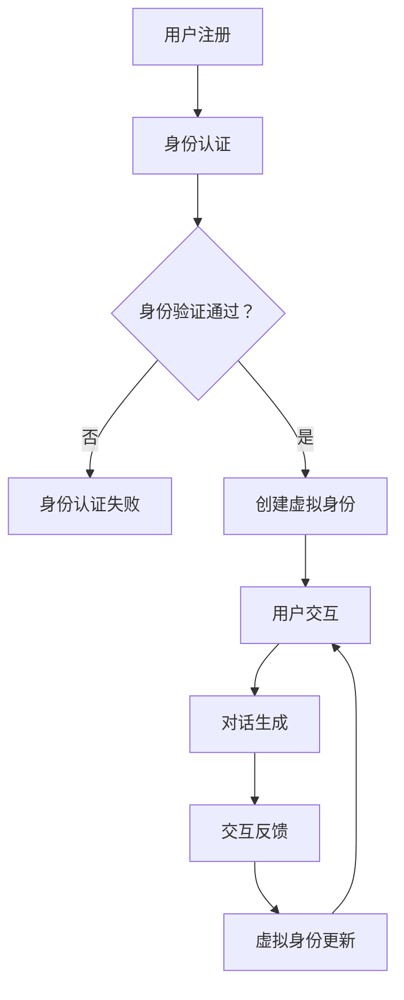

                 

### 第1章：虚拟身份概述

在数字化时代，虚拟身份已成为网络交互的核心组成部分。本章将深入探讨虚拟身份的定义、基本概念及其与现实身份的关系，同时回顾虚拟身份的发展历程，以及LLM（大型语言模型）在构建虚拟身份中的关键作用。

#### 1.1 虚拟身份的定义

虚拟身份，顾名思义，是指在网络空间中为个体所构建的数字人格。它通过符号系统、算法和技术手段来实现，代表用户在数字世界的存在。虚拟身份不仅是一种标识，更是一种身份认证的手段，它使得个体能够在不同平台和环境中进行交互和活动。

在更具体的技术层面上，虚拟身份通常由一系列数据组成，包括用户的个人资料、行为记录、兴趣爱好、社交媒体关系等。这些数据通过加密和编码技术存储在分布式数据库中，确保身份信息的安全性和隐私性。

#### 1.2 虚拟身份与现实身份的关系

虚拟身份与现实身份是相互依存、互为补充的关系。现实身份是物理世界中个体的真实存在，而虚拟身份则是在数字世界中反映和扩展这一存在的手段。虚拟身份的核心在于提供一种安全的身份认证方式，使得个体可以匿名地参与网络活动，同时保护其隐私。

虚拟身份与现实身份之间的关系可以类比为现实中的身份证件与电子证件。在现实世界中，身份证、驾驶证等证件用于证明个体的真实身份，而在数字世界，虚拟身份则通过数字签名、加密认证等方式，实现身份的确认和验证。

#### 1.3 虚拟身份的发展历程

虚拟身份的发展历程与互联网的发展密不可分。以下是虚拟身份在不同阶段的主要演变：

- **Web 1.0时代**：以信息展示为主，用户被动接收信息。在这个阶段，虚拟身份的概念尚未兴起，用户多以匿名身份参与网络活动。
- **Web 2.0时代**：用户参与度提高，社交网络开始兴起。这一阶段，虚拟身份开始逐渐成为用户在网络上的重要标识，用户通过社交媒体平台构建自己的数字人格。
- **Web 3.0时代**：去中心化、智能化，虚拟身份逐渐成为核心要素。Web 3.0强调用户自主控制数据和身份，虚拟身份不仅用于身份验证，还与区块链、人工智能等技术深度融合，成为数字世界中的重要组成部分。

#### 1.4 LLM在虚拟身份中的应用

LLM（大型语言模型）是近年来自然语言处理领域的重要突破，其在虚拟身份中的应用具有重要意义。以下是LLM在虚拟身份构建中的几个关键应用：

- **个性化对话生成**：通过LLM，虚拟身份可以更加智能和自然地与用户进行交互，提供个性化的服务和体验。例如，虚拟客服可以基于用户历史交互数据，生成与用户兴趣和需求相关的对话。
- **身份验证与授权**：LLM可以用于识别用户的身份，提高系统的安全性和可靠性。例如，在社交媒体平台，LLM可以分析用户输入的内容，验证其身份是否合法，从而防止欺诈行为。
- **虚拟角色扮演**：在游戏和虚拟现实中，LLM可以帮助构建个性化的虚拟角色，使其能够与玩家进行自然互动。例如，虚拟NPC（非玩家角色）可以根据玩家的行为和对话，生成个性化的回答和行为。

综上所述，虚拟身份在网络世界中的重要性日益凸显，而LLM的应用则为虚拟身份的构建和功能拓展提供了强大技术支持。在接下来的章节中，我们将进一步探讨虚拟身份的架构、核心算法原理及其在项目实战中的应用。

### 摘要

本文旨在深入探讨虚拟身份的概念、发展历程及其在数字化时代的重要性。首先，文章定义了虚拟身份，阐述了其在网络空间中的基本概念和与现实身份的关系。接着，回顾了虚拟身份从Web 1.0到Web 3.0的发展历程，展示了其在不同阶段的技术演变。特别地，本文重点介绍了LLM（大型语言模型）在虚拟身份构建中的关键应用，包括个性化对话生成、身份验证与授权、虚拟角色扮演等。文章通过详细的算法原理讲解、数学模型解析、项目实战案例和未来展望，全面展示了虚拟身份的技术架构和应用前景，强调了其在提升网络安全、个性化服务和用户体验方面的潜在价值。

### 目录大纲

#### 第一部分：虚拟身份的概念与背景

##### 第1章：虚拟身份概述

- 1.1 虚拟身份的定义
  - 虚拟身份的基本概念
  - 虚拟身份与现实身份的关系
- 1.2 虚拟身份的发展历程
  - 从Web 1.0到Web 3.0
  - 虚拟身份在不同阶段的演变
- 1.3 LLM在虚拟身份中的应用
  - LLM的基本原理
  - LLM在构建虚拟身份中的应用

##### 第2章：LLM驱动的虚拟身份架构

- 2.1 虚拟身份系统的组成部分
  - 用户角色与权限管理
  - 虚拟身份的创建与维护
- 2.2 LLM的核心架构
  - 神经网络结构
  - 语言模型训练过程
- 2.3 虚拟身份架构的Mermaid流程图
  - 系统组件的交互流程
  - LLM在系统中的作用

#### 第二部分：核心算法原理与实现

##### 第3章：LLM算法原理详解

- 3.1 语言模型的基本原理
  - 语言模型的作用
  - 语言模型的基本分类
- 3.2 LLM的训练过程
  - 数据预处理
  - 模型训练算法
- 3.3 LLM在虚拟身份中的应用
  - 个性化对话生成
  - 身份验证与授权

##### 第4章：数学模型与公式解析

- 4.1 概率论基础
  - 贝叶斯公式
  - 最大似然估计
- 4.2 LLM中的数学模型
  - 语言模型的概率分布
  - 模型评估指标
- 4.3 公式举例与详细讲解
  - N-gram模型
  - 语言模型中的损失函数

##### 第5章：LLM实现与代码解读

- 5.1 开发环境搭建
  - Python环境配置
  - OpenAI Gym安装
- 5.2 源代码详细实现
  - 模型训练与评估
  - 个性化对话生成
- 5.3 代码解读与分析
  - 代码结构分析
  - 关键代码解读

#### 第三部分：项目实战与案例分析

##### 第6章：虚拟身份项目实战

- 6.1 项目背景与需求分析
  - 虚拟身份系统的应用场景
  - 需求分析与目标设定
- 6.2 项目实施与步骤
  - 数据收集与预处理
  - 模型训练与优化
  - 系统集成与测试
- 6.3 项目成果与反思
  - 项目成果展示
  - 项目经验总结

##### 第7章：案例分析

- 7.1 案例一：虚拟身份在社交媒体中的应用
  - 应用场景
  - 实现方法
  - 效果评估
- 7.2 案例二：虚拟身份在游戏中的角色扮演
  - 应用场景
  - 实现方法
  - 效果评估
- 7.3 案例三：虚拟身份在电子商务中的用户隐私保护
  - 应用场景
  - 实现方法
  - 效果评估

#### 第四部分：未来展望与挑战

##### 第8章：虚拟身份的未来发展

- 8.1 虚拟身份的发展趋势
  - 技术趋势
  - 应用场景扩展
- 8.2 虚拟身份的发展方向
  - 与区块链的结合
  - 跨平台虚拟身份认证

##### 第9章：虚拟身份面临的挑战

- 9.1 技术挑战
  - 模型安全性与隐私保护
  - 跨平台身份认证与互操作
- 9.2 法律与伦理挑战
  - 身份盗窃与欺诈
  - 虚拟身份的法律地位

##### 第10章：总结与展望

- 10.1 主要内容回顾
  - 虚拟身份的定义与发展历程
  - LLM在虚拟身份中的应用与实现
- 10.2 未来发展方向
  - 技术创新与应用拓展
- 10.3 总结与建议
  - 面临的挑战与解决方案
  - 对未来虚拟身份的期待

### 附录

#### 附录A：LLM开发工具与资源

- 10.1 主流深度学习框架对比
  - TensorFlow
  - PyTorch
  - JAX
- 10.2 虚拟身份开发工具介绍
  - OpenAI API
  - Facebook AI SDK
- 10.3 虚拟身份开发资源
  - 开源代码库
  - 技术论文与报告
#### 附录B：术语表

- 虚拟身份
- LLM
- 自监督学习
- 迁移学习
- Web 3.0
- 区块链
- 概率论
- 贝叶斯公式
- 最大似然估计
- N-gram模型
- 损失函数

---

注：以上大纲为示例，实际内容需根据具体章节进行扩展与细化。所有章节应包含核心概念、算法原理、数学模型、项目实战、案例分析、未来展望等内容。

### 第1章：虚拟身份概述

在数字化时代，虚拟身份已成为网络交互的核心组成部分。本章将深入探讨虚拟身份的定义、基本概念及其与现实身份的关系，同时回顾虚拟身份的发展历程，以及LLM（大型语言模型）在构建虚拟身份中的关键作用。

#### 1.1 虚拟身份的定义

虚拟身份，顾名思义，是指在网络空间中为个体所构建的数字人格。它通过符号系统、算法和技术手段来实现，代表用户在数字世界的存在。虚拟身份不仅是一种标识，更是一种身份认证的手段，它使得个体能够在不同平台和环境中进行交互和活动。

在更具体的技术层面上，虚拟身份通常由一系列数据组成，包括用户的个人资料、行为记录、兴趣爱好、社交媒体关系等。这些数据通过加密和编码技术存储在分布式数据库中，确保身份信息的安全性和隐私性。

#### 1.2 虚拟身份与现实身份的关系

虚拟身份与现实身份是相互依存、互为补充的关系。现实身份是物理世界中个体的真实存在，而虚拟身份则是在数字世界中反映和扩展这一存在的手段。虚拟身份的核心在于提供一种安全的身份认证方式，使得个体可以匿名地参与网络活动，同时保护其隐私。

虚拟身份与现实身份之间的关系可以类比为现实中的身份证件与电子证件。在现实世界中，身份证、驾驶证等证件用于证明个体的真实身份，而在数字世界，虚拟身份则通过数字签名、加密认证等方式，实现身份的确认和验证。

#### 1.3 虚拟身份的发展历程

虚拟身份的发展历程与互联网的发展密不可分。以下是虚拟身份在不同阶段的主要演变：

- **Web 1.0时代**：以信息展示为主，用户被动接收信息。在这个阶段，虚拟身份的概念尚未兴起，用户多以匿名身份参与网络活动。

- **Web 2.0时代**：用户参与度提高，社交网络开始兴起。这一阶段，虚拟身份开始逐渐成为用户在网络上的重要标识，用户通过社交媒体平台构建自己的数字人格。

- **Web 3.0时代**：去中心化、智能化，虚拟身份逐渐成为核心要素。Web 3.0强调用户自主控制数据和身份，虚拟身份不仅用于身份验证，还与区块链、人工智能等技术深度融合，成为数字世界中的重要组成部分。

#### 1.4 LLM在虚拟身份中的应用

LLM（大型语言模型）是近年来自然语言处理领域的重要突破，其在虚拟身份中的应用具有重要意义。以下是LLM在虚拟身份构建中的几个关键应用：

- **个性化对话生成**：通过LLM，虚拟身份可以更加智能和自然地与用户进行交互，提供个性化的服务和体验。例如，虚拟客服可以基于用户历史交互数据，生成与用户兴趣和需求相关的对话。

- **身份验证与授权**：LLM可以用于识别用户的身份，提高系统的安全性和可靠性。例如，在社交媒体平台，LLM可以分析用户输入的内容，验证其身份是否合法，从而防止欺诈行为。

- **虚拟角色扮演**：在游戏和虚拟现实中，LLM可以帮助构建个性化的虚拟角色，使其能够与玩家进行自然互动。例如，虚拟NPC（非玩家角色）可以根据玩家的行为和对话，生成个性化的回答和行为。

综上所述，虚拟身份在网络世界中的重要性日益凸显，而LLM的应用则为虚拟身份的构建和功能拓展提供了强大技术支持。在接下来的章节中，我们将进一步探讨虚拟身份的架构、核心算法原理及其在项目实战中的应用。

### 第1章：虚拟身份概述

在数字化时代，虚拟身份已成为网络交互的核心组成部分。本章将深入探讨虚拟身份的定义、基本概念及其与现实身份的关系，同时回顾虚拟身份的发展历程，以及LLM（大型语言模型）在构建虚拟身份中的关键作用。

#### 1.1 虚拟身份的定义

虚拟身份，顾名思义，是指在网络空间中为个体所构建的数字人格。它通过符号系统、算法和技术手段来实现，代表用户在数字世界的存在。虚拟身份不仅是一种标识，更是一种身份认证的手段，它使得个体能够在不同平台和环境中进行交互和活动。

在更具体的技术层面上，虚拟身份通常由一系列数据组成，包括用户的个人资料、行为记录、兴趣爱好、社交媒体关系等。这些数据通过加密和编码技术存储在分布式数据库中，确保身份信息的安全性和隐私性。

#### 1.2 虚拟身份与现实身份的关系

虚拟身份与现实身份是相互依存、互为补充的关系。现实身份是物理世界中个体的真实存在，而虚拟身份则是在数字世界中反映和扩展这一存在的手段。虚拟身份的核心在于提供一种安全的身份认证方式，使得个体可以匿名地参与网络活动，同时保护其隐私。

虚拟身份与现实身份之间的关系可以类比为现实中的身份证件与电子证件。在现实世界中，身份证、驾驶证等证件用于证明个体的真实身份，而在数字世界，虚拟身份则通过数字签名、加密认证等方式，实现身份的确认和验证。

#### 1.3 虚拟身份的发展历程

虚拟身份的发展历程与互联网的发展密不可分。以下是虚拟身份在不同阶段的主要演变：

- **Web 1.0时代**：以信息展示为主，用户被动接收信息。在这个阶段，虚拟身份的概念尚未兴起，用户多以匿名身份参与网络活动。

- **Web 2.0时代**：用户参与度提高，社交网络开始兴起。这一阶段，虚拟身份开始逐渐成为用户在网络上的重要标识，用户通过社交媒体平台构建自己的数字人格。

- **Web 3.0时代**：去中心化、智能化，虚拟身份逐渐成为核心要素。Web 3.0强调用户自主控制数据和身份，虚拟身份不仅用于身份验证，还与区块链、人工智能等技术深度融合，成为数字世界中的重要组成部分。

#### 1.4 LLM在虚拟身份中的应用

LLM（大型语言模型）是近年来自然语言处理领域的重要突破，其在虚拟身份中的应用具有重要意义。以下是LLM在虚拟身份构建中的几个关键应用：

- **个性化对话生成**：通过LLM，虚拟身份可以更加智能和自然地与用户进行交互，提供个性化的服务和体验。例如，虚拟客服可以基于用户历史交互数据，生成与用户兴趣和需求相关的对话。

- **身份验证与授权**：LLM可以用于识别用户的身份，提高系统的安全性和可靠性。例如，在社交媒体平台，LLM可以分析用户输入的内容，验证其身份是否合法，从而防止欺诈行为。

- **虚拟角色扮演**：在游戏和虚拟现实中，LLM可以帮助构建个性化的虚拟角色，使其能够与玩家进行自然互动。例如，虚拟NPC（非玩家角色）可以根据玩家的行为和对话，生成个性化的回答和行为。

综上所述，虚拟身份在网络世界中的重要性日益凸显，而LLM的应用则为虚拟身份的构建和功能拓展提供了强大技术支持。在接下来的章节中，我们将进一步探讨虚拟身份的架构、核心算法原理及其在项目实战中的应用。

### 第2章：LLM驱动的虚拟身份架构

虚拟身份的构建需要一套完整的技术架构，而LLM（大型语言模型）在此架构中扮演着至关重要的角色。本章将详细解析LLM驱动的虚拟身份系统架构，包括系统的主要组成部分、LLM的核心架构以及整个系统的交互流程。

#### 2.1 虚拟身份系统的组成部分

一个完整的虚拟身份系统通常由以下几个关键组成部分构成：

1. **用户角色与权限管理**：
   - 用户角色定义：根据用户在系统中的角色和职责，划分不同类型的用户角色。
   - 权限管理：为不同角色分配相应的权限，确保系统的安全性和稳定性。

2. **用户身份认证**：
   - 身份认证机制：采用密码学算法和身份验证协议，确保用户身份的真实性和合法性。
   - 多因素认证：结合生物识别、动态口令等多重认证手段，提高系统的安全性。

3. **虚拟身份创建与维护**：
   - 虚拟身份生成：利用LLM技术生成个性化的虚拟身份，包括用户昵称、头像、个人介绍等。
   - 虚拟身份更新：根据用户行为和互动数据，动态调整和优化虚拟身份信息。

4. **隐私保护机制**：
   - 数据加密：对用户身份信息和交互记录进行加密存储，防止数据泄露。
   - 匿名化处理：对敏感数据进行匿名化处理，确保用户隐私不受侵犯。

5. **用户交互与服务**：
   - 交互界面：提供友好的用户界面，使用户能够方便地管理虚拟身份和进行交互。
   - 服务支持：集成个性化服务模块，如虚拟客服、智能问答等，提升用户体验。

#### 2.2 LLM的核心架构

LLM作为一种先进的自然语言处理模型，其核心架构通常包括以下几个关键部分：

1. **神经网络结构**：
   - **输入层**：接收用户输入的文本数据，如查询语句、交互记录等。
   - **隐藏层**：通过多层神经网络对输入文本进行编码，提取语义特征。
   - **输出层**：生成预测的文本结果，如回复内容、标签分类等。

2. **语言模型训练过程**：
   - **数据预处理**：对原始文本数据进行清洗、分词、去停用词等预处理步骤，为模型训练做准备。
   - **模型训练算法**：采用优化算法（如SGD、Adam等）调整模型参数，使其在训练数据上表现良好。
   - **评估与调整**：通过验证集和测试集对模型进行评估，根据评估结果调整模型结构和参数。

3. **语言模型应用**：
   - **个性化对话生成**：根据用户历史交互数据和当前输入，生成个性化的对话回复。
   - **文本分类与标签**：对用户生成的内容进行分类和标签，帮助系统更好地理解用户意图。
   - **情感分析**：分析用户文本中的情感倾向，为个性化服务和用户体验提供支持。

#### 2.3 虚拟身份架构的Mermaid流程图

为了更直观地展示虚拟身份系统的组件及其交互流程，我们可以使用Mermaid绘制一个简单的流程图。以下是虚拟身份系统的一个基本架构流程：

在这个流程图中：

- **用户注册**：用户通过注册流程进入系统。
- **身份认证**：系统对用户身份进行验证，确保合法用户访问。
- **虚拟身份创建**：通过LLM生成用户的虚拟身份信息。
- **用户交互**：用户与虚拟身份进行交互，生成对话内容。
- **对话生成**：LLM根据用户交互内容和历史数据生成对话回复。
- **交互反馈**：系统将生成的回复反馈给用户。
- **虚拟身份更新**：根据用户交互记录和反馈，动态更新虚拟身份信息。

通过这个流程图，我们可以清晰地看到虚拟身份系统的各个环节及其交互关系，为后续的详细讨论提供了基础。

综上所述，LLM驱动的虚拟身份架构不仅包含了核心的技术组件，还通过系统的交互流程实现了虚拟身份的创建、管理和应用。在接下来的章节中，我们将进一步深入探讨LLM的核心算法原理和数学模型，以及这些技术在实际项目中的应用。

### 第3章：LLM算法原理详解

在构建虚拟身份的过程中，LLM（大型语言模型）发挥着至关重要的作用。本章将详细解析LLM的算法原理，从语言模型的基本概念、训练过程，到其在虚拟身份中的应用。

#### 3.1 语言模型的基本原理

语言模型是自然语言处理的核心技术，用于预测文本序列的概率分布。其基本原理是通过学习大量文本数据，建立起一种概率分布模型，从而能够对新的文本序列进行预测。

1. **语言模型的作用**：

   - **文本生成**：基于给定的起始文本，生成后续可能的文本序列。
   - **文本分类**：对文本进行分类，如新闻分类、情感分析等。
   - **语音识别**：将语音信号转换为文本，应用于语音助手、智能翻译等。

2. **语言模型的基本分类**：

   - **基于规则的语言模型**：通过语法规则和词典信息生成文本，如LRU（Least Recently Used）缓存算法。
   - **基于统计的语言模型**：利用统计方法，如N-gram模型、隐马尔可夫模型（HMM）等。
   - **基于神经网

