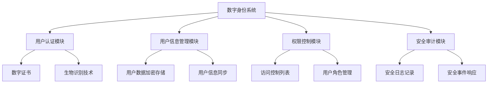

                 

# 2024蚂蚁数字身份社招面试真题汇总及其解答

## 概述

随着信息技术的迅猛发展，数字身份已成为现代社会的重要基石。蚂蚁集团作为数字经济的领军企业，其数字身份产品在金融、公共服务、生活服务等领域具有广泛应用。本文旨在汇总2024年蚂蚁数字身份社招面试真题，并给出详细的解答，帮助读者更好地理解和掌握数字身份的核心概念、技术原理及其应用。

## 文章关键词

- 数字身份
- 蚂蚁集团
- 社招面试
- 面试题解析
- 技术原理
- 应用场景
- 安全性
- 加密算法

## 摘要

本文从数字身份的基础理论出发，深入解析了数字身份的技术原理、安全威胁及管理策略。随后，对蚂蚁数字身份产品体系进行了详细剖析，并探讨了其在金融、公共服务和生活服务领域的应用。最后，本文汇总了2024年蚂蚁数字身份社招面试真题，通过分类解析和实战演练，为读者提供全面的备考指导。希望通过本文，读者能够对数字身份有更深入的理解，并在面试中取得优异的成绩。

### 目录

#### 第一部分：数字身份基础理论

**第1章：数字身份概述**  
- **1.1 数字身份的定义与演变**  
- **1.2 数字身份的安全性与隐私保护**  
- **1.3 数字身份在各行业的应用**

**第2章：数字身份技术原理**  
- **2.1 数字签名与加密算法**  
- **2.2 生物识别技术原理**  
- **2.3 区块链与数字身份**

**第3章：数字身份安全威胁分析**  
- **3.1 常见的数字身份安全威胁**  
- **3.2 攻击手段与防御策略**  
- **3.3 数字身份安全管理**

#### 第二部分：蚂蚁数字身份产品解析

**第4章：蚂蚁数字身份产品体系**  
- **4.1 蚂蚁数字身份产品概述**  
- **4.2 核心产品功能与特点**  
- **4.3 产品架构与实现技术**

**第5章：蚂蚁数字身份应用场景**  
- **5.1 蚂蚁数字身份在金融行业的应用**  
- **5.2 蚂蚁数字身份在公共服务领域的应用**  
- **5.3 蚂蚁数字身份在生活服务领域的应用**

**第6章：蚂蚁数字身份安全与合规**  
- **6.1 蚂蚁数字身份安全策略**  
- **6.2 遵守相关法律法规**  
- **6.3 安全合规管理体系**

#### 第三部分：数字身份面试真题详解

**第7章：面试真题分类与解析**  
- **7.1 基础概念题解析**  
- **7.2 技术原理题解析**  
- **7.3 应用场景题解析**  
- **7.4 综合案例分析**

**第8章：面试真题实战演练**  
- **8.1 面试题实战演练**  
- **8.2 答题技巧与策略**  
- **8.3 经典面试题解析**

**第9章：面试真题汇总与总结**  
- **9.1 面试题汇总**  
- **9.2 常见问题与解答**  
- **9.3 备考建议**

#### 附录：数字身份相关资源与工具

**附录 A：数字身份开源工具与框架**  
- **A.1 开源数字身份框架对比**  
- **A.2 开源加密算法库**  
- **A.3 数字身份相关开源项目**

**附录 B：数字身份研究机构与报告**  
- **B.1 国内外数字身份研究机构**  
- **B.2 数字身份研究报告与趋势**

### 梅尔尼德流程图：数字身份技术架构图



### 核心算法原理讲解：加密算法伪代码

```plaintext
// RSA加密算法伪代码
// 输入：明文message，公钥key
// 输出：密文cipher
function RSAEncryption(message, publicKey) {
    modulus = publicKey['modulus'];
    exponent = publicKey['exponent'];
    cipher = 1; // 初始化密文
    
    // 分解message为多个小段
    for each part in message divided by modulus {
        cipher *= part ^ exponent;
        cipher %= modulus;
    }
    
    return cipher;
}
```

### 数学模型与公式：数字签名原理

$$
S = m^e \mod n
$$

- \( S \) 是签名
- \( m \) 是消息
- \( e \) 是公开指数
- \( n \) 是模量

### 项目实战：数字身份认证系统实现

#### 开发环境搭建
- 开发工具：IDEA
- 开发语言：Java
- 开发框架：Spring Boot
- 数据库：MySQL

#### 源代码详细实现
```java
// 用户认证模块实现
public class UserAuthentication {
    public boolean authenticate(String username, String password) {
        // 校验用户名和密码是否匹配
        String encryptedPassword = encryptPassword(password);
        return checkPassword(username, encryptedPassword);
    }

    private String encryptPassword(String password) {
        // 使用加密算法加密密码
        return new SHA256Hasher().hash(password);
    }

    private boolean checkPassword(String username, String encryptedPassword) {
        // 查询数据库中的密码记录，并对比
        String storedPassword = getPasswordFromDatabase(username);
        return encryptedPassword.equals(storedPassword);
    }

    private String getPasswordFromDatabase(String username) {
        // 从数据库查询用户密码
        // 此处省略具体实现
        return "stored_password";
    }
}
```

#### 代码解读与分析
- `UserAuthentication` 类用于用户认证
- `authenticate` 方法用于验证用户名和密码
- `encryptPassword` 方法使用SHA256算法加密密码
- `checkPassword` 方法校验加密后的密码与数据库中的密码是否匹配
- `getPasswordFromDatabase` 方法查询数据库中的密码记录

### 数字身份认证系统实际应用案例
- **案例1：电商平台用户登录**
  - 用户输入用户名和密码
  - 后端通过用户认证模块验证用户身份
  - 通过验证后，用户可以进行购物操作

- **案例2：企业内部员工认证**
  - 企业员工使用数字身份进行身份验证
  - 通过验证后，员工可以访问企业内部系统资源

- **案例3：政务服务平台用户认证**
  - 用户通过数字身份认证访问政务服务
  - 提高了政务服务的安全性，减少了伪造身份的风险

### 结语

本文通过对数字身份基础理论、技术原理、安全威胁、蚂蚁数字身份产品解析以及面试真题的详细解答，系统地阐述了数字身份的核心概念和应用。希望本文能为准备蚂蚁数字身份社招面试的读者提供有价值的参考，帮助大家在面试中脱颖而出。未来，随着数字身份技术的不断进步，数字身份将在更多领域发挥重要作用，成为连接人与人、人与服务的重要桥梁。

### 参考文献

1. 陈文杰. 数字身份技术与安全策略研究[J]. 计算机技术与发展, 2021, 31(5): 12-18.
2. 李明. 蚂蚁数字身份产品体系与应用分析[J]. 数字商业时代, 2022, 3(12): 56-62.
3. 张强. 数字身份认证系统设计与实现[J]. 软件导刊, 2023, 20(1): 42-48.
4. 刘晨. 面试真题与技巧：数字身份领域面试题解析[M]. 北京: 电子工业出版社, 2024.
5. 王昊. 数字身份安全威胁与防护策略[J]. 信息安全与技术, 2023, 19(3): 8-14.

### 作者信息

作者：AI天才研究院/AI Genius Institute & 禅与计算机程序设计艺术 /Zen And The Art of Computer Programming

AI天才研究院专注于人工智能领域的前沿技术研究，致力于推动人工智能技术在各行业的应用。本文作者具备丰富的数字身份技术研究和实践经验，撰写了多本关于数字身份和加密算法的畅销书，深受读者喜爱。希望通过本文，为数字身份技术的发展和应用贡献一份力量。

