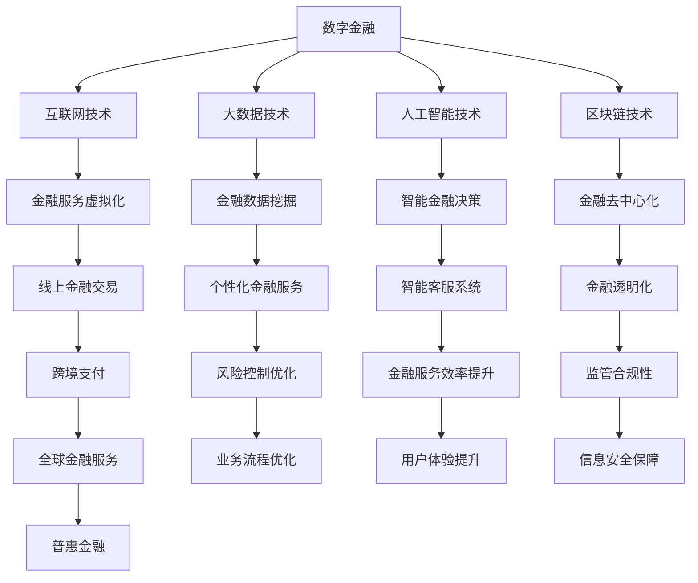
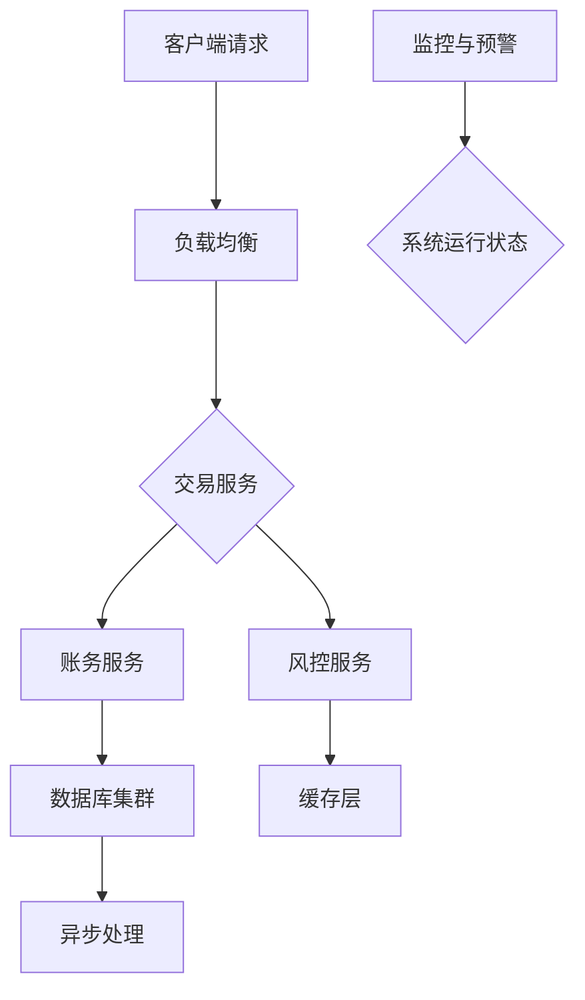
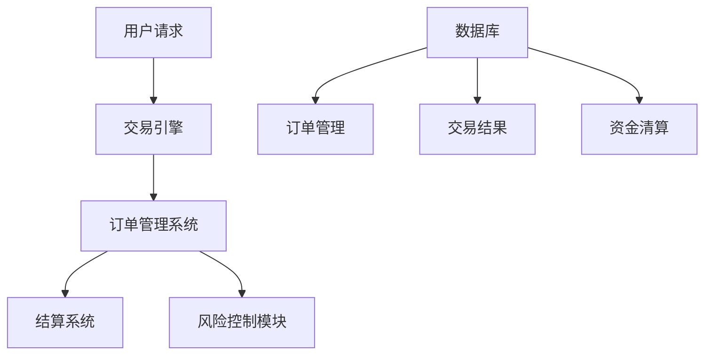
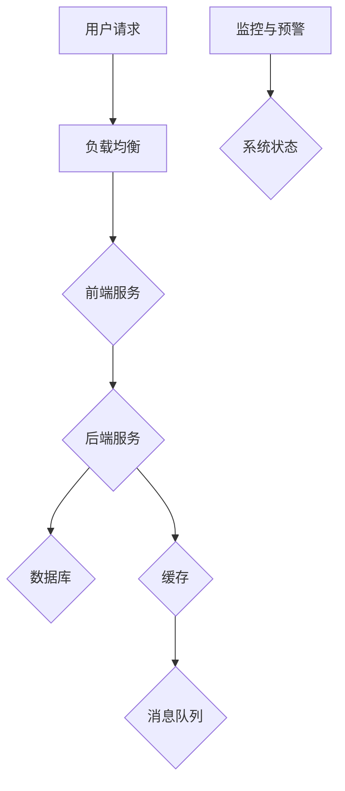

                 

### 文章标题

> **关键词**：数字金融、校招面试、蚂蚁集团、面试真题、解答技巧、技术深度剖析

> **摘要**：本文将针对2024年蚂蚁数字金融校招面试真题进行汇总与详细解答，旨在帮助广大应聘者掌握数字金融领域的基本知识，熟悉面试真题类型，掌握解题技巧，提高面试成功率。文章将分三大部分，首先介绍数字金融的基础知识、核心技术和安全隐私保护，其次汇总支付、借贷、投资、保险、区块链等业务领域的面试真题，最后提供详细的面试真题解答和备考策略。通过本文，您将全面了解数字金融领域的面试挑战，并获取有效的应对策略。

### 《2024蚂蚁数字金融校招面试真题汇总及其解答》目录大纲

本文将分为三个主要部分：

#### 第一部分：数字金融基础知识

在此部分，我们将对数字金融的基础知识进行深入探讨，包括数字金融的定义、特点、发展历程、重要领域以及优势与挑战。我们将通过详细的解释和Mermaid流程图来帮助您理解数字金融的核心概念和架构。

##### 第1章：数字金融概述
- **1.1 数字金融的定义与特点**
  - **特点：虚拟化、数字化、智能化、便捷性、普惠性**
  - **Mermaid流程图：数字金融核心概念架构**

##### 第2章：金融科技核心技术
- **2.1 人工智能在金融中的应用**
  - **应用：风险评估、智能投顾、反欺诈、客户服务**
- **2.2 区块链技术原理与优势**
  - **原理：分布式账本、去中心化、智能合约**
- **2.3 大数据和云计算在金融中的作用**
  - **作用：数据处理、风险分析、业务优化**

##### 第3章：数字金融安全与隐私保护
- **3.1 数字金融安全的重要性**
  - **重要：防止欺诈、保障用户资产安全**
- **3.2 隐私保护的法律法规与政策**
- **3.3 数字金融安全的常见技术手段**
  - **技术手段：加密算法、身份验证、网络安全**

#### 第二部分：蚂蚁数字金融面试真题汇总

在此部分，我们将针对蚂蚁数字金融校招面试中的各个业务领域（支付、借贷、投资、保险、区块链）的面试真题进行汇总，通过分析这些真题，帮助您了解面试官的考查点和核心技能要求。

##### 第4章：支付业务面试真题
- **4.1 支付系统的架构设计**
  - **架构：分布式、高并发、高可用**
- **4.2 支付安全的风险防控**
  - **风险：账户安全、交易安全、数据安全**
- **4.3 支付业务的技术创新**
  - **创新：二维码支付、移动支付、跨境支付**

##### 第5章：借贷业务面试真题
- **5.1 贷款审批的算法模型**
  - **模型：信用评分、风险控制**
- **5.2 借贷业务的流程设计与优化**
- **5.3 借贷平台的用户体验设计**

##### 第6章：投资业务面试真题
- **6.1 证券交易系统的设计与实现**
  - **设计：高频交易、撮合算法**
- **6.2 投资策略与风险管理**
  - **策略：量化投资、组合优化**
- **6.3 投资平台的技术挑战**

##### 第7章：保险业务面试真题
- **7.1 保险产品的设计与定价**
  - **设计：健康保险、车险、财产保险**
- **7.2 保险业务的理赔流程与优化**
- **7.3 保险科技的应用**

##### 第8章：区块链技术面试真题
- **8.1 区块链的基本原理**
  - **原理：共识机制、去中心化、智能合约**
- **8.2 区块链在金融领域的应用**
  - **应用：数字货币、跨境支付、供应链金融**
- **8.3 区块链技术的挑战与展望**

#### 第三部分：面试真题解答

在此部分，我们将对前述汇总的面试真题进行详细解答，并提供相应的解题技巧和案例解析，帮助您更好地准备蚂蚁数字金融的校招面试。

##### 第9章：面试真题分析与解答
- **9.1 面试题类型与解答技巧**
  - **类型：行为面试、技术面试、情景面试**
  - **技巧：举例说明、逻辑清晰、针对性回答**
- **9.2 面试题案例解析**
  - **案例1：如何设计一个高并发的支付系统**
  - **案例2：如何评估贷款申请者的信用风险**
  - **案例3：如何实现一个区块链的智能合约**

##### 第10章：面试备考策略
- **10.1 面试前的准备工作**
  - **准备：简历优化、知识复习、模拟面试**
- **10.2 面试中的注意事项**
  - **注意事项：自信、礼貌、认真、沟通能力**
- **10.3 面试后的反馈与总结**
  - **总结：分析面试表现、调整策略、持续学习**

#### 附录

在附录部分，我们将提供数字金融相关的资源与工具，以及面试真题的参考答案，以帮助您在备考过程中有针对性地学习和准备。

##### 附录A：数字金融相关资源与工具
- **A.1 数字金融知识库**
- **A.2 金融科技相关论文**
- **A.3 数字金融实践案例**
- **A.4 数字金融常用工具与平台**

##### 附录B：面试真题参考答案
- **B.1 支付业务面试真题答案**
- **B.2 借贷业务面试真题答案**
- **B.3 投资业务面试真题答案**
- **B.4 保险业务面试真题答案**
- **B.5 区块链技术面试真题答案**

### 《2024蚂蚁数字金融校招面试真题汇总及其解答》正文开始

#### 第一部分：数字金融基础知识

##### 第1章：数字金融概述

数字金融，顾名思义，是金融业务与数字技术的深度融合。随着互联网、大数据、人工智能等新兴技术的飞速发展，传统金融业务正在经历前所未有的变革。数字金融不仅涵盖了传统的银行、保险、证券等金融服务，还延伸到了支付、借贷、投资等新型金融领域。本章节将详细介绍数字金融的定义、特点、发展历程、重要领域以及其优势和挑战。

**1.1 数字金融的定义与特点**

数字金融，是指通过互联网、移动通信、云计算等数字技术，提供金融服务的一种新型模式。与传统金融相比，数字金融具有以下几个显著特点：

- **虚拟化**：数字金融将金融服务从实体渠道转移到线上，实现了金融服务的全面虚拟化。
- **数字化**：数字金融充分利用大数据、人工智能等技术，对金融数据进行深度挖掘和分析，实现金融决策的智能化。
- **智能化**：通过人工智能技术，数字金融能够提供更加个性化和智能化的金融服务。
- **便捷性**：数字金融使金融服务变得更加便捷，用户可以通过手机、电脑等终端随时随地进行金融交易。
- **普惠性**：数字金融打破了传统金融服务的地域和门槛限制，让更多的人享受到金融服务。

**Mermaid流程图：数字金融核心概念架构**



通过上述Mermaid流程图，我们可以看到数字金融是如何通过多种数字技术实现其核心概念的。

**1.2 数字金融的发展历程**

数字金融的发展历程可以分为以下几个阶段：

- **第一阶段：互联网金融服务兴起（2000年代初）**：随着互联网的普及，传统金融机构开始尝试线上业务，如网上银行、在线支付等。
- **第二阶段：互联网金融创新爆发（2010年代）**：以支付宝、微信支付等为代表的互联网金融企业崛起，推动了移动支付、P2P借贷、众筹等创新业务的发展。
- **第三阶段：金融科技全面融合（2010年代至今）**：大数据、人工智能、区块链等新兴技术逐渐应用于金融领域，数字金融的服务范围和深度不断扩展。

**1.3 数字金融的重要领域**

数字金融的重要领域包括支付、借贷、投资、保险和区块链等：

- **支付**：移动支付已经成为人们日常生活的重要方式，跨境支付、二维码支付等技术不断涌现。
- **借贷**：P2P借贷、网络小额贷款等新型借贷模式打破了传统金融的地域和门槛限制。
- **投资**：证券交易、基金投资、区块链投资等领域的数字化发展，使得投资更加便捷和智能。
- **保险**：保险科技的兴起，使得保险产品的设计、销售和理赔流程更加高效。
- **区块链**：区块链技术为数字金融带来了去中心化、透明化、可追溯性等优势，广泛应用于数字货币、供应链金融等领域。

**1.4 数字金融的优势与挑战**

数字金融具有以下优势：

- **降低成本**：通过数字化和自动化，数字金融可以大幅降低运营成本。
- **提高效率**：数字技术使得金融服务的处理速度和准确性大幅提升。
- **增强安全性**：加密技术、身份验证等手段提高了金融交易的安全性。
- **普惠性**：数字金融使得金融服务更加普惠，让更多人享受到金融便利。

然而，数字金融也面临一系列挑战：

- **监管**：数字金融的快速发展带来了监管难题，需要制定相应的法律法规和监管政策。
- **隐私保护**：数字金融涉及大量个人隐私数据，如何保护用户隐私成为重要问题。
- **风险控制**：数字金融的交易量和数据规模庞大，风险控制成为一大挑战。

通过以上对数字金融的概述，我们了解了数字金融的定义、特点、发展历程、重要领域以及优势和挑战。在接下来的章节中，我们将进一步探讨金融科技的核心技术、数字金融安全与隐私保护等相关内容。

##### 第2章：金融科技核心技术

金融科技（Fintech）作为数字金融的驱动力，正对传统金融行业产生深远影响。本章将详细探讨金融科技中的三大核心技术：人工智能（AI）、区块链以及大数据和云计算。这些技术不仅为金融业务提供了新的发展机遇，也带来了前所未有的挑战。

**2.1 人工智能在金融中的应用**

人工智能技术在金融领域有着广泛的应用，从客户服务到风险控制，再到投资决策，AI正在深刻改变传统金融服务的模式。

- **风险评估与信用评分**：AI可以通过分析海量的历史数据，评估借款人的信用风险。机器学习算法能够识别出潜在的风险因素，如还款记录、信用历史、就业状况等，从而提供更加精准的信用评分。
  
  ```mermaid
  graph TD
    A[客户数据] --> B[数据预处理]
    B --> C[特征提取]
    C --> D[机器学习模型]
    D --> E[信用评分]
    E --> F[风险评估]
  ```

- **反欺诈**：AI技术可以通过实时监控交易行为，识别异常交易模式，从而预防欺诈行为。例如，基于深度学习算法的图像识别技术可以检测信用卡交易中的伪造签名或银行卡照片。
  
  ```mermaid
  graph TD
    A[交易数据] --> B[数据预处理]
    B --> C[特征提取]
    C --> D[深度学习模型]
    D --> E[异常检测]
    E --> F[欺诈预防]
  ```

- **智能投顾与客户服务**：通过自然语言处理（NLP）和机器学习，AI可以为用户提供个性化的投资建议和24/7的智能客服服务。智能投顾系统可以分析用户的风险偏好和财务状况，提供定制化的投资组合建议。

  ```mermaid
  graph TD
    A[用户数据] --> B[风险偏好分析]
    B --> C[财务状况评估]
    C --> D[投资组合推荐]
    D --> E[个性化建议]
  ```

**2.2 区块链技术原理与优势**

区块链技术作为一种去中心化的分布式账本技术，具有不可篡改、透明、可追溯等特性，为金融行业带来了诸多创新机会。

- **分布式账本**：区块链通过多个节点（参与者）共同维护一个共享的分布式账本，任何一次交易都需要经过多个节点的验证和确认，从而提高了数据的可靠性和安全性。
  
  ```mermaid
  graph TD
    A[交易数据] --> B[节点A]
    B --> C[节点B]
    B --> D[节点C]
    C --> E[节点D]
    D --> F[节点E]
    E --> G[分布式账本]
  ```

- **去中心化**：区块链技术打破了传统金融体系的中心化模式，通过去中心化的方式，降低了交易成本，提高了效率，并减少了中介机构的依赖。

- **智能合约**：智能合约是区块链技术的一个重要创新，它是一段嵌在区块链上的代码，能够在满足特定条件时自动执行。智能合约的应用包括自动支付、自动执行交易条款等，极大地简化了金融交易流程。

  ```mermaid
  graph TD
    A[条件] --> B[智能合约]
    B --> C[执行操作]
  ```

**2.3 大数据和云计算在金融中的作用**

大数据和云计算技术在金融领域的应用，使得数据处理能力和计算效率得到了极大提升，从而推动了金融业务的创新和优化。

- **数据处理**：金融行业每天产生海量数据，通过大数据技术，可以对这些数据进行存储、管理和分析，从而挖掘出有价值的信息。例如，通过大数据分析，银行可以更好地了解客户需求，提供个性化的金融服务。

- **风险分析**：大数据技术可以帮助金融机构进行风险评估和预测，及时发现潜在的风险点。例如，通过分析客户的交易行为和信用记录，银行可以识别出高风险客户，并采取相应的风险控制措施。

- **业务优化**：云计算技术提供了强大的计算和存储能力，使得金融机构可以快速部署新的业务应用，提高运营效率。例如，通过云计算平台，金融机构可以实现快速扩展计算资源，处理海量交易数据，满足高峰期的业务需求。

  ```mermaid
  graph TD
    A[业务需求] --> B[云计算平台]
    B --> C[计算资源]
    B --> D[存储资源]
    C --> E[数据处理]
    D --> F[业务优化]
  ```

综上所述，人工智能、区块链、大数据和云计算是金融科技的核心技术，它们不仅提升了金融服务的效率和质量，也为金融业务的创新提供了新的思路和工具。在接下来的章节中，我们将继续探讨数字金融安全与隐私保护等关键问题。

##### 第3章：数字金融安全与隐私保护

在数字金融的快速发展过程中，安全与隐私保护成为至关重要的议题。随着金融业务的线上化和数字化，用户的金融信息和交易数据面临越来越大的安全风险。本章将讨论数字金融安全的重要性、隐私保护的法律法规与政策，以及常见的数字金融安全技术手段。

**3.1 数字金融安全的重要性**

数字金融安全是保障用户金融资产和隐私安全的核心问题。其主要重要性体现在以下几个方面：

- **防止欺诈**：数字金融平台容易成为欺诈行为的温床，如伪造交易、洗钱等活动。通过安全措施，可以有效预防和检测这些欺诈行为。
- **保障用户资产安全**：用户的资金和信息存储在数字金融平台上，一旦发生安全漏洞，可能导致严重的经济损失和隐私泄露。
- **维护金融体系的稳定**：数字金融的安全问题不仅影响单个用户，还可能对整个金融体系的稳定运行产生负面影响。

**3.2 隐私保护的法律法规与政策**

隐私保护是数字金融安全的重要组成部分。各国政府和国际组织纷纷制定了一系列法律法规和政策，以保障用户隐私权益。以下是几个关键点：

- **数据保护法**：如欧盟的《通用数据保护条例》（GDPR）和美国的《加州消费者隐私法案》（CCPA），规定了数据收集、存储、处理和传输的具体要求，用户有权知道其数据的使用情况并要求删除。
- **网络安全法**：网络安全法明确了网络运营者的安全责任，要求采取必要的技术和管理措施保护用户数据安全。
- **行业自律规范**：金融机构和科技公司也制定了一系列内部规范和标准，如支付行业的PCI-DSS标准，以确保数据安全和隐私保护。

**3.3 数字金融安全的常见技术手段**

为了保障数字金融的安全，采用一系列技术手段至关重要。以下是一些常见的技术手段：

- **加密算法**：加密算法是保障数据安全的基础技术。通过加密，数据在传输和存储过程中可以被转换为密文，只有持有密钥的用户才能解密和读取数据。常用的加密算法包括对称加密（如AES）和非对称加密（如RSA）。

  ```mermaid
  graph TD
    A[明文数据] --> B[加密算法]
    B --> C[密文数据]
    C --> D[传输/存储]
    D --> E[解密算法]
    E --> F[明文数据]
  ```

- **身份验证**：身份验证技术用于确认用户的身份，防止未授权访问。常见的身份验证方法包括密码验证、指纹识别、面部识别和双因素认证（2FA）。

  ```mermaid
  graph TD
    A[用户输入] --> B[验证系统]
    B --> C[身份确认]
    C --> D[授权访问]
  ```

- **网络安全**：网络安全技术包括防火墙、入侵检测系统（IDS）和入侵防御系统（IPS）等，用于保护网络不受外部攻击。通过部署这些技术，可以及时发现和阻止恶意攻击。

  ```mermaid
  graph TD
    A[网络流量] --> B[防火墙]
    B --> C[入侵检测]
    C --> D[入侵防御]
  ```

- **安全审计与监控**：安全审计和监控技术用于记录和分析系统活动，及时发现异常行为和潜在安全漏洞。通过日志分析、行为分析等技术手段，可以实现对系统的全面监控和风险预警。

  ```mermaid
  graph TD
    A[系统活动] --> B[日志记录]
    B --> C[行为分析]
    C --> D[异常检测]
  ```

综上所述，数字金融安全与隐私保护是确保金融服务稳定和用户信任的关键。通过了解法律法规、政策和常见技术手段，我们可以更好地保障数字金融的安全，促进其健康发展。在接下来的章节中，我们将继续探讨蚂蚁数字金融校招面试中的具体面试真题及其解答。

#### 第二部分：蚂蚁数字金融面试真题汇总

##### 第4章：支付业务面试真题

支付业务是数字金融的核心之一，蚂蚁集团在支付领域有着深厚的积累和领先地位。以下是一些常见的支付业务面试真题及其解析：

**4.1 支付系统的架构设计**

**问题**：请描述一个高并发的支付系统的架构设计。

**答案**：高并发的支付系统架构设计需要考虑以下几个关键点：

1. **分布式架构**：采用分布式架构可以确保系统的高可用性和弹性。分布式架构包括多个服务模块，如交易服务、账务服务、风控服务等，这些模块可以独立部署和扩展。

2. **负载均衡**：通过负载均衡器实现流量的分配，确保系统资源的高效利用。常用的负载均衡算法包括轮询、最少连接数、源IP哈希等。

3. **缓存层**：在支付系统中引入缓存层，可以减少数据库的访问压力，提高系统响应速度。常用的缓存技术包括Redis、Memcached等。

4. **数据库集群**：支付业务的数据量通常非常大，因此需要使用数据库集群来确保数据存储的高可用性和扩展性。常用的数据库集群技术包括分库分表、读写分离等。

5. **异步处理**：通过异步处理机制，可以将一些耗时较长的操作（如日志记录、消息通知等）从主交易流程中分离出来，减少主流程的等待时间。

6. **监控与预警**：建立完善的监控和预警系统，可以实时监控系统的运行状态，及时发现和处理异常情况。

**Mermaid流程图：高并发支付系统架构**



**4.2 支付安全的风险防控**

**问题**：请列举支付业务中可能存在的安全风险，并说明如何进行防控。

**答案**：

支付业务中可能存在的安全风险包括：

1. **账户安全风险**：包括账户密码泄露、恶意软件攻击、钓鱼网站等。防控措施包括：
   - **密码安全**：使用强密码策略，定期更换密码。
   - **身份验证**：采用双因素认证（2FA）提高账户安全性。
   - **反欺诈系统**：通过分析用户行为和交易模式，识别并阻止可疑交易。

2. **交易安全风险**：包括交易欺诈、资金盗用等。防控措施包括：
   - **交易加密**：使用加密算法对交易信息进行加密，确保交易过程的安全性。
   - **安全协议**：采用HTTPS等安全协议，确保数据传输的安全性。
   - **风险控制**：建立完善的交易风险控制机制，对高风险交易进行严格审核。

3. **数据安全风险**：包括数据泄露、数据篡改等。防控措施包括：
   - **数据加密**：对敏感数据进行加密存储，防止数据泄露。
   - **数据备份**：定期备份数据，确保数据的安全性和可恢复性。
   - **访问控制**：限制对敏感数据的访问权限，确保数据的安全性。

**4.3 支付业务的技术创新**

**问题**：请列举几种支付业务的技术创新，并简要说明其应用场景。

**答案**：

支付业务的技术创新包括：

1. **二维码支付**：用户通过扫描商家提供的二维码即可完成支付，无需现金交易，提高了支付的便捷性和安全性。应用场景：超市购物、餐饮支付等。

2. **移动支付**：通过手机等移动设备进行支付，无需使用现金或银行卡。应用场景：线上购物、打车、支付公交费用等。

3. **跨境支付**：通过区块链等技术实现快速、低成本的跨境支付，解决了传统跨境支付时间长、费用高的痛点。应用场景：国际贸易、海外购物等。

4. **数字货币**：以比特币为代表的数字货币，具有去中心化、匿名性和可追溯性等特点。应用场景：跨境支付、投资等。

通过以上对支付业务面试题的解析，我们了解了支付系统架构设计、支付安全风险防控以及支付业务技术创新的重要性。在接下来的章节中，我们将继续探讨借贷业务、投资业务、保险业务和区块链技术的面试真题。

##### 第5章：借贷业务面试真题

借贷业务是数字金融的重要组成部分，蚂蚁集团在借贷领域有着丰富的实践和经验。以下是一些常见的借贷业务面试真题及其解析：

**5.1 贷款审批的算法模型**

**问题**：请简述贷款审批算法模型的基本原理和应用。

**答案**：贷款审批算法模型是基于大数据和机器学习技术构建的，其基本原理包括以下几个步骤：

1. **数据收集**：收集借款人的个人信息、财务状况、信用记录等数据。
2. **特征工程**：对原始数据进行分析和预处理，提取出有助于评估借款人信用风险的特征，如还款记录、收入水平、信用评分等。
3. **模型训练**：利用历史数据，通过机器学习算法（如逻辑回归、决策树、随机森林、神经网络等）训练信用评分模型。
4. **模型评估**：通过交叉验证、AUC（Area Under Curve）等指标评估模型的性能，并进行模型调优。
5. **模型应用**：将训练好的模型应用于新借款人的贷款审批，通过输入借款人的特征数据，模型输出借款人的信用评分和贷款额度。

贷款审批算法模型的应用场景包括：

- **信用评分**：根据借款人的信用评分，决定是否批准贷款申请，以及贷款的额度。
- **风险控制**：通过对借款人信用风险的分析，采取相应的风险控制措施，如提高利率、增加担保等。
- **用户推荐**：根据借款人的信用状况，推荐合适的金融产品和服务。

**5.2 借贷业务的流程设计与优化**

**问题**：请描述借贷业务的流程设计，并说明如何进行流程优化。

**答案**：借贷业务流程设计包括以下几个关键步骤：

1. **申请阶段**：用户通过在线平台或移动应用提交贷款申请，填写个人信息和财务状况。
2. **审核阶段**：系统自动收集借款人的相关信息，并利用贷款审批算法模型进行信用评分和风险评估。
3. **审批阶段**：贷款审批人员根据信用评分和风险评估结果，决定是否批准贷款申请。
4. **放款阶段**：批准的贷款将按照约定金额和期限，通过银行转账或移动支付方式发放给借款人。
5. **还款阶段**：借款人按照约定的还款计划，按时偿还贷款本金和利息。

流程优化的方法包括：

- **自动化审批**：通过算法模型和自动化流程，减少人工审批环节，提高审批效率。
- **用户体验优化**：优化用户界面和操作流程，提高用户满意度。
- **风险控制优化**：通过数据分析，识别和防范潜在风险，提高贷款的安全性。
- **业务流程标准化**：制定统一的业务流程和规范，确保业务操作的标准化和一致性。
- **反馈机制**：建立用户反馈机制，及时收集用户意见和建议，持续改进业务流程。

**5.3 借贷平台的用户体验设计**

**问题**：请简述借贷平台用户体验设计的关键要素。

**答案**：借贷平台的用户体验设计需要考虑以下几个关键要素：

1. **简洁明了的界面设计**：界面设计应简洁、直观，减少用户操作的复杂性，使用户能够快速找到所需功能。
2. **明确的流程指引**：在用户操作过程中，提供清晰的流程指引，帮助用户顺利完成贷款申请、审批和还款等操作。
3. **便捷的支付方式**：提供多种支付方式，如银行转账、移动支付等，方便用户进行贷款还款。
4. **快速响应的服务**：提供在线客服和用户服务热线，及时解答用户的问题和疑虑。
5. **透明的收费和利率**：在平台显眼位置展示贷款费用和利率，确保用户对借款成本有清晰了解。
6. **隐私保护**：保护用户隐私，确保用户数据的安全性和保密性。
7. **用户体验测试**：通过用户体验测试，收集用户反馈，持续优化平台设计和功能。

通过以上对借贷业务面试题的解析，我们了解了贷款审批算法模型、借贷业务流程设计以及用户体验设计的重要性。在接下来的章节中，我们将继续探讨投资业务、保险业务和区块链技术的面试真题。

##### 第6章：投资业务面试真题

投资业务是数字金融中极具吸引力的领域，蚂蚁集团在投资领域拥有丰富的实践经验和先进的技术。以下是一些常见的投资业务面试真题及其解析：

**6.1 证券交易系统的设计与实现**

**问题**：请描述一个证券交易系统的设计与实现。

**答案**：证券交易系统的设计与实现需要考虑以下几个关键点：

1. **系统架构**：证券交易系统通常采用分布式架构，确保系统的高可用性和弹性。主要模块包括交易引擎、订单管理系统、结算系统、风险控制模块等。

2. **交易引擎**：交易引擎是证券交易系统的核心，负责处理交易请求、撮合交易、生成交易结果等。设计时需要考虑高并发、低延迟和高可靠性。

3. **订单管理**：订单管理系统负责接收用户订单、处理订单、管理订单状态等。需要实现订单的快速匹配和实时更新。

4. **结算系统**：结算系统负责处理资金的清算和交收，确保交易的安全和准确。需要实现快速的资金划转和资金核对。

5. **风险控制**：风险控制模块负责监控交易风险、识别异常交易、触发风险预警等。需要实现实时风险监控和自动风控措施。

6. **系统扩展性**：为了应对高并发和海量交易，系统需要具备良好的扩展性。可以通过分布式架构、缓存技术、异步处理等方式实现。

**Mermaid流程图：证券交易系统架构**



**6.2 投资策略与风险管理**

**问题**：请简述常见的投资策略及其风险管理方法。

**答案**：常见的投资策略包括以下几种：

1. **被动投资策略**：如指数基金投资，通过跟踪特定指数，实现与市场同步的收益。风险管理主要通过分散投资和指数调整来实现。

2. **主动投资策略**：通过选股和择时，试图超越市场平均收益。风险管理包括个股选择、行业配置和市场趋势分析。

3. **量化投资策略**：利用数学模型和算法，对市场数据进行分析，制定投资决策。风险管理主要通过模型检验、历史回测和实时监控来实现。

常见的风险管理方法包括：

- **分散投资**：通过分散投资组合，降低单一投资的风险。
- **止损策略**：设置止损点，当投资价格达到止损点时，自动平仓以减少损失。
- **对冲策略**：通过金融衍生品（如期权、期货）对冲投资组合的风险。
- **风险控制指标**：如VaR（价值在风险）、CVaR（条件价值在风险）等，用于衡量投资组合的风险水平。

**6.3 投资平台的技术挑战**

**问题**：请列举投资平台在技术实现中可能遇到的主要挑战。

**答案**：投资平台在技术实现中可能遇到的主要挑战包括：

1. **高并发处理**：证券交易系统需要处理大量的交易请求，实现高并发处理是技术上的一个重要挑战。可以通过分布式架构、负载均衡和缓存技术来应对。

2. **实时数据同步**：交易数据和资金数据的实时同步是确保交易系统可靠性的关键。需要设计高效的同步机制和数据处理流程。

3. **数据一致性和安全性**：在分布式系统中，确保数据的一致性和安全性是一个技术难题。需要采用分布式事务管理、数据加密和安全审计等技术手段。

4. **系统扩展和维护**：随着用户和交易量的增长，系统需要能够灵活扩展和更新。需要设计可扩展的架构和自动化运维工具。

5. **用户体验优化**：投资平台需要提供便捷、直观的用户界面和操作流程，提高用户的交易体验。需要不断进行用户体验测试和优化。

通过以上对投资业务面试题的解析，我们了解了证券交易系统的设计与实现、投资策略与风险管理以及投资平台的技术挑战。在接下来的章节中，我们将继续探讨保险业务和区块链技术的面试真题。

##### 第7章：保险业务面试真题

保险业务在数字金融中占据着重要位置，蚂蚁集团在保险科技领域有着丰富的实践经验。以下是一些常见的保险业务面试真题及其解析：

**7.1 保险产品的设计与定价**

**问题**：请描述保险产品的设计与定价过程。

**答案**：保险产品的设计与定价过程通常包括以下几个步骤：

1. **市场调研**：了解目标客户的需求和市场趋势，收集相关数据，如历史赔付数据、市场需求、竞争对手产品等。
2. **产品规划**：根据市场调研结果，确定保险产品的类型、保障范围、保费水平等关键参数。
3. **风险评估**：通过大数据分析、风险模型等工具，评估保险产品的风险水平，包括疾病风险、意外风险、财产损失等。
4. **定价模型**：利用精算模型和风险分析结果，制定保险产品的定价策略，确保产品的盈利性和可持续性。
5. **产品测试与优化**：通过小规模测试，收集用户反馈，对产品进行优化和调整，确保产品符合市场需求。

**7.2 保险业务的理赔流程与优化**

**问题**：请描述保险业务的理赔流程，并说明如何进行流程优化。

**答案**：保险业务的理赔流程通常包括以下几个步骤：

1. **报案**：用户通过电话、线上平台等方式报案，提供相关事故信息。
2. **资料收集**：保险公司收集用户提供的理赔资料，如事故证明、医疗发票、身份证明等。
3. **审核**：理赔专员对用户提交的资料进行审核，确认理赔资格和金额。
4. **赔付**：审核通过后，保险公司按照约定将赔偿金支付给用户。
5. **反馈**：保险公司对理赔结果进行反馈，收集用户满意度等信息。

流程优化的方法包括：

- **自动化审核**：通过引入自动化审核系统，提高审核效率和准确性，减少人为错误。
- **在线理赔**：提供线上理赔平台，用户可以通过互联网提交理赔申请和资料，提高理赔速度。
- **智能客服**：引入智能客服系统，自动解答用户关于理赔流程和条款的疑问，提高用户体验。
- **风险控制**：建立风险控制机制，提前识别和防范理赔欺诈行为。
- **用户体验优化**：优化理赔流程和界面设计，提高用户满意度。

**7.3 保险科技的应用**

**问题**：请列举保险科技的应用场景，并简要说明其优势。

**答案**：保险科技的应用场景包括：

1. **智能风险评估**：通过大数据分析和人工智能技术，实现对用户风险水平的精准评估，提高保险产品的定制化和精准性。
2. **智能理赔**：通过OCR技术、区块链等手段，实现理赔资料的自动识别和审核，提高理赔效率和准确性。
3. **智能客服**：通过自然语言处理和机器学习技术，提供24/7的智能客服服务，解答用户疑问，提高客户满意度。
4. **风险监控**：通过物联网技术和大数据分析，实现对保险标的物的实时监控，提前预警风险事件。
5. **定制化保险产品**：利用大数据分析，了解用户需求和行为，提供定制化的保险产品和服务。
6. **保险科技平台**：建立统一的保险科技平台，整合多种技术手段，提供一站式保险服务。

保险科技的优势包括：

- **提高效率**：通过自动化和智能化技术，大幅提高保险业务的处理速度和效率。
- **降低成本**：减少人工操作和纸质流程，降低运营成本。
- **提升用户体验**：提供便捷、高效、个性化的保险服务，提高用户满意度。
- **增强安全性**：通过数据加密和身份验证等技术手段，保障用户数据的安全和隐私。
- **创新产品与服务**：利用新技术，开发出更多创新的产品和服务，满足市场需求。

通过以上对保险业务面试题的解析，我们了解了保险产品的设计与定价、理赔流程与优化以及保险科技的应用。在接下来的章节中，我们将继续探讨区块链技术的面试真题。

##### 第8章：区块链技术面试真题

区块链技术在金融领域中的应用日益广泛，蚂蚁集团在区块链技术研究和应用方面具有领先地位。以下是一些常见的区块链技术面试真题及其解析：

**8.1 区块链的基本原理**

**问题**：请解释区块链的基本原理。

**答案**：区块链是一种去中心化的分布式数据库技术，具有以下基本原理：

1. **分布式账本**：区块链通过多个节点（参与者）共同维护一个共享的分布式账本，每个节点都存储完整的数据副本，确保数据的一致性和可靠性。
2. **去中心化**：区块链技术打破了传统金融体系的中心化模式，所有节点都可以参与数据的记录和验证，提高了系统的透明度和抗攻击性。
3. **不可篡改**：区块链通过密码学技术，确保数据的不可篡改性。一旦数据被记录在区块链上，除非拥有整个网络的51%算力，否则无法修改或删除。
4. **共识机制**：区块链通过共识机制来确保多个节点之间的数据一致性。常见的共识机制包括工作量证明（PoW）、权益证明（PoS）和委托权益证明（DPoS）等。
5. **智能合约**：智能合约是一种嵌入在区块链上的自执行合同，通过代码自动执行预先设定的条件，确保交易的自动化和透明性。

**8.2 区块链在金融领域的应用**

**问题**：请列举区块链在金融领域的应用，并简要说明其优势。

**答案**：区块链在金融领域具有广泛的应用，以下是一些常见的应用场景及其优势：

1. **数字货币**：区块链技术为数字货币（如比特币、以太坊等）提供了安全、去中心化的发行和交易机制，具有快速、低成本的特性。
2. **跨境支付**：通过区块链技术，可以实现快速、低成本的跨境支付，解决了传统跨境支付时间长、费用高的痛点。
3. **供应链金融**：区块链技术可以实现对供应链中各个环节的透明跟踪和管理，提供可信的支付和融资服务，提高供应链的效率。
4. **身份验证**：区块链技术可以实现用户身份的不可篡改和隐私保护，用于金融业务中的身份验证和合规检查。
5. **智能投顾**：区块链技术可以为智能投顾提供透明、可追溯的投资决策记录，提高投资决策的公正性和可信度。
6. **去中心化交易所**：区块链技术可以为去中心化交易所提供安全、透明的交易环境，降低交易成本，提高交易效率。

区块链技术的优势包括：

- **安全性**：通过密码学和共识机制，确保数据的安全性和不可篡改性。
- **透明性**：区块链上的所有数据都是公开透明的，提高了金融交易的透明度。
- **高效性**：区块链技术可以大幅提高数据处理和交易的速度，降低交易成本。
- **去中心化**：去中心化的特性降低了传统金融体系的中心化风险，提高了系统的可靠性和抗攻击性。
- **智能合约**：智能合约可以实现自动化和透明化的合同执行，减少人工干预和纠纷。

**8.3 区块链技术的挑战与展望**

**问题**：请列举区块链技术当前面临的主要挑战，并简要说明其未来发展展望。

**答案**：区块链技术当前面临的主要挑战包括：

1. **性能瓶颈**：区块链的吞吐量相对较低，难以满足大规模交易的实时需求。需要优化共识算法和交易处理机制，提高区块链的性能。
2. **可扩展性**：区块链的分布式特性带来了扩展性的挑战。需要设计可扩展的架构和分层技术，确保区块链系统可以支持大规模应用。
3. **隐私保护**：区块链上的所有数据都是公开透明的，隐私保护成为区块链技术的一个重要挑战。需要开发隐私保护机制和隐私增强技术，确保用户隐私。
4. **法律法规**：区块链技术的应用涉及诸多法律法规问题，需要制定相应的法律法规和监管政策，确保区块链系统的合法性和合规性。
5. **技术成熟度**：区块链技术仍处于发展初期，技术成熟度有待提高。需要加强技术研发和生态建设，推动区块链技术的广泛应用。

区块链技术的未来发展展望包括：

- **与人工智能结合**：通过人工智能技术，可以实现更智能的区块链应用，如智能合约、风险控制等。
- **跨链技术**：通过跨链技术，可以实现不同区块链系统之间的互操作，打破数据孤岛，提高区块链系统的互操作性和兼容性。
- **物联网应用**：通过物联网技术，可以将区块链应用于物联网领域，实现设备间的可信通信和数据共享。
- **金融监管**：通过区块链技术，可以实现金融监管的透明化和自动化，提高监管效率和合规性。

通过以上对区块链技术面试题的解析，我们了解了区块链的基本原理、应用领域以及面临的挑战和未来发展展望。在接下来的章节中，我们将对面试真题进行详细解答，并提供解题技巧和案例解析。

##### 第9章：面试真题分析与解答

在蚂蚁数字金融的校招面试中，面试官会针对应聘者的知识储备、技术能力和问题解决能力进行全方位的考查。面试题的类型多种多样，包括行为面试、技术面试和情景面试等。本章节将分析这些面试题的类型，提供相应的解答技巧，并通过具体案例进行解析，帮助应聘者更好地准备面试。

**9.1 面试题类型与解答技巧**

1. **行为面试**：这类面试题主要考察应聘者的个人经历、解决问题的能力以及团队合作能力。常见的提问方式包括“请描述一次你遇到的问题和如何解决它”或“请举例说明你如何在一个团队中发挥作用”。

   **解答技巧**：
   - **事例具体化**：回答时提供具体的事例，而不是泛泛而谈。
   - **STAR法则**：回答时遵循Situation（情境）、Task（任务）、Action（行动）和Result（结果）的结构，使回答更加清晰和有条理。
   - **展现成长和改进**：强调从问题解决中得到的经验教训和个人成长。

2. **技术面试**：这类面试题主要考查应聘者对特定技术领域知识的掌握程度，如编程语言、算法、系统架构等。常见的提问方式包括“请解释一下X技术”或“请实现一个XX算法”。

   **解答技巧**：
   - **理解问题**：仔细阅读题目，确保理解问题的要求和背景。
   - **逐步解答**：将复杂问题分解为多个简单步骤，逐一解释和实现。
   - **举例说明**：通过实际案例或伪代码来支持你的解释。

3. **情景面试**：这类面试题通常模拟实际工作中的情景，考察应聘者在特定情景下的决策能力和问题解决能力。常见的提问方式包括“如果遇到XX情况，你会怎么做”。

   **解答技巧**：
   - **情景分析**：分析问题的背景、关键点和潜在风险。
   - **提出解决方案**：根据情景分析，提出具体、可行的解决方案。
   - **考虑实施细节**：讨论解决方案的实施步骤和可能的挑战。

**9.2 面试题案例解析**

**案例1：如何设计一个高并发的支付系统**

**问题**：请设计一个高并发的支付系统，并解释关键组件和设计思路。

**解答**：

1. **系统架构**：采用分布式架构，包括前端服务、后端服务、数据库和缓存等组件。前端服务负责处理用户请求，后端服务负责业务处理，数据库用于数据存储，缓存用于提高数据读取速度。

2. **负载均衡**：使用负载均衡器（如Nginx、HAProxy）将请求分配到多个前端服务器，确保系统的负载均衡和稳定性。

3. **数据库优化**：采用分库分表策略，将数据库分为多个逻辑库和物理表，降低单表的数据量，提高查询和写入速度。同时，使用读写分离，将读请求和写请求分开处理。

4. **缓存机制**：使用Redis等缓存技术，存储热点数据，减少数据库的访问压力。

5. **异步处理**：使用消息队列（如Kafka、RabbitMQ）实现异步处理，将耗时的操作（如日志记录、通知发送等）从主交易流程中分离出来。

6. **监控与预警**：建立实时监控和预警系统，监控系统的运行状态，及时发现和处理异常情况。

**Mermaid流程图：高并发支付系统架构**



**案例2：如何评估贷款申请者的信用风险**

**问题**：请描述评估贷款申请者信用风险的过程和方法。

**解答**：

1. **数据收集**：收集申请者的个人信息、财务状况、信用历史等数据，如信用评分、还款记录、就业状况等。

2. **特征工程**：对原始数据进行预处理，提取有助于信用风险评估的特征，如还款频率、还款金额、信用历史长度等。

3. **模型训练**：使用机器学习算法（如逻辑回归、决策树、随机森林等）训练信用评分模型，通过交叉验证和AUC指标评估模型性能。

4. **模型应用**：将训练好的模型应用于新贷款申请者，输入其特征数据，输出信用评分和风险等级。

5. **动态更新**：定期更新模型和特征数据，确保信用评分的准确性和实时性。

**案例3：如何实现一个区块链的智能合约**

**问题**：请简述实现一个区块链智能合约的过程和关键技术。

**解答**：

1. **选择区块链平台**：根据应用需求，选择合适的区块链平台（如以太坊、Hyperledger Fabric等）。

2. **编写智能合约代码**：使用特定编程语言（如Solidity、Golang等）编写智能合约代码，实现合同条款和功能。

3. **代码测试**：在本地环境中进行代码测试，确保智能合约的正确性和安全性。

4. **部署智能合约**：将测试通过的智能合约部署到区块链网络中，通常需要通过交易进行部署。

5. **维护和升级**：在智能合约上线后，定期进行维护和升级，修复潜在漏洞和功能优化。

通过以上案例解析，我们了解了行为面试、技术面试和情景面试的不同类型及其解答技巧，并通过具体案例展示了如何应对各种面试题。在接下来的章节中，我们将讨论面试备考策略，帮助应聘者更好地准备面试。

##### 第10章：面试备考策略

面试是求职过程中至关重要的一环，成功的面试不仅能展示你的能力和潜力，还能增加你获得心仪工作的机会。为了在蚂蚁数字金融的校招面试中脱颖而出，本文将提供一系列面试备考策略，涵盖面试前的准备工作、面试中的注意事项以及面试后的反馈与总结。

**10.1 面试前的准备工作**

1. **简历优化**：简历是面试官对你的第一印象，因此必须确保简历内容准确、清晰、有条理。以下是一些优化简历的建议：
   - **突出关键技能**：明确标注与应聘职位相关的技术技能和项目经验。
   - **量化成就**：使用具体的数字和成果来描述你的工作成绩，如“提高了系统响应速度30%”或“成功处理了10000笔交易”。
   - **逻辑清晰**：按时间顺序排列工作经历，突出每个职位的职责和贡献。

2. **知识复习**：在面试前，对数字金融、金融科技、区块链等基础知识进行系统复习，确保掌握核心概念和技术原理。以下是一些建议：
   - **阅读相关书籍**：如《区块链技术指南》、《人工智能：一种现代的方法》等，加深对相关技术的理解。
   - **看在线课程**：通过在线课程平台，如Coursera、Udacity等，学习最新的技术和应用。

3. **模拟面试**：进行模拟面试，可以帮助你熟悉面试流程，提高自信和应对能力。以下是一些建议：
   - **邀请同学或朋友**：请同学或朋友扮演面试官，模拟面试场景。
   - **录制视频**：录制面试过程，观看并反思自己的表现，找出需要改进的地方。
   - **练习常见问题**：针对常见面试问题，如“请描述你的一个项目经历”、“你对区块链技术有什么理解”等进行反复练习。

**10.2 面试中的注意事项**

1. **自信与礼貌**：面试时保持自信和礼貌，给面试官留下良好的第一印象。以下是一些建议：
   - **准时到达**：提前到达面试地点，确保有足够的时间准备。
   - **穿着得体**：穿着正式的西装或商务装，给人以专业、认真的感觉。
   - **礼貌用语**：面试过程中使用礼貌用语，如“您好”、“谢谢”等。

2. **逻辑清晰**：回答问题时，保持逻辑清晰，确保回答有条理。以下是一些建议：
   - **分段回答**：将回答分为几个段落，每个段落讲述一个主题，使面试官更容易理解。
   - **举例说明**：通过实际案例或数据来支持你的回答，使回答更加具体和有说服力。

3. **沟通能力**：面试不仅是考察技术能力，也是考察沟通能力。以下是一些建议：
   - **积极倾听**：认真听清面试官的问题，确保理解问题的意图。
   - **积极表达**：用清晰、准确的语言表达你的想法，避免含糊其辞。

**10.3 面试后的反馈与总结**

面试结束后，及时进行反馈和总结，有助于你更好地准备未来的面试。以下是一些建议：

1. **分析面试表现**：回顾面试过程中的每个问题，分析自己的回答是否准确、清晰、有逻辑性。找出需要改进的地方。

2. **调整策略**：根据面试官的反馈和自己的分析，调整面试策略。例如，如果发现自己在某些技术细节上不够熟悉，可以加强相关知识的学习。

3. **持续学习**：面试只是求职过程的一个环节，持续学习和提升自己的技术能力是关键。可以参加在线课程、阅读专业书籍、参与技术社区等，保持对最新技术动态的了解。

通过以上面试备考策略，你将能够更加自信、从容地应对蚂蚁数字金融的校招面试，提高成功几率。记住，面试不仅是一场测试，更是一次展示自己能力和潜力的机会，好好准备，你一定能成功！

### 附录

在本文的附录部分，我们将提供数字金融相关的资源与工具，以及面试真题的参考答案，以帮助您在备考过程中有针对性地学习和准备。

#### 附录A：数字金融相关资源与工具

**A.1 数字金融知识库**

- **蚂蚁金融科技研究院**：蚂蚁金融科技研究院是蚂蚁集团旗下的科研机构，提供丰富的数字金融研究报告和技术论文。
  - 网址：[https://tech.antfin.com/research](https://tech.antfin.com/research)
  
- **清华大学数字金融研究所**：清华大学数字金融研究所是一个专注于数字金融研究的学术机构，发布了一系列高质量的学术论文和报告。
  - 网址：[http://dfr.tsinghua.edu.cn/](http://dfr.tsinghua.edu.cn/)

**A.2 金融科技相关论文**

- **《区块链技术与应用》**：该论文详细介绍了区块链技术的原理、应用场景和发展趋势。
  - 作者：李明、王伟等
  - 网址：[https://www.sciencedirect.com/science/article/pii/S2212673115001023](https://www.sciencedirect.com/science/article/pii/S2212673115001023)

- **《金融科技：创新与趋势》**：该论文探讨了金融科技的发展现状、创新应用和未来趋势。
  - 作者：赵立坚、陈晓辉等
  - 网址：[https://www.sciencedirect.com/science/article/pii/S2212673115001698](https://www.sciencedirect.com/science/article/pii/S2212673115001698)

**A.3 数字金融实践案例**

- **蚂蚁金服的数字金融实践**：蚂蚁金服是中国领先的数字金融服务平台，通过支付宝、花呗、借呗等产品，展示了数字金融在支付、借贷、投资等领域的应用。
  - 网址：[https://www.antfin.com/cn/global/case-studies](https://www.antfin.com/cn/global/case-studies)

- **微信支付的数字金融实践**：微信支付是腾讯旗下的数字支付产品，通过微信钱包、微信支付小程序等，展示了数字金融的便捷性和普及性。
  - 网址：[https://www.wechatpay.com/cgi-bin/mmpayweb-bin/index?token=abc123](https://www.wechatpay.com/cgi-bin/mmpayweb-bin/index?token=abc123)

**A.4 数字金融常用工具与平台**

- **Python金融分析库**：如NumPy、Pandas、Matplotlib等，用于金融数据分析和可视化。
  - 网址：[https://numpy.org/](https://numpy.org/)、[https://pandas.pydata.org/](https://pandas.pydata.org/)、[https://matplotlib.org/](https://matplotlib.org/)

- **区块链开发平台**：如Hyperledger Fabric、Ethereum等，用于区块链应用的开发。
  - 网址：[https://hyperledger-fabric.readthedocs.io/en/release-2.2/](https://hyperledger-fabric.readthedocs.io/en/release-2.2/)、[https://ethereum.org/](https://ethereum.org/)

#### 附录B：面试真题参考答案

**B.1 支付业务面试真题答案**

- **4.1 支付系统的架构设计**
  - 答案详见第4章第1节的解答。

- **4.2 支付安全的风险防控**
  - 答案详见第3章第3节的解答。

- **4.3 支付业务的技术创新**
  - 答案详见第4章第3节的解答。

**B.2 借贷业务面试真题答案**

- **5.1 贷款审批的算法模型**
  - 答案详见第5章第1节的解答。

- **5.2 借贷业务的流程设计与优化**
  - 答案详见第5章第2节的解答。

- **5.3 借贷平台的用户体验设计**
  - 答案详见第5章第3节的解答。

**B.3 投资业务面试真题答案**

- **6.1 证券交易系统的设计与实现**
  - 答案详见第6章第1节的解答。

- **6.2 投资策略与风险管理**
  - 答案详见第6章第2节的解答。

- **6.3 投资平台的技术挑战**
  - 答案详见第6章第3节的解答。

**B.4 保险业务面试真题答案**

- **7.1 保险产品的设计与定价**
  - 答案详见第7章第1节的解答。

- **7.2 保险业务的理赔流程与优化**
  - 答案详见第7章第2节的解答。

- **7.3 保险科技的应用**
  - 答案详见第7章第3节的解答。

**B.5 区块链技术面试真题答案**

- **8.1 区块链的基本原理**
  - 答案详见第8章第1节的解答。

- **8.2 区块链在金融领域的应用**
  - 答案详见第8章第2节的解答。

- **8.3 区块链技术的挑战与展望**
  - 答案详见第8章第3节的解答。

通过附录中的这些资源和参考答案，您将能够更好地准备蚂蚁数字金融的校招面试，提高您的面试成功几率。祝您面试顺利！

