                 

### 文章标题

# 规划（Planning）是指Agent为了某一目标而作出的决策过程

### 关键词

- 规划
- 决策过程
- Agent
- 目标导向
- 算法
- 实际应用

### 摘要

本文旨在深入探讨规划的概念、原理、方法及其在各个领域的应用。通过逐步分析，我们将理解规划作为Agent为实现特定目标所进行的决策过程的重要性。文章首先定义规划的基本概念，接着介绍规划的基本原理，包括其目标设定、环境分析和可行方案设计等。随后，我们将详细探讨规划的方法与过程，涵盖经典规划方法、系统工程方法和决策支持系统。在此基础上，文章将分析规划在实际组织管理中的应用，以及未来规划的发展趋势和挑战。通过本文，读者将全面了解规划的理论和实践，为自身的规划和决策提供有力指导。

### 《规划（Planning）是指Agent为了某一目标而作出的决策过程》目录大纲

- **第一部分：规划的基本概念与原理**
  - **第1章：规划的定义与重要性**
    - 1.1 规划的定义
    - 1.2 规划的重要性
    - 1.3 规划的基本原则
  - **第2章：规划的方法与过程**
    - 2.1 规划的基本步骤
    - 2.2 规划的主要方法
    - 2.3 规划工具与技术
  - **第3章：规划的实际应用**
    - 3.1 组织规划的基本概念
    - 3.2 组织规划的方法与实践
    - 3.3 案例分析
- **第二部分：规划的新趋势与新挑战**
  - **第4章：规划的未来发展趋势**
    - 4.1 规划的未来趋势
    - 4.2 规划的新挑战
  - **第5章：未来规划之路**
    - 5.1 规划师的角色转变
    - 5.2 教育与培训的重要性
    - 5.3 持续发展与创新

### 第一部分：规划的基本概念与原理

#### 第1章：规划的定义与重要性

**1.1 规划的定义**

规划（Planning）是一种在特定环境中为了实现某一目标而制定的系统性决策过程。它是项目管理、决策分析和策略制定的重要组成部分，通常涉及对未来的预测、目标的设定、资源的配置和行动的规划。

- **规划的概念**：规划是一个抽象的概念，它包括多个环节，如目标设定、环境分析、方案设计、方案评估和决策执行。在不同领域，规划的具体内容和执行方式可能会有所不同。

- **规划的目标**：规划的首要目标是明确目标，确保规划过程有明确的方向。目标的设定需要遵循SMART原则，即具体（Specific）、可衡量（Measurable）、可达成（Achievable）、相关（Relevant）和时限性（Time-bound）。

**1.2 规划的重要性**

- **对个人和组织的影响**：

  - 个人层面：规划有助于个人明确职业发展方向，设定个人目标和计划，从而提高工作效率和实现个人价值。

  - 组织层面：规划是组织成功运作和发展的关键，通过合理的规划和资源配置，可以提高组织效能，降低运营风险，实现组织目标。

- **规划与决策的关系**：

  - 规划是决策的前置步骤。在制定决策时，需要先进行规划，明确目标、分析环境和制定方案，再进行评估和选择。

  - 规划为决策提供了明确的框架和依据，使决策过程更加科学和系统化。

**1.3 规划的基本原则**

- **可行性**：规划方案需要具备可行性，即在实际条件下能够实施。

- **灵活性**：规划应具有一定的灵活性，以应对环境变化和不确定性。

- **系统性**：规划需要综合考虑各个方面的因素，确保方案的系统性和整体性。

#### 1.1 规划的概念

- **规划的概念**

  规划（Planning）是一种在特定环境中为了实现某一目标而制定的系统性决策过程。它是项目管理、决策分析和策略制定的重要组成部分，通常涉及对未来的预测、目标的设定、资源的配置和行动的规划。

  - **规划的定义**：规划是一个抽象的概念，它包括多个环节，如目标设定、环境分析、方案设计、方案评估和决策执行。在不同领域，规划的具体内容和执行方式可能会有所不同。

  - **规划的目标**：规划的首要目标是明确目标，确保规划过程有明确的方向。目标的设定需要遵循SMART原则，即具体（Specific）、可衡量（Measurable）、可达成（Achievable）、相关（Relevant）和时限性（Time-bound）。

  - **规划的过程**：规划通常包括以下步骤：
    1. **目标设定**：明确组织或个人希望实现的目标。
    2. **环境分析**：分析外部环境和内部条件，了解可能的挑战和机遇。
    3. **方案设计**：制定多种可行的方案，评估每种方案的优缺点。
    4. **方案评估**：使用各种工具和方法对方案进行评估和比较。
    5. **决策执行**：选择最佳方案并执行。

**Mermaid 流程图：规划的基本概念**

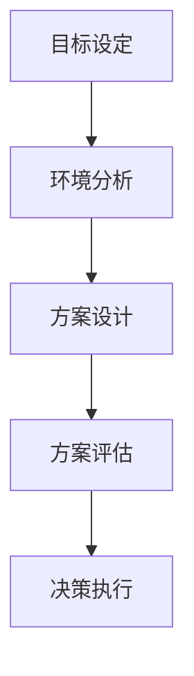

#### 1.1.1 规划的概念

- **规划的概念**

  规划是一个涉及多个环节的抽象概念，它包括目标设定、环境分析、方案设计、方案评估和决策执行等步骤。以下是每个环节的具体描述：

  - **目标设定**：规划的首要任务是明确目标。目标应具体、可衡量、可达成、相关且有时间限制，即遵循SMART原则。明确目标有助于确保规划过程的针对性，避免无谓的努力。

  - **环境分析**：在确定目标后，需要分析外部环境和内部条件。外部环境分析包括市场趋势、竞争状况、政策法规等；内部条件分析包括组织资源、管理结构、企业文化等。通过环境分析，可以了解可能的挑战和机遇。

  - **方案设计**：根据目标和环境分析，设计多种可行的方案。方案设计应考虑资源的配置、行动的顺序、时间安排等。设计多种方案有助于选择最佳方案，降低风险。

  - **方案评估**：使用各种工具和方法对设计的方案进行评估。评估标准可以包括成本、效益、可行性、风险等。通过评估，可以确定哪种方案最符合目标。

  - **决策执行**：选择最佳方案后，制定详细的执行计划，并执行。决策执行过程中需要持续监控和调整，确保规划目标的实现。

- **规划的抽象层次**

  规划的抽象层次取决于具体应用场景和需求。在高级层次上，规划可能涉及到宏观的战略规划，如国家发展规划、企业战略规划等。在较低层次上，规划可能涉及具体的任务规划，如项目管理、生产计划等。

**Mermaid 流�程图：规划的具体环节**


#### 1.1.2 规划的目标

- **规划的目标**

  规划的目标是确保规划过程有明确的方向和目标，从而提高决策的科学性和效率。具体来说，规划的目标包括以下几个方面：

  - **明确目标**：规划的首要任务是明确目标。目标应具体、可衡量、可达成、相关且有时间限制，即遵循SMART原则。明确目标有助于确保规划过程的针对性，避免无谓的努力。

  - **优化资源配置**：通过规划，可以优化资源配置，确保有限的资源得到最大程度的利用。规划过程中，需要考虑各种资源的优先级和分配策略，从而提高整体效益。

  - **降低风险**：规划可以帮助识别潜在的风险和不确定性，提前制定应对策略。通过评估和比较不同的方案，可以降低决策过程中可能出现的风险。

  - **提高决策效率**：规划提供了一个系统化的决策过程，有助于提高决策效率。通过环境分析、方案设计和评估，可以快速确定最佳方案，缩短决策周期。

- **SMART原则**

  SMART原则是一种常用的目标设定方法，它包括以下几个方面：

  - **具体（Specific）**：目标应明确、具体，避免模糊和抽象。
  - **可衡量（Measurable）**：目标应具有可衡量的标准，便于评估和调整。
  - **可达成（Achievable）**：目标应在实际条件下可达成，避免过于理想化。
  - **相关（Relevant）**：目标应与整体规划目标一致，避免分散精力。
  - **时限性（Time-bound）**：目标应有明确的时间限制，避免拖延和延误。

**Mermaid 流程图：SMART原则**

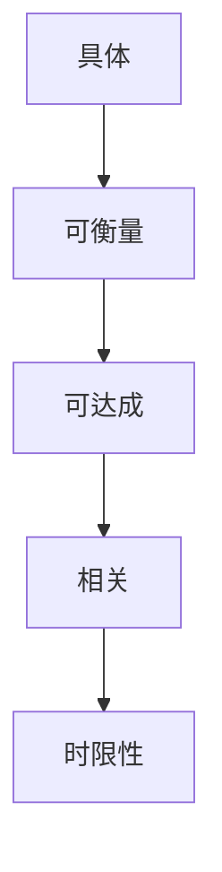

#### 1.2 规划的重要性

- **对个人和组织的影响**

  规划对个人和组织的影响至关重要。以下是对个人和组织的具体影响：

  - **个人层面**：

    - **明确职业发展方向**：通过规划，个人可以明确自己的职业目标和发展路径，从而更有针对性地提升自己的能力和技能。

    - **提高工作效率**：规划可以帮助个人合理安排时间，明确任务优先级，从而提高工作效率。

    - **实现个人价值**：通过规划，个人可以更好地实现自身价值，获得职业成就感和满足感。

  - **组织层面**：

    - **提高组织效能**：规划有助于组织明确目标，优化资源配置，提高运营效率。

    - **降低运营风险**：通过规划，组织可以提前识别潜在风险，制定应对策略，降低运营风险。

    - **实现组织目标**：规划是组织实现长期目标和战略规划的关键，有助于确保组织的可持续发展。

- **规划与决策的关系**

  规划是决策的前置步骤，决策是基于规划的目标和策略进行的。具体关系如下：

  - **规划提供决策框架**：规划为决策提供了明确的框架和基础，使决策过程更加科学和系统化。

  - **决策基于规划目标**：在制定决策时，需要先进行规划，明确目标和策略，再进行具体的决策执行。

  - **规划与决策的互动**：规划与决策是一个动态的过程，规划过程中可能需要对决策进行调整，决策执行过程中也可能需要对规划进行修正。

**Mermaid 流程图：规划与决策的关系**

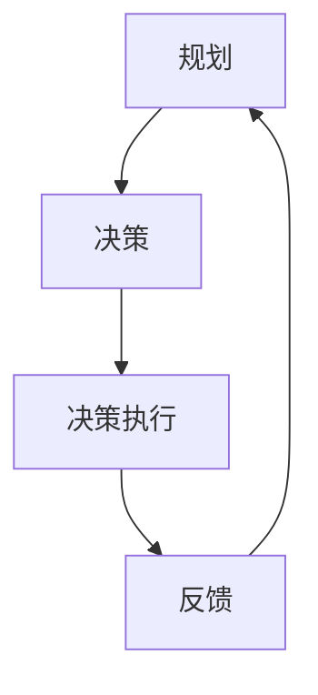

#### 1.3 规划的基本原则

- **可行性**

  可行性是规划的重要原则之一。一个有效的规划方案必须在现实条件下具备可行性。具体来说，可行性包括以下几个方面：

  - **技术可行性**：规划方案的技术实现是否可行，是否有足够的技术支持和资源。
  - **经济可行性**：规划方案的经济成本是否合理，投资回报是否能够实现。
  - **社会可行性**：规划方案是否符合社会道德和伦理要求，是否能够得到社会认可和支持。
  
- **灵活性**

  规划应具有一定的灵活性，以应对环境变化和不确定性。灵活性体现在以下几个方面：

  - **适应变化**：规划应能够适应环境变化，及时调整目标和方案。
  - **预留调整空间**：在规划过程中，应预留一定的调整空间，以便在执行过程中根据实际情况进行修正。
  - **风险管理**：通过灵活的规划，可以降低风险，提高应对不确定性的能力。

- **系统性**

  规划应具有系统性，即综合考虑各个方面的因素，确保方案的整体性和协调性。具体来说，系统性包括以下几个方面：

  - **整体规划**：规划应考虑组织的整体目标和战略，确保各个部分相互协调。
  - **资源整合**：规划应整合各种资源，包括人力、物力、财力等，实现资源的最佳配置。
  - **协调关系**：规划应明确各个部门、团队和个人之间的职责和关系，确保协同合作。

#### 1.3.1 可行性

- **可行性**

  可行性是规划过程中至关重要的一项原则，它确保规划方案能够在实际条件下得到实施。可行性分析主要包括以下几个方面：

  - **技术可行性**：评估规划方案的技术实现难度，是否具有现有技术支持。例如，一个智能家居系统的实现，需要考虑物联网技术、智能传感器、云计算等技术的支持。

  - **经济可行性**：分析规划方案的经济成本，包括初期投资、运营成本、维护成本等，评估其经济合理性。例如，企业投资一条新的生产线，需要考虑生产线的建设成本、原材料成本、人工成本等。

  - **社会可行性**：评估规划方案是否符合社会道德和伦理要求，是否能够得到社会认可和支持。例如，一个环境保护项目的实施，需要考虑其对当地居民的影响、政策法规的遵守等。

- **可行性评估方法**

  为了确保规划方案的可执行性，需要进行详细的可行性评估。以下是一些常用的评估方法：

  - **SWOT分析**：通过分析规划方案的优点（Strengths）、弱点（Weaknesses）、机会（Opportunities）和威胁（Threats），全面评估方案的可行性。
  - **成本效益分析**：比较规划方案的成本和预期效益，计算投资回报率（ROI），评估方案的经济可行性。
  - **模拟与仿真**：通过计算机模拟和仿真技术，模拟规划方案在实际环境中的运行情况，评估其可行性和效果。
  - **专家评审**：邀请行业专家对规划方案进行评审，提供专业意见和建议，确保方案的可行性和科学性。

**Mermaid 流程图：可行性评估方法**

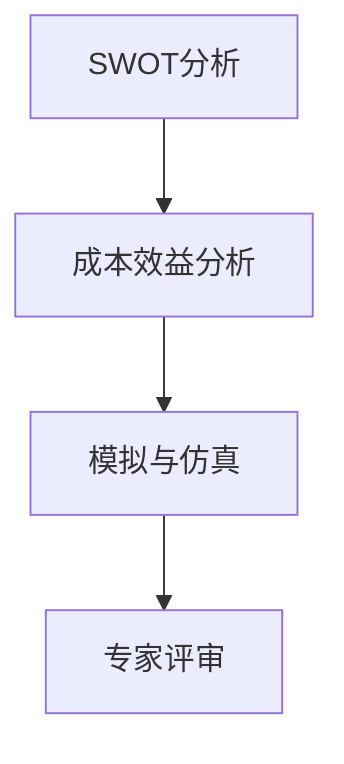

#### 1.3.2 灵活性

- **灵活性**

  灵活性是规划过程中不可或缺的原则，它确保规划方案能够适应环境变化和不确定性。灵活性包括以下几个方面：

  - **适应变化**：规划应具备适应环境变化的能力，能够及时调整目标和方案。例如，市场环境的变化可能导致企业战略的调整，规划需要能够迅速响应这种变化。
  - **预留调整空间**：在规划过程中，应预留一定的调整空间，以便在执行过程中根据实际情况进行修正。例如，项目计划中的缓冲时间可以用来应对可能出现的延期或资源不足问题。
  - **风险管理**：通过灵活的规划，可以降低风险，提高应对不确定性的能力。例如，通过多方案设计和备份计划，可以在方案执行过程中应对意外情况。

- **灵活性原则的应用**

  灵活性原则在规划中的应用主要体现在以下几个方面：

  - **多方案设计**：在规划过程中，设计多个可行的方案，以便在执行过程中根据实际情况选择最佳方案。
  - **弹性预算**：在制定预算时，预留一定的弹性空间，以便在执行过程中根据实际情况进行调整。
  - **动态调整**：在规划执行过程中，根据实际情况和反馈信息，动态调整目标和方案，确保规划目标的实现。

**Mermaid 流程图：灵活性原则的应用**

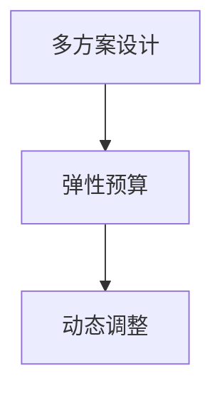

#### 1.3.3 系统性

- **系统性**

  系统性是规划过程中必须遵循的重要原则，它要求从整体角度出发，综合考虑各个方面的因素，确保规划方案的整体性和协调性。系统性包括以下几个方面：

  - **整体规划**：规划应考虑组织的整体目标和战略，确保各个部分相互协调，共同实现组织目标。
  - **资源整合**：规划应整合各种资源，包括人力、物力、财力等，实现资源的最佳配置，提高整体效能。
  - **协调关系**：规划应明确各个部门、团队和个人之间的职责和关系，确保协同合作，避免资源浪费和冲突。

- **系统性原则的应用**

  系统性原则在规划中的应用主要体现在以下几个方面：

  - **战略规划**：从组织整体战略出发，制定长期和短期的规划目标，确保组织发展的方向和速度。
  - **跨部门合作**：建立跨部门合作机制，明确各部门的职责和协调关系，确保资源的共享和利用。
  - **流程优化**：通过优化业务流程，消除冗余和瓶颈，提高组织运营效率。

**Mermaid 流程图：系统性原则的应用**

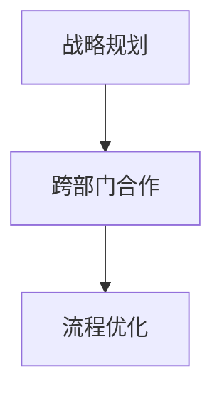

### 第二部分：规划的方法与过程

#### 第2章：规划的方法与过程

**2.1 规划的基本步骤**

- **明确目标**
  - **目标设定**：规划的首要任务是明确目标。目标应具体、可衡量、可达成、相关且有时间限制，即遵循SMART原则。
  - **目标分解**：将总目标分解为具体的子目标，便于后续的规划与执行。
- **环境分析**
  - **外部环境分析**：分析市场趋势、竞争状况、政策法规等外部因素。
  - **内部环境分析**：分析组织资源、企业文化、管理结构等内部因素。
- **可行方案设计**
  - **创造方案**：提出多种可行的方案，包括不同策略、路径和方法。
  - **评估方案**：使用SWOT分析、成本效益分析等工具对方案进行评估和比较。
- **方案评估与选择**
  - **评估标准**：确定评估标准，如成本、效益、可行性等。
  - **选择最佳方案**：综合考虑评估结果，选择最优方案。
- **实施计划与监控**
  - **制定详细计划**：细化方案，制定实施步骤和时间表。
  - **执行计划**：按照计划执行，确保各项任务按时完成。
  - **监控与反馈**：监控实施过程，收集反馈，调整计划。

**2.2 规划的主要方法**

- **经典规划方法**
  - **项目管理**：通过项目计划、时间管理、资源管理等，确保项目按时、按质完成。
  - **长期规划**：涉及组织战略、业务发展、投资规划等，确保组织长期稳定发展。
- **系统工程方法**
  - **系统工程**：运用系统论、控制论、信息论等理论，解决复杂问题。
  - **软件系统工程**：应用于软件开发过程，包括需求分析、系统设计、测试等。
- **决策支持系统**
  - **决策支持系统**：利用数据、模型和决策者经验，支持决策制定过程。

**2.3 规划工具与技术**

- **SWOT分析**
  - **SWOT分析**：用于评估方案的优势、劣势、机会和威胁。
- **利益相关者分析**
  - **利益相关者分析**：识别和分析与规划相关的各种利益相关者，确保方案的顺利实施。
- **敏捷规划方法**
  - **敏捷规划方法**：强调迭代和灵活性，适用于快速变化的环境。

#### 2.1 规划的基本步骤

- **明确目标**

  明确目标是规划过程中的第一步，也是至关重要的一步。设定清晰、具体、可衡量、可实现且有时间限制的目标（SMART原则）是确保规划有效性的关键。

  - **目标设定**：首先，需要明确组织或个人的总体目标。这些目标可以是长期的，如企业的年度收入目标，或是短期的，如项目完成时间。目标设定应遵循SMART原则，即具体（Specific）、可衡量（Measurable）、可达成（Achievable）、相关（Relevant）和时限性（Time-bound）。
  - **目标分解**：将总目标分解为具体的子目标，有助于更好地规划和执行。例如，一个企业的年度收入目标可以分解为季度收入目标，甚至是月度收入目标。

- **环境分析**

  环境分析是规划过程中不可或缺的一步，它有助于识别外部和内部环境中的各种因素，为制定可行方案提供依据。

  - **外部环境分析**：分析市场趋势、竞争状况、政策法规等外部因素。这些因素可能对规划目标的实现产生重大影响，如市场需求的变化、竞争对手的策略调整等。
  - **内部环境分析**：分析组织资源、企业文化、管理结构等内部因素。这些因素同样会影响规划的实施，如人力资源的充足性、企业文化的适应性等。

**Mermaid 流程图：规划的基本步骤**

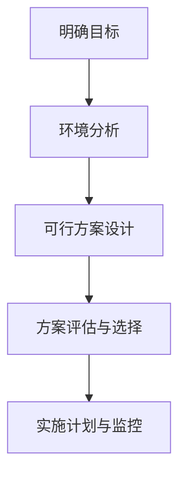

#### 2.1.1 明确目标

- **目标设定**

  明确目标是规划过程中的第一步，也是至关重要的一步。设定清晰、具体、可衡量、可实现且有时间限制的目标（SMART原则）是确保规划有效性的关键。

  - **具体（Specific）**：目标应明确具体，避免模糊和抽象。例如，而不是“提高销售额”，应设定为“提高销售额至100万元”。
  - **可衡量（Measurable）**：目标应具有可衡量的标准，以便评估和调整。例如，销售额可以通过收入数据来衡量。
  - **可达成（Achievable）**：目标应在实际条件下可达成，避免过于理想化。例如，设定目标时需要考虑现有资源和能力。
  - **相关（Relevant）**：目标应与整体规划目标一致，避免分散精力。确保目标与组织的战略和愿景相吻合。
  - **时限性（Time-bound）**：目标应有明确的时间限制，避免拖延和延误。例如，设定目标为“下一季度实现”。

**Mermaid 流程图：SMART原则**


#### 2.1.2 环境分析

- **环境分析**

  环境分析是规划过程中不可或缺的一步，它有助于识别外部和内部环境中的各种因素，为制定可行方案提供依据。

  - **外部环境分析**：外部环境分析涉及对市场趋势、竞争状况、政策法规等的分析。这些因素可能对规划目标的实现产生重大影响。

    - **市场趋势**：分析市场需求的增长、消费者行为的变化等，有助于确定规划的方向和策略。
    - **竞争状况**：评估竞争对手的策略、市场占有率、产品定位等，有助于制定有竞争力的规划方案。
    - **政策法规**：了解相关政策法规的变化，确保规划符合法律法规的要求。

  - **内部环境分析**：内部环境分析涉及对组织资源、企业文化、管理结构等的分析。这些因素同样会影响规划的实施。

    - **组织资源**：评估组织的人力资源、财务资源、技术资源等，确保资源的合理配置。
    - **企业文化**：分析企业文化对规划的影响，确保规划与企业文化相协调。
    - **管理结构**：评估管理结构是否合理，是否能够支持规划的实施。

**Mermaid 流程图：环境分析**

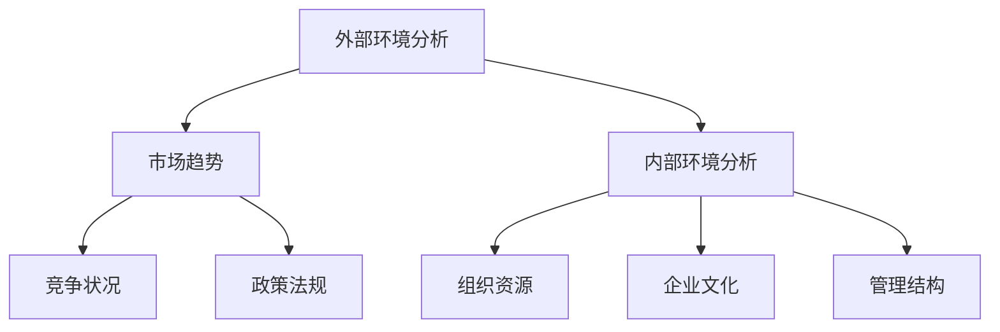

#### 2.1.3 可行方案设计

- **可行方案设计**

  在明确目标和进行环境分析之后，下一步是设计可行的方案。这一步骤涉及提出多种可行的解决方案，并对这些方案进行初步评估。

  - **创造方案**：首先，需要根据目标和环境分析的结果，提出多种可行的方案。这些方案可以是不同的策略、路径或方法。例如，如果目标是提高销售额，方案可能包括增加广告投入、开发新产品、优化客户服务等。

  - **评估方案**：在提出多种方案后，需要对每个方案进行初步评估。评估标准可以包括成本、效益、可行性、风险等因素。通过评估，可以筛选出具有较高可行性的方案。

**Mermaid 流程图：可行方案设计**

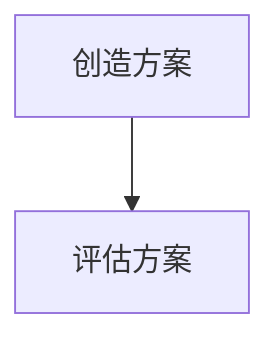

#### 2.1.4 方案评估与选择

- **方案评估与选择**

  在设计出多个可行方案后，需要对这些方案进行详细的评估和比较，以选择最佳方案。这一步骤包括确定评估标准、进行评估和选择最佳方案。

  - **评估标准**：首先，需要明确评估方案的标准。这些标准可以是成本、效益、可行性、风险等。例如，如果目标是降低生产成本，评估标准可能包括原材料成本、人工成本、设备投资等。

  - **评估方法**：使用各种评估方法，如SWOT分析、成本效益分析、多属性决策方法等，对每个方案进行详细评估。SWOT分析可以帮助识别方案的优势、劣势、机会和威胁；成本效益分析可以帮助评估方案的成本和预期效益。

  - **选择最佳方案**：综合考虑评估结果，选择最佳方案。最佳方案应是最符合目标、最具有可行性和经济效益的。

**Mermaid 流程图：方案评估与选择**

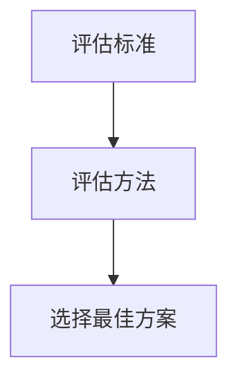

#### 2.1.5 实施计划与监控

- **实施计划与监控**

  在选择最佳方案后，需要制定详细的实施计划，并确保计划得到有效执行。同时，对实施过程进行监控，确保各项任务按时完成。

  - **制定详细计划**：制定实施计划，包括具体的任务、责任分配、时间表和预算。确保计划详细、可执行，为后续的执行提供明确指导。

  - **执行计划**：按照计划执行，确保各项任务按时完成。在执行过程中，需要确保资源得到有效利用，团队成员明确任务和责任。

  - **监控与反馈**：对实施过程进行监控，收集反馈信息，及时发现问题和调整计划。监控可以通过定期报告、进度跟踪、质量检查等方式进行。

**Mermaid 流程图：实施计划与监控**

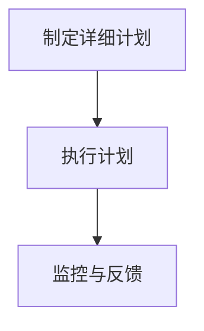

#### 2.2 规划的主要方法

- **经典规划方法**

  经典规划方法主要包括项目管理、长期规划等。这些方法通常应用于各种复杂任务和项目的规划与执行。

  - **项目管理**：项目管理是一种系统的、组织的方法，用于规划、执行和控制项目活动，以确保项目按时、按预算、按质量完成。项目管理包括项目计划、时间管理、资源管理、风险管理等多个方面。

  - **长期规划**：长期规划通常涉及组织战略、业务发展、投资规划等内容。通过长期规划，组织可以明确未来发展的方向和目标，制定相应的策略和计划。

- **系统工程方法**

  系统工程方法是一种综合性的方法，用于解决复杂问题。它包括系统论、控制论、信息论等多个领域的理论和方法。

  - **系统工程**：系统工程是一种运用系统论、控制论、信息论等理论，解决复杂问题的方法。它强调系统整体性、层次性和动态性，通过系统分析和设计，实现系统的优化和有效管理。

  - **软件系统工程**：软件系统工程是系统工程方法在软件开发中的应用。它包括需求分析、系统设计、测试等多个环节，通过系统化、规范化的方法，确保软件产品的质量。

- **决策支持系统**

  决策支持系统（DSS）是一种利用数据、模型和决策者经验，支持决策制定过程的系统。它为决策者提供信息、分析和建议，帮助做出更明智的决策。

  - **DSS的基本概念**：DSS包括数据获取、数据处理、模型构建、决策分析等多个环节。通过这些环节，DSS可以帮助决策者收集、处理和分析信息，提供决策支持和决策建议。

**Mermaid 流程图：规划的主要方法**

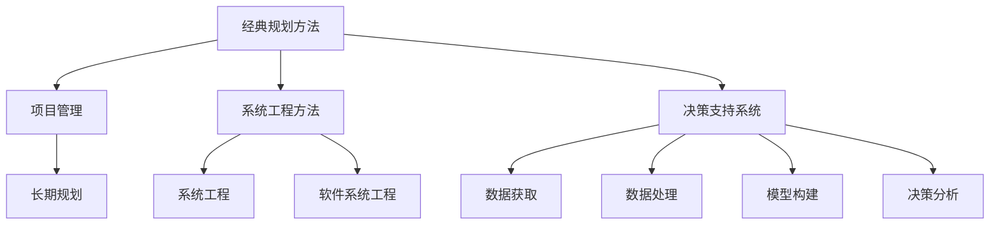

#### 2.2.1 规划的基本步骤

- **规划的基本步骤**

  规划是一个系统性过程，通常包括以下基本步骤：

  - **目标设定**：明确组织或个人希望实现的目标。目标应具体、可衡量、可达成、相关且有时间限制，即遵循SMART原则。
  - **环境分析**：分析外部环境和内部条件，了解可能的挑战和机遇。外部环境分析包括市场趋势、竞争状况、政策法规等；内部环境分析包括组织资源、企业文化、管理结构等。
  - **方案设计**：根据目标和环境分析，设计多种可行的方案。方案设计应考虑资源的配置、行动的顺序、时间安排等。
  - **方案评估**：使用各种工具和方法对方案进行评估和比较。评估标准可以包括成本、效益、可行性、风险等。
  - **决策执行**：选择最佳方案并执行。制定详细的执行计划，确保各项任务按时完成。

**Mermaid 流程图：规划的基本步骤**


#### 2.2.2 规划的主要方法

- **经典规划方法**

  经典规划方法主要基于传统的管理理论和实践，适用于各种规模和类型的组织。以下是几种常见的经典规划方法：

  - **项目管理**：项目管理是一种系统的、组织的方法，用于规划、执行和控制项目活动，以确保项目按时、按预算、按质量完成。项目管理包括项目计划、时间管理、资源管理、风险管理等多个方面。

    - **项目计划**：项目计划是项目管理的基础，包括项目目标、任务、时间表、资源分配等。
    - **时间管理**：时间管理是确保项目按时完成的关键，包括任务优先级排序、时间分配和进度跟踪。
    - **资源管理**：资源管理是确保项目资源得到充分利用，包括人力、资金、物资等。
    - **风险管理**：风险管理是识别、评估和应对项目风险，以降低项目失败的可能性。

  - **长期规划**：长期规划通常涉及组织战略、业务发展、投资规划等内容。通过长期规划，组织可以明确未来发展的方向和目标，制定相应的策略和计划。

    - **战略规划**：战略规划是组织长期发展的总体规划，包括确定组织愿景、使命、价值观和战略目标。
    - **业务规划**：业务规划是针对具体业务领域的规划，包括市场分析、产品规划、营销策略等。
    - **投资规划**：投资规划是组织财务规划的一部分，涉及资金筹集、投资决策、投资回报等。

- **系统工程方法**

  系统工程方法是一种基于系统论、控制论、信息论等理论的综合方法，适用于解决复杂问题。以下是系统工程方法在规划中的应用：

  - **系统分析**：系统分析是识别和理解系统目标和需求的过程，包括需求分析、功能分析等。
  - **系统设计**：系统设计是制定系统解决方案的过程，包括架构设计、模块设计等。
  - **系统实现**：系统实现是构建系统模型或原型，并进行测试和验证的过程。
  - **系统优化**：系统优化是通过对系统性能、成本、可靠性等方面进行分析和改进，提高系统的整体性能。

- **决策支持系统**

  决策支持系统（DSS）是一种利用数据、模型和决策者经验，支持决策制定过程的系统。DSS可以帮助决策者收集、处理和分析信息，提供决策支持和决策建议。以下是DSS的主要组件：

  - **数据获取**：数据获取是收集与决策相关的数据和信息，包括内部数据、外部数据等。
  - **数据处理**：数据处理是对获取的数据进行清洗、整理和分析，以支持决策制定。
  - **模型构建**：模型构建是建立用于模拟和分析的数学模型或仿真模型。
  - **决策分析**：决策分析是利用模型和数据分析方法，评估不同决策方案的优缺点，提供决策建议。

**Mermaid 流程图：规划的主要方法**

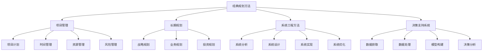

#### 2.2.3 规划工具与技术

- **SWOT分析**

  SWOT分析是一种常用的战略规划工具，用于评估组织或项目的优势、劣势、机会和威胁。SWOT分析可以帮助规划者全面了解自身和外部环境，从而制定更有效的战略。

  - **优势（Strengths）**：分析组织或项目在资源、能力、市场地位等方面的优势。
  - **劣势（Weaknesses）**：分析组织或项目在资源、能力、市场地位等方面的劣势。
  - **机会（Opportunities）**：分析外部环境中可能带来的机会。
  - **威胁（Threats）**：分析外部环境中可能带来的威胁。

- **利益相关者分析**

  利益相关者分析是识别和评估与组织或项目相关的各种利益相关者，并分析他们对项目的影响。利益相关者分析可以帮助规划者了解不同利益相关者的需求和期望，从而制定更有效的沟通和合作策略。

  - **利益相关者识别**：识别与组织或项目相关的所有利益相关者。
  - **利益相关者分析**：分析每个利益相关者的重要性和影响力。

- **敏捷规划方法**

  敏捷规划方法强调迭代和灵活性，适用于快速变化的环境。敏捷规划方法包括以下核心原则：

  - **迭代开发**：将项目分为多个迭代周期，每个迭代周期完成后，对项目进行评估和调整。
  - **用户反馈**：及时收集用户反馈，并根据反馈调整项目计划。
  - **适应变化**：规划应具有灵活性，以适应环境变化和需求变化。

**Mermaid 流程图：规划工具与技术**

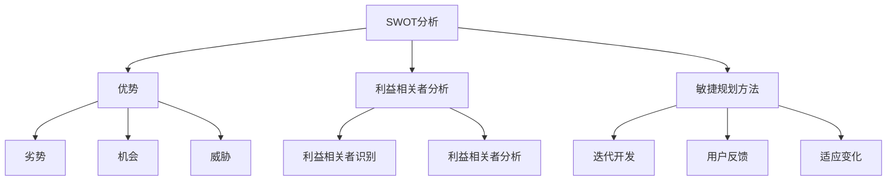

### 第三部分：规划的实际应用

#### 第3章：规划在组织管理中的应用

**3.1 组织规划的基本概念**

- **组织目标与战略**

  组织目标是组织存在的根本，是组织所有决策和行动的指南。组织战略则是实现组织目标的总体计划，包括组织愿景、使命、核心价值观和具体目标。

  - **组织目标**：组织目标是指组织希望实现的具体目标和期望成果。这些目标应与组织愿景和使命相一致，并具有可衡量性和可实现性。
  - **组织战略**：组织战略是指为实现组织目标而制定的长期和短期的行动计划。战略应明确组织的方向和优先事项，并考虑到内外部环境的挑战和机遇。

- **组织结构与职能**

  组织结构是指组织内部各部门、团队和个人的组织形式和职责分配。组织职能则是指各个部门或团队的具体职责和工作内容。

  - **组织结构**：组织结构可以分为职能型结构、矩阵型结构、网络型结构等，每种结构都有其优缺点和适用场景。
  - **组织职能**：组织职能包括生产、销售、人力资源、财务等，每个职能都有其特定的职责和工作流程。

- **组织文化与团队建设**

  组织文化是指组织内部共同的价值观、信念和行为准则。团队建设则是指通过建立良好的团队关系和协作机制，提高团队效能和团队凝聚力。

  - **组织文化**：组织文化对组织的决策和行为有深远影响，有助于形成组织的核心竞争力。
  - **团队建设**：团队建设活动如团队培训、团队建设游戏、团队讨论等，可以增强团队成员之间的沟通和理解，提高团队协作效率。

**3.2 组织规划的方法与实践**

- **企业变革规划**

  企业变革规划是指为了适应外部环境变化或内部需求变化，对组织进行系统性调整和优化的过程。企业变革规划包括以下步骤：

  - **变革需求分析**：分析外部环境变化和内部需求变化，确定变革的必要性和紧迫性。
  - **变革目标设定**：明确变革的目标，包括改进组织结构、优化业务流程、提升员工技能等。
  - **变革方案设计**：设计多种可行的变革方案，评估每种方案的优缺点。
  - **变革实施计划**：制定详细的变革实施计划，明确变革的步骤、时间表和责任人。

- **项目规划与管理**

  项目规划与管理是指为了实现特定目标而进行的一系列系统性和组织性的工作。项目规划与管理包括以下步骤：

  - **项目目标设定**：明确项目的目标和预期成果。
  - **项目范围定义**：明确项目的范围和边界，避免项目范围的蔓延。
  - **项目计划制定**：制定项目的时间表、预算、资源分配和风险评估。
  - **项目执行与监控**：按照项目计划执行项目任务，并对项目进度、成本、质量进行监控和调整。

- **组织发展策略**

  组织发展策略是指为了提升组织的整体绩效和能力，制定的一系列长期规划和行动。组织发展策略包括以下方面：

  - **战略规划**：制定组织的长期发展战略，明确组织的愿景、使命和目标。
  - **组织优化**：优化组织结构、流程和资源配置，提高组织效率。
  - **人才发展**：培养和引进优秀人才，提升组织的人才竞争力。
  - **文化建设**：塑造组织的共同价值观和行为准则，提高组织的凝聚力。

**3.3 案例分析**

- **成功案例**

  在实际应用中，许多组织通过有效的规划取得了显著的成功。以下是一个成功案例：

  - **案例背景**：某大型企业面临激烈的市场竞争，需要通过变革来提升竞争力。
  - **变革规划**：企业进行了全面的变革需求分析，确定了变革的目标和方案，包括优化组织结构、提升员工技能、改进业务流程等。
  - **变革实施**：企业制定了详细的变革实施计划，并分阶段推进变革。
  - **变革成果**：变革后，企业的组织结构更加扁平化，员工技能得到显著提升，业务流程得到优化，整体竞争力得到提升。

- **失败案例**

  同时，也有一些组织在规划过程中遇到了失败。以下是一个失败案例：

  - **案例背景**：某中小企业希望扩大市场份额，制定了详细的扩张计划。
  - **问题分析**：企业在扩张过程中，未能充分考虑市场变化和资源限制，导致项目进度延误、成本超支。
  - **失败原因**：企业缺乏有效的市场分析和风险评估，规划过程中过于理想化，未能及时调整计划。

  通过这些案例，我们可以看到，有效的规划需要充分考虑内外部环境的变化，制定切实可行的方案，并具备灵活调整的能力。

### 第三部分：规划的实际应用

#### 第3章：规划在组织管理中的应用

**3.1 组织规划的基本概念**

组织规划是指为了实现组织的目标和战略，对组织的结构、流程和文化等方面进行系统性设计和调整的过程。它是组织管理的重要组成部分，直接影响组织的运营效率、竞争力和可持续发展。

- **组织目标与战略**

  组织目标是组织存在的根本，是组织所有决策和行动的指南。组织战略则是实现组织目标的总体计划，包括组织愿景、使命、核心价值观和具体目标。

  - **组织目标**：组织目标是指组织希望实现的具体目标和期望成果。这些目标应与组织愿景和使命相一致，并具有可衡量性和可实现性。例如，企业的目标可能是市场份额达到20%，客户满意度达到90%等。
  - **组织战略**：组织战略是指为实现组织目标而制定的长期和短期的行动计划。战略应明确组织的方向和优先事项，并考虑到内外部环境的挑战和机遇。战略规划包括市场进入策略、产品开发策略、人力资源策略等。

- **组织结构与职能**

  组织结构是指组织内部各部门、团队和个人的组织形式和职责分配。组织职能则是指各个部门或团队的具体职责和工作内容。

  - **组织结构**：组织结构可以分为职能型结构、矩阵型结构、网络型结构等，每种结构都有其优缺点和适用场景。职能型结构强调按照职能划分部门，矩阵型结构将职能和项目结合，网络型结构则强调灵活性和跨部门合作。
  - **组织职能**：组织职能包括生产、销售、人力资源、财务、研发等，每个职能都有其特定的职责和工作流程。例如，销售部门的职能是开发新客户、维护老客户，研发部门的职能是进行新产品开发等。

- **组织文化与团队建设**

  组织文化是指组织内部共同的价值观、信念和行为准则。团队建设则是指通过建立良好的团队关系和协作机制，提高团队效能和团队凝聚力。

  - **组织文化**：组织文化对组织的决策和行为有深远影响，有助于形成组织的核心竞争力。组织文化包括价值观、使命、愿景、行为准则等。例如，谷歌的“不作恶”价值观是其组织文化的核心。
  - **团队建设**：团队建设活动如团队培训、团队建设游戏、团队讨论等，可以增强团队成员之间的沟通和理解，提高团队协作效率。团队建设有助于形成积极的团队氛围，提升团队的凝聚力和战斗力。

#### 3.1.1 组织目标与战略

- **组织目标与战略**

  组织目标和战略是组织规划的核心，它们为组织的运作和决策提供了明确的方向。以下是组织目标和战略的详细探讨：

  - **组织目标**

    - **定义**：组织目标是指组织在特定时间内希望实现的具体成果和期望状态。这些目标应明确、具体、可衡量、可实现，并具有时间限制。
    - **类型**：组织目标可以分为短期目标和长期目标。短期目标通常是年度目标，如提高市场份额、提升销售额、降低成本等；长期目标则可能是5年或10年的目标，如成为行业领导者、实现全球化布局等。
    - **设定方法**：设定组织目标通常遵循SMART原则，即目标应具有以下特征：

      - **具体（Specific）**：目标应明确、具体，避免模糊和抽象。
      - **可衡量（Measurable）**：目标应具有可衡量的标准，以便评估和调整。
      - **可达成（Achievable）**：目标应在实际条件下可达成，避免过于理想化。
      - **相关（Relevant）**：目标应与组织的整体目标和战略一致。
      - **时限性（Time-bound）**：目标应有明确的时间限制，避免拖延和延误。

  - **组织战略**

    - **定义**：组织战略是指为实现组织目标而制定的长期和短期的行动计划。战略包括确定组织愿景、使命、核心价值观和具体目标，以及为实现这些目标所需的资源分配、行动方案和执行策略。
    - **类型**：组织战略可以分为竞争战略、业务战略和职能战略。竞争战略关注如何在市场中获得竞争优势，业务战略关注如何实现组织的整体增长，职能战略关注如何优化组织的各个职能领域。
    - **设定方法**：制定组织战略通常包括以下步骤：

      - **评估外部环境**：分析市场趋势、竞争状况、政策法规等外部因素，了解组织面临的机会和挑战。
      - **评估内部条件**：分析组织资源、企业文化、管理结构等内部因素，了解组织的优势和劣势。
      - **确定组织愿景和使命**：明确组织的长期愿景和使命，为战略制定提供指导。
      - **制定战略目标和行动计划**：根据外部环境和内部条件，设定具体的战略目标和行动计划。
      - **资源分配和执行**：根据战略目标和行动计划，合理分配资源，确保战略得到有效执行。

**Mermaid 流程图：组织目标和战略的设定过程**

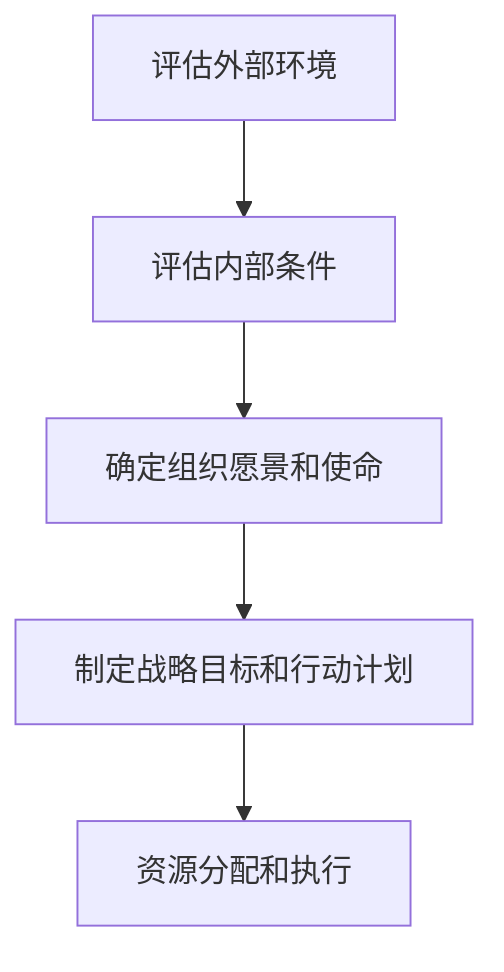

#### 3.1.2 组织结构与职能

- **组织结构与职能**

  组织结构和职能是组织规划的重要组成部分，它们决定了组织如何分工合作、如何分配资源以及如何实现目标。以下是组织结构和职能的详细探讨：

  - **组织结构**

    - **定义**：组织结构是指组织内部各部门、团队和个人的组织形式和职责分配。组织结构决定了组织如何将任务分配给不同的人员和团队，以及如何确保任务得到有效完成。
    - **类型**：组织结构可以分为以下几种类型：

      - **职能型结构**：按照职能划分部门，如销售部门、生产部门、财务部门等。职能型结构强调专业化和分工，有助于提高工作效率。

      - **矩阵型结构**：将职能和项目结合，形成双重汇报关系。矩阵型结构适用于复杂项目，能够提高跨部门合作和资源利用效率。

      - **网络型结构**：强调灵活性和跨部门合作，成员可以根据项目需要灵活分配和调整。网络型结构适用于快速变化的市场环境。

    - **设计原则**：设计组织结构时，应遵循以下原则：

      - **目标一致性**：组织结构应与组织目标一致，确保各部门和团队的工作能够有效支持组织目标的实现。

      - **适应性**：组织结构应具有适应性，能够应对外部环境的变化和内部需求的变化。

      - **灵活性**：组织结构应具有一定的灵活性，以便在需要时进行快速调整和优化。

  - **组织职能**

    - **定义**：组织职能是指各个部门或团队的具体职责和工作内容。组织职能决定了组织如何将任务分解和分配给不同的部门或团队，以及如何确保各项任务得到有效完成。
    - **类型**：组织职能可以分为以下几种类型：

      - **生产职能**：负责产品或服务的生产和制造，包括生产计划、质量控制、供应链管理等。

      - **销售职能**：负责产品或服务的销售和推广，包括市场调研、客户管理、销售策略等。

      - **人力资源职能**：负责组织内部人员招聘、培训、绩效管理、员工关系等。

      - **财务职能**：负责组织财务规划、预算管理、成本控制、财务报告等。

      - **研发职能**：负责产品或服务的研发和创新，包括研发计划、技术创新、产品测试等。

    - **设计原则**：设计组织职能时，应遵循以下原则：

      - **明确性**：职能职责应明确，确保每个部门和团队都有明确的任务和目标。

      - **协同性**：组织职能之间应协同合作，确保各项工作能够高效衔接和配合。

      - **灵活性**：组织职能应具有一定的灵活性，能够根据外部环境和内部需求的变化进行调整。

**Mermaid 流程图：组织结构与职能**

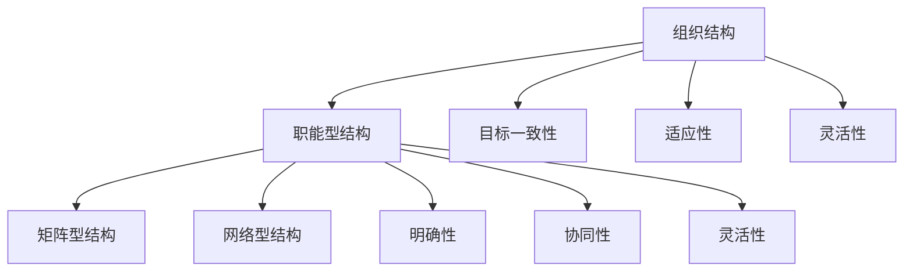

#### 3.1.3 组织文化与团队建设

- **组织文化与团队建设**

  组织文化和团队建设是组织规划中不可或缺的部分，它们对组织的长期成功和员工的工作体验有着深远的影响。以下是组织文化和团队建设的详细探讨：

  - **组织文化**

    - **定义**：组织文化是指组织内部共同的价值观、信念和行为准则。组织文化通常是由组织的创始人、高层管理者以及长期的发展过程中逐渐形成的。
    - **要素**：组织文化主要包括以下要素：

      - **价值观**：价值观是组织文化的核心，是组织成员共同认同和遵循的基本原则和行为规范。例如，谷歌的“不作恶”价值观是其组织文化的核心。
      - **使命和愿景**：使命和愿景是组织的长期目标和未来方向，它们为组织成员提供了共同的目标和方向感。
      - **行为准则**：行为准则是组织成员在工作和日常生活中应遵循的行为规范，如诚信、尊重、合作等。

    - **作用**：组织文化对组织有着重要的作用，包括：

      - **凝聚力和归属感**：组织文化有助于增强组织成员之间的凝聚力和归属感，使组织成为一个紧密团结的团队。
      - **工作效率和效能**：良好的组织文化能够提高员工的工作效率和工作质量，促进组织目标的实现。
      - **创新能力**：组织文化可以激发员工的创新思维和创造力，促进组织的创新和发展。

  - **团队建设**

    - **定义**：团队建设是指通过一系列活动和管理实践，增强团队成员之间的合作和沟通，提高团队效能和团队凝聚力。
    - **活动**：团队建设活动主要包括以下几种：

      - **培训和发展**：通过培训和发展项目，提高团队成员的技能和知识，增强团队的专业能力。
      - **团队建设游戏和活动**：通过团队建设游戏和活动，增强团队成员之间的互动和沟通，提高团队的凝聚力。
      - **团队讨论和分享**：通过团队讨论和分享，促进团队成员之间的交流和思想碰撞，激发团队的创新和创造力。

    - **方法**：团队建设的方法主要包括以下几种：

      - **共识建设**：通过建立共同的价值观和行为准则，促进团队成员之间的共识和信任。
      - **目标设定**：通过共同设定团队目标和计划，提高团队成员的参与度和责任感。
      - **激励机制**：通过设置激励机制，鼓励团队成员积极参与团队建设和工作。

**Mermaid 流程图：组织文化和团队建设**

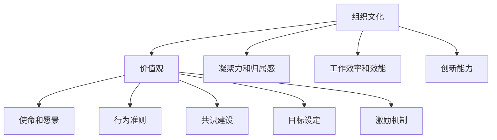

#### 3.2 组织规划的方法与实践

- **组织规划的方法与实践**

  组织规划是组织管理的重要组成部分，它涉及组织结构、流程、文化和策略等多方面的调整。以下将详细探讨组织规划的方法与实践。

  - **企业变革规划**

    - **定义**：企业变革规划是指为了应对外部环境变化或内部需求变化，对组织进行系统性调整和优化的过程。企业变革规划通常涉及组织结构、流程、文化、策略等方面的变革。
    - **目标**：企业变革规划的目标通常包括提升组织效率、增强市场竞争力、提高员工满意度和增强创新能力等。
    - **过程**：企业变革规划通常包括以下步骤：

      - **评估外部环境和内部条件**：分析市场趋势、竞争状况、政策法规等外部因素，以及组织资源、企业文化、管理结构等内部因素。
      - **确定变革目标**：明确变革的目标和方向，包括改进组织结构、优化业务流程、提升员工技能等。
      - **设计变革方案**：设计多种可行的变革方案，评估每种方案的优缺点。
      - **制定实施计划**：制定详细的变革实施计划，明确变革的步骤、时间表和责任人。
      - **实施变革**：按照实施计划，分阶段推进变革。
      - **监控和评估**：对变革过程进行监控和评估，及时调整和优化变革方案。

  - **项目规划与管理**

    - **定义**：项目规划与管理是指为了实现特定目标而进行的一系列系统性和组织性的工作。项目规划与管理通常涉及项目目标设定、范围定义、计划制定、资源分配、风险管理等。
    - **目标**：项目规划与管理的目标通常包括按时、按预算、按质量完成项目，确保项目目标的实现。
    - **过程**：项目规划与管理通常包括以下步骤：

      - **项目目标设定**：明确项目的目标和预期成果。
      - **项目范围定义**：明确项目的范围和边界，避免项目范围的蔓延。
      - **项目计划制定**：制定项目的时间表、预算、资源分配和风险评估。
      - **项目执行与监控**：按照项目计划执行项目任务，并对项目进度、成本、质量进行监控和调整。
      - **项目收尾**：完成项目任务，进行项目总结和评估，为后续项目提供经验教训。

  - **组织发展策略**

    - **定义**：组织发展策略是指为了提升组织的整体绩效和能力，制定的一系列长期规划和行动。组织发展策略通常涉及组织战略、组织结构、流程优化、人才发展、文化建设等方面。
    - **目标**：组织发展策略的目标通常包括提升组织竞争力、实现可持续发展、提升员工满意度和实现战略目标等。
    - **过程**：组织发展策略通常包括以下步骤：

      - **战略规划**：制定组织的长期发展战略，明确组织的愿景、使命和目标。
      - **组织优化**：优化组织结构、流程和资源配置，提高组织效率。
      - **人才发展**：培养和引进优秀人才，提升组织的人才竞争力。
      - **文化建设**：塑造组织的共同价值观和行为准则，提高组织的凝聚力。

**Mermaid 流程图：组织规划的方法与实践**

```mermaid
graph TD
A[企业变革规划] --> B[评估外部环境和内部条件]
B --> C[确定变革目标]
B --> D[设计变革方案]
B --> E[制定实施计划]
B --> F[实施变革]
B --> G[监控和评估]

A --> H[项目规划与管理]
H --> I[项目目标设定]
H --> J[项目范围定义]
H --> K[项目计划制定]
H --> L[项目执行与监控]
H --> M[项目收尾]

A --> N[组织发展策略]
N --> O[战略规划]
N --> P[组织优化]
N --> Q[人才发展]
N --> R[文化建设]
```

### 第三部分：规划的实际应用

#### 第3章：规划在组织管理中的应用

**3.2 组织规划的方法与实践**

组织规划是组织管理的核心环节，它涉及到组织的长远发展、资源分配和日常运作。以下是组织规划的方法与实践，我们将深入探讨如何有效地进行组织规划。

**3.2.1 企业变革规划**

企业变革规划是指为了应对外部环境和内部需求的变化，对企业的结构、流程、文化等进行系统性调整和优化的过程。以下是企业变革规划的方法和步骤：

1. **评估外部环境和内部条件**：

   - **市场趋势**：分析市场变化、消费者需求、竞争对手策略等。
   - **内部条件**：分析企业资源、企业文化、管理结构等。

2. **确定变革目标**：

   - **短期目标**：提高运营效率、降低成本、提升客户满意度等。
   - **长期目标**：实现业务增长、提升市场竞争力、增强企业创新能力等。

3. **设计变革方案**：

   - **方案选择**：根据评估结果，设计多种可行的变革方案。
   - **方案评估**：使用SWOT分析、成本效益分析等工具，评估每种方案的优缺点。

4. **制定实施计划**：

   - **时间表**：明确变革的阶段性目标和时间表。
   - **责任分配**：确定各部门和个人的职责和任务。
   - **资源分配**：确保变革所需的资源和资金。

5. **实施变革**：

   - **培训与沟通**：对员工进行培训，确保变革顺利进行。
   - **监控与反馈**：持续监控变革进程，及时调整和优化变革方案。

**3.2.2 项目规划与管理**

项目规划与管理是确保项目按时、按预算、按质量完成的系统过程。以下是项目规划与管理的方法和步骤：

1. **项目目标设定**：

   - **明确目标**：设定具体、可衡量、可实现的项目目标。
   - **目标分解**：将总目标分解为具体的子目标和任务。

2. **项目范围定义**：

   - **范围界定**：明确项目的范围和边界，避免项目范围的蔓延。
   - **项目文档**：编写项目范围说明书，确保项目团队能够理解项目范围。

3. **项目计划制定**：

   - **时间表**：制定项目的时间表，包括项目的关键里程碑和时间节点。
   - **资源分配**：分配项目所需的人力、资金、物资等资源。
   - **风险评估**：识别项目风险，制定应对措施。

4. **项目执行与监控**：

   - **任务执行**：按照项目计划执行任务，确保项目进度和质量。
   - **进度跟踪**：监控项目进度，及时调整计划，确保项目按时完成。
   - **质量检查**：对项目成果进行质量检查，确保项目符合预期标准。

5. **项目收尾**：

   - **项目总结**：总结项目经验教训，为后续项目提供参考。
   - **项目评估**：评估项目成果，评估项目目标的实现情况。

**3.2.3 组织发展策略**

组织发展策略是确保组织长期发展和持续成长的重要手段。以下是组织发展策略的方法和步骤：

1. **战略规划**：

   - **愿景和使命**：明确组织的长期愿景和使命。
   - **战略目标**：设定具体、可衡量、可实现的战略目标。
   - **战略路径**：制定实现战略目标的路径和行动计划。

2. **组织优化**：

   - **结构优化**：优化组织结构，确保组织结构适应战略目标。
   - **流程优化**：优化业务流程，提高运营效率和效能。
   - **资源配置**：确保资源得到合理配置和高效利用。

3. **人才发展**：

   - **人才培养**：制定人才培养计划，提升员工技能和知识。
   - **人才引进**：引进优秀人才，提升组织的人才竞争力。
   - **人才激励**：制定激励机制，激励员工积极参与组织发展。

4. **文化建设**：

   - **价值观建设**：塑造组织的共同价值观和行为准则。
   - **团队建设**：通过团队建设活动，增强团队凝聚力和协作能力。
   - **文化传承**：将组织的文化理念传承给新员工，确保组织文化的持续发展。

**Mermaid 流程图：组织规划的方法与实践**

```mermaid
graph TD
A[企业变革规划] --> B[评估外部环境和内部条件]
B --> C[确定变革目标]
B --> D[设计变革方案]
B --> E[制定实施计划]
B --> F[实施变革]
B --> G[监控和评估]

A --> H[项目规划与管理]
H --> I[项目目标设定]
H --> J[项目范围定义]
H --> K[项目计划制定]
H --> L[项目执行与监控]
H --> M[项目收尾]

A --> N[组织发展策略]
N --> O[战略规划]
N --> P[组织优化]
N --> Q[人才发展]
N --> R[文化建设]
```

#### 3.3 案例分析

**3.3.1 成功案例**

**案例背景**：某大型跨国企业，面临着全球市场的激烈竞争和内部管理效率低下的问题。为了提升竞争力，该企业决定进行系统性变革。

**变革规划**：

1. **评估外部环境和内部条件**：

   - **市场趋势**：分析全球市场的变化，包括消费者需求、技术进步、竞争对手策略等。
   - **内部条件**：分析企业资源、企业文化、管理结构等。

2. **确定变革目标**：

   - **短期目标**：提高运营效率、降低成本、提升客户满意度。
   - **长期目标**：实现业务增长、提升市场竞争力、增强企业创新能力。

3. **设计变革方案**：

   - **方案选择**：提出多种变革方案，包括组织结构优化、流程重构、文化重塑等。
   - **方案评估**：使用SWOT分析、成本效益分析等工具，评估每种方案的优缺点。

4. **制定实施计划**：

   - **时间表**：明确变革的阶段性目标和时间表。
   - **责任分配**：确定各部门和个人的职责和任务。
   - **资源分配**：确保变革所需的资源和资金。

5. **实施变革**：

   - **培训与沟通**：对员工进行培训，确保变革顺利进行。
   - **监控与反馈**：持续监控变革进程，及时调整和优化变革方案。

**变革成果**：

- **运营效率提高**：通过流程优化和资源配置，企业的运营效率显著提高，生产周期缩短。
- **成本降低**：通过成本控制和管理效率提升，企业的运营成本显著降低。
- **客户满意度提升**：通过提升产品质量和服务水平，客户满意度显著提高。
- **创新能力增强**：通过文化重塑和人才培养，企业的创新能力得到显著提升。

**3.3.2 失败案例**

**案例背景**：某中小型制造企业，希望通过扩大市场份额来提升业绩。企业决定进行大规模市场扩张，但未能充分考虑市场环境和自身能力。

**变革规划**：

1. **评估外部环境和内部条件**：

   - **市场趋势**：分析市场需求的变化，但未能充分考虑市场的饱和度和竞争态势。
   - **内部条件**：分析企业资源、生产能力等，但未充分考虑自身的限制和瓶颈。

2. **确定变革目标**：

   - **短期目标**：迅速扩大市场份额，提升销售额。
   - **长期目标**：成为行业领导者。

3. **设计变革方案**：

   - **方案选择**：提出市场扩张方案，但未充分评估市场风险和资源需求。
   - **方案评估**：未能充分考虑市场风险和资源限制，导致评估不全面。

4. **制定实施计划**：

   - **时间表**：制定快速扩张的时间表，但未预留足够的时间进行市场调研和风险评估。
   - **责任分配**：责任分配不清，各部门协调不力。

5. **实施变革**：

   - **市场扩张**：未能充分考虑市场需求和竞争态势，导致产品滞销。
   - **资源不足**：由于资金不足，未能及时补充生产设备和原材料，导致生产延误。

**失败原因**：

- **市场分析不足**：未能充分分析市场需求和竞争态势，导致市场扩张方案不切实际。
- **资源限制**：未充分考虑自身的资源限制，导致资金、设备和人力资源不足。
- **计划不周**：时间表制定不合理，未预留足够的时间进行市场调研和风险评估。

通过这两个案例，我们可以看到成功的组织规划需要充分考虑内外部环境，制定切实可行的方案，并具备灵活调整的能力。而失败的规划则往往源于对市场和环境分析不足、资源限制和计划不周等问题。

### 第四部分：规划的新趋势与新挑战

#### 第4章：规划的未来发展趋势

随着技术的不断进步和全球环境的变化，规划领域也面临着新的趋势和挑战。以下是未来规划的一些发展趋势和面临的挑战。

**4.1 规划的未来趋势**

1. **人工智能在规划中的应用**

   - **数据分析**：人工智能技术可以处理大量数据，为规划提供更加准确和全面的决策支持。
   - **预测分析**：通过机器学习和数据挖掘，人工智能可以预测未来的趋势和变化，帮助规划者做出更前瞻性的决策。
   - **自动化规划**：人工智能技术可以自动化一些重复性的规划任务，提高规划效率。

2. **大数据与预测分析**

   - **大数据技术**：大数据技术可以帮助规划者收集、存储和分析海量数据，从而更好地了解市场趋势和消费者需求。
   - **预测分析**：通过大数据分析，规划者可以预测未来的市场变化，提前做好准备。

3. **全球化与跨文化规划**

   - **全球化**：全球化使得规划者需要考虑多国文化、法规和市场差异，制定更全面的规划方案。
   - **跨文化规划**：跨文化规划需要考虑不同文化背景下的组织运作和团队合作，确保规划在不同文化环境中都能有效实施。

**4.2 规划的新挑战**

1. **风险管理与不确定性**

   - **全球环境变化**：全球环境的变化，如气候变化、经济波动等，给规划带来了新的不确定性和挑战。
   - **技术变革**：技术变革速度加快，规划者需要不断更新知识和技术，以应对快速变化的环境。

2. **法律与合规要求**

   - **数据隐私与安全**：随着数据隐私和安全问题的日益突出，规划者需要确保数据的安全性和合规性。
   - **法规要求**：不同国家和地区的法规要求不断变化，规划者需要遵守相关法规，确保规划的合规性。

3. **环境与社会责任**

   - **可持续发展**：规划者需要考虑环境和社会责任，确保规划方案符合可持续发展原则。
   - **社会责任报告**：组织需要定期发布社会责任报告，提升公众对组织的认可度和信任度。

**4.3 未来规划之路**

1. **规划师的角色转变**

   - **战略合作伙伴**：规划师将从传统的执行者转变为组织的战略合作伙伴，积极参与组织决策。
   - **跨学科知识**：规划师需要具备跨学科的知识和技能，以应对复杂的问题。

2. **教育与培训的重要性**

   - **持续学习**：规划师需要不断更新知识和技能，以适应快速变化的环境。
   - **专业认证**：获得专业认证可以提高规划师的专业素养和竞争力。

3. **持续发展与创新**

   - **技术创新**：不断探索和采用新的规划技术和方法，提高规划效率和质量。
   - **创新思维**：培养创新思维，鼓励规划师提出新的解决方案，推动组织发展。

**Mermaid 流程图：规划的未来发展趋势和挑战**

```mermaid
graph TD
A[人工智能在规划中的应用] --> B[数据分析]
B --> C[预测分析]
B --> D[自动化规划]

A --> E[大数据与预测分析]
E --> F[大数据技术]
E --> G[预测分析]

A --> H[全球化与跨文化规划]
H --> I[全球化]
H --> J[跨文化规划]

B --> K[风险管理与不确定性]
K --> L[全球环境变化]
K --> M[技术变革]

B --> N[法律与合规要求]
N --> O[数据隐私与安全]
N --> P[法规要求]

B --> Q[环境与社会责任]
Q --> R[可持续发展]
Q --> S[社会责任报告]

B --> T[规划师的角色转变]
T --> U[战略合作伙伴]
T --> V[跨学科知识]

B --> W[教育与培训的重要性]
W --> X[持续学习]
W --> Y[专业认证]

B --> Z[持续发展与创新]
Z --> A[技术创新]
Z --> B[创新思维]
```

#### 4.1 规划的未来趋势

- **人工智能在规划中的应用**

  人工智能（AI）的迅速发展正在深刻改变规划领域的实践和理论。以下是人工智能在规划中的几个关键应用：

  - **数据分析**：人工智能可以通过机器学习算法处理和分析大量数据，提供深入的洞察和预测。例如，利用AI分析市场趋势、消费者行为和竞争态势，帮助规划者制定更精确的战略。

  - **预测分析**：人工智能技术如时间序列预测、回归分析和神经网络，能够预测未来可能发生的事件和趋势。这种能力使得规划者能够提前应对市场变化和潜在风险。

  - **自动化规划**：人工智能可以自动化重复性和规则性的规划任务，如资源分配、任务调度和优化路径规划。这不仅提高了规划效率，还减少了人为错误。

- **大数据与预测分析**

  大数据技术正在改变规划者获取和处理信息的方式。以下是大数据与预测分析在规划中的应用：

  - **大数据技术**：大数据技术能够收集、存储和管理海量数据，为规划提供丰富的数据支持。例如，通过分析社交媒体数据和消费者购买行为，规划者可以更好地理解市场需求和消费者偏好。

  - **预测分析**：大数据分析技术可以用于预测市场变化、需求波动和供应链问题。这些预测分析工具帮助规划者制定更灵活和适应性更强的规划方案。

- **全球化与跨文化规划**

  全球化和全球化市场要求规划者具备更广阔的视野和跨文化的理解能力。以下是全球化与跨文化规划的趋势：

  - **全球化**：随着全球市场的开放和融合，规划者需要考虑不同国家和地区的市场、法规和文化差异。全球化规划要求更细致的市场调研和多国战略。

  - **跨文化规划**：跨文化规划涉及不同文化背景下的团队合作和沟通。规划者需要培养跨文化沟通能力和文化敏感度，以确保规划方案在不同文化环境中都能有效实施。

**Mermaid 流程图：规划的未来趋势**

```mermaid
graph TD
A[人工智能在规划中的应用] --> B[数据分析]
B --> C[预测分析]
B --> D[自动化规划]

A --> E[大数据与预测分析]
E --> F[大数据技术]
E --> G[预测分析]

A --> H[全球化与跨文化规划]
H --> I[全球化]
H --> J[跨文化规划]
```

#### 4.2 规划的新挑战

- **风险管理与不确定性**

  随着外部环境的快速变化和内部运营的复杂化，规划面临的风险和不确定性不断增加。以下是规划中面临的主要风险和不确定性挑战：

  - **全球环境变化**：气候变化、地缘政治紧张、国际贸易摩擦等因素，都可能导致市场环境的不确定性。规划者需要考虑这些因素，制定灵活的应对策略。

  - **技术变革**：技术的迅速发展带来了新的机遇和挑战。新技术的出现可能颠覆现有市场格局，规划者需要不断更新知识和技能，以适应技术变革带来的影响。

- **法律与合规要求**

  法律和合规要求对规划产生了重要影响。以下是规划中面临的法律法规挑战：

  - **数据隐私与安全**：随着数据隐私法规如《通用数据保护条例》（GDPR）的实施，规划者需要确保数据的安全性和合规性。数据处理和存储需要符合相关法律法规，避免法律风险。

  - **法规要求**：不同国家和地区有不同的法规要求，规划者需要了解并遵守这些法规。例如，国际贸易法规、劳动法、环境保护法等都可能对规划产生影响。

- **环境与社会责任**

  在当今社会，环境和社会责任越来越受到重视。以下是规划中面临的环境与社会责任挑战：

  - **可持续发展**：规划者需要考虑环境和社会责任，确保规划方案符合可持续发展原则。这包括减少碳排放、节约资源、保护生态环境等。

  - **社会责任报告**：组织需要定期发布社会责任报告，展示其在环境和社会责任方面的表现。社会责任报告有助于提升公众对组织的认可度和信任度。

**Mermaid 流程图：规划的新挑战**

```mermaid
graph TD
A[风险管理与不确定性] --> B[全球环境变化]
B --> C[技术变革]

A --> D[法律与合规要求]
D --> E[数据隐私与安全]
D --> F[法规要求]

A --> G[环境与社会责任]
G --> H[可持续发展]
G --> I[社会责任报告]
```

#### 4.3 规划师的角色转变

随着规划和决策过程的复杂化，规划师的角色也在不断演变。以下是规划师角色转变的几个关键方面：

1. **从执行者到战略合作伙伴**

   - **战略参与**：传统的规划师通常负责执行和监控规划过程。现在，规划师更多地参与到组织战略制定和决策过程中，为组织提供前瞻性的分析和建议。
   - **跨部门协作**：规划师需要与组织的各个部门紧密合作，确保规划目标与组织的整体战略一致。

2. **跨学科知识和技能**

   - **技术融合**：规划师不仅需要具备传统的管理知识和技能，还需要了解技术领域的最新进展，如人工智能、大数据分析、云计算等。
   - **多领域知识**：规划师需要具备跨学科的知识和技能，能够从多个角度分析问题，提出创新的解决方案。

3. **持续学习和专业发展**

   - **知识更新**：随着外部环境和技术的不断变化，规划师需要不断学习和更新知识，保持竞争力。
   - **专业认证**：获得专业认证可以提高规划师的专业素养和认可度，有助于其在职业生涯中取得更大的成功。

**Mermaid 流程图：规划师的角色转变**

```mermaid
graph TD
A[从执行者到战略合作伙伴] --> B[战略参与]
B --> C[跨部门协作]

A --> D[跨学科知识和技能]
D --> E[技术融合]
D --> F[多领域知识]

A --> G[持续学习和专业发展]
G --> H[知识更新]
G --> I[专业认证]
```

#### 4.3.2 教育与培训的重要性

规划师的角色转变和专业能力的提升离不开教育和培训的支持。以下讨论教育与培训在规划师发展中的重要性。

1. **持续学习**

   - **知识更新**：规划师需要不断学习最新的理论、技术和实践方法，以保持自己的专业竞争力。
   - **行业动态**：关注行业趋势和前沿技术，了解市场变化和消费者需求，为规划提供更有力的支持。

2. **专业认证**

   - **资质认证**：获得专业认证，如项目管理专业认证（PMP）、认证管理咨询师（CMC）等，可以提高规划师的职业地位和认可度。
   - **认证课程**：参加专业认证课程，系统地学习项目管理、数据分析、战略规划等方面的知识。

3. **培训与开发**

   - **技能培训**：参加技能培训课程，提升沟通能力、领导力、团队合作等软技能。
   - **案例学习**：通过学习成功的规划案例，分析其成功原因和经验教训，为实际工作提供参考。

**Mermaid 流程图：教育与培训的重要性**

```mermaid
graph TD
A[持续学习] --> B[知识更新]
B --> C[行业动态]

A --> D[专业认证]
D --> E[资质认证]
D --> F[认证课程]

A --> G[培训与开发]
G --> H[技能培训]
G --> I[案例学习]
```

### 第五部分：未来规划之路

#### 第5章：未来规划之路

在未来，规划将继续扮演重要角色，帮助组织应对复杂多变的环境。以下是未来规划的发展方向和策略。

**5.1 规划师的角色转变**

- **战略合作伙伴**：规划师将从传统的执行者转变为组织的战略合作伙伴，深度参与组织决策，为组织提供前瞻性的分析和建议。
- **跨学科知识**：规划师需要具备跨学科的知识和技能，如数据分析、人工智能、心理学等，以应对复杂的问题。
- **持续发展**：规划师应关注可持续发展，确保规划方案符合环境和社会责任要求，推动组织的长远发展。

**5.2 教育与培训的重要性**

- **持续学习**：规划师需要不断更新知识和技能，以适应快速变化的环境。参加专业课程和研讨会，保持对最新理论、技术和实践的敏感度。
- **专业认证**：获得专业认证可以提高规划师的职业地位和认可度。参加认证考试，系统学习项目管理、数据分析、战略规划等方面的知识。
- **实践培训**：通过实际项目和实践案例，提升规划师的实际操作能力和解决问题的能力。

**5.3 持续发展与创新**

- **技术创新**：探索和采用新技术，如人工智能、大数据、物联网等，提高规划效率和准确性。
- **创新思维**：培养创新思维，鼓励规划师提出新的解决方案和策略，推动组织的创新和发展。
- **持续优化**：通过不断评估和优化规划方案，确保其适应性和有效性，实现组织的长期目标。

**Mermaid 流程图：未来规划之路**

```mermaid
graph TD
A[规划师的角色转变] --> B[战略合作伙伴]
B --> C[跨学科知识]
B --> D[持续发展]

A --> E[教育与培训的重要性]
E --> F[持续学习]
E --> G[专业认证]
E --> H[实践培训]

A --> I[持续发展与创新]
I --> J[技术创新]
I --> K[创新思维]
I --> L[持续优化]
```

### 总结与展望

通过本文的深入探讨，我们全面了解了规划的定义、原理、方法以及实际应用。从明确目标和环境分析，到设计可行方案和评估选择，再到实施计划与监控，每个环节都至关重要。规划作为Agent实现目标的关键决策过程，不仅对个人职业发展具有重要指导意义，也是组织成功运营和战略实施的基础。

在未来的规划道路上，人工智能、大数据和全球化等趋势将继续影响规划的实践。规划师需要不断更新知识，提升跨学科能力，以应对复杂多变的环境。同时，持续发展和创新将是规划成功的关键，技术创新和跨文化管理能力将成为核心竞争力。

让我们拥抱变化，不断学习，为未来的规划之路做好准备，共同推动规划领域的发展和进步。感谢阅读，期待您的反馈和参与！【作者：AI天才研究院/AI Genius Institute & 禅与计算机程序设计艺术 /Zen And The Art of Computer Programming】

