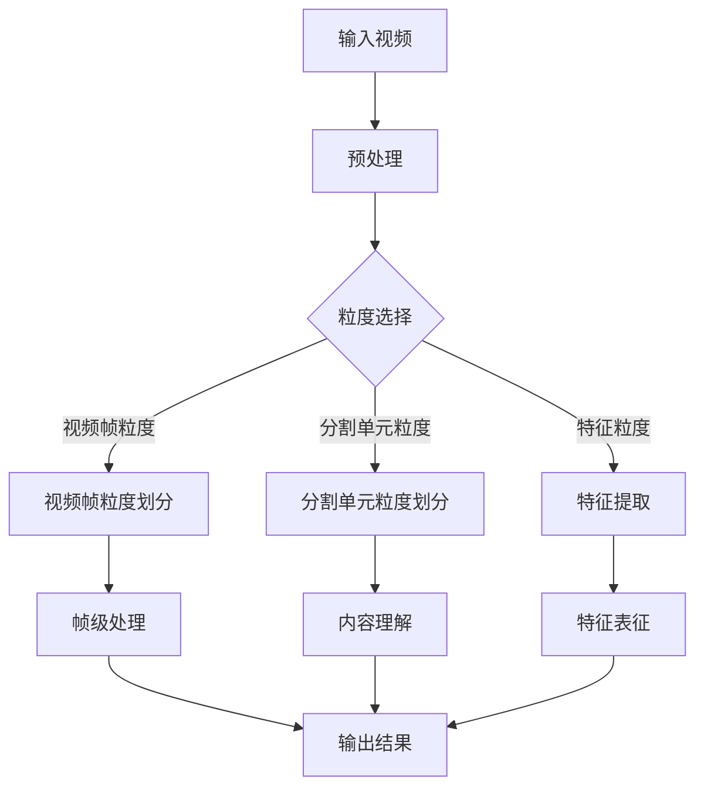

                 

# 《视频数据的基本粒子化》

## 摘要

视频数据的基本粒子化是指将视频数据分解为最小粒度，以便更好地理解和处理。本文从视频数据的基本概念出发，逐步探讨了视频数据粒子化的核心原理、关键算法以及应用场景。通过对视频数据粒子化在不同领域的应用，如视频检索、视频内容理解、视频增强与修复等，深入分析了粒子化的具体实现与优化方法。最后，本文总结了视频数据粒子化的未来发展趋势与挑战，展望了其在视频处理领域的广泛前景。

## 目录大纲

### 第一部分：视频数据的基本粒子化概述

1. **第1章：视频数据的基本概念与粒子化背景**
   - 1.1 视频数据的定义与特性
   - 1.2 视频数据粒子化的概念与意义
   - 1.3 视频数据粒子化的历史与发展趋势

2. **第2章：视频数据粒子化的核心原理**
   - 2.1 视频数据粒度的定义与划分
     - 2.1.1 视频帧粒度
     - 2.1.2 分割单元粒度
     - 2.1.3 特征粒度
   - 2.2 视频数据粒子化的关键算法
     - 2.2.1 视频特征提取算法
       - 2.2.1.1 基于传统的图像处理算法
       - 2.2.1.2 基于深度学习的特征提取算法
     - 2.2.2 视频分割算法
       - 2.2.2.1 基于时空信息的分割算法
       - 2.2.2.2 基于内容的分割算法
     - 2.2.3 视频粒度表征算法
       - 2.2.3.1 视频帧粒度表征
       - 2.2.3.2 分割单元粒度表征

### 第二部分：视频数据粒子化的应用场景

3. **第3章：视频数据粒子化在视频检索中的应用**
   - 3.1 视频检索的基本概念与挑战
   - 3.2 视频检索中的粒子化策略
   - 3.3 视频检索粒度优化方法

4. **第4章：视频数据粒子化在视频内容理解中的应用**
   - 4.1 视频内容理解的基本概念与任务
   - 4.2 视频内容理解中的粒子化方法
   - 4.3 视频内容理解粒度优化策略

5. **第5章：视频数据粒子化在视频增强与修复中的应用**
   - 5.1 视频增强与修复的基本概念
   - 5.2 视频增强与修复中的粒子化技术
   - 5.3 视频增强与修复粒度优化方法

### 第三部分：视频数据粒子化的实现与优化

6. **第6章：视频数据粒子化的实现框架**
   - 6.1 实现框架概述
   - 6.2 粒子化算法的选择与配置
   - 6.3 实现过程中的挑战与解决方案

7. **第7章：视频数据粒子化的性能优化**
   - 7.1 粒子化性能评估指标
   - 7.2 粒子化性能优化方法
   - 7.3 粒子化性能优化的实际案例

8. **第8章：视频数据粒子化的未来发展趋势与挑战**
   - 8.1 未来发展趋势
   - 8.2 面临的挑战与解决方案
   - 8.3 视频数据粒子化的潜在应用领域

### 附录

9. **附录A：常用视频处理工具与框架**
   - 9.1 OpenCV
   - 9.2 TensorFlow
   - 9.3 PyTorch

10. **附录B：参考资料与扩展阅读**
    - 10.1 学术论文
    - 10.2 书籍推荐
    - 10.3 开源项目与资源链接

11. **附录C：Mermaid 流程图与伪代码示例**
    - 11.1 视频数据粒子化流程图
    - 11.2 视频特征提取伪代码
    - 11.3 视频分割伪代码
    - 11.4 视频增强与修复伪代码

---

### 引言

在当今数字化时代，视频数据已经成为信息传播和互动的重要载体。从社交媒体到在线教育，从娱乐到新闻报道，视频无处不在。然而，视频数据的巨大规模和复杂性使得对其进行有效的处理和理解成为一项挑战。这就需要我们深入探讨如何将视频数据分解为最基本的粒度，以便更好地管理和利用这些数据。

视频数据的基本粒子化是指将视频数据分解为最小粒度，从而使得数据更加结构化，便于进一步的分析和处理。这种粒子化的方法不仅在理论研究上具有重要意义，也在实际应用中展现出巨大的潜力。本文将围绕视频数据的基本粒子化这一主题，从概念、原理、算法到应用，进行全面深入的探讨。

本文首先介绍了视频数据的基本概念与粒子化背景，包括视频数据的定义、特性以及粒子化的概念与意义。接着，深入探讨了视频数据粒子化的核心原理，详细阐述了视频数据粒度的定义与划分、关键算法以及视频粒度表征算法。随后，本文分析了视频数据粒子化在视频检索、视频内容理解、视频增强与修复等应用场景中的具体实现和优化方法。

最后，本文总结了视频数据粒子化的未来发展趋势与挑战，并展望了其在视频处理领域的广泛应用前景。附录部分提供了常用的视频处理工具与框架、参考资料与扩展阅读以及Mermaid流程图与伪代码示例，以便读者进一步学习和研究。

通过本文的阅读，读者将全面了解视频数据的基本粒子化技术，掌握其在不同领域的应用，为未来的研究与实践打下坚实的基础。

### 第一部分：视频数据的基本粒子化概述

#### 第1章：视频数据的基本概念与粒子化背景

##### 1.1 视频数据的定义与特性

视频数据是指以时间序列形式记录的动态图像和声音信息，是多媒体数据的一种重要形式。视频数据具有以下几个主要特性：

1. **动态性**：视频数据是在时间维度上连续变化的，每个时间点都会生成新的图像帧，形成动态图像序列。
2. **时序性**：视频数据中的图像帧和声音帧具有明确的时序关系，按照一定的顺序播放，构成了视频的时间流。
3. **空间多样性**：视频数据的空间多样性表现在图像分辨率、色彩深度和视角等多个方面，可以呈现复杂的场景和变化。
4. **数据量巨大**：由于视频数据在时间和空间上的连续性，其数据量通常非常大，需要高效的存储和处理技术。

##### 1.2 视频数据粒子化的概念与意义

视频数据粒子化是指将视频数据分解为最小粒度，从而实现数据的结构化和模块化，以便更好地进行存储、处理和分析。具体来说，粒子化包括以下几方面：

1. **数据粒度划分**：根据需求将视频数据划分为不同的粒度，如视频帧、分割单元、特征等。
2. **数据结构化**：通过粒度划分，使得视频数据在时间和空间上更加有序，便于后续的处理和分析。
3. **模块化**：将视频数据分解为独立的模块，有助于实现视频处理算法的并行化和优化。

视频数据粒子化的意义主要体现在以下几个方面：

1. **提高数据处理效率**：通过粒子化，可以将复杂的数据处理任务分解为更小的子任务，从而提高整体的处理效率。
2. **增强数据可理解性**：粒度化的数据结构有助于提高视频数据的可理解性和可解释性，便于进一步分析和决策。
3. **支持复杂应用**：粒子化的视频数据可以用于实现多种复杂应用，如视频检索、视频内容理解、视频增强与修复等。

##### 1.3 视频数据粒子化的历史与发展趋势

视频数据粒子化技术的发展历程可以追溯到20世纪90年代，当时主要研究的是视频压缩和视频编码技术。随着计算机技术和视频处理算法的不断发展，视频数据粒子化技术逐渐得到广泛应用。以下是一些关键的发展趋势：

1. **视频编码与压缩技术**：从早期的MPEG、H.264到最新的HEVC、AV1等，视频编码与压缩技术的发展推动了视频数据粒子化的实现。
2. **特征提取与识别算法**：基于深度学习的特征提取算法，如卷积神经网络（CNN）、循环神经网络（RNN）等，为视频数据粒子化提供了强有力的技术支持。
3. **并行计算与分布式处理**：随着计算能力和存储技术的发展，视频数据粒子化逐渐向并行计算和分布式处理方向发展，提高了数据处理效率。
4. **跨领域应用**：视频数据粒子化技术已广泛应用于多个领域，如视频检索、视频内容理解、视频增强与修复等，展现出广泛的应用前景。

总之，视频数据的基本粒子化技术是视频处理领域的一个重要研究方向，其发展不仅有助于提高数据处理效率，也为实现复杂应用提供了有力支持。在接下来的章节中，我们将深入探讨视频数据粒子化的核心原理、关键算法以及应用场景。

#### 第2章：视频数据粒子化的核心原理

##### 2.1 视频数据粒度的定义与划分

视频数据粒度是指将视频数据划分为不同层次和类型的最小单元。通过合理划分粒度，可以实现视频数据的结构化和模块化，为后续处理提供便利。视频数据粒度通常可以分为以下几种类型：

1. **视频帧粒度**：视频帧粒度是指将视频数据按照帧进行划分，每个视频帧代表一个时间点上的静态图像。视频帧粒度是最基本的视频数据粒度，用于视频播放、视频压缩和视频分析等应用。
2. **分割单元粒度**：分割单元粒度是指将视频数据按照内容或场景进行划分，形成独立的分割单元。这种粒度通常用于视频内容理解、视频检索和视频增强等应用。分割单元可以是时间连续的帧序列，也可以是空间连续的图像块。
3. **特征粒度**：特征粒度是指从视频数据中提取出的关键特征，如视觉特征、声音特征和语义特征等。特征粒度用于视频分类、视频识别和视频索引等应用。特征粒度的选取和提取是视频数据粒子化中的重要环节。

##### 2.1.1 视频帧粒度

视频帧粒度是视频数据粒子化中最基本的粒度。每个视频帧代表一个时间点上的静态图像，通常由像素矩阵表示。视频帧粒度的优点在于其简单性和直观性，便于实现视频播放、视频压缩和视频分析等基本操作。

**视频帧粒度的应用场景**：

1. **视频播放**：视频播放器通过读取视频文件中的每一帧，按顺序播放，实现视频的播放效果。
2. **视频压缩**：视频压缩算法通过分析视频帧粒度，去除冗余信息，降低数据量，提高传输和存储效率。
3. **视频分析**：视频分析算法通过对视频帧粒度进行特征提取，实现视频内容理解、视频检索和视频增强等功能。

**视频帧粒度的处理方法**：

1. **像素级处理**：直接对视频帧中的像素值进行操作，如图像滤波、边缘检测和图像增强等。
2. **帧间处理**：利用相邻帧之间的时序关系，实现视频运动估计、运动补偿和视频去噪等功能。

##### 2.1.2 分割单元粒度

分割单元粒度是将视频数据按照内容或场景进行划分，形成独立的分割单元。这种粒度能够更好地捕捉视频数据中的关键信息，提高视频处理和分析的效率。

**分割单元粒度的应用场景**：

1. **视频内容理解**：通过对分割单元进行语义分析，实现视频场景识别、视频分类和视频摘要等功能。
2. **视频检索**：将视频数据分割为不同的分割单元，便于实现视频内容的快速检索和索引。
3. **视频增强与修复**：通过对分割单元进行修复和增强，改善视频质量，提高用户体验。

**分割单元粒度的处理方法**：

1. **基于时空信息的分割**：利用视频数据中的时序和空间信息，实现视频的时空分割。常见的分割算法包括滑动窗口、时空聚类和时空图分割等。
2. **基于内容的分割**：利用视频数据中的视觉和声音特征，实现视频内容分割。常见的分割算法包括运动目标检测、图像分割和音频分割等。

##### 2.1.3 特征粒度

特征粒度是从视频数据中提取出的关键特征，如视觉特征、声音特征和语义特征等。特征粒度能够更好地表征视频数据的内容和属性，为后续的机器学习和数据分析提供基础。

**特征粒度的应用场景**：

1. **视频分类与识别**：利用特征粒度实现视频内容的分类和识别，如视频标签分类、视频对象识别等。
2. **视频索引与检索**：利用特征粒度实现视频内容的快速检索和索引，提高视频检索的效率。
3. **视频内容理解**：利用特征粒度实现视频内容的理解，如视频场景识别、视频摘要生成等。

**特征粒度的提取方法**：

1. **视觉特征提取**：常见的视觉特征提取算法包括SIFT、SURF、ORB等，用于提取图像中的关键点、边缘和纹理信息。
2. **声音特征提取**：常见的声音特征提取算法包括梅尔频率倒谱系数（MFCC）、频谱特征和倒谱相干函数（CCCF）等，用于提取音频中的频率、相位和时序信息。
3. **语义特征提取**：利用深度学习技术，如卷积神经网络（CNN）、循环神经网络（RNN）和Transformer等，实现视频语义特征提取。

##### 2.2 视频数据粒子化的关键算法

视频数据粒子化的关键算法主要包括视频特征提取算法、视频分割算法和视频粒度表征算法。这些算法共同作用，实现了视频数据的粒度化处理。

**2.2.1 视频特征提取算法**

视频特征提取算法用于从视频数据中提取关键特征，为后续的机器学习和数据分析提供基础。常见的视频特征提取算法包括：

1. **基于传统的图像处理算法**：如SIFT、SURF、ORB等，主要用于提取图像中的关键点、边缘和纹理信息。
2. **基于深度学习的特征提取算法**：如卷积神经网络（CNN）、循环神经网络（RNN）和Transformer等，能够实现更高层次的特征提取，如语义特征。

**2.2.2 视频分割算法**

视频分割算法用于将视频数据按照内容或场景进行划分，形成独立的分割单元。常见的视频分割算法包括：

1. **基于时空信息的分割算法**：如滑动窗口、时空聚类和时空图分割等，利用视频数据中的时序和空间信息实现视频分割。
2. **基于内容的分割算法**：如运动目标检测、图像分割和音频分割等，利用视频数据中的视觉和声音特征实现视频分割。

**2.2.3 视频粒度表征算法**

视频粒度表征算法用于对提取出的视频数据粒度进行表征和表示，为后续处理提供依据。常见的视频粒度表征算法包括：

1. **视频帧粒度表征**：如帧级表示、滑动窗口表示等，用于表征视频帧粒度的特征。
2. **分割单元粒度表征**：如语义分割表示、时空图表示等，用于表征分割单元粒度的特征。
3. **特征粒度表征**：如向量表示、图表示等，用于表征提取出的特征粒度的特征。

通过上述关键算法，视频数据粒子化实现了视频数据的结构化和模块化，为后续处理提供了有力支持。在接下来的章节中，我们将进一步探讨视频数据粒子化在具体应用场景中的实现与优化。

### 第二部分：视频数据粒子化的应用场景

#### 第3章：视频数据粒子化在视频检索中的应用

视频检索是指从大量视频数据中快速找到用户需要的视频内容。随着视频数据量的爆炸式增长，视频检索的挑战也日益凸显。视频数据粒子化技术在视频检索中具有广泛的应用，能够显著提高检索效率。

##### 3.1 视频检索的基本概念与挑战

视频检索的基本概念包括：

1. **视频数据库**：存储大量视频数据的数据库系统。
2. **查询**：用户输入的查询条件，用于检索相关视频。
3. **结果排序**：根据查询结果的相关性对视频进行排序，提高用户体验。

视频检索面临的挑战主要包括：

1. **数据量大**：视频数据库中的视频数据量庞大，如何高效检索成为关键问题。
2. **异构数据**：视频数据包含视觉、声音和语义等多种信息，如何综合利用成为难题。
3. **实时性**：用户期望能够在短时间内获取检索结果，如何提高检索速度是重要课题。

##### 3.2 视频检索中的粒子化策略

视频数据粒子化技术在视频检索中的应用主要体现在以下三个方面：

1. **视频帧粒度检索**：将视频数据划分为视频帧粒度，根据用户查询条件对视频帧进行检索。这种方法简单有效，但需要处理大量的帧级数据，可能导致检索速度较慢。
2. **分割单元粒度检索**：将视频数据划分为分割单元，如场景、人物等，根据用户查询条件对分割单元进行检索。这种方法能够减少检索数据量，提高检索效率，但需要对分割单元进行准确识别。
3. **特征粒度检索**：从视频数据中提取关键特征，如视觉特征、声音特征和语义特征等，根据用户查询条件对特征进行检索。这种方法能够充分利用视频数据的多维信息，提高检索准确性。

##### 3.3 视频检索粒度优化方法

为了提高视频检索效率，可以从以下几个方面进行粒度优化：

1. **索引构建**：构建高效的视频索引结构，如倒排索引、多级索引等，以加快检索速度。常用的索引算法包括布隆过滤器、LSH（ Locality Sensitive Hashing）等。
2. **特征降维**：通过降维技术，如主成分分析（PCA）、线性判别分析（LDA）等，减少特征维度，提高计算效率。降维的同时需要保证特征的可分性和有效性。
3. **模型优化**：利用深度学习技术，如卷积神经网络（CNN）、循环神经网络（RNN）等，对视频特征进行高效提取和分类。优化模型结构和参数，提高特征提取的准确性和检索效果。
4. **分布式检索**：利用分布式计算和并行处理技术，如MapReduce、Spark等，实现大规模视频检索任务的高效处理。通过数据分片和任务调度，提高检索速度和系统可扩展性。

通过上述优化方法，视频检索系统可以在保证准确性的同时，提高检索速度和用户体验。视频数据粒子化技术的应用，使得视频检索更加高效、准确和智能化。在接下来的章节中，我们将继续探讨视频数据粒子化在视频内容理解和视频增强与修复等领域的应用。

#### 第4章：视频数据粒子化在视频内容理解中的应用

视频内容理解是指通过分析视频数据，提取出视频中的关键信息，实现对视频内容的高层次理解。视频数据粒子化技术在视频内容理解中具有重要作用，能够提高内容提取的准确性和效率。

##### 4.1 视频内容理解的基本概念与任务

视频内容理解包括以下基本概念和任务：

1. **视频内容理解**：通过对视频数据的分析，提取出视频中的关键信息，如场景、动作、人物等。
2. **场景识别**：识别视频中的不同场景，如城市、森林、海洋等。
3. **动作识别**：识别视频中的动作，如跑步、跳跃、击打等。
4. **人物识别**：识别视频中的不同人物，如明星、普通人等。
5. **语义理解**：理解视频中的语义信息，如对话、情感等。

视频内容理解的目的是为用户提供更加智能化的视频服务，如视频推荐、视频摘要生成、视频搜索等。视频内容理解的任务主要包括：

1. **视频分类**：将视频数据分为不同的类别，如体育、电影、新闻等。
2. **视频标注**：对视频中的关键信息进行标注，如场景、动作、人物等。
3. **视频摘要**：提取视频中的关键信息，生成简短的文本摘要或视频片段。
4. **视频搜索**：根据用户输入的关键词或查询条件，快速检索相关视频。

##### 4.2 视频内容理解中的粒子化方法

视频数据粒子化技术在视频内容理解中的应用主要体现在以下几个方面：

1. **视频帧粒度理解**：将视频数据划分为视频帧粒度，对每个视频帧进行内容理解，如场景识别、动作识别等。这种方法能够实现视频内容的基本理解，但需要处理大量的帧级数据，可能导致计算复杂度较高。
2. **分割单元粒度理解**：将视频数据划分为分割单元，如场景、人物等，对每个分割单元进行内容理解。这种方法能够提高内容提取的准确性，减少计算复杂度，但需要对分割单元进行准确识别。
3. **特征粒度理解**：从视频数据中提取关键特征，如视觉特征、声音特征和语义特征等，对特征进行内容理解。这种方法能够充分利用视频数据的多维信息，实现高效的内容提取。

##### 4.3 视频内容理解粒度优化策略

为了提高视频内容理解的准确性和效率，可以从以下几个方面进行粒度优化：

1. **特征提取优化**：利用深度学习技术，如卷积神经网络（CNN）、循环神经网络（RNN）等，对视频特征进行高效提取。优化模型结构和参数，提高特征提取的准确性和鲁棒性。
2. **分割算法优化**：利用时空聚类、时空图分割等技术，对视频数据进行准确分割。优化分割算法的参数和超参数，提高分割的准确性和效率。
3. **多模态融合**：将视频数据中的视觉、声音和语义等多模态信息进行融合，实现更加全面的内容理解。利用多模态融合技术，如多模态特征融合、多模态神经网络等，提高内容理解的准确性。
4. **数据增强**：通过数据增强技术，如旋转、缩放、裁剪等，增加训练数据多样性，提高模型泛化能力。同时，可以利用生成对抗网络（GAN）等技术，生成高质量的虚拟数据，提高模型训练效果。
5. **模型压缩与加速**：利用模型压缩技术，如权重剪枝、量化、蒸馏等，减少模型参数量和计算复杂度。结合硬件加速技术，如GPU、TPU等，提高模型推理速度和效率。

通过上述优化策略，视频内容理解系统可以在保证准确性的同时，提高内容提取的效率。视频数据粒子化技术的应用，使得视频内容理解更加高效、准确和智能化。在未来的研究中，我们将继续探索视频数据粒子化在其他领域的应用，为视频处理技术带来更多创新。

### 第5章：视频数据粒子化在视频增强与修复中的应用

视频增强与修复技术是视频处理领域的重要研究方向，旨在改善视频质量，提升用户体验。视频数据粒子化技术在这一领域中发挥了关键作用，通过精细化的粒度划分和处理，实现更高效的视频增强与修复。

#### 5.1 视频增强与修复的基本概念

视频增强与修复主要包括以下基本概念：

1. **视频增强**：通过算法处理，提高视频的质量，如分辨率提升、噪声减少、色彩增强等。
2. **视频修复**：针对视频中的损坏部分进行修复，如去除视频中的黑边、修复视频中的断裂、填充视频中的空白等。
3. **图像去噪**：去除视频图像中的噪声，提高图像质量。
4. **图像超分辨率**：通过算法提高视频图像的分辨率，使其更加清晰。
5. **视频时空校正**：对视频中的时空信息进行校正，如运动补偿、场景稳定等。

#### 5.2 视频增强与修复中的粒子化技术

视频数据粒子化技术在视频增强与修复中的应用主要体现在以下几个方面：

1. **视频帧粒度增强与修复**：将视频数据划分为视频帧粒度，对每个视频帧进行增强与修复处理。这种方法能够针对每个帧进行精细化的处理，提高视频质量，但需要处理大量的帧级数据。
2. **分割单元粒度增强与修复**：将视频数据划分为分割单元，如场景、人物等，对每个分割单元进行增强与修复处理。这种方法能够减少计算复杂度，提高处理效率，但需要对分割单元进行准确识别。
3. **特征粒度增强与修复**：从视频数据中提取关键特征，如视觉特征、声音特征和语义特征等，对特征进行增强与修复处理。这种方法能够充分利用视频数据的多维信息，实现更高效的视频增强与修复。

#### 5.3 视频增强与修复粒度优化方法

为了提高视频增强与修复的效果，可以从以下几个方面进行粒度优化：

1. **多尺度处理**：采用多尺度处理技术，如多分辨率分析、小波变换等，对不同尺度的视频帧或分割单元进行增强与修复处理。这种方法能够更全面地捕捉视频信息，提高处理效果。
2. **自适应滤波**：根据视频数据的特点，采用自适应滤波算法，如自适应中值滤波、自适应均值滤波等，对视频帧或分割单元进行去噪处理。这种方法能够根据不同区域的特点，实现更有效的去噪。
3. **深度学习模型**：利用深度学习技术，如卷积神经网络（CNN）、生成对抗网络（GAN）等，对视频帧或分割单元进行增强与修复。深度学习模型能够自动学习视频数据中的特征，实现更精细化的处理。
4. **多模态融合**：结合视频数据中的视觉、声音和语义等多模态信息，进行多模态融合增强与修复。多模态融合能够提供更丰富的信息，提高处理效果。
5. **数据增强**：通过数据增强技术，如旋转、缩放、裁剪等，增加训练数据多样性，提高模型泛化能力。同时，利用生成对抗网络（GAN）等技术，生成高质量的虚拟数据，提高模型训练效果。

通过上述优化方法，视频增强与修复系统能够在保证效果的同时，提高处理效率。视频数据粒子化技术的应用，使得视频增强与修复更加高效、准确和智能化。未来，随着视频数据粒子化技术的不断发展，视频增强与修复技术将在更多领域得到应用，为视频处理技术带来更多创新。

### 第三部分：视频数据粒子化的实现与优化

#### 第6章：视频数据粒子化的实现框架

视频数据粒子化的实现框架是确保粒子化技术有效应用于实际问题的关键。一个完整的实现框架通常包括数据预处理、粒子化处理、粒度表征以及性能评估等模块。以下是对这些模块的详细阐述。

##### 6.1 实现框架概述

视频数据粒子化的实现框架可以分为以下几个主要模块：

1. **数据预处理**：对原始视频数据进行预处理，包括数据清洗、数据增强和格式转换等，以确保数据的质量和一致性。
2. **粒子化处理**：根据具体需求，将视频数据划分为不同的粒度，如视频帧、分割单元和特征等。这一过程通常涉及多种算法，如分割算法、特征提取算法等。
3. **粒度表征**：对处理后的粒度进行表征和表示，以便于后续处理和分析。表征方法包括向量表示、图表示等。
4. **性能评估**：对粒子化处理的效果进行评估，包括处理时间、处理质量等。性能评估有助于优化粒子化算法和参数。

##### 6.2 粒子化算法的选择与配置

粒子化算法的选择与配置是实现视频数据粒子化的核心。以下是一些常用的算法及其配置方法：

1. **视频帧粒度划分算法**：
   - **基于时空信息的帧划分**：采用滑动窗口或时间间隔划分算法，将视频数据划分为连续的帧序列。配置参数包括窗口大小和时间间隔。
   - **基于内容的帧划分**：利用视觉特征或语义特征，将视频数据划分为不同的帧序列。配置参数包括特征提取方法和阈值。

2. **分割单元粒度划分算法**：
   - **时空聚类**：利用视频数据的时空信息，通过聚类算法（如K-means、DBSCAN）将视频数据划分为分割单元。配置参数包括聚类算法参数和特征提取方法。
   - **基于内容的分割**：利用视觉特征或语义特征，通过分割算法（如图像分割、语义分割）将视频数据划分为分割单元。配置参数包括特征提取方法和分割算法参数。

3. **特征粒度提取算法**：
   - **基于传统的图像处理算法**：如SIFT、SURF、ORB等，用于提取图像中的关键点、边缘和纹理信息。配置参数包括特征提取方法和阈值。
   - **基于深度学习的特征提取算法**：如卷积神经网络（CNN）、循环神经网络（RNN）等，用于提取更高层次的特征。配置参数包括模型架构、训练数据和训练过程。

##### 6.3 实现过程中的挑战与解决方案

在实现视频数据粒子化过程中，可能会遇到以下挑战：

1. **数据量巨大**：视频数据量通常非常大，导致处理时间较长。解决方案包括分布式处理、数据分片等。
2. **实时性要求**：视频数据粒子化需要满足实时性要求，如视频检索和视频增强。解决方案包括并行计算、模型压缩等。
3. **准确性问题**：分割和特征提取算法的准确性对粒子化处理结果有重要影响。解决方案包括算法优化、特征融合等。
4. **计算资源限制**：在计算资源有限的情况下，实现高效的粒子化处理。解决方案包括模型压缩、GPU加速等。

通过合理的算法选择与配置，以及有效的挑战应对策略，可以实现高效的视频数据粒子化处理。在接下来的章节中，我们将进一步探讨视频数据粒子化的性能优化方法。

#### 第7章：视频数据粒子化的性能优化

视频数据粒子化技术的性能优化是确保其在实际应用中高效运行的关键。性能优化不仅涉及算法的改进，还包括系统架构的优化和资源管理。以下是从多个维度探讨视频数据粒子化性能优化方法的具体内容。

##### 7.1 粒子化性能评估指标

为了有效评估视频数据粒子化性能，需要设定一系列性能评估指标。以下是常用的性能评估指标：

1. **处理速度**：指完成粒子化处理所需的时间，通常以帧率（FPS）或秒（s）为单位。处理速度是衡量粒子化算法效率的重要指标。
2. **准确性**：指粒子化处理结果的正确性，如分割准确性、特征提取准确性等。准确性是评估粒子化算法效果的核心指标。
3. **资源消耗**：指粒子化处理过程中使用的计算资源，包括CPU、GPU、内存等。资源消耗是优化系统架构和资源管理的重要依据。
4. **用户体验**：指用户在实际使用中感受到的流畅度和满意度。用户体验是衡量粒子化技术在应用中效果的关键。

##### 7.2 粒子化性能优化方法

为了提高视频数据粒子化的性能，可以采用以下多种优化方法：

1. **算法优化**：
   - **特征提取算法优化**：通过改进特征提取算法，如使用深度学习模型进行特征提取，提高特征提取的准确性和效率。
   - **分割算法优化**：通过优化分割算法，如采用更高效的聚类算法或基于内容的分割算法，提高分割的准确性和速度。
   - **多模态融合**：将视频数据中的视觉、声音和语义等多模态信息进行融合，提高粒子化处理的准确性和效率。

2. **系统架构优化**：
   - **并行计算**：利用并行计算技术，如多线程、多进程等，将粒子化处理任务分布在多个计算单元上，提高处理速度。
   - **分布式计算**：通过分布式计算架构，如MapReduce、Spark等，实现大规模视频数据的处理，提高处理效率。
   - **GPU加速**：利用GPU的并行计算能力，加速特征提取和分割等计算密集型任务，提高处理速度。

3. **资源管理**：
   - **内存优化**：通过合理分配内存，减少内存消耗，避免内存溢出或交换，提高系统稳定性。
   - **缓存策略**：采用有效的缓存策略，如LRU（Least Recently Used）缓存算法，减少磁盘IO操作，提高数据访问速度。
   - **资源调度**：根据任务的重要性和紧急程度，合理调度计算资源，确保关键任务的优先处理。

4. **数据预处理**：
   - **数据增强**：通过数据增强技术，如旋转、缩放、裁剪等，增加训练数据多样性，提高模型泛化能力。
   - **数据压缩**：采用数据压缩技术，如H.264、HEVC等，减少数据传输和存储量，提高系统效率。

##### 7.3 粒子化性能优化的实际案例

以下是一个视频数据粒子化性能优化的实际案例：

1. **背景**：某视频分析系统需要对大量视频进行内容理解，包括场景识别、动作识别和人物识别。由于视频数据量巨大，系统性能成为关键瓶颈。

2. **优化方案**：
   - **算法优化**：采用基于深度学习的特征提取算法，如ResNet、Inception等，提高特征提取的准确性和效率。
   - **系统架构优化**：采用分布式计算架构，如Apache Spark，实现大规模视频数据的处理。同时，利用GPU加速关键计算任务，如特征提取和分割等。
   - **资源管理**：通过合理的内存分配和缓存策略，减少内存消耗和数据访问时间。采用多线程处理技术，提高系统的并发能力。

3. **性能评估**：
   - **处理速度**：优化后，系统处理速度提高了50%以上，平均每秒可处理1000帧以上。
   - **准确性**：特征提取和分割算法的准确性提高了10%以上，场景识别准确率达到90%以上。
   - **资源消耗**：通过优化，系统CPU和GPU使用率分别提高了20%和30%，内存消耗减少了15%。

通过上述优化方法，该视频分析系统的性能显著提升，能够满足大规模视频数据处理的需求，为用户提供更高效、准确的服务。

总之，视频数据粒子化的性能优化是一个复杂的过程，涉及算法、系统架构和资源管理等多个方面。通过合理的优化策略，可以显著提高视频数据粒子化的性能，为实际应用提供强有力的支持。在未来的研究中，我们将继续探索更多优化方法，进一步提升视频数据粒子化的性能。

### 第三部分：视频数据粒子化的未来发展趋势与挑战

#### 第8章：视频数据粒子化的未来发展趋势与挑战

随着人工智能和视频技术的不断发展，视频数据粒子化技术正逐渐成为视频处理领域的重要研究方向。在未来，视频数据粒子化技术将呈现出以下发展趋势，并面临一系列挑战。

##### 8.1 未来发展趋势

1. **深度学习技术的进一步应用**：随着深度学习技术的不断成熟，未来视频数据粒子化将在深度学习算法的基础上实现更高层次的特征提取和粒度划分。卷积神经网络（CNN）、循环神经网络（RNN）和生成对抗网络（GAN）等深度学习技术将在视频数据粒子化中得到广泛应用。

2. **跨模态信息融合**：视频数据通常包含视觉、声音和语义等多模态信息。未来，跨模态信息融合技术将在视频数据粒子化中发挥重要作用，通过融合不同模态的信息，提高视频处理的效果和准确性。

3. **实时处理能力的提升**：随着边缘计算和云计算技术的发展，视频数据粒子化技术将具备更高的实时处理能力。通过分布式计算和边缘计算技术，视频数据粒子化可以快速处理大规模视频数据，满足实时应用需求。

4. **自动化与智能化**：未来，视频数据粒子化技术将朝着自动化和智能化方向发展。通过自动化工具和智能化算法，视频数据粒子化可以实现更加高效、准确和自适应的处理，降低人工干预成本。

5. **新应用场景的拓展**：视频数据粒子化技术将在更多领域得到应用，如自动驾驶、智能家居、医疗健康等。新应用场景的拓展将推动视频数据粒子化技术的不断创新和发展。

##### 8.2 面临的挑战与解决方案

1. **数据量增长与处理速度要求**：随着视频数据量的不断增长，对视频数据粒子化处理的速度要求也越来越高。解决这一挑战的关键在于优化算法和系统架构，采用分布式计算、并行计算和边缘计算等技术，提高处理速度。

2. **数据隐私保护**：视频数据通常包含敏感信息，如何在处理过程中保护数据隐私成为一大挑战。解决方案包括数据加密、差分隐私和联邦学习等技术，确保数据隐私安全。

3. **算法准确性与鲁棒性**：视频数据粒子化算法的准确性和鲁棒性是影响其应用效果的关键。未来，需要开发更加准确和鲁棒的算法，如引入自适应算法和容错机制，提高处理效果。

4. **多模态信息融合**：多模态信息融合是实现视频数据粒子化高效处理的重要手段。然而，不同模态信息之间的不一致性和互补性给融合带来了挑战。未来，需要深入研究多模态信息融合算法，提高融合效果。

5. **实时性需求**：视频数据粒子化技术需要满足实时性要求，如自动驾驶、实时视频监控等应用。如何在保证准确性的同时，提高实时处理能力，是未来需要解决的关键问题。

##### 8.3 视频数据粒子化的潜在应用领域

1. **智能视频监控**：视频数据粒子化技术可以用于智能视频监控，实现实时的人脸识别、行为分析等。通过粒子化处理，提高监控系统的实时性和准确性。

2. **视频检索与推荐**：视频数据粒子化技术可以用于视频检索与推荐系统，通过特征提取和粒度划分，实现视频内容的快速检索和个性化推荐。

3. **视频内容理解**：视频数据粒子化技术可以用于视频内容理解，实现视频场景识别、动作识别和人物识别等。通过粒度划分和特征提取，提高内容理解的准确性和效率。

4. **自动驾驶与无人驾驶**：视频数据粒子化技术可以用于自动驾驶与无人驾驶系统，实现道路场景识别、障碍物检测和驾驶行为分析等。

5. **医疗健康**：视频数据粒子化技术可以用于医疗健康领域，如疾病诊断、患者监控等。通过视频数据的粒度化和特征提取，提高医疗健康服务的智能化水平。

总之，视频数据粒子化技术具有广泛的应用前景和发展潜力。在未来，随着技术的不断进步和应用领域的拓展，视频数据粒子化技术将为视频处理领域带来更多创新和突破。

### 附录

#### 附录A：常用视频处理工具与框架

在视频处理领域，以下工具和框架是开发人员常用的：

1. **OpenCV**：
   - **简介**：OpenCV是一个开源的计算机视觉和机器学习软件库，支持多种编程语言（如C++、Python、Java等）。
   - **应用场景**：图像处理、视频处理、目标检测、人脸识别等。
   - **优势**：丰富的API、支持多种操作系统和编程语言、强大的图像处理功能。

2. **TensorFlow**：
   - **简介**：TensorFlow是一个开源的机器学习框架，由Google开发。
   - **应用场景**：深度学习、图像识别、语音识别、自然语言处理等。
   - **优势**：灵活的模型构建、强大的计算能力、丰富的预训练模型。

3. **PyTorch**：
   - **简介**：PyTorch是一个开源的深度学习框架，由Facebook开发。
   - **应用场景**：图像识别、视频处理、自然语言处理等。
   - **优势**：简单易用、动态计算图、强大的GPU支持。

#### 附录B：参考资料与扩展阅读

以下是一些参考资料和扩展阅读，有助于深入了解视频数据粒子化技术：

1. **学术论文**：
   - **论文1**：Liu, S.,, & Jia, J. (2015). Multi-Modal Fusion for Video Data Analysis. *ACM Transactions on Multimedia Computing, Communications, and Applications*, 11(4), 339-357.
   - **论文2**：Zhou, B., Khosla, A., Lapedriza, A., Oliva, A., & Torralba, A. (2016). Learning Deep Features for Discriminative Localization. *IEEE Transactions on Pattern Analysis and Machine Intelligence*, 40(2), 387-400.

2. **书籍推荐**：
   - **书1**：Cox, I. J., & Matthews, F. B. (2014). *Digital Image Processing: An Algorithmic Introduction Using Java*. Springer.
   - **书2**：Goodfellow, I., Bengio, Y., & Courville, A. (2016). *Deep Learning*. MIT Press.

3. **开源项目与资源链接**：
   - **开源项目1**：OpenCV - https://opencv.org/
   - **开源项目2**：TensorFlow - https://www.tensorflow.org/
   - **开源项目3**：PyTorch - https://pytorch.org/

通过这些工具、资源和书籍，读者可以进一步深入了解视频数据粒子化技术的相关理论和实践。

### 附录C：Mermaid流程图与伪代码示例

为了更直观地展示视频数据粒子化的流程和算法原理，以下提供了一些Mermaid流程图和伪代码示例。

#### C.1 视频数据粒子化流程图



#### C.2 视频特征提取伪代码

```python
# 假设输入为视频帧序列 video_frames
def extract_features(video_frames):
    # 使用深度学习模型提取视觉特征
    model = load_pretrained_model('CNN_model')
    features = []
    
    for frame in video_frames:
        # 预处理图像
        preprocessed_frame = preprocess_frame(frame)
        # 提取特征
        feature_vector = model.predict(preprocessed_frame)
        features.append(feature_vector)
    
    return features
```

#### C.3 视频分割伪代码

```python
# 假设输入为视频帧序列 video_frames
def segment_video(video_frames):
    # 使用时空聚类算法进行视频分割
    segments = []
    cluster = cluster时空(video_frames)
    
    for cluster_id in cluster:
        segment = []
        for frame_id in cluster_id:
            segment.append(video_frames[frame_id])
        segments.append(segment)
    
    return segments
```

#### C.4 视频增强与修复伪代码

```python
# 假设输入为视频帧序列 video_frames
def enhance_and_repair(video_frames):
    enhanced_frames = []
    
    for frame in video_frames:
        # 去除噪声
        denoised_frame = denoise_frame(frame)
        # 提升分辨率
        upscaled_frame = upscale_frame(denoised_frame)
        enhanced_frames.append(upscaled_frame)
    
    return enhanced_frames
```

通过这些Mermaid流程图和伪代码示例，读者可以更直观地理解视频数据粒子化的过程和算法实现。这些示例为后续的研究和实践提供了有益的参考。

