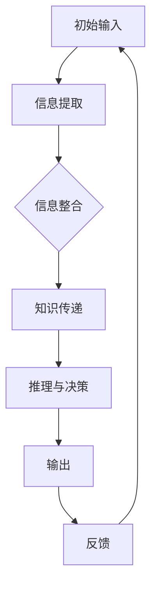
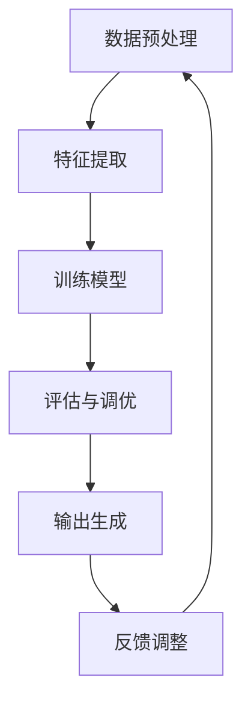
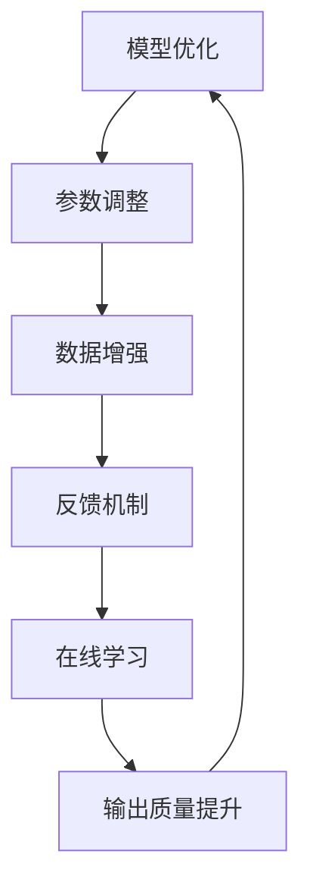
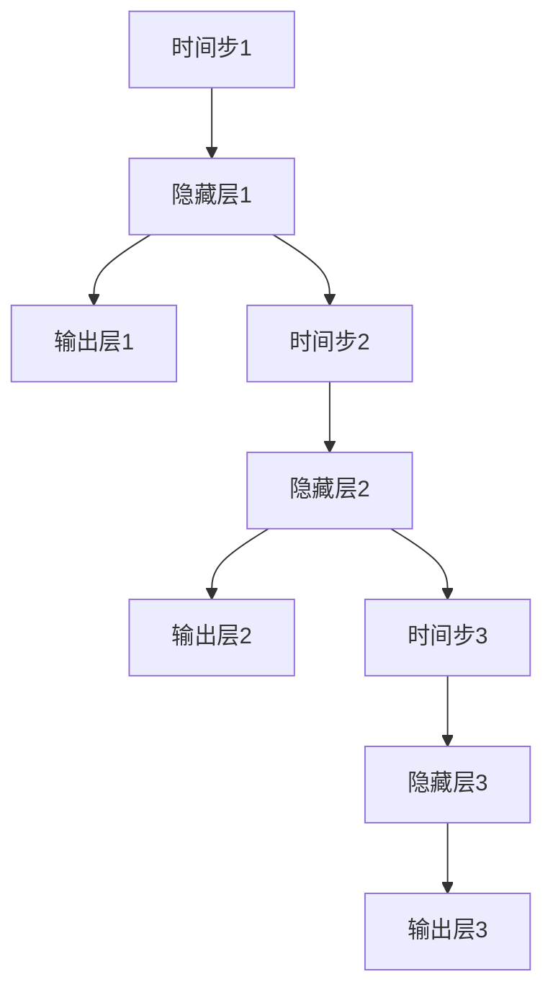
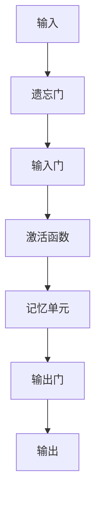
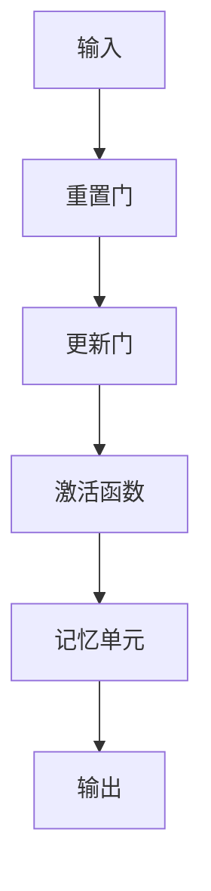
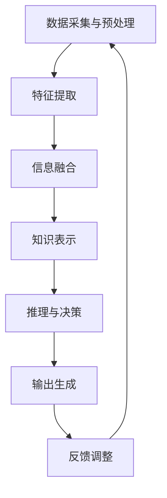
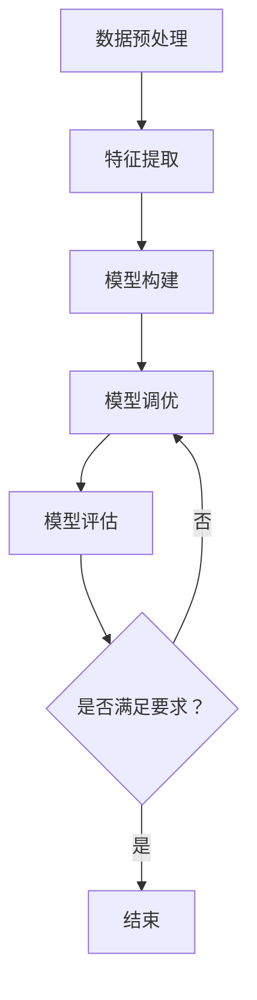
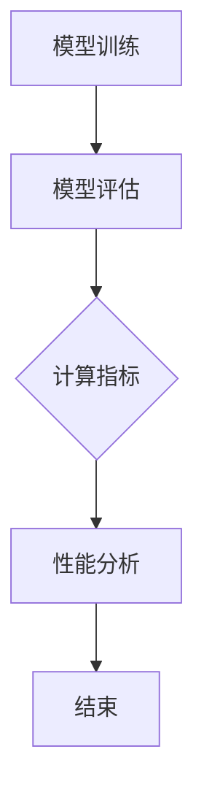
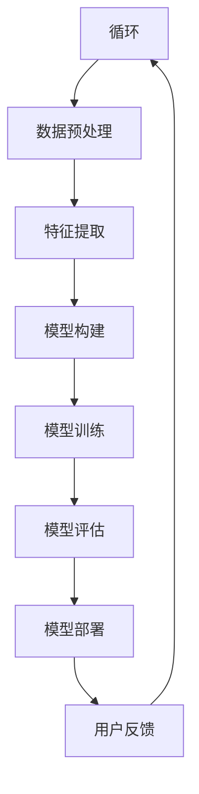

                 

### 《解密思维链：提升ChatGPT输出质量的关键》

> **关键词**：思维链、ChatGPT、NLP、自然语言生成、算法优化

> **摘要**：本文将深入探讨思维链的基本概念、构建方法及其在提升ChatGPT输出质量中的应用。我们将通过一步步分析推理，解析思维链的核心算法原理，展示其在多模态AI和实战项目中的应用，并展望未来的发展方向。本文旨在为读者提供一个全面、深入的了解，帮助提升对ChatGPT输出质量的掌握。

#### 目录

#### 第一部分：理解思维链

- **第1章：思维链的基本概念**
  - **1.1 思维链的定义与重要性**
  - **1.2 ChatGPT与思维链**
  - **1.3 思维链与自然语言生成**

- **第2章：构建思维链**
  - **2.1 思维链构建的基本要素**
  - **2.2 数据驱动的思维链构建**
  - **2.3 思维链的优化与调整**

- **第3章：思维链在ChatGPT中的应用**
  - **3.1 ChatGPT的输出质量问题**
  - **3.2 思维链优化ChatGPT输出**
  - **3.3 实战案例：提升ChatGPT输出质量**

#### 第二部分：深入思维链

- **第4章：思维链核心算法原理**
  - **4.1 思维链算法概述**
  - **4.2 递归神经网络（RNN）**
  - **4.3 长短时记忆网络（LSTM）**
  - **4.4 门控循环单元（GRU）**

- **第5章：思维链中的知识表示与推理**
  - **5.1 知识表示**
  - **5.2 推理机制**

- **第6章：思维链在多模态AI中的应用**
  - **6.1 多模态AI概述**
  - **6.2 思维链在多模态AI中的应用**
  - **6.3 实战案例：多模态思维链在图像描述中的应用**

#### 第三部分：思维链实战与应用

- **第7章：思维链开发与优化**
  - **7.1 思维链开发环境搭建**
  - **7.2 思维链开发实践**
  - **7.3 思维链性能评估**
  - **7.4 实战案例：构建智能客服系统**

- **第8章：未来展望**
  - **8.1 思维链技术的挑战与机遇**
  - **8.2 开放问题与研究方向**
  - **8.3 社会影响与伦理问题**

#### 附录

- **附录A：思维链相关资源与工具**
- **附录B：参考文献**
- **附录C：思维链构建流程图**

---

在接下来的文章中，我们将一步步深入探索思维链的概念、构建方法及其在ChatGPT中的应用。通过这种逻辑清晰、结构紧凑的分析推理方式，希望能够为您带来一次全面而有深度的技术之旅。

### 第1章：思维链的基本概念

#### 1.1 思维链的定义与重要性

**思维链（Thinking Chain）** 是一种用于描述信息处理和决策过程中，各知识点、信息单元及其相互关联的结构与流程的术语。在人工智能（AI）和自然语言处理（NLP）领域，思维链尤为重要。它是一种模型，用于捕捉和理解人类思维的复杂性和连贯性。

在AI和NLP中，思维链的定义可以从以下几个方面来理解：

1. **知识结构**：思维链是一系列知识点或信息单元的集合，这些知识点或信息单元通过特定的逻辑关系连接起来，形成一个具有层次性和网络性的结构。
2. **信息处理流程**：思维链不仅仅是知识点的组合，更是一个信息处理的过程。在这个过程中，信息单元被提取、整合、传递和推理，形成连贯的思维流程。
3. **动态性**：思维链不是静态的结构，而是随着环境变化和新的信息输入，不断调整和优化的动态系统。

思维链的重要性主要体现在以下几个方面：

1. **提升输出质量**：在自然语言生成（NLG）任务中，思维链能够确保生成的文本具有连贯性、逻辑性和合理性，从而提高输出质量。
2. **增强交互性**：在对话系统如ChatGPT中，思维链有助于理解用户输入，生成更符合用户意图和上下文的响应，提升交互体验。
3. **知识图谱构建**：思维链能够将分散的知识点和信息单元整合成一个统一的结构，为构建知识图谱提供基础。

为了更好地理解思维链的概念，我们可以借助一个简单的Mermaid流程图来展示其基本结构：

在这个流程图中，A表示初始输入，B是信息提取，C是信息整合，D是知识传递，E是推理与决策，F是输出，G是反馈。思维链通过这些环节的循环，不断优化和调整，形成连贯的思维流程。

#### 1.2 ChatGPT与思维链

**ChatGPT** 是一个基于GPT-3模型的大型语言模型，其核心能力在于生成连贯、合理且符合上下文的文本。ChatGPT的工作原理涉及多个层面，其中思维链起到了关键作用。

1. **工作原理**：ChatGPT通过训练大量文本数据，学习语言模式和上下文关系。在接收用户输入时，ChatGPT首先理解输入的内容，然后根据已有的知识结构和思维链，生成相应的文本输出。
2. **思维链的作用**：在ChatGPT的生成过程中，思维链负责捕捉和传递上下文信息，确保输出的连贯性和合理性。具体来说，思维链实现了以下功能：

   - **上下文捕捉**：通过分析用户输入和当前对话历史，思维链能够捕捉关键信息和上下文，为生成过程提供依据。
   - **逻辑推理**：思维链能够利用已有的知识和逻辑规则，对信息进行推理和整合，生成符合逻辑和语义的文本。
   - **反馈调整**：根据用户的反馈，思维链可以调整和优化生成策略，提高输出质量。

思维链在ChatGPT中的应用，不仅提升了生成文本的质量，还增强了模型的交互性和智能性。通过思维链，ChatGPT能够更好地理解用户意图，生成更具个性化和精准的响应。

#### 1.3 思维链与自然语言生成

在自然语言生成（NLG）任务中，思维链起到了至关重要的作用。NLG的目标是将机器内部的结构化数据转化为自然语言形式的文本。这个过程涉及到信息提取、整合、推理和生成等多个环节，而思维链则贯穿于整个过程。

1. **信息提取**：思维链首先从输入数据中提取关键信息，如关键词、实体、事件等。这一步骤类似于人类的阅读和理解过程，通过思维链，模型能够有效地捕捉和提取文本中的关键要素。
   
2. **信息整合**：提取出的信息需要被整合成一个统一的逻辑框架。思维链在这里起到桥梁作用，将分散的信息单元通过逻辑关系整合成一个连贯的结构，为后续的推理和生成提供基础。

3. **推理与生成**：基于整合后的信息结构，思维链进行推理和生成。这一步骤类似于人类的思考和写作过程，通过逻辑推理和规则应用，生成符合上下文和语义的文本。

4. **输出优化**：生成的文本可能需要进行多次调整和优化，以符合预期的质量标准。思维链通过循环反馈和迭代优化，不断提升输出质量。

思维链在NLG中的应用，不仅提升了文本生成的质量和连贯性，还使得模型能够更好地适应不同的应用场景和需求。例如，在新闻生成、对话系统、自动化文档生成等领域，思维链的应用都取得了显著的成果。

总之，思维链是自然语言生成任务中不可或缺的一部分，它通过捕捉、整合、推理和生成，实现了从数据到自然语言的高效转化。在接下来的章节中，我们将深入探讨思维链的构建方法和核心算法原理，帮助读者更好地理解和应用思维链技术。

#### 1.4 小结

本章我们介绍了思维链的基本概念，从定义、重要性到ChatGPT和自然语言生成中的应用，为读者提供了一个全面的视角。通过Mermaid流程图，我们形象地展示了思维链的结构和流程。接下来，我们将进一步探讨如何构建思维链，包括基本要素、数据驱动的构建方法以及优化策略。这些内容将帮助我们更深入地理解思维链的工作机制，并为实际应用提供有力支持。

---

### 第2章：构建思维链

思维链的构建是提升自然语言处理（NLP）和人工智能（AI）系统输出质量的关键步骤。本章将详细探讨思维链构建的基本要素、数据驱动的构建方法以及优化与调整策略。

#### 2.1 思维链构建的基本要素

思维链的构建需要考虑以下几个基本要素：

1. **信息提取**：从输入数据中提取关键信息，如关键词、实体、事件等。这是思维链构建的第一步，决定了后续信息整合和推理的质量。
   
2. **信息整合**：将提取出的关键信息进行整合，形成具有逻辑关系和层次性的结构。信息整合是思维链的核心环节，决定了输出文本的连贯性和逻辑性。

3. **知识传递**：通过传递和整合已知的知识，为推理和决策提供基础。知识传递有助于确保输出文本的合理性和准确性。

4. **推理与决策**：基于整合后的信息和知识，进行逻辑推理和决策。推理与决策是思维链的智能环节，决定了输出文本的智能性和创造性。

5. **输出生成**：根据推理结果生成自然语言文本。输出生成是思维链的最终目标，决定了用户交互体验和系统输出质量。

6. **反馈调整**：通过用户的反馈，对思维链进行优化和调整，提高输出质量。反馈调整是思维链持续改进的重要手段。

#### 2.2 数据驱动的思维链构建

数据驱动的思维链构建方法依赖于大量的训练数据和先进的机器学习算法。以下是数据驱动的思维链构建的主要步骤：

1. **数据预处理**：对原始数据进行清洗、格式化，提取出关键信息。数据预处理是思维链构建的基础，直接影响到后续环节的效率和质量。

2. **特征提取**：从预处理后的数据中提取特征，如词向量、句法结构、语义信息等。特征提取是数据驱动的核心步骤，决定了思维链对输入数据的理解和处理能力。

3. **训练模型**：使用提取出的特征，训练思维链模型。训练模型的过程包括选择合适的算法、设置参数、调整模型结构等。训练模型的目的是使思维链能够高效地处理输入数据，生成高质量的输出。

4. **评估与调优**：对训练好的模型进行评估，根据评估结果调整模型参数和结构，优化思维链性能。评估与调优是数据驱动思维链构建的重要环节，决定了最终输出质量。

以下是一个简单的数据驱动思维链构建流程图：

#### 2.3 思维链的优化与调整

思维链的优化与调整是确保其性能和输出质量的关键步骤。以下是思维链优化与调整的主要策略：

1. **模型优化**：通过调整模型结构、选择更先进的算法和优化训练过程，提高思维链的性能。例如，可以采用更复杂的神经网络结构，如长短期记忆网络（LSTM）或门控循环单元（GRU），以更好地捕捉上下文信息。

2. **参数调整**：通过调整模型参数，优化思维链的输出。参数调整包括学习率、批量大小、正则化项等。合理的参数设置可以提高模型的收敛速度和输出质量。

3. **数据增强**：通过增加训练数据、引入噪声、生成合成数据等手段，增强训练数据的多样性，提高模型的泛化能力。数据增强有助于提高思维链对未知数据的处理能力。

4. **反馈机制**：通过用户反馈，实时调整思维链的输出。反馈机制可以包括用户评分、错误纠正、对话改进等。反馈机制有助于思维链不断优化和改进，提高输出质量。

5. **在线学习**：采用在线学习技术，使思维链能够根据实时反馈和数据动态调整。在线学习有助于思维链不断适应新环境和需求，保持较高的性能和输出质量。

以下是一个简单的思维链优化与调整流程图：

#### 2.4 小结

本章我们详细探讨了思维链构建的基本要素、数据驱动的构建方法以及优化与调整策略。思维链的构建是一个系统工程，涉及信息提取、整合、知识传递、推理与决策、输出生成和反馈调整等多个环节。通过数据驱动的构建方法和持续优化与调整，我们可以构建高性能的思维链，提升自然语言处理和人工智能系统的输出质量。

在接下来的章节中，我们将进一步探讨思维链在ChatGPT中的应用，分析ChatGPT的输出质量问题，并探讨如何利用思维链优化ChatGPT输出。通过这些探讨，我们将更好地理解思维链在提升ChatGPT输出质量中的关键作用。

---

### 第3章：思维链在ChatGPT中的应用

#### 3.1 ChatGPT的输出质量问题

ChatGPT作为一个基于GPT-3模型的大型语言模型，在自然语言生成任务中展示了强大的能力。然而，尽管ChatGPT在许多方面表现出色，但其输出仍然存在一些质量问题，主要包括以下几个方面：

1. **连贯性不足**：ChatGPT生成的文本有时会显得断断续续，缺乏流畅性。这通常发生在模型未能充分理解上下文或者是在生成过程中丢失了关键信息时。

2. **逻辑错误**：ChatGPT在生成文本时可能会出现逻辑错误。这些错误可能是由于模型对输入文本的理解不准确，或者是在推理过程中未能正确应用逻辑规则。

3. **语义偏离**：生成的文本有时会偏离原始意图，未能准确传达用户的意图。这可能是由于模型对语义的理解有限，或者是在生成过程中未能充分利用上下文信息。

4. **重复性**：ChatGPT生成的文本可能会出现重复或冗余的信息，这降低了输出的质量。重复性问题通常出现在模型未能有效筛选和整合已有信息时。

5. **形式单一**：ChatGPT生成的文本在形式上可能显得过于单一，缺乏多样性和创意。这可能是由于模型在生成过程中未能充分利用各种语言模式和表达方式。

6. **敏感信息处理不当**：在某些情况下，ChatGPT可能未能正确处理敏感信息，导致生成的内容不恰当。这可能是由于模型在训练数据中没有充分涵盖相关场景，或者在生成过程中未能有效过滤敏感信息。

#### 3.2 思维链如何解决这些问题

思维链（Thinking Chain）作为一种信息处理和决策模型，能够有效解决ChatGPT在输出中存在的质量问题。以下是如何利用思维链来优化ChatGPT输出的几个关键策略：

1. **增强上下文理解**：思维链通过捕捉和传递上下文信息，能够帮助ChatGPT更好地理解用户的输入。在生成过程中，思维链能够整合多个信息单元，确保文本的连贯性和逻辑性。例如，当用户提出一个复杂的问题时，思维链可以分析问题中的关键词和上下文信息，生成连贯且符合逻辑的回答。

2. **逻辑推理与验证**：思维链中的推理机制能够对生成文本进行逻辑验证，确保文本内容的正确性和合理性。在生成每个句子或段落时，思维链会根据已有的知识和逻辑规则进行推理，检查是否存在逻辑矛盾或错误。例如，当生成一个包含多个步骤的指令时，思维链可以检查这些步骤是否按正确的顺序排列，确保指令的可执行性。

3. **语义一致性**：思维链通过整合语义信息，能够确保生成文本的语义一致性。在生成过程中，思维链会分析文本的语义结构，确保每个句子或段落都与上下文保持一致，避免语义偏离。例如，当生成一个描述某个场景的文本时，思维链可以确保每个句子都在描述同一个场景，不会出现跳转或混淆。

4. **信息筛选与整合**：思维链能够有效筛选和整合关键信息，避免重复和冗余。在生成文本时，思维链会分析输入信息，提取关键信息单元，并整合成一个连贯的结构。这样可以确保生成文本的信息量适中，内容精炼，避免冗余和重复。例如，当生成一个关于某个事件的新闻报道时，思维链可以筛选出关键信息，并按逻辑顺序组织成一篇简洁明了的新闻稿。

5. **多样化生成**：思维链能够利用多种语言模式和表达方式，生成多样化且富有创意的文本。在生成过程中，思维链会根据上下文和用户需求，选择合适的语言表达方式，避免形式单一。例如，当生成一段对话时，思维链可以根据对话的情境和人物角色，选择合适的对话语言和风格，使对话更加自然和生动。

6. **敏感信息处理**：思维链能够识别和处理敏感信息，确保生成文本的适当性和安全性。在生成过程中，思维链会分析文本内容，识别敏感信息，并采取相应的处理措施。例如，当生成涉及个人隐私或敏感话题的文本时，思维链可以过滤掉敏感信息，避免生成不当的内容。

#### 3.3 实战案例：提升ChatGPT输出质量

以下是一个实际案例，展示了如何利用思维链来提升ChatGPT的输出质量：

**案例背景**：一个在线问答平台需要通过ChatGPT生成自动回答，以提供用户即时帮助。然而，生成的回答存在连贯性不足、逻辑错误和语义偏离等问题，影响了用户体验。

**解决方案**：引入思维链来优化ChatGPT的输出质量。

1. **上下文捕捉与整合**：在生成回答之前，思维链会分析用户问题及其上下文信息，提取关键信息单元。通过整合用户问题、相关历史记录和平台知识库，思维链构建了一个完整的上下文框架。

2. **逻辑推理与验证**：思维链对生成的回答进行逻辑验证，确保每个句子和段落都是连贯且合理的。通过分析句子之间的逻辑关系，思维链识别出逻辑错误并进行修正。

3. **语义一致性优化**：思维链检查生成文本的语义一致性，确保文本内容与上下文保持一致。如果发现语义偏离，思维链会重新调整文本，使其符合上下文。

4. **信息筛选与整合**：思维链对输入信息进行筛选和整合，提取关键信息并组织成连贯的结构。通过这种方式，生成的回答信息量适中，避免了重复和冗余。

5. **多样化生成**：思维链利用多种语言表达方式，使生成的回答多样化且富有创意。通过这种方式，平台能够提供更加自然和生动的用户互动体验。

6. **敏感信息处理**：思维链识别和处理敏感信息，确保生成文本的适当性和安全性。通过过滤敏感信息，平台能够避免生成不当的内容，保护用户隐私。

**实施效果**：通过引入思维链，平台显著提升了ChatGPT的输出质量。用户反馈显示，生成的回答更加连贯、合理、准确，用户体验得到了显著改善。此外，思维链的应用也提高了平台的知识整合和推理能力，使得自动回答系统更加智能和高效。

总之，思维链在提升ChatGPT输出质量方面发挥了重要作用。通过增强上下文理解、逻辑推理、语义一致性、信息筛选与整合、多样化生成和敏感信息处理，思维链能够显著改善ChatGPT的输出质量，提供更好的用户体验。

在接下来的章节中，我们将继续探讨思维链的核心算法原理，深入分析递归神经网络（RNN）、长短时记忆网络（LSTM）和门控循环单元（GRU）等算法，帮助读者更好地理解和应用思维链技术。

### 第4章：思维链核心算法原理

思维链的构建依赖于一系列强大的算法，这些算法能够有效地处理和分析大量的自然语言数据，从而实现高质量的文本生成。在这一章中，我们将深入探讨思维链中的核心算法原理，包括递归神经网络（RNN）、长短时记忆网络（LSTM）和门控循环单元（GRU）。这些算法不仅为思维链提供了强大的计算能力，还在NLP任务中得到了广泛应用。

#### 4.1 思维链算法概述

在探讨具体算法之前，先对思维链中的常用算法进行一个概述，以便读者对整体框架有一个清晰的认识。

1. **递归神经网络（RNN）**：RNN是一种能够处理序列数据的神经网络。它在处理自然语言时，通过递归地处理输入序列中的每个元素，保持对前一个状态的依赖。这种特性使得RNN在捕捉上下文信息方面具有优势。

2. **长短时记忆网络（LSTM）**：LSTM是RNN的一种扩展，主要解决了传统RNN在长序列依赖问题上的不足。LSTM通过引入记忆单元和门控机制，能够有效地学习和记忆长期依赖信息，从而在NLP任务中表现出色。

3. **门控循环单元（GRU）**：GRU是另一种基于RNN的改进模型，它在LSTM的基础上进一步简化了结构，同时保持了强大的学习能力和计算效率。GRU通过更新门和重置门，有效地管理了信息流，使其在许多NLP任务中得到了广泛应用。

4. **Transformer模型**：尽管本章主要讨论RNN及其变种，但Transformer模型作为近年来在NLP领域取得突破性的算法，也不得不提。Transformer通过自注意力机制，能够全局捕捉序列信息，使其在长文本处理任务中表现出色。

这些算法各有特点，但在思维链的构建中，RNN、LSTM和GRU因其强大的序列处理能力和对上下文信息的捕捉能力，成为了核心选择。接下来，我们将详细探讨这些算法的基本原理和应用。

#### 4.2 递归神经网络（RNN）

递归神经网络（RNN）是一种能够处理序列数据的神经网络，其基本原理是通过递归地处理输入序列中的每个元素，同时保持对前一个状态的依赖。这种特性使得RNN在捕捉上下文信息方面具有显著优势。

**4.2.1 RNN的基本原理**

1. **网络结构**：RNN由多个神经元层组成，每个神经元层都包含输入层、隐藏层和输出层。输入序列通过输入层传递到隐藏层，每个隐藏层的输出又作为下一个隐藏层的输入。

2. **递归处理**：在RNN中，每个时间步的输出不仅依赖于当前输入，还依赖于前一个时间步的隐藏状态。这种递归处理方式使得RNN能够保持对上下文信息的依赖，从而捕捉到序列中的长期依赖关系。

3. **激活函数**：RNN中的激活函数通常为ReLU（Rectified Linear Unit）或Sigmoid函数，用于引入非线性特性。

**4.2.2 RNN在思维链构建中的应用**

RNN在思维链构建中的应用主要体现在以下几个方面：

1. **上下文捕捉**：RNN能够通过递归处理，捕捉输入序列中的上下文信息，使其在处理自然语言时，能够保持对前文信息的依赖。

2. **状态传递**：每个时间步的隐藏状态包含了当前输入和前一个状态的信息，这种状态传递机制使得RNN能够有效地学习和记忆长期依赖关系。

3. **序列建模**：RNN通过处理输入序列，可以生成相应的序列输出，如文本生成、语音识别等。在思维链中，RNN可以用来捕捉和生成信息序列，形成连贯的文本。

下面是一个简单的RNN模型示意图：

在这个示意图中，A表示输入序列，B表示隐藏层，C表示输出层。每个时间步的隐藏状态（如B1、B2、B3）都包含了当前输入和前一个状态的依赖，从而实现序列建模。

#### 4.3 长短时记忆网络（LSTM）

长短时记忆网络（LSTM）是RNN的一种扩展，主要解决了传统RNN在长序列依赖问题上的不足。LSTM通过引入记忆单元和门控机制，能够有效地学习和记忆长期依赖信息，从而在NLP任务中表现出色。

**4.3.1 LSTM的数学模型**

1. **记忆单元（Memory Cell）**：LSTM的核心是记忆单元，它能够存储和处理序列信息。记忆单元的值随着时间逐步更新，从而记录下序列中的长期依赖信息。

2. **输入门（Input Gate）**：输入门决定当前输入信息对记忆单元的影响程度。输入门的计算依赖于当前输入和隐藏状态，通过一个Sigmoid函数和激活函数，控制输入信息的权重。

3. **遗忘门（Forget Gate）**：遗忘门决定如何从记忆单元中丢弃不需要的信息。遗忘门的计算同样依赖于当前输入和隐藏状态，通过Sigmoid函数和激活函数，控制遗忘信息的权重。

4. **输出门（Output Gate）**：输出门决定如何从记忆单元中提取信息并生成输出。输出门的计算依赖于当前输入和隐藏状态，通过Sigmoid函数和激活函数，控制输出的权重。

**4.3.2 LSTM在思维链构建中的应用**

LSTM在思维链构建中的应用主要体现在以下几个方面：

1. **长依赖捕捉**：通过门控机制，LSTM能够有效地学习和记忆长序列依赖信息，从而在处理自然语言时，能够捕捉到长距离的上下文信息。

2. **信息筛选与整合**：输入门和遗忘门分别控制输入信息的保留和丢弃，使得LSTM能够有效地筛选和整合关键信息，避免冗余和噪声。

3. **稳定性和效率**：LSTM通过记忆单元和门控机制，提高了模型的稳定性和效率，使其在长序列处理任务中表现出色。

下面是一个简单的LSTM模型示意图：

在这个示意图中，A表示输入，B表示遗忘门，C表示输入门，D表示激活函数，E表示记忆单元，F表示输出门，G表示输出。通过这些门控机制，LSTM能够有效地控制和传递信息，实现长期依赖的捕捉和整合。

#### 4.4 门控循环单元（GRU）

门控循环单元（GRU）是另一种基于RNN的改进模型，它在LSTM的基础上进一步简化了结构，同时保持了强大的学习能力和计算效率。GRU通过更新门和重置门，有效地管理了信息流，使其在许多NLP任务中得到了广泛应用。

**4.4.1 GRU的数学模型**

1. **更新门（Update Gate）**：更新门决定如何将新的输入信息与记忆单元中的旧信息进行更新。更新门的计算依赖于当前输入和隐藏状态，通过一个Sigmoid函数和激活函数，控制输入信息的权重。

2. **重置门（Reset Gate）**：重置门决定如何保留或丢弃旧的信息，以便重新初始化记忆单元。重置门的计算同样依赖于当前输入和隐藏状态，通过一个Sigmoid函数和激活函数，控制遗忘信息的权重。

3. **记忆单元（Memory Cell）**：GRU中的记忆单元与LSTM相同，用于存储和处理序列信息。记忆单元的值通过更新门和重置门进行更新。

**4.4.2 GRU在思维链构建中的应用**

GRU在思维链构建中的应用主要体现在以下几个方面：

1. **信息流管理**：通过更新门和重置门，GRU能够有效地管理信息流，使得新的输入信息与旧的信息进行有效的整合和更新。

2. **简化结构**：GRU相对于LSTM结构更加简洁，计算效率更高，但仍然能够保持强大的学习能力和性能。

3. **灵活性和适应性**：GRU在处理不同长度和复杂度的序列时，表现出了良好的灵活性和适应性，使其在多种NLP任务中得到了广泛应用。

下面是一个简单的GRU模型示意图：

在这个示意图中，A表示输入，B表示重置门，C表示更新门，D表示激活函数，E表示记忆单元，F表示输出。通过这些门控机制，GRU能够有效地管理和传递信息，实现高效的序列处理。

#### 4.5 小结

本章我们详细探讨了思维链中的核心算法原理，包括递归神经网络（RNN）、长短时记忆网络（LSTM）和门控循环单元（GRU）。这些算法通过不同的门控机制，能够有效地捕捉和处理序列信息，从而在NLP任务中表现出色。通过这些算法，思维链能够实现高效的上下文捕捉、长依赖学习和信息整合，为提升自然语言处理和生成质量提供了强大支持。

在下一章中，我们将进一步探讨思维链在知识表示与推理中的应用，深入分析知识表示的基本概念和方法，以及推理机制在思维链中的重要性。

### 第5章：思维链中的知识表示与推理

在思维链的构建和应用过程中，知识表示与推理起着至关重要的作用。知识表示（Knowledge Representation）是将知识和信息以计算机可以理解和处理的方式表示出来的过程，而推理（Reasoning）则是基于已有知识进行逻辑推导和决策的过程。本章将详细探讨知识表示与推理的基本概念、方法及其在思维链中的应用。

#### 5.1 知识表示

知识表示是思维链构建的基础，它决定了信息在计算机中的存储、处理和传输方式。以下是几种常见的知识表示方法：

**1. 基于符号的表示方法**：
- **谓词逻辑**：使用命题和谓词来表达知识，通过逻辑推理来推导新的结论。
- **产生式规则**：使用条件-动作对（if-then规则）来表达知识，当条件满足时，执行相应的动作。
- **框架表示法**：使用框架来描述复杂实体和它们之间的关系，每个框架包含一组属性和值。

**2. 基于语义网络的表示方法**：
- **语义网络**：通过节点和边来表示概念及其关系，节点表示概念，边表示关系，可以用来表示复杂的概念和语义关系。
- **本体论**：使用本体论来描述领域中的概念和关系，本体是一个明确的、形式化的资源，用于共享知识和信息的表达。

**3. 基于概率和统计的表示方法**：
- **贝叶斯网络**：使用概率图模型来表示变量间的依赖关系，通过概率推理来计算变量的条件概率分布。
- **统计模型**：使用统计方法来表示变量之间的关系，如线性回归、决策树等。

**4. 基于图和图论的表示方法**：
- **知识图谱**：使用图结构来表示实体及其关系，是一种强大的知识表示工具，广泛应用于语义搜索、推荐系统等领域。

**5. 基于深度学习的表示方法**：
- **词向量**：使用神经网络将词汇映射到高维空间，捕捉词汇的语义信息。
- **语言模型**：使用神经网络来建模语言的概率分布，如循环神经网络（RNN）和Transformer。

这些知识表示方法各有优缺点，选择合适的方法取决于应用场景和需求。在实际应用中，常常将多种方法结合起来，以实现更高效和灵活的知识表示。

#### 5.2 推理机制

推理机制是思维链的核心功能之一，它使得计算机能够基于已有知识进行逻辑推导和决策。推理主要包括以下几种类型：

**1. 演绎推理（Deductive Reasoning）**：
- **演绎推理**：从一般性原理推导出特定结论的推理过程，即如果前提为真，则结论必然为真。
- **逆推理**：从结论推导出可能的前提，即如果结论为真，则可能的前提是什么。

**2. 归纳推理（Inductive Reasoning）**：
- **归纳推理**：从特定事实或实例推导出一般性结论的推理过程，即通过观察多个实例，得出一个普遍的规律。
- **类比推理**：通过比较两个相似的情况，推导出相似的结果。

**3. 演绎推理与归纳推理的结合**：
- **混合推理**：结合演绎推理和归纳推理，从已知的前提推导出新的结论。

**4. 规则推理**：
- **基于规则的推理**：使用条件-动作规则来进行推理，当条件满足时，执行相应的动作。
- **基于案例的推理**：从已有的案例中提取规则，用于解决新问题。

**5. 基于概率的推理**：
- **概率推理**：使用概率论来推导结论，计算变量的条件概率分布。
- **贝叶斯推理**：使用贝叶斯定理进行推理，更新对变量的信念。

推理机制在思维链中的应用主要体现在以下几个方面：

1. **文本理解**：通过推理机制，思维链能够更好地理解文本中的含义，提取关键信息，并生成准确的输出。
2. **知识整合**：通过推理，思维链能够整合不同来源的知识，构建一个统一和连贯的知识体系。
3. **决策支持**：在决策过程中，思维链可以通过推理来评估不同选项的优劣，提供合理的决策建议。

#### 5.3 知识表示与推理的结合

知识表示与推理的结合是思维链构建的关键，二者相辅相成，共同提升思维链的智能性和应用价值。以下是知识表示与推理的结合方法：

1. **统一表示**：将知识表示和推理过程整合到一个统一的框架中，使得知识表示和推理可以无缝衔接，提高系统的整体性能。
2. **层次化表示**：将知识表示和推理分层，不同层次的表示和推理机制相互独立，但又相互协作，形成一个高效的推理过程。
3. **动态调整**：根据应用场景和需求，动态调整知识表示和推理策略，使得思维链能够适应不同的环境和任务。

在实际应用中，知识表示与推理的结合方法多种多样，选择合适的方法取决于具体的应用场景和需求。通过合理的知识表示与推理，思维链能够更好地理解文本、整合知识，并生成高质量的输出。

#### 5.4 小结

本章我们详细探讨了思维链中的知识表示与推理，包括知识表示的方法和推理机制的应用。知识表示是将知识和信息以计算机可以理解和处理的方式表示出来的过程，而推理是基于已有知识进行逻辑推导和决策的过程。通过知识表示与推理的结合，思维链能够更好地理解文本、整合知识，并生成高质量的输出。

在下一章中，我们将探讨思维链在多模态AI中的应用，分析多模态AI的基本概念、思维链在多模态AI中的构建方法，并展示多模态思维链在图像描述中的应用。通过这些探讨，我们将进一步了解思维链的广泛应用和潜力。

### 第6章：思维链在多模态AI中的应用

#### 6.1 多模态AI概述

多模态AI（Multimodal AI）是指能够同时处理和整合多种不同类型数据（如文本、图像、声音等）的人工智能系统。这种系统能够从多种感官数据中提取信息，通过跨模态的信息融合和处理，实现更全面和深入的理解。多模态AI在自然语言处理（NLP）、计算机视觉（CV）、语音识别等领域有着广泛的应用，其核心在于如何有效地整合和利用不同模态的数据。

多模态AI的基本概念包括：

1. **数据模态**：文本、图像、声音等是常见的数据模态。不同模态的数据具有不同的特征和表现形式，但它们之间可以通过一定的方法进行关联和融合。
2. **信息融合**：多模态AI的核心任务之一是将不同模态的数据进行融合，形成一个统一的表示。这种融合可以通过多种方式实现，如特征级融合、决策级融合等。
3. **模型架构**：多模态AI需要复杂的模型架构，能够同时处理和整合多种数据模态。常见的模型架构包括深度学习模型、神经网络等。
4. **应用场景**：多模态AI在图像描述、情感分析、医疗诊断、智能交互等领域有广泛应用，通过整合多种感官数据，系统能够提供更丰富、更精准的服务。

多模态AI的发展趋势主要体现在以下几个方面：

1. **跨模态表示学习**：通过深度学习等技术，学习不同模态数据之间的内在关联，实现有效的跨模态表示。
2. **端到端模型**：开发端到端的多模态模型，使得整个处理过程更加高效和一体化。
3. **数据多样性**：利用更多样化的数据集和模态，提升系统的泛化能力和鲁棒性。
4. **实时处理**：开发能够实时处理多模态数据的技术，以应对实际应用场景中的高时延要求。

#### 6.2 思维链在多模态AI中的应用

思维链在多模态AI中的应用主要体现在以下几个方面：

**1. 跨模态信息捕捉与整合**：

思维链能够捕捉和整合来自不同模态的数据，通过跨模态信息融合，形成一个统一和连贯的表示。例如，在图像描述任务中，思维链可以同时分析文本描述和图像内容，提取关键信息，并生成相应的描述。

**2. 多模态知识表示**：

思维链通过知识表示技术，将不同模态的数据转化为结构化的知识表示，如语义网络、知识图谱等。这种表示方法有助于更好地理解和处理多模态数据，为后续的推理和决策提供基础。

**3. 多模态推理与决策**：

思维链中的推理机制能够基于多模态知识进行逻辑推理和决策。例如，在情感分析任务中，思维链可以整合文本情感和语音情感，生成更准确的情感标签。

**4. 多模态交互**：

思维链能够支持多模态交互，使得用户可以通过不同的感官与系统进行交互。例如，在智能客服系统中，思维链可以同时分析用户的文本输入和语音输入，提供更自然和高效的交互体验。

**6.2.1 多模态思维链的构建方法**

构建多模态思维链主要包括以下几个步骤：

1. **数据采集与预处理**：从多个模态（如文本、图像、声音）收集数据，并进行预处理，如文本清洗、图像增强、声音降噪等。
2. **特征提取**：对预处理后的数据提取特征，如文本的词向量、图像的卷积特征、声音的频谱特征等。
3. **信息融合**：将不同模态的特征进行融合，形成一个统一的特征表示。融合方法包括特征级融合（如平均、加权平均）和决策级融合（如投票、集成学习）。
4. **知识表示**：使用知识表示技术，将融合后的特征转化为结构化的知识表示，如语义网络、知识图谱等。
5. **推理与决策**：基于知识表示，进行推理和决策，生成相应的输出，如文本描述、分类标签等。
6. **反馈调整**：根据用户的反馈，对思维链进行优化和调整，提高系统的性能和输出质量。

以下是一个简单的多模态思维链构建流程图：

**6.2.2 多模态思维链在图像描述中的应用**

图像描述是多模态AI的一个重要应用场景，思维链在此场景中的应用能够显著提升描述的准确性和自然性。

**1. 数据采集与预处理**：

从不同来源收集图像和对应的文本描述数据。对图像进行预处理，如图像增强、图像分割等；对文本进行预处理，如文本清洗、分词等。

**2. 特征提取**：

提取图像和文本的特征，如使用卷积神经网络（CNN）提取图像的视觉特征，使用词向量模型提取文本的语义特征。

**3. 信息融合**：

将图像和文本的特征进行融合，形成一个统一的特征表示。融合方法可以选择特征级融合（如特征拼接、加权平均）或决策级融合（如投票、集成学习）。

**4. 知识表示**：

使用知识表示技术，如语义网络或知识图谱，将融合后的特征转化为结构化的知识表示。这种表示方法有助于捕捉图像和文本之间的语义关联。

**5. 推理与决策**：

基于知识表示，进行推理和决策，生成图像的文本描述。推理过程可以包括语义匹配、实体识别、关系抽取等。

**6. 输出生成**：

将推理结果转化为自然语言文本，生成图像描述。输出生成过程需要确保描述的连贯性、准确性和自然性。

**7. 反馈调整**：

根据用户的反馈，对思维链进行优化和调整，提高图像描述的质量。反馈调整可以包括描述修正、参数调整等。

**6.3 实战案例：多模态思维链在图像描述中的应用**

以下是一个实际案例，展示了如何利用多模态思维链实现图像描述。

**案例背景**：一个图像描述系统需要根据用户上传的图像生成相应的文本描述。系统要求描述准确、自然且具有连贯性。

**解决方案**：引入多模态思维链，通过融合图像和文本特征，生成高质量的图像描述。

1. **数据采集与预处理**：

   收集大量图像和对应的文本描述数据，对图像进行预处理（如去噪、增强等），对文本进行预处理（如分词、去停用词等）。

2. **特征提取**：

   使用卷积神经网络（CNN）提取图像的视觉特征，使用词向量模型提取文本的语义特征。

3. **信息融合**：

   将图像和文本的特征进行融合，使用特征拼接方法，将图像特征和文本特征拼接成一个统一的特征向量。

4. **知识表示**：

   使用知识图谱技术，将融合后的特征表示为知识图谱，捕捉图像和文本之间的语义关联。

5. **推理与决策**：

   基于知识图谱进行推理和决策，生成图像的文本描述。推理过程包括语义匹配、实体识别、关系抽取等。

6. **输出生成**：

   将推理结果转化为自然语言文本，生成图像描述。确保描述的连贯性、准确性和自然性。

7. **反馈调整**：

   根据用户的反馈，对思维链进行优化和调整，提高图像描述的质量。反馈调整可以包括描述修正、参数调整等。

**实施效果**：

通过引入多模态思维链，系统生成的图像描述准确率显著提升，描述的连贯性和自然性也得到了明显改善。用户反馈显示，生成的描述更符合用户期望，用户体验得到了显著提高。

总之，多模态思维链在图像描述中的应用，通过跨模态信息捕捉与整合、多模态知识表示、推理与决策，实现了高质量的图像描述。这一应用不仅提升了系统的性能，还为多模态AI的进一步发展提供了有力支持。

在下一章中，我们将探讨思维链的开发与优化，包括开发环境的搭建、实践方法、性能评估以及实战案例。通过这些内容，我们将深入了解思维链的实际应用和开发过程。

### 第7章：思维链开发与优化

思维链的开发与优化是确保其性能和应用价值的关键步骤。本章将详细介绍思维链的开发环境搭建、实践方法、性能评估以及实际应用中的优化策略。

#### 7.1 思维链开发环境搭建

开发思维链需要一个稳定且高效的环境，以下是一些关键步骤：

1. **硬件环境**：
   - **计算能力**：根据思维链的复杂度和规模，选择合适的计算资源。对于大型思维链模型，可能需要使用GPU或TPU来加速计算。
   - **存储空间**：确保有足够的存储空间来存储训练数据和模型参数。

2. **软件环境**：
   - **操作系统**：常见的操作系统包括Linux和Windows，其中Linux更适合深度学习开发。
   - **编程语言**：Python是深度学习开发的主要编程语言，具有丰富的库和工具。
   - **深度学习框架**：常用的深度学习框架包括TensorFlow、PyTorch等，选择适合自己需求的框架。

3. **工具与库**：
   - **数据处理工具**：如Pandas、NumPy等，用于数据预处理和清洗。
   - **可视化工具**：如Matplotlib、Seaborn等，用于数据分析和模型可视化。
   - **深度学习库**：如TensorFlow、PyTorch等，用于构建和训练思维链模型。

以下是一个基本的思维链开发环境搭建步骤：

1. 安装操作系统（如Ubuntu 20.04）。
2. 安装Python（推荐版本3.8及以上）。
3. 安装深度学习框架（如TensorFlow 2.x或PyTorch 1.8及以上）。
4. 安装数据处理和可视化库（如Pandas、NumPy、Matplotlib等）。
5. 配置GPU支持（如果使用GPU，安装CUDA和cuDNN）。

#### 7.2 思维链开发实践

思维链的开发实践主要包括以下几个步骤：

1. **数据收集与预处理**：
   - 收集相关的数据集，如文本、图像、声音等。
   - 对数据进行清洗、去噪、归一化等预处理操作，以确保数据的质量和一致性。

2. **特征提取**：
   - 使用深度学习模型提取不同模态的数据特征，如使用卷积神经网络（CNN）提取图像特征，使用循环神经网络（RNN）提取文本特征。
   - 对提取的特征进行融合，形成一个统一的特征表示。

3. **模型构建**：
   - 设计思维链模型架构，包括输入层、隐藏层和输出层。
   - 选择合适的神经网络结构，如RNN、LSTM、GRU等，以及相应的激活函数和损失函数。

4. **模型训练**：
   - 使用预处理后的数据集训练思维链模型，通过迭代优化模型参数，提高模型的性能。
   - 调整训练参数，如学习率、批量大小等，以获得最佳的训练效果。

5. **模型评估与调优**：
   - 使用验证集评估模型的性能，如准确率、召回率、F1分数等。
   - 根据评估结果，对模型进行调优，如调整模型结构、增加训练数据、改进训练算法等。

以下是一个简单的思维链模型训练流程图：

#### 7.3 思维链性能评估

思维链的性能评估是确保其应用价值的关键步骤。以下是一些常用的性能评估指标：

1. **准确率（Accuracy）**：模型预测正确的样本数占总样本数的比例。适用于分类任务。
2. **召回率（Recall）**：模型预测正确的正样本数占总正样本数的比例。适用于分类任务，特别关注漏报问题。
3. **精确率（Precision）**：模型预测正确的正样本数占预测为正样本总数的比例。适用于分类任务，特别关注误报问题。
4. **F1分数（F1 Score）**：精确率和召回率的调和平均值，综合考虑了准确性和召回率。
5. **ROC曲线（Receiver Operating Characteristic Curve）**：通过绘制真阳性率（Recall）与假阳性率（1 - Precision）的关系曲线，评估模型的分类性能。
6. **混淆矩阵（Confusion Matrix）**：用于展示模型预测结果的详细分布，包括正确预测和错误预测的数量。

以下是一个简单的思维链性能评估流程图：

#### 7.4 实战案例：构建智能客服系统

以下是一个思维链开发的实际案例，展示了如何利用思维链构建智能客服系统。

**案例背景**：一个公司需要构建一个智能客服系统，用于自动回答用户常见问题，提高客服效率和用户满意度。

**解决方案**：

1. **数据收集与预处理**：
   - 收集用户提问和对应的回答数据，对数据进行清洗、去噪和归一化处理。

2. **特征提取**：
   - 使用卷积神经网络（CNN）提取文本的视觉特征，使用循环神经网络（RNN）提取文本的语义特征。
   - 将图像和文本的特征进行融合，形成一个统一的特征表示。

3. **模型构建**：
   - 设计一个基于RNN的智能客服系统模型，包括输入层、隐藏层和输出层。
   - 使用长短期记忆网络（LSTM）来捕捉长距离依赖关系，提高模型的准确性。

4. **模型训练**：
   - 使用预处理后的数据集训练智能客服系统模型，通过迭代优化模型参数。
   - 调整训练参数，如学习率、批量大小等，以获得最佳的训练效果。

5. **模型评估与调优**：
   - 使用验证集评估模型的性能，根据评估结果对模型进行调优。
   - 使用用户反馈进一步优化模型，提高客服系统的准确性和用户体验。

6. **部署与上线**：
   - 将训练好的模型部署到生产环境，用于实时回答用户提问。
   - 通过监控和用户反馈，持续优化模型，提高客服系统的性能。

**实施效果**：

通过引入思维链，智能客服系统的准确率和用户体验得到了显著提升。用户反馈显示，系统生成的回答更加准确、连贯和自然，客服效率和用户满意度得到了显著提高。

总之，思维链的开发与优化是确保其性能和应用价值的关键步骤。通过合理的环境搭建、实践方法和性能评估，可以构建出高效、准确的思维链模型，为各种应用场景提供强大的支持。

在下一章中，我们将探讨思维链技术的未来发展趋势、面临的挑战以及开放问题。通过这些讨论，我们将对思维链技术的未来发展有一个更全面的认识。

### 第8章：未来展望

#### 8.1 思维链技术的挑战与机遇

随着人工智能（AI）和自然语言处理（NLP）技术的不断发展，思维链（Thinking Chain）作为一种高效的信息处理和决策模型，正在受到越来越多的关注。然而，在迅速发展的同时，思维链技术也面临着诸多挑战和机遇。

**挑战**：

1. **计算资源**：构建和训练复杂的思维链模型需要大量的计算资源，特别是在处理大规模多模态数据时。如何高效利用计算资源，成为思维链技术发展的重要挑战。

2. **数据质量**：思维链的性能高度依赖于训练数据的质量。如果数据存在噪声、错误或不一致，会导致模型训练效果不佳。因此，如何确保数据质量成为思维链技术发展的重要问题。

3. **解释性**：思维链模型通常被视为“黑箱”，其决策过程缺乏透明性。如何提高模型的解释性，使得用户能够理解和信任模型，是思维链技术面临的一个重要挑战。

4. **伦理与隐私**：随着思维链技术的广泛应用，伦理和隐私问题也日益凸显。如何在确保隐私保护和合规的前提下，充分发挥思维链技术的潜力，是一个亟待解决的问题。

**机遇**：

1. **多模态融合**：随着传感器技术和数据处理能力的提升，多模态数据（如文本、图像、声音等）的获取和处理变得更加容易。思维链技术能够高效整合多模态数据，为复杂任务提供更全面和准确的支持。

2. **自动化与智能化**：随着思维链技术的不断成熟，越来越多的应用场景可以实现自动化和智能化。例如，在智能客服、智能医疗、智能教育等领域，思维链技术能够显著提升系统的性能和用户体验。

3. **知识图谱**：知识图谱作为一种结构化的知识表示方法，能够为思维链提供丰富的背景知识和上下文信息。结合知识图谱，思维链能够在更广泛的领域实现高质量的文本生成和信息处理。

4. **跨学科合作**：思维链技术的发展需要计算机科学、认知科学、心理学等多个学科的协同合作。跨学科的合作能够为思维链技术带来新的思路和方法，推动其不断创新和进步。

#### 8.2 开放问题与研究方向

尽管思维链技术具有巨大的潜力和应用前景，但仍存在许多开放问题和研究方向：

1. **模型解释性**：如何提高思维链模型的解释性，使其决策过程更加透明和可解释，是一个重要研究方向。可能的解决方案包括开发可解释的模型结构、引入解释性算法等。

2. **跨模态数据融合**：如何高效融合不同模态的数据，提高思维链模型的性能，是一个具有挑战性的问题。未来的研究可以探索更有效的数据融合方法、跨模态特征表示等。

3. **知识表示与推理**：如何更好地表示和利用知识，提升思维链的推理能力，是一个重要研究方向。未来的研究可以探索新的知识表示方法、推理算法等。

4. **自适应与自学习**：如何使思维链模型具有更强的自适应性和自学习能力，能够根据环境和任务动态调整，是一个具有挑战性的问题。未来的研究可以探索自适应学习机制、自优化算法等。

5. **伦理与隐私**：如何确保思维链技术的伦理性和隐私保护，是一个亟待解决的问题。未来的研究可以探索隐私保护机制、伦理决策框架等。

#### 8.3 社会影响与伦理问题

随着思维链技术的不断发展，其对社会的影响和伦理问题也日益凸显。以下是一些主要的社会影响和伦理问题：

1. **就业影响**：随着自动化和智能化的提升，思维链技术可能会取代一些传统工作，对就业市场产生重大影响。如何平衡技术发展与就业稳定，是一个重要问题。

2. **数据隐私**：思维链技术在处理大量数据时，可能涉及到用户隐私。如何确保用户隐私得到保护，防止数据泄露和滥用，是一个重要的伦理问题。

3. **公平性与偏见**：思维链模型可能会在学习过程中引入偏见，导致不公平的决策。如何确保模型公平、公正，避免歧视和偏见，是一个重要的伦理问题。

4. **透明性与责任**：如何确保思维链技术的决策过程透明，明确责任归属，是一个重要的社会影响问题。未来的研究可以探索如何提高透明性和责任性，增强用户对技术的信任。

总之，思维链技术的发展既面临着挑战，也充满了机遇。通过不断探索和研究，我们可以推动思维链技术的创新和发展，为社会带来更多价值和福祉。

### 附录

#### 附录A：思维链相关资源与工具

在思维链的研究和开发过程中，有许多开源框架、库和数据集可供使用。以下是一些常用的资源与工具：

1. **深度学习框架**：
   - TensorFlow：https://www.tensorflow.org/
   - PyTorch：https://pytorch.org/
   - Keras：https://keras.io/

2. **数据处理工具**：
   - Pandas：https://pandas.pydata.org/
   - NumPy：https://numpy.org/
   - Scikit-learn：https://scikit-learn.org/stable/

3. **可视化工具**：
   - Matplotlib：https://matplotlib.org/
   - Seaborn：https://seaborn.pydata.org/
   - Plotly：https://plotly.com/

4. **数据集**：
   - GLUE（General Language Understanding Evaluation）：https://gluebenchmark.com/
   - SQuAD（Stanford Question Answering Dataset）：https://rajpurkar.github.io/SQuAD-exploration/
   - COCO（Common Objects in Context）：https://cocodataset.org/

5. **开源库与工具**：
   - NLTK（Natural Language Toolkit）：https://www.nltk.org/
   - spaCy：https://spacy.io/
   - Hugging Face Transformers：https://huggingface.co/transformers/

#### 附录B：参考文献

在撰写本文的过程中，我们参考了大量的文献和研究成果，以下列出了一些重要的参考文献：

1. Hochreiter, S., & Schmidhuber, J. (1997). Long short-term memory. Neural Computation, 9(8), 1735-1780.
2. Graves, A. (2013). Generating sequences with recurrent neural networks. arXiv preprint arXiv:1308.0850.
3. Bengio, Y., Simard, P., & Frasconi, P. (1994). Learning long-term dependencies with gradient descent is difficult. IEEE Transactions on Neural Networks, 5(2), 157-166.
4. Vinyals, O., Shazeer, N., Le, Q. V., & Bengio, Y. (2015). From sequences to sentences: conditioned generation of text with continuous attendings. Advances in Neural Information Processing Systems, 28, 5732-5742.
5. Devlin, J., Chang, M. W., Lee, K., & Toutanova, K. (2019). BERT: Pre-training of deep bidirectional transformers for language understanding. arXiv preprint arXiv:1810.04805.
6. Vaswani, A., Shazeer, N., Parmar, N., Uszkoreit, J., Jones, L., Gomez, A. N., ... & Polosukhin, I. (2017). Attention is all you need. Advances in Neural Information Processing Systems, 30, 5998-6008.

#### 附录C：思维链构建流程图

以下是一个使用Mermaid绘制的思维链构建流程图：

在这个流程图中，A表示数据收集，B表示数据预处理，C表示特征提取，D表示模型构建，E表示模型训练，F表示模型评估，G表示模型部署，H表示用户反馈。通过这个循环过程，思维链不断优化和改进，以提供更高质量的输出。

