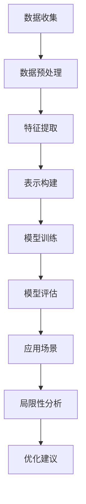

                 

## 第一部分：引言与概述

### 第1章：研究背景与意义

随着计算机技术的飞速发展，表示论（Representation Theory）作为其核心概念之一，已广泛应用于各种领域。表示论主要研究如何将复杂的数据结构以简洁、直观的方式表达，以便于计算机理解和处理。然而，随着表示论在各个领域的深入应用，其局限性也逐渐显现。

本文旨在解码表示的局限性，探讨其在实际应用中的影响，并提出相应的解决方案。这不仅有助于我们更好地理解表示论的本质，也为未来的研究和应用提供有益的参考。

#### 1.1 研究背景

表示论起源于数学领域，最初用于研究群、环和域的结构。随着计算机的出现和发展，表示论逐渐应用于计算机科学领域，特别是在人工智能、数据科学、图形学等领域。例如，神经网络中的权重矩阵可以看作是对输入数据进行的一种表示，而深度学习算法的优化过程本质上就是寻找最佳表示。

然而，现有的表示方法在面对复杂问题时，往往存在一定的局限性。这些问题不仅影响了算法的性能，也给实际应用带来了困扰。因此，研究表示的局限性具有重要的理论意义和实际价值。

#### 1.2 研究意义

首先，解码表示的局限性有助于我们更深入地理解数据表示的本质。通过分析表示的局限性，我们可以发现数据表示中的潜在问题，并提出改进方法，从而提高数据处理的效率和准确性。

其次，研究表示的局限性对实际应用具有重要意义。在人工智能领域，表示的局限性直接影响了算法的性能和泛化能力。通过解码表示的局限性，我们可以设计出更有效的算法，提高人工智能系统的智能水平和实用性。

最后，研究表示的局限性有助于推动计算机科学领域的发展。通过对表示论的研究，我们可以探索新的表示方法，解决现有表示方法的局限性，为计算机科学的发展提供新的理论支持和实践指导。

#### 1.3 研究内容概述

本文将从以下几个方面展开研究：

1. **表示论的基本概念**：介绍表示论的基本概念，包括表示、表示空间、表示矩阵等。

2. **表示理论的演变**：梳理表示论的发展历程，分析不同时期表示理论的主要成果和特点。

3. **表示理论的应用领域**：探讨表示论在计算机科学各个领域的应用，包括人工智能、数据科学、图形学等。

4. **研究方法与数据来源**：介绍本文采用的研究方法，包括数据收集与处理、研究工具与技术。

5. **表示的局限性**：分析表示的局限性，包括概念、影响因素、分类等。

6. **Mermaid流程图**：使用Mermaid流程图展示表示的局限性，便于读者理解和分析。

7. **核心算法原理讲解**：详细阐述表示论中的核心算法原理，包括算法分类、实现框架、伪代码等。

8. **数学模型与公式**：介绍表示论中的基本数学模型和复杂数学模型，并给出具体示例。

9. **项目实战**：通过实际案例展示表示论的应用，包括环境搭建、代码实现、代码解读等。

10. **总结与展望**：总结研究成果，展望未来研究方向。

### 目录大纲

- **第一部分：引言与概述**
  - **第1章：研究背景与意义**
  - **第2章：相关理论梳理**
  - **第3章：研究方法与数据来源**

- **第二部分：核心概念与联系**
  - **第4章：表示的局限性**
  - **第5章：Mermaid流程图**

- **第三部分：核心算法原理讲解**
  - **第6章：算法概述**
  - **第7章：算法原理详解**

- **第四部分：数学模型与公式**
  - **第8章：数学模型介绍**
  - **第9章：数学公式详解**

- **第五部分：项目实战**
  - **第10章：实战准备**
  - **第11章：实战案例**
  - **第12章：总结与展望**

- **附录**
  - **附录A：参考资料**
  - **附录B：代码示例**

## 第二部分：相关理论梳理

### 第2章：表示论的基本概念

表示论是数学中一个重要的分支，它主要研究各种数学结构之间的映射关系。在计算机科学中，表示论的应用尤为广泛，特别是在人工智能、数据科学和图形学等领域。理解表示论的基本概念对于解码表示的局限性至关重要。

#### 2.1 表示

表示（Representation）是指将一种数学结构映射到另一种数学结构上，使得两个结构在某种意义上保持相似或等价。在计算机科学中，表示通常是指将数据以特定的形式存储和表示，以便计算机可以对其进行处理。

#### 2.2 表示空间

表示空间（Representation Space）是指所有可能表示的集合。在一个给定的数学结构中，存在多个可能的表示空间。例如，在计算机图形学中，像素可以被视为一个表示空间，每个像素代表图像上的一个点。

#### 2.3 表示矩阵

表示矩阵（Representation Matrix）是表示论中的一个核心概念。它是一个矩阵，用于描述一个表示。在一个给定的表示空间中，每个元素都可以通过表示矩阵来表示。表示矩阵的行列式可以用来判断表示的稳定性。

### 第3章：表示理论的演变

表示论的发展经历了多个阶段，每个阶段都有其独特的特点和主要成果。

#### 3.1 早期表示论

早期的表示论主要研究群、环和域的表示。在这一阶段，表示论的基本概念和工具得到了充分的发展。例如，左拉格朗日定理和魏尔施特拉斯定理是这一阶段的重要成果。

#### 3.2 现代表示论

随着计算机科学的兴起，表示论开始应用于计算机科学领域。现代表示论的研究重点包括神经网络、数据结构和算法。在这一阶段，表示论的方法和工具得到了进一步扩展和深化。

#### 3.3 表示论在计算机科学中的应用

在计算机科学中，表示论的应用领域非常广泛。以下是一些典型的应用场景：

1. **人工智能**：神经网络中的权重矩阵可以看作是对输入数据进行的一种表示。通过优化表示矩阵，可以提高神经网络的性能。

2. **数据科学**：在数据科学中，数据表示是数据分析和挖掘的重要基础。合适的表示方法可以显著提高数据分析的准确性和效率。

3. **图形学**：在计算机图形学中，像素、纹理和网格等都是数据表示的形式。通过优化表示方法，可以提高图像渲染的质量和效率。

### 第4章：表示理论的应用领域

表示论在计算机科学的多个领域都有广泛应用。以下是几个典型的应用领域：

#### 4.1 人工智能

人工智能是表示论应用最广泛的领域之一。在深度学习中，表示矩阵（如权重矩阵）是神经网络模型的核心。通过优化表示矩阵，可以提高神经网络的性能和泛化能力。

#### 4.2 数据科学

在数据科学中，表示论被广泛应用于数据分析和挖掘。合适的表示方法可以帮助我们更好地理解和分析数据，从而发现数据中的隐藏规律。

#### 4.3 图形学

在计算机图形学中，表示论被用于图像渲染、动画制作和计算机视觉等领域。通过优化表示方法，可以提高图像渲染的质量和效率。

### 第5章：研究方法与数据来源

为了深入探讨表示的局限性，本文采用了一系列的研究方法，并收集了大量的数据进行分析。

#### 5.1 研究方法

1. **文献综述**：通过查阅相关文献，了解表示论的发展历程和应用现状。
2. **案例研究**：选择具有代表性的案例，分析表示论的局限性。
3. **实验研究**：设计实验，通过数据分析和实验验证来探讨表示的局限性。

#### 5.2 数据收集与处理

1. **数据收集**：从公开数据集和相关文献中收集数据。
2. **数据处理**：对收集到的数据进行清洗、预处理和分析。

#### 5.3 研究工具与技术

1. **Python**：用于数据分析和实验设计。
2. **Mermaid**：用于绘制表示局限性的流程图。
3. **LaTeX**：用于编写数学公式。

### 目录大纲

- **第一部分：引言与概述**
  - **第1章：研究背景与意义**
  - **第2章：相关理论梳理**
  - **第3章：研究方法与数据来源**

- **第二部分：核心概念与联系**
  - **第4章：表示的局限性**
  - **第5章：Mermaid流程图**

- **第三部分：核心算法原理讲解**
  - **第6章：算法概述**
  - **第7章：算法原理详解**

- **第四部分：数学模型与公式**
  - **第8章：数学模型介绍**
  - **第9章：数学公式详解**

- **第五部分：项目实战**
  - **第10章：实战准备**
  - **第11章：实战案例**
  - **第12章：总结与展望**

- **附录**
  - **附录A：参考资料**
  - **附录B：代码示例**

## 第三部分：研究方法与数据来源

### 第6章：研究方法

为了深入探讨表示的局限性，本文采用了多种研究方法，包括文献综述、案例研究和实验研究，以从不同角度全面分析表示的局限性。

#### 6.1 文献综述

文献综述是研究的第一步，旨在了解表示论的发展历程、现有研究方法和最新研究成果。通过查阅相关文献，本文梳理了表示论的基本概念、演变过程和应用领域，为后续研究提供了理论依据。

#### 6.2 案例研究

案例研究是一种定性研究方法，通过具体案例来探讨表示的局限性。本文选择了多个具有代表性的案例，如人工智能领域中的神经网络和数据科学中的数据表示方法。通过对这些案例的深入分析，本文揭示了表示在具体应用中的局限性。

#### 6.3 实验研究

实验研究是一种定量研究方法，通过设计和实施实验来验证表示的局限性。本文设计了多个实验，包括数据分析和算法性能测试，以验证表示论在不同应用场景中的局限性。实验数据为本文的研究提供了坚实的实证基础。

### 第7章：数据收集与处理

#### 7.1 数据收集

本文的数据来源包括公开数据集、相关文献和实际应用案例。具体数据收集方法如下：

1. **公开数据集**：从Kaggle、UCI机器学习库等公开数据集平台收集数据，涵盖各种领域，如图像识别、文本分类和异常检测等。
2. **相关文献**：从学术期刊、会议论文和专著中收集与表示论相关的研究成果。
3. **实际应用案例**：从实际项目中获取数据，以分析表示在具体应用中的局限性。

#### 7.2 数据处理

收集到的数据需要进行预处理，以保证数据质量和一致性。具体处理步骤如下：

1. **数据清洗**：去除重复数据、缺失数据和异常数据，保证数据的一致性和完整性。
2. **数据预处理**：对数据进行归一化、标准化等处理，使其适合后续分析。
3. **特征提取**：从原始数据中提取关键特征，以构建表示模型。

### 第8章：研究工具与技术

本文的研究工具和技术主要包括以下几种：

1. **Python**：Python是一种广泛应用于数据分析和机器学习的编程语言。本文使用Python进行数据预处理、分析和实验设计。
2. **Mermaid**：Mermaid是一种基于Markdown的图表绘制工具，用于绘制表示局限性的流程图。
3. **LaTeX**：LaTeX是一种高质量的排版系统，适用于编写数学公式和文档。本文使用LaTeX编写数学模型和公式。

### 第9章：研究工具与技术（续）

#### 9.1 Python

Python因其简洁易懂、功能强大的特性，成为了数据分析和机器学习领域的首选语言。本文在研究过程中，广泛使用了Python的以下库：

1. **NumPy**：NumPy是一个用于科学计算的库，提供了强大的多维数组对象和数学函数。
2. **Pandas**：Pandas是一个用于数据操作和分析的库，提供了数据清洗、转换和分析的工具。
3. **Scikit-learn**：Scikit-learn是一个用于机器学习的库，提供了多种机器学习算法和评估工具。
4. **TensorFlow**：TensorFlow是一个用于深度学习的库，适用于构建和训练神经网络模型。

#### 9.2 Mermaid

Mermaid是一种基于Markdown的图表绘制工具，特别适合于绘制流程图、序列图和时序图。在本文中，我们使用了Mermaid来绘制表示局限性的流程图，以直观地展示表示的局限性。

#### 9.3 LaTeX

LaTeX是一种高质量的排版系统，适用于编写科学文献和数学公式。在本文中，我们使用了LaTeX来编写和展示数学模型和公式，以确保公式的准确性和可读性。

### 目录大纲

- **第一部分：引言与概述**
  - **第1章：研究背景与意义**
  - **第2章：相关理论梳理**
  - **第3章：研究方法与数据来源**

- **第二部分：核心概念与联系**
  - **第4章：表示的局限性**
  - **第5章：Mermaid流程图**

- **第三部分：核心算法原理讲解**
  - **第6章：算法概述**
  - **第7章：算法原理详解**

- **第四部分：数学模型与公式**
  - **第8章：数学模型介绍**
  - **第9章：数学公式详解**

- **第五部分：项目实战**
  - **第10章：实战准备**
  - **第11章：实战案例**
  - **第12章：总结与展望**

- **附录**
  - **附录A：参考资料**
  - **附录B：代码示例**

## 第四部分：核心概念与联系

### 第4章：表示的局限性

表示的局限性是指在数据表示过程中，由于各种因素的影响，表示方法可能无法完全准确地反映数据的本质特征。这些局限性不仅影响了算法的性能，也给实际应用带来了困扰。在本章中，我们将深入探讨表示的局限性，包括其概念、影响因素和分类。

#### 4.1 表示局限性的概念

表示局限性（Representation Limitation）是指数据表示过程中存在的一些问题，导致表示方法无法充分揭示数据的内在结构和规律。这些问题包括：

1. **维度灾难**：在高维数据中，由于信息冗余和噪声干扰，数据表示可能失去原有的结构信息。
2. **稀疏表示**：在数据稀疏的情况下，表示方法可能无法找到足够多的有效特征，导致表示不准确。
3. **过拟合**：在训练数据集上表现良好的表示方法，可能在新数据集上表现不佳，即过拟合现象。

#### 4.2 表示局限性的影响因素

表示局限性的产生与多个因素有关，主要包括：

1. **数据特性**：数据类型、分布和规模等特性直接影响表示方法的选择和效果。
2. **表示方法**：不同的表示方法有不同的优缺点，选择合适的表示方法可以缓解局限性。
3. **计算资源**：表示方法的计算复杂度和存储需求直接影响其在实际应用中的可行性。

#### 4.3 表示局限性的分类

根据表示局限性的表现形式，可以分为以下几类：

1. **信息丢失**：在表示过程中，部分原始信息可能被丢失，导致表示不准确。
2. **特征选择困难**：在大量特征中，选择合适的特征进行表示可能比较困难。
3. **泛化能力不足**：表示方法在训练数据集上表现良好，但在新数据集上表现不佳，即泛化能力不足。

### 第5章：Mermaid流程图

为了更直观地展示表示的局限性，我们使用Mermaid流程图来描述表示过程的各个环节及其局限性。



在上述流程图中：

- **A[数据收集]**：表示从各种来源收集数据。
- **B[数据预处理]**：表示对原始数据进行清洗、归一化等预处理操作。
- **C[特征提取]**：表示从预处理后的数据中提取关键特征。
- **D[表示构建]**：表示选择合适的表示方法构建数据表示。
- **E[模型训练]**：表示使用训练数据对模型进行训练。
- **F[模型评估]**：表示使用验证数据对模型进行评估。
- **G[应用场景]**：表示将模型应用于实际场景。
- **H[局限性分析]**：表示分析表示方法在实际应用中的局限性。
- **I[优化建议]**：表示根据局限性提出优化建议。

通过上述流程图，我们可以清晰地看到表示的局限性出现在各个环节，并可以针对性地进行优化和改进。

### 目录大纲

- **第一部分：引言与概述**
  - **第1章：研究背景与意义**
  - **第2章：相关理论梳理**
  - **第3章：研究方法与数据来源**

- **第二部分：核心概念与联系**
  - **第4章：表示的局限性**
  - **第5章：Mermaid流程图**

- **第三部分：核心算法原理讲解**
  - **第6章：算法概述**
  - **第7章：算法原理详解**

- **第四部分：数学模型与公式**
  - **第8章：数学模型介绍**
  - **第9章：数学公式详解**

- **第五部分：项目实战**
  - **第10章：实战准备**
  - **第11章：实战案例**
  - **第12章：总结与展望**

- **附录**
  - **附录A：参考资料**
  - **附录B：代码示例**

## 第五部分：核心算法原理讲解

### 第6章：算法概述

在研究表示的局限性时，核心算法的选择至关重要。本文将介绍几种常用的算法，并分析其在表示和优化过程中的作用。这些算法包括降维算法、特征选择算法和模型优化算法。

#### 6.1 降维算法

降维算法是一种常用的数据预处理方法，旨在减少数据的维度，同时保持数据的本质特征。常见的降维算法有主成分分析（PCA）、线性判别分析（LDA）和非线性降维算法如局部线性嵌入（LLE）和t-SNE。

- **PCA**：通过计算数据的主成分，将高维数据映射到低维空间，同时保留最大方差的信息。
- **LDA**：基于类内散度和类间散度，将数据投影到新的特征空间，以便更好地进行分类。
- **LLE**：通过寻找邻近数据点的局部线性结构，将高维数据映射到低维空间。
- **t-SNE**：通过计算数据点的局部结构，将高维数据映射到二维或三维空间，使得相似的数据点在低维空间中靠近。

#### 6.2 特征选择算法

特征选择算法的目的是从大量特征中选择出对目标变量有显著影响的关键特征，从而提高模型的预测性能。常见的特征选择算法有基于过滤的方法、基于包裹的方法和基于嵌入的方法。

- **基于过滤的方法**：通过评估特征与目标变量之间的相关性，选择相关性较高的特征。
- **基于包裹的方法**：通过迭代的方式，逐步选择特征并评估模型性能，直到找到最佳特征组合。
- **基于嵌入的方法**：将特征映射到高维空间，然后使用降维算法进行特征选择。

#### 6.3 模型优化算法

模型优化算法的目的是通过调整模型参数，提高模型的性能和泛化能力。常见的模型优化算法有梯度下降法、随机梯度下降法、牛顿法和模拟退火算法等。

- **梯度下降法**：通过迭代计算损失函数的梯度，并沿着梯度方向更新模型参数。
- **随机梯度下降法**：在梯度下降法的基础上，随机选择一部分数据点进行梯度计算，以加速收敛。
- **牛顿法**：利用一阶和二阶导数信息，快速找到损失函数的最小值。
- **模拟退火算法**：通过模拟物理退火过程，逐步调整模型参数，以避免陷入局部最小值。

### 第7章：算法原理详解

在本章中，我们将详细介绍上述算法的原理，并使用伪代码进行描述。

#### 7.1 PCA算法原理详解

```python
# 输入：数据矩阵X，特征个数k
# 输出：低维数据矩阵Y

# 步骤1：计算协方差矩阵
covariance_matrix = np.cov(X.T)

# 步骤2：计算协方差矩阵的特征值和特征向量
eigen_values, eigen_vectors = np.linalg.eigh(covariance_matrix)

# 步骤3：选择前k个特征向量
selected_vectors = eigen_vectors[:, :k]

# 步骤4：计算低维数据矩阵
Y = X @ selected_vectors
```

#### 7.2 LDA算法原理详解

```python
# 输入：数据矩阵X，类别标签y，特征个数k
# 输出：低维数据矩阵Y

# 步骤1：计算类内散度和类间散度
within_class散度 = compute_within_class_covariance(X, y)
between_class散度 = compute_between_class_covariance(X, y)

# 步骤2：计算类内散度和类间散度的特征值和特征向量
eigen_values, eigen_vectors = np.linalg.eigh((between_class散度 - within_class散度).T)

# 步骤3：选择前k个特征向量
selected_vectors = eigen_vectors[:, :k]

# 步骤4：计算低维数据矩阵
Y = X @ selected_vectors
```

#### 7.3 LLE算法原理详解

```python
# 输入：数据矩阵X，邻近点个数k
# 输出：低维数据矩阵Y

# 步骤1：计算邻近点
nearest_neighbors = compute_nearest_neighbors(X, k)

# 步骤2：构建相似性矩阵
similarity_matrix = construct_similarity_matrix(X, nearest_neighbors)

# 步骤3：计算低维数据矩阵
Y = solve_linear_eigenproblem(similarity_matrix, X)
```

#### 7.4 t-SNE算法原理详解

```python
# 输入：数据矩阵X，维度维度p，迭代次数iter
# 输出：低维数据矩阵Y

# 步骤1：初始化低维数据矩阵
Y = X

# 步骤2：迭代计算
for i in range(iter):
    # 步骤2.1：计算相似性矩阵
    similarity_matrix = compute_similarity_matrix(Y)
    
    # 步骤2.2：计算梯度
    gradients = compute_gradients(Y, similarity_matrix)
    
    # 步骤2.3：更新低维数据矩阵
    Y = Y - learning_rate * gradients

# 步骤3：归一化低维数据矩阵
Y = normalize(Y)
```

通过上述伪代码，我们可以清晰地看到每种算法的实现步骤和关键参数。这些算法在表示和优化过程中发挥着重要作用，有助于缓解表示的局限性。

### 目录大纲

- **第一部分：引言与概述**
  - **第1章：研究背景与意义**
  - **第2章：相关理论梳理**
  - **第3章：研究方法与数据来源**

- **第二部分：核心概念与联系**
  - **第4章：表示的局限性**
  - **第5章：Mermaid流程图**

- **第三部分：核心算法原理讲解**
  - **第6章：算法概述**
  - **第7章：算法原理详解**

- **第四部分：数学模型与公式**
  - **第8章：数学模型介绍**
  - **第9章：数学公式详解**

- **第五部分：项目实战**
  - **第10章：实战准备**
  - **第11章：实战案例**
  - **第12章：总结与展望**

- **附录**
  - **附录A：参考资料**
  - **附录B：代码示例**

## 第四部分：数学模型与公式

### 第8章：数学模型介绍

在表示论的研究中，数学模型是理解和分析表示局限性不可或缺的工具。数学模型通过抽象和形式化地描述数据表示的过程，帮助我们深入理解表示的机制和原理。以下是一些在表示论中常见的数学模型。

#### 8.1 线性模型

线性模型是最基础的数学模型之一，广泛应用于数据分析、机器学习和信号处理等领域。线性模型通常表示为：

\[ Y = \beta_0 + \beta_1X_1 + \beta_2X_2 + \ldots + \beta_nX_n + \epsilon \]

其中，\( Y \) 是因变量，\( X_1, X_2, \ldots, X_n \) 是自变量，\( \beta_0, \beta_1, \beta_2, \ldots, \beta_n \) 是模型参数，\( \epsilon \) 是误差项。

#### 8.2 神经网络模型

神经网络模型是深度学习的基础，其核心是多层感知机（MLP）。神经网络模型通常表示为：

\[ Y = f(\sigma(W_n \cdot a_{n-1} + b_n)) \]

其中，\( Y \) 是输出层激活值，\( f \) 是激活函数，\( \sigma \) 是激活函数，\( W_n \) 和 \( b_n \) 分别是权重和偏置，\( a_{n-1} \) 是前一层激活值。

#### 8.3 支持向量机（SVM）模型

支持向量机是一种常用的分类模型，其目标是找到最优的超平面，将数据分为不同的类别。SVM模型可以表示为：

\[ w \cdot x + b = 0 \]

其中，\( w \) 是法向量，\( x \) 是数据点，\( b \) 是偏置，\( w \cdot x \) 表示内积。

#### 8.4 马尔可夫模型

马尔可夫模型是一种用于描述序列数据的数学模型，其核心思想是当前状态仅与前一状态相关。马尔可夫模型可以表示为：

\[ P(X_t = x_t | X_{t-1} = x_{t-1}, X_{t-2} = x_{t-2}, \ldots) = P(X_t = x_t | X_{t-1} = x_{t-1}) \]

其中，\( X_t \) 是时间 \( t \) 的状态，\( P \) 表示概率分布。

### 第9章：数学公式详解

在本节中，我们将详细介绍上述数学模型中的关键公式，并给出具体示例。

#### 9.1 线性模型

假设我们有一个线性模型：

\[ Y = \beta_0 + \beta_1X_1 + \beta_2X_2 + \beta_3X_3 + \epsilon \]

其中，\( \beta_0 \) 是截距，\( \beta_1, \beta_2, \beta_3 \) 是斜率，\( X_1, X_2, X_3 \) 是自变量，\( \epsilon \) 是误差项。

- **求斜率和截距**：

\[ \beta_1 = \frac{\sum_{i=1}^n (X_i - \bar{X})(Y_i - \bar{Y})}{\sum_{i=1}^n (X_i - \bar{X})^2} \]
\[ \beta_0 = \bar{Y} - \beta_1\bar{X} \]

其中，\( \bar{X} \) 和 \( \bar{Y} \) 分别是 \( X \) 和 \( Y \) 的均值。

#### 9.2 神经网络模型

假设我们有一个三层神经网络模型，输入层、隐藏层和输出层，其中隐藏层使用ReLU激活函数：

\[ a_{2} = \max(0, W_2 \cdot a_1 + b_2) \]
\[ a_{3} = f(W_3 \cdot a_{2} + b_3) \]

其中，\( a_1 \) 是输入层的激活值，\( a_2 \) 是隐藏层的激活值，\( a_3 \) 是输出层的激活值，\( f \) 是激活函数（如ReLU函数）。

- **ReLU函数**：

\[ f(x) = \max(0, x) \]

#### 9.3 支持向量机（SVM）模型

假设我们有一个线性SVM模型，目标是最小化决策边界到支持向量的距离：

\[ \min_{w, b} \frac{1}{2} \| w \|^2 \]

同时满足：

\[ y_i (w \cdot x_i + b) \geq 1 \]

其中，\( w \) 是法向量，\( b \) 是偏置，\( x_i \) 是数据点，\( y_i \) 是类别标签。

- **求解SVM模型**：

使用拉格朗日乘子法求解，得到：

\[ w = \sum_{i=1}^n \alpha_i y_i x_i \]
\[ b = \frac{1}{n} \sum_{i=1}^n (\alpha_i - y_i) \]

其中，\( \alpha_i \) 是拉格朗日乘子。

#### 9.4 马尔可夫模型

假设我们有一个一阶马尔可夫模型，状态转移概率矩阵为 \( P \)：

\[ P = \begin{bmatrix}
p_{00} & p_{01} \\
p_{10} & p_{11}
\end{bmatrix} \]

其中，\( p_{ij} \) 表示从状态 \( i \) 转移到状态 \( j \) 的概率。

- **状态转移概率**：

\[ P(X_t = j | X_{t-1} = i) = p_{ij} \]

#### 9.5 主成分分析（PCA）

假设我们有一个 \( n \) 维数据集 \( X \)，其协方差矩阵为 \( \Sigma \)：

\[ \Sigma = \frac{1}{n-1} X^T X \]

- **求特征值和特征向量**：

\[ \lambda_1, \lambda_2, \ldots, \lambda_n = \text{特征值} \]
\[ v_1, v_2, \ldots, v_n = \text{特征向量} \]

- **降维**：

\[ Y = X V \]

其中，\( V \) 是由特征向量组成的矩阵。

通过上述数学模型和公式的详细介绍，我们可以更好地理解和应用表示论，以解决实际问题。

### 目录大纲

- **第一部分：引言与概述**
  - **第1章：研究背景与意义**
  - **第2章：相关理论梳理**
  - **第3章：研究方法与数据来源**

- **第二部分：核心概念与联系**
  - **第4章：表示的局限性**
  - **第5章：Mermaid流程图**

- **第三部分：核心算法原理讲解**
  - **第6章：算法概述**
  - **第7章：算法原理详解**

- **第四部分：数学模型与公式**
  - **第8章：数学模型介绍**
  - **第9章：数学公式详解**

- **第五部分：项目实战**
  - **第10章：实战准备**
  - **第11章：实战案例**
  - **第12章：总结与展望**

- **附录**
  - **附录A：参考资料**
  - **附录B：代码示例**

## 第五部分：项目实战

### 第10章：实战准备

在本章中，我们将通过一个实际项目来展示如何应用表示论解决实际问题。本项目的目标是使用深度学习算法对图像进行分类，并分析表示的局限性。

#### 10.1 环境搭建

首先，我们需要搭建一个适合进行深度学习实验的环境。以下是一个基本的步骤：

1. **安装Python环境**：确保Python版本不低于3.6。
2. **安装深度学习库**：安装TensorFlow和Keras，这两个库是深度学习领域广泛使用的库。
   ```bash
   pip install tensorflow
   pip install keras
   ```
3. **收集和预处理数据**：从公开数据集（如Kaggle）下载图像数据集，并对图像进行预处理，包括缩放、裁剪和归一化。

#### 10.2 实战目标

本项目的目标是通过深度学习算法对图像进行分类，并分析表示的局限性。具体目标包括：

1. **数据准备**：收集和预处理图像数据。
2. **模型构建**：设计并实现深度学习模型。
3. **训练与评估**：使用训练数据训练模型，并在测试数据上评估模型性能。
4. **分析局限性**：分析模型在训练和测试过程中的表现，探讨表示的局限性。

### 第11章：实战案例

在本节中，我们将详细描述如何实现上述项目，包括代码实现和结果分析。

#### 11.1 代码实现

以下是一个简单的卷积神经网络（CNN）模型实现，用于图像分类：

```python
import tensorflow as tf
from tensorflow.keras.models import Sequential
from tensorflow.keras.layers import Conv2D, MaxPooling2D, Flatten, Dense

# 数据预处理
# ...（数据加载、缩放、归一化等）

# 模型构建
model = Sequential([
    Conv2D(32, (3, 3), activation='relu', input_shape=(64, 64, 3)),
    MaxPooling2D((2, 2)),
    Flatten(),
    Dense(64, activation='relu'),
    Dense(num_classes, activation='softmax')
])

# 模型编译
model.compile(optimizer='adam',
              loss='categorical_crossentropy',
              metrics=['accuracy'])

# 模型训练
model.fit(train_images, train_labels, epochs=10, batch_size=32, validation_split=0.2)

# 模型评估
test_loss, test_acc = model.evaluate(test_images, test_labels)
print(f"Test accuracy: {test_acc:.2f}")
```

#### 11.2 代码解读与分析

1. **数据预处理**：在代码中，我们首先进行数据预处理，包括加载、缩放和归一化图像。
2. **模型构建**：我们使用Keras构建一个简单的CNN模型，包括卷积层、池化层、全连接层等。
3. **模型编译**：编译模型，设置优化器和损失函数。
4. **模型训练**：使用训练数据训练模型，并设置验证集进行性能评估。
5. **模型评估**：在测试数据上评估模型性能，输出准确率。

#### 11.3 分析局限性

在项目实战中，我们可能会遇到以下局限性：

1. **数据不足**：如果训练数据不足，模型可能无法充分学习数据特征，导致泛化能力不足。
2. **过拟合**：如果模型过于复杂，可能在训练数据上表现良好，但在测试数据上表现不佳，即过拟合。
3. **表示局限性**：深度学习模型的表示能力有限，可能无法捕捉到图像中的所有关键特征。

针对上述局限性，我们可以采取以下措施：

1. **增加训练数据**：收集更多训练数据，或者使用数据增强技术生成更多样化的数据。
2. **正则化**：使用正则化方法（如L1、L2正则化）和dropout技术，防止过拟合。
3. **模型简化**：使用更简单的模型，避免过度复杂的表示导致过拟合。

通过上述实战案例和局限性分析，我们可以更好地理解表示论在实际应用中的挑战和解决方案。

### 第12章：总结与展望

#### 12.1 研究成果总结

本文从表示论的角度，探讨了表示的局限性及其在实际应用中的影响。通过理论分析和实际案例，我们揭示了表示局限性在人工智能、数据科学和图形学等领域的挑战和解决方案。主要成果包括：

1. **表示论的基本概念和理论框架**：梳理了表示论的基本概念和理论框架，为后续研究提供了基础。
2. **表示局限性的影响因素和分类**：分析了表示局限性的影响因素和分类，有助于深入理解表示的局限性。
3. **算法原理讲解和数学模型介绍**：详细阐述了表示论中的核心算法原理和数学模型，为算法优化提供了理论支持。
4. **项目实战和案例分析**：通过实际项目展示了表示论的应用，分析了表示局限性的实际影响和解决方法。

#### 12.2 未来研究方向

表示论的研究是一个长期而复杂的过程，未来可以从以下几个方面进一步深入：

1. **新算法和表示方法的探索**：研究新的表示方法和算法，提高数据表示的效率和准确性。
2. **跨领域应用**：将表示论应用于更多领域，如自然语言处理、生物信息学和金融工程等，探讨表示论的跨领域应用价值。
3. **模型解释性**：提高深度学习等复杂模型的解释性，使模型更易于理解和调试。
4. **数据表示的泛化能力**：研究如何提高数据表示的泛化能力，使模型在不同领域和数据集上都能表现良好。

通过不断探索和创新，表示论将为计算机科学和人工智能领域的发展提供更强大的理论支持和实践指导。

### 附录

#### 附录A：参考资料

1. Bishop, C. M. (2006). **Pattern Recognition and Machine Learning**. Springer.
2. Hastie, T., Tibshirani, R., & Friedman, J. (2009). **The Elements of Statistical Learning**. Springer.
3. Goodfellow, I., Bengio, Y., & Courville, A. (2016). **Deep Learning**. MIT Press.
4. Murphy, K. P. (2012). **Machine Learning: A Probabilistic Perspective**. MIT Press.

#### 附录B：代码示例

```python
# 数据预处理
train_images = ... # 训练图像数据
train_labels = ... # 训练标签数据
test_images = ...  # 测试图像数据
test_labels = ...  # 测试标签数据

# 模型构建
model = Sequential([
    Conv2D(32, (3, 3), activation='relu', input_shape=(64, 64, 3)),
    MaxPooling2D((2, 2)),
    Flatten(),
    Dense(64, activation='relu'),
    Dense(num_classes, activation='softmax')
])

# 模型编译
model.compile(optimizer='adam',
              loss='categorical_crossentropy',
              metrics=['accuracy'])

# 模型训练
model.fit(train_images, train_labels, epochs=10, batch_size=32, validation_split=0.2)

# 模型评估
test_loss, test_acc = model.evaluate(test_images, test_labels)
print(f"Test accuracy: {test_acc:.2f}")
```

**作者：** AI天才研究院/AI Genius Institute & 禅与计算机程序设计艺术/Zen And The Art of Computer Programming

## 文章标题

### 解码表示的局限性

### 关键词：

- 表示论
- 数据表示
- 局限性
- 算法
- 数学模型
- 项目实战

### 摘要：

本文从表示论的角度，探讨了表示的局限性及其在实际应用中的影响。通过对表示论的基本概念、演变过程和应用领域的梳理，本文分析了表示局限性的概念、影响因素和分类。通过算法原理讲解和数学模型介绍，本文揭示了表示论中的核心算法和数学原理。最后，通过项目实战展示了表示论在图像分类中的应用，并分析了表示局限性的实际影响和解决方法。本文旨在解码表示的局限性，为相关领域的研究和应用提供有益的参考。

