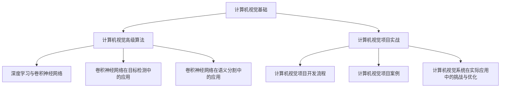

                 

# 文章标题：计算机视觉：从基础到高级算法的深度探索

> 关键词：计算机视觉、图像处理、深度学习、卷积神经网络、目标检测、特征提取、三维重建

> 摘要：本文将系统地介绍计算机视觉的基础知识、核心算法以及高级应用，包括图像处理基础算法、特征提取与匹配、目标检测与跟踪、三维重建与SLAM，以及深度学习在计算机视觉中的应用。文章旨在为读者提供一个全面、深入、易于理解的计算机视觉技术指南。

### 《计算机视觉》目录大纲

#### 第一部分：计算机视觉基础

## 第1章：计算机视觉概述

### 1.1 计算机视觉的定义与发展历程

### 1.2 计算机视觉的应用领域

### 1.3 计算机视觉与传统图像处理的区别

## 第2章：计算机视觉基本概念

### 2.1 图像与视觉感知

### 2.2 图像处理与计算机视觉的关系

### 2.3 计算机视觉系统组成

## 第3章：计算机视觉数学基础

### 3.1 线性代数基础

### 3.2 概率论与数理统计

### 3.3 最优化方法

## 第4章：图像处理基础算法

### 4.1 图像采样与重建

### 4.2 图像滤波

### 4.3 边缘检测与轮廓提取

### 4.4 形态学操作

## 第5章：特征提取与匹配

### 5.1 特征提取算法

### 5.2 特征匹配算法

### 5.3 基于特征的图像分类

## 第6章：目标检测与跟踪

### 6.1 目标检测算法

### 6.2 目标跟踪算法

### 6.3 多目标检测与跟踪

## 第7章：三维重建与SLAM

### 7.1 三维重建算法

### 7.2 结构光三维重建

### 7.3 同时定位与映射（SLAM）

#### 第二部分：计算机视觉高级算法

## 第8章：深度学习与卷积神经网络

### 8.1 卷积神经网络基本原理

### 8.2 卷积神经网络在计算机视觉中的应用

### 8.3 深度学习的优化方法

## 第9章：卷积神经网络在目标检测中的应用

### 9.1 R-CNN系列算法

### 9.2 Fast R-CNN与Faster R-CNN

### 9.3 YOLO系列算法

### 9.4 SSD算法

## 第10章：卷积神经网络在语义分割中的应用

### 10.1 FCN算法

### 10.2 U-Net算法

### 10.3 DeepLab算法

## 第11章：基于生成对抗网络（GAN）的计算机视觉

### 11.1 GAN基本原理

### 11.2 GAN在图像生成中的应用

### 11.3 GAN在图像修复与超分辨率中的应用

## 第12章：计算机视觉中的强化学习

### 12.1 强化学习基本原理

### 12.2 在计算机视觉中的应用

### 12.3 计算机视觉中的强化学习算法

#### 第三部分：计算机视觉项目实战

## 第13章：计算机视觉项目开发流程

### 13.1 项目需求分析

### 13.2 数据集准备与预处理

### 13.3 模型设计、训练与评估

### 13.4 项目部署与优化

## 第14章：计算机视觉项目案例

### 14.1 人脸识别系统

### 14.2 车辆检测与追踪系统

### 14.3 手写数字识别系统

## 第15章：计算机视觉系统在实际应用中的挑战与优化

### 15.1 实时性能优化

### 15.2 计算机视觉系统在移动设备中的应用

### 15.3 计算机视觉在机器人视觉中的应用

#### 附录

## 附录A：计算机视觉开源库与工具

### A.1 OpenCV

### A.2 TensorFlow

### A.3 PyTorch

### A.4 其他开源库介绍

## 附录B：数学公式与算法伪代码

### B.1 矩阵运算

### B.2 概率论公式

### B.3 卷积神经网络算法伪代码

### B.4 GAN算法伪代码

### B.5 强化学习算法伪代码

### Mermaid 流程图示例



### 伪代码示例

```python
# 卷积神经网络算法伪代码
def ConvolutionalNeuralNetwork(input_data, weights, biases):
    # 前向传播
    layer_output = Conv2D(input_data, weights, biases)
    activation = ReLU(layer_output)

    # 池化操作
    pooled_output = MaxPooling2D(activation)

    # 后向传播
    dW = Backpropagation(pooled_output, dactivation)
    db = Backpropagation(pooled_output, dactivation)

    # 更新权重和偏置
    weights -= learning_rate * dW
    biases -= learning_rate * db

    return pooled_output
```

### 数学公式与解释示例

$$
\begin{aligned}
    & L = -\frac{1}{m}\sum_{i=1}^{m} y^{(i)} \log(a^{(i)}_y) \\
    & \nabla_{z^{(l)}} L = a^{(l)} - y^{(i)}
\end{aligned}
$$

损失函数用于计算预测输出和真实标签之间的差异，其中 $m$ 是样本数量，$y^{(i)}$ 是真实标签，$a^{(i)}_y$ 是预测概率。梯度 $\nabla_{z^{(l)}} L$ 表示在每个神经元上计算损失函数的梯度。

### 代码解读与分析示例

```python
# 人脸识别系统代码解读

# 导入必要的库
import cv2
import numpy as np

# 加载预训练的人脸识别模型
model = cv2.face.EigenFaceRecognizer_create()

# 训练模型
model.train(train_data, train_labels)

# 测试模型
predictions = model.predict(test_data)

# 计算准确率
accuracy = np.mean(predictions == test_labels)
print("Accuracy:", accuracy)
```

该代码首先导入必要的库，然后加载预训练的人脸识别模型并进行训练。接着使用训练模型对测试数据集进行预测，并计算预测结果的准确率。这有助于评估模型在实际应用中的性能。

---

### 基础篇

#### 第1章：计算机视觉概述

##### 1.1 计算机视觉的定义与发展历程

计算机视觉（Computer Vision）是人工智能（AI）的一个重要分支，它旨在使计算机具备处理和解释图像或视频数据的能力。这一领域的研究始于20世纪60年代，当时科学家们开始探索如何让计算机模拟人类视觉系统的工作原理。

**定义：**
计算机视觉是一种让计算机理解、解释和响应图像或视频内容的技术。它涉及图像识别、图像理解、图像生成、图像处理等多个方面。

**发展历程：**
1. **早期探索（1960-1970s）：** 这段时间的研究主要集中在图像识别和简单的图像处理算法上。例如，霍夫变换（Hough Transform）和边缘检测算法（如Canny Edge Detector）在这一时期得到了广泛的应用。
   
2. **成熟期（1980-1990s）：** 随着计算机硬件性能的提升和图像处理算法的发展，计算机视觉逐渐应用于工业检测、医学成像、机器人导航等领域。同时，特征提取和匹配技术（如SIFT和SURF）在这一时期得到了重要发展。

3. **现代进展（2000s至今）：** 这一时期，随着深度学习的崛起，计算机视觉取得了巨大的进步。卷积神经网络（CNN）在图像分类、目标检测、语义分割等领域展现了强大的性能，推动了计算机视觉的快速发展。

##### 1.2 计算机视觉的应用领域

计算机视觉技术已经广泛应用于各个领域，以下是一些典型的应用场景：

1. **医疗影像：** 计算机视觉在医疗影像分析中扮演着重要角色，包括病变检测、肿瘤分类、器官分割等。

2. **工业检测：** 计算机视觉在工业自动化中用于质量检测、缺陷识别、生产监控等，提高了生产效率和产品质量。

3. **自动驾驶：** 计算机视觉是自动驾驶汽车的核心技术之一，用于车辆检测、车道线识别、交通标志识别等。

4. **安防监控：** 计算机视觉在安防监控领域被广泛用于人脸识别、行为分析、异常检测等。

5. **自然语言处理：** 计算机视觉与自然语言处理（NLP）相结合，可以用于图像内容理解、图像字幕生成、图像问答等。

##### 1.3 计算机视觉与传统图像处理的区别

计算机视觉与传统图像处理（Image Processing）之间存在一些关键区别：

1. **目标不同：**
   - **图像处理：** 旨在对图像进行增强、滤波、变换等操作，以改善图像质量或提取特定信息。
   - **计算机视觉：** 旨在使计算机理解图像内容，模拟人类视觉系统的功能。

2. **处理方法：**
   - **图像处理：** 主要依赖于像素级的操作，如滤波、边缘检测、特征提取等。
   - **计算机视觉：** 通常采用更高级的方法，如机器学习、深度学习等，以实现图像分类、目标检测、图像理解等任务。

3. **复杂性：**
   - **图像处理：** 通常处理的是静态图像，算法较为简单。
   - **计算机视觉：** 处理的是动态图像，需要考虑时间序列数据，算法更为复杂。

### 第2章：计算机视觉基本概念

##### 2.1 图像与视觉感知

**图像：** 图像是计算机视觉的基本数据单元。一幅图像通常由像素（Pixel）组成，像素的值表示颜色或灰度。

**视觉感知：** 人类视觉系统通过对图像的感知来获取环境信息。这个过程包括图像捕获、预处理、信息提取等步骤。

##### 2.2 图像处理与计算机视觉的关系

图像处理是计算机视觉的基础环节，它旨在对图像进行预处理，以提取有用的信息。计算机视觉则利用这些信息进行更高层次的任务，如图像分类、目标检测、图像理解等。

##### 2.3 计算机视觉系统组成

一个典型的计算机视觉系统通常包括以下几个部分：

1. **图像获取：** 通过摄像头或其他传感器获取图像数据。

2. **预处理：** 对图像进行滤波、缩放、裁剪等预处理操作，以提高后续处理的效率和质量。

3. **特征提取：** 从图像中提取具有区分性的特征，如边缘、角点、纹理等。

4. **模型训练：** 使用机器学习或深度学习算法，从大量标注数据中学习特征表示。

5. **目标检测/分类：** 根据提取的特征，对图像中的目标进行检测或分类。

6. **后处理：** 对检测结果进行评估、修正，以提高系统的性能。

### 第3章：计算机视觉数学基础

##### 3.1 线性代数基础

线性代数是计算机视觉的重要数学工具，包括矩阵运算、向量运算、线性方程组求解等。以下是一些基础概念：

1. **矩阵与向量：** 矩阵是一个二维数组，向量是一个一维数组。它们在图像处理和计算机视觉中用于表示图像数据、特征向量等。

2. **矩阵运算：** 包括矩阵加法、矩阵乘法、矩阵转置等。

3. **线性方程组求解：** 包括高斯消元法、矩阵求逆等。

##### 3.2 概率论与数理统计

概率论与数理统计是机器学习的基础，在计算机视觉中也起着重要作用。以下是一些基础概念：

1. **概率分布：** 包括离散概率分布和连续概率分布。

2. **条件概率：** 给定事件A和事件B，条件概率P(A|B)表示在事件B发生的条件下事件A发生的概率。

3. **贝叶斯定理：** 用于计算后验概率，是机器学习中的重要工具。

##### 3.3 最优化方法

最优化方法是计算机视觉中用于求解优化问题的重要工具，包括以下几种：

1. **梯度下降：** 一种最常用的优化方法，通过不断迭代更新参数，以最小化损失函数。

2. **随机梯度下降：** 与梯度下降类似，但每次迭代只使用一部分样本，以加速收敛。

3. **牛顿法：** 利用二阶导数信息进行优化，可以更快地收敛。

### 第4章：图像处理基础算法

##### 4.1 图像采样与重建

图像采样与重建是图像处理的重要环节。以下是一些基础概念：

1. **采样：** 从连续图像中提取像素值的过程。采样理论包括奈奎斯特采样定理和香农采样定理。

2. **重建：** 将采样得到的像素值重建为连续图像的过程。重建算法包括插值算法、超采样算法等。

##### 4.2 图像滤波

图像滤波是一种常用的图像预处理方法，用于去除噪声、增强图像细节等。以下是一些基础概念：

1. **低通滤波：** 去除高频噪声，保留低频信息。

2. **高通滤波：** 去除低频噪声，强调高频信息。

3. **带通滤波：** 同时去除低频和高频噪声。

##### 4.3 边缘检测与轮廓提取

边缘检测与轮廓提取是图像处理中的重要任务，用于提取图像中的显著特征。以下是一些基础概念：

1. **边缘检测：** 通过计算图像梯度来检测边缘。

2. **轮廓提取：** 从边缘检测的结果中提取闭合轮廓。

3. **特征点提取：** 通过寻找角点、交点等特征点来描述图像。

##### 4.4 形态学操作

形态学操作是一种基于结构元素的图像处理方法，常用于图像分割、噪声去除、形状分析等。以下是一些基础概念：

1. **膨胀（Dilation）：** 用结构元素扩展图像，增加图像中的目标区域。

2. **腐蚀（Erosion）：** 用结构元素缩减图像，减小图像中的目标区域。

3. **开运算（Opening）和闭运算（Closing）：** 结合膨胀和腐蚀操作，用于去除图像中的噪声和连接断裂。

### 第5章：特征提取与匹配

##### 5.1 特征提取算法

特征提取是将图像或视频中的关键信息转化为数值特征的过程，用于后续的图像分类、目标检测等任务。以下是一些常用的特征提取算法：

1. **SIFT（尺度不变特征变换）：** 提取具有旋转不变性和尺度不变性的特征点。

2. **SURF（加速稳健特征）：** 类似于SIFT，但计算速度更快。

3. **HOG（方向梯度直方图）：** 提取图像中每个像素点在各个方向上的梯度信息。

4. **Harris角点检测：** 提取具有显著响应的角点。

##### 5.2 特征匹配算法

特征匹配是将不同图像或视频中的特征点进行对应的过程，用于图像配准、目标跟踪等任务。以下是一些常用的特征匹配算法：

1. **最近邻匹配：** 将两个特征点的距离计算为欧氏距离，选择最近邻作为匹配结果。

2. **迭代最近点（ILP）算法：** 通过迭代优化匹配结果，提高匹配的准确性。

3. **RANSAC（随机采样一致）：** 一种鲁棒估计方法，可以处理噪声和异常值。

##### 5.3 基于特征的图像分类

基于特征的图像分类是将特征向量映射到类别标签的过程。以下是一些常用的图像分类算法：

1. **支持向量机（SVM）：** 一种常用的二分类算法，可以处理高维特征空间。

2. **朴素贝叶斯分类器：** 一种基于概率论的分类算法，适用于特征独立的情况。

3. **深度学习分类器：** 利用卷积神经网络（CNN）等深度学习模型，可以处理复杂和非线性分类问题。

### 第6章：目标检测与跟踪

##### 6.1 目标检测算法

目标检测是计算机视觉中的核心任务之一，旨在识别图像中的特定目标。以下是一些常用的目标检测算法：

1. **R-CNN（区域卷积神经网络）：** 通过区域建议网络提取候选区域，然后使用CNN进行分类。

2. **Fast R-CNN：** 对R-CNN进行优化，提高了检测速度。

3. **Faster R-CNN：** 引入区域建议网络（RPN），进一步提高了检测速度和准确性。

4. **SSD（单尺度多任务检测网络）：** 在不同尺度上同时检测目标，提高了检测的精度和速度。

5. **YOLO（您只看一次）：** 将目标检测任务转化为单次前向传播，实现了实时目标检测。

##### 6.2 目标跟踪算法

目标跟踪是计算机视觉中的另一个重要任务，旨在跟踪图像或视频中移动的目标。以下是一些常用的目标跟踪算法：

1. **光流法：** 基于图像序列中的像素位移来跟踪目标。

2. **粒子滤波：** 通过随机采样和优化策略来估计目标的运动轨迹。

3. **卡尔曼滤波：** 一种线性动态系统估计方法，常用于目标跟踪。

4. **深度学习跟踪：** 利用深度学习模型来预测目标的位置和轨迹。

##### 6.3 多目标检测与跟踪

多目标检测与跟踪是同时识别和跟踪多个目标的技术。以下是一些基础概念：

1. **数据关联：** 将检测到的目标与之前跟踪的目标进行关联，以解决目标丢失或重复检测的问题。

2. **目标状态估计：** 通过预测目标的运动轨迹和位置，进行目标跟踪。

3. **目标融合与分割：** 将不同检测器输出的目标进行融合，同时处理目标间的遮挡和分割问题。

### 第7章：三维重建与SLAM

##### 7.1 三维重建算法

三维重建是从二维图像中恢复三维场景信息的技术。以下是一些基础概念：

1. **立体匹配：** 利用双目摄像头或多个摄像头获取的图像，通过计算视差图来重建三维场景。

2. **多视图几何：** 通过多个视图之间的几何关系，恢复场景的三维结构。

3. **结构光三维重建：** 利用结构光投影技术，结合图像处理算法，重建三维模型。

##### 7.2 结构光三维重建

结构光三维重建是一种基于结构光投影的几何重建方法，通过在不同角度投影结构光图案，并采集图像，然后利用图像处理算法重建三维模型。

1. **投影器：** 用于投影结构光图案的设备。

2. **摄像头：** 用于采集结构光图案的图像。

3. **重建算法：** 通过图像处理和几何算法，从图像中恢复三维信息。

##### 7.3 同时定位与映射（SLAM）

同时定位与映射（SLAM）是三维重建中的重要技术，旨在在未知环境中同时估计自身位置和构建地图。以下是一些基础概念：

1. **前端：** 用于估计自身位置和构建地图的预处理步骤。

2. **后端：** 对前端估计的结果进行优化，以提高定位和地图构建的准确性。

3. **地图构建：** 通过整合多个视图的信息，构建三维环境地图。

4. **实时性：** SLAM系统需要具备实时性，以满足实际应用的需求。

### 第8章：深度学习与卷积神经网络

##### 8.1 卷积神经网络基本原理

卷积神经网络（CNN）是一种特殊的神经网络，专门用于处理图像数据。以下是一些基础概念：

1. **卷积层：** 用于提取图像的局部特征。

2. **池化层：** 用于减小特征图的尺寸，减少计算量。

3. **全连接层：** 用于分类或回归任务。

4. **激活函数：** 用于引入非线性变换。

##### 8.2 卷积神经网络在计算机视觉中的应用

卷积神经网络在计算机视觉中有着广泛的应用，包括图像分类、目标检测、语义分割等。以下是一些典型应用：

1. **图像分类：** CNN可以用于对图像进行分类，例如识别图像中的物体类别。

2. **目标检测：** CNN可以用于检测图像中的目标，并给出目标的边界框和类别标签。

3. **语义分割：** CNN可以用于对图像中的每个像素进行分类，从而实现语义分割。

##### 8.3 深度学习的优化方法

深度学习中的优化方法包括梯度下降、随机梯度下降、Adam优化器等。以下是一些基础概念：

1. **梯度下降：** 一种最简单的优化方法，通过不断更新参数，以最小化损失函数。

2. **随机梯度下降：** 每次迭代使用一部分样本的梯度，以加速收敛。

3. **Adam优化器：** 结合了梯度下降和随机梯度下降的优点，适用于大多数深度学习任务。

### 第9章：卷积神经网络在目标检测中的应用

##### 9.1 R-CNN系列算法

R-CNN是卷积神经网络在目标检测领域的重要算法之一。以下是一些基础概念：

1. **区域建议：** 使用选择性搜索（Selective Search）算法生成候选区域。

2. **特征提取：** 使用CNN提取候选区域的特征。

3. **分类器：** 使用SVM等分类器对特征进行分类。

##### 9.2 Fast R-CNN与Faster R-CNN

Fast R-CNN和Faster R-CNN是对R-CNN的优化，以提高检测速度和准确性。以下是一些基础概念：

1. **区域建议网络（RPN）：** 用于生成候选区域。

2. **共享卷积特征：** 利用共享卷积特征减少重复计算。

3. **ROI池化：** 用于提取区域特征。

##### 9.3 YOLO系列算法

YOLO（You Only Look Once）系列算法是一种实时目标检测算法。以下是一些基础概念：

1. **单步检测：** 将目标检测任务转化为单步前向传播。

2. **回归层：** 用于预测目标的边界框和类别概率。

3. ** anchors：** 用于初始化边界框的预测。

##### 9.4 SSD算法

SSD（Single Shot MultiBox Detector）算法是一种实时目标检测算法。以下是一些基础概念：

1. **多尺度特征图：** 在不同尺度上同时检测目标。

2. **多任务损失函数：** 包括分类损失和回归损失。

3. **非极大值抑制（NMS）：** 用于去除重复检测的目标。

### 第10章：卷积神经网络在语义分割中的应用

##### 10.1 FCN算法

全卷积网络（FCN）是一种用于语义分割的卷积神经网络。以下是一些基础概念：

1. **卷积操作：** 用于提取图像特征。

2. **上采样操作：** 用于将特征图上的像素值上采样到原始图像大小。

3. **分类器：** 用于对每个像素进行分类。

##### 10.2 U-Net算法

U-Net是一种用于医学图像分割的卷积神经网络。以下是一些基础概念：

1. **收缩路径：** 用于提取图像特征。

2. **扩张路径：** 用于恢复图像细节。

3. **跳跃连接：** 用于融合不同尺度的特征图。

##### 10.3 DeepLab算法

DeepLab是一种用于语义分割的深度学习算法。以下是一些基础概念：

1. **空洞卷积：** 用于扩大感受野。

2. **ASPP（atrous spatial pyramid pooling）：** 用于提取多尺度的特征。

3. **上采样操作：** 用于恢复图像大小。

### 第11章：基于生成对抗网络（GAN）的计算机视觉

##### 11.1 GAN基本原理

生成对抗网络（GAN）是一种基于博弈论的深度学习模型，由生成器和判别器两个神经网络组成。以下是一些基础概念：

1. **生成器：** 用于生成逼真的图像。

2. **判别器：** 用于区分真实图像和生成图像。

3. **对抗训练：** 生成器和判别器通过对抗训练相互提升。

##### 11.2 GAN在图像生成中的应用

GAN在图像生成领域有着广泛的应用，包括图像修复、超分辨率、图像合成等。以下是一些基础概念：

1. **图像修复：** 通过GAN生成缺失的图像部分。

2. **超分辨率：** 通过GAN生成高分辨率的图像。

3. **图像合成：** 通过GAN生成全新的图像。

##### 11.3 GAN在图像修复与超分辨率中的应用

GAN在图像修复和超分辨率领域取得了显著的成果。以下是一些基础概念：

1. **图像修复：** 通过GAN生成缺失的图像部分，修复图像中的缺陷。

2. **超分辨率：** 通过GAN生成高分辨率的图像，提高图像的细节和清晰度。

### 第12章：计算机视觉中的强化学习

##### 12.1 强化学习基本原理

强化学习是一种机器学习范式，通过学习优化决策策略，以最大化累积奖励。以下是一些基础概念：

1. **状态：** 系统当前所处的环境。

2. **动作：** 系统可以执行的行为。

3. **奖励：** 对动作的奖励或惩罚。

##### 12.2 在计算机视觉中的应用

强化学习在计算机视觉中有着广泛的应用，包括目标跟踪、图像分割、行为识别等。以下是一些基础概念：

1. **目标跟踪：** 利用强化学习算法，跟踪图像中的目标。

2. **图像分割：** 利用强化学习算法，将图像划分为不同的区域。

3. **行为识别：** 利用强化学习算法，识别图像中的行为。

##### 12.3 计算机视觉中的强化学习算法

计算机视觉中的强化学习算法包括基于值函数的方法（如Q-learning）和基于策略的方法（如Policy Gradient）。以下是一些基础概念：

1. **Q-learning：** 一种基于值函数的强化学习算法，通过学习最优动作值函数来优化策略。

2. **Policy Gradient：** 一种基于策略的强化学习算法，通过优化策略的概率分布来最大化累积奖励。

### 第13章：计算机视觉项目开发流程

##### 13.1 项目需求分析

项目需求分析是计算机视觉项目开发的第一步，旨在明确项目的目标、功能需求和技术要求。以下是一些基础概念：

1. **需求文档：** 用于记录项目的需求和目标。

2. **用户访谈：** 通过与用户交流，了解他们的需求和期望。

3. **需求分类：** 将需求分为功能需求和非功能需求。

##### 13.2 数据集准备与预处理

数据集准备与预处理是计算机视觉项目开发的关键步骤，旨在收集、标注和预处理数据，为后续的模型训练和评估提供高质量的数据。以下是一些基础概念：

1. **数据集收集：** 通过各种渠道收集所需的数据。

2. **数据标注：** 对数据进行标注，以生成训练数据和测试数据。

3. **数据预处理：** 对数据进行标准化、去噪、缩放等操作，以提高模型的性能。

##### 13.3 模型设计、训练与评估

模型设计、训练与评估是计算机视觉项目开发的核心步骤，旨在设计合适的模型结构，训练模型，并评估模型的性能。以下是一些基础概念：

1. **模型设计：** 根据项目需求和数据特点，设计合适的模型结构。

2. **模型训练：** 使用训练数据训练模型，优化模型参数。

3. **模型评估：** 使用测试数据评估模型的性能，包括准确率、召回率、F1值等指标。

##### 13.4 项目部署与优化

项目部署与优化是计算机视觉项目开发的最后一步，旨在将模型部署到实际应用环境中，并进行性能优化。以下是一些基础概念：

1. **模型部署：** 将训练好的模型部署到服务器或移动设备上，供实际使用。

2. **性能优化：** 对模型进行调优，以提高模型的性能和效率。

3. **实时性优化：** 对模型进行优化，以提高实时处理能力。

### 第14章：计算机视觉项目案例

##### 14.1 人脸识别系统

人脸识别系统是一种基于计算机视觉技术的身份验证系统，通过识别人脸特征实现身份识别。以下是一些基础概念：

1. **人脸检测：** 使用卷积神经网络检测图像中的人脸区域。

2. **人脸特征提取：** 使用深度学习算法提取人脸特征。

3. **人脸匹配：** 使用距离度量方法（如欧氏距离）计算人脸特征之间的相似度。

##### 14.2 车辆检测与追踪系统

车辆检测与追踪系统是一种用于交通监控的计算机视觉系统，通过检测和跟踪图像中的车辆来实现交通管理。以下是一些基础概念：

1. **车辆检测：** 使用卷积神经网络检测图像中的车辆。

2. **车辆追踪：** 使用目标跟踪算法跟踪车辆的移动轨迹。

3. **数据关联：** 将检测到的车辆与之前跟踪的车辆进行关联，以解决目标丢失或重复检测的问题。

##### 14.3 手写数字识别系统

手写数字识别系统是一种用于手写数字识别的计算机视觉系统，通过识别人脸图像中的数字字符实现自动识别。以下是一些基础概念：

1. **图像预处理：** 对手写数字图像进行预处理，包括二值化、去噪等操作。

2. **特征提取：** 使用卷积神经网络提取手写数字的特征。

3. **分类器：** 使用支持向量机等分类算法对手写数字进行分类。

### 第15章：计算机视觉系统在实际应用中的挑战与优化

##### 15.1 实时性能优化

实时性能优化是计算机视觉系统在实际应用中的重要挑战。以下是一些基础概念：

1. **算法优化：** 通过优化算法结构和参数，提高模型的速度和性能。

2. **硬件加速：** 使用GPU等硬件设备加速模型的运算。

3. **模型压缩：** 通过模型压缩技术，减小模型的体积，提高模型部署的效率。

##### 15.2 计算机视觉系统在移动设备中的应用

计算机视觉系统在移动设备中的应用面临着硬件性能和功耗的限制。以下是一些基础概念：

1. **模型轻量化：** 通过模型压缩和量化技术，减小模型的体积，提高模型在移动设备上的运行效率。

2. **实时性优化：** 通过优化算法结构和参数，提高模型在移动设备上的实时处理能力。

3. **边缘计算：** 利用边缘计算设备，在数据产生的本地进行部分计算和处理，减轻中心服务器的负载。

##### 15.3 计算机视觉在机器人视觉中的应用

计算机视觉在机器人视觉中的应用面临着实时性、鲁棒性和精度等挑战。以下是一些基础概念：

1. **多传感器融合：** 利用多传感器数据，提高机器人对环境的感知能力。

2. **目标检测与跟踪：** 利用计算机视觉算法，实时检测和跟踪机器人周围的目标。

3. **路径规划与导航：** 利用计算机视觉算法，为机器人规划路径并实现自主导航。

### 附录

#### 附录A：计算机视觉开源库与工具

计算机视觉领域有许多开源库和工具，以下是一些常用的开源库和工具：

1. **OpenCV：** 开源计算机视觉库，提供了丰富的图像处理和计算机视觉算法。

2. **TensorFlow：** 开源深度学习框架，适用于构建和训练深度学习模型。

3. **PyTorch：** 开源深度学习框架，提供了灵活的模型构建和训练接口。

4. **MATLAB：** 专业的数值计算软件，提供了丰富的图像处理和计算机视觉工具箱。

#### 附录B：数学公式与算法伪代码

附录B将提供一些常用的数学公式和算法伪代码，以帮助读者更好地理解和应用计算机视觉中的数学和算法。

##### 附录B.1 矩阵运算

$$
\begin{aligned}
    & A \cdot B = C \\
    & A^T = \begin{bmatrix}
        a_{11} & a_{21} & \cdots & a_{n1} \\
        a_{12} & a_{22} & \cdots & a_{n2} \\
        \vdots & \vdots & \ddots & \vdots \\
        a_{1n} & a_{2n} & \cdots & a_{nn}
    \end{bmatrix} \\
    & A^{-1} = \begin{bmatrix}
        a_{11}^{-1} & -a_{11}^{-1}a_{12} & \cdots & -a_{11}^{-1}a_{1n} \\
        -a_{21}a_{11}^{-1} & a_{22}^{-1} & \cdots & -a_{21}a_{11}^{-1}a_{2n} \\
        \vdots & \vdots & \ddots & \vdots \\
        -a_{n1}a_{11}^{-1} & -a_{n2}a_{11}^{-1} & \cdots & a_{nn}^{-1}
    \end{bmatrix}
\end{aligned}
$$

##### 附录B.2 概率论公式

$$
\begin{aligned}
    & P(A \cap B) = P(A) \cdot P(B|A) \\
    & P(A \cup B) = P(A) + P(B) - P(A \cap B) \\
    & P(A|B) = \frac{P(A \cap B)}{P(B)} \\
    & P(A \cup B^c) = 1 - P(B) \\
    & P(A \cap B^c) = P(A) - P(A \cap B)
\end{aligned}
$$

##### 附录B.3 卷积神经网络算法伪代码

```python
# 卷积神经网络算法伪代码
def ConvolutionalNeuralNetwork(input_data, weights, biases):
    # 前向传播
    layer_output = Conv2D(input_data, weights, biases)
    activation = ReLU(layer_output)

    # 池化操作
    pooled_output = MaxPooling2D(activation)

    # 后向传播
    dW = Backpropagation(pooled_output, dactivation)
    db = Backpropagation(pooled_output, dactivation)

    # 更新权重和偏置
    weights -= learning_rate * dW
    biases -= learning_rate * db

    return pooled_output
```

##### 附录B.4 GAN算法伪代码

```python
# GAN算法伪代码
def GAN(generator, discriminator, real_images, noise):
    # 前向传播
    fake_images = generator(noise)

    # 计算判别器损失
    real_loss = -np.mean(np.log(discriminator(real_images)))
    fake_loss = -np.mean(np.log(1 - discriminator(fake_images)))

    # 计算总损失
    total_loss = real_loss + fake_loss

    # 反向传播
    d_optimizer.minimize(d_loss, discriminator.trainable_variables)
    g_optimizer.minimize(total_loss, generator.trainable_variables)

    return total_loss
```

##### 附录B.5 强化学习算法伪代码

```python
# 强化学习算法伪代码
def ReinforcementLearning(q_network, action_space, reward_function, done, state, action, next_state, learning_rate):
    # 前向传播
    q_value = q_network(state, action)

    # 计算目标值
    target_value = reward_function(next_state, action) + discount_factor * q_network(next_state, action)

    # 计算损失
    loss = loss_function(q_value, target_value)

    # 反向传播
    optimizer.minimize(loss, q_network.trainable_variables)

    return loss
```

