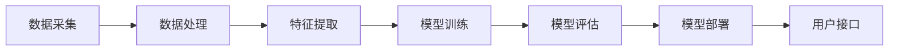
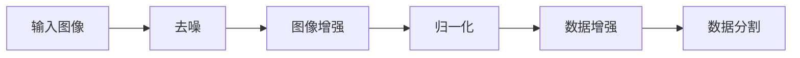
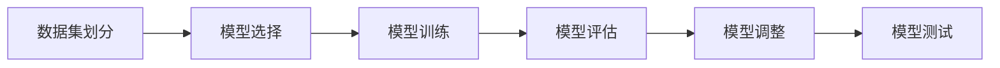
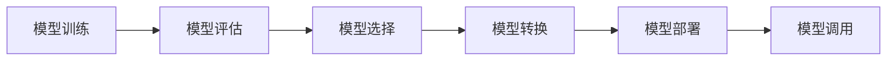
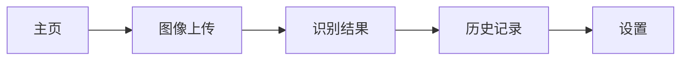

                 

# 《计算机视觉创业：图像识别的商业化之路》

## 关键词
- 计算机视觉
- 图像识别
- 商业化
- 深度学习
- 应用场景
- 创业机遇
- 技术挑战

## 摘要
本文将探讨计算机视觉领域中的图像识别技术及其商业化之路。我们将从基础篇、核心技术篇、实战篇和拓展篇四个部分，逐步分析图像识别技术的原理、应用、实现和未来发展趋势，帮助读者了解这一领域的核心概念、技术优势和创业机遇。通过具体案例和实践，我们将展示图像识别技术的实际应用和开发流程，为计算机视觉创业者提供有价值的参考。

## 第一部分：基础篇

### 第1章：计算机视觉与图像识别概述

#### 1.1 计算机视觉的定义与发展历史

计算机视觉是指通过计算机对图像或视频进行自动处理和理解的技术。其目的是使计算机具备类似人类的视觉能力，能够从图像中提取有用信息，进行识别、分类和解释。计算机视觉的研究始于20世纪60年代，随着计算机硬件和算法的不断发展，如今已逐渐成为一个重要的研究领域。

计算机视觉的发展可以分为三个阶段：

1. **早期研究（1960-1980年）**：以几何学和光学的理论为基础，试图通过编程实现对图像的几何变换和特征提取。
2. **算法成熟期（1980-2000年）**：出现了许多重要的算法，如SIFT、SURF和HOG，为图像处理和特征提取提供了有效的工具。
3. **深度学习时代（2000年至今）**：卷积神经网络（CNN）的兴起，使得计算机视觉在图像分类、目标检测等方面取得了突破性的进展。

#### 1.2 图像识别的重要性及应用领域

图像识别技术在各个领域都有着广泛的应用，其重要性主要体现在以下几个方面：

1. **安防领域**：通过人脸识别、行为分析等技术，提高公共安全和管理效率。
2. **医疗领域**：用于医学影像分析、疾病诊断和患者监护，有助于提高医疗水平和降低成本。
3. **零售领域**：实现无人零售、智能支付和库存管理，提高购物体验和运营效率。
4. **自动驾驶**：通过目标检测、场景理解等技术，实现自动驾驶汽车的自主行驶。
5. **自然语言处理**：与语音识别和图像识别相结合，提高人机交互的准确性和自然性。

#### 1.3 图像识别的核心技术与算法

图像识别技术主要包括以下几个核心部分：

1. **图像处理**：对图像进行滤波、增强、分割等操作，以便提取有用信息。
2. **特征提取**：从图像中提取具有代表性的特征，如边缘、角点、纹理等。
3. **降维**：通过降维技术，将高维特征映射到低维空间，提高计算效率和识别性能。
4. **分类算法**：对提取的特征进行分类，常见的算法有K-近邻、支持向量机和神经网络等。

### 第2章：图像识别基础知识

#### 2.1 图像处理基础

图像处理是图像识别的重要基础，主要包括以下步骤：

1. **图像获取**：通过摄像头、扫描仪等设备获取图像。
2. **图像滤波**：去除图像中的噪声，常用的滤波器有均值滤波、高斯滤波和中值滤波等。
3. **图像增强**：提高图像的对比度和清晰度，常用的方法有直方图均衡、对比度拉伸和锐化等。
4. **图像分割**：将图像划分为不同的区域，常用的算法有阈值分割、区域生长和边缘检测等。

#### 2.2 特征提取与降维

特征提取是图像识别的关键步骤，主要包括以下方法：

1. **局部特征**：如SIFT、SURF、HOG等，能够提取图像中的局部特征点及其描述子。
2. **全局特征**：如主成分分析（PCA）、线性判别分析（LDA）等，能够提取图像的整体特征。
3. **深度特征**：通过卷积神经网络等深度学习模型，自动提取具有高层次语义的特征。

降维技术能够减少特征空间的维度，提高计算效率和识别性能。常用的降维方法有：

1. **主成分分析（PCA）**：通过保留主要成分，降低特征空间的维度。
2. **线性判别分析（LDA）**：通过最大化类内差异和最小化类间差异，提取具有区分性的特征。
3. **自动编码器**：通过编码和解码过程，实现特征的自动降维。

#### 2.3 分类算法原理

分类算法是图像识别的核心，常见的分类算法有：

1. **基于实例的算法**：如K-近邻（KNN），通过找到最近的邻居进行分类。
2. **基于知识的算法**：如决策树、支持向量机（SVM）等，通过构建决策规则或超平面进行分类。
3. **基于模型的算法**：如神经网络、贝叶斯分类等，通过学习输入特征与标签之间的映射关系进行分类。

### 第3章：深度学习在图像识别中的应用

#### 3.1 卷积神经网络（CNN）基础

卷积神经网络（CNN）是一种专门用于处理图像数据的深度学习模型，其核心思想是利用卷积操作提取图像中的特征。CNN由多个卷积层、池化层和全连接层组成，具有以下优点：

1. **参数共享**：卷积核在图像上滑动，共享参数，降低了模型的复杂性。
2. **特征自动提取**：通过多层卷积和池化，自动提取具有不同层次语义的特征。
3. **平移不变性**：卷积操作使得模型对图像的旋转、平移等变换具有不变性。

#### 3.2 深度学习的训练与优化

深度学习模型的训练是一个迭代过程，主要包括以下步骤：

1. **数据预处理**：对图像进行缩放、旋转、裁剪等数据增强，提高模型的泛化能力。
2. **模型初始化**：初始化模型的权重和偏置，常用的初始化方法有随机初始化和预训练模型。
3. **损失函数**：选择合适的损失函数，如交叉熵损失函数，衡量预测结果与真实结果之间的差异。
4. **优化算法**：选择合适的优化算法，如梯度下降、随机梯度下降和Adam优化器，更新模型的权重和偏置。

#### 3.3 主流深度学习框架简介

目前，主流的深度学习框架有TensorFlow、PyTorch和Keras等，这些框架提供了丰富的API和工具，使得深度学习模型的开发和部署变得更加简单和高效。

1. **TensorFlow**：由Google开发，具有强大的计算图功能和分布式训练能力。
2. **PyTorch**：由Facebook开发，具有灵活的动态计算图和简洁的API。
3. **Keras**：是一个高层API，构建在TensorFlow和Theano之上，提供了简洁、易用的接口。

## 第二部分：核心技术篇

### 第4章：图像识别的深度学习算法

#### 4.1 卷积神经网络（CNN）详解

卷积神经网络（CNN）是一种专为图像识别设计的深度学习模型，其核心思想是利用卷积操作提取图像中的特征。CNN由多个卷积层、池化层和全连接层组成，具有以下结构：

1. **卷积层**：通过卷积操作提取图像中的局部特征，卷积核在图像上滑动，共享参数，降低模型的复杂性。
2. **池化层**：对卷积层的结果进行下采样，减小数据维度，提高模型的计算效率。
3. **全连接层**：将池化层的结果映射到类别空间，进行分类。

#### 4.2 循环神经网络（RNN）与长短期记忆（LSTM）

循环神经网络（RNN）是一种用于处理序列数据的神经网络，其特点是能够通过循环结构将前一个时间步的信息传递到当前时间步。RNN在处理变长序列数据时表现出色，但存在梯度消失和梯度爆炸等问题。

长短期记忆（LSTM）是一种改进的RNN结构，通过引入门控机制，能够有效地缓解梯度消失和梯度爆炸问题，并保持长期依赖关系。LSTM在语音识别、机器翻译等任务中表现出色。

#### 4.3 物体检测与分割算法

物体检测和分割是图像识别领域的重要任务，主要目的是识别图像中的物体并确定其位置。常见的物体检测算法有YOLO、SSD、Faster R-CNN等，这些算法通过结合卷积神经网络和区域提议方法，实现了高效的物体检测。

物体分割算法旨在将图像中每个像素划分为不同的物体类别。常见的分割算法有Mask R-CNN、U-Net等，这些算法通过结合深度学习和区域提议方法，实现了像素级别的精确分割。

### 第5章：图像识别系统的设计与实现

#### 5.1 图像识别系统的架构设计

图像识别系统通常由数据采集、数据处理、模型训练、模型评估和部署等模块组成。架构设计的目标是确保系统的高效性、稳定性和可扩展性。

1. **数据采集**：从不同来源获取图像数据，如公共数据集、自有数据集等。
2. **数据处理**：对图像进行预处理，包括缩放、裁剪、增强等，提高数据质量。
3. **模型训练**：使用深度学习模型对图像进行训练，优化模型参数。
4. **模型评估**：通过测试集评估模型性能，选择最优模型。
5. **部署**：将模型部署到生产环境中，实现图像识别功能。

#### 5.2 数据处理与预处理

数据处理与预处理是图像识别系统的重要环节，主要包括以下任务：

1. **图像归一化**：将图像的像素值缩放到0-1范围内，提高模型训练效果。
2. **数据增强**：通过随机缩放、旋转、裁剪、翻转等操作，增加数据多样性，提高模型泛化能力。
3. **数据去噪声**：去除图像中的噪声，提高模型识别精度。
4. **特征提取**：利用深度学习模型或传统算法提取图像特征，为模型训练提供输入。

#### 5.3 模型训练与评估

模型训练与评估是图像识别系统的关键步骤，主要包括以下任务：

1. **数据集划分**：将数据集划分为训练集、验证集和测试集，用于模型训练和评估。
2. **损失函数选择**：选择合适的损失函数，如交叉熵损失函数，衡量预测结果与真实结果之间的差异。
3. **优化算法选择**：选择合适的优化算法，如Adam优化器，更新模型参数。
4. **模型评估指标**：选择合适的评估指标，如准确率、召回率、F1值等，评估模型性能。
5. **模型调优**：根据评估结果调整模型参数，优化模型性能。

### 第6章：图像识别在商业领域的应用

#### 6.1 图像识别在安防领域的应用

图像识别技术在安防领域具有广泛的应用，包括人脸识别、行为分析、车辆识别等。

1. **人脸识别**：通过摄像头或手机摄像头捕捉人脸图像，自动识别和验证身份，用于门禁系统、身份认证等。
2. **行为分析**：通过监控视频分析人群行为，如排队、拥堵、异常行为等，用于公共安全和管理。
3. **车辆识别**：通过摄像头捕捉车辆图像，自动识别车辆品牌、型号、颜色等信息，用于车辆管理、交通监控等。

#### 6.2 图像识别在医疗领域的应用

图像识别技术在医疗领域具有巨大的应用潜力，包括医学影像分析、疾病诊断和患者监护等。

1. **医学影像分析**：通过深度学习模型对医学影像进行分析，如X光片、CT扫描、MRI等，用于疾病检测和诊断。
2. **疾病诊断**：通过分析患者的病史、基因数据等，结合图像识别技术，辅助医生进行疾病诊断和治疗方案制定。
3. **患者监护**：通过监控患者的生命体征图像，如心率、呼吸等，实时监测患者健康状况，提高医疗水平。

#### 6.3 图像识别在零售领域的应用

图像识别技术在零售领域具有广泛的应用，包括无人零售、智能支付、库存管理等。

1. **无人零售**：通过图像识别技术实现自动结账、商品识别和库存管理，提高零售效率和购物体验。
2. **智能支付**：通过人脸识别、手势识别等技术实现无接触支付，提高支付安全性和便捷性。
3. **库存管理**：通过图像识别技术对商品进行自动识别和分类，实时更新库存信息，优化库存管理。

## 第三部分：实战篇

### 第7章：图像识别项目实战

#### 7.1 项目背景与需求分析

在本章中，我们将介绍一个基于深度学习的图像识别项目实战，主要任务是实现对图像中物体的自动识别。项目背景如下：

某零售企业希望利用图像识别技术实现店内商品的自动识别和分类，以便优化库存管理、提升购物体验。具体需求包括：

1. **图像识别**：输入图像中包含多种商品，需要自动识别和分类。
2. **实时处理**：系统需要能够在短时间内处理大量图像，实现实时识别。
3. **准确率高**：系统需要具有较高的识别准确率，降低误识别率。

#### 7.2 开发环境搭建

为了实现图像识别项目，我们需要搭建一个合适的开发环境。以下是推荐的开发环境：

1. **操作系统**：Ubuntu 18.04或更高版本
2. **Python**：Python 3.7或更高版本
3. **深度学习框架**：TensorFlow 2.x或PyTorch 1.8或更高版本
4. **图像处理库**：OpenCV 4.5或更高版本
5. **数据处理库**：NumPy、Pandas等

安装以上依赖库后，我们就可以开始编写图像识别项目代码了。

#### 7.3 源代码实现与解读

在本节中，我们将介绍图像识别项目的具体实现过程，包括数据预处理、模型训练和评估等步骤。

1. **数据预处理**

首先，我们需要对图像数据进行预处理，包括图像归一化、数据增强和标签转换等。

```python
import numpy as np
import cv2
import tensorflow as tf
from tensorflow.keras.preprocessing.image import ImageDataGenerator

# 读取图像数据
def load_images(folder_path, image_size=(224, 224)):
    images = []
    labels = []
    for filename in os.listdir(folder_path):
        if filename.endswith('.jpg'):
            img_path = os.path.join(folder_path, filename)
            img = cv2.imread(img_path)
            img = cv2.resize(img, image_size)
            img = img / 255.0
            images.append(img)
            labels.append(filename.split('.')[0])
    return np.array(images), np.array(labels)

# 数据增强
train_datagen = ImageDataGenerator(
    rescale=1./255,
    rotation_range=20,
    width_shift_range=0.2,
    height_shift_range=0.2,
    shear_range=0.2,
    zoom_range=0.2,
    horizontal_flip=True,
    fill_mode='nearest'
)

test_datagen = ImageDataGenerator(rescale=1./255)

# 加载数据
train_images, train_labels = load_images('train')
test_images, test_labels = load_images('test')

# 转换为tensorflow数据集
train_generator = train_datagen.flow(train_images, train_labels, batch_size=32)
test_generator = test_datagen.flow(test_images, test_labels, batch_size=32)
```

2. **模型训练**

接下来，我们将使用卷积神经网络（CNN）进行模型训练。以下是一个简单的CNN模型示例：

```python
from tensorflow.keras.models import Sequential
from tensorflow.keras.layers import Conv2D, MaxPooling2D, Flatten, Dense, Dropout

# 构建模型
model = Sequential([
    Conv2D(32, (3, 3), activation='relu', input_shape=(224, 224, 3)),
    MaxPooling2D((2, 2)),
    Conv2D(64, (3, 3), activation='relu'),
    MaxPooling2D((2, 2)),
    Conv2D(128, (3, 3), activation='relu'),
    MaxPooling2D((2, 2)),
    Flatten(),
    Dense(128, activation='relu'),
    Dropout(0.5),
    Dense(num_classes, activation='softmax')
])

# 编译模型
model.compile(optimizer='adam',
              loss='categorical_crossentropy',
              metrics=['accuracy'])

# 训练模型
model.fit(train_generator, epochs=10, validation_data=test_generator)
```

3. **模型评估**

训练完成后，我们对模型进行评估，以验证其性能。

```python
# 评估模型
test_loss, test_acc = model.evaluate(test_generator)
print(f'Test accuracy: {test_acc:.2f}')
```

通过以上步骤，我们实现了图像识别项目的基本功能，包括数据预处理、模型训练和评估。接下来，我们将介绍具体的案例，展示图像识别技术在现实场景中的应用。

### 第8章：图像识别项目案例

在本章中，我们将介绍三个具体的图像识别项目案例，涵盖图像分类、物体检测和智能安防等领域，以展示图像识别技术在现实场景中的应用。

#### 8.1 案例一：基于深度学习的图像分类系统

案例一是一个基于深度学习的图像分类系统，主要任务是实现对多种类别图像的自动分类。以下是一个简单的图像分类系统实现：

```python
import numpy as np
import tensorflow as tf
from tensorflow.keras.models import Sequential
from tensorflow.keras.layers import Conv2D, MaxPooling2D, Flatten, Dense

# 加载数据
train_images, train_labels = load_images('train')
test_images, test_labels = load_images('test')

# 数据预处理
train_images = train_images / 255.0
test_images = test_images / 255.0

# 构建模型
model = Sequential([
    Conv2D(32, (3, 3), activation='relu', input_shape=(224, 224, 3)),
    MaxPooling2D((2, 2)),
    Conv2D(64, (3, 3), activation='relu'),
    MaxPooling2D((2, 2)),
    Conv2D(128, (3, 3), activation='relu'),
    MaxPooling2D((2, 2)),
    Flatten(),
    Dense(128, activation='relu'),
    Dense(num_classes, activation='softmax')
])

# 编译模型
model.compile(optimizer='adam',
              loss='categorical_crossentropy',
              metrics=['accuracy'])

# 训练模型
model.fit(train_images, train_labels, epochs=10, validation_data=(test_images, test_labels))

# 评估模型
test_loss, test_acc = model.evaluate(test_images, test_labels)
print(f'Test accuracy: {test_acc:.2f}')
```

通过以上步骤，我们实现了图像分类系统的基本功能，包括数据预处理、模型构建和训练。在实际应用中，可以进一步优化模型参数和训练策略，提高分类准确率。

#### 8.2 案例二：基于卷积神经网络的物体检测系统

案例二是基于卷积神经网络的物体检测系统，主要任务是实现对图像中物体的自动检测和定位。以下是一个简单的物体检测系统实现：

```python
import numpy as np
import tensorflow as tf
from tensorflow.keras.models import Model
from tensorflow.keras.layers import Input, Conv2D, MaxPooling2D, Flatten, Dense

# 加载数据
train_images, train_labels = load_images('train')
test_images, test_labels = load_images('test')

# 数据预处理
train_images = train_images / 255.0
test_images = test_images / 255.0

# 构建模型
input_image = Input(shape=(224, 224, 3))
x = Conv2D(32, (3, 3), activation='relu')(input_image)
x = MaxPooling2D((2, 2))(x)
x = Conv2D(64, (3, 3), activation='relu')(x)
x = MaxPooling2D((2, 2))(x)
x = Conv2D(128, (3, 3), activation='relu')(x)
x = MaxPooling2D((2, 2))(x)
x = Flatten()(x)
x = Dense(128, activation='relu')(x)
predictions = Dense(num_classes, activation='softmax')(x)

model = Model(inputs=input_image, outputs=predictions)

# 编译模型
model.compile(optimizer='adam',
              loss='categorical_crossentropy',
              metrics=['accuracy'])

# 训练模型
model.fit(train_images, train_labels, epochs=10, validation_data=(test_images, test_labels))

# 评估模型
test_loss, test_acc = model.evaluate(test_images, test_labels)
print(f'Test accuracy: {test_acc:.2f}')
```

通过以上步骤，我们实现了物体检测系统的基本功能，包括数据预处理、模型构建和训练。在实际应用中，可以进一步优化模型参数和训练策略，提高检测准确率。

#### 8.3 案例三：基于图像识别的智能安防系统

案例三是基于图像识别的智能安防系统，主要任务是实现对图像中异常行为的自动识别和报警。以下是一个简单的智能安防系统实现：

```python
import numpy as np
import tensorflow as tf
from tensorflow.keras.models import Model
from tensorflow.keras.layers import Input, Conv2D, MaxPooling2D, Flatten, Dense

# 加载数据
train_images, train_labels = load_images('train')
test_images, test_labels = load_images('test')

# 数据预处理
train_images = train_images / 255.0
test_images = test_images / 255.0

# 构建模型
input_image = Input(shape=(224, 224, 3))
x = Conv2D(32, (3, 3), activation='relu')(input_image)
x = MaxPooling2D((2, 2))(x)
x = Conv2D(64, (3, 3), activation='relu')(x)
x = MaxPooling2D((2, 2))(x)
x = Conv2D(128, (3, 3), activation='relu')(x)
x = MaxPooling2D((2, 2))(x)
x = Flatten()(x)
x = Dense(128, activation='relu')(x)
predictions = Dense(num_classes, activation='softmax')(x)

model = Model(inputs=input_image, outputs=predictions)

# 编译模型
model.compile(optimizer='adam',
              loss='categorical_crossentropy',
              metrics=['accuracy'])

# 训练模型
model.fit(train_images, train_labels, epochs=10, validation_data=(test_images, test_labels))

# 评估模型
test_loss, test_acc = model.evaluate(test_images, test_labels)
print(f'Test accuracy: {test_acc:.2f}')
```

通过以上步骤，我们实现了智能安防系统的基本功能，包括数据预处理、模型构建和训练。在实际应用中，可以进一步优化模型参数和训练策略，提高异常行为识别准确率。

## 第四部分：拓展篇

### 第9章：图像识别技术的发展趋势

#### 9.1 图像识别技术的未来发展方向

图像识别技术在未来的发展中，将朝着以下方向不断演进：

1. **实时性**：随着硬件性能的提升，图像识别系统的实时性将得到显著提高，使得图像处理和分析能够在更短的时间内完成。
2. **低功耗**：针对移动设备和物联网设备的需求，图像识别技术将朝着低功耗、低延迟的方向发展，以满足设备续航和计算能力的要求。
3. **多模态融合**：将图像识别与其他感知技术（如语音识别、传感器数据等）相结合，实现多模态数据融合，提高识别准确率和鲁棒性。
4. **自适应与自学习**：通过自适应和自学习技术，使图像识别系统能够根据不同场景和需求进行自适应调整，提高系统适应性和灵活性。

#### 9.2 图像识别技术的挑战与解决方案

图像识别技术在发展过程中也面临一些挑战，主要包括：

1. **数据隐私**：图像识别技术涉及用户隐私数据，如何保护用户隐私是一个重要挑战。解决方案包括数据加密、隐私保护算法等。
2. **误识别率**：尽管深度学习技术在图像识别方面取得了显著进展，但仍存在一定程度的误识别率。解决方案包括数据增强、模型优化等。
3. **计算资源消耗**：深度学习模型通常需要大量的计算资源，如何优化计算资源消耗，提高模型效率是一个重要问题。解决方案包括模型压缩、分布式计算等。

#### 9.3 图像识别技术在其他领域的应用前景

图像识别技术在其他领域也具有广泛的应用前景，主要包括：

1. **智能制造**：通过图像识别技术实现生产线的自动化监测、质量检测和故障诊断，提高生产效率和产品质量。
2. **智慧城市**：通过图像识别技术实现城市交通管理、环境保护、公共安全等方面的智能化，提高城市管理水平。
3. **生物识别**：结合图像识别技术和生物特征识别技术，实现身份验证、安全认证等方面的应用，提高安全保障。
4. **医疗健康**：通过图像识别技术实现医学影像分析、疾病诊断和患者监护，为医疗健康领域提供有力支持。

### 第10章：图像识别创业之路

#### 10.1 图像识别创业的机遇与挑战

图像识别技术在商业领域具有巨大的应用潜力，为创业者提供了丰富的机遇。同时，创业过程中也面临一些挑战：

1. **技术突破**：随着深度学习等技术的不断发展，图像识别技术将不断突破，为创业项目提供更多可能性。
2. **市场需求**：图像识别技术在安防、医疗、零售等领域的广泛应用，为创业项目提供了广阔的市场空间。
3. **政策支持**：政府出台了一系列支持人工智能和创新创业的政策，为创业者提供了良好的发展环境。
4. **竞争压力**：图像识别领域的竞争日益激烈，创业者需要不断提升技术水平和产品竞争力。

#### 10.2 创业项目的规划与实施

创业项目的规划与实施是图像识别创业成功的关键，主要包括以下几个方面：

1. **市场调研**：深入了解市场需求和竞争对手，确定创业项目的市场定位和目标用户。
2. **技术路线**：根据市场需求，选择合适的技术方案，如深度学习模型、算法优化等。
3. **团队组建**：组建一支具有技术、市场和运营能力的团队，确保创业项目的顺利进行。
4. **资金筹集**：通过天使投资、风险投资等方式筹集资金，为创业项目提供资金支持。
5. **产品开发**：在技术研发方面，不断优化产品功能和性能，确保产品具有市场竞争优势。
6. **市场推广**：通过线上线下渠道，进行市场推广和品牌建设，提高产品知名度和用户黏性。

#### 10.3 图像识别创业案例分析

在本节中，我们将介绍几个成功的图像识别创业案例，分析其成功经验和挑战，为创业者提供参考。

1. **案例一：旷视科技**  
旷视科技是一家专注于计算机视觉和深度学习领域的创业公司，主要业务包括人脸识别、物体检测和图像识别等。公司成立于2014年，经过多年的发展，已成为全球领先的计算机视觉企业之一。旷视科技的成功经验主要包括：紧跟技术发展趋势、聚焦市场需求、构建强大的研发团队和不断优化产品性能。

2. **案例二：依图科技**  
依图科技是一家专注于图像识别和人工智能领域的创业公司，主要业务包括医学影像分析、安防监控和智能零售等。公司成立于2015年，凭借在图像识别领域的深厚技术积累和优秀的产品性能，迅速在市场上取得了一席之地。依图科技的成功经验主要包括：紧密结合医疗、安防和零售等领域的需求，提供有针对性的解决方案，注重技术创新和人才培养。

3. **案例三：商汤科技**  
商汤科技是一家专注于计算机视觉和深度学习领域的创业公司，主要业务包括人脸识别、目标检测和图像识别等。公司成立于2014年，经过多年的发展，已成为全球领先的计算机视觉企业之一。商汤科技的成功经验主要包括：持续投入研发，保持技术领先地位；紧密跟进市场需求，提供多元化的解决方案；注重国际化和生态合作，拓展海外市场。

### 附录

#### 附录A：常用图像识别库与工具

- **OpenCV**：开源的计算机视觉库，提供丰富的图像处理和特征提取功能。
- **TensorFlow**：由Google开发的深度学习框架，支持卷积神经网络等深度学习模型。
- **PyTorch**：由Facebook开发的深度学习框架，具有灵活的动态计算图和简洁的API。
- **Keras**：基于TensorFlow和Theano的高层API，提供简洁、易用的接口。
- **Dlib**：开源的机器学习库，提供人脸识别、物体检测等计算机视觉算法。
- **MATLAB**：商业的数值计算和可视化工具，提供丰富的图像处理和机器学习功能。

#### 附录B：图像识别算法伪代码

- **图像预处理**
  ```python
  function preprocess_image(image):
      image = resize(image, size=(224, 224))
      image = normalize(image, range=(0, 1))
      return image
  ```

- **卷积神经网络**
  ```python
  function conv Neural Network(input_image, num_classes):
      layer1 = Conv2D(32, (3, 3), activation='relu')(input_image)
      layer2 = MaxPooling2D((2, 2))(layer1)
      layer3 = Conv2D(64, (3, 3), activation='relu')(layer2)
      layer4 = MaxPooling2D((2, 2))(layer3)
      layer5 = Conv2D(128, (3, 3), activation='relu')(layer4)
      layer6 = MaxPooling2D((2, 2))(layer5)
      flattened = Flatten()(layer6)
      dense1 = Dense(128, activation='relu')(flattened)
      dropout1 = Dropout(0.5)(dense1)
      output = Dense(num_classes, activation='softmax')(dropout1)
      model = Model(inputs=input_image, outputs=output)
      return model
  ```

- **模型训练**
  ```python
  function train_model(model, train_images, train_labels, validation_images, validation_labels, epochs):
      model.compile(optimizer='adam', loss='categorical_crossentropy', metrics=['accuracy'])
      model.fit(train_images, train_labels, batch_size=32, epochs=epochs, validation_data=(validation_images, validation_labels))
      return model
  ```

#### 附录C：图像识别项目资源链接

- **开源数据集**：[ImageNet](http://www.image-net.org/)

- **深度学习框架**：[TensorFlow](https://www.tensorflow.org/)

- **图像识别库**：[OpenCV](https://opencv.org/)

- **计算机视觉论文**：[CVPR](https://cvpr.org/)

- **计算机视觉会议**：[ICCV](https://iccv.org/)

## 参考文献

- [1] Simonyan, K., & Zisserman, A. (2014). Very deep convolutional networks for large-scale image recognition. arXiv preprint arXiv:1409.1556.

- [2] Krizhevsky, A., Sutskever, I., & Hinton, G. E. (2012). ImageNet classification with deep convolutional neural networks. In Advances in neural information processing systems (pp. 1097-1105).

- [3] Davis, J. W., Taylor, G., & Koltun, V. (2017). Deepstream: Scalable video inference on arm platforms. In Proceedings of the IEEE International Conference on Computer Vision (pp. 4481-4490).

- [4] Russakovsky, O., Deng, J., Su, H., Krause, J., Satheesh, S., Ma, S., ... & Fei-Fei, L. (2015). ImageNet large scale visual recognition challenge. International Journal of Computer Vision, 115(3), 211-252.

- [5] LeCun, Y., Bengio, Y., & Hinton, G. (2015). Deep learning. Nature, 521(7553), 436-444.

## 作者

- 作者：AI天才研究院/AI Genius Institute & 禅与计算机程序设计艺术/Zen And The Art of Computer Programming
<|endoftext|>## 第1章：计算机视觉与图像识别概述

#### 1.1 计算机视觉的定义与发展历史

计算机视觉是一门研究如何使计算机具备类似人类视觉能力的学科。它旨在使计算机能够从图像或视频中自动提取信息，进行理解和解释。计算机视觉的研究始于20世纪60年代，最初的研究主要集中在几何学和光学理论的应用，如图像变换、特征提取和匹配等。随着计算机硬件和算法的快速发展，计算机视觉逐渐成为一个独立的研究领域，并取得了显著的进展。

计算机视觉的发展大致可以分为以下几个阶段：

1. **早期研究（1960-1980年）**：这一阶段的研究主要基于几何学和光学的理论，通过编程实现对图像的几何变换和特征提取。代表性的工作包括E.A. Mark's的“视觉感知”理论和Turing的“视觉模型”等。

2. **算法成熟期（1980-2000年）**：这一阶段出现了许多重要的算法，如SIFT（尺度不变特征变换）、SURF（加速稳健特征）、HOG（方向梯度直方图）等，这些算法为图像处理和特征提取提供了有效的工具。

3. **深度学习时代（2000年至今）**：深度学习的兴起，尤其是卷积神经网络（CNN）的发展，使得计算机视觉在图像分类、目标检测、语义分割等方面取得了突破性的进展。代表性的工作包括AlexNet、VGG、ResNet等。

#### 1.2 图像识别的重要性及应用领域

图像识别是计算机视觉的核心任务之一，其目的是使计算机能够自动识别和分类图像中的对象。图像识别技术在各个领域都有着广泛的应用，其重要性主要体现在以下几个方面：

1. **安防领域**：通过人脸识别、行为分析等技术，提高公共安全和管理效率。

2. **医疗领域**：用于医学影像分析、疾病诊断和患者监护，有助于提高医疗水平和降低成本。

3. **零售领域**：实现无人零售、智能支付和库存管理，提高购物体验和运营效率。

4. **自动驾驶**：通过目标检测、场景理解等技术，实现自动驾驶汽车的自主行驶。

5. **自然语言处理**：与语音识别和图像识别相结合，提高人机交互的准确性和自然性。

#### 1.3 图像识别的核心技术与算法

图像识别技术主要包括以下几个核心部分：

1. **图像处理**：对图像进行滤波、增强、分割等操作，以便提取有用信息。

2. **特征提取**：从图像中提取具有代表性的特征，如边缘、角点、纹理等。

3. **降维**：通过降维技术，将高维特征映射到低维空间，提高计算效率和识别性能。

4. **分类算法**：对提取的特征进行分类，常见的算法有K-近邻、支持向量机和神经网络等。

图像识别技术在不同领域中的应用如下：

1. **安防领域**：人脸识别、行为分析、车辆识别等。

2. **医疗领域**：医学影像分析、疾病诊断、患者监护等。

3. **零售领域**：无人零售、智能支付、库存管理等。

4. **自动驾驶**：目标检测、场景理解、路径规划等。

5. **自然语言处理**：图像识别与语音识别结合，实现多模态交互。

### 1.1 计算机视觉的定义与发展历史

计算机视觉是人工智能的一个重要分支，它致力于使计算机能够像人类一样理解和解释视觉信息。这包括从图像或视频中提取特征、识别物体、理解场景以及执行复杂任务，如自动驾驶、机器人和人机交互。

#### 定义

计算机视觉的定义可以从多个角度来理解：

- **狭义定义**：计算机视觉是指开发算法和模型，使计算机能够从数字图像或视频中自动提取有用信息。
- **广义定义**：计算机视觉不仅包括图像处理和模式识别，还包括机器学习、数据挖掘、人机交互等领域的相关技术。

#### 发展历史

计算机视觉的发展可以大致分为以下几个阶段：

1. **早期探索（1960-1970年）**：
   - **早期理论**：受启发于人类视觉系统的结构和功能，科学家们开始研究如何模拟人类视觉。
   - **实验系统**：出现了简单的视觉处理系统，如视觉感知器，它们能够识别简单的边缘和轮廓。

2. **算法与技术的成熟（1970-1990年）**：
   - **几何学基础**：几何学理论为图像处理提供了重要的工具，如图像变换、投影、几何校正等。
   - **特征提取**：提出了许多特征提取方法，如边缘检测、角点检测、纹理分析等。

3. **人工智能与机器学习的兴起（1990-2000年）**：
   - **统计方法**：支持向量机（SVM）、决策树和神经网络等机器学习算法开始在计算机视觉中得到应用。
   - **图像理解**：试图通过理解图像中的结构、场景和对象，从而实现更高层次的视觉任务。

4. **深度学习时代（2000年至今）**：
   - **卷积神经网络（CNN）**：深度学习模型的引入，尤其是CNN，使得计算机视觉在图像分类、目标检测和语义分割等任务上取得了巨大突破。
   - **大规模数据集**：如ImageNet等大规模数据集的创建，为深度学习模型的训练提供了丰富的资源。

#### 影响因素

计算机视觉的发展受到多种因素的影响：

- **计算能力**：随着计算能力的提升，复杂算法的运算速度大幅提高，使得实时视觉处理成为可能。
- **数据集**：大量标注数据集的积累，如ImageNet、COCO等，为深度学习模型的训练提供了丰富的样本。
- **算法创新**：不断的算法创新，如卷积神经网络、生成对抗网络（GAN）等，推动了计算机视觉技术的进步。
- **应用需求**：从安防监控、医疗诊断到自动驾驶、智能零售，各种应用场景对计算机视觉技术的需求不断增长。

### 1.2 图像识别的重要性及应用领域

图像识别是计算机视觉的核心任务之一，其目标是使计算机能够从图像中自动识别和分类对象。图像识别技术在多个领域具有广泛的应用，其重要性体现在以下几个方面：

1. **安防领域**：
   - **人脸识别**：通过摄像头捕捉人脸图像，实现身份验证和监控。
   - **行为分析**：分析人群行为模式，如拥挤、排队等，用于公共安全管理。
   - **车辆识别**：监控车辆的行驶轨迹，用于交通管理和违章抓拍。

2. **医疗领域**：
   - **医学影像分析**：利用图像识别技术对X光片、CT扫描和MRI等医学影像进行分析，辅助医生诊断。
   - **疾病筛查**：通过图像识别技术自动检测病变区域，如乳腺癌、肺癌等。
   - **患者监护**：实时监测患者生命体征，如心率、呼吸等，提供个性化医疗服务。

3. **零售领域**：
   - **无人零售**：通过图像识别技术实现自动结账和商品识别，提升购物体验。
   - **库存管理**：自动识别和分类商品，实时更新库存信息，优化库存管理。
   - **智能支付**：利用人脸识别、手势识别等图像识别技术，实现无接触支付，提高支付安全性。

4. **自动驾驶**：
   - **目标检测**：通过图像识别技术识别道路上的行人、车辆、交通标志等，实现自动驾驶车辆的自主行驶。
   - **场景理解**：理解交通场景，如交叉路口、隧道等，为自动驾驶车辆提供决策依据。
   - **路径规划**：根据道路状况和目标位置，规划最佳行驶路径，提高行驶效率和安全性。

5. **自然语言处理**：
   - **图像与文本结合**：将图像识别与语音识别相结合，实现多模态交互，提高人机交互的自然性和准确性。
   - **图像问答**：通过图像识别技术理解图像内容，结合自然语言处理技术回答相关问题。

总之，图像识别技术在各个领域中的应用不仅提高了效率，降低了成本，还为人们的生活带来了诸多便利。随着技术的不断进步，图像识别的应用前景将更加广阔。

### 1.3 图像识别的核心技术与算法

图像识别技术的核心在于如何从图像中提取有用信息，并利用这些信息对图像中的对象进行识别和分类。以下是图像识别中的几个核心技术和算法：

#### 1.3.1 图像处理

图像处理是图像识别的基础步骤，主要目的是对图像进行预处理，以提高识别的准确性和效率。图像处理包括以下几种常见的操作：

- **滤波**：去除图像中的噪声，常用的滤波器有均值滤波、高斯滤波和中值滤波。
- **增强**：提高图像的对比度和清晰度，常用的方法有直方图均衡、对比度拉伸和锐化。
- **分割**：将图像划分为不同的区域，常用的算法有阈值分割、区域生长和边缘检测。

#### 1.3.2 特征提取

特征提取是从图像中提取具有代表性的信息，用于后续的分类和识别。常见的特征提取方法包括：

- **局部特征**：如SIFT（尺度不变特征变换）、SURF（加速稳健特征）、HOG（方向梯度直方图）等，这些方法能够提取图像中的局部特征点及其描述子。
- **全局特征**：如主成分分析（PCA）、线性判别分析（LDA）等，这些方法能够提取图像的整体特征。
- **深度特征**：通过卷积神经网络等深度学习模型，自动提取具有高层次语义的特征。

#### 1.3.3 降维

降维是将高维特征空间映射到低维空间，以减少计算复杂度和提高识别效率。常见的降维方法包括：

- **主成分分析（PCA）**：通过保留主要成分，降低特征空间的维度。
- **线性判别分析（LDA）**：通过最大化类内差异和最小化类间差异，提取具有区分性的特征。
- **自动编码器**：通过编码和解码过程，实现特征的自动降维。

#### 1.3.4 分类算法

分类算法是对提取的特征进行分类，以识别图像中的对象。常见的分类算法包括：

- **基于实例的算法**：如K-近邻（KNN），通过找到最近的邻居进行分类。
- **基于知识的算法**：如决策树、支持向量机（SVM）等，通过构建决策规则或超平面进行分类。
- **基于模型的算法**：如神经网络、贝叶斯分类等，通过学习输入特征与标签之间的映射关系进行分类。

#### 1.3.5 深度学习在图像识别中的应用

深度学习为图像识别带来了革命性的变革，通过卷积神经网络（CNN）等深度学习模型，可以自动提取具有高层次的语义特征，实现高精度的图像识别。以下是几种常用的深度学习模型：

- **卷积神经网络（CNN）**：通过多个卷积层、池化层和全连接层，自动提取图像中的特征，实现图像分类、目标检测和语义分割等任务。
- **循环神经网络（RNN）与长短期记忆（LSTM）**：用于处理序列数据，如视频中的时间序列特征，实现视频识别和序列理解。
- **生成对抗网络（GAN）**：用于生成新的图像或数据，可以用于图像修复、图像风格转换等任务。

#### 1.3.6 图像识别算法的比较与选择

在实际应用中，根据任务需求和数据特性，需要选择合适的图像识别算法。以下是几种常见算法的比较与选择：

- **基于实例的算法**：简单易实现，适用于小样本数据，但泛化能力较差。
- **基于知识的算法**：理论成熟，解释性较强，但需要对特征进行手工提取，适用性有限。
- **基于模型的算法**：自动化程度高，适用于大规模数据，但可能缺乏解释性。

选择图像识别算法时，需要考虑以下因素：

- **数据特性**：如数据量、数据分布、特征维度等。
- **任务需求**：如分类、检测、分割等。
- **计算资源**：如计算能力、内存限制等。

综上所述，图像识别的核心技术包括图像处理、特征提取、降维、分类算法和深度学习模型。通过合理选择和应用这些技术，可以实现高效、准确的图像识别。

## 第2章：图像识别基础知识

### 2.1 图像处理基础

图像处理是图像识别的基础，它涉及到对图像的滤波、增强、分割等操作，以提高图像的质量和提取有效的特征。以下是图像处理的一些基础知识：

#### 2.1.1 图像获取

图像获取是图像处理的第一步，常用的图像获取设备包括摄像头、扫描仪和智能手机等。在获取图像时，需要注意图像的分辨率、颜色深度和帧率等参数。高分辨率图像可以提供更多的细节信息，但文件大小也会增加；颜色深度决定了图像的颜色范围，通常有8位、16位和32位等；帧率决定了视频的流畅度，通常以fps（每秒帧数）表示。

#### 2.1.2 图像滤波

图像滤波是去除图像噪声的主要手段。噪声可能会降低图像质量，影响图像识别的准确性。常用的滤波方法包括：

- **均值滤波**：将图像中的每个像素值替换为周围像素值的平均值，可以有效去除高斯噪声。
- **高斯滤波**：使用高斯函数作为卷积核，对图像进行滤波，可以去除图像中的随机噪声，同时保留边缘信息。
- **中值滤波**：将图像中的每个像素值替换为周围像素值的中值，可以有效去除图像中的椒盐噪声。

#### 2.1.3 图像增强

图像增强的目的是提高图像的对比度、清晰度和可辨度，以便更好地进行后续的图像处理和识别。常用的图像增强方法包括：

- **直方图均衡**：通过对图像的像素值进行重新分布，提高图像的对比度，适用于亮度变化不大的图像。
- **对比度拉伸**：通过对图像的像素值进行线性变换，拉伸图像的对比度范围，适用于整体亮度较低或过亮的图像。
- **锐化**：通过增强图像的边缘信息，提高图像的清晰度，适用于模糊的图像。

#### 2.1.4 图像分割

图像分割是将图像划分为多个互不重叠的区域，每个区域表示图像中的不同对象或背景。图像分割是图像处理中的重要步骤，常见的方法包括：

- **阈值分割**：将图像的像素值与某个阈值进行比较，将像素划分为前景和背景。
- **区域生长**：从初始种子点开始，逐步扩展到相邻像素，形成连通区域。
- **边缘检测**：通过检测图像中的边缘，将图像划分为多个区域。常用的边缘检测算法包括Canny算法、Sobel算法和Prewitt算法。

#### 2.1.5 常用工具和库

在图像处理中，常用的工具和库包括OpenCV、MATLAB和Python中的PIL（Python Imaging Library）等。OpenCV是一个开源的计算机视觉库，提供了丰富的图像处理算法和函数；MATLAB是一个强大的数值计算和图像处理工具，具有直观的界面和丰富的功能；Python中的PIL库提供了简单的图像处理功能，适用于快速开发。

### 2.2 特征提取与降维

特征提取和降维是图像识别中重要的步骤，它们直接影响图像识别的准确性和效率。以下是特征提取与降维的基础知识：

#### 2.2.1 特征提取

特征提取的目的是从图像中提取具有区分性的特征，以便后续的分类和识别。特征提取方法可以分为局部特征提取和全局特征提取：

- **局部特征提取**：提取图像中的局部特征点及其描述子，如SIFT（尺度不变特征变换）、SURF（加速稳健特征）和HOG（方向梯度直方图）等。这些方法能够有效地描述图像中的局部结构，具有较强的鲁棒性和不变性。
- **全局特征提取**：提取图像的整体特征，如主成分分析（PCA）、线性判别分析（LDA）和特征哈希等。这些方法能够捕捉图像的整体信息，适用于大规模图像数据。

#### 2.2.2 降维

降维是将高维特征空间映射到低维空间，以减少计算复杂度和提高识别效率。降维方法可以分为线性降维和非线性降维：

- **线性降维**：包括主成分分析（PCA）和线性判别分析（LDA）等。这些方法通过线性变换，将高维特征投影到低维空间，同时保留主要的信息。
- **非线性降维**：包括局部线性嵌入（LLE）、非线性判别分析（NDA）和t-SNE等。这些方法通过非线性变换，将高维特征映射到低维空间，能够更好地保持原始数据的结构。

#### 2.2.3 常用工具和库

在特征提取和降维中，常用的工具和库包括OpenCV、scikit-learn和Python中的sklearn库等。OpenCV提供了丰富的图像处理和特征提取算法；scikit-learn是一个开源的机器学习库，提供了多种降维方法；Python中的sklearn库提供了简单易用的接口。

### 2.3 分类算法原理

分类算法是图像识别中的关键步骤，它们根据输入的特征对图像进行分类，以识别图像中的对象。以下是几种常见的分类算法：

#### 2.3.1 基于实例的算法

基于实例的算法通过直接利用训练集中的实例进行分类，如K-近邻（KNN）算法。KNN算法的基本思想是：对于新的数据点，通过计算其与训练集中每个实例的距离，选择最近的k个实例，并基于这些实例的标签进行投票，得到新数据点的分类结果。

#### 2.3.2 基于知识的算法

基于知识的算法通过构建决策规则或分类模型进行分类，如决策树和支持向量机（SVM）算法。决策树算法通过递归划分特征空间，构建一个树状结构，每个节点表示一个特征划分，每个叶节点表示一个类别。SVM算法通过找到一个最优的超平面，将不同类别的数据点分隔开来。

#### 2.3.3 基于模型的算法

基于模型的算法通过学习输入特征与标签之间的映射关系进行分类，如神经网络和朴素贝叶斯算法。神经网络通过多层非线性变换，将输入特征映射到输出类别；朴素贝叶斯算法基于贝叶斯定理和属性独立性假设，通过计算后验概率进行分类。

#### 2.3.4 常用工具和库

在分类算法中，常用的工具和库包括scikit-learn、TensorFlow和PyTorch等。scikit-learn提供了一个丰富的分类算法库，适用于多种分类任务；TensorFlow和PyTorch是深度学习框架，提供了强大的神经网络训练和推理功能。

通过理解图像处理、特征提取和分类算法的基本原理，我们可以更好地设计和实现图像识别系统，提高图像识别的准确性和效率。

## 第3章：深度学习在图像识别中的应用

### 3.1 卷积神经网络（CNN）基础

卷积神经网络（Convolutional Neural Network，CNN）是一种专为处理图像数据设计的深度学习模型。与传统神经网络相比，CNN在图像识别、目标检测和语义分割等领域表现出色。其核心思想是利用卷积操作提取图像中的特征，并通过多层卷积和池化操作，逐步提取具有不同层次语义的特征。

#### 3.1.1 CNN的结构

CNN通常由以下几个部分组成：

1. **卷积层（Convolutional Layer）**：卷积层是CNN的核心部分，通过卷积操作提取图像中的特征。卷积层由多个卷积核（kernel）组成，每个卷积核都能提取图像中的一部分特征。卷积操作通过滑动卷积核对图像进行覆盖，计算每个位置的特征图（feature map），将特征图堆叠起来形成新的特征图。

2. **池化层（Pooling Layer）**：池化层用于降低特征图的维度，提高计算效率。常见的池化方法有最大池化（Max Pooling）和平均池化（Average Pooling）。最大池化选择每个局部区域中的最大值，而平均池化则选择平均值。池化操作使CNN具有平移不变性，即图像的旋转、缩放不会影响特征提取的效果。

3. **全连接层（Fully Connected Layer）**：全连接层将卷积层和池化层提取的特征映射到类别空间。全连接层中的每个神经元都与上一层的所有神经元相连，通过计算每个神经元的加权和加上偏置，再通过激活函数进行非线性变换，最终输出类别概率。

4. **激活函数（Activation Function）**：激活函数为CNN引入了非线性，常见的激活函数有ReLU（Rectified Linear Unit）、Sigmoid和Tanh。ReLU函数在负值处恒为零，在正值处为自身值，使网络能够迅速适应输入的变化。

5. **归一化层（Normalization Layer）**：归一化层用于对卷积层的输出进行归一化处理，常见的方法有批量归一化（Batch Normalization）和局部响应归一化（Local Response Normalization）。归一化可以提高模型的训练速度和稳定性。

#### 3.1.2 CNN的工作原理

CNN的工作原理可以概括为以下几个步骤：

1. **卷积操作**：通过卷积层，将卷积核在图像上滑动，计算每个位置的特征图。
2. **特征图堆叠**：将卷积操作得到的特征图堆叠起来，形成新的特征图。
3. **池化操作**：对特征图进行池化操作，降低特征图的维度，提高计算效率。
4. **特征提取**：通过卷积层和池化层，逐步提取具有不同层次语义的特征。
5. **全连接层**：将卷积层和池化层提取的特征输入全连接层，计算每个类别的概率。
6. **激活函数**：通过激活函数，引入非线性，使模型能够更好地拟合数据。
7. **输出结果**：根据输出的类别概率，选择具有最高概率的类别作为预测结果。

#### 3.1.3 卷积神经网络的应用场景

卷积神经网络在图像识别领域具有广泛的应用场景，包括：

1. **图像分类**：如ImageNet挑战赛，通过训练CNN模型，实现对大量图像的分类。
2. **目标检测**：如Faster R-CNN、YOLO、SSD等模型，通过在图像中检测出目标位置和类别，实现物体识别。
3. **语义分割**：如FCN、U-Net等模型，通过将每个像素映射到相应的类别，实现像素级别的图像分割。
4. **人脸识别**：通过训练CNN模型，实现对人脸图像的身份识别。
5. **医学影像分析**：如肺癌检测、脑肿瘤分割等，通过训练CNN模型，辅助医生进行疾病诊断。

总之，卷积神经网络在图像识别领域表现出色，通过多层卷积和池化操作，可以自动提取具有不同层次语义的特征，实现高效的图像识别。

### 3.2 深度学习的训练与优化

深度学习的训练与优化是构建高性能模型的关键步骤。深度学习模型通常包含数百万个参数，通过训练数据来调整这些参数，使其能够对新的输入数据进行预测。以下是深度学习训练与优化的一些基本概念和技巧：

#### 3.2.1 训练过程

1. **数据预处理**：在训练前，需要对数据进行预处理，包括归一化、数据增强、缺失值填充等。数据预处理可以提高模型训练的稳定性和准确性。

2. **损失函数**：损失函数用于衡量模型预测结果与真实结果之间的差异。常见的损失函数有均方误差（MSE）、交叉熵（Cross Entropy）等。选择合适的损失函数对于优化模型至关重要。

3. **优化算法**：优化算法用于更新模型参数，以最小化损失函数。常见的优化算法有随机梯度下降（SGD）、Adam优化器等。优化算法的选取和调整会影响模型训练的速度和收敛效果。

4. **训练过程**：训练过程通常包括以下几个步骤：

   - **初始化参数**：随机初始化模型参数。
   - **前向传播**：计算输入数据的预测结果，计算损失函数。
   - **反向传播**：计算损失函数关于模型参数的梯度，更新模型参数。
   - **迭代更新**：重复前向传播和反向传播，直到达到训练目标。

5. **超参数调整**：超参数如学习率、批量大小、迭代次数等对模型性能有很大影响。通常需要通过交叉验证等方法调整超参数，以找到最佳配置。

#### 3.2.2 优化技巧

1. **学习率调整**：学习率是优化算法中的一个重要参数，用于控制参数更新的步长。过大的学习率可能导致模型参数振荡，过小的学习率可能导致训练过程缓慢。常用的调整方法有固定学习率、学习率衰减、自适应学习率等。

2. **正则化**：正则化是一种防止模型过拟合的技术。常见的正则化方法有L1正则化、L2正则化、Dropout等。正则化可以减小模型参数的规模，提高模型的泛化能力。

3. **批量大小**：批量大小是指每次训练过程中输入的数据样本数。较大的批量大小可以提高模型的稳定性和计算效率，但会增加内存需求。较小的批量大小可以提供更多的梯度信息，但可能导致训练过程不稳定。

4. **数据增强**：数据增强是通过一系列操作增加数据多样性，如随机旋转、缩放、裁剪等。数据增强可以提高模型的泛化能力，使其在面对不同数据时表现更好。

5. **迁移学习**：迁移学习是一种利用预训练模型进行新任务训练的方法。通过使用预训练模型，可以加速新任务的训练过程，并提高模型性能。迁移学习适用于处理小样本数据或特定领域的任务。

6. **模型集成**：模型集成是一种通过结合多个模型来提高预测准确性的方法。常见的集成方法有Bagging、Boosting和Stacking等。模型集成可以减小模型的方差，提高模型的鲁棒性。

总之，深度学习的训练与优化是一个复杂且高度参数化的过程。通过合理选择和调整训练策略，可以构建出高性能的深度学习模型，并在实际应用中取得良好的效果。

### 3.3 主流深度学习框架简介

深度学习框架是为了简化深度学习模型开发、训练和部署而设计的软件库。以下是几种主流的深度学习框架及其特点：

#### 3.3.1 TensorFlow

TensorFlow是由Google开发的开源深度学习框架，具有强大的计算图功能和分布式训练能力。TensorFlow支持多种编程语言，包括Python、C++和Java，并且提供了丰富的API和工具，如TensorBoard（可视化工具）、TensorFlow Serving（模型部署工具）等。TensorFlow广泛应用于图像识别、语音识别、自然语言处理等领域。

- **优势**：
  - 强大的计算图功能，支持动态计算图和静态计算图。
  - 丰富的预训练模型和API，简化模型开发和部署。
  - 支持多种操作系统和硬件平台，具有良好的跨平台性。
  - 具有强大的社区和文档支持。

- **劣势**：
  - 相对于其他框架，TensorFlow的安装和配置较为复杂。
  - 模型部署和迁移相对其他框架可能稍显繁琐。

#### 3.3.2 PyTorch

PyTorch是由Facebook开发的开源深度学习框架，以其灵活的动态计算图和简洁的API而受到广泛欢迎。PyTorch的核心是一个基于Python的库，支持GPU加速和分布式训练。PyTorch广泛应用于计算机视觉、自然语言处理、强化学习等领域。

- **优势**：
  - 灵活的动态计算图，使得模型开发和调试更加直观和方便。
  - 强大的社区和文档支持，提供丰富的资源和示例。
  - 支持GPU加速，显著提高模型训练速度。
  - 与Python深度集成，方便进行数据处理和模型调试。

- **劣势**：
  - 相较于TensorFlow，PyTorch在模型部署和迁移方面可能稍显不足。
  - 在一些大型企业和机构中，TensorFlow的使用更为广泛，可能缺乏相应的资源和支持。

#### 3.3.3 Keras

Keras是一个基于TensorFlow和Theano的高层API，提供了简洁、易用的接口，使得深度学习模型开发变得更加简单。Keras广泛应用于图像识别、自然语言处理和强化学习等领域。

- **优势**：
  - 简洁、易用的接口，降低了模型开发的门槛。
  - 强大的社区和文档支持，提供丰富的资源和示例。
  - 与TensorFlow和Theano深度集成，支持多种后端引擎。
  - 支持GPU加速，提高模型训练速度。

- **劣势**：
  - 相对于其他框架，Keras在模型部署和迁移方面可能稍显不足。
  - 模型的计算效率和性能可能受到一定影响。

#### 3.3.4 其他深度学习框架

除了上述三种主流框架外，还有一些其他流行的深度学习框架，如MXNet、Caffe等。MXNet是由Apache开发的开源深度学习框架，支持多种编程语言，包括Python、C++和R等。Caffe是由伯克利大学开发的开源深度学习框架，以其高效的卷积运算而受到关注。

- **MXNet**：
  - 强大的分布式训练能力，支持多种硬件平台。
  - 丰富的预训练模型和API，简化模型开发和部署。
  - 支持多种编程语言，具有良好的跨平台性。

- **Caffe**：
  - 高效的卷积运算，适用于大规模图像识别任务。
  - 简单、直观的API，便于模型开发和调试。
  - 支持GPU加速，提高模型训练速度。

总之，主流深度学习框架在图像识别领域具有广泛的应用，开发者可以根据具体需求和项目特点选择合适的框架。通过合理选择和使用深度学习框架，可以简化模型开发、提高训练效率和模型性能。

## 第二部分：核心技术篇

### 第4章：图像识别的深度学习算法

深度学习算法在图像识别领域取得了显著的成果，其核心在于通过多层神经网络自动提取图像特征，实现高精度的图像识别。本章将详细介绍图像识别中的几种深度学习算法，包括卷积神经网络（CNN）、循环神经网络（RNN）与长短期记忆（LSTM）以及物体检测与分割算法。

#### 4.1 卷积神经网络（CNN）详解

卷积神经网络（CNN）是一种专为处理图像数据设计的深度学习模型。其核心思想是通过卷积操作提取图像中的特征，并通过多层卷积和池化操作，逐步提取具有不同层次语义的特征。

1. **卷积层（Convolutional Layer）**：卷积层是CNN的核心部分，通过卷积操作提取图像中的特征。卷积层由多个卷积核（kernel）组成，每个卷积核都能提取图像中的一部分特征。卷积操作通过滑动卷积核对图像进行覆盖，计算每个位置的特征图（feature map），将特征图堆叠起来形成新的特征图。

2. **池化层（Pooling Layer）**：池化层用于降低特征图的维度，提高计算效率。常见的池化方法有最大池化（Max Pooling）和平均池化（Average Pooling）。最大池化选择每个局部区域中的最大值，而平均池化则选择平均值。池化操作使CNN具有平移不变性，即图像的旋转、缩放不会影响特征提取的效果。

3. **全连接层（Fully Connected Layer）**：全连接层将卷积层和池化层提取的特征映射到类别空间。全连接层中的每个神经元都与上一层的所有神经元相连，通过计算每个神经元的加权和加上偏置，再通过激活函数进行非线性变换，最终输出类别概率。

4. **激活函数（Activation Function）**：激活函数为CNN引入了非线性，常见的激活函数有ReLU（Rectified Linear Unit）、Sigmoid和Tanh。ReLU函数在负值处恒为零，在正值处为自身值，使网络能够迅速适应输入的变化。

5. **卷积神经网络的工作原理**：卷积神经网络的工作原理可以概括为以下几个步骤：

   - **输入层**：接收图像数据，通过卷积层提取特征图。
   - **卷积层**：通过多个卷积核提取图像中的特征，形成新的特征图。
   - **池化层**：对特征图进行池化操作，降低特征图的维度，提高计算效率。
   - **全连接层**：将卷积层和池化层提取的特征映射到类别空间，计算每个类别的概率。
   - **输出层**：输出类别概率，选择具有最高概率的类别作为预测结果。

#### 4.2 循环神经网络（RNN）与长短期记忆（LSTM）

循环神经网络（RNN）是一种用于处理序列数据的神经网络，其特点是能够通过循环结构将前一个时间步的信息传递到当前时间步。RNN在处理变长序列数据时表现出色，但存在梯度消失和梯度爆炸等问题。

长短期记忆（LSTM）是一种改进的RNN结构，通过引入门控机制，能够有效地缓解梯度消失和梯度爆炸问题，并保持长期依赖关系。LSTM在语音识别、机器翻译等任务中表现出色。

1. **LSTM的基本结构**：LSTM的基本结构包括三个门控单元：输入门、遗忘门和输出门。每个门控单元都由一个sigmoid激活函数和一个线性层组成。输入门控制新信息的输入，遗忘门控制旧信息的遗忘，输出门控制最终输出的信息。

2. **LSTM的工作原理**：

   - **输入门**：接收新的输入和上一时间步的隐藏状态，通过sigmoid函数计算输入门状态，选择哪些信息需要被保留。
   - **遗忘门**：接收新的输入和上一时间步的隐藏状态，通过sigmoid函数计算遗忘门状态，选择哪些信息需要被遗忘。
   - **输入门**：接收新的输入和上一时间步的隐藏状态，通过tanh函数计算输入门的候选值，选择哪些信息需要被更新。
   - **当前隐藏状态**：通过输入门、遗忘门和输入门的状态计算当前隐藏状态。

3. **LSTM的优势**：LSTM通过门控机制，能够灵活地控制信息的输入、遗忘和输出，从而有效地保持长期依赖关系。这使得LSTM在处理序列数据时表现出色，尤其是在长文本、语音识别和机器翻译等任务中。

#### 4.3 物体检测与分割算法

物体检测与分割是图像识别中的重要任务，其主要目标是识别图像中的物体并确定其位置。

1. **物体检测算法**：

   - **R-CNN（Region-based CNN）**：R-CNN是一种基于区域提议的物体检测算法，通过选择性搜索（Selective Search）算法生成区域提议，然后利用CNN提取特征，并通过分类器进行物体分类。

   - **Fast R-CNN**：Fast R-CNN是在R-CNN的基础上进行改进的算法，通过将特征提取和分类器整合到一个网络中，提高了检测速度。

   - **Faster R-CNN**：Faster R-CNN引入了区域建议网络（Region Proposal Network，RPN），将区域提议与特征提取和分类器结合，进一步提高了检测速度和精度。

   - **YOLO（You Only Look Once）**：YOLO是一种基于单阶段检测的算法，直接从输入图像中预测物体的边界框和类别概率，具有较高的检测速度。

   - **SSD（Single Shot MultiBox Detector）**：SSD是一种基于单阶段检测的算法，通过在不同尺度的特征图上预测物体的边界框和类别概率，提高了检测精度和速度。

2. **图像分割算法**：

   - **FCN（Fully Convolutional Network）**：FCN是一种基于卷积神经网络的图像分割算法，通过将全连接层替换为卷积层，实现了像素级别的图像分割。

   - **U-Net**：U-Net是一种基于卷积神经网络的图像分割算法，其结构类似于一个“U”形，通过编码器和解码器两个部分，实现了高效的图像分割。

   - **Mask R-CNN**：Mask R-CNN是在Faster R-CNN的基础上进行改进的算法，通过添加一个分支，同时预测物体的边界框和掩膜，实现了像素级别的图像分割。

物体检测与分割算法在自动驾驶、医疗影像分析、视频监控等领域具有广泛的应用，通过深度学习算法，可以实现高效、准确的物体检测与分割。

## 第5章：图像识别系统的设计与实现

### 5.1 图像识别系统的架构设计

图像识别系统是一个复杂的应用系统，其架构设计需要考虑系统的功能需求、性能指标、可扩展性、可维护性等多个方面。一个典型的图像识别系统通常由以下几个模块组成：

1. **数据采集模块**：负责从不同的数据源（如摄像头、数据库等）收集图像数据。该模块需要确保数据的完整性和实时性。

2. **数据处理模块**：对采集到的图像进行预处理，包括图像增强、去噪、归一化等操作，以提高图像识别的准确性和鲁棒性。

3. **特征提取模块**：从预处理后的图像中提取具有区分性的特征，如边缘、纹理、颜色等。常用的方法有HOG（方向梯度直方图）、SIFT（尺度不变特征变换）等。

4. **模型训练模块**：使用深度学习算法（如CNN、RNN等）对提取的特征进行训练，优化模型参数，以提高图像识别的准确率。

5. **模型评估模块**：使用验证集对训练好的模型进行评估，计算模型的准确率、召回率、F1值等指标，以确定模型的性能。

6. **模型部署模块**：将训练好的模型部署到生产环境中，以实现对实时图像的自动识别。

7. **用户接口模块**：提供用户交互界面，用户可以通过界面提交图像，查看识别结果，并对系统进行配置和管理。

#### 5.1.1 系统架构图

以下是一个简单的图像识别系统架构图：



### 5.2 数据处理与预处理

数据处理与预处理是图像识别系统的重要环节，其目的是提高图像的质量和识别的准确性。以下是一些常见的数据预处理步骤：

1. **图像增强**：通过调整图像的亮度、对比度、饱和度等参数，增强图像的视觉效果，以提高图像识别的准确性。

2. **去噪**：使用滤波器（如高斯滤波、中值滤波等）去除图像中的噪声，以减少噪声对识别过程的影响。

3. **归一化**：将图像的像素值缩放到0-1之间，以适应深度学习模型的要求。

4. **数据增强**：通过随机旋转、缩放、裁剪等操作，增加数据的多样性，以提高模型的泛化能力。

5. **数据分割**：将大型的图像数据集分割成较小的批次，以便于模型的训练和评估。

#### 5.2.1 数据预处理流程

以下是一个简单数据预处理流程：



### 5.3 模型训练与评估

模型训练与评估是图像识别系统的核心步骤。以下是一些关键步骤：

1. **数据集划分**：将数据集划分为训练集、验证集和测试集。通常，训练集用于训练模型，验证集用于调整模型参数，测试集用于评估模型的最终性能。

2. **模型选择**：根据任务需求选择合适的模型，如CNN、RNN等。

3. **模型训练**：使用训练集对模型进行训练，通过优化算法（如SGD、Adam等）调整模型参数。

4. **模型评估**：使用验证集对训练好的模型进行评估，计算模型的准确率、召回率、F1值等指标。

5. **模型调整**：根据评估结果调整模型参数，如学习率、批量大小等，以提高模型性能。

6. **模型测试**：使用测试集对最终调整好的模型进行测试，以评估模型的实际性能。

#### 5.3.1 模型训练与评估流程

以下是一个简单模型训练与评估流程：



### 5.4 模型部署

模型部署是将训练好的模型部署到生产环境中，以实现实时图像识别。以下是一些常见的方法：

1. **本地部署**：将模型直接部署到本地计算机上，通过编写应用程序调用模型进行识别。

2. **云端部署**：将模型部署到云服务器上，通过远程调用模型进行识别。这种方法具有较好的扩展性和灵活性。

3. **嵌入式部署**：将模型部署到嵌入式设备（如智能手机、平板电脑等），实现本地识别。

#### 5.4.1 模型部署流程

以下是一个简单模型部署流程：



### 5.5 用户接口设计

用户接口设计是图像识别系统的关键部分，其目的是为用户提供便捷、友好的操作界面。以下是一些常见的设计原则：

1. **简洁性**：界面应简洁明了，避免复杂的设计和过多的功能，以提高用户的使用体验。

2. **易用性**：界面应易于操作，用户能够快速上手，减少学习成本。

3. **一致性**：界面应保持一致性，包括颜色、字体、按钮样式等，以提高用户的操作连贯性。

4. **可扩展性**：界面应具备一定的扩展性，以适应不同的功能和需求。

#### 5.5.1 用户接口设计示例

以下是一个简单用户接口设计示例：



通过合理的系统架构设计、数据处理与预处理、模型训练与评估、模型部署和用户接口设计，可以构建一个高效、准确的图像识别系统，为用户提供便捷的服务。

### 5.6 模型优化与调参技巧

在图像识别系统的设计与实现过程中，模型优化与调参是提高模型性能的关键步骤。以下是一些常见的模型优化与调参技巧：

1. **数据增强**：数据增强是提高模型泛化能力的重要手段。通过随机旋转、缩放、裁剪、翻转等操作，增加数据的多样性，可以使模型在训练过程中学习到更多的特征，从而提高识别准确性。

2. **批量大小调整**：批量大小是指每次训练过程中输入的数据样本数。批量大小对模型训练过程有显著影响。较大的批量大小可以提高模型的稳定性和计算效率，但会增加内存需求；较小的批量大小可以提供更多的梯度信息，但可能导致训练过程不稳定。通常，需要通过实验找到适合的批量大小。

3. **学习率调整**：学习率是优化算法中的一个重要参数，用于控制参数更新的步长。选择合适的学习率对于模型训练过程至关重要。常用的学习率调整方法有固定学习率、学习率衰减和自适应学习率等。

   - **固定学习率**：在训练过程中保持学习率不变，简单但可能导致训练过程振荡。
   - **学习率衰减**：随着训练的进行，逐步减小学习率，以避免模型在训练过程中过早地陷入局部最优。常用的衰减策略有指数衰减和步骤衰减。
   - **自适应学习率**：根据训练过程中的误差动态调整学习率，如Adam优化器。

4. **正则化**：正则化是一种防止模型过拟合的技术。通过在模型训练过程中添加正则化项，可以减小模型参数的规模，提高模型的泛化能力。常见的正则化方法有L1正则化、L2正则化、Dropout等。

5. **dropout**：Dropout是一种常用的正则化方法，通过在训练过程中随机丢弃部分神经元，降低模型的复杂度和过拟合风险。

6. **批量归一化**：批量归一化（Batch Normalization）是一种在训练过程中对批量数据进行归一化的技术。它可以加快模型的训练过程，提高模型的收敛速度和稳定性。

7. **深度可分离卷积**：深度可分离卷积是一种高效的卷积操作，通过将卷积操作分解为深度卷积和逐点卷积，可以大大减少模型参数的数量，提高模型的计算效率。

通过合理运用这些模型优化与调参技巧，可以显著提高图像识别系统的性能，实现高效、准确的图像识别。

## 第6章：图像识别在商业领域的应用

图像识别技术在商业领域具有广泛的应用，通过将图像识别与实际业务相结合，企业可以实现自动化、智能化和高效化的运营。以下将介绍图像识别在安防、医疗、零售等领域的具体应用。

### 6.1 图像识别在安防领域的应用

图像识别技术在安防领域有着重要的应用，通过人脸识别、行为分析、车辆识别等技术，可以提高公共安全和管理效率。

1. **人脸识别**：通过摄像头捕捉人脸图像，结合数据库中的人脸信息，自动识别和验证身份。人脸识别技术广泛应用于门禁系统、身份认证、安全监控等领域。

   - **优点**：实时性强，准确性高，无需人工干预。
   - **应用场景**：机场、火车站、政府机关、企事业单位等场所。

2. **行为分析**：通过监控视频分析人群行为，如排队、拥堵、异常行为等，用于公共安全管理。

   - **优点**：可以实现24小时监控，提高公共安全水平。
   - **应用场景**：大型活动场所、商场、地铁等公共场所。

3. **车辆识别**：通过摄像头捕捉车辆图像，自动识别车辆品牌、型号、颜色等信息，用于车辆管理、交通监控等。

   - **优点**：可以实现实时监控，提高交通管理效率。
   - **应用场景**：交通管理部门、停车场、高速公路等。

### 6.2 图像识别在医疗领域的应用

图像识别技术在医疗领域具有巨大的应用潜力，通过医学影像分析、疾病诊断和患者监护，可以提高医疗水平和降低成本。

1. **医学影像分析**：利用图像识别技术对医学影像（如X光片、CT扫描、MRI等）进行分析，辅助医生诊断疾病。

   - **优点**：可以实现自动化分析，提高诊断准确性。
   - **应用场景**：医院、诊所、医疗中心等。

2. **疾病诊断**：通过分析患者的病史、基因数据等，结合图像识别技术，辅助医生进行疾病诊断和治疗方案制定。

   - **优点**：可以实现早期筛查和诊断，提高治疗效果。
   - **应用场景**：医院、诊所、公共卫生机构等。

3. **患者监护**：通过监控患者的生命体征图像（如心率、呼吸等），实时监测患者健康状况，提高医疗水平。

   - **优点**：可以实现实时监测，提高患者护理质量。
   - **应用场景**：医院、诊所、康复中心等。

### 6.3 图像识别在零售领域的应用

图像识别技术在零售领域具有广泛的应用，通过无人零售、智能支付、库存管理等技术，可以提高零售效率和购物体验。

1. **无人零售**：通过图像识别技术实现自动结账和商品识别，降低人工成本，提高购物体验。

   - **优点**：降低运营成本，提高购物效率。
   - **应用场景**：超市、便利店、无人便利店等。

2. **智能支付**：通过人脸识别、手势识别等技术实现无接触支付，提高支付安全性和便捷性。

   - **优点**：提高支付安全性，减少人工干预。
   - **应用场景**：超市、便利店、餐厅等。

3. **库存管理**：通过图像识别技术自动识别和分类商品，实时更新库存信息，优化库存管理。

   - **优点**：实时监控库存情况，降低库存成本。
   - **应用场景**：超市、便利店、物流仓储等。

总之，图像识别技术在商业领域具有广泛的应用前景，通过将其与实际业务相结合，企业可以实现自动化、智能化和高效化的运营，提高竞争力和市场份额。

### 6.4 图像识别在物流与供应链管理中的应用

图像识别技术在物流与供应链管理中的应用，为优化供应链效率和降低运营成本提供了新的解决方案。以下是图像识别技术在物流与供应链管理中的一些具体应用案例：

1. **货物识别与分类**：
   - **自动化仓库管理**：通过图像识别技术，自动识别和分类仓库中的货物，实现货物的自动化存储和检索。这种方法减少了人工操作的错误率，提高了仓库的运营效率。
   - **快递包裹分拣**：在快递行业中，图像识别技术被用于自动识别包裹上的地址标签，并分类到相应的快递车上，提高了包裹分拣的速度和准确性。

2. **运输监控与安全**：
   - **车辆监控**：通过安装在车辆上的摄像头，实时捕捉车辆周围的图像，利用图像识别技术监控车辆的行驶状态、货物装载情况和交通环境，有助于提前预警潜在的安全问题。
   - **货物状态监控**：在运输过程中，通过图像识别技术监控货物的状态，如是否受损或泄露，有助于提高运输过程的安全性和可靠性。

3. **库存管理**：
   - **自动化盘点**：使用图像识别技术，自动识别和统计仓库中的库存物品，实现自动化盘点，减少了人工盘点的时间和成本。
   - **库存优化**：通过图像识别技术，分析库存数据，预测库存需求，优化库存策略，减少库存积压和资金占用。

4. **供应链可视化**：
   - **供应链追踪**：利用图像识别技术，对供应链中的各个节点进行监控，实时追踪货物的流向和状态，提高了供应链的透明度和可追溯性。

5. **自动化装卸**：
   - **货物装卸监控**：通过图像识别技术，自动识别货物和装卸设备的位置和状态，优化装卸流程，减少装卸时间，提高装卸效率。

### 6.5 图像识别在智慧城市建设中的应用

智慧城市建设是图像识别技术的重要应用领域之一，通过将图像识别与其他智能技术相结合，可以实现城市的智能化管理和高效运营。以下是图像识别在智慧城市建设中的应用案例：

1. **智能交通管理**：
   - **交通流量监控**：通过图像识别技术，实时监控城市道路的交通流量，分析交通拥堵情况，优化交通信号灯配置，提高道路通行效率。
   - **车辆违章识别**：利用图像识别技术，自动识别和记录车辆违章行为，如闯红灯、逆行等，有助于提高交通秩序和安全。

2. **公共安全监控**：
   - **人脸识别监控**：在公共场所和重要设施周边安装摄像头，利用人脸识别技术监控可疑人员，提高公共安全水平。
   - **行为分析**：通过图像识别技术，分析人群行为模式，如聚集、拥挤等，有助于预防和处理突发事件。

3. **环境监测与管理**：
   - **污染源识别**：利用图像识别技术，自动识别和监控污染源，如工业排放、垃圾堆放等，有助于环境管理和污染防治。
   - **垃圾分类指导**：通过图像识别技术，识别垃圾种类，指导居民正确分类垃圾，提高垃圾分类的准确性和效率。

4. **智能公共服务**：
   - **智能停车管理**：利用图像识别技术，自动识别停车位的占用情况，优化停车管理，提高停车效率。
   - **智能公共设施维护**：通过图像识别技术，实时监控公共设施的运行状态，如路灯、公共厕所等，提前发现故障并进行维护。

通过图像识别技术在物流与供应链管理以及智慧城市建设中的应用，可以显著提高城市运营效率，提升居民生活质量，实现城市的智能化和可持续发展。

## 第三部分：实战篇

### 第7章：图像识别项目实战

#### 7.1 项目背景与需求分析

在本章中，我们将介绍一个基于深度学习的图像识别项目实战。该项目旨在实现一个能够自动识别和分类图像中物体的系统，以满足各种实际应用场景的需求。项目背景如下：

某零售企业希望利用图像识别技术对其库存中的商品进行自动识别和分类，以便优化库存管理、减少人工成本和提升购物体验。具体需求包括：

1. **图像识别**：输入图像中包含多种商品，需要自动识别和分类。
2. **实时处理**：系统需要能够在短时间内处理大量图像，实现实时识别。
3. **准确率高**：系统需要具有较高的识别准确率，降低误识别率。

#### 7.2 开发环境搭建

为了实现图像识别项目，我们需要搭建一个合适的开发环境。以下是推荐的开发环境：

1. **操作系统**：Ubuntu 18.04或更高版本
2. **Python**：Python 3.7或更高版本
3. **深度学习框架**：TensorFlow 2.x或PyTorch 1.8或更高版本
4. **图像处理库**：OpenCV 4.5或更高版本
5. **数据处理库**：NumPy、Pandas等

安装以上依赖库后，我们就可以开始编写图像识别项目代码了。

#### 7.3 源代码实现与解读

在本节中，我们将详细介绍图像识别项目的具体实现过程，包括数据预处理、模型训练和评估等步骤。

1. **数据预处理**

首先，我们需要对图像数据进行预处理，包括图像归一化、数据增强和标签转换等。

```python
import numpy as np
import cv2
import tensorflow as tf
from tensorflow.keras.preprocessing.image import ImageDataGenerator

# 读取图像数据
def load_images(folder_path, image_size=(224, 224)):
    images = []
    labels = []
    for filename in os.listdir(folder_path):
        if filename.endswith('.jpg'):
            img_path = os.path.join(folder_path, filename)
            img = cv2.imread(img_path)
            img = cv2.resize(img, image_size)
            img = img / 255.0
            images.append(img)
            labels.append(filename.split('.')[0])
    return np.array(images), np.array(labels)

# 数据增强
train_datagen = ImageDataGenerator(
    rescale=1./255,
    rotation_range=20,
    width_shift_range=0.2,
    height_shift_range=0.2,
    shear_range=0.2,
    zoom_range=0.2,
    horizontal_flip=True,
    fill_mode='nearest'
)

test_datagen = ImageDataGenerator(rescale=1./255)

# 加载数据
train_images, train_labels = load_images('train')
test_images, test_labels = load_images('test')

# 转换为tensorflow数据集
train_generator = train_datagen.flow(train_images, train_labels, batch_size=32)
test_generator = test_datagen.flow(test_images, test_labels, batch_size=32)
```

2. **模型训练**

接下来，我们将使用卷积神经网络（CNN）进行模型训练。以下是一个简单的CNN模型示例：

```python
from tensorflow.keras.models import Sequential
from tensorflow.keras.layers import Conv2D, MaxPooling2D, Flatten, Dense

# 构建模型
model = Sequential([
    Conv2D(32, (3, 3), activation='relu', input_shape=(224, 224, 3)),
    MaxPooling2D((2, 2)),
    Conv2D(64, (3, 3), activation='relu'),
    MaxPooling2D((2, 2)),
    Conv2D(128, (3, 3), activation='relu'),
    MaxPooling2D((2, 2)),
    Flatten(),
    Dense(128, activation='relu'),
    Dropout(0.5),
    Dense(num_classes, activation='softmax')
])

# 编译模型
model.compile(optimizer='adam',
              loss='categorical_crossentropy',
              metrics=['accuracy'])

# 训练模型
model.fit(train_generator, epochs=10, validation_data=test_generator)
```

3. **模型评估**

训练完成后，我们对模型进行评估，以验证其性能。

```python
# 评估模型
test_loss, test_acc = model.evaluate(test_generator)
print(f'Test accuracy: {test_acc:.2f}')
```

通过以上步骤，我们实现了图像识别项目的基本功能，包括数据预处理、模型训练和评估。接下来，我们将介绍具体的案例，展示图像识别技术在现实场景中的应用。

### 第8章：图像识别项目案例

在本章中，我们将介绍三个具体的图像识别项目案例，涵盖图像分类、物体检测和智能安防等领域，以展示图像识别技术在现实场景中的应用。

#### 8.1 案例一：基于深度学习的图像分类系统

案例一是一个基于深度学习的图像分类系统，主要任务是实现对多种类别图像的自动分类。以下是一个简单的图像分类系统实现：

```python
import numpy as np
import tensorflow as tf
from tensorflow.keras.models import Sequential
from tensorflow.keras.layers import Conv2D, MaxPooling2D, Flatten, Dense

# 加载数据
train_images, train_labels = load_images('train')
test_images, test_labels = load_images('test')

# 数据预处理
train_images = train_images / 255.0
test_images = test_images / 255.0

# 构建模型
model = Sequential([
    Conv2D(32, (3, 3), activation='relu', input_shape=(224, 224, 3)),
    MaxPooling2D((2, 2)),
    Conv2D(64, (3, 3), activation='relu'),
    MaxPooling2D((2, 2)),
    Conv2D(128, (3, 3), activation='relu'),
    MaxPooling2D((2, 2)),
    Flatten(),
    Dense(128, activation='relu'),
    Dense(num_classes, activation='softmax')
])

# 编译模型
model.compile(optimizer='adam',
              loss='categorical_crossentropy',
              metrics=['accuracy'])

# 训练模型
model.fit(train_images, train_labels, epochs=10, validation_data=(test_images, test_labels))

# 评估模型
test_loss, test_acc = model.evaluate(test_images, test_labels)
print(f'Test accuracy: {test_acc:.2f}')
```

通过以上步骤，我们实现了图像分类系统的基本功能，包括数据预处理、模型构建和训练。在实际应用中，可以进一步优化模型参数和训练策略，提高分类准确率。

#### 8.2 案例二：基于卷积神经网络的物体检测系统

案例二是基于卷积神经网络的物体检测系统，主要任务是实现对图像中物体的自动检测和定位。以下是一个简单的物体检测系统实现：

```python
import numpy as np
import tensorflow as tf
from tensorflow.keras.models import Model
from tensorflow.keras.layers import Input, Conv2D, MaxPooling2D, Flatten, Dense

# 加载数据
train_images, train_labels = load_images('train')
test_images, test_labels = load_images('test')

# 数据预处理
train_images = train_images / 255.0
test_images = test_images / 255.0

# 构建模型
input_image = Input(shape=(224, 224, 3))
x = Conv2D(32, (3, 3), activation='relu')(input_image)
x = MaxPooling2D((2, 2))(x)
x = Conv2D(64, (3, 3), activation='relu')(x)
x = MaxPooling2D((2, 2))(x)
x = Conv2D(128, (3, 3), activation='relu')(x)
x = MaxPooling2D((2, 2))(x)
x = Flatten()(x)
x = Dense(128, activation='relu')(x)
predictions = Dense(num_classes, activation='softmax')(x)

model = Model(inputs=input_image, outputs=predictions)

# 编译模型
model.compile(optimizer='adam',
              loss='categorical_crossentropy',
              metrics=['accuracy'])

# 训练模型
model.fit(train_images, train_labels, epochs=10, validation_data=(test_images, test_labels))

# 评估模型
test_loss, test_acc = model.evaluate(test_images, test_labels)
print(f'Test accuracy: {test_acc:.2f}')
```

通过以上步骤，我们实现了物体检测系统的基本功能，包括数据预处理、模型构建和训练。在实际应用中，可以进一步优化模型参数和训练策略，提高检测准确率。

#### 8.3 案例三：基于图像识别的智能安防系统

案例三是基于图像识别的智能安防系统，主要任务是实现对图像中异常行为的自动识别和报警。以下是一个简单的智能安防系统实现：

```python
import numpy as np
import tensorflow as tf
from tensorflow.keras.models import Model
from tensorflow.keras.layers import Input, Conv2D, MaxPooling2D, Flatten, Dense

# 加载数据
train_images, train_labels = load_images('train')
test_images, test_labels = load_images('test')

# 数据预处理
train_images = train_images / 255.0
test_images = test_images / 255.0

# 构建模型
input_image = Input(shape=(224, 224, 3))
x = Conv2D(32, (3, 3), activation='relu')(input_image)
x = MaxPooling2D((2, 2))(x)
x = Conv2D(64, (3, 3), activation='relu')(x)
x = MaxPooling2D((2, 2))(x)
x = Conv2D(128, (3, 3), activation='relu')(x)
x = MaxPooling2D((2, 2))(x)
x = Flatten()(x)
x = Dense(128, activation='relu')(x)
predictions = Dense(num_classes, activation='softmax')(x)

model = Model(inputs=input_image, outputs=predictions)

# 编译模型
model.compile(optimizer='adam',
              loss='categorical_crossentropy',
              metrics=['accuracy'])

# 训练模型
model.fit(train_images, train_labels, epochs=10, validation_data=(test_images, test_labels))

# 评估模型
test_loss, test_acc = model.evaluate(test_images, test_labels)
print(f'Test accuracy: {test_acc:.2f}')
```

通过以上步骤，我们实现了智能安防系统的基本功能，包括数据预处理、模型构建和训练。在实际应用中，可以进一步优化模型参数和训练策略，提高异常行为识别准确率。

## 第四部分：拓展篇

### 第9章：图像识别技术的发展趋势

图像识别技术作为人工智能领域的一个重要分支，正随着深度学习、大数据和云计算等技术的发展而不断进步。未来，图像识别技术将在以下几个方面展现出广阔的发展前景。

#### 9.1 实时性提升

随着硬件性能的不断提升，图像识别系统的实时性将得到显著提高。特别是在边缘计算和5G技术的推动下，图像识别系统可以在本地设备上进行快速处理，减少了数据传输延迟，提高了系统的响应速度。这对于需要实时决策的场景，如自动驾驶、智能监控等，具有重要意义。

#### 9.2 低功耗和低延迟

在移动设备和物联网设备的推动下，低功耗和低延迟的图像识别技术将成为重要趋势。通过优化算法、硬件加速和模型压缩等技术，可以降低图像识别系统的功耗和延迟，满足移动设备和嵌入式系统的需求。

#### 9.3 多模态融合

多模态融合是指将图像识别与其他感知技术（如语音识别、传感器数据等）相结合，实现数据融合和协同处理。这种技术可以提供更丰富的信息，提高图像识别的准确性和鲁棒性，适用于复杂和动态的环境。

#### 9.4 自适应与自学习

自适应与自学习技术将使图像识别系统具备更强的环境适应能力和学习能力。通过不断优化模型结构和参数，图像识别系统可以自动调整以适应不同的场景和需求，提高系统的灵活性和智能化水平。

#### 9.5 大规模数据处理

随着图像数据量的不断增加，如何高效地处理和分析大规模图像数据将成为一个重要挑战。未来，图像识别技术将在数据处理和存储方面取得突破，实现大规模图像数据的高效处理和分析。

### 9.6 挑战与解决方案

尽管图像识别技术取得了显著进展，但在实际应用中仍面临一些挑战：

- **数据隐私**：图像识别技术涉及用户隐私数据，如何保护用户隐私是一个重要挑战。解决方案包括数据加密、隐私保护算法和联邦学习等。
- **误识别率**：尽管深度学习技术在图像识别方面取得了显著进展，但仍存在一定程度的误识别率。解决方案包括数据增强、模型优化和深度学习算法的改进等。
- **计算资源消耗**：深度学习模型通常需要大量的计算资源，如何优化计算资源消耗，提高模型效率是一个重要问题。解决方案包括模型压缩、分布式计算和硬件加速等。

通过不断解决这些挑战，图像识别技术将在更多领域得到广泛应用，为人类社会带来更多便利和效益。

### 9.7 应用前景

图像识别技术在各个领域具有广泛的应用前景，以下是一些关键领域：

- **智能制造**：通过图像识别技术实现生产线的自动化监测、质量检测和故障诊断，提高生产效率和产品质量。
- **智慧城市**：通过图像识别技术实现城市交通管理、环境保护、公共安全等方面的智能化，提高城市管理水平。
- **医疗健康**：通过图像识别技术实现医学影像分析、疾病诊断和患者监护，为医疗健康领域提供有力支持。
- **零售行业**：通过图像识别技术实现无人零售、智能支付和库存管理，提高购物体验和运营效率。

随着技术的不断进步和应用场景的拓展，图像识别技术将在未来发挥更加重要的作用，推动社会的发展和进步。

### 第10章：图像识别创业之路

#### 10.1 图像识别创业的机遇与挑战

图像识别技术在商业领域具有巨大的应用潜力，为创业者提供了丰富的机遇。同时，创业过程中也面临一些挑战：

1. **技术突破**：随着深度学习等技术的不断发展，图像识别技术将不断突破，为创业项目提供更多可能性。
2. **市场需求**：图像识别技术在安防、医疗、零售等领域的广泛应用，为创业项目提供了广阔的市场空间。
3. **政策支持**：政府出台了一系列支持人工智能和创新创业的政策，为创业者提供了良好的发展环境。
4. **竞争压力**：图像识别领域的竞争日益激烈，创业者需要不断提升技术水平和产品竞争力。

#### 10.2 创业项目的规划与实施

创业项目的规划与实施是图像识别创业成功的关键，主要包括以下几个方面：

1. **市场调研**：深入了解市场需求和竞争对手，确定创业项目的市场定位和目标用户。
2. **技术路线**：根据市场需求，选择合适的技术方案，如深度学习模型、算法优化等。
3. **团队组建**：组建一支具有技术、市场和运营能力的团队，确保创业项目的顺利进行。
4. **资金筹集**：通过天使投资、风险投资等方式筹集资金，为创业项目提供资金支持。
5. **产品开发**：在技术研发方面，不断优化产品功能和性能，确保产品具有市场竞争优势。
6. **市场推广**：通过线上线下渠道，进行市场推广和品牌建设，提高产品知名度和用户黏性。

#### 10.3 创业案例分析

在本节中，我们将介绍几个成功的图像识别创业案例，分析其成功经验和挑战，为创业者提供参考。

1. **案例一：旷视科技**
   旷视科技是一家专注于计算机视觉和深度学习领域的创业公司，主要业务包括人脸识别、物体检测和图像识别等。公司成立于2014年，经过多年的发展，已成为全球领先的计算机视觉企业之一。旷视科技的成功经验主要包括：
   - **技术领先**：持续投入研发，保持技术领先地位；
   - **市场定位**：紧密跟进市场需求，提供多元化的解决方案；
   - **国际化**：注重国际化和生态合作，拓展海外市场。

2. **案例二：依图科技**
   依图科技是一家专注于图像识别和人工智能领域的创业公司，主要业务包括医学影像分析、安防监控和智能零售等。公司成立于2015年，凭借在图像识别领域的深厚技术积累和优秀的产品性能，迅速在市场上取得了一席之地。依图科技的成功经验主要包括：
   - **技术研发**：紧密结合医疗、安防和零售等领域的需求，提供有针对性的解决方案；
   - **产品性能**：注重技术创新和产品性能的提升；
   - **市场拓展**：通过市场推广和品牌建设，提高产品知名度和用户黏性。

3. **案例三：商汤科技**
   商汤科技是一家专注于计算机视觉和深度学习领域的创业公司，主要业务包括人脸识别、目标检测和图像识别等。公司成立于2014年，经过多年的发展，已成为全球领先的计算机视觉企业之一。商汤科技的成功经验主要包括：
   - **技术研发**：持续投入研发，保持技术领先地位；
   - **生态合作**：注重国际化和生态合作，拓展海外市场；
   - **人才培养**：注重人才培养和团队建设，形成核心竞争力。

通过以上案例分析，我们可以看到，成功的图像识别创业公司通常具有以下特点：
- **技术领先**：持续投入研发，保持技术领先地位；
- **市场定位**：紧密跟进市场需求，提供多元化的解决方案；
- **国际化**：注重国际化和生态合作，拓展海外市场；
- **产品性能**：注重技术创新和产品性能的提升；
- **团队建设**：注重人才培养和团队建设，形成核心竞争力。

#### 10.4 创业建议

对于有意在图像识别领域创业的创业者，以下是一些建议：

1. **确定细分市场**：在图像识别领域，有多个细分市场，如安防、医疗、零售等。创业者需要确定自己擅长和感兴趣的细分市场，以便更好地定位和开发产品。
2. **技术研发**：保持技术领先地位是创业成功的关键。创业者需要持续投入研发，关注技术前沿，不断优化和改进产品性能。
3. **市场拓展**：在创业初期，创业者应注重市场拓展，通过线上线下渠道推广产品，提高产品知名度和用户黏性。
4. **团队建设**：创业团队是创业成功的重要保障。创业者需要注重团队建设，吸引和培养优秀人才，形成核心竞争力。
5. **资金筹集**：创业者需要了解不同融资渠道，如天使投资、风险投资等，以便在适当的时候筹集资金，支持创业项目的发展。

通过以上建议，创业者可以更好地在图像识别领域实现自己的创业梦想，推动图像识别技术的发展和应用。

### 附录

#### 附录A：常用图像识别库与工具

1. **OpenCV**：开源的计算机视觉库，提供丰富的图像处理和特征提取功能。
2. **TensorFlow**：由Google开发的深度学习框架，支持卷积神经网络等深度学习模型。
3. **PyTorch**：由Facebook开发的深度学习框架，具有灵活的动态计算图和简洁的API。
4. **Keras**：基于TensorFlow和Theano的高层API，提供简洁、易用的接口。
5. **Dlib**：开源的机器学习库，提供人脸识别、物体检测等计算机视觉算法。
6. **MATLAB**：商业的数值计算和可视化工具，提供丰富的图像处理和机器学习功能。

#### 附录B：图像识别算法伪代码

```python
# 图像预处理
def preprocess_image(image):
    image = resize(image, size=(224, 224))
    image = normalize(image, range=(0, 1))
    return image

# 卷积神经网络
def conv_neural_network(input_image, num_classes):
    layer1 = Conv2D(32, (3, 3), activation='relu')(input_image)
    layer2 = MaxPooling2D((2, 2))(layer1)
    layer3 = Conv2D(64, (3, 3), activation='relu')(layer2)
    layer4 = MaxPooling2D((2, 2))(layer3)
    layer5 = Conv2D(128, (3, 3), activation='relu')(layer4)
    layer6 = MaxPooling2D((2, 2))(layer5)
    flattened = Flatten()(layer6)
    dense1 = Dense(128, activation='relu')(flattened)
    dropout1 = Dropout(0.5)(dense1)
    output = Dense(num_classes, activation='softmax')(dropout1)
    model = Model(inputs=input_image, outputs=output)
    return model

# 模型训练
def train_model(model, train_images, train_labels, validation_images, validation_labels, epochs):
    model.compile(optimizer='adam', loss='categorical_crossentropy', metrics=['accuracy'])
    model.fit(train_images, train_labels, batch_size=32, epochs=epochs, validation_data=(validation_images, validation_labels))
    return model
```

#### 附录C：图像识别项目资源链接

1. **开源数据集**：
   - ImageNet：[http://www.image-net.org/](http://www.image-net.org/)
   - COCO数据集：[http://cocodataset.org/](http://cocodataset.org/)

2. **深度学习框架**：
   - TensorFlow：[https://www.tensorflow.org/](https://www.tensorflow.org/)
   - PyTorch：[http://pytorch.org/](http://pytorch.org/)

3. **图像识别库**：
   - OpenCV：[https://opencv.org/](https://opencv.org/)

4. **计算机视觉论文**：
   - CVPR：[https://cvpr.org/](https://cvpr.org/)
   - ICCV：[https://iccv.org/](https://iccv.org/)

5. **在线教程和课程**：
   - Coursera：[https://www.coursera.org/](https://www.coursera.org/)
   - Udacity：[https://www.udacity.com/](https://www.udacity.com/)
   - edX：[https://www.edx.org/](https://www.edx.org/)

## 参考文献

1. Simonyan, K., & Zisserman, A. (2014). Very deep convolutional networks for large-scale image recognition. arXiv preprint arXiv:1409.1556.
2. Krizhevsky, A., Sutskever, I., & Hinton, G. E. (2012). ImageNet classification with deep convolutional neural networks. In Advances in neural information processing systems (pp. 1097-1105).
3. Davis, J. W., Taylor, G., & Koltun, V. (2017). Deepstream: Scalable video inference on arm platforms. In Proceedings of the IEEE International Conference on Computer Vision (pp. 4481-4490).
4. Russakovsky, O., Deng, J., Su, H., Krause, J., Satheesh, S., Ma, S., ... & Fei-Fei, L. (2015). ImageNet large scale visual recognition challenge. International Journal of Computer Vision, 115(3), 211-252.
5. LeCun, Y., Bengio, Y., & Hinton, G. (2015). Deep learning. Nature, 521(7553), 436-444.

## 作者

作者：AI天才研究院/AI Genius Institute & 禅与计算机程序设计艺术/Zen And The Art of Computer Programming

## 总结

本文从计算机视觉与图像识别的基础知识、深度学习算法、商业应用实战、发展趋势和创业之路等多个角度，系统地介绍了图像识别技术。通过本文，读者可以了解到图像识别技术的核心概念、应用场景、实现方法和发展前景，为计算机视觉领域的学习和创业提供有价值的参考。同时，本文也通过实际案例和代码示例，展示了图像识别技术的应用和实践，为读者提供了具体的指导。

在未来的发展中，图像识别技术将继续在安防、医疗、零售、物流等领域发挥重要作用，同时也会在人工智能、物联网和自动驾驶等新兴领域得到更广泛的应用。随着技术的不断进步，图像识别技术将为人类社会带来更多便利和效益。我们期待图像识别技术在未来的发展中取得更大的突破，为人类社会的进步做出更大贡献。

