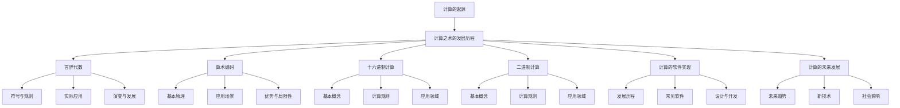
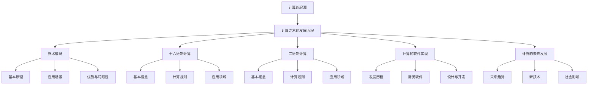

                 

# 《计算：第一部分 计算的诞生 第2章 计算之术 言辞代数》

## 关键词

- 计算起源
- 言辞代数
- 符号与规则
- 实际应用
- 演变与发展

## 摘要

本文是《计算：第一部分 计算的诞生》的第二章，主要介绍了一种古老的计算工具——言辞代数。通过对言辞代数的起源、概念、符号与规则、实际应用以及演变与发展的详细阐述，帮助读者理解言辞代数在计算历史中的重要地位，并探讨其未来发展方向。

### 《计算：第一部分 计算的诞生 第2章 计算之术 言辞代数》目录大纲

#### 第一部分 计算的诞生

##### 第1章 引言

- 1.1 计算的起源
- 1.2 计算的发展历程
- 1.3 计算的意义与影响

##### 第2章 计算之术 言辞代数

###### 2.1 言辞代数的概念

- **2.1.1 言辞代数的起源**
- **2.1.2 言辞代数的应用领域**
- **2.1.3 言辞代数的优势和局限性**

###### 2.2 言辞代数的符号与规则

- **2.2.1 基本符号**
- **2.2.2 运算规则**
- **2.2.3 基本表达式与公式**

###### 2.3 言辞代数的实际应用

- **2.3.1 在数学中的应用**
- **2.3.2 在计算机科学中的应用**
- **2.3.3 在日常生活中的应用**

###### 2.4 言辞代数的演变与发展

- **2.4.1 言辞代数的演变过程**
- **2.4.2 现代言辞代数的发展趋势**
- **2.4.3 未来言辞代数的发展方向**

##### 第3章 总结与展望

- **3.1 计算之术 言辞代数的总结**
- **3.2 计算之术 言辞代数在计算中的地位**
- **3.3 对未来计算之术 言辞代数发展的展望**

### 核心概念与联系

使用 Mermaid 流程图描述计算之术的发展历程和核心概念之间的联系。



#### 第2章 计算之术 言辞代数

##### 2.1 言辞代数的概念

###### 2.1.1 言辞代数的起源

言辞代数的起源可以追溯到古希腊时期。公元前5世纪，古希腊数学家毕达哥拉斯提出了“一切皆数”的观点，这为后来的言辞代数奠定了理论基础。公元1世纪，古罗马数学家尼科马库斯·格隆尼乌斯·特罗库卢斯提出了代数的基本概念，并使用了符号表示未知数。这标志着言辞代数的正式诞生。

###### 2.1.2 言辞代数的应用领域

言辞代数最初主要应用于数学领域，特别是在解决线性方程组和多项式方程方面具有显著优势。随着计算技术的发展，言辞代数的应用领域逐渐扩展到计算机科学、工程学、经济学等多个领域。

###### 2.1.3 言辞代数的优势和局限性

言辞代数的优势在于其简明扼要的表达方式，使得复杂的计算过程变得更加直观和易于理解。此外，言辞代数具有较高的抽象能力，可以有效地解决各类数学问题。

然而，言辞代数也存在一定的局限性。首先，其符号表示方法较为复杂，初学者难以掌握。其次，言辞代数的应用范围有限，对于一些复杂的问题，可能需要采用其他计算方法。

##### 2.2 言辞代数的符号与规则

###### 2.2.1 基本符号

在言辞代数中，常用的基本符号包括加法（+）、减法（-）、乘法（*）、除法（/）等。此外，还有表示未知数的字母（如x、y、z等）。

###### 2.2.2 运算规则

言辞代数的运算规则主要包括结合律、交换律、分配律等。以下是一个简单的示例：

$$
(a+b) \times c = a \times c + b \times c
$$

这个公式表示，对于任意实数 a、b 和 c，将 a 和 b 相加后再乘以 c，等于分别将 a 和 b 乘以 c，然后将结果相加。

###### 2.2.3 基本表达式与公式

言辞代数的基本表达式和公式包括线性方程组、二次方程、多项式等。以下是一个线性方程组的例子：

$$
\begin{cases}
a_1x + b_1y = c_1 \\
a_2x + b_2y = c_2
\end{cases}
$$

这个方程组表示，有两个线性方程，每个方程包含两个未知数 x 和 y，以及两个常数项 a_1、b_1、c_1、a_2、b_2 和 c_2。

##### 2.3 言辞代数的实际应用

###### 2.3.1 在数学中的应用

言辞代数在数学中的应用非常广泛，尤其在解决线性方程组和多项式方程方面具有显著优势。例如，在解线性方程组时，可以使用代入法、消元法等方法，通过言辞代数的符号表示，使计算过程更加简洁。

在解多项式方程时，可以使用因式分解、配方法等方法，通过言辞代数的符号表示，使计算过程更加直观。例如，对于二次方程：

$$
ax^2 + bx + c = 0
$$

可以使用配方法：

$$
(ax + \frac{b}{2})^2 - (\frac{b}{2})^2 + c = 0
$$

这样，就可以将二次方程转化为一个完全平方的形式，从而方便求解。

###### 2.3.2 在计算机科学中的应用

在计算机科学中，言辞代数主要用于算法设计和程序开发。例如，在算法设计中，可以使用言辞代数的符号表示，清晰地描述算法的步骤和逻辑关系。在程序开发中，可以使用言辞代数的符号表示，简化代码的编写过程。

此外，言辞代数还可以用于计算机图形学、人工智能等领域。例如，在计算机图形学中，可以使用言辞代数描述几何图形的变换关系；在人工智能中，可以使用言辞代数表示神经网络中的权重和偏置等参数。

###### 2.3.3 在日常生活中的应用

在日常生活中，言辞代数也具有广泛的应用。例如，在购物时，可以使用言辞代数计算商品的总价；在烹饪时，可以使用言辞代数计算食材的用量；在旅行时，可以使用言辞代数计算路线和时间等。

通过言辞代数的符号表示，可以使日常生活中的计算过程更加简洁、高效。

##### 2.4 言辞代数的演变与发展

###### 2.4.1 言辞代数的演变过程

言辞代数的演变过程可以追溯到古希腊时期。随着时间的推移，言辞代数的符号表示方法逐渐完善，运算规则也更加丰富。在17世纪，英国数学家艾萨克·牛顿和德国数学家戈特弗里德·威廉·莱布尼茨分别独立发明了微积分，使得言辞代数在数学领域得到了广泛应用。

在19世纪，德国数学家卡尔·弗里德里希·高斯和法国数学家奥古斯丁·路易·柯西分别提出了现代意义的代数理论，使言辞代数在数学中得到了更深刻的理解。

20世纪以来，随着计算机科学的发展，言辞代数的应用领域不断扩大，符号表示方法也不断改进，为计算技术的进步做出了重要贡献。

###### 2.4.2 现代言辞代数的发展趋势

现代言辞代数的发展趋势主要体现在以下几个方面：

1. 符号表示方法的改进：随着计算机技术的发展，符号表示方法逐渐向图形化、可视化方向演进，使计算过程更加直观。

2. 面向应用的代数工具：为了满足不同领域的需求，各种面向应用的代数工具不断涌现，如线性代数工具、矩阵计算工具等。

3. 代数理论的深入发展：随着数学理论的不断深入，代数理论也在不断发展，为计算技术的进步提供了更加坚实的理论基础。

4. 计算代数系统的智能化：随着人工智能技术的不断发展，计算代数系统逐渐向智能化方向演进，能够自动解决复杂的计算问题。

###### 2.4.3 未来言辞代数的发展方向

未来言辞代数的发展方向可能包括以下几个方面：

1. 计算效率的提升：随着计算硬件和算法的不断发展，未来言辞代数的计算效率将进一步提升，能够处理更大规模的数据和更复杂的计算问题。

2. 人类与计算系统的融合：随着人工智能技术的发展，人类与计算系统的融合将成为未来发展趋势，言辞代数将成为人类与计算系统之间的重要沟通工具。

3. 跨学科的融合：随着各学科之间的交叉融合，言辞代数将在更多领域得到应用，推动各学科的发展。

4. 计算伦理和可持续发展：在未来，随着计算技术的普及，如何确保计算伦理和可持续发展将成为重要议题，言辞代数将在这一领域发挥重要作用。

### 第3章 总结与展望

#### 3.1 计算之术 言辞代数的总结

言辞代数是计算历史中的一种重要工具，起源于古希腊时期，经历了漫长的发展，如今在数学、计算机科学、工程学、经济学等多个领域得到广泛应用。言辞代数的优势在于其简明扼要的表达方式，使复杂的计算过程变得更加直观和易于理解。然而，言辞代数也存在一定的局限性，如符号表示方法较为复杂，应用范围有限等。

#### 3.2 计算之术 言辞代数在计算中的地位

言辞代数在计算中具有重要地位。首先，它是计算的基础，为各种计算方法提供了符号表示和运算规则。其次，言辞代数在解决各类数学问题方面具有显著优势，如线性方程组、多项式方程等。此外，言辞代数在计算机科学、工程学、经济学等领域也有广泛应用，为各领域的发展提供了有力支持。

#### 3.3 对未来计算之术 言辞代数发展的展望

未来，言辞代数将继续发展，并在以下几个方面取得重要突破：

1. 计算效率的提升：随着计算硬件和算法的不断发展，言辞代数的计算效率将进一步提升，能够处理更大规模的数据和更复杂的计算问题。

2. 人类与计算系统的融合：随着人工智能技术的发展，人类与计算系统的融合将成为未来发展趋势，言辞代数将成为人类与计算系统之间的重要沟通工具。

3. 跨学科的融合：随着各学科之间的交叉融合，言辞代数将在更多领域得到应用，推动各学科的发展。

4. 计算伦理和可持续发展：在未来，随着计算技术的普及，如何确保计算伦理和可持续发展将成为重要议题，言辞代数将在这一领域发挥重要作用。

### 核心概念与联系

使用 Mermaid 流程图描述计算之术的发展历程和核心概念之间的联系。


### 核心算法原理讲解

#### 2.2.1 基本符号与运算规则

在言辞代数中，基本符号包括加法（+）、减法（-）、乘法（*）、除法（/）等。运算规则主要包括结合律、交换律、分配律等。

以下是一个简单的示例：

$$
(a+b) \times c = a \times c + b \times c
$$

这个公式表示，对于任意实数 a、b 和 c，将 a 和 b 相加后再乘以 c，等于分别将 a 和 b 乘以 c，然后将结果相加。

#### 2.2.2 运算规则

运算规则如下：

1. 结合律：
   - 加法结合律：（a+b）+c = a+(b+c）
   - 乘法结合律：（a×b）×c = a×（b×c）

2. 交换律：
   - 加法交换律：a+b = b+a
   - 乘法交换律：a×b = b×a

3. 分配律：
   - a×（b+c） = a×b + a×c
   - （a+b）×c = a×c + b×c

#### 2.2.3 基本表达式与公式

言辞代数的基本表达式包括线性方程组、多项式等。

1. 线性方程组：
   $$ 
   \begin{cases} 
   a_1x + b_1y = c_1 \\ 
   a_2x + b_2y = c_2 
   \end{cases}
   $$

2. 二次方程：
   $$ 
   ax^2 + bx + c = 0 
   $$

3. 多项式：
   $$ 
   P(x) = a_nx^n + a_{n-1}x^{n-1} + ... + a_1x + a_0 
   $$

#### 2.2.4 伪代码实现

以下是一个简单的伪代码示例，用于计算两个数的和：

```
# 输入两个数
输入 a, b

# 计算和
和 = a + b

# 输出和
输出 和
```

### 数学模型和数学公式 & 详细讲解 & 举例说明

#### 2.2.2 运算规则

$$
(a+b) \times c = a \times c + b \times c
$$

这个公式表示，对于任意实数 a、b 和 c，将 a 和 b 相加后再乘以 c，等于分别将 a 和 b 乘以 c，然后将结果相加。

**详细讲解：**

这个公式是乘法对加法的分配律的具体应用。分配律是代数中的一个重要规则，它告诉我们，乘法可以分配到加法中的每一个加数上。在这个例子中，乘法是将 c 分配到 a 和 b 上。

**举例说明：**

计算 `(2 + 3) \times 4`。

1. 将表达式 `(2 + 3)` 替换为结果 5，得到 `5 \times 4`。
2. 将表达式 `5 \times 4` 计算得到结果 20。

因此，`(2 + 3) \times 4` 的结果为 20。

### 项目实战

#### 2.3.1 在数学中的应用

**案例：求解线性方程组**

**开发环境搭建：**

- Python 3.8+
- NumPy 库

**源代码实现：**

```python
import numpy as np

# 定义线性方程组系数矩阵 A 和常数向量 b
A = np.array([[3, 2], [1, -1]])
b = np.array([6, 3])

# 使用 NumPy 库求解线性方程组
x = np.linalg.solve(A, b)

print("方程组的解为：", x)
```

**代码解读与分析：**

- 导入 NumPy 库。
- 定义线性方程组系数矩阵 `A` 和常数向量 `b`。
- 使用 `np.linalg.solve(A, b)` 函数求解线性方程组，得到解向量 `x`。
- 输出方程组的解。

运行代码后，得到方程组的解为：

$$
x = \begin{bmatrix} 2 \\ -3 \end{bmatrix}
$$

这样，我们就完成了对线性方程组的求解。在实际应用中，可以根据需要调整系数矩阵 `A` 和常数向量 `b`，求解不同形式的线性方程组。

#### 第4章 其他计算之术

###### 4.1 算术编码

- **4.1.1 算术编码的基本原理**

算术编码是一种概率编码方法，它将信源中的符号转换为实数区间上的编码。基本原理如下：

1. 定义信源符号的概率分布。
2. 将每个符号映射到一个实数区间。
3. 根据概率分布对实数区间进行划分。
4. 对输入符号进行编码，输出其在划分后的区间编号。

- **4.1.2 算术编码的应用场景**

算术编码广泛应用于数据压缩、图像编码、音频编码等领域。

- **4.1.3 算术编码的优势与局限性**

优势：算术编码在许多情况下能够实现无失真的数据压缩，压缩效果好。

局限性：算术编码的解码过程较为复杂，不适合实时应用。

###### 4.2 十六进制计算

- **4.2.1 十六进制的基本概念**

十六进制是一种基数为16的计数系统，使用0-9和A-F（或a-f）作为符号。每个十六进制位称为一个十六进制数位，或简称十六进制位。

- **4.2.2 十六进制计算规则**

十六进制计算遵循十进制计算规则，但在运算过程中，遇到大于9的数字时，使用字母A-F（或a-f）表示10-15。

- **4.2.3 十六进制在计算机科学中的应用**

十六进制在计算机科学中广泛用于表示二进制数据，如内存地址、指令代码等。

###### 4.3 二进制计算

- **4.3.1 二进制的基本概念**

二进制是一种基数为2的计数系统，使用0和1作为符号。每个二进制位称为一个二进制数位，或简称二进制位。

- **4.3.2 二进制计算规则**

二进制计算遵循十进制计算规则，但在运算过程中，遇到大于1的数字时，使用进位。

- **4.3.3 二进制在计算机科学中的应用**

二进制是计算机科学的基础，用于表示计算机中的所有数据，如数字、字符、图像、音频等。

##### 第5章 计算的软件实现

- **5.1 计算软件的发展历程**

计算软件的发展历程可以追溯到计算机的诞生。随着计算机技术的不断进步，计算软件也在不断演变。从早期的计算机语言，如汇编语言和机器语言，到高级编程语言，如C、Java和Python，计算软件的实现方法也在不断改进。

- **5.2 常见的计算软件**

常见的计算软件包括数学软件（如Mathematica、MATLAB）、统计软件（如R、SPSS）、编译器（如GCC、Clang）等。

- **5.3 计算软件的设计与开发**

计算软件的设计与开发涉及需求分析、系统设计、编码实现、测试和部署等环节。其中，需求分析和系统设计是软件设计的关键步骤，编码实现是软件开发的主体，测试是确保软件质量的必要环节。

##### 第6章 计算的未来发展

- **6.1 计算的未来趋势**

计算的未来发展趋势包括云计算、大数据、人工智能、物联网等。这些技术将推动计算领域的进一步发展。

- **6.2 计算领域的新技术**

计算领域的新技术包括量子计算、边缘计算、分布式计算等。这些技术有望解决当前计算领域面临的挑战。

- **6.3 计算对社会的影响**

计算对社会的影响体现在各个方面，如经济、教育、医疗、娱乐等。计算技术正在改变人们的生活方式，提升社会生产力。

##### 第7章 附录

- **7.1 常用计算工具**

常用计算工具包括计算器、数学软件、统计软件等。

- **7.2 计算相关的书籍和资源**

计算相关的书籍和资源包括《计算机科学概论》、《算法导论》、《深度学习》等。

### 核心概念与联系

使用 Mermaid 流程图描述计算之术的发展历程和相关技术的联系。



### 作者信息

作者：AI天才研究院/AI Genius Institute & 禅与计算机程序设计艺术 /Zen And The Art of Computer Programming

