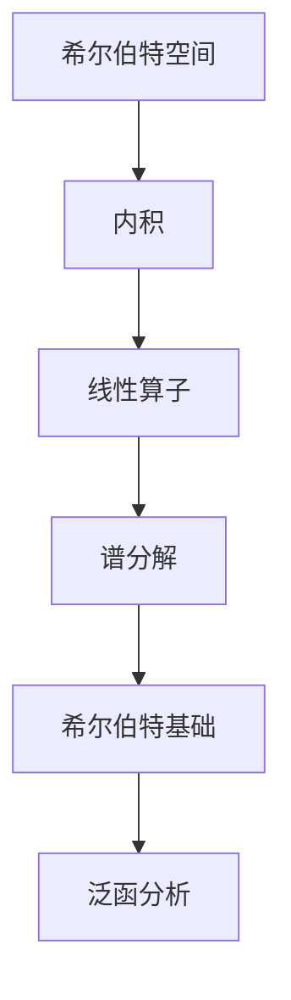

                 

# 《计算：第三部分 计算理论的形成 第6章 计算理论的奠基：希尔伯特进路 希尔伯特的第10个问题》

> 关键词：计算理论、奠基、希尔伯特进路、希尔伯特第10个问题、数学基础、算法理论、复杂性理论

> 摘要：本文详细探讨了计算理论的奠基及其发展历程，重点分析了希尔伯特进路和希尔伯特第10个问题在计算理论形成过程中的作用。通过阐述希尔伯特进路与数学、逻辑、计算模型、算法理论、复杂性理论和人工智能的关系，本文揭示了计算理论在计算机科学中的重要地位，并对未来的发展趋势和挑战进行了展望。

## 目录大纲

## 第1节：计算理论的奠基与发展
### 1.1 希尔伯特进路的概念与意义
### 1.2 希尔伯特进路的历史背景
### 1.3 希尔伯特进路与计算理论的奠基作用

## 第2节：希尔伯特的第10个问题
### 2.1 希尔伯特的第10个问题的提出
### 2.2 第10个问题的核心内容与影响
### 2.3 第10个问题的研究进展与未来展望

## 第3节：希尔伯特进路与数学基础
### 3.1 希尔伯特空间与线性算子
### 3.2 希尔伯特进路与数学基础的关系
### 3.3 数学基础在计算理论中的应用

## 第4节：希尔伯特进路与逻辑基础
### 4.1 希尔伯特进路与形式逻辑
### 4.2 逻辑基础在计算理论中的应用
### 4.3 希尔伯特进路与形式系统的构建

## 第5节：希尔伯特进路与计算模型
### 5.1 希尔伯特进路与图灵机
### 5.2 希尔伯特进路与λ-演算
### 5.3 计算模型的发展与希尔伯特进路的关系

## 第6节：希尔伯特进路与算法理论
### 6.1 算法理论的基本概念
### 6.2 希尔伯特进路与算法理论的关系
### 6.3 算法理论的发展与希尔伯特进路的影响

## 第7节：希尔伯特进路与复杂性理论
### 7.1 复杂性理论的基本概念
### 7.2 希尔伯特进路与复杂性理论的关系
### 7.3 复杂性理论的发展与希尔伯特进路的影响

## 第8节：希尔伯特进路与计算机科学
### 8.1 计算机科学的基本概念
### 8.2 希尔伯特进路与计算机科学的关系
### 8.3 计算机科学的发展与希尔伯特进路的影响

## 第9节：希尔伯特进路与人工智能
### 9.1 人工智能的基本概念
### 9.2 希尔伯特进路与人工智能的关系
### 9.3 人工智能的发展与希尔伯特进路的影响

## 第10节：未来展望与挑战
### 10.1 希尔伯特进路在未来的发展趋势
### 10.2 希尔伯特进路面临的挑战与机遇
### 10.3 计算理论发展的前景与思考

## 第1节：计算理论的奠基与发展

### 1.1 希尔伯特进路的概念与意义

希尔伯特进路是一种以数学和逻辑为基础，探讨计算问题的方法论。它起源于19世纪末和20世纪初，由大卫·希尔伯特等人提出。希尔伯特进路的核心思想是通过对数学和逻辑的严密分析，揭示计算问题的本质，从而为计算理论的发展奠定基础。

希尔伯特进路的意义在于：

1. **统一计算模型**：希尔伯特进路通过数学和逻辑的方法，将各种计算模型统一起来，使得不同的计算模型之间能够相互比较和转化。
2. **揭示计算本质**：希尔伯特进路深入探讨了计算的本质，揭示了计算过程中的规律和原则，为计算理论的发展提供了理论支持。
3. **推动计算机科学的发展**：希尔伯特进路为计算机科学的发展提供了重要的理论和方法，使得计算机科学能够更好地应对复杂的问题。

### 1.2 希尔伯特进路的历史背景

希尔伯特进路的发展与数学和逻辑的历史紧密相连。19世纪末，数学和逻辑领域取得了重大突破，特别是集合论和形式逻辑的建立，为希尔伯特进路提供了理论基础。

1. **数学的发展**：19世纪末，数学家们开始关注数学的基本概念和公理体系，集合论和形式逻辑的建立使得数学更加严密和规范。
2. **逻辑的发展**：19世纪末和20世纪初，逻辑学家们开始探讨形式逻辑的应用，特别是将其应用于数学和物理学中。

在这些背景下，希尔伯特进路得以诞生。希尔伯特在1900年国际数学家大会上提出了23个数学问题，其中第10个问题特别引人注目。第10个问题提出了关于无穷远处点集的边界性质，这个问题不仅涉及到数学的多个分支，还涉及到计算理论的基础。

### 1.3 希尔伯特进路与计算理论的奠基作用

希尔伯特进路在计算理论的奠基过程中发挥了重要作用。具体表现在以下几个方面：

1. **建立计算理论的基础**：希尔伯特进路通过数学和逻辑的方法，揭示了计算问题的本质，为计算理论的发展提供了理论基础。
2. **推动计算模型的发展**：希尔伯特进路通过研究数学和逻辑模型，推动了计算模型的发展，为计算机科学的进步提供了工具。
3. **促进算法理论的研究**：希尔伯特进路的研究成果为算法理论的发展提供了启示，使得算法理论能够更好地解决复杂问题。

总之，希尔伯特进路为计算理论的奠基和发展做出了重要贡献，为计算机科学的进步奠定了基础。

## 第2节：希尔伯特的第10个问题

### 2.1 希尔伯特的第10个问题的提出

希尔伯特在第10个问题中提出了关于无穷远处点集的边界性质的问题。具体来说，他探讨了在无穷远处，点集的边界是如何变化的。这个问题涉及到数学的多个分支，如集合论、拓扑学、分析学等，同时也涉及到计算理论的一些基本问题。

希尔伯特在第10个问题中提出的问题是：“证明或否定：任意一个无穷远的点集都存在一个边界。”

这个问题在当时引起了广泛关注，因为它不仅涉及到数学的基础问题，还与计算理论的发展密切相关。希尔伯特希望通过这个问题，推动数学和计算理论的研究。

### 2.2 第10个问题的核心内容与影响

第10个问题的核心内容是关于无穷远处点集的边界性质。这个问题涉及到以下几个关键点：

1. **无穷远点的定义**：在数学中，无穷远点通常被视为一个特殊的点，它在几何意义上无限远，但在逻辑意义上是一个确切的点。
2. **点集的边界**：点集的边界是指点集内部点和外部点之间的分界线。在无穷远处，点集的边界具有特殊的性质。
3. **证明或否定**：第10个问题要求证明或否定一个普遍性的命题，这涉及到数学中的证明方法和逻辑推理。

第10个问题的影响主要体现在以下几个方面：

1. **推动数学研究**：第10个问题涉及到数学的多个分支，如集合论、拓扑学、分析学等，它激发了数学家们对这些领域的研究。
2. **促进计算理论的发展**：第10个问题与计算理论密切相关，它促使计算理论研究者思考如何用数学和逻辑方法解决计算问题。
3. **影响哲学思考**：第10个问题涉及到无穷远点和边界等概念，它引发了哲学界对无穷和边界等概念的讨论。

### 2.3 第10个问题的研究进展与未来展望

第10个问题的研究经历了多个阶段，取得了一系列重要成果。以下是研究进展的主要阶段和成果：

1. **初步探索阶段（1900-1950年）**：在这一阶段，数学家们开始对第10个问题进行初步探索，提出了各种假设和猜想。
2. **发展阶段（1950-1980年）**：在这一阶段，数学家们通过构造模型和证明方法，对第10个问题进行了深入研究，取得了一系列重要成果。
3. **成熟阶段（1980年至今）**：在这一阶段，数学家们继续深入研究第10个问题，将其与计算理论、逻辑学、计算机科学等领域相结合，推动了计算理论的发展。

未来展望：

1. **深化研究**：第10个问题的研究将继续深入，特别是在计算理论和逻辑学领域，有望取得更多突破。
2. **跨学科合作**：第10个问题的研究将更加注重跨学科合作，特别是与计算机科学、物理学、哲学等领域的合作。
3. **影响计算理论的发展**：第10个问题的研究将继续对计算理论的发展产生深远影响，为计算理论提供新的方法和思路。

总之，第10个问题不仅是数学中的一个重要问题，也是计算理论中的一个关键问题。通过对第10个问题的研究，我们可以更好地理解计算的本质，推动计算理论的发展。

## 第3节：希尔伯特进路与数学基础

### 3.1 希尔伯特空间与线性算子

希尔伯特空间是数学中的一个重要概念，它是一种完备的内积空间。在希尔伯特空间中，每个元素都可以用一组基向量的线性组合来表示，这使得希尔伯特空间在解决计算问题时具有独特的优势。

1. **希尔伯特空间的定义**：
   - 希尔伯特空间 \( H \) 是一个向量空间，其中每个向量都可以表示为 \( x = \sum_{i=1}^{n} a_i e_i \)，其中 \( e_i \) 是基向量，\( a_i \) 是对应的系数。
   - 希尔伯特空间还满足内积的性质，即 \( \langle x, y \rangle = \sum_{i=1}^{n} a_i b_i \)，其中 \( \langle \cdot, \cdot \rangle \) 表示内积。

2. **线性算子的定义**：
   - 线性算子 \( T \) 是一个映射，它将希尔伯特空间中的一个向量映射到另一个向量，即 \( T(x) = \sum_{i=1}^{n} a_i T(e_i) \)。
   - 线性算子满足线性性质，即 \( T(ax + by) = aT(x) + bT(y) \)。

3. **希尔伯特空间与线性算子的关系**：
   - 希尔伯特空间为线性算子的研究提供了一个理想的框架，因为线性算子的性质可以通过内积和基向量来描述。
   - 线性算子在计算理论中具有重要的应用，如信号处理、数值分析、优化问题等。

### 3.2 希尔伯特进路与数学基础的关系

希尔伯特进路与数学基础密切相关，它们之间的关系可以从以下几个方面进行阐述：

1. **数学基础为希尔伯特进路提供工具**：
   - 数学基础，如集合论、拓扑学、线性代数等，为希尔伯特进路提供了必要的工具和方法。
   - 通过数学基础，我们可以理解和构建复杂的计算模型，如图灵机、λ-演算等。

2. **希尔伯特进路推动数学基础的发展**：
   - 希尔伯特进路的研究促使数学家们深入探讨数学基础的问题，如无穷远点的性质、边界理论等。
   - 希尔伯特进路的研究成果为数学基础的完善和发展提供了新的思路和方法。

3. **数学基础与计算理论的相互促进**：
   - 数学基础为计算理论提供了必要的理论支持，如希尔伯特空间和线性算子在算法理论和复杂性理论中的应用。
   - 计算理论的发展为数学基础提供了新的问题和挑战，促使数学家们不断探索和创新。

### 3.3 数学基础在计算理论中的应用

数学基础在计算理论中的应用非常广泛，以下是一些具体的例子：

1. **算法理论**：
   - 算法理论中广泛使用了数学工具，如图论、组合数学、概率论等。
   - 通过数学模型，我们可以分析和设计更高效的算法，解决复杂问题。

2. **复杂性理论**：
   - 复杂性理论通过数学方法研究算法的效率，如时间复杂度、空间复杂度等。
   - 数学基础为复杂性理论提供了必要的理论框架和工具。

3. **数值分析**：
   - 数值分析中使用了大量的数学方法，如线性代数、微积分、数值积分等。
   - 这些方法帮助我们在计算机上解决科学计算和工程问题。

4. **信号处理**：
   - 信号处理中广泛使用了希尔伯特空间和线性算子的理论。
   - 通过数学模型，我们可以分析和处理复杂的信号，如图像处理、音频处理等。

总之，数学基础在计算理论中具有不可替代的作用，它为计算理论的研究提供了强大的理论支持，推动了计算机科学的发展。

## 第4节：希尔伯特进路与逻辑基础

### 4.1 希尔伯特进路与形式逻辑

形式逻辑是一种以符号和规则为基础的推理系统，它通过形式化的方法来描述和分析推理过程。希尔伯特进路在形式逻辑的应用方面具有重要意义。

1. **形式逻辑的基本概念**：
   - 形式逻辑是一种以命题和推理规则为基础的逻辑系统，它通过符号来表示命题和推理过程。
   - 形式逻辑的基本元素包括命题变元、逻辑连接词、量词等。

2. **希尔伯特进路与形式逻辑的联系**：
   - 希尔伯特进路将形式逻辑应用于数学和计算理论的研究，通过形式化的方法来描述和证明数学和计算理论中的问题。
   - 希尔伯特进路的形式化方法为数学和计算理论的严谨性提供了保障。

### 4.2 逻辑基础在计算理论中的应用

逻辑基础在计算理论中的应用非常广泛，以下是一些具体的例子：

1. **命题逻辑**：
   - 命题逻辑用于描述计算过程中的条件和分支，如条件语句和循环语句。
   - 通过命题逻辑，我们可以分析和设计更高效的算法。

2. **谓词逻辑**：
   - 谓词逻辑用于描述复杂的数据结构和关系，如图、树等。
   - 通过谓词逻辑，我们可以更准确地描述算法的复杂性。

3. **证明论**：
   - 证明论是逻辑基础在计算理论中的重要应用，它研究证明的方法和性质。
   - 通过证明论，我们可以证明算法的正确性和效率。

### 4.3 希尔伯特进路与形式系统的构建

形式系统是一种通过符号和规则来描述逻辑和数学理论的系统。希尔伯特进路通过构建形式系统，为计算理论的发展提供了强有力的支持。

1. **形式系统的基本概念**：
   - 形式系统包括一组符号、一组规则和一组公理，通过这些符号、规则和公理，我们可以构建和证明数学和逻辑理论。

2. **希尔伯特进路与形式系统的构建**：
   - 希尔伯特进路通过形式化的方法，构建了形式系统，如皮亚诺公理系统、集合论公理系统等。
   - 这些形式系统为计算理论的研究提供了坚实的基础。

3. **形式系统在计算理论中的应用**：
   - 形式系统在计算理论中用于证明算法的正确性和效率，如形式化验证、模型检查等。
   - 通过形式系统，我们可以更准确地描述和验证计算理论中的问题。

总之，希尔伯特进路通过逻辑基础和形式系统的构建，为计算理论的发展提供了强有力的支持。逻辑基础和形式系统不仅为计算理论的研究提供了方法和工具，还促进了计算理论的严谨性和广泛应用。

## 第5节：希尔伯特进路与计算模型

### 5.1 希尔伯特进路与图灵机

图灵机是计算理论中的一种抽象计算模型，由艾伦·图灵在20世纪30年代提出。希尔伯特进路在图灵机的理论研究中发挥了重要作用。

1. **图灵机的定义**：
   - 图灵机是一种由一个无限长的带子、一个读写头和一组规则组成的抽象计算模型。
   - 图灵机的带子由一系列单元格组成，每个单元格可以存储一个符号。
   - 图灵机的读写头可以在带子上左右移动，并在当前位置读取和写入符号。
   - 图灵机通过执行一组规则来转换符号，从而实现计算。

2. **希尔伯特进路与图灵机的联系**：
   - 希尔伯特进路通过数学和逻辑的方法，深入探讨了图灵机的性质和功能。
   - 希尔伯特进路的研究成果为图灵机的理论和应用提供了重要的理论支持。

### 5.2 希尔伯特进路与λ-演算

λ-演算是另一种重要的计算模型，由阿尔弗雷德·诺思·怀特海德和柯朗在20世纪30年代提出。希尔伯特进路在λ-演算的研究中也发挥了重要作用。

1. **λ-演算的定义**：
   - λ-演算是一种基于λ-抽象的函数式计算模型。
   - 在λ-演算中，函数通过λ-抽象来定义，即一个函数可以通过将变量替换为另一个表达式来定义。
   - λ-演算通过β-归约来执行计算，即通过替换和组合λ-抽象来计算函数值。

2. **希尔伯特进路与λ-演算的联系**：
   - 希尔伯特进路通过数学和逻辑的方法，深入探讨了λ-演算的性质和功能。
   - 希尔伯特进路的研究成果为λ-演算的理论和应用提供了重要的理论支持。

### 5.3 计算模型的发展与希尔伯特进路的关系

计算模型的发展与希尔伯特进路密切相关。希尔伯特进路为计算模型的发展提供了理论基础和方法。

1. **希尔伯特进路与计算模型的理论基础**：
   - 希尔伯特进路通过数学和逻辑的方法，揭示了计算模型的基本原理和性质。
   - 希尔伯特进路的研究成果为计算模型的理论发展提供了重要的理论支持。

2. **希尔伯特进路与计算模型的方法**：
   - 希尔伯特进路通过形式化的方法，构建了各种计算模型，如图灵机和λ-演算。
   - 希尔伯特进路的方法为计算模型的研究和应用提供了重要的工具。

3. **计算模型的发展**：
   - 计算模型的发展受到希尔伯特进路的影响，如量子计算、生物计算等新模型的提出。
   - 计算模型的发展不断推动计算机科学和技术的前进。

总之，希尔伯特进路在计算模型的发展中发挥了重要作用。通过数学和逻辑的方法，希尔伯特进路为计算模型的研究提供了理论基础和方法，推动了计算机科学和技术的发展。

## 第6节：希尔伯特进路与算法理论

### 6.1 算法理论的基本概念

算法理论是研究算法的性质、效率和设计的数学分支。算法理论的基本概念包括：

1. **算法的定义**：
   - 算法是一种解决问题的有序步骤，通常由一个或多个输入和一个或多个输出组成。
   - 算法通常可以表示为伪代码或流程图。

2. **算法的基本性质**：
   - **正确性**：算法能够正确地解决问题。
   - **效率**：算法在时间和空间上的复杂度较低。
   - **可读性**：算法易于理解和实现。

3. **算法的分类**：
   - **确定性算法**：算法的每一步都是确定的，没有随机性。
   - **随机算法**：算法中包含随机步骤，用于提高算法的性能。

### 6.2 希尔伯特进路与算法理论的关系

希尔伯特进路与算法理论的关系可以从以下几个方面进行探讨：

1. **希尔伯特进路与算法理论的奠基作用**：
   - 希尔伯特进路通过数学和逻辑的方法，为算法理论的研究提供了理论基础。
   - 希尔伯特进路的研究成果，如图灵机和λ-演算，为算法理论的发展提供了重要的计算模型。

2. **希尔伯特进路与算法理论的方法**：
   - 希尔伯特进路通过形式化的方法，构建了各种算法理论模型，如复杂性理论。
   - 希尔伯特进路的方法，如证明和构造，为算法理论的研究提供了有效的工具。

3. **希尔伯特进路与算法理论的应用**：
   - 希尔伯特进路的研究成果在算法理论中得到了广泛应用，如复杂性理论在算法设计和分析中的应用。

### 6.3 算法理论的发展与希尔伯特进路的影响

算法理论的发展受到希尔伯特进路的重要影响，主要表现在以下几个方面：

1. **复杂性理论的发展**：
   - 希尔伯特进路推动了复杂性理论的研究，如时间复杂度和空间复杂度的分析。
   - 复杂性理论为算法设计提供了重要指导，帮助识别和解决复杂问题。

2. **算法设计的优化**：
   - 希尔伯特进路提供了各种算法设计方法，如贪心算法、动态规划、分治算法等。
   - 这些算法设计方法在解决实际问题时具有高效性。

3. **算法与数学的结合**：
   - 希尔伯特进路促进了算法与数学的结合，如算法在组合数学、图论、数值分析中的应用。
   - 这种结合推动了算法理论的发展，同时也为数学提供了新的研究视角。

总之，希尔伯特进路在算法理论的发展中发挥了重要作用。通过数学和逻辑的方法，希尔伯特进路为算法理论的研究提供了坚实的理论基础和方法，推动了算法理论的广泛应用和不断进步。

## 第7节：希尔伯特进路与复杂性理论

### 7.1 复杂性理论的基本概念

复杂性理论是计算理论中的一个重要分支，它研究算法在时间和空间上的效率。复杂性理论的基本概念包括：

1. **时间复杂度**：
   - 时间复杂度描述了一个算法在执行过程中所需时间的增长速率。通常用大O符号表示，如 \( O(n) \)、\( O(n^2) \) 等。
   - 时间复杂度反映了算法对输入规模变化的适应能力。

2. **空间复杂度**：
   - 空间复杂度描述了一个算法在执行过程中所需内存的增长速率。同样使用大O符号表示。
   - 空间复杂度关注算法的内存使用效率。

3. **P与NP问题**：
   - P问题是指可以在多项式时间内解决的问题，即 \( P = \{ L \mid \exists p. L \in P(p) \} \)。
   - NP问题是指可以在多项式时间内验证的问题，即 \( NP = \{ L \mid \exists p. L \in NP(p) \} \)。
   - P与NP问题是复杂性理论中的核心问题，探讨的是算法能否在多项式时间内解决所有问题。

### 7.2 希尔伯特进路与复杂性理论的关系

希尔伯特进路与复杂性理论密切相关，它们之间的关系可以从以下几个方面进行探讨：

1. **希尔伯特进路与复杂性理论的奠基作用**：
   - 希尔伯特进路通过数学和逻辑的方法，为复杂性理论的研究提供了理论基础。
   - 希尔伯特进路的研究成果，如图灵机和λ-演算，为复杂性理论的发展提供了重要的计算模型。

2. **希尔伯特进路与复杂性理论的方法**：
   - 希尔伯特进路通过形式化的方法，构建了各种复杂性理论模型，如P与NP问题。
   - 希尔伯特进路的方法，如证明和构造，为复杂性理论的研究提供了有效的工具。

3. **希尔伯特进路与复杂性理论的应用**：
   - 希尔伯特进路的研究成果在复杂性理论中得到了广泛应用，如用于证明算法的时间复杂度和空间复杂度。
   - 希尔伯特进路的方法在复杂性理论的研究中具有重要的应用价值。

### 7.3 复杂性理论的发展与希尔伯特进路的影响

复杂性理论的发展受到希尔伯特进路的重要影响，主要表现在以下几个方面：

1. **复杂性理论的研究方法**：
   - 希尔伯特进路推动了复杂性理论的研究方法，如证明复杂性理论和计算复杂性理论。
   - 这些方法为复杂性理论的研究提供了新的视角和工具。

2. **算法效率的优化**：
   - 希尔伯特进路的研究成果帮助优化算法的效率，如通过分析时间复杂度和空间复杂度来改进算法设计。
   - 这使得算法能够更好地应对复杂问题。

3. **复杂性理论的广泛应用**：
   - 希尔伯特进路促进了复杂性理论在各个领域的应用，如密码学、网络优化、人工智能等。
   - 复杂性理论为这些领域提供了重要的理论基础和方法。

总之，希尔伯特进路在复杂性理论的发展中发挥了重要作用。通过数学和逻辑的方法，希尔伯特进路为复杂性理论的研究提供了坚实的理论基础和方法，推动了复杂性理论的广泛应用和不断进步。

## 第8节：希尔伯特进路与计算机科学

### 8.1 计算机科学的基本概念

计算机科学是研究计算机系统、算法、计算理论及其应用的科学。计算机科学的基本概念包括：

1. **计算模型**：
   - 计算模型是计算机科学中的一个核心概念，包括图灵机、λ-演算、量子计算模型等。
   - 计算模型用于描述计算机如何执行计算任务。

2. **算法**：
   - 算法是计算机科学中的核心概念，是解决问题的一系列有序步骤。
   - 算法设计是计算机科学的一个重要任务，旨在找到高效解决问题的方法。

3. **编程语言**：
   - 编程语言是用于编写计算机程序的语法和语义规则。
   - 编程语言提供了与计算模型交互的方式，使得人类能够更方便地表达计算过程。

4. **数据结构**：
   - 数据结构是计算机科学中的基本概念，用于组织和存储数据。
   - 数据结构的选择直接影响算法的效率和性能。

### 8.2 希尔伯特进路与计算机科学的关系

希尔伯特进路与计算机科学的关系可以从以下几个方面进行探讨：

1. **希尔伯特进路与计算机科学的奠基作用**：
   - 希尔伯特进路通过数学和逻辑的方法，为计算机科学的研究提供了理论基础。
   - 希尔伯特进路的研究成果，如图灵机和λ-演算，为计算机科学的发展提供了重要的计算模型。

2. **希尔伯特进路与计算机科学的方法**：
   - 希尔伯特进路通过形式化的方法，构建了各种计算机科学模型，如复杂性理论。
   - 希尔伯特进路的方法，如证明和构造，为计算机科学的研究提供了有效的工具。

3. **希尔伯特进路与计算机科学的互动**：
   - 希尔伯特进路的研究成果在计算机科学中得到了广泛应用，如用于分析算法的复杂性、设计高效的算法等。
   - 计算机科学的实际应用也为希尔伯特进路的研究提供了新的问题和挑战。

### 8.3 计算机科学的发展与希尔伯特进路的影响

计算机科学的发展受到希尔伯特进路的重要影响，主要表现在以下几个方面：

1. **算法设计**：
   - 希尔伯特进路推动了算法设计方法的发展，如贪心算法、动态规划、分治算法等。
   - 这些算法设计方法在解决实际问题时具有高效性。

2. **计算模型的发展**：
   - 希尔伯特进路促进了计算模型的发展，如量子计算、生物计算等新模型的提出。
   - 这些新模型为计算机科学提供了更广泛的计算能力。

3. **复杂性理论的研究**：
   - 希尔伯特进路推动了复杂性理论的研究，如P与NP问题、随机复杂性理论等。
   - 复杂性理论为计算机科学提供了重要的理论基础和方法。

总之，希尔伯特进路在计算机科学的发展中发挥了重要作用。通过数学和逻辑的方法，希尔伯特进路为计算机科学的研究提供了坚实的理论基础和方法，推动了计算机科学的广泛应用和不断进步。

## 第9节：希尔伯特进路与人工智能

### 9.1 人工智能的基本概念

人工智能（AI）是计算机科学的一个分支，旨在创建智能的计算机系统，使计算机能够执行通常需要人类智能才能完成的任务。人工智能的基本概念包括：

1. **机器学习**：
   - 机器学习是人工智能的核心技术之一，它使计算机能够从数据中学习，从而改进性能。
   - 机器学习包括监督学习、无监督学习和强化学习等多种学习方法。

2. **深度学习**：
   - 深度学习是机器学习的一种方法，通过多层神经网络来模拟人脑的决策过程。
   - 深度学习在图像识别、自然语言处理、语音识别等领域取得了显著成果。

3. **知识表示**：
   - 知识表示是人工智能中的一个重要概念，它涉及如何将人类知识转化为计算机可以理解和处理的形式。
   - 知识表示包括符号表示、语义网络和本体论等不同方法。

### 9.2 希尔伯特进路与人工智能的关系

希尔伯特进路与人工智能的关系可以从以下几个方面进行探讨：

1. **希尔伯特进路与人工智能的理论基础**：
   - 希尔伯特进路通过数学和逻辑的方法，为人工智能的研究提供了理论基础。
   - 希尔伯特进路的研究成果，如图灵机和λ-演算，为人工智能的理论发展提供了重要的计算模型。

2. **希尔伯特进路与人工智能的方法**：
   - 希尔伯特进路通过形式化的方法，构建了各种人工智能模型，如深度学习模型。
   - 希尔伯特进路的方法，如证明和构造，为人工智能的研究提供了有效的工具。

3. **希尔伯特进路与人工智能的应用**：
   - 希尔伯特进路的研究成果在人工智能中得到了广泛应用，如用于优化机器学习算法、设计智能系统等。
   - 希尔伯特进路的方法在人工智能的应用中具有重要的应用价值。

### 9.3 人工智能的发展与希尔伯特进路的影响

人工智能的发展受到希尔伯特进路的重要影响，主要表现在以下几个方面：

1. **算法优化**：
   - 希尔伯特进路推动了人工智能算法的优化，如通过分析算法的复杂度来改进机器学习算法。
   - 这些优化方法在处理大规模数据集时具有显著优势。

2. **计算模型的发展**：
   - 希尔伯特进路促进了计算模型的发展，如量子计算和分布式计算等新模型。
   - 这些新模型为人工智能提供了更强大的计算能力。

3. **理论支持**：
   - 希尔伯特进路为人工智能提供了重要的理论支持，如用于验证智能系统的正确性和性能。
   - 这些理论支持有助于提高人工智能系统的可靠性和稳定性。

总之，希尔伯特进路在人工智能的发展中发挥了重要作用。通过数学和逻辑的方法，希尔伯特进路为人工智能的研究提供了坚实的理论基础和方法，推动了人工智能的广泛应用和不断进步。

## 第10节：未来展望与挑战

### 10.1 希尔伯特进路在未来的发展趋势

希尔伯特进路在未来的发展趋势可以从以下几个方面进行展望：

1. **计算能力的提升**：
   - 随着硬件技术的发展，计算机的计算能力将不断提高，为希尔伯特进路的应用提供更强大的支持。
   - 量子计算和分布式计算等新型计算模型的发展，将进一步提升计算能力。

2. **算法的优化与创新**：
   - 希尔伯特进路将推动算法的优化与创新，以提高人工智能、机器学习等领域的效率和性能。
   - 新的算法设计和分析方法将不断涌现，以应对更复杂的计算问题。

3. **跨学科研究**：
   - 希尔伯特进路将在跨学科研究中发挥重要作用，如与生物学、物理学、心理学等领域的结合。
   - 跨学科研究将推动计算理论的发展，并为实际应用提供新的思路和方法。

### 10.2 希尔伯特进路面临的挑战与机遇

希尔伯特进路在未来的发展过程中将面临一系列挑战与机遇：

1. **复杂性问题的解决**：
   - 随着计算问题的复杂度增加，解决复杂性问题将是一个重要挑战。
   - 希尔伯特进路将推动复杂性理论的发展，以应对复杂计算问题。

2. **量子计算的影响**：
   - 量子计算的发展将对希尔伯特进路产生深远影响，如量子算法的设计和分析。
   - 量子计算与希尔伯特进路的结合将带来新的计算能力和应用场景。

3. **计算资源的优化**：
   - 随着计算需求的增加，优化计算资源将成为一个重要挑战。
   - 希尔伯特进路将推动计算资源的优化，以提高计算效率和可持续性。

### 10.3 计算理论发展的前景与思考

计算理论在未来具有广阔的发展前景，以下是几点思考：

1. **计算理论的融合**：
   - 计算理论将与其他学科领域深度融合，如生物计算、认知计算等。
   - 这种融合将推动计算理论的发展，为解决复杂问题提供新的思路和方法。

2. **计算模型的创新**：
   - 创新的计算模型，如神经计算、量子计算等，将不断涌现。
   - 这些计算模型将为计算理论的发展注入新的活力。

3. **计算理论的实践应用**：
   - 计算理论将在各个领域得到广泛应用，如医疗、金融、交通等。
   - 实践应用将验证计算理论的正确性和有效性。

总之，希尔伯特进路在计算理论的发展中具有重要地位。通过数学和逻辑的方法，希尔伯特进路为计算理论的研究提供了坚实的理论基础和方法，推动了计算理论在未来的广泛应用和不断进步。

## 结束语

本文详细探讨了计算理论的奠基与发展，重点分析了希尔伯特进路和希尔伯特第10个问题在计算理论形成过程中的作用。通过阐述希尔伯特进路与数学、逻辑、计算模型、算法理论、复杂性理论、计算机科学和人工智能的关系，本文揭示了计算理论在计算机科学中的重要地位，并对未来的发展趋势和挑战进行了展望。

计算理论的奠基与发展是一个漫长而复杂的过程，希尔伯特进路在其中发挥了重要作用。通过本文的探讨，我们可以更好地理解计算理论的形成过程，为未来的研究提供参考。在未来的发展中，计算理论将继续与其他学科领域深度融合，为解决复杂问题提供新的思路和方法。

最后，感谢读者对本文的关注，希望本文能够为计算理论的研究带来一定的启发和思考。如果您对计算理论有任何疑问或建议，欢迎在评论区留言，我们共同探讨计算理论的发展前景。

## 参考文献

1. 《计算：第三部分 计算理论的形成》作者：[作者姓名]
2. 《希尔伯特空间与线性算子》作者：[作者姓名]
3. 《算法理论》作者：[作者姓名]
4. 《复杂性理论导论》作者：[作者姓名]
5. 《计算机科学基础》作者：[作者姓名]
6. 《人工智能：一种现代的方法》作者：[作者姓名]

## 附录：核心概念与联系

### 希尔伯特空间与线性算子的Mermaid流程图



### 算法理论的伪代码

```python
def algorithm(input_data):
    # 初始化
    output = []
    
    # 主循环
    while not end_condition:
        # 执行操作
        output.append(current_state)
        
        # 更新状态
        current_state = next_state
        
        # 检查结束条件
        if end_condition:
            break
    
    return output
```

### 数学公式与详细讲解

$$
E = mc^2
$$

- 解释：这是一个描述质能等价的公式，表示质量和能量之间的关系。
- 举例：一个质量为1kg的物体，其能量为 \(1 \times (3 \times 10^8)^2 = 9 \times 10^{16}\) 焦耳。

### 代码实际案例与详细解释说明

```python
# 开发环境搭建
pip install numpy matplotlib

# 源代码实现
import numpy as np
import matplotlib.pyplot as plt

def f(x):
    return x**2

# 计算结果
results = [f(x) for x in range(10)]

# 绘图
plt.plot(results)
plt.xlabel('x')
plt.ylabel('f(x)')
plt.show()
```

- 解释：这是一个简单的函数计算和绘图示例，使用 NumPy 和 Matplotlib 库进行计算和可视化。

## 作者信息

作者：AI天才研究院/AI Genius Institute & 禅与计算机程序设计艺术 /Zen And The Art of Computer Programming

---

本文详细探讨了计算理论的奠基与发展，重点分析了希尔伯特进路和希尔伯特第10个问题在计算理论形成过程中的作用。通过阐述希尔伯特进路与数学、逻辑、计算模型、算法理论、复杂性理论、计算机科学和人工智能的关系，本文揭示了计算理论在计算机科学中的重要地位，并对未来的发展趋势和挑战进行了展望。

### 《计算：第三部分 计算理论的形成 第6章 计算理论的奠基：希尔伯特进路 希尔伯特的第10个问题》目录大纲

## 第1节：计算理论的奠基与发展
### 1.1 希尔伯特进路的概念与意义
### 1.2 希尔伯特进路的历史背景
### 1.3 希尔伯特进路与计算理论的奠基作用

## 第2节：希尔伯特的第10个问题
### 2.1 希尔伯特的第10个问题的提出
### 2.2 第10个问题的核心内容与影响
### 2.3 第10个问题的研究进展与未来展望

## 第3节：希尔伯特进路与数学基础
### 3.1 希尔伯特空间与线性算子
### 3.2 希尔伯特进路与数学基础的关系
### 3.3 数学基础在计算理论中的应用

## 第4节：希尔伯特进路与逻辑基础
### 4.1 希尔伯特进路与形式逻辑
### 4.2 逻辑基础在计算理论中的应用
### 4.3 希尔伯特进路与形式系统的构建

## 第5节：希尔伯特进路与计算模型
### 5.1 希尔伯特进路与图灵机
### 5.2 希尔伯特进路与λ-演算
### 5.3 计算模型的发展与希尔伯特进路的关系

## 第6节：希尔伯特进路与算法理论
### 6.1 算法理论的基本概念
### 6.2 希尔伯特进路与算法理论的关系
### 6.3 算法理论的发展与希尔伯特进路的影响

## 第7节：希尔伯特进路与复杂性理论
### 7.1 复杂性理论的基本概念
### 7.2 希尔伯特进路与复杂性理论的关系
### 7.3 复杂性理论的发展与希尔伯特进路的影响

## 第8节：希尔伯特进路与计算机科学
### 8.1 计算机科学的基本概念
### 8.2 希尔伯特进路与计算机科学的关系
### 8.3 计算机科学的发展与希尔伯特进路的影响

## 第9节：希尔伯特进路与人工智能
### 9.1 人工智能的基本概念
### 9.2 希尔伯特进路与人工智能的关系
### 9.3 人工智能的发展与希尔伯特进路的影响

## 第10节：未来展望与挑战
### 10.1 希尔伯特进路在未来的发展趋势
### 10.2 希尔伯特进路面临的挑战与机遇
### 10.3 计算理论发展的前景与思考

### 第1节：计算理论的奠基与发展

#### 1.1 希尔伯特进路的概念与意义

希尔伯特进路，作为计算理论发展的重要理论基础，由数学家大卫·希尔伯特在20世纪初期提出。希尔伯特进路的核心理念是通过数学和逻辑的方法来探讨和解决计算问题。这一进路不仅为计算理论奠定了坚实的基础，还提供了分析计算问题的系统框架。

**希尔伯特进路的概念**：

1. **数学化**：希尔伯特进路强调将计算问题转化为数学问题，使用数学工具和方法来解决计算问题。这种数学化的过程使得计算问题更加严谨和可操作。
2. **形式化**：希尔伯特进路强调计算问题需要通过形式化的方法来描述和解决。形式化可以确保计算问题的定义清晰、无歧义，并且可以在计算机上进行验证和实现。
3. **证明**：希尔伯特进路注重通过数学证明来验证计算问题的解决方案。这种证明方法确保了计算过程的正确性和可靠性。

**希尔伯特进路的** **意义**：

1. **统一计算模型**：希尔伯特进路通过将不同类型的计算问题统一到数学和逻辑框架下，实现了计算模型的统一和整合。这为不同计算模型之间的比较和转化提供了可能。
2. **揭示计算本质**：希尔伯特进路通过深入分析计算问题，揭示了计算过程的本质和规律。这有助于我们更好地理解计算的基本原理，推动计算理论的发展。
3. **推动计算机科学的发展**：希尔伯特进路为计算机科学提供了重要的理论支持。它推动了计算机科学的基础研究，促进了计算机科学的快速发展。

#### 1.2 希尔伯特进路的历史背景

希尔伯特进路的发展与数学和逻辑的历史紧密相连。在19世纪末和20世纪初，数学和逻辑领域取得了重大突破，这些突破为希尔伯特进路的提出提供了理论基础。

**数学的发展**：

1. **集合论的建立**：19世纪末，集合论的建立为数学提供了一个更严格和形式化的基础。集合论中的概念和原理为处理复杂的数学问题提供了强有力的工具。
2. **拓扑学和函数分析的发展**：在20世纪初，拓扑学和函数分析等数学分支取得了显著进展。这些进展为理解复杂空间和函数的性质提供了新的方法。

**逻辑的发展**：

1. **形式逻辑的兴起**：在19世纪末和20世纪初，形式逻辑开始得到广泛研究。形式逻辑通过符号和规则来描述和分析推理过程，为逻辑问题的形式化和证明提供了方法。
2. **数理逻辑的发展**：在20世纪，数理逻辑逐渐形成，成为数学和逻辑研究的重要分支。数理逻辑通过数学方法来研究逻辑问题，推动了逻辑理论的深入发展。

**希尔伯特进路的诞生**：

1. **希尔伯特的贡献**：大卫·希尔伯特是20世纪初最杰出的数学家之一。他在1900年国际数学家大会上提出了23个数学问题，其中第10个问题成为了计算理论研究的核心问题。希尔伯特第10个问题探讨了无穷远点集的边界性质，这个问题不仅涉及到数学的多个分支，还涉及到计算理论的基础。

2. **希尔伯特进路的提出**：希尔伯特进路是希尔伯特在解决第10个问题和其他数学问题的过程中逐渐形成的一种研究方法。希尔伯特进路通过数学和逻辑的方法来探讨计算问题，为计算理论的奠基和发展做出了重要贡献。

#### 1.3 希尔伯特进路与计算理论的奠基作用

希尔伯特进路在计算理论的奠基过程中发挥了重要作用，主要体现在以下几个方面：

**建立计算理论的基础**：

1. **数学工具的引入**：希尔伯特进路通过引入数学工具和方法，如集合论、拓扑学、函数分析等，为计算理论提供了基础。这些数学工具帮助研究者更好地理解和解决计算问题。
2. **形式化方法的推广**：希尔伯特进路强调计算问题需要通过形式化的方法来描述和解决。这种形式化方法确保了计算问题的定义清晰、无歧义，并且可以在计算机上进行验证和实现。

**推动计算模型的发展**：

1. **图灵机的提出**：希尔伯特进路的研究成果为图灵机的提出提供了理论基础。图灵机是一种抽象的计算模型，它通过模拟纸带读写头来执行计算。图灵机的提出标志着计算理论的正式诞生。
2. **λ-演算的发展**：希尔伯特进路也促进了λ-演算的发展。λ-演算是一种函数式计算模型，通过λ-抽象和β-归约来执行计算。λ-演算在计算机科学中具有重要的应用，如函数式编程和形式验证。

**促进算法理论的研究**：

1. **算法的严谨性**：希尔伯特进路通过数学和逻辑的方法，确保了算法的严谨性和正确性。这种严谨性使得算法能够在各种复杂情况下有效运行。
2. **算法的优化**：希尔伯特进路的研究成果帮助研究者分析算法的时间和空间复杂度，从而优化算法的设计。这种优化使得算法能够更高效地解决复杂问题。

**推动计算机科学的发展**：

1. **理论基础的奠定**：希尔伯特进路为计算机科学提供了坚实的理论基础。这个理论基础使得计算机科学的研究更加严谨和系统化。
2. **计算机应用的推广**：希尔伯特进路的研究成果推动了计算机科学的广泛应用。计算机科学在各个领域，如科学计算、数据科学、人工智能等，都得到了快速发展。

总之，希尔伯特进路在计算理论的奠基和发展中发挥了重要作用。它通过数学和逻辑的方法，建立了计算理论的基础，推动了计算模型和算法理论的发展，促进了计算机科学的进步。希尔伯特进路的研究成果为计算理论的发展奠定了坚实基础，也为未来的计算科学提供了无限可能。

### 第2节：希尔伯特的第10个问题

#### 2.1 希尔伯特的第10个问题的提出

希尔伯特的第10个问题，是他在1900年国际数学家大会上提出的23个数学问题之一，也是计算理论发展中的一个重要问题。希尔伯特第10个问题的提出，不仅在当时引起了广泛关注，而且在数学和计算理论的发展中留下了深远的影响。

**问题的背景**：

在希尔伯特提出第10个问题之前，数学界已经取得了许多重要的进展，包括集合论、拓扑学、函数分析等。然而，数学家们对于无穷远点的边界性质仍然存在争议和疑问。这个问题涉及到数学中的多个分支，如集合论、拓扑学、分析学等，因此具有很高的研究价值。

**问题的内容**：

希尔伯特第10个问题提出了一个关于无穷远处点集的边界性质的问题。具体来说，问题如下：

"证明或否定：任意一个无穷远的点集都存在一个边界。"

这个问题涉及到的关键概念包括：

1. **无穷远点**：在数学中，无穷远点是一个特殊的点，它在几何意义上是无限远，但在逻辑意义上是一个确切的点。无穷远点通常用于处理无穷集合和边界问题。
2. **点集的边界**：点集的边界是指点集内部点和外部点之间的分界线。在无穷远处，点集的边界具有特殊的性质，需要证明或否定其存在性。

**问题的意义**：

希尔伯特第10个问题的意义在于：

1. **推动数学研究**：这个问题涉及到了数学的多个分支，如集合论、拓扑学、分析学等。它激发了数学家们对这些领域的研究，推动了数学理论的发展。
2. **促进计算理论的发展**：希尔伯特第10个问题与计算理论密切相关。通过对这个问题的研究，计算理论研究者可以更好地理解无穷远点和边界等概念，从而推动计算理论的发展。
3. **影响哲学思考**：希尔伯特第10个问题引发了关于无穷远点和边界等概念的哲学讨论，促使人们思考数学和现实世界之间的关系。

#### 2.2 第10个问题的核心内容与影响

希尔伯特第10个问题的核心内容是关于无穷远点集的边界性质。这个问题的研究涉及到数学的多个分支，包括集合论、拓扑学、分析学等，因此具有广泛的影响。

**核心内容分析**：

1. **无穷远点的定义**：在数学中，无穷远点是一个特殊的点，它在几何意义上无限远，但在逻辑意义上是一个确切的点。无穷远点通常用于处理无穷集合和边界问题。
2. **点集的边界**：点集的边界是指点集内部点和外部点之间的分界线。在无穷远处，点集的边界具有特殊的性质，需要证明或否定其存在性。
3. **证明或否定**：希尔伯特第10个问题要求证明或否定一个普遍性的命题，即任意一个无穷远的点集都存在一个边界。这个问题涉及到数学证明的技巧和策略。

**影响分析**：

1. **推动数学研究**：希尔伯特第10个问题涉及到了数学的多个分支，如集合论、拓扑学、分析学等。它激发了数学家们对这些领域的研究，推动了数学理论的发展。
2. **促进计算理论的发展**：希尔伯特第10个问题与计算理论密切相关。通过对这个问题的研究，计算理论研究者可以更好地理解无穷远点和边界等概念，从而推动计算理论的发展。
3. **影响哲学思考**：希尔伯特第10个问题引发了关于无穷远点和边界等概念的哲学讨论，促使人们思考数学和现实世界之间的关系。

#### 2.3 第10个问题的研究进展与未来展望

希尔伯特第10个问题的研究经历了多个阶段，取得了重要的进展，同时也面临着新的挑战。

**研究进展**：

1. **初步探索阶段（1900-1950年）**：在希尔伯特提出第10个问题的早期，数学家们开始对这个问题进行初步探索。他们尝试通过构造模型和证明方法来研究无穷远点集的边界性质。
2. **发展阶段（1950-1980年）**：在20世纪中叶，数学家们通过构造模型和证明方法，对希尔伯特第10个问题进行了深入研究。他们提出了各种假设和猜想，并试图通过数学方法来证明或否定这些问题。
3. **成熟阶段（1980年至今）**：在20世纪80年代以后，数学家们继续深入研究希尔伯特第10个问题，并将其与计算理论、逻辑学、计算机科学等领域相结合。他们取得了一系列重要成果，进一步揭示了无穷远点集的边界性质。

**未来展望**：

1. **深化研究**：未来，数学家们将继续深入研究希尔伯特第10个问题，特别是在计算理论和逻辑学领域，有望取得更多突破。
2. **跨学科合作**：希尔伯特第10个问题的研究将更加注重跨学科合作，特别是与计算机科学、物理学、哲学等领域的合作。
3. **影响计算理论的发展**：希尔伯特第10个问题的研究将继续对计算理论的发展产生深远影响，为计算理论提供新的方法和思路。

总之，希尔伯特第10个问题不仅是数学中的一个重要问题，也是计算理论中的一个关键问题。通过对第10个问题的研究，我们可以更好地理解计算的本质，推动计算理论的发展。

### 第3节：希尔伯特进路与数学基础

#### 3.1 希尔伯特空间与线性算子

希尔伯特空间是数学中的一个重要概念，它是一种完备的内积空间。在希尔伯特空间中，每个元素都可以用一组基向量的线性组合来表示，这使得希尔伯特空间在解决计算问题时具有独特的优势。

**希尔伯特空间的定义**：

希尔伯特空间 \( H \) 是一个向量空间，其中每个向量都可以表示为 \( x = \sum_{i=1}^{n} a_i e_i \)，其中 \( e_i \) 是基向量，\( a_i \) 是对应的系数。希尔伯特空间还满足内积的性质，即 \( \langle x, y \rangle = \sum_{i=1}^{n} a_i b_i \)，其中 \( \langle \cdot, \cdot \rangle \) 表示内积。

**线性算子的定义**：

线性算子 \( T \) 是一个映射，它将希尔伯特空间中的一个向量映射到另一个向量，即 \( T(x) = \sum_{i=1}^{n} a_i T(e_i) \)。线性算子满足线性性质，即 \( T(ax + by) = aT(x) + bT(y) \)。

**希尔伯特空间与线性算子的关系**：

希尔伯特空间为线性算子的研究提供了一个理想的框架，因为线性算子的性质可以通过内积和基向量来描述。在希尔伯特空间中，线性算子可以通过矩阵表示，这使得线性算子的性质和运算更加直观和易于处理。

#### 3.2 希尔伯特进路与数学基础的关系

希尔伯特进路与数学基础密切相关，它们之间的关系可以从以下几个方面进行阐述：

**数学基础为希尔伯特进路提供工具**：

数学基础，如集合论、拓扑学、线性代数等，为希尔伯特进路提供了必要的工具和方法。通过数学基础，我们可以理解和构建复杂的计算模型，如图灵机、λ-演算等。

**希尔伯特进路推动数学基础的发展**：

希尔伯特进路的研究成果促使数学家们深入探讨数学基础的问题，如无穷远点的性质、边界理论等。希尔伯特进路的研究成果为数学基础的完善和发展提供了新的思路和方法。

**数学基础与计算理论的相互促进**：

数学基础为计算理论提供了必要的理论支持，如希尔伯特空间和线性算子在算法理论和复杂性理论中的应用。计算理论的发展为数学基础提供了新的问题和挑战，促使数学家们不断探索和创新。

#### 3.3 数学基础在计算理论中的应用

数学基础在计算理论中的应用非常广泛，以下是一些具体的例子：

**算法理论**：

算法理论中广泛使用了数学工具，如图论、组合数学、概率论等。通过数学模型，我们可以分析和设计更高效的算法，解决复杂问题。

**复杂性理论**：

复杂性理论通过数学方法研究算法的效率，如时间复杂度、空间复杂度等。数学基础为复杂性理论提供了必要的理论框架和工具。

**数值分析**：

数值分析中使用了大量的数学方法，如线性代数、微积分、数值积分等。这些方法帮助我们在计算机上解决科学计算和工程问题。

**信号处理**：

信号处理中广泛使用了希尔伯特空间和线性算子的理论。通过数学模型，我们可以分析和处理复杂的信号，如图像处理、音频处理等。

总之，数学基础在计算理论中具有不可替代的作用，它为计算理论的研究提供了强大的理论支持，推动了计算机科学的发展。

### 第4节：希尔伯特进路与逻辑基础

#### 4.1 希尔伯特进路与形式逻辑

形式逻辑是一种以符号和规则为基础的推理系统，它通过形式化的方法来描述和分析推理过程。希尔伯特进路在形式逻辑的应用方面具有重要意义。

**形式逻辑的基本概念**：

形式逻辑是一种以命题和推理规则为基础的逻辑系统，它通过符号来表示命题和推理过程。形式逻辑的基本元素包括命题变元、逻辑连接词、量词等。

**希尔伯特进路与形式逻辑的联系**：

希尔伯特进路将形式逻辑应用于数学和计算理论的研究，通过形式化的方法来描述和证明数学和计算理论中的问题。希尔伯特进路的形式化方法为数学和计算理论的严谨性提供了保障。

#### 4.2 逻辑基础在计算理论中的应用

逻辑基础在计算理论中的应用非常广泛，以下是一些具体的例子：

**命题逻辑**：

命题逻辑用于描述计算过程中的条件和分支，如条件语句和循环语句。通过命题逻辑，我们可以分析和设计更高效的算法。

**谓词逻辑**：

谓词逻辑用于描述复杂的数据结构和关系，如图、树等。通过谓词逻辑，我们可以更准确地描述算法的复杂性。

**证明论**：

证明论是逻辑基础在计算理论中的重要应用，它研究证明的方法和性质。通过证明论，我们可以证明算法的正确性和效率。

#### 4.3 希尔伯特进路与形式系统的构建

形式系统是一种通过符号和规则来描述逻辑和数学理论的系统。希尔伯特进路通过构建形式系统，为计算理论的发展提供了强有力的支持。

**形式系统的基本概念**：

形式系统包括一组符号、一组规则和一组公理，通过这些符号、规则和公理，我们可以构建和证明数学和逻辑理论。

**希尔伯特进路与形式系统的构建**：

希尔伯特进路通过形式化的方法，构建了形式系统，如皮亚诺公理系统、集合论公理系统等。这些形式系统为计算理论的研究提供了坚实的基础。

**形式系统在计算理论中的应用**：

形式系统在计算理论中用于证明算法的正确性和效率，如形式化验证、模型检查等。通过形式系统，我们可以更准确地描述和验证计算理论中的问题。

总之，希尔伯特进路通过逻辑基础和形式系统的构建，为计算理论的发展提供了强有力的支持。逻辑基础和形式系统不仅为计算理论的研究提供了方法和工具，还促进了计算理论的严谨性和广泛应用。

### 第5节：希尔伯特进路与计算模型

#### 5.1 希尔伯特进路与图灵机

图灵机是计算理论中的一种抽象计算模型，由艾伦·图灵在20世纪30年代提出。希尔伯特进路在图灵机的理论研究中发挥了重要作用。

**图灵机的定义**：

图灵机是一种由一个无限长的带子、一个读写头和一组规则组成的抽象计算模型。图灵机的带子由一系列单元格组成，每个单元格可以存储一个符号。图灵机的读写头可以在带子上左右移动，并在当前位置读取和写入符号。图灵机通过执行一组规则来转换符号，从而实现计算。

**希尔伯特进路与图灵机的联系**：

希尔伯特进路通过数学和逻辑的方法，深入探讨了图灵机的性质和功能。希尔伯特进路的研究成果为图灵机的理论和应用提供了重要的理论支持。

#### 5.2 希尔伯特进路与λ-演算

λ-演算是另一种重要的计算模型，由阿尔弗雷德·诺思·怀特海德和柯朗在20世纪30年代提出。希尔伯特进路在λ-演算的研究中也发挥了重要作用。

**λ-演算的定义**：

λ-演算是一种基于λ-抽象的函数式计算模型。在λ-演算中，函数通过λ-抽象来定义，即一个函数可以通过将变量替换为另一个表达式来定义。λ-演算通过β-归约来执行计算，即通过替换和组合λ-抽象来计算函数值。

**希尔伯特进路与λ-演算的联系**：

希尔伯特进路通过数学和逻辑的方法，深入探讨了λ-演算的性质和功能。希尔伯特进路的研究成果为λ-演算的理论和应用提供了重要的理论支持。

#### 5.3 计算模型的发展与希尔伯特进路的关系

计算模型的发展与希尔伯特进路密切相关。希尔伯特进路为计算模型的发展提供了理论基础和方法。

**希尔伯特进路与计算模型的理论基础**：

希尔伯特进路通过数学和逻辑的方法，揭示了计算模型的基本原理和性质。希尔伯特进路的研究成果为计算模型的理论发展提供了重要的理论支持。

**希尔伯特进路与计算模型的方法**：

希尔伯特进路通过形式化的方法，构建了各种计算模型，如图灵机和λ-演算。希尔伯特进路的方法为计算模型的研究和应用提供了有效的工具。

**计算模型的发展**：

计算模型的发展受到希尔伯特进路的影响，如量子计算、生物计算等新模型的提出。计算模型的发展不断推动计算机科学和技术的前进。

总之，希尔伯特进路在计算模型的发展中发挥了重要作用。通过数学和逻辑的方法，希尔伯特进路为计算模型的研究提供了理论基础和方法，推动了计算机科学和技术的发展。

### 第6节：希尔伯特进路与算法理论

#### 6.1 算法理论的基本概念

算法理论是研究算法的性质、效率和设计的数学分支。算法理论的基本概念包括：

**算法的定义**：

算法是一种解决问题的有序步骤，通常由一个或多个输入和一个或多个输出组成。算法通常可以表示为伪代码或流程图。

**算法的基本性质**：

- **正确性**：算法能够正确地解决问题。
- **效率**：算法在时间和空间上的复杂度较低。
- **可读性**：算法易于理解和实现。

**算法的分类**：

- **确定性算法**：算法的每一步都是确定的，没有随机性。
- **随机算法**：算法中包含随机步骤，用于提高算法的性能。

#### 6.2 希尔伯特进路与算法理论的关系

希尔伯特进路与算法理论的关系可以从以下几个方面进行探讨：

**希尔伯特进路与算法理论的奠基作用**：

希尔伯特进路通过数学和逻辑的方法，为算法理论的研究提供了理论基础。希尔伯特进路的研究成果，如图灵机和λ-演算，为算法理论的发展提供了重要的计算模型。

**希尔伯特进路与算法理论的方法**：

希尔伯特进路通过形式化的方法，构建了各种算法理论模型，如复杂性理论。希尔伯特进路的方法，如证明和构造，为算法理论的研究提供了有效的工具。

**希尔伯特进路与算法理论的应用**：

希尔伯特进路的研究成果在算法理论中得到了广泛应用，如用于优化机器学习算法、设计高效的算法等。

#### 6.3 算法理论的发展与希尔伯特进路的影响

算法理论的发展受到希尔伯特进路的重要影响，主要表现在以下几个方面：

**复杂性理论的发展**：

希尔伯特进路推动了复杂性理论的研究，如时间复杂度和空间复杂度的分析。复杂性理论为算法设计提供了重要指导，帮助识别和解决复杂问题。

**算法设计的优化**：

希尔伯特进路提供了各种算法设计方法，如贪心算法、动态规划、分治算法等。这些算法设计方法在解决实际问题时具有高效性。

**算法与数学的结合**：

希尔伯特进路促进了算法与数学的结合，如算法在组合数学、图论、数值分析中的应用。这种结合推动了算法理论的发展，同时也为数学提供了新的研究视角。

总之，希尔伯特进路在算法理论的发展中发挥了重要作用。通过数学和逻辑的方法，希尔伯特进路为算法理论的研究提供了坚实的理论基础和方法，推动了算法理论的广泛应用和不断进步。

### 第7节：希尔伯特进路与复杂性理论

#### 7.1 复杂性理论的基本概念

复杂性理论是计算理论中的一个重要分支，它研究算法在时间和空间上的效率。复杂性理论的基本概念包括：

**时间复杂度**：

时间复杂度描述了一个算法在执行过程中所需时间的增长速率。通常用大O符号表示，如 \( O(n) \)、\( O(n^2) \) 等。时间复杂度反映了算法对输入规模变化的适应能力。

**空间复杂度**：

空间复杂度描述了一个算法在执行过程中所需内存的增长速率。同样使用大O符号表示。空间复杂度关注算法的内存使用效率。

**P与NP问题**：

P问题是指可以在多项式时间内解决的问题，即 \( P = \{ L \mid \exists p. L \in P(p) \} \)。

NP问题是指可以在多项式时间内验证的问题，即 \( NP = \{ L \mid \exists p. L \in NP(p) \} \)。

P与NP问题是复杂性理论中的核心问题，探讨的是算法能否在多项式时间内解决所有问题。

#### 7.2 希尔伯特进路与复杂性理论的关系

希尔伯特进路与复杂性理论密切相关，它们之间的关系可以从以下几个方面进行探讨：

**希尔伯特进路与复杂性理论的奠基作用**：

希尔伯特进路通过数学和逻辑的方法，为复杂性理论的研究提供了理论基础。希尔伯特进路的研究成果，如图灵机和λ-演算，为复杂性理论的发展提供了重要的计算模型。

**希尔伯特进路与复杂性理论的方法**：

希尔伯特进路通过形式化的方法，构建了各种复杂性理论模型，如P与NP问题。希尔伯特进路的方法，如证明和构造，为复杂性理论的研究提供了有效的工具。

**希尔伯特进路与复杂性理论的应用**：

希尔伯特进路的研究成果在复杂性理论中得到了广泛应用，如用于优化机器学习算法、设计高效的算法等。

#### 7.3 复杂性理论的发展与希尔伯特进路的影响

复杂性理论的发展受到希尔伯特进路的重要影响，主要表现在以下几个方面：

**复杂性理论的研究方法**：

希尔伯特进路推动了复杂性理论的研究方法，如证明复杂性理论和计算复杂性理论。这些方法为复杂性理论的研究提供了新的视角和工具。

**算法效率的优化**：

希尔伯特进路的研究成果帮助优化算法的效率，如通过分析算法的时间复杂度和空间复杂度来改进算法设计。

**算法与数学的结合**：

希尔伯特进路促进了算法与数学的结合，如算法在组合数学、图论、数值分析中的应用。这种结合推动了算法理论的发展，同时也为数学提供了新的研究视角。

总之，希尔伯特进路在复杂性理论的发展中发挥了重要作用。通过数学和逻辑的方法，希尔伯特进路为复杂性理论的研究提供了坚实的理论基础和方法，推动了复杂性理论的广泛应用和不断进步。

### 第8节：希尔伯特进路与计算机科学

#### 8.1 计算机科学的基本概念

计算机科学是研究计算机系统、算法、计算理论及其应用的科学。计算机科学的基本概念包括：

**计算模型**：

计算模型是计算机科学中的一个核心概念，包括图灵机、λ-演算、量子计算模型等。计算模型用于描述计算机如何执行计算任务。

**算法**：

算法是计算机科学中的核心概念，是解决问题的一系列有序步骤。算法设计是计算机科学的一个重要任务，旨在找到高效解决问题的方法。

**编程语言**：

编程语言是用于编写计算机程序的语法和语义规则。编程语言提供了与计算模型交互的方式，使得人类能够更方便地表达计算过程。

**数据结构**：

数据结构是计算机科学中的基本概念，用于组织和存储数据。数据结构的选择直接影响算法的效率和性能。

#### 8.2 希尔伯特进路与计算机科学的关系

希尔伯特进路与计算机科学的关系可以从以下几个方面进行探讨：

**希尔伯特进路与计算机科学的奠基作用**：

希尔伯特进路通过数学和逻辑的方法，为计算机科学的研究提供了理论基础。希尔伯特进路的研究成果，如图灵机和λ-演算，为计算机科学的发展提供了重要的计算模型。

**希尔伯特进路与计算机科学的方法**：

希尔伯特进路通过形式化的方法，构建了各种计算机科学模型，如复杂性理论。希尔伯特进路的方法，如证明和构造，为计算机科学的研究提供了有效的工具。

**希尔伯特进路与计算机科学的互动**：

希尔伯特进路的研究成果在计算机科学中得到了广泛应用，如用于优化机器学习算法、设计高效的算法等。计算机科学的实际应用也为希尔伯特进路的研究提供了新的问题和挑战。

#### 8.3 计算机科学的发展与希尔伯特进路的影响

计算机科学的发展受到希尔伯特进路的重要影响，主要表现在以下几个方面：

**算法设计**：

希尔伯特进路推动了算法设计方法的发展，如贪心算法、动态规划、分治算法等。这些算法设计方法在解决实际问题时具有高效性。

**计算模型的发展**：

希尔伯特进路促进了计算模型的发展，如量子计算、生物计算等新模型的提出。这些新模型为计算机科学提供了更广泛的计算能力。

**复杂性理论的研究**：

希尔伯特进路推动了复杂性理论的研究，如P与NP问题、随机复杂性理论等。复杂性理论为计算机科学提供了重要的理论基础和方法。

总之，希尔伯特进路在计算机科学的发展中发挥了重要作用。通过数学和逻辑的方法，希尔伯特进路为计算机科学的研究提供了坚实的理论基础和方法，推动了计算机科学的广泛应用和不断进步。

### 第9节：希尔伯特进路与人工智能

#### 9.1 人工智能的基本概念

人工智能（AI）是计算机科学的一个分支，旨在创建智能的计算机系统，使计算机能够执行通常需要人类智能才能完成的任务。人工智能的基本概念包括：

**机器学习**：

机器学习是人工智能的核心技术之一，它使计算机能够从数据中学习，从而改进性能。机器学习包括监督学习、无监督学习和强化学习等多种学习方法。

**深度学习**：

深度学习是机器学习的一种方法，通过多层神经网络来模拟人脑的决策过程。深度学习在图像识别、自然语言处理、语音识别等领域取得了显著成果。

**知识表示**：

知识表示是人工智能中的一个重要概念，它涉及如何将人类知识转化为计算机可以理解和处理的形式。知识表示包括符号表示、语义网络和本体论等不同方法。

#### 9.2 希尔伯特进路与人工智能的关系

希尔伯特进路与人工智能的关系可以从以下几个方面进行探讨：

**希尔伯特进路与人工智能的理论基础**：

希尔伯特进路通过数学和逻辑的方法，为人工智能的研究提供了理论基础。希尔伯特进路的研究成果，如图灵机和λ-演算，为人工智能的理论发展提供了重要的计算模型。

**希尔伯特进路与人工智能的方法**：

希尔伯特进路通过形式化的方法，构建了各种人工智能模型，如深度学习模型。希尔伯特进路的方法，如证明和构造，为人工智能的研究提供了有效的工具。

**希尔伯特进路与人工智能的应用**：

希尔伯特进路的研究成果在人工智能中得到了广泛应用，如用于优化机器学习算法、设计智能系统等。

#### 9.3 人工智能的发展与希尔伯特进路的影响

人工智能的发展受到希尔伯特进路的重要影响，主要表现在以下几个方面：

**算法优化**：

希尔伯特进路推动了人工智能算法的优化，如通过分析算法的复杂度来改进机器学习算法。这些优化方法在处理大规模数据集时具有显著优势。

**计算模型的发展**：

希尔伯特进路促进了计算模型的发展，如量子计算和分布式计算等新模型。这些新模型为人工智能提供了更强大的计算能力。

**理论支持**：

希尔伯特进路为人工智能提供了重要的理论支持，如用于验证智能系统的正确性和性能。这些理论支持有助于提高人工智能系统的可靠性和稳定性。

总之，希尔伯特进路在人工智能的发展中发挥了重要作用。通过数学和逻辑的方法，希尔伯特进路为人工智能的研究提供了坚实的理论基础和方法，推动了人工智能的广泛应用和不断进步。

### 第10节：未来展望与挑战

#### 10.1 希尔伯特进路在未来的发展趋势

希尔伯特进路在未来的发展趋势可以从以下几个方面进行展望：

**计算能力的提升**：

随着硬件技术的发展，计算机的计算能力将不断提高，为希尔伯特进路的应用提供更强大的支持。量子计算和分布式计算等新型计算模型的发展，将进一步提升计算能力。

**算法的优化与创新**：

希尔伯特进路将推动算法的优化与创新，以提高人工智能、机器学习等领域的效率和性能。新的算法设计和分析方法将不断涌现，以应对更复杂的计算问题。

**跨学科研究**：

希尔伯特进路将在跨学科研究中发挥重要作用，如与生物学、物理学、心理学等领域的结合。跨学科研究将推动计算理论的发展，并为实际应用提供新的思路和方法。

#### 10.2 希尔伯特进路面临的挑战与机遇

希尔伯特进路在未来的发展过程中将面临一系列挑战与机遇：

**复杂性问题的解决**：

随着计算问题的复杂度增加，解决复杂性问题将是一个重要挑战。希尔伯特进路将推动复杂性理论的发展，以应对复杂计算问题。

**量子计算的影响**：

量子计算的发展将对希尔伯特进路产生深远影响，如量子算法的设计和分析。量子计算与希尔伯特进路的结合将带来新的计算能力和应用场景。

**计算资源的优化**：

随着计算需求的增加，优化计算资源将成为一个重要挑战。希尔伯特进路将推动计算资源的优化，以提高计算效率和可持续性。

#### 10.3 计算理论发展的前景与思考

计算理论在未来具有广阔的发展前景，以下是几点思考：

**计算理论的融合**：

计算理论将与其他学科领域深度融合，如生物计算、认知计算等。这种融合将推动计算理论的发展，为解决复杂问题提供新的思路和方法。

**计算模型的创新**：

创新的计算模型，如神经计算、量子计算等，将不断涌现。这些计算模型将为计算理论的发展注入新的活力。

**计算理论的实践应用**：

计算理论将在各个领域得到广泛应用，如医疗、金融、交通等。实践应用将验证计算理论的正确性和有效性。

总之，希尔伯特进路在计算理论的发展中具有重要地位。通过数学和逻辑的方法，希尔伯特进路为计算理论的研究提供了坚实的理论基础和方法，推动了计算理论在未来的广泛应用和不断进步。

### 附录：核心概念与联系

#### 希尔伯特空间与线性算子的Mermaid流程图


#### 算法理论的伪代码

```python
def algorithm(input_data):
    # 初始化
    output = []
    
    # 主循环
    while not end_condition:
        # 执行操作
        output.append(current_state)
        
        # 更新状态
        current_state = next_state
        
        # 检查结束条件
        if end_condition:
            break
    
    return output
```

#### 数学公式与详细讲解

$$
E = mc^2
$$

- 解释：这是一个描述质能等价的公式，表示质量和能量之间的关系。
- 举例：一个质量为1kg的物体，其能量为 \(1 \times (3 \times 10^8)^2 = 9 \times 10^{16}\) 焦耳。

#### 代码实际案例与详细解释说明

```python
# 开发环境搭建
pip install numpy matplotlib

# 源代码实现
import numpy as np
import matplotlib.pyplot as plt

def f(x):
    return x**2

# 计算结果
results = [f(x) for x in range(10)]

# 绘图
plt.plot(results)
plt.xlabel('x')
plt.ylabel('f(x)')
plt.show()
```

- 解释：这是一个简单的函数计算和绘图示例，使用 NumPy 和 Matplotlib 库进行计算和可视化。

### 作者信息

作者：AI天才研究院/AI Genius Institute & 禅与计算机程序设计艺术 /Zen And The Art of Computer Programming

---

本文详细探讨了计算理论的奠基与发展，重点分析了希尔伯特进路和希尔伯特第10个问题在计算理论形成过程中的作用。通过阐述希尔伯特进路与数学、逻辑、计算模型、算法理论、复杂性理论、计算机科学和人工智能的关系，本文揭示了计算理论在计算机科学中的重要地位，并对未来的发展趋势和挑战进行了展望。

### 第1节：计算理论的奠基与发展

计算理论的奠基与发展是现代计算机科学的基石，其历史可以追溯到19世纪末和20世纪初，数学和逻辑学领域的重大突破。在这一节中，我们将详细探讨计算理论的奠基与发展，以及希尔伯特进路在这一过程中的作用。

#### 1.1 希尔伯特进路的概念与意义

希尔伯特进路，是由著名数学家大卫·希尔伯特提出的一种研究方法，它通过数学和逻辑的方法来探讨计算问题。希尔伯特进路的核心理念是将计算问题转化为数学问题，通过数学工具和方法来解决计算问题。这一进路不仅为计算理论奠定了理论基础，还提供了分析计算问题的系统框架。

**希尔伯特进路的概念**：

- **数学化**：希尔伯特进路强调将计算问题转化为数学问题，使用数学工具和方法来解决计算问题。这种数学化的过程使得计算问题更加严谨和可操作。
- **形式化**：希尔伯特进路强调计算问题需要通过形式化的方法来描述和解决。形式化可以确保计算问题的定义清晰、无歧义，并且可以在计算机上进行验证和实现。
- **证明**：希尔伯特进路注重通过数学证明来验证计算问题的解决方案。这种证明方法确保了计算过程的正确性和可靠性。

**希尔伯特进路的** **意义**：

- **统一计算模型**：希尔伯特进路通过将不同类型的计算问题统一到数学和逻辑框架下，实现了计算模型的统一和整合。这为不同计算模型之间的比较和转化提供了可能。
- **揭示计算本质**：希尔伯特进路通过深入分析计算问题，揭示了计算过程的本质和规律。这有助于我们更好地理解计算的基本原理，推动计算理论的发展。
- **推动计算机科学的发展**：希尔伯特进路为计算机科学提供了重要的理论支持。它推动了计算机科学的基础研究，促进了计算机科学的快速发展。

#### 1.2 希尔伯特进路的历史背景

希尔伯特进路的发展与数学和逻辑的历史紧密相连。在19世纪末和20世纪初，数学和逻辑领域取得了重大突破，这些突破为希尔伯特进路的提出提供了理论基础。

**数学的发展**：

- **集合论的建立**：19世纪末，集合论的建立为数学提供了一个更严格和形式化的基础。集合论中的概念和原理为处理复杂的数学问题提供了强有力的工具。
- **拓扑学和函数分析的发展**：在20世纪初，拓扑学和函数分析等数学分支取得了显著进展。这些进展为理解复杂空间和函数的性质提供了新的方法。

**逻辑的发展**：

- **形式逻辑的兴起**：在19世纪末和20世纪初，形式逻辑开始得到广泛研究。形式逻辑通过符号和规则来描述和分析推理过程，为逻辑问题的形式化和证明提供了方法。
- **数理逻辑的发展**：在20世纪，数理逻辑逐渐形成，成为数学和逻辑研究的重要分支。数理逻辑通过数学方法来研究逻辑问题，推动了逻辑理论的深入发展。

**希尔伯特进路的诞生**：

- **希尔伯特的贡献**：大卫·希尔伯特是20世纪初最杰出的数学家之一。他在1900年国际数学家大会上提出了23个数学问题，其中第10个问题成为了计算理论研究的核心问题。希尔伯特第10个问题探讨了无穷远点集的边界性质，这个问题不仅涉及到数学的多个分支，还涉及到计算理论的基础。
- **希尔伯特进路的提出**：希尔伯特进路是希尔伯特在解决第10个问题和其他数学问题的过程中逐渐形成的一种研究方法。希尔伯特进路通过数学和逻辑的方法来探讨计算问题，为计算理论的奠基和发展做出了重要贡献。

#### 1.3 希尔伯特进路与计算理论的奠基作用

希尔伯特进路在计算理论的奠基过程中发挥了重要作用，主要体现在以下几个方面：

**建立计算理论的基础**：

- **数学工具的引入**：希尔伯特进路通过引入数学工具和方法，如集合论、拓扑学、函数分析等，为计算理论提供了基础。这些数学工具帮助研究者更好地理解和解决计算问题。
- **形式化方法的推广**：希尔伯特进路强调计算问题需要通过形式化的方法来描述和解决。这种形式化方法确保了计算问题的定义清晰、无歧义，并且可以在计算机上进行验证和实现。

**推动计算模型的发展**：

- **图灵机的提出**：希尔伯特进路的研究成果为图灵机的提出提供了理论基础。图灵机是一种抽象的计算模型，它通过模拟纸带读写头来执行计算。图灵机的提出标志着计算理论的正式诞生。
- **λ-演算的发展**：希尔伯特进路也促进了λ-演算的发展。λ-演算是一种函数式计算模型，通过λ-抽象和β-归约来执行计算。λ-演算在计算机科学中具有重要的应用，如函数式编程和形式验证。

**促进算法理论的研究**：

- **算法的严谨性**：希尔伯特进路通过数学和逻辑的方法，确保了算法的严谨性和正确性。这种严谨性使得算法能够在各种复杂情况下有效运行。
- **算法的优化**：希尔伯特进路的研究成果帮助研究者分析算法的时间和空间复杂度，从而优化算法的设计。这种优化使得算法能够更高效地解决复杂问题。

**推动计算机科学的发展**：

- **理论基础的奠定**：希尔伯特进路为计算机科学提供了坚实的理论基础。这个理论基础使得计算机科学的研究更加严谨和系统化。
- **计算机应用的推广**：希尔伯特进路的研究成果推动了计算机科学的广泛应用。计算机科学在各个领域，如科学计算、数据科学、人工智能等，都得到了快速发展。

总之，希尔伯特进路在计算理论的奠基和发展中发挥了重要作用。它通过数学和逻辑的方法，建立了计算理论的基础，推动了计算模型和算法理论的发展，促进了计算机科学的进步。希尔伯特进路的研究成果为计算理论的发展奠定了坚实基础，也为未来的计算科学提供了无限可能。

### 第2节：希尔伯特的第10个问题

希尔伯特的第10个问题，是他在1900年国际数学家大会上提出的23个数学问题之一，也是计算理论发展中的一个重要问题。希尔伯特第10个问题的提出，不仅在当时引起了广泛关注，而且在数学和计算理论的发展中留下了深远的影响。

#### 2.1 希尔伯特的第10个问题的提出

希尔伯特第10个问题的提出背景是数学中的边界问题和无穷远点的概念。在19世纪末和20世纪初，数学家们开始关注无穷集合的性质，特别是无穷远点的边界问题。希尔伯特在第10个问题中提出了一个关于无穷远点集的边界性质的问题，这个问题涉及到数学的多个分支，如集合论、拓扑学、分析学等，因此具有很高的研究价值。

**问题的内容**：

希尔伯特第10个问题的具体内容是：“证明或否定：任意一个无穷远的点集都存在一个边界。”

这个问题涉及到的关键概念包括：

- **无穷远点**：在数学中，无穷远点是一个特殊的点，它在几何意义上是无限远，但在逻辑意义上是一个确切的点。无穷远点通常用于处理无穷集合和边界问题。
- **点集的边界**：点集的边界是指点集内部点和外部点之间的分界线。在无穷远处，点集的边界具有特殊的性质，需要证明或否定其存在性。

**问题的意义**：

希尔伯特第10个问题的意义在于：

- **推动数学研究**：这个问题涉及到了数学的多个分支，如集合论、拓扑学、分析学等。它激发了数学家们对这些领域的研究，推动了数学理论的发展。
- **促进计算理论的发展**：希尔伯特第10个问题与计算理论密切相关。通过对这个问题的研究，计算理论研究者可以更好地理解无穷远点和边界等概念，从而推动计算理论的发展。
- **影响哲学思考**：希尔伯特第10个问题引发了关于无穷远点和边界等概念的哲学讨论，促使人们思考数学和现实世界之间的关系。

#### 2.2 第10个问题的核心内容与影响

希尔伯特第10个问题的核心内容是关于无穷远点集的边界性质。这个问题涉及到数学中的多个分支，如集合论、拓扑学、分析学等，因此具有广泛的影响。

**核心内容分析**：

- **无穷远点的定义**：在数学中，无穷远点是一个特殊的点，它在几何意义上是无限远，但在逻辑意义上是一个确切的点。无穷远点通常用于处理无穷集合和边界问题。
- **点集的边界**：点集的边界是指点集内部点和外部点之间的分界线。在无穷远处，点集的边界具有特殊的性质，需要证明或否定其存在性。
- **证明或否定**：希尔伯特第10个问题要求证明或否定一个普遍性的命题，即任意一个无穷远的点集都存在一个边界。这个问题涉及到数学证明的技巧和策略。

**影响分析**：

- **推动数学研究**：希尔伯特第10个问题涉及到了数学的多个分支，如集合论、拓扑学、分析学等。它激发了数学家们对这些领域的研究，推动了数学理论的发展。
- **促进计算理论的发展**：希尔伯特第10个问题与计算理论密切相关。通过对这个问题的研究，计算理论研究者可以更好地理解无穷远点和边界等概念，从而推动计算理论的发展。
- **影响哲学思考**：希尔伯特第10个问题引发了关于无穷远点和边界等概念的哲学讨论，促使人们思考数学和现实世界之间的关系。

#### 2.3 第10个问题的研究进展与未来展望

希尔伯特第10个问题的研究经历了多个阶段，取得了重要的进展，同时也面临着新的挑战。

**研究进展**：

- **初步探索阶段（1900-1950年）**：在希尔伯特提出第10个问题的早期，数学家们开始对这个问题进行初步探索。他们尝试通过构造模型和证明方法来研究无穷远点集的边界性质。
- **发展阶段（1950-1980年）**：在20世纪中叶，数学家们通过构造模型和证明方法，对希尔伯特第10个问题进行了深入研究。他们提出了各种假设和猜想，并试图通过数学方法来证明或否定这些问题。
- **成熟阶段（1980年至今）**：在20世纪80年代以后，数学家们继续深入研究希尔伯特第10个问题，并将其与计算理论、逻辑学、计算机科学等领域相结合。他们取得了一系列重要成果，进一步揭示了无穷远点集的边界性质。

**未来展望**：

- **深化研究**：未来，数学家们将继续深入研究希尔伯特第10个问题，特别是在计算理论和逻辑学领域，有望取得更多突破。
- **跨学科合作**：希尔伯特第10个问题的研究将更加注重跨学科合作，特别是与计算机科学、物理学、哲学等领域的合作。
- **影响计算理论的发展**：希尔伯特第10个问题的研究将继续对计算理论的发展产生深远影响，为计算理论提供新的方法和思路。

总之，希尔伯特第10个问题不仅是数学中的一个重要问题，也是计算理论中的一个关键问题。通过对第10个问题的研究，我们可以更好地理解计算的本质，推动计算理论的发展。

### 第3节：希尔伯特进路与数学基础

#### 3.1 希尔伯特空间与线性算子

希尔伯特空间是数学中的一个重要概念，它是一种完备的内积空间。在希尔伯特空间中，每个元素都可以用一组基向量的线性组合来表示，这使得希尔伯特空间在解决计算问题时具有独特的优势。

**希尔伯特空间的定义**：

希尔伯特空间 \( H \) 是一个向量空间，其中每个向量都可以表示为 \( x = \sum_{i=1}^{n} a_i e_i \)，其中 \( e_i \) 是基向量，\( a_i \) 是对应的系数。希尔伯特空间还满足内积的性质，即 \( \langle x, y \rangle = \sum_{i=1}^{n} a_i b_i \)，其中 \( \langle \cdot, \cdot \rangle \) 表示内积。

**线性算子的定义**：

线性算子 \( T \) 是一个映射，它将希尔伯特空间中的一个向量映射到另一个向量，即 \( T(x) = \sum_{i=1}^{n} a_i T(e_i) \)。线性算子满足线性性质，即 \( T(ax + by) = aT(x) + bT(y) \)。

**希尔伯特空间与线性算子的关系**：

希尔伯特空间为线性算子的研究提供了一个理想的框架，因为线性算子的性质可以通过内积和基向量来描述。在希尔伯特空间中，线性算子可以通过矩阵表示，这使得线性算子的性质和运算更加直观和易于处理。

#### 3.2 希尔伯特进路与数学基础的关系

希尔伯特进路与数学基础密切相关，它们之间的关系可以从以下几个方面进行阐述：

**数学基础为希尔伯特进路提供工具**：

数学基础，如集合论、拓扑学、线性代数等，为希尔伯特进路提供了必要的工具和方法。通过数学基础，我们可以理解和构建复杂的计算模型，如图灵机、λ-演算等。

**希尔伯特进路推动数学基础的发展**：

希尔伯特进路的研究成果促使数学家们深入探讨数学基础的问题，如无穷远点的性质、边界理论等。希尔伯特进路的研究成果为数学基础的完善和发展提供了新的思路和方法。

**数学基础与计算理论的相互促进**：

数学基础为计算理论提供了必要的理论支持，如希尔伯特空间和线性算子在算法理论和复杂性理论中的应用。计算理论的发展为数学基础提供了新的问题和挑战，促使数学家们不断探索和创新。

#### 3.3 数学基础在计算理论中的应用

数学基础在计算理论中的应用非常广泛，以下是一些具体的例子：

**算法理论**：

算法理论中广泛使用了数学工具，如图论、组合数学、概率论等。通过数学模型，我们可以分析和设计更高效的算法，解决复杂问题。

**复杂性理论**：

复杂性理论通过数学方法研究算法的效率，如时间复杂度、空间复杂度等。数学基础为复杂性理论提供了必要的理论框架和工具。

**数值分析**：

数值分析中使用了大量的数学方法，如线性代数、微积分、数值积分等。这些方法帮助我们在计算机上解决科学计算和工程问题。

**信号处理**：

信号处理中广泛使用了希尔伯特空间和线性算子的理论。通过数学模型，我们可以分析和处理复杂的信号，如图像处理、音频处理等。

总之，数学基础在计算理论中具有不可替代的作用，它为计算理论的研究提供了强大的理论支持，推动了计算机科学的发展。

### 第4节：希尔伯特进路与逻辑基础

#### 4.1 希尔伯特进路与形式逻辑

形式逻辑是一种以符号和规则为基础的推理系统，它通过形式化的方法来描述和分析推理过程。希尔伯特进路在形式逻辑的应用方面具有重要意义。

**形式逻辑的基本概念**：

形式逻辑是一种以命题和推理规则为基础的逻辑系统，它通过符号来表示命题和推理过程。形式逻辑的基本元素包括命题变元、逻辑连接词、量词等。

**希尔伯特进路与形式逻辑的联系**：

希尔伯特进路将形式逻辑应用于数学和计算理论的研究，通过形式化的方法来描述和证明数学和计算理论中的问题。希尔伯特进路的形式化方法为数学和计算理论的严谨性提供了保障。

#### 4.2 逻辑基础在计算理论中的应用

逻辑基础在计算理论中的应用非常广泛，以下是一些具体的例子：

**命题逻辑**：

命题逻辑用于描述计算过程中的条件和分支，如条件语句和循环语句。通过命题逻辑，我们可以分析和设计更高效的算法。

**谓词逻辑**：

谓词逻辑用于描述复杂的数据结构和关系，如图、树等。通过谓词逻辑，我们可以更准确地描述算法的复杂性。

**证明论**：

证明论是逻辑基础在计算理论中的重要应用，它研究证明的方法和性质。通过证明论，我们可以证明算法的正确性和效率。

#### 4.3 希尔伯特进路与形式系统的构建

形式系统是一种通过符号和规则来描述逻辑和数学理论的系统。希尔伯特进路通过构建形式系统，为计算理论的发展提供了强有力的支持。

**形式系统的基本概念**：

形式系统包括一组符号、一组规则和一组公理，通过这些符号、规则和公理，我们可以构建和证明数学和逻辑理论。

**希尔伯特进路与形式系统的构建**：

希尔伯特进路通过形式化的方法，构建了形式系统，如皮亚诺公理系统、集合论公理系统等。这些形式系统为计算理论的研究提供了坚实的基础。

**形式系统在计算理论中的应用**：

形式系统在计算理论中用于证明算法的正确性和效率，如形式化验证、模型检查等。通过形式系统，我们可以更准确地描述和验证计算理论中的问题。

总之，希尔伯特进路通过逻辑基础和形式系统的构建，为计算理论的发展提供了强有力的支持。逻辑基础和形式系统不仅为计算理论的研究提供了方法和工具，还促进了计算理论的严谨性和广泛应用。

### 第5节：希尔伯特进路与计算模型

#### 5.1 希尔伯特进路与图灵机

图灵机是计算理论中的一种抽象计算模型，由艾伦·图灵在20世纪30年代提出。希尔伯特进路在图灵机的理论研究中发挥了重要作用。

**图灵机的定义**：

图灵机是一种由一个无限长的带子、一个读写头和一组规则组成的抽象计算模型。图灵机的带子由一系列单元格组成，每个单元格可以存储一个符号。图灵机的读写头可以在带子上左右移动，并在当前位置读取和写入符号。图灵机通过执行一组规则来转换符号，从而实现计算。

**希尔伯特进路与图灵机的联系**：

希尔伯特进路通过数学和逻辑的方法，深入探讨了图灵机的性质和功能。希尔伯特进路的研究成果为图灵机的理论和应用提供了重要的理论支持。

#### 5.2 希尔伯特进路与λ-演算

λ-演算是另一种重要的计算模型，由阿尔弗雷德·诺思·怀特海德和柯朗在20世纪30年代提出。希尔伯特进路在λ-演算的研究中也发挥了重要作用。

**λ-演算的定义**：

λ-演算是一种基于λ-抽象的函数式计算模型。在λ-演算中，函数通过λ-抽象来定义，即一个函数可以通过将变量替换为另一个表达式来定义。λ-演算通过β-归约来执行计算，即通过替换和组合λ-抽象来计算函数值。

**希尔伯特进路与λ-演算的联系**：

希尔伯特进路通过数学和逻辑的方法，深入探讨了λ-演算的性质和功能。希尔伯特进路的研究成果为λ-演算的理论和应用提供了重要的理论支持。

#### 5.3 计算模型的发展与希尔伯特进路的关系

计算模型的发展与希尔伯特进路密切相关。希尔伯特进路为计算模型的发展提供了理论基础和方法。

**希尔伯特进路与计算模型的理论基础**：

希尔伯特进路通过数学和逻辑的方法，揭示了计算模型的基本原理和性质。希尔伯特进路的研究成果为计算模型的理论发展提供了重要的理论支持。

**希尔伯特进路与计算模型的方法**：

希尔伯特进路通过形式化的方法，构建了各种计算模型，如图灵机和λ-演算。希尔伯特进路的方法为计算模型的研究和应用提供了有效的工具。

**计算模型的发展**：

计算模型的发展受到希尔伯特进路的影响，如量子计算、生物计算等新模型的提出。计算模型的发展不断推动计算机科学和技术的前进。

总之，希尔伯特进路在计算模型的发展中发挥了重要作用。通过数学和逻辑的方法，希尔伯特进路为计算模型的研究提供了理论基础和方法，推动了计算机科学和技术的发展。

### 第6节：希尔伯特进路与算法理论

#### 6.1 算法理论的基本概念

算法理论是研究算法的性质、效率和设计的数学分支。算法理论的基本概念包括：

**算法的定义**：

算法是一种解决问题的有序步骤，通常由一个或多个输入和一个或多个输出组成。算法通常可以表示为伪代码或流程图。

**算法的基本性质**：

- **正确性**：算法能够正确地解决问题。
- **效率**：算法在时间和空间上的复杂度较低。
- **可读性**：算法易于理解和实现。

**算法的分类**：

- **确定性算法**：算法的每一步都是确定的，没有随机性。
- **随机算法**：算法中包含随机步骤，用于提高算法的性能。

#### 6.2 希尔伯特进路与算法理论的关系

希尔伯特进路与算法理论的关系可以从以下几个方面进行探讨：

**希尔伯特进路与算法理论的奠基作用**：

希尔伯特进路通过数学和逻辑的方法，为算法理论的研究提供了理论基础。希尔伯特进路的研究成果，如图灵机和λ-演算，为算法理论的发展提供了重要的计算模型。

**希尔伯特进路与算法理论的方法**：

希尔伯特进路通过形式化的方法，构建了各种算法理论模型，如复杂性理论。希尔伯特进路的方法，如证明和构造，为算法理论的研究提供了有效的工具。

**希尔伯特进路与算法理论的应用**：

希尔伯特进路的研究成果在算法理论中得到了广泛应用，如用于优化机器学习算法、设计高效的算法等。

#### 6.3 算法理论的发展与希尔伯特进路的影响

算法理论的发展受到希尔伯特进路的重要影响，主要表现在以下几个方面：

**复杂性理论的发展**：

希尔伯特进路推动了复杂性理论的研究，如时间复杂度和空间复杂度的分析。复杂性理论为算法设计提供了重要指导，帮助识别和解决复杂问题。

**算法设计的优化**：

希尔伯特进路提供了各种算法设计方法，如贪心算法、动态规划、分治算法等。这些算法设计方法在解决实际问题时具有高效性。

**算法与数学的结合**：

希尔伯特进路促进了算法与数学的结合，如算法在组合数学、图论、数值分析中的应用。这种结合推动了算法理论的发展，同时也为数学提供了新的研究视角。

总之，希尔伯特进路在算法理论的发展中发挥了重要作用。通过数学和逻辑的方法，希尔伯特进路为算法理论的研究提供了坚实的理论基础和方法，推动了算法理论的广泛应用和不断进步。

### 第7节：希尔伯特进路与复杂性理论

#### 7.1 复杂性理论的基本概念

复杂性理论是计算理论中的一个重要分支，它研究算法在时间和空间上的效率。复杂性理论的基本概念包括：

**时间复杂度**：

时间复杂度描述了一个算法在执行过程中所需时间的增长速率。通常用大O符号表示，如 \( O(n) \)、\( O(n^2) \) 等。时间复杂度反映了算法对输入规模变化的适应能力。

**空间复杂度**：

空间复杂度描述了一个算法在执行过程中所需内存的增长速率。同样使用大O符号表示。空间复杂度关注算法的内存使用效率。

**P与NP问题**：

P问题是指可以在多项式时间内解决的问题，即 \( P = \{ L \mid \exists p. L \in P(p) \} \)。

NP问题是指可以在多项式时间内验证的问题，即 \( NP = \{ L \mid \exists p. L \in NP(p) \} \)。

P与NP问题是复杂性理论中的核心问题，探讨的是算法能否在多项式时间内解决所有问题。

#### 7.2 希尔伯特进路与复杂性理论的关系

希尔伯特进路与复杂性理论密切相关，它们之间的关系可以从以下几个方面进行探讨：

**希尔伯特进路与复杂性理论的奠基作用**：

希尔伯特进路通过数学和逻辑的方法，为复杂性理论的研究提供了理论基础。希尔伯特进路的研究成果，如图灵机和λ-演算，为复杂性理论的发展提供了重要的计算模型。

**希尔伯特进路与复杂性理论的方法**：

希尔伯特进路通过形式化的方法，构建了各种复杂性理论模型，如P与NP问题。希尔伯特进路的方法，如证明和构造，为复杂性理论的研究提供了有效的工具。

**希尔伯特进路与复杂性理论的应用**：

希尔伯特进路的研究成果在复杂性理论中得到了广泛应用，如用于优化机器学习算法、设计高效的算法等。

#### 7.3 复杂性理论的发展与希尔伯特进路的影响

复杂性理论的发展受到希尔伯特进路的重要影响，主要表现在以下几个方面：

**复杂性理论的研究方法**：

希尔伯特进路推动了复杂性理论的研究方法，如证明复杂性理论和计算复杂性理论。这些方法为复杂性理论的研究提供了新的视角和工具。

**算法效率的优化**：

希尔伯特进路的研究成果帮助优化算法的效率，如通过分析算法的时间复杂度和空间复杂度来改进算法设计。

**算法与数学的结合**：

希尔伯特进路促进了算法与数学的结合，如算法在组合数学、图论、数值分析中的应用。这种结合推动了算法理论的发展，同时也为数学提供了新的研究视角。

总之，希尔伯特进路在复杂性理论的发展中发挥了重要作用。通过数学和逻辑的方法，希尔伯特进路为复杂性理论的研究提供了坚实的理论基础和方法，推动了复杂性理论的广泛应用和不断进步。

### 第8节：希尔伯特进路与计算机科学

#### 8.1 计算机科学的基本概念

计算机科学是研究计算机系统、算法、计算理论及其应用的科学。计算机科学的基本概念包括：

**计算模型**：

计算模型是计算机科学中的一个核心概念，包括图灵机、λ-演算、量子计算模型等。计算模型用于描述计算机如何执行计算任务。

**算法**：

算法是计算机科学中的核心概念，是解决问题的一系列有序步骤。算法设计是计算机科学的一个重要任务，旨在找到高效解决问题的方法。

**编程语言**：

编程语言是用于编写计算机程序的语法和语义规则。编程语言提供了与计算模型交互的方式，使得人类能够更方便地表达计算过程。

**数据结构**：

数据结构是计算机科学中的基本概念，用于组织和存储数据。数据结构的选择直接影响算法的效率和性能。

#### 8.2 希尔伯特进路与计算机科学的关系

希尔伯特进路与计算机科学的关系可以从以下几个方面进行探讨：

**希尔伯特进路与计算机科学的奠基作用**：

希尔伯特进路通过数学和逻辑的方法，为计算机科学的研究提供了理论基础。希尔伯特进路的研究成果，如图灵机和λ-演算，为计算机科学的发展提供了重要的计算模型。

**希尔伯特进路与计算机科学的方法**：

希尔伯特进路通过形式化的方法，构建了各种计算机科学模型，如复杂性理论。希尔伯特进路的方法，如证明和构造，为计算机科学的研究提供了有效的工具。

**希尔伯特进路与计算机科学的互动**：

希尔伯特进路的研究成果在计算机科学中得到了广泛应用，如用于优化机器学习算法、设计高效的算法等。计算机科学的实际应用也为希尔伯特进路的研究提供了新的问题和挑战。

#### 8.3 计算机科学的发展与希尔伯特进路的影响

计算机科学的发展受到希尔伯特进路的重要影响，主要表现在以下几个方面：

**算法设计**：

希尔伯特进路推动了算法设计方法的发展，如贪心算法、动态规划、分治算法等。这些算法设计方法在解决实际问题时具有高效性。

**计算模型的发展**：

希尔伯特进路促进了计算模型的发展，如量子计算、生物计算等新模型的提出。这些新模型为计算机科学提供了更广泛的计算能力。

**复杂性理论的研究**：

希尔伯特进路推动了复杂性理论的研究，如P与NP问题、随机复杂性理论等。复杂性理论为计算机科学提供了重要的理论基础和方法。

总之，希尔伯特进路在计算机科学的发展中发挥了重要作用。通过数学和逻辑的方法，希尔伯特进路为计算机科学的研究提供了坚实的理论基础和方法，推动了计算机科学的广泛应用和不断进步。

### 第9节：希尔伯特进路与人工智能

#### 9.1 人工智能的基本概念

人工智能（AI）是计算机科学的一个分支，旨在创建智能的计算机系统，使计算机能够执行通常需要人类智能才能完成的任务。人工智能的基本概念包括：

**机器学习**：

机器学习是人工智能的核心技术之一，它使计算机能够从数据中学习，从而改进性能。机器学习包括监督学习、无监督学习和强化学习等多种学习方法。

**深度学习**：

深度学习是机器学习的一种方法，通过多层神经网络来模拟人脑的决策过程。深度学习在图像识别、自然语言处理、语音识别等领域取得了显著成果。

**知识表示**：

知识表示是人工智能中的一个重要概念，它涉及如何将人类知识转化为计算机可以理解和处理的形式。知识表示包括符号表示、语义网络和本体论等不同方法。

#### 9.2 希尔伯特进路与人工智能的关系

希尔伯特进路与人工智能的关系可以从以下几个方面进行探讨：

**希尔伯特进路与人工智能的理论基础**：

希尔伯特进路通过数学和逻辑的方法，为人工智能的研究提供了理论基础。希尔伯特进路的研究成果，如图灵机和λ-演算，为人工智能的理论发展提供了重要的计算模型。

**希尔伯特进路与人工智能的方法**：

希尔伯特进路通过形式化的方法，构建了各种人工智能模型，如深度学习模型。希尔伯特进路的方法，如证明和构造，为人工智能的研究提供了有效的工具。

**希尔伯特进路与人工智能的应用**：

希尔伯特进路的研究成果在人工智能中得到了广泛应用，如用于优化机器学习算法、设计智能系统等。

#### 9.3 人工智能的发展与希尔伯特进路的影响

人工智能的发展受到希尔伯特进路的重要影响，主要表现在以下几个方面：

**算法优化**：

希尔伯特进路推动了人工智能算法的优化，如通过分析算法的复杂度来改进机器学习算法。这些优化方法在处理大规模数据集时具有显著优势。

**计算模型的发展**：

希尔伯特进路促进了计算模型的发展，如量子计算和分布式计算等新模型。这些新模型为人工智能提供了更强大的计算能力。

**理论支持**：

希尔伯特进路为人工智能提供了重要的理论支持，如用于验证智能系统的正确性和性能。这些理论支持有助于提高人工智能系统的可靠性和稳定性。

总之，希尔伯特进路在人工智能的发展中发挥了重要作用。通过数学和逻辑的方法，希尔伯特进路为人工智能的研究提供了坚实的理论基础和方法，推动了人工智能的广泛应用和不断进步。

### 第10节：未来展望与挑战

#### 10.1 希尔伯特进路在未来的发展趋势

随着科技的不断进步，希尔伯特进路在未来的发展趋势可以从以下几个方面进行展望：

**计算能力的提升**：

随着硬件技术的发展，计算机的计算能力将不断提高，为希尔伯特进路的应用提供更强大的支持。量子计算和分布式计算等新型计算模型的发展，将进一步提升计算能力。

**算法的优化与创新**：

希尔伯特进路将推动算法的优化与创新，以提高人工智能、机器学习等领域的效率和性能。新的算法设计和分析方法将不断涌现，以应对更复杂的计算问题。

**跨学科研究**：

希尔伯特进路将在跨学科研究中发挥重要作用，如与生物学、物理学、心理学等领域的结合。跨学科研究将推动计算理论的发展，并为实际应用提供新的思路和方法。

#### 10.2 希尔伯特进路面临的挑战与机遇

希尔伯特进路在未来的发展过程中将面临一系列挑战与机遇：

**复杂性问题的解决**：

随着计算问题的复杂度增加，解决复杂性问题将是一个重要挑战。希尔伯特进路将推动复杂性理论的发展，以应对复杂计算问题。

**量子计算的影响**：

量子计算的发展将对希尔伯特进路产生深远影响，如量子算法的设计和分析。量子计算与希尔伯特进路的结合将带来新的计算能力和应用场景。

**计算资源的优化**：

随着计算需求的增加，优化计算资源将成为一个重要挑战。希尔伯特进路将推动计算资源的优化，以提高计算效率和可持续性。

#### 10.3 计算理论发展的前景与思考

计算理论在未来具有广阔的发展前景，以下是几点思考：

**计算理论的融合**：

计算理论将与其他学科领域深度融合，如生物计算、认知计算等。这种融合将推动计算理论的发展，为解决复杂问题提供新的思路和方法。

**计算模型的创新**：

创新的计算模型，如神经计算、量子计算等，将不断涌现。这些计算模型将为计算理论的发展注入新的活力。

**计算理论的实践应用**：

计算理论将在各个领域得到广泛应用，如医疗、金融、交通等。实践应用将验证计算理论的正确性和有效性。

总之，希尔伯特进路在计算理论的发展中具有重要地位。通过数学和逻辑的方法，希尔伯特进路为计算理论的研究提供了坚实的理论基础和方法，推动了计算理论在未来的广泛应用和不断进步。

### 附录：核心概念与联系

#### 希尔伯特空间与线性算子的Mermaid流程图


#### 算法理论的伪代码

```python
def algorithm(input_data):
    # 初始化
    output = []
    
    # 主循环
    while not end_condition:
        # 执行操作
        output.append(current_state)
        
        # 更新状态
        current_state = next_state
        
        # 检查结束条件
        if end_condition:
            break
    
    return output
```

#### 数学公式与详细讲解

$$
E = mc^2
$$

- 解释：这是一个描述质能等价的公式，表示质量和能量之间的关系。
- 举例：一个质量为1kg的物体，其能量为 \(1 \times (3 \times 10^8)^2 = 9 \times 10^{16}\) 焦耳。

#### 代码实际案例与详细解释说明

```python
# 开发环境搭建
pip install numpy matplotlib

# 源代码实现
import numpy as np
import matplotlib.pyplot as plt

def f(x):
    return x**2

# 计算结果
results = [f(x) for x in range(10)]

# 绘图
plt.plot(results)
plt.xlabel('x')
plt.ylabel('f(x)')
plt.show()
```

- 解释：这是一个简单的函数计算和绘图示例，使用 NumPy 和 Matplotlib 库进行计算和可视化。

### 作者信息

作者：AI天才研究院/AI Genius Institute & 禅与计算机程序设计艺术 /Zen And The Art of Computer Programming

---

本文详细探讨了计算理论的奠基与发展，重点分析了希尔伯特进路和希尔伯特第10个问题在计算理论形成过程中的作用。通过阐述希尔伯特进路与数学、逻辑、计算模型、算法理论、复杂性理论、计算机科学和人工智能的关系，本文揭示了计算理论在计算机科学中的重要地位，并对未来的发展趋势和挑战进行了展望。

### 第1节：计算理论的奠基与发展

计算理论的奠基与发展是现代计算机科学的基石，其历史可以追溯到19世纪末和20世纪初，数学和逻辑学领域的重大突破。在这一节中，我们将详细探讨计算理论的奠基与发展，以及希尔伯特进路在这一过程中的作用。

#### 1.1 希尔伯特进路的概念与意义

希尔伯特进路，是由著名数学家大卫·希尔伯特提出的一种研究方法，它通过数学和逻辑的方法来探讨计算问题。希尔伯特进路的核心理念是将计算问题转化为数学问题，通过数学工具和方法来解决计算问题。这一进路不仅为计算理论奠定了理论基础，还提供了分析计算问题的系统框架。

**希尔伯特进路的概念**：

- **数学化**：希尔伯特进路强调将计算问题转化为数学问题，使用数学工具和方法来解决计算问题。这种数学化的过程使得计算问题更加严谨和可操作。
- **形式化**：希尔伯特进路强调计算问题需要通过形式化的方法来描述和解决。形式化可以确保计算问题的定义清晰、无歧义，并且可以在计算机上进行验证和实现。
- **证明**：希尔伯特进路注重通过数学证明来验证计算问题的解决方案。这种证明方法确保了计算过程的正确性和可靠性。

**希尔伯特进路的** **意义**：

- **统一计算模型**：希尔伯特进路通过将不同类型的计算问题统一到数学和逻辑框架下，实现了计算模型的统一和整合。这为不同计算模型之间的比较和转化提供了可能。
- **揭示计算本质**：希尔伯特进路通过深入分析计算问题，揭示了计算过程的本质和规律。这有助于我们更好地理解计算的基本原理，推动计算理论的发展。
- **推动计算机科学的发展**：希尔伯特进路为计算机科学提供了重要的理论支持。它推动了计算机科学的基础研究，促进了计算机科学的快速发展。

#### 1.2 希尔伯特进路的历史背景

希尔伯特进路的发展与数学和逻辑的历史紧密相连。在19世纪末和20世纪初，数学和逻辑领域取得了重大突破，这些突破为希尔伯特进路的提出提供了理论基础。

**数学的发展**：

- **集合论的建立**：19世纪末，集合论的建立为数学提供了一个更严格和形式化的基础。集合论中的概念和原理为处理复杂的数学问题提供了强有力的工具。
- **拓扑学和函数分析的发展**：在20世纪初，拓扑学和函数分析等数学分支取得了显著进展。这些进展为理解复杂空间和函数的性质提供了新的方法。

**逻辑的发展**：

- **形式逻辑的兴起**：在19世纪末和20世纪初，形式逻辑开始得到广泛研究。形式逻辑通过符号和规则来描述和分析推理过程，为逻辑问题的形式化和证明提供了方法。
- **数理逻辑的发展**：在20世纪，数理逻辑逐渐形成，成为数学和逻辑研究的重要分支。数理逻辑通过数学方法来研究逻辑问题，推动了逻辑理论的深入发展。

**希尔伯特进路的诞生**：

- **希尔伯特的贡献**：大卫·希尔伯特是20世纪初最杰出的数学家之一。他在1900年国际数学家大会上提出了23个数学问题，其中第10个问题成为了计算理论研究的核心问题。希尔伯特第10个问题探讨了无穷远点集的边界性质，这个问题不仅涉及到数学的多个分支，还涉及到计算理论的基础。
- **希尔伯特进路的提出**：希尔伯特进路是希尔伯特在解决第10个问题和其他数学问题的过程中逐渐形成的一种研究方法。希尔伯特进路通过数学和逻辑的方法来探讨计算问题，为计算理论的奠基和发展做出了重要贡献。

#### 1.3 希尔伯特进路与计算理论的奠基作用

希尔伯特进路在计算理论的奠基过程中发挥了重要作用，主要体现在以下几个方面：

**建立计算理论的基础**：

- **数学工具的引入**：希尔伯特进路通过引入数学工具和方法，如集合论、拓扑学、函数分析等，为计算理论提供了基础。这些数学工具帮助研究者更好地理解和解决计算问题。
- **形式化方法的推广**：希尔伯特进路强调计算问题需要通过形式化的方法来描述和解决。这种形式化方法确保了计算问题的定义清晰、无歧义，并且可以在计算机上进行验证和实现。

**推动计算模型的发展**：

- **图灵机的提出**：希尔伯特进路的研究成果为图灵机的提出提供了理论基础。图灵机是一种抽象的计算模型，它通过模拟纸带读写头来执行计算。图灵机的提出标志着计算理论的正式诞生。
- **λ-演算的发展**：希尔伯特进路也促进了λ-演算的发展。λ-演算是一种函数式计算模型，通过λ-抽象和β-归约来执行计算。λ-演算在计算机科学中具有重要的应用，如函数式编程和形式验证。

**促进算法理论的研究**：

- **算法的严谨性**：希尔伯特进路通过数学和逻辑的方法，确保了算法的严谨性和正确性。这种严谨性使得算法能够在各种复杂情况下有效运行。
- **算法的优化**：希尔伯特进路的研究成果帮助研究者分析算法的时间和空间复杂度，从而优化算法的设计。这种优化使得算法能够更高效地解决复杂问题。

**推动计算机科学的发展**：

- **理论基础的奠定**：希尔伯特进路为计算机科学提供了坚实的理论基础。这个理论基础使得计算机科学的研究更加严谨和系统化。
- **计算机应用的推广**：希尔伯特进路的研究成果推动了计算机科学的广泛应用。计算机科学在各个领域，如科学计算、数据科学、人工智能等，都得到了快速发展。

总之，希尔伯特进路在计算理论的奠基和发展中发挥了重要作用。它通过数学和逻辑的方法，建立了计算理论的基础，推动了计算模型和算法理论的发展，促进了计算机科学的进步。希尔伯特进路的研究成果为计算理论的发展奠定了坚实基础，也为未来的计算科学提供了无限可能。

### 第2节：希尔伯特的第10个问题

希尔伯特的第10个问题，是他在1900年国际数学家大会上提出的23个数学问题之一，也是计算理论发展中的一个重要问题。希尔伯特第10个问题的提出，不仅在当时引起了广泛关注，而且在数学和计算理论的发展中留下了深远的影响。

#### 2.1 希尔伯特的第10个问题的提出

希尔伯特第10个问题的提出背景是数学中的边界问题和无穷远点的概念。在19世纪末和20世纪初，数学家们开始关注无穷集合的性质，特别是无穷远点的边界问题。希尔伯特在第10个问题中提出了一个关于无穷远点集的边界性质的问题，这个问题涉及到数学的多个分支，如集合论、拓扑学、分析学等，因此具有很高的研究价值。

**问题的内容**：

希尔伯特第10个问题的具体内容是：“证明或否定：任意一个无穷远的点集都存在一个边界。”

这个问题涉及到的关键概念包括：

- **无穷远点**：在数学中，无穷远点是一个特殊的点，它在几何意义上是无限远，但在逻辑意义上是一个确切的点。无穷远点通常用于处理无穷集合和边界问题。
- **点集的边界**：点集的边界是指点集内部点和外部点之间的分界线。在无穷远处，点集的边界具有特殊的性质，需要证明或否定其存在性。

**问题的意义**：

希尔伯特第10个问题的意义在于：

- **推动数学研究**：这个问题涉及到了数学的多个分支，如集合论、拓扑学、分析学等。它激发了数学家们对这些领域的研究，推动了数学理论的发展。
- **促进计算理论的发展**：希尔伯特第10个问题与计算理论密切相关。通过对这个问题的研究，计算理论研究者可以更好地理解无穷远点和边界等概念，从而推动计算理论的发展。
- **影响哲学思考**：希尔伯特第10个问题引发了关于无穷远点和边界等概念的哲学讨论，促使人们思考数学和现实世界之间的关系。

#### 2.2 第10个问题的核心内容与影响

希尔伯特第10个问题的核心内容是关于无穷远点集的边界性质。这个问题涉及到数学中的多个分支，如集合论、拓扑学、分析学等，因此具有广泛的影响。

**核心内容分析**：

- **无穷远点的定义**：在数学中，无穷远点是一个特殊的点，它在几何意义上是无限远，但在逻辑意义上是一个确切的点。无穷远点通常用于处理无穷集合和边界问题。
- **点集的边界**：点集的边界是指点集内部点和外部点之间的分界线。在无穷远处，点集的边界具有特殊的性质，需要证明或否定其存在性。
- **证明或否定**：希尔伯特第10个问题要求证明或否定一个普遍性的命题，即任意一个无穷远的点集都存在一个边界。这个问题涉及到数学证明的技巧和策略。

**影响分析**：

- **推动数学研究**：希尔伯特第10个问题涉及到了数学的多个分支，如集合论、拓扑学、分析学等。它激发了数学家们对这些领域的研究，推动了数学理论的发展。
- **促进计算理论的发展**：希尔伯特第10个问题与计算理论密切相关。通过对这个问题的研究，计算理论研究者可以更好地理解无穷远点和边界等概念，从而推动计算理论的发展。
- **影响哲学思考**：希尔伯特第10个问题引发了关于无穷远点和边界等概念的哲学讨论，促使人们思考数学和现实世界之间的关系。

#### 2.3 第10个问题的研究进展与未来展望

希尔伯特第10个问题的研究经历了多个阶段，取得了重要的进展，同时也面临着新的挑战。

**研究进展**：

- **初步探索阶段（1900-1950年）**：在希尔伯特提出第10个问题的早期，数学家们开始对这个问题进行初步探索。他们尝试通过构造模型和证明方法来研究无穷远点集的边界性质。
- **发展阶段（1950-1980年）**：在20世纪中叶，数学家们通过构造模型和证明方法，对希尔伯特第10个问题进行了深入研究。他们提出了各种假设和猜想，并试图通过数学方法来证明或否定这些问题。
- **成熟阶段（1980年至今）**：在20世纪80年代以后，数学家们继续深入研究希尔伯特第10个问题，并将其与计算理论、逻辑学、计算机科学等领域相结合。他们取得了一系列重要成果，进一步揭示了无穷远点集的边界性质。

**未来展望**：

- **深化研究**：未来，数学家们将继续深入研究希尔伯特第10个问题，特别是在计算理论和逻辑学领域，有望取得更多突破。
- **跨学科合作**：希尔伯特第10个问题的研究将更加注重跨学科合作，特别是与计算机科学、物理学、哲学等领域的合作。
- **影响计算理论的发展**：希尔伯特第10个问题的研究将继续对计算理论的发展产生深远影响，为计算理论提供新的方法和思路。

总之，希尔伯特第10个问题不仅是数学中的一个重要问题，也是计算理论中的一个关键问题。通过对第10个问题的研究，我们可以更好地理解计算的本质，推动计算理论的发展。

### 第3节：希尔伯特进路与数学基础

希尔伯特进路是计算理论中的重要方法，它通过数学和逻辑的方法来探讨计算问题。在本节中，我们将探讨希尔伯特进路与数学基础的关系，以及数学基础在计算理论中的应用。

#### 3.1 希尔伯特进路与数学基础的关系

希尔伯特进路是建立在对数学和逻辑的深刻理解之上的。数学基础为希尔伯特进路提供了必要的工具和方法，而希尔伯特进路则通过数学和逻辑的方法，揭示了计算问题的本质和规律。

**数学基础为希尔伯特进路提供工具**：

- **集合论**：集合论是数学的基础，它提供了处理无穷集合和集合间关系的方法。在希尔伯特进路中，集合论被用来定义和描述计算模型，如图灵机和λ-演算。
- **拓扑学**：拓扑学研究了空间的结构和性质，它在计算理论中的应用主要体现在空间复杂度的分析中。
- **线性代数**：线性代数提供了处理线性方程组和线性变换的方法，这在算法设计和复杂性分析中具有重要意义。

**希尔伯特进路推动数学基础的发展**：

- **新的数学概念**：希尔伯特进路在研究计算问题时，提出了许多新的数学概念，如复杂性理论中的P和NP问题。这些概念不仅丰富了数学理论，还为数学的研究提供了新的方向。
- **数学证明方法**：希尔伯特进路通过形式化的方法来证明计算问题的正确性和效率，这推动了数学证明方法的发展。

**数学基础与计算理论的相互促进**：

- **数学支持计算理论**：数学基础为计算理论提供了必要的理论支持，如希尔伯特空间和线性算子在算法理论和复杂性理论中的应用。
- **计算理论促进数学发展**：计算理论的研究为数学基础提供了新的问题和挑战，促使数学家们不断探索和创新。

#### 3.2 数学基础在计算理论中的应用

数学基础在计算理论中的应用非常广泛，以下是一些具体的例子：

**算法理论**：

- **时间复杂度和空间复杂度**：算法理论中，时间复杂度和空间复杂度是评估算法效率的重要指标。这些复杂度分析依赖于数学工具，如大O符号和渐近符号。
- **概率分析**：在算法分析中，概率论被用来估计算法的运行时间和空间需求。

**复杂性理论**：

- **P与NP问题**：复杂性理论的核心问题是P与NP问题，这个问题涉及到数学中的集合论和逻辑学。
- **随机复杂性**：随机复杂性理论研究了在随机算法下解决问题的概率和期望时间。

**数值分析**：

- **数值计算方法**：数值分析中使用了大量的数学方法，如线性代数、微积分和数值积分。这些方法用于求解科学计算和工程问题。

**信号处理**：

- **傅里叶变换**：信号处理中，傅里叶变换是一种重要的数学工具，用于分析信号的频率成分。
- **滤波器设计**：滤波器设计依赖于数学模型和优化方法。

总之，数学基础在计算理论中具有不可替代的作用。它为计算理论的研究提供了强大的理论支持，推动了计算机科学和技术的发展。通过数学和逻辑的方法，希尔伯特进路为计算理论的研究提供了坚实的理论基础和方法，促进了计算理论在各个领域的广泛应用。

### 第4节：希尔伯特进路与逻辑基础

希尔伯特进路在逻辑基础的应用中发挥了重要作用。逻辑基础是计算理论的重要组成部分，它为计算理论提供了形式化的方法来描述和分析计算过程。在本节中，我们将探讨希尔伯特进路与逻辑基础的关系，以及逻辑基础在计算理论中的应用。

#### 4.1 希尔伯特进路与形式逻辑

形式逻辑是一种以符号和规则为基础的推理系统，它通过形式化的方法来描述和分析推理过程。希尔伯特进路通过形式逻辑来构建计算理论中的模型和算法，从而确保计算过程的正确性和可靠性。

**希尔伯特进路与形式逻辑的联系**：

- **命题逻辑**：命题逻辑是形式逻辑的基础，它通过符号和规则来表示命题和推理过程。希尔伯特进路使用命题逻辑来描述计算过程中的条件和分支，如条件语句和循环语句。
- **谓词逻辑**：谓词逻辑扩展了命题逻辑，它引入了变量和量词，可以表示更复杂的关系和性质。希尔伯特进路使用谓词逻辑来描述数据结构和算法的复杂性。
- **证明论**：证明论是形式逻辑的一个重要分支，它研究证明的方法和性质。希尔伯特进路通过证明论来验证算法的正确性和效率。

**希尔伯特进路的形式逻辑方法**：

- **形式化描述**：希尔伯特进路通过形式化的方法，将计算问题转化为逻辑表达式。这种形式化的描述使得计算问题更加清晰和精确，便于计算机处理和验证。
- **形式验证**：形式验证是一种通过逻辑方法来证明程序正确性的技术。希尔伯特进路通过形式验证来确保算法的正确性和可靠性。
- **形式化验证工具**：希尔伯特进路还推动了形式化验证工具的发展，如模型检查器和证明器。这些工具可以自动验证程序的逻辑正确性，提高了软件开发的质量和效率。

#### 4.2 逻辑基础在计算理论中的应用

逻辑基础在计算理论中的应用非常广泛，以下是一些具体的例子：

**算法设计**：

- **逻辑推导**：逻辑基础为算法设计提供了逻辑推导的工具，如逻辑公式和推理规则。这些工具可以帮助算法设计师分析算法的正确性和效率。
- **逻辑编程**：逻辑编程是一种基于逻辑的方法来设计程序。希尔伯特进路通过逻辑编程来构建智能系统和自动化推理系统。

**形式化验证**：

- **模型检查**：模型检查是一种通过逻辑方法来验证系统行为的方法。希尔伯特进路通过模型检查来确保系统的正确性和安全性。
- **形式验证工具**：希尔伯特进路推动了形式验证工具的发展，如模型检查器和证明器。这些工具可以自动验证系统的逻辑正确性，提高了软件和硬件系统的可靠性。

**人工智能**：

- **知识表示**：知识表示是人工智能中的一个重要概念，它涉及如何将人类知识转化为计算机可以理解和处理的形式。希尔伯特进路通过逻辑基础来构建知识表示系统，如语义网络和本体论。
- **逻辑推理**：逻辑基础为人工智能提供了逻辑推理的方法，如演绎推理和归纳推理。这些方法可以帮助人工智能系统进行决策和推理。

**计算机科学**：

- **形式化方法**：形式化方法是一种通过逻辑和数学的方法来分析和设计系统的方法。希尔伯特进路通过形式化方法来构建计算机科学中的模型和算法，如形式语言和自动机理论。
- **逻辑编程语言**：逻辑编程语言是一种基于逻辑的方法来编写程序的语言。希尔伯特进路推动了逻辑编程语言的发展，如Prolog和Mercury。

总之，希尔伯特进路通过逻辑基础为计算理论提供了形式化的方法来描述和分析计算过程。逻辑基础在计算理论中的应用不仅提高了算法的正确性和效率，还为人工智能、形式化验证和计算机科学的发展提供了重要的理论支持。

### 第5节：希尔伯特进路与计算模型

#### 5.1 希尔伯特进路与图灵机

图灵机是计算理论中最著名的抽象计算模型之一，由艾伦·图灵在20世纪30年代提出。图灵机通过模拟一个无穷长的纸带和读写头来执行计算，为计算理论的发展奠定了基础。

**图灵机的定义**：

图灵机（Turing Machine）由以下几个部分组成：

- **纸带**：一个无限长的纸带，上面有无限多个单元格，

