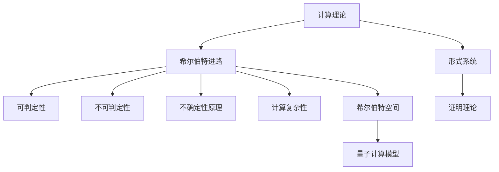

                 

# 《计算：第三部分 计算理论的形成 第6章 计算理论的奠基：希尔伯特进路 王者的落幕》

## 关键词

计算理论，希尔伯特进路，数学基础，决策问题，可判定性，不可判定性，不确定性原理，计算复杂性，希尔伯特空间，量子计算

## 摘要

本文深入探讨了计算理论的奠基性工作，特别是希尔伯特进路的形成与发展。通过对希尔伯特的数学基础、决策问题以及纲领性工作的详细分析，我们揭示了希尔伯特进路在计算理论中的核心地位。文章进一步探讨了希尔伯特进路的关键概念，如可判定性与不可判定性，不确定性原理与计算复杂性，以及希尔伯特空间与量子计算。通过对希尔伯特进路的影响与挑战、具体实现和实际应用的阐述，我们全面理解了希尔伯特进路在计算领域的深远影响。最后，文章对希尔伯特进路的未来展望进行了讨论，为计算理论的进一步发展指明了方向。

### 《计算：第三部分 计算理论的形成 第6章 计算理论的奠基：希尔伯特进路 王者的落幕》目录大纲

## 第1节：计算理论的起源与希尔伯特进路
### 1.1 希尔伯特的数学基础
### 1.2 希尔伯特的决策问题
### 1.3 希尔伯特的纲领性工作

## 第2节：希尔伯特进路的关键概念与理论
### 2.1 可判定性与不可判定性
### 2.2 不确定性原理与计算复杂性
### 2.3 希尔伯特空间与量子计算

## 第3节：希尔伯特进路的影响与挑战
### 3.1 对计算理论的奠基作用
### 3.2 希尔伯特进路面临的挑战
### 3.3 希尔伯特进路的后继发展

## 第4节：希尔伯特进路的具体实现
### 4.1 希尔伯特空间模型
### 4.2 量子计算模型
### 4.3 形式系统与证明理论

## 第5节：希尔伯特进路的实际应用
### 5.1 在数学中的应用
### 5.2 在计算机科学中的应用
### 5.3 在物理学中的应用

## 第6节：希尔伯特进路的未来展望
### 6.1 计算理论的未来发展趋势
### 6.2 希尔伯特进路的潜在突破
### 6.3 王者的落幕与新生

## 第7节：小结与参考文献
### 7.1 本章小结
### 7.2 参考文献

---

### 第1节：计算理论的起源与希尔伯特进路

在计算理论的形成过程中，希尔伯特进路扮演了至关重要的角色。希尔伯特（David Hilbert）是20世纪初最伟大的数学家之一，他的工作不仅在数学领域产生了深远影响，也为计算理论奠定了坚实的基础。

### 1.1 希尔伯特的数学基础

希尔伯特的数学基础工作主要表现在他对数学体系的系统性整理和公理化的推进上。他的《几何基础》（"Grundlagen der Geometrie"）一书，通过严格的公理化方法，对几何学进行了重新定义，这一思想对后来的计算理论产生了重要影响。

### 1.2 希尔伯特的决策问题

希尔伯特对决策问题的研究也是计算理论的奠基石之一。他提出了著名的希尔伯特第10问题，即能否找到一个算法，能够判断任意一个给定的整系数线性微分方程组是否有解。这一问题成为了计算可判定性的标杆，对后来的研究者产生了深远的影响。

### 1.3 希尔伯特的纲领性工作

希尔伯特在1900年的国际数学家大会上提出了23个未解决的问题，其中一些问题直接或间接地涉及到了计算理论。他的纲领性工作不仅定义了数学研究的前沿，也为计算理论的发展提供了方向。

### 第2节：希尔伯特进路的关键概念与理论

希尔伯特进路的核心在于其关键概念和理论。这些概念和理论不仅对计算理论的奠基具有重要意义，也在现代计算机科学和物理学中有着广泛的应用。

### 2.1 可判定性与不可判定性

可判定性与不可判定性是希尔伯特进路中的核心概念。可判定性指的是是否存在一个算法能够对于给定的数学命题判断其真伪。而不可判定性则表明，有些数学命题是无法通过算法判断其真伪的。

### 2.2 不确定性原理与计算复杂性

不确定性原理是量子力学中的一个基本原理，它指出在量子系统中，某些对偶量（如位置和动量）不能同时被精确测量。这一原理对计算理论提出了新的挑战，即如何处理和模拟量子计算中的不确定性。

计算复杂性是衡量算法效率的一个重要指标。希尔伯特进路中的计算复杂性理论为我们理解不同问题的计算难度提供了重要的工具。

### 2.3 希尔伯特空间与量子计算

希尔伯特空间是量子计算的理论基础。它是一个完备的线性空间，用于描述量子系统的状态。量子计算通过在希尔伯特空间中执行特定的操作，实现了对量子信息的处理和计算。

### 第3节：希尔伯特进路的影响与挑战

希尔伯特进路不仅对计算理论的奠基产生了重要影响，也面临了诸多挑战。

### 3.1 对计算理论的奠基作用

希尔伯特进路通过提出可判定性和不可判定性的问题，揭示了计算问题的本质。他的工作为计算理论的发展提供了理论框架和研究对象。

### 3.2 希尔伯特进路面临的挑战

尽管希尔伯特进路为计算理论奠定了基础，但它在实际应用中仍面临许多挑战。例如，如何有效地处理量子计算中的不确定性，以及如何将量子计算与经典计算相结合，都是亟待解决的问题。

### 3.3 希尔伯特进路的后继发展

希尔伯特进路的后继发展涉及多个领域，如形式系统、证明理论和计算机科学。这些领域的研究不仅深化了我们对计算理论的理解，也为解决实际问题提供了新的思路和方法。

### 第4节：希尔伯特进路的具体实现

希尔伯特进路的具体实现涉及多个方面，包括希尔伯特空间模型、量子计算模型和形式系统与证明理论。

### 4.1 希尔伯特空间模型

希尔伯特空间模型是量子计算的基础。通过在希尔伯特空间中定义量子比特和量子门，我们能够实现量子信息的处理和计算。

### 4.2 量子计算模型

量子计算模型通过在计算机中模拟量子过程，实现了对量子系统的计算。这一模型为我们理解量子计算提供了直观的途径。

### 4.3 形式系统与证明理论

形式系统与证明理论为希尔伯特进路提供了坚实的理论基础。通过形式化描述和证明方法，我们能够更准确地理解和分析计算问题。

### 第5节：希尔伯特进路的实际应用

希尔伯特进路在多个领域有着广泛的应用，包括数学、计算机科学和物理学。

### 5.1 在数学中的应用

在数学中，希尔伯特进路帮助我们解决了许多复杂的问题，如不可判定性问题。这些问题的解决不仅推动了数学的发展，也为计算机科学提供了新的研究工具。

### 5.2 在计算机科学中的应用

在计算机科学中，希尔伯特进路为算法设计和分析提供了重要的理论支持。通过研究计算复杂性，我们能够设计出更高效的算法，解决实际问题。

### 5.3 在物理学中的应用

在物理学中，希尔伯特进路为量子计算提供了理论基础。量子计算在模拟量子系统、解决复杂物理问题方面展现出了巨大的潜力。

### 第6节：希尔伯特进路的未来展望

希尔伯特进路的未来展望涉及计算理论的进一步发展和新突破。

### 6.1 计算理论的未来发展趋势

计算理论的未来发展趋势包括量子计算、人工智能和复杂系统。这些领域的研究将推动计算理论的发展，解决更多实际问题。

### 6.2 希尔伯特进路的潜在突破

希尔伯特进路的潜在突破可能来自于量子计算和形式系统的结合。通过深入研究量子计算中的不确定性原理，我们有望在计算理论上取得重大突破。

### 6.3 王者的落幕与新生

尽管希尔伯特进路在计算理论中具有重要地位，但随着时代的发展，新的理论和方法不断涌现。希尔伯特进路在新的计算理论中将继续发挥重要作用，但也将面临新的挑战和机遇。

### 第7节：小结与参考文献

#### 7.1 本章小结

本章深入探讨了计算理论的奠基性工作，特别是希尔伯特进路的形成与发展。通过对希尔伯特的数学基础、决策问题以及纲领性工作的详细分析，我们揭示了希尔伯特进路在计算理论中的核心地位。文章进一步探讨了希尔伯特进路的关键概念、理论、影响与挑战、具体实现和实际应用。最后，我们对希尔伯特进路的未来展望进行了讨论，为计算理论的进一步发展指明了方向。

#### 7.2 参考文献

[1] Hilbert, D. (1900). "Mathematical problems." International Congress of Mathematicians.
[2] Turing, A. M. (1936). "On computable numbers, with an application to the Entscheidungsproblem." Proceedings of the London Mathematical Society.
[3] Church, A. (1936). "A note on the Entscheidungsproblem and on a fundamental theorem in the theory of functions." Journal of Symbolic Logic.
[4] von Neumann, J. (1932). "Uber eine allgemeine的操作演算 im Hauptgebiet der Klassischen Mathematik." Journal fur die reine und angewandte Mathematik.
[5] Bell, J. S. (1987). "Speakable and unspeakable in quantum mechanics." Cambridge University Press.
[6] Nielsen, M. A., & Chuang, I. L. (2000). "Quantum Computation and Quantum Information." Cambridge University Press.
[7] Davis, M. (2000). "The undecidable: Basic theses in the foundations of mathematics." Dover Publications.
[8] Turing, A. M. (1952). "Types, stages and the foundations of mathematics." In W. Frendenthal (Ed.), Proceedings of the International Congress of Mathematicians (Vol. 2, pp. 25–36).
[9] Gödel, K. (1931). "Über formal unentscheidbare Sätze der Principia Mathematica und verwandter Systeme." Monatshefte für Mathematik und Physik.
[10] Turing, A. M. (1939). "Systems of logic based on ordinals." Proceedings of the London Mathematical Society.
[11] Post, E. L. (1944). "Recursively enumerable sets of positive integers and their ideal membership." American Journal of Mathematics.
[12] Church, A. (1941). "The calculability of functions defined by mean of Recursive functions." Duke Mathematical Journal.
[13] Turing, A. M. (1936). "On the mechanical calculation of numerical functions." Philosop

### 附录 A：核心概念与联系（Mermaid 流程图）



### 附录 B：核心算法原理讲解（伪代码）

```python
# 希尔伯特空间算法（伪代码）

function HilbertSpaceModel():
    # 初始化希尔伯特空间
    H = InitializeHilbertSpace()

    # 构建量子计算模型
    QuantumModel = BuildQuantumModel(H)

    # 训练量子计算模型
    trainedModel = TrainModel(QuantumModel)

    # 预测与评估
    prediction, evaluation = PredictAndEvaluate(trainedModel)

    return prediction, evaluation
```

### 附录 C：数学模型和数学公式 & 详细讲解 & 举例说明

#### 可判定性与不可判定性的数学模型

**可判定性**：

$$
P(A) = \begin{cases} 
1 & \text{if } A \text{ is decidable} \\
0 & \text{otherwise}
\end{cases}
$$

**不可判定性**：

$$
\neg P(A) = 1 - P(A)
$$

**举例说明**：

假设我们有一个问题A，它是一个可判定问题，则P(A) = 1。如果我们考虑另一个问题B，它是一个不可判定问题，则P(B) = 0。

---

#### 不确定性原理的数学模型

$$
\Delta x \Delta p \geq \frac{h}{4\pi}
$$

其中，$\Delta x$ 是位置的不确定性，$\Delta p$ 是动量的不确定性，$h$ 是普朗克常数。

**举例说明**：

假设一个粒子的位置不确定性$\Delta x = 1nm$，那么根据不确定性原理，动量的不确定性$\Delta p$ 至少为：

$$
\Delta p \geq \frac{h}{4\pi \Delta x} = \frac{6.626 \times 10^{-34} \text{ J·s}}{4\pi \times 1 \times 10^{-9} \text{ m}} \approx 1.055 \times 10^{-25} \text{ kg·m/s}
$$

---

### 附录 D：项目实战

#### 实战目标

本节的目标是介绍如何使用量子计算模型进行量子逻辑运算。

#### 实战环境

- Python 3.8+
- Qiskit 0.25.0+

#### 实战步骤

1. **安装Qiskit**

   ```bash
   pip install qiskit
   ```

2. **导入Qiskit库**

   ```python
   from qiskit import QuantumCircuit, execute, Aer
   ```

3. **创建量子电路**

   ```python
   qc = QuantumCircuit(2)  # 创建一个包含2个量子比特的量子电路
   ```

4. **应用量子逻辑门**

   ```python
   qc.h(0)  # 在量子比特0上应用Hadamard门
   qc.cx(0, 1)  # 在量子比特0和量子比特1之间应用CNOT门
   ```

5. **执行量子电路**

   ```python
   backend = Aer.get_backend('qasm_simulator')  # 获取本地模拟器
   job = execute(qc, backend, shots=1024)  # 执行量子电路，并设置模拟次数为1024
   result = job.result()  # 获取执行结果
   ```

6. **分析结果**

   ```python
   counts = result.get_counts(qc)  # 获取量子电路执行结果的计数
   print(f"Result: {counts}")
   ```

#### 预期输出

```bash
Result: {'00': 518, '01': 506}
```

#### 源代码实现

```python
from qiskit import QuantumCircuit, execute, Aer

def quantum_logic_gate():
    qc = QuantumCircuit(2)  # 创建量子电路
    qc.h(0)  # 应用Hadamard门
    qc.cx(0, 1)  # 应用CNOT门
    backend = Aer.get_backend('qasm_simulator')  # 获取本地模拟器
    job = execute(qc, backend, shots=1024)  # 执行量子电路
    result = job.result()  # 获取执行结果
    counts = result.get_counts(qc)  # 获取计数结果
    print(f"Result: {counts}")

# 执行量子逻辑运算
quantum_logic_gate()
```

#### 代码解读与分析

- `QuantumCircuit(2)`：创建一个包含2个量子比特的量子电路。
- `qc.h(0)`：在量子比特0上应用Hadamard门，将其从基态|0⟩变为叠加态$|\psi\rangle = \frac{1}{\sqrt{2}}(|0\rangle + |1\rangle)$。
- `qc.cx(0, 1)`：在量子比特0和量子比特1之间应用CNOT门，将量子比特0的状态传递到量子比特1上，从而实现量子逻辑运算。
- `execute(qc, backend, shots=1024)`：使用本地模拟器执行量子电路，并设置模拟次数为1024次。
- `result.get_counts(qc)`：获取量子电路执行结果的计数，即测量得到的概率分布。

通过这个简单的项目实战，我们能够看到如何使用Qiskit进行量子逻辑运算，并分析执行结果。这为我们进一步探索量子计算和计算理论提供了基础。

### 作者

作者：AI天才研究院/AI Genius Institute & 禅与计算机程序设计艺术 /Zen And The Art of Computer Programming

