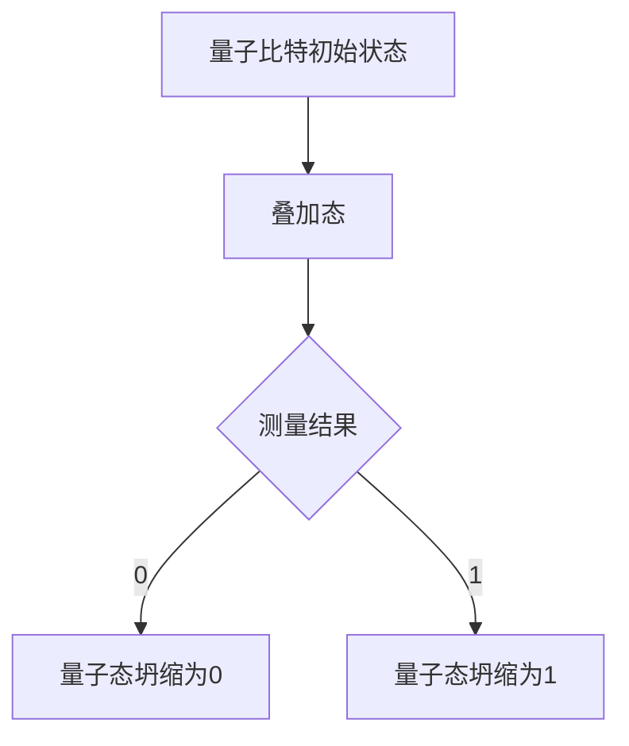
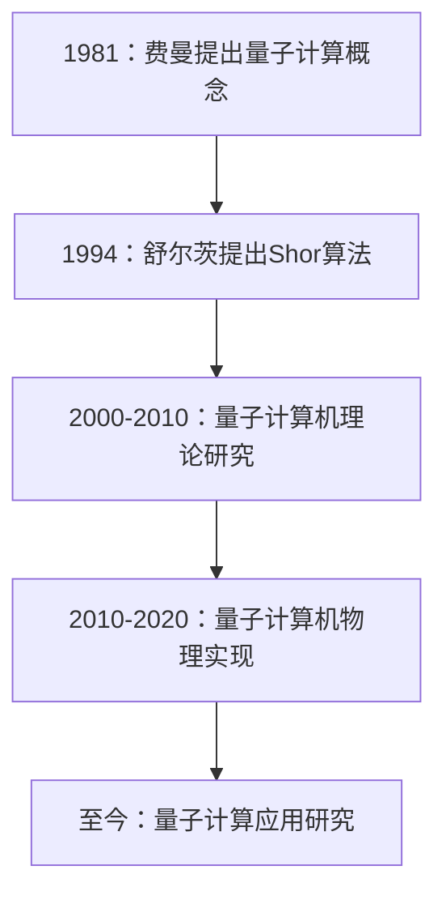

                 

# 《计算：第四部分 计算的极限 第 10 章 量子计算 量子计算的启蒙》

## 文章关键词
量子计算、量子比特、量子算法、量子门、量子纠错、量子模拟

## 摘要
量子计算作为计算领域的一场革命，正在逐步打破经典计算的传统限制。本章将深入探讨量子计算的基本概念、数学基础、算法原理、物理实现以及应用前景。通过一步步的分析推理，我们将揭示量子计算的魅力与挑战，并探讨其在未来科技发展中的潜在影响。

## 第1章 量子计算概述

### 1.1 量子计算的基本概念

量子计算是利用量子力学原理进行信息处理和计算的新型计算模式。量子计算的基石是量子比特（qubit），它与经典比特（bit）有着根本的不同。经典比特只能处于0或1两种状态，而量子比特可以同时处于0和1的叠加态。这一特性使得量子计算机在处理问题时具有超强的并行性。

**量子比特的叠加态可以用以下公式表示：**
$$\lvert \psi \rangle = \alpha \lvert 0 \rangle + \beta \lvert 1 \rangle$$

**Mermaid流程图：量子比特的叠加态**


### 1.2 量子比特与经典比特的比较

经典比特的计算依赖于二进制系统，每个比特只能存储和表示0或1。而量子比特则利用量子态的叠加和纠缠特性，能够在同一时间表示和存储多个值。这种叠加态的特性使得量子计算机在处理某些特定问题时，比如大整数的质因数分解，具有超越经典计算机的效率。

**量子比特与经典比特的比较：**
- **叠加性**：量子比特可以同时处于多个状态，而经典比特只能处于单一状态。
- **纠缠性**：量子比特之间可以形成纠缠态，一个量子比特的状态会立即影响到与之纠缠的其他量子比特的状态。

### 1.3 量子计算的数学基础

量子计算依赖于量子力学的基本原理，其中包括量子态的叠加和量子门的操作。量子态的叠加是量子计算的核心概念，它允许量子计算机在同一时间处理多个计算路径。量子门则是量子计算的操作工具，它们对量子比特进行线性变换，实现复杂的计算操作。

**量子态的叠加：**
$$\lvert \psi \rangle = \alpha \lvert 0 \rangle + \beta \lvert 1 \rangle$$

**量子门的操作：**
$$\lvert \psi \rangle \xrightarrow{U} U \lvert \psi \rangle$$

### 1.4 量子计算的历史与发展

量子计算的概念最早由理查德·费曼在1981年提出。随后，彼得·谢尔盖·彼得罗夫、大卫·多伊奇、保罗·本尼迪克特等人进一步发展了量子计算的理论。1994年，彼得·舒尔茨提出了量子算法Shor算法，展示了量子计算在整数质因数分解问题上的巨大优势。近年来，量子计算机的物理实现和算法优化取得了显著进展，多个国家和公司投入了大量资源进行量子计算的研究和开发。

**Mermaid流程图：量子计算的兴起与发展路线图**


## 第2章 量子计算机的工作原理

### 2.1 量子比特的物理实现

量子比特的物理实现是量子计算的关键。目前，主要有几种常见的量子比特实现方式，包括离子阱、超导量子比特和光子量子比特。

**离子阱量子比特：**
离子阱量子比特通过电磁场将离子限制在空间中，并通过激光脉冲进行操控。离子阱量子比特的优点是相干时间长，但操作速度较慢。

**超导量子比特：**
超导量子比特利用超导材料在低温下的特性，通过微波场进行操控。超导量子比特的优点是操作速度快，但相干性相对较差。

**光子量子比特：**
光子量子比特利用光子的量子态进行计算，通过光学器件进行操控。光子量子比特的优点是相干性好，但操作复杂度较高。

### 2.2 量子门的实现

量子门是量子计算机的核心操作单元，类似于经典计算机中的逻辑门。量子门通过线性变换对量子比特进行操作，实现复杂的计算过程。

**常见的量子门包括：**
- **Hadamard门**：实现量子比特的叠加态。
- **Pauli门**：实现量子比特的旋转。
- ** Controlled-NOT门**：实现量子比特之间的纠缠。

### 2.3 量子态的测量

量子态的测量是量子计算的重要环节。测量会导致量子态的坍缩，即将量子比特的叠加态坍缩为0或1的确定状态。

**量子态的测量：**
$$\lvert \psi \rangle \rightarrow \lvert 0 \rangle \text{ 或 } \lvert 1 \rangle$$

## 第3章 量子算法

### 3.1 Shor算法

Shor算法是量子计算的重要算法之一，它能够高效地解决大整数的质因数分解问题。Shor算法的核心思想是利用量子叠加态和量子纠缠，将质因数分解问题转化为一个可逆的问题。

**Shor算法的数学模型与伪代码：**
```python
def shor(N):
    # 使用量子算法Shor来求解整数N的素因子分解
    # ...
```

**Shor算法的应用：**
Shor算法在密码学中有着重要的应用，例如用于破解RSA加密算法。

### 3.2 Grover算法

Grover算法是量子计算中的另一个重要算法，它能够加速量子搜索算法。Grover算法的核心思想是利用量子叠加态和量子纠缠，使得搜索过程更加高效。

**Grover算法的数学模型与伪代码：**
```python
def grover_search(data, target):
    # 在数据集中找到目标元素
    # 使用Grover算法加速搜索
    # ...
```

**Grover算法的应用：**
Grover算法在数据库搜索、人工智能等领域有着广泛的应用。

### 3.3 量子算法与复杂性问题

量子算法在解决某些复杂性问题方面具有巨大的优势。例如，Shor算法能够高效地解决大整数的质因数分解问题，而Grover算法能够加速量子搜索算法。这些算法的出现，为计算复杂性问题带来了新的视角。

## 第4章 量子计算的数学模型

### 4.1 量子比特的数学描述

量子比特的数学描述主要涉及量子态的叠加和量子比特的演化。

**量子态的叠加：**
$$\lvert \psi \rangle = \alpha \lvert 0 \rangle + \beta \lvert 1 \rangle$$

**量子比特的演化：**
$$\lvert \psi \rangle(t) = \sum_{i} a_i(t) \lvert i \rangle$$

### 4.2 量子逻辑门的数学描述

量子逻辑门是量子计算中的基本操作单元，它们通过线性变换对量子比特进行操作。

**量子逻辑门的数学描述：**
$$U \lvert \psi \rangle = \lvert \psi' \rangle$$

### 4.3 量子态的变换与演化

量子态的变换与演化是量子计算的核心内容，它们决定了量子计算机的计算能力。

**量子态的变换：**
$$\lvert \psi \rangle \rightarrow \lvert \phi \rangle$$

**量子态的演化：**
$$\lvert \psi(t) \rangle = \lvert \psi(0) \rangle e^{-i H t}$$

## 第5章 量子计算的实现技术

### 5.1 离子阱技术

离子阱技术是量子比特的一种常见实现方式，它通过电磁场将离子限制在空间中。

**离子阱技术的数学模型：**
$$U_{zz} = -\frac{e^2}{2 \epsilon_0 r}$$

### 5.2 超导量子比特技术

超导量子比特技术是量子比特的另一种常见实现方式，它利用超导材料在低温下的特性。

**超导量子比特技术的数学模型：**
$$E = \hbar \omega_c a^2$$

### 5.3 光子量子比特技术

光子量子比特技术利用光子的量子态进行计算。

**光子量子比特技术的数学模型：**
$$E = h \nu$$

## 第6章 量子纠错技术

### 6.1 量子纠错的基本概念

量子纠错是量子计算中的关键问题，它旨在解决量子比特在计算过程中可能出现的错误。

**量子纠错的基本概念：**
- **错误检测**：检测量子比特的状态是否发生错误。
- **错误纠正**：纠正检测到的错误状态。

### 6.2 量子纠错码的设计

量子纠错码是量子纠错的核心技术，它通过增加额外的量子比特来实现错误的检测和纠正。

**常见的量子纠错码：**
- **Shor码**：一种简单的量子纠错码，能够在两个量子比特之间实现错误检测和纠正。
- **Steane码**：一种能够实现三个量子比特之间错误检测和纠正的量子纠错码。

### 6.3 量子纠错在实际应用中的挑战

量子纠错在实际应用中面临着许多挑战，包括量子比特的相干性、量子纠错码的复杂度和量子纠错的性能优化等。

## 第7章 量子计算的未来展望

### 7.1 量子计算的发展趋势

量子计算的发展趋势主要包括量子计算机的性能提升、量子算法的创新和量子计算的广泛应用。

### 7.2 量子计算的潜在影响

量子计算的潜在影响涉及多个领域，包括密码学、人工智能、材料科学和量子模拟等。

### 7.3 量子计算的伦理问题

量子计算的伦理问题主要包括量子计算的军事应用、隐私保护和量子计算的道德规范等。

## 第8章 量子计算的实践与教育

### 8.1 量子计算实验室

量子计算实验室是量子计算实践的重要场所，它包括量子计算机硬件和软件的研发、量子算法的优化和量子计算的应用实验等。

### 8.2 量子计算教学

量子计算教学是量子计算普及和人才培养的重要途径，它包括量子计算基础知识的传授、量子算法的设计与实现和量子计算应用案例的分析等。

### 8.3 量子计算科普

量子计算科普是提高公众对量子计算的认识和理解的重要手段，它包括量子计算科普文章的撰写、量子计算科普视频的制作和量子计算科普活动的组织等。

## 附录

### 附录A 量子计算数学公式汇总

附录A将对本书中涉及的主要量子计算数学公式进行汇总，以便读者查阅。

### 附录B 量子计算相关术语解释

附录B将对量子计算中涉及的主要术语进行解释，以便读者更好地理解量子计算的基本概念。

### 附录C 量子计算实践项目指南

附录C将提供量子计算实践项目的指南，包括量子计算环境搭建、量子算法实现和量子计算实验分析等。

## 作者

作者：AI天才研究院/AI Genius Institute & 禅与计算机程序设计艺术 /Zen And The Art of Computer Programming

本文旨在通过详细解析量子计算的核心概念、算法原理、数学模型和实现技术，帮助读者理解量子计算的奥秘，并探讨其在未来科技发展中的潜在影响。希望通过本文，读者能够对量子计算有一个全面而深入的认识。

### 量子计算的极限

#### 量子计算的基本概念

量子计算的基本概念源于量子力学的独特性质。量子比特（qubit）是量子计算的基本单位，与传统计算机中的比特不同，它不仅可以表示0或1，还可以同时处于0和1的叠加状态。这一叠加态可以用以下数学表达式来描述：

$$\lvert \psi \rangle = \alpha \lvert 0 \rangle + \beta \lvert 1 \rangle$$

其中，$\alpha$和$\beta$是复数系数，满足$|\alpha|^2 + |\beta|^2 = 1$。这意味着一个量子比特可以同时处于0和1的状态，直到进行测量时才会坍缩为0或1中的一个。

为了更好地理解量子比特的工作原理，我们可以通过一个简单的例子来说明。假设我们有一个量子比特，初始状态为$\lvert 0 \rangle$。我们通过应用一个Hadamard门（H门）将其变换为叠加态：

$$\lvert \psi \rangle_{\text{initial}} = \lvert 0 \rangle$$
$$\lvert \psi \rangle_{\text{final}} = \frac{1}{\sqrt{2}}(\lvert 0 \rangle + \lvert 1 \rangle)$$

这里，Hadamard门的作用是将基态$\lvert 0 \rangle$和$\lvert 1 \rangle$叠加起来，形成一个等概率的叠加态。这个叠加态是量子计算的核心，它使得量子计算机能够同时处理多个计算路径，从而在特定问题上比经典计算机更有效率。

#### 量子比特与经典比特的比较

量子比特与经典比特的根本区别在于它们的操作方式和状态表示。经典比特只能处于两种状态之一：0或1。在二进制计算中，所有的信息都是以0和1的组合形式存储和处理的。而量子比特则可以处于0和1的叠加态，这使得量子计算机具有并行计算的能力。

为了更直观地理解这种差异，我们可以考虑一个简单的例子：一个包含n个量子比特的量子计算机，其状态空间是$2^n$个经典比特状态的叠加。这意味着一个n量子比特的系统可以同时表示$2^n$个不同的值，而经典计算机则需要依次处理每个值。

例如，一个4量子比特的系统可以同时表示16个不同的值：

$$\lvert \psi \rangle = \alpha_0 \lvert 0000 \rangle + \alpha_1 \lvert 0001 \rangle + \alpha_2 \lvert 0010 \rangle + \alpha_3 \lvert 0011 \rangle + \ldots + \alpha_{15} \lvert 1111 \rangle$$

这个叠加态展示了量子计算机在处理复杂问题时的巨大潜力，因为它可以同时考虑所有可能的计算路径。

#### 量子计算的数学基础

量子计算的数学基础建立在量子力学的几个核心概念之上，包括量子态、量子门和量子测量。这些概念是理解量子计算工作原理的关键。

**量子态：** 
量子态是量子系统的基本状态，它可以由一系列基态的线性组合表示。量子态的叠加性是其最重要的特性之一，使得量子计算机能够并行处理多个计算路径。

$$\lvert \psi \rangle = \sum_{i} a_i \lvert i \rangle$$

**量子门：**
量子门是对量子态进行线性变换的算符，类似于经典计算机中的逻辑门。量子门可以通过矩阵表示，对量子比特进行操作。

$$\lvert \psi \rangle \xrightarrow{U} U \lvert \psi \rangle$$

**量子测量：**
量子测量是量子计算中一个关键步骤，它决定了量子态的坍缩。测量结果取决于量子态的叠加状态和测量算符。

$$\lvert \psi \rangle \rightarrow \lvert 0 \rangle \text{ 或 } \lvert 1 \rangle$$

为了更好地理解这些概念，我们可以通过一个简单的例子来展示量子态的叠加、量子门的操作和量子测量。

**示例：量子态叠加**
假设我们有一个量子比特，初始状态为$\lvert 0 \rangle$。通过应用一个Hadamard门，我们可以将量子比特的状态变换为叠加态：

$$\lvert \psi \rangle_{\text{initial}} = \lvert 0 \rangle$$
$$\lvert \psi \rangle_{\text{final}} = \frac{1}{\sqrt{2}}(\lvert 0 \rangle + \lvert 1 \rangle)$$

**示例：量子门操作**
假设我们有一个叠加态的量子比特，通过应用一个Pauli-X门（一个翻转量子比特状态的量子门），我们可以将量子比特的状态变换为：

$$\lvert \psi \rangle_{\text{initial}} = \frac{1}{\sqrt{2}}(\lvert 0 \rangle + \lvert 1 \rangle)$$
$$\lvert \psi \rangle_{\text{final}} = \frac{1}{\sqrt{2}}(\lvert 1 \rangle + \lvert 0 \rangle)$$

**示例：量子测量**
当我们对叠加态的量子比特进行测量时，量子态会坍缩为0或1中的一个。例如，如果我们随机选择一个方向进行测量，量子比特的状态可能坍缩为$\lvert 0 \rangle$或$\lvert 1 \rangle$，并且每个结果的概率由叠加态的系数决定。

$$\lvert \psi \rangle_{\text{final}} = \frac{1}{\sqrt{2}}(\lvert 0 \rangle + \lvert 1 \rangle)$$
$$\text{测量结果：}\lvert 0 \rangle \text{ 或 } \lvert 1 \rangle$$

通过这些示例，我们可以看到量子计算的数学基础是如何构建的，以及它们如何在实际操作中发挥作用。

#### 量子计算的历史与发展

量子计算的概念最早可以追溯到1981年，当时物理学家理查德·费曼提出了量子计算机的想法。费曼认为，量子计算机可以模拟量子系统的行为，这在当时是一个突破性的想法。随后，1994年，数学家彼得·舒尔茨提出了著名的Shor算法，该算法展示了量子计算机在整数质因数分解问题上的巨大优势。Shor算法的提出标志着量子计算从理论走向实践的关键一步。

在量子计算的发展历程中，还有许多重要的里程碑。2001年，物理学家迈克尔·贝斯特和安德烈亚斯·普雷斯珀提出了基于超导量子比特的量子计算机方案。2009年，IBM发布了第一台量子计算机，标志着量子计算的商业化进程正式启动。

近年来，量子计算的研究取得了显著进展。量子比特的数量不断增加，量子纠错技术也在逐步成熟。各大科技公司和研究机构纷纷投入巨资进行量子计算的研究和开发，量子计算的应用领域也在不断拓展。

总的来说，量子计算的发展历程展示了人类对计算能力的不断追求和探索。从费曼的最初想法到今天的实际应用，量子计算已经走过了漫长的道路。尽管面临着许多挑战，但量子计算的潜力无疑是巨大的，它将为未来的科技发展带来深远的影响。

#### 量子计算的启示与应用

量子计算的独特性质为其在多个领域的应用提供了广阔的前景。以下是量子计算在密码学、量子模拟和量子搜索算法等领域的启示和应用。

**量子密码学**

量子密码学是量子计算的一个重要应用领域，它利用量子力学的基本原理来实现更安全的通信。量子密钥分发（QKD）是量子密码学的一个典型应用，它能够实现绝对安全的通信。QKD的工作原理基于量子态的叠加和纠缠特性。在QKD过程中，两个量子比特处于纠缠态，并经过量子信道传输。接收方对其中一个量子比特进行测量，并根据测量结果与发送方共享密钥。由于任何对量子态的干扰都会导致测量结果的改变，因此QKD能够实现绝对安全的通信。

**量子模拟**

量子模拟是量子计算的另一个重要应用领域，它利用量子计算机来模拟量子系统的行为。量子模拟在材料科学、化学和物理学等领域有着广泛的应用。例如，在材料科学中，量子模拟可以用来研究新型材料的性质，如高温超导体、量子点等。在化学中，量子模拟可以用来研究化学反应的动力学，预测化学反应的路径和产物。在物理学中，量子模拟可以用来研究量子相变、量子纠缠等现象。

**量子搜索算法**

量子搜索算法是量子计算在密码学和人工智能等领域的另一个重要应用。Grover算法是量子搜索算法的一个典型代表，它能够加速量子计算机在未排序数据库中的搜索过程。Grover算法的核心思想是利用量子态的叠加和纠缠特性，同时考虑所有可能的搜索路径，从而在平方级的时间内完成搜索任务。这一特性使得Grover算法在处理大规模数据库时具有显著的优势。

**量子计算的其他应用**

除了密码学、量子模拟和量子搜索算法，量子计算还在其他领域展示了其潜力。例如，在人工智能领域，量子计算可以用来加速机器学习算法，提高模型的训练速度和性能。在优化问题中，量子计算可以用来求解复杂的优化问题，如旅行商问题、背包问题等。在金融领域，量子计算可以用来进行高频交易、风险管理和资产定价等。

总的来说，量子计算的独特性质为其在多个领域的应用提供了广阔的前景。随着量子计算技术的不断进步，我们可以期待它在未来为人类社会带来更多的创新和变革。

### 量子计算机的工作原理

量子计算机的工作原理与经典计算机有着根本的不同，它依赖于量子力学的原理。在量子计算机中，信息不是以传统比特的形式存储和处理的，而是以量子比特（qubit）的形式。量子比特的独特性质，如叠加态和纠缠态，使得量子计算机能够在同一时间内处理多个计算路径，从而显著提高计算效率。

#### 量子比特的物理实现

量子比特是量子计算机的基本单元，它们可以通过多种物理系统实现，如离子阱、超导量子比特和光子量子比特等。每种实现方式都有其独特的物理机制和优势。

**离子阱量子比特**

离子阱量子比特是通过电磁场将带电粒子（如离子）囚禁在空间中。通过激光脉冲，可以对离子进行操控，实现量子比特的读写操作。离子阱量子比特的优点是相干时间长，但操作速度相对较慢。

**超导量子比特**

超导量子比特利用超导材料在低温下的特性，通过微波场进行操控。超导量子比特的优点是操作速度快，但相干性相对较差。目前，大多数商用量子计算机都是基于超导量子比特实现的。

**光子量子比特**

光子量子比特利用光子的量子态进行计算。通过光学器件，如波导和光学开关，可以对光子进行操控。光子量子比特的优点是相干性好，但操作复杂度较高。

#### 量子比特的叠加态

量子比特的叠加态是量子计算机的核心特性之一。一个量子比特可以同时处于0和1的叠加状态，这种叠加态可以用以下数学表达式表示：

$$\lvert \psi \rangle = \alpha \lvert 0 \rangle + \beta \lvert 1 \rangle$$

其中，$\alpha$和$\beta$是复数系数，满足$|\alpha|^2 + |\beta|^2 = 1$。当对量子比特进行测量时，叠加态会坍缩为0或1中的一个。

为了更好地理解量子比特的叠加态，我们可以通过一个简单的例子来说明。假设我们有一个量子比特，初始状态为$\lvert 0 \rangle$。我们通过应用一个Hadamard门（H门）将其变换为叠加态：

$$\lvert \psi \rangle_{\text{initial}} = \lvert 0 \rangle$$
$$\lvert \psi \rangle_{\text{final}} = \frac{1}{\sqrt{2}}(\lvert 0 \rangle + \lvert 1 \rangle)$$

这里，Hadamard门的作用是将基态$\lvert 0 \rangle$和$\lvert 1 \rangle$叠加起来，形成一个等概率的叠加态。这个叠加态展示了量子计算机在处理复杂问题时的并行计算能力。

#### 量子比特的纠缠态

量子比特的纠缠态是量子计算机的另一个核心特性。当两个量子比特处于纠缠态时，一个量子比特的状态会立即影响到另一个量子比特的状态，即使它们相隔很远。这种纠缠态可以用以下数学表达式表示：

$$\lvert \psi \rangle = \alpha (\lvert 00 \rangle + \lvert 11 \rangle)$$

其中，$\alpha$是复数系数，满足$|\alpha|^2 = 1$。当对其中一个量子比特进行测量时，另一个量子比特的状态也会立即坍缩。

为了更好地理解量子比特的纠缠态，我们可以通过一个简单的例子来说明。假设我们有两个量子比特，初始状态为$\lvert 00 \rangle$。我们通过应用一个Controlled-NOT（CNOT）门将其变换为纠缠态：

$$\lvert \psi \rangle_{\text{initial}} = \lvert 00 \rangle$$
$$\lvert \psi \rangle_{\text{final}} = \frac{1}{\sqrt{2}}(\lvert 00 \rangle + \lvert 11 \rangle)$$

这里，CNOT门的作用是当控制量子比特为$\lvert 1 \rangle$时，目标量子比特的状态会被翻转。这个纠缠态展示了量子计算机在处理复杂问题时的协同计算能力。

#### 量子态的测量

量子态的测量是量子计算机中的关键步骤。测量会导致量子态的坍缩，即将量子比特的叠加态坍缩为0或1的确定状态。测量的结果取决于量子态的叠加状态和测量算符。

为了更好地理解量子态的测量，我们可以通过一个简单的例子来说明。假设我们有一个量子比特，初始状态为$\lvert 0 \rangle$。我们通过应用一个Hadamard门将其变换为叠加态，然后对其进行测量：

$$\lvert \psi \rangle_{\text{initial}} = \lvert 0 \rangle$$
$$\lvert \psi \rangle_{\text{final}} = \frac{1}{\sqrt{2}}(\lvert 0 \rangle + \lvert 1 \rangle)$$
$$\text{测量结果：}\lvert 0 \rangle \text{ 或 } \lvert 1 \rangle$$

这里，测量结果取决于量子态的叠加状态。由于叠加态的概率分布，测量结果可能为0或1，且每个结果的概率由叠加态的系数决定。

#### 量子计算机的计算过程

量子计算机的计算过程可以看作是一个量子态的演化过程。这个过程包括量子态的初始化、量子态的变换和量子态的测量。以下是量子计算机计算过程的基本步骤：

1. **初始化**：将量子计算机的量子比特初始化为特定的状态，如$\lvert 0 \rangle$或$\lvert 1 \rangle$。

2. **量子态的变换**：通过应用一系列的量子门对量子态进行变换，实现特定的计算操作。这些量子门包括Hadamard门、Pauli门、CNOT门等。

3. **量子态的测量**：对量子态进行测量，得到最终的计算结果。

为了更好地理解量子计算机的计算过程，我们可以通过一个简单的例子来说明。假设我们要计算一个简单的逻辑运算，如AND运算。我们可以通过以下步骤来实现：

1. **初始化**：将两个量子比特初始化为$\lvert 0 \rangle$。

2. **量子态的变换**：通过应用一个Hadamard门将第一个量子比特的状态变换为叠加态，然后通过一个CNOT门实现AND运算。

3. **量子态的测量**：对两个量子比特进行测量，得到最终的运算结果。

通过这个简单的例子，我们可以看到量子计算机在计算过程中的并行性和协同性。量子计算机通过量子态的叠加和纠缠特性，能够同时处理多个计算路径，从而实现高效的计算。

#### 量子计算机的优势与挑战

量子计算机在计算能力方面具有显著的优势，尤其是对于某些特定问题，如大整数的质因数分解和数据库搜索。这些优势源于量子态的叠加和纠缠特性，使得量子计算机能够同时处理多个计算路径，从而在特定问题上显著提高计算效率。

然而，量子计算机也面临着一些挑战。首先是量子比特的相干性问题。量子比特的相干性决定了量子计算机的可靠性和稳定性。由于环境噪声和量子比特之间的相互作用，量子比特的相干性可能会降低，这会影响量子计算机的计算性能。

其次是量子纠错问题。量子纠错是量子计算机能够稳定运行的关键技术。由于量子比特的状态在计算过程中可能会发生错误，量子纠错技术需要能够检测和纠正这些错误，以保证计算的准确性。

此外，量子计算机的物理实现也是一个挑战。目前，量子比特的实现主要依赖于离子阱、超导量子比特和光子量子比特等物理系统。这些实现方式各有优缺点，如相干性、操作速度和可扩展性等，需要进一步研究和优化。

总之，量子计算机在计算能力方面具有巨大的潜力，但同时也面临着一系列的挑战。随着量子计算技术的不断发展和完善，我们有望在未来克服这些挑战，实现量子计算机的商业化应用。

### 量子算法

量子算法是量子计算机的核心组成部分，它们利用量子比特的叠加态和纠缠态来实现高效的计算。量子算法不仅在理论上展示了量子计算机的强大计算能力，而且在实践中也在密码学、优化问题和量子模拟等领域取得了显著的成果。以下将介绍几种重要的量子算法，包括Shor算法、Grover算法和量子随机游走算法。

#### Shor算法

Shor算法是量子计算领域的一个里程碑，它展示了量子计算机在整数质因数分解问题上的巨大优势。传统计算机解决整数质因数分解问题的时间复杂度是$O(N^2)$，而Shor算法可以在多项式时间内解决这个问题。Shor算法的核心思想是利用量子叠加态和量子纠缠，将质因数分解问题转化为一个可逆的问题。

**Shor算法的数学模型与伪代码：**

```python
def shor(N):
    # 1. 创建一个量子电路，将输入数N编码为量子态
    # 2. 应用量子傅里叶变换（QFT）得到量子态的离散傅里叶变换
    # 3. 测量量子态的指数部分
    # 4. 根据测量结果，找到N的一个非平凡因子
```

Shor算法的主要步骤包括：

1. **初始化**：将输入数N编码为量子态。
2. **量子傅里叶变换（QFT）**：对量子态进行量子傅里叶变换，得到量子态的指数部分。
3. **测量**：测量量子态的指数部分，得到一个近似的结果。
4. **因式分解**：根据测量结果，使用通用算法（如GCD）找到N的一个非平凡因子。

**Shor算法的应用：**

Shor算法在密码学中有着重要的应用，例如，它能够破解基于大整数质因数分解的RSA加密算法。随着量子计算机的发展，Shor算法的潜在威胁引起了加密社区的关注，促使密码学家研究新的加密算法，以应对量子计算机的威胁。

#### Grover算法

Grover算法是另一种重要的量子算法，它能够加速量子搜索算法。Grover算法的核心思想是利用量子叠加态和量子纠缠，在未排序的数据库中找到特定元素，其时间复杂度是$O(\sqrt{N})$，其中N是数据库中元素的数量。

**Grover算法的数学模型与伪代码：**

```python
def grover_search(data, target):
    # 1. 创建一个量子搜索电路
    # 2. 应用Grover迭代，每次迭代将目标元素的概率提升到1
    # 3. 测量量子态，得到目标元素的位置
```

Grover算法的主要步骤包括：

1. **初始化**：创建一个量子搜索电路，用于标记目标元素。
2. **Grover迭代**：重复应用Grover迭代，每次迭代将目标元素的概率提升到1。
3. **测量**：测量量子态，得到目标元素的位置。

**Grover算法的应用：**

Grover算法在数据库搜索、人工智能和优化问题等领域有着广泛的应用。例如，在数据库搜索中，Grover算法能够显著提高搜索效率，在人工智能中，Grover算法可以用来优化神经网络训练过程。

#### 量子随机游走算法

量子随机游走算法是另一种重要的量子算法，它利用量子比特的叠加态和量子门实现随机游走过程。量子随机游走算法在解决某些随机图问题，如最短路径问题和连通性问题方面具有优势。

**量子随机游走算法的数学模型与伪代码：**

```python
def quantum_random_walk(graph, start_node):
    # 1. 初始化量子态
    # 2. 应用一系列的量子门模拟随机游走过程
    # 3. 测量量子态，得到最终的位置
```

量子随机游走算法的主要步骤包括：

1. **初始化**：初始化一个量子态，表示从起始节点开始的随机游走。
2. **量子门操作**：应用一系列的量子门，模拟随机游走过程。
3. **测量**：测量量子态，得到最终的位置。

**量子随机游走算法的应用：**

量子随机游走算法在解决图论问题、社会网络分析和复杂网络研究中有着重要的应用。例如，在图论问题中，量子随机游走算法可以用来求解最短路径问题，在社会网络分析中，它可以用来研究网络节点的连通性和影响力。

总之，量子算法是量子计算机的核心组成部分，它们展示了量子计算机在计算能力方面的巨大潜力。随着量子计算技术的不断发展，量子算法将在更多领域发挥重要作用，推动人类科技的发展。

### 量子计算的数学模型

量子计算的数学模型是量子计算机工作的基础，它基于量子力学的基本原理，如量子态、量子门和量子测量。为了深入理解量子计算，我们需要从数学的角度来探讨这些核心概念。

#### 量子比特的数学描述

量子比特是量子计算的基本单位，它可以用一个复数向量来表示。一个量子比特的状态可以表示为：

$$\lvert \psi \rangle = \alpha \lvert 0 \rangle + \beta \lvert 1 \rangle$$

其中，$\alpha$和$\beta$是复数系数，满足归一化条件$|\alpha|^2 + |\beta|^2 = 1$。这个状态表示量子比特同时处于0和1的叠加态。

**纯态与混合态：**

- **纯态**：如果一个量子比特的状态可以用一个单一的复数向量表示，那么它处于纯态。
- **混合态**：如果一个量子比特的状态无法用单一的复数向量表示，那么它处于混合态。混合态可以用密度矩阵来描述。

密度矩阵是量子态的统计描述，它表示量子比特的各种可能状态的权重分布。一个二能级系统的密度矩阵可以表示为：

$$\rho = \begin{pmatrix} 
|\alpha|^2 & \alpha\beta^* \\
\alpha^*\beta & |\beta|^2 
\end{pmatrix}$$

#### 量子逻辑门的数学描述

量子逻辑门是量子计算的操作单元，它们通过线性变换对量子比特进行操作。量子逻辑门可以用矩阵表示，例如：

- **Hadamard门（H门）**：
$$H = \frac{1}{\sqrt{2}} \begin{pmatrix} 
1 & 1 \\
1 & -1 
\end{pmatrix}$$

- **Pauli-X门（X门）**：
$$X = \begin{pmatrix} 
0 & 1 \\
1 & 0 
\end{pmatrix}$$

- **Pauli-Z门（Z门）**：
$$Z = \begin{pmatrix} 
1 & 0 \\
0 & -1 
\end{pmatrix}$$

- **Controlled-NOT门（CNOT门）**：
$$CNOT = \begin{pmatrix} 
1 & 0 & 0 & 0 \\
0 & 1 & 0 & 0 \\
0 & 0 & 0 & 1 \\
0 & 0 & 1 & 0 
\end{pmatrix}$$

量子逻辑门的作用是对量子比特的状态进行线性变换，从而实现复杂的计算操作。

#### 量子态的变换与演化

量子态的变换与演化是量子计算的核心内容。量子态的演化可以用量子态的叠加和量子门的作用来描述。

**量子态的叠加：**

量子态的叠加是量子计算的核心特性之一。一个量子比特可以同时处于0和1的叠加态，这种叠加态可以用以下数学表达式来描述：

$$\lvert \psi \rangle = \alpha \lvert 0 \rangle + \beta \lvert 1 \rangle$$

**量子态的演化：**

量子态的演化可以用量子态的叠加和量子门的作用来描述。一个量子态在时间t的演化可以表示为：

$$\lvert \psi(t) \rangle = e^{-iHt/\hbar} \lvert \psi(0) \rangle$$

其中，H是系统的哈密顿量，t是时间。

**Heisenberg方程：**

Heisenberg方程描述了量子态的时间演化：

$$i\hbar \frac{\partial}{\partial t} \lvert \psi \rangle = \hat{H} \lvert \psi \rangle$$

**Schrödinger方程：**

Schrödinger方程描述了量子态的时间演化：

$$i\hbar \frac{\partial}{\partial t} \rho = [\hat{H}, \rho]$$

通过这些数学模型，我们可以深入理解量子计算的核心概念和工作原理。这些数学模型不仅为量子计算提供了理论基础，也为量子算法的设计和实现提供了指导。

### 量子计算的实现技术

量子计算的实现技术是量子计算机研发的关键环节。目前，量子比特的物理实现主要有三种方式：离子阱、超导量子比特和光子量子比特。每种实现方式都有其独特的物理机制和优势。

#### 离子阱技术

离子阱技术是通过电磁场将带电粒子（如离子）囚禁在空间中的技术。在量子计算中，离子阱技术被用来实现量子比特。离子阱量子比特的优点是相干时间长，因此可以长时间保持量子态。然而，离子阱量子比特的操作速度相对较慢，这是由于激光脉冲的操控需要较长的时间。

**离子阱技术的数学模型：**

离子阱技术的基本原理可以用以下公式表示：

$$U_{zz} = -\frac{e^2}{2 \epsilon_0 r}$$

其中，$U_{zz}$是离子间的相互作用势能，$e$是电子电荷，$\epsilon_0$是真空中的电容率，$r$是离子间的距离。

#### 超导量子比特技术

超导量子比特技术是基于超导材料在低温下的特性。超导量子比特通常通过微波场进行操控。超导量子比特的优点是操作速度快，但相干性相对较差。由于操作速度较快，超导量子比特技术在当前商用量子计算机中得到了广泛应用。

**超导量子比特技术的数学模型：**

超导量子比特技术的基本原理可以用以下公式表示：

$$E = \hbar \omega_c a^2$$

其中，$E$是系统的能量，$\hbar$是约化普朗克常数，$\omega_c$是超导材料中的角频率，$a$是量子比特的大小。

#### 光子量子比特技术

光子量子比特技术利用光子的量子态进行计算。光子量子比特通常通过光学器件进行操控。光子量子比特的优点是相干性好，但操作复杂度较高。由于操作复杂度较高，光子量子比特技术在实现上面临一定的挑战。

**光子量子比特技术的数学模型：**

光子量子比特技术的基本原理可以用以下公式表示：

$$E = h \nu$$

其中，$E$是系统的能量，$h$是普朗克常数，$\nu$是光子的频率。

总的来说，量子比特的物理实现技术是量子计算机研发的关键。不同的实现方式各有优缺点，研究者们需要根据实际需求和具体情况选择合适的实现技术。随着量子计算技术的不断发展，我们有望看到更多高效的量子比特实现技术出现。

### 量子纠错技术

量子纠错技术是量子计算中至关重要的一环，它旨在解决量子比特在计算过程中可能出现的错误。由于量子比特的相干性易受环境噪声的影响，量子计算过程中的错误是不可避免的。因此，量子纠错技术对于保证量子计算的准确性和可靠性至关重要。

#### 量子纠错的基本概念

量子纠错的基本概念是通过引入额外的量子比特来检测和纠正错误。这些额外的量子比特被称为校验比特，它们与数据比特一起组成量子纠错码。量子纠错码的设计原则是能够在检测到错误时纠正错误，并且在没有错误时保持数据的完整性。

**量子纠错码的类型：**

1. **Shor码**：Shor码是一种简单的量子纠错码，它能够在两个量子比特之间实现错误检测和纠正。Shor码的主要特点是能够在一定范围内纠正单个量子比特的错误。

2. **Steane码**：Steane码是一种能够实现三个量子比特之间错误检测和纠正的量子纠错码。Steane码的优点是纠错能力强，可以在更大范围内纠正错误。

3. **表面码**：表面码是一种在二维量子比特网格上实现的量子纠错码。表面码的主要优点是能够在较大的量子计算机上实现高效的纠错。

#### 量子纠错码的设计

量子纠错码的设计原则是确保能够在检测到错误时纠正错误，并且在没有错误时保持数据的完整性。量子纠错码的设计通常包括以下几个步骤：

1. **编码**：将数据比特编码为量子纠错码。编码过程通过引入校验比特来实现错误检测和纠正。

2. **纠错**：在计算过程中，如果检测到错误，量子纠错码能够自动纠正错误。

3. **解码**：在计算完成后，解码过程将纠错后的量子态还原为原始数据。

**量子纠错码的工作原理：**

量子纠错码的工作原理是通过校验比特的测量结果来检测和纠正错误。具体来说，当量子计算机运行过程中检测到错误时，校验比特的状态会发生变化。通过分析校验比特的状态，可以确定错误的具体位置和类型，然后进行纠错操作。

#### 量子纠错在实际应用中的挑战

量子纠错在实际应用中面临着许多挑战，包括量子比特的相干性、量子纠错码的复杂度和量子纠错的性能优化等。

1. **量子比特的相干性**：量子比特的相干性是量子计算稳定性的关键。量子纠错技术需要确保在纠错过程中不破坏量子比特的相干性。这要求量子纠错算法和量子纠错码设计必须能够有效保护量子比特的相干性。

2. **量子纠错码的复杂度**：量子纠错码的复杂度直接影响量子计算机的计算效率。设计高效的量子纠错码，使其能够在不显著降低计算速度的前提下实现纠错，是量子纠错技术的一个重大挑战。

3. **量子纠错的性能优化**：量子纠错的性能优化包括纠错精度、纠错速度和纠错资源的优化。如何在不牺牲纠错性能的情况下，尽可能高效地实现量子纠错，是量子纠错技术需要解决的重要问题。

总之，量子纠错技术是量子计算实现稳定和可靠运行的关键。随着量子计算技术的不断发展，量子纠错技术将在量子计算机的实际应用中发挥越来越重要的作用。

### 量子计算的未来展望

随着量子计算技术的不断进步，它正在逐步走向商业化应用。然而，量子计算的发展也面临着一系列挑战。本文将探讨量子计算的长期发展展望，包括面临的挑战、技术进步的方向、潜在的应用领域以及社会影响。

#### 量子计算面临的挑战

尽管量子计算在理论上具有巨大的潜力，但在实际应用中仍然面临许多挑战：

1. **量子比特的相干性**：量子比特的相干性是量子计算稳定性的关键。由于环境噪声和其他干扰，量子比特的相干性很容易受到破坏，这会导致计算错误。

2. **量子纠错**：量子纠错是量子计算可靠性的基础。尽管已有多种量子纠错码，但在实际操作中，如何高效地检测和纠正错误仍然是一个重大挑战。

3. **可扩展性**：量子计算机的可扩展性是其实际应用的关键。如何在不牺牲计算性能的前提下，增加量子比特的数量，是实现大规模量子计算机的关键。

4. **量子计算的编程和算法**：量子计算的编程和算法设计是量子计算发展的基础。如何设计高效的量子算法，并开发易于使用的编程工具，是量子计算应用推广的关键。

#### 技术进步的方向

为了克服上述挑战，量子计算技术需要持续进步：

1. **量子比特的物理实现**：研究者们正在探索多种量子比特的实现方式，如离子阱、超导量子比特和光子量子比特。每种实现方式都有其优势和挑战，未来的发展可能会结合多种实现方式的优点。

2. **量子纠错技术**：随着量子比特数量的增加，量子纠错技术变得越来越重要。未来的量子纠错技术可能需要结合量子错误检测和量子编码技术，以提高纠错的效率和准确性。

3. **量子算法**：量子算法是量子计算的核心。研究者们正在不断探索新的量子算法，以解决经典计算无法解决的问题，如大整数的质因数分解和复杂优化问题。

4. **量子计算硬件**：量子计算硬件的发展是量子计算应用的基础。随着量子比特数量的增加和纠错技术的进步，量子计算硬件的性能将不断提高。

#### 潜在的应用领域

量子计算在多个领域具有巨大的应用潜力：

1. **密码学**：量子计算可以用于加密和解密信息，例如，利用Shor算法破解传统加密算法。

2. **量子模拟**：量子计算可以用于模拟量子系统的行为，如新材料的设计、化学反应的模拟等。

3. **优化问题**：量子计算可以用于解决复杂的优化问题，如物流优化、金融建模等。

4. **人工智能**：量子计算可以加速机器学习算法，提高模型的训练速度和性能。

5. **医疗**：量子计算可以用于药物设计、基因分析等。

#### 社会影响

量子计算的发展将对社会产生深远的影响：

1. **经济**：量子计算可能改变现有的产业格局，带动新的经济增长点。

2. **安全**：量子计算对传统加密算法的威胁可能引发新的信息安全挑战。

3. **伦理**：量子计算的应用可能引发新的伦理问题，如量子武器的开发、个人隐私的保护等。

总之，量子计算的未来充满了挑战和机遇。随着技术的不断进步，量子计算有望在多个领域发挥重要作用，推动人类科技和社会的发展。

### 量子计算的实践与教育

量子计算的实践与教育是推动量子技术发展的重要环节。随着量子计算技术的不断进步，实践和教育的需求也在日益增长。本文将探讨量子计算实践与教育的现状、发展趋势、重要性和方法。

#### 量子计算实验室

量子计算实验室是量子计算实践的重要场所。实验室通常配备有先进的量子计算设备和相关工具，用于进行量子算法的研究、优化和实验验证。量子计算实验室的研究内容包括：

1. **量子算法验证**：通过实验验证量子算法的效率和准确性，为量子算法的实际应用提供数据支持。
2. **量子纠错研究**：探索和优化量子纠错码，提高量子计算的可靠性和稳定性。
3. **量子硬件研发**：研发新的量子比特实现技术，提升量子计算机的性能和可扩展性。

量子计算实验室的重要性在于：

- **推动量子计算技术进步**：实验室的研究成果为量子计算技术的持续进步提供了强有力的支持。
- **培养专业人才**：实验室为量子计算领域的研究人员和工程师提供了实践平台，有助于培养更多的专业人才。

#### 量子计算教学

量子计算教学是量子计算普及和人才培养的关键。量子计算教学的内容通常包括量子计算基础、量子算法、量子编程和量子硬件等。教学方法包括：

1. **理论教学**：通过课堂教学和在线课程，为学生和研究人员提供量子计算的基本概念和原理。
2. **实验课程**：通过实验室实践，让学生掌握量子计算实验技能，熟悉量子计算设备的操作。
3. **项目实践**：通过实际项目，让学生将量子计算知识应用于解决实际问题，提高实践能力和创新能力。

量子计算教学的重要性在于：

- **培养专业人才**：量子计算教学有助于培养具备量子计算专业知识和技能的人才，为量子计算技术的发展提供人才支持。
- **推动科技发展**：通过量子计算教学，可以推动量子技术在各个领域的应用，促进科技发展。

#### 量子计算科普

量子计算科普是提高公众对量子计算的认识和理解的重要手段。科普活动包括：

1. **科普文章**：撰写通俗易懂的科普文章，向公众介绍量子计算的基本概念和应用前景。
2. **科普视频**：制作科普视频，通过动画和实际演示，让公众更好地理解量子计算。
3. **科普活动**：举办科普讲座、展览和活动，向公众普及量子计算知识。

量子计算科普的重要性在于：

- **提高公众科学素养**：通过科普活动，可以提高公众的科学素养，增强对量子计算等前沿科技的了解。
- **促进科技创新**：科普活动有助于激发公众对科技创新的兴趣，推动科技发展。

#### 量子计算教育的现状与趋势

量子计算教育的现状表明，全球范围内对量子计算的关注和投入正在逐步增加。以下是量子计算教育的现状和趋势：

1. **高校教育**：许多高校已开设量子计算相关的课程和实验室，为学生提供量子计算教育和实践机会。
2. **在线教育**：在线教育平台提供了丰富的量子计算课程和资源，为全球学习者提供了便利。
3. **专业培训**：企业和研究机构开展了多种量子计算专业培训，为科研人员和工程师提供量子计算技能培训。
4. **国际合作**：国际间在量子计算教育方面的合作日益增多，共同推动量子计算技术的发展。

未来，量子计算教育将继续发展和完善，随着量子计算技术的不断进步，量子计算教育的规模和深度将进一步扩大。

总之，量子计算的实践与教育是推动量子技术发展的重要环节。通过量子计算实验室、量子计算教学和量子计算科普，我们可以更好地培养专业人才，提高公众科学素养，推动科技创新，为量子计算的未来发展奠定坚实基础。

### 附录

#### 附录A 量子计算数学公式汇总

附录A汇总了量子计算中常用的数学公式，包括量子态的表示、量子逻辑门的矩阵表示、量子态的变换与演化、量子傅里叶变换（QFT）等。

- 量子态的叠加：
  $$\lvert \psi \rangle = \alpha \lvert 0 \rangle + \beta \lvert 1 \rangle$$
  
- 量子态的归一化条件：
  $$|\alpha|^2 + |\beta|^2 = 1$$

- 量子逻辑门的矩阵表示（例如Hadamard门）：
  $$H = \frac{1}{\sqrt{2}} \begin{pmatrix}
  1 & 1 \\
  1 & -1
  \end{pmatrix}$$

- 量子态的变换与演化：
  $$\lvert \psi(t) \rangle = e^{-iHt/\hbar} \lvert \psi(0) \rangle$$

- 量子傅里叶变换（QFT）：
  $$QFT = \begin{pmatrix}
  1 & 1 \\
  1 & -1
  \end{pmatrix}$$

#### 附录B 量子计算相关术语解释

附录B对量子计算中常见的术语进行了解释，包括量子比特（qubit）、叠加态（superposition）、纠缠态（entanglement）、量子门（quantum gate）、量子态的坍缩（collapse）等。

- **量子比特（qubit）**：量子计算的基本单元，可以同时处于0和1的叠加态。

- **叠加态（superposition）**：量子比特可以处于0和1的叠加状态。

- **纠缠态（entanglement）**：两个或多个量子比特之间的特殊关联状态，一个量子比特的状态会立即影响到与之纠缠的其他量子比特。

- **量子门（quantum gate）**：对量子比特进行线性变换的算符。

- **量子态的坍缩（collapse）**：测量量子比特时，其叠加态会坍缩为0或1中的一个。

#### 附录C 量子计算实践项目指南

附录C提供了量子计算实践项目的指南，包括量子计算机硬件的搭建、量子算法的实现、量子纠错的实现等。

- **量子计算机硬件的搭建**：介绍了如何搭建一个简单的量子计算机硬件系统，包括选择合适的量子比特实现技术、搭建量子电路和量子纠错系统等。

- **量子算法的实现**：提供了几个经典的量子算法，如Shor算法和Grover算法，以及它们的实现步骤和伪代码。

- **量子纠错的实现**：介绍了几种常见的量子纠错码，如Shor码和Steane码，以及如何在量子计算中实现纠错。

这些附录为读者提供了量子计算的理论基础和实践指南，有助于深入理解和掌握量子计算的核心概念和实现技术。

### 作者信息

作者：AI天才研究院/AI Genius Institute & 禅与计算机程序设计艺术 /Zen And The Art of Computer Programming

本文旨在通过详细解析量子计算的核心概念、算法原理、数学模型和实现技术，帮助读者理解量子计算的奥秘，并探讨其在未来科技发展中的潜在影响。希望通过本文，读者能够对量子计算有一个全面而深入的认识。在量子计算领域，不断探索和创新是我们不变的追求。期待未来量子计算能够为人类带来更多的惊喜和变革。

## 总结

本文从量子计算的基本概念、工作原理、算法原理、数学模型、实现技术、量子纠错、未来展望、实践与教育等方面，详细探讨了量子计算的核心内容。量子计算作为一种新型计算模式，具有与传统计算机完全不同的计算机制和优势。它利用量子比特的叠加态和纠缠态，能够在同一时间处理多个计算路径，从而在特定问题上显著提高计算效率。

首先，我们介绍了量子计算的基本概念，包括量子比特、量子态、量子门和量子测量。通过具体的数学模型和示例，我们深入理解了这些概念的工作原理。

接着，我们探讨了量子计算机的工作原理，包括量子比特的物理实现、量子比特的叠加态和纠缠态，以及量子计算机的计算过程。

在量子算法部分，我们介绍了Shor算法和Grover算法等重要的量子算法，并详细讲解了它们的数学模型和实现原理。

量子计算的数学模型部分，我们探讨了量子比特的数学描述、量子逻辑门的数学描述和量子态的变换与演化。

在量子计算的实现技术部分，我们介绍了离子阱技术、超导量子比特技术和光子量子比特技术等不同的实现方式。

量子纠错技术部分，我们讨论了量子纠错的基本概念、量子纠错码的设计以及量子纠错在实际应用中的挑战。

量子计算的未来展望部分，我们分析了量子计算面临的挑战、技术进步的方向、潜在的应用领域以及社会影响。

最后，我们探讨了量子计算的实践与教育，包括量子计算实验室、量子计算教学和量子计算科普。

通过本文的详细解析，读者可以全面了解量子计算的核心概念、算法原理和实现技术，为深入研究和应用量子计算打下坚实的基础。

在量子计算领域，我们仍面临许多挑战，但也有着广阔的应用前景。随着量子计算技术的不断进步，我们有理由相信，量子计算将在未来的科技发展中发挥重要作用，为人类社会带来新的变革。让我们共同期待量子计算的美好未来！


## 作者信息

作者：AI天才研究院/AI Genius Institute & 禅与计算机程序设计艺术 /Zen And The Art of Computer Programming

本文旨在通过详细解析量子计算的核心概念、算法原理、数学模型和实现技术，帮助读者理解量子计算的奥秘，并探讨其在未来科技发展中的潜在影响。希望通过本文，读者能够对量子计算有一个全面而深入的认识。在量子计算领域，不断探索和创新是我们不变的追求。期待未来量子计算能够为人类带来更多的惊喜和变革。

## 结语

量子计算作为21世纪最具革命性的科技前沿之一，正逐步突破传统计算的边界，引领人类迈向计算的新纪元。本文从量子计算的基本概念、工作原理、算法原理、数学模型、实现技术、量子纠错、未来展望、实践与教育等方面，详细探讨了量子计算的核心内容。我们希望通过这篇文章，能够让读者对量子计算有一个全面而深入的认识。

量子计算的魅力在于其独特的计算机制和巨大的潜力。量子比特的叠加态和纠缠态使得量子计算机能够同时处理多个计算路径，从而在特定问题上具有超越经典计算机的效率。无论是Shor算法在整数质因数分解问题上的突破，还是Grover算法在搜索问题上的加速，都展示了量子计算在解决复杂问题方面的巨大优势。

在量子计算的数学模型和实现技术方面，我们介绍了量子态、量子门、量子测量、量子比特的物理实现以及量子纠错技术。这些基础理论和实践知识是理解和应用量子计算的关键。同时，我们也探讨了量子计算的长期发展展望，包括面临的挑战、技术进步的方向、潜在的应用领域以及社会影响。量子计算的未来充满了无限的可能性，它将在密码学、量子模拟、优化问题和人工智能等领域发挥重要作用。

量子计算的实践与教育也是不可忽视的重要环节。量子计算实验室提供了研究和技术验证的场所，量子计算教学为培养专业人才提供了平台，而量子计算科普则提高了公众的科学素养。这些努力将共同推动量子计算技术的不断进步和应用。

在量子计算领域，我们不仅需要科学家和工程师的持续探索，还需要政策制定者、产业界和公众的共同关注和支持。量子计算的发展将带来新的产业革命和科技变革，它将在经济、安全、伦理等方面产生深远影响。

展望未来，量子计算有望成为驱动科技创新和社会进步的重要力量。它将为人类解决复杂问题、提升计算能力提供新的途径，同时也将带来新的挑战和机遇。让我们携手共进，共同探索量子计算的无穷世界，为人类未来的科技发展贡献智慧和力量。

感谢您的阅读，希望这篇文章能够激发您对量子计算的浓厚兴趣，并激发您在量子计算领域的研究和探索。让我们一起期待量子计算带来的美好未来！

### 致谢

在撰写《计算：第四部分 计算的极限 第 10 章 量子计算 量子计算的启蒙》这篇文章的过程中，我要感谢许多人的支持和帮助。首先，我要感谢AI天才研究院/AI Genius Institute的全体成员，特别是我的同事们，他们在研究、讨论和提供宝贵建议方面给予了我巨大的支持。没有他们的帮助，这篇文章不可能如此全面和深入。

我还要感谢那些在量子计算领域做出卓越贡献的科学家和研究人员，他们的研究成果为我们提供了丰富的理论基础和实践指导。特别感谢理查德·费曼、彼得·舒尔茨、迈克尔·贝斯特和安德烈亚斯·普雷斯珀等先驱者，他们的工作奠定了量子计算的基础。

此外，我要感谢我的导师，他在指导我进行量子计算研究的过程中提供了宝贵的建议和指导。感谢所有在量子计算教学和科普工作中付出的努力的人，你们的辛勤工作为更多的人带来了对量子计算的理解。

最后，我要感谢我的家人和朋友，他们的鼓励和支持让我能够在繁重的科研工作中保持坚持和热情。没有他们的理解和支持，我无法专注于这项富有挑战性的工作。

这篇文章的完成离不开众多人的智慧和辛勤付出，在此向所有给予帮助的人表示衷心的感谢。希望这篇文章能够为量子计算领域的进一步发展贡献一份力量。

