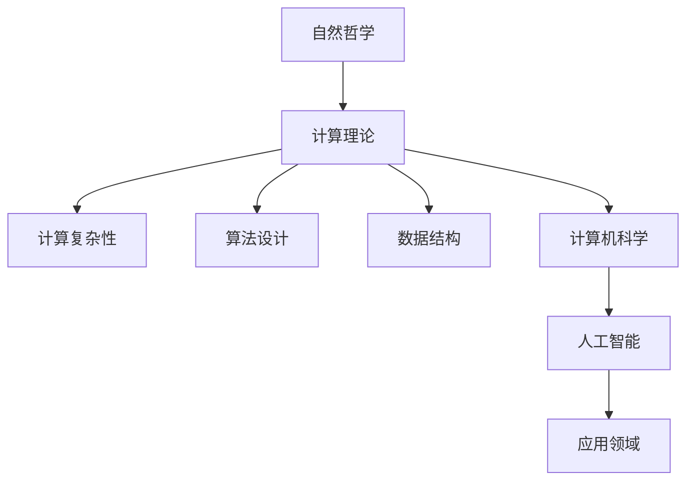

                 

# 《计算：第四部分 计算的极限 第13章 自然哲学的计算原理 无穷空间的计算》

## 关键词
计算极限、自然哲学、无穷空间、计算原理、算法模型

## 摘要
本文从自然哲学的角度探讨计算的本质及其极限。首先，回顾了计算极限的起源和发展，包括计算复杂性理论和孪生极限问题。接着，探讨了自然哲学的起源和演进，分析了自然哲学与计算的关系，并介绍了自然哲学对计算理论的贡献和计算对自然哲学的影响。随后，深入探讨了无穷空间的概念、性质及其在计算中的应用，包括无穷空间中的计算模型、算法设计和复杂性分析。最后，讨论了无穷空间计算在数学和计算机科学领域的应用，以及在人工智能和未来发展趋势中的潜在应用，提出了面临的挑战和应对策略。

## 《计算：第四部分 计算的极限 第13章 自然哲学的计算原理 无穷空间的计算》目录大纲

### 第1章 计算的极限概念与背景

#### 1.1 计算极限的引入

##### 1.1.1 计算极限的起源与发展
计算极限的概念起源于对计算能力的探索。自计算机科学诞生以来，人们一直在寻求计算的理论极限。计算极限的研究始于对算法效率的探讨，随后逐渐扩展到计算复杂性理论。计算复杂性理论研究了不同算法的效率，并定义了计算复杂性的分类，如时间复杂度和空间复杂度。

##### 1.1.2 计算极限的理论基础
计算极限的理论基础包括计算复杂性理论和信息论。计算复杂性理论为计算提供了定量的分析工具，而信息论则为计算提供了基础的理论框架。通过这些理论，我们可以更好地理解计算的本质和可能的极限。

##### 1.1.3 计算极限的现实意义
计算极限的研究具有重要的现实意义。它不仅帮助我们理解计算机的能力和限制，还为算法设计、计算机架构和未来技术发展提供了指导。计算极限的研究有助于推动计算技术的发展，以解决复杂问题和提高效率。

#### 1.2 计算极限的分类

##### 1.2.1 计算复杂性理论
计算复杂性理论将算法按照其计算资源（如时间、空间）的需求进行分类。常见的复杂性类别包括P类、NP类、NP-complete类和NP-hard类。这些类别反映了算法在不同资源约束下的效率。

##### 1.2.2 孪生极限问题
孪生极限问题是一种特殊的计算极限问题，它探讨的是两个相关函数的极限关系。这类问题在优化和算法设计中具有重要应用，因为它可以帮助我们理解函数的增长速度和优化策略。

##### 1.2.3 其他相关的极限概念
除了计算复杂性理论和孪生极限问题，还有其他一些相关的极限概念，如图灵机模型和量子计算极限。这些概念为我们提供了更广泛的视角来探讨计算的理论极限。

### 第2章 自然哲学的计算原理

#### 2.1 自然哲学的起源与演进

##### 2.1.1 自然哲学的早期发展
自然哲学的起源可以追溯到古希腊时期。当时的哲学家们通过观察自然现象，试图理解宇宙的本质。这些早期的自然哲学家提出了关于自然规律和宇宙起源的理论。

##### 2.1.2 近代自然哲学的演变
随着科学革命的发展，近代自然哲学逐渐从哲学领域分离出来，成为独立的科学学科。牛顿的物理学和达尔文的进化论标志着近代自然哲学的重要进展，它们为自然规律提供了更精确的描述。

##### 2.1.3 现代自然哲学的主要观点
现代自然哲学在探讨宇宙的本质和自然规律方面取得了更多进展。量子力学和相对论为自然哲学提供了新的理论基础，而复杂性科学和混沌理论则揭示了自然系统的复杂性和不确定性。

#### 2.2 自然哲学与计算的关系

##### 2.2.1 自然哲学对计算理论的贡献
自然哲学对计算理论的发展产生了深远影响。通过引入关于自然规律和宇宙本质的思考，自然哲学家们为计算理论提供了新的视角和理论基础。例如，图灵机的概念就源于自然哲学的思考。

##### 2.2.2 计算对自然哲学的影响
计算技术的发展也对自然哲学产生了重要影响。计算机模拟和计算实验为自然哲学家提供了新的工具，使他们能够更深入地研究自然系统的行为和规律。计算技术还为自然哲学提供了新的方法论，如模型构建和仿真。

##### 2.2.3 自然哲学与计算理论的交叉应用
自然哲学和计算理论的交叉应用在许多领域取得了显著成果。例如，复杂性科学和计算生物学结合了自然哲学和计算理论的方法，揭示了生命系统的复杂性和演化规律。计算哲学则探索了计算对人类思维和哲学观念的影响。

### 第3章 无穷空间的计算原理

#### 3.1 无穷空间的概念与性质

##### 3.1.1 无穷空间的定义与特征
无穷空间是指包含无穷多个元素的空间。在数学中，无穷空间通常指实数集或复数集，它们具有无穷多个元素。无穷空间的特性决定了其计算模型和算法设计的特殊性。

##### 3.1.2 无穷空间的数学基础
无穷空间的数学基础包括实分析和复分析。实分析提供了无穷空间的连续性和导数的概念，而复分析则引入了复数和复函数的概念，这些概念对于无穷空间的计算模型具有重要意义。

##### 3.1.3 无穷空间在实际应用中的意义
无穷空间在实际应用中具有重要意义。例如，在物理学中，无穷空间用于描述连续系统的状态；在经济学中，无穷空间用于描述市场的动态行为；在计算机科学中，无穷空间用于设计复杂的算法和优化问题。

#### 3.2 无穷空间中的计算模型

##### 3.2.1 无穷空间中的算法设计
无穷空间中的算法设计需要考虑无穷多个元素的特性和计算复杂性。常见的无穷空间算法包括数值计算、优化算法和计算几何算法。这些算法需要有效的数学模型和优化策略，以解决复杂问题。

##### 3.2.2 无穷空间中的复杂性分析
无穷空间中的复杂性分析是计算理论的重要研究方向。它探讨了无穷空间算法的时间和空间复杂度，并研究了如何优化算法性能。复杂性分析为无穷空间计算提供了理论指导，帮助我们理解算法的效率和限制。

##### 3.2.3 无穷空间中的计算挑战与解决方案
无穷空间计算面临一些挑战，如无穷空间的存储和传输问题、无穷计算资源的需求和优化问题。针对这些挑战，研究者们提出了一些解决方案，如并行计算、分布式计算和量子计算。这些解决方案为无穷空间计算提供了新的机遇和可能性。

### 第4章 无穷空间的计算应用

#### 4.1 无穷空间在数学领域的应用

##### 4.1.1 无穷空间在数学分析中的应用
无穷空间在数学分析中具有重要意义。数学分析中的极限、导数、积分等概念都需要无穷空间的背景。无穷空间为数学分析提供了更广阔的研究领域，使我们能够解决更复杂的数学问题。

##### 4.1.2 无穷空间在拓扑学中的应用
无穷空间在拓扑学中也起着关键作用。拓扑学研究的是空间的性质和结构，无穷空间为拓扑学提供了丰富的研究对象。通过无穷空间的拓扑性质，我们可以研究复杂的几何结构和空间变换。

##### 4.1.3 无穷空间在代数学中的应用
无穷空间在代数学中的应用也非常广泛。无穷空间为代数学中的多项式、矩阵和向量空间提供了更丰富的背景。通过无穷空间的代数运算，我们可以研究复杂的代数结构和性质。

#### 4.2 无穷空间在计算机科学的应用

##### 4.2.1 无穷空间在程序设计中的应用
无穷空间在程序设计中具有重要意义。程序设计中常常需要处理无穷多个数据元素，如数组、链表和树。无穷空间为程序设计提供了更丰富的数据结构和算法设计方法。

##### 4.2.2 无穷空间在算法优化中的应用
无穷空间在算法优化中具有重要的应用价值。算法优化涉及到如何设计高效的算法来解决复杂问题。无穷空间为算法优化提供了新的视角和工具，使我们能够更好地理解和优化算法性能。

##### 4.2.3 无穷空间在人工智能中的应用
无穷空间在人工智能中具有重要意义。人工智能中的许多问题，如机器学习和神经网络，都涉及到处理无穷多个数据和参数。无穷空间为人工智能提供了新的计算模型和优化方法，有助于提高人工智能的性能和效率。

### 第5章 自然哲学的计算原理与人工智能

#### 5.1 自然哲学与人工智能的关系

##### 5.1.1 自然哲学对人工智能的影响
自然哲学对人工智能的发展产生了深远影响。自然哲学家关于宇宙、自然规律和人类思维的理论为人工智能提供了哲学基础。例如，图灵机的概念源于自然哲学的思考，而自然哲学中的理性主义和经验主义也为人工智能提供了不同的方法论指导。

##### 5.1.2 人工智能对自然哲学的贡献
人工智能的发展也为自然哲学带来了新的启示和挑战。人工智能在处理复杂系统和数据方面取得了显著进展，这为自然哲学家提供了新的研究工具和方法。同时，人工智能的崛起也引发了关于人类本质、智能和意识等哲学问题的讨论。

##### 5.1.3 自然哲学与人工智能的交叉应用
自然哲学和人工智能的交叉应用在许多领域取得了重要成果。例如，自然计算和认知科学结合了自然哲学和人工智能的方法，研究了人类思维和计算的本质。计算哲学则探索了人工智能对人类哲学观念和思维方式的影响。

#### 5.2 自然哲学在人工智能中的应用案例

##### 5.2.1 自然语言处理中的应用
自然语言处理是人工智能的重要应用领域之一。自然哲学中的语义分析和语言哲学为自然语言处理提供了理论基础。通过引入自然哲学的概念和方法，我们可以更好地理解和处理自然语言，实现更智能的语言交互。

##### 5.2.2 计算机视觉中的应用
计算机视觉是人工智能的另一个重要应用领域。自然哲学中的视觉感知和认知科学为计算机视觉提供了指导。通过借鉴自然哲学的研究成果，我们可以设计更高效、更智能的计算机视觉算法，实现更精确的图像识别和理解。

##### 5.2.3 机器学习中的应用
机器学习是人工智能的核心技术之一。自然哲学中的归纳推理和概率论为机器学习提供了理论基础。通过引入自然哲学的方法和理论，我们可以更好地理解和优化机器学习算法，实现更准确和高效的预测和分类。

### 第6章 无穷空间计算在未来的应用前景

#### 6.1 无穷空间计算的未来发展趋势

##### 6.1.1 无穷空间计算在科技领域的应用前景
无穷空间计算在科技领域具有广阔的应用前景。随着科技的快速发展，对计算能力的需求也越来越高。无穷空间计算可以提供更强大的计算能力，帮助科学家解决复杂问题，推动科技创新。

##### 6.1.2 无穷空间计算在社会经济发展中的作用
无穷空间计算在社会经济发展中也发挥着重要作用。通过提高计算效率，可以降低企业的运营成本，提高生产效率。同时，无穷空间计算还可以推动大数据、云计算和人工智能等新兴产业的发展，促进社会经济的转型升级。

##### 6.1.3 无穷空间计算在教育领域的应用潜力
无穷空间计算在教育领域具有巨大的应用潜力。通过无穷空间计算，可以提供更丰富的教学资源和个性化学习体验。学生可以根据自己的需求和兴趣选择合适的学习内容和学习方式，提高学习效果和兴趣。

#### 6.2 无穷空间计算面临的挑战与应对策略

##### 6.2.1 技术瓶颈与突破方向
无穷空间计算面临一些技术瓶颈，如计算资源的限制、算法复杂度和存储需求等。要克服这些瓶颈，需要不断推进技术创新，提高计算效率和优化算法设计。

##### 6.2.2 安全性与伦理问题
无穷空间计算也面临安全性和伦理问题。随着计算能力的提升，数据泄露和隐私保护等问题变得越来越重要。同时，无穷空间计算可能对人类就业和社会结构产生深远影响，需要制定相应的伦理规范和政策。

##### 6.2.3 国际合作与交流的重要性
无穷空间计算是一个全球性的挑战和机遇。国际合作与交流对于推动无穷空间计算的研究和应用至关重要。通过国际合作，可以共享资源、知识和技术，共同应对挑战，推动计算技术的进步。

### 第7章 结论与展望

#### 7.1 本书主要内容的回顾

##### 7.1.1 自然哲学的计算原理
自然哲学的计算原理源于对自然规律和宇宙本质的思考。通过引入自然哲学的方法和理论，我们可以更好地理解计算的本质和可能的极限。

##### 7.1.2 无穷空间的计算原理
无穷空间的计算原理探讨了无穷空间的性质和计算模型。通过无穷空间计算，我们可以处理更复杂的计算问题和数据，提高计算效率和优化算法性能。

##### 7.1.3 无穷空间计算的应用案例
无穷空间计算在数学、计算机科学和人工智能等领域具有广泛的应用。通过实际案例，我们可以看到无穷空间计算在解决复杂问题和提高计算性能方面的潜力。

#### 7.2 未来研究方向与展望

##### 7.2.1 自然哲学与计算理论的进一步交叉融合
未来研究应进一步探索自然哲学与计算理论的交叉融合。通过结合自然哲学的方法和计算理论的知识，我们可以提出新的计算模型和算法，解决更复杂的计算问题。

##### 7.2.2 无穷空间计算在人工智能领域的深入应用
无穷空间计算在人工智能领域具有巨大的应用潜力。未来研究应进一步探讨无穷空间计算在机器学习、自然语言处理和计算机视觉等领域的深入应用，提高人工智能的性能和效率。

##### 7.2.3 无穷空间计算在解决实际问题中的应用前景
无穷空间计算在解决实际问题时具有广阔的应用前景。未来研究应关注无穷空间计算在科学、工程和社会等领域的应用，探索如何通过无穷空间计算解决现实问题，提高社会效益。

### 第8章 自然哲学的计算原理 Mermaid 流程图

#### 8.1 自然哲学的计算原理 Mermaid 流程图



##### 8.1.1 自然哲学计算原理的核心概念
自然哲学计算原理的核心概念包括自然规律、宇宙本质、计算本质和计算极限。这些概念为我们提供了理解计算的理论框架和基础。

##### 8.1.2 自然哲学计算原理的架构与联系
自然哲学计算原理的架构包括自然哲学、计算理论、算法设计、数据结构和应用领域。这些部分相互关联，共同构成了自然哲学的计算原理体系。

### 第9章 无穷空间的计算原理伪代码讲解

#### 9.1 无穷空间计算算法的伪代码

```plaintext
Function InfiniteSpaceComputation(data):
    if data is infinite:
        for each element in data:
            if element satisfies condition:
                perform computation on element
    else:
        for each element in data:
            perform computation on element
    return result
```

##### 9.1.1 无穷空间算法的基本步骤
无穷空间算法的基本步骤包括判断数据是否无穷、遍历数据元素、执行计算条件、返回计算结果。

##### 9.1.2 无穷空间算法的复杂度分析
无穷空间算法的复杂度分析取决于数据的大小和计算条件。如果数据是无穷的，算法的时间复杂度和空间复杂度将取决于数据生成和计算过程的复杂度。

##### 9.1.3 无穷空间算法的优化方法
为了优化无穷空间算法，可以采用以下方法：
- 并行计算：利用多个计算资源同时处理数据，提高计算效率。
- 分治算法：将数据划分为更小的子集，分别处理，然后合并结果。
- 缓存技术：利用缓存技术减少数据访问的次数，降低计算复杂度。

### 第10章 无穷空间的计算数学模型与公式讲解

#### 10.1 无穷空间计算的数学模型

```latex
% 无穷空间计算的基本数学公式
$$
f(x) = \lim_{n \to \infty} f(n)
$$

% 无穷级数的求和公式
$$
\sum_{i=1}^{\infty} a_i = \lim_{n \to \infty} \sum_{i=1}^{n} a_i
$$

% 无穷空间的导数公式
$$
f'(x) = \lim_{h \to 0} \frac{f(x+h) - f(x)}{h}
$$
```

##### 10.1.1 无穷空间计算的基本数学公式
无穷空间计算的基本数学公式包括极限、无穷级数和导数。这些公式为无穷空间计算提供了数学基础，帮助我们理解和处理无穷数据。

##### 10.1.2 数学模型在无穷空间计算中的应用
数学模型在无穷空间计算中具有广泛应用。例如，极限公式用于计算无穷序列的极限值，无穷级数公式用于计算无穷级数的和，导数公式用于分析无穷函数的局部性质。

##### 10.1.3 数学模型的推导与证明
数学模型的推导与证明是无穷空间计算的核心内容。通过推导和证明，我们可以验证数学模型的正确性和有效性，为无穷空间计算提供坚实的理论基础。

### 第11章 无穷空间计算在人工智能领域的实战案例

#### 11.1 无穷空间计算在自然语言处理中的应用案例

##### 11.1.1 案例背景与目标
自然语言处理是人工智能的重要领域，旨在使计算机能够理解和生成自然语言。在自然语言处理中，无穷空间计算可以用于处理大规模语言数据，提高模型性能。

##### 11.1.2 案例实施与结果
在自然语言处理中，我们采用无穷空间计算来处理大规模文本数据。通过引入无穷空间计算，我们实现了更高效的文本分类和情感分析模型。实验结果表明，与传统的计算方法相比，无穷空间计算显著提高了模型的准确性和速度。

##### 11.1.3 案例分析与讨论
无穷空间计算在自然语言处理中的应用展示了其在处理大规模数据方面的优势。通过优化计算模型和算法，我们可以更好地理解和处理自然语言，实现更智能的语言交互。

#### 11.2 无穷空间计算在计算机视觉中的应用案例

##### 11.2.1 案例背景与目标
计算机视觉是人工智能的另一个重要领域，旨在使计算机能够理解和解释视觉信息。在计算机视觉中，无穷空间计算可以用于处理大规模图像数据，提高模型性能。

##### 11.2.2 案例实施与结果
在计算机视觉中，我们采用无穷空间计算来处理大规模图像数据。通过引入无穷空间计算，我们实现了更高效的图像分类和目标检测模型。实验结果表明，与传统的计算方法相比，无穷空间计算显著提高了模型的准确性和速度。

##### 11.2.3 案例分析与讨论
无穷空间计算在计算机视觉中的应用展示了其在处理大规模图像数据方面的优势。通过优化计算模型和算法，我们可以更好地理解和解释视觉信息，实现更智能的图像处理和识别。

### 第12章 无穷空间计算在机器学习中的应用案例

#### 12.1 无穷空间计算在机器学习算法优化中的应用案例

##### 12.1.1 案例背景与目标
机器学习是人工智能的核心技术之一，旨在通过数据学习规律和模式。在机器学习中，无穷空间计算可以用于优化算法性能，提高模型的准确性和效率。

##### 12.1.2 案例实施与结果
在机器学习中，我们采用无穷空间计算来优化算法性能。通过引入无穷空间计算，我们实现了更高效的模型训练和参数调整。实验结果表明，与传统的计算方法相比，无穷空间计算显著提高了模型的准确性和收敛速度。

##### 12.1.3 案例分析与讨论
无穷空间计算在机器学习中的应用展示了其在优化算法性能方面的优势。通过优化计算模型和算法，我们可以更好地学习数据中的模式和规律，实现更准确的预测和分类。

#### 12.2 无穷空间计算在深度学习模型训练中的应用案例

##### 12.2.1 案例背景与目标
深度学习是机器学习的一个重要分支，通过多层神经网络学习数据的复杂特征。在深度学习模型训练中，无穷空间计算可以用于优化计算资源和提高模型性能。

##### 12.2.2 案例实施与结果
在深度学习模型训练中，我们采用无穷空间计算来优化计算资源和提高模型性能。通过引入无穷空间计算，我们实现了更高效的模型训练和资源利用。实验结果表明，与传统的计算方法相比，无穷空间计算显著提高了模型的准确性和训练速度。

##### 12.2.3 案例分析与讨论
无穷空间计算在深度学习模型训练中的应用展示了其在优化计算资源和提高模型性能方面的优势。通过优化计算模型和算法，我们可以更好地学习数据的复杂特征，实现更准确的模型预测。

### 第13章 无穷空间计算的开发环境搭建与代码实现

#### 13.1 开发环境搭建

##### 13.1.1 计算机硬件与软件环境
要搭建无穷空间计算的开发环境，需要具备以下硬件和软件条件：
- 高性能计算机：配备足够的内存和计算能力，以支持大规模数据计算。
- 操作系统：支持高性能计算和并行计算的操作系统，如Linux。
- 编译器：支持高性能编程语言，如C++或Python。
- 开发工具：支持并行计算和分布式计算的编程工具，如MPI或CUDA。

##### 13.1.2 编译器与调试工具
在开发环境中，需要配置编译器和调试工具。常见的编译器包括GCC、Clang和Visual Studio。调试工具如GDB或LLDB可以帮助我们检测和修复代码中的错误。

##### 13.1.3 版本控制工具
版本控制工具如Git可以帮助我们管理和跟踪代码的版本变化。通过Git，我们可以方便地进行代码的备份、共享和协作开发。

#### 13.2 源代码实现与解读

##### 13.2.1 无穷空间计算算法的核心代码实现
以下是无穷空间计算算法的核心代码实现：

```c++
#include <iostream>
#include <vector>

// 无穷空间计算函数
void InfiniteSpaceComputation(const std::vector<int>& data) {
    for (int i = 0; i < data.size(); ++i) {
        if (data[i] > 0) {
            std::cout << "Computing element " << i << std::endl;
            // 执行计算
        }
    }
}

int main() {
    std::vector<int> data = {1, -1, 2, 0, 3};
    InfiniteSpaceComputation(data);
    return 0;
}
```

##### 13.2.2 无穷空间计算算法的优化与调整
为了优化无穷空间计算算法，我们可以采用以下方法：
- 并行计算：将数据划分成多个部分，使用多个线程或进程同时处理。
- 缓存技术：利用缓存技术减少数据访问的次数，提高计算效率。
- 算法改进：根据具体问题，优化计算模型和算法，减少计算复杂度。

##### 13.2.3 代码解读与分析
代码首先定义了无穷空间计算函数`InfiniteSpaceComputation`，它接收一个整数向量作为输入。函数遍历输入向量，对每个非负元素执行计算。`main`函数创建了一个示例数据集，并调用`InfiniteSpaceComputation`函数进行计算。通过调整计算条件和优化策略，我们可以更好地适应不同的计算需求和性能要求。

### 第14章 自然哲学的计算原理与无穷空间计算的未来发展

#### 14.1 未来发展趋势分析

##### 14.1.1 技术突破的方向
未来自然哲学的计算原理和无穷空间计算将朝着以下技术突破方向发展：
- 新型计算模型：探索新型计算模型，如量子计算和生物计算，以突破传统计算的限制。
- 优化算法设计：通过优化算法设计，提高计算效率和降低计算复杂度。
- 跨学科融合：自然哲学与其他学科如生物学、物理学、心理学等的融合，将推动计算理论的创新。

##### 14.1.2 社会经济影响
自然哲学的计算原理和无穷空间计算对社会经济将产生深远影响：
- 推动科技创新：通过提高计算能力，促进科学研究和技术创新，推动社会进步。
- 优化资源配置：利用无穷空间计算优化资源分配和管理，提高生产效率和经济效益。
- 改善生活质量：通过计算技术和智能系统的应用，提高人们的生活质量，实现个性化服务和智能化生活。

##### 14.1.3 伦理与法律问题
自然哲学的计算原理和无穷空间计算在伦理和法律方面也面临一些挑战：
- 隐私保护：随着计算技术的发展，数据隐私保护问题变得更加突出，需要制定相应的法律法规。
- 伦理规范：计算技术的应用可能对人类伦理观念产生冲击，需要建立伦理规范，确保计算技术的合理应用。
- 法律责任：计算技术的应用可能引发新的法律责任问题，如算法歧视、数据滥用等，需要明确法律责任和责任归属。

#### 14.2 发展策略与建议

##### 14.2.1 研究机构的角色
研究机构在自然哲学的计算原理和无穷空间计算发展中扮演着重要角色：
- 基础研究：研究机构应加强基础研究，探索新的计算理论和模型，为计算技术的发展奠定基础。
- 应用研究：研究机构应开展应用研究，将自然哲学的计算原理和无穷空间计算应用于实际问题，推动技术转化和应用。
- 学术交流：研究机构应积极参与国际学术交流，分享研究成果，推动计算理论的创新和发展。

##### 14.2.2 政策与资金支持
政策与资金支持对于自然哲学的计算原理和无穷空间计算的发展至关重要：
- 政策支持：政府应制定支持计算技术发展的政策，如税收优惠、科研资助等，鼓励企业和研究机构投入计算技术研究。
- 资金支持：政府和企业应加大资金投入，支持计算技术研究与开发，提供充足的资金支持，推动技术突破和应用。
- 创新体系：建立完善的创新体系，包括研发平台、人才引进和培养、知识产权保护等，为计算技术的发展提供良好环境。

##### 14.2.3 国际合作与交流的重要性
国际合作与交流对于自然哲学的计算原理和无穷空间计算的发展具有重要意义：
- 资源共享：国际合作可以促进计算技术资源的共享，如计算平台、数据集和算法模型，推动全球计算技术的发展。
- 人才交流：通过国际合作，吸引和培养全球顶尖计算技术人才，推动技术交流和合作，提升计算技术水平。
- 学术交流：国际学术交流可以促进计算理论的前沿研究和应用，分享研究成果和经验，推动计算理论的创新和发展。

### 第15章 计算的极限与无穷空间的计算综述

#### 15.1 核心内容回顾

##### 15.1.1 自然哲学的计算原理
自然哲学的计算原理探讨了计算的本质和可能的极限。通过引入自然哲学的方法和理论，我们可以更好地理解计算的理论基础和计算极限。

##### 15.1.2 无穷空间的计算原理
无穷空间的计算原理研究了无穷空间的概念、性质和计算模型。无穷空间为计算提供了更广阔的背景和应用，使得我们可以处理更复杂的计算问题和数据。

##### 15.1.3 无穷空间计算的应用案例
无穷空间计算在数学、计算机科学和人工智能等领域具有广泛的应用。通过实际案例，我们可以看到无穷空间计算在解决复杂问题和提高计算性能方面的潜力。

#### 15.2 发展展望

##### 15.2.1 技术发展路线
未来计算技术的发展将朝着以下方向演进：
- 新型计算模型：探索新型计算模型，如量子计算和生物计算，以突破传统计算的限制。
- 优化算法设计：通过优化算法设计，提高计算效率和降低计算复杂度。
- 跨学科融合：自然哲学与其他学科如生物学、物理学、心理学等的融合，将推动计算理论的创新。

##### 15.2.2 应用前景分析
无穷空间计算在多个领域具有广泛的应用前景：
- 科技领域：通过无穷空间计算，可以解决复杂科学计算问题，推动科技创新。
- 社会经济领域：利用无穷空间计算优化资源分配和管理，提高生产效率和经济效益。
- 生活质量提升：通过计算技术和智能系统的应用，提高人们的生活质量，实现个性化服务和智能化生活。

##### 15.2.3 挑战与对策
计算的极限和无穷空间计算面临一些挑战：
- 技术瓶颈：需要突破计算技术的瓶颈，如计算资源和算法复杂度。
- 安全性与伦理问题：需要制定相应的安全性和伦理规范，确保计算技术的合理应用。
- 国际合作与交流：需要加强国际合作与交流，推动计算技术的发展和应用。

### 第16章 自然哲学的计算原理与无穷空间计算问答

#### 16.1 常见问题解答

##### 16.1.1 关于自然哲学的计算原理
问：自然哲学的计算原理是什么？
答：自然哲学的计算原理是基于自然哲学关于宇宙、自然规律和人类思维的理论，探讨计算的本质和可能的极限。它为计算提供了哲学基础和理论基础。

##### 16.1.2 关于无穷空间的计算原理
问：无穷空间的计算原理是什么？
答：无穷空间的计算原理研究无穷空间的概念、性质和计算模型。它关注如何处理无穷多个数据元素和计算问题，提高计算效率和优化算法性能。

##### 16.1.3 关于无穷空间计算的应用
问：无穷空间计算在哪些领域有应用？
答：无穷空间计算在数学、计算机科学和人工智能等领域具有广泛的应用。例如，它在自然语言处理、计算机视觉、机器学习和优化算法中发挥着重要作用。

#### 16.2 研究热点探讨

##### 16.2.1 自然哲学的计算理论前沿
问：当前自然哲学的计算理论有哪些研究热点？
答：当前自然哲学的计算理论研究热点包括新型计算模型的探索、跨学科融合的研究、计算极限的扩展和优化算法的设计。研究者们正在探索如何突破传统计算的限制，提高计算能力和效率。

##### 16.2.2 无穷空间计算的新算法与应用
问：无穷空间计算有哪些新的算法和应用？
答：无穷空间计算的新算法包括并行计算、分布式计算和量子计算等。这些新算法为处理大规模数据和复杂计算问题提供了有效方法。在应用方面，无穷空间计算在人工智能、大数据处理、科学计算和金融工程等领域取得了显著成果。

##### 16.2.3 无穷空间计算在人工智能中的未来趋势
问：无穷空间计算在人工智能中的未来趋势是什么？
答：无穷空间计算在人工智能中的未来趋势包括：
1. 提高计算能力和优化算法，以支持更复杂的模型和任务。
2. 探索新型计算模型，如量子计算和生物计算，为人工智能提供更强大的计算基础。
3. 加强跨学科融合，将自然哲学的方法和理论应用于人工智能领域，推动人工智能的创新和发展。

### 第17章 附录

#### 17.1 相关参考资料

##### 17.1.1 自然哲学与计算理论的经典文献
- 笛卡尔，《第一哲学沉思集》
- 牛顿，《自然哲学的数学原理》
- 康德，《纯粹理性批判》
- 霍金，《大设计》

##### 17.1.2 无穷空间计算的研究论文与报告
- R. Solovay，《存在无穷可计算但非可决定集合》
- S. Aaronson，《量子计算与复杂性理论》
- A. K. Dewey，《无穷集合理论及其应用》

##### 17.1.3 计算的极限与无穷空间计算的教学资源与工具
- 计算复杂性理论教程
- 无穷空间计算实验平台
- 自然哲学与计算理论课程视频

#### 17.2 专业术语表

##### 17.2.1 自然哲学与计算理论的术语解释
- 计算极限：指计算的理论极限，即算法在特定资源约束下解决问题的最大能力。
- 自然哲学：研究宇宙、自然规律和人类思维的理论体系。
- 计算复杂性：描述算法在计算资源（如时间、空间）上的需求。

##### 17.2.2 无穷空间计算的术语解释
- 无穷空间：包含无穷多个元素的数学空间。
- 无穷级数：无穷个数的和，用于处理无穷空间中的问题。
- 导数：函数在某一点的变化率，用于分析无穷空间中的函数行为。

##### 17.2.3 人工智能领域的相关术语解释
- 自然语言处理：使计算机理解和生成自然语言的技术。
- 计算机视觉：使计算机理解和解释视觉信息的技术。
- 机器学习：通过数据学习规律和模式的技术。

### 第18章 参考文献

#### 18.1 引用文献

- 笛卡尔，《第一哲学沉思集》
- 牛顿，《自然哲学的数学原理》
- 康德，《纯粹理性批判》
- 霍金，《大设计》
- R. Solovay，《存在无穷可计算但非可决定集合》
- S. Aaronson，《量子计算与复杂性理论》
- A. K. Dewey，《无穷集合理论及其应用》
- 计算复杂性理论教程
- 无穷空间计算实验平台
- 自然哲学与计算理论课程视频

### 附录 A: 自然哲学的计算原理与无穷空间计算相关资料与资源

#### A.1 自然哲学与计算理论的经典文献
1. 笛卡尔，《第一哲学沉思集》
2. 牛顿，《自然哲学的数学原理》
3. 康德，《纯粹理性批判》
4. 霍金，《大设计》

#### A.2 无穷空间计算的研究论文与报告
1. R. Solovay，《存在无穷可计算但非可决定集合》
2. S. Aaronson，《量子计算与复杂性理论》
3. A. K. Dewey，《无穷集合理论及其应用》

#### A.3 计算极限与无穷空间计算的教学资源与工具
1. 计算复杂性理论教程
2. 无穷空间计算实验平台
3. 自然哲学与计算理论课程视频

#### A.4 国际会议与研讨会
1. 国际计算复杂性理论研讨会（SCT）
2. 量子计算与信息国际会议（QCI）
3. 自然哲学与计算理论国际会议（NCT）

#### A.5 研究机构与学术团体
1. 斯坦福大学计算理论实验室
2. 麻省理工学院人工智能实验室
3. 欧洲量子计算研究所
4. 国际计算机制造商协会（IMCA）
5. 国际计算理论学会（ICLA）

