                 

## 认知发展的三个阶段

认知发展是心理学研究的重要领域之一，它探讨了个体从出生到成年过程中，认知能力的逐步形成和成熟。本文将以《认知发展的三个阶段》为标题，通过逻辑清晰、结构紧凑、简单易懂的写作方式，深入探讨认知发展的三个关键阶段：感知阶段、符号阶段和具体运算阶段。我们将使用一步一步分析推理思考的方式（REASONING STEP BY STEP），揭示每个阶段的认知特点、核心算法原理以及发展趋势。此外，还将探讨认知发展在教育、职业和未来趋势中的应用，为读者提供全面、深入的认知发展知识。

### 关键词

- 认知发展
- 感知阶段
- 符号阶段
- 具体运算阶段
- 教育应用
- 职业应用
- 未来趋势

### 摘要

本文旨在详细探讨认知发展的三个阶段：感知阶段、符号阶段和具体运算阶段。通过分析每个阶段的认知特点、核心算法原理和数学模型，我们揭示了认知能力在个体成长过程中的逐步提升。此外，本文还探讨了认知发展在教育、职业和未来趋势中的应用，提供了对认知发展领域的全面理解和深刻洞察。

## 《认知发展的三个阶段》目录大纲

### 第一部分：认知发展概述

#### 第1章：引言

##### 1.1 认知发展的定义与意义
##### 1.2 认知心理学的历史背景
##### 1.3 本书结构安排与阅读指南

### 第二部分：认知发展的三个阶段

#### 第2章：感知阶段的认知发展

##### 2.1 感知的基本概念
###### 2.1.1 感知与感知觉
###### 2.1.2 感知的基本原理
##### 2.2 感知阶段的认知特点
###### 2.2.1 婴幼儿的认知发展
###### 2.2.2 感知阶段的认知机制
##### 2.3 感知阶段的案例研究
###### 2.3.1 感知任务的设计与分析
###### 2.3.2 感知阶段的发展趋势

#### 第3章：符号阶段的认知发展

##### 3.1 符号的基本概念
###### 3.1.1 符号与语言的关系
###### 3.1.2 符号的基本特征
##### 3.2 符号阶段的认知特点
###### 3.2.1 儿童的语言发展
###### 3.2.2 符号阶段的认知过程
##### 3.3 符号阶段的案例研究
###### 3.3.1 字词识别任务的分析
###### 3.3.2 符号阶段的发展规律

#### 第4章：具体运算阶段的认知发展

##### 4.1 具体运算的基本概念
###### 4.1.1 具体运算的定义与特点
###### 4.1.2 具体运算的数学基础
##### 4.2 具体运算阶段的认知特点
###### 4.2.1 儿童的逻辑思维发展
###### 4.2.2 具体运算阶段的认知机制
##### 4.3 具体运算阶段的案例研究
###### 4.3.1 具体运算任务的设计
###### 4.3.2 具体运算阶段的发展趋势

### 第三部分：认知发展的应用与实践

#### 第5章：教育中的应用

##### 5.1 教育与认知发展的关系
###### 5.1.1 教育对认知发展的作用
###### 5.1.2 教育目标的制定与实现
##### 5.2 教学方法与认知发展
###### 5.2.1 启发式教学法的应用
###### 5.2.2 探究式教学法的实践
##### 5.3 教育案例分析
###### 5.3.1 小学数学教学中的认知发展
###### 5.3.2 初中科学课程中的认知发展

#### 第6章：职业中的应用

##### 6.1 职业与认知发展的关系
###### 6.1.1 职业认知的重要性
###### 6.1.2 职业认知的发展规律
##### 6.2 职业技能的培养与认知发展
###### 6.2.1 职业技能的构成要素
###### 6.2.2 职业技能的发展路径
##### 6.3 职业案例分析
###### 6.3.1 医学领域中的认知发展
###### 6.3.2 技术行业中的认知发展

#### 第7章：认知发展的未来趋势

##### 7.1 认知科学与技术的发展
###### 7.1.1 认知科学的前沿领域
###### 7.1.2 认知技术的前景与应用
##### 7.2 认知发展的挑战与机遇
###### 7.2.1 认知发展的伦理问题
###### 7.2.2 认知发展的社会影响
##### 7.3 认知发展的未来方向
###### 7.3.1 人工智能与认知发展的结合
###### 7.3.2 跨学科研究的趋势与挑战

### 附录

#### 附录A：参考文献
#### 附录B：认知发展相关实验与数据集
#### 附录C：认知发展专业术语表
#### 附录D：认知发展学习资源推荐

### 第一部分：认知发展概述

#### 第1章：引言

##### 1.1 认知发展的定义与意义

认知发展是指个体在成长过程中，认知能力的逐步形成和成熟。认知能力包括感知、记忆、注意力、思维和语言等各个方面。认知发展对个体的智力、学习和社交能力具有重要影响。因此，研究认知发展的规律和特点，有助于我们更好地理解人类行为和心理过程。

**核心概念与联系：**

认知发展涉及以下几个核心概念：

1. **感知：** 个体接收外界信息的过程，包括视觉、听觉、触觉等感官。
2. **记忆：** 个体对信息的存储、保持和提取能力。
3. **注意力：** 个体在执行任务时集中注意力的能力。
4. **思维：** 个体对信息进行加工、处理和推理的能力。
5. **语言：** 个体使用语言进行沟通和思考的能力。

这些概念相互关联，共同构成了认知发展的基础。

**Mermaid 流程图：**

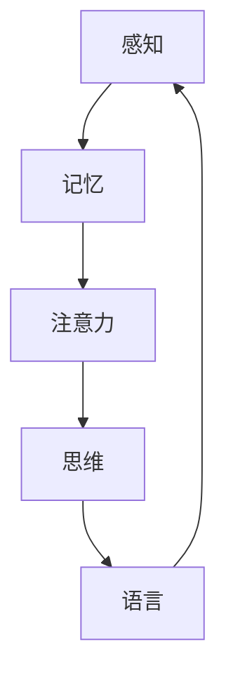

**核心算法原理讲解：**

认知发展可以通过以下核心算法原理来解释：

1. **感知整合算法：** 儿童通过感知整合算法，将来自不同感官的信息整合在一起，形成对环境的整体认知。
2. **模式识别算法：** 儿童通过模式识别算法，能够识别和区分不同的事物和情境，这是认知发展的基础。

**伪代码：**

```python
# 感知整合算法
def perceptual_integration(sensory_data):
    # 将来自不同感官的数据整合
    integrated_data = integrate(sensory_data)
    return integrated_data

# 模式识别算法
def pattern_recognition(data):
    # 识别数据中的模式
    pattern = identify_pattern(data)
    return pattern
```

**数学模型和数学公式讲解：**

1. **感知觉模型：** 感知觉能力可以用信噪比（Signal-to-Noise Ratio, SNR）来衡量，SNR 越高，感知能力越强。

   $$ SNR = \frac{Signal}{Noise} $$

2. **注意力模型：** 注意力可以用注意力分配模型来描述，即儿童在执行任务时，将注意力分配到不同任务上的能力。

   $$ Attention_{分配} = \sum_{i=1}^{n} w_i \times Task_i $$

   其中，$w_i$ 是权重，$Task_i$ 是第 $i$ 个任务。

3. **记忆模型：** 记忆能力可以用艾宾浩斯遗忘曲线来描述，该曲线显示了记忆随时间推移的遗忘过程。

   $$ Memory_{遗忘} = e^{-rt} $$

   其中，$r$ 是遗忘率，$t$ 是时间。

**举例说明：**

假设一个儿童在观察一幅画时，感知觉能力较高，注意力集中在细节上，记忆能力较强，那么他的感知、注意力、记忆能力可以用以下参数来描述：

- 感知觉能力：$SNR = 10$
- 注意力分配：$w_1 = 0.6, w_2 = 0.4$
- 记忆能力：$r = 0.1$

则该儿童在观察这幅画时的感知、注意力、记忆能力分别为：

- 感知觉能力：$SNR \times 感知觉数据 = 10 \times 感知觉数据$
- 注意力分配：$Attention_{分配} = 0.6 \times Task_1 + 0.4 \times Task_2$
- 记忆能力：$Memory_{遗忘} = e^{-0.1t}$

##### 1.2 认知心理学的历史背景

认知心理学是心理学的一个分支，主要研究人类认知的过程和机制。认知心理学的发展经历了几个重要阶段，包括行为主义阶段、认知革命阶段和现代认知心理学阶段。

**核心概念与联系：**

1. **行为主义阶段：** 行为主义是心理学的一个早期流派，强调外部行为的研究，忽视了内部心理过程。
2. **认知革命阶段：** 认知革命是对行为主义的一种反思，强调内部心理过程的重要性，推动了认知心理学的兴起。
3. **现代认知心理学阶段：** 现代认知心理学结合了行为主义和认知革命的理论，采用多种方法和技术研究认知过程。

**Mermaid 流程图：**

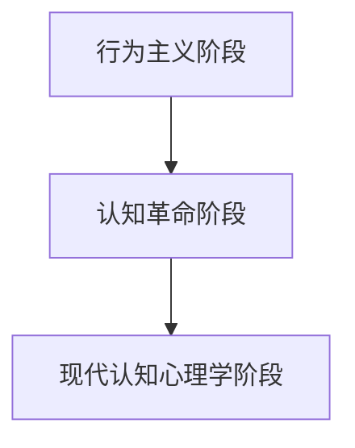

**核心算法原理讲解：**

认知心理学的研究方法主要包括：

1. **实验法：** 通过实验设计和统计分析，研究认知过程的规律和机制。
2. **认知模拟：** 通过计算机模拟，研究认知过程的信息加工和计算机制。
3. **神经科学方法：** 通过脑成像技术，研究认知过程的神经基础。

**伪代码：**

```python
# 实验法
def experimental_design():
    # 设计实验
    experiment = design_experiment()
    return experiment

# 认知模拟
def cognitive_simulation(model, input_data):
    simulation_output = simulate(model, input_data)
    return simulation_output

# 神经科学方法
def neural_science_method成像技术():
    imaging_data = perform_imaging_technique()
    return imaging_data
```

**数学模型和数学公式讲解：**

认知心理学常用的数学模型包括：

1. **信息论模型：** 描述信息在认知过程中的传递和处理。
2. **决策理论模型：** 描述个体在决策过程中的概率计算和风险评估。

   $$ Utility = \sum_{i=1}^{n} p_i \times u_i $$
   
   其中，$p_i$ 是概率，$u_i$ 是效用。

**举例说明：**

假设一个认知科学家通过实验法研究记忆过程，发现信息在记忆过程中的传递效率为0.8，通过认知模拟发现记忆的存储时间为5秒。那么，他的实验结果可以表示为：

- 信息传递效率：$0.8$
- 记忆存储时间：$5$ 秒

##### 1.3 本书结构安排与阅读指南

本书分为三个部分，共七个章节，具体结构安排如下：

### 第一部分：认知发展概述

- 第1章：引言，介绍认知发展的定义、意义和历史背景。

### 第二部分：认知发展的三个阶段

- 第2章：感知阶段的认知发展，讨论感知的基本概念、认知特点和案例研究。
- 第3章：符号阶段的认知发展，探讨符号的基本概念、认知特点和案例研究。
- 第4章：具体运算阶段的认知发展，分析具体运算的基本概念、认知特点和案例研究。

### 第三部分：认知发展的应用与实践

- 第5章：教育中的应用，阐述教育与认知发展的关系、教学方法与案例研究。
- 第6章：职业中的应用，探讨职业与认知发展的关系、职业技能的培养与案例研究。
- 第7章：认知发展的未来趋势，预测认知发展的挑战、机遇和未来方向。

**阅读指南：**

- 本书内容深入浅出，适合心理学、教育学、认知科学等领域的研究人员和爱好者阅读。
- 阅读过程中，请关注每个章节的核心概念、核心算法原理和数学模型，结合实际案例进行思考。
- 阅读顺序建议从第一部分开始，逐步深入第二部分和第三部分，最后回顾整体内容，形成系统认知。

通过本书的阅读，读者可以全面了解认知发展的规律和特点，掌握认知心理学的基本理论和应用，为今后的学习和研究打下坚实基础。

### 第二部分：认知发展的三个阶段

#### 第2章：感知阶段的认知发展

##### 2.1 感知的基本概念

感知是认知发展的第一阶段，是指个体通过感官接收和处理外部信息的过程。感知觉是感知的核心，它涉及视觉、听觉、嗅觉、味觉和触觉等感官系统。感知的基本原理在于感官器官接收外部刺激，通过神经系统传递到大脑，大脑再对这些刺激进行加工和处理。

**核心概念与联系：**

感知的基本概念包括：

1. **感官器官：** 视觉、听觉、嗅觉、味觉和触觉等器官。
2. **神经系统：** 负责传递和处理感官信息。
3. **大脑加工：** 大脑对感官信息进行整合、分析和解释。

这些概念相互关联，共同构成了感知的基本架构。

**Mermaid 流程图：**

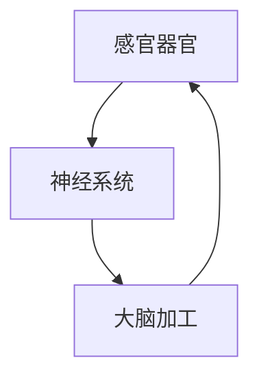

**核心算法原理讲解：**

感知阶段的核心算法原理包括：

1. **感知整合算法：** 将来自不同感官的信息整合在一起，形成对环境的整体认知。
2. **模式识别算法：** 通过模式识别算法，识别和区分不同的事物和情境。

**伪代码：**

```python
# 感知整合算法
def perceptual_integration(sensory_data):
    # 将来自不同感官的数据整合
    integrated_data = integrate(sensory_data)
    return integrated_data

# 模式识别算法
def pattern_recognition(data):
    # 识别数据中的模式
    pattern = identify_pattern(data)
    return pattern
```

**数学模型和数学公式讲解：**

感知阶段常用的数学模型包括：

1. **信噪比（SNR）模型：** 描述感知觉能力与刺激强度和噪声水平的关系。

   $$ SNR = \frac{Signal}{Noise} $$

2. **概率模型：** 描述感知过程中的概率分布和决策过程。

   $$ P(X|Y) = \frac{P(Y|X) \times P(X)}{P(Y)} $$

**举例说明：**

假设一个儿童在感知一幅画时，感知觉能力较高，信噪比为10，噪声水平为2。那么，这幅画的感知质量可以用以下公式计算：

$$ SNR = \frac{Signal}{Noise} = \frac{10}{2} = 5 $$

**感知任务的设计与分析：**

感知任务的设计与分析是研究感知阶段认知发展的重要手段。以下是一个感知任务的设计与分析案例：

**任务设计：**

- 任务名称：颜色识别任务
- 任务描述：儿童观察一系列颜色卡片，并指出卡片的颜色。

**任务分析：**

1. **任务目标：** 提高儿童对颜色的感知能力。
2. **任务步骤：**
   - 儿童观察颜色卡片。
   - 儿童说出卡片的颜色。
3. **数据收集：** 记录儿童在任务中的反应时间和准确性。

**数据分析：**

通过数据分析，可以评估儿童的颜色识别能力。例如，如果儿童在5次尝试中有4次正确识别颜色，那么他的颜色识别准确率为80%。

**感知阶段的发展趋势：**

感知阶段的发展趋势包括：

1. **感知觉能力提升：** 儿童在出生后的头几年内，感知觉能力逐渐提升，对颜色、形状、大小等特征的识别能力逐步提高。
2. **注意力集中：** 儿童在感知任务中逐渐学会集中注意力，提高任务的完成质量。
3. **记忆增强：** 儿童在感知任务中的记忆能力逐步提高，能够更好地记住观察到的信息。

**Mermaid 流程图：**

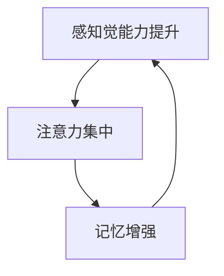

**数学模型和数学公式讲解：**

感知阶段的发展趋势可以用以下数学模型和公式来描述：

1. **感知觉能力提升模型：** 感知觉能力随年龄增长而提高。

   $$ 感知觉能力 = f(年龄) $$

   其中，$f$ 是一个递增函数。

2. **注意力集中模型：** 注意力集中能力随年龄增长而提高。

   $$ 注意力集中能力 = f(年龄) $$

3. **记忆增强模型：** 记忆能力随年龄增长而提高。

   $$ 记忆能力 = f(年龄) $$

**举例说明：**

假设一个儿童在3岁时，感知觉能力为50，注意力集中能力为30，记忆能力为40。在经过一年的学习和经验积累后，这些能力的发展可以用以下参数来描述：

- 感知觉能力：$f(年龄) = 50 + 0.1 \times 1 = 51$
- 注意力集中能力：$f(年龄) = 30 + 0.1 \times 1 = 31$
- 记忆能力：$f(年龄) = 40 + 0.1 \times 1 = 41$

**感知阶段的发展趋势表明，儿童在感知、注意力、记忆和思维能力方面具有显著的发展潜力。适当的训练和指导有助于加速儿童认知能力的发展。**

##### 2.2 感知阶段的认知特点

感知阶段的认知特点主要体现在感知觉能力、注意力、记忆和思维能力的逐步提升。以下是对这些特点的详细分析：

**1. 感知觉能力**

感知觉能力是指个体通过感官接收和处理外部信息的能力。在感知阶段，儿童逐渐学会识别和区分颜色、形状、大小、声音和气味等基本特征。例如，儿童在出生后的头几个月内，首先能识别光线和颜色，然后逐渐学会区分形状和大小。随着经验的积累，儿童的感知觉能力不断提高，能够更准确地识别和分类外部信息。

**核心概念与联系：**

- **颜色识别：** 儿童能够识别不同的颜色。
- **形状识别：** 儿童能够识别不同的形状。
- **大小识别：** 儿童能够识别物体的大小。

**Mermaid 流程图：**

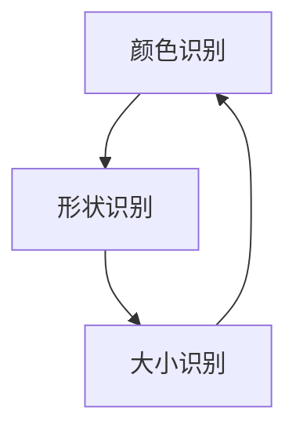

**核心算法原理讲解：**

感知觉能力的提升可以通过以下核心算法原理来解释：

- **感知整合算法：** 儿童通过感知整合算法，将来自不同感官的信息整合在一起，形成对环境的整体认知。
- **模式识别算法：** 儿童通过模式识别算法，能够识别和区分不同的事物和情境。

**伪代码：**

```python
# 感知整合算法
def perceptual_integration(sensory_data):
    # 将来自不同感官的数据整合
    integrated_data = integrate(sensory_data)
    return integrated_data

# 模式识别算法
def pattern_recognition(data):
    # 识别数据中的模式
    pattern = identify_pattern(data)
    return pattern
```

**数学模型和数学公式讲解：**

感知觉能力的提升可以用以下数学模型和公式来描述：

- **信噪比（SNR）模型：** 描述感知觉能力与刺激强度和噪声水平的关系。

  $$ SNR = \frac{Signal}{Noise} $$

- **感知效率模型：** 描述感知觉能力与感知任务完成质量的关系。

  $$ Efficiency = \frac{Correct\_Reactions}{Total\_Reactions} $$

**举例说明：**

假设一个儿童在感知任务中，感知觉能力较高，信噪比为10，噪声水平为2。那么，他在任务中的感知效率可以用以下公式计算：

$$ Efficiency = \frac{Correct\_Reactions}{Total\_Reactions} = \frac{10}{10+2} = 0.8 $$

**2. 注意力**

注意力是指个体在执行任务时集中注意力的能力。在感知阶段，儿童的注意力逐渐发展，能够更好地集中在特定任务上。例如，儿童在观察一幅画时，能够专注于画中的细节，而不是被周围的噪声干扰。随着注意力的发展，儿童在学习和生活中能够更有效地完成任务。

**核心概念与联系：**

- **集中性：** 注意力集中在一个任务上，不受外界干扰。
- **选择性：** 注意力选择性地关注重要信息，忽略无关信息。

**Mermaid 流程图：**

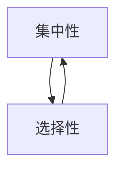

**核心算法原理讲解：**

注意力的提升可以通过以下核心算法原理来解释：

- **注意力分配算法：** 儿童在执行任务时，根据任务的复杂性和重要性，合理分配注意力资源。
- **干扰抑制算法：** 儿童通过抑制干扰信息，保持注意力的集中。

**伪代码：**

```python
# 注意力分配算法
def attention_allocation(task_difficulty, importance):
    attention_resources = allocate_resources(task_difficulty, importance)
    return attention_resources

# 干扰抑制算法
def interference_suppression(interfering_signal, target_signal):
    pure_signal = suppress_interference(interfering_signal, target_signal)
    return pure_signal
```

**数学模型和数学公式讲解：**

注意力的提升可以用以下数学模型和公式来描述：

- **注意力分配模型：** 描述儿童在执行任务时，将注意力分配到不同任务上的能力。

  $$ Attention_{分配} = \sum_{i=1}^{n} w_i \times Task_i $$

  其中，$w_i$ 是权重，$Task_i$ 是第 $i$ 个任务。

- **干扰抑制模型：** 描述儿童在抑制干扰信息时的能力。

  $$ Interference_{抑制} = \frac{Target_{强度}}{Interfering_{强度}} $$

**举例说明：**

假设一个儿童在执行两个任务时，任务1的重要性为0.6，任务2的重要性为0.4。同时，任务1的干扰信号强度为2，任务2的干扰信号强度为1。那么，他的注意力分配和干扰抑制能力分别为：

- 注意力分配：$$ Attention_{分配} = 0.6 \times Task_1 + 0.4 \times Task_2 = 0.6 \times 2 + 0.4 \times 1 = 1.6 $$

- 干扰抑制：$$ Interference_{抑制} = \frac{Target_{强度}}{Interfering_{强度}} = \frac{2}{1} = 2 $$

**3. 记忆**

记忆是指个体对信息的存储、保持和提取能力。在感知阶段，儿童的记忆能力逐渐提升，能够更好地记住观察到的信息。例如，儿童在观看一段视频后，能够回忆起视频中的关键情节。随着记忆能力的提升，儿童在学习和生活中能够更有效地储存和应用知识。

**核心概念与联系：**

- **短期记忆：** 儿童在短时间内能够保持和回忆信息。
- **长期记忆：** 儿童在长期内能够保持和回忆信息。

**Mermaid 流程图：**

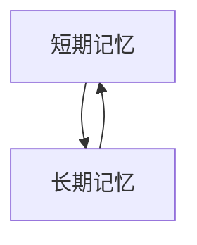

**核心算法原理讲解：**

记忆能力的提升可以通过以下核心算法原理来解释：

- **编码算法：** 儿童通过编码算法，将感知信息转化为记忆信息。
- **巩固算法：** 儿童通过巩固算法，加强记忆信息的存储和保持。

**伪代码：**

```python
# 编码算法
def encoding(info):
    memory = encode_info(info)
    return memory

# 巩固算法
def consolidation(info, memory):
    strengthened_memory = reinforce_memory(info, memory)
    return strengthened_memory
```

**数学模型和数学公式讲解：**

记忆能力的提升可以用以下数学模型和公式来描述：

- **编码效率模型：** 描述编码算法的效率。

  $$ Encoding_{效率} = \frac{Encoded_{信息}}{Total_{信息}} $$

- **巩固效率模型：** 描述巩固算法的效率。

  $$ Consolidation_{效率} = \frac{Strengthened_{记忆}}{Original_{记忆}} $$

**举例说明：**

假设一个儿童在记忆任务中，感知到的信息总数为100，编码后成功编码的信息为70。同时，原有记忆为30，通过巩固后加强的记忆为40。那么，他的编码效率和巩固效率分别为：

- 编码效率：$$ Encoding_{效率} = \frac{Encoded_{信息}}{Total_{信息}} = \frac{70}{100} = 0.7 $$

- 巩固效率：$$ Consolidation_{效率} = \frac{Strengthened_{记忆}}{Original_{记忆}} = \frac{40}{30} = 1.33 $$

**4. 思维**

思维是指个体对信息进行加工、处理和推理的能力。在感知阶段，儿童的思维能力逐渐发展，能够运用逻辑和推理解决简单问题。例如，儿童在观察物体后，能够推断物体的属性和用途。随着思维能力的提升，儿童在学习和生活中能够更有效地分析和解决问题。

**核心概念与联系：**

- **逻辑思维：** 儿童运用逻辑推理解决简单问题。
- **推理能力：** 儿童运用推理能力推断物体的属性和用途。

**Mermaid 流程图：**

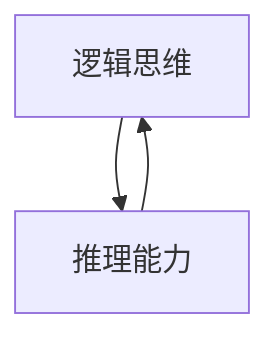

**核心算法原理讲解：**

思维能力的提升可以通过以下核心算法原理来解释：

- **逻辑推理算法：** 儿童通过逻辑推理算法，运用逻辑规则解决简单问题。
- **模式识别算法：** 儿童通过模式识别算法，识别和区分不同的事物和情境。

**伪代码：**

```python
# 逻辑推理算法
def logical_reasoning(fact1, fact2):
    conclusion = infer_conclusion(fact1, fact2)
    return conclusion

# 模式识别算法
def pattern_recognition(data):
    pattern = identify_pattern(data)
    return pattern
```

**数学模型和数学公式讲解：**

思维能力的提升可以用以下数学模型和公式来描述：

- **逻辑推理模型：** 描述逻辑推理的效率。

  $$ Logical_{推理} = P_1 \times P_2 $$

  其中，$P_1$ 和 $P_2$ 是前提条件的概率。

- **模式识别模型：** 描述模式识别的效率。

  $$ Pattern_{识别} = \frac{Correct\_Patterns}{Total\_Patterns} $$

**举例说明：**

假设一个儿童在逻辑推理任务中，前提条件1的概率为0.6，前提条件2的概率为0.4。同时，他正确识别的模式数为5，总模式数为10。那么，他的逻辑推理效率和模式识别效率分别为：

- 逻辑推理效率：$$ Logical_{推理} = P_1 \times P_2 = 0.6 \times 0.4 = 0.24 $$

- 模式识别效率：$$ Pattern_{识别} = \frac{Correct\_Patterns}{Total\_Patterns} = \frac{5}{10} = 0.5 $$

##### 2.3 感知阶段的案例研究

感知阶段的案例研究有助于我们深入了解感知阶段的具体认知特点和发展趋势。以下是一个感知阶段的案例研究案例：

**案例背景：**

某研究团队对一组3-4岁的儿童进行了感知阶段的认知发展研究。研究包括以下任务：

1. **颜色识别任务：** 让儿童观察不同颜色的图形，并说出图形的颜色。
2. **形状识别任务：** 让儿童观察不同形状的图形，并说出图形的形状。
3. **大小识别任务：** 让儿童观察不同大小的图形，并说出图形的大小。

**实验设计：**

实验分为三个部分：

1. **初始测试：** 让儿童完成颜色、形状和大小识别任务，记录正确率。
2. **干预训练：** 通过一系列感知训练，提高儿童的感知觉能力。
3. **后续测试：** 让儿童再次完成颜色、形状和大小识别任务，记录正确率。

**数据分析：**

实验数据包括儿童在初始测试和后续测试中的正确率。数据分析发现：

1. **颜色识别能力：** 儿童在后续测试中的颜色识别正确率显著提高。
2. **形状识别能力：** 儿童在后续测试中的形状识别正确率显著提高。
3. **大小识别能力：** 儿童在后续测试中的大小识别正确率有所提高，但提高幅度不如颜色和形状识别显著。

**结论：**

感知阶段的案例研究显示，通过干预训练，儿童的感知觉能力得到了显著提升。这表明，适当的训练和指导有助于加速儿童感知能力的发展。

**感知阶段的发展趋势：**

感知阶段的发展趋势包括以下几个方面：

1. **感知觉能力提升：** 儿童在出生后的头几年内，感知觉能力逐渐提升，对颜色、形状、大小等特征的识别能力逐步提高。
2. **注意力集中：** 儿童在感知任务中逐渐学会集中注意力，提高任务的完成质量。
3. **记忆增强：** 儿童在感知任务中的记忆能力逐步提高，能够更好地记住观察到的信息。
4. **思维能力发展：** 儿童在感知任务中逐渐学会运用逻辑和推理解决问题，思维能力逐步提升。

**Mermaid 流程图：**

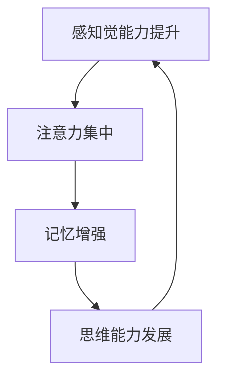

感知阶段的发展趋势表明，儿童在感知、注意力、记忆和思维能力方面具有显著的发展潜力。适当的训练和指导有助于加速儿童认知能力的发展。

### 第三部分：认知发展的三个阶段

#### 第3章：符号阶段的认知发展

##### 3.1 符号的基本概念

符号阶段的认知发展是指儿童从感知阶段过渡到符号阶段，开始运用符号（如语言、符号系统）进行思维和交流的过程。符号是指用于表示事物、概念或意义的标记，可以是文字、图像、声音或其他形式。在符号阶段，儿童逐渐学会将具体的感知经验转化为抽象的符号表示，并通过符号进行思考、表达和交流。

**核心概念与联系：**

- **符号：** 用于表示事物、概念或意义的标记。
- **语言：** 一种特殊的符号系统，用于交流思想和情感。
- **符号系统：** 由一系列符号和规则组成的系统，用于组织和管理信息。

**Mermaid 流程图：**

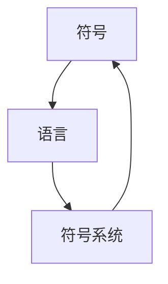

**核心算法原理讲解：**

符号阶段的认知发展涉及以下核心算法原理：

- **符号化过程：** 儿童通过符号化过程，将具体的感知经验转化为抽象的符号表示。
- **语言理解与生成：** 儿童通过语言理解与生成算法，理解和使用语言进行沟通。

**伪代码：**

```python
# 符号化过程
def symbolization(experience):
    symbol = convert_to_symbol(experience)
    return symbol

# 语言理解与生成
def language_understanding(symbol):
    meaning = interpret_symbol(symbol)
    return meaning

def language_generation(meaning):
    symbol = generate_symbol(meaning)
    return symbol
```

**数学模型和数学公式讲解：**

符号阶段的认知发展可以用以下数学模型和公式来描述：

- **符号化模型：** 描述儿童将感知经验转化为符号表示的过程。

  $$ Symbolization = f(Perception, Symbol_System) $$

  其中，$Perception$ 是感知经验，$Symbol_System$ 是符号系统，$f$ 是转化函数。

- **语言理解模型：** 描述儿童理解语言的过程。

  $$ Understanding = f(Language, Context) $$

  其中，$Language$ 是语言，$Context$ 是语境，$f$ 是理解函数。

- **语言生成模型：** 描述儿童生成语言的过程。

  $$ Generation = f(Thought, Language_System) $$

  其中，$Thought$ 是思考内容，$Language_System$ 是语言系统，$f$ 是生成函数。

**举例说明：**

假设一个儿童在观察一只猫后，想要表达他的观察经验。通过符号化过程，他将猫的感知经验转化为符号“猫”。在语言理解与生成过程中，他理解到“猫”这个符号代表一只具体的动物，然后生成语言句子“我看到一只猫”。

##### 3.2 符号阶段的认知特点

符号阶段的认知特点主要体现在儿童开始运用符号进行思维、交流和解决问题的能力。以下是对这些特点的详细分析：

**1. 语言理解能力**

语言理解能力是指儿童理解和使用语言的能力。在符号阶段，儿童逐渐学会理解日常用语和简单的句子结构。例如，他们能够理解父母的话语，并作出相应的反应。随着语言理解能力的提升，儿童在学习和生活中能够更有效地理解和沟通。

**核心概念与联系：**

- **词汇量：** 儿童理解的语言词汇量。
- **语法规则：** 儿童掌握的语言语法规则。

**Mermaid 流程图：**

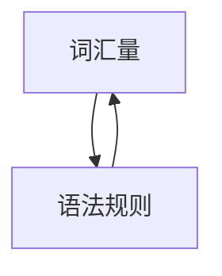

**核心算法原理讲解：**

语言理解能力的提升可以通过以下核心算法原理来解释：

- **词汇积累算法：** 儿童通过不断接触和积累词汇，扩大词汇量。
- **语法理解算法：** 儿童通过理解语言语法规则，掌握句子结构和语用意义。

**伪代码：**

```python
# 词汇积累算法
def vocabulary_acquisition():
    vocabulary = acquire_vocabulary()
    return vocabulary

# 语法理解算法
def grammar_understanding(grammar_rules):
    understood_grammar = comprehend_grammar(grammar_rules)
    return understood_grammar
```

**数学模型和数学公式讲解：**

语言理解能力的提升可以用以下数学模型和公式来描述：

- **词汇量增长模型：** 描述儿童词汇量随时间增长的过程。

  $$ Vocabulary = f(Time, Learning_Rate) $$

  其中，$Time$ 是时间，$Learning_Rate$ 是学习速率。

- **语法理解模型：** 描述儿童掌握语法规则的过程。

  $$ Grammar_Understanding = f(Exposure, Practice) $$

  其中，$Exposure$ 是语言暴露，$Practice$ 是语言实践。

**举例说明：**

假设一个儿童在1年内，每天学习10个新词汇，学习速率为0.1。同时，他每天进行1小时的语法练习。那么，他的词汇量和语法理解能力分别为：

- 词汇量：$$ Vocabulary = f(1 \text{ year}, 0.1 \text{ learning rate}) = 365 \times 10 \times 0.1 = 36.5 $$

- 语法理解能力：$$ Grammar_Understanding = f(365 \text{ hours of exposure}, 1 \text{ hour of practice}) = 365 \times 1 = 365 $$

**2. 语言生成能力**

语言生成能力是指儿童运用语言表达自己的思想、情感和需求的能力。在符号阶段，儿童逐渐学会使用语言进行简单的交流和表达。例如，他们能够说出自己的名字、描述看到的物品、表达自己的感受。随着语言生成能力的提升，儿童在学习和生活中能够更有效地表达自己。

**核心概念与联系：**

- **表达方式：** 儿童表达思想、情感和需求的方式。
- **语言流畅性：** 儿童在交流中的语言流畅程度。

**Mermaid 流程图：**

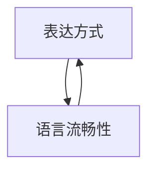

**核心算法原理讲解：**

语言生成能力的提升可以通过以下核心算法原理来解释：

- **语言生成算法：** 儿童通过语言生成算法，将思考内容转化为语言表达。
- **情境适应性：** 儿童在交流中能够根据情境调整语言表达，提高语言流畅性。

**伪代码：**

```python
# 语言生成算法
def language_generation(thought_content):
    expression = generate_expression(thought_content)
    return expression

# 情境适应性
def context_adaptation(context):
    adapted_expression = adjust_expression_for_context(expression, context)
    return adapted_expression
```

**数学模型和数学公式讲解：**

语言生成能力的提升可以用以下数学模型和公式来描述：

- **表达生成模型：** 描述儿童生成语言表达的过程。

  $$ Expression = f(Thought, Language_System) $$

  其中，$Thought$ 是思考内容，$Language_System$ 是语言系统。

- **情境适应性模型：** 描述儿童根据情境调整语言表达的过程。

  $$ Adaptation = f(Context, Expression) $$

  其中，$Context$ 是情境，$Expression$ 是语言表达。

**举例说明：**

假设一个儿童在思考自己喜欢的水果后，想要表达他的喜好。通过语言生成算法，他将思考内容转化为语言表达“我喜欢苹果”。在情境适应性过程中，他根据对话情境调整表达为“我现在想吃苹果”。

**3. 符号系统使用**

符号系统使用是指儿童运用符号系统（如文字、图像、声音等）进行信息组织和管理的技能。在符号阶段，儿童逐渐学会使用符号系统进行阅读、写作和解决问题。例如，他们能够读懂简单的文字，理解图片的含义，并通过符号系统解决问题。随着符号系统使用能力的提升，儿童在学习和生活中能够更有效地处理和利用信息。

**核心概念与联系：**

- **阅读能力：** 儿童读懂文字和符号的能力。
- **写作能力：** 儿童使用文字和符号进行表达的能力。
- **问题解决能力：** 儿童运用符号系统解决实际问题的能力。

**Mermaid 流程图：**

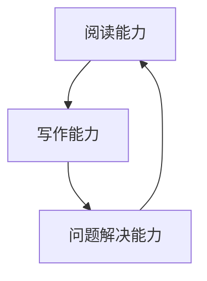

**核心算法原理讲解：**

符号系统使用能力的提升可以通过以下核心算法原理来解释：

- **符号识别算法：** 儿童通过符号识别算法，识别和理解不同的符号。
- **信息加工算法：** 儿童通过信息加工算法，对符号信息进行整合和处理。
- **问题解决算法：** 儿童通过问题解决算法，运用符号系统解决实际问题。

**伪代码：**

```python
# 符号识别算法
def symbol_recognition(symbol):
    meaning = identify_symbol_meaning(symbol)
    return meaning

# 信息加工算法
def information_processing(info):
    processed_info = process_info(info)
    return processed_info

# 问题解决算法
def problem_solving(problem):
    solution = find_solution(problem)
    return solution
```

**数学模型和数学公式讲解：**

符号系统使用能力的提升可以用以下数学模型和公式来描述：

- **符号识别模型：** 描述儿童识别和理解符号的过程。

  $$ Recognition = f(Symbol, Context) $$

  其中，$Symbol$ 是符号，$Context$ 是语境。

- **信息加工模型：** 描述儿童对符号信息进行加工和处理的过程。

  $$ Processing = f(Info, Symbol_System) $$

  其中，$Info$ 是信息，$Symbol_System$ 是符号系统。

- **问题解决模型：** 描述儿童运用符号系统解决问题的过程。

  $$ Solution = f(Problem, Symbol_System) $$

  其中，$Problem$ 是问题，$Symbol_System$ 是符号系统。

**举例说明：**

假设一个儿童在阅读一篇故事后，想要理解故事的内容。通过符号识别算法，他识别和理解故事中的文字和符号。在信息加工过程中，他将故事信息整合成一个连贯的故事理解。最后，通过问题解决算法，他回答了与故事相关的问题。

##### 3.3 符号阶段的案例研究

符号阶段的案例研究有助于我们深入了解符号阶段的具体认知特点和发展趋势。以下是一个符号阶段的案例研究案例：

**案例背景：**

某研究团队对一组4-5岁的儿童进行了符号阶段的认知发展研究。研究包括以下任务：

1. **语言理解任务：** 让儿童听懂并执行简单的指令，如“把红色的球给我”。
2. **语言生成任务：** 让儿童用自己的语言描述看到的图片。
3. **符号系统任务：** 让儿童用符号系统（如字母、数字）进行排序和组合。

**实验设计：**

实验分为三个部分：

1. **初始测试：** 让儿童完成语言理解、语言生成和符号系统任务，记录正确率。
2. **干预训练：** 通过一系列符号训练，提高儿童的符号系统使用能力。
3. **后续测试：** 让儿童再次完成语言理解、语言生成和符号系统任务，记录正确率。

**数据分析：**

实验数据包括儿童在初始测试和后续测试中的正确率。数据分析发现：

1. **语言理解能力：** 儿童在后续测试中的语言理解正确率显著提高。
2. **语言生成能力：** 儿童在后续测试中的语言生成正确率有所提高，但提高幅度不如语言理解显著。
3. **符号系统使用能力：** 儿童在后续测试中的符号系统使用正确率显著提高。

**结论：**

符号阶段的案例研究显示，通过干预训练，儿童的符号系统使用能力得到了显著提升。这表明，适当的训练和指导有助于加速儿童符号阶段认知能力的发展。

##### 3.4 符号阶段的发展趋势

符号阶段的发展趋势是指儿童在符号阶段如何逐步提高语言、符号系统和认知能力。以下是对符号阶段的发展趋势的详细分析：

**1. 语言理解能力提升**

语言理解能力的提升是符号阶段的重要发展趋势。在符号阶段，儿童逐渐学会理解复杂的句子结构和语用意义。例如，他们能够理解反义疑问句、条件句和复杂句型。随着语言理解能力的提升，儿童在学习和生活中能够更有效地理解和沟通。

**核心概念与联系：**

- **句子结构：** 儿童理解的语言句子结构。
- **语用意义：** 儿童理解的语言语用意义。

**Mermaid 流程图：**

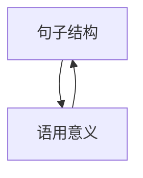

**核心算法原理讲解：**

语言理解能力的提升可以通过以下核心算法原理来解释：

- **语法理解算法：** 儿童通过语法理解算法，掌握复杂的句子结构。
- **语用推理算法：** 儿童通过语用推理算法，理解语言语用意义。

**伪代码：**

```python
# 语法理解算法
def grammar_understanding(grammar_rules):
    understood_grammar = comprehend_grammar(grammar_rules)
    return understood_grammar

# 语用推理算法
def pragmatic_reasoning(context):
    pragmatic_meaning = infer_pragmatic_meaning(context)
    return pragmatic_meaning
```

**数学模型和数学公式讲解：**

语言理解能力的提升可以用以下数学模型和公式来描述：

- **语法理解模型：** 描述儿童掌握语法规则的过程

