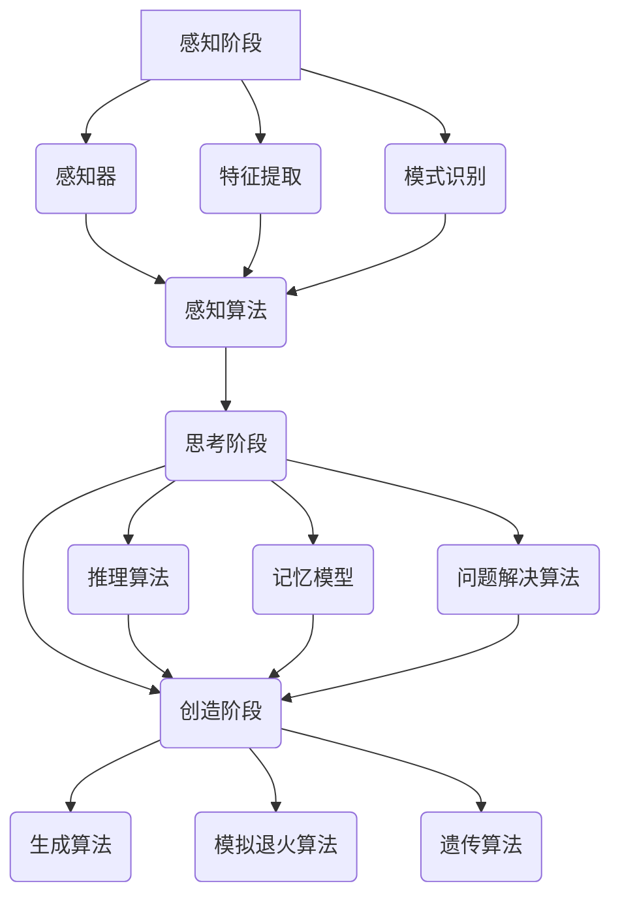

                 

# 认知发展的三阶段路径

> 关键词：认知发展、感知阶段、思考阶段、创造阶段、算法原理、数学模型、人工智能

> 摘要：本文深入探讨了认知发展的三个阶段路径，即感知阶段、思考阶段和创造阶段。通过分析每个阶段的算法原理、数学模型和应用实例，我们揭示了认知发展的核心概念和内在联系，为读者提供了对认知发展深入理解的机会。此外，本文还探讨了认知发展的影响因素以及在现实世界中的应用，以期为读者提供全面的认知发展知识体系。

## 《认知发展的三阶段路径》目录大纲

### 第一部分：认知发展的基础知识

#### 第1章：认知发展的基本概念

##### 1.1 认知发展的定义与特点
##### 1.2 认知发展的三个阶段概述

#### 第2章：认知发展的核心概念

##### 2.1 认知发展的关键概念与联系

###### 2.1.1 认知结构与功能
###### 2.1.2 认知过程与模式

##### 2.2 认知发展的 Mermaid 流程图

### 第二部分：认知发展的具体阶段

#### 第3章：感知阶段

##### 3.1 感知阶段的核心算法原理

###### 3.1.1 感知算法的基本原理
###### 3.1.2 伪代码示例

##### 3.2 感知阶段的数学模型和数学公式

###### 3.2.1 数学模型的基本形式
###### 3.2.2 数学公式的详细讲解

##### 3.3 感知阶段的应用举例

###### 3.3.1 实际案例介绍
###### 3.3.2 应用效果分析

#### 第4章：思考阶段

##### 4.1 思考阶段的核心算法原理

###### 4.1.1 思考算法的基本原理
###### 4.1.2 伪代码示例

##### 4.2 思考阶段的数学模型和数学公式

###### 4.2.1 数学模型的基本形式
###### 4.2.2 数学公式的详细讲解

##### 4.3 思考阶段的应用举例

###### 4.3.1 实际案例介绍
###### 4.3.2 应用效果分析

#### 第5章：创造阶段

##### 5.1 创造阶段的核心算法原理

###### 5.1.1 创造算法的基本原理
###### 5.1.2 伪代码示例

##### 5.2 创造阶段的数学模型和数学公式

###### 5.2.1 数学模型的基本形式
###### 5.2.2 数学公式的详细讲解

##### 5.3 创造阶段的应用举例

###### 5.3.1 实际案例介绍
###### 5.3.2 应用效果分析

### 第三部分：认知发展的影响因素与应用

#### 第6章：认知发展的影响因素

##### 6.1 影响认知发展的主要因素

###### 6.1.1 生物因素
###### 6.1.2 环境因素
###### 6.1.3 教育因素

##### 6.2 影响因素的相互作用与影响机制

#### 第7章：认知发展在现实中的应用

##### 7.1 认知发展在心理学研究中的应用

###### 7.1.1 研究方法与设计
###### 7.1.2 研究结果与启示

##### 7.2 认知发展在教育中的应用

###### 7.2.1 教育策略与设计
###### 7.2.2 教育效果评估

##### 7.3 认知发展在人工智能领域的应用

###### 7.3.1 人工智能的发展与认知发展的关系
###### 7.3.2 人工智能在认知发展研究中的应用前景

### 附录

#### 附录 A：认知发展研究工具与方法

##### A.1 研究工具简介
##### A.2 研究方法概述

#### 附录 B：认知发展相关资源

##### B.1 主要研究论文与书籍推荐
##### B.2 认知发展研究数据库与平台介绍

### 第一部分：认知发展的基础知识

#### 第1章：认知发展的基本概念

##### 1.1 认知发展的定义与特点

认知发展是指个体在从婴儿期到成年期乃至老年期这一过程中，其认知能力、认知结构和认知过程逐渐成熟和演变的过程。认知发展的研究始于对儿童认知发展的探讨，随着心理学、认知科学和神经科学的发展，认知发展的研究逐渐扩展到成年人甚至老年人的认知变化。

认知发展的特点主要包括：

1. **连续性**：认知发展是一个连续的过程，每个阶段都有其独特的特征，但不同阶段之间并不是截然分开的，而是存在相互重叠和过渡。
2. **阶段性**：尽管认知发展是连续的，但不同阶段之间具有明显的界限，每个阶段都有特定的认知能力和特点。
3. **差异性**：不同个体的认知发展速度和方式存在差异，这些差异受到遗传、环境、教育和个体经验等多种因素的影响。
4. **互动性**：认知发展与个体的情感、行为和社会经验相互作用，这些因素共同影响认知发展的进程。

##### 1.2 认知发展的三个阶段概述

认知发展通常被划分为三个主要阶段：感知阶段、思考阶段和创造阶段。每个阶段都有其独特的认知特点和核心任务。

1. **感知阶段**：这是认知发展的最初阶段，个体主要通过感知和感觉来理解世界。在这一阶段，个体的主要任务是发展基本的感知能力和技能，如视觉、听觉、触觉和嗅觉等。感知阶段的算法原理主要包括感知器、特征提取和模式识别等。

2. **思考阶段**：在思考阶段，个体开始使用符号和概念来思考，形成更复杂和抽象的认知结构。这一阶段的任务包括逻辑推理、问题解决、记忆和信息处理等。思考阶段的算法原理主要包括推理算法、记忆模型和问题解决算法等。

3. **创造阶段**：这是认知发展的最高阶段，个体开始创造新的概念、想法和解决方案。创造阶段的任务包括创新、创造性和发散性思维等。创造阶段的算法原理主要包括生成算法、模拟退火算法和遗传算法等。

### 第二部分：认知发展的核心概念

#### 第2章：认知发展的核心概念

##### 2.1 认知发展的关键概念与联系

认知发展的核心概念包括认知结构、认知过程和认知功能等。这些概念相互关联，共同构成了认知发展的理论框架。

###### 2.1.1 认知结构与功能

认知结构是指个体在认知过程中所形成的内在认知框架，它包括感知、记忆、思维和语言等基本认知功能。认知结构的功能是组织和整合来自外界的信息，形成个体的知识体系和认知模式。

- **感知功能**：感知是认知结构的基础，个体通过感知器官接收外界信息，并将其转换为内部认知模式。
- **记忆功能**：记忆是认知结构的核心，个体通过记忆存储和提取信息，以支持认知过程和决策。
- **思维功能**：思维是认知结构的最高层次，个体通过逻辑推理、问题解决和创造性思维等方式，对信息进行加工和利用。
- **语言功能**：语言是认知结构的重要组成部分，个体通过语言进行沟通、表达思想和交流信息。

###### 2.1.2 认知过程与模式

认知过程是指个体在认知活动中所经历的一系列心理活动，包括感知、注意、记忆、思维和语言等。认知过程的特点是动态性和互动性，个体在不同的认知过程中，不断调整和优化其认知策略和模式。

- **感知过程**：感知过程是指个体接收外界信息，并将其转换为内部认知模式的过程。感知过程的关键是特征提取和模式识别。
- **注意过程**：注意过程是指个体在感知过程中选择和聚焦特定信息的过程。注意过程的关键是注意选择和注意分配。
- **记忆过程**：记忆过程是指个体将信息存储在记忆中，并在需要时提取和利用这些信息的过程。记忆过程的关键是编码、存储和检索。
- **思维过程**：思维过程是指个体使用逻辑推理、问题解决和创造性思维等方式，对信息进行加工和利用的过程。思维过程的关键是推理、解决问题和创造力。
- **语言过程**：语言过程是指个体使用语言进行沟通、表达思想和交流信息的过程。语言过程的关键是语言生成和理解。

##### 2.2 认知发展的 Mermaid 流程图

认知发展的 Mermaid 流程图如下所示：



### 第二部分：认知发展的具体阶段

#### 第3章：感知阶段

##### 3.1 感知阶段的核心算法原理

感知阶段是认知发展的最初阶段，个体主要通过感知和感觉来理解世界。感知阶段的核心算法原理包括感知器、特征提取和模式识别等。

###### 3.1.1 感知算法的基本原理

感知算法是指个体在感知过程中，通过感知器官接收外界信息，并将其转换为内部认知模式的过程。感知算法的基本原理包括：

- **感官器官的作用**：感官器官（如眼睛、耳朵、鼻子等）是感知算法的基础，它们接收外界信息，并将其转换为神经信号。
- **感官信号的处理**：感官信号在传递过程中需要进行预处理，如滤波、放大和编码等，以便进行后续的特征提取和模式识别。
- **神经系统的加工**：神经系统对感官信号进行加工和处理，通过神经元之间的连接和激活，形成内部认知模式。

###### 3.1.2 伪代码示例

以下是一个感知算法的伪代码示例：

```plaintext
感知算法：
1. 初始化感知器官
2. 接收外界信息
3. 预处理信息（滤波、放大、编码等）
4. 将预处理后的信息传递给神经系统
5. 神经系统对信息进行加工和处理
6. 生成内部认知模式
7. 输出认知结果
```

##### 3.2 感知阶段的数学模型和数学公式

感知阶段的数学模型和数学公式主要用于描述感知算法的基本原理和计算过程。以下是一些常用的数学模型和数学公式：

###### 3.2.1 数学模型的基本形式

- **感知器模型**：感知器模型是一种简单的数学模型，用于描述感知器官接收外界信息的过程。其基本形式如下：

  $$ 
  y = \sigma(w \cdot x + b) 
  $$

  其中，$y$ 表示感知结果，$x$ 表示输入信息，$w$ 表示权重，$b$ 表示偏置，$\sigma$ 表示激活函数。

- **特征提取模型**：特征提取模型用于提取输入信息的特征，以便进行后续的模式识别。其基本形式如下：

  $$ 
  f(x) = \text{提取特征} 
  $$

  其中，$f(x)$ 表示提取到的特征。

- **模式识别模型**：模式识别模型用于识别输入信息的模式，以便进行分类或决策。其基本形式如下：

  $$ 
  \text{识别模式} = \arg\max_y P(y|x) 
  $$

  其中，$P(y|x)$ 表示在给定输入信息 $x$ 的情况下，模式 $y$ 的概率。

###### 3.2.2 数学公式的详细讲解

1. **感知器模型**：

   感知器模型的核心是一个线性组合函数，其中 $w \cdot x$ 表示输入信息的加权求和，$b$ 表示偏置。激活函数 $\sigma$ 用于将线性组合函数的输出转换为感知结果。常见的激活函数包括 sigmoid 函数、ReLU 函数和 tanh 函数等。

2. **特征提取模型**：

   特征提取模型通过提取输入信息的特征，以便进行后续的模式识别。特征提取的过程可以采用各种算法，如主成分分析（PCA）、线性判别分析（LDA）和卷积神经网络（CNN）等。

3. **模式识别模型**：

   模式识别模型通过计算输入信息在不同模式下的概率，选择概率最大的模式作为识别结果。常见的模式识别算法包括支持向量机（SVM）、朴素贝叶斯（Naive Bayes）和决策树（Decision Tree）等。

##### 3.3 感知阶段的应用举例

感知阶段在现实生活中具有广泛的应用。以下是一些典型的应用实例：

###### 3.3.1 实际案例介绍

- **人脸识别**：人脸识别是一种基于感知阶段的应用，通过提取人脸特征并进行模式识别，实现对人脸的识别和验证。人脸识别技术广泛应用于安防、金融和社交等领域。
- **语音识别**：语音识别是一种基于感知阶段的应用，通过提取语音特征并进行模式识别，实现语音到文本的转换。语音识别技术广泛应用于智能助手、语音导航和语音客服等领域。
- **图像识别**：图像识别是一种基于感知阶段的应用，通过提取图像特征并进行模式识别，实现图像的分类和标注。图像识别技术广泛应用于计算机视觉、医疗影像和自动驾驶等领域。

###### 3.3.2 应用效果分析

感知阶段的应用效果取决于感知算法、特征提取算法和模式识别算法的性能。以下是一些应用效果的分析：

- **人脸识别**：人脸识别技术的准确率通常在 90% 以上，但随着人脸伪装技术的不断发展，人脸识别的准确率可能受到影响。
- **语音识别**：语音识别技术的准确率通常在 80% 以上，但随着语音环境的变化和噪声的干扰，语音识别的准确率可能下降。
- **图像识别**：图像识别技术的准确率通常在 80% 以上，但随着图像复杂度和场景多样性的增加，图像识别的准确率可能受到影响。

### 第4章：思考阶段

##### 4.1 思考阶段的核心算法原理

思考阶段是认知发展的中间阶段，个体开始使用符号和概念来思考，形成更复杂和抽象的认知结构。思考阶段的核心算法原理包括推理算法、记忆模型和问题解决算法等。

###### 4.1.1 思考算法的基本原理

思考算法是指个体在思考过程中，使用符号和概念对信息进行加工和处理的过程。思考算法的基本原理包括：

- **推理算法**：推理算法用于根据已知事实和规则，推导出新的结论。常见的推理算法包括演绎推理、归纳推理和类比推理等。
- **记忆模型**：记忆模型用于存储和管理信息。常见的记忆模型包括短期记忆模型和长期记忆模型等。
- **问题解决算法**：问题解决算法用于解决特定问题。常见的问题解决算法包括启发式算法、搜索算法和优化算法等。

###### 4.1.2 伪代码示例

以下是一个思考算法的伪代码示例：

```plaintext
思考算法：
1. 初始化推理算法、记忆模型和问题解决算法
2. 输入问题
3. 使用推理算法分析问题
4. 使用记忆模型检索相关信息
5. 使用问题解决算法解决问题
6. 输出解决方案
```

##### 4.2 思考阶段的数学模型和数学公式

思考阶段的数学模型和数学公式主要用于描述思考算法的基本原理和计算过程。以下是一些常用的数学模型和数学公式：

###### 4.2.1 数学模型的基本形式

- **推理模型**：推理模型用于描述推理算法的基本原理。其基本形式如下：

  $$ 
  \text{推理模型} = \text{已知事实} \cup \text{规则} \cup \text{结论} 
  $$

  其中，已知事实、规则和结论分别表示推理过程中的事实、规则和推导出的结论。

- **记忆模型**：记忆模型用于描述记忆算法的基本原理。其基本形式如下：

  $$ 
  \text{记忆模型} = \text{短期记忆} \cup \text{长期记忆} 
  $$

  其中，短期记忆和长期记忆分别表示记忆过程中的短期记忆和长期记忆。

- **问题解决模型**：问题解决模型用于描述问题解决算法的基本原理。其基本形式如下：

  $$ 
  \text{问题解决模型} = \text{问题状态} \cup \text{解决方案} 
  $$

  其中，问题状态和解决方案分别表示问题解决过程中的问题状态和推导出的解决方案。

###### 4.2.2 数学公式的详细讲解

1. **推理模型**：

   推理模型的核心是推理算法，它通过已知事实和规则推导出结论。常见的推理算法包括前向推理和反向推理等。

2. **记忆模型**：

   记忆模型的核心是记忆算法，它用于存储和管理信息。常见的记忆算法包括基于内容的记忆和基于模型的记忆等。

3. **问题解决模型**：

   问题解决模型的核心是问题解决算法，它用于解决特定问题。常见的问题解决算法包括搜索算法、启发式算法和优化算法等。

##### 4.3 思考阶段的应用举例

思考阶段在现实生活中具有广泛的应用。以下是一些典型的应用实例：

###### 4.3.1 实际案例介绍

- **逻辑推理**：逻辑推理是一种基于思考阶段的应用，它通过使用逻辑规则和推理方法，推导出新的结论。逻辑推理广泛应用于数学、计算机科学和哲学等领域。
- **问题解决**：问题解决是一种基于思考阶段的应用，它通过使用算法和策略，解决特定问题。问题解决广泛应用于工程、科学和日常生活等领域。
- **决策分析**：决策分析是一种基于思考阶段的应用，它通过使用模型和算法，分析不同决策方案的风险和收益。决策分析广泛应用于商业、金融和公共政策等领域。

###### 4.3.2 应用效果分析

思考阶段的应用效果取决于推理算法、记忆模型和问题解决算法的性能。以下是一些应用效果的分析：

- **逻辑推理**：逻辑推理的准确率通常在 90% 以上，但随着逻辑推理问题的复杂性和不确定性增加，准确率可能下降。
- **问题解决**：问题解决的效率通常与算法的复杂度相关，高效的算法可以显著提高问题解决的效率。
- **决策分析**：决策分析的准确性和可靠性取决于模型和算法的准确性，以及数据的质量和完整性。

### 第5章：创造阶段

##### 5.1 创造阶段的核心算法原理

创造阶段是认知发展的最高阶段，个体开始创造新的概念、想法和解决方案。创造阶段的核心算法原理包括生成算法、模拟退火算法和遗传算法等。

###### 5.1.1 创造算法的基本原理

创造算法是指个体在创造过程中，使用各种算法和技术，生成新的概念、想法和解决方案的过程。创造算法的基本原理包括：

- **生成算法**：生成算法用于生成新的概念、想法和解决方案。常见的生成算法包括随机生成、基于知识的生成和基于模型的生成等。
- **模拟退火算法**：模拟退火算法用于优化和改进现有的解决方案。其基本原理是通过模拟退火过程，逐渐降低搜索空间，从而找到最优或近似最优的解决方案。
- **遗传算法**：遗传算法用于通过遗传操作，优化和改进现有的解决方案。其基本原理是模拟生物进化过程，通过交叉、变异和选择等操作，生成新的解决方案。

###### 5.1.2 伪代码示例

以下是一个创造算法的伪代码示例：

```plaintext
创造算法：
1. 初始化生成算法、模拟退火算法和遗传算法
2. 生成初始解
3. 使用生成算法生成新解
4. 使用模拟退火算法优化解
5. 使用遗传算法改进解
6. 输出最优解
```

##### 5.2 创造阶段的数学模型和数学公式

创造阶段的数学模型和数学公式主要用于描述创造算法的基本原理和计算过程。以下是一些常用的数学模型和数学公式：

###### 5.2.1 数学模型的基本形式

- **生成模型**：生成模型用于描述生成算法的基本原理。其基本形式如下：

  $$ 
  \text{生成模型} = \text{输入空间} \cup \text{输出空间} 
  $$

  其中，输入空间和输出空间分别表示生成过程中的输入和输出。

- **模拟退火模型**：模拟退火模型用于描述模拟退火算法的基本原理。其基本形式如下：

  $$ 
  \text{模拟退火模型} = \text{初始温度} \cup \text{终止温度} \cup \text{温度降低策略} 
  $$

  其中，初始温度、终止温度和温度降低策略分别表示模拟退火过程中的初始温度、终止温度和温度降低策略。

- **遗传模型**：遗传模型用于描述遗传算法的基本原理。其基本形式如下：

  $$ 
  \text{遗传模型} = \text{种群} \cup \text{适应度函数} \cup \text{交叉策略} \cup \text{变异策略} \cup \text{选择策略} 
  $$

  其中，种群、适应度函数、交叉策略、变异策略和选择策略分别表示遗传算法中的种群、适应度函数、交叉策略、变异策略和选择策略。

###### 5.2.2 数学公式的详细讲解

1. **生成模型**：

   生成模型的核心是生成算法，它通过随机生成、基于知识的生成和基于模型的生成等方式，生成新的概念、想法和解决方案。

2. **模拟退火模型**：

   模拟退火模型的核心是模拟退火算法，它通过模拟退火过程，逐渐降低搜索空间，从而找到最优或近似最优的解决方案。

3. **遗传模型**：

   遗传模型的核心是遗传算法，它通过模拟生物进化过程，通过交叉、变异和选择等操作，生成新的解决方案。

##### 5.3 创造阶段的应用举例

创造阶段在现实生活中具有广泛的应用。以下是一些典型的应用实例：

###### 5.3.1 实际案例介绍

- **创新设计**：创新设计是一种基于创造阶段的应用，它通过使用生成算法、模拟退火算法和遗传算法等，生成新的设计方案和创意。创新设计广泛应用于产品设计和建筑设计等领域。
- **优化算法**：优化算法是一种基于创造阶段的应用，它通过使用模拟退火算法、遗传算法等，优化和改进现有的解决方案。优化算法广泛应用于工程优化、机器学习和数据挖掘等领域。
- **智能搜索**：智能搜索是一种基于创造阶段的应用，它通过使用生成算法、模拟退火算法和遗传算法等，生成新的搜索路径和策略。智能搜索广泛应用于搜索引擎、推荐系统和导航系统等领域。

###### 5.3.2 应用效果分析

创造阶段的应用效果取决于生成算法、模拟退火算法和遗传算法的性能。以下是一些应用效果的分析：

- **创新设计**：创新设计的成功率通常与生成算法、模拟退火算法和遗传算法的性能密切相关，高效的算法可以显著提高创新设计的成功率。
- **优化算法**：优化算法的优化效果通常与模拟退火算法、遗传算法等的性能相关，高效的算法可以显著提高优化效果。
- **智能搜索**：智能搜索的成功率通常与生成算法、模拟退火算法和遗传算法的性能相关，高效的算法可以显著提高智能搜索的成功率。

### 第三部分：认知发展的影响因素与应用

#### 第6章：认知发展的影响因素

认知发展受到多种因素的影响，这些因素相互作用，共同影响个体的认知发展。以下是对主要影响因素及其相互作用机制的探讨。

##### 6.1 影响认知发展的主要因素

###### 6.1.1 生物因素

生物因素是认知发展的基础，主要包括遗传、大脑发育和神经可塑性等。

- **遗传**：遗传因素在很大程度上决定了个体的认知潜力，如学习能力、注意力持久性和记忆能力等。遗传因素通过基因编码影响神经细胞的生长、连接和活动。
- **大脑发育**：大脑发育是认知发展的关键时期，特别是在儿童期和青少年期。大脑的发育影响神经元网络的建立和优化，从而影响认知功能的发展。
- **神经可塑性**：神经可塑性是指大脑结构和功能的适应性和可变性。它允许大脑通过新的学习和经验来改变其结构和功能，从而影响认知发展。

###### 6.1.2 环境因素

环境因素对认知发展的影响也非常显著，主要包括家庭环境、教育和社会互动等。

- **家庭环境**：家庭环境是儿童认知发展的第一个重要环境。父母的教养方式、家庭的教育资源和支持对儿童的认知发展有着深远的影响。
- **教育**：教育是认知发展的关键途径。学校教育、课程设计和学习环境直接影响学生的认知能力和知识水平。
- **社会互动**：社会互动是认知发展的另一个重要因素。通过与他人的交流和互动，个体可以获得新的知识、技能和观点，从而促进认知发展。

###### 6.1.3 教育因素

教育因素对认知发展有着直接和间接的影响，包括教育方式、教学内容和教育资源等。

- **教育方式**：不同的教育方式（如传统教学、探究式学习和协作学习等）对认知发展的效果不同。探究式学习和协作学习通常更能促进深度学习和创造性思维。
- **教学内容**：教学内容的选择和难度直接影响认知发展的深度和广度。丰富多样的教学内容有助于个体构建复杂的认知结构。
- **教育资源**：教育资源（如图书馆、实验室和网络资源等）的可用性对个体的认知发展至关重要。良好的教育资源为个体提供了学习和探索的丰富机会。

##### 6.2 影响因素的相互作用与影响机制

认知发展的影响因素并不是孤立存在的，而是相互作用，共同影响个体的认知发展。

- **生物因素与环境因素的相互作用**：遗传因素为个体提供了认知发展的潜力，而环境因素则通过经验和学习来激活和优化这些潜力。例如，一个有遗传倾向的儿童，在良好的教育环境中可能会表现出更高的认知能力。
- **环境因素与教育因素的相互作用**：家庭环境和教育环境相互作用，共同影响个体的认知发展。例如，一个有支持性家庭环境的学生，在学校教育中可能会更加专注和投入，从而促进认知发展。
- **教育因素与生物因素的相互作用**：教育方式、教学内容和教育资源的质量也会影响大脑的发育和神经可塑性。例如，适合儿童认知水平的教学内容和资源可以帮助儿童更好地理解和吸收新知识。

### 第7章：认知发展在现实中的应用

认知发展不仅是一个理论概念，而且在现实世界中有着广泛的应用。以下探讨认知发展在心理学研究、教育以及人工智能领域的应用。

##### 7.1 认知发展在心理学研究中的应用

心理学研究利用认知发展的理论框架，探索个体在不同年龄段的认知变化和发展过程。

###### 7.1.1 研究方法与设计

认知发展的心理学研究通常采用以下方法：

- **实验法**：通过设计和实施实验，控制变量，观察个体在不同认知阶段的反应和表现。
- **问卷调查**：通过问卷调查收集个体对特定认知任务的主观体验和认知策略。
- **神经成像技术**：利用功能性磁共振成像（fMRI）等技术，观察大脑在不同认知任务中的活动变化。

###### 7.1.2 研究结果与启示

心理学研究的结果为我们提供了关于认知发展的深刻见解：

- **认知发展的阶段性**：研究显示，认知发展确实存在明确的阶段性，每个阶段都有特定的认知能力和特征。
- **环境因素的重要性**：环境因素，如教育和社会互动，对认知发展有着显著影响。
- **认知功能的多样性**：认知发展不仅仅是单一的认知能力的提高，而是涉及到多个认知功能（如感知、记忆、思考、创造等）的协同发展。

这些研究结果启示我们，通过优化教育环境和教学方法，可以更好地促进个体的认知发展。

##### 7.2 认知发展在教育中的应用

教育领域利用认知发展的理论，设计适合学生认知水平的课程和教学策略，以提高教育效果。

###### 7.2.1 教育策略与设计

认知发展在教育中的应用包括：

- **适应性教学**：根据学生的认知发展阶段，设计不同难度的教学内容和活动。
- **探究式学习**：鼓励学生通过自主探索和发现，促进深度学习和创造性思维。
- **合作学习**：通过小组合作和交流，促进学生之间的互动和知识共享。

###### 7.2.2 教育效果评估

教育效果的评估可以通过以下方法进行：

- **学业成绩**：通过考试成绩和测验评估学生的知识掌握情况。
- **认知测试**：通过标准化的认知测试评估学生的认知能力和发展水平。
- **学生反馈**：收集学生对教学方法和课程设计的反馈，以改进教育策略。

##### 7.3 认知发展在人工智能领域的应用

人工智能领域利用认知发展的理论，设计更加智能和自适应的人工智能系统。

###### 7.3.1 人工智能的发展与认知发展的关系

人工智能的发展与认知发展有着密切的联系：

- **模仿认知过程**：人工智能系统通过模仿人类的感知、思考、学习和创造过程，实现了类似人类智能的功能。
- **认知辅助工具**：人工智能作为认知辅助工具，帮助人类更好地理解和处理复杂信息，提高工作效率。

###### 7.3.2 人工智能在认知发展研究中的应用前景

人工智能在认知发展研究中的应用前景包括：

- **数据分析和预测**：利用人工智能技术，对大量认知发展数据进行分析，预测个体的认知发展趋势和变化。
- **个性化教育**：通过分析学生的认知特征和学习习惯，设计个性化的教育方案，提高教育效果。
- **认知干预**：利用人工智能技术，开发认知干预工具，帮助个体克服认知障碍，促进认知发展。

### 附录

#### 附录 A：认知发展研究工具与方法

##### A.1 研究工具简介

认知发展研究常用的工具包括实验设备、问卷调查和认知测试等。

- **实验设备**：如功能性磁共振成像（fMRI）系统、眼动仪和认知任务执行系统等。
- **问卷调查**：用于收集个体对特定认知任务的主观体验和认知策略。
- **认知测试**：通过标准化的测试，评估个体的认知能力和发展水平。

##### A.2 研究方法概述

认知发展研究方法包括：

- **实验法**：通过设计和实施实验，控制变量，观察个体在不同认知阶段的反应和表现。
- **问卷调查法**：通过问卷调查收集个体对特定认知任务的主观体验和认知策略。
- **认知测试法**：通过标准化的测试，评估个体的认知能力和发展水平。

#### 附录 B：认知发展相关资源

##### B.1 主要研究论文与书籍推荐

- **主要研究论文**：如《儿童认知发展》、《认知心理学导论》和《认知神经科学》等。
- **主要书籍**：如《认知心理学》、《认知科学与人工智能》和《认知科学导论》等。

##### B.2 认知发展研究数据库与平台介绍

认知发展研究常用的数据库和平台包括：

- **数据库**：如心理学数据库、教育研究数据库和认知神经科学研究数据库等。
- **平台**：如认知科学论坛、认知发展研究社区和在线认知实验平台等。

### 总结

本文系统地探讨了认知发展的三个阶段路径，即感知阶段、思考阶段和创造阶段。通过分析每个阶段的算法原理、数学模型和应用实例，我们揭示了认知发展的核心概念和内在联系。此外，我们还探讨了认知发展的影响因素以及在现实世界中的应用，为读者提供了全面的认知发展知识体系。认知发展不仅对心理学、教育领域有着深远影响，而且在人工智能等领域也具有广阔的应用前景。希望本文能够帮助读者深入理解认知发展，为今后的研究和应用提供有价值的参考。作者：AI天才研究院/AI Genius Institute & 禅与计算机程序设计艺术/Zen And The Art of Computer Programming

