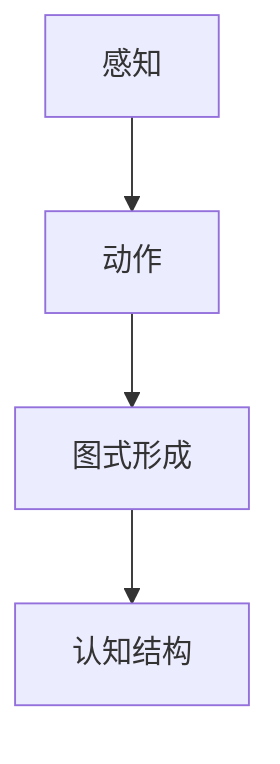
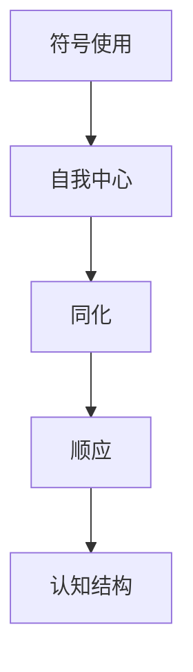
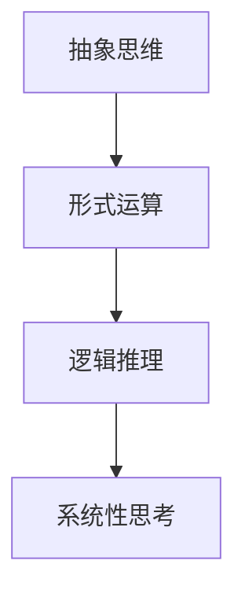
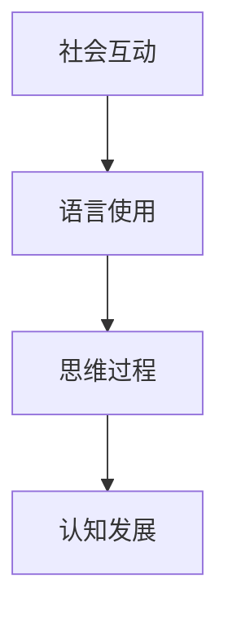
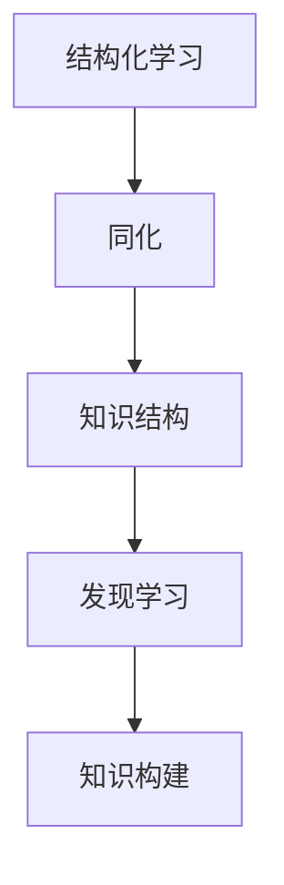
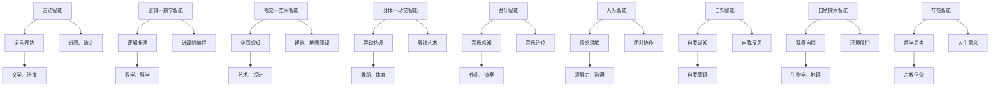
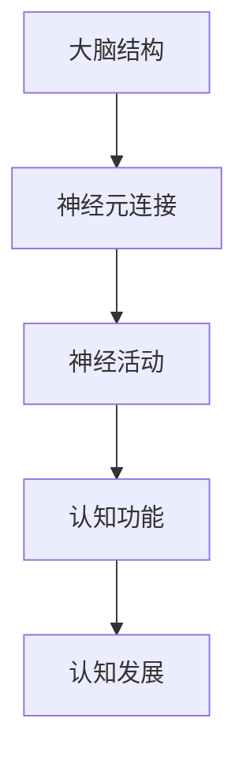
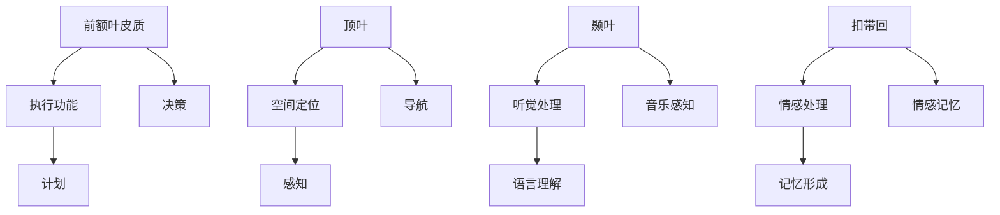

                 

### 认知发展的基本概念与历史

认知发展是指个体在心理过程中，通过感知、记忆、思考、理解等心智活动，不断提高对自身与外部世界的认知能力的过程。认知发展理论是对这一过程的系统研究，旨在理解个体在认知方面如何从简单到复杂、从低级到高级的逐步转变。

认知发展理论的起源可以追溯到古希腊哲学家亚里士多德，他首次提出了关于认知过程的系统性理论。但现代认知发展理论的奠基人物，当属瑞士心理学家让·皮亚杰（Jean Piaget）。他在20世纪初通过大量实验研究，提出了认知发展的四个阶段理论，极大地推动了这一领域的发展。

皮亚杰的认知发展理论强调认知结构的构建过程，认为每个阶段都有其独特的思维方式和认知能力。以下是对皮亚杰理论的基本概述：

### 皮亚杰认知发展阶段理论

**1.1 皮亚杰认知发展理论概述**

皮亚杰的认知发展理论主要分为四个阶段，分别是感觉运动阶段、前运算阶段、具体运算阶段和形式运算阶段。每个阶段都标志着个体认知能力发展的一个里程碑。

**1.2 认知发展的基本要素**

皮亚杰认为，认知发展涉及到以下几个基本要素：

- **图式（Schemas）**：个体对世界的最初认识方式，是一种心理构造。
- **同化（Assimilation）**：个体将新的信息纳入已有图式的过程。
- **顺应（Accommodation）**：个体调整或重构现有图式以适应新信息的过程。
- **平衡（Equilibrium）**：个体通过同化和顺应之间的动态平衡，不断调整和优化认知结构。

**1.3 认知发展理论的历史演变**

皮亚杰的理论在提出后，受到了广泛的关注和讨论。然而，随着心理学和神经科学的不断发展，其他认知发展理论也随之产生，如维果斯基的文化历史发展理论、布鲁纳的发现学习理论等。

这些理论从不同角度补充了认知发展的研究，形成了现代认知发展理论的多元化格局。

### 皮亚杰认知发展的四个阶段

**2.1 皮亚杰认知发展理论概述**

皮亚杰的认知发展阶段理论是对儿童认知发展过程的一种系统性描述，它不仅解释了个体如何学习，也揭示了认知能力的发展路径。

**2.2 皮亚杰认知发展的四个阶段**

皮亚杰将儿童认知发展分为以下四个阶段：

#### **2.2.1 感觉运动阶段（0-2岁）**

感觉运动阶段是认知发展的起始阶段，主要特点是婴儿通过感知和动作来探索世界。这一阶段的儿童主要通过感知觉和动作协调来理解外部世界，尚未形成真正的概念。

**核心概念联系：** 在这个阶段，个体主要通过图式来描述外部世界的感知。例如，儿童通过触觉感知物体的形状和质地，并尝试通过动作来操作这些物体。

**Mermaid流程图：**


#### **2.2.2 前运算阶段（2-7岁）**

前运算阶段是认知发展的第二个阶段，儿童开始使用符号来表示事物和概念，但思维仍然以自我为中心，缺乏逻辑推理能力。

**核心概念联系：** 在这个阶段，个体开始通过同化和顺应来调整认知结构，尽管他们还没有完全理解逻辑运算和分类的概念。

**Mermaid流程图：**


#### **2.2.3 具体运算阶段（7-11岁）**

具体运算阶段是认知发展的第三个阶段，儿童开始能够进行逻辑思维和具体运算，但仍然依赖于具体情境。

**核心概念联系：** 在这个阶段，个体开始能够进行具体逻辑思维，理解分类和序列的概念，并能进行简单的数学运算。

**伪代码：**
```
function performCalculation(a, b) {
    return a + b; // 简单的加法运算
}
```

#### **2.2.4 形式运算阶段（11-16岁）**

形式运算阶段是认知发展的最后一个阶段，个体开始能够进行抽象思维和形式运算，思维具有逻辑性和系统性。

**核心概念联系：** 在这个阶段，个体能够脱离具体情境，进行抽象思考和复杂逻辑推理。

**数学模型与公式：**
$$
f(x) = x^2 + 2x + 1
$$
这是一个简单的二次函数模型，描述了物体在水平面上的运动轨迹。

**举例说明：**
假设一个物体从静止状态开始，以2米/秒²的加速度运动，求物体在3秒时的位置。

$$
x = \frac{1}{2} \times 2 \times 3^2 + 2 \times 3 + 1 = 13 \text{米}
$$

**Mermaid流程图：**


### 2.3 皮亚杰理论在教育中的应用

皮亚杰的认知发展阶段理论对教育实践有着重要的指导意义。教师应根据学生所处的认知发展阶段，选择合适的教学方法，促进学生的认知发展。

**应用实例：**

- 在感觉运动阶段，教师应通过游戏和实际操作，帮助学生建立基本的认知结构。
- 在前运算阶段，教师应鼓励学生通过符号进行表达，提高他们的逻辑思维能力。
- 在具体运算阶段，教师应提供具体的例子和问题，引导学生进行逻辑思考和数学运算。
- 在形式运算阶段，教师应引导学生进行抽象思考和复杂的逻辑推理，培养他们的批判性思维和创造性思维。

通过这样的教育实践，教师不仅能够促进学生的认知发展，还能激发他们的学习兴趣和潜能。

### 维果斯基的认知发展理论

#### 3.1 维果斯基的认知发展理论概述

列夫·维果斯基（Lev Vygotsky）是20世纪最具影响力的心理学家之一，他的认知发展理论强调了社会互动和文化环境在认知发展中的作用。维果斯基的理论与皮亚杰的理论有着显著的区别，后者更强调个体内部的认知过程。

#### 3.2 文化与认知发展的关系

维果斯基认为，认知发展不仅仅是个体内心理过程的产物，还受到文化和社会环境的影响。个体通过与他人的互动，特别是与更熟练的同伴或指导者的互动，获得新的认知技能和知识。

**核心概念联系：** 社会互动和语言在认知发展中起着至关重要的作用。语言不仅是交流的工具，也是思维的工具，它帮助个体将内在的思考过程外化和具体化。

**Mermaid流程图：**


#### 3.3 最近发展区与教育实践

维果斯基提出了“最近发展区”（Zone of Proximal Development, ZPD）的概念，指的是儿童在他人帮助下可以达到的认知水平与他们独立达到的认知水平之间的差距。教师应根据学生的最近发展区，提供适当的指导和支持，以促进他们的认知发展。

**应用实例：**

- 教师可以通过合作学习和小组讨论，帮助学生相互学习和提高。
- 教师可以根据学生的最近发展区，设计有挑战性的任务，鼓励学生通过合作解决问题。

**伪代码：**
```
function supportLearning(student, teacher) {
    if (student CognitiveLevel < teacher CognitiveLevel) {
        teacher GuidedLearning(student);
    } else {
        student IndependentLearning();
    }
}
```

#### 3.4 维果斯基理论在教育中的应用

维果斯基的理论对教育实践有着深刻的启示。以下是一些具体的应用实例：

- **个性化教学**：根据学生的最近发展区，提供个性化的教学计划和资源。
- **合作学习**：鼓励学生通过合作和互动，共同解决问题和实现学习目标。
- **社会互动**：利用社交环境和语言交流，促进学生的认知发展。

通过这些教育实践，教师能够更好地理解学生的认知需求，提供有效的支持，促进学生的全面发展。

### 布鲁纳的认知发展理论

#### 4.1 布鲁纳的认知发展理论概述

杰罗姆·布鲁纳（Jerome Bruner）是美国心理学家和教育家，他的认知发展理论强调了学习和思维的结构化过程。布鲁纳认为，学习不仅仅是获取信息，更重要的是理解信息，并将信息转化为有意义的知识结构。

#### 4.2 结构化学习和发现学习

布鲁纳提出了“结构化学习”和“发现学习”两种学习模式。结构化学习是指通过教师的指导，将知识以结构化的形式传授给学生；而发现学习是指学生通过自主探索和发现，构建自己的知识体系。

**核心概念联系：** 学习的过程不仅是信息的传递，更是知识的构建。学生在学习过程中，需要通过同化和顺应，将新的知识融入已有的知识结构中。

**Mermaid流程图：**


#### 4.3 布鲁纳理论在教育中的应用

布鲁纳的认知发展理论对教育实践有着重要的指导意义。以下是一些具体的应用实例：

- **项目式学习**：通过设计实际项目，让学生在实践中学习和应用知识。
- **探究式学习**：鼓励学生通过自主探究，发现问题的答案，培养他们的探索精神和创造力。
- **多样化教学**：根据学生的不同学习风格和需求，采用不同的教学方法和策略。

通过这些教育实践，教师能够更好地激发学生的学习兴趣，促进他们的认知发展。

### 加德纳的多元智能理论

#### 5.1 多元智能理论的基本概念

霍华德·加德纳（Howard Gardner）提出了多元智能理论，认为智力不仅仅是传统的语言和数学能力，而是由多种独立智能组成的。加德纳将智能分为以下几种类型：

- **言语智能**：包括阅读、写作和口语表达的能力。
- **逻辑—数学智能**：包括逻辑推理、数学运算和问题解决的能力。
- **视觉—空间智能**：包括对颜色、形状、空间关系的感知和创造能力。
- **身体—动觉智能**：包括运动协调、身体表达和舞蹈的能力。
- **音乐智能**：包括对音乐节奏、旋律和音调的感知和创作能力。
- **人际智能**：包括理解他人情感、动机和沟通的能力。
- **自知智能**：包括自我认知、自我反思和自我管理的能力。
- **自然探索智能**：包括对自然现象、动植物的观察和探索能力。
- **存在智能**：包括对生命意义和终极问题的思考能力。

#### 5.2 智能的类型与特点

每种智能都有其独特的特点和应用领域。例如，言语智能在文学、法律和新闻等领域尤为重要；视觉—空间智能在艺术、设计和建筑等领域有着广泛的应用。多元智能理论强调了个体在多种智能上的差异，并提出了全面发展的教育理念。

**核心概念联系：** 智能的类型和特点反映了人类认知的多样性，每个个体都有其独特的优势领域。教育应重视学生的个体差异，提供多样化的学习机会，促进他们的全面发展。

**Mermaid流程图：**


#### 5.3 多元智能理论在教育中的应用

多元智能理论对教育实践有着重要的启示，以下是一些具体的应用实例：

- **差异化教学**：根据学生的智能类型，设计不同的教学方法和课程内容。
- **跨学科学习**：结合不同智能领域，开展跨学科项目，促进学生的全面发展。
- **个性化学习**：为学生提供个性化的学习计划和资源，满足他们的个体需求。

通过这些教育实践，教师能够更好地理解和培养学生的多元智能，促进他们的全面发展。

### 神经科学视角下的认知发展

#### 6.1 神经科学与认知发展的关系

神经科学是研究大脑结构和功能的一门科学，它与认知发展有着密切的联系。神经科学揭示了大脑如何通过神经元之间的连接和活动，实现认知功能。

**核心概念联系：** 大脑的发育和功能变化是认知发展的物质基础。神经可塑性是大脑在一生中不断变化和适应的能力，它对认知发展至关重要。

**Mermaid流程图：**


#### 6.2 大脑结构与认知功能

大脑是认知发展的核心器官，其不同区域承担着不同的认知功能。例如：

- **前额叶皮质**：负责执行功能，包括计划、决策和自我控制。
- **顶叶**：负责空间定位和感知。
- **颞叶**：负责听觉和语言处理。
- **扣带回**：负责情感和记忆。

**核心概念联系：** 大脑的结构和功能决定了认知能力的发展，不同区域的协同工作支持着复杂认知过程的实现。

**Mermaid流程图：**


#### 6.3 神经可塑性对认知发展的影响

神经可塑性是指大脑在经历学习、训练或损伤后，其结构和功能发生变化的能力。这种可塑性对认知发展具有重要影响：

- **学习与记忆**：通过重复训练，大脑可以形成新的神经连接，提高学习效果和记忆能力。
- **适应与适应**：大脑能够根据外部环境的变化，调整其结构和功能，以适应新的挑战和任务。
- **康复与恢复**：在脑损伤或疾病后，大脑可以通过神经可塑性进行部分功能恢复。

**核心概念联系：** 神经可塑性是大脑不断适应和发展的关键，它支持着认知能力的提升和变化。

**伪代码：**
```
function adaptBrain(learningTask) {
    while (learningTask != null) {
        createNewSynapses(); // 创建新的突触连接
        strengthenSynapses(); // 加强现有突触连接
        adjustNeuronalActivity(); // 调整神经元活动
    }
}
```

通过神经科学的研究，我们能够更好地理解认知发展的机制，为教育实践提供科学依据。

### 现代认知发展理论的特点与展望

#### 7.1 现代认知发展理论的特点

现代认知发展理论在传统理论的基础上，融合了神经科学、心理学、教育学等多学科的研究成果，呈现出以下特点：

- **综合性**：现代理论注重多学科的交叉融合，从不同角度探讨认知发展的机制。
- **动态性**：认知发展被视为一个动态变化的过程，受到个体、环境和社会因素的影响。
- **个性化**：现代理论强调个体的差异性和多样性，提倡根据个体特点进行教育。
- **跨文化**：现代理论关注不同文化背景下认知发展的差异和共性，推动跨文化教育实践。

#### 7.2 认知发展的未来研究方向

随着科技和认知科学的不断发展，认知发展的研究也将面临新的挑战和机遇。以下是一些未来可能的研究方向：

- **神经基础研究**：深入探讨大脑结构与认知功能的关系，揭示神经可塑性的机制。
- **跨学科研究**：结合心理学、教育学、生物学等领域的研究成果，形成更加综合的理论框架。
- **教育应用研究**：探索不同教育模式对认知发展的具体影响，为教育实践提供科学依据。
- **跨文化比较研究**：比较不同文化背景下认知发展的特点和规律，推动全球教育改革。

#### 7.3 认知发展与教育实践的启示

现代认知发展理论为教育实践提供了重要的启示：

- **个性化教学**：根据学生的认知特点和需求，设计个性化的教学方案，促进每个学生的全面发展。
- **跨学科学习**：鼓励学生跨学科学习，培养他们的综合素质和创新能力。
- **合作学习**：通过合作和互动，促进学生之间的认知交流和协作能力。
- **终身学习**：倡导终身学习的理念，帮助学生不断适应社会发展的需求。

通过这些教育实践，我们能够更好地促进学生的认知发展，培养他们成为适应未来社会的全面发展的人才。

### 幼儿期认知发展的变化

#### 8.1 幼儿期认知发展概述

幼儿期（0-6岁）是认知发展的关键时期，这个阶段的孩子在感知、记忆、思维、语言等方面都经历了显著的变化。幼儿期的认知发展对个体未来的发展具有深远的影响。

**核心概念联系：** 幼儿期的认知发展是建构个体认知结构的基础，这一时期的经验直接影响儿童后期学习能力的发展。

#### 8.2 幼儿期认知发展的主要特征

**感觉运动阶段（0-2岁）：**
- **探索与感知**：幼儿通过感官体验（视觉、听觉、触觉等）来了解世界。
- **初步思维**：幼儿开始使用简单符号表示物体和事件，如模仿声音、动作等。
- **语言发展**：语言能力逐步发展，开始理解简单的单词和句子。

**前运算阶段（2-7岁）：**
- **象征性思维**：幼儿能够通过象征性的方式（如使用玩具代替真实事物）进行思考。
- **自我中心**：幼儿难以从他人的角度考虑问题，思维具有自我中心的特征。
- **表象思维**：幼儿更多地使用表象和图像进行思考，而非抽象概念。

**具体运算阶段（7-11岁）：**
- **逻辑思维**：幼儿开始能够使用逻辑规则进行思考，能够理解分类、序列和数学运算。
- **具体情境**：思维仍然依赖于具体情境，难以进行抽象思考。

#### 8.3 幼儿期教育实践中的认知发展关注

**教育实践中的策略：**

- **游戏式学习**：通过游戏，幼儿能够在玩乐中学习，培养他们的感知、记忆和思维。
- **环境创设**：创设丰富多样的环境，提供多样化的学习材料，促进幼儿的探索和学习。
- **互动交流**：鼓励幼儿与同伴和教师的互动，通过交流促进他们的语言和社交能力的发展。
- **家庭支持**：家庭是幼儿重要的学习环境，家长的参与和支持对幼儿的认知发展至关重要。

通过这些教育实践，教师和家长可以共同促进幼儿的认知发展，为他们的未来学习打下坚实的基础。

### 儿童期认知发展的变化

#### 9.1 儿童期认知发展概述

儿童期（6-11岁）是认知发展的重要阶段，这一时期的孩子在认知能力、思维能力、情感和社会交往等方面都经历了显著的变化。儿童期的认知发展对于个体的学习能力和心理发展具有深远的影响。

**核心概念联系：** 儿童期的认知发展是连接幼儿期和青少年期的重要阶段，这一时期的经验对个体的未来学习和行为模式具有关键作用。

#### 9.2 儿童期认知发展的主要特征

**具体运算阶段（6-11岁）：**
- **抽象思维**：儿童开始能够进行抽象思维，理解分类、序列和数学运算。
- **逻辑推理**：儿童能够使用逻辑规则进行推理，解决具体问题。
- **记忆发展**：儿童的记忆能力进一步提高，能够记住更多的事实和概念。
- **语言能力**：儿童的语言表达能力进一步增强，能够进行复杂的语言交流。

**过渡到形式运算阶段（11-16岁）：**
- **抽象思维**：儿童开始能够脱离具体情境，进行抽象思考和形式运算。
- **批判性思维**：儿童能够进行批判性思考，对信息进行分析和评价。
- **问题解决**：儿童能够使用系统的方法和策略，解决复杂的问题。

#### 9.3 儿童期教育实践中的认知发展关注

**教育实践中的策略：**

- **跨学科学习**：通过跨学科的项目和活动，促进儿童的多方面发展，培养他们的综合能力。
- **思维训练**：通过逻辑思维训练、数学解题训练等，提高儿童的分析和解决问题的能力。
- **阅读与写作**：鼓励儿童进行阅读和写作，提高他们的语言表达能力和思维能力。
- **社交互动**：通过社交活动和团队合作，培养儿童的社会交往能力和合作精神。
- **个性化教学**：根据儿童的不同认知特点和需求，设计个性化的教学方案，促进每个儿童的最佳发展。

通过这些教育实践，教师和家长可以共同支持和引导儿童期的认知发展，为他们的未来学习打下坚实的基础。

### 青少年期认知发展的变化

#### 10.1 青少年期认知发展概述

青少年期（11-16岁）是认知发展的关键阶段，这一时期的个体在认知能力、情感发展、社会适应等方面都经历了显著的转变。青少年期的认知发展对于个体自我认知、社会认同和未来的发展具有重要意义。

**核心概念联系：** 青少年期的认知发展是连接童年期和成年期的重要过渡阶段，这一时期的经验对个体的心理成熟和社会适应能力具有深远影响。

#### 10.2 青少年期认知发展的主要特征

**形式运算阶段（11-16岁）：**
- **抽象思维**：青少年能够进行高度抽象的思维，理解复杂的逻辑关系和理论框架。
- **批判性思维**：青少年具备批判性思维能力，能够对信息进行深入分析和评价。
- **自我反思**：青少年开始进行深入的自我反思，探索自己的价值观和人生目标。
- **情感变化**：青少年在情感上更加复杂，情感波动较大，但同时也开始发展更加稳定的人际关系。

**社会认知**：
- **自我认知**：青少年对自己的认知逐渐成熟，能够更加客观地看待自己的优点和不足。
- **社会认知**：青少年开始对他人和社会有更深入的理解，发展出更加复杂的社交技能。
- **道德认知**：青少年在道德认知上逐渐形成自己的判断和价值观，开始关注社会正义和道德问题。

#### 10.3 青少年期教育实践中的认知发展关注

**教育实践中的策略：**

- **个性化指导**：根据青少年的兴趣和发展需求，提供个性化的指导和资源，帮助他们找到适合自己的发展方向。
- **批判性思维训练**：通过辩论、讨论和研究等活动，培养青少年的批判性思维能力和逻辑推理能力。
- **情绪管理教育**：通过情绪管理课程和活动，帮助青少年学会识别和调控自己的情绪，提高心理韧性。
- **社会责任教育**：通过社会服务和社区参与等活动，培养青少年的社会责任感和公民意识。
- **终身学习理念**：鼓励青少年树立终身学习的观念，培养他们的自主学习能力和持续发展的能力。

通过这些教育实践，教师和家长可以共同促进青少年期的认知发展，帮助他们顺利过渡到成年期，成为具有独立思考能力和社会责任感的个体。

### 成年期认知发展的变化

#### 11.1 成年期认知发展概述

成年期（16岁以上）是认知发展的成熟阶段，这一时期的个体在认知能力、情感调节、社会适应等方面都经历了稳定的发展。成年期的认知发展对个体的职业发展、人际关系和终身学习具有重要意义。

**核心概念联系：** 成年期是认知能力相对稳定的时期，这一时期的认知发展强调个体的成熟和适应能力，为个体的全面发展和成就奠定了基础。

#### 11.2 成年期认知发展的主要特征

**形式运算阶段（11-16岁）：**
- **抽象思维**：成年人能够进行高度抽象的思维，处理复杂的问题和理论框架。
- **批判性思维**：成年人的批判性思维能力更加成熟，能够对信息进行深入分析和评价。
- **自我认知**：成年人对自己的认知更加深刻，能够客观地看待自己的优点和不足。
- **情感调节**：成年人在情感调节方面更加成熟，能够更好地处理情感波动和压力。

**社会化认知**：
- **社交技能**：成年人具备丰富的社交技能，能够建立和维持稳定的人际关系。
- **职业规划**：成年人能够根据自己的兴趣和能力，制定明确的职业规划和发展目标。
- **终身学习**：成年人具备终身学习的观念，能够通过自我学习和专业发展，不断提升自己的能力和知识水平。

#### 11.3 成年期教育实践中的认知发展关注

**教育实践中的策略：**

- **职业指导**：提供个性化的职业指导，帮助成年人了解自己的兴趣和能力，制定合理的职业规划。
- **持续学习**：鼓励成年人参加各类培训和研讨会，提升专业知识和技能。
- **情感支持**：提供情感支持和服务，帮助成年人应对生活和工作中的压力和挑战。
- **社会参与**：鼓励成年人参与社会活动，提升社会责任感和公民意识。
- **心理健康教育**：开展心理健康教育，帮助成年人学会识别和调节自己的情绪，提高心理韧性。

通过这些教育实践，成年人可以不断提升自己的认知能力和社会适应能力，实现个人的全面发展和终身学习。

### 认知发展的终身学习观

#### 12.1 终身学习与认知发展

终身学习是一种持续的学习过程，涵盖了个人从出生到死亡的所有学习活动。它不仅包括正规教育，还包括非正规教育和自我教育。终身学习与认知发展紧密相连，通过不断的学习和训练，个体能够提升自己的认知能力，适应快速变化的社会环境。

**核心概念联系：** 终身学习是认知发展的关键因素，它支持个体的持续成长和自我实现。

#### 12.2 终身教育中的认知发展策略

**个人自我发展策略：**
- **自我反思**：通过反思自己的学习经历和成长过程，个体可以更好地理解自己的认知需求和优势，制定合适的学习目标。
- **自主学习**：培养自主学习的能力，通过阅读、研究、实践等多种方式，不断扩展自己的知识和技能。
- **兴趣培养**：根据自己的兴趣和热情，选择学习的内容和方法，提高学习的动力和效果。

**教育体系支持策略：**
- **灵活的学习安排**：提供多样化的学习机会，如在线课程、短期培训、工作坊等，满足不同学习者的需求。
- **个性化教育**：根据个体的兴趣、能力和学习目标，设计个性化的教育方案，提高教育的针对性和有效性。
- **跨学科学习**：鼓励学习者跨学科学习，培养他们的综合素质和创新能力。

**社会环境支持策略：**
- **终身学习政策**：制定和实施终身学习政策，提供资金和资源支持，鼓励和促进全民终身学习。
- **教育资源共享**：建设开放的学习资源平台，共享优质的教育内容和资源，提高教育资源的可及性和利用率。
- **社区参与**：鼓励社区组织提供终身学习活动，营造良好的学习氛围，促进社区成员的持续学习。

通过这些终身学习策略，个体和社会可以共同促进认知发展，实现个人的全面发展和社会的进步。

### 认知发展的跨文化研究

#### 13.1 跨文化认知发展研究概述

跨文化认知发展研究旨在探讨不同文化背景下个体认知发展的差异和共性。这一领域的研究有助于我们理解文化因素如何影响认知发展，并促进全球教育实践的有效性和适应性。

**核心概念联系：** 跨文化认知发展研究关注文化、社会和环境对认知发展的综合影响，强调多元文化的认知差异和共性。

#### 13.2 跨文化认知发展的差异与共性

**文化差异：**
- **语言**：不同语言的结构和表达方式对个体的认知发展产生影响，影响思维模式和信息处理方式。
- **教育系统**：不同文化背景下的教育系统和价值观，对个体的认知发展有着深远的影响。
- **社会规范**：文化规范和社会期望影响个体的行为和思维方式，塑造他们的认知习惯。

**文化共性：**
- **普遍性**：尽管文化差异显著，但某些认知能力，如感知、记忆、逻辑推理等，在不同文化背景下具有普遍性。
- **发展规律**：认知发展具有普遍的发展规律，不同文化背景下的个体在认知发展的关键期具有相似的认知特征。
- **文化适应**：个体在多元文化环境中，能够通过文化适应，融合不同文化的认知特点和价值观。

#### 13.3 跨文化教育实践中的认知发展关注

**教育实践中的策略：**

- **多元文化教育**：通过多元文化教育，帮助学生了解不同文化的认知特点，培养他们的跨文化理解能力。
- **跨文化互动**：鼓励跨文化互动，通过文化交流和合作，促进学生的认知发展和社会适应能力。
- **跨文化课程设计**：在课程设计时，充分考虑文化差异，融入不同文化的认知内容和方法。
- **文化敏感性培训**：对教师进行文化敏感性培训，提高他们的跨文化教学能力，更好地支持学生的认知发展。

通过这些跨文化教育实践，我们能够更好地促进学生的全面发展，培养他们的全球视野和跨文化能力。

### 认知发展的特殊案例研究

#### 14.1 认知发展障碍及其教育干预

认知发展障碍是指个体在认知能力发展过程中出现显著困难，影响其日常生活和学习。常见的认知发展障碍包括注意力缺陷多动障碍（ADHD）、学习障碍、自闭症谱系障碍（ASD）等。对这些特殊案例进行深入研究，有助于我们了解认知障碍的本质，并提供有效的教育干预。

**核心概念联系：** 认知发展障碍是认知发展过程中的异常现象，通过个性化的教育和干预，可以显著改善个体的认知功能和生活质量。

#### 14.2 认知发展异常与天才教育

认知发展异常不仅包括认知障碍，还包括认知超常或天才。天才教育是指针对认知超常儿童的特殊教育，旨在发挥他们的潜能，培养他们的特殊才能。认知发展异常与天才教育关注的是如何识别和培养特殊才能，使这些个体能够充分发挥其潜力。

**核心概念联系：** 认知发展异常与天才教育强调个体的差异性，提倡个性化的教育方法和策略，以满足特殊才能儿童的需求。

#### 14.3 认知发展的特殊群体关注

认知发展的特殊群体包括残障人士、老年人、少数民族群体等。这些群体在认知发展过程中面临诸多挑战，需要特殊的教育和支持。

**核心概念联系：** 对特殊群体的关注强调包容性和平等教育，倡导无障碍学习和教育资源的公平分配，以促进特殊群体的全面发展。

**教育实践中的策略：**

- **个性化支持**：根据特殊群体的特点和需求，提供个性化的教育支持和资源。
- **包容性教育**：在普通教育环境中融入特殊群体，促进他们的社会适应和融合。
- **终身教育**：为特殊群体提供终身教育和职业培训，支持他们的终身发展。
- **社区参与**：鼓励特殊群体参与社区活动，增强他们的社会参与感和归属感。

通过这些教育实践，我们可以更好地支持和促进特殊群体的认知发展，实现教育公平和社会包容。

### 附录A：认知发展理论相关研究资源

#### A.1 研究方法与工具

在认知发展研究领域，研究者经常使用以下研究方法与工具：

- **实验法**：通过设计实验，控制变量，观察个体在不同条件下的认知表现，以揭示认知发展的规律。
- **观察法**：在自然情境中对个体的认知行为进行系统观察，记录和分析其认知发展的过程和特征。
- **问卷调查**：通过问卷调查获取大量个体对认知发展问题的看法和经验，为研究提供数据支持。
- **神经影像技术**：如功能性磁共振成像（fMRI）、脑电图（EEG）等，用于研究大脑在认知活动中的功能和结构变化。

#### A.2 参考文献

以下是一些在认知发展领域具有重要影响力的参考文献：

- Piaget, J. (1952). The Construction of Reality in the Child. New York: Basic Books.
- Vygotsky, L. S. (1978). Mind in Society: The Development of Higher Psychological Processes. Cambridge, MA: Harvard University Press.
- Bruner, J. S. (1966). Toward a Theory of Instruction. Cambridge, MA: Belknap Press of Harvard University Press.
- Gardner, H. (1983). Frames of Mind: The Theory of Multiple Intelligences. New York: Basic Books.
- Miller, P. A., & Distasio, J. (2018). Cognitive Psychology: A Student's Handbook. Thousand Oaks, CA: Sage Publications.

#### A.3 认知发展研究网站与数据库

以下是一些在认知发展研究中有用的网站和数据库：

- **National Institute of Child Health and Human Development (NICHD)**: https://www.nichd.nih.gov/
- **Association for Psychological Science (APS)**: https://www.psychologicalscience.org/
- **International Journal of Educational Research**: https://www.ijer.net/
- **ERIC**: https://eric.ed.gov/
- **PsycINFO**: https://psycinfo.apa.org/

通过这些资源，研究者可以获取最新的研究成果，了解认知发展领域的最新动态，并为自己的研究提供支持和参考。

### 附录B：认知发展实践指南

#### B.1 教育实践中的认知发展策略

为了有效地促进学生的认知发展，教师可以采用以下策略：

- **差异化教学**：根据学生的认知水平和兴趣，设计不同的教学方法和内容，满足不同学生的需求。
- **项目式学习**：通过实际项目和任务，让学生在实践中学习和应用知识，提高他们的认知能力。
- **合作学习**：鼓励学生通过小组合作，共同解决问题和分享学习经验，培养他们的协作能力和认知能力。
- **思维训练**：通过逻辑思维训练、批判性思维训练等，提高学生的思维能力，促进他们的认知发展。

#### B.2 家庭教育中的认知发展指导

家庭是孩子认知发展的重要环境，家长可以通过以下方法促进孩子的认知发展：

- **阅读习惯**：培养孩子的阅读兴趣和习惯，通过阅读丰富他们的知识和想象力。
- **互动游戏**：和孩子一起进行有意义的游戏，如拼图、棋类游戏等，锻炼他们的认知能力。
- **探索自然**：带孩子观察自然现象，激发他们的好奇心和探索精神。
- **家庭讨论**：与孩子进行积极的家庭讨论，鼓励他们表达自己的观点和想法，提高他们的思维能力。

#### B.3 社会支持体系对认知发展的作用

社会支持体系在认知发展中发挥着重要作用，以下是一些关键作用：

- **教育资源**：提供充足的教育资源，如图书馆、在线课程等，支持学生的自主学习。
- **心理健康服务**：提供心理健康服务，帮助学生应对学习压力和情绪问题，促进他们的心理健康和认知发展。
- **社区参与**：鼓励学生参与社区活动，培养他们的社会责任感和团队合作精神，提高他们的社会适应能力。
- **家长参与**：鼓励家长积极参与孩子的教育过程，提供家长培训和支持，帮助他们更好地支持孩子的认知发展。

通过这些社会支持体系，我们可以为学生的认知发展提供有力的保障，促进他们的全面发展。

