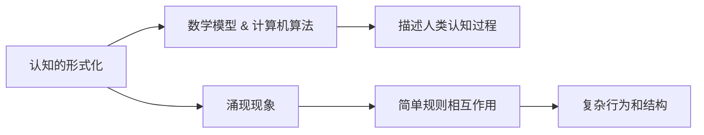

                 

### 认知的形式化：涌现

#### 核心概念与联系

**认知的形式化**是指将人类认知过程通过数学模型和计算机算法进行形式化描述，以便更好地理解和模拟。这种形式化描述不仅帮助我们揭示认知的本质，还提供了构建智能系统的理论基础。

**涌现现象**是指在简单规则的相互作用下产生的复杂行为和结构。它体现了从简单到复杂的转变，是认知科学中的一个重要概念。

两者之间的关系如下：



认知的形式化提供了研究涌现现象的数学工具和算法基础，而涌现现象则为认知形式化模型提供了实证和验证的场景。

---

#### 核心算法原理讲解

**基于符号的计算模型**：

- **符号处理的基本原理**：符号数据结构如命题逻辑、谓词逻辑等，用于表示概念和关系。
  - **命题逻辑**：命题逻辑使用命题和命题连接词（如AND、OR、NOT）来表示逻辑关系。
  - **谓词逻辑**：谓词逻辑使用谓词、个体、个体间关系来表示复杂关系。

- **符号计算算法**：常见的符号计算算法包括命题逻辑推理、谓词逻辑推理和模式匹配。
  - **命题逻辑推理**：基于逻辑推理规则，如推理规则、逆推理规则，进行推理。
  - **谓词逻辑推理**：基于谓词逻辑的推理规则，如前件、后件、全称量词和存在量词等。
  - **模式匹配**：用于匹配符号表达式，实现符号替换和变形。

**伪代码示例**：

```python
# 命题逻辑推理
def logic_inference(knowledge_base, query):
    # 知识库中的命题
    premises = knowledge_base.premises
    # 查询命题
    query = convert_to_symbol(query)
    # 应用推理规则
    inference_rules = apply_rules(premises, query)
    # 返回推理结果
    return inference_rules
```

**基于神经的计算模型**：

- **神经网络的基本结构**：神经网络由大量简单单元（神经元）组成，通过连接和权重来处理信息。
  - **神经元模型**：神经元是神经网络的基本单元，用于接收输入信号、计算加权求和和激活函数输出。
  - **网络结构**：神经网络可以分为前馈神经网络、循环神经网络等，具有不同的结构特性。

- **神经网络的学习算法**：神经网络的学习算法用于调整网络权重，以实现特定功能。
  - **反向传播算法**：反向传播算法用于计算网络误差，并反向更新网络权重。
  - **卷积神经网络**：卷积神经网络用于处理图像等数据，通过卷积层、池化层和全连接层等结构进行特征提取和分类。

**伪代码示例**：

```python
# 神经网络训练
def train_neural_network(data, labels, epochs):
    # 初始化网络
    network = initialize_network()
    # 循环训练
    for epoch in range(epochs):
        # 前向传播
        outputs = forward_pass(network, data)
        # 计算损失
        loss = compute_loss(outputs, labels)
        # 反向传播
        backward_pass(network, loss)
    # 返回训练后的网络
    return network
```

**基于统计的计算模型**：

- **统计学习的基本原理**：监督学习和无监督学习是统计学习的主要方法。
  - **监督学习**：监督学习通过已知的输入和输出数据来训练模型，用于分类和回归任务。
  - **无监督学习**：无监督学习通过未标记的数据来发现模式和结构，用于聚类和降维任务。

- **统计学习的算法**：常见的统计学习算法包括决策树、支持向量机、贝叶斯网络等。
  - **决策树**：决策树通过一系列条件判断来分割数据，用于分类和回归任务。
  - **支持向量机**：支持向量机通过寻找超平面来最大化分类间隔，用于分类任务。
  - **贝叶斯网络**：贝叶斯网络通过条件概率来描述变量间的关系，用于推理和预测。

**伪代码示例**：

```python
# 决策树分类
def classify_data(data, tree):
    # 遍历决策树
    while tree is not None:
        # 根据特征分割数据
        tree = apply_split(tree, data)
    # 返回分类结果
    return tree.classification
```

---

#### 数学模型和公式

**认知科学中的数学模型**通常包括概率论、统计学、信息论等。以下是一些常见的数学模型和公式：

1. **概率论模型**：

   - **条件概率**：\( P(A|B) = \frac{P(A \cap B)}{P(B)} \)

   - **贝叶斯定理**：\( P(A|B) = \frac{P(B|A)P(A)}{P(B)} \)

2. **统计学模型**：

   - **均值**：\( \mu = \frac{1}{N}\sum_{i=1}^{N} x_i \)

   - **方差**：\( \sigma^2 = \frac{1}{N}\sum_{i=1}^{N} (x_i - \mu)^2 \)

3. **信息论模型**：

   - **熵**：\( H(X) = -\sum_{i} P(X=x_i) \log_2 P(X=x_i) \)

   - **信息增益**：\( IG(X,Y) = I(X) - I(X|Y) \)

---

#### 项目实战

**智能代理系统**：

- **开发环境搭建**：

  - 使用Python和Prolog等语言，搭建智能代理系统。

  - 搭建知识库、推理引擎、用户接口等模块。

- **源代码详细实现**：

  - 实现符号逻辑推理、基于神经网络的决策等。

  - 例如，使用Prolog编写知识库，使用Python实现神经网络决策。

- **代码解读与分析**：

  - 解析代理系统的决策过程和性能评估。

  - 分析符号逻辑推理和神经网络决策的优缺点。

---

**计算机游戏AI**：

- **开发环境搭建**：

  - 使用Unity和Python等工具，搭建游戏AI。

  - 搭建游戏场景、AI角色、决策模块等。

- **源代码详细实现**：

  - 实现基于统计学习的方法，如Q-Learning，用于训练游戏AI。

  - 例如，使用Python实现Q-Learning算法，训练AI角色。

- **代码解读与分析**：

  - 分析游戏AI的决策过程、学习策略和性能优化。

  - 解读Q-Learning算法的实现细节和优化方法。

---

### 结论

《认知的形式化：涌现》一书通过形式化模型和算法，深入探讨了认知科学中的核心问题和涌现现象。书中结合了符号计算、神经网络和统计学习等方法，为理解和模拟人类认知提供了有力的工具。通过实际项目案例，读者可以更好地掌握认知模型的应用和实践。

---

### 附录

#### 附录A: 认知科学工具与资源

- **认知科学相关软件工具**：

  - **认知模拟软件**：如OpenCog、Soar等。

  - **数据分析工具**：如Python的scikit-learn、TensorFlow等。

- **认知科学研究资源**：

  - **学术期刊与会议**：如《认知计算》、《人工智能》等。

  - **在线课程与教程**：如Coursera、edX等平台上的相关课程。

#### 附录B: 形式化认知模型参考

- **形式化认知模型的参考资料**：

  - **相关书籍**：《认知建模：一种计算机方法》、《智能系统设计：认知建模与实现》等。

  - **学术论文**：在相关学术期刊和会议上发表的论文。

- **形式化认知模型的实际应用案例**：

  - **智能代理系统**：如IBM的Watson等。

  - **计算机游戏AI**：如《星际争霸》中的AI等。

---

### 作者

**作者：AI天才研究院/AI Genius Institute & 禅与计算机程序设计艺术 /Zen And The Art of Computer Programming**

