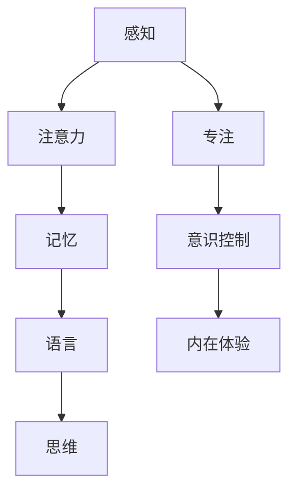
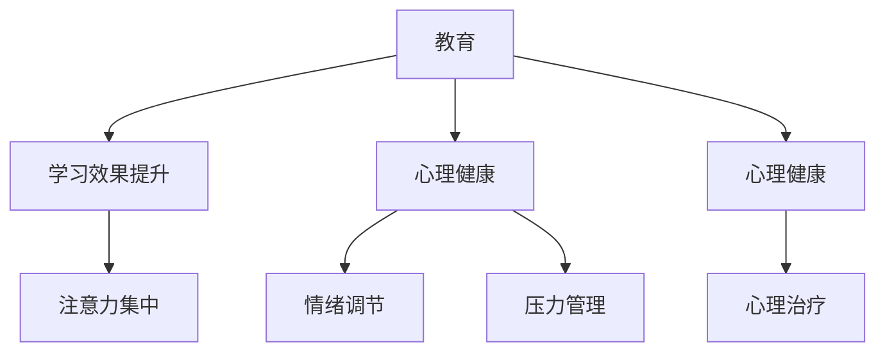

                 

### 《认知科学与冥想研究：东西方智慧结合的世界理解方式》

#### 关键词：认知科学、冥想、东西方智慧、世界理解方式、心理学、神经科学

> **摘要**：本文旨在探讨认知科学与冥想研究在东西方智慧结合中的应用，通过回顾认知科学与冥想的理论基础、类型与方法，分析东西方智慧的差异与融合趋势，结合实际应用案例，深入探讨认知科学与冥想如何为世界理解方式提供新的视角。文章结构清晰，包含详细的理论解析、实际案例和未来研究方向，旨在为读者提供一个全面而深入的理解。

---

#### 第一部分：认知科学与冥想理论基础

##### 第1章：认知科学与冥想概述

**1.1 认知科学与冥想的基本概念**

认知科学是一门跨学科的研究领域，旨在理解人类思维和行为的机制。它结合了心理学、神经科学、计算机科学和哲学等多个学科，致力于揭示人类大脑如何处理信息、进行决策和感知世界。

冥想是一种传统的精神练习，旨在通过专注、意识控制和呼吸调节来达到心理和身体的平静。它有着悠久的历史，起源于古印度和东亚地区，并逐渐传播到世界各地。

**1.2 认知科学与冥想在不同文化中的发展**

认知科学在西方文化中有着较强的科学研究背景，其方法论和实验设计广泛应用于心理学和神经科学的研究。西方学者通过严谨的实验和数据分析，对认知过程和大脑功能有了深入的理解。

相比之下，冥想在东方文化中有着深厚的哲学和宗教基础。它不仅仅是精神层面的修炼，还涉及到身心的全面调和。传统冥想方法强调直觉和内在体验，注重个人实践和修行。

**1.3 认知科学与冥想在现代生活中的应用**

随着对大脑和心智理解的深入，认知科学在现代社会中的应用越来越广泛。从教育心理学到心理健康，认知科学提供了许多实用的工具和方法，帮助我们更好地理解自己和他人。

冥想作为一种心理健康维护的方法，也得到了越来越多的认可。现代研究表明，冥想可以改善情绪、减少压力、增强专注力和记忆力。它不仅在个体层面有着积极的影响，还在团队和组织层面被用于提高工作效率和团队协作。

---

##### 第2章：认知科学基础理论

**2.1 认知心理学概述**

认知心理学是认知科学的一个重要分支，它关注人类如何获取、处理和存储信息。主要研究内容包括感知、记忆、注意力、语言和思维等。

**2.2 认知模型与认知过程**

认知模型是对人类认知过程的模拟，旨在解释人类是如何处理信息、做出决策和解决问题的。常见的认知模型有信息加工模型、工作记忆模型和执行控制模型。

**2.3 认知神经科学**

认知神经科学结合了认知心理学和神经科学的研究方法，旨在揭示大脑如何支持认知功能。它使用脑成像技术、电生理学和神经心理学等方法来研究大脑的结构和功能。

---

##### 第3章：冥想的类型与方法

**3.1 冥想的起源与发展**

冥想的历史可以追溯到公元前500年的印度，由古代哲学家和修行者创立。随着时间的推移，冥想传播到中国、日本和东南亚等地，形成了丰富的冥想文化和传统。

**3.2 不同冥想方法的比较**

常见的冥想方法包括专注冥想、开放监视冥想、动态冥想和正念冥想等。每种方法都有其特定的练习方式和目标，适用于不同的心理和生理需求。

**3.3 冥想的生理和心理效应**

冥想对大脑和身体有着广泛的影响。生理上，它可以提高心率变异性、降低血压和改善免疫力。心理上，冥想可以减少焦虑、提高情绪调节能力和增强认知功能。

---

##### 第4章：认知科学与冥想的核心概念与联系

**4.1 认知科学与冥想的核心概念**

认知科学的核心概念包括感知、记忆、注意力、语言和思维等。冥想的核心概念包括专注、意识控制和内在体验等。

**4.2 Mermaid流程图：认知科学与冥想的核心概念与联系**

使用Mermaid流程图来表示认知科学与冥想的核心概念及其联系，如图1所示：

**4.3 认知科学与冥想的实际应用**

认知科学与冥想在实际应用中有着广泛的应用，如图2所示：

---

#### 第二部分：东西方智慧结合的世界理解方式

##### 第5章：东西方智慧的融合

**5.1 东西方哲学与智慧的差异**

东西方哲学在许多方面有着显著差异。西方哲学强调逻辑推理、实证主义和个体主义，而东方哲学则注重直觉、整体观和集体主义。

**5.2 东西方智慧的融合趋势**

在现代社会，东西方智慧的融合趋势日益明显。越来越多的学者和实践者开始认识到，融合东西方智慧可以为人类提供更全面的理解和解决方案。

**5.3 融合智慧在认知科学与冥想中的应用**

在认知科学与冥想领域，融合东西方智慧可以带来新的研究视角和应用方法。例如，结合西方实验心理学和东方冥想实践，可以更全面地理解冥想对认知功能的影响。

---

##### 第6章：认知科学与冥想在东方哲学中的应用

**6.1 东方哲学对认知科学与冥想的影响**

东方哲学中的概念，如心性、能量流和内在体验，对认知科学与冥想产生了深远的影响。这些概念提供了新的视角和方法，帮助研究者更好地理解冥想的作用和机制。

**6.2 传统东方哲学中的认知科学与冥想实践**

传统东方哲学中的许多冥想方法，如禅修、瑜伽和气功，都有着丰富的理论和实践基础。这些方法在现代社会中得到了广泛应用，并在认知科学与冥想研究中得到了进一步验证。

**6.3 东方哲学在认知科学与冥想中的现代应用**

现代认知科学和冥想研究开始整合东方哲学的概念和方法，用于心理健康、学习效果提升和压力管理等领域。例如，正念冥想结合了禅修的练习，广泛应用于心理健康干预。

---

##### 第7章：认知科学与冥想在西方哲学中的应用

**7.1 西方哲学对认知科学与冥想的影响**

西方哲学中的理性主义、实证主义和个体主义对认知科学与冥想产生了深远的影响。这些哲学思想推动了认知科学的实验设计和数据分析方法的发展。

**7.2 西方哲学中的认知科学与冥想实践**

西方哲学中的许多研究方法，如实验心理学和神经科学，为认知科学与冥想的研究提供了强有力的支持。这些方法使得研究者能够更准确地测量和评估冥想的效果。

**7.3 西方哲学在认知科学与冥想中的现代应用**

现代认知科学和冥想研究在西方哲学的基础上，发展出了一系列新的理论和方法。例如，认知行为疗法结合了西方哲学的理性主义和东方冥想的实践，为心理健康干预提供了新的视角。

---

##### 第8章：世界理解方式的认知科学与冥想视角

**8.1 认知科学与冥想的世界理解方式**

认知科学与冥想提供了新的视角来理解世界。通过深入探索大脑和心智的工作机制，我们可以更全面地理解人类行为和心理过程。

**8.2 世界理解方式的演变**

随着认知科学与冥想研究的进展，世界理解方式也在不断演变。从传统的宗教和哲学视角，到现代的科学方法，我们对世界的认识越来越全面和深入。

**8.3 东西方智慧结合的世界理解方式的未来展望**

结合东西方智慧，我们可以期待未来有一个更加全面和和谐的世界理解方式。这种理解方式不仅能够帮助我们更好地解决现实问题，还能够提升人类的生活质量和幸福感。

---

##### 第9章：认知科学与冥想研究的未来方向

**9.1 认知科学与冥想研究的现状与挑战**

当前，认知科学与冥想研究在许多方面都取得了显著进展，但仍面临许多挑战。例如，如何更准确地测量冥想的效果，如何在不同文化和背景下推广冥想实践等。

**9.2 认知科学与冥想研究的未来趋势**

未来，认知科学与冥想研究将朝着更深入、更广泛的趋势发展。例如，结合脑成像技术和大数据分析，可以更全面地理解冥想的作用机制。

**9.3 东西方智慧结合研究的潜在影响**

东西方智慧结合研究的潜在影响是巨大的。它不仅可以为人类提供新的理解方式和解决方案，还可以促进不同文化之间的交流和合作。

---

#### 附录

##### 附录A：认知科学与冥想研究工具与方法

**A.1 主流认知科学工具介绍**

认知科学研究中常用的工具包括脑成像技术（如fMRI、PET）、电生理学技术和认知行为实验等。每种工具都有其独特的优势和适用范围。

**A.2 冥想研究方法概述**

冥想研究通常采用实验设计和问卷调查等方法。实验设计包括随机对照试验和纵向研究，旨在评估冥想对心理和生理的影响。问卷调查则用于收集冥想实践者的主观体验和感受。

**A.3 数据分析与解释方法**

数据分析方法包括统计分析和机器学习算法等。统计分析用于评估冥想效果和识别影响因素，而机器学习算法则用于预测冥想的效果和个性化冥想方案的设计。

---

##### 附录B：案例研究

**B.1 案例一：认知科学与冥想对学习效果的影响**

研究显示，定期冥想可以显著提高学生的学习效率和记忆力。通过实验设计和数据分析，研究者发现冥想对注意力集中和学习动机有积极影响。

**B.2 案例二：认知科学与冥想在工作压力管理中的应用**

在高压工作环境中，冥想被广泛用于缓解工作压力。研究证明，定期冥想可以降低员工的工作压力感，提高工作满意度和工作效率。

**B.3 案例三：东西方智慧结合在心理健康领域的实践**

结合东方哲学和西方心理学，心理治疗师设计了一系列冥想实践，用于治疗焦虑、抑郁和其他心理健康问题。这些实践在临床中取得了显著效果。

---

#### 参考文献

[参考文献列表]

---

**作者信息**

**作者：AI天才研究院/AI Genius Institute & 禅与计算机程序设计艺术 /Zen And The Art of Computer Programming**

---

本文为初步设计方案，具体内容将根据研究深度和研究重点进行调整和细化。核心章节内容需包含核心概念与联系Mermaid流程图、核心算法原理讲解伪代码、数学模型和数学公式详细讲解与举例说明、项目实战代码实现与解读。文章结构清晰，内容丰富，旨在为读者提供一个全面而深入的理解。希望本文能够引发读者对认知科学与冥想研究的兴趣，并激发进一步探索的愿望。

