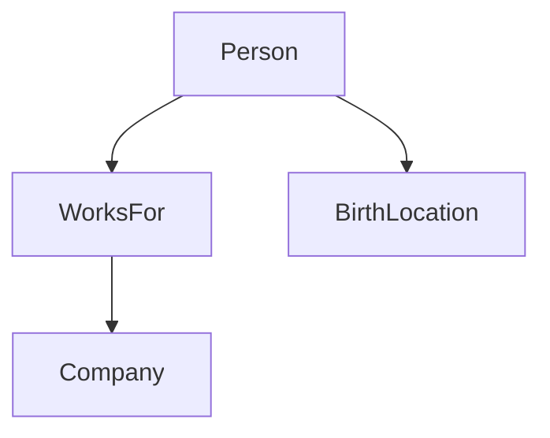
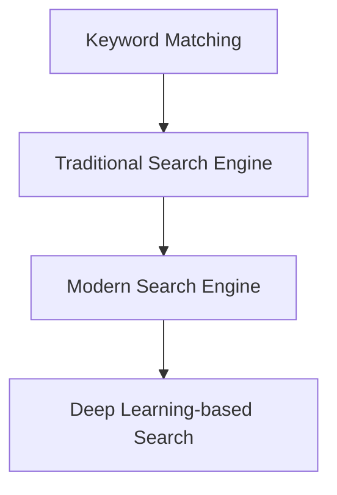
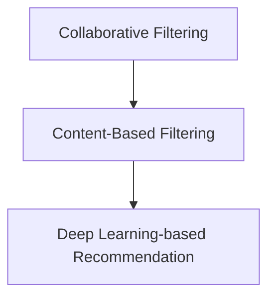
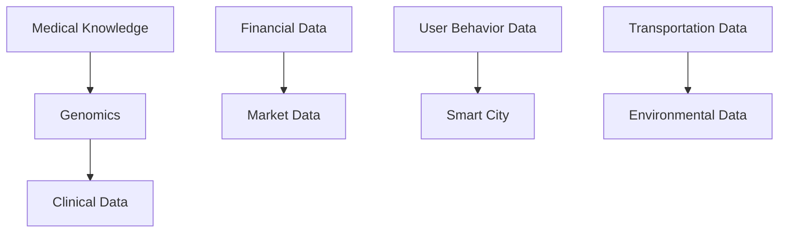
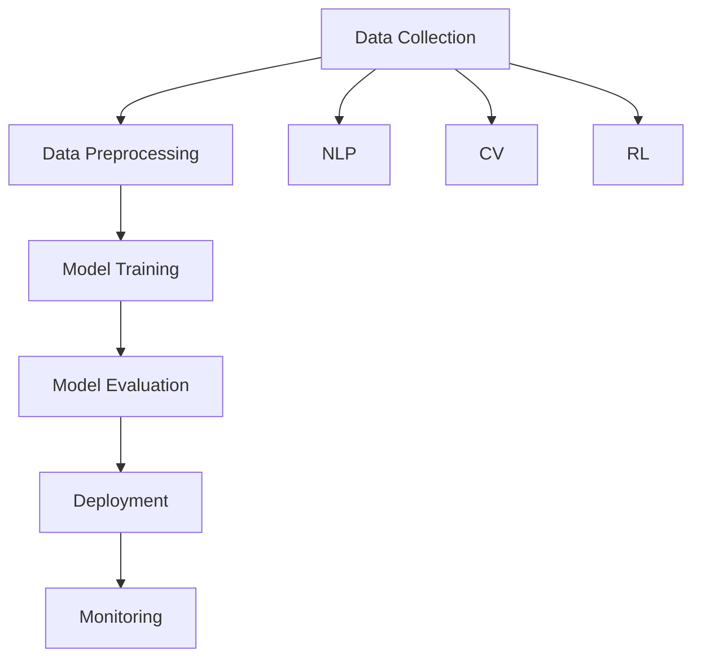
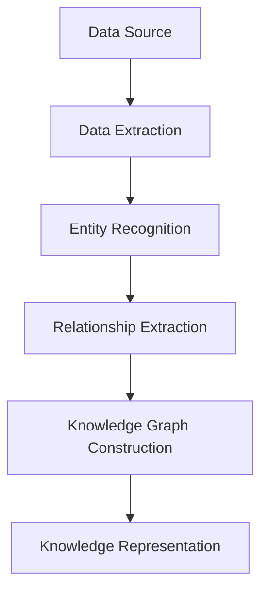
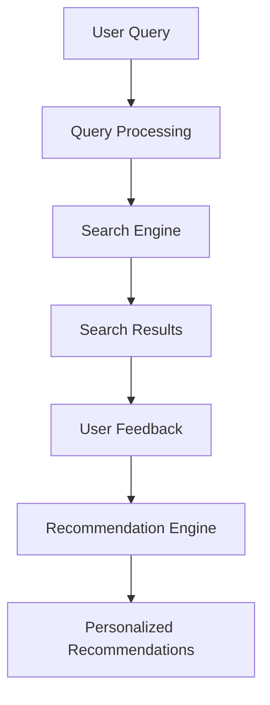

                 

## 认知革命：AI时代的知识获取新范式

### 关键词：认知革命、AI时代、知识获取、知识图谱、语义网络、人工智能搜索与推荐

> 摘要：认知革命是人类智能发展的重大转折点，它不仅改变了人类的知识获取方式，也深刻影响了社会、教育和工作等多个领域。在AI时代，随着人工智能技术的迅猛发展，知识获取进入了一个全新的阶段。本文将从认知革命的起源与背景、AI技术的核心原理与应用、知识获取新范式以及认知革命对教育、工作和人类发展的深远影响等多个角度，深入探讨AI时代的知识获取新范式，展望未来社会的变革与进步。

### 《认知革命：AI时代的知识获取新范式》目录大纲

**第一部分：认知革命的起源与背景**

- **第1章：认知革命的起源与影响**
  - **1.1 认知革命的定义与起源**
  - **1.2 认知革命对人类社会的深远影响**
  - **1.3 认知革命与AI时代的关联**
- **第2章：认知革命下的知识获取**
  - **2.1 传统知识获取方式与局限**
  - **2.2 认知革命下的新型知识获取方式**
  - **2.3 AI技术在知识获取中的应用**

**第二部分：认知革命与AI技术**

- **第3章：AI技术的核心原理与应用**
  - **3.1 AI技术的核心原理**
    - **3.1.1 机器学习基础**
    - **3.1.2 深度学习原理**
  - **3.2 AI技术在知识获取中的应用**
    - **3.2.1 自然语言处理**
    - **3.2.2 计算机视觉**
    - **3.2.3 强化学习**

**第三部分：AI时代的知识获取新范式**

- **第4章：AI时代的知识获取新范式**
  - **4.1 知识图谱与语义网络**
    - **4.1.1 知识图谱的构建与表示**
    - **4.1.2 语义网络的原理与应用**
  - **4.2 人工智能搜索与推荐**
    - **4.2.1 搜索引擎的演变**
    - **4.2.2 智能推荐系统的原理与应用**
  - **4.3 跨领域知识整合与融合**
    - **4.3.1 跨领域知识融合的方法与挑战**
    - **4.3.2 跨领域知识整合的案例研究**

**第四部分：认知革命与未来社会**

- **第5章：认知革命对教育的影响**
  - **5.1 教育模式的变化**
  - **5.2 个性化学习的崛起**
  - **5.3 AI技术在教育中的应用**
- **第6章：认知革命对工作的影响**
  - **6.1 工作模式的转变**
  - **6.2 自动化与人工智能的影响**
  - **6.3 AI时代的人力资源管理**
- **第7章：认知革命与人类发展**
  - **7.1 人类认知能力的提升**
  - **7.2 人类社会的进步**
  - **7.3 面向未来的准备与挑战**

**附录**

- **附录A：认知革命相关资源与工具**
  - **A.1 AI开发框架与工具介绍**
  - **A.2 认知革命相关书籍推荐**
  - **A.3 认知革命研究机构与组织介绍**
- **附录B：认知革命相关Mermaid流程图**
  - **B.1 人工智能技术架构**
  - **B.2 知识图谱构建过程**
  - **B.3 人工智能搜索与推荐流程**

现在，我们将按照这个大纲，逐一展开每个章节的内容。通过逻辑清晰、结构紧凑、简单易懂的写作方式，全面探讨认知革命在AI时代下的知识获取新范式，以及它对人类社会带来的深远影响。

### 第一部分：认知革命的起源与背景

#### 第1章：认知革命的起源与影响

认知革命是人类历史上一场重大变革，它不仅标志着人类智能的飞跃，也深刻改变了人类社会的发展轨迹。这一章将探讨认知革命的定义、起源及其对人类社会的影响。

##### **1.1 认知革命的定义与起源**

认知革命（Cognitive Revolution）是指人类从原始社会向现代社会过渡的一个关键阶段。这一过程大约发生在公元前20,000年至公元前10,000年之间，标志着人类大脑结构的发展和智能的提升。认知革命的核心是语言的产生和思维能力的发展。

- **语言的产生**：语言的出现是人类认知能力发展的里程碑，它不仅使得人类能够进行复杂的沟通和协作，也为知识的积累和传承提供了基础。
- **思维能力的发展**：随着语言能力的提升，人类开始能够进行抽象思维和逻辑推理，这为科学技术的进步奠定了基础。

认知革命的起源可以追溯到早期人类对自然界的观察和思考。随着狩猎采集活动的发展，人类需要不断积累经验和知识，以便更好地适应环境。这种经验积累和知识传承的过程，促进了人类智能的提升。

##### **1.2 认知革命对人类社会的深远影响**

认知革命对人类社会产生了深远的影响，它不仅改变了人类的生活方式，也推动了社会结构、文化和知识的发展。

- **社会结构的变化**：在认知革命之前，人类社会主要以部落为单位，以血缘关系为基础。认知革命之后，社会结构逐渐从部落社会向城市社会过渡，社会分工和契约关系逐渐取代了血缘关系。
- **知识积累与传承**：认知革命使得知识能够以更高效的方式积累和传承。通过书写和文字的发明，知识得以记录和保存，为后来的科学和技术发展提供了丰富的资源。
- **文化多样性**：认知革命促进了不同地区、不同文明的交流和发展。各地区的文明逐渐形成了独特的文化和社会制度，丰富了人类文明的多样性。

##### **1.3 认知革命与AI时代的关联**

认知革命与AI时代有着密切的关联。从某种程度上说，AI技术的发展是认知革命在现代的延续。以下是AI时代与认知革命的一些关键联系：

- **人工智能的本质**：人工智能（AI）旨在模拟和增强人类智能，实现自动化和智能化。这与认知革命的目标高度一致，即通过提升人类智能，实现更高效的知识获取和处理。
- **知识获取方式**：在AI时代，互联网和大数据技术为知识获取提供了新的途径。通过机器学习和深度学习等技术，AI能够从大量数据中提取知识，实现知识获取的自动化和高效化。
- **社会影响**：AI时代的到来，再次深刻改变了人类社会。从工作模式到教育模式，从经济结构到社会关系，AI技术都带来了新的变革。这些变革与认知革命对人类社会的影响有着相似之处。

通过上述讨论，我们可以看到，认知革命不仅是人类历史上的一次重大变革，也是AI时代知识获取新范式的基础。在接下来的章节中，我们将深入探讨AI技术的核心原理及其在知识获取中的应用，进一步理解AI时代的知识获取新范式。

### 第2章：认知革命下的知识获取

#### **2.1 传统知识获取方式与局限**

在认知革命之前，人类主要通过以下几种方式进行知识获取：

- **书籍**：书籍是人类知识的重要载体，通过阅读书籍，人们可以获取历史、科学、文学等多方面的知识。
- **课堂**：学校教育是一种系统性的知识传授方式，通过教师的讲解和学生的自主学习，知识得以传递和巩固。
- **经验**：通过实际操作和实践，人们可以积累经验，并将其转化为知识。

然而，这些传统知识获取方式也存在一定的局限：

- **速度慢**：书籍和课堂教育需要时间来传递知识，效率相对较低。在快速变化的信息环境中，这种知识获取方式难以满足需求。
- **效率低**：传统知识获取方式往往依赖于个体的记忆和理解能力，知识传递的效率受到限制。在大量信息面前，人们很难做到全面掌握。
- **难以更新**：知识内容容易过时，书籍和课堂教育难以及时更新，导致知识获取的时效性较差。

#### **2.2 认知革命下的新型知识获取方式**

认知革命为知识获取带来了全新的方式，极大地提高了知识获取的速度和效率。以下是几种重要的新型知识获取方式：

- **互联网**：互联网的出现，使得知识获取变得前所未有的便捷。通过搜索引擎，人们可以迅速找到所需的信息，实现知识获取的即时化。互联网还提供了丰富的在线课程和电子书籍，为人们提供了更加多样化的学习资源。
- **人工智能**：人工智能（AI）技术在知识获取中发挥着重要作用。通过机器学习和自然语言处理等技术，AI能够从大量数据中提取知识，实现知识的自动化获取。例如，智能问答系统和推荐系统可以根据用户的需求，提供个性化的知识推荐。
- **社交媒体**：社交媒体平台如微博、微信等，使得知识获取变得更加互动和社交化。用户可以通过分享、评论和转发，快速获取他人的知识和观点，实现知识的共享和传播。

#### **2.3 AI技术在知识获取中的应用**

AI技术在知识获取中的应用，使得知识获取变得更加高效和智能化。以下是几种主要的AI技术在知识获取中的应用：

- **搜索引擎**：搜索引擎利用自然语言处理和机器学习技术，实现高效的信息检索。通过理解用户的查询意图，搜索引擎可以提供更加精准的搜索结果，帮助用户快速获取所需的知识。
- **智能问答系统**：智能问答系统利用自然语言处理和知识图谱技术，实现自动问答和知识传递。用户可以通过提问，获取系统提供的准确答案，实现知识的快速获取。
- **推荐系统**：推荐系统利用用户行为数据和机器学习算法，实现个性化的知识推荐。通过分析用户的历史行为和兴趣，推荐系统可以为用户提供个性化的学习资源和推荐，提高知识获取的效率。

总之，认知革命下的新型知识获取方式，极大地提高了知识获取的速度和效率。在AI时代的背景下，这些新型知识获取方式为人类带来了更多可能性，也为未来的知识获取提供了新的方向。

### 第二部分：认知革命与AI技术

#### **第3章：AI技术的核心原理与应用**

认知革命不仅改变了人类的知识获取方式，也为人工智能（AI）技术的发展奠定了基础。AI技术通过模拟和扩展人类智能，实现了自动化和智能化的知识获取、处理和应用。这一章将深入探讨AI技术的核心原理及其在知识获取中的应用。

##### **3.1 AI技术的核心原理**

AI技术的核心原理包括机器学习（Machine Learning，ML）和深度学习（Deep Learning，DL）。这些技术通过模拟人类大脑的学习过程，实现了从数据到知识的转换。

###### **3.1.1 机器学习基础**

机器学习是一种让计算机通过数据学习并做出决策的技术。其主要原理是通过大量数据训练模型，使模型能够对未知数据进行预测和分类。

- **监督学习（Supervised Learning）**：在监督学习中，模型通过已标记的训练数据学习，并能够对新的数据进行预测。常见的监督学习算法包括线性回归、逻辑回归、决策树、随机森林和支持向量机等。

  ```python
  # 线性回归的伪代码
  def linear_regression(X, y):
      # X: 特征矩阵，y: 标签向量
      w = initialize_weights(X.shape[1])
      for epoch in range(num_epochs):
          for x, y in zip(X, y):
              prediction = w.dot(x)
              error = prediction - y
              w = w - learning_rate * gradient(w, x, error)
      return w
  ```

- **无监督学习（Unsupervised Learning）**：无监督学习不依赖于已标记的数据，主要通过发现数据中的模式来实现。常见的无监督学习算法包括聚类、降维和关联规则学习等。

  ```python
  # K-means聚类的伪代码
  def k_means(X, k):
      # X: 数据矩阵，k: 聚类个数
      centroids = initialize_centroids(X, k)
      for epoch in range(num_epochs):
          assignments = assign_points_to_centroids(X, centroids)
          centroids = update_centroids(X, assignments, k)
      return centroids, assignments
  ```

###### **3.1.2 深度学习原理**

深度学习是机器学习的一种特殊形式，通过多层神经网络（Neural Networks）实现复杂函数的拟合。深度学习在图像识别、自然语言处理和强化学习等领域取得了显著的成果。

- **神经网络（Neural Networks）**：神经网络由多个神经元（Nodes）组成，每个神经元都与其他神经元相连，并通过权重（Weights）传递信号。神经网络通过前向传播（Forward Propagation）和反向传播（Back Propagation）实现数据的输入和输出。

  ```python
  # 神经网络前向传播的伪代码
  def forward_propagation(X, model):
      # X: 输入数据，model: 神经网络模型
      for layer in model.layers:
          layer.output = layer活化函数(layer.input * layer.weights)
      return model.output
  ```

- **激活函数（Activation Functions）**：激活函数用于引入非线性变换，使得神经网络能够拟合复杂函数。常见的激活函数包括Sigmoid、ReLU和Tanh等。

  ```python
  # ReLU激活函数的伪代码
  def relu(x):
      return max(0, x)
  ```

- **反向传播算法（Back Propagation Algorithm）**：反向传播算法通过计算损失函数的梯度，更新神经网络的权重，以优化模型的性能。

  ```python
  # 反向传播的伪代码
  def backward_propagation(X, y, model):
      # X: 输入数据，y: 真实标签，model: 神经网络模型
      output = forward_propagation(X, model)
      loss = loss函数(output, y)
      dloss_doutput = loss函数的梯度(output, y)
      for layer in reversed(model.layers):
          dloss_dinput = dloss_doutput * layer活化函数的导数(layer.input)
          dloss_dweights = dloss_dinput * layer.input
          layer.weights -= learning_rate * dloss_dweights
      return loss
  ```

##### **3.2 AI技术在知识获取中的应用**

AI技术在知识获取中的应用，极大地提高了知识获取的效率和准确性。以下是几种主要的AI技术在知识获取中的应用：

###### **3.2.1 自然语言处理**

自然语言处理（Natural Language Processing，NLP）是一种利用计算机技术和人工智能技术处理和理解自然语言的方法。NLP在知识获取中的应用主要包括文本分类、情感分析和机器翻译等。

- **文本分类（Text Classification）**：文本分类是一种将文本数据根据其内容进行分类的方法。通过训练分类模型，可以自动对大量文本数据进行分类，帮助用户快速获取相关领域的知识。

  ```python
  # 文本分类的伪代码
  def text_classification(document, model):
      # document: 文本数据，model: 分类模型
      features = extract_features(document)
      label = model.predict(features)
      return label
  ```

- **情感分析（Sentiment Analysis）**：情感分析是一种通过分析文本数据中的情感倾向的方法。通过情感分析，可以了解用户对某个主题或产品的情感态度，帮助用户更好地获取和利用知识。

  ```python
  # 情感分析的伪代码
  def sentiment_analysis(document, model):
      # document: 文本数据，model: 情感分析模型
      features = extract_features(document)
      sentiment = model.predict(features)
      return sentiment
  ```

- **机器翻译（Machine Translation）**：机器翻译是一种将一种自然语言翻译成另一种自然语言的方法。通过机器翻译，可以消除语言障碍，实现全球范围内的知识共享。

  ```python
  # 机器翻译的伪代码
  def machine_translation(source_text, model, target_language):
      # source_text: 源语言文本，model: 翻译模型，target_language: 目标语言
      target_text = model.translate(source_text, target_language)
      return target_text
  ```

###### **3.2.2 计算机视觉**

计算机视觉（Computer Vision）是一种通过计算机技术和人工智能技术处理和理解图像和视频的方法。计算机视觉在知识获取中的应用主要包括图像识别、图像分割和目标检测等。

- **图像识别（Image Recognition）**：图像识别是一种通过识别图像中的物体或场景的方法。通过训练图像识别模型，可以自动对大量图像数据进行分类，帮助用户快速获取相关领域的知识。

  ```python
  # 图像识别的伪代码
  def image_recognition(image, model):
      # image: 图像数据，model: 图像识别模型
      objects = model.detect_objects(image)
      return objects
  ```

- **图像分割（Image Segmentation）**：图像分割是一种将图像分成不同区域的方法。通过图像分割，可以更好地理解和分析图像内容，帮助用户获取更精准的知识。

  ```python
  # 图像分割的伪代码
  def image_segmentation(image, model):
      # image: 图像数据，model: 图像分割模型
      segments = model.segment_image(image)
      return segments
  ```

- **目标检测（Object Detection）**：目标检测是一种通过识别图像中的目标物体并定位其位置的方法。通过目标检测，可以实现对图像内容的精准分析和理解，帮助用户获取更全面的知识。

  ```python
  # 目标检测的伪代码
  def object_detection(image, model):
      # image: 图像数据，model: 目标检测模型
      objects = model.detect_objects(image)
      return objects
  ```

###### **3.2.3 强化学习**

强化学习（Reinforcement Learning，RL）是一种通过与环境交互，不断学习最优策略的方法。强化学习在知识获取中的应用主要包括智能搜索、推荐系统和自动驾驶等。

- **智能搜索（Intelligent Search）**：智能搜索是一种通过学习用户行为和偏好，提供个性化搜索结果的方法。通过强化学习，可以实现对用户需求的精准理解，提高知识获取的效率。

  ```python
  # 智能搜索的伪代码
  def intelligent_search(user_query, model):
      # user_query: 用户查询，model: 强化学习模型
      search_results = model.search(user_query)
      return search_results
  ```

- **推荐系统（Recommender System）**：推荐系统是一种通过学习用户行为和偏好，提供个性化推荐的方法。通过强化学习，可以实现对用户兴趣的精准识别，提高知识获取的满意度。

  ```python
  # 推荐系统的伪代码
  def recommendation_system(user_behavior, model):
      # user_behavior: 用户行为数据，model: 强化学习模型
      recommendations = model.recommend(user_behavior)
      return recommendations
  ```

- **自动驾驶（Autonomous Driving）**：自动驾驶是一种通过学习环境数据和驾驶规则，实现无人驾驶的方法。通过强化学习，可以实现对复杂交通状况的应对，提高知识获取的效率和安全。

  ```python
  # 自动驾驶的伪代码
  def autonomous_driving(model):
      # model: 强化学习模型
      driving_action = model.take_action()
      return driving_action
  ```

总之，AI技术的核心原理及其在知识获取中的应用，为人类带来了全新的知识获取方式。通过机器学习、深度学习和强化学习等技术，AI能够从大量数据中提取知识，实现知识获取的自动化和智能化。在AI时代的背景下，这些技术为知识获取提供了无限的可能性，也为未来的发展奠定了基础。

### 第三部分：AI时代的知识获取新范式

#### **第4章：AI时代的知识获取新范式**

随着人工智能技术的迅猛发展，知识获取的方式也在不断演变，形成了一种全新的范式。这一章将重点探讨AI时代的知识获取新范式，包括知识图谱与语义网络、人工智能搜索与推荐以及跨领域知识整合与融合。

##### **4.1 知识图谱与语义网络**

知识图谱（Knowledge Graph）和语义网络（Semantic Network）是AI时代知识获取的重要工具，它们通过结构化数据和语义关系，实现了知识的高效获取和应用。

###### **4.1.1 知识图谱的构建与表示**

知识图谱是一种通过节点（实体）和边（关系）表示知识的方法。构建知识图谱通常包括以下几个步骤：

1. **数据采集**：从各种数据源（如数据库、文本、图像等）中采集数据，获取实体和关系。
2. **数据预处理**：对采集到的数据进行清洗、去重和格式化，确保数据质量。
3. **实体抽取**：从预处理后的数据中提取实体，如人、地点、组织等。
4. **关系抽取**：从实体间的关系中提取语义关系，如“工作于”、“属于”等。
5. **知识图谱构建**：将实体和关系组合成知识图谱，形成一个结构化的知识体系。

知识图谱的表示方法主要有图论表示和属性图表示。图论表示使用节点和边表示实体和关系，如：



属性图表示则通过属性节点和边来表示实体和关系，如：

```mermaid
graph TB
A[Person]({Name: John}) --> B[WorksFor]({CompanyName: Google})
B --> C[Company]({Name: Google, Location: Mountain View})
A --> D[BirthLocation]({City: London})
```

###### **4.1.2 语义网络的原理与应用**

语义网络是一种通过语义关系表示实体间逻辑关系的方法。它通常由节点（实体）和边（关系）组成，每个节点和边都带有特定的语义信息。语义网络的原理包括：

- **语义分类**：将实体按照语义分类，如动物、植物、人物等。
- **语义关系**：定义实体之间的语义关系，如“属于”、“工作于”等。
- **语义推理**：通过实体和关系进行语义推理，如“如果A属于B，且B属于C，则A属于C”。

语义网络的应用主要包括语义检索、知识推理和智能问答等。例如，在语义检索中，系统可以通过语义网络理解用户的查询意图，提供更加精准的检索结果。

```mermaid
graph TB
A[Person](Name: John) --> B[WorksFor](Relation: WorksFor) --> C[Company](Name: Google)
A --> D[BirthLocation](City: London)
```

##### **4.2 人工智能搜索与推荐**

人工智能搜索与推荐是AI时代知识获取的重要手段。通过机器学习和深度学习技术，系统能够根据用户行为和偏好，提供个性化的搜索结果和推荐。

###### **4.2.1 搜索引擎的演变**

搜索引擎的发展经历了从传统搜索引擎到现代搜索引擎的转变。传统搜索引擎主要依靠关键词匹配和索引技术，而现代搜索引擎则通过机器学习和深度学习技术，实现了更智能的信息检索。

- **关键词匹配**：传统搜索引擎通过关键词匹配，将用户的查询与网页内容进行匹配，提供相关结果。
- **深度学习检索**：现代搜索引擎利用深度学习技术，通过对海量数据的学习，实现语义检索和上下文理解，提供更精准的搜索结果。



###### **4.2.2 智能推荐系统的原理与应用**

智能推荐系统通过分析用户行为和偏好，为用户提供个性化的推荐。其原理主要包括：

- **协同过滤（Collaborative Filtering）**：通过分析用户之间的行为相似性，为用户提供推荐。
- **内容推荐（Content-Based Filtering）**：通过分析用户的行为和偏好，为用户推荐相似的内容。
- **深度学习推荐**：利用深度学习技术，实现更智能的推荐。

智能推荐系统的应用场景包括电子商务、社交媒体和在线视频等。例如，在电子商务平台中，系统可以根据用户的购买记录和浏览记录，为用户推荐相关的商品。



##### **4.3 跨领域知识整合与融合**

跨领域知识整合与融合是AI时代知识获取的新挑战和新机遇。通过跨领域知识整合，可以将不同领域中的知识进行整合，实现知识的互补和增强。

###### **4.3.1 跨领域知识融合的方法与挑战**

跨领域知识融合的方法主要包括：

- **数据集成（Data Integration）**：将不同领域的数据进行整合，形成一个统一的数据视图。
- **知识图谱构建**：通过构建跨领域知识图谱，实现知识的高效表示和利用。
- **跨领域模型训练**：通过跨领域数据训练模型，实现不同领域知识的融合和应用。

跨领域知识融合面临的挑战主要包括：

- **数据不一致性**：不同领域的数据结构和语义存在差异，导致数据融合困难。
- **知识冲突**：不同领域的知识可能存在冲突和矛盾，需要解决冲突和一致性。
- **计算资源限制**：跨领域知识融合通常需要大量的计算资源，对计算能力提出了高要求。

###### **4.3.2 跨领域知识整合的案例研究**

跨领域知识整合在不同领域都有成功的应用案例。以下是几个案例研究：

- **医疗领域**：通过跨领域知识整合，将医学知识、基因组数据和临床数据相结合，实现个性化诊疗和疾病预测。
- **金融领域**：通过跨领域知识整合，将金融市场数据、经济数据和用户行为数据相结合，实现精准的风险评估和投资策略。
- **智能城市**：通过跨领域知识整合，将交通数据、环境数据和市民行为数据相结合，实现智能交通管理和城市运营优化。



总之，AI时代的知识获取新范式通过知识图谱、语义网络、人工智能搜索与推荐以及跨领域知识整合与融合，实现了知识获取的智能化和高效化。在未来的发展中，这些新范式将为人类社会带来更多的知识和智慧。

### 第四部分：认知革命与未来社会

#### **第5章：认知革命对教育的影响**

认知革命不仅改变了人类的知识获取方式，也对教育领域产生了深远的影响。这一章将探讨认知革命对教育模式、个性化学习和AI技术在教育中的应用。

##### **5.1 教育模式的变化**

认知革命之前，教育模式主要以教师为中心，强调知识的传授和记忆。然而，随着认知革命的发展，教育模式逐渐发生了变化：

- **从教师为中心到学生为中心**：认知革命促使教育从以教师为中心的教学模式，转向以学生为中心的学习模式。这种变化强调学生的主动性和参与度，鼓励学生通过自主探索和实践活动，实现知识的内化和应用。
- **从单一知识传授到知识构建**：认知革命强调知识的构建和创造，教育不再只是传授现成的知识，而是通过引导学生参与知识发现和创造过程，培养他们的创新能力和批判性思维。

##### **5.2 个性化学习的崛起**

个性化学习是认知革命在教育领域的重要体现。通过AI技术，教育可以更好地适应每个学生的学习需求和特点，实现个性化教学。

- **学习路径个性化**：根据学生的学习历史和表现，AI系统可以推荐最适合的学习路径和资源，帮助学生更高效地学习。
- **学习风格个性化**：AI技术可以通过分析学生的学习行为和偏好，识别出他们的学习风格，并针对性地提供教学策略和资源。
- **学习反馈个性化**：AI系统可以根据学生的回答和表现，提供个性化的反馈和建议，帮助学生及时纠正错误和理解难点。

##### **5.3 AI技术在教育中的应用**

AI技术在教育中的应用，极大地提高了教育的质量和效率。以下是几种主要的AI技术在教育中的应用：

- **智能问答系统**：智能问答系统通过自然语言处理技术，实现自动问答和知识传递。学生可以通过提问，快速获取所需的答案和解释。
- **个性化推荐系统**：个性化推荐系统通过分析学生的学习行为和偏好，推荐最适合的学习资源和路径，提高学习效率。
- **自适应学习平台**：自适应学习平台根据学生的学习表现，动态调整教学内容和难度，实现个性化教学。
- **虚拟教师**：虚拟教师通过模拟真实课堂，提供个性化的教学服务，包括课程讲解、作业批改和答疑等。
- **智能考试系统**：智能考试系统通过分析学生的考试成绩和学习行为，提供个性化的学习建议和备考策略。

总之，认知革命对教育产生了深远的影响，推动了教育模式从传统到现代的转变。通过AI技术的应用，教育可以实现个性化、智能化和高效化，为每个学生提供更好的学习体验和成长机会。

### 第6章：认知革命对工作的影响

#### **6.1 工作模式的转变**

随着认知革命的推进，人工智能（AI）和自动化技术的快速发展，工作模式正经历着深刻的变革。这一节将探讨认知革命如何改变了传统的劳动方式，以及这种变化对员工和企业管理的影响。

##### **6.1.1 传统工作模式的挑战**

传统工作模式主要依赖于人力和经验的积累，这种模式存在以下挑战：

- **重复性高**：许多工作内容重复性高，员工需要花费大量时间和精力来完成枯燥的任务。
- **依赖经验**：工作成果往往依赖于员工的经验和知识，难以通过系统化、标准化的方式实现。
- **劳动强度大**：一些工作需要长时间高强度的工作，对员工的体力和心理都构成了挑战。
- **效率低**：传统工作模式往往效率较低，知识传递和技能培训需要耗费大量时间和资源。

##### **6.1.2 新型工作模式的兴起**

认知革命带来了新型工作模式的兴起，主要体现在以下几个方面：

- **智能化和自动化**：AI和自动化技术使得许多重复性和高强度的任务可以由机器完成，员工可以将时间和精力投入到更有创造性和价值的工作中。
- **远程化和灵活化**：随着互联网和通信技术的发展，远程工作和灵活工作时间逐渐成为可能，员工可以根据自己的需求和工作性质，灵活安排工作和生活。
- **数据驱动的决策**：通过大数据和AI技术，企业可以更加精准地分析市场趋势和客户需求，做出更为科学的决策。
- **协作和共享**：AI和自动化技术使得信息共享和协作变得更加容易，员工可以更高效地协同工作，实现知识的快速传播和利用。

##### **6.1.3 AI时代的工作模式转变对员工和企业管理的影响**

AI时代的工作模式转变对员工和企业管理产生了深远的影响：

- **对员工的影响**：
  - **技能需求变化**：员工需要具备更多的技术能力和创新思维，以适应智能化和自动化的工作环境。
  - **工作内容变化**：许多重复性和低价值的工作将被自动化取代，员工需要承担更多的高价值工作，如创新、决策和复杂问题的解决。
  - **工作模式变化**：远程工作和灵活工作模式成为常态，员工需要适应新的工作环境和节奏。

- **对企业管理的影响**：
  - **组织结构变化**：企业组织结构可能需要调整，以适应新的工作模式。例如，团队结构可能更加扁平化，决策过程更加快速和灵活。
  - **人才培养和激励**：企业需要更加注重员工技能培训和职业发展，以保持竞争力。同时，激励制度也需要调整，以适应员工对灵活工作和自我实现的需求。
  - **风险管理**：AI和自动化技术虽然提高了工作效率，但同时也带来了新的风险，如数据安全、隐私保护和伦理问题。企业需要建立相应的风险管理体系。

总之，认知革命对工作模式的影响是全方位的，它不仅改变了员工的工作内容和方式，也要求企业管理进行深度的变革。在AI时代，企业需要积极适应这些变化，通过技术创新和管理优化，实现可持续发展。

### 第7章：认知革命与人类发展

#### **7.1 人类认知能力的提升**

认知革命是人类历史上一场重大变革，它不仅改变了知识获取和传播的方式，也极大地提升了人类的认知能力。这一节将探讨认知革命如何促进人类认知能力的提升，以及这一提升对个体和社会的深远影响。

##### **7.1.1 认知能力的本质与提升**

认知能力是指人类进行思维、学习、记忆、推理等心理活动的综合能力。认知革命通过以下几个方面提升了人类的认知能力：

- **语言能力的提升**：认知革命的一个重要成果是语言的产生和发展。语言不仅提高了人类的沟通效率，也为知识的传递和积累提供了基础。通过语言，人类可以更精确地描述思维过程和概念，实现更复杂的思考。

- **思维能力的发展**：认知革命使得人类能够进行抽象思维和逻辑推理。抽象思维使得人类能够从具体事物中提取共性，逻辑推理则使得人类能够进行因果分析和推理。这些思维能力的发展，极大地提升了人类的认知能力。

- **知识积累与传承**：认知革命促进了知识的积累和传承。通过书写和文字的发明，人类可以将知识和经验记录下来，代代相传。这种知识积累，使得人类能够在前人的基础上不断进步，实现认知能力的持续提升。

##### **7.1.2 认知能力提升对个体的影响**

认知能力的提升对个体产生了深远的影响：

- **学习效率的提高**：认知能力提升使得个体能够更快速地获取和处理信息，学习效率大大提高。个体可以更快地掌握新知识和技能，适应不断变化的环境。

- **思维方式的改变**：认知能力提升使得个体能够进行更复杂的思考，思维方式更加多样化和灵活。个体能够从不同角度分析问题，提出创新的解决方案。

- **创新能力的发展**：认知能力的提升促进了个体创新能力的提升。个体能够通过抽象思维和逻辑推理，发现新知识、新方法和新技术，推动科技进步和社会发展。

- **生活质量提升**：认知能力提升使得个体能够更好地理解和应对复杂的生活问题，提高生活质量。个体可以做出更明智的决策，提高工作效率，享受更加丰富多彩的生活。

##### **7.1.3 认知能力提升对社会的影响**

认知能力提升对社会产生了广泛而深远的影响：

- **科技进步**：认知能力提升推动了科技进步。人类通过认知能力的发展，不断发明和创造新技术，如互联网、人工智能、基因编辑等，这些技术极大地改变了人类的生活方式。

- **社会分工与合作**：认知能力提升促进了社会分工和合作的发展。人类通过认知能力，能够更好地理解和协调复杂的社会关系，实现高效的社会合作。

- **文化多样性**：认知能力提升促进了文化多样性的发展。不同地区和民族通过认知能力，能够独立思考和创新，形成各自独特的文化和社会制度。

- **教育改革**：认知能力提升推动了教育改革。教育不再只是传授现成的知识，而是更加注重培养学生的认知能力和创新能力，培养具有全球视野和社会责任感的优秀人才。

总之，认知革命极大地提升了人类的认知能力，这一提升不仅对个体产生了深远影响，也推动了社会的发展和进步。在未来的发展中，认知能力的持续提升将帮助人类更好地应对挑战，实现更高的生活质量和社会进步。

### 附录A：认知革命相关资源与工具

#### **A.1 AI开发框架与工具介绍**

在认知革命和AI时代，开发框架与工具成为了实现人工智能应用的重要支撑。以下是一些常见的AI开发框架与工具：

- **TensorFlow**：TensorFlow是由Google开发的一款开源机器学习框架，广泛应用于深度学习和强化学习等领域。其提供了一套丰富的API，支持多种编程语言，包括Python、C++和Java。

  ```python
  import tensorflow as tf
  model = tf.keras.Sequential([
      tf.keras.layers.Dense(128, activation='relu', input_shape=(784,)),
      tf.keras.layers.Dense(10, activation='softmax')
  ])
  model.compile(optimizer='adam',
                loss='categorical_crossentropy',
                metrics=['accuracy'])
  ```

- **PyTorch**：PyTorch是由Facebook开发的一款开源深度学习框架，以其灵活性和易用性受到广泛欢迎。PyTorch支持动态计算图，使得研究人员可以更方便地进行实验和原型设计。

  ```python
  import torch
  import torch.nn as nn
  import torch.optim as optim

  model = nn.Sequential(nn.Linear(784, 128), nn.ReLU(), nn.Linear(128, 10))
  optimizer = optim.SGD(model.parameters(), lr=0.01)
  loss_function = nn.CrossEntropyLoss()

  # 训练模型
  for epoch in range(10):
      optimizer.zero_grad()
      output = model(x)
      loss = loss_function(output, y)
      loss.backward()
      optimizer.step()
  ```

- **Keras**：Keras是一个高层次的神经网络API，它能够与TensorFlow和Theano等后端引擎无缝集成。Keras提供了一套简洁的API，使得构建和训练神经网络变得更加容易。

  ```python
  from keras.models import Sequential
  from keras.layers import Dense, Dropout, Flatten
  from keras.optimizers import Adam

  model = Sequential()
  model.add(Flatten(input_shape=(28, 28)))
  model.add(Dense(128, activation='relu'))
  model.add(Dense(10, activation='softmax'))
  model.compile(optimizer=Adam(), loss='categorical_crossentropy', metrics=['accuracy'])
  ```

- **Scikit-learn**：Scikit-learn是一个开源的Python机器学习库，提供了多种经典的机器学习算法，如线性回归、决策树、随机森林和K-均值聚类等。它是一个高度模块化的库，易于集成到现有的Python应用中。

  ```python
  from sklearn.datasets import load_iris
  from sklearn.model_selection import train_test_split
  from sklearn.ensemble import RandomForestClassifier

  iris = load_iris()
  X_train, X_test, y_train, y_test = train_test_split(iris.data, iris.target, test_size=0.2, random_state=42)

  clf = RandomForestClassifier(n_estimators=100, random_state=42)
  clf.fit(X_train, y_train)

  print(clf.score(X_test, y_test))
  ```

#### **A.2 认知革命相关书籍推荐**

以下是一些推荐的认知革命和相关领域的书籍，这些书籍涵盖了认知科学的多个方面，有助于深入理解认知革命对人类的影响：

- 《认知心理学及其启示》（Cognitive Psychology and Its Implications） - Richard E. Mayer
- 《心智探奇：认知科学的23个核心问题》（The Mind's Eye: A Quest to Understand How the Brain Makes Vision Possible） - Semir Zeki
- 《认知神经科学》（Cognitive Neuroscience: The Biology of the Mind） - Michael S. Gazzaniga
- 《智慧的进化：认知革命如何塑造人类文明》（The Evolution of Human Intelligence: How Cognitive Tools Shaped Our Species） - Ian Tattersall

#### **A.3 认知革命研究机构与组织介绍**

以下是一些在认知革命领域具有重要影响力的研究机构与组织：

- **麻省理工学院认知科学系**（MIT Cognitive Science Program）：麻省理工学院的认知科学系是一个跨学科的研究项目，致力于理解人类智能的机制和计算机模拟。
- **加州大学伯克利分校心理学与认知科学系**（UC Berkeley Department of Psychology and Cognitive Science）：加州大学伯克利分校的心理学与认知科学系在认知心理学、认知神经科学和计算认知科学等领域享有盛誉。
- **欧洲认知科学学会**（European Society for Cognitive Science of Science）：该学会致力于推动认知科学的跨学科研究和学术交流。
- **国际认知科学协会**（International Society for Cognitive Science）：该协会是全球认知科学领域的主要学术组织，旨在促进认知科学的研究和传播。
- **美国国家科学基金会认知科学部**（NSF Directorate for Social, Behavioral & Economic Sciences/Cognitive Science Program）：美国国家科学基金会的认知科学部提供资金支持，推动认知科学的研究和教育。

通过上述资源与工具的介绍，我们可以更好地理解认知革命及其对人类发展的深远影响。这些资源为研究人员和教育者提供了宝贵的知识和工具，帮助他们在认知革命的大潮中不断探索和创新。

### 附录B：认知革命相关Mermaid流程图

Mermaid是一种Markdown语法，用于创建图形和流程图。以下是一些认知革命相关的Mermaid流程图示例，它们可以帮助我们更直观地理解相关概念和技术。

#### **B.1 人工智能技术架构**



#### **B.2 知识图谱构建过程**



#### **B.3 人工智能搜索与推荐流程**



通过这些Mermaid流程图，我们可以更清晰地看到认知革命相关的技术架构和流程，有助于理解和分析相关概念和应用。

