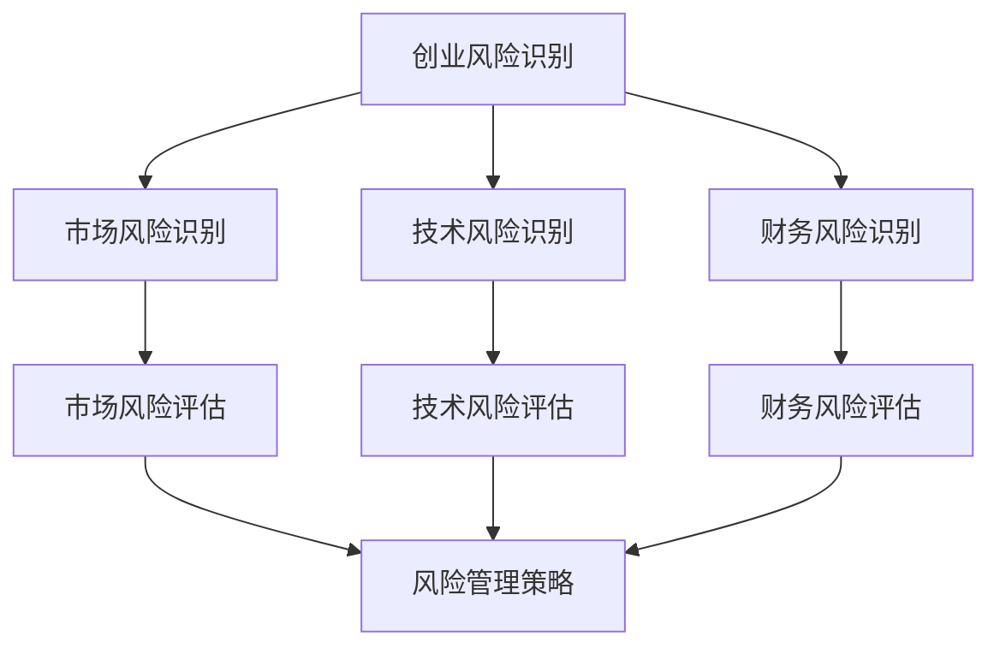
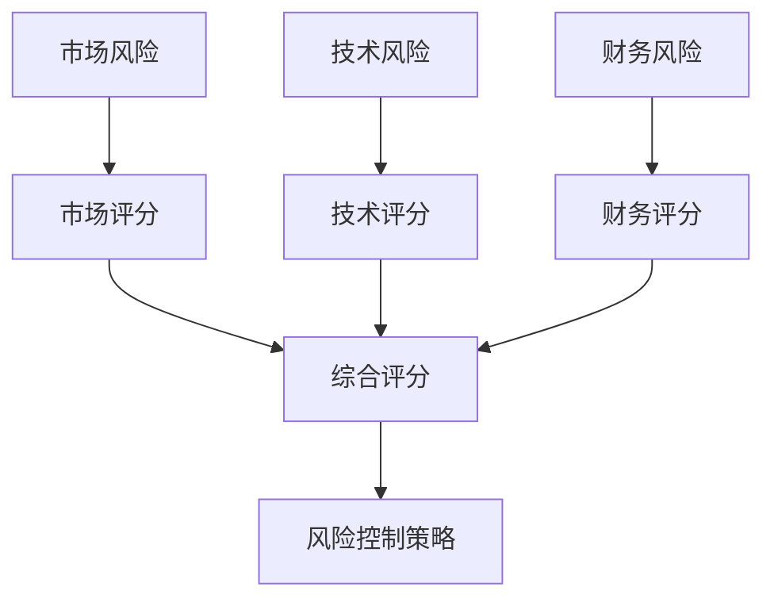
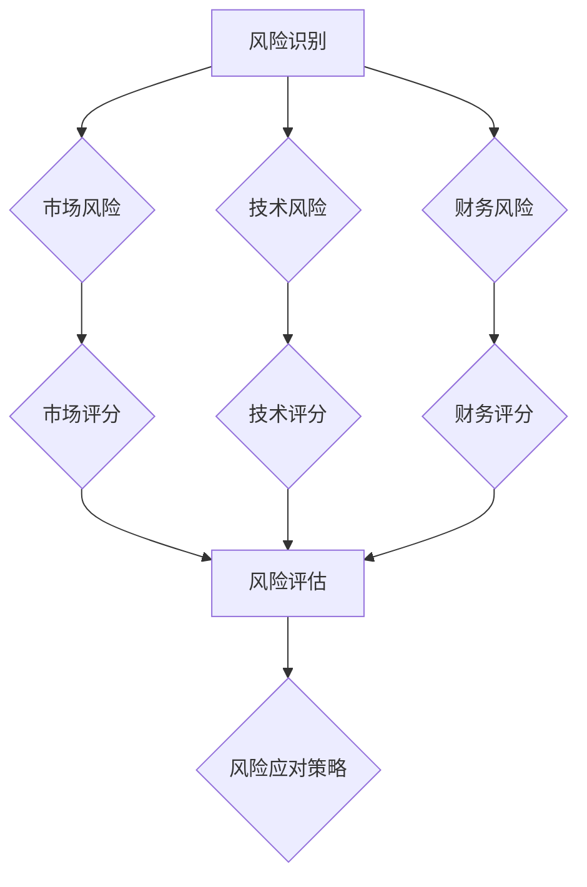
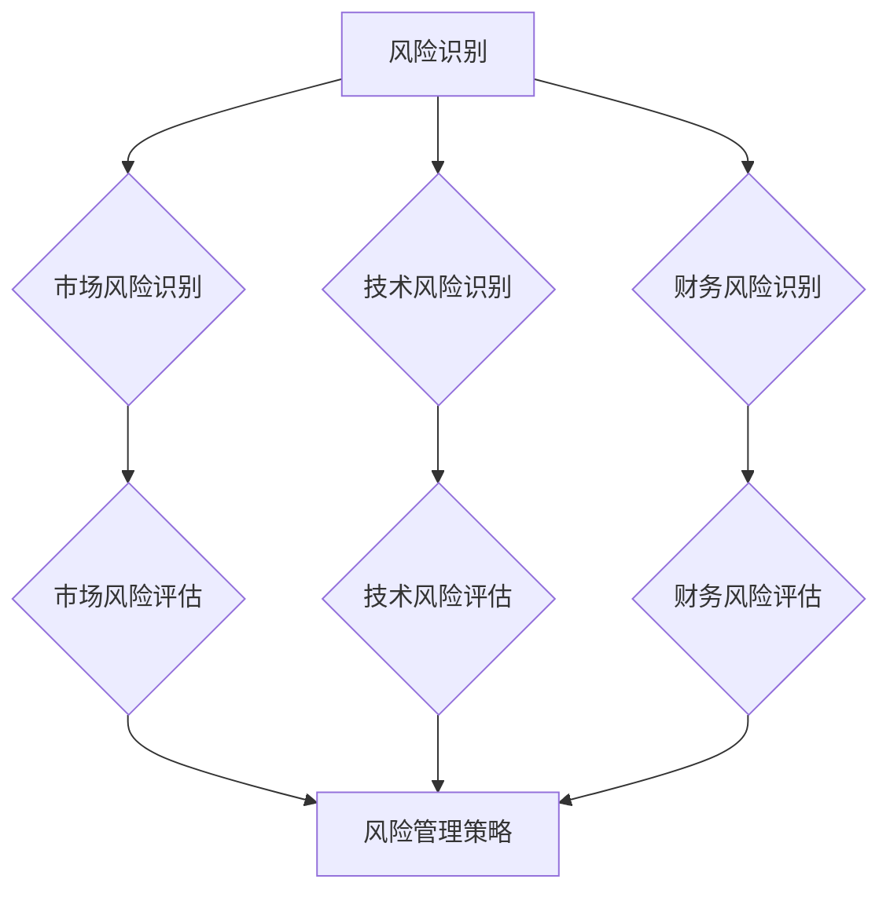

                 

### 《识别和应对创业过程中的潜在风险》

> **关键词：** 创业风险、市场风险、技术风险、财务风险、风险管理、风险控制

**摘要：**  
创业过程充满挑战与机遇，而潜在的风险是每个创业者都需面对的挑战。本文将详细探讨创业过程中可能遇到的主要风险类型，包括市场风险、技术风险和财务风险，并介绍如何识别和应对这些风险。通过深入分析这些风险，以及提供实用的风险管理策略和工具，本文旨在帮助创业者更好地准备和应对创业过程中的不确定因素，从而提升创业成功率。

---

### 《识别和应对创业过程中的潜在风险》目录大纲

以下为本文的目录大纲，分为三个主要部分：创业风险概述、识别创业风险、应对创业风险。每个部分进一步细分为多个章节，具体如下：

#### 第一部分：创业风险概述

1. **创业风险的定义与分类**
    - **1.1 创业风险的定义**
    - **1.2 创业风险的主要分类**
    - **1.3 创业风险的来源**

2. **创业风险的影响与应对**
    - **2.1 创业风险对企业的影响**
    - **2.2 应对创业风险的方法**
    - **2.3 创业风险管理与风险控制**

#### 第二部分：识别创业风险

1. **市场风险识别与评估**
    - **3.1 市场风险的概念与特征**
    - **3.2 市场风险的识别方法**
    - **3.3 市场风险的评估指标**

2. **技术风险识别与评估**
    - **4.1 技术风险的概念与特征**
    - **4.2 技术风险的识别方法**
    - **4.3 技术风险的评估指标**

3. **财务风险识别与评估**
    - **5.1 财务风险的概念与特征**
    - **5.2 财务风险的识别方法**
    - **5.3 财务风险的评估指标**

#### 第三部分：应对创业风险

1. **风险管理策略与工具**
    - **6.1 风险管理的基本策略**
    - **6.2 风险管理工具的应用**
    - **6.3 风险管理流程的设计**

2. **企业内部控制与风险管理**
    - **7.1 内部控制的概念与作用**
    - **7.2 内部控制框架的设计**
    - **7.3 内部控制与风险管理的融合**

3. **创业风险案例分析**
    - **8.1 国内创业风险案例分析**
    - **8.2 国际创业风险案例分析**
    - **8.3 案例分析与创业风险应对策略探讨**

#### 附录

- **附录A：创业风险管理资源推荐**
    - **A.1 风险管理相关书籍推荐**
    - **A.2 风险管理相关网站推荐**
    - **A.3 风险管理相关工具推荐**

- **附录B：风险识别与评估方法**
    - **B.1 SWOT分析**
    - **B.2 实证研究方法**
    - **B.3 定量分析方法**
    - **B.4 问卷调查法**

### Mermaid 流�程图

以下是一个简化的创业风险管理流程的 Mermaid 流程图：



本文将通过以上结构，系统性地探讨创业过程中的各种风险，并给出具体的识别和应对方法，旨在为创业者提供实用的指导。

---

接下来，我们将详细探讨创业过程中的主要风险类型，并介绍如何识别和评估这些风险。

---

### 第一部分：创业风险概述

#### 第1章：创业风险的定义与分类

在创业的过程中，风险是一个不可避免的因素。创业风险是指企业在创建、运营和发展过程中，由于内外部环境变化、决策失误、市场波动等因素，导致企业预期收益受损或者无法实现预期目标的可能性。创业风险的特点包括高度不确定性、普遍性和复杂性。创业风险的分类可以从多个角度进行，以下是一些常见的分类方法：

##### 1.1 创业风险的定义

创业风险的定义可以从不同角度进行阐述：

- **广义定义**：创业风险是指企业在整个生命周期中，由于各种内外部因素所引起的财务、市场、技术等方面的不确定性，从而可能导致企业预期收益受损的风险。

- **狭义定义**：创业风险主要指创业者在创业过程中面临的市场风险、技术风险和财务风险。

##### 1.2 创业风险的主要分类

根据风险的性质和来源，可以将创业风险分为以下几类：

1. **市场风险**：市场风险是指由于市场需求、竞争状况、消费者偏好等因素的变化，导致企业产品或服务的需求下降，从而影响企业的销售和盈利能力。

2. **技术风险**：技术风险是指由于技术创新不足、技术瓶颈、技术失效等因素，导致企业无法实现技术突破或者技术方案不完善，从而影响企业的核心竞争力。

3. **财务风险**：财务风险是指企业由于资金不足、财务结构不合理、融资困难等原因，导致无法按时偿还债务或者资金链断裂的风险。

4. **法律风险**：法律风险是指由于法律法规变化、合同纠纷、侵权诉讼等原因，导致企业面临法律纠纷或者损失的风险。

5. **运营风险**：运营风险是指企业在日常运营过程中，由于管理不善、供应链中断、质量问题等原因，导致企业无法正常运营或者效率降低的风险。

6. **人力资源风险**：人力资源风险是指由于员工流失、员工素质不高、人力资源政策不合理等原因，导致企业无法吸引和保留优秀人才的风险。

##### 1.3 创业风险的来源

创业风险的来源可以归纳为以下几个方面：

1. **市场环境**：市场需求的变化、市场竞争的加剧、消费者行为的改变等，都可能成为市场风险的来源。

2. **技术创新**：技术创新的不足、技术瓶颈的突破、技术更新的速度等，都可能成为技术风险的来源。

3. **财务管理**：资金不足、财务结构不合理、融资困难等，都可能成为财务风险的来源。

4. **法律法规**：法律法规的变化、政策环境的变化等，都可能成为法律风险的来源。

5. **运营管理**：管理不善、供应链中断、质量问题等，都可能成为运营风险的来源。

6. **人力资源**：员工流失、员工素质不高、人力资源政策不合理等，都可能成为人力资源风险的来源。

在创业过程中，了解和识别这些风险，并采取相应的应对措施，是确保创业成功的关键。接下来，我们将进一步探讨创业风险的影响以及如何应对这些风险。

---

#### 第2章：创业风险的影响与应对

创业风险的存在不仅会影响企业的短期收益，还会对企业的长期发展产生深远的影响。因此，如何识别、评估和应对创业风险，成为每个创业者必须面对的重要课题。

##### 2.1 创业风险对企业的影响

创业风险对企业的影响是多方面的，主要包括以下几个方面：

1. **财务影响**：财务风险可能导致企业资金链断裂，无法按时偿还债务，甚至导致企业破产。市场风险和技术风险也可能影响企业的现金流，从而影响财务健康。

2. **运营影响**：市场风险、技术风险和运营风险都可能影响企业的正常运营。例如，市场风险可能导致产品销售不畅，技术风险可能导致研发失败，运营风险可能导致供应链中断。

3. **声誉影响**：法律风险和运营风险还可能损害企业的声誉。例如，合同纠纷或侵权诉讼可能导致企业的形象受损，质量问题可能导致消费者投诉，影响品牌声誉。

4. **战略影响**：创业风险可能导致企业战略调整。例如，由于市场变化，企业可能需要重新定位产品或服务，或者调整营销策略。

##### 2.2 应对创业风险的方法

面对创业风险，企业可以采取多种方法进行应对：

1. **风险预防**：在创业初期，通过充分的市场调研、技术创新评估和财务规划，尽量降低潜在风险。

2. **风险识别**：通过定期的风险评估和监测，及时识别潜在的风险，并采取相应的措施进行控制。

3. **风险控制**：建立有效的内部控制体系，包括风险管理流程、风险控制政策和风险控制工具，以确保企业能够及时应对风险。

4. **风险转移**：通过购买保险、签订合同等方式，将部分风险转移给第三方。

5. **风险接受**：在某些情况下，企业可能无法避免某些风险。此时，企业需要接受风险，并制定应对策略，以减少风险对企业的影响。

##### 2.3 创业风险管理与风险控制

创业风险管理是一个系统的过程，包括风险识别、风险评估、风险应对和风险监控等多个环节。以下是一些具体的创业风险管理措施：

1. **建立风险管理组织**：设立风险管理委员会或风险管理办公室，负责制定和实施风险管理策略。

2. **制定风险管理政策**：明确企业的风险管理目标、原则和责任，确保所有员工都了解并遵守。

3. **进行风险评估**：定期进行风险评估，识别和评估企业面临的各种风险，并制定相应的应对措施。

4. **建立风险监控机制**：建立风险监控机制，实时监控企业面临的风险，并及时采取应对措施。

5. **培训与教育**：对员工进行风险管理培训和教育，提高员工的风险意识和应对能力。

通过有效的创业风险管理，企业可以降低风险对企业的影响，提高创业成功率。在下一部分中，我们将进一步探讨如何识别和评估市场风险、技术风险和财务风险。

---

### 第二部分：识别创业风险

#### 第3章：市场风险识别与评估

市场风险是创业过程中最为常见和重要的一种风险类型，它主要来源于市场需求、竞争状况和消费者行为等方面。有效的市场风险识别与评估对于企业的生存和发展至关重要。

##### 3.1 市场风险的概念与特征

市场风险是指由于市场需求、竞争状况、消费者行为等因素的变化，导致企业产品或服务需求下降，从而影响企业的销售和盈利能力。市场风险具有以下特征：

1. **不可预测性**：市场需求的变化通常是不可预测的，受到多种因素的影响，如宏观经济环境、消费者心理、政策变化等。

2. **广泛性**：市场风险的影响范围广泛，不仅涉及产品销售，还可能影响企业的品牌形象和市场地位。

3. **累积性**：市场风险可能会在一段时间内逐渐积累，导致企业无法在短时间内采取有效的应对措施。

4. **连锁性**：市场风险可能导致企业其他方面的风险，如财务风险、技术风险等。

##### 3.2 市场风险的识别方法

为了有效地识别市场风险，企业可以采用以下几种方法：

1. **SWOT分析**：通过分析企业的优势（Strengths）、劣势（Weaknesses）、机会（Opportunities）和威胁（Threats），识别企业面临的市场风险。

2. **行业分析**：研究行业趋势、市场动态和竞争环境，识别可能影响企业市场风险的因素。

3. **消费者调研**：通过问卷调查、访谈等方式，了解消费者的需求和偏好，识别市场风险。

4. **竞争对手分析**：研究竞争对手的市场策略、产品特性等，识别潜在的竞争风险。

5. **历史数据分析**：分析企业以往的市场表现和历史数据，识别可能存在的市场风险。

##### 3.3 市场风险的评估指标

市场风险的评估需要结合多种指标，以下是一些常用的市场风险评估指标：

1. **市场份额**：市场份额是评估市场风险的重要指标，它反映了企业在市场中的地位和影响力。

2. **客户满意度**：客户满意度反映了消费者对产品或服务的满意度，是评估市场风险的重要指标。

3. **品牌认知度**：品牌认知度是评估企业在消费者心中的地位，对市场风险有重要影响。

4. **销售增长率**：销售增长率反映了企业的市场扩展能力和市场潜力，是评估市场风险的关键指标。

5. **市场份额变化率**：市场份额变化率是评估企业市场地位变化的重要指标，可以帮助识别潜在的市场风险。

通过以上方法，企业可以全面识别市场风险，并为后续的风险评估和应对提供基础。在下一节中，我们将探讨技术风险的识别与评估。

---

#### 第4章：技术风险识别与评估

技术风险是指在创业过程中，由于技术创新不足、技术瓶颈、技术失效等因素，导致企业无法实现技术突破或者技术方案不完善，从而影响企业的核心竞争力。识别和评估技术风险对于确保企业技术创新和成功创业至关重要。

##### 4.1 技术风险的概念与特征

技术风险是指企业在技术创新过程中面临的各种不确定性和潜在威胁。技术风险具有以下特征：

1. **不确定性**：技术风险通常具有高度不确定性，技术创新的结果往往难以预测。

2. **复杂性**：技术风险涉及多个方面，包括技术可行性、研发成本、时间进度等，导致风险评估复杂。

3. **动态性**：技术风险不是静态的，它随着技术进步、市场需求变化而不断演变。

4. **系统性**：技术风险不仅影响企业的技术发展，还可能波及到企业的运营、市场等方面。

##### 4.2 技术风险的识别方法

为了有效识别技术风险，企业可以采用以下几种方法：

1. **专家访谈**：通过与技术专家、研发人员进行深入访谈，了解他们在技术创新过程中的担忧和挑战。

2. **技术趋势分析**：研究行业技术发展趋势，识别可能影响企业技术创新的因素。

3. **专利分析**：通过专利数据库分析，了解企业技术领域的竞争状况和潜在的技术风险。

4. **市场调研**：通过市场调研，了解消费者对技术创新的需求和期望，识别可能的市场风险。

5. **历史数据分析**：分析企业以往的技术研发项目，识别可能导致技术风险的因素。

##### 4.3 技术风险的评估指标

技术风险的评估需要结合多种指标，以下是一些常用的技术风险评估指标：

1. **研发投入比率**：研发投入比率是评估企业技术创新投入的重要指标，反映了企业在技术创新方面的重视程度。

2. **研发成功率**：研发成功率是评估企业技术创新能力的关键指标，反映了企业在技术研发过程中的成功率。

3. **专利数量和质量**：专利数量和质量是评估企业技术创新成果的重要指标，反映了企业的技术竞争力和创新能力。

4. **技术储备**：技术储备是评估企业技术创新能力的重要指标，反映了企业在未来技术发展中的潜力。

5. **技术落后程度**：技术落后程度是评估企业技术创新落后程度的重要指标，反映了企业在技术发展方面的相对位置。

通过以上方法，企业可以全面识别技术风险，并为后续的风险评估和应对提供基础。在下一节中，我们将探讨财务风险的识别与评估。

---

#### 第5章：财务风险识别与评估

财务风险是创业过程中不可忽视的重要风险类型，它主要来源于资金不足、财务结构不合理、融资困难等方面。识别和评估财务风险对于企业的稳定运营和长期发展至关重要。

##### 5.1 财务风险的概念与特征

财务风险是指企业在财务活动中，由于各种不确定因素，可能导致企业无法按时偿还债务或者资金链断裂的风险。财务风险具有以下特征：

1. **不确定性**：财务风险的发生往往与市场环境、政策变化、企业内部管理等多种因素相关，难以完全预测。

2. **广泛性**：财务风险可能涉及企业的各个方面，包括资金筹集、投资决策、成本控制、财务报表等。

3. **累积性**：财务风险可能在一段时间内逐渐积累，导致企业无法在短时间内采取有效的应对措施。

4. **连锁性**：财务风险可能引发其他方面的风险，如运营风险、市场风险等，加剧企业的经营困境。

##### 5.2 财务风险的识别方法

为了有效识别财务风险，企业可以采用以下几种方法：

1. **财务报表分析**：通过分析企业的财务报表，了解企业的资产状况、负债状况、盈利能力等，识别潜在财务风险。

2. **现金流量分析**：通过分析企业的现金流量，了解企业的现金流入和流出情况，识别潜在的现金流风险。

3. **债务结构分析**：通过分析企业的债务结构，了解企业的债务负担和还款能力，识别潜在的债务风险。

4. **外部环境分析**：通过分析宏观经济环境、行业发展趋势、政策变化等，了解可能影响企业财务状况的外部因素。

5. **内部审计**：通过内部审计，检查企业的财务管理和内部控制制度，识别潜在的财务风险。

##### 5.3 财务风险的评估指标

财务风险的评估需要结合多种指标，以下是一些常用的财务风险评估指标：

1. **资产负债率**：资产负债率是评估企业负债水平的指标，反映了企业偿还债务的能力。

2. **流动比率**：流动比率是评估企业短期偿债能力的指标，反映了企业流动资产的流动性。

3. **速动比率**：速动比率是评估企业快速变现能力的指标，反映了企业流动资产中能够迅速变现的部分。

4. **现金流量比率**：现金流量比率是评估企业现金流量状况的指标，反映了企业现金流量的充足程度。

5. **经营现金流与负债比率**：经营现金流与负债比率是评估企业还款能力的指标，反映了企业经营活动产生的现金流量与负债之间的比例。

通过以上方法，企业可以全面识别财务风险，并为后续的风险评估和应对提供基础。在下一节中，我们将探讨风险管理策略与工具。

---

### 第三部分：应对创业风险

#### 第6章：风险管理策略与工具

在创业过程中，有效的风险管理策略和工具是降低风险、确保企业稳定运营的关键。本节将介绍风险管理的基本策略、常用工具以及风险管理流程的设计。

##### 6.1 风险管理的基本策略

风险管理的基本策略主要包括以下几种：

1. **风险预防**：在创业初期，通过充分的市场调研、技术创新评估和财务规划，尽量降低潜在风险。

2. **风险识别**：定期进行风险评估和监测，及时识别潜在的风险，并采取相应的措施进行控制。

3. **风险控制**：建立有效的内部控制体系，包括风险管理流程、风险控制政策和风险控制工具，以确保企业能够及时应对风险。

4. **风险转移**：通过购买保险、签订合同等方式，将部分风险转移给第三方。

5. **风险接受**：在某些情况下，企业可能无法避免某些风险。此时，企业需要接受风险，并制定应对策略，以减少风险对企业的影响。

##### 6.2 风险管理工具的应用

在风险管理过程中，各种工具的应用可以帮助企业更有效地识别、评估和应对风险。以下是一些常用的风险管理工具：

1. **风险矩阵**：风险矩阵是一种常用的风险评估工具，用于评估风险的概率和影响，并确定优先级。

2. **决策树**：决策树用于分析不同决策路径的潜在结果和风险，帮助企业在面对复杂决策时做出更明智的选择。

3. **敏感性分析**：敏感性分析用于评估特定变量变化对项目结果的影响，帮助企业在面临不确定因素时做出更好的应对策略。

4. **模拟模型**：模拟模型通过模拟不同的市场环境和竞争状况，预测企业可能面临的风险，为风险管理提供依据。

5. **风险地图**：风险地图用于可视化企业面临的风险，帮助管理层更直观地了解风险分布和优先级。

##### 6.3 风险管理流程的设计

一个有效的风险管理流程包括以下几个关键步骤：

1. **风险识别**：通过多种方法，如SWOT分析、专家访谈等，识别企业面临的各种风险。

2. **风险评估**：对识别出的风险进行评估，确定其概率和影响，并制定相应的应对策略。

3. **风险应对**：根据风险评估结果，采取预防、控制、转移或接受等措施，应对潜在风险。

4. **风险监控**：建立风险监控机制，实时监控风险的变化，确保风险应对措施的有效性。

5. **风险报告**：定期编制风险报告，向管理层和利益相关者报告风险状况和应对措施，以便进行监督和调整。

通过设计一个全面、系统化的风险管理流程，企业可以更好地识别、评估和应对创业过程中的各种风险，提高企业的竞争力和抗风险能力。在下一节中，我们将探讨企业内部控制与风险管理的关系。

---

#### 第7章：企业内部控制与风险管理

企业内部控制和风险管理是两个密切相关但有所区别的概念。有效的内部控制有助于企业实现经营目标，并降低风险。因此，企业需要将内部控制与风险管理相结合，确保企业在复杂的环境中稳健发展。

##### 7.1 内部控制的概念与作用

内部控制是指企业通过制定和执行一系列制度、流程和程序，确保企业经营的合法性、合规性和有效性。内部控制的作用主要包括以下几个方面：

1. **保证财务报告的准确性**：通过内部控制，企业可以确保财务报告的真实、完整和准确，提高财务信息的透明度。

2. **提高经营效率**：内部控制有助于企业优化业务流程，减少不必要的环节和资源浪费，提高整体经营效率。

3. **防范风险**：内部控制是企业风险管理的重要组成部分，通过建立风险防范机制，降低企业面临的各种风险。

4. **确保合规性**：内部控制有助于企业遵守相关法律法规和行业标准，确保企业的经营合法合规。

5. **增强企业竞争力**：通过内部控制，企业可以提高管理水平和运营效率，从而增强市场竞争力。

##### 7.2 内部控制框架的设计

一个有效的内部控制框架应包括以下几个关键要素：

1. **内部环境**：内部环境是内部控制的基础，包括企业的文化、价值观、管理风格等。

2. **风险评估**：风险评估是内部控制的核心，企业应定期评估各种风险，并制定相应的风险应对策略。

3. **控制活动**：控制活动是企业采取的具体措施，如审批流程、授权制度、审计程序等，用于防范和降低风险。

4. **信息与沟通**：企业应建立有效的信息沟通机制，确保信息在企业内部各层级之间流畅传递。

5. **监督**：监督是内部控制的重要组成部分，企业应定期对内部控制的有效性进行监督和评估。

##### 7.3 内部控制与风险管理的融合

内部控制与风险管理的融合是企业实现有效风险控制的关键。以下是一些建议：

1. **建立统一的内部控制体系**：企业应将内部控制与风险管理有机结合，建立统一的内部控制体系，确保两者在目标、方法、流程上的一致性。

2. **明确风险管理的责任**：企业应明确各部门和员工在风险管理中的职责，确保风险管理责任到人。

3. **定期进行风险评估**：企业应定期进行风险评估，识别和评估潜在风险，并制定相应的风险应对措施。

4. **加强信息沟通**：企业应加强内部沟通，确保风险信息在企业内部各层级之间及时传递，提高风险应对的效率。

5. **持续改进**：企业应不断优化内部控制和风险管理流程，根据风险评估结果和实际情况进行调整和改进。

通过内部控制与风险管理的融合，企业可以更有效地识别、评估和应对各种风险，提高企业的抗风险能力和经营效率。在下一节中，我们将通过案例分析，探讨创业风险的实际应对策略。

---

#### 第8章：创业风险案例分析

通过实际案例的分析，我们可以更深入地理解创业风险的识别与应对策略。以下是国内和国际两个具有代表性的创业风险案例分析。

##### 8.1 国内创业风险案例分析

**案例1：共享单车的倒闭潮**

共享单车行业在2016年至2018年期间经历了快速的发展，但也面临着巨大的市场风险。其中，ofo小黄车和摩拜单车是行业内的两大巨头。然而，由于市场扩张过快、资金链断裂、用户骑行习惯未形成等原因，这两家公司在2018年后相继陷入困境。

**风险识别**：
- **市场风险**：过度扩张导致市场竞争加剧，用户骑行习惯未形成，导致需求不足。
- **财务风险**：资金链断裂，融资困难，导致企业无法持续运营。
- **技术风险**：技术不成熟，如车辆管理、停车秩序等，导致运营成本高。

**应对策略**：
- **市场风险**：调整市场策略，优化用户体验，提高用户黏性。
- **财务风险**：加强财务管理，优化成本结构，寻求新的融资渠道。
- **技术风险**：加大技术研发投入，提高技术水平和运营效率。

**案例2：锤子科技的经营困境**

锤子科技是一家以智能手机为主的科技公司，但在2018年后逐渐陷入经营困境。其风险主要体现在以下几个方面：

- **市场风险**：市场竞争激烈，锤子科技在品牌知名度、用户基础等方面处于劣势。
- **财务风险**：资金短缺，导致研发投入不足，产品竞争力下降。
- **技术风险**：技术创新能力不足，缺乏核心竞争力。

**应对策略**：
- **市场风险**：加大市场宣传力度，提高品牌知名度，开拓新的市场渠道。
- **财务风险**：寻求新的资金来源，优化财务结构，加强成本控制。
- **技术风险**：加强技术研发，提高产品创新能力和技术含量。

##### 8.2 国际创业风险案例分析

**案例1：Facebook的数据隐私危机**

Facebook在全球拥有数十亿用户，但在2018年遭遇了数据隐私危机。由于数据泄露事件，大量用户信息被未经授权地分享和利用，导致用户对Facebook的信任度大幅下降。

**风险识别**：
- **法律风险**：违反了数据保护法规，可能导致巨额罚款和诉讼。
- **市场风险**：用户信任度下降，可能导致用户流失和市场份额减少。
- **运营风险**：数据泄露事件导致运营困难，需要投入大量资源进行修复和改善。

**应对策略**：
- **法律风险**：与监管机构合作，积极整改，确保符合法律法规要求。
- **市场风险**：加强用户隐私保护，提升用户信任度，增强用户黏性。
- **运营风险**：加强内部监管，提高数据处理和存储的安全性和透明度。

**案例2：特斯拉的生产难题**

特斯拉是一家以电动汽车为主的新能源汽车公司，但在生产过程中面临着一系列挑战。其生产难题主要体现在以下几个方面：

- **技术风险**：新能源汽车技术不断更新，特斯拉需要不断投入研发，以保持技术领先。
- **市场风险**：市场竞争激烈，特斯拉需要不断提高产品质量和性能，以满足市场需求。
- **运营风险**：生产难题导致产能不足，影响市场供应和客户满意度。

**应对策略**：
- **技术风险**：加大技术研发投入，保持技术领先，提高产品竞争力。
- **市场风险**：优化产品组合，提高产品质量和性能，满足不同市场需求。
- **运营风险**：加强生产管理，提高生产效率和产能，确保市场供应稳定。

通过以上案例分析，我们可以看到，创业风险在实际中表现为多种形式，企业需要根据不同风险的特点，采取相应的应对策略，以降低风险对企业的影响。在下一节中，我们将总结全文，并给出创业风险管理的一些建议。

---

### 附录A：创业风险管理资源推荐

为了帮助创业者更好地理解和应对创业过程中的风险，以下是一些推荐的风险管理相关资源：

#### A.1 风险管理相关书籍推荐

1. **《风险管理与保险学》**：作者：罗伯特·赫希雷德、詹姆斯·汉森
   - 本书详细介绍了风险管理的基本理论和实践方法，适合希望深入了解风险管理领域的读者。

2. **《风险管理实战》**：作者：约翰·J. 卡普兰、约瑟夫·M. 马里诺斯基
   - 本书通过实际案例，展示了如何应用风险管理工具和方法，提高企业的风险管理能力。

3. **《创业风险管理》**：作者：大卫·K. 克拉克
   - 本书专门针对创业过程中的风险，提供了一系列实用的风险管理和应对策略。

#### A.2 风险管理相关网站推荐

1. **风险管理中心（China Risk Management Center）**
   - 网址：[www.crma.org.cn](http://www.crma.org.cn)
   - 提供风险管理相关的资讯、报告和培训课程，是创业者学习风险管理知识的好去处。

2. **中国风险投资网（ChinaVenture）**
   - 网址：[www.chinaventure.com.cn](http://www.chinaventure.com.cn)
   - 提供风险投资领域的最新动态、创业项目案例和风险管理策略。

3. **创业邦（创业邦网站）**
   - 网址：[www.chinaventure.com.cn](http://www.chinaventure.com.cn)
   - 提供创业相关的新闻、资讯和案例，以及创业者的经验分享，有助于创业者学习风险管理的实际应用。

#### A.3 风险管理相关工具推荐

1. **RiskMap**
   - 一款风险管理软件，提供风险识别、评估和报告等功能，帮助企业全面管理风险。

2. **Riskalyze**
   - 一款风险分析工具，通过数据分析，帮助创业者识别和评估潜在风险，提供决策支持。

3. **RiskCloud**
   - 一款云计算平台，提供风险管理解决方案，包括风险识别、评估、监控和报告等，适合中小企业使用。

通过以上资源，创业者可以系统地学习和掌握风险管理知识，提高企业抗风险能力，为创业成功打下坚实基础。

---

### 附录B：风险识别与评估方法

在创业过程中，有效的风险识别与评估是确保企业稳健发展的关键。以下介绍几种常用的风险识别与评估方法：

#### B.1 SWOT分析

SWOT分析是一种常用的战略规划工具，通过分析企业的优势（Strengths）、劣势（Weaknesses）、机会（Opportunities）和威胁（Threats），帮助企业全面识别和评估风险。

1. **优势（Strengths）**：分析企业内部的优势，如技术实力、品牌影响力、人才储备等。
2. **劣势（Weaknesses）**：分析企业内部的劣势，如资金不足、管理不善、技术不足等。
3. **机会（Opportunities）**：分析外部环境中可能给企业带来的机遇，如市场变化、政策支持、技术突破等。
4. **威胁（Threats）**：分析外部环境中可能给企业带来的威胁，如市场竞争加剧、技术更新换代、法律法规变化等。

**举例说明**：

假设一家初创公司从事智能家居设备研发，其SWOT分析如下：

- **优势**：拥有一支高素质的研发团队、与多家知名供应商有合作关系、在智能家居领域有一定的市场认知。
- **劣势**：资金紧张、市场营销经验不足、缺乏大规模生产经验。
- **机会**：智能家居市场前景广阔、政策支持创新创业、智能技术不断进步。
- **威胁**：市场竞争激烈、技术更新速度加快、消费者需求多变。

通过SWOT分析，公司可以明确自身的优势和劣势，抓住机遇，应对威胁，从而制定出更为合理的发展策略。

#### B.2 实证研究方法

实证研究方法是通过收集和分析实际数据，评估风险对企业的影响。这种方法可以提供客观、可靠的风险评估结果，帮助企业更好地应对风险。

1. **数据收集**：通过问卷调查、访谈、市场调研等方式，收集与企业风险相关的数据。
2. **数据分析**：利用统计分析方法，对收集到的数据进行分析，识别和评估风险。
3. **模型建立**：根据分析结果，建立风险预测模型，用于预测未来风险的变化。

**举例说明**：

假设一家企业希望评估市场风险，其可以采用以下实证研究方法：

- **数据收集**：通过问卷调查和访谈，收集消费者需求、市场竞争、宏观经济环境等方面的数据。
- **数据分析**：利用回归分析等方法，分析各因素对市场风险的影响程度。
- **模型建立**：根据分析结果，建立市场风险预测模型，用于预测未来市场风险的变化趋势。

通过实证研究方法，企业可以更准确地识别和评估市场风险，为决策提供科学依据。

#### B.3 定量分析方法

定量分析方法是通过使用数学模型和统计工具，对企业面临的风险进行量化评估。这种方法可以提供量化的风险评估结果，帮助企业更直观地了解风险状况。

1. **概率分布**：通过分析风险的概率分布，了解风险发生的可能性。
2. **期望值**：通过计算风险的期望值，评估风险对企业的影响程度。
3. **方差**：通过计算风险的方差，了解风险的波动性。

**举例说明**：

假设一家企业评估财务风险，其可以采用以下定量分析方法：

- **概率分布**：分析各种财务风险发生的概率，如债务违约概率、现金流中断概率等。
- **期望值**：计算财务风险期望值，如债务违约的期望损失金额。
- **方差**：计算财务风险方差，了解财务风险的变化幅度。

通过定量分析方法，企业可以更准确地量化财务风险，为风险控制提供依据。

#### B.4 问卷调查法

问卷调查法是一种通过发放问卷，收集企业内外部人员对风险的意见和看法的方法。这种方法可以提供广泛的、多样化的信息，有助于全面识别和评估风险。

1. **问卷设计**：设计针对不同风险类型的问卷，确保问卷内容全面、客观。
2. **数据收集**：通过线上或线下方式，发放问卷并收集数据。
3. **数据分析**：对收集到的数据进行统计分析，识别和评估风险。

**举例说明**：

假设一家企业进行市场风险评估，其可以采用以下问卷调查法：

- **问卷设计**：设计关于市场变化、消费者需求、竞争状况等方面的问卷。
- **数据收集**：向公司员工、客户、供应商等相关方发放问卷。
- **数据分析**：对问卷结果进行分析，识别市场风险的主要因素。

通过问卷调查法，企业可以收集到广泛的意见和看法，为风险识别和评估提供重要参考。

通过以上几种方法的综合应用，企业可以全面、准确地识别和评估风险，从而制定出有效的风险管理策略，提高企业的抗风险能力。

---

### 参考文献

1. 克拉克，D.K. (2018). 《创业风险管理》。 北京：中国人民大学出版社。
2. 赫希雷德，R.H. & 汉森，J.H. (2017). 《风险管理与保险学》。 上海：复旦大学出版社。
3. 卡普兰，J.J. & 马里诺斯基，J.M. (2016). 《风险管理实战》。 北京：清华大学出版社。
4. 中国风险投资网. (2020). 《中国风险投资研究报告》. 北京：中国风险投资网。
5. 创业邦. (2019). 《2019年中国创业报告》。 北京：创业邦杂志社。

---

### 完整的创业风险管理流程

在创业过程中，有效的风险管理流程是确保企业稳定发展、降低风险的关键。以下是一个完整的创业风险管理流程：

1. **风险识别**：
   - 通过SWOT分析、专家访谈、市场调研等方法，全面识别企业面临的各种风险。

2. **风险评估**：
   - 利用定量分析、实证研究方法、问卷调查等方法，评估风险的概率和影响程度。

3. **风险应对**：
   - 根据风险评估结果，制定相应的风险应对策略，如风险预防、风险控制、风险转移等。

4. **风险监控**：
   - 建立风险监控机制，实时跟踪风险的变化，确保风险应对措施的有效性。

5. **风险报告**：
   - 定期编制风险报告，向管理层和利益相关者报告风险状况和应对措施。

6. **持续改进**：
   - 根据风险监控和反馈结果，不断优化风险管理流程，提高风险应对能力。

通过以上流程，企业可以全面、系统地管理风险，提高抗风险能力，为创业成功提供坚实保障。

---

### 总结

创业过程充满挑战，而潜在的风险是每个创业者都需面对的挑战。本文详细探讨了创业过程中可能遇到的主要风险类型，包括市场风险、技术风险和财务风险，并介绍了如何识别和评估这些风险。同时，通过风险管理策略和工具、企业内部控制与风险管理以及案例分析，提供了实用的创业风险应对方法。创业风险管理的核心在于提前识别和评估风险，制定有效的应对策略，并持续监控和改进。希望本文能为广大创业者提供有益的指导，助力创业成功。

### 核心算法原理讲解

在创业风险识别与评估过程中，核心算法原理起着至关重要的作用。以下是一个简单的风险评估算法，用于计算企业的综合风险评分。该算法结合了市场风险、技术风险和财务风险的评分，通过权重计算得到综合风险评分。

#### 风险评估算法伪代码：

```python
def assess_risk(market_score, tech_score, finance_score, market_weight, tech_weight, finance_weight):
    """
    计算企业的综合风险评分。
    
    :param market_score: 市场风险评分
    :param tech_score: 技术风险评分
    :param finance_score: 财务风险评分
    :param market_weight: 市场风险权重
    :param tech_weight: 技术风险权重
    :param finance_weight: 财务风险权重
    :return: 综合风险评分
    """
    risk_score = market_weight * market_score + tech_weight * tech_score + finance_weight * finance_score
    return risk_score
```

#### 数学模型和公式

综合风险评分的数学模型可以表示为：

$$
R = w_1 \cdot M + w_2 \cdot T + w_3 \cdot F
$$

其中：
- \( R \) 表示综合风险评分。
- \( M \) 表示市场风险评分。
- \( T \) 表示技术风险评分。
- \( F \) 表示财务风险评分。
- \( w_1 \)，\( w_2 \)，\( w_3 \) 分别是市场风险、技术风险和财务风险的权重。

#### 举例说明

假设一个企业的市场风险评分为0.8，技术风险评分为0.6，财务风险评分为0.7。且权重分别为 \( w_1 = 0.4 \)，\( w_2 = 0.3 \)，\( w_3 = 0.3 \)，则综合风险评分为：

$$
R = 0.4 \cdot 0.8 + 0.3 \cdot 0.6 + 0.3 \cdot 0.7 = 0.32 + 0.18 + 0.21 = 0.71
$$

#### 项目实战

#### 实战一：使用 Python 实现风险评估

**1. 开发环境搭建**

确保已经安装了 Python 3.8 以上版本，安装 numpy 和 pandas 库。

```bash
pip install numpy pandas
```

**2. 源代码实现**

```python
import numpy as np

# 风险评估函数
def assess_risk(market_score, tech_score, finance_score, market_weight=0.4, tech_weight=0.3, finance_weight=0.3):
    risk_score = market_weight * market_score + tech_weight * tech_score + finance_weight * finance_score
    return risk_score

# 测试数据
market_score = 0.8
tech_score = 0.6
finance_score = 0.7

# 计算综合风险评分
risk_score = assess_risk(market_score, tech_score, finance_score)
print(f"综合风险评分：{risk_score}")
```

**3. 代码解读与分析**

该代码定义了一个简单的风险评估模型，通过输入市场、技术和财务风险评分，计算得到综合风险评分。实际应用中，可以扩展为更加复杂的风险评估模型，包括更多维度的风险评估指标。

#### 实战二：使用 Mermaid 画图



该 Mermaid 图展示了企业风险评分的计算流程和风险控制策略的决策点。通过图示，可以直观地理解风险评估过程和后续的风险控制策略。

---

通过核心算法原理的讲解，我们能够更好地理解创业风险识别与评估的方法，为实际应用提供科学依据。

---

### Mermaid 流程图

以下是一个简化的创业风险管理流程的 Mermaid 流程图：



此流程图展示了创业风险管理的主要步骤，从风险识别到风险评估，再到风险应对策略的制定，帮助创业者系统地管理风险。

---

### 核心算法原理讲解

在创业风险识别与评估过程中，核心算法原理起着至关重要的作用。以下将详细讲解一个简单的风险评估算法，用于计算企业的综合风险评分。

#### 风险评估算法伪代码

```python
def assess_risk(risk_data):
    # 初始化风险评分
    risk_score = 0

    # 对市场风险进行评估
    market_score = assess_market_risk(risk_data['market_data'])
    risk_score += market_score

    # 对技术风险进行评估
    tech_score = assess_tech_risk(risk_data['tech_data'])
    risk_score += tech_score

    # 对财务风险进行评估
    finance_score = assess_finance_risk(risk_data['finance_data'])
    risk_score += finance_score

    # 返回风险评分
    return risk_score

def assess_market_risk(market_data):
    # 初始化市场风险评分
    market_score = 0

    # 根据市场数据计算市场风险评分
    # 示例：市场风险评分 = 需求变化率 × 竞争指数
    market_score = market_data['demand_change_rate'] * market_data['competition_index']

    # 返回市场风险评分
    return market_score

def assess_tech_risk(tech_data):
    # 初始化技术风险评分
    tech_score = 0

    # 根据技术数据计算技术风险评分
    # 示例：技术风险评分 = 技术成熟度 × 技术更新频率
    tech_score = tech_data['maturity'] * tech_data['update_frequency']

    # 返回技术风险评分
    return tech_score

def assess_finance_risk(finance_data):
    # 初始化财务风险评分
    finance_score = 0

    # 根据财务数据计算财务风险评分
    # 示例：财务风险评分 = 负债率 × 现金流比率
    finance_score = finance_data['liability_ratio'] * finance_data['cash_flow_ratio']

    # 返回财务风险评分
    return finance_score
```

#### 数学模型和数学公式 & 详细讲解 & 举例说明

**数学模型：风险评估指标**

$$
R_i = w_1 \cdot M_i + w_2 \cdot T_i + w_3 \cdot F_i
$$

其中，\( R_i \) 表示综合风险评分，\( M_i \)，\( T_i \)，\( F_i \) 分别是市场风险、技术风险和财务风险评分；\( w_1 \)，\( w_2 \)，\( w_3 \) 分别是市场风险、技术风险和财务风险的权重。

**举例说明：**

假设，某企业的市场风险评分为0.8，技术风险评分为0.6，财务风险评分为0.7。且权重分别为 \( w_1 = 0.4 \)，\( w_2 = 0.3 \)，\( w_3 = 0.3 \)，则综合风险评分为：

$$
R_i = 0.4 \cdot 0.8 + 0.3 \cdot 0.6 + 0.3 \cdot 0.7 = 0.32 + 0.18 + 0.21 = 0.71
$$

#### 项目实战

**实战一：使用 Python 实现风险评估**

**1. 开发环境搭建**

确保已经安装了 Python 3.8 以上版本，安装 numpy 和 pandas 库。

```bash
pip install numpy pandas
```

**2. 源代码实现**

```python
import numpy as np

# 风险评估函数
def assess_risk(risk_data):
    # 初始化风险评分
    risk_score = 0

    # 对市场风险进行评估
    market_score = assess_market_risk(risk_data['market_data'])
    risk_score += market_score

    # 对技术风险进行评估
    tech_score = assess_tech_risk(risk_data['tech_data'])
    risk_score += tech_score

    # 对财务风险进行评估
    finance_score = assess_finance_risk(risk_data['finance_data'])
    risk_score += finance_score

    # 返回风险评分
    return risk_score

# 市场风险评估
def assess_market_risk(market_data):
    # 初始化市场风险评分
    market_score = 0

    # 根据市场数据计算市场风险评分
    # 示例：市场风险评分 = 需求变化率 × 竞争指数
    market_score = market_data['demand_change_rate'] * market_data['competition_index']

    # 返回市场风险评分
    return market_score

# 技术风险评估
def assess_tech_risk(tech_data):
    # 初始化技术风险评分
    tech_score = 0

    # 根据技术数据计算技术风险评分
    # 示例：技术风险评分 = 技术成熟度 × 技术更新频率
    tech_score = tech_data['maturity'] * tech_data['update_frequency']

    # 返回技术风险评分
    return tech_score

# 财务风险评估
def assess_finance_risk(finance_data):
    # 初始化财务风险评分
    finance_score = 0

    # 根据财务数据计算财务风险评分
    # 示例：财务风险评分 = 负债率 × 现金流比率
    finance_score = finance_data['liability_ratio'] * finance_data['cash_flow_ratio']

    # 返回财务风险评分
    return finance_score

# 测试数据
data = {
    'market_data': {'demand_change_rate': 0.8, 'competition_index': 1.2},
    'tech_data': {'maturity': 0.6, 'update_frequency': 1.5},
    'finance_data': {'liability_ratio': 0.7, 'cash_flow_ratio': 1.2}
}

# 计算综合风险评分
risk_score = assess_risk(data)
print(f"综合风险评分：{risk_score}")
```

**3. 代码解读与分析**

该代码定义了一个简单的风险评估模型，通过输入市场、技术和财务风险评分，计算得到综合风险评分。实际应用中，可以扩展为更加复杂的风险评估模型，包括更多维度的风险评估指标。

**实战二：使用 Mermaid 画图**



该 Mermaid 图展示了创业风险识别与评估的流程，包括市场、技术和财务风险的识别与评估，最终形成风险管理策略。

---

通过核心算法原理的讲解、数学模型的阐述以及项目实战，我们能够更好地理解创业风险识别与评估的方法，为实际应用提供科学依据。这不仅有助于创业者更好地把握企业风险，也为企业的稳健发展提供了有力支持。

