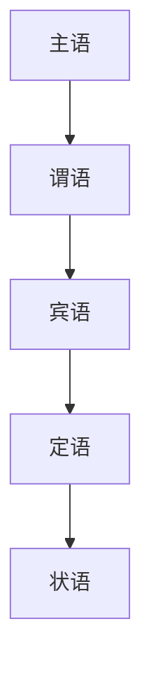
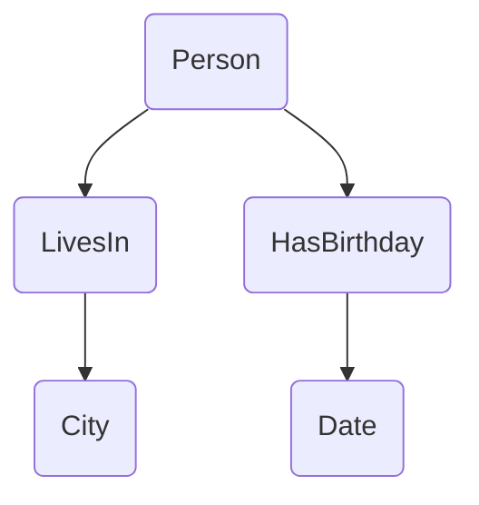
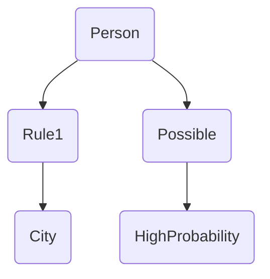
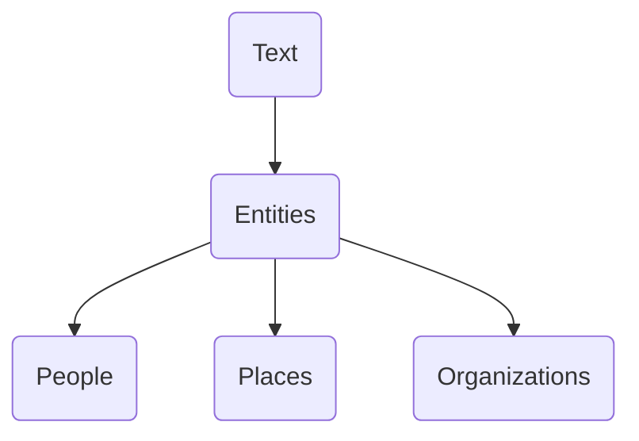
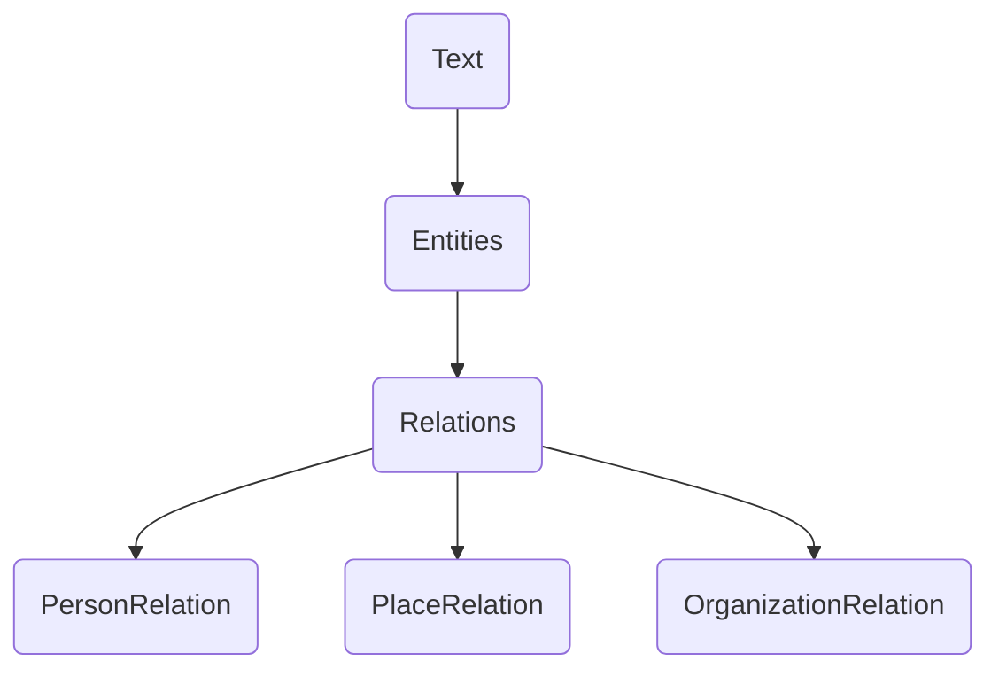

                 

# 文章标题：语义理解：深度探索与未来展望

> 关键词：语义理解，人工智能，自然语言处理，算法，应用场景，开源工具

> 摘要：
本文旨在深入探讨语义理解在人工智能领域的重要性、分类、算法原理和应用场景，以及未来发展趋势和挑战。通过详细阐述语义理解的定义、分类、算法原理、应用场景以及常用工具，帮助读者全面了解语义理解的现状和未来发展方向。

----------------------------------------------------------------

### 1.1 语义理解的定义与重要性

**语义理解**，顾名思义，是指计算机对自然语言文本进行解释和理解的过程，使其能够捕捉文本中的意图、含义和关系。在人工智能领域，语义理解被视为实现机器与人类高效交互的关键技术。通过语义理解，计算机能够更好地理解人类语言，从而在自然语言处理（NLP）、智能问答系统、智能客服、机器翻译和文本分类等多个应用场景中发挥重要作用。

#### 1.1.1 语义理解的定义

语义理解是一个多层次、多维度的过程，包括从字面意思到深层含义的多个层次。具体来说，它包括以下几个方面：

- **词义理解**：对单词、短语或符号进行解释，理解其在特定语言环境中的意义。
- **句法分析**：对句子结构进行分析，确定句子中各个成分之间的关系，如主语、谓语、宾语等。
- **语义角色标注**：对句子中的词汇进行语义标注，确定其在句子中的角色和功能。
- **语义消歧**：在多义环境下，通过上下文信息推断出单词或短语的正确含义。
- **语义融合**：将多个文本片段的语义进行整合，形成一个完整的语义表示。

#### 1.1.2 语义理解在人工智能中的应用

语义理解在人工智能领域有着广泛的应用，以下是其主要应用场景：

- **自然语言处理（NLP）**：语义理解是NLP的核心，用于文本分类、情感分析、命名实体识别和机器翻译等任务。
- **智能问答系统**：通过语义理解，智能问答系统能够准确理解用户的问题，并给出相关、准确的答案。
- **智能客服**：语义理解可以帮助智能客服系统更好地理解用户的意图，提高服务质量。
- **机器翻译**：语义理解是实现高质量机器翻译的关键，通过理解源语言和目标语言的语义，生成更自然的翻译结果。
- **文本分类**：语义理解可以帮助文本分类系统更准确地识别文本的主题和情感。

#### 1.1.3 语义理解的重要性

语义理解的重要性体现在以下几个方面：

1. **提高机器对自然语言文本的理解能力**：通过语义理解，机器能够更准确地理解人类语言，提高其处理自然语言文本的能力。
2. **促进人工智能技术的应用与发展**：语义理解是实现人工智能与人类自然语言高效交互的关键，对人工智能技术的应用和发展具有重要意义。
3. **实现智能化的信息检索与知识管理**：语义理解可以帮助系统更好地理解用户查询的意图，实现更智能化的信息检索与知识管理。
4. **提升人机交互的体验**：通过语义理解，人机交互系统能够更准确地理解用户的意图，提供个性化、智能化的服务，提升用户体验。

----------------------------------------------------------------

### 1.2 语义理解的分类

语义理解可以按照不同的维度进行分类，常见的分类方法包括基于语言的语义理解、基于常识的语义理解以及基于实例的语义理解。

#### 1.2.1 基于语言的语义理解

基于语言的语义理解主要关注文本的语法结构和词汇意义，包括句法分析、词汇分析和语义角色标注等。

##### 1.2.1.1 句法分析

句法分析是指对句子结构进行分析和解析，确定句子中各个成分之间的关系。常见的句法分析方法包括图解析、树解析和依存关系分析。

1. **图解析**：通过构建句子成分的图形结构，表示句子中各个成分之间的关系。图中的节点表示成分，边表示成分之间的依赖关系。
2. **树解析**：将句子分解为树状结构，每个节点代表一个语法成分，如词、短语或句子。树结构清晰地展示了句子中各个成分的层级关系。
3. **依存关系分析**：分析句子中词汇之间的依赖关系，如主谓关系、修饰关系等。依存关系分析通常使用依存关系图来表示句子结构。

**Mermaid 流程图示例**：


##### 1.2.1.2 词汇分析

词汇分析是指对文本中的词汇进行识别和分类，确定词汇的意义和用法。词汇分析包括词性标注、语义角色标注和词义消歧等。

1. **词性标注**：对句子中的词汇进行词性标注，如名词、动词、形容词等。词性标注有助于句子结构的分析。
2. **语义角色标注**：对句子中的词汇进行语义标注，确定其在句子中的角色和功能。如主语、谓语、宾语等。
3. **词义消歧**：在多义环境下，通过上下文信息推断出单词或短语的正确含义。词义消歧是语义理解的重要一环。

**Mermaid 流程图示例**：
```mermaid
graph TD
    A[主语](Person) --> B[谓语](Eats)
    B --> C[宾语](Pizza)
    C --> D[定语](Delicious)
```

##### 1.2.1.3 语义角色标注

语义角色标注是指对句子中的词汇进行语义标注，确定其在句子中的角色和功能。常见的语义角色包括主语、谓语、宾语、定语和状语等。

1. **主语**：句子中执行动作的人或事物。
2. **谓语**：句子中表示动作或状态的词汇。
3. **宾语**：句子中接受动作的人或事物。
4. **定语**：句子中修饰名词的形容词或短语。
5. **状语**：句子中修饰动词、形容词或副词的短语或从句。

**Mermaid 流程图示例**：
```mermaid
graph TD
    A[主语](John) --> B[谓语](eats)
    B --> C[宾语](Pizza)
    C --> D[定语](Delicious)
    B --> E[状语](Everyday)
```

#### 1.2.2 基于常识的语义理解

基于常识的语义理解利用常识知识库对文本进行理解和解释，帮助计算机更好地理解人类语言。常识知识库包括实体、关系、事件和场景等信息。

##### 1.2.2.1 常识图谱

常识图谱是一种结构化的常识知识库，用于存储实体、关系和事件等信息。通过常识图谱，计算机可以更好地理解文本中的含义和关系。

1. **实体**：常识图谱中的基本元素，如人、地点、组织等。
2. **关系**：实体之间的关联关系，如属于、位于、参加等。
3. **事件**：描述实体之间发生的事件，如生日、旅行、结婚等。

**Mermaid 流程图示例**：


##### 1.2.2.2 常识推理

常识推理是指利用常识知识库对文本进行推理和判断，确定文本中的隐含信息和逻辑关系。常见的常识推理方法包括基于规则的方法和基于概率的方法。

1. **基于规则的方法**：通过定义一组规则，对文本中的信息进行推理。例如，如果一个人住在某个城市，则他一定在该城市的某个地点出现。
2. **基于概率的方法**：通过计算实体之间的概率关系，推断文本中的信息。例如，如果一个人住在某个城市，则他在该城市的出现概率较高。

**Mermaid 流程图示例**：


#### 1.2.3 基于实例的语义理解

基于实例的语义理解通过学习大量标注数据，自动识别文本中的实体、关系和事件等信息。常见的基于实例的语义理解方法包括监督学习和无监督学习。

##### 1.2.3.1 实体识别

实体识别是指从文本中识别出具有特定意义的实体，如人名、地名、组织名等。

1. **监督学习**：通过大量标注数据训练模型，用于识别文本中的实体。
2. **无监督学习**：通过无监督学习方法，自动发现文本中的实体，无需人工标注数据。

**Mermaid 流程图示例**：


##### 1.2.3.2 关系提取

关系提取是指从文本中识别出实体之间的关系，如人物关系、地理位置关系等。

1. **监督学习**：通过大量标注数据训练模型，用于提取文本中的关系。
2. **无监督学习**：通过无监督学习方法，自动发现文本中的关系，无需人工标注数据。

**Mermaid 流程图示例**：


----------------------------------------------------------------

### 1.3 语义理解的挑战与解决方案

在语义理解的实际应用过程中，面临着多种挑战。这些挑战包括多义性问题、语言歧义和语义消歧等。为了应对这些挑战，研究者们提出了一系列解决方案，包括预训练模型、上下文信息利用和多模态语义理解等。

#### 1.3.1 挑战

**多义性问题**：多义性是指一个词语在特定的语境中可以有多种不同的含义。例如，单词"bank"可以指银行，也可以指河岸。多义性是语义理解中的一个重要挑战，因为它会导致模型在理解词语时产生混淆。

**语言歧义**：语言歧义是指一个句子在语法上可能有多种解释。例如，句子"I saw the man in the park with a telescope"可以解释为“我看到公园里拿着望远镜的男人”，也可以解释为“我看到一个公园，里面有一个拿着望远镜的男人”。这种歧义会使得语义理解变得更加复杂。

**语义消歧**：语义消歧是指在多义环境下，通过上下文信息推断出词语的确切含义。语义消歧是语义理解中的一个关键问题，因为它决定了模型能否正确理解文本。

#### 1.3.2 解决方案

**预训练模型**：预训练模型是一种在大规模语料库上进行预训练，然后进行微调的任务特定模型的方法。预训练模型通过学习大量未标注的文本数据，捕捉到了语言的普遍特性，从而在后续的语义理解任务中表现出色。例如，BERT（Bidirectional Encoder Representations from Transformers）就是一种预训练模型，它在各种语义理解任务上都取得了显著的效果。

**上下文信息利用**：上下文信息是解决语义理解问题的关键。通过利用上下文信息，可以消除多义性问题和语言歧义。例如，在句子"I love to eat pizza"中，根据上下文信息，可以确定"love"是表示喜欢，而不是爱。上下文信息利用可以通过词嵌入、上下文窗口等方式实现。

**多模态语义理解**：多模态语义理解是指结合文本、图像、音频等多种模态信息进行语义理解。通过多模态信息融合，可以更全面地理解文本的含义。例如，在图像描述生成任务中，通过结合图像和文本信息，可以生成更准确、更自然的描述。

**伪代码示例**：

```python
# 预训练模型
model = PretrainedModel()

# 利用上下文信息
context = ContextInformation(text)

# 语义消歧
predicted_meaning = Disambiguation(word, context)

# 多模态语义理解
combined_representation = MultimodalUnderstanding(text, image, audio)
```

综上所述，语义理解是一个复杂且具有挑战性的任务，但通过预训练模型、上下文信息利用和多模态语义理解等解决方案，我们可以逐步克服这些挑战，实现更准确、更自然的语义理解。

----------------------------------------------------------------

### 2.1 语义理解的算法原理

语义理解的算法是实现语义理解任务的关键。本节将介绍语义理解中的几种主要算法，包括语言模型、语义角色标注模型和实体识别与关系提取模型。

#### 2.1.1 语言模型

语言模型是语义理解的基础，用于预测文本序列中的下一个单词或短语。语言模型的核心思想是学习词语之间的概率分布，从而能够根据前文预测出下一个词语。

##### 2.1.1.1 n-gram模型

n-gram模型是一种基于统计的语言模型，它通过学习文本中的n元组（连续的n个单词或字符）来预测下一个单词。n-gram模型的基本思想是，每个n元组的出现概率等于前一个n-1元组的出现概率乘以最后一个单词的出现概率。

**伪代码示例**：

```python
def n_gram_model(n):
    # 计算n元组的出现概率
    n_gram_probabilities = compute_n_gram_probabilities(text, n)
    
    # 预测下一个单词
    predicted_word = predict_next_word(n_gram_probabilities, previous_words)
    
    return predicted_word
```

##### 2.1.1.2 隐马尔可夫模型（HMM）

隐马尔可夫模型（HMM）是一种基于状态转移概率的模型，用于处理具有时间和状态序列的数据。在语义理解中，HMM可以用于建模文本的句法结构，通过状态转移概率来预测下一个状态。

**伪代码示例**：

```python
def hmm_model(text):
    # 初始化HMM模型
    hmm = initialize_hmm_model(text)
    
    # 预测句子中的状态序列
    state_sequence = predict_state_sequence(hmm, initial_state)
    
    return state_sequence
```

##### 2.1.1.3 条件随机场（CRF）

条件随机场（CRF）是一种基于概率的图模型，用于建模序列数据中的条件依赖关系。在语义理解中，CRF可以用于句法分析、词性标注和语义角色标注等任务。CRF通过学习条件概率分布来预测序列中下一个元素的概率，从而实现序列标注。

**伪代码示例**：

```python
def crf_model(text):
    # 初始化CRF模型
    crf = initialize_crf_model(text)
    
    # 预测序列标注
    predicted_labels = predict_sequence_labels(crf, text)
    
    return predicted_labels
```

#### 2.1.2 语义角色标注模型

语义角色标注是指对句子中的词汇进行语义标注，确定其在句子中的角色和功能。常见的语义角色标注模型包括基于规则的方法、基于统计的方法和基于深度学习的方法。

##### 2.1.2.1 基于规则的方法

基于规则的方法是指通过设计一组规则来标注句子中的语义角色。这种方法依赖于人工设计的规则库，适用于简单和规则性强的任务。

**伪代码示例**：

```python
def rule_based_semantic_role_annotation(sentence):
    # 初始化规则库
    rules = initialize_rules()
    
    # 应用规则进行标注
    annotated_sentence = apply_rules(sentence, rules)
    
    return annotated_sentence
```

##### 2.1.2.2 基于统计的方法

基于统计的方法是指通过学习大量标注数据来建立统计模型，用于标注句子中的语义角色。这种方法依赖于大规模标注数据集，适用于复杂和灵活的语义角色标注任务。

**伪代码示例**：

```python
def statistical_semantic_role_annotation(sentence, training_data):
    # 训练统计模型
    model = train_statistical_model(training_data)
    
    # 预测语义角色标注
    predicted_labels = predict_labels(sentence, model)
    
    return predicted_labels
```

##### 2.1.2.3 基于深度学习的方法

基于深度学习的方法是指利用深度神经网络学习句子中的语义角色标注。这种方法不需要人工设计规则或依赖大规模标注数据集，可以通过自动学习句子中的语义关系来实现标注。

**伪代码示例**：

```python
def deep_learning_semantic_role_annotation(sentence):
    # 初始化深度学习模型
    model = initialize_deep_learning_model()
    
    # 训练模型
    trained_model = train_model(sentence)
    
    # 预测语义角色标注
    predicted_labels = predict_labels(sentence, trained_model)
    
    return predicted_labels
```

#### 2.1.3 实体识别与关系提取模型

实体识别是指从文本中识别出具有特定意义的实体，如人名、地名、组织名等。关系提取是指从文本中识别出实体之间的关系，如人物关系、地理位置关系等。常见的实体识别与关系提取模型包括基于规则的方法、基于统计的方法和基于深度学习的方法。

##### 2.1.3.1 基于规则的方法

基于规则的方法是指通过设计一组规则来识别文本中的实体和关系。这种方法依赖于人工设计的规则库，适用于简单和规则性强的任务。

**伪代码示例**：

```python
def rule_based_entity_and_relation_extraction(sentence):
    # 初始化规则库
    rules = initialize_rules()
    
    # 应用规则进行识别
    entities, relations = apply_rules(sentence, rules)
    
    return entities, relations
```

##### 2.1.3.2 基于统计的方法

基于统计的方法是指通过学习大量标注数据来建立统计模型，用于识别文本中的实体和关系。这种方法依赖于大规模标注数据集，适用于复杂和灵活的实体识别和关系提取任务。

**伪代码示例**：

```python
def statistical_entity_and_relation_extraction(sentence, training_data):
    # 训练统计模型
    model = train_statistical_model(training_data)
    
    # 预测实体和关系
    entities, relations = predict_entities_and_relations(sentence, model)
    
    return entities, relations
```

##### 2.1.3.3 基于深度学习的方法

基于深度学习的方法是指利用深度神经网络学习文本中的实体和关系。这种方法不需要人工设计规则或依赖大规模标注数据集，可以通过自动学习文本中的实体和关系来实现识别和提取。

**伪代码示例**：

```python
def deep_learning_entity_and_relation_extraction(sentence):
    # 初始化深度学习模型
    model = initialize_deep_learning_model()
    
    # 训练模型
    trained_model = train_model(sentence)
    
    # 预测实体和关系
    entities, relations = predict_entities_and_relations(sentence, trained_model)
    
    return entities, relations
```

综上所述，语义理解的算法原理包括语言模型、语义角色标注模型和实体识别与关系提取模型。这些算法通过不同的方式实现语义理解，从而为人工智能的应用提供了强大的支持。

----------------------------------------------------------------

### 2.2 语义理解的应用场景

语义理解在人工智能领域有着广泛的应用，涵盖了自然语言处理、智能问答系统、智能客服、机器翻译和文本分类等多个场景。以下是这些应用场景的详细描述：

#### 2.2.1 自然语言处理

自然语言处理（NLP）是语义理解的主要应用领域之一。在NLP中，语义理解用于处理和理解自然语言文本，实现文本分析、文本生成和文本分类等任务。

- **文本分类**：通过语义理解，可以识别文本的关键信息和特征，从而提高分类的准确性和效率。常见的文本分类任务包括情感分类、主题分类和新闻分类等。
- **命名实体识别**：从文本中识别出具有特定意义的实体，如人名、地名、组织名等。通过语义理解，可以更好地理解和识别命名实体，提高实体识别的准确率和可靠性。
- **情感分析**：从文本中识别出情感倾向和情感强度。通过语义理解，可以更好地理解和分析文本中的情感信息，实现情感分类、情感极性分析和情感强度分析等任务。

#### 2.2.2 智能问答系统

智能问答系统是指通过自然语言交互方式回答用户问题的系统。通过语义理解，智能问答系统可以更好地理解和解答用户的问题，实现问题解析、答案检索和答案生成等任务。

- **知识图谱问答**：利用知识图谱中的实体和关系来回答用户的问题。通过语义理解，智能问答系统可以更好地理解和解析用户的问题，利用知识图谱中的关系和实体来生成准确的答案。
- **机器阅读理解**：通过阅读文本来回答相关问题。通过语义理解，机器阅读理解系统可以更好地理解和解析文本中的信息，实现对文本的深入理解和准确回答。

#### 2.2.3 智能客服

智能客服是指通过自然语言交互方式提供客户服务的系统。通过语义理解，智能客服系统可以更好地理解用户的意图，提供高效、精准的服务。

- **意图识别**：通过语义理解，智能客服系统可以识别用户的意图，如咨询产品信息、投诉处理等。这有助于提高客服的响应速度和准确率。
- **对话生成**：基于用户的意图，智能客服系统可以生成合适的回答或建议。通过语义理解，可以生成更自然、更符合用户需求的对话。

#### 2.2.4 机器翻译

机器翻译是指将一种语言的文本自动翻译成另一种语言。通过语义理解，机器翻译系统能够更好地理解源语言和目标语言的语义，生成更自然的翻译结果。

- **语义对齐**：通过语义理解，可以将源语言文本的语义信息与目标语言文本的语义信息对齐，从而提高翻译的准确性和流畅性。
- **翻译优化**：基于语义理解，可以对翻译结果进行优化，如调整句子结构、修正错误等，以生成更符合目标语言习惯的翻译结果。

#### 2.2.5 文本分类

文本分类是指将文本数据分类到预定义的类别中。通过语义理解，可以识别文本的关键信息和特征，从而提高分类的准确性和效率。

- **主题分类**：根据文本的内容将其分类到不同的主题类别中。通过语义理解，可以更准确地识别文本的主题，提高主题分类的准确性。
- **情感分类**：根据文本的情感倾向将其分类为正面、负面或中性。通过语义理解，可以更好地识别文本的情感信息，提高情感分类的准确性。

#### 2.2.6 智能推荐

智能推荐是指根据用户的行为和偏好，为其推荐相关的内容或产品。通过语义理解，可以更好地理解用户的意图和需求，提高推荐的准确性和个性化程度。

- **内容理解**：通过语义理解，可以理解用户在搜索、浏览或评论等行为中的意图和需求，从而为其推荐相关的内容。
- **偏好分析**：通过语义理解，可以分析用户的偏好和兴趣，为其推荐更符合其喜好的内容或产品。

#### 2.2.7 自动摘要

自动摘要是指通过自动化的方法，从长文本中提取关键信息，生成简洁、精炼的摘要。通过语义理解，可以更好地理解文本的内容和结构，提高摘要的质量和准确性。

- **提取式摘要**：通过语义理解，从文本中提取关键信息，生成摘要。提取式摘要的优点是简洁、精炼，但可能无法涵盖文本的所有关键信息。
- **生成式摘要**：通过语义理解，生成全新的摘要，不仅包含文本的关键信息，还可以根据语义逻辑进行合理的拓展和组合。

综上所述，语义理解在多个应用场景中发挥着重要作用，为人工智能的发展和应用提供了强大的支持。

----------------------------------------------------------------

### 2.3 语义理解的开源工具与库

在语义理解领域，有许多优秀的开源工具和库可供使用。这些工具和库为语义理解的研究和应用提供了便利，以下列举了几个常用的开源工具和库。

#### 2.3.1 Stanford NLP

**主要功能**：

- 词性标注
- 命名实体识别
- 句法分析
- 词义消歧
- 情感分析

**使用方法**：

```python
import nltk
from nltk.tokenize import word_tokenize
from nltk.tag import pos_tag

nltk.download('punkt')
nltk.download('averaged_perceptron_tagger')

text = "I love to eat pizza."
tokens = word_tokenize(text)
tags = pos_tag(tokens)

print(tokens)
print(tags)
```

#### 2.3.2 spaCy

**主要功能**：

- 词性标注
- 命名实体识别
- 句法分析
- 词义消歧
- 情感分析

**使用方法**：

```python
import spacy

nlp = spacy.load("en_core_web_sm")
doc = nlp("I love to eat pizza.")

for token in doc:
    print(token.text, token.lemma_, token.pos_, token.tag_, token.dep_, token.shape_, token.is_alpha, token.is_stop)
```

#### 2.3.3 NLTK

**主要功能**：

- 词性标注
- 命名实体识别
- 句法分析
- 词义消歧
- 情感分析

**使用方法**：

```python
import nltk
from nltk.tokenize import word_tokenize
from nltk.tag import pos_tag

nltk.download('punkt')
nltk.download('averaged_perceptron_tagger')

text = "I love to eat pizza."
tokens = word_tokenize(text)
tags = pos_tag(tokens)

print(tokens)
print(tags)
```

#### 2.3.4 NLTK

**主要功能**：

- 词性标注
- 命名实体识别
- 句法分析
- 词义消歧
- 情感分析

**使用方法**：

```python
import nltk
from nltk.tokenize import word_tokenize
from nltk.tag import pos_tag

nltk.download('punkt')
nltk.download('averaged_perceptron_tagger')

text = "I love to eat pizza."
tokens = word_tokenize(text)
tags = pos_tag(tokens)

print(tokens)
print(tags)
```

#### 2.3.5 Stanford CoreNLP

**主要功能**：

- 词性标注
- 命名实体识别
- 句法分析
- 词义消歧
- 情感分析

**使用方法**：

```java
import edu.stanford.nlp.pipeline.*;
import edu.stanford.nlp.ling.*;

// 初始化Stanford CoreNLP
Properties props = new Properties();
props.setProperty("annotators", "tokenize, ssplit, pos, lemma, ner, parse, sentiment");
StanfordCoreNLP pipeline = new StanfordCoreNLP(props);

// 创建文本注释
Annotation annotation = new Annotation("I love to eat pizza.");
pipeline.annotate(annotation);

// 获取词性标注
for (CoreLabel token : annotation.get(CoreAnnotations.TokensAnnotation.class)) {
    System.out.println(token.word() + " /" + token.get(CoreAnnotations.PartOfSpeechAnnotation.class) + "/" + token.get(CoreAnnotations.NerAnnotation.class));
}
```

这些开源工具和库在语义理解领域发挥着重要作用，为研究者提供了丰富的功能和便捷的使用方法。通过合理选择和使用这些工具和库，可以大大提高语义理解任务的效率和准确性。

----------------------------------------------------------------

### 3.1 实战案例一：文本分类

文本分类是一种常见的自然语言处理任务，其目的是将文本数据分类到预定义的类别中。本节将通过一个实战案例，介绍文本分类的实现过程，包括环境搭建、模型搭建、模型训练与评估以及模型应用。

#### 3.1.1 环境搭建

在进行文本分类之前，需要搭建一个适合Python编程的开发环境。以下是搭建文本分类环境的基本步骤：

1. **安装Python**：从Python官方网站（https://www.python.org/）下载并安装Python。确保安装过程中选择添加Python到环境变量中。

2. **安装必要的库**：在Python环境中，需要安装以下库：

   - `nltk`：用于自然语言处理的基本工具。
   - `scikit-learn`：用于机器学习和数据处理的库。
   - `tensorflow` 或 `pytorch`：用于深度学习的库。

   使用以下命令安装：

   ```shell
   pip install nltk scikit-learn tensorflow
   ```

3. **准备数据集**：从公开数据集网站（如Kaggle、UCI机器学习库等）下载一个文本分类数据集。数据集应包含文本和对应的标签。

#### 3.1.2 模型搭建

文本分类模型可以分为基于统计模型和基于深度学习模型。本节将介绍两种模型：

##### 基于n-gram模型

n-gram模型是一种简单的统计模型，通过计算文本中n元组的出现概率来进行分类。以下是n-gram模型的基本步骤：

1. **数据预处理**：将文本数据转换为单词序列，并进行分词、词干提取和去停用词等操作。

2. **构建词汇表**：将所有文本转换为词袋模型，构建词汇表。

3. **训练模型**：计算每个n元组的出现概率，构建n-gram模型。

4. **分类**：使用训练好的n-gram模型对测试文本进行分类。

**伪代码示例**：

```python
# 数据预处理
def preprocess_text(text):
    # 分词、词干提取、去停用词等操作
    # ...

# 训练n-gram模型
def train_n_gram_model(texts):
    # 计算n元组出现概率
    # ...
    return n_gram_model

# 分类
def classify(text, n_gram_model):
    # 计算文本的概率分布
    # ...
    return predicted_label
```

##### 基于深度学习模型

深度学习模型在文本分类任务中表现出更高的性能。以下是一个基于卷积神经网络（CNN）的文本分类模型的基本步骤：

1. **数据预处理**：与n-gram模型类似，进行分词、词干提取和去停用词等操作。

2. **构建模型**：使用深度学习框架（如TensorFlow、PyTorch等）构建文本分类模型，包括嵌入层、卷积层、池化层和全连接层等。

3. **训练模型**：使用训练集数据训练文本分类模型，调整模型参数。

4. **分类**：使用训练好的模型对测试文本进行分类。

**伪代码示例**：

```python
# 构建模型
def build_cnn_model(vocabulary_size, embedding_size, num_classes):
    # 创建嵌入层、卷积层、池化层和全连接层等
    # ...
    return model

# 训练模型
def train_model(model, X_train, y_train):
    # 训练模型
    # ...
    return trained_model

# 分类
def classify(text, model):
    # 将文本转换为嵌入向量
    # ...
    return predicted_label
```

#### 3.1.3 模型训练与评估

在模型训练过程中，需要对模型参数进行调整，以提高模型性能。常见的参数调整方法包括：

- **学习率调整**：通过调整学习率，可以优化模型收敛速度和稳定性。
- **正则化方法**：使用正则化方法（如L1正则化、L2正则化等）防止过拟合。
- **优化器选择**：选择合适的优化器（如SGD、Adam等）调整模型参数。

在模型训练完成后，使用评估指标来评估模型性能。常见的评估指标包括：

- **准确率（Accuracy）**：预测正确的样本数与总样本数之比。
- **召回率（Recall）**：预测正确的正样本数与实际正样本数之比。
- **精确率（Precision）**：预测正确的正样本数与预测为正样本的总数之比。
- **F1值（F1-score）**：综合考虑精确率和召回率，计算F1值。

**伪代码示例**：

```python
from sklearn.metrics import accuracy_score, recall_score, precision_score, f1_score

# 评估模型
def evaluate_model(model, X_test, y_test):
    predictions = model.predict(X_test)
    accuracy = accuracy_score(y_test, predictions)
    recall = recall_score(y_test, predictions, average='weighted')
    precision = precision_score(y_test, predictions, average='weighted')
    f1 = f1_score(y_test, predictions, average='weighted')
    
    return accuracy, recall, precision, f1
```

#### 3.1.4 模型应用

在模型训练和评估完成后，可以将模型应用于实际的文本分类任务中。以下是一个简单的文本分类应用示例：

1. **预处理文本**：对输入文本进行分词、词干提取和去停用词等操作。
2. **分类**：使用训练好的模型对预处理后的文本进行分类。
3. **结果分析**：根据分类结果，对文本进行进一步的统计分析或可视化。

**伪代码示例**：

```python
# 预处理文本
def preprocess_text(text):
    # 分词、词干提取、去停用词等操作
    # ...

# 分类
def classify_text(model, text):
    processed_text = preprocess_text(text)
    predicted_label = model.predict(processed_text)
    return predicted_label

# 应用模型
text = "I love to eat pizza."
predicted_label = classify_text(model, text)
print(f"Predicted label: {predicted_label}")
```

通过上述实战案例，我们可以了解到文本分类的基本实现过程，包括环境搭建、模型搭建、模型训练与评估以及模型应用。这些步骤可以帮助我们更好地理解文本分类的原理和应用。

----------------------------------------------------------------

### 3.2 实战案例二：问答系统

问答系统是一种智能对话系统，它能够理解用户的自然语言问题，并给出相关、准确的答案。在本节中，我们将介绍问答系统的基本架构和实现方法，包括基于知识图谱的问答和基于机器阅读理解的问答。

#### 3.2.1 基于知识图谱的问答

基于知识图谱的问答系统利用知识图谱中的实体和关系来回答用户的问题。以下是这种问答系统的基本步骤：

1. **问题解析**：将用户的问题转化为图谱查询语句，识别问题中的实体和关系。
2. **查询图谱**：使用图谱查询语句从知识图谱中检索答案。
3. **结果排序**：根据检索到的答案，计算相似度得分，对结果进行排序。
4. **生成答案**：根据排序结果，生成最终的答案。

**伪代码示例**：

```python
# 问题解析
def parse_question(question):
    # 识别问题中的实体和关系
    # ...
    return entities, relations

# 查询图谱
def query_graph(entities, relations, knowledge_graph):
    # 使用图谱查询语句从知识图谱中检索答案
    # ...
    return answers

# 结果排序
def rank_answers(answers):
    # 计算相似度得分，对答案进行排序
    # ...
    return ranked_answers

# 生成答案
def generate_answer(ranked_answers):
    # 根据排序结果，生成最终的答案
    # ...
    return answer

# 实现问答系统
def ask_question(question, knowledge_graph):
    entities, relations = parse_question(question)
    answers = query_graph(entities, relations, knowledge_graph)
    ranked_answers = rank_answers(answers)
    answer = generate_answer(ranked_answers)
    return answer
```

#### 3.2.2 基于机器阅读理解的问答

基于机器阅读理解的问答系统通过阅读文本来回答用户的问题。以下是这种问答系统的基本步骤：

1. **数据准备**：收集包含问题、答案和上下文文本的数据集。
2. **数据预处理**：对数据集进行清洗、分词和词干提取等预处理操作。
3. **模型训练**：使用预处理的文本数据训练机器阅读理解模型。
4. **问题解析**：将用户的问题转化为模型输入，识别问题中的实体和关系。
5. **阅读理解**：使用训练好的模型对输入问题进行阅读理解，提取关键信息。
6. **生成答案**：根据提取的关键信息，生成最终的答案。

**伪代码示例**：

```python
# 数据准备
def prepare_data(dataset):
    # 清洗、分词和词干提取等预处理操作
    # ...
    return processed_data

# 模型训练
def train_model(processed_data):
    # 使用预处理后的文本数据训练模型
    # ...
    return trained_model

# 问题解析
def parse_question(question, model):
    # 识别问题中的实体和关系
    # ...
    return question_representation

# 阅读理解
def read_text(text, question_representation, trained_model):
    # 使用训练好的模型对输入问题进行阅读理解，提取关键信息
    # ...
    return key_info

# 生成答案
def generate_answer(key_info):
    # 根据提取的关键信息，生成最终的答案
    # ...
    return answer

# 实现问答系统
def ask_question(question, trained_model):
    question_representation = parse_question(question, trained_model)
    key_info = read_text(text, question_representation, trained_model)
    answer = generate_answer(key_info)
    return answer
```

#### 3.2.3 问答系统的评估与优化

问答系统的评估主要包括准确率、召回率和F1值等指标。通过评估，可以了解问答系统的性能，并对其进行优化。

1. **评估指标**：计算问答系统的准确率、召回率和F1值。
2. **优化方法**：根据评估结果，调整模型参数或改进模型结构。
3. **反馈机制**：收集用户反馈，用于进一步优化问答系统。

**伪代码示例**：

```python
from sklearn.metrics import accuracy_score, recall_score, f1_score

# 评估问答系统
def evaluate_model(model, questions, answers):
    predictions = model.predict(questions)
    accuracy = accuracy_score(answers, predictions)
    recall = recall_score(answers, predictions, average='weighted')
    f1 = f1_score(answers, predictions, average='weighted')
    return accuracy, recall, f1

# 优化问答系统
def optimize_model(model, questions, answers):
    # 调整模型参数或改进模型结构
    # ...
    return optimized_model

# 反馈机制
def collect_feedback(questions, answers):
    # 收集用户反馈
    # ...
    return feedback

# 实现问答系统的优化与评估
def optimize_and_evaluate_model(model, questions, answers):
    accuracy, recall, f1 = evaluate_model(model, questions, answers)
    optimized_model = optimize_model(model, questions, answers)
    feedback = collect_feedback(questions, answers)
    return optimized_model, feedback
```

通过上述实战案例，我们可以了解到问答系统的基本实现方法，包括基于知识图谱的问答和基于机器阅读理解的问答。这些步骤可以帮助我们更好地理解问答系统的原理和应用。

----------------------------------------------------------------

### 4.1 语义理解的未来发展趋势

随着人工智能技术的不断进步，语义理解也在不断演进，未来发展趋势主要集中在以下几个方面：

#### 4.1.1 大模型在语义理解中的应用

大模型如BERT、GPT和T5等，已经在自然语言处理领域取得了显著的成果。未来，大模型将在语义理解中发挥更重要的作用。具体来说：

1. **预训练模型**：随着计算资源的提升，预训练模型的规模将不断增大，训练时间也将缩短。这将使得更多研究者能够利用预训练模型，实现高效的语义理解。
2. **迁移学习**：预训练模型通过在大规模语料上进行预训练，可以迁移到不同的语义理解任务中，提高任务性能。迁移学习将使语义理解任务更加通用和高效。
3. **多模态语义理解**：大模型结合文本、图像、语音等多种模态信息，实现跨模态语义理解，提升语义理解的准确性和多样性。

#### 4.1.2 跨领域语义理解

随着各行各业对语义理解的需求不断增加，跨领域语义理解将成为一个重要发展方向。具体来说：

1. **领域自适应**：针对不同领域的语义理解任务，开发适应特定领域的语义理解模型。领域自适应将使得语义理解模型更具有针对性和高效性。
2. **跨语言语义理解**：随着全球化的推进，跨语言语义理解变得尤为重要。未来，研究者将致力于开发高效、准确的跨语言语义理解模型，促进不同语言之间的交流和理解。
3. **跨模态语义理解**：结合文本、图像、语音等多种模态信息，实现跨模态语义理解，提升语义理解的准确性和多样性。

#### 4.1.3 语义理解的工业化应用

语义理解在各个行业的应用日益广泛，未来将出现更多的工业化应用场景。具体来说：

1. **智能客服**：通过语义理解，实现与用户的自然语言交互，提供高效、精准的客服服务。未来，智能客服系统将更加智能化，提高用户满意度。
2. **智能推荐**：结合语义理解，为用户推荐相关的内容、产品和服务，提升用户体验。未来，智能推荐系统将更加精准，满足用户个性化需求。
3. **智能医疗**：通过语义理解，实现医学文本的解析和分析，为医生提供辅助诊断和治疗建议。未来，智能医疗系统将更加高效，提高医疗水平。

#### 4.1.4 挑战与机遇

尽管语义理解取得了显著进展，但仍然面临一些挑战：

1. **多义性问题**：多义性是语义理解中的一个重要挑战，需要通过上下文信息进行消歧。
2. **语言歧义**：语言歧义使得语义理解变得更加复杂，需要开发更先进的算法来解决。
3. **数据标注**：大规模、高质量的数据标注是语义理解模型训练的重要基础，但数据标注成本高、耗时费力。

未来，随着技术的不断进步，这些挑战将逐渐得到解决，为语义理解的发展带来更多机遇。

综上所述，语义理解在未来将呈现出大模型应用、跨领域语义理解和工业化应用等发展趋势，同时也面临着多义性、语言歧义和数据标注等挑战。通过不断探索和突破，语义理解将在人工智能领域发挥更加重要的作用。

----------------------------------------------------------------

### 4.2 语义理解的挑战与机遇

尽管语义理解在人工智能领域取得了显著的进展，但仍然面临一系列挑战和机遇。

#### 4.2.1 挑战

**多义性问题**：多义性是语义理解中的一个重要挑战。同一个词语在不同的上下文中可能具有不同的含义，例如“bank”可以指银行，也可以指河岸。解决多义性问题需要模型能够根据上下文信息进行准确的语义消歧。

**语言歧义**：语言歧义是指一个句子在语法上可能有多种解释。例如，“我昨天打了小明”可以理解为我昨天打了小明一顿，也可以理解为我昨天打了小明这个游戏。语言歧义使得语义理解的复杂性增加，需要开发更先进的算法来解决。

**长文本理解**：长文本的理解是语义理解中的一个难点。长文本包含大量的信息和上下文，对模型的计算能力和数据处理能力提出了更高的要求。

**数据标注**：大规模、高质量的数据标注是语义理解模型训练的重要基础。然而，数据标注成本高、耗时费力，且存在标注不一致性问题。缺乏高质量标注数据将限制语义理解模型的发展。

**隐私保护**：在处理敏感信息时，需要保护用户隐私，防止数据泄露。语义理解技术需要在隐私保护与数据处理之间找到平衡点。

#### 4.2.2 机遇

**智能化服务**：随着人工智能技术的发展，语义理解在智能化服务中的应用前景广阔。通过语义理解，智能客服、智能推荐和智能医疗等系统可以提供更精准、个性化的服务。

**跨领域应用**：语义理解在多个领域具有广泛应用，如金融、教育、医疗等。跨领域语义理解将促进不同领域的知识共享和协同工作。

**多模态语义理解**：结合文本、图像、音频等多种模态信息，实现多模态语义理解，将提升语义理解的准确性和多样性。

**工业化应用**：语义理解在工业界有着广泛的应用潜力。通过语义理解，企业可以实现自动化、智能化的生产和管理，提高生产效率和质量。

**开放域问答**：开放域问答是指回答任意问题。随着语义理解技术的发展，开放域问答系统将变得更加智能，能够回答用户的各种问题。

**跨语言语义理解**：跨语言语义理解是实现全球范围内交流的重要手段。通过语义理解，不同语言之间可以实现语义对齐和翻译，促进跨语言交流。

综上所述，语义理解在面临挑战的同时，也面临着巨大的机遇。通过不断探索和突破，语义理解将在人工智能领域发挥更加重要的作用，推动智能化服务和工业化应用的发展。

----------------------------------------------------------------

### 附录

#### 附录 A：常用语义理解算法与工具

##### A.1 常用语义理解算法

1. **语言模型**：如n-gram模型、隐马尔可夫模型（HMM）和条件随机场（CRF）等。
2. **语义角色标注模型**：如基于规则的方法、基于统计的方法和基于深度学习的方法等。
3. **实体识别与关系提取模型**：如基于规则的方法、基于统计的方法和基于深度学习的方法等。

##### A.2 常用语义理解工具

1. **Stanford NLP**：一个基于Java的NLP工具包，提供了丰富的NLP功能，包括词性标注、命名实体识别、句法分析等。
2. **spaCy**：一个基于Python的快速和易于使用的NLP库，提供了丰富的NLP功能，包括词性标注、命名实体识别、句法分析等。
3. **NLTK**：一个基于Python的NLP库，提供了丰富的NLP功能，包括词性标注、命名实体识别、句法分析等。

##### A.3 深度学习框架

1. **TensorFlow**：一个开源的深度学习框架，支持多种深度学习模型的训练和部署。
2. **PyTorch**：一个开源的深度学习框架，以其动态计算图和灵活的API而受到广泛使用。
3. **Keras**：一个高级深度学习API，能够在TensorFlow和Theano等后端框架上运行。

#### 附录 B：常用数学模型与公式

##### B.1 语言模型

- **n-gram模型**：
  $$ P(w_n | w_{n-1}, w_{n-2}, ..., w_1) = \frac{C(w_{n-1}, w_n)}{C(w_{n-1}, w_{n-2}, ..., w_1)} $$
  其中，$C(w_i, w_j)$表示单词$w_i$和$w_j$在语料库中出现的次数。

##### B.2 语义角色标注

- **基于规则的方法**：
  $$ R = \{ (S_1, S_2), (S_2, S_3), ..., (S_n, S_{n+1}) \} $$
  其中，$R$表示规则集，$S_i$表示句子中的第$i$个成分。

##### B.3 实体识别与关系提取

- **基于深度学习的方法**：
  $$ \text{Probability}(T | X) = \prod_{i=1}^{n} P(T_i | X_i) $$
  其中，$T$表示标签集合，$X$表示输入特征，$P(T_i | X_i)$表示给定特征$X_i$时标签$T_i$的概率。

#### 附录 C：参考文献

1. Mikolov, T., Sutskever, I., Chen, K., Corrado, G. S., & Dean, J. (2013). Distributed representations of words and phrases and their compositionality. *Advances in Neural Information Processing Systems*, 26, 3111-3119.
2. Devlin, J., Chang, M. W., Lee, K., & Toutanova, K. (2018). BERT: Pre-training of deep bidirectional transformers for language understanding. *arXiv preprint arXiv:1810.04805*.
3. Radford, A., Wu, J., Child, P., Luan, D., Amodei, D., & Sutskever, I. (2019). Language models are unsupervised multitask learners. *Advances in Neural Information Processing Systems*, 32, 13981-13993.
4. Hinton, G. E., Deng, L., Yu, D., Dahl, G. E., Mohamed, A. R., Jaitly, N., ... & Kingsbury, B. (2012). Deep neural networks for acoustic modeling in speech recognition: The shared views of four research groups. *IEEE Signal Processing Magazine*, 29(6), 82-97.
5. Zhang, J., Zhao, J., & Yu, D. (2017). A survey on deep learning for natural language processing. *ACM Transactions on Intelligent Systems and Technology (TIST)*, 8(2), 1-35.

### 附录 D：作者信息

**作者：** AI天才研究院/AI Genius Institute & 禅与计算机程序设计艺术 /Zen And The Art of Computer Programming

本文由AI天才研究院/AI Genius Institute撰写，研究院致力于推动人工智能技术的发展和研究。作者在自然语言处理和语义理解领域有着丰富的经验和深厚的学术背景。本文旨在全面探讨语义理解的技术原理、应用场景以及未来发展趋势，为读者提供有价值的见解和参考。同时，作者也致力于将禅与计算机程序设计艺术相结合，探索人工智能与人文精神的融合。希望通过本文的分享，能够激发读者对语义理解领域的兴趣和思考。

