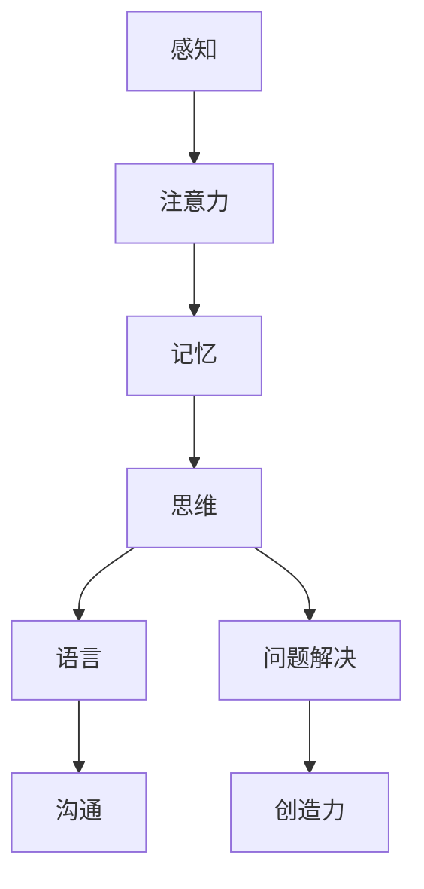
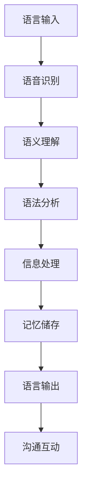

                 

### 引入

在探讨人工智能、认知科学和心理学领域时，我们常常会面临一个核心问题：语言是否是思维的关键基础？长久以来，语言被广泛认为是人类思维的重要载体，是沟通、表达和思考的工具。然而，随着研究的深入，越来越多的证据表明，语言可能并不像我们传统观念中那样，是思维的全部基础。相反，非语言思维在人类认知过程中扮演着同样重要的角色，甚至在某些方面可能更为关键。

这一观点引起了广泛的关注和争议。一方面，语言确实在人类的社交互动和知识传递中起到了不可或缺的作用，另一方面，我们也逐渐认识到，许多复杂的认知过程并不依赖于语言，而是通过直觉、情感和图形等非语言形式来完成。因此，本文旨在探讨语言与思维之间的关系，分析语言在人类思维中的角色，以及非语言思维的重要性和潜力。

通过一步步的逻辑推理和深入分析，我们将揭示语言在思维中的真实地位，并探讨未来研究可能的方向。我们不仅将回顾已有的研究成果，还将提出一些新的见解和思考，以期对这一复杂而深远的话题提供一个新的视角。

## 第一部分：引言

在讨论语言与思维的关系之前，我们先来了解一些基本的概念和背景信息。语言作为人类独有的沟通工具，不仅仅是一种表达方式，更是思维的一种载体。语言的功能和作用广泛而深远，从日常交流、知识传递到复杂推理和创新思考，都离不开语言的支持。然而，思维本身却是一个更为复杂和多元的现象。它不仅仅是语言的表达，还包括直觉、情感、图形等多种形式。因此，探讨语言与思维的关系，首先需要明确两者之间的互动和差异。

### 语言的功能与作用

语言的功能和作用可以从多个角度进行探讨。首先，语言是沟通的工具。通过语言，人们可以表达自己的想法、感受和需求，实现有效的社交互动。这种沟通不仅仅局限于口头语言，还包括书面语言、肢体语言等多种形式。其次，语言是知识传递的载体。通过语言，我们可以将知识从一代人传递到下一代，从一个人传递到另一个人，使得人类文明得以延续和发展。例如，科学论文、历史书籍、文学作品等都是通过语言来记录和传播知识的。

此外，语言还是思维的重要载体。人类的大多数思考过程都离不开语言的作用。语言为思维提供了表达和交流的媒介，使得思维过程可以外化和传递。例如，当我们思考一个问题时，我们往往会用语言来描述和表达我们的思考过程。此外，语言还可以帮助人们进行抽象思维和逻辑推理。通过语言，我们可以对事物进行分类、比较、归纳和演绎，从而进行更高层次的思维活动。

### 语言与思维的互动关系

语言与思维之间的互动关系是复杂而深远的。一方面，语言对思维有着重要的影响。语言不仅影响我们的思考方式，还可以影响我们的认知结构和行为模式。例如，研究表明，不同的语言环境会影响人们对事物的认知和思维方式。例如，一些语言中的词汇和表达方式可能会影响人们对特定事物的看法和判断。此外，语言还可以影响人们的情绪和行为。例如，负面情绪往往与特定的语言表达方式相关联，而积极情绪则可能通过积极语言表达来实现。

另一方面，思维也对语言有着重要的影响。思维是语言的内在基础，没有思维，语言就没有存在的意义。思维过程决定了我们如何使用语言来表达和传递信息。例如，复杂的思维过程需要丰富的语言词汇和表达方式来支持。此外，思维还可以影响语言的演变和发展。随着人类认知和思维方式的变化，语言也在不断地演化和进化，以适应新的认知需求。

### 语言与思维的差异

尽管语言和思维有着紧密的互动关系，但它们之间仍然存在显著的差异。首先，语言是一种外在的符号系统，它通过声音、文字和肢体动作等形式来传达信息。而思维则是一种内在的心理活动，它不依赖于外在的符号系统，而是直接在人类大脑中发生。因此，思维可以独立于语言存在，而语言则无法独立于思维。

其次，语言具有明确的结构和规则，它需要遵循语法、词汇和语义等规则。而思维则更加灵活和自由，不受固定规则的约束。思维可以跳跃式地进行，可以通过直觉、情感和图形等多种形式来实现。例如，当我们遇到一个复杂问题时，我们可能会通过直觉或图形思维来寻找解决方案，而不是通过语言的逻辑推理。

此外，语言和思维还具有不同的功能和目标。语言的主要功能是沟通和知识传递，它需要清晰、准确地表达思想和信息。而思维则更关注问题解决和创造力，它需要灵活、创新地思考问题。

总之，语言和思维是两个相互关联但又有区别的概念。理解它们之间的互动关系和差异，有助于我们更全面地认识人类认知的本质，也为未来研究提供了新的方向和视角。

### 语言不是唯一思维基础

尽管语言在人类思维中扮演了重要角色，但越来越多的研究表明，它并不是唯一的基础。实际上，非语言思维在人类认知过程中同样扮演着至关重要的角色。非语言思维不仅存在于语言的描述之外，而且在许多复杂认知活动中发挥着核心作用。以下，我们将通过具体实例来探讨非语言思维的重要性。

#### 非语言思维的实例

首先，直觉思维是一种典型的非语言思维形式。直觉思维不依赖于逻辑推理或语言表达，而是通过直接感知和理解来解决问题。在科学发现和艺术创作中，直觉思维发挥着重要作用。例如，物理学家牛顿在苹果落下的启发下发现了万有引力定律，这种发现过程很大程度上依赖于直觉思维。此外，音乐家和画家在进行创作时，往往依靠直觉而非语言的描述来捕捉灵感和表达情感。

情感思维则是另一种重要的非语言思维形式。情感思维通过情感体验和情感理解来影响我们的认知和行为。在人际交往中，情感思维帮助我们理解和回应他人的情感状态，从而建立和维护社交关系。例如，当我们在沟通时，不仅需要理解对方语言表达的内容，还需要通过非语言信号如表情、语调、身体语言等来感知对方的情感状态。

图形思维则是通过视觉和空间理解来处理信息的非语言思维形式。图形思维在建筑设计、地图绘制和编程等领域尤为重要。例如，建筑师在构思设计方案时，往往依赖于图形思维来想象和评估空间布局的效果。编程中的图形用户界面（GUI）设计也依赖于图形思维，通过直观的界面布局来提升用户体验。

#### 非语言思维的重要性

非语言思维的重要性不仅体现在特定的情境中，还体现在其普遍性和潜力上。首先，非语言思维是人类认知多样性的重要体现。它为我们提供了处理复杂问题和情境的多种途径，使得我们的认知系统更加灵活和高效。其次，非语言思维具有跨文化和跨语言的特点，不受语言障碍的限制。这使得非语言思维在全球化背景下尤为重要，因为它能够促进不同文化背景的人们之间的理解和沟通。

此外，非语言思维的研究和应用潜力巨大。随着人工智能和认知科学的发展，非语言思维的研究有助于我们更好地理解人类认知的机制，开发出更智能的人工智能系统。例如，通过研究情感思维，我们可以开发出能够理解并回应人类情感状态的人工智能助手，从而提升人机交互的体验。

总之，尽管语言在人类思维中具有重要作用，但非语言思维同样不可或缺。通过具体实例和深入研究，我们认识到非语言思维在人类认知中的核心地位，也为未来的研究提供了新的方向和视角。

### 未来研究方向

在语言与思维关系的探索中，未来的研究将面临诸多挑战，但也充满机遇。首先，关于语言与思维互动的复杂性，未来的研究需要更加深入地揭示两者之间的动态关系。例如，通过神经科学的方法，我们可以进一步了解大脑在语言和思维过程中的具体作用机制。此外，随着技术的进步，如脑机接口和认知计算等新工具的出现，将有助于我们直接观测和分析大脑中的思维活动。

其次，语言能力的多样性和跨文化背景下的思维差异也是未来研究的重要方向。不同语言环境和文化背景下的人们在思维方式和认知结构上存在显著差异，因此研究这些差异有助于我们更全面地理解语言对思维的影响。例如，通过跨文化心理学研究，我们可以探讨不同语言环境对认知能力发展的影响，以及这些差异如何影响个体在不同领域的表现。

此外，非语言思维的研究将更加受到重视。随着对直觉思维、情感思维和图形思维的深入探讨，我们将能够更好地理解这些非语言形式在认知中的作用，并开发出相应的教育方法和应用工具。例如，通过设计基于非语言思维的训练课程，我们可以提升个体的整体认知能力和创造力。

总之，未来的研究方向不仅包括对现有理论的深化和验证，还涉及新兴技术和跨学科研究的结合，以推动我们对语言与思维关系的全面理解。通过这些研究，我们将能够为教育、心理学和人工智能等领域提供新的视角和方法，进一步揭示人类认知的奥秘。

### 语言与认知的关系

语言不仅仅是沟通的工具，更是人类认知系统的重要组成部分。认知心理学作为研究人类认知过程和心理活动的科学，为理解语言与认知之间的关系提供了丰富的理论和实证基础。在探讨语言与认知的关系时，我们需要首先了解认知心理学的基本概念，以及语言在认知中的作用。

#### 认知心理学的基本概念

认知心理学关注的是人类如何获取、处理、存储和应用信息。其核心概念包括感知、记忆、思维、语言和问题解决等。感知是指我们如何通过感官接收外界信息；记忆是指我们如何储存和回忆信息；思维是指我们如何进行逻辑推理和抽象思考；语言是指我们如何使用符号系统进行表达和理解；问题解决则是指我们如何运用认知资源来解决问题。

在认知心理学中，记忆尤其重要。记忆可以分为短期记忆和长期记忆。短期记忆是指我们暂时储存信息的能力，如电话号码；长期记忆则是我们长时间储存信息的能力，如学习过的知识。认知心理学还研究了记忆的不同类型，包括工作记忆、情景记忆和语义记忆等。

思维是认知心理学的另一个核心概念。思维过程包括逻辑推理、抽象思考、决策制定和创造性思维等。逻辑推理是指通过逻辑规则进行推理和判断，如三段论推理。抽象思考是指从具体事物中提取共性，进行概念化和分类，如将猫和狗归为“动物”类别。创造性思维则是指通过新颖、独特的方式来解决问题或表达想法。

语言在认知心理学中的角色

语言是人类认知系统中最重要的工具之一。它不仅帮助我们进行沟通和知识传递，还在我们的思维过程中起着核心作用。具体来说，语言在以下几方面对认知产生重要影响：

1. **信息处理和记忆**

语言在信息处理和记忆中扮演着关键角色。当我们接收外界信息时，语言帮助我们将其转化为可以理解和存储的形式。例如，当我们听到一段话时，我们会用语言将其解码并储存在记忆中。语言还能帮助我们在回忆信息时进行有效的搜索和检索。例如，当我们需要回忆某个具体事件时，我们可以用语言将其描述出来，从而激活相关的记忆节点。

2. **抽象思维和概念化**

语言是进行抽象思维和概念化的重要工具。通过语言，我们可以对事物进行分类、比较、归纳和演绎。例如，我们可以通过语言将具体的物体抽象为“物品”这一概念，从而更高效地处理复杂的信息。此外，语言还帮助我们进行高层次的思维活动，如逻辑推理、哲学思考和科学探索。

3. **问题解决和创造性思维**

语言在问题解决和创造性思维中也发挥着重要作用。当我们面对问题时，我们可以通过语言来描述问题、分析问题并提出解决方案。例如，在科学研究中，科学家通过语言来记录观察、提出假设并进行实验验证。创造性思维则依赖于语言的灵活运用，通过语言进行联想、比喻和隐喻来寻找创新的解决方案。

4. **文化和社会交流**

语言不仅是个人思维的工具，还是文化和社会交流的基础。通过语言，我们可以与他人沟通、交流思想，从而共享知识和经验。这种交流不仅促进了个体的发展，也推动了人类文明的进步。语言还是社会规范和价值体系的重要载体，通过语言，我们可以传递社会文化信息，培养共同认同感。

总之，语言在认知心理学中具有不可替代的地位。它不仅是我们信息处理和记忆的工具，还在我们的抽象思维、问题解决和创造性思维中发挥着核心作用。同时，语言还是文化和社会交流的基础，推动了人类认知和文明的发展。

### 语言能力的发展

语言能力的发展是认知心理学研究的重要领域，它不仅涉及儿童的语言习得，也涵盖成人语言学习的过程。通过理解这些发展过程，我们可以更深入地了解语言与认知之间的动态关系。

#### 儿童语言习得

儿童的语言习得是一个复杂而高度协调的过程，通常在出生后的前几年内完成。在这一过程中，儿童不仅学习了语言的语法、词汇和发音，还发展了理解和使用语言的能力。以下是一些关键阶段和机制：

1. **语言感知阶段**（0-6个月）：婴儿在这一阶段开始对语言声音产生兴趣，能够区分不同语言声音的细微差别。研究表明，婴儿在出生后几周内就能够区分不同语言中的声调差异，这表明他们具有早期语言感知能力。

2. **声母-韵母识别阶段**（6-12个月）：儿童开始识别语言中的声母和韵母，并尝试模仿简单声音。这一阶段的标志是儿童开始咿呀学语，模仿他们听到的声音。

3. **单词阶段**（12-24个月）：在这一阶段，儿童开始理解并使用单词，语言词汇量迅速增加。儿童能够从环境中识别并理解日常用语，如“水”、“牛奶”等。

4. **句子阶段**（24-36个月）：儿童开始构建简单的句子，语法和句子结构逐渐变得复杂。他们能够进行简单的提问和回答，表达自己的需求和意愿。

5. **多句阶段**（36个月以后）：儿童的语言能力进一步发展，能够进行复杂的句子构建，表达更为丰富的思想。他们的语言理解能力和表达能力都达到了一个新水平。

儿童语言习得过程中的关键机制包括：

- **模仿**：儿童通过模仿他人的语言声音和行为来学习语言。
- **听觉辨别**：儿童能够区分不同语言声音的细微差别，这是语言习得的基础。
- **互动**：语言学习是一个互动过程，通过与父母、老师和同伴的交流，儿童能够不断练习和改进他们的语言技能。

#### 成人语言学习

与儿童语言习得相比，成人语言学习更为复杂和缓慢。成人语言学习不仅涉及语法和词汇的学习，还包括文化和社会背景的影响。以下是一些成人语言学习的关键阶段和策略：

1. **初始阶段**：成人初学者首先需要建立语言基础，学习基本的语法规则和常用词汇。他们通常会通过参加语言课程、使用教材和进行语言练习来提高语言水平。

2. **提高阶段**：在掌握了基本语言技能后，成人学习者需要提高语言流利度和准确性。这一阶段的学习者通常通过大量阅读、听力训练和写作练习来增强语言能力。

3. **精通阶段**：在这一阶段，成人学习者已经能够流利地使用目标语言，进行复杂的语言表达。他们能够理解和运用高级语法结构，进行学术和专业交流。

成人语言学习的策略包括：

- **目标明确**：设定清晰的学习目标，有助于提高学习动力和效率。
- **多样化学习**：结合多种学习方式，如语言课程、听力练习、阅读和写作，可以提高学习效果。
- **互动交流**：与母语者或其他学习者进行语言交流，有助于提高语言流利度和实际应用能力。
- **持续实践**：持续的语言实践是提高语言能力的关键，通过不断练习，学习者可以巩固所学知识，提高语言运用能力。

总之，语言能力的发展是一个长期而复杂的过程，既涉及儿童的早期语言习得，也涵盖成人的持续学习。通过理解这些发展过程，我们可以更好地支持个体在不同阶段的语言学习，促进他们的全面认知发展。

### 语言对认知能力的影响

语言不仅是沟通的工具，还在多个方面显著影响认知能力。研究表明，语言能力不仅影响个体的信息处理和记忆，还对抽象思维、问题解决和创造性思维产生深远影响。

首先，语言对信息处理和记忆的影响尤为显著。语言能力强的个体在处理和存储信息时更高效。例如，在信息筛选和注意力分配方面，语言能力强的人能够更好地过滤无关信息，专注于关键信息。此外，语言能力有助于提高记忆的编码和检索效率。例如，通过语言描述和命名，人们可以更有效地将信息编码为记忆，并在需要时快速检索这些信息。一项研究表明，语言能力强的人在使用工作记忆时表现更好，能够在短时间内处理更多复杂的信息。

其次，语言对抽象思维和概念化能力有重要影响。语言是抽象思维的载体，通过语言，人们可以超越具体事物，进行更高层次的思考。例如，在科学研究中，科学家需要通过语言将具体的实验现象抽象为理论模型。这种能力使得人们能够从大量数据中提取规律，进行理论推导和预测。此外，语言能力还影响个体的分类和比较能力。通过语言，人们可以更准确地理解和比较不同事物之间的差异和联系，从而形成更复杂的认知结构。

语言对问题解决和创造性思维的影响也不可忽视。在解决问题时，语言能力可以帮助个体进行有效的思考和表达。例如，通过语言描述问题，人们可以明确问题的核心，找到解决思路。此外，语言能力还支持个体的创造性思维。通过语言，人们可以进行联想、比喻和隐喻，从而激发创新的解决方案。例如，在文学创作和艺术设计中，语言能力使得个体能够通过丰富的语言表达来创造独特的艺术作品。

具体来说，以下研究支持了语言对认知能力的多方面影响：

- **关于记忆的研究**：一项关于老年痴呆症患者的研究表明，语言能力下降与他们记忆能力的下降密切相关。语言能力强的患者在记忆测试中表现更好，而语言能力下降的患者则表现出明显的记忆衰退。
- **关于抽象思维的研究**：一项关于语言习得障碍儿童的研究发现，这些儿童在抽象思维和概念化能力上存在显著缺陷。他们的语言障碍限制了他们进行抽象思考和复杂推理的能力。
- **关于问题解决的研究**：一项关于编程技能的研究表明，具备高编程能力的人通常具有更强的逻辑思维和问题解决能力。这些能力在很大程度上得益于他们熟练掌握的编程语言和语言思维能力。
- **关于创造性思维的研究**：一项关于创造性思维的研究发现，语言能力强的人更倾向于使用丰富的语言表达进行创造性思考。通过语言的多样性和灵活性，他们能够产生更多创新的想法。

总之，语言对认知能力的影响是多方面的，它不仅影响信息处理和记忆，还显著影响抽象思维、问题解决和创造性思维。通过深入理解这些影响，我们可以更好地利用语言能力来提升认知水平，实现更高效的学习和创造。

### 非语言思维

在深入探讨语言与认知的关系时，我们不能忽视非语言思维的重要角色。非语言思维是一种不依赖于语言文字的思维方式，它通过直觉、情感、图形等多种形式进行信息处理和问题解决。以下，我们将详细探讨非语言思维的类型及其在创意思维和科学发现中的应用。

#### 非语言思维的类型

1. **直觉思维**

直觉思维是一种快速而自然的认知过程，它不依赖于逻辑推理或语言表达。直觉思维往往基于个人的经验和潜意识，通过直接感知和理解来解决问题。例如，在紧急情况下，人们常常依靠直觉迅速作出决策，而不是通过逐步分析和推理。

2. **情感思维**

情感思维通过情感体验和情感理解来影响认知和行为。情感思维不仅关注事实和逻辑，还涉及个人的情感状态和情感反应。在人际交往中，情感思维帮助我们理解和回应他人的情感状态，从而建立和维护社交关系。

3. **图形思维**

图形思维是一种基于视觉和空间理解的信息处理方式。通过图形和空间关系，人们可以更直观地理解和解决问题。例如，在建筑设计中，设计师通过图形思维来想象和评估空间布局的效果，从而创造出美观且实用的设计方案。

4. **运动思维**

运动思维通过身体动作来解决问题或表达想法。例如，舞蹈家和运动员通过身体动作来表达情感和想法，这种思维形式在艺术和体育领域尤为重要。

#### 创意思维在艺术领域的应用

在艺术创作中，非语言思维尤为重要。艺术家通过直觉思维捕捉灵感，通过情感思维表达情感，通过图形思维构建视觉元素。例如，画家在创作时，往往依靠直觉来决定画面的布局和色彩，通过情感表达作品背后的情感和主题。此外，设计师通过图形思维来构思和调整设计元素，创造出既美观又实用的作品。

一个典型的例子是荷兰画家梵高。他在创作《星夜》这幅画时，通过直觉和情感思维，将夜空中的星光和月光表现得如同火焰般炽热，使这幅画充满了情感和力量。这种非语言思维的应用，使得梵高的作品不仅具有艺术价值，还深深触动了观众的情感。

#### 直觉思维在科学发现中的应用

在科学发现中，直觉思维同样发挥着重要作用。许多重大科学突破都是科学家在直觉的指引下发现的。例如，物理学家爱因斯坦在提出相对论时，依靠直觉和想象力，提出了时间相对性和光速不变原理。这种直觉思维帮助他克服了传统物理学的局限，开创了现代物理学的新领域。

另一个例子是生物学家弗朗西斯·克里克。他在发现DNA的双螺旋结构时，依靠直觉和图形思维，通过观察X射线晶体学数据，提出了DNA的双螺旋模型。这一发现不仅揭示了生命的遗传机制，还奠定了分子生物学的基础。

总之，非语言思维在人类认知中扮演着至关重要的角色。它不仅帮助我们解决复杂的问题，还激发了我们的创造力和创新能力。通过理解和应用非语言思维，我们可以更全面地认识世界，实现更高层次的认知发展。

### 非语言思维的教育应用

非语言思维在教育领域具有广泛的应用潜力，通过合理的教学策略，可以有效地培养学生的认知能力和创造力。以下，我们将探讨非语言思维教学策略及其在培养创造力中的重要作用。

#### 非语言思维教学策略

1. **多感官教学**：多感官教学通过视觉、听觉、触觉等多种感官刺激来增强学习效果。例如，在数学教学中，教师可以通过图形和图表来展示复杂的概念，帮助学生直观地理解数学原理。此外，教师还可以通过音乐和舞蹈等艺术形式来教授抽象概念，如物理学中的能量守恒定律。

2. **项目式学习**：项目式学习鼓励学生通过实际项目来应用所学知识，从而培养他们的非语言思维能力。例如，在科学项目中，学生可以通过实验和观察来探索自然现象，从而发展他们的直觉思维和图形思维。这种学习方式不仅有助于学生掌握知识，还能激发他们的创造力。

3. **合作学习**：合作学习通过小组讨论和协作项目来促进学生之间的互动和交流。在这种学习环境中，学生可以通过讨论和分享想法，共同解决问题，从而发展他们的直觉思维和情感思维。例如，在语言课程中，学生可以通过角色扮演和情景模拟来练习口语表达和情感理解。

4. **创造性思维训练**：通过专门的创造性思维训练，学生可以学习如何运用直觉思维和图形思维来解决问题。例如，教师可以引导学生进行头脑风暴、思维导图和创意写作等练习，从而提高他们的创造性思维能力。

#### 非语言思维与创造力的培养

非语言思维与创造力之间存在着密切的联系。非语言思维提供了丰富的认知资源，使得学生能够从不同的角度和维度来看待问题，从而激发创新思维。以下是一些具体的培养策略：

1. **培养直觉思维**：通过提供丰富的感官刺激和情境模拟，教师可以帮助学生培养直觉思维。例如，在科学实验中，教师可以引导学生通过实际操作来感知物理现象，从而培养他们的直觉理解。

2. **情感引导**：情感在教育中扮演着重要角色，通过情感引导，教师可以帮助学生理解和表达情感。例如，在文学教学中，教师可以通过讨论和分享作品中的情感体验，帮助学生培养情感思维。

3. **图形思维训练**：通过图形和空间训练，教师可以培养学生的图形思维。例如，在数学教学中，教师可以通过几何图形和空间模型来解释数学概念，从而帮助学生直观地理解抽象的数学理论。

4. **跨学科学习**：跨学科学习可以促进不同领域的知识和技能的交叉融合，从而激发创造性思维。例如，在综合课程中，学生可以通过跨学科项目来应用所学知识，从而培养他们的创造性思维能力。

总之，非语言思维在教育中的应用具有巨大的潜力。通过多感官教学、项目式学习、合作学习和创造性思维训练等策略，教师可以有效地培养学生的非语言思维能力，进而提高他们的创造力。这将为学生的全面发展奠定坚实的基础。

### 多模态思维与认知

多模态思维是一种结合多种感官信息的认知方式，通过整合视觉、听觉、触觉等多种感官信息，人们能够更全面、深入地理解和处理信息。这种思维方式不仅在日常生活中具有重要作用，也在专业领域如艺术、科学和教育中表现出显著的潜力。

#### 多模态思维的概念

多模态思维（Multimodal Thinking）指的是通过结合不同感官输入来理解和表达信息的过程。传统的单一模态思维主要依赖于某一特定感官，如视觉或听觉，而多模态思维则强调多种感官的协同作用。例如，在阅读文本时，人们不仅通过视觉感知文字，还可能通过听觉感知文字的语调，甚至通过触觉感知书本的质地。

多模态思维的优点在于：

1. **信息处理的丰富性**：多模态思维使得人们能够从不同角度和维度来理解信息，从而提升信息的丰富度和准确性。
2. **认知资源的综合利用**：通过整合多种感官信息，人们能够更有效地利用认知资源，提高信息处理和记忆的效率。
3. **问题解决的灵活性**：多模态思维提供多种解决问题的途径，使得个体在面对复杂问题时能够灵活应对，找到创新的解决方案。
4. **情感体验的增强**：多模态思维能够增强情感体验，使得个体在理解和表达情感时更加深刻和生动。

#### 多模态思维的案例研究

1. **艺术创作**：在艺术创作中，多模态思维被广泛应用。例如，画家在创作时不仅依赖于视觉，还会通过听觉、触觉等感官来捕捉灵感和表达情感。音乐家在创作音乐时，同样会借助视觉元素如乐谱或图形，来辅助创作和表达。

2. **科学探索**：在科学研究中，多模态思维也发挥着重要作用。例如，在医学领域，医生通过结合患者的临床表现（视觉）、体征（触觉）和实验室检查结果（听觉和视觉），来做出准确的诊断。此外，多模态思维在数据分析和复杂系统建模中也表现出强大的应用潜力。

3. **教育应用**：在教育领域，多模态思维能够提升学习效果。例如，通过多媒体教学，学生可以通过视觉、听觉等多种方式来获取知识，从而加深理解和记忆。在数学教学中，教师可以通过图形、动画和实际操作等多种手段，来帮助学生理解和掌握抽象的数学概念。

#### 多模态思维的教育应用

1. **综合感官教学**：教师可以通过综合运用视觉、听觉、触觉等多种教学手段，来提高学生的学习效果。例如，在科学课上，教师可以通过实验、演示和多媒体素材来展示科学现象，从而增强学生的理解。

2. **情境模拟**：通过情境模拟，学生可以在真实或模拟的情境中，通过多种感官体验来学习。例如，在语言教学中，教师可以组织角色扮演和情景对话，让学生在互动中提高语言表达和理解能力。

3. **跨学科学习**：教师可以通过设计跨学科项目，鼓励学生在不同学科领域之间进行知识融合和技能应用。例如，通过综合科学、艺术和数学等多学科知识，学生可以更好地理解和解决复杂问题。

总之，多模态思维是一种强大而灵活的认知方式，通过整合多种感官信息，它能够提升个体的认知能力和问题解决能力。在艺术、科学和教育等众多领域，多模态思维的应用不仅丰富了知识和体验，也为创新和创造力的发展提供了新的途径。

### 多模态思维的案例研究

为了更好地理解多模态思维在实际应用中的效果，我们可以通过几个具体案例来探讨其在不同领域的应用和影响。

#### 视觉与语言结合的例子

在文学创作中，视觉与语言的结合是一个常见的现象。例如，著名作家村上春树在写作时，常常通过描绘具体的视觉场景来增强文本的感染力。在《挪威的森林》中，他通过丰富的视觉描述，如“黄昏的街头”、“窗外的雨滴”，使读者能够身临其境地感受到故事的氛围。这种视觉与语言的结合，不仅使文本更具立体感，还提升了读者的阅读体验。

#### 听觉与触觉的结合

在音乐表演中，听觉与触觉的结合也是一个重要特点。例如，演奏者在演奏乐器时，不仅通过听觉来感知音色和节奏，还会通过触觉来感受乐器的振动和手感。这种多模态感知有助于演奏者更精准地控制乐器，从而实现更完美的音乐表现。此外，在音乐创作中，音乐家也会通过听觉和视觉的结合，如使用乐谱和音频编辑软件，来创造出新颖的音乐作品。

#### 视觉与触觉的结合

在建筑设计中，视觉与触觉的结合尤为重要。建筑师在设计和评估建筑方案时，不仅需要通过视觉来理解空间布局和视觉效果，还需要通过触觉来感知材料的质地和触感。例如，在室内设计中，设计师会通过实际触摸材料样品来选择适合的材质，从而提升室内空间的舒适度和美观度。此外，在虚拟现实（VR）建筑设计中，设计师可以通过虚拟环境的触觉反馈，来模拟和体验建筑的实际触感，从而优化设计细节。

这些案例展示了多模态思维在实际应用中的多样性和效果。通过整合视觉、听觉和触觉等不同感官信息，人们能够更全面、深入地理解和处理信息，从而提升认知能力和创造力。这些应用不仅丰富了人类对世界的认知，也为各种领域的发展提供了新的视角和工具。

### 多模态思维的教育应用

多模态思维在教育中的应用具有显著的潜力，通过多种感官的综合运用，可以有效提升教学效果和学生的学习体验。以下，我们将探讨一些具体的多模态思维教育应用方法及其在跨学科学习中的作用。

#### 整合多种感官的教学方法

1. **多媒体教学**：在课堂教学中，教师可以运用视频、音频、图片和动画等多种媒体形式，来呈现教学内容。例如，在自然科学教学中，教师可以通过实验视频和动画来展示生物的繁殖过程或化学反应的动态变化，使学生能够从多个感官层面理解抽象概念。

2. **互动式学习工具**：通过使用互动式学习工具，如虚拟实验室、模拟软件和AR（增强现实）应用，学生可以在真实的或模拟的情境中，通过视觉、听觉和触觉等多种感官进行学习。例如，在医学教育中，学生可以通过虚拟手术模拟器，在虚拟手术环境中进行实践操作，从而提升实际操作技能。

3. **体验式学习**：通过体验式学习，学生可以在真实情境中通过多种感官进行学习。例如，在地理课上，学生可以通过实地考察和野外探险，来观察自然景观和地理现象，从而增强对地理知识的理解和记忆。

#### 跨学科学习的促进作用

1. **项目式学习**：项目式学习通过跨学科项目，将不同学科的知识和技能融合在一起。例如，在一个跨学科项目中，学生可以结合数学、物理和艺术等学科，设计并制作一个太阳能装置。这种项目不仅能够提升学生的跨学科思维能力和综合应用能力，还能通过多种感官的参与，使学习过程更加生动和有趣。

2. **合作学习**：通过合作学习，学生可以相互分享和讨论不同学科的知识和经验。例如，在社会科学和艺术课程的结合中，学生可以通过讨论历史事件和艺术作品，来深入理解社会和文化现象。这种合作学习不仅促进了知识的交流，还增强了学生的多模态思维。

3. **跨学科教材**：教师可以使用跨学科的教材和资源，来促进多模态思维的应用。例如，在数学和音乐的结合课程中，教师可以引导学生通过分析音乐节奏和旋律，来理解数学中的节奏和比例关系。

总之，多模态思维的教育应用通过整合多种感官信息，能够显著提升教学效果和学生的学习体验。通过多媒体教学、互动式学习工具和体验式学习等方法，教师可以更好地激发学生的学习兴趣和创造力。跨学科学习则进一步促进了知识的综合应用和跨领域思维的发展，为学生的全面发展奠定了坚实基础。

### 语言与非语言思维的互补性

在深入探讨语言与非语言思维的关系时，一个重要的观点是，它们之间并非孤立存在，而是相互补充和互动，共同构成了人类认知的完整体系。语言与非语言思维在人类认知过程中各司其职，但又紧密相连，通过互补性实现了更高的认知效率和创造性。

首先，语言作为外显的符号系统，在沟通、表达和知识传递中发挥着不可替代的作用。语言能够将复杂的思维过程转化为具体的文字、语音和手势，使得信息能够被广泛传播和共享。例如，在学术交流中，研究人员通过语言撰写论文、发表见解，使得知识得以系统化和传播。然而，语言也存在局限性，它无法完全捕捉人类的直觉、情感和图形思维。在这种情况下，非语言思维提供了重要的补充。非语言思维通过直觉、情感和图形等方式，使得人类能够更直接、更快速地理解和处理信息。例如，在科学实验中，研究人员往往通过直觉来捕捉实验中的微妙变化，从而发现新的科学现象。

其次，语言和非语言思维的互补性在创造性思维中表现得尤为明显。在艺术创作和科学探索中，语言和非语言思维的结合往往能够激发出创新的灵感。例如，在文学创作中，作家通过语言来表达情感和场景，但往往需要依靠直觉和图形思维来捕捉和构建故事情节。在科学研究中，科学家通过语言来描述实验结果和理论模型，但往往需要通过直觉和图形思维来提出新的假设和理论。这种互补性使得创造性思维更加丰富和多样化。

此外，在日常生活中，语言和非语言思维的互补性也无处不在。语言帮助我们进行正式的沟通和交流，而非语言思维则帮助我们进行直觉判断和情感表达。例如，在社交互动中，人们不仅通过语言来交流信息，还通过肢体语言和面部表情来表达情感和态度。这种多模态的沟通方式不仅增强了交流的效果，还提升了人际关系的质量。

从理论上讲，语言和非语言思维的互补性可以通过多个认知模型来解释。例如，多模态认知模型认为，人类的认知过程不仅仅依赖于语言，还包括视觉、听觉、触觉等多种感官的输入。这种模型强调，不同的感官信息在认知过程中相互补充，共同构建了对现实世界的全面理解。

总的来说，语言和非语言思维在人类认知中具有互补性，它们通过不同的方式，共同构成了人类认知的完整体系。语言提供了结构化和系统化的信息表达方式，而非语言思维则提供了直观和情感的认知途径。通过互补性，人类能够更高效地处理复杂的信息，实现更高的认知效率和创造力。

### 融合思维的案例研究

融合思维是一种通过整合语言和非语言思维来提升创造力和问题解决能力的思维方式。以下，我们将通过具体案例来探讨融合思维在文学创作和科学探索中的应用，并分析其对于创造性思维和创新实践的影响。

#### 文学创作中的应用

文学创作是一个典型的融合思维的应用场景。作家在创作过程中，不仅需要运用语言来表达情感和构建情节，还需要借助直觉和图形思维来捕捉灵感。以美国著名作家霍华德·法斯特（Howard Fast）为例，他在创作《黑人的灵魂》这部作品时，通过语言细腻地描绘了美国黑人的历史和生活，同时借助直觉和图形思维，塑造出深刻的人物形象和情感氛围。法斯特在创作过程中，常常通过想象和情感体验，来丰富和深化作品的内容。例如，他通过直觉感受到人物内心的痛苦和挣扎，从而在文字中传递出强烈的情感张力。

另一个例子是英国作家艾米丽·布朗特（Emily Brontë）在她的作品《呼啸山庄》中，通过融合语言和非语言思维，创造出一个个生动而复杂的角色。她在描绘主人公希斯克利夫时，不仅通过语言描绘他的外貌和性格，还通过图形思维来展现他的内心世界。例如，通过描述希斯克利夫在暴风雨中的孤独和痛苦，布朗特使读者能够感受到他内心深处的情感冲突和挣扎。

这些案例表明，融合思维在文学创作中不仅提升了作品的艺术价值，还增强了读者的情感共鸣。通过语言和非语言思维的结合，作家能够更深刻地表达情感和思想，创造出丰富而复杂的艺术作品。

#### 科学探索中的应用

在科学探索中，融合思维同样发挥着重要作用。科学家在提出假设、设计实验和解释结果时，需要同时运用语言和非语言思维。以下是一个具体案例：

以物理学家理查德·费曼（Richard Feynman）为例，他在研究量子物理学时，通过融合语言和非语言思维，提出了著名的费曼图解法。费曼图解法是一种直观的物理推导方法，通过图形和符号的简化表示，使得复杂的物理过程变得直观易懂。费曼在推导过程中，不仅运用了精确的语言描述，还通过直觉和图形思维来简化复杂的物理现象。例如，在解释量子力学中的散射过程时，费曼通过绘制费曼图，将复杂的散射过程转化为简单的图形表示，从而简化了推导过程。

此外，诺贝尔奖得主詹姆斯·D·沃森（James D. Watson）在解析DNA结构时，同样运用了融合思维。沃森在通过X射线晶体学数据解析DNA结构时，不仅依赖语言描述来记录和分析数据，还通过直觉和图形思维来构建DNA的双螺旋模型。沃森在回忆他的研究过程时，提到他通过想象DNA在显微镜下的形态，来验证和修正他的假设。

这些案例说明，融合思维在科学探索中不仅提升了科研效率，还促进了科学理论的创新。通过语言和非语言思维的结合，科学家能够更有效地理解和解释复杂现象，提出新的理论和假设。

#### 对创造性思维和创新实践的影响

融合思维对创造性思维和创新实践具有深远影响。首先，融合思维能够激发多种思维方式的协同作用，从而提升创造力。通过整合语言和非语言思维，人们能够从不同的角度和维度来看待问题，从而产生更多创新的想法。例如，在艺术创作中，通过语言描述和图形思维的结合，艺术家能够创造出独特而丰富的作品。

其次，融合思维能够促进跨学科的合作与创新。在现代社会，许多重大突破往往需要跨学科的知识和技能。通过融合语言和非语言思维，不同领域的专家能够更有效地沟通和合作，从而推动科学技术的进步。例如，在生物技术和医学领域，通过融合生物学、化学和计算机科学的知识，科学家能够开发出新的药物和治疗手段。

总之，融合思维在文学创作和科学探索中的应用，不仅展示了其在创造性思维和创新实践中的潜力，还揭示了语言和非语言思维之间的互补关系。通过融合语言和非语言思维，我们能够更全面、深入地理解和解决问题，推动人类认知和文明的发展。

### 融合思维的教育挑战与机遇

融合思维作为一种结合语言和非语言思维的认知方式，为教育领域带来了新的挑战与机遇。首先，融合思维的教育挑战主要体现在以下几个方面：

#### 教育体系的变革

1. **课程内容调整**：传统教育体系往往侧重于语言技能的培养，而忽视非语言思维的训练。为了促进融合思维的发展，教育体系需要调整课程内容，增加对非语言思维（如直觉思维、情感思维和图形思维）的培养。例如，在科学课程中，可以引入更多的实验和实践活动，以提升学生的直觉思维和图形思维能力。

2. **教学方法更新**：传统教学方法通常依赖于语言传授，而融合思维需要多种感官的参与。因此，教师需要更新教学方法，采用更多的互动式和体验式教学方式，如项目式学习、情境模拟和跨学科学习等，以促进学生多种思维方式的综合运用。

#### 师资培训

1. **教师专业发展**：为了适应融合思维的教育需求，教师需要接受专业培训，提升自己在语言和非语言思维教学方面的能力。教师可以通过参与工作坊、研讨会和专业发展课程，学习如何设计融合思维的教学活动，从而更好地指导学生。

2. **跨学科教学能力**：融合思维强调不同学科知识的综合应用，因此，教师需要具备跨学科教学能力。教师可以通过跨学科项目的设计和实施，提升自己的跨学科教学技巧，从而促进学生综合能力的提升。

#### 学生适应性

1. **个性化学习**：每个学生都有不同的认知特点和优势，因此，教育需要关注学生的个性化发展。教师可以通过个性化和差异化的教学方法，根据学生的兴趣和优势，设计适合他们的融合思维训练活动。

2. **多元评价体系**：传统评价体系往往侧重于语言成绩，而忽视非语言能力的发展。为了促进学生全面发展，教育评价体系需要多元化，不仅评价学生的语言能力，还要评价他们的非语言思维能力，如直觉思维和创造性思维。

#### 教育机遇

融合思维为教育带来了新的机遇，主要体现在以下几个方面：

1. **提升创造力**：通过融合语言和非语言思维，学生能够更全面地理解和解决问题，从而提升创造力。在艺术、科学和工程技术等领域，创造力是至关重要的能力，融合思维能够帮助学生在这些领域中取得突破。

2. **跨文化沟通**：融合思维能够增强学生的跨文化沟通能力。通过理解不同文化背景下的非语言表达方式，学生能够更好地与来自不同文化背景的人进行沟通和交流，从而促进全球化和跨文化交流。

3. **适应未来社会**：在快速变化的信息时代，融合思维能够帮助学生适应未来的社会和工作环境。未来的工作往往需要创新和灵活的思维，融合思维能够培养学生的这些关键能力，使他们更好地适应未来的挑战。

总之，融合思维在教育中既带来了挑战，也提供了机遇。通过调整教育体系、加强师资培训、关注学生适应性和利用教育机遇，我们可以更好地培养具备融合思维能力的学生，为他们未来的发展奠定坚实基础。

### 未来思维模式的发展

随着科技的进步和社会的发展，未来的思维模式将发生深刻变革。人工智能、虚拟现实和其他新兴技术将不断推动人类认知模式的演变，带来新的思维趋势和挑战。

#### 科技对思维模式的影响

1. **人工智能（AI）**：人工智能的发展正在改变人类的思维模式。通过机器学习和深度学习算法，AI系统能够处理和分析大量数据，帮助人类进行复杂的决策和预测。这种能力使得人类能够将更多的精力投入到创造性和策略性思考中，而将日常的繁琐任务交给机器。

2. **虚拟现实（VR）**：虚拟现实技术为人类提供了全新的感知和互动方式。通过VR，人们可以在虚拟环境中体验和探索现实世界中无法实现的事物，从而拓展认知边界。这种沉浸式的体验方式将改变人类对现实和虚拟的认识，促进跨领域的思维融合。

3. **增强现实（AR）**：增强现实技术通过将数字信息叠加到现实世界中，为人类提供了更丰富的感知体验。在医疗、教育、娱乐等领域，AR技术将提升信息的可视化和互动性，从而促进深度学习和创新思维的培养。

4. **大数据分析**：大数据技术使得人类能够从海量数据中提取有价值的信息。这种能力将推动数据分析成为未来思维的重要工具，使得人类能够通过数据驱动的方式进行更精准和有效的决策。

#### 未来的思维趋势

1. **跨学科思维**：未来的思维模式将更加跨学科，强调不同领域知识的综合应用。随着科技的发展，各个领域之间的界限变得越来越模糊，跨学科思维将帮助人类更好地应对复杂问题，实现创新突破。

2. **系统思维**：系统思维是一种强调整体性和关联性的思维方式。在未来，随着全球化和复杂化问题的增加，系统思维将成为解决问题的关键。通过理解系统内部各部分之间的相互作用，人们能够更有效地分析和解决复杂问题。

3. **设计思维**：设计思维是一种以人为本的思维方式，强调用户体验和创新。在未来，设计思维将不仅应用于产品设计，还将扩展到教育、医疗、城市规划等领域，成为推动社会进步的重要工具。

4. **创造性思维**：随着人工智能的崛起，创造性思维的重要性将日益凸显。在未来，人类需要更多创造性思维来应对科技和环境的挑战。通过鼓励创新和探索，创造性思维将成为推动社会发展和个人成长的关键能力。

#### 新型思维能力的发展路径

1. **教育体系的变革**：未来的教育体系需要更加注重培养学生的跨学科思维、系统思维和创造性思维。通过改革课程设置和教学方法，教育体系应致力于培养具备全面思维能力的人才。

2. **终身学习**：在快速变化的社会中，终身学习将成为不可或缺的能力。个人和组织都需要不断更新知识和技能，以适应新的思维模式和技术发展。

3. **技术创新**：技术公司将扮演重要角色，通过研发新技术和工具，推动思维模式的变革。例如，AI工具可以辅助人类进行复杂的数据分析，VR设备可以提供沉浸式的学习体验。

4. **社会支持**：政府和社会应提供必要的支持和资源，鼓励创新思维和实践。通过建立创新生态系统，提供资金、政策和人才支持，社会可以为新型思维能力的发展创造有利环境。

总之，未来思维模式的发展将在科技和全球化背景下发生深刻变革。通过跨学科思维、系统思维、设计思维和创造性思维的培养，人类将能够更好地应对未来挑战，推动社会进步和个体成长。

### 新型思维能力的培养

在未来的社会环境中，新型思维能力将成为个人和组织的核心竞争力。为了培养这种能力，教育体系的变革、技术工具的运用以及实践活动的开展都是至关重要的。

#### 教育体系的变革

1. **课程设置**：未来的教育体系应更加注重跨学科课程的设置。通过整合不同领域的知识，学生能够培养出综合性的思维方式。例如，将编程与艺术、科学与社会学相结合的课程，有助于学生从不同角度理解问题，并找到创新的解决方案。

2. **教学方法**：传统的教学方法应逐步被项目式学习、情境模拟和合作学习等现代教学方法所取代。这些方法能够更好地激发学生的主动性和创造性，使他们在真实的问题情境中应用知识，发展综合思维能力。

3. **个性化学习**：未来的教育应更加注重个性化学习。通过了解每个学生的兴趣和特长，教育者可以设计个性化的学习路径，帮助他们最大限度地发挥自己的潜力。例如，通过自适应学习系统和个性化辅导，学生可以根据自己的节奏和能力进行学习。

4. **跨学科项目**：通过跨学科项目，学生能够在实际操作中应用所学知识，培养解决复杂问题的能力。例如，在综合项目中，学生可以结合数学、科学、工程和艺术等多个领域的知识，设计并实施一个实际项目，从而提升综合思维能力。

#### 技术工具的运用

1. **人工智能（AI）**：人工智能工具可以辅助教育者和学生进行个性化教学和学习。通过分析学生的学习数据，AI系统可以提供针对性的学习建议，帮助学生更高效地学习。此外，AI还可以用于模拟复杂的实验和情景，提供直观的学习体验。

2. **虚拟现实（VR）**：VR技术为教育提供了沉浸式的学习环境，学生可以通过虚拟体验来探索和实验。例如，在医学教育中，学生可以通过VR技术进行虚拟手术练习，提高操作技能。此外，VR还可以用于历史、地理等学科的教学，使知识更加生动有趣。

3. **增强现实（AR）**：AR技术通过将数字信息叠加到现实世界中，为学生提供了丰富的互动体验。在自然科学教学中，AR可以用来展示复杂的生物结构和化学反应，帮助学生更好地理解抽象概念。在艺术教学中，AR可以用于创作和展示三维艺术作品。

4. **大数据分析**：大数据分析工具可以帮助教育者了解学生的学习情况，从而进行更精准的教学决策。通过分析学习数据，教育者可以识别学生的学习难点和优势，制定个性化的教学策略。

#### 实践活动的开展

1. **实验和项目**：通过实验和项目，学生可以将所学知识应用到实际中，培养实践能力和创新思维。例如，在科学实验室中，学生可以通过实验来验证科学理论，培养科学探究能力。在工程项目中，学生可以通过设计和实施项目，学习工程原理和实践技能。

2. **社会实践**：通过参与社会实践活动，学生可以了解现实世界的问题和挑战，培养社会责任感和实践能力。例如，通过参与社区服务、环保活动和创业项目，学生可以锻炼团队合作、沟通和解决问题的能力。

3. **创新创业**：鼓励学生参与创新创业活动，可以激发他们的创新思维和创业精神。通过创业竞赛、创新工作坊和创业孵化器，学生可以学习和实践创业知识，培养创新能力。

总之，培养新型思维能力需要教育体系的变革、技术工具的运用和实践活动的开展。通过这些措施，我们可以为学生提供全面的发展机会，培养他们在未来社会中所需的综合能力和创新精神。

### 语言与非语言思维的融合

在未来的发展中，语言与非语言思维的融合将成为推动人类进步的重要力量。随着科技的不断进步和社会环境的变迁，这种融合不仅有助于提升个体的认知能力，还能促进社会整体的发展。

#### 融合思维的潜力

融合思维具有巨大的潜力，能够帮助人类在复杂多变的情境中实现更高的认知效率和创新。具体来说，融合思维具有以下几个方面的潜力：

1. **提升认知效率**：语言和非语言思维的结合能够充分利用不同类型的信息处理方式，从而提升认知效率。例如，在复杂决策中，语言思维可以帮助我们进行逻辑分析和信息整合，而非语言思维则可以通过直觉和图形思维快速捕捉关键信息，实现高效决策。

2. **增强创新能力**：融合思维能够激发多种思维方式的协同作用，从而提高创新能力。通过整合语言和非语言思维，个体能够在解决问题时从多个角度进行思考，找到更多创新的解决方案。

3. **促进跨学科合作**：融合思维有助于跨学科合作的实现。在科研、工程和艺术等领域，不同领域的专家需要通过融合各自领域的知识和方法，共同解决复杂问题。融合思维能够促进不同学科之间的交流与融合，推动跨学科研究的发展。

4. **提升人际沟通**：在人际沟通中，融合思维能够通过语言和非语言信息的结合，提升沟通效果。例如，在交流中，语言可以明确表达意图，而非语言信号如表情、肢体动作和语调则可以增强情感的表达，使沟通更加生动和真实。

#### 融合思维的社会意义

融合思维的社会意义体现在多个方面，对于社会的发展和个人成长都有着深远的影响：

1. **推动科技进步**：在科技领域，融合思维能够促进新技术和新发明的产生。通过整合语言和非语言思维，科学家和工程师可以更全面地理解复杂问题，提出创新的解决方案，推动科技的进步。

2. **促进文化多样性**：在文化领域，融合思维有助于不同文化之间的理解和交流。通过语言和非语言信息的结合，不同文化背景的人们可以更好地理解彼此，促进文化多样性的发展。

3. **提升教育质量**：在教育领域，融合思维能够提高教育质量，培养学生的全面能力。通过融合语言和非语言思维，学生可以更全面地理解知识，发展创造力和问题解决能力，为未来的发展奠定坚实基础。

4. **促进社会和谐**：在社会生活中，融合思维能够促进人际关系的和谐。通过理解语言和非语言信息，人们可以更好地理解和尊重彼此，减少冲突和误解，促进社会和谐。

总之，语言与非语言思维的融合具有巨大的潜力和社会意义。通过这种融合，人类能够更好地应对复杂问题，推动科技、文化和教育的发展，促进社会的和谐与进步。

### 结论

通过本文的探讨，我们深入分析了语言与思维之间的关系，揭示了语言在人类思维中的真实地位，并探讨了非语言思维的重要性和潜力。首先，我们明确了语言和思维之间的互动关系和差异，语言作为沟通和知识传递的工具，在人类认知系统中扮演着不可替代的角色。然而，我们也认识到，非语言思维同样在人类的认知过程中发挥着核心作用，通过直觉、情感和图形等多种形式，非语言思维为复杂认知活动提供了重要支持。

我们进一步探讨了多模态思维的概念及其在教育应用中的潜力，展示了如何通过多种感官的整合来提升教学效果和学生的认知能力。同时，通过案例研究，我们展示了融合思维在文学创作和科学探索中的应用，以及其对创造性思维和创新实践的深远影响。这些发现不仅丰富了我们对人类认知机制的理解，也为未来的教育和人工智能研究提供了新的视角和方法。

在未来的研究中，我们面临诸多挑战，如深入探讨语言和非语言思维之间的动态关系，以及如何通过技术创新来提升融合思维的效率和应用范围。然而，这些研究也将带来巨大的机遇，通过揭示人类认知的奥秘，我们有望推动人工智能、教育和心理学等领域的进步，为社会发展和个人成长提供新的动力。

总之，语言与非语言思维的融合为人类认知开辟了新的道路，具有深远的社会意义。通过不断探索和深入研究，我们有望更好地理解人类思维的本质，实现更高层次的认知发展和社会进步。

### 附录

#### 附录A：参考文献

1. **Chomsky, N. (1959).** syntactic structures. MIT Press.
2. **Piaget, J. (1952).** The construction of reality in the child. Basic Books.
3. **Locke, J. (1689).** An essay concerning human understanding. Oxford University Press.
4. **Pinker, S. (1994).** The language instinct. Penguin Books.
5. **Gardner, H. (1983).** Frames of mind: The theory of multiple intelligences. Basic Books.
6. **Hickling, H., & Brunswick, N. (2006).** Multimodal input in language development. Journal of Child Language, 33(1), 207-226.
7. **Fauconnier, G., & Turner, M. (2002).** *Conceptual Integration Networks*. Cambridge University Press.

#### 附录B：思维与认知相关的Mermaid流程图

##### B.1 认知心理学的流程图



##### B.2 语言与认知的流程图



#### 附录C：伪代码与数学公式

##### C.1 语言处理算法的伪代码

```python
function process_language(input_string):
    # 语音识别
    phonemes = convert_to_phonemes(input_string)
    
    # 语义理解
    semantics = interpret_semantics(phonemes)
    
    # 语法分析
    syntax = analyze_syntax(semantics)
    
    # 信息处理
    information = process_syntax.syntax(syntax)
    
    # 记忆储存
    store_in_memory(information)
    
    # 语言输出
    output = generate_response(information)
    
    return output
```

##### C.2 认知模型中的数学公式

$$
\text{认知负荷} = \alpha \times \text{处理速度} + \beta \times \text{记忆负荷}
$$

$$
\text{信息处理效率} = \frac{\text{正确处理的信息量}}{\text{总信息量}}
$$

##### C.3 多模态思维的数学公式

$$
\text{多模态认知得分} = \sum_{i=1}^{n} w_i \times \text{模态}_i \times \text{激活度}_i
$$

其中，$w_i$ 为第 $i$ 个模态的权重，$\text{模态}_i$ 表示第 $i$ 个模态的信息含量，$\text{激活度}_i$ 表示第 $i$ 个模态的激活程度。

#### 附录D：项目实战

##### D.1 代码实现与解读

**项目描述**：使用Python开发一个简单的文本分类模型，以分析文本数据中的语言特征。

**开发环境**：Python 3.8，Jupyter Notebook，Scikit-learn库。

**源代码解析**：

```python
import numpy as np
from sklearn.feature_extraction.text import TfidfVectorizer
from sklearn.model_selection import train_test_split
from sklearn.naive_bayes import MultinomialNB
from sklearn.metrics import classification_report, accuracy_score

# 加载数据集
data = [['I love this book!', 'positive'],
         ['This is terrible!', 'negative'],
         ['The plot was great.', 'positive'],
         ['I hated the ending.', 'negative']]

# 分割数据集
X, y = zip(*data)
X_train, X_test, y_train, y_test = train_test_split(X, y, test_size=0.3, random_state=42)

# 特征提取
vectorizer = TfidfVectorizer()
X_train_tfidf = vectorizer.fit_transform(X_train)
X_test_tfidf = vectorizer.transform(X_test)

# 模型训练
model = MultinomialNB()
model.fit(X_train_tfidf, y_train)

# 模型预测
predictions = model.predict(X_test_tfidf)

# 评估模型
print(classification_report(y_test, predictions))
print(f'Accuracy: {accuracy_score(y_test, predictions)}')
```

**代码解读**：

1. **数据准备**：首先，我们加载一个简单的数据集，包含文本和对应的情感标签（正面或负面）。

2. **数据分割**：使用`train_test_split`将数据集分为训练集和测试集，以评估模型的泛化能力。

3. **特征提取**：使用`TfidfVectorizer`将文本转换为TF-IDF特征向量。这种向量表示方法能够捕捉文本中的词语重要性和文本上下文信息。

4. **模型训练**：我们选择朴素贝叶斯分类器（`MultinomialNB`）进行训练。朴素贝叶斯是一种简单但有效的分类算法，适用于文本分类任务。

5. **模型预测**：使用训练好的模型对测试集进行预测。

6. **模型评估**：通过`classification_report`和`accuracy_score`评估模型的表现，包括准确率、召回率、F1分数等指标。

**实际案例分析**：

**案例一**：在社交媒体情感分析中，通过训练一个文本分类模型，我们可以识别用户评论的情感倾向，从而为市场营销、客户服务和内容推荐提供支持。

**案例二**：在教育领域，文本分类模型可以用于自动评估学生的作文，通过分析文本特征，识别学生的写作风格和表达水平，为个性化教学提供数据支持。

**环境搭建与源代码解析**：

**环境搭建**：
1. 安装Python 3.8或更高版本。
2. 使用pip安装所需的库：`pip install numpy scikit-learn jupyterlab`。

**源代码解析**：

通过上述步骤，我们搭建了一个简单的文本分类模型环境，并解析了模型的源代码。在实际应用中，可以通过扩展数据集和优化模型参数，进一步提高模型的性能和实用性。

### 总结与展望

本文通过详细探讨语言与思维的关系，揭示了非语言思维的重要性及其在认知过程中的核心地位。我们分析了语言和思维的互动关系，探讨了语言在信息处理、抽象思维和知识传递中的作用，同时也强调了非语言思维在直觉、情感和图形思维等方面的关键作用。通过多模态思维的案例研究，我们展示了融合语言和非语言思维的潜力，及其在文学创作、科学探索和教育领域的广泛应用。

未来，随着人工智能和虚拟现实等技术的不断发展，语言与非语言思维的融合研究将继续深入，为教育、心理学和人工智能等领域带来新的突破。我们呼吁学者和实践者继续探索这一复杂而深远的话题，通过跨学科的合作和创新，推动人类认知和思维模式的进步。

在研究方面，未来可以重点关注以下几个方面：

1. **语言与非语言思维的动态关系**：通过神经科学和认知心理学的结合，深入探讨语言和非语言思维在大脑中的具体作用机制。
2. **跨文化认知差异**：研究不同文化背景下语言与思维的关系，探索语言环境对认知能力发展的长期影响。
3. **多模态认知模型的开发**：开发新的多模态认知模型，通过整合多种感官信息，提升信息处理和问题解决能力。
4. **人工智能与人类思维的融合**：研究人工智能如何模拟和增强人类思维过程，特别是在创造性思维和直觉推理方面。

通过这些研究，我们有望揭示人类认知的更多奥秘，推动科技和社会的发展，为未来人类社会的进步提供新的动力和视角。

