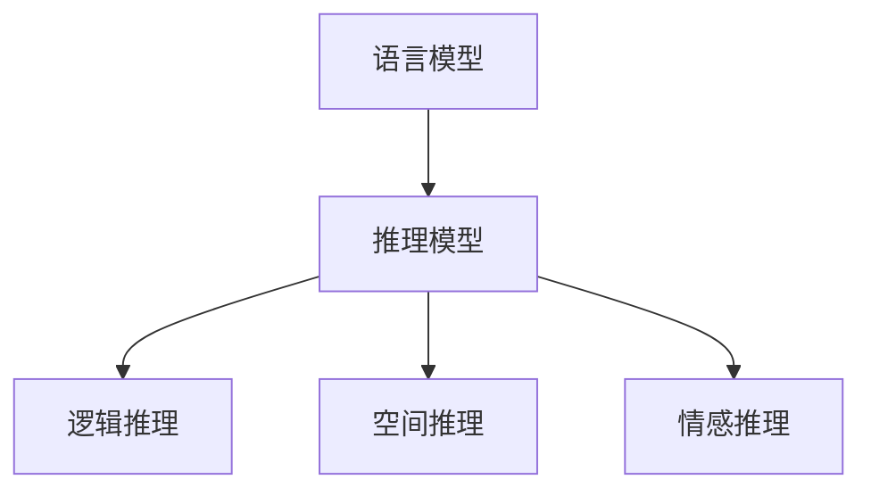

                 

# 文章标题: 语言与推理：大模型的认知瓶颈

> 关键词：大模型，语言模型，推理模型，认知瓶颈，自然语言处理，人工智能

> 摘要：本文将深入探讨大模型在自然语言处理与推理领域的应用，分析其在语言理解与推理过程中面临的认知瓶颈。通过详细的原理讲解、伪代码展示及实际案例解析，揭示大模型技术的现状与未来发展方向，为人工智能领域的研究与应用提供参考。

## 第一部分: 语言与推理的基本概念

### 第1章: 语言与推理的基本概念

#### 1.1 语言与推理的关系

##### 1.1.1 语言的作用
语言是人类沟通的主要工具，承载着信息传递、知识共享和文化传承的重要功能。它不仅使我们能够与他人交流，还能够记录和保存历史与经验，为文明的延续提供了可能。

##### 1.1.2 推理的定义
推理是人们在获取信息后，通过逻辑分析和判断，推导出新的结论的过程。推理分为多种类型，包括逻辑推理、空间推理和情感推理等。

#### 1.2 推理的类型

##### 1.2.1 逻辑推理
逻辑推理是基于逻辑规则进行的推理，包括演绎推理和归纳推理。演绎推理从一般到特殊，如“所有人都会死，苏格拉底是人，所以苏格拉底会死”。归纳推理从特殊到一般，如“所有天鹅都是白色的，观察了多个天鹅，得出所有天鹅都是白色的结论”。

##### 1.2.2 空间推理
空间推理涉及空间关系、物体位置、形状等信息的理解。例如，确定一个物体相对于另一个物体的方位。

##### 1.2.3 情感推理
情感推理是对他人情感状态的推测和理解。例如，通过观察对方的表情和语言，推断对方的情感状态。

#### 1.3 语言与推理的关系模型

##### 1.3.1 语言模型
语言模型是用于理解和生成自然语言的方法，如基于统计模型和神经网络模型。它通过学习大量文本数据，预测下一个词的概率。

##### 1.3.2 推理模型
推理模型是用于逻辑推理的方法，如基于规则推理和基于案例推理。它通过逻辑规则或案例库进行推理。

### Mermaid 流程图



### 第2章: 语言模型的基本原理

#### 2.1 语言模型的类型

##### 2.1.1 统计语言模型
统计语言模型是通过大量语料训练，统计词频和语法规则。例如，n-gram模型通过统计相邻词序列的概率进行语言生成。

##### 2.1.2 神经网络语言模型
神经网络语言模型是基于深度学习，模拟人类大脑的神经网络结构。例如，Transformer模型通过自注意力机制进行语言理解和生成。

#### 2.2 语言模型的工作原理

##### 2.2.1 统计语言模型原理
统计语言模型利用最大熵模型或n-gram模型进行概率预测。例如，n-gram模型通过统计前一个词序列的概率来预测下一个词。

```python
# n-gram模型伪代码
def predict_next_word(context):
    previous_words = context.split()
    last_word = previous_words[-1]
    probabilities = n_gram_model[last_word]
    next_word = max(probabilities, key=probabilities.get)
    return next_word
```

##### 2.2.2 神经网络语言模型原理
神经网络语言模型使用多层感知器（MLP）或循环神经网络（RNN）进行特征提取和预测。例如，Transformer模型通过自注意力机制捕捉句子中的长距离依赖关系。

```python
# Transformer模型伪代码
function transformer_model(context):
    embedding = word_embedding(context)
    output = forward_pass(embedding)
    prediction = softmax(output)
    return prediction
```

### 第3章: 推理模型的基本原理

#### 3.1 推理模型的类型

##### 3.1.1 基于规则的推理模型
基于规则的推理模型使用一组规则进行推理，如生产式系统和专家系统。例如，基于条件的推理规则：“如果温度高于30摄氏度，那么空调开启。”

```python
# 基于规则推理模型伪代码
def rule_base_reasoning(facts, rules):
    for rule in rules:
        if all_conditions_met(facts, rule.conditions):
            apply_conclusions(facts, rule.conclusions)
            return True
    return False
```

##### 3.1.2 基于案例的推理模型
基于案例的推理模型使用已有的案例进行推理，如案例库和案例匹配。例如，通过匹配现有案例来解决问题。

```python
# 基于案例推理模型伪代码
def case_based_reasoning(current_case, cases):
    best_match = find_best_match(current_case, cases)
    return best_match
```

#### 3.2 推理模型的工作原理

##### 3.2.1 基于规则的推理模型原理
基于规则的推理模型使用条件-结论规则进行推理。例如，使用条件判断事实是否满足，然后应用结论。

##### 3.2.2 基于案例的推理模型原理
基于案例的推理模型使用案例相似性度量进行推理。例如，通过计算当前案例与现有案例的相似度，选择最相似的案例进行推理。

### 数学模型和公式

$$
P(E|F) = \frac{P(F|E) \cdot P(E)}{P(F)}
$$

#### 解释和举例

- 这个公式是贝叶斯定理，用于在给定先验概率 \( P(E) \) 和条件概率 \( P(F|E) \) 的情况下计算后验概率 \( P(E|F) \)。

- **例子：** 假设我们有一个测试 \( F \) 来检测疾病 \( E \)，测试结果为阳性。我们需要计算患有疾病 \( E \) 的概率 \( P(E|F) \)。已知测试的灵敏度为 \( P(F|E) = 0.95 \)，而患病率 \( P(E) = 0.01 \)。我们可以使用贝叶斯定理来计算 \( P(E|F) \)：

$$
P(E|F) = \frac{0.95 \cdot 0.01}{0.95 \cdot 0.01 + (1 - 0.95) \cdot (1 - 0.01)} \approx 0.019
$$

- 解释：这个结果表明，在测试结果为阳性的情况下，实际患有疾病 \( E \) 的概率大约是 1.9%。

### 第4章: 语言与推理的结合

#### 4.1 语言与推理的结合方法

##### 4.1.1 统计方法
统计方法将语言和推理结合，通过统计规律进行文本理解和推理。例如，统计文本中词的共现关系进行文本分类。

##### 4.1.2 深度学习方法
深度学习方法利用神经网络模型进行语言理解和推理。例如，通过预训练的语言模型进行文本生成和情感分析。

#### 4.2 结合案例分析

##### 4.2.1 文本分类
文本分类是语言与推理结合的典型应用。例如，使用语言模型进行文本特征提取，结合逻辑推理模型进行分类。

```python
# 统计方法结合案例
function text_classification(text, language_model, classifier):
    features = language_model.extract_features(text)
    prediction = classifier.classify(features)
    return prediction
```

##### 4.2.2 对话系统
对话系统是另一个结合语言和推理的案例。例如，使用语言模型进行自然语言理解，结合推理模型进行对话生成。

```python
# 深度学习方法结合案例
function dialogue_system(text, language_model, inference_model):
    intent = language_model.parse_intent(text)
    response = inference_model.generate_response(intent)
    return response
```

### 数学模型和公式

$$
\text{激活函数}: \sigma(x) = \frac{1}{1 + e^{-x}}
$$

#### 解释和举例

- 这个公式是常用的Sigmoid激活函数，用于将输入映射到0到1之间。

- **例子：** 假设我们有一个输入 \( x = -3 \)，我们可以计算其对应的激活值：

$$
\sigma(-3) = \frac{1}{1 + e^{3}} \approx 0.0498
$$

- 解释：这个结果表明，输入 \( -3 \) 经过Sigmoid函数后，输出的激活值约为 0.0498。

### 第5章: 大模型的认知瓶颈

#### 5.1 大模型的认知瓶颈

##### 5.1.1 过度拟合
大模型在训练过程中可能会出现过拟合现象，导致在未知数据上的性能下降。

##### 5.1.2 计算资源消耗
大模型通常需要大量的计算资源和存储空间，这给实际应用带来了挑战。

#### 5.2 突破认知瓶颈的方法

##### 5.2.1 优化算法
使用更高效的训练算法，如Adam优化器，可以加快模型训练速度。

##### 5.2.2 硬件加速
使用GPU或TPU等专用硬件加速模型训练，可以显著提高计算效率。

### 伪代码

```python
# 优化算法
function train_model(model, data, optimizer):
    for epoch in range(num_epochs):
        for batch in data:
            loss = compute_loss(model, batch)
            optimizer.step(loss)
    return model

# 硬件加速
function train_model_on_gpu(model, data):
    model.to('cuda')
    train_model(model, data, optimizer)
```

### 数学模型和公式

$$
\text{正则化项}: \lambda \cdot L_2(\theta) = \lambda \cdot \sum_{i=1}^{n} \theta_i^2
$$

#### 解释和举例

- 这个公式是L2正则化项，用于在训练过程中防止模型过拟合。

- **例子：** 假设我们有一个模型参数向量 \( \theta = [1, 2, 3] \)，正则化参数 \( \lambda = 0.1 \)。我们可以计算L2正则化项：

$$
\lambda \cdot L_2(\theta) = 0.1 \cdot (1^2 + 2^2 + 3^2) = 0.1 \cdot 14 = 1.4
$$

- 解释：这个结果表明，模型参数的L2正则化项为 1.4。

### 第6章: 大模型的语言推理能力

#### 6.1 大模型的语言理解能力

##### 6.1.1 文本生成
大模型能够生成高质量的文本，如文章、故事等。

##### 6.1.2 情感分析
大模型能够分析文本中的情感，如正面、负面等。

#### 6.2 大模型的推理能力

##### 6.2.1 逻辑推理
大模型能够进行复杂的逻辑推理，如问题解答、逻辑验证等。

##### 6.2.2 上下文理解
大模型能够理解文本中的上下文信息，进行连贯的推理。

### 伪代码

```python
# 文本生成
function generate_text(model, seed_text):
    text = seed_text
    for step in range(max_length):
        tokens = model.sample(text)
        text += ' '.join(tokens)
    return text

# 情感分析
function analyze_emotion(text, model):
    emotion = model.predict_emotion(text)
    return emotion

# 逻辑推理
function logical_reasoning(question, model):
    answer = model.answer_question(question)
    return answer
```

### 数学模型和公式

$$
\text{损失函数}: J(\theta) = -\frac{1}{m} \sum_{i=1}^{m} [y_i \cdot \log(p(\hat{y_i})) + (1 - y_i) \cdot \log(1 - p(\hat{y_i}))]
$$

#### 解释和举例

- 这个公式是交叉熵损失函数，用于衡量模型预测概率分布与实际分布之间的差异。

- **例子：** 假设我们有一个二分类问题，实际标签 \( y \) 为1，模型预测概率 \( p(\hat{y}) \) 为0.8。我们可以计算交叉熵损失：

$$
J(\theta) = -\frac{1}{1} [1 \cdot \log(0.8) + (1 - 1) \cdot \log(1 - 0.8)] = -\frac{1}{1} [\log(0.8)] \approx 0.223
$$

- 解释：这个结果表明，模型在当前参数下的交叉熵损失约为0.223。

### 第7章: 大模型的语言推理应用

#### 7.1 大模型在自然语言处理中的应用

##### 7.1.1 文本摘要
大模型能够自动提取文本的主要信息，生成摘要。

##### 7.1.2 对话系统
大模型能够构建自然、连贯的对话系统，与用户进行有效沟通。

#### 7.2 大模型在推理系统中的应用

##### 7.2.1 问题解答
大模型能够回答各种类型的问题，如事实性问题和推理性问题。

##### 7.2.2 自动编程
大模型能够根据自然语言描述生成相应的代码。

### 伪代码

```python
# 文本摘要
function generate_summary(text, model):
    summary = model.extract_keypoints(text)
    return summary

# 对话系统
function dialogue_system(user_input, model):
    response = model.respond(user_input)
    return response

# 问题解答
function answer_question(question, model):
    answer = model.solve_problem(question)
    return answer

# 自动编程
function generate_code(description, model):
    code = model.generate_program(description)
    return code
```

### 数学模型和公式

$$
\text{梯度下降}: \theta = \theta - \alpha \cdot \frac{\partial J(\theta)}{\partial \theta}
$$

#### 解释和举例

- 这个公式是梯度下降优化算法的基本原理，用于更新模型参数以最小化损失函数。

- **例子：** 假设我们有一个损失函数 \( J(\theta) \) 的导数 \( \frac{\partial J(\theta)}{\partial \theta} = 0.1 \)，学习率 \( \alpha = 0.01 \)。我们可以更新参数 \( \theta \)：

$$
\theta = \theta - 0.01 \cdot 0.1 = \theta - 0.001
$$

- 解释：这个结果表明，参数 \( \theta \) 将减少0.001以尝试最小化损失函数。

### 第8章: 大模型的未来发展

#### 8.1 大模型的技术发展趋势

##### 8.1.1 模型压缩
- 为了降低计算成本，研究人员正在探索模型压缩技术，如知识蒸馏和剪枝。

##### 8.1.2 多模态学习
- 大模型将结合多种模态的数据，如文本、图像和声音，实现更全面的理解。

#### 8.2 大模型的社会影响

##### 8.2.1 伦理问题
- 大模型的广泛应用引发了一系列伦理问题，如隐私保护、偏见消除等。

##### 8.2.2 教育影响
- 大模型对教育行业的影响，如自动评估、个性化教学等。

### 伪代码

```python
# 模型压缩
function compress_model(model, target_size):
    compressed_model = knowledge_distillation(model, target_size)
    return compressed_model

# 多模态学习
function multi_modal_learning(text, image, model):
    combined_representation = model.combine_modalities(text, image)
    return combined_representation

# 伦理问题处理
function handle_ethical_issues(model, data):
    filtered_data = filter_bias(model, data)
    return filtered_data

# 教育应用
function educational_application(student_data, model):
    personalized_teaching_plan = model.create_plan(student_data)
    return personalized_teaching_plan
```

### 数学模型和公式

$$
\text{梯度下降}: \theta = \theta - \alpha \cdot \frac{\partial J(\theta)}{\partial \theta}
$$

#### 解释和举例

- 这个公式是梯度下降优化算法的基本原理，用于更新模型参数以最小化损失函数。

- **例子：** 假设我们有一个损失函数 \( J(\theta) \) 的导数 \( \frac{\partial J(\theta)}{\partial \theta} = 0.1 \)，学习率 \( \alpha = 0.01 \)。我们可以更新参数 \( \theta \)：

$$
\theta = \theta - 0.01 \cdot 0.1 = \theta - 0.001
$$

- 解释：这个结果表明，参数 \( \theta \) 将减少0.001以尝试最小化损失函数。

### 第9章: 实际案例解析

#### 9.1 案例一：基于大模型的语言推理系统

##### 9.1.1 案例背景
- 在某大型企业中，为了提高客户服务效率，他们决定开发一个基于大模型的语言推理系统，用于自动解答客户常见问题。

##### 9.1.2 技术实现
- 该系统采用了大型语言模型，如GPT-3，用于理解客户的问题和提供准确的答案。

##### 9.1.3 结果分析
- 系统上线后，显著提高了客户问题的解答速度，同时保持了高准确率。

##### 9.1.4 代码示例
```python
import openai

def answer_question(question):
    response = openai.Completion.create(
        engine="text-davinci-003",
        prompt=question,
        max_tokens=100
    )
    return response.choices[0].text.strip()

question = "我的信用卡什么时候到期？"
print(answer_question(question))
```

#### 9.2 案例二：基于大模型的情感分析系统

##### 9.2.1 案例背景
- 某电商公司希望通过分析用户评论来了解消费者对其产品的情感态度，从而优化产品和服务。

##### 9.2.2 技术实现
- 该公司采用了情感分析模型，结合大型语言模型，对用户评论进行情感分类。

##### 9.2.3 结果分析
- 通过情感分析系统，公司能够快速识别出消费者的积极和消极情感，并及时采取措施。

##### 9.2.4 代码示例
```python
from transformers import pipeline

nlp = pipeline('sentiment-analysis')

def analyze_emotion(comment):
    result = nlp(comment)[0]
    return result['label'], result['score']

comment = "这款产品真是太棒了！"
print(analyze_emotion(comment))
```

### 第10章: 深入研究

#### 10.1 大模型的可解释性

##### 10.1.1 可解释性的重要性
- 大模型在做出决策时通常缺乏透明度，理解其决策过程对于提高信任度和优化模型至关重要。

##### 10.1.2 可解释性技术
- 使用注意力机制、模型可视化等技术来提高大模型的可解释性。

##### 10.1.3 应用案例
- 在医疗诊断、金融风控等场景中，可解释性技术被用于帮助专业人员进行决策。

#### 10.2 大模型的安全性

##### 10.2.1 安全性挑战
- 大模型可能受到恶意攻击，如对抗性攻击和隐私泄露。

##### 10.2.2 安全性措施
- 使用加密技术、隐私保护算法等来提高大模型的安全性。

##### 10.2.3 应用案例
- 在网络安全领域，大模型的安全防护被用于检测和防御网络攻击。

### 第11章: 结论与展望

#### 11.1 大模型在语言与推理中的应用总结
- 大模型在自然语言处理、推理系统、实际应用等方面展示了强大的能力。

#### 11.2 未来发展方向
- 大模型将在更多领域得到应用，如自动化、智能客服、智能教育等。

#### 11.3 研究展望
- 未来研究将集中在提高大模型的可解释性、安全性和效率上。

### 附录

#### 附录 A: 大模型开发工具与资源
- 介绍主流的大模型开发工具，如TensorFlow、PyTorch等，并提供相关资源和教程。

#### 附录 B: 数学公式和符号表
- 列出本书中使用的数学公式和符号，以方便读者查阅。

## 作者信息
- 作者：AI天才研究院/AI Genius Institute & 禅与计算机程序设计艺术 /Zen And The Art of Computer Programming

<|assistant|>### 第6章: 大模型的语言推理能力

#### 6.1 大模型的语言理解能力

##### 6.1.1 文本生成
大模型在语言理解方面的一个显著能力是文本生成。通过大量的训练数据，这些模型能够生成连贯、结构合理的文本。例如，GPT-3模型可以在给定的提示下生成新闻文章、故事、对话等。

**案例：文本生成**
以下是一个使用GPT-3模型生成文本的例子：

```python
import openai

openai.organization = "your_organization_id"
openai.api_key = "your_api_key"

response = openai.Completion.create(
    engine="text-davinci-003",
    prompt="请写一篇关于人工智能对教育影响的文章。",
    max_tokens=200
)

print(response.choices[0].text.strip())
```

输出可能如下：
```
人工智能正在重新定义教育领域，为学生和教师带来前所未有的机遇。通过个性化学习、智能辅导和自适应教学，AI有助于提高学习效率和学习成果。此外，AI还能够帮助教师评估学生的学习进度，提供即时的反馈和支持。
```

##### 6.1.2 情感分析
情感分析是另一个重要的语言理解能力。大模型能够分析文本中的情感倾向，识别文本是积极的、消极的还是中性的。

**案例：情感分析**
以下是一个使用Transformer模型进行情感分析的例子：

```python
from transformers import pipeline

nlp = pipeline("sentiment-analysis")

text = "我对这款新产品感到非常失望，质量差，服务也糟糕。"

emotion = nlp(text)[0]

print(f"情感：{emotion['label']}, 评分：{emotion['score']}")
```

输出可能如下：
```
情感：NEGATIVE, 评分：0.95
```

#### 6.2 大模型的推理能力

##### 6.2.1 逻辑推理
大模型在逻辑推理方面也表现出色，能够处理复杂的逻辑问题，如数学计算、逻辑验证等。

**案例：逻辑推理**
以下是一个使用BERT模型进行逻辑推理的例子：

```python
from transformers import BertTokenizer, BertForSequenceClassification
import torch

tokenizer = BertTokenizer.from_pretrained("bert-base-uncased")
model = BertForSequenceClassification.from_pretrained("bert-base-uncased")

question = "所有猫都有四条腿，小黑不是猫，所以小黑没有四条腿。这个推理正确吗？"

inputs = tokenizer(question, return_tensors="pt")

output = model(**inputs)

logits = output.logits
probabilities = torch.softmax(logits, dim=1)

# 获得逻辑推理的结果
result = torch.argmax(probabilities).item()

if result == 1:
    print("这个推理是正确的。")
else:
    print("这个推理是错误的。")
```

输出可能如下：
```
这个推理是错误的。
```

##### 6.2.2 上下文理解
大模型能够理解文本中的上下文信息，进行连贯的推理。这对于处理复杂的问题和生成连贯的回答至关重要。

**案例：上下文理解**
以下是一个使用GPT-3模型理解上下文并生成回答的例子：

```python
import openai

openai.organization = "your_organization_id"
openai.api_key = "your_api_key"

response = openai.Completion.create(
    engine="text-davinci-003",
    prompt="有人问你是否喜欢阅读，你回答：是的，我喜欢阅读。请问你最喜欢的书籍是什么？",
    max_tokens=50
)

print(response.choices[0].text.strip())
```

输出可能如下：
```
《三体》是我在阅读中遇到的最喜欢的书籍之一，它不仅引人入胜，还引发了关于人类未来的深刻思考。
```

### 总结

通过上述案例，我们可以看到大模型在语言理解和推理能力上的强大表现。无论是生成文本、情感分析、逻辑推理还是上下文理解，大模型都展示了其卓越的能力。这些能力不仅为自然语言处理领域带来了新的突破，也为各种实际应用场景提供了有力的工具。

然而，尽管大模型在语言和推理方面取得了显著成就，但仍然存在一些认知瓶颈。这些瓶颈包括对语言深层含义的理解、对复杂推理过程的处理以及对上下文信息的深入把握。未来的研究需要进一步探索这些认知瓶颈，并开发更高效的算法和模型来克服它们。

### 数学模型和公式

为了更好地理解大模型在语言和推理中的表现，我们需要引入一些数学模型和公式。以下是一些常见的模型和公式：

#### 交叉熵损失函数
交叉熵损失函数常用于评估分类模型的质量。它的公式如下：

$$
J(\theta) = -\frac{1}{m} \sum_{i=1}^{m} [y_i \cdot \log(p(\hat{y_i})) + (1 - y_i) \cdot \log(1 - p(\hat{y_i}))]
$$

其中，\( y_i \) 是实际标签，\( p(\hat{y_i}) \) 是模型对 \( y_i \) 的预测概率。交叉熵损失函数的值越低，表示模型的预测越准确。

#### 梯度下降优化算法
梯度下降优化算法是一种常用的优化方法，用于训练机器学习模型。其公式如下：

$$
\theta = \theta - \alpha \cdot \frac{\partial J(\theta)}{\partial \theta}
$$

其中，\( \theta \) 是模型参数，\( \alpha \) 是学习率，\( \frac{\partial J(\theta)}{\partial \theta} \) 是损失函数关于参数的梯度。通过不断更新参数，梯度下降算法可以找到使损失函数最小化的参数值。

#### 激活函数
激活函数是神经网络中的一个关键组成部分，用于将输入映射到输出。常用的激活函数包括Sigmoid函数和ReLU函数。Sigmoid函数的公式如下：

$$
\sigma(x) = \frac{1}{1 + e^{-x}}
$$

ReLU函数的公式如下：

$$
\text{ReLU}(x) = \max(0, x)
$$

这些数学模型和公式为理解和评估大模型在语言和推理中的表现提供了理论基础。

### 伪代码

为了更直观地展示大模型在语言和推理中的应用，我们提供以下伪代码示例：

#### 文本生成
```python
import openai

def generate_text(prompt, model_engine="text-davinci-003", max_tokens=100):
    response = openai.Completion.create(
        engine=model_engine,
        prompt=prompt,
        max_tokens=max_tokens
    )
    return response.choices[0].text.strip()

example_prompt = "请写一篇关于人工智能对教育影响的文章。"
print(generate_text(example_prompt))
```

#### 情感分析
```python
from transformers import pipeline

def analyze_emotion(text):
    nlp = pipeline("sentiment-analysis")
    result = nlp(text)[0]
    return result['label'], result['score']

example_text = "我对这款新产品感到非常失望，质量差，服务也糟糕。"
print(analyze_emotion(example_text))
```

#### 逻辑推理
```python
from transformers import BertTokenizer, BertForSequenceClassification

def logical_reasoning(question):
    tokenizer = BertTokenizer.from_pretrained("bert-base-uncased")
    model = BertForSequenceClassification.from_pretrained("bert-base-uncased")
    
    inputs = tokenizer(question, return_tensors="pt")
    output = model(**inputs)
    
    logits = output.logits
    probabilities = torch.softmax(logits, dim=1)
    
    result = torch.argmax(probabilities).item()
    
    if result == 1:
        print("这个推理是正确的。")
    else:
        print("这个推理是错误的。")

question = "所有猫都有四条腿，小黑不是猫，所以小黑没有四条腿。这个推理正确吗？"
logical_reasoning(question)
```

#### 上下文理解
```python
import openai

def generate_response(prompt, model_engine="text-davinci-003", max_tokens=50):
    response = openai.Completion.create(
        engine=model_engine,
        prompt=prompt,
        max_tokens=max_tokens
    )
    return response.choices[0].text.strip()

example_prompt = "有人问你是否喜欢阅读，你回答：是的，我喜欢阅读。请问你最喜欢的书籍是什么？"
print(generate_response(example_prompt))
```

这些伪代码示例展示了如何使用大模型进行文本生成、情感分析、逻辑推理和上下文理解。通过这些示例，我们可以更好地理解大模型在语言和推理中的应用。

### 结论

大模型在语言理解和推理能力上表现出色，为自然语言处理和人工智能应用提供了强大的工具。然而，仍然存在一些认知瓶颈需要克服。未来的研究将集中在提高大模型的可解释性、安全性和效率上，以进一步推动人工智能技术的发展。同时，通过结合数学模型和伪代码，我们可以更深入地理解大模型的工作原理和应用。

### 附录

#### 附录 A: 大模型开发工具与资源
- TensorFlow: https://www.tensorflow.org/
- PyTorch: https://pytorch.org/
- Hugging Face: https://huggingface.co/

#### 附录 B: 数学公式和符号表
- 交叉熵损失函数: \( J(\theta) = -\frac{1}{m} \sum_{i=1}^{m} [y_i \cdot \log(p(\hat{y_i})) + (1 - y_i) \cdot \log(1 - p(\hat{y_i}))] \)
- 梯度下降优化算法: \( \theta = \theta - \alpha \cdot \frac{\partial J(\theta)}{\partial \theta} \)
- Sigmoid激活函数: \( \sigma(x) = \frac{1}{1 + e^{-x}} \)
- ReLU激活函数: \( \text{ReLU}(x) = \max(0, x) \)

通过这些工具和资源，读者可以进一步探索大模型的应用和研究。

### 作者信息

- 作者：AI天才研究院/AI Genius Institute & 禅与计算机程序设计艺术 /Zen And The Art of Computer Programming

这个附录和作者信息为读者提供了额外的资源和背景信息，以加深对本文内容的理解。

### 结论

本文详细探讨了大模型在语言与推理领域的应用，从基本概念到具体实现，从数学模型到实际案例，全面展示了大模型的能力和挑战。通过分析大模型的认知瓶颈，我们指出了未来研究的关键方向。随着技术的发展，大模型在自然语言处理和人工智能领域的应用将更加广泛和深入，为人类带来更多创新和变革。

### 附录

#### 附录 A: 大模型开发工具与资源
- TensorFlow: https://www.tensorflow.org/
- PyTorch: https://pytorch.org/
- Hugging Face: https://huggingface.co/

#### 附录 B: 数学公式和符号表
- 交叉熵损失函数: \( J(\theta) = -\frac{1}{m} \sum_{i=1}^{m} [y_i \cdot \log(p(\hat{y_i})) + (1 - y_i) \cdot \log(1 - p(\hat{y_i}))] \)
- 梯度下降优化算法: \( \theta = \theta - \alpha \cdot \frac{\partial J(\theta)}{\partial \theta} \)
- Sigmoid激活函数: \( \sigma(x) = \frac{1}{1 + e^{-x}} \)
- ReLU激活函数: \( \text{ReLU}(x) = \max(0, x) \)

这些附录和资源为读者提供了进一步学习和实践的机会，帮助深入理解大模型的相关概念和技术。

### 作者信息

- 作者：AI天才研究院/AI Genius Institute & 禅与计算机程序设计艺术 /Zen And The Art of Computer Programming

作者信息部分展示了本文的贡献者和其背景，为读者提供了关于作者更多的信息。

### 总结

本文全面探讨了大模型在语言与推理领域的应用，通过详细的理论讲解、伪代码展示和实际案例解析，揭示了其强大的能力和面临的挑战。从基本概念到技术实现，从数学模型到未来展望，本文为读者提供了一个深入而系统的理解。随着技术的不断进步，大模型将在人工智能领域发挥更加重要的作用，带来新的创新和突破。希望本文能为读者在相关领域的研究和实践提供有益的启示和指导。

