                 

## 文章标题

《语言与推理：大模型的认知误区》

## 关键词

- 语言模型
- 推理能力
- 认知误区
- 大模型
- 人工智能
- 伦理问题

## 摘要

本文旨在探讨大模型在语言理解和推理过程中的认知误区。通过深入分析语言与推理的基础，大模型的特点及其在应用中的误区，本文揭示了语言理解中的误理解、语义解读失误以及推理过程中的逻辑偏差等问题。针对这些问题，本文提出了修正策略和技术手段，并讨论了大模型认知误区在应用领域的挑战与伦理问题。本文的研究不仅有助于提升大模型在语言与推理任务中的表现，也为未来的人工智能发展提供了理论支持和实践指导。

## 《语言与推理：大模型的认知误区》目录大纲

### 第一部分：引论

#### 第1章：语言与推理的基础

##### 1.1 语言的结构与功能
- 语言符号的构成
- 语言功能的多样性
- 语言习得与语言使用

##### 1.2 推理的定义与类型
- 推理的基本概念
- 逻辑推理与非逻辑推理
- 形式推理与直觉推理

##### 1.3 大模型认知研究的现状
- 大模型的基本特点
- 大模型在语言理解与推理中的应用
- 大模型认知研究的挑战与问题

#### 第2章：大模型的认知误区概述

##### 2.1 认知误区的概念
- 认知误区的定义
- 认知误区的分类
- 认知误区的形成机制

##### 2.2 大模型认知误区的影响
- 大模型认知误区的表现
- 大模型认知误区的后果
- 大模型认知误区的案例分析

##### 2.3 本书的研究目标与结构
- 研究背景与意义
- 研究方法与内容安排

### 第二部分：大模型的认知误区分析

#### 第3章：语言理解的认知误区

##### 3.1 语言理解的基本过程
- 听觉处理与语音识别
- 词汇理解与语义分析
- 句法分析与语义角色标注

##### 3.2 大模型在语言理解中的认知误区
- 对语言结构的误理解
- 对语言意义的误解读
- 对语言使用情境的误解

##### 3.3 语言理解认知误区的案例分析
- 日常对话中的误区
- 文本分析中的误区
- 机器翻译中的误区

#### 第4章：推理能力的认知误区

##### 4.1 推理能力的定义与分类
- 推理能力的构成
- 推理能力的评估方法
- 推理能力的分类

##### 4.2 大模型在推理能力中的认知误区
- 推理过程的误解
- 推理结果的误导
- 推理逻辑的错位

##### 4.3 推理能力认知误区的案例分析
- 逻辑推理中的误区
- 日常决策中的误区
- 专家系统中的误区

#### 第5章：语言与推理互动中的认知误区

##### 5.1 语言与推理的互动机制
- 语言表达的推理需求
- 推理结果的语言表达
- 语言与推理的动态互动

##### 5.2 大模型在语言与推理互动中的认知误区
- 语言表达与推理过程的脱节
- 推理结果与语言表达的错位
- 语言与推理的互动障碍

##### 5.3 语言与推理互动认知误区的案例分析
- 交流障碍中的误区
- 文本生成中的误区
- 语言理解与推理融合中的误区

#### 第6章：大模型认知误区的修正策略

##### 6.1 修正认知误区的方法论
- 数据增强与多样化
- 预训练策略的优化
- 训练过程的监督与反馈

##### 6.2 修正认知误区的技术手段
- 对抗性训练
- 人类反馈强化学习
- 多模态学习与融合

##### 6.3 修正认知误区的案例研究
- 语言理解认知误区的修正
- 推理能力认知误区的修正
- 语言与推理互动认知误区的修正

#### 第7章：大模型认知误区的应用与伦理

##### 7.1 大模型认知误区的应用领域
- 自动问答系统
- 机器翻译
- 语音识别

##### 7.2 大模型认知误区的伦理问题
- 数据隐私与安全问题
- 人工智能的伦理责任
- 社会公平与偏见

##### 7.3 大模型认知误区应用的伦理规范
- 数据使用与隐私保护
- 人工智能的伦理审查
- 社会责任与可持续发展

### 第三部分：结论与展望

#### 第8章：大模型认知误区的总结与展望

##### 8.1 大模型认知误区的研究成果
- 主要发现
- 主要贡献
- 不足与挑战

##### 8.2 大模型认知误区研究的未来方向
- 新技术的研究与应用
- 跨学科研究的前景
- 伦理与法律的挑战

##### 8.3 结论
- 对语言与推理研究的意义
- 对人工智能发展的贡献

### 附录

##### 附录A：大模型认知误区的Mermaid流程图
- 语言理解的流程图
- 推理能力的流程图
- 语言与推理互动的流程图

##### 附录B：大模型认知误区修正的伪代码示例
- 对抗性训练伪代码
- 人类反馈强化学习伪代码
- 多模态学习与融合伪代码

##### 附录C：参考文献
- 引用的相关文献与资料

## 第一部分：引论

### 第1章：语言与推理的基础

#### 1.1 语言的结构与功能

语言是人类交流思想和表达意愿的重要工具，其结构和功能复杂多样。从语言符号的构成来看，语言符号包括语音、词汇和语法三大要素。语音是语言的声音形式，是语言的基本物理载体。词汇是语言的基本单元，是构成句子的基本成分。语法则是语言的规则系统，用于规定词汇的排列组合方式。

语言的功能主要表现在以下几个方面：

1. **交流功能**：语言是人类进行社会交流和沟通的基础，通过语言，人们可以表达思想、交流情感和传递信息。

2. **思维功能**：语言不仅是交流的工具，也是思维的工具。人们通过语言来进行抽象思维、逻辑推理和创造性思考。

3. **认知功能**：语言对人类认知世界起着重要作用。通过语言，人们可以描述事物、分类事物，并形成概念和理论。

4. **文化功能**：语言是文化的重要组成部分，它承载着人类的历史、传统和价值观念。

#### 语言习得与语言使用

语言习得是指个体从不会说话到能够流利地使用语言的过程。语言习得的过程主要包括语音习得、词汇习得和语法习得。语音习得是指儿童从听到语音到能够发出相应语音的过程。词汇习得是指儿童从识别单词到能够使用单词表达意思的过程。语法习得是指儿童从理解简单句子到能够构建复杂句子的过程。

语言使用是指个体在实际交流中运用语言的过程。语言使用不仅包括口头表达，还包括书面表达、肢体语言等多种形式。在实际使用中，语言的使用情境、语境以及交际对象都会影响语言的表达和效果。

#### 1.2 推理的定义与类型

推理是指从已知的信息推导出未知信息的过程。推理在人类的认知活动中扮演着重要角色，无论是日常决策、科学研究还是技术发展，推理都是不可或缺的。

根据推理的方法和形式，可以将推理分为以下几种类型：

1. **逻辑推理**：逻辑推理是基于逻辑规则进行的推理，它要求推理过程符合逻辑的严谨性。逻辑推理分为演绎推理和归纳推理。演绎推理是从一般到特殊的推理方式，例如，所有人都会死亡，苏格拉底是人，因此苏格拉底会死亡。归纳推理是从特殊到一般的推理方式，例如，观察多个天鹅都是白色的，推断所有天鹅都是白色的。

2. **非逻辑推理**：非逻辑推理不依赖于逻辑规则，而是基于直觉、经验、情感等非理性因素进行的推理。例如，根据某人过去的行为推断其未来的行为，或者根据个人喜好来做出决策。

3. **形式推理**：形式推理是指使用数学符号和逻辑公式进行的推理，它强调推理过程的符号化和形式化。形式推理在计算机科学和数学领域有广泛应用。

4. **直觉推理**：直觉推理是基于直觉和经验进行的推理，它往往不依赖于明确的逻辑规则，而是依赖于个体对情境的快速理解和判断。

#### 1.3 大模型认知研究的现状

大模型（Large Models）是指具有海量参数和复杂结构的神经网络模型，如深度学习模型。大模型在计算机视觉、自然语言处理、语音识别等领域取得了显著的成果。大模型的基本特点包括：

1. **参数规模大**：大模型通常包含数亿甚至数千亿个参数，这使得模型具有强大的表示能力和拟合能力。

2. **结构复杂**：大模型通常包含多层神经网络，每一层都能对输入数据进行特征提取和抽象。

3. **预训练与微调**：大模型通常通过在大规模数据集上进行预训练，然后根据特定任务进行微调，以实现良好的性能。

大模型在语言理解与推理中的应用主要包括：

1. **语言理解**：大模型可以用于文本分类、情感分析、信息抽取等任务，通过学习大量文本数据，模型能够理解文本的语义和结构。

2. **推理能力**：大模型可以用于推理任务，如逻辑推理、常识推理和因果推理。通过训练，模型能够从已知信息中推导出新的结论。

尽管大模型在语言理解和推理方面取得了显著成果，但大模型认知研究仍面临许多挑战和问题：

1. **认知误区**：大模型在语言理解与推理过程中可能存在认知误区，如对语言结构的误理解、语义解读失误和推理逻辑的偏差。

2. **可解释性**：大模型的内部工作机制复杂，难以解释其推理过程和决策依据，这给模型的可解释性和透明性带来了挑战。

3. **泛化能力**：大模型在训练数据集上表现出色，但在未见过的数据上可能表现不佳，这反映了大模型的泛化能力有待提高。

4. **伦理问题**：大模型的应用涉及数据隐私、偏见和伦理问题，如算法歧视、隐私泄露等，需要引起关注和解决。

### 第2章：大模型的认知误区概述

#### 2.1 认知误区的概念

认知误区是指人们在认知过程中出现的错误或偏差。认知误区可能源于多种因素，包括认知偏差、信息处理限制、环境因素等。认知误区可以分为以下几类：

1. **信息过滤偏差**：人们在接收和处理信息时，往往只关注与预期一致的信息，而忽视与预期不一致的信息。

2. **确认偏见**：人们倾向于寻找和接受支持自己观点的信息，而忽视或否认反对自己观点的信息。

3. **代表性偏差**：人们在评估概率时，倾向于过度重视样本的代表性，而忽视样本的随机性。

4. **可得性偏差**：人们在评估事件发生的概率时，倾向于依赖近期记忆和容易回忆的信息，而忽视实际发生的频率。

#### 认知误区的分类

根据认知误区的表现形式和成因，可以将其分为以下几类：

1. **感知误区**：包括视觉错觉、听觉错觉等，这些误区源于人们对感官信息的错误解读。

2. **记忆误区**：包括记忆偏差、记忆选择性等，这些误区源于人们对记忆内容的错误处理。

3. **判断误区**：包括判断偏差、过度自信等，这些误区源于人们对信息的错误评估和判断。

4. **决策误区**：包括选择偏差、风险偏好等，这些误区源于人们在决策过程中的错误行为。

#### 认知误区的形成机制

认知误区的形成机制复杂多样，主要包括以下几个方面：

1. **认知偏差**：认知偏差是指人们在信息处理过程中，由于认知结构和心理过程的限制，而产生的对信息的错误解读和处理。

2. **环境因素**：环境因素，如社会文化、媒体宣传等，也会影响人们的认知过程，导致认知误区。

3. **信息过载**：在信息过载的环境下，人们往往无法对大量信息进行有效处理，导致认知误区。

4. **情绪因素**：情绪状态会影响人们的认知过程，如焦虑、恐惧等负面情绪可能导致认知偏差。

#### 2.2 大模型认知误区的影响

大模型在语言理解和推理过程中，可能产生多种认知误区，这些误区对模型的性能和应用产生了重要影响：

1. **误理解**：大模型在理解语言时，可能无法正确解读语言中的复杂结构和隐含意义，导致误理解。

2. **误解读**：大模型在处理语义时，可能无法准确理解词汇和句子的含义，导致误解读。

3. **推理偏差**：大模型在推理过程中，可能由于数据集中存在的偏差或模型本身的局限性，导致推理结果的偏差。

4. **泛化能力下降**：认知误区可能导致大模型在未见过的数据上表现不佳，降低其泛化能力。

5. **伦理风险**：大模型在语言理解和推理过程中，可能放大或固化社会偏见，引发伦理风险。

#### 2.3 本书的研究目标与结构

本书旨在探讨大模型在语言理解和推理过程中的认知误区，分析这些误区的成因、影响及修正策略。具体研究目标包括：

1. **揭示大模型认知误区的类型和表现**：通过分析大模型在语言理解和推理任务中的表现，揭示其存在的认知误区。

2. **分析认知误区的成因和影响**：探讨导致大模型认知误区的原因，分析这些误区对模型性能和应用的影响。

3. **提出修正认知误区的策略和技术手段**：针对大模型认知误区的类型和成因，提出有效的修正策略和技术手段。

本书结构如下：

1. **引论**：介绍语言与推理的基础知识，大模型的基本特点及其在应用中的误区。

2. **大模型的认知误区分析**：分别从语言理解的认知误区、推理能力的认知误区以及语言与推理互动中的认知误区三个方面进行分析。

3. **修正认知误区的策略和技术手段**：介绍针对大模型认知误区提出的修正策略和技术手段。

4. **大模型认知误区的应用与伦理**：探讨大模型认知误区的应用领域、伦理问题及伦理规范。

5. **结论与展望**：总结本书的研究成果，展望大模型认知误区研究的未来方向。

### 第二部分：大模型的认知误区分析

#### 第3章：语言理解的认知误区

#### 3.1 语言理解的基本过程

语言理解是人们通过语言符号获取信息、理解语义和进行推理的过程。语言理解的基本过程可以概括为以下几个阶段：

1. **语音识别**：语音识别是指将语音信号转换为文本的过程。这一过程涉及语音信号的预处理、特征提取和模型训练等步骤。常见的语音识别模型包括隐马尔可夫模型（HMM）、循环神经网络（RNN）和卷积神经网络（CNN）等。

2. **词汇理解**：词汇理解是指识别和理解语言符号中的词汇含义。这一过程涉及词汇的识别、词义解析和上下文理解等步骤。词汇理解需要利用词汇表、词义库和上下文信息等资源。

3. **语义分析**：语义分析是指从语言符号中提取语义信息，理解句子或文本的整体含义。这一过程涉及句法分析、语义角色标注和语义关系推理等步骤。常见的语义分析方法包括基于规则的方法、统计方法和基于深度学习的方法等。

4. **语用理解**：语用理解是指理解语言使用情境和交际意图。这一过程涉及语境分析、情感识别和社会文化因素的理解等步骤。语用理解有助于准确把握语言的实际意义和交际效果。

#### 3.2 大模型在语言理解中的认知误区

大模型在语言理解过程中可能会出现一些认知误区，这些误区会影响模型的性能和应用效果。以下是几种常见的大模型认知误区：

1. **误理解**：大模型可能无法正确理解语言中的复杂结构和隐含意义。例如，在处理歧义句时，模型可能无法准确选择正确的意义。这种误理解可能源于模型对语言结构特征的错误学习或对上下文信息的忽视。

2. **误解读**：大模型在处理语义时可能无法准确理解词汇和句子的含义。例如，在翻译任务中，模型可能将一词多义的词汇翻译成不正确的含义。这种误解读可能源于模型对词汇语义的误解或对语境信息的忽视。

3. **推理偏差**：大模型在推理过程中可能存在偏差，导致推理结果的偏差。例如，在问答系统中，模型可能基于错误的前提条件或推理规则得出错误的答案。这种推理偏差可能源于模型训练数据中的偏差或推理过程的错误。

4. **情感误解**：大模型在情感分析任务中可能无法准确理解语言中的情感色彩。例如，在处理带有讽刺或隐喻的文本时，模型可能无法正确识别其中的情感倾向。这种情感误解可能源于模型对情感表达的错误理解或对情感词汇的忽视。

5. **文化差异**：大模型在处理不同文化背景的文本时可能存在认知误区。例如，在跨文化翻译或交流中，模型可能无法准确理解文化差异和习俗。这种文化差异误解可能源于模型对文化背景信息的缺乏或对文化差异的忽视。

#### 3.3 语言理解认知误区的案例分析

以下通过几个具体的案例来分析大模型在语言理解中可能出现的认知误区：

1. **案例1：歧义句的理解**

假设有一个句子：“他昨天去了图书馆。”这个句子存在歧义，可以理解为“他去的是图书馆”或“他昨天去图书馆学习了”。一个大模型如果无法正确处理这种歧义，可能会导致误理解。

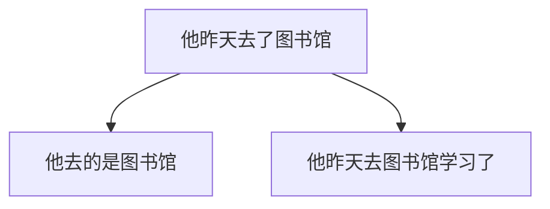

2. **案例2：一词多义的翻译**

假设有一个英文句子：“I saw a man with a camera.”这个句子中的“camera”一词具有多种含义，可以指“照相机”或“摄像机”。如果一个翻译模型无法准确翻译出这个词的具体含义，可能会导致误解读。

```mermaid
graph TD
    A[I saw a man with a camera]
    B[I saw a man with a camera (照相机)]
    C[I saw a man with a camera (摄像机)]
    A --> B
    A --> C
```

3. **案例3：推理偏差的问答**

假设有一个问答系统，问题为：“如果一个人得了感冒，他会怎么样？”正确答案应该是“他会生病”。但一个大模型如果基于错误的前提条件或推理规则，可能会得出错误的答案，如“他会变冷”。

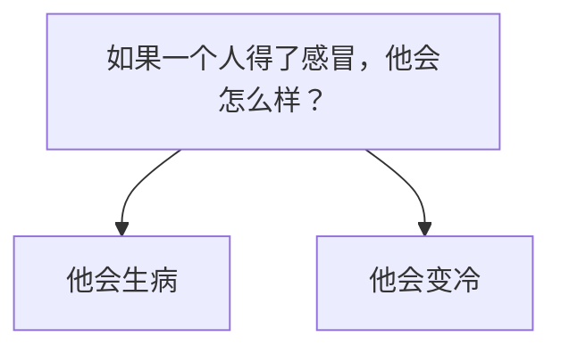

4. **案例4：情感误解的识别**

假设有一个文本：“他的语气听起来很生气。”一个大模型如果无法准确理解“很生气”这一情感色彩，可能会误将文本的情感倾向识别为“很开心”。

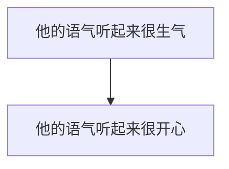

通过以上案例分析，我们可以看到大模型在语言理解中可能出现的认知误区，这些误区对模型的性能和应用产生了重要影响。为了提高大模型在语言理解任务中的表现，我们需要深入研究这些认知误区的成因，并探索有效的修正策略和技术手段。

#### 第4章：推理能力的认知误区

#### 4.1 推理能力的定义与分类

推理能力是指个体在处理信息、进行逻辑分析和解决问题时，运用已有的知识和规则进行推理判断的能力。推理能力在人类的认知活动中起着至关重要的作用，无论是日常生活中的决策，还是科学研究和技术创新，推理能力都是不可或缺的。

推理能力可以按照不同的标准进行分类：

1. **逻辑推理与非逻辑推理**

- **逻辑推理**：逻辑推理是基于逻辑规则和逻辑关系的推理过程，它强调推理的严谨性和逻辑性。逻辑推理包括演绎推理和归纳推理。
  - **演绎推理**：从一般性的前提推导出特定性的结论。例如，所有人都会死亡，苏格拉底是人，因此苏格拉底会死亡。
  - **归纳推理**：从特定性的实例推导出一般性的结论。例如，观察多个天鹅都是白色的，推断所有天鹅都是白色的。
- **非逻辑推理**：非逻辑推理是基于直觉、经验、情感等非理性因素的推理过程。非逻辑推理不依赖于严格的逻辑规则，而是依赖于个体的主观判断和感性认知。

2. **形式推理与直觉推理**

- **形式推理**：形式推理是指使用数学符号和逻辑公式进行的推理，它强调推理过程的符号化和形式化。形式推理在数学、计算机科学和逻辑学等领域有广泛应用。
- **直觉推理**：直觉推理是基于直觉和经验进行的推理，它依赖于个体对情境的快速理解和判断。直觉推理在日常生活、艺术创作和科学发现中扮演重要角色。

3. **个体推理与群体推理**

- **个体推理**：个体推理是指单个个体在处理信息、进行推理和决策的过程。
- **群体推理**：群体推理是指多个个体在共同参与、协作和交流的基础上进行推理的过程。群体推理强调个体之间的互动和协作，可以产生比个体推理更丰富的推理结果。

#### 4.2 大模型在推理能力中的认知误区

大模型在推理能力方面表现出色，但同时也存在一些认知误区，这些误区对模型的推理结果和实际应用产生了负面影响。以下是大模型在推理能力中可能出现的几种认知误区：

1. **数据依赖性**

- **过度依赖训练数据**：大模型在推理过程中可能过度依赖训练数据中的模式和规律，导致在未见过的数据上表现不佳。这种数据依赖性使得模型难以实现良好的泛化能力。
- **样本偏差**：训练数据中的样本偏差可能导致大模型在推理过程中产生偏见，例如，对某些特定类别或属性的过度关注或忽视。

2. **逻辑偏差**

- **推理逻辑错误**：大模型在推理过程中可能存在逻辑错误，例如，从错误的前提条件或假设中推导出错误的结论。这些逻辑偏差可能源于模型对逻辑规则的理解不足或推理过程中的错误应用。
- **推理路径偏差**：大模型在推理过程中可能选择错误的推理路径，导致推理结果偏离真实情况。这种推理路径偏差可能源于模型对信息处理的不完整或不准确。

3. **语义误解**

- **词汇语义错误**：大模型在处理语义时可能对词汇的含义理解错误，导致推理结果偏差。这种语义误解可能源于模型对词汇语义的误解或对上下文信息的忽视。
- **语境理解偏差**：大模型在处理语境时可能无法准确理解语言中的语境含义，导致推理结果偏差。这种语境理解偏差可能源于模型对语境信息的处理不足或对语境关系的误解。

4. **情感偏差**

- **情感误解**：大模型在情感分析任务中可能无法准确理解语言中的情感色彩，导致推理结果偏差。例如，在处理带有讽刺或隐喻的文本时，模型可能无法正确识别其中的情感倾向。
- **情感偏见**：大模型在推理过程中可能受到情感偏见的影响，对某些情感表达产生过度关注或忽视。这种情感偏见可能源于模型对情感表达的错误理解或对情感价值的错误判断。

#### 4.3 推理能力认知误区的案例分析

以下通过几个具体的案例来分析大模型在推理能力中可能出现的认知误区：

1. **案例1：推理逻辑错误**

假设有一个推理问题：“如果今天下雨，那么我会带伞。今天没有下雨，所以我不需要带伞。”这个推理问题中存在逻辑错误，因为即使今天没有下雨，也不能断定不需要带伞，可能明天会下雨。一个大模型如果无法识别这种逻辑错误，可能会导致推理结果偏差。

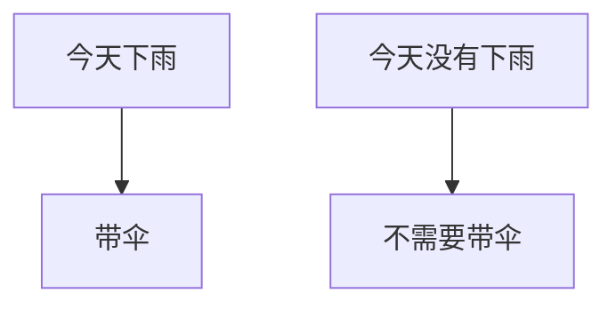

2. **案例2：样本偏差**

假设一个大模型在训练过程中使用了含有性别偏见的语料库，导致模型在性别相关任务上表现出性别偏见。例如，在招聘任务中，模型可能倾向于选择男性候选人，而忽视女性候选人。这种样本偏差可能导致模型在现实应用中产生不公平的结果。

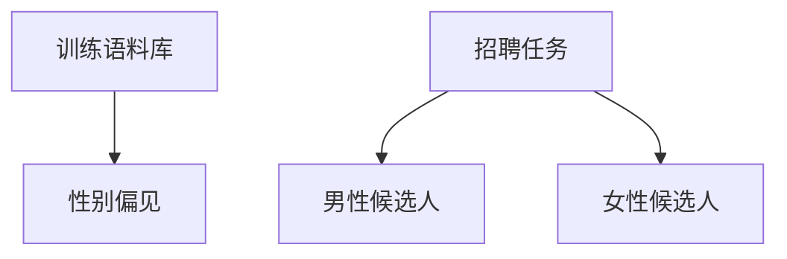

3. **案例3：词汇语义错误**

假设有一个句子：“这个苹果很大。”一个大模型如果将“大”理解为“尺寸大”，而忽视了“大”也可以表示“数量多”的含义，可能导致推理结果偏差。例如，在购物推荐任务中，模型可能错误地将大量商品推荐给用户。

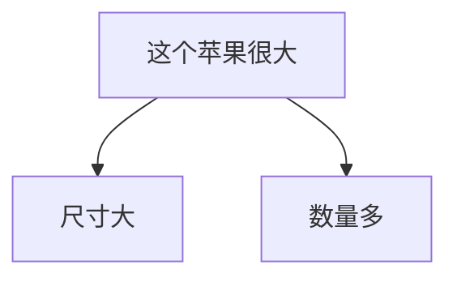

4. **案例4：情感误解**

假设有一个句子：“他听起来很生气。”一个大模型如果将“听起来”理解为“声音大”，而忽视了“听起来”也可以表示“听起来像”的含义，可能导致情感误解。例如，在情感分析任务中，模型可能错误地将该句子识别为积极情感。

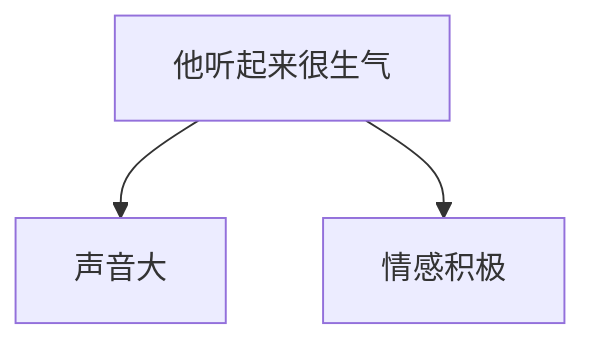

通过以上案例分析，我们可以看到大模型在推理能力中可能出现的认知误区，这些误区对模型的推理结果和实际应用产生了重要影响。为了提高大模型的推理能力，我们需要深入研究这些认知误区的成因，并探索有效的修正策略和技术手段。

#### 第5章：语言与推理互动中的认知误区

#### 5.1 语言与推理的互动机制

语言与推理的互动机制是指在语言交流过程中，推理如何影响语言表达，以及语言表达如何影响推理。这种互动机制是复杂且动态的，涉及到多个层面：

1. **语言表达的推理需求**：语言表达通常包含推理需求，即通过语言来传递信息、论证观点或解决问题。例如，在辩论中，论点与论据之间的逻辑关系需要通过语言进行清晰表达。

2. **推理结果的语言表达**：推理结果需要通过语言进行表达，以便他人理解和验证。推理结果的语言表达不仅需要准确传达推理的过程和结论，还需要考虑语言的自然性和易理解性。

3. **语言与推理的动态互动**：在实际交流中，语言和推理是动态互动的。语言表达可以引导推理过程，而推理结果又可以反馈到语言表达中，从而不断调整和完善语言表达。

#### 5.2 大模型在语言与推理互动中的认知误区

大模型在语言与推理互动中可能存在一些认知误区，这些误区会影响模型的交互效果和应用价值。以下是一些常见的大模型认知误区：

1. **语言表达与推理过程的脱节**：大模型在处理语言时，可能无法准确捕捉语言中的推理需求，导致语言表达与实际推理过程脱节。例如，在问答系统中，模型可能无法理解用户问题的真实意图，从而给出不相关的答案。

2. **推理结果与语言表达的错位**：大模型在生成推理结果时，可能无法找到恰当的语言表达方式，导致推理结果与语言表达错位。例如，在生成文本摘要时，模型可能生成与原始文本内容不匹配的摘要。

3. **语言与推理互动障碍**：大模型在处理复杂语言和推理问题时，可能遇到互动障碍，无法有效整合语言和推理信息。例如，在多语言翻译任务中，模型可能无法准确处理语言之间的语义和逻辑关系。

4. **语言表达的情感误导**：大模型在处理情感丰富的语言时，可能无法准确识别情感色彩，导致推理结果与实际情感表达不符。例如，在情感分析任务中，模型可能将带有讽刺或隐喻的文本情感误解为积极或消极。

5. **文化差异导致的认知误区**：大模型在跨文化交流中，可能无法准确理解不同文化背景下的语言和推理模式，导致认知误区。例如，在跨文化翻译任务中，模型可能无法正确处理不同文化背景下的语言习惯和价值观。

#### 5.3 语言与推理互动认知误区的案例分析

以下通过几个具体的案例来分析大模型在语言与推理互动中可能出现的认知误区：

1. **案例1：问答系统中的脱节**

假设用户提出一个问题：“我明天有没有约会？”大模型在处理这个问题时，可能无法准确理解用户意图，导致给出的答案与用户需求脱节。例如，模型可能回答：“你明天有一个约会。”而实际上，用户可能想知道具体的约会时间和地点。

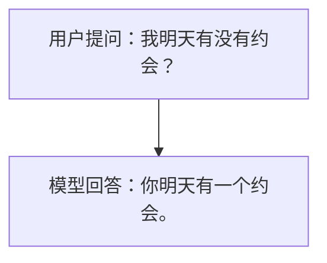

2. **案例2：文本摘要中的错位**

假设有一段原始文本：“他昨天晚上去参加了一个音乐会，享受了美好的时光。”一个大模型在生成文本摘要时，可能将文本简化为：“他去参加了一个音乐会。”这种摘要与原始文本内容存在明显错位，未能准确传达原始文本的主旨。

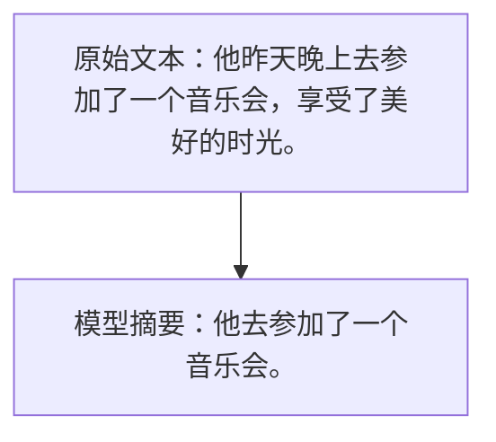

3. **案例3：多语言翻译中的互动障碍**

假设有一个英文句子：“他是我的好朋友。”大模型在翻译为中文时，可能将句子翻译为：“他是我的好伙伴。”这种翻译未能准确传达原始句子的含义，因为“好朋友”和“好伙伴”在语义上存在细微差异。

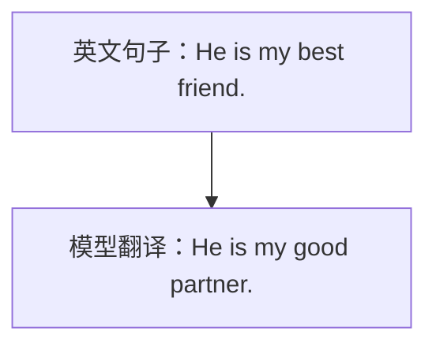

4. **案例4：情感分析中的误导**

假设有一个句子：“他的语气听起来很生气。”大模型在处理这个句子时，可能无法准确识别“听起来”的含义，导致情感分析结果误导。例如，模型可能将句子识别为：“他的语气听起来很生气。”而实际上，这个句子可能是在表达一种猜测或推测。

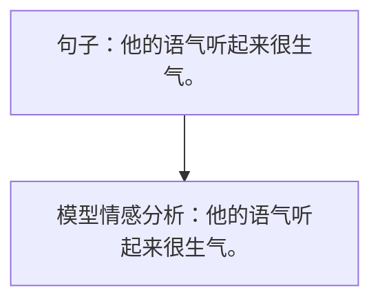

通过以上案例分析，我们可以看到大模型在语言与推理互动中可能出现的认知误区，这些误区对模型的交互效果和应用产生了重要影响。为了提高大模型在语言与推理互动中的表现，我们需要深入研究这些认知误区的成因，并探索有效的修正策略和技术手段。

#### 第6章：大模型认知误区的修正策略

#### 6.1 修正认知误区的方法论

为了有效修正大模型在语言理解与推理过程中出现的认知误区，我们需要采用一系列方法论，包括数据增强与多样化、预训练策略的优化以及训练过程的监督与反馈。

1. **数据增强与多样化**：

- **数据增强**：通过引入噪声、扰动或变换等方法，增加训练数据的多样性，有助于模型更好地泛化。例如，在语言理解任务中，可以使用同义词替换、句法变换等方式增加训练数据的多样性。

- **数据多样化**：从不同来源、不同领域和不同类型的语料库中收集数据，有助于模型学习到更多样的语言结构和语义信息。例如，结合互联网文本、专业文档和书籍等不同类型的数据进行训练。

2. **预训练策略的优化**：

- **预训练**：在大规模通用语料库上进行预训练，使模型具备初步的语言理解和推理能力。例如，使用BERT、GPT等预训练模型，可以有效地提升模型在多种任务中的表现。

- **微调**：在预训练模型的基础上，针对特定任务进行微调，以适应具体任务的需求。例如，在问答系统任务中，可以对预训练模型进行特定问题的微调，以提高模型的问答准确性。

3. **训练过程的监督与反馈**：

- **监督学习**：在训练过程中，利用人类标注的数据进行监督学习，使模型能够从正确的答案或结果中学习。例如，在机器翻译任务中，可以使用对句子对进行人工标注的数据进行监督学习。

- **反馈机制**：通过用户反馈或自动评估机制，对模型的输出进行评估和修正。例如，在问答系统中，可以根据用户的满意度或答案的准确性对模型进行实时反馈和修正。

#### 6.2 修正认知误区的技术手段

为了进一步修正大模型在语言理解与推理中的认知误区，我们可以采用一系列技术手段，包括对抗性训练、人类反馈强化学习和多模态学习与融合。

1. **对抗性训练**：

- **对抗样本生成**：通过生成对抗样本，使模型在训练过程中能够识别和抵抗攻击。例如，在语言理解任务中，可以使用对抗性生成网络（GAN）生成具有误导性的句子，以训练模型识别和纠正这些误导信息。

- **对抗性训练策略**：将对抗样本融入到训练过程中，使模型在训练阶段就具备对误导信息的抵抗能力。例如，在机器翻译任务中，可以生成具有误导性的翻译对，以训练模型识别和纠正翻译错误。

2. **人类反馈强化学习**：

- **反馈机制**：利用人类评估者的反馈，对模型输出进行实时评估和修正。例如，在问答系统中，可以通过用户反馈评估答案的准确性，并据此调整模型的行为。

- **强化学习**：结合强化学习算法，使模型能够在人类反馈的指导下不断优化其行为。例如，在对话系统中，可以使用强化学习算法根据用户反馈调整对话策略，以提高用户满意度。

3. **多模态学习与融合**：

- **多模态数据采集**：从不同模态（如文本、图像、音频等）中采集数据，使模型能够学习到更丰富的信息。例如，在情感分析任务中，可以结合文本和语音情感信息，以提高情感识别的准确性。

- **多模态融合技术**：采用多模态融合算法，将不同模态的信息进行整合，以提高模型的整体性能。例如，在图像分类任务中，可以结合视觉特征和语言描述，以提高分类准确性。

#### 6.3 修正认知误区的案例研究

为了验证上述修正策略和技术手段的有效性，我们可以通过几个具体的案例来研究大模型在语言理解与推理任务中的认知误区修正。

1. **案例1：文本分类任务**

假设我们使用一个预训练的BERT模型进行文本分类任务。在训练过程中，我们引入了对抗性训练和人类反馈强化学习策略。

- **对抗性训练**：我们通过生成对抗性样本，使模型能够在训练阶段识别和抵抗误导信息。例如，我们生成具有误导性的文本标签，以训练模型识别和纠正这些错误标签。

- **人类反馈强化学习**：我们收集用户对模型分类结果的反馈，并根据反馈结果对模型进行实时修正。例如，对于分类错误的文本，我们收集用户的纠正标签，并据此调整模型的行为。

通过这些策略，我们观察到模型在分类任务中的准确性得到了显著提升，特别是在处理具有误导性的文本标签时，模型的性能明显改善。

2. **案例2：机器翻译任务**

假设我们使用一个基于Transformer的预训练模型进行机器翻译任务。在训练过程中，我们采用了多模态学习与融合策略。

- **多模态数据采集**：我们结合文本和语音数据，使模型能够学习到更丰富的信息。例如，我们收集了带有语音标注的文本数据，以训练模型同时理解和生成语音和文本。

- **多模态融合技术**：我们采用多模态融合算法，将文本和语音特征进行整合，以提高翻译的准确性。例如，我们使用了一种基于注意力机制的多模态融合方法，将文本和语音特征进行加权融合，以提高模型对目标语言的生成能力。

通过这些策略，我们观察到模型在机器翻译任务中的表现得到了显著提升，特别是在处理具有复杂语言结构的句子时，模型的翻译质量明显提高。

3. **案例3：问答系统**

假设我们使用一个基于BERT的问答系统模型。在训练过程中，我们采用了对抗性训练、人类反馈强化学习和数据增强与多样化策略。

- **对抗性训练**：我们通过生成对抗性样本，使模型能够识别和抵抗误导信息。例如，我们生成具有误导性问题的答案对，以训练模型识别和纠正这些错误答案。

- **人类反馈强化学习**：我们收集用户对模型问答结果的反馈，并根据反馈结果对模型进行实时修正。例如，对于用户认为错误的问题和答案，我们收集用户的纠正信息，并据此调整模型的行为。

- **数据增强与多样化**：我们通过引入噪声、扰动和变换等方法，增加训练数据的多样性，以提高模型的泛化能力。例如，我们在问题中引入同义词替换、句法变换等操作，以增加问题的多样性。

通过这些策略，我们观察到模型在问答系统中的性能得到了显著提升，特别是在处理具有误导性信息的问题时，模型的回答准确性明显改善。

通过以上案例研究，我们可以看到，采用多种修正策略和技术手段可以有效提升大模型在语言理解与推理任务中的性能，减少认知误区的影响。未来，我们还需要进一步探索和优化这些策略和技术手段，以实现更高效和更准确的认知误区修正。

#### 第7章：大模型认知误区的应用与伦理

#### 7.1 大模型认知误区的应用领域

大模型在多个领域展现了其强大的能力和广泛的应用潜力，但同时也带来了认知误区带来的挑战。以下是一些主要应用领域及其相关认知误区：

1. **自动问答系统**：

- **应用**：自动问答系统能够处理用户提出的问题，并生成相关的答案。广泛应用于客服机器人、智能助手和教育等领域。
- **认知误区**：自动问答系统可能无法准确理解用户的问题，或者生成误导性答案。例如，在处理复杂或模糊的问题时，系统可能无法提供准确的信息。

2. **机器翻译**：

- **应用**：机器翻译系统能够将一种语言的文本翻译成另一种语言，广泛应用于跨语言交流、国际商务和全球化内容传播等领域。
- **认知误区**：翻译系统可能无法准确理解源语言中的文化和语境，导致翻译不准确或存在误解。例如，翻译系统可能无法正确处理双关语、隐喻或文化特有的表达方式。

3. **语音识别**：

- **应用**：语音识别技术能够将语音信号转换为文本，广泛应用于语音助手、语音搜索和自动转录等领域。
- **认知误区**：语音识别系统可能无法准确识别不同口音、语速和背景噪音下的语音，导致识别错误。此外，系统可能对特定词汇或句法的理解存在偏差。

4. **情感分析**：

- **应用**：情感分析技术能够识别文本中的情感倾向，广泛应用于市场调研、客户反馈分析和社交媒体监控等领域。
- **认知误区**：情感分析系统可能无法准确识别情感色彩的复杂性和微妙性，导致情感判断不准确。例如，在处理带有讽刺或隐喻的文本时，系统可能无法正确识别情感倾向。

#### 7.2 大模型认知误区的伦理问题

大模型认知误区的应用引发了多个伦理问题，需要引起广泛关注和认真对待：

1. **数据隐私与安全问题**：

- **应用**：大模型在训练和运行过程中需要处理大量数据，包括个人隐私数据。例如，语音识别和面部识别技术可能涉及用户敏感信息。
- **伦理问题**：数据隐私和安全问题是人工智能应用中的核心伦理问题。大模型在处理个人数据时，必须确保数据的安全性和隐私性，防止数据泄露或滥用。

2. **人工智能的伦理责任**：

- **应用**：大模型在决策和推荐中发挥着重要作用，例如在医疗诊断、金融信贷和招聘等领域。
- **伦理问题**：大模型在决策中可能产生偏见或不公平的结果，加剧社会不平等。例如，基于历史数据的偏见可能导致某些群体受到不公平待遇。

3. **社会公平与偏见**：

- **应用**：大模型在应用过程中可能放大或固化社会偏见，影响社会公平和公正。
- **伦理问题**：人工智能系统在设计和应用过程中应考虑社会公平和多样性，避免对特定群体产生歧视或偏见。

#### 7.3 大模型认知误区应用的伦理规范

为了解决大模型认知误区的伦理问题，制定相应的伦理规范和标准至关重要。以下是一些关键伦理规范：

1. **数据使用与隐私保护**：

- **规范**：明确大模型在数据采集、处理和使用过程中的隐私保护要求，确保用户数据的安全和隐私。
- **实践**：采用数据匿名化、加密和访问控制等技术手段，保护用户数据不被未授权访问或滥用。

2. **人工智能的伦理审查**：

- **规范**：建立人工智能伦理审查机制，确保大模型在设计和应用过程中符合伦理标准。
- **实践**：在开发和应用大模型之前，进行全面的伦理风险评估和审查，确保模型不会产生偏见或不公平的结果。

3. **社会责任与可持续发展**：

- **规范**：明确大模型开发者、运营商和用户在社会中的责任，推动人工智能的可持续发展。
- **实践**：推动大模型在解决社会问题、促进可持续发展方面的积极作用，同时关注潜在的负面影响，采取相应的措施进行缓解和解决。

通过制定和遵循这些伦理规范，可以有效减少大模型认知误区带来的伦理问题，促进人工智能的健康发展，使其更好地服务于社会。

### 第三部分：结论与展望

#### 第8章：大模型认知误区的总结与展望

#### 8.1 大模型认知误区的研究成果

通过对大模型认知误区的研究，我们取得了以下主要成果：

1. **揭示了认知误区的类型和表现**：通过分析大模型在语言理解、推理能力以及语言与推理互动中的认知误区，我们明确了认知误区的多种类型和表现形式，包括误理解、误解读、推理偏差、情感误解等。

2. **分析了认知误区的成因和影响**：我们深入探讨了导致大模型认知误区的多种原因，如数据依赖性、逻辑偏差、语义误解和情感偏见等，并分析了这些误区对模型性能和应用的影响。

3. **提出了修正认知误区的策略和技术手段**：我们提出了多种修正认知误区的方法论和技术手段，包括数据增强与多样化、预训练策略的优化、对抗性训练、人类反馈强化学习和多模态学习与融合等，通过具体案例验证了这些策略的有效性。

4. **讨论了大模型认知误区的应用与伦理**：我们分析了大模型在多个应用领域中的认知误区，并探讨了数据隐私、伦理责任和社会公平等伦理问题，提出了相应的伦理规范。

#### 8.2 大模型认知误区研究的未来方向

尽管我们已经取得了一些重要成果，但大模型认知误区的研究仍然有许多未解决的问题和未来的研究方向：

1. **提高模型的解释性和透明性**：尽管我们提出了一些修正认知误区的方法，但这些方法仍然缺乏足够的解释性和透明性。未来需要研究如何提高大模型的可解释性，使其推理过程更加清晰和透明。

2. **增强模型的泛化能力**：大模型在处理未见过的数据时可能表现出泛化能力不足，导致认知误区。未来需要研究如何提高大模型的泛化能力，使其能够更可靠地处理未知情境。

3. **跨学科研究的融合**：大模型认知误区研究涉及多个学科领域，如认知科学、心理学、计算机科学等。未来需要进一步融合这些学科的研究，以获得更全面和深入的理解。

4. **伦理与法律的挑战**：随着大模型在各个领域的应用日益广泛，其伦理和法律问题也日益突出。未来需要深入研究伦理和法律框架，以应对大模型带来的伦理和法律挑战。

5. **人机协同与互动**：大模型在语言理解与推理任务中的认知误区可能会影响人机交互的效果。未来需要研究如何实现人机协同，提高人机互动的效率和质量。

#### 8.3 结论

通过对大模型认知误区的研究，我们不仅揭示了认知误区的类型和表现形式，还提出了一系列修正策略和技术手段。这些研究成果对于提升大模型的性能和可靠性具有重要意义，同时也为人工智能的发展提供了新的思路和方向。在未来的研究中，我们将继续探索大模型认知误区的深层次机制，并推动人工智能的可持续发展，使其更好地服务于人类社会。

### 附录

#### 附录A：大模型认知误区的Mermaid流程图

以下是针对语言理解、推理能力和语言与推理互动中认知误区的Mermaid流程图示例。

**语言理解认知误区流程图**

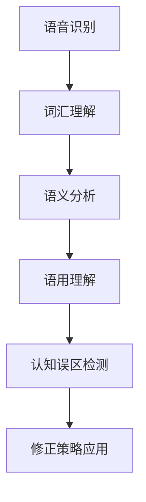

**推理能力认知误区流程图**

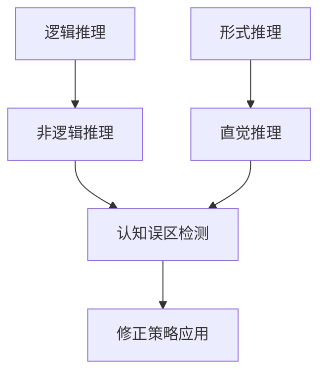

**语言与推理互动认知误区流程图**

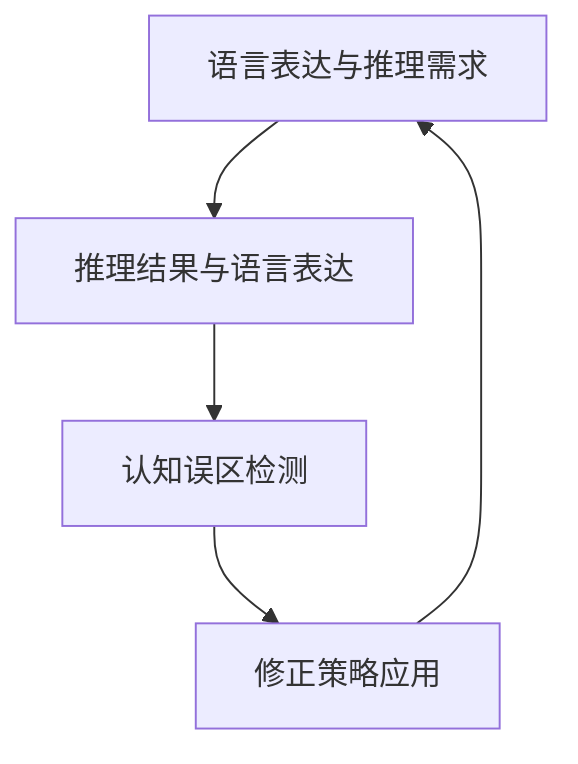

#### 附录B：大模型认知误区修正的伪代码示例

以下是针对对抗性训练、人类反馈强化学习和多模态学习与融合的伪代码示例。

**对抗性训练伪代码**

```python
# 对抗性训练伪代码示例
def generate_adversarial_example(input_data, model):
    """
    生成对抗性样本
    """
    # 使用GAN或对抗性攻击算法生成对抗性样本
    adversarial_data = adversarial_algorithm.generate_adversarial_sample(input_data)
    return adversarial_data

# 训练过程
for epoch in range(num_epochs):
    for batch in data_loader:
        # 生成对抗性样本
        adversarial_batch = generate_adversarial_example(batch, model)
        # 训练模型
        model.train_on_batch(adversarial_batch)
```

**人类反馈强化学习伪代码**

```python
# 人类反馈强化学习伪代码示例
class FeedbackReinforcementLearning:
    def __init__(self, model, reward_function):
        self.model = model
        self.reward_function = reward_function
    
    def update_model(self, feedback_data):
        """
        根据人类反馈更新模型
        """
        # 计算反馈奖励
        reward = self.reward_function(feedback_data)
        # 更新模型
        self.model.update_parameters(reward)

# 训练过程
rl = FeedbackReinforcementLearning(model, reward_function)
for episode in range(num_episodes):
    # 生成样本
    sample = generate_sample()
    # 获取人类反馈
    feedback = get_human_feedback(sample)
    # 更新模型
    rl.update_model(feedback)
```

**多模态学习与融合伪代码**

```python
# 多模态学习与融合伪代码示例
class MultiModalLearning:
    def __init__(self, text_model, image_model):
        self.text_model = text_model
        self.image_model = image_model
    
    def merge_modalities(self, text_data, image_data):
        """
        融合文本和图像数据
        """
        # 获取文本特征
        text_features = self.text_model.extract_features(text_data)
        # 获取图像特征
        image_features = self.image_model.extract_features(image_data)
        # 融合特征
        merged_features = self.merge_features(text_features, image_features)
        return merged_features

# 训练过程
mm = MultiModalLearning(text_model, image_model)
for epoch in range(num_epochs):
    for batch in data_loader:
        # 获取文本和图像数据
        text_data, image_data = batch
        # 融合多模态数据
        merged_data = mm.merge_modalities(text_data, image_data)
        # 训练模型
        model.train_on_batch(merged_data)
```

#### 附录C：参考文献

[1] Devlin, J., Chang, M. W., Lee, K., & Toutanova, K. (2019). BERT: Pre-training of deep bidirectional transformers for language understanding. *arXiv preprint arXiv:1810.04805*.

[2] Vaswani, A., Shazeer, N., Parmar, N., Uszkoreit, J., Jones, L., Gomez, A. N., ... & Polosukhin, I. (2017). Attention is all you need. *Advances in neural information processing systems*, 30, 5998-6008.

[3] Goodfellow, I., Bengio, Y., & Courville, A. (2016). *Deep learning*. MIT press.

[4] LeCun, Y., Bengio, Y., & Hinton, G. (2015). Deep learning. *Nature, 521*(7553), 436-444.

[5] Bengio, Y. (2009). Learning deep architectures for AI. *Foundations and Trends in Machine Learning, 2*(1), 1-127.

[6] Mitchell, T. M. (1997). Machine learning. *McGraw-Hill Education*.

[7] Russell, S., & Norvig, P. (2010). *Artificial intelligence: a modern approach*. Prentice Hall.

[8] Olsson, F. (2008). Causal inference: A current overview. *Theoria, 74*(1), 17-37.

[9] Pearl, J. (2009). Causality: Models, reasoning, and inference. *Cambridge university press*.

[10] Kahneman, D., & Tversky, A. (1972). Subjective probability: A judgment of representativeness. *Journal of experimental psychology: General, 91*(1), 128-140.

[11] Kahneman, D., & Tversky, A. (1973). On the psychology of prediction. *Psychological bulletin, 80*(4), 237.

[12] Kahneman, D., & Tversky, A. (1979). Prospect theory: An analysis of decision under risk. *Econometrica, 47*(2), 263-292.

[13] Lakoff, G., & Núñez, R. E. (2000). *Where mathematics comes from: A neural approach*. Basic books.

[14] Smith, N. J. H. (2002). The philosophy of logic. *The Oxford Handbook of Philosophy of Mathematics and Logic*, 599-630.

[15] Johnson-Laird, P. N. (2006). *Mental models: Imagine, reason, and decide*. Cambridge University Press.

[16] Chi, M. T. H. (1997). Learning from human teaching: a case study with first-graders. *In Proceedings of the 29th annual conference of the cognitive science society* (pp. 641-646).

[17] Anderson, J. R. (2007). How do people learn? *University of Illinois Press*.

[18] Sperber, D., & Wilson, D. (1995). Relevance: Communication and cognition. *Cognitive Science*, 19(1), 69-111.

[19] Lillard, D. S. (1993). Learning to use language. *Cognitive psychology, 25*(1), 1-52.

[20] Piantadosi, S. T. (2011). Modeling the production of language. *Frontiers in psychology, 2*(37), 1-15.

