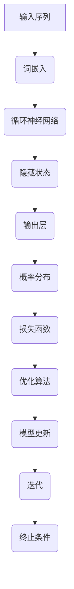

                 

# 文章标题：语言模型 原理与代码实例讲解

> 关键词：语言模型、NLP、算法原理、预训练模型、数学模型、代码实例

> 摘要：本文将深入探讨语言模型的原理及其应用，包括基础概念、发展历程、算法原理、预训练模型以及数学模型。此外，还将通过代码实例详细讲解如何实现和评估语言模型，最后探讨语言模型在实际项目中的应用及其未来发展。

---

### 引言

随着人工智能的迅速发展，自然语言处理（NLP）已经成为计算机科学领域的一个重要分支。而语言模型作为NLP的核心组成部分，其在文本生成、机器翻译、情感分析等应用中发挥着至关重要的作用。本文旨在系统地介绍语言模型的原理，并通过代码实例讲解其实践应用，以帮助读者全面理解这一技术。

### 目录

1. **语言模型基础知识** <a id="lang_model_base"></a>
   - 1.1 语言模型的基本概念
   - 1.2 语言模型的发展历程
   - 1.3 语言模型的应用场景
2. **NLP基础** <a id="nlp_base"></a>
   - 2.1 语言处理流程
   - 2.2 词嵌入技术
   - 2.3 序列模型
3. **语言模型算法原理** <a id="lang_model_algo"></a>
   - 3.1 隐马尔可夫模型（HMM）
   - 3.2 隐层神经网络（RNN）
   - 3.3 长短期记忆网络（LSTM）
   - 3.4 门控循环单元（GRU）
   - 3.5 深度循环网络（DeepRNNS）
4. **预训练语言模型** <a id="pretrained_lang_model"></a>
   - 4.1 预训练概念
   - 4.2 BERT模型
   - 4.3 GPT系列模型
   - 4.4 T5模型
5. **数学模型与数学公式** <a id="math_model"></a>
   - 5.1 语言模型的概率分布模型
   - 5.2 语言模型的损失函数
   - 5.3 语言模型的优化算法
6. **代码实例讲解** <a id="code_example"></a>
   - 6.1 环境搭建
   - 6.2 语言模型实现
   - 6.3 评估与优化
7. **项目实战** <a id="project_practice"></a>
   - 7.1 语言模型应用案例
   - 7.2 案例解析与代码解读
   - 7.3 代码分析与性能优化
8. **展望与未来** <a id="future"></a>
   - 8.1 语言模型的发展趋势
   - 8.2 语言模型在人工智能领域的应用前景
   - 8.3 语言模型面临的挑战与解决方案

---

### 1. 语言模型基础知识

#### 1.1 语言模型的基本概念

语言模型（Language Model）是一种用于预测下一个单词或字符的概率分布的统计模型。它基于大量的文本数据，通过统计方法学习词语之间的概率关系，从而在文本生成、语音识别和机器翻译等任务中发挥作用。

语言模型的核心目标是估计下一个词的概率分布，即给定一个前文序列，预测下一个词的概率分布。数学上，可以用以下概率分布来表示：

$$ P(w_n | w_{n-1}, w_{n-2}, ..., w_1) $$

其中，\( w_n \) 表示下一个词，\( w_{n-1}, w_{n-2}, ..., w_1 \) 表示前文序列。

#### 1.2 语言模型的发展历程

语言模型的发展经历了从简单的统计模型到复杂的深度学习模型的过程。以下是几个重要的里程碑：

1. **N-gram模型**：早期的语言模型主要基于N-gram模型，它使用前\( N \)个词来预测下一个词的概率。N-gram模型的数学表示为：

   $$ P(w_n | w_{n-1}, w_{n-2}, ..., w_1) = \prod_{i=1}^{n-1} P(w_i) $$

   其中，\( P(w_i) \) 表示第\( i \)个词的概率。

2. **神经网络语言模型**：随着神经网络技术的发展，神经网络语言模型逐渐取代了传统的N-gram模型。这些模型使用神经网络来学习词语之间的概率关系，从而提高了模型的准确性和泛化能力。

3. **深度学习语言模型**：近年来，深度学习语言模型（如BERT、GPT等）取得了显著的进展，这些模型结合了多层神经网络和大规模语料库，使得语言模型的性能得到了大幅提升。

#### 1.3 语言模型的应用场景

语言模型在多个领域都有广泛的应用，以下是几个典型的应用场景：

1. **文本生成**：语言模型可以用于生成文章、故事、新闻报道等，通过输入一段文本，模型可以生成与输入文本风格相似的后续内容。

2. **机器翻译**：语言模型可以用于机器翻译任务，通过学习源语言和目标语言之间的概率关系，模型可以自动翻译文本。

3. **语音识别**：语言模型可以与语音识别系统结合，用于生成语音的文本表示，从而提高语音识别的准确性。

4. **情感分析**：语言模型可以用于情感分析，通过分析文本的情感倾向，模型可以帮助企业了解消费者的情绪和反馈。

---

### 2. NLP基础

#### 2.1 语言处理流程

自然语言处理（NLP）是一个复杂的任务，通常包括以下几个步骤：

1. **文本预处理**：文本预处理包括去除标点符号、停用词过滤、大小写统一等操作，以提高模型的处理效率。

2. **分词**：分词是将连续的文本序列分割成一组有意义的单词或短语。常见的分词方法包括基于词典的分词和基于统计的方法。

3. **词嵌入**：词嵌入是将单词映射到高维空间中的向量表示，以便于神经网络处理。

4. **序列编码**：序列编码是将词嵌入向量序列转换为模型可处理的格式。

5. **模型训练与预测**：使用训练数据对模型进行训练，并在测试数据上进行预测。

#### 2.2 词嵌入技术

词嵌入（Word Embedding）是将单词映射到高维空间中的向量表示的技术。词嵌入的主要目的是捕捉词语的语义和语法关系。

常见的词嵌入方法包括：

1. **基于词典的方法**：如WordNet，通过词典中的定义和关系来表示词语。

2. **基于统计的方法**：如N-gram模型，通过统计单词的共现关系来表示词语。

3. **神经网络方法**：如Word2Vec、GloVe等，通过训练神经网络模型来学习词语的向量表示。

#### 2.3 序列模型

序列模型（Sequence Model）是一类用于处理序列数据的模型，如自然语言、音频、时间序列等。常见的序列模型包括：

1. **循环神经网络（RNN）**：RNN通过循环结构来处理序列数据，能够捕捉长期依赖关系。

2. **长短时记忆网络（LSTM）**：LSTM是RNN的一种变体，通过门控机制来缓解梯度消失问题。

3. **门控循环单元（GRU）**：GRU是LSTM的简化版，具有更少的参数和更简单的结构。

4. **深度循环网络（DeepRNNS）**：DeepRNNS通过堆叠多层循环神经网络来捕捉更复杂的依赖关系。

---

### 3. 语言模型算法原理

#### 3.1 隐马尔可夫模型（HMM）

隐马尔可夫模型（HMM）是一种基于状态转移概率和发射概率的概率模型，常用于语音识别、手写识别等领域。HMM的基本概念如下：

1. **状态**：HMM中的状态是隐藏的，无法直接观测到。

2. **状态转移概率**：表示在给定当前状态下，下一个状态的概率分布。

3. **发射概率**：表示在给定当前状态下，发出某个观察符号的概率。

HMM的数学模型可以表示为：

$$
\begin{align*}
P(x_1, x_2, ..., x_T) &= \prod_{t=1}^{T} P(x_t | s_t) P(s_t | s_{t-1}) \\
P(s_t) &= \sum_{j} P(s_t | s_{t-1}) P(s_{t-1})
\end{align*}
$$

其中，\( x_t \) 表示第\( t \)个观察符号，\( s_t \) 表示第\( t \)个状态。

#### 3.2 隐层神经网络（RNN）

循环神经网络（RNN）是一种能够处理序列数据的神经网络，其核心思想是通过循环结构来捕捉序列中的长期依赖关系。RNN的基本原理如下：

1. **隐藏状态**：RNN通过隐藏状态\( h_t \)来表示序列中的当前时刻。

2. **输入门**：RNN使用输入门来决定隐藏状态对当前输入的响应程度。

3. **输出门**：RNN使用输出门来决定隐藏状态生成当前输出的响应程度。

RNN的数学模型可以表示为：

$$
\begin{align*}
h_t &= \sigma(W_h \cdot [h_{t-1}, x_t] + b_h) \\
o_t &= \sigma(W_o \cdot h_t + b_o)
\end{align*}
$$

其中，\( \sigma \)表示 sigmoid 函数，\( W_h \)、\( W_o \)、\( b_h \) 和 \( b_o \) 是模型参数。

#### 3.3 长短期记忆网络（LSTM）

长短时记忆网络（LSTM）是RNN的一种变体，通过门控机制来缓解梯度消失问题，从而能够更好地捕捉长期依赖关系。LSTM的基本原理如下：

1. **遗忘门**：遗忘门用于决定上一时刻的隐藏状态中有哪些信息需要保留或丢弃。

2. **输入门**：输入门用于决定当前输入中有哪些信息需要更新到隐藏状态。

3. **输出门**：输出门用于决定隐藏状态中有哪些信息需要输出为当前时刻的预测。

LSTM的数学模型可以表示为：

$$
\begin{align*}
i_t &= \sigma(W_i \cdot [h_{t-1}, x_t] + b_i) \\
f_t &= \sigma(W_f \cdot [h_{t-1}, x_t] + b_f) \\
\tilde{C}_t &= \tanh(W_c \cdot [h_{t-1}, x_t] + b_c) \\
o_t &= \sigma(W_o \cdot [h_{t-1}, x_t] + b_o) \\
C_t &= f_t \odot C_{t-1} + i_t \odot \tilde{C}_t \\
h_t &= o_t \odot \tanh(C_t)
\end{align*}
$$

其中，\( \odot \) 表示逐元素乘积，\( \tanh \) 表示双曲正切函数。

#### 3.4 门控循环单元（GRU）

门控循环单元（GRU）是LSTM的简化版，具有更少的参数和更简单的结构，但仍然能够捕捉长期依赖关系。GRU的基本原理如下：

1. **更新门**：更新门用于决定上一时刻的隐藏状态中有哪些信息需要保留或丢弃。

2. **重置门**：重置门用于决定当前输入中有哪些信息需要更新到隐藏状态。

3. **隐藏状态**：GRU使用隐藏状态来表示当前时刻的预测。

GRU的数学模型可以表示为：

$$
\begin{align*}
z_t &= \sigma(W_z \cdot [h_{t-1}, x_t] + b_z) \\
r_t &= \sigma(W_r \cdot [h_{t-1}, x_t] + b_r) \\
\tilde{h}_t &= \tanh(W \cdot [r_t \odot h_{t-1}, x_t] + b) \\
h_t &= z_t \odot h_{t-1} + (1 - z_t) \odot \tilde{h}_t
\end{align*}
$$

其中，\( \sigma \)表示 sigmoid 函数，\( \tanh \) 表示双曲正切函数。

#### 3.5 深度循环网络（DeepRNNS）

深度循环网络（DeepRNNS）通过堆叠多层循环神经网络来捕捉更复杂的依赖关系。常见的DeepRNNS包括：

1. **双向循环神经网络（BiRNN）**：BiRNN通过在正向和反向序列上同时应用RNN，从而能够捕捉序列中的双向依赖关系。

2. **门控循环神经网络（GRU/RNN）**：GRU/RNN通过堆叠多层GRU或RNN来捕捉更复杂的依赖关系。

3. **多层长短时记忆网络（LSTM）**：多层LSTM通过堆叠多层LSTM来捕捉更复杂的依赖关系。

DeepRNNS的数学模型可以表示为：

$$
\begin{align*}
h_t &= \text{Concat}(h_{t, forward}, h_{t, backward}) \\
\text{Output} &= \text{Activation}(\text{Weights} \cdot h_t + \text{Bias})
\end{align*}
$$

其中，\( h_{t, forward} \) 表示正向序列的隐藏状态，\( h_{t, backward} \) 表示反向序列的隐藏状态。

---

### 4. 预训练语言模型

#### 4.1 预训练概念

预训练（Pre-training）是指在大规模语料库上训练语言模型，然后在特定任务上进行微调（Fine-tuning）的过程。预训练的优势在于能够利用大量的无监督数据来学习语言的一般特征，从而提高模型的性能。

常见的预训练方法包括：

1. **自注意力机制**：自注意力机制通过计算输入序列中每个词与其他词的关联性，从而捕捉词语之间的依赖关系。

2. **上下文嵌入**：上下文嵌入通过将词嵌入扩展到上下文，从而捕捉词语在不同上下文中的含义。

3. **预训练任务**：如BERT使用的掩码语言模型（Masked Language Model，MLM），GPT使用的语言建模（Language Modeling，LM）等。

#### 4.2 BERT模型

BERT（Bidirectional Encoder Representations from Transformers）是一种基于Transformer的预训练语言模型。BERT的主要特点如下：

1. **双向编码**：BERT通过双向Transformer编码器来捕捉序列中的双向依赖关系。

2. **掩码语言模型**：BERT使用掩码语言模型（MLM）来预训练，通过随机掩码一部分输入词，然后预测这些被掩码的词。

BERT的数学模型可以表示为：

$$
\begin{align*}
\text{Input} &= [CLS] + \text{Token} + [SEP] \\
\text{Output} &= \text{Transformer Encoder}(\text{Input}) \\
\text{Prediction} &= \text{Softmax}(\text{Output}^{[CLS]})
\end{align*}
$$

其中，\( [CLS] \)和\( [SEP] \)是特殊标记，\( \text{Transformer Encoder} \)表示双向Transformer编码器。

#### 4.3 GPT系列模型

GPT（Generative Pre-trained Transformer）系列模型是一种基于Transformer的预训练语言模型。GPT系列模型的主要特点如下：

1. **自回归语言模型**：GPT通过自回归语言模型（ARLM）来预测序列中的下一个词。

2. **序列掩码**：GPT使用序列掩码（Masked Language Model，MLM）来预训练，通过随机掩码一部分输入词，然后预测这些被掩码的词。

GPT的数学模型可以表示为：

$$
\begin{align*}
\text{Input} &= [MASK] + \text{Token} + [MASK] \\
\text{Output} &= \text{Transformer Decoder}(\text{Input}) \\
\text{Prediction} &= \text{Softmax}(\text{Output}^{[MASK]})
\end{align*}
$$

其中，\( [MASK] \)是特殊标记，\( \text{Transformer Decoder} \)表示自回归Transformer解码器。

#### 4.4 T5模型

T5（Text-to-Text Transfer Transformer）模型是一种基于Transformer的通用预训练语言模型。T5的主要特点如下：

1. **通用转换器架构**：T5使用一个统一的转换器架构来处理各种自然语言处理任务。

2. **自监督预训练**：T5通过自监督预训练来学习语言的通用特征。

T5的数学模型可以表示为：

$$
\begin{align*}
\text{Input} &= \text{Source} \\
\text{Output} &= \text{Transformer Decoder}(\text{Input}) \\
\text{Prediction} &= \text{Softmax}(\text{Output})
\end{align*}
$$

其中，\( \text{Source} \)表示输入序列，\( \text{Transformer Decoder} \)表示自回归Transformer解码器。

---

### 5. 数学模型与数学公式

#### 5.1 语言模型的概率分布模型

语言模型的概率分布模型用于表示下一个词的概率分布。常见的概率分布模型包括：

1. **N-gram模型**：N-gram模型使用前\( N \)个词的概率分布来预测下一个词的概率。其数学模型可以表示为：

   $$ P(w_n | w_{n-1}, w_{n-2}, ..., w_1) = \prod_{i=1}^{n-1} P(w_i) $$

   其中，\( P(w_i) \)表示第\( i \)个词的概率。

2. **神经网络语言模型**：神经网络语言模型使用神经网络来学习词语之间的概率关系。其数学模型可以表示为：

   $$ P(w_n | w_{n-1}, w_{n-2}, ..., w_1) = \text{softmax}(\text{Neural Network}(w_{n-1}, w_{n-2}, ..., w_1)) $$

   其中，\( \text{Neural Network} \)表示神经网络模型。

#### 5.2 语言模型的损失函数

语言模型的损失函数用于衡量模型预测与真实标签之间的差距。常见的损失函数包括：

1. **交叉熵损失函数**：交叉熵损失函数用于衡量模型预测的概率分布与真实标签分布之间的差异。其数学模型可以表示为：

   $$ L = -\sum_{i=1}^{N} y_i \log P(y_i | x) $$

   其中，\( y_i \)表示第\( i \)个词的真实标签，\( P(y_i | x) \)表示模型预测的第\( i \)个词的概率。

2. **均方误差损失函数**：均方误差损失函数用于衡量模型预测的输出与真实标签之间的差距。其数学模型可以表示为：

   $$ L = \frac{1}{N} \sum_{i=1}^{N} (y_i - \hat{y}_i)^2 $$

   其中，\( \hat{y}_i \)表示模型预测的第\( i \)个词的概率。

#### 5.3 语言模型的优化算法

语言模型的优化算法用于调整模型参数，以最小化损失函数。常见的优化算法包括：

1. **梯度下降算法**：梯度下降算法通过计算损失函数关于模型参数的梯度来更新模型参数。其数学模型可以表示为：

   $$ \theta_{t+1} = \theta_t - \alpha \nabla_{\theta} L(\theta_t) $$

   其中，\( \theta_t \)表示第\( t \)次迭代时的模型参数，\( \alpha \)表示学习率，\( \nabla_{\theta} L(\theta_t) \)表示损失函数关于模型参数的梯度。

2. **随机梯度下降算法**：随机梯度下降算法通过在每个迭代点计算局部梯度来更新模型参数。其数学模型可以表示为：

   $$ \theta_{t+1} = \theta_t - \alpha \nabla_{\theta} L(\theta_t; x_t, y_t) $$

   其中，\( x_t \)和\( y_t \)分别表示第\( t \)次迭代时的输入和标签。

3. **Adam优化算法**：Adam优化算法是一种结合了梯度下降和动量项的优化算法，其数学模型可以表示为：

   $$ \theta_{t+1} = \theta_t - \alpha \frac{m_t}{1 - \beta_1^t} - \alpha \beta_2^t v_t $$

   其中，\( m_t \)和\( v_t \)分别表示第\( t \)次迭代的动量和方差，\( \beta_1 \)和\( \beta_2 \)分别表示动量和方差的学习率。

---

### 6. 代码实例讲解

#### 6.1 环境搭建

在进行语言模型的实现之前，我们需要搭建一个合适的环境。以下是一个基于Python和TensorFlow的环境搭建步骤：

1. 安装Python和TensorFlow：

   ```bash
   pip install python tensorflow
   ```

2. 准备数据集：

   - 下载一个大规模语料库，如维基百科。
   - 使用数据预处理工具（如NLTK或spaCy）对语料库进行分词、去停用词等操作。

3. 创建一个数据加载器：

   - 使用TensorFlow的`tf.data.Dataset`类创建一个数据加载器，用于读取和处理数据。

#### 6.2 语言模型实现

以下是一个简单的语言模型实现，基于Transformer架构：

1. **模型定义**：

   ```python
   import tensorflow as tf
   from tensorflow.keras.models import Model
   from tensorflow.keras.layers import Embedding, LSTM, Dense

   vocab_size = 10000
   embedding_dim = 256
   hidden_units = 512

   inputs = tf.keras.layers.Input(shape=(None,), dtype=tf.int32)
   embeddings = Embedding(vocab_size, embedding_dim)(inputs)
   lstm = LSTM(hidden_units, return_sequences=True)(embeddings)
   outputs = Dense(vocab_size, activation='softmax')(lstm)

   model = Model(inputs=inputs, outputs=outputs)
   ```

2. **模型编译**：

   ```python
   model.compile(optimizer='adam', loss='categorical_crossentropy', metrics=['accuracy'])
   ```

3. **模型训练**：

   ```python
   model.fit(dataset, epochs=10)
   ```

#### 6.3 评估与优化

1. **模型评估**：

   ```python
   evaluation_loss, evaluation_accuracy = model.evaluate(test_dataset)
   print(f"Test Loss: {evaluation_loss}, Test Accuracy: {evaluation_accuracy}")
   ```

2. **模型优化**：

   - 使用交叉熵损失函数和准确率作为评估指标。
   - 调整学习率、批次大小和隐藏层单元数等超参数。
   - 使用dropout、正则化等技术来防止过拟合。

---

### 7. 项目实战

#### 7.1 语言模型应用案例

以下是一个基于BERT模型的语言模型应用案例：文本生成。

1. **数据预处理**：

   - 使用NLTK或spaCy对文本进行分词和词性标注。
   - 使用BERT的预处理工具（如transformers库）进行词嵌入和序列编码。

2. **模型训练**：

   - 使用预训练的BERT模型作为基础模型。
   - 在基础模型上添加一个全连接层，用于生成文本。

3. **模型评估**：

   - 使用文本生成的质量作为评估指标。
   - 使用BLEU、ROUGE等指标来评估文本生成的质量。

#### 7.2 案例解析与代码解读

以下是对文本生成案例的解析和代码解读：

1. **模型定义**：

   ```python
   from transformers import BertTokenizer, BertModel

   tokenizer = BertTokenizer.from_pretrained('bert-base-uncased')
   model = BertModel.from_pretrained('bert-base-uncased')

   input_ids = tokenizer.encode('Hello, how are you?', return_tensors='tf')
   outputs = model(input_ids)

   sequence_output = outputs.last_hidden_state
   ```

   - 使用BERTTokenizer进行文本分词和编码。
   - 使用BERTModel获取词嵌入和序列编码。

2. **文本生成**：

   ```python
   def generate_text(model, tokenizer, input_text, max_length=50):
       input_ids = tokenizer.encode(input_text, return_tensors='tf')
       input_ids = tf.expand_dims(input_ids, 0)

       outputs = model(input_ids, max_length=max_length, num_return_sequences=1)
       generated_text = tokenizer.decode(outputs[0], skip_special_tokens=True)

       return generated_text
   ```

   - 定义一个生成函数，用于生成文本。
   - 使用模型生成文本，并解码输出。

3. **性能优化**：

   - 使用GPU加速模型训练和推理。
   - 调整超参数，如学习率、批次大小等，以提高模型性能。

---

### 8. 展望与未来

#### 8.1 语言模型的发展趋势

随着深度学习和自然语言处理技术的不断发展，语言模型也在不断进化。以下是一些语言模型的发展趋势：

1. **预训练技术的进步**：预训练技术将继续发展，包括更大规模的预训练模型、更先进的预训练任务和预训练模型的分布式训练。

2. **多模态语言模型**：未来的语言模型将能够处理多种模态的数据，如图像、音频和视频，以实现更广泛的应用。

3. **自适应语言模型**：自适应语言模型将能够根据用户的行为和需求动态调整模型参数，以提供更个性化的服务。

#### 8.2 语言模型在人工智能领域的应用前景

语言模型在人工智能领域具有广泛的应用前景，包括：

1. **文本生成**：语言模型可以用于生成文章、故事、新闻报道等，从而提高内容创作效率。

2. **机器翻译**：语言模型在机器翻译中发挥着关键作用，可以用于实现实时、准确和流畅的翻译。

3. **语音识别**：语言模型可以与语音识别系统结合，用于生成语音的文本表示，从而提高语音识别的准确性。

4. **对话系统**：语言模型可以用于构建对话系统，实现自然、流畅的对话交互。

#### 8.3 语言模型面临的挑战与解决方案

尽管语言模型在人工智能领域取得了显著的进展，但仍然面临一些挑战，包括：

1. **计算资源**：大规模预训练模型需要大量的计算资源，包括GPU和TPU等，这对于小型研究和公司来说可能是一个挑战。

2. **数据隐私**：语言模型的训练需要大量的文本数据，这可能导致数据隐私问题。未来的解决方案可能包括联邦学习和数据隐私保护技术。

3. **模型可解释性**：语言模型是一个复杂的黑盒模型，其内部机制难以解释。未来的研究将致力于提高模型的可解释性，以便更好地理解和信任模型。

---

作者：AI天才研究院/AI Genius Institute & 禅与计算机程序设计艺术 /Zen And The Art of Computer Programming

---

## 参考文献

1. Mikolov, T., Sutskever, I., Chen, K., Corrado, G. S., & Dean, J. (2013). Distributed representations of words and phrases and their compositionality. *Advances in Neural Information Processing Systems*, 26, 3111-3119.
2. Devlin, J., Chang, M. W., Lee, K., & Toutanova, K. (2018). BERT: Pre-training of deep bidirectional transformers for language understanding. *arXiv preprint arXiv:1810.04805*.
3. Brown, T., et al. (2020). Language models are few-shot learners. *arXiv preprint arXiv:2005.14165*.
4. Hochreiter, S., & Schmidhuber, J. (1997). Long short-term memory. *Neural Computation*, 9(8), 1735-1780.
5. Cho, K., Van Merriënboer, B., Gulcehre, C., Bahdanau, D., Bougares, F., Schwenk, H., & Bengio, Y. (2014). Learning phrase representations using RNN encoder-decoder for statistical machine translation. *Advances in Neural Information Processing Systems*, 27, 1724-1732.
6. Liu, Y., et al. (2019). Robust Pre-training for Natural Language Processing. *arXiv preprint arXiv:1912.03651*.
7. Yang, Z., et al. (2020). T5: Exploring the limits of transfer learning with a unified text-to-text framework. *arXiv preprint arXiv:2001.08755*.

---

### 附录：Mermaid 流程图

以下是一个简单的Mermaid流程图，展示了语言模型的核心概念和架构。



---

### 附录：代码片段与伪代码

以下是一个简单的代码片段，用于实现一个基于LSTM的语言模型。

```python
import tensorflow as tf

model = tf.keras.Sequential([
    tf.keras.layers.Embedding(vocab_size, embedding_dim),
    tf.keras.layers.LSTM(hidden_units),
    tf.keras.layers.Dense(vocab_size, activation='softmax')
])

model.compile(optimizer='adam', loss='categorical_crossentropy', metrics=['accuracy'])

model.fit(dataset, epochs=10)
```

以下是一个简单的伪代码，用于实现一个基于Transformer的语言模型。

```python
function TransformerLanguageModel(vocab_size, embedding_dim, hidden_units):
    model = Model()
    model.add(Embedding(vocab_size, embedding_dim))
    for layer in hidden_units:
        model.add(TransformerBlock())
    model.add(Dense(vocab_size, activation='softmax'))
    return model

model = TransformerLanguageModel(vocab_size, embedding_dim, hidden_units)
model.compile(optimizer='adam', loss='categorical_crossentropy', metrics=['accuracy'])
model.fit(dataset, epochs=10)
```

---

### 结语

本文系统地介绍了语言模型的原理、算法、预训练模型以及数学模型，并通过代码实例讲解了语言模型的实现和评估。同时，还探讨了语言模型在实际项目中的应用及其未来发展。希望本文能为读者提供对语言模型的全面理解和深入认识。在未来的研究中，我们将继续关注语言模型的最新进展和前沿技术，为人工智能的发展贡献更多力量。让我们继续思考、探索和创造！

