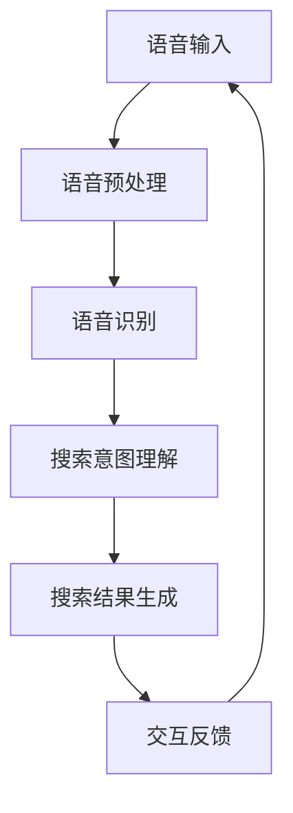

                 

# 《语音搜索的AI革命》

## 关键词

- 语音搜索
- 人工智能
- 深度学习
- 自然语言处理
- 多模态融合
- 隐马尔可夫模型

## 摘要

本文将深入探讨语音搜索领域中的AI革命，从技术演进、市场趋势、挑战与机遇等多个角度，系统地分析语音搜索的现状。随后，我们将探讨语音识别技术基础、语音搜索系统架构，并重点介绍深度学习、自然语言处理、多模态融合等技术如何驱动语音搜索的优化。此外，还将探讨语音搜索在AI应用场景中的实践，以及AI伦理与隐私保护的重要议题。最后，展望语音搜索的AI革命未来发展方向，探讨技术突破与挑战，并评估其对产业和社会的影响。希望通过本文，读者能够全面了解语音搜索领域的AI革命，并展望其未来发展。

### 第一部分：引言与背景

#### 第1章：语音搜索的现状与挑战

##### 1.1 语音搜索的技术演进

语音搜索技术的历史可以追溯到上世纪80年代，当时主要依赖于基于有限状态机的语音识别算法。随着计算能力的提升和算法的改进，语音识别技术逐渐走向成熟。20世纪90年代，语音识别领域开始引入隐藏马尔可夫模型（HMM）和人工神经网络（ANN），使得语音识别的准确率有了显著提高。进入21世纪，深度学习技术的兴起进一步推动了语音识别技术的发展，例如卷积神经网络（CNN）和递归神经网络（RNN）在语音识别任务中的应用，使得语音识别的准确率和速度达到了新的高度。

##### 1.2 语音搜索的市场趋势

随着智能手机和移动互联网的普及，语音搜索逐渐成为用户获取信息的重要方式。根据市场研究机构的报告，全球语音搜索市场在近年来呈现出快速增长的趋势。预计未来几年，语音搜索市场的规模将继续扩大，主要驱动力包括用户对便捷性需求的提升、智能家居和物联网设备的普及，以及各大科技巨头在语音技术方面的持续投入。此外，随着5G技术的推广，语音搜索的响应速度和准确性有望进一步提升。

##### 1.3 语音搜索面临的挑战与机遇

尽管语音搜索技术取得了显著的进展，但仍然面临一些挑战。首先是语音识别的准确率问题，尽管深度学习技术已经使得语音识别的准确率大幅提升，但在噪声环境下的识别准确率仍有待提高。其次是自然语言处理（NLP）的挑战，如何准确理解用户的语音指令，并生成合理的搜索结果，是一个复杂的问题。此外，语音搜索系统还需要考虑到用户隐私保护和数据安全等问题。

然而，这些挑战也伴随着机遇。随着技术的不断进步，语音搜索的准确率和用户体验将得到进一步提升。同时，新兴应用场景的不断涌现，如智能客服、智能家居、医疗健康等，也为语音搜索带来了广阔的市场空间。总的来说，语音搜索技术正处于快速发展阶段，有望在未来成为人工智能领域的一个重要分支。

### 第2章：语音识别技术基础

#### 2.1 语音识别的基本原理

语音识别（Automatic Speech Recognition，ASR）是将语音信号转换为文本或命令的技术。其基本原理可以分为三个主要步骤：信号处理、特征提取和模式识别。

首先，信号处理阶段主要对原始语音信号进行预处理，如降噪、去除背景噪音、归一化等。这一阶段的目标是提取出清晰的语音信号，以便后续处理。

接下来是特征提取阶段，这一阶段将预处理后的语音信号转换为适合机器学习算法的特征向量。常用的特征提取方法包括短时傅里叶变换（STFT）、梅尔频率倒谱系数（MFCC）等。

最后是模式识别阶段，通过机器学习算法对特征向量进行分类和识别，从而得到语音信号对应的文本或命令。常见的机器学习算法包括支持向量机（SVM）、隐马尔可夫模型（HMM）、深度神经网络（DNN）等。

#### 2.2 语音识别的关键技术

语音识别的关键技术包括语音信号处理、特征提取和模式识别。下面分别进行详细介绍。

1. **语音信号处理**：
   - **降噪**：语音信号通常受到背景噪音的干扰，降噪技术如维纳滤波、谱减法等可以有效地去除噪声。
   - **归一化**：通过对语音信号的幅度、频率等特征进行归一化处理，使得不同来源的语音信号具有可比性，提高识别准确率。

2. **特征提取**：
   - **短时傅里叶变换（STFT）**：STFT可以将时域信号转换为频域信号，从而提取出不同频率成分。
   - **梅尔频率倒谱系数（MFCC）**：MFCC是一种常用的语音特征表示方法，可以有效地捕捉语音的音色特征。

3. **模式识别**：
   - **隐马尔可夫模型（HMM）**：HMM是一种基于状态转移概率的统计模型，可以用于语音信号的时序建模。
   - **深度神经网络（DNN）**：DNN通过多层神经元的非线性变换，可以自动学习语音信号的复杂特征，提高识别准确率。

#### 2.3 语音识别的性能评估

语音识别的性能评估通常通过准确率、召回率和F1分数等指标进行衡量。

- **准确率（Accuracy）**：准确率是识别正确的语音帧数占总语音帧数的比例，反映了语音识别的总体正确性。
- **召回率（Recall）**：召回率是识别正确的语音帧数与实际包含目标词的语音帧数的比例，反映了语音识别的敏感度。
- **F1分数（F1 Score）**：F1分数是准确率和召回率的调和平均值，综合考虑了识别的精确度和覆盖度。

通过这些性能评估指标，可以全面了解语音识别系统的性能表现，并根据评估结果进行优化和改进。

### 第3章：语音搜索系统架构

#### 3.1 语音搜索系统的工作流程

语音搜索系统的工作流程通常包括以下几个主要阶段：

1. **语音输入**：用户通过麦克风或其他语音输入设备，将语音指令发送到语音搜索系统。
2. **语音预处理**：对输入的语音信号进行降噪、归一化等处理，提高语音信号的质量。
3. **语音识别**：利用语音识别技术，将预处理后的语音信号转换为文本形式。
4. **搜索意图理解**：对识别出的文本进行分析，理解用户的搜索意图，为后续搜索结果生成提供依据。
5. **搜索结果生成**：根据用户意图，从数据库或索引中检索相关内容，生成搜索结果。
6. **交互反馈**：将搜索结果呈现给用户，并根据用户的反馈进行优化和调整。

以下是一个基于Mermaid绘制的语音搜索系统的工作流程图：

#### 3.2 语音搜索的关键组件

语音搜索系统的关键组件包括语音识别模块、搜索意图理解模块和搜索结果生成模块。下面分别进行详细介绍。

1. **语音识别模块**：
   - **任务**：将语音信号转换为文本形式。
   - **技术**：基于深度学习的语音识别算法，如卷积神经网络（CNN）和递归神经网络（RNN）。
   - **挑战**：在低信噪比、多说话人、多语种等复杂环境下，提高识别准确率。

2. **搜索意图理解模块**：
   - **任务**：理解用户的语音指令，提取关键信息，为搜索结果生成提供依据。
   - **技术**：自然语言处理（NLP）技术，如词向量表示、句法分析、语义理解等。
   - **挑战**：处理用户的口语表达，理解模糊、歧义等语言现象。

3. **搜索结果生成模块**：
   - **任务**：根据用户意图，从数据库或索引中检索相关内容，生成搜索结果。
   - **技术**：搜索引擎技术，如基于倒排索引的检索、排序算法等。
   - **挑战**：处理海量数据，提高搜索效率和准确率。

#### 3.3 语音搜索系统设计考虑因素

设计语音搜索系统时，需要考虑以下几个关键因素：

1. **用户体验**：确保语音搜索系统的响应速度和准确性，提供流畅、自然的用户交互体验。
2. **系统性能**：优化系统架构，提高系统的并发处理能力和稳定性。
3. **语音识别准确率**：采用先进的语音识别算法，提高识别准确率，减少误识别率。
4. **搜索意图理解能力**：利用自然语言处理技术，准确理解用户的语音指令，提高搜索结果的匹配度。
5. **数据安全与隐私保护**：确保用户数据的保密性、完整性和可用性，遵循相关法律法规和伦理规范。

通过综合考虑这些因素，可以设计出高效、可靠的语音搜索系统，为用户提供优质的搜索服务。

### 第二部分：AI技术驱动下的语音搜索优化

#### 第4章：深度学习与语音搜索

##### 4.1 深度学习在语音搜索中的应用

深度学习（Deep Learning）是近年来人工智能领域的重要突破之一，其在语音搜索中的应用极大地提高了语音识别和搜索的准确率和效率。深度学习通过构建多层神经网络，可以自动学习语音信号中的复杂特征，从而实现高精度的语音识别和搜索。

在语音识别方面，深度学习算法如卷积神经网络（CNN）和递归神经网络（RNN）被广泛应用于声学模型和语言模型。声学模型用于将语音信号转换为声学特征，而语言模型则用于将声学特征转换为文本输出。通过将这两者结合起来，深度学习算法可以实现对语音指令的准确识别。

在搜索意图理解方面，深度学习技术如词嵌入（Word Embedding）和序列模型（Sequence Model）被用于提取文本中的语义信息。词嵌入可以将单词映射到高维向量空间，从而捕捉单词之间的语义关系。序列模型则可以处理文本中的时序信息，从而更好地理解用户的搜索意图。

##### 4.2 基于深度学习的语音识别算法

基于深度学习的语音识别算法主要包括声学模型和语言模型两部分。声学模型用于将语音信号转换为声学特征，而语言模型则用于将声学特征转换为文本输出。

1. **声学模型**：

   - **卷积神经网络（CNN）**：CNN通过多层卷积和池化操作，可以自动提取语音信号中的局部特征。在声学模型中，CNN可以用于提取语音帧中的时频特征，从而实现语音信号的时频分析。

   - **递归神经网络（RNN）**：RNN通过循环结构，可以处理语音信号的时序信息。在声学模型中，RNN可以用于捕捉语音信号中的长期依赖关系，从而提高语音识别的准确性。

   - **长短期记忆网络（LSTM）**：LSTM是RNN的一种变体，通过引入门控机制，可以有效避免梯度消失问题，从而更好地处理语音信号的长序列依赖关系。

2. **语言模型**：

   - **循环神经网络（RNN）**：RNN可以通过循环结构处理文本序列，从而实现文本的编码和解码。在语言模型中，RNN可以用于将声学特征序列转换为文本输出。

   - **长短期记忆网络（LSTM）**：LSTM通过引入门控机制，可以有效避免梯度消失问题，从而更好地处理语音信号和文本之间的映射关系。

   - **Transformer**：Transformer是一种基于自注意力机制的深度学习模型，通过全局注意力机制，可以捕捉语音信号和文本之间的复杂关系。在语言模型中，Transformer可以用于提高语音识别的准确率和效率。

##### 4.3 基于深度学习的语音搜索优化策略

基于深度学习的语音搜索优化策略主要包括以下几个方面：

1. **多任务学习**：

   - **声学模型和语言模型的联合训练**：通过联合训练声学模型和语言模型，可以同时优化语音识别和搜索的准确性。这种策略利用了声学模型和语言模型之间的互补关系，从而提高整体的搜索性能。

   - **语音识别和语音生成任务的联合优化**：在语音识别和语音生成的任务中，可以通过联合优化两个任务的目标函数，从而提高语音搜索的准确率和效率。

2. **数据增强**：

   - **多说话人数据增强**：通过引入多说话人数据，可以扩展训练数据的多样性，从而提高模型的泛化能力。

   - **噪声数据增强**：通过引入噪声数据，可以增强模型对噪声环境的鲁棒性，从而提高语音搜索的准确率。

3. **在线学习**：

   - **用户个性化学习**：通过在线学习，可以实时更新模型的参数，从而适应用户的行为和偏好，提供个性化的搜索服务。

   - **实时搜索优化**：通过在线学习，可以实时调整搜索算法的参数，从而优化搜索结果，提高用户体验。

通过这些优化策略，可以充分利用深度学习技术的优势，进一步提高语音搜索的准确率和效率。

### 第5章：语音交互与自然语言处理

#### 5.1 语音交互的基本原理

语音交互是指通过语音命令与计算机或其他设备进行交互的过程。其基本原理包括语音识别、自然语言理解和语音合成三个核心部分。

1. **语音识别**：将用户的语音输入转换为文本，这是语音交互的基础。语音识别技术包括信号处理、特征提取和模式识别等步骤，目的是将语音信号转换为可理解的文本。

2. **自然语言理解**：对转换后的文本进行语义分析和理解，识别用户的意图、问题和需求。自然语言理解涉及自然语言处理（NLP）技术，如词法分析、句法分析和语义分析等。

3. **语音合成**：将理解和分析后的信息转换为语音输出，使计算机或其他设备能够以自然、流畅的方式与用户交流。

#### 5.2 自然语言处理在语音搜索中的应用

自然语言处理（NLP）在语音搜索中扮演着至关重要的角色。NLP技术不仅帮助语音识别系统更好地理解和处理用户的语音指令，还提高了搜索结果的准确性和相关性。

1. **词法分析**：词法分析是NLP的基础步骤，用于将文本分解为单词或词汇单元。在语音搜索中，词法分析有助于识别和纠正用户的口语表达中的错误，如发音不准确或方言差异。

2. **句法分析**：句法分析用于理解句子的结构，确定单词之间的语法关系。在语音搜索中，句法分析有助于提取关键信息，例如主语、谓语和宾语等，从而准确理解用户的查询意图。

3. **语义分析**：语义分析是NLP的深入步骤，用于理解单词和句子的含义，识别用户的真实意图。在语音搜索中，语义分析有助于处理复杂查询，如同义词、比喻和隐喻等，从而提高搜索结果的准确性。

4. **实体识别**：实体识别是一种专门用于识别文本中提及的具体实体（如人名、地名、组织名等）的技术。在语音搜索中，实体识别有助于将用户查询与数据库中的具体信息关联，提高搜索结果的针对性。

5. **上下文理解**：上下文理解是指根据用户的历史查询和行为模式，理解当前的查询意图。在语音搜索中，上下文理解有助于提供个性化的搜索结果，提高用户体验。

#### 5.3 语音搜索中的上下文理解

上下文理解是语音搜索中的一个关键环节，它有助于提高搜索的准确性和用户满意度。上下文理解涉及以下几个关键点：

1. **历史查询记录**：通过分析用户的历史查询记录，可以识别出用户的偏好和习惯，从而提供更相关的搜索结果。

2. **对话状态跟踪**：在交互式语音搜索中，系统需要跟踪对话的状态，以理解用户的意图。例如，在问答系统中，系统需要理解问题的上下文，才能给出准确的答案。

3. **实体关联**：通过识别文本中的实体，系统可以将查询与具体的实体信息关联，从而提供更精确的搜索结果。

4. **多轮对话**：在多轮对话中，系统需要根据用户在每一轮中的反馈，不断调整搜索策略和结果，以更好地满足用户的需求。

通过结合语音识别和自然语言处理技术，语音搜索系统能够更好地理解用户的意图，提供更加准确和个性化的搜索结果，从而提升用户体验。

### 第6章：多模态融合搜索

#### 6.1 多模态数据融合技术

多模态融合搜索是指结合不同类型的数据（如图像、声音、文本等）进行搜索的技术。这种技术能够显著提高搜索的准确性和用户体验。多模态数据融合技术主要包括以下几个方面：

1. **数据采集**：采集不同模态的数据，例如通过摄像头捕获图像、麦克风采集声音、传感器获取环境信息等。

2. **数据预处理**：对采集到的多模态数据进行预处理，包括降噪、归一化、特征提取等，以便后续融合处理。

3. **特征提取**：从不同模态的数据中提取具有代表性的特征，例如图像的视觉特征、声音的声学特征、文本的语义特征等。

4. **特征融合**：将提取出的特征进行融合，生成综合特征向量，以供后续搜索和匹配使用。

5. **模型训练**：利用融合后的特征向量训练机器学习模型，例如分类器、回归模型等，以提高搜索的准确率和效率。

#### 6.2 语音与文本的融合搜索策略

在语音搜索中，结合文本数据能够显著提高搜索结果的准确性和相关性。以下是一些常见的语音与文本融合搜索策略：

1. **混合特征表示**：将语音和文本特征进行结合，生成新的特征向量。例如，可以使用向量加和、平均或拼接的方法，将语音特征和文本特征融合。

2. **融合模型**：设计专门的融合模型，将语音和文本特征输入到同一模型中，共同进行训练和预测。这种模型可以是深度神经网络，如卷积神经网络（CNN）和递归神经网络（RNN）的组合。

3. **多任务学习**：通过多任务学习，同时训练语音识别和文本搜索任务。这种方法可以共享特征表示和模型参数，提高整体搜索性能。

4. **上下文信息整合**：利用上下文信息，如用户历史查询和行为模式，整合语音和文本特征，提高搜索结果的个性化程度。

#### 6.3 多模态搜索的性能评估

多模态搜索的性能评估通常包括以下几个方面：

1. **准确率**：评估多模态搜索结果与用户意图的匹配程度。高准确率意味着系统能够正确理解用户的语音和文本查询。

2. **召回率**：评估系统能够检索到与用户意图相关的内容的比例。高召回率意味着系统能够提供丰富的搜索结果。

3. **响应时间**：评估系统处理语音和文本查询的响应时间。快速响应时间能够提供更好的用户体验。

4. **用户满意度**：通过用户调查和反馈，评估系统对用户的满意度。高用户满意度是衡量多模态搜索系统成功的重要指标。

通过综合评估以上指标，可以全面了解多模态搜索系统的性能，并根据评估结果进行优化和改进。

### 第7章：语音搜索的AI模型优化

#### 7.1 AI模型优化方法

在语音搜索系统中，AI模型的优化是提高搜索性能和用户体验的关键。以下是一些常见的AI模型优化方法：

1. **数据增强**：通过引入噪声、变换、裁剪等操作，扩展训练数据集，增强模型的泛化能力。

2. **模型剪枝**：通过剪枝冗余的网络结构，减少模型的参数数量，从而降低计算复杂度和内存占用。

3. **模型蒸馏**：使用大型预训练模型的知识，蒸馏到较小模型中，提高较小模型的性能。

4. **迁移学习**：利用在大型数据集上预训练的模型，迁移到特定任务上，提高模型的准确性。

5. **注意力机制优化**：通过调整注意力权重，优化模型对关键信息的关注程度，提高搜索结果的准确性。

6. **多任务学习**：同时训练多个相关任务，共享特征表示和模型参数，提高整体模型性能。

#### 7.2 实时语音搜索模型的优化

实时语音搜索模型需要在高速响应的同时保持高准确率，以下是一些优化策略：

1. **模型简化**：通过模型剪枝和量化，简化模型结构，减少计算复杂度，提高实时处理能力。

2. **流水线优化**：将模型分解为多个子模块，并行处理，提高整体处理速度。

3. **硬件加速**：利用GPU、TPU等硬件加速器，提高模型计算效率。

4. **缓存技术**：利用缓存技术，存储常用查询结果，减少计算开销。

5. **动态调整**：根据用户行为和查询模式，动态调整模型参数，提高实时搜索性能。

#### 7.3 大规模语音搜索系统的优化策略

在处理海量数据和用户请求时，大规模语音搜索系统的优化至关重要。以下是一些优化策略：

1. **分布式计算**：将任务分布到多个节点上，利用集群计算能力，提高系统处理能力。

2. **负载均衡**：通过负载均衡算法，合理分配请求到不同节点，避免单点瓶颈。

3. **缓存与索引**：利用缓存和索引技术，提高数据检索速度，减少计算开销。

4. **自动扩展**：根据系统负载自动调整资源分配，确保系统稳定运行。

5. **在线学习与更新**：实时更新模型和算法，根据用户反馈进行优化，提高系统性能。

通过这些优化策略，可以大幅提升大规模语音搜索系统的性能和稳定性，为用户提供优质的服务体验。

### 第三部分：语音搜索的AI应用与实践

#### 第8章：语音搜索的AI应用场景

##### 8.1 语音助手与智能客服

语音助手和智能客服是语音搜索技术的重要应用场景，它们通过语音交互为用户提供便捷的服务。

1. **语音助手**：
   - **功能**：语音助手能够理解用户的语音指令，执行如天气查询、日程管理、信息检索等任务。
   - **技术**：语音助手依赖于语音识别、自然语言处理和语音合成技术，实现自然流畅的语音交互。
   - **用户体验**：语音助手可以24小时提供服务，提高用户效率，降低使用门槛。

2. **智能客服**：
   - **功能**：智能客服可以自动处理用户咨询，提供常见问题的解答，转移复杂问题至人工客服。
   - **技术**：智能客服结合语音识别、自然语言处理、对话管理技术，实现高效、准确的客服服务。
   - **用户体验**：智能客服能够快速响应，减少用户等待时间，提高服务效率。

##### 8.2 智能家居与物联网

语音搜索技术在智能家居和物联网（IoT）中的应用，极大地提升了用户的生活品质和便利性。

1. **智能家居**：
   - **功能**：通过语音指令控制家中的智能设备，如灯光、空调、门锁等。
   - **技术**：智能家居设备集成语音识别和控制系统，实现语音控制与自动化。
   - **用户体验**：用户可以通过语音命令轻松控制家庭设备，提高生活舒适度。

2. **物联网**：
   - **功能**：物联网设备通过语音搜索，实现设备之间的互联互通，提供更加智能化的服务。
   - **技术**：物联网设备利用语音识别和通信协议，实现设备间的数据交换和控制。
   - **用户体验**：用户可以通过语音指令，远程控制和管理家中的物联网设备，实现智能化的生活方式。

##### 8.3 医疗健康与语音搜索

在医疗健康领域，语音搜索技术为医生和患者提供了高效的信息检索和交互工具。

1. **功能**：
   - **医生查询**：医生可以通过语音搜索快速查找医学文献、病例和治疗方案。
   - **患者咨询**：患者可以通过语音搜索获取健康知识、预约挂号和咨询医生。
   - **远程医疗**：医生可以通过语音交互，为患者提供远程诊断和指导。

2. **技术**：
   - **语音识别与自然语言处理**：准确理解和处理医生的语音指令，提供精准的搜索结果。
   - **医疗知识库**：建立丰富的医疗知识库，为语音搜索提供权威、准确的信息来源。

3. **用户体验**：
   - **提高效率**：语音搜索可以快速获取医疗信息，减少医生的工作负担。
   - **便捷咨询**：患者可以通过语音搜索，轻松获取健康知识，实现自我管理和健康管理。

语音搜索技术在不同领域的广泛应用，不仅提升了服务效率和质量，也为用户带来了更加便捷和智能的生活体验。

### 第9章：语音搜索系统的开发实践

##### 9.1 开发环境与工具

开发语音搜索系统需要一系列工具和环境。以下是一些常用的开发环境与工具：

1. **编程语言**：
   - **Python**：Python因其丰富的库和强大的社区支持，成为语音搜索系统开发的主要编程语言。
   - **Java**：Java在企业级应用中广泛使用，适合开发大规模、高并发性的语音搜索系统。

2. **深度学习框架**：
   - **TensorFlow**：TensorFlow是一个开源的深度学习框架，提供丰富的API和预训练模型，适合构建复杂的语音搜索模型。
   - **PyTorch**：PyTorch以其灵活的动态图计算和直观的API，受到许多研究人员和开发者的青睐。

3. **语音识别库**：
   - **Kaldi**：Kaldi是一个开源的语音识别工具包，提供从信号处理到解码的完整解决方案。
   - **ESPnet**：ESPnet是一个基于TensorFlow的端到端语音识别框架，支持多种深度学习模型。

4. **自然语言处理库**：
   - **NLTK**：NLTK是一个Python自然语言处理库，提供基础的工具和算法，用于文本处理和分析。
   - **spaCy**：spaCy是一个高效的自然语言处理库，提供丰富的语法分析功能，适用于复杂文本处理。

##### 9.2 语音搜索系统的实现步骤

以下是构建一个简单的语音搜索系统的基本步骤：

1. **需求分析**：
   - **确定系统功能**：定义系统需要实现的语音识别、搜索意图理解、搜索结果生成等功能。
   - **用户需求**：了解用户对语音搜索系统的期望，如准确性、响应速度和交互体验等。

2. **数据准备**：
   - **语音数据**：收集并准备用于训练的语音数据，包括不同的说话人、语音环境和语言。
   - **文本数据**：收集相关的文本数据，用于训练搜索意图理解模块。

3. **模型训练**：
   - **声学模型训练**：使用语音数据训练声学模型，如卷积神经网络（CNN）或递归神经网络（RNN）。
   - **语言模型训练**：使用文本数据训练语言模型，如循环神经网络（RNN）或Transformer。

4. **系统集成**：
   - **集成语音识别模块**：将训练好的声学模型和语言模型集成到系统中，实现语音到文本的转换。
   - **集成搜索意图理解模块**：利用自然语言处理技术，实现对用户语音指令的理解。
   - **集成搜索结果生成模块**：从数据库或索引中检索相关内容，生成搜索结果。

5. **测试与优化**：
   - **功能测试**：测试系统的各项功能，确保语音识别、搜索意图理解和搜索结果生成模块正常运行。
   - **性能优化**：通过调整模型参数、优化算法和数据结构，提高系统的性能和准确性。

##### 9.3 系统部署与性能优化

部署语音搜索系统需要考虑以下几个方面：

1. **部署环境**：
   - **云计算平台**：使用如AWS、Google Cloud等云计算平台，提供高效的计算资源和存储空间。
   - **容器化技术**：使用容器化技术（如Docker）简化部署流程，提高系统的可移植性和可扩展性。

2. **性能优化**：
   - **缓存策略**：使用缓存技术减少数据库查询次数，提高响应速度。
   - **并行处理**：利用多线程、分布式计算等技术，提高系统的并发处理能力。
   - **动态资源分配**：根据系统负载动态调整资源分配，确保系统稳定运行。

3. **监控与维护**：
   - **监控系统**：使用监控系统（如Prometheus、Grafana）实时监控系统性能和资源使用情况。
   - **日志分析**：分析系统日志，及时发现和解决潜在问题。
   - **自动化部署**：使用自动化工具（如Kubernetes）实现系统的自动化部署和运维。

通过以上步骤，可以构建一个高效、可靠的语音搜索系统，为用户提供优质的搜索服务。

### 第10章：语音搜索的AI伦理与隐私保护

#### 10.1 语音搜索的伦理问题

语音搜索技术虽然为用户带来了便利，但也引发了一系列伦理问题。以下是一些主要的伦理问题及其影响：

1. **隐私泄露**：语音搜索系统会记录用户的语音和文本查询，这可能导致用户的隐私泄露。例如，用户的个人健康信息、财务状况等敏感数据可能会被泄露。

2. **偏见与歧视**：如果语音搜索系统训练数据存在偏见，可能会导致系统对某些人群的歧视。例如，性别、年龄、种族等特征的偏见可能导致搜索结果的不公平。

3. **用户依赖**：随着语音搜索技术的普及，用户可能会过度依赖这种技术，导致其阅读、写作和沟通能力的下降。

4. **数据滥用**：语音搜索系统收集的大量用户数据可能会被滥用，用于广告定位、市场营销等商业目的。

#### 10.2 隐私保护与数据安全

为了解决语音搜索中的隐私保护问题，以下是一些关键措施：

1. **数据加密**：对用户的语音和文本数据进行加密，确保数据在传输和存储过程中的安全性。

2. **匿名化处理**：对用户数据进行匿名化处理，删除或加密敏感信息，降低隐私泄露的风险。

3. **隐私政策**：明确告知用户其数据的使用目的和范围，获取用户的知情同意。

4. **数据访问控制**：限制对用户数据的访问权限，确保只有授权人员才能访问和处理用户数据。

5. **透明度**：向用户提供关于其数据的处理流程、存储位置和使用情况的信息，增加用户的信任。

#### 10.3 法规与政策挑战

语音搜索技术发展迅速，但相关法规和政策尚未完全跟上。以下是一些主要挑战：

1. **数据保护法规**：如欧盟的《通用数据保护条例》（GDPR）对数据收集和处理有严格规定，语音搜索系统需要遵守这些法规。

2. **隐私权保护**：各国法律对用户隐私权保护的要求不同，语音搜索系统需要根据不同地区的法律进行合规调整。

3. **跨国数据流动**：在全球范围内处理和存储用户数据，需要确保数据流动符合相关法规和政策。

4. **监管与问责**：对于语音搜索系统的隐私保护措施和数据处理行为，需要建立健全的监管和问责机制。

通过加强隐私保护措施、遵守相关法规和政策，语音搜索技术可以在保障用户隐私的前提下，为用户提供更好的服务。

### 第四部分：总结与展望

#### 第11章：语音搜索的AI革命展望

##### 11.1 未来的发展方向

语音搜索技术在未来将继续快速发展，以下是几个主要发展方向：

1. **更高准确率**：通过改进算法和增加训练数据，语音识别的准确率将进一步提高，尤其是在复杂环境和多说话人场景下。

2. **更自然的交互**：随着自然语言处理技术的进步，语音搜索系统将能够更准确地理解用户的自然语言表达，提供更加流畅和个性化的交互体验。

3. **多模态融合**：语音、图像、文本等不同模态的数据将得到更有效的融合，为用户提供更全面和精准的搜索结果。

4. **个性化服务**：通过用户行为分析和大数据分析，语音搜索系统将能够提供更加个性化的搜索推荐和服务。

5. **跨语言支持**：语音搜索技术将实现更广泛的语言支持，满足全球化市场的需求。

##### 11.2 技术突破与挑战

语音搜索技术的突破和挑战主要包括以下几个方面：

1. **语音识别**：如何进一步提高识别准确率，特别是在低信噪比、多说话人、多语种等复杂场景下。

2. **自然语言理解**：如何准确理解用户的自然语言表达，处理歧义、模糊理解和上下文依赖等问题。

3. **隐私保护**：如何在提供便捷服务的同时，保障用户的隐私和数据安全。

4. **计算效率**：如何在保证性能的同时，提高计算效率和降低能耗。

##### 11.3 产业影响与社会意义

语音搜索技术的快速发展将对产业和社会产生深远影响：

1. **产业影响**：语音搜索技术将推动智能家居、智能客服、医疗健康等领域的创新和发展，带来新的商业机会。

2. **社会意义**：语音搜索技术将提升人们获取信息和生活服务的效率，使科技更加贴近日常生活，为残疾人、老年人等群体提供更多的便利。

总之，语音搜索技术的AI革命正悄然改变我们的生活方式和工作方式，未来将继续引领科技的发展方向。

### 附录

#### 附录 A：相关资源与工具列表

1. **语音识别框架**：
   - Kaldi：https://kaldi-asr.org/
   - ESPnet：https://espnet.github.io/

2. **深度学习框架**：
   - TensorFlow：https://www.tensorflow.org/
   - PyTorch：https://pytorch.org/

3. **自然语言处理库**：
   - NLTK：https://www.nltk.org/
   - spaCy：https://spacy.io/

4. **云计算平台**：
   - AWS：https://aws.amazon.com/
   - Google Cloud：https://cloud.google.com/

#### 附录 B：参考文献

1. **语音识别技术**：
   - "Automatic Speech Recognition: A Deep Learning Approach"，作者：Daniel Povey，等。
   - "Speech and Language Processing"，作者：Daniel Jurafsky，James H. Martin。

2. **自然语言处理技术**：
   - "Natural Language Processing with Python"，作者：Steven Bird，Ewan Klein，等。
   - "Speech and Language Processing"，作者：Daniel Jurafsky，James H. Martin。

3. **深度学习技术**：
   - "Deep Learning"，作者：Ian Goodfellow，等。
   - "Deep Learning for Natural Language Processing"，作者：Ruslan Salakhutdinov，Geoffrey Hinton。

4. **隐私保护与伦理问题**：
   - "Privacy in the Age of Big Data"，作者：Katharina Kutz，等。
   - "The Ethics of Big Data"，作者：Lucia Succar。

