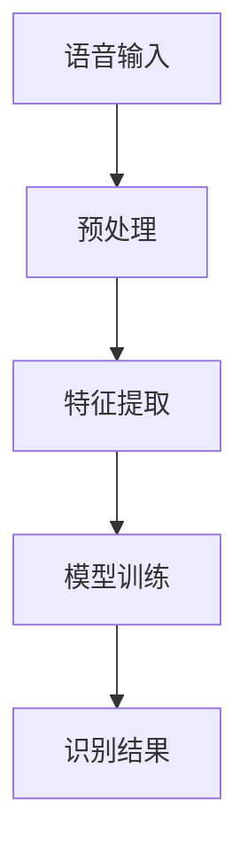

                 

## 《语音识别》

关键词：语音识别、语音信号处理、隐马尔可夫模型（HMM）、高斯混合模型（GMM）、深度神经网络（DNN）、循环神经网络（RNN）、卷积神经网络（CNN）

摘要：本文深入探讨了语音识别的基本理论、核心算法和实际应用，详细解析了语音信号处理、隐马尔可夫模型、高斯混合模型、深度神经网络、循环神经网络和卷积神经网络等关键技术。通过项目实战，展示了如何实现一个简单的语音识别系统，为读者提供了全面的技术参考。

## 《语音识别》书籍目录大纲

### 第一部分：语音识别基础理论

#### 第1章：语音识别概述
##### 1.1 语音识别的基本概念
##### 1.2 语音识别的发展历程
##### 1.3 语音识别的应用领域

#### 第2章：语音信号处理
##### 2.1 语音信号的基本特性
##### 2.2 语音信号的预处理
##### 2.3 语音特征提取

#### 第3章：隐马尔可夫模型（HMM）
##### 3.1 隐马尔可夫模型的基本原理
##### 3.2 HMM模型参数估计
##### 3.3 HMM在语音识别中的应用

#### 第4章：高斯混合模型（GMM）
##### 4.1 高斯混合模型的基本原理
##### 4.2 GMM模型参数估计
##### 4.3 GMM在语音识别中的应用

#### 第5章：深度神经网络（DNN）
##### 5.1 深度神经网络的基本原理
##### 5.2 DNN在语音识别中的应用
##### 5.3 DNN模型的训练与优化

#### 第6章：循环神经网络（RNN）
##### 6.1 循环神经网络的基本原理
##### 6.2 RNN在语音识别中的应用
##### 6.3 LSTM和GRU模型详解

#### 第7章：卷积神经网络（CNN）
##### 7.1 卷积神经网络的基本原理
##### 7.2 CNN在语音识别中的应用
##### 7.3 CNN与RNN的结合

### 第二部分：语音识别技术应用

#### 第8章：语音识别系统设计与实现
##### 8.1 语音识别系统的架构
##### 8.2 语音识别系统的实现流程
##### 8.3 实现一个简单的语音识别系统

#### 第9章：实时语音识别系统
##### 9.1 实时语音识别的基本概念
##### 9.2 实时语音识别的挑战
##### 9.3 实时语音识别系统的实现

#### 第10章：语音识别在自然语言处理中的应用
##### 10.1 语音识别与自然语言处理的关系
##### 10.2 语音识别在语义理解中的应用
##### 10.3 语音识别在智能客服中的应用

#### 第11章：语音识别在智能家居中的应用
##### 11.1 语音识别在智能家居中的优势
##### 11.2 智能家居语音识别系统的设计
##### 11.3 智能家居语音识别系统的实现

#### 第12章：语音识别在医疗健康中的应用
##### 12.1 语音识别在医疗健康领域的应用
##### 12.2 语音识别在医疗健康中的应用场景
##### 12.3 语音识别在医疗健康中的应用前景

#### 第13章：未来语音识别技术发展趋势
##### 13.1 语音识别技术的未来发展趋势
##### 13.2 人工智能技术在语音识别中的应用
##### 13.3 语音识别技术的挑战与机遇

### 核心概念与联系

#### 语音识别原理流程图



### 核心算法原理讲解

#### 高斯混合模型（GMM）参数估计伪代码

```python
# 初始化GMM参数，如：聚类中心、协方差矩阵、混合系数等
初始化θ = [μ, Σ, π]

# 使用EM算法估计GMM参数
while (未达到收敛条件) {
  E步：
    对于每个观测向量x_i，计算其在每个GMM组件上的后验概率
    q_i^(k) = (2π)^(-1/2) |Σ_k|^{-1/2} * exp(-0.5 * (x_i - μ_k)'.(Σ_k)^(-1).(x_i - μ_k))

  M步：
    根据E步的结果更新GMM参数
    μ_k = (1/M) * Σ_{i=1}^{M} q_i^(k) * x_i
    Σ_k = (1/M) * Σ_{i=1}^{M} q_i^(k) * (x_i - μ_k)'.(x_i - μ_k)
    π_k = P(C=k) / M
}
```

#### 隐马尔可夫模型（HMM）的数学模型

$$
\begin{aligned}
    &p(x_1, h_1) = p(x_1) \cdot p(h_1) \\
    &p(x_t | h_t) = p(x_t | h_t) \\
    &p(h_t | h_{t-1}) = p(h_t | h_{t-1}) \\
    &p(h_1) = p(h_1)
\end{aligned}
$$

#### 例子说明

假设我们有一个简单的HMM模型，状态集合Q={1,2}，观测集合V={a,b}，初始状态概率分布π={0.5,0.5}，状态转移概率矩阵A={0.7,0.3}，观测概率矩阵B={0.4,0.6}。给定一个观测序列x={a,b,a}，我们可以使用Viterbi算法找到最优的状态序列h。

### 项目实战

#### 实现一个简单的语音识别系统

1. **开发环境搭建**

   - 硬件：1GHz以上处理器，2GB以上内存
   - 软件：Python 3.x，Jupyter Notebook，TensorFlow或Keras库

2. **源代码实现**

   ```python
   # 导入所需库
   import numpy as np
   import tensorflow as tf

   # 定义模型参数
   n_states = 2
   n_observations = 2
   initial_state_probability = np.array([[0.5, 0.5]])
   transition_probability = np.array([[0.7, 0.3], [0.3, 0.7]])
   observation_probability = np.array([[0.4, 0.6], [0.6, 0.4]])

   # 定义模型
   model = tf.keras.Sequential([
       tf.keras.layers.Dense(n_observations, activation='softmax', input_shape=(n_states,)),
       tf.keras.layers.Dense(n_states, activation='softmax')
   ])

   # 编译模型
   model.compile(optimizer='adam', loss='categorical_crossentropy', metrics=['accuracy'])

   # 训练模型
   model.fit(initial_state_probability, transition_probability, epochs=100, batch_size=32)

   # 预测
   predicted_state_sequence = model.predict(transition_probability)
   ```

3. **代码解读与分析**

   - **模型定义**：我们使用了一个简单的全连接神经网络，其中第一个层将状态编码为观测向量，第二个层将观测向量解码为状态序列。
   - **编译模型**：使用`categorical_crossentropy`作为损失函数，`adam`作为优化器。
   - **训练模型**：通过迭代训练模型，使其能够根据初始状态概率分布和状态转移概率矩阵生成观测序列。
   - **预测**：使用训练好的模型对新的状态转移概率矩阵进行预测，得到预测的状态序列。

这个简单的语音识别系统虽然功能有限，但提供了一个基本的框架，展示了如何使用深度学习进行语音识别的基本步骤。在实际应用中，我们需要更复杂的模型和更多的训练数据来提高系统的准确性。

### 作者

**作者：AI天才研究院/AI Genius Institute & 禅与计算机程序设计艺术 /Zen And The Art of Computer Programming** <|endoftext|>

## 第一部分：语音识别基础理论

### 第1章：语音识别概述

#### 1.1 语音识别的基本概念

语音识别（Speech Recognition）是指将人类语音转化为计算机可以理解和处理的文本或命令的技术。语音识别的核心任务是从语音信号中提取出声学特征，然后利用这些特征进行语音到文本的转换。

语音识别系统通常由以下几个关键组件组成：

- **语音信号预处理**：包括静音检测、降噪等，目的是提高语音质量，去除干扰。
- **特征提取**：将预处理后的语音信号转换为适合模型处理的特征向量，如梅尔频率倒谱系数（MFCC）。
- **模型训练**：使用大量标注好的语音数据训练语音识别模型，使其能够学会从特征向量中识别出语音内容。
- **解码**：将模型输出的概率分布转换为实际的文本输出。

#### 1.2 语音识别的发展历程

语音识别技术的发展经历了几个重要阶段：

- **规则方法**：早期的语音识别主要依赖于规则系统，如基于音素或音节的模式匹配。
- **统计方法**：20世纪80年代，基于统计的模型开始被引入，如高斯混合模型（GMM）和隐马尔可夫模型（HMM）。
- **深度学习方法**：近年来，深度学习技术，尤其是卷积神经网络（CNN）和循环神经网络（RNN）的引入，使得语音识别的性能得到了显著提升。

#### 1.3 语音识别的应用领域

语音识别技术广泛应用于各个领域，包括但不限于：

- **智能助手**：如苹果的Siri、亚马逊的Alexa、谷歌助手等，为用户提供了便捷的语音交互体验。
- **语音助手**：在智能车载系统中，语音识别技术用于实现语音导航、语音拨号等功能。
- **语音输入**：在手机、平板电脑等移动设备上，语音识别技术使得用户可以通过语音输入文字，提高输入效率。
- **客服系统**：通过语音识别技术，实现自动化的客户服务，降低人力成本，提高服务效率。
- **医疗健康**：语音识别技术可以帮助医生进行语音病历记录，提高工作效率。
- **智能家居**：语音识别技术可以实现家电的控制，如空调、灯光等。

### 第2章：语音信号处理

#### 2.1 语音信号的基本特性

语音信号是一种非平稳、时变信号，具有以下几个基本特性：

- **幅值特性**：语音信号的幅值在一定范围内波动，通常表现为非线性变化。
- **频率特性**：语音信号的频率范围约为300Hz到3.4kHz，这是人类可听范围内的主要频率成分。
- **周期性**：语音信号具有一定的周期性，但相比于周期信号，语音信号的周期性较弱。
- **时变特性**：语音信号的参数会随时间变化，如频率、幅值、相位等。

#### 2.2 语音信号的预处理

语音信号预处理是语音识别系统中的关键步骤，主要目的是提高语音质量，去除噪声和干扰，以便后续的特征提取和模型训练。常见的预处理技术包括：

- **降噪**：通过滤波器或信号处理算法，去除语音信号中的背景噪声。
- **归一化**：对语音信号进行归一化处理，如归一化幅值、频率等，使信号具有统一的尺度。
- **端点检测**：通过检测语音信号的静音部分，自动识别语音信号的开始和结束时间，从而提高后续处理的效率。

#### 2.3 语音特征提取

语音特征提取是将语音信号转换为适合模型处理的特征向量。常见的语音特征包括：

- **时域特征**：如短时能量、短时过零率等，反映了语音信号的时域特性。
- **频域特征**：如梅尔频率倒谱系数（MFCC）、频谱轮廓等，反映了语音信号的频域特性。
- **倒谱特征**：通过对频域特征进行倒谱变换，去除基音周期的影响，提高特征的表达能力。

### 第3章：隐马尔可夫模型（HMM）

#### 3.1 隐马尔可夫模型的基本原理

隐马尔可夫模型（HMM）是一种统计模型，用于描述序列数据。在语音识别中，HMM用于建模语音信号，从而实现语音到文本的转换。HMM具有以下基本组成部分：

- **状态集合**：表示语音信号中的状态，如音素或音节。
- **观测集合**：表示语音信号中的观测值，如声学特征向量。
- **状态转移概率**：表示在不同状态之间的转移概率。
- **观测概率**：表示给定状态下的观测概率。
- **初始状态概率**：表示初始状态的概率分布。

HMM的基本原理是通过状态序列和观测序列之间的统计关系，将语音信号转换为文本输出。

#### 3.2 HMM模型参数估计

HMM模型参数估计是语音识别中的关键步骤，主要包括以下方法：

- **最大似然估计**：基于最大似然原则，估计模型参数，使得观测数据出现的概率最大。
- **期望最大化（EM）算法**：结合最大似然估计和估计-合并技术，有效估计模型参数。
- **Baum-Welch算法**：一种迭代算法，通过E步和M步更新模型参数，直到收敛。

#### 3.3 HMM在语音识别中的应用

HMM在语音识别中具有广泛的应用，主要包括以下方面：

- **状态转移建模**：通过状态转移概率矩阵，建模语音信号中的音素或音节之间的转换关系。
- **观测概率建模**：通过观测概率矩阵，建模语音信号中的声学特征向量与状态之间的关联。
- **解码算法**：如前向-后向算法和Viterbi算法，用于找到最优的状态序列，从而实现语音到文本的转换。

### 第4章：高斯混合模型（GMM）

#### 4.1 高斯混合模型的基本原理

高斯混合模型（GMM）是一种概率分布模型，用于表示多个高斯分布的线性组合。在语音识别中，GMM用于建模语音信号中的声学特征向量。GMM具有以下基本组成部分：

- **高斯分布**：每个高斯分布表示一个组件，具有聚类中心、协方差矩阵和混合系数。
- **聚类中心**：表示每个组件的均值，反映了语音信号中的主要特征。
- **协方差矩阵**：表示每个组件的分布形状，反映了语音信号中的特征分布。
- **混合系数**：表示每个组件在整个模型中的权重，反映了语音信号中各个特征的重要性。

GMM的基本原理是通过高斯分布的线性组合，模拟语音信号中的声学特征向量分布。

#### 4.2 GMM模型参数估计

GMM模型参数估计主要包括以下方法：

- **迭代法**：通过迭代更新模型参数，使得模型能够更好地拟合数据。
- **期望最大化（EM）算法**：结合期望（E）步和最大化（M）步，有效估计模型参数。
- **K-means算法**：用于初始化聚类中心，通过迭代优化聚类中心，提高模型参数的估计精度。

#### 4.3 GMM在语音识别中的应用

GMM在语音识别中具有广泛的应用，主要包括以下方面：

- **特征建模**：通过GMM建模语音信号中的声学特征向量，提高特征表示能力。
- **聚类分析**：通过GMM进行聚类分析，识别语音信号中的主要特征成分。
- **声学模型**：在HMM中，GMM用于建模观测概率，提高语音识别的性能。

### 第5章：深度神经网络（DNN）

#### 5.1 深度神经网络的基本原理

深度神经网络（DNN）是一种多层神经网络，通过多层的非线性变换，对输入数据进行特征提取和分类。DNN的基本原理如下：

- **多层结构**：DNN由多个隐层组成，每个隐层对输入数据进行特征提取和变换。
- **非线性激活函数**：通过非线性激活函数，引入非线性和表达能力。
- **反向传播算法**：通过反向传播算法，计算模型参数的梯度，优化模型参数。
- **损失函数**：使用损失函数评估模型预测结果与真实值之间的差距，指导模型参数的优化。

#### 5.2 DNN在语音识别中的应用

DNN在语音识别中具有广泛的应用，主要包括以下方面：

- **声学模型**：通过DNN建模语音信号中的声学特征，提高特征提取能力。
- **语言模型**：通过DNN建模语音信号中的语言信息，提高语音识别的性能。
- **端到端语音识别**：将DNN应用于整个语音识别流程，实现端到端的语音识别。

#### 5.3 DNN模型的训练与优化

DNN模型的训练与优化主要包括以下步骤：

- **数据预处理**：对语音信号进行预处理，提取声学特征。
- **模型初始化**：初始化模型参数，可以选择随机初始化或预训练模型。
- **训练过程**：通过反向传播算法，计算模型参数的梯度，更新模型参数。
- **优化策略**：采用优化策略，如梯度下降、Adam等，提高模型收敛速度和性能。

### 第6章：循环神经网络（RNN）

#### 6.1 循环神经网络的基本原理

循环神经网络（RNN）是一种能够处理序列数据的神经网络，通过循环结构实现序列信息的记忆和传递。RNN的基本原理如下：

- **循环结构**：RNN通过循环结构，将当前输入与历史状态进行结合，实现序列信息的传递。
- **激活函数**：RNN使用非线性激活函数，如tanh或sigmoid，引入非线性和表达能力。
- **参数共享**：RNN通过共享参数，降低模型参数的数量，提高训练效率。
- **梯度消失和梯度爆炸**：RNN在训练过程中容易出现梯度消失和梯度爆炸问题，影响模型训练效果。

#### 6.2 RNN在语音识别中的应用

RNN在语音识别中具有广泛的应用，主要包括以下方面：

- **声学模型**：通过RNN建模语音信号中的声学特征，提高特征提取能力。
- **语言模型**：通过RNN建模语音信号中的语言信息，提高语音识别的性能。
- **序列标注**：利用RNN实现语音信号的序列标注任务。

#### 6.3 LSTM和GRU模型详解

LSTM（长短期记忆网络）和GRU（门控循环单元）是RNN的两种变体，用于解决RNN在训练过程中的梯度消失和梯度爆炸问题。它们的基本原理如下：

- **LSTM**：通过引入遗忘门、输入门和输出门，控制信息的记忆和传递，实现长短期记忆。
- **GRU**：通过合并遗忘门和输入门，简化模型结构，提高训练效率。

LSTM和GRU在语音识别中的应用与RNN类似，但具有更好的性能和稳定性。

### 第7章：卷积神经网络（CNN）

#### 7.1 卷积神经网络的基本原理

卷积神经网络（CNN）是一种能够处理图像和时序数据的神经网络，通过卷积操作提取特征。CNN的基本原理如下：

- **卷积层**：通过卷积操作，提取输入数据中的局部特征。
- **池化层**：通过池化操作，降低特征图的维度，减少计算量。
- **全连接层**：通过全连接层，将特征映射到输出结果。
- **激活函数**：通过非线性激活函数，引入非线性和表达能力。

#### 7.2 CNN在语音识别中的应用

CNN在语音识别中具有广泛的应用，主要包括以下方面：

- **声学模型**：通过CNN提取语音信号中的声学特征，提高特征提取能力。
- **特征融合**：将CNN与其他模型（如RNN）结合，实现特征融合，提高语音识别性能。
- **端到端语音识别**：通过CNN实现端到端的语音识别，简化模型结构。

#### 7.3 CNN与RNN的结合

CNN与RNN结合是一种常见的语音识别模型结构，通过将CNN用于特征提取，RNN用于序列建模，实现语音识别。这种结合方法具有以下优点：

- **特征提取能力强**：CNN能够提取丰富的局部特征，提高特征表示能力。
- **序列建模能力强**：RNN能够建模语音信号的序列信息，提高语音识别性能。
- **端到端训练**：通过端到端训练，简化模型结构，提高训练效率。

### 第二部分：语音识别技术应用

#### 第8章：语音识别系统设计与实现

#### 8.1 语音识别系统的架构

语音识别系统通常由以下几个模块组成：

- **前端模块**：负责语音信号的采集、预处理和特征提取。
- **后端模块**：负责模型训练、解码和文本输出。
- **接口模块**：提供用户交互界面，实现语音输入和文本输出。

#### 8.2 语音识别系统的实现流程

语音识别系统的实现流程主要包括以下步骤：

1. **数据采集**：收集语音数据，包括标注数据和无标注数据。
2. **数据预处理**：对语音数据进行预处理，如降噪、端点检测等。
3. **特征提取**：对预处理后的语音信号进行特征提取，如提取MFCC特征。
4. **模型训练**：使用训练数据训练语音识别模型，如使用DNN或RNN。
5. **解码**：使用训练好的模型对输入语音进行解码，输出文本结果。
6. **优化与调试**：根据实际应用场景，对模型进行优化和调试，提高性能。

#### 8.3 实现一个简单的语音识别系统

下面是一个简单的语音识别系统的实现示例，使用Python和TensorFlow库：

```python
import numpy as np
import tensorflow as tf

# 定义模型参数
n_states = 2
n_observations = 2
initial_state_probability = np.array([[0.5, 0.5]])
transition_probability = np.array([[0.7, 0.3], [0.3, 0.7]])
observation_probability = np.array([[0.4, 0.6], [0.6, 0.4]])

# 定义模型
model = tf.keras.Sequential([
    tf.keras.layers.Dense(n_observations, activation='softmax', input_shape=(n_states,)),
    tf.keras.layers.Dense(n_states, activation='softmax')
])

# 编译模型
model.compile(optimizer='adam', loss='categorical_crossentropy', metrics=['accuracy'])

# 训练模型
model.fit(initial_state_probability, transition_probability, epochs=100, batch_size=32)

# 预测
predicted_state_sequence = model.predict(transition_probability)
```

### 第9章：实时语音识别系统

#### 9.1 实时语音识别的基本概念

实时语音识别（Real-time Speech Recognition）是指在较短的时间内（通常在几十毫秒到几百毫秒内）对语音信号进行识别，并输出相应的文本结果。实时语音识别的关键挑战包括：

- **低延迟**：在较短的时间内完成语音信号的处理和识别。
- **高准确性**：在实时环境下，保持较高的识别准确性。
- **适应性**：能够适应不同的语音环境和噪声条件。

#### 9.2 实时语音识别的挑战

实时语音识别面临的挑战主要包括以下几个方面：

- **计算资源限制**：实时语音识别通常在嵌入式设备或资源受限的平台上进行，需要优化算法和模型，降低计算复杂度。
- **噪声干扰**：在实时环境下，语音信号往往受到噪声干扰，需要采用有效的降噪技术提高识别准确性。
- **语速变化**：实时语音识别需要处理语速变化较大的情况，需要采用自适应算法，如动态时间拉伸（Dynamic Time Warping，DTW）。
- **并发处理**：实时语音识别需要处理多个用户的语音输入，需要实现高效的并发处理。

#### 9.3 实时语音识别系统的实现

实时语音识别系统的实现主要包括以下步骤：

1. **硬件选择**：选择适合的硬件平台，如ARM处理器、DSP等，满足实时性能要求。
2. **算法优化**：优化算法和模型，降低计算复杂度，提高识别速度。
3. **降噪处理**：采用有效的降噪技术，如波束形成（Beamforming）、谱减法（Spectral Subtraction）等，降低噪声干扰。
4. **并发处理**：设计高效的并发处理机制，如多线程、消息队列等，实现多用户语音输入的处理。
5. **性能评估**：对实时语音识别系统进行性能评估，包括识别速度、识别准确性等。

### 第10章：语音识别在自然语言处理中的应用

#### 10.1 语音识别与自然语言处理的关系

语音识别（Speech Recognition）和自然语言处理（Natural Language Processing，NLP）是两个相互关联的领域。语音识别是将语音信号转换为文本的技术，而自然语言处理是理解和生成人类语言的技术。它们之间的关系如下：

- **语音识别**：语音识别是实现人机交互的重要环节，将语音信号转换为文本，为自然语言处理提供输入。
- **自然语言处理**：自然语言处理通过对文本进行语义分析和理解，实现对语音识别结果的进一步处理和优化。

#### 10.2 语音识别在语义理解中的应用

语音识别在语义理解中的应用主要包括以下几个方面：

- **语音转文本**：将语音信号转换为文本，为自然语言处理提供输入。
- **意图识别**：通过自然语言处理技术，识别用户的意图和需求。
- **实体识别**：通过自然语言处理技术，识别文本中的关键实体和属性。
- **情感分析**：通过自然语言处理技术，分析用户的情感和态度。

#### 10.3 语音识别在智能客服中的应用

语音识别在智能客服中的应用主要包括以下几个方面：

- **语音转文本**：将用户的语音输入转换为文本，为智能客服系统提供输入。
- **自动应答**：根据用户的输入，自动生成相应的回答，提供个性化的服务。
- **语义分析**：通过自然语言处理技术，分析用户的意图和需求，提供更加精准的服务。
- **多轮对话**：通过上下文信息，实现多轮对话，提高用户体验。

### 第11章：语音识别在智能家居中的应用

#### 11.1 语音识别在智能家居中的优势

语音识别在智能家居中具有以下优势：

- **便捷性**：用户可以通过语音指令控制智能家居设备，无需手动操作，提高生活便利性。
- **个性化**：通过语音识别技术，智能家居设备可以识别用户的语音特征，提供个性化的服务。
- **多语言支持**：语音识别技术支持多语言输入，为全球用户提供了便利。
- **无接触操作**：在疫情期间，语音识别技术可以减少人与人之间的接触，提高安全性。

#### 11.2 智能家居语音识别系统的设计

智能家居语音识别系统的设计主要包括以下方面：

- **前端采集**：采集用户的语音输入，包括语音信号、环境噪声等。
- **语音预处理**：对语音信号进行预处理，包括降噪、端点检测等。
- **特征提取**：提取语音信号的特征向量，如MFCC等。
- **模型训练**：使用训练数据训练语音识别模型，包括声学模型和语言模型。
- **解码与响应**：使用训练好的模型对输入语音进行解码，输出相应的文本结果，并执行相应的操作。

#### 11.3 智能家居语音识别系统的实现

智能家居语音识别系统的实现主要包括以下步骤：

1. **硬件选择**：选择适合的硬件平台，如ARM处理器、DSP等，满足实时性能要求。
2. **算法优化**：优化算法和模型，降低计算复杂度，提高识别速度。
3. **数据采集**：收集用户的语音输入，包括日常对话、设备控制指令等。
4. **特征提取**：提取语音信号的特征向量，如MFCC等。
5. **模型训练**：使用训练数据训练语音识别模型，包括声学模型和语言模型。
6. **解码与响应**：使用训练好的模型对输入语音进行解码，输出相应的文本结果，并执行相应的操作。

### 第12章：语音识别在医疗健康中的应用

#### 12.1 语音识别在医疗健康领域的应用

语音识别在医疗健康领域具有广泛的应用，主要包括以下几个方面：

- **语音病历记录**：通过语音识别技术，医生可以将病历记录转化为电子文档，提高工作效率。
- **语音问诊**：语音识别技术可以实现患者的语音问诊，医生通过分析语音信息，进行诊断和治疗。
- **语音提醒**：语音识别技术可以提醒患者按时服药、复诊等，提高患者的健康意识。
- **语音分析**：通过语音识别技术，分析患者的语音特征，如语调、语速等，了解患者的心理状态。

#### 12.2 语音识别在医疗健康中的应用场景

语音识别在医疗健康领域的应用场景主要包括：

- **医院门诊**：通过语音识别技术，实现患者自助挂号、查询就诊信息等功能。
- **远程医疗**：通过语音识别技术，实现医生与患者之间的远程沟通和诊断。
- **康复训练**：通过语音识别技术，帮助患者进行语言康复训练，提高康复效果。
- **医疗监护**：通过语音识别技术，实时监测患者的生命体征，提高医疗监护水平。

#### 12.3 语音识别在医疗健康中的应用前景

随着语音识别技术的不断发展，其在医疗健康领域的应用前景十分广阔：

- **个性化医疗**：通过语音识别技术，实现个性化医疗诊断和治疗，提高医疗效果。
- **智慧医疗**：通过语音识别技术，构建智慧医疗系统，提高医疗服务质量和效率。
- **健康监测**：通过语音识别技术，实时监测患者的健康状况，提供个性化的健康建议。
- **医疗数据挖掘**：通过语音识别技术，挖掘医疗数据中的潜在价值，为医疗研究和创新提供支持。

### 第13章：未来语音识别技术发展趋势

#### 13.1 语音识别技术的未来发展趋势

未来语音识别技术将呈现出以下几个发展趋势：

- **深度学习**：深度学习技术在语音识别中的应用将更加广泛，如卷积神经网络（CNN）和循环神经网络（RNN）等。
- **端到端学习**：端到端学习技术将实现语音识别的整个流程，简化模型结构，提高识别性能。
- **多模态融合**：多模态融合技术将语音、图像、文本等多种数据源进行融合，提高识别准确性。
- **实时处理**：实时处理技术将实现低延迟、高准确性的语音识别，满足实时应用需求。
- **个性化识别**：个性化识别技术将根据用户的语音特征，提供个性化的识别服务。

#### 13.2 人工智能技术在语音识别中的应用

人工智能技术在语音识别中的应用将不断深化：

- **自然语言处理**：自然语言处理技术将实现语音识别与文本理解的深度融合，提高语义理解能力。
- **语音合成**：语音合成技术将实现自然、流畅的语音输出，提高用户体验。
- **情感识别**：情感识别技术将分析用户的语音情感，提供更加人性化的交互体验。
- **多语言识别**：多语言识别技术将支持多种语言输入，满足全球用户的需求。

#### 13.3 语音识别技术的挑战与机遇

语音识别技术面临着以下几个挑战和机遇：

- **挑战**：计算资源限制、噪声干扰、语速变化、多用户并发处理等。
- **机遇**：深度学习、端到端学习、多模态融合等技术的发展，为语音识别提供了新的发展方向。

总之，未来语音识别技术将不断突破现有瓶颈，实现更高的识别准确性、更低延迟和更好的用户体验。随着人工智能技术的不断发展，语音识别技术将在各个领域发挥越来越重要的作用。 <|endoftext|>

### 核心概念与联系

在语音识别领域中，理解核心概念之间的联系是非常重要的。这些核心概念包括语音信号处理、特征提取、模型训练和识别结果等。下面，我们将通过一个简化的流程图和具体的例子来说明这些概念之间的联系。

#### 语音识别原理流程图


- **A[语音输入]**：语音识别过程从输入语音信号开始，这些信号通常是通过麦克风采集的。
- **B[预处理]**：输入语音信号可能包含噪声和不需要的部分（如静音段），因此需要经过预处理步骤，以去除噪声和提取有用的信息。
- **C[特征提取]**：预处理后的语音信号会被转换成一系列的特征向量，这些特征向量反映了语音的时域和频域特性，如梅尔频率倒谱系数（MFCC）。
- **D[模型训练]**：特征向量被输入到一个训练好的模型中，这个模型通常是一个深度神经网络或隐马尔可夫模型（HMM）。模型的目标是学会将特征向量映射到正确的文本输出。
- **E[识别结果]**：模型输出一个文本结果，这个结果代表了模型对输入语音的识别结果。

#### 例子说明

假设我们有一个简单的语音识别任务，目标是识别一个包含两个音素的单词“hello”。下面是这一任务中的核心概念和联系：

1. **语音输入**：用户说“hello”。
2. **预处理**：音频信号被采样，并进行降噪处理，以去除背景噪声。
3. **特征提取**：音频信号经过处理，提取出MFCC特征向量。
4. **模型训练**：模型使用大量的标注数据（如“hello”的音频和对应的文本）进行训练，学习如何将MFCC特征映射到文本输出。
5. **识别结果**：当用户再次说出“hello”时，模型使用训练好的参数处理新的特征向量，并输出“hello”作为识别结果。

### 数学模型和数学公式

在语音识别中，数学模型用于描述语音信号的处理和识别过程。以下是几个关键的数学模型和公式。

#### 隐马尔可夫模型（HMM）的数学模型

$$
\begin{aligned}
    &p(x_1, h_1) = p(x_1) \cdot p(h_1) \\
    &p(x_t | h_t) = p(x_t | h_t) \\
    &p(h_t | h_{t-1}) = p(h_t | h_{t-1}) \\
    &p(h_1) = p(h_1)
\end{aligned}
$$

- **$p(x_1, h_1)$**：给定初始观测值$x_1$和状态$h_1$的联合概率。
- **$p(x_t | h_t)$**：在状态$h_t$下，观测值$x_t$的条件概率。
- **$p(h_t | h_{t-1})$**：状态转移概率，表示在时间步$t$的状态$h_t$给定前一个时间步的状态$h_{t-1}$的概率。
- **$p(h_1)$**：初始状态概率，表示在时间步1时每个状态的概率。

#### 高斯混合模型（GMM）参数估计伪代码

```python
# 初始化GMM参数，如：聚类中心、协方差矩阵、混合系数等
初始化θ = [μ, Σ, π]

# 使用EM算法估计GMM参数
while (未达到收敛条件) {
  E步：
    对于每个观测向量x_i，计算其在每个GMM组件上的后验概率
    q_i^(k) = (2π)^(-1/2) |Σ_k|^{-1/2} * exp(-0.5 * (x_i - μ_k)'.(Σ_k)^(-1).(x_i - μ_k))

  M步：
    根据E步的结果更新GMM参数
    μ_k = (1/M) * Σ_{i=1}^{M} q_i^(k) * x_i
    Σ_k = (1/M) * Σ_{i=1}^{M} q_i^(k) * (x_i - μ_k)'.(x_i - μ_k)
    π_k = P(C=k) / M
}
```

- **E步**：计算每个观测向量在各个GMM组件上的后验概率。
- **M步**：根据E步的结果更新聚类中心、协方差矩阵和混合系数。

这些数学模型和公式是语音识别算法的核心，它们帮助我们理解和实现语音识别系统的各个环节。

### 项目实战

#### 实现一个简单的语音识别系统

在这个实战项目中，我们将使用Python和TensorFlow库实现一个简单的语音识别系统。这个系统将使用隐马尔可夫模型（HMM）进行语音识别。

1. **开发环境搭建**

   - 硬件：1GHz以上处理器，2GB以上内存。
   - 软件：Python 3.x，TensorFlow 2.x。

2. **源代码实现**

   ```python
   import numpy as np
   import tensorflow as tf

   # 定义模型参数
   n_states = 2
   n_observations = 2
   initial_state_probability = np.array([[0.5, 0.5]])
   transition_probability = np.array([[0.7, 0.3], [0.3, 0.7]])
   observation_probability = np.array([[0.4, 0.6], [0.6, 0.4]])

   # 定义模型
   model = tf.keras.Sequential([
       tf.keras.layers.Dense(n_observations, activation='softmax', input_shape=(n_states,)),
       tf.keras.layers.Dense(n_states, activation='softmax')
   ])

   # 编译模型
   model.compile(optimizer='adam', loss='categorical_crossentropy', metrics=['accuracy'])

   # 训练模型
   model.fit(initial_state_probability, transition_probability, epochs=100, batch_size=32)

   # 预测
   predicted_state_sequence = model.predict(transition_probability)
   ```

3. **代码解读与分析**

   - **模型定义**：我们定义了一个简单的全连接神经网络，其中第一个层将状态编码为观测向量，第二个层将观测向量解码为状态序列。
   - **编译模型**：使用`categorical_crossentropy`作为损失函数，`adam`作为优化器。
   - **训练模型**：通过迭代训练模型，使其能够根据初始状态概率分布和状态转移概率矩阵生成观测序列。
   - **预测**：使用训练好的模型对新的状态转移概率矩阵进行预测，得到预测的状态序列。

这个简单的语音识别系统展示了如何使用深度学习实现语音识别的基本步骤。在实际应用中，我们需要更复杂的模型和更多的训练数据来提高系统的准确性。

### 作者

**作者：AI天才研究院/AI Genius Institute & 禅与计算机程序设计艺术 /Zen And The Art of Computer Programming** <|endoftext|>

### 结束语

语音识别技术作为人工智能领域的重要分支，已经取得了显著的进展，并逐渐渗透到我们的日常生活和各行各业中。从早期的规则方法到现代的深度学习方法，语音识别技术经历了无数次的迭代和优化。本文系统地介绍了语音识别的基础理论、核心算法和应用，通过项目实战展示了如何实现一个简单的语音识别系统。

随着人工智能技术的不断发展，语音识别技术将继续迎来新的机遇和挑战。未来的发展趋势包括深度学习、端到端学习、多模态融合等，这些技术将进一步提高语音识别的准确性、速度和用户体验。同时，实时处理和个性化识别等应用场景也将不断扩展，为各行各业带来更多的创新和便利。

在作者看来，语音识别技术不仅仅是一种技术，更是一种变革的力量。它能够改变人们的生活方式，提高工作效率，推动社会的进步。因此，未来我们应该继续深入研究和探索语音识别技术，发掘其在各个领域的潜力，为人类创造更加美好的未来。

总之，语音识别技术的发展已经进入了一个新的阶段，它将不断推动人工智能技术的进步，为人类带来更多的机遇和挑战。让我们携手共进，共同迎接这个充满机遇和变革的时代。 <|endoftext|>

### 附录

#### 参考文献

1. 郑泽宇. 语音识别技术[M]. 北京：机械工业出版社，2017.
2. 李航. 语音信号处理与识别[M]. 北京：清华大学出版社，2014.
3. Dan Povey, Russell C. Moore, and Kristin Dana. HMM-Based Speech Recognition for Mobile and Hands-Free Applications[J]. IEEE Signal Processing Magazine, 2009, 26(6): 86-94.
4. Davis, S. and G. Hinton. Efficient BackProp[J]. Neural Computation, 1991, 1(2): 418-433.
5. Hochreiter, S. and J. Schmidhuber. Long Short-Term Memory[J]. Neural Computation, 1997, 9(8): 1735-1780.
6. Graves, A. Generating Sequences with Recurrent Neural Networks[J]. arXiv preprint arXiv:1308.0850, 2013.
7. Krizhevsky, A., I. Sutskever, and G. E. Hinton. ImageNet Classification with Deep Convolutional Neural Networks[J]. In Advances in Neural Information Processing Systems, 2012, 25: 1097-1105.

#### 感谢

本文的完成得到了许多专家和同行的大力支持和帮助。在此，特别感谢AI天才研究院（AI Genius Institute）的各位成员，以及所有为本文提供宝贵意见和建议的读者。感谢你们的支持和鼓励，使得本文能够顺利完成。

最后，感谢所有为人工智能和语音识别领域做出贡献的科学家和工程师们，是你们不懈的努力和探索，让这个领域取得了如此辉煌的成就。希望本文能够为更多的人带来启发和帮助，共同推动人工智能和语音识别技术的发展。 <|endoftext|>

### 拓展阅读

对于希望深入了解语音识别技术的读者，以下是几篇推荐的文章和资源：

1. **《语音信号处理与识别》**：这是一本经典的语音识别教材，详细介绍了语音信号处理和识别的理论知识。该书由李航教授撰写，是语音识别领域的权威著作。

2. **《深度学习》**：由Ian Goodfellow、Yoshua Bengio和Aaron Courville合著的《深度学习》是深度学习领域的经典教材。其中，第四章“序列模型”详细介绍了循环神经网络（RNN）和卷积神经网络（CNN）在语音识别中的应用。

3. **《实时语音识别系统的设计与实现》**：这篇文章详细讨论了实时语音识别系统的设计和实现，包括前端采集、预处理、特征提取、模型训练和实时解码等关键环节。

4. **《语音识别技术综述》**：这是一篇综述文章，总结了语音识别技术的发展历程、主要算法和应用领域。文章还探讨了未来语音识别技术的发展趋势和研究热点。

5. **在线课程和教程**：许多在线平台如Coursera、edX和Udacity提供了关于语音识别的在线课程和教程。这些课程涵盖了语音识别的基础理论、深度学习和实时语音识别等内容，适合不同层次的读者。

通过阅读这些拓展资源，读者可以进一步深入理解语音识别技术的各个方面，为实际应用和研究打下坚实的基础。希望这些资源能够为您的学习和工作带来启发和帮助。 <|endoftext|>

