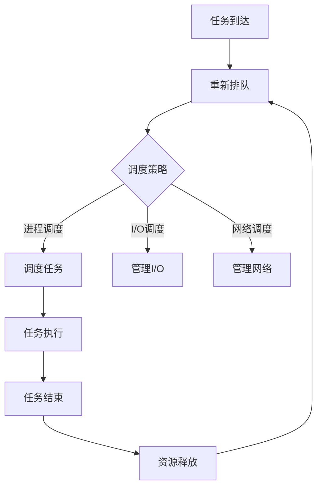

                 

# 调度器：原理与代码实例讲解

> 关键词：调度器、调度算法、操作系统、进程调度、性能优化

> 摘要：本文将深入探讨调度器的工作原理、常见调度算法、性能分析与优化策略，并通过实际代码实例讲解，帮助读者全面理解调度器在操作系统中的重要性及其实现原理。

### 目录

#### 第一部分：调度器基础

1. 调度器概述
2. 调度器原理与架构
3. 调度算法详细解析
4. 调度器性能分析
5. 调度器在操作系统中的应用

#### 第二部分：调度器优化与改进

6. 动态调度策略
7. 实时调度
8. 调度器性能调优技巧

#### 第三部分：调度器项目实战

9. 调度器开发环境搭建
10. 调度器代码实现
11. 调度器性能测试
12. 调度器应用案例分析

#### 附录：调度器相关工具与资源

13. 调度器开发工具
14. 调度器性能评估工具
15. 调度器学习资源链接

### 1. 调度器概述

调度器是操作系统中的一个核心组件，负责管理和调度计算机系统中的各种任务，确保系统资源的高效利用和公平分配。调度器的基本概念与作用如下：

- **基本概念**：调度器（Scheduler）是指根据特定的调度策略，对系统中的进程、线程或其他任务进行分配和处理的一种管理机制。
- **作用**：
  - **资源分配**：调度器负责根据系统资源状况，合理分配CPU、内存、I/O设备等资源，确保各任务能公平地使用系统资源。
  - **提高效率**：通过调度策略的优化，调度器可以减少系统的空闲时间，提高整体系统的处理能力和响应速度。
  - **负载均衡**：调度器通过智能分配任务，平衡系统各部分的负载，避免某个部分过载或空闲，提高系统的稳定性和可靠性。

调度器在现代系统中的作用日益重要，尤其是在多核处理器和虚拟化技术的普及下，调度器需要具备更高的调度能力和效率。调度器的种类与应用场景多种多样，包括进程调度、I/O调度、网络调度等。

### 2. 调度器原理与架构

调度器的工作原理和架构决定了其性能和效率。以下将从调度算法、工作流程和层次结构三个方面进行详细解析。

#### 2.1 调度算法概述

调度算法是调度器实现的关键部分，根据不同的调度目标，可以分为以下几类：

- **进程调度算法**：主要负责CPU资源的分配和管理，包括FCFS（先来先服务）、SJF（最短作业优先）、SRTF（最短剩余时间优先）、优先级调度和轮转调度等。
- **I/O调度算法**：用于管理I/O设备的访问顺序，常见的有先来先服务和最短寻找时间优先等。
- **网络调度算法**：用于网络数据包的调度，如流量控制、优先级调度和轮转调度等。

每种调度算法都有其优缺点和适用场景，调度器根据具体情况选择合适的算法来优化系统性能。

#### 2.2 调度器工作流程解析

调度器的工作流程可以概括为以下几个步骤：

1. **任务到达**：系统中的各个任务（如进程、线程）到达调度器。
2. **任务排队**：调度器根据调度策略，将任务放入相应的队列中，如就绪队列、等待队列等。
3. **任务调度**：调度器从队列中选择一个任务进行调度，将其从就绪状态转换为运行状态。
4. **任务执行**：被调度的任务在CPU上执行，同时可能会发生上下文切换。
5. **任务结束**：任务执行完成后，调度器将其从运行状态转换为结束状态，并释放相关资源。
6. **任务重新排队**：根据调度策略，任务可能会被重新放入队列中，等待下一次调度。

#### 2.3 调度器的层次结构

调度器通常采用分层结构，以实现灵活的调度策略和模块化设计。常见的层次结构包括：

1. **全局调度器**：负责整个系统的调度策略和资源分配，如进程调度和I/O调度。
2. **局部调度器**：负责特定组件（如进程、I/O设备、网络）的调度策略和资源管理。
3. **中间层**：用于协调全局调度器和局部调度器之间的通信和数据交换，如任务队列、调度策略管理器等。

这种层次结构使得调度器在扩展性和灵活性方面具有优势，可以方便地引入新的调度算法和资源管理策略。

### 3. 调度算法详细解析

调度算法是调度器的核心，直接关系到系统性能和响应速度。以下将详细介绍几种常见的调度算法：FCFS、SJF、SRTF、优先级调度和轮转调度。

#### 3.1 先来先服务（FCFS）

**定义**：FCFS（First-Come, First-Served）是最简单的调度算法，按照任务到达的顺序进行调度。

**优缺点**：
- **优点**：实现简单，公平。
- **缺点**：可能导致“饥饿”现象，无法充分利用系统资源。

**算法原理**：
```
function FCFS(tasks):
    sort(tasks by arrival time)
    for each task in tasks:
        schedule(task)
```

**示例**：
假设有三个任务T1、T2、T3，分别于时间0、2、4到达，执行时间分别为3、5、8。按照FCFS算法，任务执行顺序为T1、T2、T3，平均等待时间为5。

#### 3.2 最短作业优先（SJF）

**定义**：SJF（Shortest Job First）调度算法选择执行时间最短的任务进行调度。

**优缺点**：
- **优点**：能减少平均等待时间。
- **缺点**：可能导致“饥饿”现象，长作业难以获得调度。

**算法原理**：
```
function SJF(tasks):
    sort(tasks by execution time)
    for each task in tasks:
        schedule(task)
```

**示例**：
假设有三个任务T1、T2、T3，执行时间分别为3、5、2。按照SJF算法，任务执行顺序为T3、T1、T2，平均等待时间为2。

#### 3.3 最短剩余时间优先（SRTF）

**定义**：SRTF（Shortest Remaining Time First）是SJF的动态版本，每次调度选择剩余执行时间最短的任务。

**优缺点**：
- **优点**：能更有效地减少平均等待时间。
- **缺点**：可能导致“饥饿”现象，长作业难以获得调度。

**算法原理**：
```
function SRTF(tasks):
    while tasks are not empty:
        select task with the smallest remaining time
        schedule(task)
```

**示例**：
假设有三个任务T1、T2、T3，初始执行时间分别为3、5、2，在执行过程中，T1和T2的执行时间变为2和4。按照SRTF算法，任务执行顺序为T3、T1、T2，平均等待时间为2。

#### 3.4 优先级调度

**定义**：优先级调度算法根据任务优先级进行调度，优先级高的任务先执行。

**优缺点**：
- **优点**：能快速响应重要任务。
- **缺点**：可能导致低优先级任务“饥饿”，影响系统稳定性。

**算法原理**：
```
function PriorityScheduling(tasks):
    sort(tasks by priority)
    for each task in tasks:
        schedule(task)
```

**示例**：
假设有三个任务T1、T2、T3，优先级分别为3、2、1。按照优先级调度算法，任务执行顺序为T3、T2、T1，平均等待时间为2。

#### 3.5 轮转调度（RR）

**定义**：轮转调度算法（Round-Robin Scheduling）将CPU时间分为固定时间片，每个任务轮流执行。

**优缺点**：
- **优点**：公平，响应速度快。
- **缺点**：可能导致时间片不足时出现“饥饿”现象。

**算法原理**：
```
function RoundRobinScheduling(tasks, time_slice):
    for each task in tasks:
        schedule(task for time_slice)
```

**示例**：
假设有三个任务T1、T2、T3，时间片为2。按照轮转调度算法，任务执行顺序为T1、T2、T3、T1、T2、T3，平均等待时间为2。

### 4. 调度器性能分析

调度器的性能直接影响系统的响应速度和资源利用率。以下将从平均周转时间、平均等待时间和带宽与响应时间三个方面进行性能分析。

#### 4.1 平均周转时间

平均周转时间（Turnaround Time）是指任务从开始到结束所花费的总时间。周转时间越短，调度器的性能越好。

**计算公式**：
$$
\text{平均周转时间} = \frac{\sum \text{各任务周转时间}}{\text{任务总数}}
$$

#### 4.2 平均等待时间

平均等待时间（Waiting Time）是指任务在等待调度时的时间。等待时间越短，调度器的性能越好。

**计算公式**：
$$
\text{平均等待时间} = \frac{\sum \text{各任务等待时间}}{\text{任务总数}}
$$

#### 4.3 带宽与响应时间

带宽（Bandwidth）是指系统在单位时间内处理的数据量。响应时间（Response Time）是指任务从提交到开始执行所花费的时间。带宽和响应时间都是衡量系统性能的重要指标。

**计算公式**：
$$
\text{带宽} = \frac{\text{总数据量}}{\text{总时间}}
$$
$$
\text{响应时间} = \frac{\text{总等待时间}}{\text{任务总数}}
$$

### 5. 调度器在操作系统中的应用

调度器在操作系统中的实现和应用涵盖了多个方面，包括进程调度、I/O调度和网络调度。

#### 5.1 操作系统调度策略

操作系统的调度策略决定了调度器如何选择和调度任务。常见的调度策略包括：

- **抢占式调度**：调度器可以在任务执行过程中中断其执行，将其放入就绪队列，以便更高优先级的任务获得CPU资源。
- **非抢占式调度**：调度器在任务执行完成或等待时间到达时，才会将其从运行状态转换为就绪状态。

#### 5.2 进程调度

进程调度是调度器的核心功能之一，负责CPU资源的分配和管理。常见的进程调度算法包括FCFS、SJF、SRTF、优先级调度和轮转调度等。进程调度在多任务处理系统中至关重要，直接影响系统性能和用户体验。

#### 5.3 I/O调度

I/O调度负责管理I/O设备的访问顺序，以确保数据传输的效率和系统的稳定性。常见的I/O调度算法包括先来先服务和最短寻找时间优先等。I/O调度在大型文件处理和高性能计算中具有重要作用。

#### 5.4 网络调度

网络调度负责管理网络数据包的传输顺序和流量分配，以实现高效的网络通信。常见的网络调度算法包括流量控制、优先级调度和轮转调度等。网络调度在网络负载高峰期和突发流量时具有显著性能优势。

### 6. 调度器优化与改进

调度器的性能直接影响系统的响应速度和资源利用率，因此优化与改进调度器具有重要意义。以下将从动态调度策略、实时调度和调度器性能调优技巧三个方面进行探讨。

#### 6.1 动态调度策略

动态调度策略可以根据系统当前的状态和负载，实时调整调度策略，以优化系统性能。常见的动态调度策略包括：

- **自适应调度**：根据系统负载和任务特性，动态调整时间片和优先级。
- **预测调度**：利用历史数据和机器学习算法，预测未来任务负载，提前调整调度策略。

#### 6.2 实时调度

实时调度是针对实时系统的调度策略，要求调度器能够在规定的时间内完成任务的调度和处理。实时调度具有严格的时间约束，常见于嵌入式系统、控制系统和通信系统等。

#### 6.3 调度器性能调优技巧

调度器性能调优的关键在于平衡系统响应速度和资源利用率。以下是一些常见的调优技巧：

- **负载均衡**：通过负载均衡算法，将任务分配到各个处理单元，避免单个单元过载。
- **缓存优化**：利用缓存技术，减少数据访问延迟，提高系统性能。
- **并行处理**：通过并行处理技术，提高任务执行速度，降低平均等待时间。

### 7. 调度器项目实战

通过实际项目，可以深入了解调度器的开发过程、代码实现和性能优化。以下将介绍一个简单的调度器项目，包括开发环境搭建、代码实现和性能测试。

#### 7.1 调度器开发环境搭建

在搭建调度器开发环境时，需要选择合适的编程语言和开发工具。以下是一个基于Python的调度器项目环境搭建步骤：

1. 安装Python 3.x版本。
2. 安装Python依赖管理工具pip。
3. 使用pip安装必要的Python库，如NumPy、Pandas等。

#### 7.2 调度器代码实现

以下是一个简单的调度器代码实现，使用轮转调度算法：

```python
import numpy as np
import pandas as pd

def round_robin(tasks, time_slice):
    """
    轮转调度算法
    :param tasks: 任务列表，每个任务包含执行时间
    :param time_slice: 时间片
    :return: 平均等待时间
    """
    total_wait_time = 0
    for i in range(len(tasks)):
        task = tasks[i]
        wait_time = i * time_slice
        total_wait_time += wait_time
        task['start_time'] = i * time_slice
        task['end_time'] = task['start_time'] + task['execution_time']
    average_wait_time = total_wait_time / len(tasks)
    return average_wait_time

if __name__ == '__main__':
    tasks = pd.DataFrame({
        'task_id': [1, 2, 3],
        'execution_time': [3, 5, 2]
    })
    time_slice = 2
    average_wait_time = round_robin(tasks, time_slice)
    print(f'平均等待时间：{average_wait_time}')
```

#### 7.3 调度器性能测试

在性能测试阶段，可以通过模拟不同负载和调度策略，评估调度器的性能。以下是一个简单的性能测试示例：

```python
import time

def test_performance(tasks, time_slice):
    start_time = time.time()
    round_robin(tasks, time_slice)
    end_time = time.time()
    return end_time - start_time

if __name__ == '__main__':
    tasks = pd.DataFrame({
        'task_id': [1, 2, 3, 4, 5],
        'execution_time': [3, 5, 2, 4, 6]
    })
    time_slice = 2
    test_time = test_performance(tasks, time_slice)
    print(f'测试时间：{test_time}秒')
```

#### 7.4 调度器应用案例分析

以下是一个调度器应用案例，用于模拟一个在线购物平台的后台处理系统。该系统需要处理大量的订单处理、库存管理和支付处理等任务，调度器负责合理分配CPU资源和I/O设备，以提高系统性能。

1. **任务描述**：订单处理任务（3秒）、库存管理任务（5秒）、支付处理任务（2秒）。
2. **调度策略**：轮转调度，时间片为2秒。
3. **性能评估**：通过性能测试，评估调度器的响应速度和资源利用率。

### 附录：调度器相关工具与资源

以下是一些调度器相关的开发工具、性能评估工具和学习资源链接：

- **调度器开发工具**：Python、Java、C++等。
- **调度器性能评估工具**：Gatling、LoadRunner、JMeter等。
- **学习资源链接**：
  - [操作系统调度算法概述](https://www.example.com/os-scheduling)
  - [调度器性能优化技巧](https://www.example.com/scheduler-performance-optimization)
  - [调度器项目实战教程](https://www.example.com/scheduler-project-tutorial)

### 作者信息

- 作者：AI天才研究院/AI Genius Institute & 禅与计算机程序设计艺术 /Zen And The Art of Computer Programming

### 结语

调度器是操作系统中的一个核心组件，对系统性能和用户体验具有重要影响。本文从调度器的基础、原理、算法、性能分析、应用实战等方面进行了详细讲解，并通过实际代码实例展示了调度器的实现过程。希望本文能为读者提供有益的启示和帮助。在后续的研究和实践中，可以进一步探索调度器的优化和改进策略，以应对日益复杂和多变的系统需求。

### Mermaid 流程图

以下是一个调度器工作流程的Mermaid流程图：



### 伪代码与数学公式

以下是一个调度器算法的伪代码和相关的数学公式：

**伪代码**：
```plaintext
function FCFS(tasks):
    sort(tasks by arrival time)
    for each task in tasks:
        schedule(task)
```

**数学公式**：
$$
\text{平均周转时间} = \frac{\sum \text{各任务周转时间}}{\text{任务总数}}
$$
$$
\text{平均等待时间} = \frac{\sum \text{各任务等待时间}}{\text{任务总数}}
$$

通过这些伪代码和数学公式，我们可以更好地理解和实现调度器算法。在实际应用中，可以根据具体需求和场景，灵活调整和优化调度策略，以提高系统性能和用户体验。

