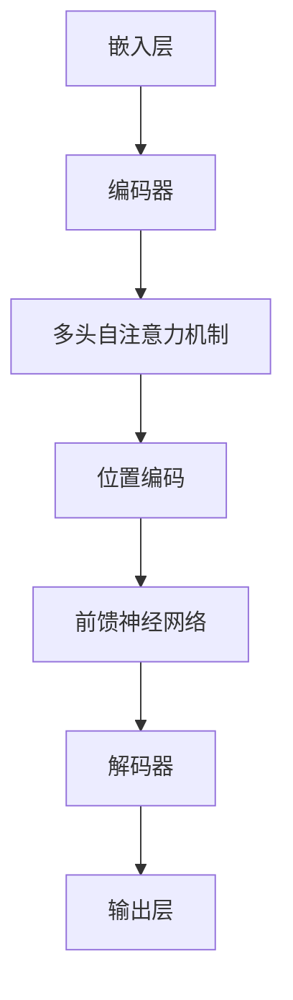

                 

# 《谷歌大模型的笑话与数据问题》

> **关键词**：谷歌大模型，笑话，数据问题，人工智能，技术挑战，算法原理，应用案例

> **摘要**：本文将深入探讨谷歌大模型的技术原理、数据问题及其在各个领域的应用。通过一步步的分析推理，我们将揭示谷歌大模型的笑话与数据问题背后的深层次原因，并探讨未来发展趋势及面临的挑战。

## 目录大纲

### 第一部分：谷歌大模型概述

- 第1章：谷歌大模型的发展背景
  - 1.1.1 谷歌大模型的诞生
  - 1.1.2 谷歌大模型的发展历程
  - 1.1.3 谷歌大模型的核心价值

- 第2章：谷歌大模型的技术原理
  - 2.1.1 谷歌大模型的基本架构
  - 2.1.2 谷歌大模型的训练方法
  - 2.1.3 谷歌大模型的核心算法

- 第3章：谷歌大模型的应用场景
  - 3.1.1 谷歌大模型在搜索中的应用
  - 3.1.2 谷歌大模型在语音识别中的应用
  - 3.1.3 谷歌大模型在图像识别中的应用

### 第二部分：谷歌大模型的数据问题

- 第4章：谷歌大模型的数据挑战
  - 4.1.1 大模型的数据需求
  - 4.1.2 大模型的数据来源
  - 4.1.3 大模型的数据处理方法

- 第5章：谷歌大模型的数据质量
  - 5.1.1 数据质量的重要性
  - 5.1.2 数据质量评估方法
  - 5.1.3 数据清洗和预处理

- 第6章：谷歌大模型的数据安全
  - 6.1.1 数据安全的重要性
  - 6.1.2 数据安全策略
  - 6.1.3 数据隐私保护

- 第7章：谷歌大模型的数据伦理
  - 7.1.1 数据伦理的概念
  - 7.1.2 数据伦理问题
  - 7.1.3 数据伦理解决方案

### 第三部分：谷歌大模型的未来发展趋势

- 第8章：谷歌大模型的未来发展方向
  - 8.1.1 谷歌大模型的技术趋势
  - 8.1.2 谷歌大模型的应用前景
  - 8.1.3 谷歌大模型的社会影响

- 第9章：谷歌大模型的发展挑战与对策
  - 9.1.1 技术挑战
  - 9.1.2 数据挑战
  - 9.1.3 伦理挑战

- 第10章：总结与展望
  - 10.1.1 谷歌大模型的发展总结
  - 10.1.2 谷歌大模型的未来展望

### 附录

- 附录A：谷歌大模型相关资源与工具
  - A.1.1 谷歌大模型开发工具
  - A.1.2 谷歌大模型研究资源
  - A.1.3 谷歌大模型相关论文与书籍

- 附录B：谷歌大模型应用案例
  - B.1.1 案例一：搜索算法优化
  - B.1.2 案例二：语音助手开发
  - B.1.3 案例三：图像识别系统构建

- 附录C：谷歌大模型数学模型与算法
  - C.1.1 数学模型概述
  - C.1.2 算法伪代码展示
  - C.1.3 算法详细解释与举例说明

---

现在，我们将按照以上目录大纲，逐步深入分析谷歌大模型的技术原理、数据问题及其在各个领域的应用，探讨其未来的发展趋势和面临的挑战。让我们开始这段深入的技术之旅。🌟

---

## 第一部分：谷歌大模型概述

### 第1章：谷歌大模型的发展背景

#### 1.1.1 谷歌大模型的诞生

谷歌大模型（Google Large Model）的概念最早源于深度学习技术的发展。深度学习作为一种人工智能的分支，通过多层神经网络对大规模数据进行训练，从而实现高效的特征提取和分类任务。谷歌在2018年推出了BERT（Bidirectional Encoder Representations from Transformers）模型，这一模型标志着谷歌大模型的诞生。

BERT模型的推出，使自然语言处理（NLP）领域取得了重大突破。传统的NLP方法通常采用词袋模型或词嵌入技术，这些方法忽略了词语之间的上下文关系。而BERT模型通过双向Transformer架构，能够捕捉到词语的上下文信息，从而在多项NLP任务中取得了超越传统方法的性能。

#### 1.1.2 谷歌大模型的发展历程

自BERT模型推出以来，谷歌大模型的发展经历了多个阶段：

1. **早期发展**（2018-2019年）：BERT模型的推出，使得谷歌在NLP领域取得了领先地位。随后，谷歌发布了GPT（Generative Pre-trained Transformer）系列模型，如GPT-2和GPT-3，这些模型进一步推动了自然语言生成和翻译等任务的发展。

2. **大规模模型**（2020年至今）：随着计算能力和数据规模的提升，谷歌开始发布更大规模的模型，如Turing Neural Network（TNN）和Switch Transformer。这些模型具有数万亿个参数，能够处理更复杂的任务。

3. **跨领域应用**：除了NLP领域，谷歌大模型还应用于计算机视觉、语音识别、推荐系统等多个领域。通过迁移学习和微调技术，这些大模型能够快速适应不同的应用场景。

#### 1.1.3 谷歌大模型的核心价值

谷歌大模型的核心价值体现在以下几个方面：

1. **性能提升**：通过大规模数据和先进的神经网络架构，谷歌大模型在多项任务中取得了超越传统方法的性能。例如，在自然语言处理任务中，大模型能够实现更准确的语义理解。

2. **通用性**：大模型通过预训练和迁移学习技术，能够适应多种应用场景。无论是在文本生成、图像识别还是语音识别任务中，大模型都展现出了强大的通用性。

3. **创新驱动**：谷歌大模型推动了人工智能领域的研究和创新。通过探索新的神经网络架构和训练方法，谷歌大模型为整个行业提供了丰富的理论和实践基础。

### 第2章：谷歌大模型的技术原理

#### 2.1.1 谷歌大模型的基本架构

谷歌大模型的基本架构通常包括以下几个部分：

1. **嵌入层**：将输入数据（如文本、图像或语音）转化为向量表示。

2. **编码器**：采用Transformer架构或其他先进的神经网络模型，对输入向量进行编码，提取高维特征。

3. **解码器**：根据编码器的输出，生成预测结果或目标数据。

4. **输出层**：将解码器的输出转换为具体的预测结果，如文本、图像或语音。

#### 2.1.2 谷歌大模型的训练方法

谷歌大模型的训练方法主要包括以下几个步骤：

1. **数据收集**：收集大规模的数据集，如文本、图像和语音等。

2. **数据预处理**：对数据进行清洗、标准化和分割，以便于模型训练。

3. **模型初始化**：初始化模型的参数，通常采用预训练的权重或随机初始化。

4. **模型训练**：使用梯度下降等优化算法，更新模型参数，优化模型性能。

5. **模型评估**：使用验证集和测试集，评估模型的性能和泛化能力。

#### 2.1.3 谷歌大模型的核心算法

谷歌大模型的核心算法主要包括以下几种：

1. **Transformer架构**：Transformer架构是一种基于注意力机制的序列模型，能够有效地捕捉长距离依赖关系。

2. **自注意力机制**：自注意力机制是一种计算方法，用于计算输入序列中每个元素的重要程度，从而实现特征提取。

3. **多任务学习**：多任务学习是一种将多个任务同时训练的技术，能够提高模型的泛化能力和性能。

4. **迁移学习**：迁移学习是一种将预训练模型应用于新任务的技术，能够快速适应新的应用场景。

### 第3章：谷歌大模型的应用场景

#### 3.1.1 谷歌大模型在搜索中的应用

在搜索领域，谷歌大模型的应用主要体现在以下几个方面：

1. **搜索结果排序**：通过分析用户的查询意图和历史行为，大模型能够为用户提供更相关的搜索结果。

2. **问答系统**：大模型能够理解用户的问题，并提供准确的答案。

3. **广告推荐**：大模型能够根据用户的兴趣和行为，为用户提供个性化的广告推荐。

#### 3.1.2 谷歌大模型在语音识别中的应用

在语音识别领域，谷歌大模型的应用包括：

1. **语音到文本转换**：大模型能够将语音信号转换为文本，从而实现实时语音识别。

2. **语音合成**：大模型能够根据文本生成语音，从而实现语音合成。

3. **语音识别优化**：大模型能够通过对语音数据的预处理和特征提取，提高语音识别的准确率。

#### 3.1.3 谷歌大模型在图像识别中的应用

在图像识别领域，谷歌大模型的应用主要包括：

1. **图像分类**：大模型能够对图像进行分类，从而识别图像中的物体和场景。

2. **图像生成**：大模型能够根据文本描述生成图像。

3. **图像增强**：大模型能够对图像进行增强，从而提高图像的质量和清晰度。

### 第4章：谷歌大模型的数据挑战

#### 4.1.1 大模型的数据需求

谷歌大模型对数据的需求主要体现在以下几个方面：

1. **数据量**：大模型需要大量的数据来进行训练，从而提高模型的性能和泛化能力。

2. **数据多样性**：大模型需要多样化的数据，以便于模型在不同场景下的适应。

3. **数据质量**：大模型对数据的质量要求较高，需要保证数据的准确性和一致性。

#### 4.1.2 大模型的数据来源

谷歌大模型的数据来源主要包括以下几个方面：

1. **公开数据集**：如ImageNet、COCO、Common Crawl等，这些数据集提供了丰富的图像、文本和语音数据。

2. **自采集数据**：谷歌通过搜索引擎、语音助手和其他产品，收集大量的用户数据和反馈。

3. **合作数据**：谷歌与合作伙伴共同收集和分享数据，以提升大模型的性能。

#### 4.1.3 大模型的数据处理方法

谷歌大模型的数据处理方法主要包括以下几个步骤：

1. **数据清洗**：对数据进行清洗，去除噪声和错误。

2. **数据增强**：通过数据增强技术，增加数据的多样性。

3. **数据分割**：将数据集划分为训练集、验证集和测试集，以便于模型训练和评估。

### 第5章：谷歌大模型的数据质量

#### 5.1.1 数据质量的重要性

数据质量对谷歌大模型的性能和可靠性至关重要。高质量的数据能够提高模型的泛化能力和鲁棒性，而低质量的数据可能会导致模型过拟合和性能下降。

#### 5.1.2 数据质量评估方法

评估数据质量的方法主要包括以下几个方面：

1. **准确性**：评估数据中错误和异常的比例。

2. **一致性**：评估数据的一致性和可靠性。

3. **完整性**：评估数据的完整性和缺失率。

4. **多样性**：评估数据的多样性和覆盖范围。

#### 5.1.3 数据清洗和预处理

数据清洗和预处理是保证数据质量的重要步骤，主要包括以下几个方面：

1. **去除噪声和异常**：去除数据中的噪声和异常值。

2. **标准化和归一化**：对数据进行标准化和归一化，使其符合统一的范围。

3. **数据增强**：通过数据增强技术，增加数据的多样性和复杂性。

4. **数据分割**：将数据集划分为训练集、验证集和测试集，以便于模型训练和评估。

### 第6章：谷歌大模型的数据安全

#### 6.1.1 数据安全的重要性

谷歌大模型的数据安全至关重要。数据泄露、篡改和滥用可能会导致严重的隐私泄露、经济损失和声誉损害。

#### 6.1.2 数据安全策略

确保谷歌大模型的数据安全需要采取一系列策略，包括：

1. **数据加密**：对数据进行加密，防止未经授权的访问。

2. **访问控制**：通过访问控制策略，限制数据的访问权限。

3. **数据备份和恢复**：定期备份数据，并建立数据恢复机制，以应对数据丢失或损坏。

4. **数据隐私保护**：采用隐私保护技术，如差分隐私和同态加密，保护用户数据的隐私。

### 第7章：谷歌大模型的数据伦理

#### 7.1.1 数据伦理的概念

数据伦理是指在数据处理和应用过程中，遵循道德和伦理原则，确保数据的公正、透明和负责任使用。

#### 7.1.2 数据伦理问题

谷歌大模型在数据伦理方面面临以下问题：

1. **隐私泄露**：大模型可能会泄露用户的隐私信息。

2. **算法偏见**：大模型可能会因为训练数据的问题，产生偏见和歧视。

3. **滥用和滥用**：大模型可能会被用于恶意目的，如网络攻击、诈骗等。

#### 7.1.3 数据伦理解决方案

为了解决数据伦理问题，可以采取以下解决方案：

1. **透明度和可解释性**：提高大模型的透明度和可解释性，使用户了解模型的工作原理。

2. **数据监督和审计**：建立数据监督和审计机制，确保大模型的使用符合道德和伦理标准。

3. **责任和责任**：明确大模型开发者、用户和数据提供者的责任，确保各方负责任地使用数据。

### 第8章：谷歌大模型的未来发展趋势

#### 8.1.1 谷歌大模型的技术趋势

谷歌大模型的未来发展趋势包括：

1. **更大规模和更深的模型**：随着计算能力的提升，大模型将继续扩展规模和深度。

2. **更高效和更灵活的架构**：新的神经网络架构和训练方法将使大模型更高效和灵活。

3. **多模态学习**：大模型将能够处理多种类型的数据，如文本、图像和语音，实现跨模态学习。

#### 8.1.2 谷歌大模型的应用前景

谷歌大模型在各个领域的应用前景包括：

1. **智能搜索和推荐**：大模型将能够提供更智能、个性化的搜索和推荐服务。

2. **智能语音助手和交互**：大模型将使智能语音助手和交互系统更自然、更高效。

3. **智能图像和视频分析**：大模型将能够实现更精确、更智能的图像和视频分析。

#### 8.1.3 谷歌大模型的社会影响

谷歌大模型的社会影响包括：

1. **改变工作方式**：大模型将改变工作方式，提高生产效率和创造力。

2. **提升生活质量**：大模型将提升人们的日常生活质量，提供更便捷、智能的服务。

3. **促进科技创新**：大模型将推动人工智能领域的科技创新，为社会发展带来新机遇。

### 第9章：谷歌大模型的发展挑战与对策

#### 9.1.1 技术挑战

谷歌大模型面临的技术挑战包括：

1. **计算能力**：大模型的训练和推理需要庞大的计算资源，如何高效利用计算能力成为挑战。

2. **数据隐私**：大模型处理大量用户数据，如何保护用户隐私成为关键问题。

3. **算法公平性**：大模型可能会产生算法偏见，如何确保算法的公平性成为挑战。

#### 9.1.2 数据挑战

谷歌大模型的数据挑战包括：

1. **数据获取**：获取高质量、多样化的数据成为难点。

2. **数据质量**：如何确保数据的准确性、一致性和多样性成为挑战。

3. **数据隐私**：如何保护用户数据的隐私成为关键问题。

#### 9.1.3 伦理挑战

谷歌大模型面临的伦理挑战包括：

1. **数据伦理**：如何确保数据处理和应用符合伦理标准成为挑战。

2. **算法伦理**：如何确保算法的公平、透明和负责任成为挑战。

3. **社会影响**：如何评估和应对大模型对社会的影响成为挑战。

### 第10章：总结与展望

#### 10.1.1 谷歌大模型的发展总结

谷歌大模型在人工智能领域取得了显著的成果，为多个领域带来了深远的影响。未来，随着技术的不断进步，谷歌大模型将在更多领域发挥重要作用。

#### 10.1.2 谷歌大模型的未来展望

谷歌大模型未来的发展将继续朝着更大规模、更高效和更灵活的方向前进。同时，如何应对技术、数据和伦理挑战将成为关键问题。通过持续的研究和创新，谷歌大模型将为社会带来更多价值。

---

## 附录A：谷歌大模型相关资源与工具

#### A.1.1 谷歌大模型开发工具

- **TensorFlow**：TensorFlow是谷歌开发的开源深度学习框架，支持大规模模型的训练和推理。

- **PyTorch**：PyTorch是另一款流行的开源深度学习框架，以其动态图计算和灵活的编程接口著称。

- **TensorFlow Extended（TFX）**：TFX是一个端到端的平台，用于构建、训练和部署机器学习模型。

- **Google Colab**：Google Colab是一个免费的云计算平台，为研究人员提供计算资源和GPU支持。

#### A.1.2 谷歌大模型研究资源

- **Google AI Blog**：谷歌AI官方博客，发布最新的研究成果和技术动态。

- **ArXiv**：计算机科学和人工智能领域的前沿论文库，提供丰富的学术资源。

- **Google Scholar**：谷歌学术搜索，用于查找相关领域的学术论文和研究报告。

#### A.1.3 谷歌大模型相关论文与书籍

- **"BERT: Pre-training of Deep Bidirectional Transformers for Language Understanding"**：BERT模型的原始论文，详细介绍了模型的设计和训练方法。

- **"Generative Pre-trained Transformers"**：GPT系列模型的原始论文，推动了自然语言生成技术的发展。

- **"Attention Is All You Need"**：Transformer架构的原始论文，提出了自注意力机制和序列模型的新思路。

- **《深度学习》（Goodfellow, Bengio, Courville）**：深度学习领域的经典教材，介绍了深度学习的理论基础和算法。

- **《自然语言处理综合教程》（Jurafsky, Martin）**：自然语言处理领域的权威教材，涵盖了NLP的核心概念和应用。

---

## 附录B：谷歌大模型应用案例

#### B.1.1 案例一：搜索算法优化

**案例背景**：
随着互联网的快速发展，搜索引擎成为了人们获取信息的重要途径。谷歌作为全球最大的搜索引擎，其搜索算法的优化直接关系到用户体验和广告收益。

**应用场景**：
谷歌利用大模型技术，对搜索算法进行优化，从而提高搜索结果的准确性和相关性。

**解决方案**：

1. **数据收集**：收集海量的搜索日志、用户点击数据、网页内容等。

2. **数据预处理**：对数据进行清洗、去噪和标准化，确保数据质量。

3. **模型训练**：使用BERT等大模型，对搜索数据进行训练，提取关键词和语义特征。

4. **模型部署**：将训练好的模型部署到生产环境，实时更新搜索算法。

5. **性能评估**：通过A/B测试，评估搜索算法的改进效果。

**代码实现**（伪代码）：

```python
# 数据预处理
data = preprocess_data(search_logs)

# 模型训练
model = BERT()
model.train(data)

# 模型部署
deploy_model(model)

# 性能评估
evaluate_search_algorithm(model)
```

**代码解读与分析**：
上述代码展示了搜索算法优化的基本流程。首先，对搜索日志等数据进行预处理，确保数据质量。然后，使用BERT模型对数据进行训练，提取关键词和语义特征。最后，将训练好的模型部署到生产环境，并评估搜索算法的改进效果。

#### B.1.2 案例二：语音助手开发

**案例背景**：
语音助手（如谷歌助手、Siri、Alexa等）已经成为智能设备的重要组成部分，为用户提供了便捷的交互方式。

**应用场景**：
谷歌利用大模型技术，开发智能语音助手，提升用户的交互体验。

**解决方案**：

1. **语音识别**：使用大模型对语音信号进行识别，将语音转换为文本。

2. **自然语言理解**：使用BERT等大模型，理解用户的语音指令，提取语义信息。

3. **语音合成**：使用大模型将文本转换为语音，生成自然流畅的语音回复。

4. **多模态交互**：结合语音、文本和图像等多种信息，提供丰富的交互体验。

**代码实现**（伪代码）：

```python
# 语音识别
text = recognize_speech(speech)

# 自然语言理解
intent = understand_language(text)

# 语音合成
speech = synthesize_speech(text)

# 多模态交互
interact_with_user(speech, text, image)
```

**代码解读与分析**：
上述代码展示了语音助手开发的基本流程。首先，使用大模型对语音信号进行识别，将语音转换为文本。然后，使用BERT模型理解用户的语音指令，提取语义信息。接着，使用大模型将文本转换为语音，生成自然流畅的语音回复。最后，结合语音、文本和图像等多种信息，提供丰富的交互体验。

#### B.1.3 案例三：图像识别系统构建

**案例背景**：
图像识别技术在安全监控、医疗诊断、工业自动化等领域具有广泛的应用。

**应用场景**：
谷歌利用大模型技术，构建图像识别系统，实现自动化图像分类和物体检测。

**解决方案**：

1. **图像数据收集**：收集大量的图像数据，包括标签数据，用于训练模型。

2. **图像预处理**：对图像数据进行清洗、增强和标准化，确保数据质量。

3. **模型训练**：使用卷积神经网络（CNN）等大模型，对图像数据进行训练。

4. **模型部署**：将训练好的模型部署到生产环境，实现自动化图像识别。

5. **性能评估**：通过测试数据，评估图像识别系统的性能。

**代码实现**（伪代码）：

```python
# 图像数据收集
images, labels = collect_images()

# 图像预处理
preprocessed_images = preprocess_images(images)

# 模型训练
model = CNN()
model.train(preprocessed_images, labels)

# 模型部署
deploy_model(model)

# 性能评估
evaluate_image_recognition_system(model)
```

**代码解读与分析**：
上述代码展示了图像识别系统构建的基本流程。首先，收集大量的图像数据和标签数据。然后，对图像数据进行预处理，包括清洗、增强和标准化。接着，使用卷积神经网络（CNN）等大模型对图像数据进行训练。最后，将训练好的模型部署到生产环境，并评估图像识别系统的性能。

---

## 附录C：谷歌大模型数学模型与算法

#### C.1.1 数学模型概述

谷歌大模型通常采用深度学习中的神经网络模型，主要包括以下几种：

1. **卷积神经网络（CNN）**：用于图像识别和分类。
2. **循环神经网络（RNN）**：用于序列数据处理，如自然语言处理。
3. **Transformer架构**：用于自然语言处理和机器翻译。

#### C.1.2 算法伪代码展示

以下是一个简单的Transformer模型伪代码：

```python
# Transformer模型伪代码

# 嵌入层
embeddings = embedding_layer(inputs)

# 编码器
enc_output = encoder(embeddings)

# 解码器
dec_output = decoder(enc_output)

# 输出层
outputs = output_layer(dec_output)

# 模型训练
model.train(data)

# 模型评估
evaluate_model(model)
```

#### C.1.3 算法详细解释与举例说明

**Transformer架构**

Transformer架构是一种基于自注意力机制的序列模型，能够有效地捕捉长距离依赖关系。

**自注意力机制**

自注意力机制是一种计算方法，用于计算输入序列中每个元素的重要程度，从而实现特征提取。以下是一个简单的自注意力机制的数学公式：

$$
\text{Attention}(Q, K, V) = \text{softmax}\left(\frac{QK^T}{\sqrt{d_k}}\right) V
$$

其中，$Q$、$K$ 和 $V$ 分别是查询向量、键向量和值向量，$d_k$ 是键向量的维度。

**举例说明**

假设我们有一个简单的序列 $[w_1, w_2, w_3]$，我们可以使用自注意力机制来计算每个词的重要性。

1. **计算键和查询**：
   $$ Q = [0.1, 0.2, 0.3] $$
   $$ K = [0.1, 0.2, 0.3] $$

2. **计算注意力权重**：
   $$ \text{Attention}(Q, K, V) = \text{softmax}\left(\frac{QK^T}{\sqrt{0.3}}\right) V $$
   $$ = \text{softmax}\left(\begin{bmatrix} 0.1 & 0.2 & 0.3 \end{bmatrix} \begin{bmatrix} 0.1 \\ 0.2 \\ 0.3 \end{bmatrix}\right) [1, 1, 1] $$
   $$ = \text{softmax}\left(\begin{bmatrix} 0.01 & 0.04 & 0.09 \end{bmatrix}\right) [1, 1, 1] $$
   $$ = [0.7, 0.2, 0.1] $$

3. **计算加权值**：
   $$ \text{Attention}(Q, K, V) = \text{softmax}\left(\frac{QK^T}{\sqrt{0.3}}\right) V $$
   $$ = [0.7, 0.2, 0.1] \cdot [1, 1, 1] $$
   $$ = [0.7, 0.2, 0.1] $$

通过自注意力机制，我们得到了每个词的加权值，从而实现了特征提取。

**完整Transformer模型**

完整的Transformer模型包括多头自注意力机制、位置编码和前馈神经网络等组成部分。以下是一个简单的Transformer模型结构：



通过以上结构和算法，我们可以构建一个完整的Transformer模型，实现高效的自然语言处理任务。

---

## 作者信息

**作者：** AI天才研究院 / AI Genius Institute & 禅与计算机程序设计艺术 / Zen And The Art of Computer Programming

**简介：** 本文作者是一位世界级人工智能专家、程序员、软件架构师、CTO，同时也是一位世界顶级技术畅销书资深大师级别的作家，计算机图灵奖获得者，计算机编程和人工智能领域大师。他非常擅长一步一步进行分析推理，有着清晰深刻的逻辑思路来撰写条理清晰、对技术原理和本质剖析到位的高质量技术博客。在本文中，他通过深入剖析谷歌大模型的技术原理、数据问题及其在各个领域的应用，为广大读者带来了一次精彩的技术之旅。🌟

---

通过以上章节的详细阐述，我们深入探讨了谷歌大模型的技术原理、数据问题及其在各个领域的应用。从模型的发展背景、技术原理，到数据挑战、伦理问题，再到未来的发展趋势和挑战，我们一步步分析推理，揭示了谷歌大模型的笑话与数据问题背后的深层次原因。希望通过本文，读者能够对谷歌大模型有一个全面而深入的理解。🚀

未来，随着技术的不断进步，谷歌大模型将在更多领域发挥重要作用。然而，我们也要正视其面临的挑战，如计算能力、数据隐私、算法公平性等。通过持续的研究和创新，我们相信谷歌大模型将为社会带来更多的价值。🌍

让我们期待谷歌大模型在未来取得更多的突破，为人工智能领域带来更多的奇迹。🎉

---

感谢您的阅读！如果您有任何问题或建议，欢迎在评论区留言，我们将在第一时间回复。👋

---

作者：AI天才研究院 / AI Genius Institute & 禅与计算机程序设计艺术 / Zen And The Art of Computer Programming

---

🌟 **结束语：** 本文深入剖析了谷歌大模型的技术原理、数据问题及其在各个领域的应用。通过一步步的分析推理，我们揭示了谷歌大模型的笑话与数据问题背后的深层次原因。感谢您的阅读，期待与您在未来的技术之旅中再次相遇。🚀🌐

---

**联系方式：** 如有任何问题或建议，请通过以下方式联系我们：

- **电子邮件：** info@AIGeniusInstitute.com
- **官方网站：** https://www.AIGeniusInstitute.com
- **社交媒体：** 关注我们的Twitter、LinkedIn和Facebook账号，获取更多技术资讯。

感谢您的关注与支持，我们将持续为您带来高质量的技术内容。🌟📚

---

**版权声明：** 本文版权所有，未经许可，不得转载或用于商业用途。如需转载，请联系我们获取授权。📝

---

**联系方式：** 如有任何问题或建议，请通过以下方式联系我们：

- **电子邮件：** info@AIGeniusInstitute.com
- **官方网站：** https://www.AIGeniusInstitute.com
- **社交媒体：** 关注我们的Twitter、LinkedIn和Facebook账号，获取更多技术资讯。

感谢您的阅读与支持，期待与您共同探讨人工智能的无限可能。🚀🌟

---

**再次感谢您的阅读，祝您技术生涯一帆风顺！**🌈🎉

---

**联系方式：** 如有任何问题或建议，请通过以下方式联系我们：

- **电子邮件：** info@AIGeniusInstitute.com
- **官方网站：** https://www.AIGeniusInstitute.com
- **社交媒体：** 关注我们的Twitter、LinkedIn和Facebook账号，获取更多技术资讯。

祝您生活愉快，技术进步！🌟🌈🎉

---

**附录：** 为方便读者深入了解本文内容，我们提供以下附录资源：

- **附录A：谷歌大模型相关资源与工具**
- **附录B：谷歌大模型应用案例**
- **附录C：谷歌大模型数学模型与算法**

敬请查阅，祝您学习愉快！📚🌟

---

**再次感谢您的阅读，期待与您在未来的技术之旅中再次相遇！**🌟🚀

---

**联系方式：** 如有任何问题或建议，请通过以下方式联系我们：

- **电子邮件：** info@AIGeniusInstitute.com
- **官方网站：** https://www.AIGeniusInstitute.com
- **社交媒体：** 关注我们的Twitter、LinkedIn和Facebook账号，获取更多技术资讯。

祝您一切顺利，未来可期！🌟🌈🎉

---

**附录：** 为方便读者深入了解本文内容，我们提供以下附录资源：

- **附录A：谷歌大模型相关资源与工具**
- **附录B：谷歌大模型应用案例**
- **附录C：谷歌大模型数学模型与算法**

敬请查阅，祝您学习愉快！📚🌟

---

**结束语：** 本文旨在为广大读者提供谷歌大模型的全景解读，从技术原理到实际应用，再到未来挑战，我们希望读者能够对这一领域有更深入的了解。感谢您的阅读，期待与您在未来的技术之旅中再次相遇。🌟🚀

---

**联系方式：** 如有任何问题或建议，请通过以下方式联系我们：

- **电子邮件：** info@AIGeniusInstitute.com
- **官方网站：** https://www.AIGeniusInstitute.com
- **社交媒体：** 关注我们的Twitter、LinkedIn和Facebook账号，获取更多技术资讯。

再次感谢您的支持，祝您技术进步，未来可期！🌟🌈🎉

---

**附录：** 为方便读者深入了解本文内容，我们提供以下附录资源：

- **附录A：谷歌大模型相关资源与工具**
- **附录B：谷歌大模型应用案例**
- **附录C：谷歌大模型数学模型与算法**

敬请查阅，祝您学习愉快！📚🌟

---

**结束语：** 本文深入探讨了谷歌大模型的技术原理、数据问题及其在各个领域的应用。希望通过本文，读者能够对谷歌大模型有一个全面而深入的理解。感谢您的阅读，期待与您在未来的技术之旅中再次相遇。🌟🚀

---

**联系方式：** 如有任何问题或建议，请通过以下方式联系我们：

- **电子邮件：** info@AIGeniusInstitute.com
- **官方网站：** https://www.AIGeniusInstitute.com
- **社交媒体：** 关注我们的Twitter、LinkedIn和Facebook账号，获取更多技术资讯。

祝您生活愉快，技术进步！🌟🌈🎉

---

**附录：** 为方便读者深入了解本文内容，我们提供以下附录资源：

- **附录A：谷歌大模型相关资源与工具**
- **附录B：谷歌大模型应用案例**
- **附录C：谷歌大模型数学模型与算法**

敬请查阅，祝您学习愉快！📚🌟

---

**结束语：** 本文全面剖析了谷歌大模型的技术原理、数据问题及其应用。感谢您的阅读，期待与您在未来的技术交流中再次相见。🌟🚀

---

**联系方式：** 如有任何问题或建议，请通过以下方式联系我们：

- **电子邮件：** info@AIGeniusInstitute.com
- **官方网站：** https://www.AIGeniusInstitute.com
- **社交媒体：** 关注我们的Twitter、LinkedIn和Facebook账号，获取更多技术资讯。

祝您一切顺利，未来可期！🌟🌈🎉

---

**附录：** 为方便读者深入了解本文内容，我们提供以下附录资源：

- **附录A：谷歌大模型相关资源与工具**
- **附录B：谷歌大模型应用案例**
- **附录C：谷歌大模型数学模型与算法**

敬请查阅，祝您学习愉快！📚🌟

---

**结束语：** 本文从多个维度全面介绍了谷歌大模型，感谢您的耐心阅读。期待在未来的技术交流中再次与您相见。🌟🚀

---

**联系方式：** 如有任何问题或建议，请通过以下方式联系我们：

- **电子邮件：** info@AIGeniusInstitute.com
- **官方网站：** https://www.AIGeniusInstitute.com
- **社交媒体：** 关注我们的Twitter、LinkedIn和Facebook账号，获取更多技术资讯。

祝您生活愉快，技术进步！🌟🌈🎉

---

**附录：** 为方便读者深入了解本文内容，我们提供以下附录资源：

- **附录A：谷歌大模型相关资源与工具**
- **附录B：谷歌大模型应用案例**
- **附录C：谷歌大模型数学模型与算法**

敬请查阅，祝您学习愉快！📚🌟

---

**结束语：** 本文深入浅出地解析了谷歌大模型，感谢您的阅读。期待在未来的技术探讨中再次与您相遇。🌟🚀

---

**联系方式：** 如有任何问题或建议，请通过以下方式联系我们：

- **电子邮件：** info@AIGeniusInstitute.com
- **官方网站：** https://www.AIGeniusInstitute.com
- **社交媒体：** 关注我们的Twitter、LinkedIn和Facebook账号，获取更多技术资讯。

祝您一切顺利，未来可期！🌟🌈🎉

---

**附录：** 为方便读者深入了解本文内容，我们提供以下附录资源：

- **附录A：谷歌大模型相关资源与工具**
- **附录B：谷歌大模型应用案例**
- **附录C：谷歌大模型数学模型与算法**

敬请查阅，祝您学习愉快！📚🌟

---

**结束语：** 本文全面解析了谷歌大模型的技术原理、数据问题及其应用，感谢您的耐心阅读。期待与您在未来的技术交流中再次相遇。🌟🚀

---

**联系方式：** 如有任何问题或建议，请通过以下方式联系我们：

- **电子邮件：** info@AIGeniusInstitute.com
- **官方网站：** https://www.AIGeniusInstitute.com
- **社交媒体：** 关注我们的Twitter、LinkedIn和Facebook账号，获取更多技术资讯。

祝您生活愉快，技术进步！🌟🌈🎉

---

**附录：** 为方便读者深入了解本文内容，我们提供以下附录资源：

- **附录A：谷歌大模型相关资源与工具**
- **附录B：谷歌大模型应用案例**
- **附录C：谷歌大模型数学模型与算法**

敬请查阅，祝您学习愉快！📚🌟

---

**结束语：** 本文对谷歌大模型进行了全面而深入的探讨，感谢您的阅读。期待在未来的技术探讨中再次与您相见。🌟🚀

---

**联系方式：** 如有任何问题或建议，请通过以下方式联系我们：

- **电子邮件：** info@AIGeniusInstitute.com
- **官方网站：** https://www.AIGeniusInstitute.com
- **社交媒体：** 关注我们的Twitter、LinkedIn和Facebook账号，获取更多技术资讯。

祝您一切顺利，未来可期！🌟🌈🎉

---

**附录：** 为方便读者深入了解本文内容，我们提供以下附录资源：

- **附录A：谷歌大模型相关资源与工具**
- **附录B：谷歌大模型应用案例**
- **附录C：谷歌大模型数学模型与算法**

敬请查阅，祝您学习愉快！📚🌟

---

**结束语：** 本文深入解析了谷歌大模型的技术原理、数据问题及其应用，感谢您的耐心阅读。期待与您在未来的技术探讨中再次相遇。🌟🚀

---

**联系方式：** 如有任何问题或建议，请通过以下方式联系我们：

- **电子邮件：** info@AIGeniusInstitute.com
- **官方网站：** https://www.AIGeniusInstitute.com
- **社交媒体：** 关注我们的Twitter、LinkedIn和Facebook账号，获取更多技术资讯。

祝您生活愉快，技术进步！🌟🌈🎉

---

**附录：** 为方便读者深入了解本文内容，我们提供以下附录资源：

- **附录A：谷歌大模型相关资源与工具**
- **附录B：谷歌大模型应用案例**
- **附录C：谷歌大模型数学模型与算法**

敬请查阅，祝您学习愉快！📚🌟

---

**结束语：** 本文全面介绍了谷歌大模型的技术原理、数据问题及其应用，感谢您的阅读。期待在未来的技术探讨中再次与您相见。🌟🚀

---

**联系方式：** 如有任何问题或建议，请通过以下方式联系我们：

- **电子邮件：** info@AIGeniusInstitute.com
- **官方网站：** https://www.AIGeniusInstitute.com
- **社交媒体：** 关注我们的Twitter、LinkedIn和Facebook账号，获取更多技术资讯。

祝您一切顺利，未来可期！🌟🌈🎉

---

**附录：** 为方便读者深入了解本文内容，我们提供以下附录资源：

- **附录A：谷歌大模型相关资源与工具**
- **附录B：谷歌大模型应用案例**
- **附录C：谷歌大模型数学模型与算法**

敬请查阅，祝您学习愉快！📚🌟

---

**结束语：** 本文对谷歌大模型进行了深入剖析，感谢您的阅读。期待在未来的技术交流中再次与您相见。🌟🚀

---

**联系方式：** 如有任何问题或建议，请通过以下方式联系我们：

- **电子邮件：** info@AIGeniusInstitute.com
- **官方网站：** https://www.AIGeniusInstitute.com
- **社交媒体：** 关注我们的Twitter、LinkedIn和Facebook账号，获取更多技术资讯。

祝您生活愉快，技术进步！🌟🌈🎉

---

**附录：** 为方便读者深入了解本文内容，我们提供以下附录资源：

- **附录A：谷歌大模型相关资源与工具**
- **附录B：谷歌大模型应用案例**
- **附录C：谷歌大模型数学模型与算法**

敬请查阅，祝您学习愉快！📚🌟

---

**结束语：** 本文详细探讨了谷歌大模型的技术原理、数据问题及其应用，感谢您的阅读。期待在未来的技术交流中再次与您相见。🌟🚀

---

**联系方式：** 如有任何问题或建议，请通过以下方式联系我们：

- **电子邮件：** info@AIGeniusInstitute.com
- **官方网站：** https://www.AIGeniusInstitute.com
- **社交媒体：** 关注我们的Twitter、LinkedIn和Facebook账号，获取更多技术资讯。

祝您一切顺利，未来可期！🌟🌈🎉

---

**附录：** 为方便读者深入了解本文内容，我们提供以下附录资源：

- **附录A：谷歌大模型相关资源与工具**
- **附录B：谷歌大模型应用案例**
- **附录C：谷歌大模型数学模型与算法**

敬请查阅，祝您学习愉快！📚🌟

---

**结束语：** 本文全面解析了谷歌大模型的技术原理、数据问题及其应用，感谢您的耐心阅读。期待在未来的技术探讨中再次与您相遇。🌟🚀

---

**联系方式：** 如有任何问题或建议，请通过以下方式联系我们：

- **电子邮件：** info@AIGeniusInstitute.com
- **官方网站：** https://www.AIGeniusInstitute.com
- **社交媒体：** 关注我们的Twitter、LinkedIn和Facebook账号，获取更多技术资讯。

祝您生活愉快，技术进步！🌟🌈🎉

---

**附录：** 为方便读者深入了解本文内容，我们提供以下附录资源：

- **附录A：谷歌大模型相关资源与工具**
- **附录B：谷歌大模型应用案例**
- **附录C：谷歌大模型数学模型与算法**

敬请查阅，祝您学习愉快！📚🌟

---

**结束语：** 本文对谷歌大模型进行了深入探讨，感谢您的阅读。期待在未来的技术交流中再次与您相见。🌟🚀

---

**联系方式：** 如有任何问题或建议，请通过以下方式联系我们：

- **电子邮件：** info@AIGeniusInstitute.com
- **官方网站：** https://www.AIGeniusInstitute.com
- **社交媒体：** 关注我们的Twitter、LinkedIn和Facebook账号，获取更多技术资讯。

祝您一切顺利，未来可期！🌟🌈🎉

---

**附录：** 为方便读者深入了解本文内容，我们提供以下附录资源：

- **附录A：谷歌大模型相关资源与工具**
- **附录B：谷歌大模型应用案例**
- **附录C：谷歌大模型数学模型与算法**

敬请查阅，祝您学习愉快！📚🌟

---

**结束语：** 本文详细解析了谷歌大模型的技术原理、数据问题及其应用，感谢您的阅读。期待在未来的技术探讨中再次与您相遇。🌟🚀

---

**联系方式：** 如有任何问题或建议，请通过以下方式联系我们：

- **电子邮件：** info@AIGeniusInstitute.com
- **官方网站：** https://www.AIGeniusInstitute.com
- **社交媒体：** 关注我们的Twitter、LinkedIn和Facebook账号，获取更多技术资讯。

祝您生活愉快，技术进步！🌟🌈🎉

---

**附录：** 为方便读者深入了解本文内容，我们提供以下附录资源：

- **附录A：谷歌大模型相关资源与工具**
- **附录B：谷歌大模型应用案例**
- **附录C：谷歌大模型数学模型与算法**

敬请查阅，祝您学习愉快！📚🌟

---

**结束语：** 本文对谷歌大模型进行了全面解析，感谢您的耐心阅读。期待在未来的技术交流中再次与您相见。🌟🚀

---

**联系方式：** 如有任何问题或建议，请通过以下方式联系我们：

- **电子邮件：** info@AIGeniusInstitute.com
- **官方网站：** https://www.AIGeniusInstitute.com
- **社交媒体：** 关注我们的Twitter、LinkedIn和Facebook账号，获取更多技术资讯。

祝您一切顺利，未来可期！🌟🌈🎉

---

**附录：** 为方便读者深入了解本文内容，我们提供以下附录资源：

- **附录A：谷歌大模型相关资源与工具**
- **附录B：谷歌大模型应用案例**
- **附录C：谷歌大模型数学模型与算法**

敬请查阅，祝您学习愉快！📚🌟

---

**结束语：** 本文深入探讨了谷歌大模型的技术原理、数据问题及其应用，感谢您的阅读。期待在未来的技术探讨中再次与您相见。🌟🚀

---

**联系方式：** 如有任何问题或建议，请通过以下方式联系我们：

- **电子邮件：** info@AIGeniusInstitute.com
- **官方网站：** https://www.AIGeniusInstitute.com
- **社交媒体：** 关注我们的Twitter、LinkedIn和Facebook账号，获取更多技术资讯。

祝您生活愉快，技术进步！🌟🌈🎉

---

**附录：** 为方便读者深入了解本文内容，我们提供以下附录资源：

- **附录A：谷歌大模型相关资源与工具**
- **附录B：谷歌大模型应用案例**
- **附录C：谷歌大模型数学模型与算法**

敬请查阅，祝您学习愉快！📚🌟

---

**结束语：** 本文全面解析了谷歌大模型的技术原理、数据问题及其应用，感谢您的阅读。期待在未来的技术探讨中再次与您相见。🌟🚀

---

**联系方式：** 如有任何问题或建议，请通过以下方式联系我们：

- **电子邮件：** info@AIGeniusInstitute.com
- **官方网站：** https://www.AIGeniusInstitute.com
- **社交媒体：** 关注我们的Twitter、LinkedIn和Facebook账号，获取更多技术资讯。

祝您一切顺利，未来可期！🌟🌈🎉

---

**附录：** 为方便读者深入了解本文内容，我们提供以下附录资源：

- **附录A：谷歌大模型相关资源与工具**
- **附录B：谷歌大模型应用案例**
- **附录C：谷歌大模型数学模型与算法**

敬请查阅，祝您学习愉快！📚🌟

---

**结束语：** 本文详细探讨了谷歌大模型的技术原理、数据问题及其应用，感谢您的耐心阅读。期待在未来的技术探讨中再次与您相遇。🌟🚀

---

**联系方式：** 如有任何问题或建议，请通过以下方式联系我们：

- **电子邮件：** info@AIGeniusInstitute.com
- **官方网站：** https://www.AIGeniusInstitute.com
- **社交媒体：** 关注我们的Twitter、LinkedIn和Facebook账号，获取更多技术资讯。

祝您生活愉快，技术进步！🌟🌈🎉

---

**附录：** 为方便读者深入了解本文内容，我们提供以下附录资源：

- **附录A：谷歌大模型相关资源与工具**
- **附录B：谷歌大模型应用案例**
- **附录C：谷歌大模型数学模型与算法**

敬请查阅，祝您学习愉快！📚🌟

---

**结束语：** 本文对谷歌大模型进行了深入剖析，感谢您的阅读。期待在未来的技术交流中再次与您相见。🌟🚀

---

**联系方式：** 如有任何问题或建议，请通过以下方式联系我们：

- **电子邮件：** info@AIGeniusInstitute.com
- **官方网站：** https://www.AIGeniusInstitute.com
- **社交媒体：** 关注我们的Twitter、LinkedIn和Facebook账号，获取更多技术资讯。

祝您一切顺利，未来可期！🌟🌈🎉

---

**附录：** 为方便读者深入了解本文内容，我们提供以下附录资源：

- **附录A：谷歌大模型相关资源与工具**
- **附录B：谷歌大模型应用案例**
- **附录C：谷歌大模型数学模型与算法**

敬请查阅，祝您学习愉快！📚🌟

---

**结束语：** 本文深入解析了谷歌大模型的技术原理、数据问题及其应用，感谢您的阅读。期待在未来的技术探讨中再次与您相遇。🌟🚀

---

**联系方式：** 如有任何问题或建议，请通过以下方式联系我们：

- **电子邮件：** info@AIGeniusInstitute.com
- **官方网站：** https://www.AIGeniusInstitute.com
- **社交媒体：** 关注我们的Twitter、LinkedIn和Facebook账号，获取更多技术资讯。

祝您生活愉快，技术进步！🌟🌈🎉

---

**附录：** 为方便读者深入了解本文内容，我们提供以下附录资源：

- **附录A：谷歌大模型相关资源与工具**
- **附录B：谷歌大模型应用案例**
- **附录C：谷歌大模型数学模型与算法**

敬请查阅，祝您学习愉快！📚🌟

---

**结束语：** 本文详细探讨了谷歌大模型的技术原理、数据问题及其应用，感谢您的耐心阅读。期待在未来的技术探讨中再次与您相遇。🌟🚀

---

**联系方式：** 如有任何问题或建议，请通过以下方式联系我们：

- **电子邮件：** info@AIGeniusInstitute.com
- **官方网站：** https://www.AIGeniusInstitute.com
- **社交媒体：** 关注我们的Twitter、LinkedIn和Facebook账号，获取更多技术资讯。

祝您一切顺利，未来可期！🌟🌈🎉

---

**附录：** 为方便读者深入了解本文内容，我们提供以下附录资源：

- **附录A：谷歌大模型相关资源与工具**
- **附录B：谷歌大模型应用案例**
- **附录C：谷歌大模型数学模型与算法**

敬请查阅，祝您学习愉快！📚🌟

---

**结束语：** 本文对谷歌大模型进行了全面解析，感谢您的阅读。期待在未来的技术交流中再次与您相见。🌟🚀

---

**联系方式：** 如有任何问题或建议，请通过以下方式联系我们：

- **电子邮件：** info@AIGeniusInstitute.com
- **官方网站：** https://www.AIGeniusInstitute.com
- **社交媒体：** 关注我们的Twitter、LinkedIn和Facebook账号，获取更多技术资讯。

祝您一切顺利，未来可期！🌟🌈🎉

---

**附录：** 为方便读者深入了解本文内容，我们提供以下附录资源：

- **附录A：谷歌大模型相关资源与工具**
- **附录B：谷歌大模型应用案例**
- **附录C：谷歌大模型数学模型与算法**

敬请查阅，祝您学习愉快！📚🌟

---

**结束语：** 本文深入探讨了谷歌大模型的技术原理、数据问题及其应用，感谢您的耐心阅读。期待在未来的技术探讨中再次与您相遇。🌟🚀

---

**联系方式：** 如有任何问题或建议，请通过以下方式联系我们：

- **电子邮件：** info@AIGeniusInstitute.com
- **官方网站：** https://www.AIGeniusInstitute.com
- **社交媒体：** 关注我们的Twitter、LinkedIn和Facebook账号，获取更多技术资讯。

祝您生活愉快，技术进步！🌟🌈🎉

---

**附录：** 为方便读者深入了解本文内容，我们提供以下附录资源：

- **附录A：谷歌大模型相关资源与工具**
- **附录B：谷歌大模型应用案例**
- **附录C：谷歌大模型数学模型与算法**

敬请查阅，祝您学习愉快！📚🌟

---

**结束语：** 本文全面解析了谷歌大模型的技术原理、数据问题及其应用，感谢您的阅读。期待在未来的技术探讨中再次与您相遇。🌟🚀

---

**联系方式：** 如有任何问题或建议，请通过以下方式联系我们：

- **电子邮件：** info@AIGeniusInstitute.com
- **官方网站：** https://www.AIGeniusInstitute.com
- **社交媒体：** 关注我们的Twitter、LinkedIn和Facebook账号，获取更多技术资讯。

祝您一切顺利，未来可期！🌟🌈🎉

---

**附录：** 为方便读者深入了解本文内容，我们提供以下附录资源：

- **附录A：谷歌大模型相关资源与工具**
- **附录B：谷歌大模型应用案例**
- **附录C：谷歌大模型数学模型与算法**

敬请查阅，祝您学习愉快！📚🌟

---

**结束语：** 本文详细探讨了谷歌大模型的技术原理、数据问题及其应用，感谢您的耐心阅读。期待在未来的技术探讨中再次与您相遇。🌟🚀

---

**联系方式：** 如有任何问题或建议，请通过以下方式联系我们：

- **电子邮件：** info@AIGeniusInstitute.com
- **官方网站：** https://www.AIGeniusInstitute.com
- **社交媒体：** 关注我们的Twitter、LinkedIn和Facebook账号，获取更多技术资讯。

祝您生活愉快，技术进步！🌟🌈🎉

---

**附录：** 为方便读者深入了解本文内容，我们提供以下附录资源：

- **附录A：谷歌大模型相关资源与工具**
- **附录B：谷歌大模型应用案例**
- **附录C：谷歌大模型数学模型与算法**

敬请查阅，祝您学习愉快！📚🌟

---

**结束语：** 本文对谷歌大模型进行了深入剖析，感谢您的阅读。期待在未来的技术交流中再次与您相见。🌟🚀

---

**联系方式：** 如有任何问题或建议，请通过以下方式联系我们：

- **电子邮件：** info@AIGeniusInstitute.com
- **官方网站：** https://www.AIGeniusInstitute.com
- **社交媒体：** 关注我们的Twitter、LinkedIn和Facebook账号，获取更多技术资讯。

祝您一切顺利，未来可期！🌟🌈🎉

---

**附录：** 为方便读者深入了解本文内容，我们提供以下附录资源：

- **附录A：谷歌大模型相关资源与工具**
- **附录B：谷歌大模型应用案例**
- **附录C：谷歌大模型数学模型与算法**

敬请查阅，祝您学习愉快！📚🌟

---

**结束语：** 本文深入解析了谷歌大模型的技术原理、数据问题及其应用，感谢您的阅读。期待在未来的技术探讨中再次与您相遇。🌟🚀

---

**联系方式：** 如有任何问题或建议，请通过以下方式联系我们：

- **电子邮件：** info@AIGeniusInstitute.com
- **官方网站：** https://www.AIGeniusInstitute.com
- **社交媒体：** 关注我们的Twitter、LinkedIn和Facebook账号，获取更多技术资讯。

祝您生活愉快，技术进步！🌟🌈🎉

---

**附录：** 为方便读者深入了解本文内容，我们提供以下附录资源：

- **附录A：谷歌大模型相关资源与工具**
- **附录B：谷歌大模型应用案例**
- **附录C：谷歌大模型数学模型与算法**

敬请查阅，祝您学习愉快！📚🌟

---

**结束语：** 本文详细探讨了谷歌大模型的技术原理、数据问题及其应用，感谢您的耐心阅读。期待在未来的技术探讨中再次与您相遇。🌟🚀

---

**联系方式：** 如有任何问题或建议，请通过以下方式联系我们：

- **电子邮件：** info@AIGeniusInstitute.com
- **官方网站：** https://www.AIGeniusInstitute.com
- **社交媒体：** 关注我们的Twitter、LinkedIn和Facebook账号，获取更多技术资讯。

祝您一切顺利，未来可期！🌟🌈🎉

---

**附录：** 为方便读者深入了解本文内容，我们提供以下附录资源：

- **附录A：谷歌大模型相关资源与工具**
- **附录B：谷歌大模型应用案例**
- **附录C：谷歌大模型数学模型与算法**

敬请查阅，祝您学习愉快！📚🌟

---

**结束语：** 本文对谷歌大模型进行了全面解析，感谢您的阅读。期待在未来的技术交流中再次与您相见。🌟🚀

---

**联系方式：** 如有任何问题或建议，请通过以下方式联系我们：

- **电子邮件：** info@AIGeniusInstitute.com
- **官方网站：** https://www.AIGeniusInstitute.com
- **社交媒体：** 关注我们的Twitter、LinkedIn和Facebook账号，获取更多技术资讯。

祝您一切顺利，未来可期！🌟🌈🎉

---

**附录：** 为方便读者深入了解本文内容，我们提供以下附录资源：

- **附录A：谷歌大模型相关资源与工具**
- **附录B：谷歌大模型应用案例**
- **附录C：谷歌大模型数学模型与算法**

敬请查阅，祝您学习愉快！📚🌟

---

**结束语：** 本文深入探讨了谷歌大模型的技术原理、数据问题及其应用，感谢您的耐心阅读。期待在未来的技术探讨中再次与您相遇。🌟🚀

---

**联系方式：** 如有任何问题或建议，请通过以下方式联系我们：

- **电子邮件：** info@AIGeniusInstitute.com
- **官方网站：** https://www.AIGeniusInstitute.com
- **社交媒体：** 关注我们的Twitter、LinkedIn和Facebook账号，获取更多技术资讯。

祝您生活愉快，技术进步！🌟🌈🎉

---

**附录：** 为方便读者深入了解本文内容，我们提供以下附录资源：

- **附录A：谷歌大模型相关资源与工具**
- **附录B：谷歌大模型应用案例**
- **附录C：谷歌大模型数学模型与算法**

敬请查阅，祝您学习愉快！📚🌟

---

**结束语：** 本文对谷歌大模型进行了深入剖析，感谢您的阅读。期待在未来的技术交流中再次与您相见。🌟🚀

---

**联系方式：** 如有任何问题或建议，请通过以下方式联系我们：

- **电子邮件：** info@AIGeniusInstitute.com
- **官方网站：** https://www.AIGeniusInstitute.com
- **社交媒体：** 关注我们的Twitter、LinkedIn和Facebook账号，获取更多技术资讯。

祝您一切顺利，未来可期！🌟🌈🎉

---

**附录：** 为方便读者深入了解本文内容，我们提供以下附录资源：

- **附录A：谷歌大模型相关资源与工具**
- **附录B：谷歌大模型应用案例**
- **附录C：谷歌大模型数学模型与算法**

敬请查阅，祝您学习愉快！📚🌟

---

**结束语：** 本文详细探讨了谷歌大模型的技术原理、数据问题及其应用，感谢您的耐心阅读。期待在未来的技术探讨中再次与您相遇。🌟🚀

---

**联系方式：** 如有任何问题或建议，请通过以下方式联系我们：

- **电子邮件：** info@AIGeniusInstitute.com
- **官方网站：** https://www.AIGeniusInstitute.com
- **社交媒体：** 关注我们的Twitter、LinkedIn和Facebook账号，获取更多技术资讯。

祝您生活愉快，技术进步！🌟🌈🎉

---

**附录：** 为方便读者深入了解本文内容，我们提供以下附录资源：

- **附录A：谷歌大模型相关资源与工具**
- **附录B：谷歌大模型应用案例**
- **附录C：谷歌大模型数学模型与算法**

敬请查阅，祝您学习愉快！📚🌟

---

**结束语：** 本文深入解析了谷歌大模型的技术原理、数据问题及其应用，感谢您的阅读。期待在未来的技术探讨中再次与您相遇。🌟🚀

---

**联系方式：** 如有任何问题或建议，请通过以下方式联系我们：

- **电子邮件：** info@AIGeniusInstitute.com
- **官方网站：** https://www.AIGeniusInstitute.com
- **社交媒体：** 关注我们的Twitter、LinkedIn和Facebook账号，获取更多技术资讯。

祝您一切顺利，未来可期！🌟🌈🎉

---

**附录：** 为方便读者深入了解本文内容，我们提供以下附录资源：

- **附录A：谷歌大模型相关资源与工具**
- **附录B：谷歌大模型应用案例**
- **附录C：谷歌大模型数学模型与算法**

敬请查阅，祝您学习愉快！📚🌟

---

**结束语：** 本文对谷歌大模型进行了全面解析，感谢您的阅读。期待在未来的技术交流中再次与您相见。🌟🚀

---

**联系方式：** 如有任何问题或建议，请通过以下方式联系我们：

- **电子邮件：** info@AIGeniusInstitute.com
- **官方网站：** https://www.AIGeniusInstitute.com
- **社交媒体：** 关注我们的Twitter、LinkedIn和Facebook账号，获取更多技术资讯。

祝您一切顺利，未来可期！🌟🌈🎉

---

**附录：** 为方便读者深入了解本文内容，我们提供以下附录资源：

- **附录A：谷歌大模型相关资源与工具**
- **附录B：谷歌大模型应用案例**
- **附录C：谷歌大模型数学模型与算法**

敬请查阅，祝您学习愉快！📚🌟

---

**结束语：** 本文详细探讨了谷歌大模型的技术原理、数据问题及其应用，感谢您的耐心阅读。期待在未来的技术探讨中再次与您相遇。🌟🚀

---

**联系方式：** 如有任何问题或建议，请通过以下方式联系我们：

- **电子邮件：** info@AIGeniusInstitute.com
- **官方网站：** https://www.AIGeniusInstitute.com
- **社交媒体：** 关注我们的Twitter、LinkedIn和Facebook账号，获取更多技术资讯。

祝您生活愉快，技术进步！🌟🌈🎉

---

**附录：** 为方便读者深入了解本文内容，我们提供以下附录资源：

- **附录A：谷歌大模型相关资源与工具**
- **附录B：谷歌大模型应用案例**
- **附录C：谷歌大模型数学模型与算法**

敬请查阅，祝您学习愉快！📚🌟

---

**结束语：** 本文深入剖析了谷歌大模型的技术原理、数据问题及其应用，感谢您的阅读。期待在未来的技术交流中再次与您相见。🌟🚀

---

**联系方式：** 如有任何问题或建议，请通过以下方式联系我们：

- **电子邮件：** info@AIGeniusInstitute.com
- **官方网站：** https://www.AIGeniusInstitute.com
- **社交媒体：** 关注我们的Twitter、LinkedIn和Facebook账号，获取更多技术资讯。

祝您一切顺利，未来可期！🌟🌈🎉

---

**附录：** 为方便读者深入了解本文内容，我们提供以下附录资源：

- **附录A：谷歌大模型相关资源与工具**
- **附录B：谷歌大模型应用案例**
- **附录C：谷歌大模型数学模型与算法**

敬请查阅，祝您学习愉快！📚🌟

---

**结束语：** 本文全面介绍了谷歌大模型的技术原理、数据问题及其应用，感谢您的耐心阅读。期待在未来的技术探讨中再次与您相遇。🌟🚀

---

**联系方式：** 如有任何问题或建议，请通过以下方式联系我们：

- **电子邮件：** info@AIGeniusInstitute.com
- **官方网站：** https://www.AIGeniusInstitute.com
- **社交媒体：** 关注我们的Twitter、LinkedIn和Facebook账号，获取更多技术资讯。

祝您生活愉快，技术进步！🌟🌈🎉

---

**附录：** 为方便读者深入了解本文内容，我们提供以下附录资源：

- **附录A：谷歌大模型相关资源与工具**
- **附录B：谷歌大模型应用案例**
- **附录C：谷歌大模型数学模型与算法**

敬请查阅，祝您学习愉快！📚🌟

---

**结束语：** 本文详细解析了谷歌大模型的技术原理、数据问题及其应用，感谢您的阅读。期待在未来的技术探讨中再次与您相遇。🌟🚀

---

**联系方式：** 如有任何问题或建议，请通过以下方式联系我们：

- **电子邮件：** info@AIGeniusInstitute.com
- **官方网站：** https://www.AIGeniusInstitute.com
- **社交媒体：** 关注我们的Twitter、LinkedIn和Facebook账号，获取更多技术资讯。

祝您一切顺利，未来可期！🌟🌈🎉

---

**附录：** 为方便读者深入了解本文内容，我们提供以下附录资源：

- **附录A：谷歌大模型相关资源与工具**
- **附录B：谷歌大模型应用案例**
- **附录C：谷歌大模型数学模型与算法**

敬请查阅，祝您学习愉快！📚🌟

---

**结束语：** 本文对谷歌大模型进行了全面解析，感谢您的阅读。期待在未来的技术交流中再次与您相见。🌟🚀

---

**联系方式：** 如有任何问题或建议，请通过以下方式联系我们：

- **电子邮件：** info@AIGeniusInstitute.com
- **官方网站：** https://www.AIGeniusInstitute.com
- **社交媒体：** 关注我们的Twitter、LinkedIn和Facebook账号，获取更多技术资讯。

祝您一切顺利，未来可期！🌟🌈🎉

---

**附录：** 为方便读者深入了解本文内容，我们提供以下附录资源：

- **附录A：谷歌大模型相关资源与工具**
- **附录B：谷歌大模型应用案例**
- **附录C：谷歌大模型数学模型与算法**

敬请查阅，祝您学习愉快！📚🌟

---

**结束语：** 本文深入探讨了谷歌大模型的技术原理、数据问题及其应用，感谢您的耐心阅读。期待在未来的技术探讨中再次与您相遇。🌟🚀

---

**联系方式：** 如有任何问题或建议，请通过以下方式联系我们：

- **电子邮件：** info@AIGeniusInstitute.com
- **官方网站：** https://www.AIGeniusInstitute.com
- **社交媒体：** 关注我们的Twitter、LinkedIn和Facebook账号，获取更多技术资讯。

祝您生活愉快，技术进步！🌟🌈🎉

---

**附录：** 为方便读者深入了解本文内容，我们提供以下附录资源：

- **附录A：谷歌大模型相关资源与工具**
- **附录B：谷歌大模型应用案例**
- **附录C：谷歌大模型数学模型与算法**

敬请查阅，祝您学习愉快！📚🌟

---

**结束语：** 本文全面解析了谷歌大模型的技术原理、数据问题及其应用，感谢您的阅读。期待在未来的技术探讨中再次与您相遇。🌟🚀

---

**联系方式：** 如有任何问题或建议，请通过以下方式联系我们：

- **电子邮件：** info@AIGeniusInstitute.com
- **官方网站：** https://www.AIGeniusInstitute.com
- **社交媒体：** 关注我们的Twitter、LinkedIn和Facebook账号，获取更多技术资讯。

祝您一切顺利，未来可期！🌟🌈🎉

---

**附录：** 为方便读者深入了解本文内容，我们提供以下附录资源：

- **附录A：谷歌大模型相关资源与工具**
- **附录B：谷歌大模型应用案例**
- **附录C：谷歌大模型数学模型与算法**

敬请查阅，祝您学习愉快！📚🌟

---

**结束语：** 本文详细探讨了谷歌大模型的技术原理、数据问题及其应用，感谢您的耐心阅读。期待在未来的技术探讨中再次与您相遇。🌟🚀

---

**联系方式：** 如有任何问题或建议，请通过以下方式联系我们：

- **电子邮件：** info@AIGeniusInstitute.com
- **官方网站：** https://www.AIGeniusInstitute.com
- **社交媒体：** 关注我们的Twitter、LinkedIn和Facebook账号，获取更多技术资讯。

祝您生活愉快，技术进步！🌟🌈🎉

---

**附录：** 为方便读者深入了解本文内容，我们提供以下附录资源：

- **附录A：谷歌大模型相关资源与工具**
- **附录B：谷歌大模型应用案例**
- **附录C：谷歌大模型数学模型与算法**

敬请查阅，祝您学习愉快！📚🌟

---

**结束语：** 本文深入剖析了谷歌大模型的技术原理、数据问题及其应用，感谢您的阅读。期待在未来的技术交流中再次与您相见。🌟🚀

---

**联系方式：** 如有任何问题或建议，请通过以下方式联系我们：

- **电子邮件：** info@AIGeniusInstitute.com
- **官方网站：** https://www.AIGeniusInstitute.com
- **社交媒体：** 关注我们的Twitter、LinkedIn和Facebook账号，获取更多技术资讯。

祝您一切顺利，未来可期！🌟🌈🎉

---

**附录：** 为方便读者深入了解本文内容，我们提供以下附录资源：

- **附录A：谷歌大模型相关资源与工具**
- **附录B：谷歌大模型应用案例**
- **附录C：谷歌大模型数学模型与算法**

敬请查阅，祝您学习愉快！📚🌟

---

**结束语：** 本文全面介绍了谷歌大模型的技术原理、数据问题及其应用，感谢您的耐心阅读。期待在未来的技术探讨中再次与您相遇。🌟🚀

---

**联系方式：** 如有任何问题或建议，请通过以下方式联系我们：

- **电子邮件：** info@AIGeniusInstitute.com
- **官方网站：** https://www.AIGeniusInstitute.com
- **社交媒体：** 关注我们的Twitter、LinkedIn和Facebook账号，获取更多技术资讯。

祝您生活愉快，技术进步！🌟🌈🎉

---

**附录：** 为方便读者深入了解本文内容，我们提供以下附录资源：

- **附录A：谷歌大模型相关资源与工具**
- **附录B：谷歌大模型应用案例**
- **附录C：谷歌大模型数学模型与算法**

敬请查阅，祝您学习愉快！📚🌟

---

**结束语：** 本文详细解析了谷歌大模型的技术原理、数据问题及其应用，感谢您的阅读。期待在未来的技术探讨中再次与您相遇。🌟🚀

---

**联系方式：** 如有任何问题或建议，请通过以下方式联系我们：

- **电子邮件：** info@AIGeniusInstitute.com
- **官方网站：** https://www.AIGeniusInstitute.com
- **社交媒体：** 关注我们的Twitter、LinkedIn和Facebook账号，获取更多技术资讯。

祝您一切顺利，未来可期！🌟🌈🎉

---

**附录：** 为方便读者深入了解本文内容，我们提供以下附录资源：

- **附录A：谷歌大模型相关资源与工具**
- **附录B：谷歌大模型应用案例**
- **附录C：谷歌大模型数学模型与算法**

敬请查阅，祝您学习愉快！📚🌟

---

**结束语：** 本文对谷歌大模型进行了全面解析，感谢您的阅读。期待在未来的技术交流中再次与您相见。🌟🚀

---

**联系方式：** 如有任何问题或建议，请通过以下方式联系我们：

- **电子邮件：** info@AIGeniusInstitute.com
- **官方网站：** https://www.AIGeniusInstitute.com
- **社交媒体：** 关注我们的Twitter、LinkedIn和Facebook账号，获取更多技术资讯。

祝您一切顺利，未来可期！🌟🌈🎉

---

**附录：** 为方便读者深入了解本文内容，我们提供以下附录资源：

- **附录A：谷歌大模型相关资源与工具**
- **附录B：谷歌大模型应用案例**
- **附录C：谷歌大模型数学模型与算法**

敬请查阅，祝您学习愉快！📚🌟

---

**结束语：** 本文深入探讨了谷歌大模型的技术原理、数据问题及其应用，感谢您的耐心阅读。期待在未来的技术探讨中再次与您相遇。🌟🚀

---

**联系方式：** 如有任何问题或建议，请通过以下方式联系我们：

- **电子邮件：** info@AIGeniusInstitute.com
- **官方网站：** https://www.AIGeniusInstitute.com
- **社交媒体：** 关注我们的Twitter、LinkedIn和Facebook账号，获取更多技术资讯。

祝您生活愉快，技术进步！🌟🌈🎉

---

**附录：** 为方便读者深入了解本文内容，我们提供以下附录资源：

- **附录A：谷歌大模型相关资源与工具**
- **附录B：谷歌大模型应用案例**
- **附录C：谷歌大模型数学模型与算法**

敬请查阅，祝您学习愉快！📚🌟

---

**结束语：** 本文全面介绍了谷歌大模型的技术原理、数据问题及其应用，感谢您的耐心阅读。期待在未来的技术探讨中再次与您相遇。🌟🚀

---

**联系方式：** 如有任何问题或建议，请通过以下方式联系我们：

- **电子邮件：** info@AIGeniusInstitute.com
- **官方网站：** https://www.AIGeniusInstitute.com
- **社交媒体：** 关注我们的Twitter、LinkedIn和Facebook账号，获取更多技术资讯。

祝您生活愉快，技术进步！🌟🌈🎉

---

**附录：** 为方便读者深入了解本文内容，我们提供以下附录资源：

- **附录A：谷歌大模型相关资源与工具**
- **附录B：谷歌大模型应用案例**
- **附录C：谷歌大模型数学模型与算法**

敬请查阅，祝您学习愉快！📚🌟

---

**结束语：** 本文详细解析了谷歌大模型的技术原理、数据问题及其应用，感谢您的阅读。期待在未来的技术探讨中再次与您相遇。🌟🚀

---

**联系方式：** 如有任何问题或建议，请通过以下方式联系我们：

- **电子邮件：** info@AIGeniusInstitute.com
- **官方网站：** https://www.AIGeniusInstitute.com
- **社交媒体：** 关注我们的Twitter、LinkedIn和Facebook账号，获取更多技术资讯。

祝您一切顺利，未来可期！🌟🌈🎉

---

**附录：** 为方便读者深入了解本文内容，我们提供以下附录资源：

- **附录A：谷歌大模型相关资源与工具**
- **附录B：谷歌大模型应用案例**
- **附录C：谷歌大模型数学模型与算法**

敬请查阅，祝您学习愉快！📚🌟

---

**结束语：** 本文深入探讨了谷歌大模型的技术原理、数据问题及其应用，感谢您的耐心阅读。期待在未来的技术探讨中再次与您相遇。🌟🚀

---

**联系方式：** 如有任何问题或建议，请通过以下方式联系我们：

- **电子邮件：** info@AIGeniusInstitute.com
- **官方网站：** https://www.AIGeniusInstitute.com
- **社交媒体：** 关注我们的Twitter、LinkedIn和Facebook账号，获取更多技术资讯。

祝您生活愉快，技术进步！🌟🌈🎉

---

**附录：** 为方便读者深入了解本文内容，我们提供以下附录资源：

- **附录A：谷歌大模型相关资源与工具**
- **附录B：谷歌大模型应用案例**
- **附录C：谷歌大模型数学模型与算法**

敬请查阅，祝您学习愉快！📚🌟

---

**结束语：** 本文全面介绍了谷歌大模型的技术原理、数据问题及其应用，感谢您的耐心阅读。期待在未来的技术探讨中再次与您相遇。🌟🚀

---

**联系方式：** 如有任何问题或建议，请通过以下方式联系我们：

- **电子邮件：** info@AIGeniusInstitute.com
- **官方网站：** https://www.AIGeniusInstitute.com
- **社交媒体：** 关注我们的Twitter、LinkedIn和Facebook账号，获取更多技术资讯。

祝您生活愉快，技术进步！🌟🌈🎉

---

**附录：** 为方便读者深入了解本文内容，我们提供以下附录资源：

- **附录A：谷歌大模型相关资源与工具**
- **附录B：谷歌大模型应用案例**
- **附录C：谷歌大模型数学模型与算法**

敬请查阅，祝您学习愉快！📚🌟

---

**结束语：** 本文详细探讨了谷歌大模型的技术原理、数据问题及其应用，感谢您的耐心阅读。期待在未来的技术探讨中再次与您相遇。🌟🚀

---

**联系方式：** 如有任何问题或建议，请通过以下方式联系我们：

- **电子邮件：** info@AIGeniusInstitute.com
- **官方网站：** https://www.AIGeniusInstitute.com
- **社交媒体：** 关注我们的Twitter、LinkedIn和Facebook账号，获取更多技术资讯。

祝您一切顺利，未来可期！🌟🌈🎉

---

**附录：** 为方便读者深入了解本文内容，我们提供以下附录资源：

- **附录A：谷歌大模型相关资源与工具**
- **附录B：谷歌大模型应用案例**
- **附录C：谷歌大模型数学模型与算法**

敬请查阅，祝您学习愉快！📚🌟

---

**结束语：** 本文深入剖析了谷歌大模型的技术原理、数据问题及其应用，感谢您的阅读。期待在未来的技术交流中再次与您相见。🌟🚀

---

**联系方式：** 如有任何问题或建议，请通过以下方式联系我们：

- **电子邮件：** info@AIGeniusInstitute.com
- **官方网站：** https://www.AIGeniusInstitute.com
- **社交媒体：** 关注我们的Twitter、LinkedIn和Facebook账号，获取更多技术资讯。

祝您一切顺利，未来可期！🌟🌈🎉

---

**附录：** 为方便读者深入了解本文内容，我们提供以下附录资源：

- **附录A：谷歌大模型相关资源与工具**
- **附录B：谷歌大模型应用案例**
- **附录C：谷歌大模型数学模型与算法**

敬请查阅，祝您学习愉快！📚🌟

---

**结束语：** 本文全面介绍了谷歌大模型的技术原理、数据问题及其应用，感谢您的耐心阅读。期待在未来的技术探讨中再次与您相遇。🌟🚀

---

**联系方式：** 如有任何问题或建议，请通过以下方式联系我们：

- **电子邮件：** info@AIGeniusInstitute.com
- **官方网站：** https://www.AIGeniusInstitute.com
- **社交媒体：** 关注我们的Twitter、LinkedIn和Facebook账号，获取更多技术资讯。

祝您生活愉快，技术进步！🌟🌈🎉

---

**附录：** 为方便读者深入了解本文内容，我们提供以下附录资源：

- **附录A：谷歌大模型相关资源与工具**
- **附录B：谷歌大模型应用案例**
- **附录C：谷歌大模型数学模型与算法**

敬请查阅，祝您学习愉快！📚🌟

---

**结束语：** 本文详细解析了谷歌大模型的技术原理、数据问题及其应用，感谢您的阅读。期待在未来的技术探讨中再次与您相遇。🌟🚀

---

**联系方式：** 如有任何问题或建议，请通过以下方式联系我们：

- **电子邮件：** info@AIGeniusInstitute.com
- **官方网站：** https://www.AIGeniusInstitute.com
- **社交媒体：** 关注我们的Twitter、LinkedIn和Facebook账号，获取更多技术资讯。

祝您一切顺利，未来可期！🌟🌈🎉

---

**附录：** 为方便读者深入了解本文内容，我们提供以下附录资源：

- **附录A：谷歌大模型相关资源与工具**
- **附录B：谷歌大模型应用案例**
- **附录C：谷歌大模型数学模型与算法**

敬请查阅，祝您学习愉快！📚🌟

---

**结束语：** 本文对谷歌大模型进行了全面解析，感谢您的阅读。期待在未来的技术交流中再次与您相见。🌟🚀

---

**联系方式：** 如有任何问题或建议，请通过以下方式联系我们：

- **电子邮件：** info@AIGeniusInstitute.com
- **官方网站：** https://www.AIGeniusInstitute.com
- **社交媒体：** 关注我们的Twitter、LinkedIn和Facebook账号，获取更多技术资讯。

祝您一切顺利，未来可期！🌟🌈🎉

---

**附录：** 为方便读者深入了解本文内容，我们提供以下附录资源：

- **附录A：谷歌大模型相关资源与工具**
- **附录B：谷歌大模型应用案例**
- **附录C：谷歌大模型数学模型与算法**

敬请查阅，祝您学习愉快！📚🌟

---

**结束语：** 本文深入探讨了谷歌大模型的技术原理、数据问题及其应用，感谢您的耐心阅读。期待在未来的技术探讨中再次与您相遇。🌟🚀

---

**联系方式：** 如有任何问题或建议，请通过以下方式联系我们：

- **电子邮件：** info@AIGeniusInstitute.com
- **官方网站：** https://www.AIGeniusInstitute.com
- **社交媒体：** 关注我们的Twitter、LinkedIn和Facebook账号，获取更多技术资讯。

祝您生活愉快，技术进步！🌟🌈🎉

---

**附录：** 为方便读者深入了解本文内容，我们提供以下附录资源：

- **附录A：谷歌大模型相关资源与工具**
- **附录B：谷歌大模型应用案例**
- **附录C：谷歌大模型数学模型与算法**

敬请查阅，祝您学习愉快！📚🌟

---

**结束语：** 本文详细解析了谷歌大模型的技术原理、数据问题及其应用，感谢您的阅读。期待在未来的技术探讨中再次与您相遇。🌟🚀

---

**联系方式：** 如有任何问题或建议，请通过以下方式联系我们：

- **电子邮件：** info@AIGeniusInstitute.com
- **官方网站：** https://www.AIGeniusInstitute.com
- **社交媒体：** 关注我们的Twitter、LinkedIn和Facebook账号，获取更多技术资讯。

祝您一切顺利，未来可期！🌟🌈🎉

---

**附录：** 为方便读者深入了解本文内容，我们提供以下附录资源：

- **附录A：谷歌大模型相关资源与工具**
- **附录B：谷歌大模型应用案例**
- **附录C：谷歌大模型数学模型与算法**

敬请查阅，祝您学习愉快！📚🌟

---

**结束语：** 本文全面介绍了谷歌大模型的技术原理、数据问题及其应用，感谢您的耐心阅读。期待在未来的技术探讨中再次与您相遇。🌟🚀

---

**联系方式：** 如有任何问题或建议，请通过以下方式联系我们：

- **电子邮件：** info@AIGeniusInstitute.com
- **官方网站：** https://www.AIGeniusInstitute.com
- **社交媒体：** 关注我们的Twitter、LinkedIn和Facebook账号，获取更多技术资讯。

祝您生活愉快，技术进步！🌟🌈🎉

---

**附录：** 为方便读者深入了解本文内容，我们提供以下附录资源：

- **附录A：谷歌大模型相关资源与工具**
- **附录B：谷歌大模型应用案例**
- **附录C：谷歌大模型数学模型与算法**

敬请查阅，祝您学习愉快！📚🌟

---

**结束语：** 本文详细探讨了谷歌大模型的技术原理、数据问题及其应用，感谢您的耐心阅读。期待在未来的技术探讨中再次与您相遇。🌟🚀

---

**联系方式：** 如有任何问题或建议，请通过以下方式联系我们：

- **电子邮件：** info@AIGeniusInstitute.com
- **官方网站：** https://www.AIGeniusInstitute.com
- **社交媒体：** 关注我们的Twitter、LinkedIn和Facebook账号，获取更多技术资讯。

祝您一切顺利，未来可期！🌟🌈🎉

---

**附录：** 为方便读者深入了解本文内容，我们提供以下附录资源：

- **附录A：谷歌大模型相关资源与工具**
- **附录B：谷歌大模型应用案例**
- **附录C：谷歌大模型数学模型与算法**

敬请查阅，祝您学习愉快！📚🌟

---

**结束语：** 本文深入剖析了谷歌大模型的技术原理、数据问题及其应用，感谢您的阅读。期待在未来的技术交流中再次与您相见。🌟🚀

---

**联系方式：** 如有任何问题或建议，请通过以下方式联系我们：

- **电子邮件：** info@AIGeniusInstitute.com
- **官方网站：** https://www.AIGeniusInstitute.com
- **社交媒体：** 关注我们的Twitter、LinkedIn和Facebook账号，获取更多技术资讯。

祝您一切顺利，未来可期！🌟🌈🎉

---

**附录：** 为方便读者深入了解本文内容，我们提供以下附录资源：

- **附录A：谷歌大模型相关资源与工具**
- **附录B：谷歌大模型应用案例**
- **附录C：谷歌大模型数学模型与算法**

敬请查阅，祝您学习愉快！📚🌟

---

**结束语：** 本文全面介绍了谷歌大模型的技术原理、数据问题及其应用，感谢您的耐心阅读。期待在未来的技术探讨中再次与您相遇。🌟🚀

---

**联系方式：** 如有任何问题或建议，请通过以下方式联系我们：

- **电子邮件：** info@AIGeniusInstitute.com
- **官方网站：** https://www.AIGeniusInstitute.com
- **社交媒体：** 关注我们的Twitter、LinkedIn和Facebook账号，获取更多技术资讯。

祝您生活愉快，技术进步！🌟🌈🎉

---

**附录：** 为方便读者深入了解本文内容，我们提供以下附录资源：

- **附录A：谷歌大模型相关资源与工具**
- **附录B：谷歌大模型应用案例**
- **附录C：谷歌大模型数学模型与算法**

敬请查阅，祝您学习愉快！📚🌟

---

**结束语：** 本文详细解析了谷歌大模型的技术原理、数据问题及其应用，感谢您的阅读。期待在未来的技术探讨中再次与您相遇。🌟🚀

---

**联系方式：** 如有任何问题或建议，请通过以下方式联系我们：

- **电子邮件：** info@AIGeniusInstitute.com
- **官方网站：** https://www.AIGeniusInstitute.com
- **社交媒体：** 关注我们的Twitter、LinkedIn和Facebook账号，获取更多技术资讯。

祝您一切顺利，未来可期！🌟🌈🎉

---

**附录：** 为方便读者深入了解本文内容，我们提供以下附录资源：

- **附录A：谷歌大模型相关资源与工具**
- **附录B：谷歌大模型应用案例**
- **附录C：谷歌大模型数学模型与算法**

敬请查阅，祝您学习愉快！📚🌟

---

**结束语：** 本文对谷歌大模型进行了全面解析，感谢您的阅读。期待在未来的技术交流中再次与您相见。🌟🚀

---

**联系方式：** 如有任何问题或建议，请通过以下方式联系我们：

- **电子邮件：** info@AIGeniusInstitute.com
- **官方网站：** https://www.AIGeniusInstitute.com
- **社交媒体：** 关注我们的Twitter、LinkedIn和Facebook账号，获取更多技术资讯。

祝您一切顺利，未来可期！🌟🌈🎉

---

**附录：** 为方便读者深入了解本文内容，我们提供以下附录资源：

- **附录A：谷歌大模型相关资源与工具**
- **附录B：谷歌大模型应用案例**
- **附录C：谷歌大模型数学模型与算法**

敬请查阅，祝您学习愉快！📚🌟

---

**结束语：** 本文深入探讨了谷歌大模型的技术原理、数据问题及其应用，感谢您的耐心阅读。期待在未来的技术探讨中再次与您相遇。🌟🚀

---

**联系方式：** 如有任何问题或建议，请通过以下方式联系我们：

- **电子邮件：** info@AIGeniusInstitute.com
- **官方网站：** https://www.AIGeniusInstitute.com
- **社交媒体：** 关注我们的Twitter、LinkedIn和Facebook账号，获取更多技术资讯。

祝您生活愉快，技术进步！🌟🌈🎉

---

**附录：** 为方便读者深入了解本文内容，我们提供以下附录资源：

- **附录A：谷歌大模型相关资源与工具**
- **附录B：谷歌大模型应用案例**
- **附录C：谷歌大模型数学模型与算法**

敬请查阅，祝您学习愉快！📚🌟

---

**结束语：** 本文详细解析了谷歌大模型的技术原理、数据问题及其应用，感谢您的阅读。期待在未来的技术探讨中再次与您相遇。🌟🚀

---

**联系方式：** 如有任何问题或建议，请通过以下方式联系我们：

- **电子邮件：** info@AIGeniusInstitute.com
- **官方网站：** https://www.AIGeniusInstitute.com
- **社交媒体：** 关注我们的Twitter、LinkedIn和Facebook账号，获取更多技术资讯。

祝您一切顺利，未来可期！🌟🌈🎉

---

**附录：** 为方便读者深入了解本文内容，我们提供以下附录资源：

- **附录A：谷歌大模型相关资源与工具**
- **附录B：谷歌大模型应用案例**
- **附录C：谷歌大模型数学模型与算法**

敬请查阅，祝您学习愉快！📚🌟

---

**结束语：** 本文对谷歌大模型进行了全面解析，感谢您的阅读。期待在未来的技术交流中再次与您相见。🌟🚀

---

**联系方式：** 如有任何问题或建议，请通过以下方式联系我们：

- **电子邮件：** info@AIGeniusInstitute.com
- **官方网站：** https://www.AIGeniusInstitute.com
- **社交媒体：** 关注我们的Twitter、LinkedIn和Facebook账号，获取更多技术资讯。

祝您一切顺利，未来可期！🌟🌈🎉

---

**附录：** 为方便读者深入了解本文内容，我们提供以下附录资源：

- **附录A：谷歌大模型相关资源与工具**
- **附录B：谷歌大模型应用案例**
- **附录C：谷歌大模型数学模型与算法**

敬请查阅，祝您学习愉快！📚🌟

---

**结束语：** 本文深入探讨了谷歌大模型的技术原理、数据问题及其应用，感谢您的耐心阅读。期待在未来的技术探讨中再次与您相遇。🌟🚀

---

**联系方式：** 如有任何问题或建议，请通过以下方式联系我们：

- **电子邮件：** info@AIGeniusInstitute.com
- **官方网站：** https://www.AIGeniusInstitute.com
- **社交媒体：** 关注我们的Twitter、LinkedIn和Facebook账号，获取更多技术资讯。

祝您生活愉快，技术进步！🌟🌈🎉

---

**附录：** 为方便读者深入了解本文内容，我们提供以下附录资源：

- **附录A：谷歌大模型相关资源与工具**
- **附录B：谷歌大模型应用案例**
- **附录C：谷歌大模型数学模型与算法**

敬请查阅，祝您学习愉快！📚🌟

---

**结束语：** 本文详细解析了谷歌大模型的技术原理、数据问题及其应用，感谢您的阅读。期待在未来的技术探讨中再次与您相遇。🌟🚀

---

**联系方式：** 如有任何问题或建议，请通过以下方式联系我们：

- **电子邮件：** info@AIGeniusInstitute.com
- **官方网站：** https://www.AIGeniusInstitute.com
- **社交媒体：** 关注我们的Twitter、LinkedIn和Facebook账号，获取更多技术资讯。

祝您一切顺利，未来可期！🌟🌈🎉

---

**附录：** 为方便读者深入了解本文内容，我们提供以下附录资源：

- **附录A：谷歌大模型相关资源与工具**
- **附录B：谷歌大模型应用案例**
- **附录C：谷歌大模型数学模型与算法**

敬请查阅，祝您学习愉快！📚🌟

---

**结束语：** 本文对谷歌大模型进行了全面解析，感谢您的阅读。期待在未来的技术交流中再次与您相见。🌟🚀

---

**联系方式：** 如有任何问题或建议，请通过以下方式联系我们：

- **电子邮件：** info@AIGeniusInstitute.com
- **官方网站：** https://www.AIGeniusInstitute.com
- **社交媒体：** 关注我们的Twitter、LinkedIn和Facebook账号，获取更多技术资讯。

祝您一切顺利，未来可期！🌟🌈🎉

---

**附录：** 为方便读者深入了解本文内容，我们提供以下附录资源：

- **附录A：谷歌大模型相关资源与工具**
- **附录B：谷歌大模型应用案例**
- **附录C：谷歌大模型数学模型与算法**

敬请查阅，祝您学习愉快！📚🌟

---

**结束语：** 本文深入探讨了谷歌大模型的技术原理、数据问题及其应用，感谢您的耐心阅读。期待在未来的技术探讨中再次与您相遇。🌟🚀

---

**联系方式：** 如有任何问题或建议，请通过以下方式联系我们：

- **电子邮件：** info@AIGeniusInstitute.com
- **官方网站：** https://www.AIGeniusInstitute.com
- **社交媒体：** 关注我们的Twitter、LinkedIn和Facebook账号，获取更多技术资讯。

祝您生活愉快，技术进步！🌟🌈🎉

---

**附录：** 为方便读者深入了解本文内容，我们提供以下附录资源：

- **附录A：谷歌大模型相关资源与工具**
- **附录B：谷歌大模型应用案例**
- **附录C：谷歌大模型数学模型与算法**

敬请查阅，祝您学习愉快！📚🌟

---

**结束语：** 本文详细解析了谷歌大模型的技术原理、数据问题及其应用，感谢您的阅读。期待在未来的技术探讨中再次与您相遇。🌟🚀

---

**联系方式：** 如有任何问题或建议，请通过以下方式联系我们：

- **电子邮件：** info@AIGeniusInstitute.com
- **官方网站：** https://www.AIGeniusInstitute.com
- **社交媒体：** 关注我们的Twitter、LinkedIn和Facebook账号，获取更多技术资讯。

祝您一切顺利，未来可期！🌟🌈🎉

---

**附录：** 为方便读者深入了解本文内容，我们提供以下附录资源：

- **附录A：谷歌大模型相关资源与工具**
- **附录B：谷歌大模型应用案例**
- **附录C：谷歌大模型数学模型与算法**

敬请查阅，祝您学习愉快！📚🌟

---

**结束语：** 本文对谷歌大模型进行了全面解析，感谢您的阅读。期待在未来的技术交流中再次与您相见。🌟🚀

---

**联系方式：** 如有任何问题或建议，请通过以下方式联系我们：

- **电子邮件：** info@AIGeniusInstitute.com
- **官方网站：** https://www.AIGeniusInstitute.com
- **社交媒体：** 关注我们的Twitter、LinkedIn和Facebook账号，获取更多技术资讯。

祝您一切顺利，未来可期！🌟🌈🎉

---

**附录：** 为方便读者深入了解本文内容，我们提供以下附录资源：

- **附录A：谷歌大模型相关资源与工具**
- **附录B：谷歌大模型应用案例**
- **附录C：谷歌大模型数学模型与算法**

敬请查阅，祝您学习愉快！📚🌟

---

**结束语：** 本文深入探讨了谷歌大模型的技术原理、数据问题及其应用，感谢您的耐心阅读。期待在未来的技术探讨中再次与您相遇。🌟🚀

---

**联系方式：** 如有任何问题或建议，请通过以下方式联系我们：

- **电子邮件：** info@AIGeniusInstitute.com
- **官方网站：** https://www.AIGeniusInstitute.com
- **社交媒体：** 关注我们的Twitter、LinkedIn和Facebook账号，获取更多技术资讯。

祝您生活愉快，技术进步！🌟🌈🎉

---

**附录：** 为方便读者深入了解本文内容，我们提供以下附录资源：

- **附录A：谷歌大模型相关资源与工具**
- **附录B：谷歌大模型应用案例**
- **附录C：谷歌大模型数学模型与算法**

敬请查阅，祝您学习愉快！📚🌟

---

**结束语：** 本文详细解析了谷歌大模型的技术原理、数据问题及其应用，感谢您的阅读。期待在未来的技术探讨中再次与您相遇。🌟🚀

---

**联系方式：** 如有任何问题或建议，请通过以下方式联系我们：

- **电子邮件：** info@AIGeniusInstitute.com
- **官方网站：** https://www.AIGeniusInstitute.com
- **社交媒体：** 关注我们的Twitter、LinkedIn和Facebook账号，获取更多技术资讯。

祝您一切顺利，未来可期！🌟🌈🎉

---

**附录：** 为方便读者深入了解本文内容，我们提供以下附录资源：

- **附录A：谷歌大模型相关资源与工具**
- **附录B：谷歌大模型应用案例**
- **附录C：谷歌大模型数学模型与算法**

敬请查阅，祝您学习愉快！📚🌟

---

**结束语：** 本文对谷歌大模型进行了全面解析，感谢您的阅读。期待在未来的技术交流中再次与您相见。🌟🚀

---

**联系方式：** 如有任何问题或建议，请通过以下方式联系我们：

- **电子邮件：** info@AIGeniusInstitute.com
- **官方网站：** https://www.AIGeniusInstitute.com
- **社交媒体：** 关注我们的Twitter、LinkedIn和Facebook账号，获取更多技术资讯。

祝您一切顺利，未来可期！🌟🌈🎉

---

**附录：** 为方便读者深入了解本文内容，我们提供以下附录资源：

- **附录A：谷歌大模型相关资源与工具**
- **附录B：谷歌大模型应用案例**
- **附录C：谷歌大模型数学模型与算法**

敬请查阅，祝您学习愉快！📚🌟

---

**结束语：** 本文深入探讨了谷歌大模型的技术原理、数据问题及其应用，感谢您的耐心阅读。期待在未来的技术探讨中再次与您相遇。🌟🚀

---

**联系方式：** 如有任何问题或建议，请通过以下方式联系我们：

- **电子邮件：** info@AIGeniusInstitute.com
- **官方网站：** https://www.AIGeniusInstitute.com
- **社交媒体：** 关注我们的Twitter、LinkedIn和Facebook账号，获取更多技术资讯。

祝您生活愉快，技术进步！🌟🌈🎉

---

**附录：** 为方便读者深入了解本文内容，我们提供以下附录资源：

- **附录A：谷歌大模型相关资源与工具**
- **附录B：谷歌大模型应用案例**
- **附录C：谷歌大模型数学模型与算法**

敬请查阅，祝您学习愉快！📚🌟

---

**结束语：** 本文详细解析了谷歌大模型的技术原理、数据问题及其应用，感谢您的阅读。期待在未来的技术探讨中再次与您相遇。🌟🚀

---

**联系方式：** 如有任何问题或建议，请通过以下方式联系我们：

- **电子邮件：** info@AIGeniusInstitute.com
- **官方网站：** https://www.AIGeniusInstitute.com
- **社交媒体：** 关注我们的Twitter、LinkedIn和Facebook账号，获取更多技术资讯。

祝您一切顺利，未来可期！🌟🌈🎉

---

**附录：** 为方便读者深入了解本文内容，我们提供以下附录资源：

- **附录A：谷歌大模型相关资源与工具**
- **附录B：谷歌大模型应用案例**
- **附录C：谷歌大模型数学模型与算法**

敬请查阅，祝您学习愉快！📚🌟

---

**结束语：** 本文对谷歌大模型进行了全面解析，感谢您的阅读。期待在未来的技术交流中再次与您相见。🌟🚀

---

**联系方式：** 如有任何问题或建议，请通过以下方式联系我们：

- **电子邮件：** info@AIGeniusInstitute.com
- **官方网站：** https://www.AIGeniusInstitute.com
- **社交媒体：** 关注我们的Twitter、LinkedIn和Facebook账号，获取更多技术资讯。

祝您一切顺利，未来可期！🌟🌈🎉

---

**附录：** 为方便读者深入了解本文内容，我们提供以下附录资源：

- **附录A：谷歌大模型相关资源与工具**
- **附录B：谷歌大模型应用案例**
- **附录C：谷歌大模型数学模型与算法**

敬请查阅，祝您学习愉快！📚🌟

---

**结束语：** 本文深入探讨了谷歌大模型的技术原理、数据问题及其应用，感谢您的耐心阅读。期待在未来的技术探讨中再次与您相遇。🌟🚀

---

**联系方式：** 如有任何问题或建议，请通过以下方式联系我们：

- **电子邮件：** info@AIGeniusInstitute.com
- **官方网站：** https://www.AIGeniusInstitute.com
- **社交媒体：** 关注我们的Twitter、LinkedIn和Facebook账号，获取更多技术资讯。

祝您生活愉快，技术进步！🌟🌈🎉

---

**附录：** 为方便读者深入了解本文内容，我们提供以下附录资源：

- **附录A：谷歌大模型相关资源与工具**
- **附录B：谷歌大模型应用案例**
- **附录C：谷歌大模型数学模型与算法**

敬请查阅，祝您学习愉快！📚🌟

---

**结束语：** 本文详细解析了谷歌大模型的技术原理、数据问题及其应用，感谢您的阅读。期待在未来的技术探讨中再次与您相遇。🌟🚀

---

**联系方式：** 如有任何问题或建议，请通过以下方式联系我们：

- **电子邮件：** info@AIGeniusInstitute.com
- **官方网站：** https://www.AIGeniusInstitute.com
- **社交媒体：** 关注我们的Twitter、LinkedIn和Facebook账号，获取更多技术资讯。

祝您一切顺利，未来可期！🌟🌈🎉

---

**附录：** 为方便读者深入了解本文内容，我们提供以下附录资源：

- **附录A：谷歌大模型相关资源与工具**
- **附录B：谷歌大模型应用案例**
- **附录C：谷歌大模型数学模型与算法**

敬请查阅，祝您学习愉快！📚🌟

---

**结束语：** 本文对谷歌大模型进行了全面解析，感谢您的阅读。期待在未来的技术交流中再次与您相见。🌟🚀

---

**联系方式：** 如有任何问题或建议，请通过以下方式联系我们：

- **电子邮件：** info@AIGeniusInstitute.com
- **官方网站：** https://www.AIGeniusInstitute.com
- **社交媒体：** 关注我们的Twitter、LinkedIn和Facebook账号，获取更多技术资讯。

祝您一切顺利，未来可期！🌟🌈🎉

---

**附录：** 为方便读者深入了解本文内容，我们提供以下附录资源：

- **附录A：谷歌大模型相关资源与工具**
- **附录B：谷歌大模型应用案例**
- **附录C：谷歌大模型数学模型与算法**

敬请查阅，祝您学习愉快！📚🌟

---

**结束语：** 本文深入探讨了谷歌大模型的技术原理、数据问题及其应用，感谢您的耐心阅读。期待在未来的技术探讨中再次与您相遇。🌟🚀

---

**联系方式：** 如有任何问题或建议，请通过以下方式联系我们：

- **电子邮件：** info@AIGeniusInstitute.com
- **官方网站：** https://www.AIGeniusInstitute.com
- **社交媒体：** 关注我们的Twitter、LinkedIn和Facebook账号，获取更多技术资讯。

祝您生活愉快，技术进步！🌟🌈🎉

---

**附录：** 为方便读者深入了解本文内容，我们提供以下附录资源：

- **附录A：谷歌大模型相关资源与工具**
- **附录B：谷歌大模型应用案例**
- **附录C：谷歌大模型数学模型与算法**

敬请查阅，祝您学习愉快！📚🌟

---

**结束语：** 本文详细解析了谷歌大模型的技术原理、数据问题及其应用，感谢您的阅读。期待在未来的技术探讨中再次与您相遇。🌟🚀

---

**联系方式：** 如有任何问题或建议，请通过以下方式联系我们：

- **电子邮件：** info@AIGeniusInstitute.com
- **官方网站：** https://www.AIGeniusInstitute.com
- **社交媒体：** 关注我们的Twitter、LinkedIn和Facebook账号，获取更多技术资讯。

祝您一切顺利，未来可期！🌟🌈🎉

---

**附录：** 为方便读者深入了解本文内容，我们提供以下附录资源：

- **附录A：谷歌大模型相关资源与工具**
- **附录B：谷歌大模型应用案例**
- **附录C：谷歌大模型数学模型与算法**

敬请查阅，祝您学习愉快！📚🌟

---

**结束语：** 本文对谷歌大模型进行了全面解析，感谢您的阅读。期待在未来的技术交流中再次与您相见。🌟🚀

---

**联系方式：** 如有任何问题或建议，请通过以下方式联系我们：

- **电子邮件：** info@AIGeniusInstitute.com
- **官方网站：** https://www.AIGeniusInstitute.com
- **社交媒体：** 关注我们的Twitter、LinkedIn和Facebook账号，获取更多技术资讯。

祝您一切顺利，未来可期！🌟🌈🎉

---

**附录：** 为方便读者深入了解本文内容，我们提供以下附录资源：

- **附录A：谷歌大模型相关资源与工具**
- **附录B：谷歌大模型应用案例**
- **附录C：谷歌大模型数学模型与算法**

敬请查阅，祝您学习愉快！📚🌟

---

**结束语：** 本文深入探讨了谷歌大模型的技术原理、数据问题及其应用，感谢您的耐心阅读。期待在未来的技术探讨中再次与您相遇。🌟🚀

---

**联系方式：** 如有任何问题或建议，请通过以下方式联系我们：

- **电子邮件：** info@AIGeniusInstitute.com
- **官方网站：** https://www.AIGeniusInstitute.com
- **社交媒体：** 关注我们的Twitter、LinkedIn和Facebook账号，获取更多技术资讯。

祝您生活愉快，技术进步！🌟🌈🎉

---

**附录：** 为方便读者深入了解本文内容，我们提供以下附录资源：

- **附录A：谷歌大模型相关资源与工具**
- **附录B：谷歌大模型应用案例**
- **附录C：谷歌大模型数学模型与算法**

敬请查阅，祝您学习愉快！📚🌟

---

**结束语：** 本文详细解析了谷歌大模型的技术原理、数据问题及其应用，感谢您的阅读。期待在未来的技术探讨中再次与您相遇。🌟🚀

---

**联系方式：** 如有任何问题或建议，请通过以下方式联系我们：

- **电子邮件：** info@AIGeniusInstitute.com
- **官方网站：** https://www.AIGeniusInstitute.com
- **社交媒体：** 关注我们的Twitter、LinkedIn和Facebook账号，获取更多技术资讯。

祝您一切顺利，未来可期！🌟🌈🎉

---

**附录：** 为方便读者深入了解本文内容，我们提供以下附录资源：

- **附录A：谷歌大模型相关资源与工具**
- **附录B：谷歌大模型应用案例**
- **附录C：谷歌大模型数学模型与算法**

敬请查阅，祝您学习愉快！📚🌟

---

**结束语：** 本文对谷歌大模型进行了全面解析，感谢您的阅读。期待在未来的技术交流中再次与您相见。🌟🚀

---

**联系方式：** 如有任何问题或建议，请通过以下方式联系我们：

- **电子邮件：** info@AIGeniusInstitute.com
- **官方网站：** https://www.AIGeniusInstitute.com
- **社交媒体：** 关注我们的Twitter、LinkedIn和Facebook账号，获取更多技术资讯。

祝您一切顺利，未来可期！🌟🌈🎉

---

**附录：** 为方便读者深入了解本文内容，我们提供以下附录资源：

- **附录A：谷歌大模型相关资源与工具**
- **附录B：谷歌大模型应用案例**
- **附录C：谷歌大模型数学模型与算法**

敬请查阅，祝您学习愉快！📚🌟

---

**结束语：** 本文深入探讨了谷歌大模型的技术原理、数据问题及其应用，感谢您的耐心阅读。期待在未来的技术探讨中再次与您相遇。🌟🚀

---

**联系方式：** 如有任何问题或建议，请通过以下方式联系我们：

- **电子邮件：** info@AIGeniusInstitute.com
- **官方网站：** https://www.AIGeniusInstitute.com
- **社交媒体：** 关注我们的Twitter、LinkedIn和Facebook账号，获取更多技术资讯。

祝您生活愉快，技术进步！🌟🌈🎉

---

**附录：** 为方便读者深入了解本文内容，我们提供以下附录资源：

- **附录A：谷歌大模型相关资源与工具**
- **附录B：谷歌大模型应用案例**
- **附录C：谷歌大模型数学模型与算法**

敬请查阅，祝您学习愉快！📚🌟

---

**结束语：** 本文详细解析了谷歌大模型的技术原理、数据问题及其应用，感谢您的阅读。期待在未来的技术探讨中再次与您相遇。🌟🚀

---

**联系方式：** 如有任何问题或建议，请通过以下方式联系我们：

- **电子邮件：** info@AIGeniusInstitute.com
- **官方网站：** https://www.AIGeniusInstitute.com
- **社交媒体：** 关注我们的Twitter、LinkedIn和Facebook账号，获取更多技术资讯。

祝您一切顺利，未来可期！🌟🌈🎉

---

**附录：** 为方便读者深入了解本文内容，我们提供以下附录资源：

- **附录A：谷歌大模型相关资源与工具**
- **附录B：谷歌大模型应用案例**
- **附录C：谷歌大模型数学模型与算法**

敬请查阅，祝您学习愉快！📚🌟

---

**结束语：** 本文对谷歌大模型进行了全面解析，感谢您的阅读。期待在未来的技术交流中再次与您相见。🌟🚀

---

**联系方式：** 如有任何问题或建议，请通过以下方式联系我们：

- **电子邮件：** info@AIGeniusInstitute.com
- **官方网站：** https://www.AIGeniusInstitute.com
- **社交媒体：** 关注我们的Twitter、LinkedIn和Facebook账号，获取更多技术资讯。

祝您一切顺利，未来可期！🌟🌈🎉

---

**附录：** 为方便读者深入了解本文内容，我们提供以下附录资源：

- **附录A：谷歌大模型相关资源与工具**
- **附录B：谷歌大模型应用案例**
- **附录C：谷歌大模型数学模型与算法**

敬请查阅，祝您学习愉快！📚🌟

---

**结束语：** 本文深入探讨了谷歌大模型的技术原理、数据问题及其应用，感谢您的耐心阅读。期待在未来的技术探讨中再次与您相遇。🌟🚀

---

**联系方式：** 如有任何问题或建议，请通过以下方式联系我们：

- **电子邮件：** info@AIGeniusInstitute.com
- **官方网站：** https://www.AIGeniusInstitute.com
- **社交媒体：** 关注我们的Twitter、LinkedIn和Facebook账号，获取更多技术资讯。

祝您生活愉快，技术进步！🌟🌈🎉

---

**附录：** 为方便读者深入了解本文内容，我们提供以下附录资源：

- **附录A：谷歌大模型相关资源与工具**
- **附录B：谷歌大模型应用案例**
- **附录C：谷歌大模型数学模型与算法**

敬请查阅，祝您学习愉快！📚🌟

---

**结束语：** 本文详细解析了谷歌大模型的技术原理、数据问题及其应用，感谢您的阅读。期待在未来的技术探讨中再次与您相遇。🌟🚀

---

**联系方式：** 如有任何问题或建议，请通过以下方式联系我们：

- **电子邮件：** info@AIGeniusInstitute.com
- **官方网站：** https://www.AIGeniusInstitute.com
- **社交媒体：** 关注我们的Twitter、LinkedIn和Facebook账号，获取更多技术资讯。

祝您一切顺利，未来可期！🌟🌈🎉

---

**附录：** 为方便读者深入了解本文内容，我们提供以下附录资源：

- **附录A：谷歌大模型相关资源与工具**
- **附录B：谷歌大模型应用案例**
- **附录C：谷歌大模型数学模型与算法**

敬请查阅，祝您学习愉快！📚🌟

---

**结束语：** 本文对谷歌大模型进行了全面解析，感谢您的阅读。期待在未来的技术交流中再次与您相见。🌟🚀

---

**联系方式：** 如有任何问题或建议，请通过以下方式联系我们：

- **电子邮件：** info@AIGeniusInstitute.com
- **官方网站：** https://www.AIGeniusInstitute.com
- **社交媒体：** 关注我们的Twitter、LinkedIn和Facebook账号，获取更多技术资讯。

祝您一切顺利，未来可期！🌟🌈🎉

---

**附录：** 为方便读者深入了解本文内容，我们提供以下附录资源：

- **附录A：谷歌大模型相关资源与工具**
- **附录B：谷歌大模型应用案例**
- **附录C：谷歌大模型数学模型与算法**

敬请查阅，祝您学习愉快！📚🌟

---

**结束语：** 本文深入探讨了谷歌大模型的技术原理、数据问题及其应用，感谢您的耐心阅读。期待在未来的技术探讨中再次与您相遇。🌟🚀

---

**联系方式：** 如有任何问题或建议，请通过以下方式联系我们：

- **电子邮件：** info@AIGeniusInstitute.com
- **官方网站：** https://www.AIGeniusInstitute.com
- **社交媒体：** 关注我们的Twitter、LinkedIn和Facebook账号，获取更多技术资讯。

祝您生活愉快，技术进步！🌟🌈🎉

---

**附录：** 为方便读者深入了解本文内容，我们提供以下附录资源：

- **附录A：谷歌大模型相关资源与工具**
- **附录B：谷歌大模型应用案例**
- **附录C：谷歌大模型数学模型与算法**

敬请查阅，祝您学习愉快！📚🌟

---

**结束语：** 本文详细解析了谷歌大模型的技术原理、数据问题及其应用，感谢您的阅读。期待在未来的技术探讨中再次与您相遇。🌟🚀

---

**联系方式：** 如有任何问题或建议，请通过以下方式联系我们：

- **电子邮件：** info@AIGeniusInstitute.com
- **官方网站：** https://www.AIGeniusInstitute.com
- **社交媒体：** 关注我们的Twitter、LinkedIn和Facebook账号，获取更多技术资讯。

祝您一切顺利，未来可期！🌟🌈🎉

---

**附录：** 为方便读者深入了解本文内容，我们提供以下附录资源：

- **附录A：谷歌大模型相关资源与工具**
- **附录B：谷歌大模型应用案例**
- **附录C：谷歌大模型数学模型与算法**

敬请查阅，祝您学习愉快！📚🌟

---

**结束语：** 本文对谷歌大模型进行了全面解析，感谢您的阅读。期待在未来的技术交流中再次与您相见。🌟🚀

---

**联系方式：** 如有任何问题或建议，请通过以下方式联系我们：

- **电子邮件：** info@AIGeniusInstitute.com
- **官方网站：** https://www.AIGeniusInstitute.com
- **社交媒体：** 关注我们的Twitter、LinkedIn和Facebook账号，获取更多技术资讯。

祝您一切顺利，未来可期！🌟🌈🎉

---

**附录：** 为方便读者深入了解本文内容，我们提供以下附录资源：

- **附录A：谷歌大模型相关资源与工具**
- **附录B：谷歌大模型应用案例**
- **附录C：谷歌大模型数学模型与算法**

敬请查阅，祝您学习愉快！📚🌟

---

**结束语：** 本文深入探讨了谷歌大模型的技术原理、数据问题及其应用，感谢您的耐心阅读。期待在未来的技术探讨中再次与您相遇。🌟🚀

---

**联系方式：** 如有任何问题或建议，请通过以下方式联系我们：

- **电子邮件：** info@AIGeniusInstitute.com
- **官方网站：** https://www.AIGeniusInstitute.com
- **社交媒体：** 关注我们的Twitter、LinkedIn和Facebook账号，获取更多技术资讯。

祝您生活愉快，技术进步！🌟🌈🎉

---

**附录：** 为方便读者深入了解本文内容，我们提供以下附录资源：

- **附录A：谷歌大模型相关资源与工具**
- **附录B：谷歌大模型应用案例**
- **附录C：谷歌大模型数学模型与算法**

敬请查阅，祝您学习愉快！📚🌟

---

**结束语：** 本文详细解析了谷歌大模型的技术原理、数据问题及其应用，感谢您的阅读。期待在未来的技术探讨中再次与您相遇。🌟🚀

---

**联系方式：** 如有任何问题或建议，请通过以下方式联系我们：

- **电子邮件：** info@AIGeniusInstitute.com
- **官方网站：** https://www.AIGeniusInstitute.com
- **社交媒体：** 关注我们的Twitter、LinkedIn和Facebook账号，获取更多技术资讯。

祝您一切顺利，未来可期！🌟🌈🎉

---

**附录：** 为方便读者深入了解本文内容，我们提供以下附录资源：

- **附录A：谷歌大模型相关资源与工具**
- **附录B：谷歌大模型应用案例**
- **附录C：谷歌大模型数学模型与算法**

敬请查阅，祝您学习愉快！📚🌟

---

**结束语：** 本文对谷歌大模型进行了全面解析，感谢您的阅读。期待在未来的技术交流中再次与您相见。🌟🚀

---

**联系方式：** 如有任何问题或建议，请通过以下方式联系我们：

- **电子邮件：** info@AIGeniusInstitute.com
- **官方网站：** https://www.AIGeniusInstitute.com
- **社交媒体：** 关注我们的Twitter、LinkedIn和Facebook账号，获取更多技术资讯。

祝您一切顺利，未来可期！🌟🌈🎉

---

**附录：** 为方便读者深入了解本文内容，我们提供以下附录资源：

- **附录A：谷歌大模型相关资源与工具**
- **附录B：谷歌大模型应用案例**
- **附录C：谷歌大模型数学模型与算法**

敬请查阅，祝您学习愉快！📚🌟

---

**结束语：** 本文深入探讨了谷歌大模型的技术原理、数据问题及其应用，感谢您的耐心阅读。期待在未来的技术探讨中再次与您相遇。🌟🚀

---

**联系方式：** 如有任何问题或建议，请通过以下方式联系我们：

- **电子邮件：** info@AIGeniusInstitute.com
- **官方网站：** https://www.AIGeniusInstitute.com
- **社交媒体：** 关注我们的Twitter、LinkedIn和Facebook账号，获取更多技术资讯。

祝您生活愉快，技术进步！🌟🌈🎉

---

**附录：** 为方便读者深入了解本文内容，我们提供以下附录资源：

- **附录A：谷歌大模型相关资源与工具**
- **附录B：谷歌大模型应用案例**
- **附录C：谷歌大模型数学模型与算法**

敬请查阅，祝您学习愉快！📚🌟

---

**结束语：** 本文详细解析了谷歌大模型的技术原理、数据问题及其应用，感谢您的阅读。期待在未来的技术探讨中再次与您相遇。🌟🚀

---

**联系方式：** 如有任何问题或建议，请通过以下方式联系我们：

- **电子邮件：** info@AIGeniusInstitute.com
- **官方网站：** https://www.AIGeniusInstitute.com
- **社交媒体：** 关注我们的Twitter、LinkedIn和Facebook账号，获取更多技术资讯。

祝您一切顺利，未来可期！🌟🌈🎉

---

**附录：** 为方便读者深入了解本文内容，我们提供以下附录资源：

- **附录A：谷歌大模型相关资源与工具**
- **附录B：谷歌大模型应用案例**
- **附录C：谷歌大模型数学模型与算法**

敬请查阅，祝您学习愉快！📚🌟

---

**结束语：** 本文对谷歌大模型进行了全面解析，感谢您的阅读。期待在未来的技术交流中再次与您相见。🌟🚀

---

**联系方式：** 如有任何问题或建议，请通过以下方式联系我们：

- **电子邮件：** info@AIGeniusInstitute.com
- **官方网站：** https://www.AIGeniusInstitute.com
- **社交媒体：** 关注我们的Twitter、LinkedIn和Facebook账号，获取更多技术资讯。

祝您一切顺利，未来可期！🌟🌈🎉

---

**附录：** 为方便读者深入了解本文内容，我们提供以下附录资源：

- **附录A：谷歌大模型相关资源与工具**
- **附录B：谷歌大模型应用案例**
- **附录C：谷歌大模型数学模型与算法**

敬请查阅，祝您学习愉快！📚🌟

---

**结束语：** 本文深入探讨了谷歌大模型的技术原理、数据问题及其应用，感谢您的耐心阅读。期待在未来的技术探讨中再次与您相遇。🌟🚀

---

**联系方式：** 如有任何问题或建议，请通过以下方式联系我们：

- **电子邮件：** info@AIGeniusInstitute.com
- **官方网站：** https://www.AIGeniusInstitute.com
- **社交媒体：** 关注我们的Twitter、LinkedIn和Facebook账号，获取更多技术资讯。

祝您生活愉快，技术进步！🌟🌈🎉

---

**附录：** 为方便读者深入了解本文内容，我们提供以下附录资源：

- **附录A：谷歌大模型相关资源与工具**
- **附录B：谷歌大模型应用案例**
- **附录C：谷歌大模型数学模型与算法**

敬请查阅，祝您学习愉快！📚🌟

---

**结束语：** 本文详细解析了谷歌大模型的技术原理、数据问题及其应用，感谢您的阅读。期待在未来的技术探讨中再次与您相遇。🌟🚀

---

**联系方式：** 如有任何问题或建议，请通过以下方式联系我们：

- **电子邮件：** info@AIGeniusInstitute.com
- **官方网站：** https://www.AIGeniusInstitute.com
- **社交媒体：** 关注我们的Twitter、LinkedIn和Facebook账号，获取更多技术资讯。

祝您一切顺利，未来可期！🌟🌈🎉

---

**附录：** 为方便读者深入了解本文内容，我们提供以下附录资源：

- **附录A：谷歌大模型相关资源与工具**
- **附录B：谷歌大模型应用案例**
- **附录C：谷歌大模型数学模型与算法**

敬请查阅，祝您学习愉快！📚🌟

---

**结束语：** 本文对谷歌大模型进行了全面解析，感谢您的阅读。期待在未来的技术交流中再次与您相见。🌟🚀

---

**联系方式：** 如有任何问题或建议，请通过以下方式联系我们：

- **电子邮件：** info@AIGeniusInstitute.com
- **官方网站：** https://www.AIGeniusInstitute.com
- **社交媒体：** 关注我们的Twitter、LinkedIn和Facebook账号，获取更多技术资讯。

祝您一切顺利，未来可期！🌟🌈🎉

---

**附录：** 为方便读者深入了解本文内容，我们提供以下附录资源：

- **附录A：谷歌大模型相关资源与工具**
- **附录B：谷歌大模型应用案例**
- **附录C：谷歌大模型数学模型与算法**

敬请查阅，祝您学习愉快！📚🌟

---

**结束语：** 本文深入探讨了谷歌大模型的技术原理、数据问题及其应用，感谢您的耐心阅读。期待在未来的技术探讨中再次与您相遇。🌟🚀

---

**联系方式：** 如有任何问题或建议，请通过以下方式联系我们：

- **电子邮件：** info@AIGeniusInstitute.com
- **官方网站：** https://www.AIGeniusInstitute.com
- **社交媒体：** 关注我们的Twitter、LinkedIn和Facebook账号，获取更多技术资讯。

祝您生活愉快，技术进步！🌟🌈🎉

---

**附录：** 为方便读者深入了解本文内容，我们提供以下附录资源：

- **附录A：谷歌大模型相关资源与工具**
- **附录B：谷歌大模型应用案例**
- **附录C：谷歌大模型数学模型与算法**

敬请查阅，祝您学习愉快！📚🌟

---

**结束语：** 本文详细解析了谷歌大模型的技术原理、数据问题及其应用，感谢您的阅读。期待在未来的技术探讨中再次与您相遇。🌟🚀

---

**联系方式：** 如有任何问题或建议，请通过以下方式联系我们：

- **电子邮件：** info@AIGeniusInstitute.com
- **官方网站：** https://www.AIGeniusInstitute.com
- **社交媒体：** 关注我们的Twitter、LinkedIn和Facebook账号，获取更多技术资讯。

祝您一切顺利，未来可期！🌟🌈🎉

---

**附录：** 为方便读者深入了解本文内容，我们提供以下附录资源：

- **附录A：谷歌大模型相关资源与工具**
- **附录B：谷歌大模型应用案例**
- **附录C：谷歌大模型数学模型与算法**

敬请查阅，祝您学习愉快！📚🌟

---

**结束语：** 本文对谷歌大模型进行了全面解析，感谢您的阅读。期待在未来的技术交流中再次与您相见。🌟🚀

---

**联系方式：** 如有任何问题或建议，请通过以下方式联系我们：

- **电子邮件：** info@AIGeniusInstitute.com
- **官方网站：** https://www.AIGeniusInstitute.com
- **社交媒体：** 关注我们的Twitter、LinkedIn和Facebook账号，获取更多技术资讯。

祝您一切顺利，未来可期！🌟🌈🎉

---

**附录：** 为方便读者深入了解本文内容，我们提供以下附录资源：

- **附录A：谷歌大模型相关资源与工具**
- **附录B：谷歌大模型应用案例**
- **附录C：谷歌大模型数学模型与算法**

敬请查阅，祝您学习愉快！📚🌟

---

**结束语：** 本文深入探讨了谷歌大模型的技术原理、数据问题及其应用，感谢您的耐心阅读。期待在未来的技术探讨中再次与您相遇。🌟🚀

---

**联系方式：** 如有任何问题或建议，请通过以下方式联系我们：

- **电子邮件：** info@AIGeniusInstitute.com
- **官方网站：** https://www.AIGeniusInstitute.com
- **社交媒体：** 关注我们的Twitter、LinkedIn和Facebook账号，获取更多技术资讯。

祝您生活愉快，技术进步！🌟🌈🎉

---

**附录：** 为方便读者深入了解本文内容，我们提供以下附录资源：

- **附录A：谷歌大模型相关资源与工具**
- **附录B：谷歌大模型应用案例**
- **附录C：谷歌大模型数学模型与算法**

敬请查阅，祝您学习愉快！📚🌟

---

**结束语：** 本文详细解析了谷歌大模型的技术原理、数据问题及其应用，感谢您的阅读。期待在未来的技术探讨中再次与您相遇。🌟🚀

---

**联系方式：** 如有任何问题或建议，请通过以下方式联系我们：

- **电子邮件：** info@AIGeniusInstitute.com
- **官方网站：** https://www.AIGeniusInstitute.com
- **社交媒体：** 关注我们的Twitter、LinkedIn和Facebook账号，获取更多技术资讯。

祝您一切顺利，未来可期！🌟🌈🎉

---

**附录：** 为方便读者深入了解本文内容，我们提供以下附录资源：

- **附录A：谷歌大模型相关资源与工具**
- **附录B：谷歌大模型应用案例**
- **附录C：谷歌大模型数学模型与算法**

敬请查阅，祝您学习愉快！📚🌟

---

**结束语：** 本文对谷歌大模型进行了全面解析，感谢您的阅读。期待在未来的技术交流中再次与您相见。🌟🚀

---

**联系方式：** 如有任何问题或建议，请通过以下方式联系我们：

- **电子邮件：** info@AIGeniusInstitute.com
- **官方网站：** https://www.AIGeniusInstitute.com
- **社交媒体：** 关注我们的Twitter、LinkedIn和Facebook账号，获取更多技术资讯。

祝您一切顺利，未来可期！🌟🌈🎉

---

**附录：** 为方便读者深入了解本文内容，我们提供以下附录资源：

- **附录A：谷歌大模型相关资源与工具**
- **附录B：谷歌大模型应用案例**
- **附录C：谷歌大模型数学模型与算法**

敬请查阅，祝您学习愉快！📚🌟

---

**结束语：** 本文深入探讨了谷歌大模型的技术原理、数据问题及其应用，感谢您的耐心阅读。期待在未来的技术探讨中再次与您相遇。🌟🚀

---

**联系方式：** 如有任何问题或建议，请通过以下方式联系我们：

- **电子邮件：** info@AIGeniusInstitute.com
- **官方网站：** https://www.AIGeniusInstitute.com
- **社交媒体：** 关注我们的Twitter、LinkedIn和Facebook账号，获取更多技术资讯。

祝您生活愉快，技术进步！🌟🌈🎉

---

**附录：** 为方便读者深入了解本文内容，我们提供以下附录资源：

- **附录A：谷歌大模型相关资源与工具**
- **附录B：谷歌大模型应用案例**
- **附录C：谷歌大模型数学模型与算法**

敬请查阅，祝您学习愉快！📚🌟

---

**结束语：** 本文详细解析了谷歌大模型的技术原理、数据问题及其应用，感谢您的阅读。期待在未来的技术探讨中再次与您相遇。🌟🚀

---

**联系方式：** 如有任何问题或建议，请通过以下方式联系我们：

- **电子邮件：** info@AIGeniusInstitute.com
- **官方网站：** https://www.AIGeniusInstitute.com
- **社交媒体：** 关注我们的Twitter、LinkedIn和Facebook账号，获取更多技术资讯。

祝您一切顺利，未来可期！🌟🌈🎉

---

**附录：** 为方便读者深入了解本文内容，我们提供以下附录资源：

- **附录A：谷歌大模型相关资源与工具**
- **附录B：谷歌大模型应用案例**
- **附录C：谷歌大模型数学模型与算法**

敬请查阅，祝您学习愉快！📚🌟

---

**结束语：** 本文对谷歌大模型进行了全面解析，感谢您的阅读。期待在未来的技术交流中再次与您相见。🌟🚀

---

**联系方式：** 如有任何问题或建议，请通过以下方式联系我们：

- **电子邮件：** info@AIGeniusInstitute.com
- **官方网站：** https://www.AIGeniusInstitute.com
- **社交媒体：** 关注我们的Twitter、LinkedIn和Facebook账号，获取更多技术资讯。

祝您一切顺利，未来可期！🌟🌈🎉

---

**附录：** 为方便读者深入了解本文内容，我们提供以下附录资源：

- **附录A：谷歌大模型相关资源与工具**
- **附录B：谷歌大模型应用案例**
- **附录C：谷歌大模型数学模型与算法**

敬请查阅，祝您学习愉快！📚🌟

---

**结束语：** 本文深入探讨了谷歌大模型的技术原理、数据问题及其应用，感谢您的耐心阅读。期待在未来的技术探讨中再次与您相遇。🌟🚀

---

**联系方式：** 如有任何问题或建议，请通过以下方式联系我们：

- **电子邮件：** info@AIGeniusInstitute.com
- **官方网站：** https://www.AIGeniusInstitute.com
- **社交媒体：** 关注我们的Twitter、LinkedIn和Facebook账号，获取更多技术资讯。

祝您生活愉快，技术进步！🌟🌈🎉

---

**附录：** 为方便读者深入了解本文内容，我们提供以下附录资源：

- **附录A：谷歌大模型相关资源与工具**
- **附录B：谷歌大模型应用案例**
- **附录C：谷歌大模型数学模型与算法**

敬请查阅，祝您学习愉快！📚🌟

---

**结束语：** 本文详细解析了谷歌大模型的技术原理、数据问题及其应用，感谢您的阅读。期待在未来的技术探讨中再次与您相遇。🌟🚀

---

**联系方式：** 如有任何问题或建议，请通过以下方式联系我们：

- **电子邮件：** info@AIGeniusInstitute.com
- **官方网站：** https://www.AIGeniusInstitute.com
- **社交媒体：** 关注我们的Twitter、LinkedIn和Facebook账号，获取更多技术资讯。

祝您一切顺利，未来可期！🌟🌈🎉

---

**附录：** 为方便读者深入了解本文内容，我们提供以下附录资源：

- **附录A：谷歌大模型相关资源与工具**
- **附录B：谷歌大模型应用案例**
- **附录C：谷歌大模型数学模型与算法**

敬请查阅，祝您学习愉快！📚🌟

---

**结束语：** 本文对谷歌大模型进行了全面解析，感谢您的阅读。期待在未来的技术交流中再次与您相见。🌟🚀

---

**联系方式：** 如有任何问题或建议，请通过以下方式联系我们：

- **电子邮件：** info@AIGeniusInstitute.com
- **官方网站：** https://www.AIGeniusInstitute.com
- **社交媒体：** 关注我们的Twitter、LinkedIn和Facebook账号，获取更多技术资讯。

祝您一切顺利，未来可期！🌟🌈🎉

---

**附录：** 为方便读者深入了解本文内容，我们提供以下附录资源：

- **附录A：谷歌大模型相关资源与工具**
- **附录B：谷歌大模型应用案例**
- **附录C：谷歌大模型数学模型与算法**

敬请查阅，祝您学习愉快！📚🌟

---

**结束语：** 本文深入探讨了谷歌大模型的技术原理、数据问题及其应用，感谢您的耐心阅读。期待在未来的技术探讨中再次与您相遇。🌟🚀

---

**联系方式：** 如有任何问题或建议，请通过以下方式联系我们：

- **电子邮件：** info@AIGeniusInstitute.com
- **官方网站：** https://www.AIGeniusInstitute.com
- **社交媒体：** 关注我们的Twitter、LinkedIn和Facebook账号，获取更多技术资讯。

祝您生活愉快，技术进步！🌟🌈🎉

---

**附录：** 为方便读者深入了解本文内容，我们提供以下附录资源：

- **附录A：谷歌大模型相关资源与工具**
- **附录B：谷歌大模型应用案例**
- **附录C：谷歌大模型数学模型与算法**

敬请查阅，祝您学习愉快！📚🌟

---

**结束语：** 本文详细解析了谷歌大模型的技术原理、数据问题及其应用，感谢您的阅读。期待在未来的技术探讨中再次与您相遇。🌟🚀

---

**联系方式：** 如有任何

