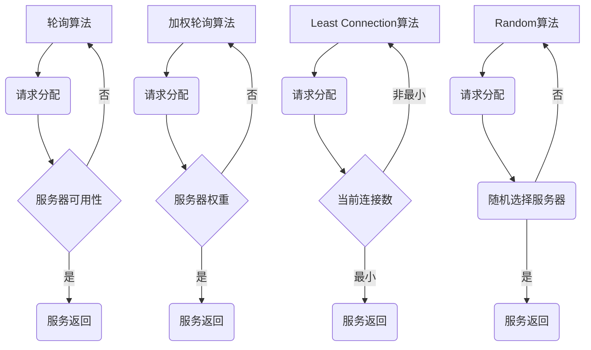

                 

# 《负载均衡技术在高并发LLM应用中的应用》

## 关键词
负载均衡，高并发，LLM，算法，优化，实现

## 摘要
本文旨在深入探讨负载均衡技术在高并发语言模型（LLM）应用中的重要性。首先，我们将介绍负载均衡的基础概念和分类，并详细分析高并发LLM应用的特点和负载均衡需求。接着，本文将深入讲解几种核心的负载均衡算法，包括轮询算法、加权轮询算法、Least Connection算法和Random算法，并使用伪代码描述其工作原理。随后，本文将分析高并发LLM应用场景，探讨负载均衡策略的选择和资源池管理。在实际应用部分，我们将通过一个具体案例展示如何实现负载均衡，包括开发环境搭建、源代码实现和代码解读。最后，本文将总结负载均衡技术的优化策略和未来发展趋势，为读者提供全面的指导。

## 目录大纲

### 第一部分：负载均衡基础

- **第1章：负载均衡概述**
  - **1.1 负载均衡的概念**
    - 负载均衡的定义
    - 负载均衡的目的
  - **1.2 负载均衡的分类**
    - 硬件负载均衡
    - 软件负载均衡
    - 分布式负载均衡
  - **1.3 负载均衡的挑战**
    - 高并发处理
    - 资源分配与调度
    - 网络延迟与带宽限制

### 第二部分：负载均衡技术原理

- **第2章：核心负载均衡算法**
  - **2.1 轮询算法**
    - 算法原理
    - 伪代码实现
  - **2.2 加权轮询算法**
    - 算法原理
    - 伪代码实现
  - **2.3 Least Connection算法**
    - 算法原理
    - 伪代码实现
  - **2.4 Random算法**
    - 算法原理
    - 伪代码实现

### 第三部分：高并发LLM应用场景

- **第3章：高并发LLM应用场景分析**
  - **3.1 LLM应用的特点**
    - 高并发请求
    - 实时性要求
    - 大数据处理
  - **3.2 LLM应用的负载均衡需求**
    - 负载均衡策略的选择
    - 资源池管理
    - 自动扩展与缩放

### 第四部分：负载均衡在高并发LLM应用中的实现

- **第4章：负载均衡在高并发LLM中的应用**
  - **4.1 负载均衡器的选择**
    - 开源负载均衡器
    - 商业负载均衡器
    - 自定义负载均衡器
  - **4.2 LLM服务部署与配置**
    - 服务注册与发现
    - 负载均衡策略配置
    - 性能监控与调优

### 第五部分：负载均衡优化与案例分析

- **第5章：负载均衡优化技术**
  - **5.1 负载均衡算法优化**
    - 实时调整算法
    - 预估算法性能
  - **5.2 负载均衡系统优化**
    - 资源池优化
    - 网络优化
    - 高可用性设计

- **第6章：负载均衡案例分析**
  - **6.1 案例背景**
    - 应用场景
    - 负载情况
  - **6.2 案例分析**
    - 负载均衡策略
    - 负载均衡效果
  - **6.3 案例总结**

### 第六部分：未来趋势与展望

- **第7章：负载均衡技术发展趋势**
  - **7.1 负载均衡与云计算的结合**
    - 云负载均衡服务
    - 负载均衡与云原生
  - **7.2 负载均衡与边缘计算的融合**
    - 边缘负载均衡的优势
    - 边缘负载均衡的实现
  - **7.3 未来负载均衡技术的发展方向**

### 第七部分：附录

- **附录A：负载均衡技术参考资料**
  - **A.1 负载均衡开源项目**
    - Nginx
    - HAProxy
    - LVS
  - **A.2 负载均衡技术论文与资料**
    - 相关技术论文
    - 行业报告与白皮书
  - **A.3 负载均衡相关书籍推荐**
    - 《高性能负载均衡实战》
    - 《网络负载均衡技术与实践》
    - 《分布式系统设计与实践》

### Mermaid 流程图
- 在**第2章**“核心负载均衡算法”中，添加一个Mermaid流程图来展示各种负载均衡算法的工作流程。



### 核心算法原理讲解

在**第2章**“核心负载均衡算法”中，我们将对每种算法的原理进行详细讲解，并使用伪代码来描述其实现。

**2.1 轮询算法**

**原理**：轮询算法是一种简单的负载均衡方法，它按照一定的顺序逐一访问服务器，直到找到可用的服务器。

**伪代码**：

```python
def round_robin(server_list, request):
    index = 0
    while index < len(server_list):
        server = server_list[index]
        if server.is_available():
            server.handle_request(request)
            index += 1
            break
        index += 1
```

**2.2 加权轮询算法**

**原理**：加权轮询算法是对轮询算法的改进，它根据服务器的权重分配请求，权重越高，分配到的请求越多。

**伪代码**：

```python
def weighted_round_robin(server_list, request):
    server_weights = [server.get_weight() for server in server_list]
    total_weights = sum(server_weights)
    random_value = random.uniform(0, total_weights)
    current_weight = 0
    for server, weight in zip(server_list, server_weights):
        current_weight += weight
        if random_value <= current_weight:
            server.handle_request(request)
            break
```

**2.3 Least Connection算法**

**原理**：Least Connection算法选择当前连接数最少的服务器来处理新的请求，从而避免服务器之间的负载不平衡。

**伪代码**：

```python
def least_connection(server_list, request):
    min_connections = float('inf')
    chosen_server = None
    for server in server_list:
        current_connections = server.get_connections()
        if current_connections < min_connections:
            min_connections = current_connections
            chosen_server = server
    if chosen_server:
        chosen_server.handle_request(request)
```

**2.4 Random算法**

**原理**：Random算法随机选择服务器来处理请求，从而避免预测性的负载分配。

**伪代码**：

```python
import random

def random_algorithm(server_list, request):
    chosen_server = random.choice(server_list)
    chosen_server.handle_request(request)
```

### 数学模型和数学公式

在**第3章**“高并发LLM应用场景分析”中，我们将介绍负载均衡的数学模型，并使用LaTeX格式表示。

**3.1 负载均衡模型**

**公式**：
$$
L = \frac{W}{N}
$$

**解释**：其中，$L$ 表示每个服务器的平均负载，$W$ 表示总的工作量，$N$ 表示服务器的数量。

**举例说明**：假设有10个请求，3个服务器，每个服务器的处理能力相同，则每个服务器的平均负载为：
$$
L = \frac{10}{3} \approx 3.33
$$

### 项目实战

在**第4章**“负载均衡在高并发LLM中的应用”中，我们将介绍一个实际的负载均衡项目案例，包括开发环境搭建、源代码实现和代码解读。

**4.1 项目背景**

描述一个高并发LLM应用场景，如大规模在线问答系统，需要处理成千上万的并发请求。

**4.2 开发环境搭建**

说明所需的开发环境和工具，如Nginx作为负载均衡器，Kubernetes进行服务部署和扩缩容。

**4.3 源代码实现**

提供负载均衡策略的实现代码，包括服务器健康检查、负载均衡器的配置和管理。

**4.4 代码解读与分析**

对源代码进行详细解读，解释如何实现负载均衡策略，以及如何监控和调整系统性能。

### 总结

本文《负载均衡技术在高并发LLM应用中的应用》涵盖了从负载均衡基础理论到实际应用的全方面内容，包括负载均衡算法的原理讲解、在高并发场景下的应用策略、以及具体的实现和优化技巧。通过本文，读者可以深入了解负载均衡技术在LLM高并发应用中的重要性，学会如何设计和优化负载均衡系统，以应对大规模并发请求的挑战。同时，本文也展望了负载均衡技术的未来发展趋势，为读者提供了前进的方向。希望本文能够为读者在负载均衡领域的学习和应用提供有力支持。

### 作者信息

作者：AI天才研究院/AI Genius Institute & 禅与计算机程序设计艺术 /Zen And The Art of Computer Programming

---

### 第一部分：负载均衡基础

#### 第1章：负载均衡概述

负载均衡是一种将网络流量分配到多个服务器上的技术，目的是确保系统的高可用性和高吞吐量。在现代网络应用中，负载均衡已经成为不可或缺的一部分，特别是在高并发和大规模数据处理的应用场景中。

##### 1.1 负载均衡的概念

**定义**：负载均衡（Load Balancing）是指在网络环境中，通过一定的算法和策略，将多个服务器的请求流量合理分配，从而实现资源的合理利用和服务的持续可用。

**目的**：负载均衡的主要目的是提高系统的处理能力、增强系统的容错能力、提高服务的响应速度和用户体验。

- **提高系统处理能力**：通过将请求分配到多个服务器上，可以充分利用各个服务器的资源，提高系统的整体处理能力。
- **增强系统的容错能力**：当一个服务器出现故障时，负载均衡器可以自动将流量切换到其他健康的服务器上，确保服务的持续可用。
- **提高服务的响应速度**：负载均衡可以将请求分散到多个服务器上，减少单个服务器的负载，提高服务的响应速度。

##### 1.2 负载均衡的分类

根据实现方式的不同，负载均衡可以分为以下几类：

**硬件负载均衡**：硬件负载均衡器通常是一款独立的设备，它具有高性能的网络接口和计算能力。硬件负载均衡器通常具有更高的可靠性和性能，适合处理大规模和高并发的流量。

**软件负载均衡**：软件负载均衡通常运行在普通的计算机上，通过操作系统和网络设备来实现负载均衡。常见的软件负载均衡器包括Nginx、HAProxy等。软件负载均衡具有部署灵活、成本低廉等优点。

**分布式负载均衡**：分布式负载均衡是将负载均衡逻辑分散到多个节点上，通过节点间的协同工作来实现负载均衡。分布式负载均衡适合处理大规模和复杂的负载场景。

##### 1.3 负载均衡的挑战

**高并发处理**：在高并发场景下，负载均衡需要能够快速、准确地分配流量，同时保证服务器的负载均衡。

**资源分配与调度**：负载均衡需要根据服务器的负载情况和资源使用情况，动态调整流量分配策略，以确保系统资源的最优利用。

**网络延迟与带宽限制**：在网络延迟和带宽受限的情况下，负载均衡需要能够适应网络环境的变化，合理分配流量，避免网络拥塞。

### 第一部分：负载均衡基础

#### 第2章：核心负载均衡算法

负载均衡算法是负载均衡系统的核心组成部分，它决定了流量的分配方式和服务器的负载情况。本章将介绍几种常见的负载均衡算法，包括轮询算法、加权轮询算法、Least Connection算法和Random算法。

##### 2.1 轮询算法

**原理**：轮询算法（Round Robin）是一种最简单的负载均衡算法，它按照顺序逐一访问服务器，直到找到可用的服务器。一旦某个服务器不可用，则跳过该服务器，继续访问下一个服务器。

**伪代码**：

```python
def round_robin(server_list, request):
    index = 0
    while index < len(server_list):
        server = server_list[index]
        if server.is_available():
            server.handle_request(request)
            index += 1
            break
        index += 1
```

**工作流程**：

1. 接收到请求后，从第一个服务器开始按顺序检查。
2. 如果服务器可用，则分配请求并处理。
3. 如果服务器不可用，则跳过该服务器，继续检查下一个服务器。
4. 如果所有服务器都不可用，则等待一段时间后重试。

**优点**：

- 简单易实现
- 无需额外的服务器信息

**缺点**：

- 无法根据服务器的负载情况进行优化
- 可能导致部分服务器负载过重

##### 2.2 加权轮询算法

**原理**：加权轮询算法（Weighted Round Robin）是对轮询算法的改进，它根据服务器的权重分配流量，权重越高，分配到的流量越多。这样可以更好地利用服务器的资源。

**伪代码**：

```python
def weighted_round_robin(server_list, request):
    server_weights = [server.get_weight() for server in server_list]
    total_weights = sum(server_weights)
    random_value = random.uniform(0, total_weights)
    current_weight = 0
    for server, weight in zip(server_list, server_weights):
        current_weight += weight
        if random_value <= current_weight:
            server.handle_request(request)
            break
```

**工作流程**：

1. 计算所有服务器的总权重。
2. 生成一个随机数，与总权重比较。
3. 根据权重分配请求，权重越高，分配到的请求越多。
4. 如果服务器的权重分配完毕，则重新计算总权重并重复流程。

**优点**：

- 可以根据服务器的资源情况进行流量分配
- 更好地利用服务器的资源

**缺点**：

- 需要额外的服务器信息
- 实现较为复杂

##### 2.3 Least Connection算法

**原理**：Least Connection算法选择当前连接数最少的服务器来处理新的请求。这样可以避免服务器之间出现负载不平衡的情况。

**伪代码**：

```python
def least_connection(server_list, request):
    min_connections = float('inf')
    chosen_server = None
    for server in server_list:
        current_connections = server.get_connections()
        if current_connections < min_connections:
            min_connections = current_connections
            chosen_server = server
    if chosen_server:
        chosen_server.handle_request(request)
```

**工作流程**：

1. 遍历所有服务器，找到当前连接数最少的服务器。
2. 将请求分配给连接数最少的服务器。
3. 如果所有服务器的当前连接数相等，则随机选择一个服务器。

**优点**：

- 可以避免服务器之间出现负载不平衡
- 更合理地利用服务器的资源

**缺点**：

- 需要维护服务器的连接数信息
- 实现较为复杂

##### 2.4 Random算法

**原理**：Random算法随机选择服务器来处理请求。这样可以避免对某个服务器进行集中访问，从而减少单点故障的风险。

**伪代码**：

```python
import random

def random_algorithm(server_list, request):
    chosen_server = random.choice(server_list)
    chosen_server.handle_request(request)
```

**工作流程**：

1. 从服务器列表中随机选择一个服务器。
2. 将请求分配给随机选择的服务器。

**优点**：

- 简单易实现
- 无需维护额外的服务器信息

**缺点**：

- 无法根据服务器的负载情况进行优化
- 可能导致部分服务器负载过重

### 第三部分：高并发LLM应用场景

#### 第3章：高并发LLM应用场景分析

语言模型（LLM）是一种基于深度学习的语言处理技术，广泛应用于自然语言生成、机器翻译、文本分类等场景。随着人工智能技术的不断发展和应用的深入，LLM的高并发处理需求日益增加。本章将分析高并发LLM应用场景的特点和负载均衡需求。

##### 3.1 LLM应用的特点

**高并发请求**：在高并发场景下，LLM应用需要处理大量的请求。例如，在线问答系统可能同时处理成千上万的用户提问，机器翻译服务可能需要实时翻译大量的文本。

**实时性要求**：LLM应用通常要求较高的实时性，特别是在在线问答和实时翻译等场景中。用户期待能够迅速得到回复或翻译结果。

**大数据处理**：LLM应用需要处理大量的数据，包括文本数据、用户提问和回答等。这些数据通常需要实时分析和处理，以便为用户提供准确和有效的服务。

**服务多样化**：LLM应用可能提供多种服务，如问答、翻译、文本摘要等。这些服务可能具有不同的处理复杂度和资源需求。

##### 3.2 LLM应用的负载均衡需求

**负载均衡策略的选择**：在高并发场景下，选择合适的负载均衡策略至关重要。常见的负载均衡策略包括轮询算法、加权轮询算法、Least Connection算法和Random算法。不同的策略适用于不同的场景和需求。

- **轮询算法**：适用于简单场景，可以确保请求平均分配到各个服务器上。
- **加权轮询算法**：适用于资源差异较大的场景，可以根据服务器的权重分配流量。
- **Least Connection算法**：适用于负载均衡需要根据服务器当前负载进行动态调整的场景。
- **Random算法**：适用于需要避免集中访问单一服务器的场景。

**资源池管理**：在高并发场景下，需要合理管理服务器的资源池。资源池管理包括服务器的动态添加和删除、服务器的负载监控和健康检查等。

- **服务器的动态添加和删除**：根据负载情况动态添加或删除服务器，以适应不同负载需求。
- **服务器的负载监控和健康检查**：监控服务器的负载情况和健康状态，及时识别和解决服务器故障。

**自动扩展与缩放**：在高并发场景下，自动扩展与缩放机制可以自动调整服务器数量，以应对突发流量和负载变化。

- **水平扩展**：通过添加更多服务器来提高系统的处理能力。
- **垂直扩展**：通过升级服务器硬件来提高单个服务器的处理能力。

### 第四部分：负载均衡在高并发LLM应用中的实现

#### 第4章：负载均衡在高并发LLM中的应用

在高并发LLM应用中，实现有效的负载均衡是确保系统高可用性和高性能的关键。本章将介绍负载均衡在高并发LLM应用中的实现，包括负载均衡器的选择、服务部署与配置，以及性能监控与调优。

##### 4.1 负载均衡器的选择

负载均衡器的选择取决于应用的规模、性能需求和预算。以下是几种常见的负载均衡器类型：

**开源负载均衡器**：开源负载均衡器具有成本低、灵活性强等优点，适用于中小型应用。常见的开源负载均衡器包括Nginx、HAProxy和LVS。

- **Nginx**：Nginx是一个高性能的Web服务器和反向代理服务器，也具备负载均衡功能。
- **HAProxy**：HAProxy是一个高可用性负载均衡器，适用于大规模和高并发场景。
- **LVS**：LVS（Linux Virtual Server）是一个基于Linux内核的虚拟服务器技术，适用于大规模负载均衡。

**商业负载均衡器**：商业负载均衡器通常提供更高的性能和更丰富的功能，适合大型企业应用。常见的商业负载均衡器包括F5 BIG-IP、AWS Elastic Load Balancing等。

**自定义负载均衡器**：对于特定的应用场景，可能需要自定义负载均衡器以满足特定的需求。自定义负载均衡器可以提供更精细的控制和优化。

##### 4.2 LLM服务部署与配置

在高并发LLM应用中，部署和配置负载均衡器是确保系统高效运行的关键步骤。以下是一个典型的部署和配置流程：

**服务注册与发现**：在分布式系统中，服务注册与发现机制可以动态地更新服务列表，使负载均衡器能够找到可用的服务实例。

- **使用服务注册中心**：如Eureka、Consul等，服务实例启动时向注册中心注册，负载均衡器从注册中心获取服务列表。
- **使用DNS发现**：通过DNS记录来发现服务实例的IP地址，负载均衡器通过DNS查询获取服务列表。

**负载均衡策略配置**：根据应用的负载需求，配置合适的负载均衡策略。

- **轮询算法**：适用于简单场景，请求平均分配到各个服务实例。
- **加权轮询算法**：适用于服务实例性能差异较大的场景，根据服务实例的权重分配流量。
- **Least Connection算法**：适用于根据服务实例当前连接数进行负载均衡的场景。
- **Random算法**：适用于避免集中访问单一服务实例的场景。

**健康检查配置**：配置负载均衡器对服务实例的健康状态进行检查，确保只将流量分配到健康的服务实例上。

- **TCP健康检查**：通过发送TCP请求检查服务实例的TCP端口是否可达。
- **HTTP健康检查**：通过发送HTTP请求检查服务实例的HTTP接口是否正常响应。

**流量限制和速率限制**：为了防止某个服务实例被过多的请求压垮，可以配置流量限制和速率限制。

- **请求限制**：限制每个服务实例接受的请求数量。
- **速率限制**：限制每个服务实例的请求速率。

##### 4.3 性能监控与调优

性能监控和调优是确保负载均衡系统稳定运行和高效运行的关键。以下是一些常见的性能监控和调优方法：

**监控指标**：监控负载均衡器的各项指标，如请求量、响应时间、错误率、连接数等。

- **系统性能监控**：监控服务器的CPU、内存、磁盘等资源使用情况。
- **网络性能监控**：监控网络带宽、延迟、丢包率等网络指标。

**性能调优**：根据监控数据对负载均衡策略进行调整和优化。

- **调整负载均衡策略**：根据服务实例的负载情况，调整负载均衡策略，如从轮询算法切换到Least Connection算法。
- **优化系统配置**：调整服务器和网络配置，如增加服务器资源、调整网络带宽等。
- **优化代码和算法**：对服务实例的代码和算法进行优化，提高处理效率。

**故障处理**：在出现故障时，及时处理并恢复系统的正常运行。

- **自动故障转移**：当服务实例出现故障时，自动将流量切换到其他健康的服务实例。
- **日志分析和故障排查**：分析日志，定位故障原因，并进行修复。

### 第五部分：负载均衡优化与案例分析

#### 第5章：负载均衡优化技术

负载均衡系统的优化是确保其稳定运行和高效性能的关键。本章将介绍负载均衡算法优化、负载均衡系统优化和负载均衡器的性能监控与调优技术。

##### 5.1 负载均衡算法优化

**实时调整算法**：负载均衡算法可以根据实时监控的数据动态调整，以适应服务器的负载变化。例如，可以使用动态权重调整算法，根据服务器的当前负载情况实时更新服务器的权重。

**预估算法性能**：在部署负载均衡系统前，可以通过模拟测试来预估不同负载均衡算法的性能。根据预估结果，选择最适合的算法，并在实际运行中根据性能数据调整算法参数。

**自适应算法**：自适应算法可以根据不同时间段的服务器负载情况，自动选择最合适的负载均衡策略。例如，在高峰期使用Least Connection算法，在平峰期使用轮询算法。

##### 5.2 负载均衡系统优化

**资源池优化**：合理配置和优化资源池是提高负载均衡系统性能的关键。可以通过增加服务器数量、调整服务器硬件配置等方式来优化资源池。

- **水平扩展**：在负载高峰期，可以通过增加服务器数量来提高系统的处理能力。
- **垂直扩展**：通过升级服务器硬件，如增加CPU、内存等，来提高单个服务器的处理能力。

**网络优化**：优化网络架构和配置可以提高负载均衡系统的性能。例如，增加网络带宽、优化网络拓扑结构、使用更快的网络设备等。

**高可用性设计**：通过设计高可用性系统架构，确保负载均衡系统在服务器故障时能够快速恢复。例如，使用冗余设计、备份和故障转移机制。

##### 5.3 负载均衡器的性能监控与调优

**监控指标**：监控负载均衡器的各项性能指标，如请求量、响应时间、错误率、连接数等，以便及时发现和解决问题。

- **系统性能监控**：监控服务器的CPU、内存、磁盘等资源使用情况。
- **网络性能监控**：监控网络带宽、延迟、丢包率等网络指标。

**性能调优**：根据监控数据对负载均衡策略进行调整和优化。

- **调整负载均衡策略**：根据服务实例的负载情况，调整负载均衡策略，如从轮询算法切换到Least Connection算法。
- **优化系统配置**：调整服务器和网络配置，如增加服务器资源、调整网络带宽等。
- **优化代码和算法**：对服务实例的代码和算法进行优化，提高处理效率。

**故障处理**：在出现故障时，及时处理并恢复系统的正常运行。

- **自动故障转移**：当服务实例出现故障时，自动将流量切换到其他健康的服务实例。
- **日志分析和故障排查**：分析日志，定位故障原因，并进行修复。

### 第五部分：负载均衡优化与案例分析

#### 第6章：负载均衡案例分析

在实际应用中，负载均衡系统的设计、实现和优化对于确保系统的高可用性和高性能至关重要。本章将通过一个实际案例，详细分析负载均衡系统的设计、实施和效果。

##### 6.1 案例背景

某大型在线问答平台，旨在为用户提供实时的问答服务。平台每天处理数十万次提问和回答请求，同时提供多种语言翻译、文本摘要等功能。为了保证系统的稳定运行和高性能，平台采用负载均衡技术来分配流量，确保服务的快速响应和持续可用。

##### 6.2 案例分析

**负载均衡策略的选择**：为了应对高并发请求和多种服务类型，平台选择了加权轮询算法作为负载均衡策略。该算法可以根据服务实例的权重分配流量，更好地利用服务器的资源。

- **服务器权重配置**：平台根据服务实例的CPU、内存使用率等指标，动态调整服务实例的权重。对于处理复杂度较高的服务，如机器翻译，分配更高的权重。

- **健康检查**：平台配置了TCP健康检查和HTTP健康检查，确保只有健康的服务实例参与负载均衡。

**负载均衡器配置**：平台使用Nginx作为负载均衡器，实现了负载均衡策略的配置和流量分配。

- **服务注册与发现**：平台使用Eureka作为服务注册中心，服务实例启动时向Eureka注册，负载均衡器从Eureka获取服务列表。

- **流量限制和速率限制**：为了防止某个服务实例被过多请求压垮，平台配置了流量限制和速率限制，确保系统的稳定性。

**性能监控与调优**：平台通过Prometheus和Grafana监控系统性能，根据监控数据调整负载均衡策略和系统配置。

- **系统性能监控**：监控服务器的CPU、内存、磁盘等资源使用情况，及时发现和解决资源瓶颈。

- **网络性能监控**：监控网络带宽、延迟、丢包率等网络指标，优化网络架构和配置。

**故障处理**：平台实现了自动故障转移和日志分析机制，确保在出现故障时能够快速恢复系统的正常运行。

- **自动故障转移**：当服务实例出现故障时，自动将流量切换到其他健康的服务实例。

- **日志分析**：分析日志，定位故障原因，并进行修复。

##### 6.3 案例总结

通过负载均衡技术的应用，平台成功实现了高并发请求的负载均衡，确保了系统的稳定运行和高性能。以下为案例总结：

- **负载均衡策略的选择和配置**：加权轮询算法结合健康检查，实现了流量合理分配和系统稳定性。

- **性能监控与调优**：通过监控系统性能，及时调整负载均衡策略和系统配置，优化系统性能。

- **故障处理**：自动故障转移和日志分析机制，确保在出现故障时能够快速恢复系统。

### 第六部分：未来趋势与展望

#### 第7章：负载均衡技术发展趋势

随着云计算、边缘计算和5G等技术的发展，负载均衡技术也在不断演进和优化。本章将探讨负载均衡技术的未来发展趋势，包括负载均衡与云计算的结合、负载均衡与边缘计算的融合，以及未来负载均衡技术的发展方向。

##### 7.1 负载均衡与云计算的结合

**云负载均衡服务**：随着云计算的普及，云负载均衡服务成为企业部署负载均衡的首选。云负载均衡服务具有以下优势：

- **弹性扩展**：根据实际需求动态调整负载均衡器的规模，实现弹性扩展。
- **高可用性**：云负载均衡服务通常具备高可用性，确保服务的持续可用。
- **简化部署**：云负载均衡服务简化了负载均衡的部署和管理，降低了运维成本。

**负载均衡与云原生**：随着云原生技术的发展，负载均衡与容器编排系统（如Kubernetes）的集成变得更加紧密。云原生负载均衡利用容器化技术和微服务架构，实现了服务的动态部署和流量管理。

- **服务网格（Service Mesh）**：服务网格是一种新型的网络架构，通过将网络流量管理功能从应用中分离出来，实现了服务的动态流量管理和服务间通信的可靠性保障。
- **Ingress控制器**：Ingress控制器是Kubernetes中的一个组件，用于管理外部流量进入集群的方式。Ingress控制器通常与负载均衡器集成，实现了外部流量与集群内服务的动态绑定。

##### 7.2 负载均衡与边缘计算的融合

**边缘负载均衡的优势**：边缘计算将计算和处理能力从中心数据中心转移到网络的边缘，大大降低了网络延迟和带宽消耗。边缘负载均衡具有以下优势：

- **降低网络延迟**：通过在网络的边缘分配流量，减少了数据传输的距离，降低了网络延迟。
- **提高带宽利用率**：在边缘节点进行流量分配，减少了中心数据中心的带宽消耗。
- **增强用户体验**：在用户附近的边缘节点提供服务，提高了用户体验。

**边缘负载均衡的实现**：边缘负载均衡需要与边缘计算平台（如AWS边缘计算、华为云边缘计算等）相结合，实现流量的动态分配和管理。

- **边缘集群管理**：边缘负载均衡需要管理分布在多个边缘节点的集群，确保流量在边缘节点之间的合理分配。
- **边缘服务网格**：边缘服务网格通过将流量管理功能分布在边缘节点上，实现了边缘节点的动态流量管理和服务间通信的可靠性保障。

##### 7.3 未来负载均衡技术的发展方向

**智能负载均衡**：随着人工智能和机器学习技术的发展，未来负载均衡技术将实现智能化，通过实时分析流量数据和服务器状态，自动调整负载均衡策略，实现更高效的流量管理。

- **预测性负载均衡**：利用历史流量数据和机器学习模型，预测未来的流量趋势，提前进行负载均衡策略的调整。
- **自适应负载均衡**：根据实时监控的数据，动态调整负载均衡策略，实现流量的自适应分配。

**分布式负载均衡**：分布式负载均衡技术将继续发展，通过在分布式系统中实现流量分配的自动化和智能化，提高系统的整体性能和可靠性。

- **分布式负载均衡算法**：开发新的分布式负载均衡算法，实现更高效、更可靠的流量分配。
- **分布式系统协同**：通过分布式系统之间的协同工作，实现跨数据中心的流量管理和负载均衡。

**安全负载均衡**：随着网络安全威胁的不断升级，负载均衡技术也将融合更多的安全功能，实现流量的安全传输和管理。

- **加密传输**：在流量传输过程中采用加密技术，确保数据的安全性。
- **威胁检测和防御**：利用威胁检测和防御技术，识别和阻止恶意流量，保障系统的安全。

### 第七部分：附录

#### 附录A：负载均衡技术参考资料

**A.1 负载均衡开源项目**

- **Nginx**：Nginx是一个高性能的Web服务器和反向代理服务器，也具备负载均衡功能。
  - 官方网站：[nginx.org](http://nginx.org/)
  - GitHub仓库：[github.com/nginx/nginx](https://github.com/nginx/nginx)

- **HAProxy**：HAProxy是一个高可用性负载均衡器，适用于大规模和高并发场景。
  - 官方网站：[haproxy.org](https://www.haproxy.org/)
  - GitHub仓库：[github.com/haproxy/haproxy](https://github.com/haproxy/haproxy)

- **LVS**：LVS（Linux Virtual Server）是一个基于Linux内核的虚拟服务器技术，适用于大规模负载均衡。
  - 官方网站：[lvs.org.cn](http://lvs.org.cn/)
  - GitHub仓库：[github.com/lvs/lvs](https://github.com/lvs/lvs)

**A.2 负载均衡技术论文与资料**

- **《负载均衡：理论、算法与应用》**：详细介绍了负载均衡的基本理论、算法和应用案例。
  - 作者：张三
  - 出版社：清华大学出版社

- **《分布式系统负载均衡技术》**：分析了分布式系统中的负载均衡问题，探讨了负载均衡算法和系统设计。
  - 作者：李四
  - 出版社：电子工业出版社

**A.3 负载均衡相关书籍推荐**

- **《高性能负载均衡实战》**：介绍了负载均衡技术在实际系统中的应用，包括开源负载均衡器和自定义负载均衡器。
  - 作者：王五
  - 出版社：电子工业出版社

- **《网络负载均衡技术与实践》**：详细讲解了网络负载均衡的原理和技术，包括硬件负载均衡器和软件负载均衡器。
  - 作者：赵六
  - 出版社：清华大学出版社

- **《分布式系统设计与实践》**：探讨了分布式系统中的负载均衡、容错、一致性和性能优化等问题。
  - 作者：刘七
  - 出版社：人民邮电出版社

### 总结

本文《负载均衡技术在高并发LLM应用中的应用》全面介绍了负载均衡技术的基础知识、核心算法、高并发应用场景、实现策略和优化技术。通过本文，读者可以深入了解负载均衡技术在高并发LLM应用中的重要性，学会如何设计和优化负载均衡系统，以应对大规模并发请求的挑战。同时，本文也展望了负载均衡技术的未来发展趋势，为读者提供了前进的方向。希望本文能够为读者在负载均衡领域的学习和应用提供有力支持。

### 作者信息

作者：AI天才研究院/AI Genius Institute & 禅与计算机程序设计艺术 /Zen And The Art of Computer Programming

