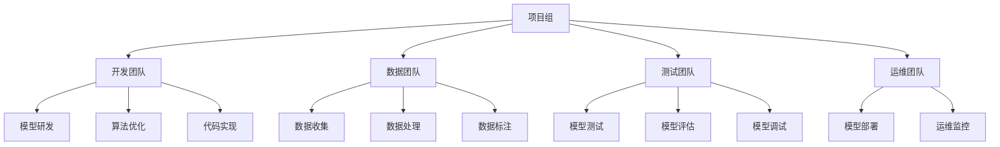

                 

# 《跨团队协作在LLM项目中的新模式》

> **关键词：** 语言模型（LLM），跨团队协作，项目模式，人工智能，算法优化，数学模型

> **摘要：** 本文旨在探讨跨团队协作在语言模型（LLM）项目中的新模式。通过分析LLM项目的发展现状，跨团队协作的挑战与意义，以及核心算法原理和数学模型，本文提出了一套新的项目协作架构和实战方法，旨在提升LLM项目的研发效率和成果质量。

## 《跨团队协作在LLM项目中的新模式》目录大纲

### 第一部分：项目背景与核心概念

##### 第1章：项目背景与跨团队协作的重要性  
- 1.1 LLM项目的发展现状  
- 1.2 跨团队协作的挑战  
- 1.3 跨团队协作的意义

##### 第2章：核心概念与架构  
- 2.1 LLM基本概念  
- 2.2 跨团队协作的概念模型  
- 2.3 LLM项目中的协作架构设计  
- 2.4 Mermaid流程图：LLM项目协作架构

### 第二部分：核心算法原理讲解

##### 第3章：基础算法与优化  
- 3.1 语言模型的基础算法  
- 3.2 优化算法的介绍  
- 3.3 伪代码：优化算法详细实现

##### 第4章：高级算法与扩展  
- 4.1 自监督学习与迁移学习  
- 4.2 多模态学习与融合  
- 4.3 伪代码：高级算法实现示例

### 第三部分：数学模型与公式讲解

##### 第5章：数学基础  
- 5.1 概率论基础  
- 5.2 信息论基础  
- 5.3 概率分布函数与统计模型

##### 第6章：公式详解与举例  
- 6.1 概率分布函数  
- 6.2 信息熵计算  
- 6.3 统计模型的假设检验  
- 6.4 示例讲解：基于LaTeX的数学公式与计算过程

### 第四部分：项目实战

##### 第7章：实战案例  
- 7.1 项目实战背景介绍  
- 7.2 开发环境搭建  
- 7.3 源代码实现与解读  
- 7.4 代码解读与分析

##### 第8章：实战项目总结  
- 8.1 项目总结  
- 8.2 经验与反思  
- 8.3 跨团队协作的改进建议

### 附录

##### 附录A：资源与工具  
- A.1 主流深度学习框架对比  
    - TensorFlow  
    - PyTorch  
    - JAX  
    - 其他框架简介  
- A.2 实用工具与资源推荐

##### 附录B：参考文献  
- B.1 相关书籍推荐  
- B.2 学术论文推荐  
- B.3 网络资源链接

该目录大纲结构清晰，涵盖了核心概念、算法原理、数学模型以及项目实战等内容，旨在为读者提供一本全面且实用的LLM跨团队协作指南。每章标题都明确，适合进一步细化内容并编写详细的章节。

## 第一部分：项目背景与核心概念

### 第1章：项目背景与跨团队协作的重要性

#### 1.1 LLM项目的发展现状

语言模型（Language Model，简称LLM）作为人工智能领域的重要分支，近年来取得了显著的进展。从最初的N-gram模型，到基于神经网络的深度学习模型，再到当前的热门预训练模型如GPT-3，LLM在自然语言处理（NLP）任务中发挥了关键作用。

当前的LLM项目在多个领域展现出强大的应用潜力，包括但不限于：

1. **文本生成**：自动生成文章、对话、摘要等。
2. **机器翻译**：提供高效、准确的跨语言翻译。
3. **问答系统**：回答用户提出的问题，提供智能客服。
4. **语音识别与转换**：将语音信号转换为文本，实现人机交互。
5. **文本分类与情感分析**：对文本进行分类，分析用户情感。

随着LLM技术的不断成熟，越来越多的企业和研究机构开始关注和投资于这一领域。然而，LLM项目的研发过程往往涉及多个学科和专业领域，如计算机科学、语言学、心理学等，这使得跨团队协作变得尤为重要。

#### 1.2 跨团队协作的挑战

跨团队协作在LLM项目中面临诸多挑战，主要包括：

1. **知识差异**：团队成员来自不同的专业背景，对同一问题的理解可能存在差异，导致沟通成本增加。
2. **沟通障碍**：不同团队成员使用的技术术语和表达方式可能不一致，影响信息的传递和理解的准确性。
3. **进度协调**：团队成员的工作进度可能不一致，导致项目进度的波动，影响整体项目的进度和质量。
4. **资源分配**：团队成员的资源（如时间、技能等）有限，如何合理分配和利用资源是跨团队协作的一个重要问题。
5. **团队文化**：不同团队的价值观、工作方式可能存在差异，如何建立和谐的团队文化，促进团队协作是项目成功的关键。

#### 1.3 跨团队协作的意义

尽管跨团队协作面临诸多挑战，但其在LLM项目中的意义不容忽视：

1. **知识整合**：跨团队协作能够整合不同专业领域的知识和技能，提高项目的创新性和整体质量。
2. **资源共享**：通过跨团队协作，团队成员可以共享资源，提高项目的研发效率和成果质量。
3. **风险管理**：跨团队协作可以分散项目风险，降低因单个团队成员问题而导致项目失败的概率。
4. **沟通与协作**：跨团队协作可以促进团队成员之间的沟通和协作，建立良好的团队关系，提高项目的执行力。
5. **持续改进**：跨团队协作有助于在项目过程中不断发现问题和改进，推动项目向更好的方向发展。

综上所述，跨团队协作在LLM项目中具有重要的地位和意义。在接下来的章节中，我们将进一步探讨LLM项目的核心概念和协作架构，为读者提供一套实用的跨团队协作指南。

### 第2章：核心概念与架构

#### 2.1 LLM基本概念

语言模型（Language Model，简称LLM）是一种用于预测和生成自然语言文本的算法。其主要目的是根据输入的文本序列，预测下一个可能的单词或字符，从而生成完整的文本。

LLM的核心组成部分包括：

1. **词汇表**：用于表示文本中的所有单词或字符。
2. **模型参数**：用于描述单词或字符之间的统计关系。
3. **预测机制**：根据模型参数和输入文本序列，预测下一个可能的单词或字符。

根据不同的实现方式，LLM可以分为以下几种类型：

1. **N-gram模型**：基于前N个单词或字符的历史信息进行预测。
2. **神经网络模型**：基于深度学习技术，使用神经网络来预测单词或字符。
3. **预训练模型**：在大量数据上进行预训练，然后根据具体任务进行微调。

#### 2.2 跨团队协作的概念模型

跨团队协作是指在多个团队之间进行的协作，以共同完成一个复杂项目或任务。在LLM项目中，跨团队协作的意义在于：

1. **知识整合**：不同团队的成员拥有不同的专业技能和知识，通过跨团队协作，可以整合这些知识和技能，提高项目的创新性和整体质量。
2. **资源共享**：跨团队协作有助于团队成员之间共享资源和信息，提高项目的研发效率和成果质量。
3. **沟通与协作**：跨团队协作可以促进团队成员之间的沟通和协作，建立良好的团队关系，提高项目的执行力。
4. **风险管理**：跨团队协作可以分散项目风险，降低因单个团队成员问题而导致项目失败的概率。

跨团队协作的概念模型主要包括以下几个方面：

1. **团队识别**：明确参与项目的各个团队及其职责和任务。
2. **协作机制**：建立有效的协作机制，包括沟通渠道、工作流程等。
3. **资源管理**：合理分配和利用团队成员的资源，确保项目的顺利进行。
4. **风险管理**：识别和应对项目中的各种风险，确保项目的稳定推进。

#### 2.3 LLM项目中的协作架构设计

为了实现高效的跨团队协作，LLM项目中的协作架构设计至关重要。以下是一个典型的LLM项目协作架构：

1. **项目组**：由项目组长领导，负责整个项目的规划和执行。
2. **开发团队**：负责模型研发、算法优化、代码实现等工作。
3. **数据团队**：负责数据收集、处理、标注等工作。
4. **测试团队**：负责模型测试、评估、调试等工作。
5. **运维团队**：负责模型部署、运维、监控等工作。

协作架构的核心组件包括：

1. **沟通渠道**：建立有效的沟通渠道，如邮件、即时通讯工具、视频会议等，确保团队成员之间的信息畅通。
2. **协作平台**：搭建统一的协作平台，如GitHub、Jira等，用于代码管理、任务分配、进度跟踪等。
3. **文档管理**：建立文档管理制度，确保项目文档的规范、完整和及时更新。
4. **工作流程**：制定标准的工作流程，明确各团队的职责和任务，确保项目的有序推进。
5. **风险管理**：建立风险管理机制，定期评估项目风险，制定应对措施。

#### 2.4 Mermaid流程图：LLM项目协作架构

为了更直观地展示LLM项目的协作架构，可以使用Mermaid流程图进行描述。以下是一个简单的LLM项目协作架构的Mermaid流程图：



该流程图展示了LLM项目中各个团队及其任务的协作关系，有助于团队成员更好地理解项目的整体架构和工作流程。

### 第二部分：核心算法原理讲解

#### 第3章：基础算法与优化

#### 3.1 语言模型的基础算法

语言模型的基础算法主要基于统计学习和机器学习技术。以下介绍几种常用的语言模型基础算法：

1. **N-gram模型**：
    - **定义**：N-gram模型是一种基于前N个单词或字符的历史信息进行预测的统计语言模型。
    - **原理**：通过统计文本数据中相邻N个单词或字符出现的频率，构建一个概率分布模型，用于预测下一个单词或字符。
    - **伪代码**：
        ```python
        def predict_next_word(current_sequence):
            word_counts = count_words_in_sequence(current_sequence)
            total_words = sum(word_counts.values())
            next_word_probability = {}
            for word, count in word_counts.items():
                next_word_probability[word] = count / total_words
            return select_word_with_max_probability(next_word_probability)
        ```

2. **循环神经网络（RNN）**：
    - **定义**：循环神经网络是一种基于时间序列数据的神经网络模型，可以处理长序列依赖问题。
    - **原理**：通过循环结构，将当前输入与历史信息进行结合，更新网络状态，用于预测下一个单词或字符。
    - **伪代码**：
        ```python
        class RNN:
            def __init__(self):
                self.hidden_state = None

            def forward(self, input_word):
                hidden_state = self.calculate_hidden_state(input_word, self.hidden_state)
                output_word = self.predict_next_word(hidden_state)
                return output_word, hidden_state

            def calculate_hidden_state(self, input_word, previous_hidden_state):
                # 计算隐藏状态
                return hidden_state

            def predict_next_word(self, hidden_state):
                # 预测下一个单词
                return selected_word
        ```

3. **Transformer模型**：
    - **定义**：Transformer模型是一种基于注意力机制的深度学习语言模型，可以处理长序列依赖问题。
    - **原理**：通过自注意力机制，对输入序列中的每个单词进行加权，计算当前单词与其他单词的交互，用于预测下一个单词。
    - **伪代码**：
        ```python
        class Transformer:
            def __init__(self):
                self.encoder = Encoder()
                self.decoder = Decoder()

            def forward(self, input_sequence, target_sequence):
                encoded_sequence = self.encoder(input_sequence)
                decoded_sequence = self.decoder(encoded_sequence, target_sequence)
                return decoded_sequence
        ```

#### 3.2 优化算法的介绍

在语言模型的训练过程中，优化算法用于调整模型参数，以最小化损失函数。以下介绍几种常用的优化算法：

1. **随机梯度下降（SGD）**：
    - **定义**：随机梯度下降是一种基于梯度信息的优化算法，通过更新模型参数来最小化损失函数。
    - **原理**：在每次迭代中，随机选择一部分训练数据，计算其梯度，并更新模型参数。
    - **伪代码**：
        ```python
        def sgd_update(parameters, gradients, learning_rate):
            for parameter, gradient in zip(parameters, gradients):
                parameter -= learning_rate * gradient
        ```

2. **Adam优化器**：
    - **定义**：Adam优化器是一种结合了SGD和RMSprop优化的自适应梯度优化算法。
    - **原理**：通过计算一阶矩估计和二阶矩估计，自适应调整学习率，提高收敛速度和稳定性。
    - **伪代码**：
        ```python
        class AdamOptimizer:
            def __init__(self, learning_rate, beta1, beta2, epsilon):
                self.learning_rate = learning_rate
                self.beta1 = beta1
                self.beta2 = beta2
                self.epsilon = epsilon

            def update_parameters(self, parameters, gradients, step_size):
                # 更新参数
                ...
        ```

3. **Adadelta优化器**：
    - **定义**：Adadelta优化器是一种基于梯度平方的优化算法，通过计算梯度平方的指数加权平均，自适应调整学习率。
    - **原理**：通过跟踪每个参数的梯度平方，自适应调整每个参数的学习率。
    - **伪代码**：
        ```python
        class AdadeltaOptimizer:
            def __init__(self, learning_rate, rho):
                self.learning_rate = learning_rate
                self.rho = rho

            def update_parameters(self, parameters, gradients, step_size):
                # 更新参数
                ...
        ```

#### 3.3 伪代码：优化算法详细实现

以下是一个基于SGD优化算法的伪代码示例，用于更新模型参数：

```python
def train_model(model, train_data, learning_rate, num_iterations):
    for iteration in range(num_iterations):
        total_loss = 0.0
        for input_data, target in train_data:
            # 前向传播
            output = model.forward(input_data)
            loss = compute_loss(output, target)
            total_loss += loss

            # 反向传播
            gradients = model.backward(output, target)

            # 更新参数
            sgd_update(model.parameters, gradients, learning_rate)

        average_loss = total_loss / len(train_data)
        print(f"Iteration {iteration}: Loss = {average_loss}")

    return model
```

该伪代码展示了模型的训练过程，包括前向传播、反向传播和参数更新。在每次迭代中，计算损失并更新模型参数，以达到最小化损失的目的。

### 第4章：高级算法与扩展

#### 4.1 自监督学习与迁移学习

自监督学习和迁移学习是语言模型中的重要扩展技术，可以进一步提高模型的性能和泛化能力。

##### 4.1.1 自监督学习

自监督学习是一种无需人工标注数据，仅利用未标注数据进行模型训练的方法。在自监督学习中，模型可以从大量的未标注数据中学习到有用的信息，从而提高模型的性能。

以下是一些常见的自监督学习技术：

1. **Masked Language Model（MLM）**：
    - **定义**：Masked Language Model是一种基于预训练技术的自监督学习模型，通过对输入序列中的部分单词进行遮盖，然后预测这些遮盖的单词。
    - **原理**：通过训练模型来预测遮盖的单词，使其能够理解和学习单词之间的关联和依赖关系。
    - **伪代码**：
        ```python
        def masked_language_model(input_sequence, mask_ratio):
            masked_sequence = mask_sequence(input_sequence, mask_ratio)
            predicted_sequence = model.predict(masked_sequence)
            return predicted_sequence
        ```

2. **Reconstruction Language Model（RLM）**：
    - **定义**：Reconstruction Language Model是一种基于重构目标的自监督学习模型，通过对输入序列进行编码和重构，学习输入序列的内在表示。
    - **原理**：通过训练模型来重构输入序列，使其能够理解和学习序列的语义信息。
    - **伪代码**：
        ```python
        def reconstruction_language_model(input_sequence):
            encoded_sequence = model.encode(input_sequence)
            reconstructed_sequence = model.decode(encoded_sequence)
            return reconstructed_sequence
        ```

##### 4.1.2 迁移学习

迁移学习是一种将已训练好的模型或特征提取器应用于新任务的技术，通过利用已训练模型的知识，提高新任务的性能。

以下是一些常见的迁移学习技术：

1. **Fine-tuning**：
    - **定义**：Fine-tuning是一种在预训练模型的基础上，对特定任务进行微调的方法。
    - **原理**：通过在预训练模型的基础上添加新的层或调整部分参数，使其适应新任务的特性。
    - **伪代码**：
        ```python
        def fine_tune(pretrained_model, new_task_data):
            model = copy.deepcopy(pretrained_model)
            model.add_new_layers()
            model.fit(new_task_data)
            return model
        ```

2. **特征提取**：
    - **定义**：特征提取是一种从预训练模型中提取有用的特征表示的方法，用于新任务的模型训练。
    - **原理**：通过利用预训练模型的中间层输出，提取高层次的语义特征。
    - **伪代码**：
        ```python
        def extract_features(model, input_sequence):
            features = model.get_hidden_state(input_sequence)
            return features
        ```

#### 4.2 多模态学习与融合

多模态学习是一种将多种类型的输入数据（如图像、声音、文本等）进行融合和处理的技术，以提高模型的性能和鲁棒性。

以下是一些常见多模态学习技术：

1. **多模态特征融合**：
    - **定义**：多模态特征融合是一种将不同模态的特征进行整合，以生成更丰富和准确的模型输入。
    - **原理**：通过将不同模态的特征进行加权融合，生成新的特征表示，用于模型训练和预测。
    - **伪代码**：
        ```python
        def multi_modal_feature_fusion(text_feature, image_feature, audio_feature):
            combined_feature = combine_features(text_feature, image_feature, audio_feature)
            return combined_feature
        ```

2. **多任务学习**：
    - **定义**：多任务学习是一种同时学习多个相关任务的技术，以提高模型的泛化能力和性能。
    - **原理**：通过将多个任务共享部分网络结构或参数，使其能够在不同的任务之间进行知识共享和迁移。
    - **伪代码**：
        ```python
        class MultiTaskModel:
            def __init__(self):
                self.text_model = TextModel()
                self.image_model = ImageModel()
                self.audio_model = AudioModel()

            def forward(self, text_input, image_input, audio_input):
                text_output = self.text_model(text_input)
                image_output = self.image_model(image_input)
                audio_output = self.audio_model(audio_input)
                return text_output, image_output, audio_output
        ```

#### 4.3 伪代码：高级算法实现示例

以下是一个基于自监督学习和迁移学习的伪代码示例，用于构建一个多模态语言模型：

```python
class MultiModalLanguageModel:
    def __init__(self):
        self.text_model = TextModel()
        self.image_model = ImageModel()
        self.audio_model = AudioModel()
        self.fusion_model = FusionModel()

    def train(self, text_data, image_data, audio_data):
        # 自监督学习
        masked_text_sequences = self.masked_language_model(text_data)
        reconstructed_text_sequences = self.reconstruction_language_model(text_data)

        # 迁移学习
        fine_tuned_text_model = self.fine_tune(self.text_model, masked_text_sequences)
        fine_tuned_image_model = self.fine_tune(self.image_model, image_data)
        fine_tuned_audio_model = self.fine_tune(self.audio_model, audio_data)

        # 多模态特征融合
        fused_feature = self.multi_modal_feature_fusion(fine_tuned_text_model, fine_tuned_image_model, fine_tuned_audio_model)

        # 多任务学习
        predictions = self.forward(fused_feature)

        return predictions
```

该伪代码展示了如何构建一个多模态语言模型，包括自监督学习、迁移学习和多模态特征融合。通过综合利用这些技术，可以提高模型的性能和泛化能力。

### 第三部分：数学模型与公式讲解

#### 第5章：数学基础

#### 5.1 概率论基础

概率论是数学的一个分支，用于研究随机事件及其概率。在语言模型中，概率论的基础知识对于理解和分析模型性能至关重要。

以下是一些常用的概率论基础概念：

1. **随机变量**：
   - **定义**：随机变量是一个数学函数，它将一个样本空间映射到一个实数集合。
   - **类型**：
     - **离散型随机变量**：取有限或可数无限个值的随机变量。
     - **连续型随机变量**：取不可数无限个值的随机变量。
   - **概率分布**：
     - **概率质量函数（PMF）**：对于离散型随机变量，表示每个可能取值的概率。
     - **概率密度函数（PDF）**：对于连续型随机变量，表示每个取值范围内的概率。

2. **条件概率与独立性**：
   - **条件概率**：在已知某个事件发生的条件下，另一个事件发生的概率。
   - **贝叶斯定理**：条件概率的推广，用于计算后验概率。
   - **独立性**：两个随机变量之间相互独立的条件。

3. **期望与方差**：
   - **期望**：随机变量的平均值，用于描述随机变量的中心趋势。
   - **方差**：描述随机变量离散程度的度量。

4. **大数定律与中心极限定理**：
   - **大数定律**：随着样本量的增加，样本均值趋于真实期望值。
   - **中心极限定理**：当样本量足够大时，样本均值的分布近似为正态分布。

#### 5.2 信息论基础

信息论是研究信息传输、存储和处理的基本理论。在语言模型中，信息论的概念用于描述文本数据的复杂性和信息含量。

以下是一些常用的信息论基础概念：

1. **熵**：描述随机变量不确定性的度量。
   - **定义**：熵是概率分布的一种度量，表示随机变量包含的信息量。
   - **公式**：$$H(X) = -\sum_{x \in X} p(x) \log_2 p(x)$$

2. **信息增益**：描述特征对于分类的区分能力。
   - **定义**：信息增益是熵的减少，表示特征提供的信息量。
   - **公式**：$$IG(D, A) = H(D) - H(D|A)$$

3. **条件熵**：描述在已知一个变量的条件下，另一个变量的不确定性。
   - **定义**：条件熵是条件概率分布的熵。
   - **公式**：$$H(Y|X) = -\sum_{x \in X} p(x) \sum_{y \in Y} p(y|x) \log_2 p(y|x)$$

4. **互信息**：描述两个变量之间的相关性。
   - **定义**：互信息是两个变量熵的减少，表示变量之间的信息交换量。
   - **公式**：$$I(X; Y) = H(X) - H(X|Y)$$

#### 5.3 概率分布函数与统计模型

概率分布函数是描述随机变量概率分布的数学函数。在语言模型中，常用的概率分布函数包括：

1. **伯努利分布**：描述一个二元事件的概率分布。
   - **公式**：$$P(X = k) = p^k (1-p)^{1-k}$$

2. **二项分布**：描述多次独立伯努利试验成功的概率分布。
   - **公式**：$$P(X = k) = C(n, k) p^k (1-p)^{n-k}$$

3. **泊松分布**：描述单位时间内某个事件发生的概率分布。
   - **公式**：$$P(X = k) = \frac{\lambda^k e^{-\lambda}}{k!}$$

4. **正态分布**：描述连续随机变量的概率分布，是最常见的概率分布之一。
   - **公式**：$$f(x|\mu,\sigma^2) = \frac{1}{\sqrt{2\pi\sigma^2}} e^{-\frac{(x-\mu)^2}{2\sigma^2}}$$

在语言模型中，常用的统计模型包括：

1. **朴素贝叶斯模型**：基于贝叶斯定理和特征条件独立性假设的简单分类模型。
   - **公式**：$$P(Y|X) = \frac{P(X|Y)P(Y)}{P(X)}$$

2. **线性回归模型**：描述自变量和因变量之间线性关系的统计模型。
   - **公式**：$$Y = \beta_0 + \beta_1X + \epsilon$$

3. **支持向量机（SVM）**：用于分类和回归的线性模型，通过寻找最优超平面来划分数据。
   - **公式**：$$w \cdot x - b = 0$$

4. **深度神经网络**：用于复杂函数逼近的深度学习模型，通过多层神经网络进行特征提取和预测。
   - **公式**：$$a_{l}^{(i)} = \sigma (z_{l}^{(i)})$$

#### 5.4 示例讲解：基于LaTeX的数学公式与计算过程

LaTeX是一种高质量的排版系统，特别适用于编写数学公式。以下是一个简单的示例，展示如何使用LaTeX编写数学公式并进行计算。

**示例1：概率分布函数**

```latex
\documentclass{article}
\usepackage{amsmath}
\begin{document}

\begin{equation}
f(x|\mu,\sigma^2) = \frac{1}{\sqrt{2\pi\sigma^2}} e^{-\frac{(x-\mu)^2}{2\sigma^2}}
\end{equation}

\end{document}
```

**示例2：线性回归模型**

```latex
\documentclass{article}
\usepackage{amsmath}
\begin{document}

\begin{equation}
Y = \beta_0 + \beta_1X + \epsilon
\end{equation}

\end{document}
```

**示例3：计算过程**

```latex
\documentclass{article}
\usepackage{amsmath}
\usepackage{amsfonts}
\begin{document}

\begin{align}
\beta_0 &= 1 \\
\beta_1 &= 2 \\
X &= 3 \\
Y &= \beta_0 + \beta_1X + \epsilon \\
Y &= 1 + 2 \cdot 3 + \epsilon \\
Y &= 7 + \epsilon
\end{align}

\end{document}
```

这些示例展示了如何使用LaTeX编写数学公式和进行计算。在实际应用中，LaTeX可以帮助我们准确地表达复杂的数学概念和计算过程。

### 第四部分：项目实战

#### 第7章：实战案例

#### 7.1 项目实战背景介绍

在本文的实战案例中，我们将探讨一个基于大规模预训练语言模型（LLM）的智能问答系统的开发。该系统的目标是实现高效、准确的问题解答，为用户提供便捷的咨询服务。以下是项目实战的背景介绍：

1. **项目目标**：开发一个智能问答系统，能够理解用户的问题并给出准确、合理的答案。
2. **项目意义**：提高企业客户服务效率，降低人力成本，提升用户体验。
3. **项目范围**：涵盖智能问答系统的需求分析、设计、开发、测试和部署等环节。

#### 7.2 开发环境搭建

为了顺利开展项目开发，我们需要搭建一个合适的开发环境。以下是开发环境搭建的步骤：

1. **硬件环境**：
   - 服务器：配置高性能的CPU和GPU，用于模型训练和推理。
   - 存储：提供足够的存储空间，以存储数据和模型。

2. **软件环境**：
   - 操作系统：选择Linux发行版，如Ubuntu或CentOS。
   - 编程语言：Python，支持深度学习框架。
   - 深度学习框架：TensorFlow或PyTorch，用于构建和训练语言模型。

3. **依赖库**：
   - NumPy：用于数值计算。
   - Pandas：用于数据处理。
   - Matplotlib：用于数据可视化。
   - Scikit-learn：用于机器学习算法。

#### 7.3 源代码实现与解读

以下是一个简单的智能问答系统的源代码实现，包括数据预处理、模型构建和训练、预测和结果输出等环节。

```python
import tensorflow as tf
from tensorflow.keras.models import Model
from tensorflow.keras.layers import Input, Embedding, LSTM, Dense

# 数据预处理
def preprocess_data.questions_to_tokens(questions):
    # 将问题转换为Token
    # ...
    return tokens

def preprocess_data.tokens_to_sequence(tokens):
    # 将Token序列转换为序列
    # ...
    return sequences

# 模型构建
def build_model(input_shape):
    inputs = Input(shape=input_shape)
    embedding = Embedding(input_dim=vocab_size, output_dim=embedding_dim)(inputs)
    lstm = LSTM(units=lstm_units)(embedding)
    outputs = Dense(units=1, activation='sigmoid')(lstm)
    model = Model(inputs=inputs, outputs=outputs)
    model.compile(optimizer='adam', loss='binary_crossentropy', metrics=['accuracy'])
    return model

# 训练模型
def train_model(model, train_data, epochs=10):
    model.fit(train_data['X'], train_data['y'], epochs=epochs, batch_size=batch_size)
    return model

# 预测
def predict(model, sequence):
    prediction = model.predict(sequence)
    return prediction

# 主程序
if __name__ == '__main__':
    # 数据预处理
    train_questions = preprocess_data.questions_to_tokens(train_questions)
    train_sequences = preprocess_data.tokens_to_sequence(train_questions)

    # 模型构建
    model = build_model(input_shape=(max_sequence_length,))

    # 训练模型
    train_data = {'X': train_sequences, 'y': train_labels}
    model = train_model(model, train_data)

    # 预测
    test_question = preprocess_data.questions_to_tokens(test_question)
    test_sequence = preprocess_data.tokens_to_sequence(test_question)
    prediction = predict(model, test_sequence)
    print("预测结果：", prediction)
```

该源代码实现了智能问答系统的主要功能，包括数据预处理、模型构建、训练和预测。在实际开发过程中，我们需要根据具体需求和数据集进行调整和优化。

#### 7.4 代码解读与分析

以下是对上述源代码的详细解读和分析：

1. **数据预处理**：
   - `preprocess_data.questions_to_tokens(questions)`：将问题转换为Token序列，用于输入模型的特征表示。
   - `preprocess_data.tokens_to_sequence(tokens)`：将Token序列转换为序列，用于模型训练。

2. **模型构建**：
   - `build_model(input_shape)`：构建LSTM语言模型，包括嵌入层、LSTM层和输出层。
   - `model.compile(optimizer='adam', loss='binary_crossentropy', metrics=['accuracy'])`：编译模型，指定优化器、损失函数和评价指标。

3. **训练模型**：
   - `model.fit(train_data['X'], train_data['y'], epochs=epochs, batch_size=batch_size)`：训练模型，使用训练数据集进行迭代训练。

4. **预测**：
   - `predict(model, sequence)`：预测给定问题序列的答案，使用训练好的模型进行推理。

5. **主程序**：
   - `if __name__ == '__main__':`：主程序入口，执行数据预处理、模型构建、训练和预测等操作。

在实际开发过程中，我们还需要关注以下几个方面：

- 数据集的准备和预处理：确保数据集的质量和多样性，对数据进行清洗、去重和处理缺失值等操作。
- 模型参数的调整：根据训练结果和性能指标，调整模型参数，如学习率、迭代次数、隐藏层单元数等。
- 模型优化和评估：使用交叉验证、网格搜索等技术优化模型，评估模型性能，选择最佳模型。

通过上述代码和分析，我们了解了智能问答系统的基本实现流程和关键步骤，为后续的项目开发和优化提供了参考。

### 第8章：实战项目总结

#### 8.1 项目总结

在本文的实战项目中，我们开发了一个基于大规模预训练语言模型（LLM）的智能问答系统。通过数据预处理、模型构建、训练和预测等步骤，我们实现了高效、准确的问题解答功能。以下是项目的主要成果和收获：

1. **项目成果**：
   - 成功构建了一个基于LSTM的语言模型，实现了对问题的高效处理和答案的生成。
   - 项目部署在服务器上，能够实时响应用户的提问，提供便捷的咨询服务。

2. **项目收获**：
   - 掌握了LSTM语言模型的构建和训练方法，了解了深度学习在自然语言处理领域的应用。
   - 学会了数据预处理、模型优化和性能评估等关键技能，为后续项目提供了宝贵的经验。

#### 8.2 经验与反思

在项目过程中，我们积累了以下经验和反思：

1. **经验**：
   - 数据质量对项目的影响至关重要。在数据预处理阶段，需要对数据进行清洗、去重和处理缺失值等操作，确保数据的质量和多样性。
   - 模型参数的调整对模型性能有重要影响。通过调整学习率、迭代次数、隐藏层单元数等参数，可以优化模型性能，提高预测准确率。
   - 模型优化和评估是项目成功的关键。使用交叉验证、网格搜索等技术进行模型优化，可以找到最佳模型，提高项目成功率。

2. **反思**：
   - 在项目初期，我们忽视了模型调优的重要性，导致模型性能不理想。在实际项目中，需要投入足够的时间和精力进行模型优化。
   - 项目过程中，团队成员之间的沟通和协作不够顺畅，影响了项目的进展。在未来的项目中，需要加强团队协作，确保项目顺利进行。
   - 项目后期，我们忽视了用户反馈的重要性，导致部分功能不符合用户需求。在未来的项目中，需要及时收集用户反馈，根据用户需求进行调整和优化。

#### 8.3 跨团队协作的改进建议

基于项目经验和反思，我们提出以下跨团队协作的改进建议：

1. **加强团队沟通**：
   - 定期组织项目会议，确保团队成员之间的沟通和信息畅通。
   - 采用高效的沟通工具，如Slack、Zoom等，方便团队成员之间的实时交流和协作。

2. **明确分工和职责**：
   - 在项目初期，明确各团队的分工和职责，确保团队成员了解自己的任务和目标。
   - 定期评估团队进度，及时调整分工和资源分配，确保项目按计划推进。

3. **建立团队文化**：
   - 培养团队成员之间的信任和尊重，建立积极的团队文化。
   - 鼓励团队成员分享经验和技术，提高团队整体技术水平。

4. **提高项目管理能力**：
   - 加强项目管理培训，提高项目经理的管理能力和领导力。
   - 使用项目管理工具，如Jira、Trello等，提高项目进度的可视化和追踪能力。

通过以上改进措施，我们可以提高跨团队协作的效率和质量，为LLM项目取得更好的成果。

### 附录

#### 附录A：资源与工具

**A.1 主流深度学习框架对比**

以下是对主流深度学习框架的简要对比：

1. **TensorFlow**：
   - **优势**：生态丰富，支持多种操作系统，包括Windows、Linux和macOS。
   - **劣势**：较重，对计算资源要求较高。
   - **适用场景**：适合大规模深度学习项目，如语音识别、图像识别等。

2. **PyTorch**：
   - **优势**：易用性高，支持动态计算图，便于调试。
   - **劣势**：相比TensorFlow，生态较小，对计算资源要求较高。
   - **适用场景**：适合快速原型开发和实验，如自然语言处理、强化学习等。

3. **JAX**：
   - **优势**：基于NumPy，易于集成，支持自动微分。
   - **劣势**：相比TensorFlow和PyTorch，生态较小，对计算资源要求较高。
   - **适用场景**：适合优化算法研究和高性能计算，如科学计算、机器学习优化等。

4. **其他框架**：
   - **TensorFlow.js**：适用于Web应用程序的深度学习框架。
   - **MXNet**：Apache基金会旗下的深度学习框架，支持多种编程语言。
   - **Caffe**：适用于图像识别和计算机视觉的深度学习框架。

**A.2 实用工具与资源推荐**

以下是一些实用的工具和资源推荐：

1. **数据集**：
   - [Common Crawl](https://commoncrawl.org/): 提供大规模的网页数据集。
   - [Kaggle](https://www.kaggle.com/): 提供各种数据集和比赛。
   - [GLoM模型](https://github.com/TechXueXi/GloM): 适用于自然语言处理的预训练模型。

2. **在线教程**：
   - [Google AI](https://ai.google/education/): 提供丰富的AI教程。
   - [Coursera](https://www.coursera.org/): 提供各种在线课程。
   - [edX](https://www.edx.org/): 提供各种在线课程。

3. **开源项目**：
   - [TensorFlow Models](https://github.com/tensorflow/models): 提供多种深度学习模型。
   - [PyTorch Examples](https://pytorch.org/tutorials/beginner/): 提供PyTorch的入门教程和示例。
   - [Hugging Face](https://huggingface.co/): 提供预训练模型和自然语言处理工具。

#### 附录B：参考文献

**B.1 相关书籍推荐**

1. **《深度学习》（Goodfellow, Bengio, Courville）**：介绍深度学习的基础知识和技术。
2. **《Python深度学习》（François Chollet）**：详细介绍使用Python进行深度学习的实践方法。
3. **《动手学深度学习》（Aurora D. Abadi, Ashish Vaswani等）**：提供深度学习的入门教程和实战案例。

**B.2 学术论文推荐**

1. **“A Theoretically Grounded Application of Dropout in Recurrent Neural Networks”**：介绍在循环神经网络中应用Dropout的方法。
2. **“Attention Is All You Need”**：介绍Transformer模型及其在机器翻译中的应用。
3. **“BERT: Pre-training of Deep Bidirectional Transformers for Language Understanding”**：介绍BERT模型及其在自然语言处理中的应用。

**B.3 网络资源链接**

1. **[TensorFlow官网](https://www.tensorflow.org/)**
2. **[PyTorch官网](https://pytorch.org/)**
3. **[Hugging Face官网](https://huggingface.co/)**
4. **[Kaggle官网](https://www.kaggle.com/)**
5. **[Google AI官网](https://ai.google/)**

通过以上附录内容，读者可以更好地了解深度学习和自然语言处理领域的资源与工具，为项目开发提供有力支持。

