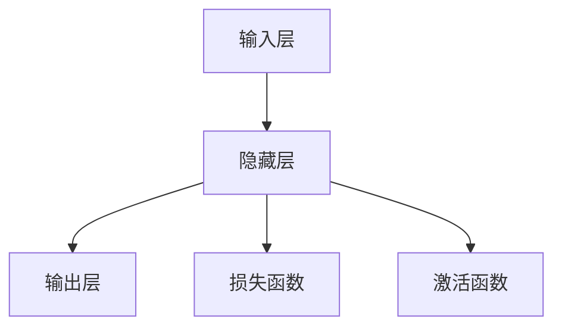
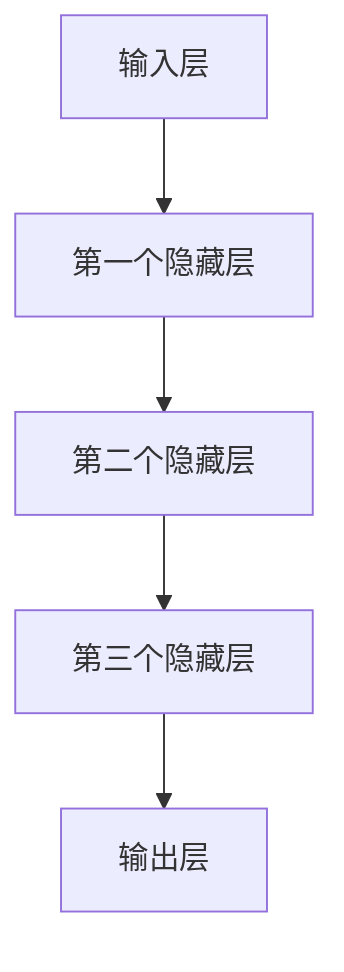
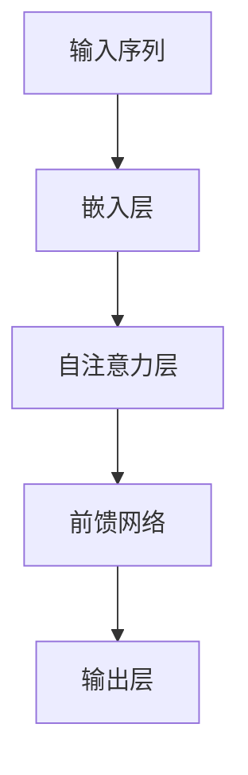
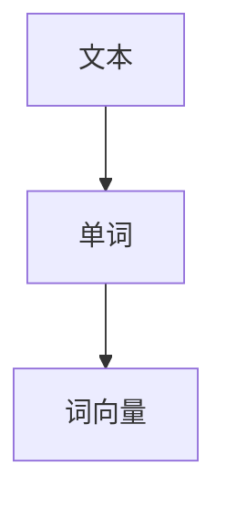
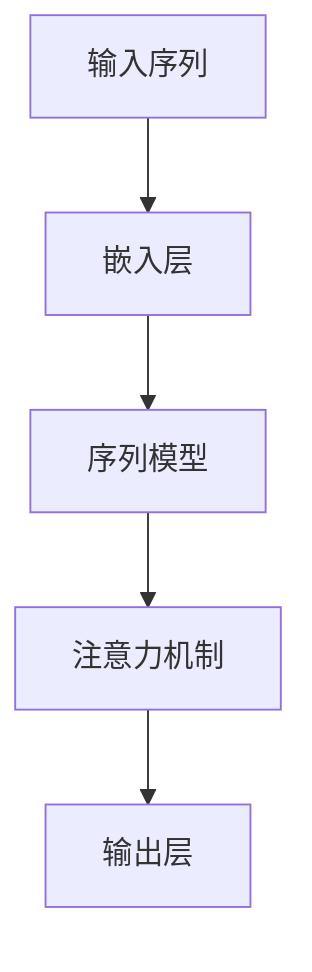
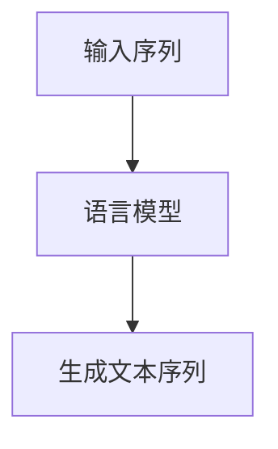

                 

# 跨语言AI开发平台：Lepton AI的多语言支持

## 关键词：
- 跨语言AI
- Lepton AI
- 多语言支持
- 数据预处理
- 模型训练与优化
- 模型部署与推理

## 摘要：
本文将深入探讨跨语言AI开发平台Lepton AI的多语言支持功能。首先，我们将介绍跨语言AI开发平台的核心概念和联系，以及Lepton AI的架构。接着，我们将详细讲解数据预处理、模型训练与优化、模型部署与推理的核心算法原理，并使用伪代码进行阐述。此外，本文还将介绍自然语言处理、语音识别与合成、图像识别与处理、跨语言文本翻译等应用场景。最后，我们将探讨多语言支持的挑战与未来发展趋势，并总结全文。

## 第一部分：核心概念与联系

### 跨语言AI开发平台：Lepton AI的多语言支持

跨语言AI开发平台是一种支持多种编程语言的开发环境，它为开发者提供了统一的API来构建、训练和部署多语言AI模型。这种平台的主要目的是降低开发者的工作负担，提高开发效率，并确保模型在不同编程语言环境中的兼容性和可维护性。

#### 核心概念：

- **跨语言AI开发平台**：一种支持多种编程语言的开发平台，能够帮助开发者更轻松地构建和部署多语言AI模型。
- **Lepton AI**：一种跨语言AI开发平台，具备多语言支持能力，包括数据预处理、模型训练与优化、模型部署与推理等功能。
- **多语言支持**：指系统能够处理和理解多种编程语言，使得开发者能够用不同的编程语言开发AI应用。

#### 架构：

Lepton AI的架构主要包括以下几个模块：

1. **数据预处理**：包括文本数据预处理、语音数据预处理、图像数据预处理等。
2. **模型训练与优化**：使用神经网络、深度学习等技术训练模型，并通过交叉验证、超参数调优等手段优化模型性能。
3. **模型部署与推理**：支持多种部署方式，如本地部署、云端部署、嵌入式部署等，并提供高效的推理服务。

#### 联系：

跨语言AI开发平台提供了多语言支持，使得开发者可以更容易地使用不同编程语言构建AI应用。Lepton AI的多语言支持能力使得开发者可以在不同的编程环境中使用统一的API进行数据预处理、模型训练与优化、模型部署与推理等操作。多语言支持不仅仅是技术实现的问题，还涉及到开发者的开发体验和项目的可维护性。

## 第二部分：核心算法原理讲解

### 神经网络与深度学习基础

#### 神经网络的基本结构

神经网络（Neural Network，NN）是一种模拟人脑神经元连接和通信的计算模型。它是深度学习（Deep Learning，DL）的基础。一个基本的神经网络通常由三个主要部分组成：输入层、隐藏层和输出层。

**Mermaid 流程图：**



**伪代码：**

```python
# 神经网络基本结构
class NeuralNetwork:
    def __init__(self, input_size, hidden_size, output_size):
        # 初始化参数
        self.input_size = input_size
        self.hidden_size = hidden_size
        self.output_size = output_size
        # 初始化权重和偏置
        self.weights_input_to_hidden = np.random.randn(input_size, hidden_size)
        self.biases_hidden = np.random.randn(hidden_size)
        self.weights_hidden_to_output = np.random.randn(hidden_size, output_size)
        self.biases_output = np.random.randn(output_size)

    def forward(self, x):
        # 前向传播
        self.hidden_layer = sigmoid(np.dot(x, self.weights_input_to_hidden) + self.biases_hidden)
        self.output = sigmoid(np.dot(self.hidden_layer, self.weights_hidden_to_output) + self.biases_output)
        return self.output

    def backward(self, x, y):
        # 反向传播
        output_error = self.output - y
        hidden_error = output_error.dot(self.weights_hidden_to_output.T) * sigmoid_derivative(self.hidden_layer)

        d_weights_input_to_hidden = np.dot(x.T, hidden_error)
        d_biases_hidden = np.sum(hidden_error, axis=0)
        d_weights_hidden_to_output = np.dot(self.hidden_layer.T, output_error)
        d_biases_output = np.sum(output_error, axis=0)

        # 更新参数
        self.weights_input_to_hidden -= learning_rate * d_weights_input_to_hidden
        self.biases_hidden -= learning_rate * d_biases_hidden
        self.weights_hidden_to_output -= learning_rate * d_weights_hidden_to_output
        self.biases_output -= learning_rate * d_biases_output

# 激活函数
def sigmoid(x):
    return 1 / (1 + np.exp(-x))

# 激活函数的导数
def sigmoid_derivative(x):
    return x * (1 - x)
```

#### 深度学习架构

深度学习架构包括多个层次，每个层次都可以是多个神经元的集合。常见的深度学习模型包括卷积神经网络（Convolutional Neural Network，CNN）、循环神经网络（Recurrent Neural Network，RNN）、变换器网络（Transformer）等。

**Mermaid 流程图：**



**伪代码：**

```python
# 深度学习模型
class DeepNeuralNetwork:
    def __init__(self, input_size, hidden_sizes, output_size):
        # 初始化参数
        self.input_size = input_size
        self.hidden_sizes = hidden_sizes
        self.output_size = output_size
        # 初始化权重和偏置
        self.weights = [np.random.randn(prev_size, size) for prev_size, size in zip([input_size] + hidden_sizes, hidden_sizes + [output_size])]
        self.biases = [np.random.randn(size) for size in hidden_sizes + [output_size]]

    def forward(self, x):
        # 前向传播
        self.z = x
        for i, (weights, biases) in enumerate(zip(self.weights, self.biases)):
            self.z = sigmoid(np.dot(self.z, weights) + biases)
        self.output = self.z[-1]
        return self.output

    def backward(self, x, y):
        # 反向传播
        output_error = self.output - y
        for i in reversed(range(len(self.weights))):
            weights, biases = self.weights[i], self.biases[i]
            hidden_error = output_error.dot(weights.T) * sigmoid_derivative(self.z[i])
            self.weights[i] -= learning_rate * hidden_error.dot(self.z[i - 1].T)
            self.biases[i] -= learning_rate * np.sum(hidden_error, axis=0)
            output_error = hidden_error

# 激活函数
def sigmoid(x):
    return 1 / (1 + np.exp(-x))

# 激活函数的导数
def sigmoid_derivative(x):
    return x * (1 - x)
```

#### 常见的深度学习架构

- **卷积神经网络（CNN）**：适用于图像识别任务，通过卷积操作提取图像特征。

- **循环神经网络（RNN）**：适用于序列数据，可以处理时间序列、自然语言等。

- **变换器网络（Transformer）**：基于自注意力机制的架构，广泛应用于自然语言处理领域。

**Mermaid 流程图：**



**伪代码：**

```python
# 自注意力机制
class SelfAttentionLayer:
    def __init__(self, d_model):
        # 初始化参数
        self.d_model = d_model
        self.query_linear = nn.Linear(d_model, d_model)
        self.key_linear = nn.Linear(d_model, d_model)
        self.value_linear = nn.Linear(d_model, d_model)
        self.out_linear = nn.Linear(d_model, d_model)

    def forward(self, query, key, value, mask=None):
        # 前向传播
        query = self.query_linear(query)
        key = self.key_linear(key)
        value = self.value_linear(value)

        attention_scores = torch.matmul(query, key.transpose(-2, -1)) / math.sqrt(self.d_model)
        if mask is not None:
            attention_scores = attention_scores.masked_fill(mask == 0, float("-inf"))
        attention_weights = torch.softmax(attention_scores, dim=-1)
        attention_output = torch.matmul(attention_weights, value)
        output = self.out_linear(attention_output)
        return output

# 前馈网络
class FeedForwardLayer:
    def __init__(self, d_model, d_ff):
        # 初始化参数
        self.d_model = d_model
        self.d_ff = d_ff
        self.linear1 = nn.Linear(d_model, d_ff)
        self.linear2 = nn.Linear(d_ff, d_model)

    def forward(self, x):
        # 前向传播
        x = self.linear1(x)
        x = nn.functional.relu(x)
        x = self.linear2(x)
        return x
```

### 深度学习优化算法

深度学习优化算法是用于调整神经网络模型参数的方法，以最小化损失函数并提高模型性能。

**常见的优化算法：**

1. **随机梯度下降（SGD）**
2. **动量（Momentum）**
3. **自适应梯度算法（Adagrad）**
4. **RMSprop**
5. **Adam优化器**

**伪代码：**

```python
# 随机梯度下降（SGD）
def sgd(parameters, gradients, learning_rate):
    for parameter, gradient in zip(parameters, gradients):
        parameter.data -= learning_rate * gradient.data

# 动量（Momentum）
def momentum(parameters, gradients, velocity, momentum):
    velocity = momentum * velocity - learning_rate * gradients
    for parameter in parameters:
        parameter.data += velocity

# 自适应梯度算法（Adagrad）
def adagrad(parameters, gradients, cache):
    for parameter, gradient in zip(parameters, gradients):
        cache[parameter] += gradient ** 2
        parameter.data -= learning_rate * gradient / (np.sqrt(cache[parameter]) + 1e-8)

# RMSprop
def rmsprop(parameters, gradients, cache, decay_rate):
    for parameter, gradient in zip(parameters, gradients):
        cache[parameter] = decay_rate * cache[parameter] + (1 - decay_rate) * gradient ** 2
        parameter.data -= learning_rate * gradient / (np.sqrt(cache[parameter]) + 1e-8)

# Adam优化器
def adam(parameters, gradients, first_moment_estimate, second_moment_estimate, beta1, beta2, learning_rate):
    first_moment_estimate = beta1 * first_moment_estimate + (1 - beta1) * gradients
    second_moment_estimate = beta2 * second_moment_estimate + (1 - beta2) * gradients ** 2
    first_moment_estimate_hat = first_moment_estimate / (1 - beta1 ** t)
    second_moment_estimate_hat = second_moment_estimate / (1 - beta2 ** t)
    for parameter in parameters:
        parameter.data -= learning_rate * first_moment_estimate_hat / (np.sqrt(second_moment_estimate_hat) + 1e-8)
```

#### 随机梯度下降（SGD）

随机梯度下降是一种简单的优化算法，它通过计算每个样本的梯度来更新模型参数。

**伪代码：**

```python
# 随机梯度下降（SGD）
for epoch in range(num_epochs):
    for sample in dataset:
        gradients = compute_gradients(model, sample)
        sgd(model.parameters(), gradients, learning_rate)
```

#### 动量（Momentum）

动量优化算法通过保留之前梯度的一部分，减少梯度消失和梯度爆炸问题，提高优化过程稳定性。

**伪代码：**

```python
# 动量（Momentum）
velocity = 0
for epoch in range(num_epochs):
    for sample in dataset:
        gradients = compute_gradients(model, sample)
        velocity = momentum * velocity - learning_rate * gradients
        for parameter in model.parameters():
            parameter.data += velocity
```

#### 自适应梯度算法（Adagrad）

Adagrad优化算法通过自适应地调整学习率，对每个参数进行加权更新。

**伪代码：**

```python
# 自适应梯度算法（Adagrad）
cache = {}
for epoch in range(num_epochs):
    for sample in dataset:
        gradients = compute_gradients(model, sample)
        for parameter, gradient in zip(model.parameters(), gradients):
            cache[parameter] += gradient ** 2
            parameter.data -= learning_rate * gradient / (np.sqrt(cache[parameter]) + 1e-8)
```

#### RMSprop

RMSprop优化算法通过使用梯度历史信息的指数加权平均，动态调整学习率。

**伪代码：**

```python
# RMSprop
cache = {}
decay_rate = 0.9
for epoch in range(num_epochs):
    for sample in dataset:
        gradients = compute_gradients(model, sample)
        for parameter, gradient in zip(model.parameters(), gradients):
            cache[parameter] = decay_rate * cache[parameter] + (1 - decay_rate) * gradient ** 2
            parameter.data -= learning_rate * gradient / (np.sqrt(cache[parameter]) + 1e-8)
```

#### Adam优化器

Adam优化器结合了Adagrad和RMSprop的优点，使用一阶和二阶矩估计来自适应调整学习率。

**伪代码：**

```python
# Adam优化器
first_moment_estimate = 0
second_moment_estimate = 0
beta1 = 0.9
beta2 = 0.99
for epoch in range(num_epochs):
    for sample in dataset:
        gradients = compute_gradients(model, sample)
        first_moment_estimate = beta1 * first_moment_estimate + (1 - beta1) * gradients
        second_moment_estimate = beta2 * second_moment_estimate + (1 - beta2) * gradients ** 2
        first_moment_estimate_hat = first_moment_estimate / (1 - beta1 ** t)
        second_moment_estimate_hat = second_moment_estimate / (1 - beta2 ** t)
        for parameter in model.parameters():
            parameter.data -= learning_rate * first_moment_estimate_hat / (np.sqrt(second_moment_estimate_hat) + 1e-8)
```

### 自然语言处理技术概览

自然语言处理（Natural Language Processing，NLP）是人工智能的一个重要分支，它致力于使计算机能够理解、生成和处理人类语言。NLP技术广泛应用于文本分类、情感分析、机器翻译、语音识别等领域。

#### 词嵌入技术

词嵌入（Word Embedding）是将文本中的单词映射到低维向量空间的技术，有助于提高文本数据的表示能力。

**Mermaid 流程图：**



**伪代码：**

```python
# 词嵌入
class WordEmbedding:
    def __init__(self, vocabulary_size, embedding_size):
        self.vocabulary_size = vocabulary_size
        self.embedding_size = embedding_size
        self.weight = nn.Embedding(vocabulary_size, embedding_size)

    def forward(self, sentence):
        return self.weight(sentence)
```

#### 序列模型与注意力机制

序列模型（Sequence Model）是处理序列数据的常用模型，而注意力机制（Attention Mechanism）可以增强模型对序列中关键信息的关注。

**Mermaid 流程图：**



**伪代码：**

```python
# 序列模型与注意力机制
class SequenceModelWithAttention:
    def __init__(self, embedding_size, hidden_size):
        self.embedding = nn.Embedding(vocabulary_size, embedding_size)
        self.lstm = nn.LSTM(embedding_size, hidden_size, batch_first=True)
        self.attention = AttentionLayer(hidden_size)
        self.fc = nn.Linear(hidden_size, output_size)

    def forward(self, sentence, hidden=None):
        embedded = self.embedding(sentence)
        output, hidden = self.lstm(embedded, hidden)
        attention_weights = self.attention(output)
        contextual_vector = torch.sum(attention_weights * output, dim=1)
        output = self.fc(contextual_vector)
        return output
```

#### 转换器架构详解

转换器（Transformer）是一种基于自注意力机制的深度学习模型，广泛应用于自然语言处理领域。

**Mermaid 流程图：**


**伪代码：**

```python
# 转换器模型
class Transformer:
    def __init__(self, d_model, num_heads, d_ff):
        self.embedding = nn.Embedding(vocabulary_size, d_model)
        self.pos_embedding = nn.Parameter(torch.randn(1, max_sequence_length, d_model))
        self.transformer_layers = nn.ModuleList([
            TransformerLayer(d_model, num_heads, d_ff)
            for _ in range(num_layers)
        ])
        self.fc = nn.Linear(d_model, output_size)

    def forward(self, sentence, hidden=None):
        embedded = self.embedding(sentence) + self.pos_embedding[:sentence.size(1), :]
        for layer in self.transformer_layers:
            embedded = layer(embedded)
        output = self.fc(embedded)
        return output
```

#### 语言模型与生成式模型

语言模型（Language Model）用于预测下一个单词，生成式模型（Generative Model）可以生成文本序列。

**Mermaid 流程图：**



**伪代码：**

```python
# 语言模型
class LanguageModel:
    def __init__(self, embedding_size, hidden_size):
        self.embedding = nn.Embedding(vocabulary_size, embedding_size)
        self.lstm = nn.LSTM(embedding_size, hidden_size, batch_first=True)
        self.fc = nn.Linear(hidden_size, vocabulary_size)

    def forward(self, sentence, hidden=None):
        embedded = self.embedding(sentence)
        output, hidden = self.lstm(embedded, hidden)
        logits = self.fc(output)
        return logits, hidden

# 生成文本序列
class TextGenerator:
    def __init__(self, language_model, start_token, end_token):
        self.language_model = language_model
        self.start_token = start_token
        self.end_token = end_token

    def generate_text(self, max_length):
        sentence = torch.tensor([self.start_token])
        hidden = None
        generated_text = []

        for _ in range(max_length):
            logits, hidden = self.language_model(sentence, hidden)
            prob = F.softmax(logits,

