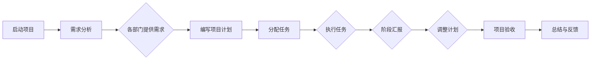
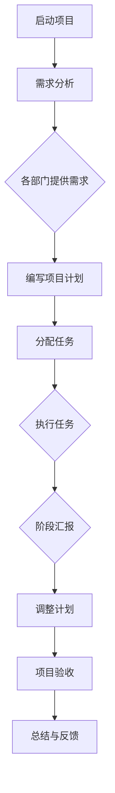

                 

# 《跨部门协作：打破沟通壁垒》

## 概述

> 关键词：跨部门协作、沟通壁垒、团队建设、流程优化、领导力、案例研究

在现代企业中，跨部门协作已成为提升效率、促进创新的关键环节。随着企业规模的扩大和业务复杂度的增加，各个部门之间的沟通与协作变得越来越重要。然而，由于部门利益、工作性质、沟通方式的差异，跨部门协作常常面临沟通壁垒，导致项目进度延误、资源浪费、团队合作受阻。本文将深入探讨跨部门协作的重要性、沟通的基本原则、文化建设、流程与工具、领导力以及实际案例，旨在为读者提供一套完整的跨部门协作解决方案。

## 摘要

本文旨在解决企业中普遍存在的跨部门协作问题，通过探讨跨部门协作的重要性、沟通的基本原则、文化建设、流程与工具、领导力以及实际案例，帮助企业和团队打破沟通壁垒，实现高效协作。文章首先介绍了跨部门协作的定义与意义，以及企业中跨部门协作的挑战。接着，文章阐述了有效沟通的重要性，分析了沟通中的障碍与误解，并提出了提高跨部门沟通效果的方法。随后，文章重点讨论了跨部门协作的文化建设，包括协作文化的概念与作用，建立协同工作的企业文化以及团队建设。文章还介绍了跨部门协作的流程与工具，包括流程的设计、常用协作工具的介绍以及文档管理。此外，文章探讨了跨部门协作中的领导力，包括领导在跨部门协作中的角色、提升跨部门协作的领导技能以及团队管理。最后，文章通过实际案例研究，展示了跨部门协作的成功实践，并提出了跨部门协作的评估与改进方法。通过本文的探讨，希望为企业提供一套实用的跨部门协作解决方案，助力企业实现高效运作。

## 目录

### 第一部分：理解跨部门协作的重要性

#### 第1章：跨部门协作的必要性

1.1 跨部门协作的定义与意义  
1.2 企业中跨部门协作的挑战  
1.3 跨部门协作的重要性

#### 第2章：跨部门沟通的基本原则

2.1 有效沟通的重要性  
2.2 沟通中的障碍与误解  
2.3 提高跨部门沟通效果的方法

#### 第3章：跨部门协作的文化建设

3.1 协作文化的概念与作用  
3.2 建立协同工作的企业文化  
3.3 跨部门协作的团队建设

#### 第4章：跨部门协作的流程与工具

4.1 跨部门协作流程的设计  
4.2 常用协作工具的介绍  
4.3 跨部门协作中的文档管理

#### 第5章：跨部门协作中的领导力

5.1 领导在跨部门协作中的角色  
5.2 提升跨部门协作的领导技能  
5.3 跨部门协作中的团队管理

#### 第6章：跨部门协作案例研究

6.1 案例一：产品开发的跨部门协作  
6.2 案例二：市场营销的跨部门协作  
6.3 案例三：客户服务的跨部门协作

#### 第7章：跨部门协作的评估与改进

7.1 跨部门协作效果的评估方法  
7.2 跨部门协作的持续改进  
7.3 跨部门协作的未来趋势与展望

### 附录

附录A：跨部门协作资源与工具推荐

附录B：Mermaid流程图示例

### 作者

作者：AI天才研究院/AI Genius Institute & 禅与计算机程序设计艺术 /Zen And The Art of Computer Programming

## 第一部分：理解跨部门协作的重要性

### 第1章：跨部门协作的必要性

在当今这个快速变化、竞争激烈的市场环境中，企业要想保持竞争优势，必须具备高效的组织运作能力和灵活的应变能力。跨部门协作作为企业运营的重要组成部分，对企业的长远发展具有重要的影响。本文将首先探讨跨部门协作的定义与意义，随后分析企业中跨部门协作的挑战，最后阐述跨部门协作的重要性。

### 1.1 跨部门协作的定义与意义

跨部门协作是指在企业内部，不同部门之间为了共同实现业务目标，通过信息交流、资源共享、任务分担等方式进行的合作行为。跨部门协作不仅涉及不同部门之间的沟通与协调，还涉及跨职能团队的建设和跨文化管理的实践。

跨部门协作的意义主要体现在以下几个方面：

1. 提高企业运营效率

跨部门协作可以打破部门壁垒，实现资源的高效配置和优化利用。通过跨部门协作，企业可以更好地整合内部资源，提高生产效率和服务质量，从而降低成本，提高利润。

2. 促进创新与发展

跨部门协作可以促进知识共享和经验交流，激发员工的创造力和创新精神。不同部门之间的合作可以带来新的思路和方法，促进企业在产品研发、市场拓展、管理优化等方面的创新。

3. 增强团队凝聚力

跨部门协作可以增强团队之间的信任和合作意识，提高员工的归属感和认同感。通过跨部门协作，员工可以更好地了解企业的整体目标和各部门的运作方式，从而增强对企业文化的认同感和忠诚度。

4. 提升企业竞争力

跨部门协作可以帮助企业更好地应对市场变化和竞争压力，提升企业的应变能力和竞争力。通过跨部门协作，企业可以快速响应市场需求，调整产品策略和营销策略，从而在竞争中占据优势地位。

### 1.2 企业中跨部门协作的挑战

尽管跨部门协作对企业的发展具有重要意义，但在实际操作中，企业往往会面临以下挑战：

1. 部门利益冲突

企业中各个部门都有自己的目标和职责，部门利益往往会相互冲突。在跨部门协作中，如何平衡不同部门之间的利益，确保协作目标的实现，是企业管理者需要面对的难题。

2. 沟通障碍

不同部门之间的沟通往往存在障碍，包括语言、文化、工作方式等方面的差异。这些障碍会导致信息传递不畅，影响协作效果。

3. 跨文化管理

企业中的跨部门协作往往涉及不同文化背景的员工。如何有效管理跨文化团队，促进团队成员之间的相互理解和信任，是企业管理者需要解决的问题。

4. 权力分配

在跨部门协作中，权力分配的合理性直接影响协作效果。如何合理分配权力，确保各部门在协作中的平等地位，是企业管理者需要关注的问题。

5. 协作流程不规范

企业中跨部门协作的流程往往不规范，协作任务分配不明确，协作责任不清晰。这会导致协作效率低下，甚至影响项目的顺利进行。

### 1.3 跨部门协作的重要性

跨部门协作对于企业的成功运营至关重要。以下是跨部门协作的重要性总结：

1. 提高工作效率

跨部门协作可以整合企业内部资源，提高工作效率。通过明确协作目标和任务分工，企业可以避免重复劳动，减少资源浪费，从而提高整体运营效率。

2. 促进创新思维

跨部门协作可以促进不同部门之间的知识共享和思维碰撞，激发创新思维。企业可以借助跨部门协作，发现新的业务机会，推动企业创新发展。

3. 增强团队凝聚力

跨部门协作可以增强团队之间的信任和合作意识，提高员工的归属感和认同感。通过跨部门协作，员工可以更好地了解企业的整体目标和各部门的运作方式，从而增强对企业文化的认同感和忠诚度。

4. 提升企业竞争力

跨部门协作可以帮助企业更好地应对市场变化和竞争压力，提升企业的应变能力和竞争力。通过跨部门协作，企业可以快速响应市场需求，调整产品策略和营销策略，从而在竞争中占据优势地位。

总之，跨部门协作是现代企业成功运营的关键要素。企业需要高度重视跨部门协作，采取有效措施，解决协作中的挑战，实现各部门的协同作战，从而推动企业持续发展。

### 第2章：跨部门沟通的基本原则

跨部门沟通是跨部门协作的核心，有效的跨部门沟通能够促进信息的传递、任务的协调和团队的合作。然而，在实际操作中，跨部门沟通常常受到各种障碍的影响，导致信息传递不畅、误解频发。为了克服这些障碍，提高跨部门沟通的效果，我们需要遵循一些基本原则。

#### 2.1 有效沟通的重要性

有效沟通是企业运营的基础，对于跨部门协作尤为重要。有效的沟通可以确保信息的准确传递，避免误解和冲突，提高团队的协作效率。以下是有效沟通在跨部门协作中的几个关键作用：

1. **提高协作效率**：有效的沟通可以确保团队成员了解各自的任务和责任，避免因信息不对称导致的重复工作和资源浪费。

2. **减少误解和冲突**：良好的沟通可以减少因信息不对称、沟通不畅导致的误解和冲突，提高团队的凝聚力和合作意愿。

3. **促进知识共享**：通过有效的沟通，团队成员可以分享知识和经验，促进知识的传递和积累，推动团队的创新和发展。

4. **提升决策质量**：跨部门沟通可以确保不同部门在决策过程中能够获取全面的信息，从而做出更明智的决策。

#### 2.2 沟通中的障碍与误解

尽管跨部门沟通的重要性显而易见，但在实际操作中，跨部门沟通常常面临以下障碍和误解：

1. **部门利益冲突**：不同部门往往有不同的目标和利益，这些差异可能导致沟通中的障碍，影响协作效果。

2. **信息不对称**：由于部门之间的信息传递不畅，不同部门可能对同一问题有不同的理解，导致沟通中的误解。

3. **文化差异**：企业中的跨部门沟通往往涉及不同文化背景的员工，文化差异可能导致沟通障碍，影响沟通效果。

4. **沟通方式不当**：不恰当的沟通方式，如使用过于专业或含糊不清的语言，可能导致误解和沟通障碍。

5. **沟通渠道不畅**：企业内部的沟通渠道不畅通，信息传递不及时，也会影响跨部门沟通的效果。

#### 2.3 提高跨部门沟通效果的方法

为了提高跨部门沟通的效果，企业可以采取以下措施：

1. **明确沟通目标**：在跨部门沟通前，明确沟通的目标和预期成果，确保沟通有明确的导向。

2. **建立有效的沟通渠道**：企业应建立畅通的沟通渠道，确保信息的及时传递和反馈。

3. **促进信息共享**：鼓励不同部门之间的信息共享，确保各部门能够获取到所需的信息。

4. **建立跨部门会议机制**：定期召开跨部门会议，讨论和解决协作中的问题，促进部门之间的沟通和协作。

5. **提供沟通培训**：为员工提供沟通技巧和跨文化沟通的培训，提高员工的沟通能力。

6. **使用协作工具**：利用现代化协作工具，如即时通讯工具、项目管理软件等，提高沟通效率。

7. **建立沟通反馈机制**：建立沟通反馈机制，及时了解沟通效果，根据反馈进行调整。

通过遵循这些基本原则和方法，企业可以克服跨部门沟通中的障碍，提高沟通效果，从而实现高效协作，推动企业的发展。

### 第3章：跨部门协作的文化建设

跨部门协作不仅依赖于有效的沟通，还需要建立在协同工作的企业文化基础之上。协作文化是一种价值观和行为模式，它鼓励员工跨越部门界限，共同努力实现企业目标。本章将探讨协作文化的概念与作用，以及如何建立协同工作的企业文化和团队建设。

#### 3.1 协作文化的概念与作用

协作文化是一种以共同目标为导向，鼓励团队合作和知识共享的文化。它强调企业内部各部门之间的相互依赖和合作，促进员工之间的信任和尊重。以下是协作文化的几个核心概念：

1. **共同目标**：协作文化要求员工明确企业目标，将个人目标与团队目标相结合，以实现企业整体目标。

2. **团队合作**：协作文化鼓励员工积极参与团队活动，共同解决问题，分享成功和失败。

3. **知识共享**：协作文化倡导知识共享，促进员工之间经验的交流和技能的提升。

4. **相互尊重**：协作文化强调各部门之间的平等和尊重，鼓励员工以开放的心态面对不同的观点和建议。

协作文化在企业中的作用不可忽视，它有助于提高企业的整体协作效率，增强员工的归属感和满意度。以下是协作文化在跨部门协作中的几个重要作用：

1. **提高协作效率**：协作文化可以减少部门之间的隔阂和摩擦，提高协作效率，加快项目进度。

2. **促进知识共享**：协作文化鼓励员工分享知识和经验，促进知识的传递和积累，为企业的持续创新提供支持。

3. **增强团队凝聚力**：协作文化可以增强员工的团队意识，提高员工的合作意愿和团队凝聚力。

4. **提升企业竞争力**：协作文化可以增强企业的整体协作能力，提高企业在市场中的竞争力。

#### 3.2 建立协同工作的企业文化

建立协同工作的企业文化需要从以下几个方面入手：

1. **制定明确的价值观**：企业应制定明确的价值观，如团队合作、知识共享、相互尊重等，并将其融入企业文化和日常工作中。

2. **领导者带头示范**：企业领导者应以身作则，积极参与跨部门协作，推动协作文化的实施。

3. **加强员工培训**：企业应提供跨部门沟通和协作技巧的培训，帮助员工掌握协作所需的知识和技能。

4. **设立协作机制**：企业应建立跨部门协作的机制，如定期召开跨部门会议、设立协作项目组等，促进部门之间的沟通和协作。

5. **激励与表彰**：企业应对积极参与跨部门协作的员工进行激励和表彰，鼓励更多员工参与到协作中来。

#### 3.3 跨部门协作的团队建设

团队建设是跨部门协作的重要环节，一个高效的团队可以显著提高跨部门协作的效果。以下是团队建设的几个关键步骤：

1. **明确团队目标**：团队建设的第一步是明确团队的目标，确保团队成员对团队的目标和任务有清晰的认识。

2. **建立信任关系**：团队建设的关键在于建立团队成员之间的信任关系。企业可以通过团队建设活动，如户外拓展、内部培训等，增强团队成员之间的信任。

3. **分配合理职责**：在团队建设中，企业应确保每个成员都有明确的职责和任务，避免职责不清导致的效率低下。

4. **促进知识共享**：企业应鼓励团队成员分享知识和经验，建立知识共享的平台，如内部论坛、知识库等，促进团队成员之间的学习。

5. **建立反馈机制**：团队建设过程中，企业应建立反馈机制，及时了解团队成员的意见和建议，根据反馈进行调整。

通过建立协同工作的企业文化，加强团队建设，企业可以促进跨部门协作的顺利进行，提高整体的协作效率和创新能力，从而实现企业的长远发展。

### 第4章：跨部门协作的流程与工具

跨部门协作的效率不仅取决于团队的合作精神和沟通能力，还与协作流程的设计和工具的使用密切相关。本章将详细探讨跨部门协作流程的设计、常用协作工具的介绍以及文档管理。

#### 4.1 跨部门协作流程的设计

跨部门协作流程的设计是确保协作顺利进行的重要环节。一个合理、明确的协作流程可以有效地减少沟通障碍，提高协作效率。以下是设计跨部门协作流程的几个关键步骤：

1. **明确协作目标**：在开始设计协作流程之前，首先要明确协作的目标和预期成果。这有助于确保所有参与部门都朝着共同的方向努力。

2. **分析协作需求**：分析各个部门的协作需求，了解不同部门在协作过程中的关键任务和责任。这有助于确保流程的合理性和可行性。

3. **制定流程图**：利用流程图工具，如Mermaid、Visio等，将协作流程可视化。流程图应包括协作的各个阶段、涉及的部门和人员、任务分工和责任分配等。

4. **设定时间节点**：在流程图中设定关键时间节点，确保每个任务都有明确的时间要求，避免项目延误。

5. **流程审核与优化**：将流程图提交给相关部门和人员审核，根据反馈进行优化和调整。流程图应确保所有参与部门都能理解和接受。

6. **执行与监控**：在协作流程实施过程中，进行实时监控和反馈，确保流程的执行情况。根据实际情况进行必要的调整和优化。

以下是一个简化的跨部门协作流程图示例：

#### 4.2 常用协作工具的介绍

在现代企业中，协作工具的使用可以显著提高跨部门协作的效率。以下是一些常用的协作工具及其特点：

1. **即时通讯工具**：如Slack、Microsoft Teams、WhatsApp等，这些工具提供了即时沟通和协作的功能，方便团队成员之间的实时交流和问题解决。

2. **项目管理软件**：如Trello、Jira、Asana等，这些工具可以帮助团队管理项目任务、进度和资源，提高协作效率。

3. **文档管理工具**：如Google Docs、Dropbox、OneDrive等，这些工具提供了文档共享、协作编辑和版本控制的功能，方便团队成员共同编辑和更新文档。

4. **视频会议工具**：如Zoom、Microsoft Teams、Google Meet等，这些工具提供了远程视频会议和协作讨论的功能，方便团队成员进行跨地域的沟通和协作。

5. **知识库工具**：如Confluence、Notion等，这些工具提供了知识共享和知识管理的功能，方便团队成员获取和共享重要信息和经验。

#### 4.3 跨部门协作中的文档管理

文档管理是跨部门协作的重要组成部分，有效的文档管理可以提高协作效率，减少信息丢失和误解。以下是跨部门协作中文档管理的几个关键点：

1. **建立文档共享平台**：企业应建立统一的文档共享平台，如企业内部网、云存储等，确保文档的安全共享和版本控制。

2. **明确文档格式和命名规范**：企业应制定统一的文档格式和命名规范，方便团队成员快速查找和识别文档。

3. **文档更新与审批流程**：企业应建立文档更新和审批流程，确保文档的准确性和及时性。

4. **备份与恢复机制**：企业应定期备份文档，并建立文档恢复机制，确保文档的安全性和可靠性。

5. **权限管理**：企业应根据团队成员的职责和权限，设置文档的访问和编辑权限，确保文档的安全和保密。

通过设计合理的跨部门协作流程、选择合适的协作工具以及建立有效的文档管理机制，企业可以显著提高跨部门协作的效率和质量，从而实现企业的长期发展目标。

### 第5章：跨部门协作中的领导力

跨部门协作的顺利进行离不开有效的领导力。领导者在跨部门协作中扮演着关键角色，他们需要具备独特的技能和素质，以确保协作目标的实现。本章将探讨领导者在跨部门协作中的角色、提升跨部门协作的领导技能以及团队管理。

#### 5.1 领导在跨部门协作中的角色

领导者在跨部门协作中具有以下几个关键角色：

1. **协调者**：领导者需要协调不同部门之间的工作，确保任务分配合理，资源充分利用。他们需要平衡各部门的利益，解决协作中的冲突和问题。

2. **沟通桥梁**：领导者是跨部门沟通的桥梁，他们需要确保信息在部门之间准确、及时地传递，避免误解和沟通障碍。他们需要具备良好的沟通技巧和沟通策略。

3. **激励者**：领导者需要激励团队成员，激发他们的工作热情和创造力。他们需要设定明确的目标和期望，提供必要的支持和资源，帮助团队成员克服困难，完成任务。

4. **决策者**：领导者需要在不同部门之间做出决策，解决协作中的问题。他们需要具备决策能力和判断力，确保决策符合整体利益，推动协作的顺利进行。

5. **变革推动者**：在跨部门协作中，领导者需要推动变革，鼓励团队成员接受新的工作方式和流程。他们需要具备变革管理能力，引导团队成员适应变革，实现协作的优化。

#### 5.2 提升跨部门协作的领导技能

为了提升跨部门协作的领导技能，领导者可以从以下几个方面入手：

1. **增强沟通能力**：领导者需要不断提升沟通能力，学会倾听、表达和解释。他们可以通过参加沟通培训、阅读相关书籍和文章等方式，提高自己的沟通技巧。

2. **培养团队合作精神**：领导者需要培养团队合作精神，鼓励团队成员相互支持、相互尊重。他们可以通过组织团队建设活动、设立团队目标等方式，增强团队成员之间的信任和合作。

3. **掌握冲突管理技巧**：领导者需要掌握冲突管理技巧，学会在跨部门协作中处理冲突。他们可以通过建立公平的冲突解决机制、提供中立的意见和建议等方式，化解冲突，推动协作的顺利进行。

4. **提高决策能力**：领导者需要提高决策能力，学会在不同部门之间做出明智的决策。他们可以通过收集和分析信息、咨询相关部门的意见等方式，提高决策的准确性和有效性。

5. **培养领导风格**：领导者需要培养适合自己的领导风格，根据不同的情况和团队需求，灵活调整领导方式。他们可以通过了解自己的优势和劣势、观察其他领导者的领导方式等方式，找到适合自己的领导风格。

#### 5.3 跨部门协作中的团队管理

跨部门协作中的团队管理是一个复杂而重要的任务。以下是团队管理中需要关注的一些关键点：

1. **明确团队目标**：团队管理首先需要明确团队的目标和任务，确保团队成员对任务有清晰的认识。这有助于提高团队的凝聚力和执行力。

2. **合理分工**：团队管理需要根据团队成员的能力和特长，合理分配任务。这有助于提高团队的工作效率，避免资源浪费。

3. **有效沟通**：团队管理需要建立有效的沟通机制，确保团队成员之间的信息传递畅通无阻。这有助于减少误解和冲突，提高协作效率。

4. **激励与激励**：团队管理需要关注团队成员的激励和激励。通过设立合理的激励政策，可以提高团队成员的工作积极性和创造力。

5. **反馈与改进**：团队管理需要及时收集团队成员的反馈，根据反馈进行改进和优化。这有助于提高团队的整体绩效，实现协作目标。

6. **培养团队文化**：团队管理需要培养团队文化，鼓励团队成员相互支持、相互学习。这有助于建立团队的归属感和认同感，提高团队的凝聚力和协作能力。

通过提升领导技能和加强团队管理，领导者可以有效地推动跨部门协作的顺利进行，实现企业的整体目标。

### 第6章：跨部门协作案例研究

为了更好地理解跨部门协作的实际应用，下面我们将通过三个案例来探讨不同部门如何通过跨部门协作实现项目的成功。这些案例分别来自于产品开发、市场营销和客户服务领域，展示了跨部门协作在不同业务场景中的具体实施和效果。

#### 6.1 案例一：产品开发的跨部门协作

在一个软件开发公司中，产品开发部门与市场部门、技术支持部门之间存在密切的跨部门协作。在开发一个新型手机应用时，项目团队面临以下挑战：

1. **需求明确**：产品开发部门需要市场部门提供详细的需求文档，以便了解用户的需求和市场趋势。

2. **技术实现**：技术支持部门需要根据市场需求和产品规划，提供技术方案和实现路径。

3. **测试与反馈**：测试部门需要与产品开发部门紧密合作，确保应用的质量和稳定性。

解决方案：

1. **建立需求会议机制**：项目团队定期召开需求讨论会议，市场部门、产品开发部门和技术支持部门共同参与，确保需求的明确性和一致性。

2. **使用项目管理工具**：项目团队使用项目管理工具（如Jira）来追踪任务的进度，确保各个环节的协作和沟通。

3. **测试与反馈**：测试部门在开发过程中及时反馈问题，并与产品开发部门共同解决。在产品发布前，进行多轮测试和用户反馈，确保产品的质量和用户体验。

结果：

通过跨部门协作，项目团队成功开发了符合市场需求的手机应用，并在短时间内完成多个版本迭代。应用在市场上获得了良好的用户反馈和市场份额。

#### 6.2 案例二：市场营销的跨部门协作

在一家大型消费品公司中，市场营销部门与产品开发部门、销售部门之间存在紧密的跨部门协作。在一次新产品推广活动中，项目团队面临以下挑战：

1. **产品定位**：市场营销部门需要与产品开发部门共同确定产品的市场定位和目标用户。

2. **销售策略**：销售部门需要根据产品特点和市场需求，制定销售策略和促销活动。

3. **广告投放**：市场营销部门需要与技术支持部门合作，确保广告投放的精准性和效果。

解决方案：

1. **建立跨部门沟通渠道**：项目团队定期召开跨部门沟通会议，确保各部门之间的信息共享和协调。

2. **使用数据分析工具**：市场营销部门与技术支持部门使用数据分析工具（如Google Analytics），对广告投放效果进行实时监控和分析。

3. **协同工作**：在销售活动期间，市场营销部门与销售部门协同工作，确保促销活动的顺利进行。

结果：

通过跨部门协作，新产品推广活动取得了显著成效。广告投放精准，销售业绩同比增长30%，品牌知名度显著提升。

#### 6.3 案例三：客户服务的跨部门协作

在一家大型金融服务公司中，客户服务部门与产品开发部门、风险管理部门之间存在紧密的跨部门协作。在处理客户投诉和问题解决时，项目团队面临以下挑战：

1. **问题分析**：客户服务部门需要与产品开发部门合作，分析客户投诉的原因，找到解决问题的方法。

2. **风险评估**：风险管理部门需要评估解决方案的风险，确保不会对公司的运营和客户造成负面影响。

3. **解决方案制定**：客户服务部门需要与产品开发部门合作，制定具体的解决方案，并及时反馈给客户。

解决方案：

1. **建立跨部门协调机制**：项目团队建立跨部门协调机制，确保各部门之间的信息传递和问题解决。

2. **使用客户服务管理系统**：客户服务部门使用客户服务管理系统（如ServiceNow），记录和跟踪客户投诉，确保问题得到及时解决。

3. **定期会议**：项目团队定期召开跨部门会议，讨论客户投诉和解决方案，确保协作的顺利进行。

结果：

通过跨部门协作，客户服务部门成功解决了多次客户投诉，客户满意度显著提升。同时，产品开发部门根据客户反馈进行了产品改进，风险管理部门也确保了公司运营的安全和稳定。

这些案例展示了跨部门协作在不同业务场景中的应用和效果。通过有效的跨部门协作，企业可以克服部门壁垒，提高协作效率，实现业务目标。

### 第7章：跨部门协作的评估与改进

跨部门协作的成效直接影响企业的运营效率和业务成果。因此，对跨部门协作进行评估与改进至关重要。本章将探讨跨部门协作效果的评估方法、持续改进策略以及跨部门协作的未来趋势与展望。

#### 7.1 跨部门协作效果的评估方法

1. **关键绩效指标（KPI）**：
   关键绩效指标是评估跨部门协作效果的重要工具。企业可以根据不同部门的职责和目标，设定相应的KPI。例如，对于市场营销部门，可以设定市场占有率、品牌知名度等指标；对于研发部门，可以设定产品创新率、研发周期等指标。

2. **项目进度与质量**：
   通过监控项目的进度和质量，可以评估跨部门协作的效果。企业可以定期召开项目进度会议，审查项目的进展情况，确保项目按时按质完成。

3. **团队成员反馈**：
   收集团队成员的反馈是评估跨部门协作效果的有效方法。通过调查问卷、访谈等方式，了解团队成员对协作流程、沟通效果、协作工具等方面的满意度和建议。

4. **协作成本与效益**：
   评估跨部门协作的成本与效益，可以衡量协作带来的实际价值。企业可以通过分析协作过程中的资源投入和产出结果，计算协作的性价比。

#### 7.2 跨部门协作的持续改进

1. **定期评估与反馈**：
   定期对跨部门协作进行评估，收集反馈信息，并根据评估结果进行改进。企业可以建立持续改进机制，确保跨部门协作的持续优化。

2. **流程优化**：
   对跨部门协作流程进行持续优化，简化流程，减少不必要的环节，提高协作效率。企业可以通过流程图、流程分析等方法，找出流程中的瓶颈和改进点。

3. **培训与提升**：
   定期为团队成员提供沟通技巧、协作工具使用等培训，提升员工的协作能力和沟通能力。通过培训，可以增强团队成员之间的默契和协作效果。

4. **激励与表彰**：
   建立激励机制，对在跨部门协作中表现突出的团队和个人进行表彰和奖励，激发员工的积极性和创造力。

#### 7.3 跨部门协作的未来趋势与展望

1. **数字化协作工具的普及**：
   随着数字技术的不断发展，数字化协作工具将在跨部门协作中发挥越来越重要的作用。例如，人工智能助手、自动化流程管理工具等，将提高协作效率，减少人为错误。

2. **跨文化协作的兴起**：
   全球化趋势下，企业需要面对越来越多的跨文化协作需求。未来，企业将更加注重跨文化协作的培训和策略，提升跨文化沟通能力，促进国际化业务的发展。

3. **协作文化的建设**：
   协作文化将成为企业竞争力的重要体现。未来，企业将更加重视协作文化的建设，通过建立共同价值观、促进知识共享、提升团队凝聚力等方式，推动跨部门协作的持续优化。

4. **灵活工作模式的推广**：
   随着远程工作和灵活工作模式的普及，跨部门协作将更加灵活和多样化。企业需要适应这种变化，提供合适的协作工具和支持，确保跨部门协作的顺利进行。

通过有效的评估与改进，企业可以不断提升跨部门协作的效果，实现高效的运营和持续的创新。

### 附录A：跨部门协作资源与工具推荐

为了更好地支持跨部门协作，企业可以参考以下资源与工具：

#### A.1 跨部门协作资源推荐

1. **书籍**：
   - 《跨部门协作：如何高效地合作与沟通》（作者：李明华）
   - 《协作文化：打造高效协作团队的秘籍》（作者：约翰·贝尔）

2. **课程**：
   - “跨部门协作与沟通技巧”在线课程
   - “团队管理与领导力提升”培训课程

3. **文章和博客**：
   - 《哈佛商业评论》：关于跨部门协作的系列文章
   - “跨部门协作实践”技术博客

#### A.2 跨部门协作工具推荐

1. **即时通讯工具**：
   - Slack
   - Microsoft Teams
   - Google Chat

2. **项目管理工具**：
   - Jira
   - Trello
   - Asana

3. **文档管理工具**：
   - Google Docs
   - Dropbox
   - OneDrive

4. **视频会议工具**：
   - Zoom
   - Microsoft Teams
   - Google Meet

5. **知识库工具**：
   - Confluence
   - Notion
   - SharePoint

通过利用这些资源与工具，企业可以提升跨部门协作的效率和质量，实现更好的业务成果。

### 附录B：Mermaid流程图示例

以下是一个关于跨部门协作流程的Mermaid流程图示例：

通过这个示例，企业可以直观地了解跨部门协作的流程和各个环节，有助于优化协作过程。

