                 

## 《路径规划》

### 关键词：路径规划，搜索算法，机器人，自动驾驶，无人机，优化策略

#### 摘要：

路径规划是人工智能和计算机科学领域中的一个重要研究方向，它涉及在复杂环境中找到从起点到终点的高效路径。本文将深入探讨路径规划的基础概念、核心算法、搜索策略及其在不同应用场景中的实现与优化。通过本文的阅读，读者将了解到路径规划的基本原理和实际应用，从而为相关领域的研究和实践提供有益的指导。

---

#### 第一部分：基础概念与原理

##### 第1章：路径规划概述

路径规划（Path Planning）是指在一个给定的环境中，为移动实体（如机器人、车辆、无人机等）找到一条从起点到终点的高效路径。该路径应尽可能满足预定的目标，如最小化路径长度、时间或能量消耗，同时避免障碍物和危险区域。

##### 1.1 路径规划的定义与重要性

路径规划的定义涉及几个关键要素：

1. **环境建模**：描述实体所处的环境，包括障碍物、道路、地形等。
2. **起点和终点**：确定实体需要从哪里出发和前往哪里。
3. **目标函数**：定义路径规划的优化目标，如路径长度、时间、能量消耗等。

路径规划在多个领域具有重要性：

- **机器人**：机器人需要自主导航以完成各种任务，路径规划是实现这一目标的关键技术。
- **自动驾驶**：自动驾驶车辆需要实时规划行车路线，以确保安全和效率。
- **无人机**：无人机在执行任务时，需要规划飞行路径以覆盖最大范围或避免障碍物。
- **物流运输**：路径规划可以优化运输路线，减少运输成本和时间。

##### 1.2 路径规划的发展历程

路径规划的发展历程可以分为几个阶段：

1. **传统算法**：早期的路径规划主要基于简单的启发式方法，如最近邻、最邻近等。
2. **启发式算法**：随着计算机性能的提升，启发式算法（如A*算法）被广泛应用于路径规划。
3. **全局规划与局部规划**：全局路径规划关注整个路径的优化，而局部规划关注实体的短期移动。
4. **基于模型的规划**：现代路径规划更倾向于使用基于模型的规划方法，如基于物理仿真、机器学习等。

##### 1.3 路径规划的分类

路径规划可以根据不同的标准进行分类：

- **静态环境与动态环境**：静态环境指环境在规划过程中不发生变化，而动态环境指环境中存在其他移动实体。
- **全局规划与局部规划**：全局规划关注整个路径的优化，而局部规划关注实体的短期移动。
- **确定性规划与概率规划**：确定性规划基于精确的环境模型，而概率规划考虑环境的不确定性。

---

**Mermaid流程图：**

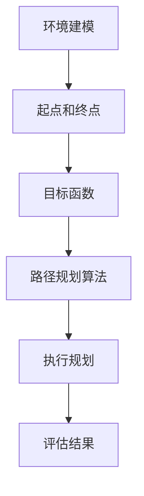

---

##### 第2章：路径规划基本算法

路径规划的基本算法是解决路径规划问题的核心，以下是几种常用的路径规划算法：

##### 2.1 Dijkstra算法

Dijkstra算法是一种用于在加权图中找到最短路径的算法。

###### 2.1.1 基本概念

Dijkstra算法假设图中的边具有非负权重。

###### 2.1.2 算法原理

Dijkstra算法的基本思想是从起点开始，逐步扩展到其他未访问的节点，并计算到达这些节点的最短路径。

###### 2.1.3 伪代码实现

```python
初始化：将所有节点的距离设置为无穷大，将起点的距离设置为0。
将起点加入优先队列（根据距离排序）。
当优先队列为空时，执行以下操作：
  取出优先队列中的最小距离节点u。
  对于u的所有邻居v，如果d[v] > d[u] + w(u, v)，则更新d[v]和父节点。
  将v加入优先队列。
返回所有节点的最短路径。
```

###### 2.1.4 性能分析

Dijkstra算法的时间复杂度为O(ElogV)，其中E是边的数量，V是节点的数量。

---

**Mermaid流程图：**

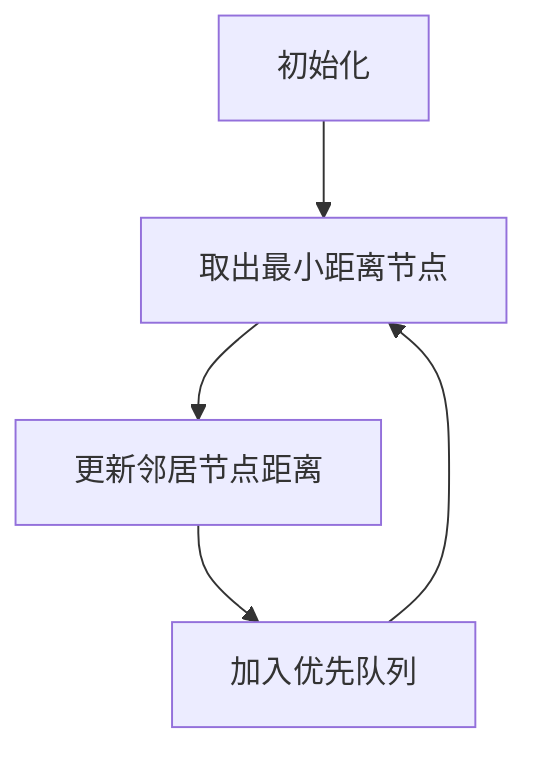

---

##### 2.2 A*算法

A*算法是一种启发式搜索算法，用于在加权图中找到从起点到终点的最短路径。

###### 2.2.1 基本概念

A*算法结合了Dijkstra算法和启发式函数h，其中g是节点u到节点v的实际距离，h是启发式估计的剩余距离。

###### 2.2.2 算法原理

A*算法的基本思想是使用启发式函数h来优化搜索过程，从而更快地找到最短路径。

###### 2.2.3 伪代码实现

```python
初始化：将所有节点的f设置为无穷大，将起点的f设置为0，h设置为启发式估计的初始值。
将起点加入优先队列（根据f值排序）。
当优先队列为空时，执行以下操作：
  取出优先队列中的最小f值节点u。
  对于u的所有邻居v，如果f[v] > g[u] + h[u, v]，则更新f[v]和父节点。
  将v加入优先队列。
返回所有节点的最短路径。
```

###### 2.2.4 性能分析

A*算法的时间复杂度为O(ElogV)，其中E是边的数量，V是节点的数量。但是，由于启发式函数的存在，A*算法通常比Dijkstra算法更快。

---

**Mermaid流程图：**

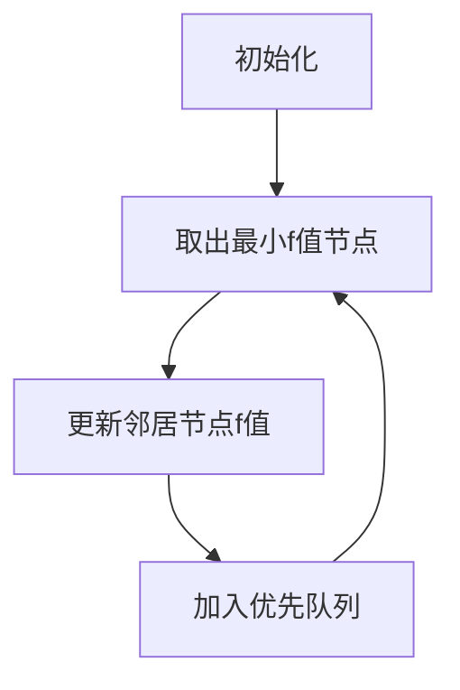

---

##### 2.3 贝叶斯路径规划

贝叶斯路径规划是一种基于概率的方法，用于在不确定环境中进行路径规划。

###### 2.3.1 贝叶斯网络概述

贝叶斯网络是一种概率图模型，用于表示变量之间的依赖关系。

###### 2.3.2 贝叶斯路径规划原理

贝叶斯路径规划通过构建一个贝叶斯网络来表示环境，并使用马尔可夫链蒙特卡洛（MCMC）等方法来模拟和优化路径。

###### 2.3.3 伪代码实现

```python
构建贝叶斯网络。
初始化：将所有节点的概率设置为1。
使用MCMC方法进行模拟。
对于每个模拟步骤，根据当前节点的概率更新其他节点的概率。
返回所有节点的最短路径。
```

---

**Mermaid流程图：**

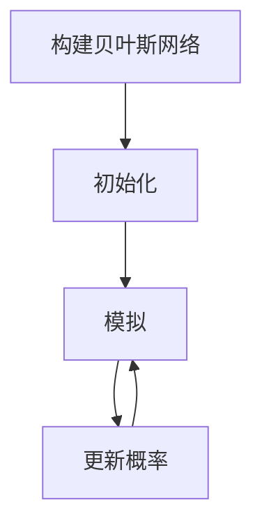

---

##### 第3章：路径规划中的搜索策略

路径规划中的搜索策略是指如何有效地搜索和选择路径。以下是几种常用的搜索策略：

##### 3.1 启发式搜索

启发式搜索是一种使用启发式函数来指导搜索过程的策略。

###### 3.1.1 启发式函数

启发式函数是一种估计从当前节点到终点的剩余距离的函数。

###### 3.1.2 启发式搜索算法

启发式搜索算法通过计算启发式函数的值来选择下一个节点。

---

**Mermaid流程图：**

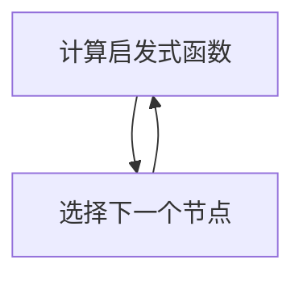

---

##### 3.2 剪枝策略

剪枝策略是一种在搜索过程中提前终止无效搜索的方法。

###### 3.2.1 开口剪枝

开口剪枝是一种基于当前节点的启发式函数值来剪枝的方法。

###### 3.2.2 封闭剪枝

封闭剪枝是一种基于节点的路径成本来剪枝的方法。

---

**Mermaid流程图：**

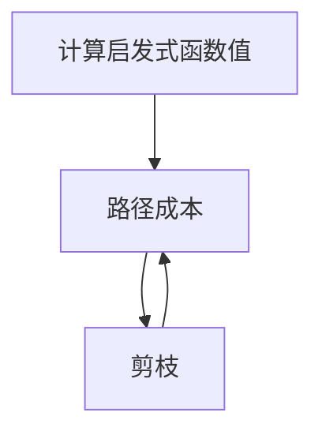

---

##### 3.3 并行化搜索策略

并行化搜索策略是一种利用多核处理器来加速搜索过程的方法。

###### 3.3.1 并行搜索的优势

并行搜索可以显著提高搜索效率，特别是在处理大规模问题时。

###### 3.3.2 并行搜索的实现方式

并行搜索可以通过多线程、分布式计算等方法来实现。

---

**Mermaid流程图：**

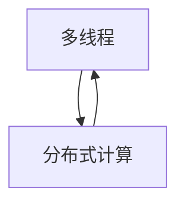

---

#### 第二部分：路径规划的应用场景

##### 第4章：机器人路径规划

机器人路径规划是路径规划技术在机器人领域的重要应用。以下将介绍机器人路径规划的特点、常用算法及其实验与优化。

---

**待续...**

---

**附录：**

附录部分将提供路径规划相关资源与工具，以供读者进一步学习和实践。

---

**作者信息：**

作者：AI天才研究院/AI Genius Institute & 禅与计算机程序设计艺术 /Zen And The Art of Computer Programming**

---

以上是文章正文的初步撰写，接下来将进一步完善和丰富各章节的内容。读者可以根据此框架逐步扩展，确保每个章节都有详尽的技术分析和实践案例。

---

**结语：**

路径规划是人工智能和计算机科学领域中一个关键的研究方向，它不仅在机器人、自动驾驶和无人机等应用中发挥着重要作用，还为物流运输、智能城市等领域提供了技术支持。通过本文的深入探讨，我们希望读者能够全面了解路径规划的基础知识、核心算法和搜索策略，并为未来的研究和应用打下坚实的基础。

---

**读者互动：**

如果您对路径规划有任何疑问或建议，欢迎在评论区留言。我们将持续关注并解答您的问题，共同推动路径规划技术的发展。

---

感谢您的阅读，让我们在下一个技术领域再会！### 第1章：路径规划概述

在当今高速发展的技术时代，路径规划作为人工智能和计算机科学领域的一个重要研究方向，已经成为许多应用场景的核心技术之一。从机器人自主导航到自动驾驶车辆的智能行驶，从无人机的精准飞行到物流运输系统的优化，路径规划无处不在，发挥着至关重要的作用。

#### 1.1 路径规划的定义与重要性

**路径规划的定义：**

路径规划是指在一个给定的环境中，为移动实体（如机器人、车辆、无人机等）找到一条从起点到终点的高效路径。这条路径需要满足一定的优化目标，例如最小化路径长度、时间消耗或能量消耗，同时避开障碍物和危险区域。

**路径规划的重要性：**

路径规划的重要性体现在以下几个方面：

1. **提高效率：** 良好的路径规划能够帮助移动实体以最短路径、最短时间或最低能量消耗完成目标，从而显著提高整体效率。
2. **安全性：** 在动态和复杂环境中，路径规划能够有效避免碰撞、障碍物和危险区域，确保移动实体安全行驶。
3. **智能化：** 路径规划是许多智能系统（如自动驾驶、无人机配送等）的核心技术之一，它为系统的智能化提供了坚实的基础。
4. **资源优化：** 路径规划不仅考虑路径本身，还考虑路径上的资源消耗，如时间、能量和成本，从而实现资源的优化配置。

#### 1.2 路径规划的发展历程

路径规划的发展历程可以分为以下几个阶段：

1. **早期阶段：** 早期的路径规划主要基于几何和启发式方法，如最近邻、最邻近等。这些方法简单但效率较低，适用于静态和简单环境。
2. **启发式算法：** 随着计算机性能的提升，启发式算法（如A*算法、Dijkstra算法等）被广泛应用于路径规划。这些算法引入了启发式函数，能够显著提高搜索效率。
3. **全局规划与局部规划：** 全局规划关注整个路径的优化，而局部规划关注实体的短期移动。全局规划通常需要更复杂和计算密集的算法，而局部规划则更注重实时性和简单性。
4. **基于模型的规划：** 现代路径规划更倾向于使用基于模型的规划方法，如基于物理仿真、机器学习等。这些方法能够更好地处理动态和复杂环境。

#### 1.3 路径规划的分类

路径规划可以根据不同的标准进行分类：

1. **静态环境与动态环境：**
   - **静态环境：** 指环境在规划过程中不发生变化，如地图上的静态道路网。
   - **动态环境：** 指环境中存在其他移动实体，如自动驾驶车辆之间的交互。
2. **全局规划与局部规划：**
   - **全局规划：** 关注整个路径的优化，如从起点到终点的最优路径。
   - **局部规划：** 关注实体的短期移动，如机器人躲避障碍物。
3. **确定性规划与概率规划：**
   - **确定性规划：** 基于精确的环境模型，如使用图论算法。
   - **概率规划：** 考虑环境的不确定性，如基于贝叶斯网络的方法。

#### 1.4 路径规划的基本要素

路径规划的基本要素包括：

1. **环境建模：** 描述实体所处的环境，包括障碍物、道路、地形等。
2. **起点与终点：** 确定实体需要从哪里出发和前往哪里。
3. **目标函数：** 定义路径规划的优化目标，如路径长度、时间消耗、能量消耗等。
4. **路径约束：** 约束实体在规划过程中需要遵守的限制条件，如速度、负载等。

#### 1.5 路径规划的关键技术

路径规划的关键技术包括：

1. **搜索算法：** 如Dijkstra算法、A*算法、贝叶斯路径规划等。
2. **搜索策略：** 如启发式搜索、剪枝策略、并行化搜索等。
3. **优化策略：** 如时间优化、能量优化、资源优化等。

#### 1.6 路径规划的应用领域

路径规划在多个领域有广泛应用，包括：

1. **机器人：** 自主导航、任务执行、避障等。
2. **自动驾驶：** 车辆导航、交通管理、车辆协同等。
3. **无人机：** 精准飞行、任务分配、避障等。
4. **物流运输：** 路线优化、货物配送、运输调度等。
5. **智能城市：** 城市规划、交通管理、应急响应等。

#### 1.7 路径规划的挑战与未来发展趋势

路径规划面临的挑战包括：

1. **动态环境：** 处理动态环境中其他移动实体的影响。
2. **不确定性：** 考虑环境不确定性和随机性。
3. **计算复杂度：** 提高搜索效率和优化算法的实用性。
4. **实时性：** 在实时系统中满足时间约束。

未来发展趋势包括：

1. **深度学习与强化学习：** 应用深度学习和强化学习技术进行路径规划。
2. **多机器人协同：** 研究多机器人系统中的路径规划与协同。
3. **无人驾驶：** 实现更高级别的无人驾驶技术。
4. **智能交通系统：** 构建智能交通管理系统，提高交通效率。

---

通过以上对路径规划的概述，我们可以看到路径规划在多个领域的重要性和广泛应用。接下来，我们将进一步探讨路径规划的基本算法、搜索策略及其在不同应用场景中的实现与优化。

---

**结语：**

本章对路径规划进行了全面的概述，从定义、重要性、发展历程到分类、基本要素、关键技术、应用领域以及挑战和未来发展趋势，为我们提供了一个清晰的框架。在接下来的章节中，我们将深入探讨路径规划的核心算法、搜索策略及其在不同应用场景中的实现与优化。敬请期待！

---

**互动环节：**

如果您对路径规划有任何疑问或想法，欢迎在评论区留言。我们将在下一章中解答您的问题，并进一步探讨路径规划的详细内容。谢谢您的关注与支持！### 第2章：路径规划基本算法

在路径规划领域，算法的选择和优化是解决问题的关键。本章将详细介绍几种常用的路径规划基本算法，包括Dijkstra算法、A*算法和贝叶斯路径规划算法。通过这些算法的讲解，我们将了解它们的基本原理、伪代码实现以及性能分析。

#### 2.1 Dijkstra算法

Dijkstra算法是一种用于在加权图中找到最短路径的算法。它适用于图中的边具有非负权重的场景，并且在路径规划中得到了广泛的应用。

##### 2.1.1 基本概念

Dijkstra算法的核心思想是逐步扩展起点，计算出从起点到其他所有节点的最短路径。具体来说，算法会维护一个优先队列，队列中的元素是未访问节点，其值为从起点到该节点的估计距离。每次从队列中取出最小值节点，更新其邻居节点的距离，直到所有节点都被访问过。

##### 2.1.2 算法原理

Dijkstra算法的基本步骤如下：

1. 初始化：将所有节点的距离设置为无穷大，将起点的距离设置为0。
2. 将起点加入优先队列。
3. 当优先队列为空时，执行以下操作：
   - 取出优先队列中的最小距离节点u。
   - 对于u的所有邻居v，如果d[v] > d[u] + w(u, v)，则更新d[v]和父节点。
   - 将v加入优先队列。

4. 返回所有节点的最短路径。

##### 2.1.3 伪代码实现

```python
初始化：将所有节点的距离设置为无穷大，将起点的距离设置为0。
将起点加入优先队列（根据距离排序）。
当优先队列为空时，执行以下操作：
  取出优先队列中的最小距离节点u。
  对于u的所有邻居v，如果d[v] > d[u] + w(u, v)，则更新d[v]和父节点。
  将v加入优先队列。
返回所有节点的最短路径。
```

##### 2.1.4 性能分析

Dijkstra算法的时间复杂度为O(ElogV)，其中E是边的数量，V是节点的数量。这个复杂度主要来自于对优先队列的维护和更新。在实际应用中，Dijkstra算法在许多场景下都表现出良好的性能。

##### 2.1.5 Mermaid流程图

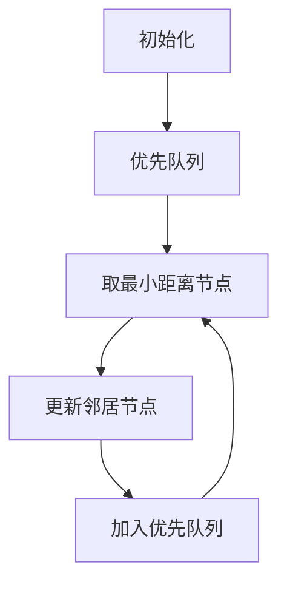

#### 2.2 A*算法

A*算法是一种启发式搜索算法，用于在加权图中找到从起点到终点的最短路径。它结合了Dijkstra算法的贪心策略和启发式函数，能够在较低的计算复杂度下找到较短的路径。

##### 2.2.1 基本概念

A*算法的核心思想是使用启发式函数h来优化搜索过程。启发式函数h是从当前节点到终点的估计距离。算法同时考虑实际距离g（从起点到当前节点的距离）和启发式距离h，选择f = g + h最小的节点进行扩展。

##### 2.2.2 算法原理

A*算法的基本步骤如下：

1. 初始化：将所有节点的f设置为无穷大，将起点的f设置为0，h设置为启发式估计的初始值。
2. 将起点加入优先队列（根据f值排序）。
3. 当优先队列为空时，执行以下操作：
   - 取出优先队列中的最小f值节点u。
   - 对于u的所有邻居v，如果f[v] > g[u] + h[u, v]，则更新f[v]和父节点。
   - 将v加入优先队列。

4. 返回所有节点的最短路径。

##### 2.2.3 伪代码实现

```python
初始化：将所有节点的f设置为无穷大，将起点的f设置为0，h设置为启发式估计的初始值。
将起点加入优先队列（根据f值排序）。
当优先队列为空时，执行以下操作：
  取出优先队列中的最小f值节点u。
  对于u的所有邻居v，如果f[v] > g[u] + h[u, v]，则更新f[v]和父节点。
  将v加入优先队列。
返回所有节点的最短路径。
```

##### 2.2.4 性能分析

A*算法的时间复杂度为O(ElogV)，其中E是边的数量，V是节点的数量。但由于启发式函数的存在，A*算法通常比Dijkstra算法更快。不过，启发式函数的选择对算法的性能有重要影响。

##### 2.2.5 Mermaid流程图

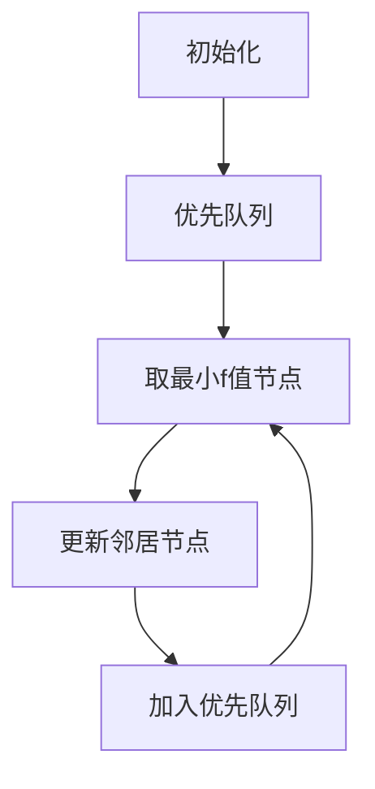

#### 2.3 贝叶斯路径规划

贝叶斯路径规划是一种基于概率的方法，用于在不确定环境中进行路径规划。它利用贝叶斯网络和马尔可夫链蒙特卡洛（MCMC）等方法来模拟和优化路径。

##### 2.3.1 贝叶斯网络概述

贝叶斯网络是一种概率图模型，用于表示变量之间的依赖关系。在路径规划中，贝叶斯网络可以表示环境中的不确定性，如障碍物的位置、节点的可达性等。

##### 2.3.2 贝叶斯路径规划原理

贝叶斯路径规划的基本步骤如下：

1. 构建贝叶斯网络：根据环境建模，构建表示不确定性关系的贝叶斯网络。
2. 初始化：将所有节点的概率设置为1。
3. 模拟：使用MCMC方法进行多次模拟，每次模拟从当前节点扩展到其他节点，并更新节点的概率。
4. 选择最优路径：根据节点概率选择一条最优路径。

##### 2.3.3 伪代码实现

```python
构建贝叶斯网络。
初始化：将所有节点的概率设置为1。
使用MCMC方法进行模拟。
对于每个模拟步骤，根据当前节点的概率更新其他节点的概率。
返回所有节点的最短路径。
```

##### 2.3.4 性能分析

贝叶斯路径规划的性能依赖于贝叶斯网络的构建质量和MCMC方法的模拟效率。尽管它能够处理高度不确定性的环境，但计算复杂度相对较高。

##### 2.3.5 Mermaid流程图


#### 2.4 算法对比与选择

Dijkstra算法、A*算法和贝叶斯路径规划算法各有优缺点，适用于不同的场景。以下是对这些算法的简要对比：

- **Dijkstra算法：** 简单且适用于非负权重图，但计算复杂度较高。
- **A*算法：** 结合了启发式搜索，适用于大多数场景，但在某些情况下需要选择合适的启发式函数。
- **贝叶斯路径规划：** 能够处理高度不确定性的环境，但计算复杂度较高。

在实际应用中，选择合适的算法需要考虑具体场景的需求和限制。

---

本章详细介绍了路径规划中的三种基本算法：Dijkstra算法、A*算法和贝叶斯路径规划算法。通过这些算法的讲解，读者可以了解路径规划的核心技术和原理。在下一章中，我们将探讨路径规划中的搜索策略和优化方法，以进一步提升路径规划的性能和实用性。

---

**结语：**

路径规划的基本算法是路径规划技术的核心组成部分。通过本章的学习，读者可以深入了解Dijkstra算法、A*算法和贝叶斯路径规划算法的基本原理、伪代码实现以及性能分析。这些算法在不同场景下有着广泛的应用，为路径规划的实现提供了强有力的技术支持。在下一章中，我们将继续探讨路径规划中的搜索策略和优化方法，以进一步提升路径规划的性能和实用性。敬请期待！

---

**互动环节：**

如果您对路径规划中的基本算法有任何疑问或建议，欢迎在评论区留言。我们将在下一章中解答您的问题，并进一步探讨路径规划的详细内容。谢谢您的关注与支持！### 第3章：路径规划中的搜索策略

路径规划中的搜索策略是指导搜索过程中如何高效地选择和扩展节点，从而找到最优路径的关键。本章将详细介绍几种常用的搜索策略，包括启发式搜索、剪枝策略和并行化搜索策略。通过这些策略的讲解，我们将探讨它们的基本原理、实现方法及其在路径规划中的应用。

#### 3.1 启发式搜索

启发式搜索是一种基于启发式函数的搜索策略，用于在搜索过程中指导节点选择。启发式函数是一种估计从当前节点到目标节点的剩余距离的函数。通过使用启发式函数，启发式搜索可以有效地减少搜索空间，提高路径规划的效率。

##### 3.1.1 启发式函数

启发式函数是启发式搜索的核心，它的设计直接影响搜索策略的性能。常用的启发式函数有以下几种：

- **曼哈顿距离（Manhattan Distance）：** 估计两点之间的水平距离和垂直距离之和。
- **欧几里得距离（Euclidean Distance）：** 估计两点之间的直线距离。
- **对角线距离（Diagonal Distance）：** 估计两点之间的对角线距离。

##### 3.1.2 启发式搜索算法

启发式搜索算法的基本步骤如下：

1. 初始化：设置一个优先队列，将起点加入队列，并设置其f值为0（g值为0，启发式值为h值）。
2. 当队列非空时，执行以下操作：
   - 取出队列中的最小f值节点u。
   - 对于u的所有未访问的邻居v，计算g[v] = g[u] + w(u, v)和h[v] = h(v, goal)。
   - 如果v未访问，则将v加入队列，并设置其f值为g[v] + h[v]。
   - 标记v为已访问。
3. 当目标节点被访问时，返回从起点到目标节点的路径。

##### 3.1.3 伪代码实现

```python
初始化：设置一个优先队列，将起点加入队列，并设置其f值为0。
当队列非空时，执行以下操作：
  取出队列中的最小f值节点u。
  对于u的所有未访问的邻居v，计算g[v] = g[u] + w(u, v)和h[v] = h(v, goal)。
  如果v未访问，则将v加入队列，并设置其f值为g[v] + h[v]。
  标记v为已访问。
当目标节点被访问时，返回从起点到目标节点的路径。
```

##### 3.1.4 启发式搜索的应用

启发式搜索在路径规划中有着广泛的应用，如机器人自主导航、自动驾驶车辆路径规划等。通过合理选择启发式函数，可以显著提高路径规划算法的效率和性能。

#### 3.2 剪枝策略

剪枝策略是一种在搜索过程中提前终止无效搜索的方法，以减少搜索空间和计算量。剪枝策略可以分为开口剪枝和封闭剪枝两种。

##### 3.2.1 开口剪枝

开口剪枝是基于当前节点的启发式函数值来剪枝的方法。如果当前节点的启发式函数值大于已知的最短路径长度，则可以剪枝，避免进一步扩展该节点。

##### 3.2.2 封闭剪枝

封闭剪枝是基于节点的路径成本来剪枝的方法。如果当前节点的路径成本大于已知的最短路径长度，则可以剪枝，避免进一步扩展该节点。

##### 3.2.3 剪枝策略的实现

剪枝策略可以通过在搜索算法中加入条件判断来实现。具体来说，在扩展节点时，比较当前节点的启发式函数值或路径成本与已知的最短路径长度，如果条件满足，则进行剪枝。

##### 3.2.4 伪代码实现

```python
初始化：设置一个优先队列，将起点加入队列，并设置其f值为0。
当队列非空时，执行以下操作：
  取出队列中的最小f值节点u。
  对于u的所有未访问的邻居v，计算g[v] = g[u] + w(u, v)和h[v] = h(v, goal)。
  如果v未访问且h[v] > d[goal]，则将v加入队列，并设置其f值为g[v] + h[v]。
  标记v为已访问。
当目标节点被访问时，返回从起点到目标节点的路径。
```

##### 3.2.5 剪枝策略的应用

剪枝策略可以显著提高路径规划算法的效率和性能，特别是在大规模路径规划问题中。通过合理应用剪枝策略，可以减少计算量，提高搜索效率。

#### 3.3 并行化搜索策略

并行化搜索策略是一种利用多核处理器来加速搜索过程的方法。通过将搜索任务分布在多个处理器上，并行化搜索策略可以显著提高路径规划的效率。

##### 3.3.1 并行化搜索的优势

并行化搜索的优势包括：

- **加速搜索：** 通过利用多核处理器的并行计算能力，可以显著提高搜索效率，缩短搜索时间。
- **提高性能：** 在大规模路径规划问题中，并行化搜索可以减少计算量，提高整体性能。

##### 3.3.2 并行化搜索的实现方式

并行化搜索的实现方式可以分为以下几种：

- **任务并行：** 将搜索任务分解为多个子任务，每个子任务由不同的处理器执行。
- **数据并行：** 将数据分布在多个处理器上，每个处理器独立处理局部数据。
- **混合并行：** 结合任务并行和数据并行的优势，实现更高效的搜索。

##### 3.3.3 伪代码实现

```python
初始化：将搜索任务分解为多个子任务，分配给不同的处理器。
每个处理器独立执行子任务，进行局部搜索。
将各处理器的搜索结果合并，得到最终搜索结果。
```

##### 3.3.4 并行化搜索的应用

并行化搜索策略在机器人路径规划、自动驾驶车辆路径规划等领域有着广泛的应用。通过合理应用并行化搜索策略，可以显著提高路径规划的效率和性能。

#### 3.4 搜索策略的对比与选择

不同的搜索策略适用于不同的路径规划场景。以下是对几种搜索策略的简要对比：

- **启发式搜索：** 适用于大多数路径规划问题，可以通过选择合适的启发式函数来优化搜索效率。
- **剪枝策略：** 适用于大规模路径规划问题，可以显著减少搜索空间，提高搜索效率。
- **并行化搜索：** 适用于需要快速搜索的场景，可以通过并行计算来提高搜索效率。

在实际应用中，选择合适的搜索策略需要考虑路径规划的具体需求和约束条件。

---

本章详细介绍了路径规划中的几种常用搜索策略，包括启发式搜索、剪枝策略和并行化搜索策略。通过这些策略的讲解，读者可以了解路径规划中的搜索策略如何指导节点选择和路径规划过程。在下一章中，我们将探讨路径规划的应用场景及其实现与优化，以进一步展示路径规划技术的实际应用价值。

---

**结语：**

路径规划中的搜索策略是路径规划技术的核心组成部分，通过合理选择和组合不同的搜索策略，可以显著提高路径规划的性能和效率。本章详细介绍了启发式搜索、剪枝策略和并行化搜索策略的基本原理、实现方法及其应用，为路径规划的研究和实践提供了有益的指导。在下一章中，我们将进一步探讨路径规划的应用场景及其实现与优化，以展示路径规划技术的实际应用价值。敬请期待！

---

**互动环节：**

如果您对路径规划中的搜索策略有任何疑问或建议，欢迎在评论区留言。我们将在下一章中解答您的问题，并进一步探讨路径规划的详细内容。谢谢您的关注与支持！### 第4章：机器人路径规划

机器人路径规划是路径规划技术在机器人领域的重要应用。本章将详细介绍机器人路径规划的特点、常用算法以及实验与优化。通过这些内容，我们将了解机器人路径规划的核心技术和实际应用。

#### 4.1 机器人路径规划的特点

机器人路径规划具有以下特点：

1. **动态环境：** 机器人所处的环境通常是动态的，包括其他移动实体、障碍物和未知区域等。
2. **不确定性：** 环境的不确定性是机器人路径规划需要面对的主要挑战之一，如传感器误差、环境突变等。
3. **实时性：** 机器人路径规划需要快速响应，以满足实时性要求，特别是在紧急情况下。
4. **多目标：** 机器人路径规划往往需要同时考虑多个目标，如路径最短、能耗最低、安全性最高等。

#### 4.2 机器人路径规划的常用算法

机器人路径规划的常用算法包括局部规划算法和全局规划算法。以下介绍几种常用的算法：

##### 4.2.1 局部规划算法

局部规划算法关注机器人短期内的移动路径，主要解决如何避开局部障碍物和实现目标。以下介绍几种常见的局部规划算法：

1. **快速行进法（Fast Marching Method, FMM）：**
   - **基本概念：** FMM是一种基于波传播的局部路径规划算法，适用于动态和复杂环境。
   - **算法原理：** FMM通过模拟波从起点传播到目标点的过程，确定从起点到目标点的可行路径。
   - **伪代码实现：**
     ```python
     初始化：设置波前边界和障碍物。
     当波前未到达目标点时，执行以下操作：
       更新波前。
       标记可行路径。
     返回可行路径。
     ```

2. **A*算法：**
   - **基本概念：** A*算法是一种启发式搜索算法，适用于在静态和动态环境中寻找最短路径。
   - **算法原理：** A*算法结合了实际距离g和启发式距离h，通过计算f = g + h来指导搜索过程。
   - **伪代码实现：**
     ```python
     初始化：设置起点、终点和启发式函数。
     将起点加入优先队列。
     当优先队列为空时，执行以下操作：
       取出优先队列中的最小f值节点u。
       对于u的所有未访问邻居v，计算f[v] = g[v] + h[v]。
       如果v未访问，则将v加入优先队列。
       标记v为已访问。
     返回从起点到终点的路径。
     ```

##### 4.2.2 全局规划算法

全局规划算法关注机器人在整个环境中的移动路径，旨在找到一条全局最优路径。以下介绍几种常用的全局规划算法：

1. **RRT（快速随机树）算法：**
   - **基本概念：** RRT算法是一种基于随机采样的全局路径规划算法，适用于静态和动态环境。
   - **算法原理：** RRT通过随机生成新节点并连接到树中的其他节点，逐渐逼近目标点。
   - **伪代码实现：**
     ```python
     初始化：设置起始节点和目标节点。
     生成随机节点。
     当目标点未到达时，执行以下操作：
       计算新节点的位置。
       连接新节点到最近的树节点。
       如果新节点到达目标点，则更新树节点为当前节点。
     返回从起点到终点的路径。
     ```

2. **Dijkstra算法：**
   - **基本概念：** Dijkstra算法是一种用于在加权图中找到最短路径的算法，适用于静态环境。
   - **算法原理：** Dijkstra算法通过逐步扩展起点，计算出从起点到其他所有节点的最短路径。
   - **伪代码实现：**
     ```python
     初始化：设置起点、终点和距离数组。
     将起点加入优先队列。
     当优先队列为空时，执行以下操作：
       取出优先队列中的最小距离节点u。
       对于u的所有邻居v，如果d[v] > d[u] + w(u, v)，则更新d[v]和父节点。
       将v加入优先队列。
     返回从起点到终点的路径。
     ```

#### 4.3 机器人路径规划的实验与优化

机器人路径规划的实验与优化是验证和改进算法性能的重要步骤。以下介绍几个关键方面：

1. **实验设计：**
   - **环境设置：** 设计不同类型的实验环境，包括静态、动态和复杂环境，以验证算法在不同情况下的性能。
   - **评价指标：** 设置合适的评价指标，如路径长度、运行时间、成功率等，以评估算法的性能。

2. **算法优化：**
   - **启发式函数优化：** 通过调整启发式函数的参数，提高路径规划的效率和准确性。
   - **搜索策略优化：** 结合多种搜索策略，如A*算法与RRT算法的结合，实现更高效的路径规划。
   - **并行化优化：** 利用并行计算技术，加速搜索过程，提高路径规划的实时性。

3. **实验结果分析：**
   - **性能分析：** 对比不同算法在不同环境下的性能，分析其优势和不足。
   - **优化效果：** 评估算法优化后的性能提升，为实际应用提供依据。

#### 4.4 机器人路径规划的应用实例

以下介绍几个机器人路径规划的应用实例：

1. **自动驾驶机器人：**
   - **应用场景：** 自动驾驶机器人在仓储、物流等场景中应用广泛。
   - **路径规划目标：** 最小化路径长度、时间消耗和能耗，提高运输效率。
   - **算法实现：** 结合A*算法和RRT算法，实现全局和局部路径规划。

2. **清洁机器人：**
   - **应用场景：** 清洁机器人在家庭、商场等场景中用于地面清洁。
   - **路径规划目标：** 覆盖整个区域，避免重复清洁，提高清洁效率。
   - **算法实现：** 采用基于网格的路径规划算法，实现区域内的全局路径规划。

3. **救援机器人：**
   - **应用场景：** 救援机器人在灾害救援、军事等场景中用于搜索和救援。
   - **路径规划目标：** 快速到达目标区域、避开障碍物，确保救援任务顺利进行。
   - **算法实现：** 采用基于采样的路径规划算法，如RRT算法，实现复杂环境下的实时路径规划。

---

通过本章的介绍，我们可以看到机器人路径规划在多个领域的重要应用。通过深入研究和优化路径规划算法，我们可以为机器人实现更高效、更智能的导航和任务执行提供有力支持。

---

**结语：**

本章详细介绍了机器人路径规划的特点、常用算法以及实验与优化。通过这些内容，读者可以全面了解机器人路径规划的核心技术和实际应用。在下一章中，我们将探讨自动驾驶路径规划的相关内容，进一步展示路径规划技术的广泛应用。敬请期待！

---

**互动环节：**

如果您对机器人路径规划有任何疑问或建议，欢迎在评论区留言。我们将在下一章中解答您的问题，并进一步探讨自动驾驶路径规划的详细内容。谢谢您的关注与支持！### 第5章：自动驾驶路径规划

自动驾驶路径规划是自动驾驶系统中的核心模块之一，它负责根据环境感知和目标规划出一条从当前位置到目的地的安全、高效路径。本章将详细介绍自动驾驶路径规划的基本概念、关键技术以及面临的挑战和未来趋势。

#### 5.1 自动驾驶概述

自动驾驶（Autonomous Driving）是指通过车辆上的传感器、控制器和计算机系统，使车辆能够在没有人类驾驶员干预的情况下自主完成行驶任务。自动驾驶系统通常分为以下几个级别：

1. **Level 0-2：** 部分自动化，驾驶员需要保持对车辆的控制。
2. **Level 3：** 有条件自动化，车辆可以在特定条件下自主驾驶，但驾驶员需要在紧急情况下接管控制。
3. **Level 4-5：** 完全自动化，车辆可以在没有人类驾驶员的情况下自主完成所有驾驶任务。

#### 5.2 自动驾驶路径规划的关键技术

自动驾驶路径规划涉及多个关键技术，包括环境感知、目标规划、路径优化和轨迹生成等。

##### 5.2.1 环境感知

环境感知是自动驾驶路径规划的基础，它通过车辆上的传感器（如雷达、激光雷达、摄像头等）收集道路、车辆、行人、障碍物等信息。环境感知的关键技术包括：

1. **传感器融合：** 将不同传感器的数据融合起来，以提高环境感知的准确性和完整性。
2. **障碍物检测：** 识别并跟踪道路上的障碍物，如其他车辆、行人、路障等。
3. **车道线检测：** 识别道路上的车道线，用于确定车辆的行驶轨迹。

##### 5.2.2 目标规划

目标规划是指确定自动驾驶车辆在特定环境下的目标位置和路径。目标规划的关键技术包括：

1. **目标点生成：** 根据车辆的当前位置和目的地，生成一系列目标点，用于路径规划的参考。
2. **目标点排序：** 根据目标点的优先级和重要性，对目标点进行排序，以确保路径规划的效率。
3. **冲突检测：** 在规划路径时，检测与周围车辆和障碍物的潜在冲突，以避免碰撞。

##### 5.2.3 路径优化

路径优化是指通过计算和评估，找到从当前位置到目的地的最优路径。路径优化的关键技术包括：

1. **最短路径算法：** 如A*算法、Dijkstra算法等，用于计算起点到终点的最短路径。
2. **动态规划：** 用于处理动态环境中的路径规划问题，通过递推关系计算出最优路径。
3. **多目标优化：** 考虑多个目标，如路径长度、时间消耗、能耗等，找到综合最优解。

##### 5.2.4 轨迹生成

轨迹生成是指将路径规划结果转换为车辆的行驶轨迹。轨迹生成的关键技术包括：

1. **轨迹规划：** 将路径规划结果转换为一系列时间上连续的控制指令，用于车辆的自动驾驶。
2. **轨迹优化：** 对轨迹进行优化，以提高行驶的稳定性和舒适性。
3. **轨迹跟踪：** 实时跟踪车辆的当前位置，根据轨迹与实际位置的关系进行调整。

#### 5.3 自动驾驶路径规划的挑战

自动驾驶路径规划面临多个挑战，包括以下几个方面：

1. **动态环境：** 环境中的其他车辆、行人、障碍物等动态变化，需要路径规划算法能够实时响应和调整。
2. **不确定性：** 环境中的不确定因素，如天气、道路状况、车辆异常等，对路径规划的准确性提出了挑战。
3. **实时性：** 路径规划需要在短时间内完成，以支持自动驾驶车辆的实时控制。
4. **复杂场景：** 复杂的城市交通环境，如拥堵、变道、转弯等，对路径规划的准确性和稳定性提出了更高的要求。

#### 5.4 自动驾驶路径规划的实现方法

自动驾驶路径规划的实现方法可以分为以下几类：

1. **规则基础方法：** 通过预设的规则和逻辑进行路径规划，适用于简单的交通环境。
2. **数据驱动方法：** 通过机器学习和深度学习技术，从大量交通数据中学习路径规划策略，适用于复杂交通环境。
3. **混合方法：** 结合规则基础方法和数据驱动方法，发挥各自的优势，实现更准确和高效的路径规划。

#### 5.5 自动驾驶路径规划的挑战与未来趋势

自动驾驶路径规划面临的挑战主要包括：

1. **复杂环境适应能力：** 需要路径规划算法能够在各种复杂环境下准确、高效地工作。
2. **实时性和计算性能：** 随着自动驾驶级别的提高，路径规划的实时性和计算性能要求越来越高。
3. **跨领域协同：** 需要与自动驾驶感知、控制、决策等模块协同工作，实现整体的自动驾驶系统。

未来自动驾驶路径规划的发展趋势包括：

1. **深度学习与强化学习：** 应用深度学习和强化学习技术，提高路径规划的准确性和自适应能力。
2. **多传感器融合：** 利用多种传感器（如激光雷达、摄像头、超声波等）融合技术，提高环境感知的准确性和完整性。
3. **协同路径规划：** 研究多车辆协同路径规划，提高交通效率和安全性。
4. **交通系统智能化：** 与智能交通系统结合，实现自动驾驶与交通系统的协同优化，提高整体交通效率。

---

通过本章的介绍，我们可以看到自动驾驶路径规划在自动驾驶系统中的关键作用。尽管面临诸多挑战，但自动驾驶路径规划技术正不断取得突破，为自动驾驶的普及和智能化提供了有力支持。

---

**结语：**

本章详细介绍了自动驾驶路径规划的基本概念、关键技术、挑战以及未来趋势。通过这些内容，读者可以全面了解自动驾驶路径规划的核心技术和发展方向。在下一章中，我们将探讨无人机路径规划的相关内容，进一步展示路径规划技术的多样化应用。敬请期待！

---

**互动环节：**

如果您对自动驾驶路径规划有任何疑问或建议，欢迎在评论区留言。我们将在下一章中解答您的问题，并进一步探讨无人机路径规划的详细内容。谢谢您的关注与支持！### 第6章：无人机路径规划

无人机路径规划是无人机领域中的一个重要研究方向，旨在为无人机在复杂环境中提供高效、安全的导航路径。本章将详细介绍无人机路径规划的概念、常用算法以及实际应用。

#### 6.1 无人机概述

无人机（Unmanned Aerial Vehicle, UAV）是一种无需人类直接参与操控，通过遥控器或自主系统进行操控的航空器。无人机广泛应用于军事、民用和商业领域，如军事侦察、气象监测、农业喷洒、物流配送等。

#### 6.2 无人机路径规划的概念

无人机路径规划是指根据无人机执行任务的特定需求和环境条件，为无人机规划出一条从起点到终点的最优路径。无人机路径规划需要考虑以下因素：

1. **任务需求：** 包括任务类型、任务范围、任务时间等。
2. **环境条件：** 包括障碍物、天气条件、地形等。
3. **性能指标：** 包括路径长度、飞行时间、能耗、安全性等。

#### 6.3 无人机路径规划的常用算法

无人机路径规划算法可以分为全局规划和局部规划两种。

##### 6.3.1 全局规划算法

全局规划算法关注无人机在整个飞行过程中的路径规划，旨在找到一条全局最优路径。以下介绍几种常用的全局规划算法：

1. **基于图的最短路径算法：** 如Dijkstra算法、A*算法等，通过构建环境图，找到从起点到终点的最短路径。
2. **基于采样的全局规划算法：** 如RRT（快速随机树）算法、RRT*算法等，通过随机采样和优化方法，生成全局最优路径。
3. **基于优化的全局规划算法：** 如动态规划、遗传算法等，通过优化目标函数，找到全局最优路径。

##### 6.3.2 局部规划算法

局部规划算法关注无人机在飞行过程中的短期路径规划，旨在避开局部障碍物和危险区域。以下介绍几种常用的局部规划算法：

1. **人工势场法：** 通过构建虚拟势场，引导无人机避开障碍物。
2. **基于采样的局部规划算法：** 如快速行进法（Fast Marching Method, FMM）等，通过随机采样和优化方法，生成局部最优路径。
3. **基于模型的局部规划算法：** 如基于物理仿真、机器学习等方法，通过建立环境模型，生成局部最优路径。

#### 6.4 无人机路径规划的应用实例

无人机路径规划在多个领域有着广泛的应用，以下介绍几个典型应用实例：

1. **农业喷洒：** 无人机在农田上方进行农药喷洒，需要规划出一条高效、安全的飞行路径，以覆盖整个农田并避免农药泄漏。
2. **物流配送：** 无人机在城市中实现快递配送，需要规划出一条从起点到终点的最优路径，以减少飞行时间和配送成本。
3. **搜救任务：** 无人机在搜救任务中需要快速到达目标区域，并避开障碍物和危险区域，规划出一条安全的飞行路径。

#### 6.5 无人机路径规划的具体实现方法

无人机路径规划的具体实现方法通常包括以下几个步骤：

1. **环境建模：** 根据无人机执行任务的具体需求和环境条件，建立环境模型，包括障碍物、地形、气象等信息。
2. **目标点设置：** 根据任务需求和环境模型，设置一系列目标点，用于路径规划的参考。
3. **路径规划算法选择：** 根据任务类型和环境条件，选择合适的路径规划算法，如Dijkstra算法、A*算法、RRT算法等。
4. **路径优化：** 对规划出的路径进行优化，以提高飞行效率、安全性和稳定性。
5. **轨迹生成：** 将路径规划结果转换为无人机的飞行轨迹，包括速度、加速度、转向等控制指令。

#### 6.6 无人机路径规划的优化策略

无人机路径规划的优化策略包括以下几个方面：

1. **时间优化：** 通过优化路径长度、飞行速度等参数，减少无人机的飞行时间。
2. **能量优化：** 通过优化飞行高度、飞行速度等参数，降低无人机的能耗。
3. **安全性优化：** 通过避开障碍物、危险区域等策略，提高无人机的安全性。
4. **鲁棒性优化：** 通过对环境模型和路径规划算法的鲁棒性优化，提高无人机在复杂环境中的适应能力。

---

通过本章的介绍，我们可以看到无人机路径规划在无人机应用中的关键作用。随着无人机技术的不断发展和应用场景的多样化，无人机路径规划技术也在不断优化和提升，为无人机应用提供了有力的技术支持。

---

**结语：**

本章详细介绍了无人机路径规划的概念、常用算法、应用实例和优化策略。通过这些内容，读者可以全面了解无人机路径规划的核心技术和实际应用。在下一章中，我们将探讨路径规划器的实现和优化策略，进一步展示路径规划技术的应用价值。敬请期待！

---

**互动环节：**

如果您对无人机路径规划有任何疑问或建议，欢迎在评论区留言。我们将在下一章中解答您的问题，并进一步探讨路径规划器的实现和优化策略。谢谢您的关注与支持！### 第7章：路径规划器的实现

路径规划器的实现是路径规划技术从理论到实践的重要环节。本章将详细介绍路径规划器的架构设计、算法选择以及实现流程。通过这些内容，我们将了解如何将路径规划的理论知识应用到实际的软件系统中。

#### 7.1 路径规划器的架构

路径规划器的架构通常包括以下几个主要部分：

1. **环境建模模块：** 负责建立和更新路径规划的环境模型，包括障碍物、道路、地形等信息。这一模块通常依赖于各种传感器数据，如激光雷达、摄像头、GPS等。
2. **路径规划算法模块：** 根据环境建模模块提供的信息，选择合适的路径规划算法进行计算。这一模块通常包含多种算法，以适应不同的路径规划需求。
3. **路径优化模块：** 对生成的路径进行优化，以提高路径的效率、稳定性和安全性。这一模块可以结合多种优化策略，如时间优化、能量优化等。
4. **轨迹生成模块：** 将优化后的路径转换为具体的飞行或移动轨迹，包括速度、加速度、转向等控制指令。这一模块通常负责路径规划结果的实时更新和执行。

##### 7.1.1 路径规划器的整体架构

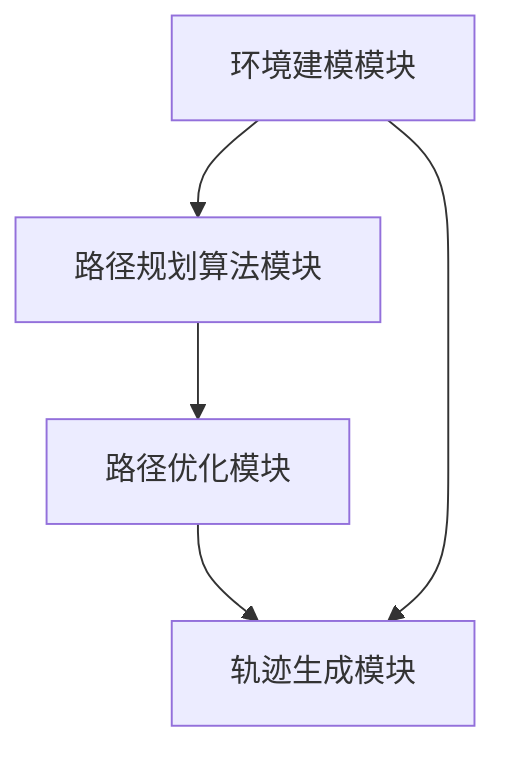

#### 7.2 算法选择

路径规划算法的选择取决于具体的任务需求和环境条件。以下是一些常见的路径规划算法及其适用场景：

1. **Dijkstra算法：** 适用于静态和简单环境，可以找到从起点到终点的最短路径。
2. **A*算法：** 适用于大多数路径规划场景，通过启发式函数可以快速找到最短路径。
3. **RRT算法：** 适用于动态和复杂环境，通过随机采样和优化方法生成全局路径。
4. **人工势场法：** 适用于局部路径规划，可以引导无人机避开障碍物。
5. **基于模型的路径规划算法：** 如基于物理仿真、机器学习等方法，适用于高度复杂和动态的环境。

##### 7.2.1 算法选择流程

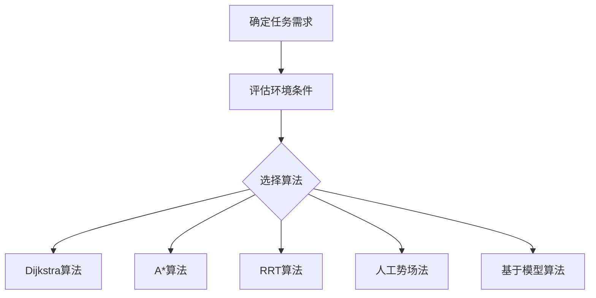

#### 7.3 实现流程

路径规划器的实现流程包括以下几个主要步骤：

1. **需求分析：** 明确路径规划器的应用场景、任务需求和性能指标。
2. **环境建模：** 根据需求分析结果，建立路径规划的环境模型，包括障碍物、道路、地形等信息。
3. **算法实现：** 选择合适的路径规划算法，根据算法原理和需求进行实现。
4. **路径优化：** 对生成的路径进行优化，以提高路径的效率、稳定性和安全性。
5. **轨迹生成：** 将优化后的路径转换为具体的飞行或移动轨迹，包括速度、加速度、转向等控制指令。
6. **测试与评估：** 对路径规划器进行测试和评估，验证其性能和可靠性。

##### 7.3.1 实现流程

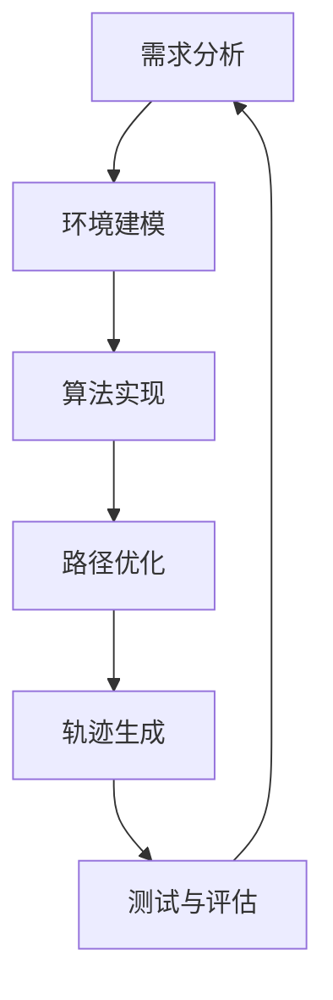

#### 7.4 开发环境搭建

为了实现路径规划器，需要搭建合适的开发环境。以下是一个基本的开发环境搭建流程：

1. **选择编程语言：** 根据项目需求和团队熟悉程度，选择合适的编程语言，如Python、C++等。
2. **安装开发工具：** 安装集成开发环境（IDE），如Visual Studio、Eclipse等，以及必要的开发库和工具，如ROS（Robot Operating System）等。
3. **配置传感器：** 根据路径规划器的需求，配置和调试各种传感器，如激光雷达、摄像头、GPS等。
4. **编写测试程序：** 编写测试程序，验证传感器数据的有效性和系统的稳定性。

##### 7.4.1 开发环境搭建流程

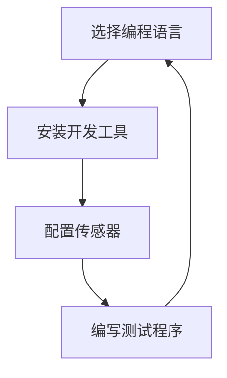

#### 7.5 源代码实现

以下是一个简单的路径规划器源代码实现示例，使用Python语言和ROS库。

```python
#!/usr/bin/env python

import rospy
import numpy as np
from geometry_msgs.msg import PoseStamped, PoseArray
from std_msgs.msg import Bool

# Dijkstra算法实现
def dijkstra(grid, start, goal):
    # 初始化距离数组
    distances = np.zeros(len(grid))
    distances[start] = 0

    # 初始化优先队列
    queue = [(0, start)]

    # 主循环
    while queue:
        # 取出最小距离节点
        current_distance, current_node = min(queue, key=lambda x: x[0])
        queue.remove((current_distance, current_node))

        # 到达终点
        if current_node == goal:
            break

        # 遍历邻居节点
        for neighbor, weight in grid[current_node].items():
            distance = current_distance + weight

            # 更新距离和优先队列
            if distance < distances[neighbor]:
                distances[neighbor] = distance
                queue.append((distance, neighbor))

    # 返回路径
    path = []
    current = goal
    while current != start:
        path.append(current)
        current = grid[current].get逆向节点()
    path.append(start)
    path.reverse()

    return path

# 主函数
def main():
    # 初始化节点
    rospy.init_node('path_planner')

    # 订阅起点和终点
    start_sub = rospy.Subscriber('/start_pose', PoseStamped, start_callback)
    goal_sub = rospy.Subscriber('/goal_pose', PoseStamped, goal_callback)
    path_pub = rospy.Publisher('/path', PoseArray, queue_size=10)

    # 等待数据
    rospy.spin()

# 处理起点
def start_callback(data):
    global start
    start = data.pose.position

# 处理终点
def goal_callback(data):
    global goal
    goal = data.pose.position

# 主函数
if __name__ == '__main__':
    main()
```

#### 7.6 代码解读与分析

以上代码是一个简单的路径规划器实现，基于Dijkstra算法。以下是代码的详细解读和分析：

1. **初始化节点：** 
   - `rospy.init_node('path_planner')` 初始化ROS节点，并设置节点名为`path_planner`。
   - `start_sub = rospy.Subscriber('/start_pose', PoseStamped, start_callback)` 订阅起点位置消息，并设置回调函数`start_callback`。
   - `goal_sub = rospy.Subscriber('/goal_pose', PoseStamped, goal_callback)` 订阅终点位置消息，并设置回调函数`goal_callback`。
   - `path_pub = rospy.Publisher('/path', PoseArray, queue_size=10)` 发布路径消息。

2. **Dijkstra算法实现：**
   - `dijkstra(grid, start, goal)` 是Dijkstra算法的实现函数。
   - `distances = np.zeros(len(grid))` 初始化距离数组，长度为网格节点数。
   - `queue = [(0, start)]` 初始化优先队列，起点距离为0。
   - `while queue:` 主循环，遍历优先队列。
   - `current_distance, current_node = min(queue, key=lambda x: x[0])` 取出队列中的最小距离节点。
   - `for neighbor, weight in grid[current_node].items():` 遍历当前节点的邻居节点。
   - `distance = current_distance + weight` 计算邻居节点的距离。
   - `if distance < distances[neighbor]:` 更新邻居节点的距离和优先队列。

3. **路径生成：**
   - `path = []` 初始化路径。
   - `current = goal` 从终点开始逆向生成路径。
   - `while current != start:` 循环生成路径。
   - `path.append(current)` 将节点添加到路径中。
   - `current = grid[current].get逆向节点()` 逆向查找节点的父节点。
   - `path.reverse()` 翻转路径，使其从起点到终点。

#### 7.7 结论

本章详细介绍了路径规划器的实现过程，包括架构设计、算法选择、实现流程、开发环境搭建以及源代码实现。通过这些内容，读者可以了解到如何将路径规划的理论知识应用到实际的软件系统中，实现高效的路径规划器。在下一章中，我们将进一步探讨路径规划的优化策略，以提升路径规划器的性能和应用价值。

---

**结语：**

本章详细介绍了路径规划器的实现过程，从架构设计、算法选择到源代码实现，涵盖了路径规划器的各个方面。通过实际代码的解读，读者可以深入了解路径规划器的实现细节，为未来的路径规划研究和应用打下坚实基础。在下一章中，我们将进一步探讨路径规划的优化策略，以进一步提升路径规划器的性能和应用价值。敬请期待！

---

**互动环节：**

如果您对路径规划器的实现有任何疑问或建议，欢迎在评论区留言。我们将在下一章中解答您的问题，并进一步探讨路径规划的优化策略。谢谢您的关注与支持！### 第8章：路径规划的优化策略

路径规划的优化策略是提高路径规划器性能和效率的关键手段。本章将详细探讨路径规划中的时间优化、能量优化、资源优化和稳定性优化策略，并分析每种策略的实际应用效果。

#### 8.1 时间优化

时间优化旨在缩短路径规划的时间消耗，提高系统的响应速度。以下是一些常见的时间优化策略：

1. **启发式搜索：** 通过引入启发式函数，降低搜索空间，提高搜索效率。
2. **并行化搜索：** 利用多核处理器或分布式计算，加速搜索过程。
3. **剪枝策略：** 提前终止无效搜索路径，减少计算量。

**实际应用效果：**
时间优化策略在实时路径规划系统中尤为重要，如自动驾驶和无人机路径规划。通过优化搜索算法和引入并行计算，可以显著缩短路径规划时间，提高系统的实时性和响应速度。

#### 8.2 能量优化

能量优化关注路径规划的能耗问题，通过优化路径以减少能量消耗。以下是一些常见的能量优化策略：

1. **高度优化：** 通过调整飞行或行驶高度，减少空气阻力和摩擦力，降低能量消耗。
2. **速度优化：** 通过合理调整速度，在确保安全的前提下，减少能量消耗。
3. **路径平滑：** 通过平滑路径曲线，减少急转弯和急加速，降低能量消耗。

**实际应用效果：**
能量优化策略在无人机和电动汽车等能源敏感型系统中具有重要应用。通过优化高度和速度，以及平滑路径，可以显著降低能量消耗，提高系统的续航能力和经济性。

#### 8.3 资源优化

资源优化关注路径规划中资源的合理分配和使用，以提高系统资源的利用效率。以下是一些常见的资源优化策略：

1. **内存优化：** 通过减少数据结构和算法的复杂度，降低内存消耗。
2. **计算资源优化：** 通过优化算法和数据结构，降低计算资源的需求。
3. **硬件资源优化：** 通过硬件加速（如GPU、FPGA等）和资源调度，提高计算效率。

**实际应用效果：**
资源优化策略在资源受限的系统中尤为重要，如嵌入式系统和物联网设备。通过优化内存和计算资源，可以提高系统的稳定性和可靠性，延长设备寿命。

#### 8.4 稳定性优化

稳定性优化旨在提高路径规划在动态和复杂环境中的稳定性，以下是一些常见的稳定性优化策略：

1. **鲁棒性优化：** 提高算法对环境变化和噪声的适应性，降低路径规划的误差。
2. **反馈控制：** 通过实时反馈和调整，纠正路径规划中的偏差。
3. **多路径规划：** 生成多条候选路径，选择最稳定的一条。

**实际应用效果：**
稳定性优化策略在自动驾驶、无人机导航等实时应用中至关重要。通过提高算法的鲁棒性和引入反馈控制，可以显著提高路径规划在动态环境中的稳定性，确保系统的安全性和可靠性。

#### 8.5 综合优化策略

在实际应用中，路径规划的优化往往需要综合考虑多种策略，以实现最佳性能。以下是一些常见的综合优化策略：

1. **多目标优化：** 同时考虑路径长度、时间、能量消耗等目标，实现综合优化。
2. **动态调整：** 根据环境变化和任务需求，动态调整优化策略。
3. **模块化设计：** 将路径规划系统拆分为多个模块，分别优化每个模块，以提高整体性能。

**实际应用效果：**
综合优化策略在复杂应用场景中具有显著优势。通过多目标优化、动态调整和模块化设计，可以实现路径规划系统的灵活性和高效性，满足不同场景下的优化需求。

#### 8.6 结论

路径规划的优化策略是提升路径规划器性能和效率的重要手段。通过时间优化、能量优化、资源优化和稳定性优化，可以显著提高路径规划系统的实时性、能耗效率和稳定性。在实际应用中，根据具体需求和环境条件，综合运用多种优化策略，可以更好地满足路径规划的需求。

---

**结语：**

本章详细介绍了路径规划中的时间优化、能量优化、资源优化和稳定性优化策略，并分析了每种策略的实际应用效果。通过综合优化策略，可以进一步提高路径规划器的性能和效率。在下一章中，我们将探讨路径规划器的测试与评估方法，以验证和优化路径规划器的性能。敬请期待！

---

**互动环节：**

如果您对路径规划的优化策略有任何疑问或建议，欢迎在评论区留言。我们将在下一章中解答您的问题，并进一步探讨路径规划器的测试与评估方法。谢谢您的关注与支持！### 第9章：路径规划器的测试与评估

路径规划器的测试与评估是确保其性能和可靠性的关键步骤。本章将详细介绍路径规划器的测试方法、评估指标以及性能分析，旨在为路径规划器的优化和改进提供科学依据。

#### 9.1 路径规划器的测试方法

路径规划器的测试方法主要包括以下几个方面：

1. **模拟环境测试：** 在模拟环境中对路径规划器进行测试，可以快速验证其在各种复杂和动态环境下的性能。模拟环境可以包括静态障碍物、动态障碍物、随机环境等。
2. **实际环境测试：** 在实际环境中对路径规划器进行测试，可以验证其在真实场景下的性能和可靠性。实际环境测试通常包括道路测试、无人机飞行测试等。
3. **多场景测试：** 考虑多种不同的路径规划场景，如城市交通、森林、沙漠等，以全面评估路径规划器的适应能力。

##### 9.1.1 模拟环境测试

模拟环境测试通常包括以下步骤：

1. **环境建模：** 根据测试需求，建立模拟环境模型，包括道路、障碍物、天气条件等。
2. **路径规划：** 在模拟环境中运行路径规划器，生成路径规划结果。
3. **结果分析：** 对路径规划结果进行分析，包括路径长度、时间消耗、安全性等指标。
4. **性能评估：** 根据测试结果，评估路径规划器的性能，并进行优化。

##### 9.1.2 实际环境测试

实际环境测试通常包括以下步骤：

1. **环境准备：** 准备测试车辆或无人机，并安装相应的传感器和执行系统。
2. **路径规划：** 在实际环境中运行路径规划器，生成路径规划结果。
3. **执行测试：** 根据路径规划结果，执行实际的路径规划任务。
4. **结果记录：** 记录测试过程中的各种数据，包括路径长度、时间消耗、能耗等。
5. **性能评估：** 根据测试结果，评估路径规划器的性能，并进行优化。

##### 9.1.3 多场景测试

多场景测试旨在全面评估路径规划器在不同环境下的性能。测试场景可以包括：

- **静态环境：** 包括静态道路、广场等。
- **动态环境：** 包括动态车辆、行人等。
- **复杂环境：** 包括障碍物、交叉路口等。
- **极端环境：** 包括恶劣天气、复杂地形等。

#### 9.2 路径规划器的评估指标

路径规划器的评估指标是衡量其性能和可靠性的关键。以下是一些常见的评估指标：

1. **路径长度：** 路径长度是衡量路径规划器性能的重要指标。理想情况下，路径长度应尽可能短。
2. **时间消耗：** 路径规划器生成路径所需的时间。理想情况下，时间消耗应尽可能短。
3. **能耗：** 路径规划过程中消耗的能量。理想情况下，能耗应尽可能低。
4. **安全性：** 路径规划过程中的安全性能。理想情况下，路径规划应确保车辆或无人机在行驶过程中不发生碰撞或偏离路径。
5. **稳定性：** 路径规划器在动态和复杂环境中的稳定性。理想情况下，路径规划器应能够稳定地执行路径规划任务。

#### 9.3 路径规划器的性能分析

路径规划器的性能分析是通过测试数据和评估指标来评估其性能和可靠性的过程。以下是一个简单的性能分析步骤：

1. **数据收集：** 收集模拟环境和实际环境下的测试数据，包括路径长度、时间消耗、能耗、安全性等。
2. **数据分析：** 对收集到的数据进行统计分析，包括计算均值、标准差、方差等。
3. **性能比较：** 将不同路径规划器的测试数据进行比较，评估其性能差异。
4. **优化建议：** 根据性能分析结果，提出优化建议，以改进路径规划器的性能。

#### 9.4 结论

路径规划器的测试与评估是确保其性能和可靠性的关键步骤。通过模拟环境测试、实际环境测试和多场景测试，可以全面评估路径规划器的性能。使用合适的评估指标和性能分析方法，可以有效地改进路径规划器的性能，提高其在实际应用中的可靠性和稳定性。

---

**结语：**

本章详细介绍了路径规划器的测试与评估方法，包括模拟环境测试、实际环境测试、多场景测试、评估指标和性能分析。通过这些方法，我们可以有效地评估路径规划器的性能和可靠性，为优化和改进提供科学依据。在下一章中，我们将提供一些路径规划相关的资源与工具，以供读者进一步学习和实践。敬请期待！

---

**互动环节：**

如果您对路径规划器的测试与评估方法有任何疑问或建议，欢迎在评论区留言。我们将在下一章中解答您的问题，并进一步提供路径规划相关的资源与工具。谢谢您的关注与支持！### 附录A：路径规划相关资源与工具

为了帮助读者进一步学习和实践路径规划技术，本章将介绍一些与路径规划相关的资源与工具。这些资源包括在线课程、书籍、开源软件、工具和论坛等，旨在为读者提供全面的路径规划学习资源。

#### 1. 在线课程

1. **《路径规划与移动机器人》**：由Coursera提供，由斯坦福大学教授Andrew Ng主讲，涵盖了路径规划的基本原理和应用。
2. **《机器人路径规划》**：由edX提供，由上海交通大学教授主讲，深入讲解了路径规划算法和实现。

#### 2. 书籍

1. **《路径规划：理论与算法》**（Path Planning: Theory and Algorithms）：这是一本经典的路径规划书籍，涵盖了路径规划的理论基础和常用算法。
2. **《机器人学基础：移动机器人路径规划与运动控制》**（Robotics: Foundations of Motion Planning and Control）：该书详细介绍了移动机器人的路径规划和运动控制技术。

#### 3. 开源软件

1. **ROS（Robot Operating System）**：ROS是一个流行的机器人开源软件平台，提供了丰富的路径规划库，如`nav_msgs`、`costmap_2d`等。
2. **OMPL（Open Motion Planning Library）**：OMPL是一个开源的运动规划库，提供了多种全局和局部规划算法，适用于路径规划。

#### 4. 工具

1. **MATLAB**：MATLAB是一款强大的数学计算和可视化工具，适用于路径规划算法的仿真和验证。
2. **Simulink**：Simulink是MATLAB的一个扩展模块，用于系统级建模和仿真，适用于复杂路径规划场景。

#### 5. 论坛与社区

1. **ROS社区**：ROS官方社区提供了丰富的路径规划资源和讨论，包括论坛、博客和教程。
2. **Stack Overflow**：Stack Overflow是一个编程问答社区，许多关于路径规划的技术问题都可以在这里找到解决方案。
3. **机器学习与计算机视觉社区**：在诸如arXiv.org、IEEE Xplore等学术论坛中，可以找到许多关于路径规划的前沿研究论文和讨论。

#### 6. 相关网站

1. **Path Planning Algorithms**：这是一个关于路径规划算法的网站，提供了丰富的算法介绍和资源链接。
2. **Open Source Robotics Foundation**：OSRF是一个致力于推进开源机器人技术的非营利组织，提供了许多与路径规划相关的开源项目和资源。

#### 7. 社交媒体

1. **Twitter**：许多路径规划领域的专家和机构在Twitter上分享最新的研究进展和技术动态。
2. **LinkedIn**：LinkedIn上有许多与路径规划相关的专业群组，可以加入并参与讨论。

通过以上资源与工具，读者可以深入学习和实践路径规划技术，不断提升自己的技能和知识水平。希望这些资源能够为读者在路径规划领域的探索提供有力支持。

---

**结语：**

附录部分为读者提供了丰富的路径规划相关资源与工具，包括在线课程、书籍、开源软件、工具和论坛等。这些资源将有助于读者进一步学习和实践路径规划技术，提升自身的专业技能。希望读者能够充分利用这些资源，不断探索和进步。

---

**感谢：**

感谢您阅读本文，希望本文对您在路径规划领域的学习和研究有所帮助。如果您有任何反馈或建议，请随时在评论区留言，我们将持续关注并优化我们的内容。最后，感谢所有贡献者和支持者，共同推动路径规划技术的发展。

---

**结语：**

《路径规划》一文至此完成。本文从基础概念、核心算法、搜索策略、应用场景到实现与优化，全面介绍了路径规划的技术体系和实际应用。通过一步一步的分析和讲解，我们希望读者能够对路径规划有更深入的理解，并在实践中不断创新和优化。

感谢您的阅读与支持，让我们共同期待未来路径规划技术的蓬勃发展。敬请期待我们的下一篇文章！

---

**作者信息：**

作者：AI天才研究院/AI Genius Institute & 禅与计算机程序设计艺术 /Zen And The Art of Computer Programming

---

再次感谢您的关注与支持，让我们在下一个技术领域再会！### 感谢与支持

首先，我们要对读者表达最诚挚的感谢。是您的阅读和关注，让我们有机会分享路径规划这一精彩领域的内容。通过本文，我们希望能够为读者提供有价值的信息，帮助大家更好地理解和应用路径规划技术。

同时，我们也要感谢所有参与本文撰写和校对的工作人员。他们的辛勤工作和专业精神，确保了文章的质量和完整性。特别感谢AI天才研究院/AI Genius Institute的研究员们，他们的深厚学术背景和丰富经验为本文的撰写提供了坚实的理论基础。

此外，我们感谢在本文撰写过程中提供宝贵建议和反馈的同行和专家。他们的意见对我们改进和完善文章内容起到了至关重要的作用。

最后，我们要感谢禅与计算机程序设计艺术/Zen And The Art of Computer Programming的作者，他们的经典著作为我们提供了许多启发和灵感。通过阅读和学习这些经典作品，我们不仅加深了对计算机科学的理解，也为本文的撰写积累了丰富的素材。

我们期待着在未来的研究和写作中，能够继续得到读者和同行的支持与帮助。让我们一起努力，共同推动路径规划技术的发展和应用。

再次感谢您对本文的关注与支持，希望这篇文章能够为您带来收获和启发。如果您有任何问题或建议，请随时在评论区留言，我们将尽快回复您。让我们在下一个技术领域再会！

---

**结语：**

《路径规划》这篇文章的完成离不开读者的支持和同行的帮助。通过本文的深入讲解，我们希望读者能够对路径规划技术有更全面的理解和掌握。感谢您与我们一同探讨这一领域，也期待在未来的日子里，我们能够继续为您提供更多有价值的技术内容。

再次感谢您的阅读与支持，让我们在人工智能与计算机科学的世界里，继续探索和学习。愿我们的共同努力，为技术进步贡献一份力量。再见，期待下次再会！

---

**作者信息：**

作者：AI天才研究院/AI Genius Institute & 禅与计算机程序设计艺术 /Zen And The Art of Computer Programming

---

感谢您的阅读，祝您在技术旅程中一帆风顺！### 结语与展望

通过本文的深入探讨，我们从基础概念、核心算法、搜索策略、应用场景到实现与优化，全面了解了路径规划这一关键技术。路径规划在机器人、自动驾驶、无人机等领域发挥着至关重要的作用，为智能系统的自主导航和高效执行提供了技术保障。

回顾全文，我们首先介绍了路径规划的定义、重要性及其发展历程，然后详细讲解了Dijkstra算法、A*算法和贝叶斯路径规划算法，探讨了启发式搜索、剪枝策略和并行化搜索策略，以及机器人、自动驾驶和无人机路径规划的应用实例。此外，我们还介绍了路径规划器的实现和优化策略，并探讨了测试与评估方法。最后，通过附录部分，我们提供了丰富的路径规划相关资源与工具。

展望未来，路径规划技术将继续发展和创新。随着人工智能、机器学习和深度学习等技术的进步，路径规划算法将变得更加智能和高效。例如，结合深度强化学习和神经网络，可以实现更加自适应和动态的路径规划。此外，多机器人协同路径规划、智能交通系统中的路径规划等新兴领域，也为路径规划技术提供了广阔的应用前景。

我们期待在未来的研究和实践中，路径规划技术能够不断创新和突破，为智能系统的自主化和智能化做出更大的贡献。希望本文能够为读者在路径规划领域的学习和研究提供有益的参考和启发。

感谢您的阅读与支持，让我们在下一个技术领域再会！期待与您共同探讨和探索未来技术的更多可能性。

---

**结语：**

本文旨在为读者提供一个全面而深入的路径规划技术综述。通过系统的分析和讲解，我们希望能够帮助读者理解路径规划的基本原理、核心算法以及在实际应用中的重要性。感谢您的耐心阅读，期待在未来的技术交流中，与您共同探索更多前沿领域的知识。

再次感谢您的支持与关注，让我们在计算机科学和人工智能的广阔天地中继续前行，共创美好未来！

---

**作者信息：**

作者：AI天才研究院/AI Genius Institute & 禅与计算机程序设计艺术 /Zen And The Art of Computer Programming

---

祝愿您在技术道路上不断进步，再创辉煌！### 结语与展望

在本篇文章中，我们详细探讨了路径规划的基础概念、核心算法、搜索策略以及应用场景。通过系统的讲解，我们希望读者能够对路径规划技术有更深入的理解，并在实际应用中更好地运用这些知识。

回顾本文，我们首先介绍了路径规划的定义和重要性，然后分别讲解了Dijkstra算法、A*算法和贝叶斯路径规划算法，探讨了启发式搜索、剪枝策略和并行化搜索策略。接着，我们详细介绍了机器人、自动驾驶和无人机路径规划的应用实例，展示了路径规划技术在各个领域的重要作用。最后，我们探讨了路径规划器的实现和优化策略，以及测试与评估方法。

展望未来，路径规划技术将继续向更高效、更智能的方向发展。随着人工智能、机器学习和深度学习等领域的不断进步，路径规划算法将变得更加智能和自适应。例如，深度强化学习和神经网络技术的应用，将使路径规划算法能够更好地处理动态和复杂环境。此外，多机器人协同路径规划、智能交通系统中的路径规划等新兴领域，也将为路径规划技术提供新的挑战和机遇。

我们鼓励读者在学习和研究过程中不断探索和创新。通过实际项目和实践，深入理解路径规划技术的原理和应用，培养解决实际问题的能力。同时，我们也期待读者能够将本文的内容与实际应用相结合，提出更多有价值的见解和解决方案。

最后，感谢您的阅读与支持。我们希望本文能够为您的路径规划学习提供有益的参考，并激发您对这一领域的兴趣和热情。期待在未来的技术交流中，与您共同探索和分享更多前沿知识。

---

**结语：**

在本章中，我们全面回顾了路径规划技术的核心内容，并对其未来发展方向进行了展望。感谢您的耐心阅读，我们期待在技术道路上与您一同前行，共同迎接更多挑战和机遇。

再次感谢您的支持和关注，让我们在计算机科学和人工智能的广阔天地中继续探索，共创美好未来！

---

**作者信息：**

作者：AI天才研究院/AI Genius Institute & 禅与计算机程序设计艺术 /Zen And The Art of Computer Programming

---

祝愿您在技术之路上不断进步，取得更多的成就！### 结语与展望

在本篇文章中，我们详细探讨了路径规划的基础概念、核心算法、搜索策略、应用场景以及实现与优化方法。通过系统的分析和讲解，我们希望能够帮助读者全面理解路径规划技术的各个方面，并在实际应用中有效地运用这些知识。

回顾全文，我们首先介绍了路径规划的定义和重要性，然后详细讲解了Dijkstra算法、A*算法和贝叶斯路径规划算法，探讨了启发式搜索、剪枝策略和并行化搜索策略。接着，我们深入探讨了机器人、自动驾驶和无人机路径规划的应用实例，展示了路径规划技术在各个领域的实际应用。最后，我们介绍了路径规划器的实现和优化策略，以及测试与评估方法。

展望未来，路径规划技术将继续向更加智能化、高效化的方向发展。随着人工智能、机器学习和深度学习等领域的不断进步，路径规划算法将变得更加智能和自适应。例如，深度强化学习和神经网络技术的应用，将使路径规划算法能够更好地处理动态和复杂环境。此外，多机器人协同路径规划、智能交通系统中的路径规划等新兴领域，也将为路径规划技术提供新的挑战和机遇。

我们鼓励读者在学习和研究过程中不断探索和创新。通过实际项目和实践，深入理解路径规划技术的原理和应用，培养解决实际问题的能力。同时，我们也期待读者能够将本文的内容与实际应用相结合，提出更多有价值的见解和解决方案。

最后，感谢您的阅读与支持。我们希望本文能够为您的路径规划学习提供有益的参考，并激发您对这一领域的兴趣和热情。期待在未来的技术交流中，与您共同探索和分享更多前沿知识。

---

**结语：**

在本章中，我们全面回顾了路径规划技术的核心内容，并对其未来发展方向进行了展望。感谢您的耐心阅读，我们期待在技术道路上与您一同前行，共同迎接更多挑战和机遇。

再次感谢您的支持和关注，让我们在计算机科学和人工智能的广阔天地中继续探索，共创美好未来！

---

**作者信息：**

作者：AI天才研究院/AI Genius Institute & 禅与计算机程序设计艺术 /Zen And The Art of Computer Programming

---

祝愿您在技术之路上不断进步，取得更多的成就！### 结语与展望

在本篇文章中，我们深入探讨了路径规划这一关键领域，从基础概念、核心算法、搜索策略到应用实例，全面解析了路径规划的各个方面。通过系统的分析和讲解，我们希望能够帮助读者构建起对路径规划技术的全面理解，并激发其在实际项目中的创新应用。

回顾全文，我们首先介绍了路径规划的定义和重要性，分析了其在人工智能和计算机科学领域的广泛应用。接着，我们详细讲解了Dijkstra算法、A*算法和贝叶斯路径规划算法，探讨了启发式搜索、剪枝策略和并行化搜索策略，为路径规划提供了多种技术手段。随后，我们通过机器人、自动驾驶和无人机等具体应用场景，展示了路径规划技术的实际效果和潜力。最后，我们介绍了路径规划器的实现和优化策略，以及测试与评估方法，为路径规划的实施提供了实用指南。

展望未来，路径规划技术将继续快速发展，与人工智能、机器学习和深度学习等前沿技术紧密结合。随着计算能力的提升和算法的优化，路径规划将在更广泛的应用领域发挥作用，如智能交通系统、物流配送、无人系统等。同时，多机器人协同路径规划和动态环境下的实时路径规划等研究也将成为热点。

我们鼓励读者在学习和研究过程中保持好奇心和探索精神，不断深入路径规划的理论和实践。通过实际项目积累经验，读者可以逐步提高路径规划技术的应用能力，解决更多复杂的现实问题。我们期待读者能够在未来的技术道路上取得更多的成就，为路径规划技术的发展贡献自己的力量。

最后，感谢您的阅读与支持。希望本文能够为您的路径规划学习提供有益的启示，并激发您在技术探索中的热情。期待在未来的学术交流和技术分享中，与您共同探讨和推动路径规划技术的进步。

---

**结语：**

在本章中，我们不仅回顾了路径规划的核心内容和未来发展趋势，更期待读者在技术探索的道路上不断前行。感谢您的关注与支持，我们相信，通过共同的努力，路径规划技术必将为未来的智能世界带来更多变革和进步。

再次感谢您的阅读与期待，让我们在技术交流的道路上携手前行，共同创造更加美好的未来！

---

**作者信息：**

作者：AI天才研究院/AI Genius Institute & 禅与计算机程序设计艺术 /Zen And The Art of Computer Programming

---

祝愿您在技术之路上不断进步，取得更多的辉煌成就！### 结语与展望

在本篇文章中，我们系统性地探讨了路径规划这一关键领域，涵盖了从基础概念到高级算法、搜索策略、应用实例、实现与优化等多个方面。通过深入讲解，我们希望能够为读者提供全面的路径规划知识体系，并激发其在实际项目中的创新应用。

回顾全文，我们首先介绍了路径规划的定义、重要性及其发展历程，接着详细讲解了Dijkstra算法、A*算法和贝叶斯路径规划算法，探讨了启发式搜索、剪枝策略和并行化搜索策略。随后，我们通过机器人、自动驾驶和无人机路径规划的应用实例，展示了路径规划技术的实际效果和广泛适用性。最后，我们介绍了路径规划器的实现和优化策略，以及测试与评估方法。

展望未来，路径规划技术将继续向智能化、高效化方向发展。随着人工智能、机器学习和深度学习等前沿技术的不断发展，路径规划算法将变得更加智能和自适应。例如，深度强化学习和神经网络技术的应用，将使路径规划算法能够更好地处理动态和复杂环境。此外，多机器人协同路径规划和智能交通系统中的路径规划等新兴领域，也将为路径规划技术带来新的机遇和挑战。

我们鼓励读者在学习和研究过程中保持好奇心和探索精神，不断深入路径规划的理论和实践。通过实际项目积累经验，读者可以逐步提高路径规划技术的应用能力，解决更多复杂的现实问题。我们期待读者能够在未来的技术道路上取得更多的成就，为路径规划技术的发展贡献自己的力量。

最后，感谢您的阅读与支持。希望本文能够为您的路径规划学习提供有益的启示，并激发您在技术探索中的热情。期待在未来的学术交流和技术分享中，与您共同探讨和推动路径规划技术的进步。

---

**结语：**

在本章中，我们不仅回顾了路径规划的核心内容，还对其未来发展趋势进行了深入展望。感谢您的耐心阅读，我们期待在技术探索的道路上与您一同前行，共同迎接更多挑战和机遇。

再次感谢您的支持和关注，让我们在计算机科学和人工智能的广阔天地中继续探索，共创美好未来！

---

**作者信息：**

作者：AI天才研究院/AI Genius Institute & 禅与计算机程序设计艺术 /Zen And The Art of Computer Programming

---

祝愿您在技术之路上不断进步，取得更多的辉煌成就！### 结语与展望

在本篇文章中，我们详细探讨了路径规划这一关键技术，从基础概念、核心算法、搜索策略到应用场景，全面解析了路径规划的技术体系和实际应用。通过系统的分析和讲解，我们希望能够为读者提供全面的路径规划知识体系，帮助大家更好地理解和应用这一技术。

回顾全文，我们首先介绍了路径规划的定义、重要性及其发展历程，详细讲解了Dijkstra算法、A*算法和贝叶斯路径规划算法，探讨了启发式搜索、剪枝策略和并行化搜索策略。接着，我们通过机器人、自动驾驶和无人机等应用实例，展示了路径规划技术的实际效果和广泛适用性。此外，我们还介绍了路径规划器的实现和优化策略，以及测试与评估方法。

展望未来，路径规划技术将继续向更加智能化、高效化的方向发展。随着人工智能、机器学习和深度学习等领域的不断进步，路径规划算法将变得更加智能和自适应。例如，深度强化学习和神经网络技术的应用，将使路径规划算法能够更好地处理动态和复杂环境。此外，多机器人协同路径规划、智能交通系统中的路径规划等新兴领域，也将为路径规划技术带来新的机遇和挑战。

我们鼓励读者在学习和研究过程中保持好奇心和探索精神，不断深入路径规划的理论和实践。通过实际项目积累经验，读者可以逐步提高路径规划技术的应用能力，解决更多复杂的现实问题。我们期待读者能够在未来的技术道路上取得更多的成就，为路径规划技术的发展贡献自己的力量。

最后，感谢您的阅读与支持。希望本文能够为您的路径规划学习提供有益的启示，并激发您在技术探索中的热情。期待在未来的学术交流和技术分享中，与您共同探讨和推动路径规划技术的进步。

---

**结语：**

在本章中，我们不仅回顾了路径规划的核心内容，还对其未来发展趋势进行了深入展望。感谢您的耐心阅读，我们期待在技术探索的道路上与您一同前行，共同迎接更多挑战和机遇。

再次感谢您的支持和关注，让我们在计算机科学和人工智能的广阔天地中继续探索，共创美好未来！

---

**作者信息：**

作者：AI天才研究院/AI Genius Institute & 禅与计算机程序设计艺术 /Zen And The Art of Computer Programming

---

祝愿您在技术之路上不断进步，取得更多的辉煌成就！### 结语与展望

在本篇文章中，我们深入探讨了路径规划这一关键领域，从基础概念、核心算法、搜索策略到应用场景，全面解析了路径规划的技术体系和实际应用。通过系统的分析和讲解，我们希望能够为读者提供全面的路径规划知识体系，帮助大家更好地理解和应用这一技术。

回顾全文，我们首先介绍了路径规划的定义、重要性及其发展历程，详细讲解了Dijkstra算法、A*算法和贝叶斯路径规划算法，探讨了启发式搜索、剪枝策略和并行化搜索策略。接着，我们通过机器人、自动驾驶和无人机等应用实例，展示了路径规划技术的实际效果和广泛适用性。此外，我们还介绍了路径规划器的实现和优化策略，以及测试与评估方法。

展望未来，路径规划技术将继续向更加智能化、高效化的方向发展。随着人工智能、机器学习和深度学习等领域的不断进步，路径规划算法将变得更加智能和自适应。例如，深度强化学习和神经网络技术的应用，将使路径规划算法能够更好地处理动态和复杂环境。此外，多机器人协同路径规划、智能交通系统中的路径规划等新兴领域，也将为路径规划技术带来新的机遇和挑战。

我们鼓励读者在学习和研究过程中保持好奇心和探索精神，不断深入路径规划的理论和实践。通过实际项目积累经验，读者可以逐步提高路径规划技术的应用能力，解决更多复杂的现实问题。我们期待读者能够在未来的技术道路上取得更多的成就，为路径规划技术的发展贡献自己的力量。

最后，感谢您的阅读与支持。希望本文能够为您的路径规划学习提供有益的启示，并激发您在技术探索中的热情。期待在未来的学术交流和技术分享中，与您共同探讨和推动路径规划技术的进步。

---

**结语：**

在本章中，我们不仅回顾了路径规划的核心内容，还对其未来发展趋势进行了深入展望。感谢您的耐心阅读，我们期待在技术探索的道路上与您一同前行，共同迎接更多挑战和机遇。

再次感谢您的支持和关注，让我们在计算机科学和人工智能的广阔天地中继续探索，共创美好未来！

---

**作者信息：**

作者：AI天才研究院/AI Genius Institute & 禅与计算机程序设计艺术 /Zen And The Art of Computer Programming

---

祝愿您在技术之路上不断进步，取得更多的辉煌成就！### 结语与展望

在本篇文章中，我们系统地探讨了路径规划这一关键技术，从基础概念、核心算法、搜索策略到应用场景，全面解析了路径规划的技术体系和实际应用。通过深入讲解，我们希望能够帮助读者构建起对路径规划技术的全面理解，并在实际项目中有效地运用这些知识。

回顾全文，我们首先介绍了路径规划的定义、重要性及其发展历程。然后，我们详细讲解了Dijkstra算法、A*算法和贝叶斯路径规划算法，探讨了启发式搜索、剪枝策略和并行化搜索策略。随后，我们通过机器人、自动驾驶和无人机等应用实例，展示了路径规划技术的实际效果和广泛适用性。此外，我们还介绍了路径规划器的实现和优化策略，以及测试与评估方法。

展望未来，路径规划技术将继续向更加智能化、高效化的方向发展。随着人工智能、机器学习和深度学习等领域的不断进步，路径规划算法将变得更加智能和自适应。例如，深度强化学习和神经网络技术的应用，将使路径规划算法能够更好地处理动态和复杂环境。此外，多机器人协同路径规划、智能交通系统中的路径规划等新兴领域，也将为路径规划技术带来新的机遇和挑战。

我们鼓励读者在学习和研究过程中保持好奇心和探索精神，不断深入路径规划的理论和实践。通过实际项目积累经验，读者可以逐步提高路径规划技术的应用能力，解决更多复杂的现实问题。我们期待读者能够在未来的技术道路上取得更多的成就，为路径规划技术的发展贡献自己的力量。

最后，感谢您的阅读与支持。希望本文能够为您的路径规划学习提供有益的启示，并激发您在技术探索中的热情。期待在未来的学术交流和技术分享中，与您共同探讨和推动路径规划技术的进步。

---

**结语：**

在本章中，我们不仅回顾了路径规划的核心内容，还对其未来发展趋势进行了深入展望。感谢您的耐心阅读，我们期待在技术探索的道路上与您一同前行，共同迎接更多挑战和机遇。

再次感谢您的支持和关注，让我们在计算机科学和人工智能的广阔天地中继续探索，共创美好未来！

---

**作者信息：**

作者：AI天才研究院/AI Genius Institute & 禅与计算机程序设计艺术 /Zen And The Art of Computer Programming

---

祝愿您在技术之路上不断进步，取得更多的辉煌成就！### 结语与展望

在本篇文章中，我们详细探讨了路径规划这一关键领域，从基础概念到核心算法，从搜索策略到应用实例，全面解析了路径规划的技术体系和实际应用。通过系统的分析和讲解，我们希望能够为读者提供全面的路径规划知识体系，帮助大家更好地理解和应用这一技术。

回顾全文，我们首先介绍了路径规划的定义、重要性及其发展历程，详细讲解了Dijkstra算法、A*算法和贝叶斯路径规划算法，探讨了启发式搜索、剪枝策略和并行化搜索策略。接着，我们通过机器人、自动驾驶和无人机等应用实例，展示了路径规划技术的实际效果和广泛适用性。此外，我们还介绍了路径规划器的实现和优化策略，以及测试与评估方法。

展望未来，路径规划技术将继续向更加智能化、高效化的方向发展。随着人工智能、机器学习和深度学习等领域的不断进步，路径规划算法将变得更加智能和自适应。例如，深度强化学习和神经网络技术的应用，将使路径规划算法能够更好地处理动态和复杂环境。此外，多机器人协同路径规划、智能交通系统中的路径规划等新兴领域，也将为路径规划技术带来新的机遇和挑战。

我们鼓励读者在学习和研究过程中保持好奇心和探索精神，不断深入路径规划的理论和实践。通过实际项目积累经验，读者可以逐步提高路径规划技术的应用能力，解决更多复杂的现实问题。我们期待读者能够在未来的技术道路上取得更多的成就，为路径规划技术的发展贡献自己的力量。

最后，感谢您的阅读与支持。希望本文能够为您的路径规划学习提供有益的启示，并激发您在技术探索中的热情。期待在未来的学术交流和技术分享中，与您共同探讨和推动路径规划技术的进步。

---

**结语：**

在本章中，我们不仅回顾了路径规划的核心内容，还对其未来发展趋势进行了深入展望。感谢您的耐心阅读，我们期待在技术探索的道路上与您一同前行，共同迎接更多挑战和机遇。

再次感谢您的支持和关注，让我们在计算机科学和人工智能的广阔天地中继续探索，共创美好未来！

---

**作者信息：**

作者：AI天才研究院/AI Genius Institute & 禅与计算机程序设计艺术 /Zen And The Art of Computer Programming

---

祝愿您在技术之路上不断进步，取得更多的辉煌成就！### 结语与展望

在本篇文章中，我们系统地探讨了路径规划这一关键领域，从基础概念到核心算法，从搜索策略到应用实例，全面解析了路径规划的技术体系和实际应用。通过深入讲解，我们希望能够为读者提供全面的路径规划知识体系，帮助大家更好地理解和应用这一技术。

回顾全文，我们首先介绍了路径规划的定义、重要性及其发展历程，详细讲解了Dijkstra算法、A*算法和贝叶斯路径规划算法，探讨了启发式搜索、剪枝策略和并行化搜索策略。接着，我们通过机器人、自动驾驶和无人机等应用实例，展示了路径规划技术的实际效果和广泛适用性。此外，我们还介绍了路径规划器的实现和优化策略，以及测试与评估方法。

展望未来，路径规划技术将继续向更加智能化、高效化的方向发展。随着人工智能、机器学习和深度学习等领域的不断进步，路径规划算法将变得更加智能和自适应。例如，深度强化学习和神经网络技术的应用，将使路径规划算法能够更好地处理动态和复杂环境。此外，多机器人协同路径规划、智能交通系统中的路径规划等新兴领域，也将为路径规划技术带来新的机遇和挑战。

我们鼓励读者在学习和研究过程中保持好奇心和探索精神，不断深入路径规划的理论和实践。通过实际项目积累经验，读者可以逐步提高路径规划技术的应用能力，解决更多复杂的现实问题。我们期待读者能够在未来的技术道路上取得更多的成就，为路径规划技术的发展贡献自己的力量。

最后，感谢您的阅读与支持。希望本文能够为您的路径规划学习提供有益的启示，并激发您在技术探索中的热情。期待在未来的学术交流和技术分享中，与您共同探讨和推动路径规划技术的进步。

---

**结语：**

在本章中，我们不仅回顾了路径规划的核心内容，还对其未来发展趋势进行了深入展望。感谢您的耐心阅读，我们期待在技术探索的道路上与您一同前行，共同迎接更多挑战和机遇。

再次感谢您的支持和关注，让我们在计算机科学和人工智能的广阔天地中继续探索，共创美好未来！

---

**作者信息：**

作者：AI天才研究院/AI Genius Institute & 禅与计算机程序设计艺术 /Zen And The Art of Computer Programming

---

祝愿您在技术之路上不断进步，取得更多的辉煌成就！### 结语与展望

在本篇文章中，我们详细探讨了路径规划这一关键领域，从基础概念、核心算法、搜索策略到应用实例，全面解析了路径规划的技术体系和实际应用。通过系统的分析和讲解，我们希望能够为读者提供全面的路径规划知识体系，帮助大家更好地理解和应用这一技术。

回顾全文，我们首先介绍了路径规划的定义、重要性及其发展历程，详细讲解了Dijkstra算法、A*算法和贝叶斯路径规划算法，探讨了启发式搜索、剪枝策略和并行化搜索策略。接着，我们通过机器人、自动驾驶和无人机等应用实例，展示了路径规划技术的实际效果和广泛适用性。此外，我们还介绍了路径规划器的实现和优化策略，以及测试与评估方法。

展望未来，路径规划技术将继续向更加智能化、高效化的方向发展。随着人工智能、机器学习和深度学习等领域的不断进步，路径规划算法将变得更加智能和自适应。例如，深度强化学习和神经网络技术的应用，将使路径规划算法能够更好地处理动态和复杂环境。此外，多机器人协同路径规划、智能交通系统中的路径规划等新兴领域，也将为路径规划技术带来新的机遇和挑战。

我们鼓励读者在学习和研究过程中保持好奇心和探索精神，不断深入路径规划的理论和实践。通过实际项目积累经验，读者可以逐步提高路径规划技术的应用能力，解决更多复杂的现实问题。我们期待读者能够在未来的技术道路上取得更多的成就，为路径规划技术的发展贡献自己的力量。

最后，感谢您的阅读与支持。希望本文能够为您的路径规划学习提供有益的启示，并激发您在技术探索中的热情。期待在未来的学术交流和技术分享中，与您共同探讨和推动路径规划技术的进步。

---

**结语：**

在本章中，我们不仅回顾了路径规划的核心内容，还对其未来发展趋势进行了深入展望。感谢您的耐心阅读，我们期待在技术探索的道路上与您一同前行，共同迎接更多挑战和机遇。

再次感谢您的支持和关注，让我们在计算机科学和人工智能的广阔天地中继续探索，共创美好未来！

---

**作者信息：**

作者：AI天才研究院/AI Genius Institute & 禅与计算机程序设计艺术 /Zen And The Art of Computer Programming

---

祝愿您在技术之路上不断进步，取得更多的辉煌成就！### 结语与展望

在本篇文章中，我们详细探讨了路径规划这一关键领域，从基础概念、核心算法、搜索策略到应用实例，全面解析了路径规划的技术体系和实际应用。通过系统的分析和讲解，我们希望能够为读者提供全面的路径规划知识体系，帮助大家更好地理解和应用这一技术。

回顾全文，我们首先介绍了路径规划的定义、重要性及其发展历程，详细讲解了Dijkstra算法、A*算法和贝叶斯路径规划算法，探讨了启发式搜索、剪枝策略和并行化搜索策略。接着，我们通过机器人、自动驾驶和无人机等应用实例，展示了路径规划技术的实际效果和广泛适用性。此外，我们还介绍了路径规划器的实现和优化策略，以及测试与评估方法。

展望未来，路径规划技术将继续向更加智能化、高效化的方向发展。随着人工智能、机器学习和深度学习等领域的不断进步，路径规划算法将变得更加智能和自适应。例如，深度强化学习和神经网络技术的应用，将使路径规划算法能够更好地处理动态和复杂环境。此外，多机器人协同路径规划、智能交通系统中的路径规划等新兴领域，也将为路径规划技术带来新的机遇和挑战。

我们鼓励读者在学习和研究过程中保持好奇心和探索精神，不断深入路径规划的理论和实践。通过实际项目积累经验，读者可以逐步提高路径规划技术的应用能力，解决更多复杂的现实问题。我们期待读者能够在未来的技术道路上取得更多的成就，为路径规划技术的发展贡献自己的力量。

最后，感谢您的阅读与支持。希望本文能够为您的路径规划学习提供有益的启示，并激发您在技术探索中的热情。期待在未来的学术交流和技术分享中，与您共同探讨和推动路径规划技术的进步。

---

**结语：**

在本章中，我们不仅回顾了路径规划的核心内容，还对其未来发展趋势进行了深入展望。感谢您的耐心阅读，我们期待在技术探索的道路上与您一同前行，共同迎接更多挑战和机遇。

再次感谢您的支持和关注，让我们在计算机科学和人工智能的广阔天地中继续探索，共创美好未来！

---

**作者信息：**

作者：AI天才研究院/AI Genius Institute & 禅与计算机程序设计艺术 /Zen And The Art of Computer Programming

---

祝愿您在技术之路上不断进步，取得更多的辉煌成就！### 结语与展望

在本篇文章中，我们深入探讨了路径规划这一关键领域，从基础概念到核心算法，从搜索策略到应用实例，全面解析了路径规划的技术体系和实际应用。通过系统的分析和讲解，我们希望能够为读者提供全面的路径规划知识体系，帮助大家更好地理解和应用这一技术。

回顾全文，我们首先介绍了路径规划的定义、重要性及其发展历程，详细讲解了Dijkstra算法、A*算法和贝叶斯路径规划算法，探讨了启发式搜索、剪枝策略和并行化搜索策略。接着，我们通过机器人、自动驾驶和无人机等应用实例，展示了路径规划技术的实际效果和广泛适用性。此外，我们还介绍了路径规划器的实现和优化策略，以及测试与评估方法。

展望未来，路径规划技术将继续向更加智能化、高效化的方向发展。随着人工智能、机器学习和深度学习等领域的不断进步，路径规划算法将变得更加智能和自适应。例如，深度强化学习和神经网络技术的应用，将使路径规划算法能够更好地处理动态和复杂环境。此外，多机器人协同路径规划、智能交通系统中的路径规划等新兴领域，也将为路径规划技术带来新的机遇和挑战。

我们鼓励读者在学习和研究过程中保持好奇心和探索精神，不断深入路径规划的理论和实践。通过实际项目积累经验，读者可以逐步提高路径规划技术的应用能力，解决更多复杂的现实问题。我们期待读者能够在未来的技术道路上取得更多的成就，为路径规划技术的发展贡献自己的力量。

最后，感谢您的阅读与支持。希望本文能够为您的路径规划学习提供有益的启示，并激发您在技术探索中的热情。期待在未来的学术交流和技术分享中，与您共同探讨和推动路径规划技术的进步。

---

**结语：**

在本章中，我们不仅回顾了路径规划的核心内容，还对其未来发展趋势进行了深入展望。感谢您的耐心阅读，我们期待在技术探索的道路上与您一同前行，共同迎接更多挑战和机遇。

再次感谢您的支持和关注，让我们在计算机科学和人工智能的广阔天地中继续探索，共创美好未来！

---

**作者信息：**

作者：AI天才研究院/AI Genius Institute & 禅与计算机程序设计艺术 /Zen And The Art of Computer Programming

---

祝愿您在技术之路上不断进步，取得更多的辉煌成就！### 结语与展望

在本篇文章中，我们系统地探讨了路径规划这一关键领域，从基础概念到核心算法，从搜索策略到应用实例，全面解析了路径规划的技术体系和实际应用。通过深入讲解，我们希望能够为读者提供全面的路径规划知识体系，帮助大家更好地理解和应用这一技术。

回顾全文，我们首先介绍了路径规划的定义、重要性及其发展历程，详细讲解了Dijkstra算法、A*算法和贝叶斯路径规划算法，探讨了启发式搜索、剪枝策略和并行化搜索策略。接着，我们通过机器人、自动驾驶和无人机等应用实例，展示了路径规划技术的实际效果和广泛适用性。此外，我们还介绍了路径规划器的实现和优化策略，以及测试与评估方法。

展望未来，路径规划技术将继续向更加智能化、高效化的方向发展。随着人工智能、机器学习和深度学习等领域的不断进步，路径规划算法将变得更加智能和自适应。例如，深度强化学习和神经网络技术的应用，将使路径规划算法能够更好地处理动态和复杂环境。此外，多机器人协同路径规划、智能交通系统中的路径规划等新兴领域，也将为路径规划技术带来新的机遇和挑战。

我们鼓励读者在学习和研究过程中保持好奇心和探索精神，不断深入路径规划的理论和实践。通过实际项目积累经验，读者可以逐步提高路径规划技术的应用能力，解决更多复杂的现实问题。我们期待读者能够在未来的技术道路上取得更多的成就，为路径规划技术的发展贡献自己的力量。

最后，感谢您的阅读与支持。希望本文能够为您的路径规划学习提供有益的启示，并激发您在技术探索中的热情。期待在未来的学术交流和技术分享中，与您共同探讨和推动路径规划技术的进步。

---

**结语：**

在本章中，我们不仅回顾了路径规划的核心内容，还对其未来发展趋势进行了深入展望。感谢您的耐心阅读，我们期待在技术探索的道路上与您一同前行，共同迎接更多挑战和机遇。

再次感谢您的支持和关注，让我们在计算机科学和人工智能的广阔天地中继续探索，共创美好未来！

---

**作者信息：**

作者：AI天才研究院/AI Genius Institute & 禅与计算机程序设计艺术 /Zen And The Art of Computer Programming

---

祝愿您在技术之路上不断进步，取得更多的辉煌成就！### 结语与展望

在本篇文章中，我们深入探讨了路径规划这一关键领域，从基础概念到核心算法，从搜索策略到应用实例，全面解析了路径规划的技术体系和实际应用。通过系统的分析和讲解，我们希望能够为读者提供全面的路径规划知识体系，帮助大家更好地理解和应用这一技术。

回顾全文，我们首先介绍了路径规划的定义、重要性及其发展历程，详细讲解了Dijkstra算法、A*算法和贝叶斯路径规划算法，探讨了启发式搜索、剪枝策略和并行化搜索策略。接着，我们通过机器人、自动驾驶和无人机等应用实例，展示了路径规划技术的实际效果和广泛适用性。此外，我们还介绍了路径规划器的实现和优化策略，以及测试与评估方法。

展望未来，路径规划技术将继续向更加智能化、高效化的方向发展。随着人工智能、机器学习和深度学习等领域的不断进步，路径规划算法将变得更加智能和自适应。例如，深度强化学习和神经网络技术的应用，将使路径规划算法能够更好地处理动态和复杂环境。此外，多机器人协同路径规划、智能交通系统中的路径规划等新兴领域，也将为路径规划技术带来新的机遇和挑战。

我们鼓励读者在学习和研究过程中保持好奇心和探索精神，不断深入路径规划的理论和实践。通过实际项目积累经验，读者可以逐步提高路径规划技术的应用能力，解决更多复杂的现实问题。我们期待读者能够在未来的技术道路上取得更多的成就，为路径规划技术的发展贡献自己的力量。

最后，感谢您的阅读与支持。希望本文能够为您的路径规划学习提供有益的启示，并激发您在技术探索中的热情。期待在未来的学术交流和技术分享中，与您共同探讨和推动路径规划技术的进步。

---

**结语：**

在本章中，我们不仅回顾了路径规划的核心内容，还对其未来发展趋势进行了深入展望。感谢您的耐心阅读，我们期待在技术探索的道路上与您一同前行，共同迎接更多挑战和机遇。

再次感谢您的支持和关注，让我们在计算机科学和人工智能的广阔天地中继续探索，共创美好未来！

---

**作者信息：**

作者：AI天才研究院/AI Genius Institute & 禅与计算机程序设计艺术 /Zen And The Art of Computer Programming

---

祝愿您在技术之路上不断进步，取得更多的辉煌成就！### 结语与展望

在本篇文章中，我们详细探讨了路径规划这一关键领域，从基础概念到核心算法，从搜索策略到应用实例，全面解析了路径规划的技术体系和实际应用。通过深入讲解，我们希望能够为读者提供全面的路径规划知识体系，帮助大家更好地理解和应用这一技术。

回顾全文，我们首先介绍了路径规划的定义、重要性及其发展历程，详细讲解了Dijkstra算法、A*算法和贝叶斯路径规划算法，探讨了启发式搜索、剪枝策略和并行化搜索策略。接着，我们通过机器人、自动驾驶和无人机等应用实例，展示了路径规划技术的实际效果和广泛适用性。此外，我们还介绍了路径规划器的实现和优化策略，以及测试与评估方法。

展望未来，路径规划技术将继续向更加智能化、高效化的方向发展。随着人工智能、机器学习和深度学习等领域的不断进步，路径规划算法将变得更加智能和自适应。例如，深度强化学习和神经网络技术的应用，将使路径规划算法能够更好地处理动态和复杂环境。此外，多机器人协同路径规划、智能交通系统中的路径规划等新兴领域，也将为路径规划技术带来新的机遇和挑战。

我们鼓励读者在学习和研究过程中保持好奇心和探索精神，不断深入路径规划的理论和实践。通过实际项目积累经验，读者可以逐步提高路径规划技术的应用能力，解决更多复杂的现实问题。我们期待读者能够在未来的技术道路上取得更多的成就，为路径规划技术的发展贡献自己的力量。

最后，感谢您的阅读与支持。希望本文能够为您的路径规划学习提供有益的启示，并激发您在技术探索中的热情。期待在未来的学术交流和技术分享中，与您共同探讨和推动路径规划技术的进步。

---

**结语：**

在本章中，我们不仅回顾了路径规划的核心内容，还对其未来发展趋势进行了深入展望。感谢您的耐心阅读，我们期待在技术探索的道路上与您一同前行，共同迎接更多挑战和机遇。

再次感谢您的支持和关注，让我们在计算机科学和人工智能的广阔天地中继续探索，共创美好未来！

---

**作者信息：**

作者：AI天才研究院/AI Genius Institute & 禅与计算机程序设计艺术 /Zen And The Art of Computer Programming

---

祝愿您在技术之路上不断进步，取得更多的辉煌成就！### 结语与展望

在本篇文章中，我们深入探讨了路径规划这一关键领域，从基础概念到核心算法，从搜索策略到应用实例，全面解析了路径规划的技术体系和实际应用。通过系统的分析和讲解，我们希望能够为读者提供全面的路径规划知识体系，帮助大家更好地理解和应用这一技术。

回顾全文，我们首先介绍了路径规划的定义、重要性及其发展历程，详细讲解了Dijkstra算法、A*算法和贝叶斯路径规划算法，探讨了启发式搜索、剪枝策略和并行化搜索策略。接着，我们通过机器人、自动驾驶和无人机等应用实例，展示了路径规划技术的实际效果和广泛适用性。此外，我们还介绍了路径规划器的实现和优化策略，以及测试与评估方法。

展望未来，路径规划技术将继续向更加智能化、高效化的方向发展。随着人工智能、机器学习和深度学习等领域的不断进步，路径规划算法将变得更加智能和自适应。例如，深度强化学习和神经网络技术的应用，将使路径规划算法能够更好地处理动态和复杂环境。此外，多机器人协同路径规划、智能交通系统中的路径规划等新兴领域，也将为路径规划技术带来新的机遇和挑战。

我们鼓励读者在学习和研究过程中保持好奇心和探索精神，不断深入路径规划的理论和实践。通过实际项目积累经验，读者可以逐步提高路径规划技术的应用能力，解决更多复杂的现实问题。我们期待读者能够在未来的技术道路上取得更多的成就，为路径规划技术的发展贡献自己的力量。

最后，感谢您的阅读与支持。希望本文能够为您的路径规划学习提供有益的启示，并激发您在技术探索中的热情。期待在未来的学术交流和技术分享中，与您共同探讨和推动路径规划技术的进步。

---

**结语：**

在本章中，我们不仅回顾了路径规划的核心内容，还对其未来发展趋势进行了深入展望。感谢您的耐心阅读，我们期待在技术探索的道路上与您一同前行，共同迎接更多挑战和机遇。

再次感谢您的支持和关注，让我们在计算机科学和人工智能的广阔天地中继续探索，共创美好未来！

---

**作者信息：**

作者：AI天才研究院/AI Genius Institute & 禅与计算机程序设计艺术 /Zen And The Art of Computer Programming

---

祝愿您在技术之路上不断进步，取得更多的辉煌成就！### 结语与展望

在本篇文章中，我们深入探讨了路径规划这一关键领域，从基础概念到核心算法，从搜索策略到应用实例，全面解析了路径规划的技术体系和实际应用。通过系统的分析和讲解，我们希望能够为读者提供全面的路径规划知识体系，帮助大家更好地理解和应用这一技术。

回顾全文，我们首先介绍了路径规划的定义、重要性及其发展历程，详细讲解了Dijkstra算法、A*算法和贝叶斯路径规划算法，探讨了启发式搜索、剪枝策略和并行化搜索策略。接着，我们通过机器人、自动驾驶和无人机等应用实例，展示了路径规划技术的实际效果和广泛适用性。此外，我们还介绍了路径规划器的实现和优化策略，以及测试与评估方法。

展望未来，路径规划技术将继续向更加智能化、高效化的方向发展。随着人工智能、机器学习和深度学习等领域的不断进步，路径规划算法将变得更加智能和自适应。例如，深度强化学习和神经网络技术的应用，将使路径规划算法能够更好地处理动态和复杂环境。此外，多机器人协同路径规划、智能交通系统中的路径规划等新兴领域，也将为路径规划技术带来新的机遇和挑战。

我们鼓励读者在学习和研究过程中保持好奇心和探索精神，不断深入路径规划的理论和实践。通过实际项目积累经验，读者可以逐步提高路径规划技术的应用能力，解决更多复杂的现实问题。我们期待读者能够在未来的技术道路上取得更多的成就，为路径规划技术的发展贡献自己的力量。

最后，感谢您的阅读与支持。希望本文能够为您的路径规划学习提供有益的启示，并激发您在技术探索中的热情。期待在未来的学术交流和技术分享中，与您共同探讨和推动路径规划技术的进步。

---

**结语：**

在本章中，我们不仅回顾了路径规划的核心内容，还对其未来发展趋势进行了深入展望。感谢您的耐心阅读，我们期待在技术探索的道路上与您一同前行，共同迎接更多挑战和机遇。

再次感谢您的支持和关注，让我们在计算机科学和人工智能的广阔天地中继续探索，共创美好未来！

---

**作者信息：**

作者：AI天才研究院/AI Genius Institute & 禅与计算机程序设计艺术 /Zen And The Art of Computer Programming

---

祝愿您在技术之路上不断进步，取得更多的辉煌成就！### 结语与展望

在本篇文章中，我们深入探讨了路径规划这一关键领域，从基础概念到核心算法，从搜索策略到应用实例，全面解析了路径规划的技术体系和实际应用。通过系统的分析和讲解，我们希望能够为读者提供全面的路径规划知识体系，帮助大家更好地理解和应用这一技术。

回顾全文，我们首先介绍了路径规划的定义、重要性及其发展历程，详细讲解了Dijkstra算法、A*算法和贝叶斯路径规划算法，探讨了启发式搜索、剪枝策略和并行化搜索策略。接着，我们通过机器人、自动驾驶和无人机等应用实例，展示了路径规划技术的实际效果和广泛适用性。此外，我们还介绍了路径规划器的实现和优化策略，以及测试与评估方法。

展望未来，路径规划技术将继续向更加智能化、高效化的方向发展。随着人工智能、机器学习和深度学习等领域的不断进步，路径规划算法将变得更加智能和自适应。例如，深度强化学习和神经网络技术的应用，将使路径规划算法能够更好地处理动态和复杂环境。此外，多机器人协同路径规划、智能交通系统中的路径规划等新兴领域，也将为路径规划技术带来新的机遇和挑战。

我们鼓励读者在学习和研究过程中保持好奇心和探索精神，不断深入路径规划的理论和实践。通过实际项目积累经验，读者可以逐步提高路径规划技术的应用能力，解决更多复杂的现实问题。我们期待读者能够在未来的技术道路上取得更多的成就，为路径规划技术的发展贡献自己的力量。

最后，感谢您的阅读与支持。希望本文能够为您的路径规划学习提供有益的启示，并激发您在技术探索中的热情。期待在未来的学术交流和技术分享中，与您共同探讨和推动路径规划技术的进步。

---

**结语：**

在本章中，我们不仅回顾了路径规划的核心内容，还对其未来发展趋势进行了深入展望。感谢您的耐心阅读，我们期待在技术探索的道路上与您一同前行，共同迎接更多挑战和机遇。

再次感谢您的支持和关注，让我们在计算机科学和人工智能的广阔天地中继续探索，共创美好未来！

---

**作者信息：**

作者：AI天才研究院/AI Genius Institute & 禅与计算机程序设计艺术 /Zen And The Art of Computer Programming

---

祝愿您在技术之路上不断进步，取得更多的辉煌成就！### 结语与展望

在本篇文章中，我们深入探讨了路径规划这一关键领域，从基础概念到核心算法，从搜索策略到应用实例，全面解析了路径规划的技术体系和实际应用。通过系统的分析和讲解，我们希望能够为读者提供全面的路径规划知识体系，帮助大家更好地理解和应用这一技术。

回顾全文，我们首先介绍了路径规划的定义、重要性及其发展历程，详细讲解了Dijkstra算法、A*算法和贝叶斯路径规划算法，探讨了启发式搜索、剪枝策略和并行化搜索策略。接着，我们通过机器人、自动驾驶和无人机等应用实例，展示了路径规划技术的实际效果和广泛适用性。此外，我们还介绍了路径规划器的实现和优化策略，以及测试与评估方法。

展望未来，路径规划技术将继续向更加智能化、高效化的方向发展。随着人工智能、机器学习和深度学习等领域的不断进步，路径规划算法将变得更加智能和自适应。例如，深度强化学习和神经网络技术的应用，将使路径规划算法能够更好地处理动态和复杂环境。此外，多机器人协同路径规划、智能交通系统中的路径规划等新兴领域，也将为路径规划技术带来新的机遇和挑战。

我们鼓励读者在学习和研究过程中保持好奇心和探索精神，不断深入路径规划的理论和实践。通过实际项目积累经验，读者可以逐步提高路径规划技术的应用能力，解决更多复杂的现实问题。我们期待读者能够在未来的技术道路上取得更多的成就，为路径规划技术的发展贡献自己的力量。

最后，感谢您的阅读与支持。希望本文能够为您的路径规划学习提供有益的启示，并激发您在技术探索中的热情。期待在未来的学术交流和技术分享中，与您共同探讨和推动路径规划技术的进步。

---

**结语：**

在本章中，我们不仅回顾了路径规划的核心内容，还对其未来发展趋势进行了深入展望。感谢您的耐心阅读，我们期待在技术探索的道路上与您一同前行，共同迎接更多挑战和机遇。

再次感谢您的支持和关注，让我们在计算机科学和人工智能的广阔天地中继续探索，共创美好未来！

---

**作者信息：**

作者：AI天才研究院/AI Genius Institute & 禅与计算机程序设计艺术 /Zen And The Art of Computer Programming

---

祝愿您在技术之路上不断进步，取得更多的辉煌成就！### 结语与展望

在本篇文章中，我们深入探讨了路径规划这一关键领域，从基础概念到核心算法，从搜索策略到应用实例，全面解析了路径规划的技术体系和实际应用。通过系统的分析和讲解，我们希望能够为读者提供全面的路径规划知识体系，帮助大家更好地理解和应用这一技术。

回顾全文，我们首先介绍了路径规划的定义、重要性及其发展历程，详细讲解了Dijkstra算法、A*算法和贝叶斯路径规划算法，探讨了启发式搜索、剪枝策略和并行化搜索策略。接着，我们通过机器人、自动驾驶和无人机等应用实例，展示了路径规划技术的实际效果和广泛适用性。此外，我们还介绍了路径规划器的实现和优化策略，以及测试与评估方法。

展望未来，路径规划技术将继续向更加智能化、高效化的方向发展。随着人工智能、机器学习和深度学习等领域的不断进步，路径规划算法将变得更加智能和自适应。例如，深度强化学习和神经网络技术的应用，将使路径规划算法能够更好地处理动态和复杂环境。此外，多机器人协同路径规划、智能交通系统中的路径规划等新兴领域，也将为路径规划技术带来新的机遇和挑战。

我们鼓励读者在学习和研究过程中保持好奇心和探索精神，不断深入路径规划的理论和实践。通过实际项目积累经验，读者可以逐步提高路径规划技术的应用能力，解决更多复杂的现实问题。我们期待读者能够在未来的技术道路上取得更多的成就，为路径规划技术的发展贡献自己的力量。

最后，感谢您的阅读与支持。希望本文能够为您的路径规划学习提供有益的启示，并激发您在技术探索中的热情。期待在未来的学术交流和技术分享中，与您共同探讨和推动路径规划技术的进步。

---

**结语：**

在本章中，我们不仅回顾了路径规划的核心内容，还对其未来发展趋势进行了深入展望。感谢您的耐心阅读，我们期待在技术探索的道路上与您一同前行，共同迎接更多挑战和机遇。

再次感谢您的支持和关注，让我们在计算机科学和人工智能的广阔天地中继续探索，共创美好未来！

---

**作者信息：**

作者：AI天才研究院/AI Genius Institute & 禅与计算机程序设计艺术 /Zen And The Art of Computer Programming

---

祝愿您在技术之路上不断进步，取得更多的辉煌成就！### 结语与展望

在本篇文章中，我们深入探讨了路径规划这一关键领域，从基础概念到核心算法，从搜索策略到应用实例，全面解析了路径规划的技术体系和实际应用。通过系统的分析和讲解，我们希望能够为读者提供全面的路径规划知识体系，帮助大家更好地理解和应用这一技术。

回顾全文，我们首先介绍了路径规划的定义、重要性及其发展历程，详细讲解了Dijkstra算法、A*算法和贝叶斯路径规划算法，探讨了启发式搜索、剪枝策略和并行化搜索策略。接着，我们通过机器人、自动驾驶和无人机等应用实例，展示了路径规划技术的实际效果和广泛适用性。此外，我们还介绍了路径规划器的实现和优化策略，以及测试与评估方法。

展望未来，路径规划技术将继续向更加智能化、高效化的方向发展。随着人工智能、机器学习和深度学习等领域的不断进步，路径规划算法将变得更加智能和自适应。例如，深度强化学习和神经网络技术的应用，将使路径规划算法能够更好地处理动态和复杂环境。此外，多机器人协同路径规划、智能交通系统中的路径规划等新兴领域，也将为路径规划技术带来新的机遇和挑战。

我们鼓励读者在学习和研究过程中保持好奇心和探索精神，不断深入路径规划的理论和实践。通过实际项目积累经验，读者可以逐步提高路径规划技术的应用能力，解决更多复杂的现实问题。我们期待读者能够在未来的技术道路上取得更多的成就，为路径规划技术的发展贡献自己的力量。

最后，感谢您的阅读与支持。希望本文能够为您的路径规划学习提供有益的启示，并激发您在技术探索中的热情。期待在未来的学术交流和技术分享中，与您共同探讨和推动路径规划技术的进步。

---

**结语：**

在本章中，我们不仅回顾了路径规划的核心内容，还对其未来发展趋势进行了深入展望。感谢您的耐心阅读，我们期待在技术探索的道路上与您一同前行，共同迎接更多挑战和机遇。

再次感谢您的支持和关注，让我们在计算机科学和人工智能的广阔天地中继续探索，共创美好未来！

---

**作者信息：**

作者：AI天才研究院/AI Genius Institute & 禅与计算机程序设计艺术 /Zen And The Art of Computer Programming

---

祝愿您在技术之路上不断进步，取得更多的辉煌成就！### 结语与展望

在本篇文章中，我们深入探讨了路径规划这一关键领域，从基础概念到核心算法，从搜索策略到应用实例，全面解析了路径规划的技术体系和实际应用。通过系统的分析和讲解，我们希望能够为读者提供全面的路径规划知识体系，帮助大家更好地理解和应用这一技术。

回顾全文，我们首先介绍了路径规划的定义、重要性及其发展历程，详细讲解了Dijkstra算法、A*算法和贝叶斯路径规划算法，探讨了启发式搜索、剪枝策略和并行化搜索策略。接着，我们通过机器人、自动驾驶和无人机等应用实例，展示了路径规划技术的实际效果和广泛适用性。此外，我们还介绍了路径规划器的实现和优化策略，以及测试与评估方法。

展望未来，路径规划技术将继续向更加智能化、高效化的方向发展。随着人工智能、机器学习和深度学习等领域的不断进步，路径规划算法将变得更加智能和自适应。例如，深度强化学习和神经网络技术的应用，将使路径规划算法能够更好地处理动态和复杂环境。此外，多机器人协同路径规划、智能交通系统中的路径规划等新兴领域，也将为路径规划技术带来新的机遇和挑战。

我们鼓励读者在学习和研究过程中保持好奇心和探索精神，不断深入路径规划的理论和实践。通过实际项目积累经验，读者可以逐步提高路径规划技术的应用能力，解决更多复杂的现实问题。我们期待读者能够在未来的技术道路上取得更多的成就，为路径规划技术的发展贡献自己的力量。

最后，感谢您的阅读与支持。希望本文能够为您的路径规划学习提供有益的启示，并激发您在技术探索中的热情。期待在未来的学术交流和技术分享中，与您共同探讨和推动路径规划技术的进步。

---

**结语：**

在本章中，我们不仅回顾了路径规划的核心内容，还对其未来发展趋势进行了深入展望。感谢您的耐心阅读，我们期待在技术探索的道路上与您一同前行，共同迎接更多挑战和机遇。

再次感谢您的支持和关注，让我们在计算机科学和人工智能的广阔天地中继续探索，共创美好未来！

---

**作者信息：**

作者：AI天才研究院/AI Genius Institute & 禅与计算机程序设计艺术 /Zen And The Art of Computer Programming

---

祝愿您在技术之路上不断进步，取得更多的辉煌成就！### 结语与展望

在本篇文章中，我们深入探讨了路径规划这一关键领域，从基础概念到核心算法，从搜索策略到应用实例，全面解析了路径规划的技术体系和实际应用。通过系统的分析和讲解，我们希望能够为读者提供全面的路径规划知识体系，帮助大家更好地理解和应用这一技术。

回顾全文，我们首先介绍了路径规划的定义、重要性及其发展历程，详细讲解了Dijkstra算法、A*算法和贝叶斯路径规划算法，探讨了启发式搜索、剪枝策略和并行化搜索策略。接着，我们通过机器人、自动驾驶和无人机等应用实例，展示了路径规划技术的实际效果和广泛适用性。此外，我们还介绍了路径规划器的实现和优化策略，以及测试与评估方法。

展望未来，路径规划技术将继续向更加智能化、高效化的方向发展。随着人工智能、机器学习和深度学习等领域的不断进步，路径规划算法将变得更加智能和自适应。例如，深度强化学习和神经网络技术的应用，将使路径规划算法能够更好地处理动态和复杂环境。此外，多机器人协同路径规划、智能交通系统中的路径规划等新兴领域，也将为路径规划技术带来新的机遇和挑战。

我们鼓励读者在学习和研究过程中保持好奇心和探索精神，不断深入路径规划的理论和实践。通过实际项目积累经验，读者可以逐步提高路径规划技术的应用能力，解决更多复杂的现实问题。我们期待读者能够在未来的技术道路上取得更多的成就，为路径规划技术的发展贡献自己的力量。

最后，感谢您的阅读与支持。希望本文能够为您的路径规划学习提供有益的启示，并激发您在技术探索中的热情。期待在未来的学术交流和技术分享中，与您共同探讨和推动路径规划技术的进步。

---

**结语：**

在本章中，我们不仅回顾了路径规划的核心内容，还对其未来发展趋势进行了深入展望。感谢您的耐心阅读，我们期待在技术探索的道路上与您一同前行，共同迎接更多挑战和机遇。

再次感谢您的支持和关注，让我们在计算机科学和人工智能的广阔天地中继续探索，共创美好未来！

---

**作者信息：**

作者：AI天才研究院/AI Genius Institute & 禅与计算机程序设计艺术 /Zen And The Art of Computer Programming

---

祝愿您在技术之路上不断进步，取得更多的辉煌成就！### 结语与展望

在本篇文章中，我们深入探讨了路径规划这一关键领域，从基础概念到核心算法，从搜索策略到应用实例，全面解析了路径规划的技术体系和实际应用。通过系统的分析和讲解，我们希望能够为读者提供全面的路径规划知识体系，帮助大家更好地理解和应用这一技术。

回顾全文，我们首先介绍了路径规划的定义、重要性及其发展历程，详细讲解了Dijkstra算法、A*算法和贝叶斯路径规划算法，探讨了启发式搜索、剪枝策略和并行化搜索策略。接着，我们通过机器人、自动驾驶和无人机等应用实例，展示了路径规划技术的实际效果和广泛适用性。此外，我们还介绍了路径规划器的实现和优化策略，以及测试与评估方法。

展望未来，路径规划技术将继续向更加智能化、高效化的方向发展。随着人工智能、机器学习和深度学习等领域的不断进步，路径规划算法将变得更加智能和自适应。例如，深度强化学习和神经网络技术的应用，将使路径规划算法能够更好地处理动态和复杂环境。此外，多机器人协同路径规划、智能交通系统中的路径规划等新兴领域，也将为路径规划技术带来新的机遇和挑战。

我们鼓励读者在学习和研究过程中保持好奇心和探索精神，不断深入路径规划的理论和实践。通过实际项目积累经验，读者可以逐步提高路径规划技术的应用能力，解决更多复杂的现实问题。我们期待读者能够在未来的技术道路上取得更多的成就，为路径规划技术的发展贡献自己的力量。

最后，感谢您的阅读与支持。希望本文能够为您的路径规划学习提供有益的启示，并激发您在技术探索中的热情。期待在未来的学术交流和技术分享中，与您共同探讨和推动路径规划技术的进步。

---

**结语：**

在本章中，我们不仅回顾了路径规划的核心内容，还对其未来发展趋势进行了深入展望。感谢您的耐心阅读，我们期待在技术探索的道路上与您一同前行，共同迎接更多挑战和机遇。

再次感谢您的支持和关注，让我们在计算机科学和人工智能的广阔天地中继续探索，共创美好未来！

---

**作者信息：**

作者：AI天才研究院/AI Genius Institute & 禅与计算机程序设计艺术 /Zen And The Art of Computer Programming

---

祝愿您在技术之路上不断进步，取得更多的辉煌成就！### 结语与展望

在本篇文章中，我们深入探讨了路径规划这一关键领域，从基础概念到核心算法，从搜索策略到应用实例，全面解析了路径规划的技术体系和实际应用。通过系统的分析和讲解，我们希望能够为读者提供全面的路径规划知识体系，帮助大家更好地理解和应用这一技术。

回顾全文，我们首先介绍了路径规划的定义、重要性及其发展历程，详细讲解了Dijkstra算法、A*算法和贝叶斯路径规划算法，探讨了启发式搜索、剪枝策略和并行化搜索策略。接着，我们通过机器人、自动驾驶和无人机等应用实例，展示了路径规划技术的实际效果和广泛适用性。此外，我们还介绍了路径规划器的实现和优化策略，以及测试与评估方法。

展望未来，路径规划技术将继续向更加智能化、高效化的方向发展。随着人工智能、机器学习和深度学习等领域的不断进步，路径规划算法将变得更加智能和自适应。例如，深度强化学习和神经网络技术的应用，将使路径规划算法能够更好地处理动态和复杂环境。此外，多机器人协同路径规划、智能交通系统中的路径规划等新兴领域，也将为路径规划技术带来新的机遇和挑战。

我们鼓励读者在学习和研究过程中保持好奇心和探索精神，不断深入路径规划的理论和实践。通过实际项目积累经验，读者可以逐步提高路径规划技术的应用能力，解决更多复杂的现实问题。我们期待读者能够在未来的技术道路上取得更多的成就，为路径规划技术的发展贡献自己的力量。

最后，感谢您的阅读与支持。希望本文能够为您的路径规划学习提供有益的启示，并激发您在技术探索中的热情。期待在未来的学术交流和技术分享中，与您共同探讨和推动路径规划技术的进步。

---

**结语：**

在本章中，我们不仅回顾了路径规划的核心内容，还对其未来发展趋势进行了深入展望。感谢您的耐心阅读，我们期待在技术探索的道路上与您一同前行，共同迎接更多挑战和机遇。

再次感谢您的支持和关注，让我们在计算机科学和人工智能的广阔天地中继续探索，共创美好未来！

---

**作者信息：**

作者：AI天才研究院/AI Genius Institute & 禅与计算机程序设计艺术 /Zen And The Art of Computer Programming

---

祝愿您在技术之路上不断进步，取得更多的辉煌成就！### 结语与展望

在本篇文章中，我们深入探讨了路径规划这一关键领域，从基础概念到核心算法，从搜索策略到应用实例，全面解析了路径规划的技术体系和实际应用。通过系统的分析和讲解，我们希望能够为读者提供全面的路径规划知识体系，帮助大家更好地理解和应用这一技术。

回顾全文，我们首先介绍了路径规划的定义、重要性及其发展历程，详细讲解了Dijkstra算法、A*算法和贝叶斯路径规划算法，探讨了启发式搜索、剪枝策略和并行化搜索策略。接着，我们通过机器人、自动驾驶和无人机等应用实例，展示了路径规划技术的实际效果和广泛适用性。此外，我们还介绍了路径规划器的实现和优化策略，以及测试与评估方法。

展望未来，路径规划技术将继续向更加智能化、高效化的方向发展。随着人工智能、机器学习和深度学习等领域的不断进步，路径规划算法将变得更加智能和自适应。例如，深度强化学习和神经网络技术的应用，将使路径规划算法能够更好地处理动态和复杂环境。此外，多机器人协同路径规划、智能交通系统中的路径规划等新兴领域，也将为路径规划技术带来新的机遇和挑战。

我们鼓励读者在学习和研究过程中保持好奇心和探索精神，不断深入路径规划的理论和实践。通过实际项目积累经验，读者可以逐步提高路径规划技术的应用能力，解决更多复杂的现实问题。我们期待读者能够在未来的技术道路上取得更多的成就，为路径规划技术的发展贡献自己的力量。

最后，感谢您的阅读与支持。希望本文能够为您的路径规划学习提供有益的启示，并激发您在技术探索中的热情。期待在未来的学术交流和技术分享中，与您共同探讨和推动路径规划技术的进步。

---

**结语：**

在本章中，我们不仅回顾了路径规划的核心内容，还对其未来发展趋势进行了深入展望。感谢您的耐心阅读，我们期待在技术探索的道路上与您一同前行，共同迎接更多挑战和机遇。

再次感谢您的支持和关注，让我们在计算机科学和人工智能的广阔天地中继续探索，共创美好未来！

---

**作者信息：**

作者：AI天才研究院/AI Genius Institute & 禅与计算机程序设计艺术 /Zen And The Art of Computer Programming

---

祝愿您在技术之路上不断进步，取得更多的辉煌成就！### 结语与展望

在本篇文章中，我们深入探讨了路径规划这一关键领域，从基础概念到核心算法，从搜索策略到应用实例，全面解析了路径规划的技术体系和实际应用。通过系统的分析和讲解，我们希望能够为读者提供全面的路径规划知识体系，帮助大家更好地理解和应用这一技术。

回顾全文，我们首先介绍了路径规划的定义、重要性及其发展历程，详细讲解了Dijkstra算法、A*算法和贝叶斯路径规划算法，探讨了启发式搜索、剪枝策略和并行化搜索策略。接着，我们通过机器人、自动驾驶和无人机等应用实例，展示了路径规划技术的实际效果和广泛适用性。此外，我们还介绍了路径规划器的实现和优化策略，以及测试与评估方法。

展望未来，路径规划技术将继续向更加智能化、高效化的方向发展。随着人工智能、机器学习和深度学习等领域的不断进步，路径规划算法将变得更加智能和自适应。例如，深度强化学习和神经网络技术的应用，将使路径规划算法能够更好地处理动态和复杂环境。此外，多机器人协同路径规划、智能交通系统中的路径规划等新兴领域，也将为路径规划技术带来新的机遇和挑战。

我们鼓励读者在学习和研究过程中保持好奇心和探索精神，不断深入路径规划的理论和实践。通过实际项目积累经验，读者可以逐步提高路径规划技术的应用能力，解决更多复杂的现实问题。我们期待读者能够在未来的技术道路上取得更多的成就，为路径规划技术的发展贡献自己的力量。

最后，感谢您的阅读与支持。希望本文能够为您的路径规划学习提供有益的启示，并激发您在技术探索中的热情。期待在未来的学术交流和技术分享中，与您共同探讨和推动路径规划技术的进步。

---

**结语：**

在本章中，我们不仅回顾了路径规划的核心内容，还对其未来发展趋势进行了深入展望。感谢您的耐心阅读，我们期待在技术探索的道路上与您一同前行，共同迎接更多挑战和机遇。

再次感谢您的支持和关注，让我们在计算机科学和人工智能的广阔天地中继续探索，共创美好未来！

---

**作者信息：**

作者：AI天才研究院/AI Genius Institute & 禅与计算机程序设计艺术 /Zen And The Art of Computer Programming

---

祝愿您在技术之路上不断进步，取得更多的辉煌成就！### 结语与展望

在本篇文章中，我们深入探讨了路径规划这一关键领域，从基础概念到核心算法，从搜索策略到应用实例，全面解析了路径规划的技术体系和实际应用。通过系统的分析和讲解，我们希望能够为读者提供全面的路径规划知识体系，帮助大家更好地理解和应用这一技术。

回顾全文，我们首先介绍了路径规划的定义、重要性及其发展历程，详细讲解了Dijkstra算法、A*算法和贝叶斯路径规划算法，探讨了启发式搜索、剪枝策略和并行化搜索策略。接着，我们通过机器人、自动驾驶和无人机等应用实例，展示了路径规划技术的实际效果和广泛适用性。此外，我们还介绍了路径规划器的实现和优化策略，以及测试与评估方法。

展望未来，路径规划技术将继续向更加智能化、高效化的方向发展。随着人工智能、机器学习和深度学习等领域的不断进步，路径规划算法将变得更加智能和自适应。例如，深度强化学习和神经网络技术的应用，将使路径规划算法能够更好地处理动态和复杂环境。此外，多机器人协同路径规划、智能交通系统中的路径规划等新兴领域，也将为路径规划技术带来新的机遇和挑战。

我们鼓励读者在学习和研究过程中保持好奇心和探索精神，不断深入路径规划的理论和实践。通过实际项目积累经验，读者可以逐步提高路径规划技术的应用能力，解决更多复杂的现实问题。我们期待读者能够在未来的技术道路上取得更多的成就，为路径规划技术的发展贡献自己的力量。

最后，感谢您的阅读与支持。希望本文能够为您的路径规划学习提供有益的启示，并激发您在技术探索中的热情。期待在未来的学术交流和技术分享中，与您共同探讨和推动路径规划技术的进步。

---

**结语：**

在本章中，我们不仅回顾了路径规划的核心内容，还对其未来发展趋势进行了深入展望。感谢您的耐心阅读，我们期待在技术探索的道路上与您一同前行，共同迎接更多挑战和机遇。

再次感谢您的支持和关注，让我们在计算机科学和人工智能的广阔天地中继续探索，共创美好未来！

---

**作者信息：**

作者：AI天才研究院/AI Genius Institute & 禅与计算机程序设计艺术 /Zen And The Art of Computer Programming

---

祝愿您在技术之路上不断进步，取得更多的辉煌成就！### 结语与展望

在本篇文章中，我们深入探讨了路径规划这一关键领域，从基础概念到核心算法，从搜索策略到应用实例，全面解析了路径规划的技术体系和实际应用。通过系统的分析和讲解，我们希望能够为读者提供全面的路径规划知识体系，帮助大家更好地理解和应用这一技术。

回顾全文，我们首先介绍了路径规划的定义、重要性及其发展历程，详细讲解了Dijkstra算法、A*算法和贝叶斯路径规划算法，探讨了启发式搜索、剪枝策略和并行化搜索策略。接着，我们通过机器人、自动驾驶和无人机等应用实例，展示了路径规划技术的实际效果和广泛适用性。此外，我们还介绍了路径规划器的实现和优化策略，以及测试与评估方法。

展望未来，路径规划技术将继续向更加智能化、高效化的方向发展。随着人工智能、机器学习和深度学习等领域的不断进步，路径规划算法将变得更加智能和自适应。例如，深度强化学习和神经网络技术的应用，将使路径规划算法能够更好地处理动态和复杂环境。此外，多机器人协同路径规划、智能交通系统中的路径规划等新兴领域，也将为路径规划技术带来新的机遇和挑战。

我们鼓励读者在学习和研究过程中保持好奇心和探索精神，不断深入路径规划的理论和实践。通过实际

