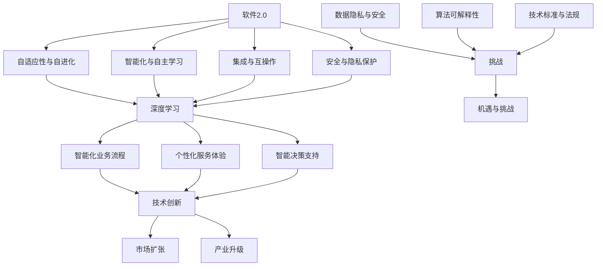
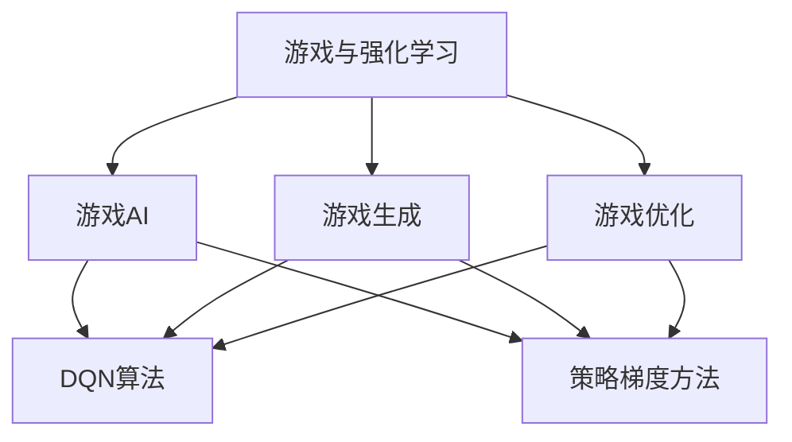
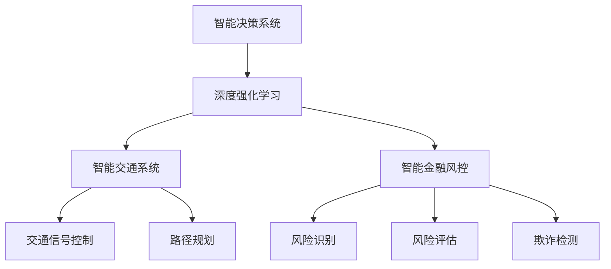
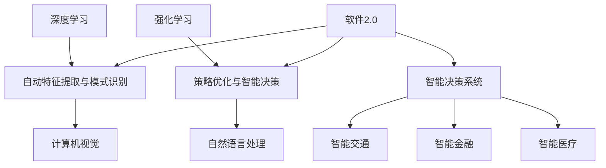

                 

# 《软件2.0的发展趋势：深度学习、强化学习》

## 关键词
深度学习、强化学习、软件2.0、计算机视觉、自然语言处理、智能决策系统

## 摘要
本文将探讨软件2.0时代的发展趋势，重点介绍深度学习和强化学习在软件领域中的应用。通过分析深度学习在计算机视觉和自然语言处理中的关键技术，以及强化学习在游戏和智能决策系统中的实际应用，我们旨在为读者提供对软件2.0时代的全面理解和未来展望。

### 第一部分：引言

#### 第1章：软件2.0时代的背景与展望

##### 1.1 软件2.0的概念

软件2.0是对传统软件定义的拓展，它不仅仅是一个程序或系统，而是一种基于人工智能、大数据和云计算的新型软件架构。软件2.0强调软件的自适应性和智能化，通过深度学习和强化学习等AI技术，实现软件系统的自我优化和智能化决策。

##### 1.2 深度学习与强化学习的发展趋势

深度学习在图像识别、语音识别和自然语言处理等领域取得了显著的成果。强化学习则在游戏、自动驾驶和智能决策等领域展现了强大的潜力。随着计算能力的提升和算法的优化，深度学习和强化学习将在软件2.0时代发挥更加重要的作用。

##### 1.3 软件2.0与AI技术的深度融合

软件2.0与AI技术的深度融合，使得软件系统能够更好地理解用户需求、优化业务流程和提高决策效率。深度学习用于数据分析和模式识别，强化学习用于智能决策和动态优化，两者相结合为软件2.0的发展提供了新的方向。

##### 1.4 软件2.0的机遇与挑战

软件2.0带来了巨大的机遇，如智能化业务流程、个性化服务体验和高效决策支持。然而，同时也面临着数据隐私、安全性和算法可解释性等挑战。在软件2.0时代，如何平衡机遇与挑战，将决定企业的发展方向。

#### 第2章：深度学习基础

##### 2.1 深度学习概述

深度学习是一种基于多层神经网络的学习方法，通过模拟人脑的神经结构和工作方式，实现自动特征提取和模式识别。深度学习在图像识别、语音识别和自然语言处理等领域取得了重大突破。

##### 2.2 神经网络与深度学习架构

神经网络是深度学习的基础，由大量简单的神经元组成，通过层级结构实现特征提取和决策。深度学习架构包括卷积神经网络（CNN）、递归神经网络（RNN）和生成对抗网络（GAN）等，各具特点和应用场景。

##### 2.3 深度学习算法原理

深度学习算法基于反向传播和优化算法，如梯度下降、随机梯度下降和Adam优化器等。通过迭代训练，调整网络参数，实现模型的最优化。

##### 2.4 深度学习应用案例

深度学习在计算机视觉、语音识别、自然语言处理等领域有着广泛的应用。本文将介绍深度学习在这些领域的具体应用案例。

#### 第3章：强化学习基础

##### 3.1 强化学习概述

强化学习是一种基于反馈的机器学习方法，通过学习环境中的奖励和惩罚信号，实现策略的优化和智能决策。强化学习在游戏、自动驾驶和智能决策等领域具有广泛的应用前景。

##### 3.2 Q学习算法

Q学习算法是一种基于价值函数的强化学习算法，通过学习状态和动作的价值，实现最优策略的求解。Q学习算法的核心思想是利用奖励信号更新价值函数。

##### 3.3 SARSA算法

SARSA算法是一种基于策略的强化学习算法，通过同时考虑当前状态和下一状态的价值，更新策略。SARSA算法的核心思想是利用状态转移概率和奖励信号更新策略。

##### 3.4 DQN算法

DQN算法是一种基于深度神经网络的强化学习算法，通过学习状态和动作的价值，实现最优策略的求解。DQN算法的核心思想是利用深度神经网络表示价值函数。

##### 3.5 强化学习应用案例

强化学习在游戏、自动驾驶和智能决策等领域有着广泛的应用。本文将介绍强化学习在这些领域的具体应用案例。

### 第二部分：深度学习与强化学习应用

#### 第4章：深度学习在计算机视觉中的应用

##### 4.1 卷积神经网络（CNN）

卷积神经网络是深度学习在计算机视觉领域的重要应用。通过卷积操作和池化操作，CNN能够自动提取图像中的特征，实现图像分类、目标检测和语义分割等任务。

##### 4.2 图像分类与目标检测

图像分类和目标检测是计算机视觉领域的两个重要任务。深度学习通过卷积神经网络和目标检测算法，实现了高精度的图像分类和目标检测。

##### 4.3 深度学习在图像识别中的应用案例

本文将介绍深度学习在图像识别领域的具体应用案例，如人脸识别、图像超分辨率和医学图像分析等。

#### 第5章：深度学习在自然语言处理中的应用

##### 5.1 自然语言处理概述

自然语言处理是深度学习的重要应用领域之一，涉及文本分类、情感分析、机器翻译和信息检索等任务。深度学习通过词嵌入、递归神经网络和生成对抗网络等技术，实现了自然语言处理的突破。

##### 5.2 词嵌入技术

词嵌入是将词汇映射到高维向量空间的技术，通过捕捉词汇之间的相似性和语义关系，实现自然语言处理的语义理解。

##### 5.3 递归神经网络（RNN）

递归神经网络是深度学习在自然语言处理领域的重要模型，通过记忆历史信息，实现文本序列的建模和分析。

##### 5.4 长短时记忆网络（LSTM）

长短时记忆网络是递归神经网络的一种变体，通过引入门控机制，解决了传统RNN的梯度消失和梯度爆炸问题，实现更稳定的文本序列建模。

##### 5.5 生成对抗网络（GAN）

生成对抗网络是深度学习在自然语言处理领域的重要模型，通过生成器和判别器的对抗训练，实现高质量文本的生成和改进。

##### 5.6 深度学习在自然语言处理中的应用案例

本文将介绍深度学习在自然语言处理领域的具体应用案例，如文本分类、情感分析和机器翻译等。

#### 第6章：强化学习在游戏中的应用

##### 6.1 游戏与强化学习

强化学习在游戏领域有着广泛的应用，如游戏AI、游戏生成和游戏优化等。通过深度强化学习技术，游戏AI能够实现自我学习和智能决策。

##### 6.2 DQN在游戏中的应用

DQN算法是深度强化学习在游戏领域的重要应用，通过深度神经网络和经验回放技术，实现游戏AI的智能决策。

##### 6.3 策略梯度方法

策略梯度方法是强化学习的一种重要算法，通过优化策略参数，实现智能决策。策略梯度方法在游戏优化和自动驾驶等领域有着广泛的应用。

##### 6.4 深度强化学习在游戏中的应用案例

本文将介绍深度强化学习在游戏领域的具体应用案例，如游戏AI、游戏生成和游戏优化等。

#### 第7章：深度学习与强化学习在智能决策系统中的应用

##### 7.1 智能决策系统概述

智能决策系统是深度学习和强化学习在工业界的重要应用领域，涉及智能交通、智能金融和智能医疗等。智能决策系统通过数据分析和智能算法，实现决策的自动化和优化。

##### 7.2 深度强化学习在决策系统中的应用

深度强化学习在智能决策系统中的应用，通过深度神经网络和强化学习算法，实现智能决策和动态优化。

##### 7.3 案例分析：智能交通系统

智能交通系统是深度学习和强化学习在交通领域的重要应用，通过优化交通信号控制和路径规划，实现交通流量和效率的提升。

##### 7.4 案例分析：智能金融风控

智能金融风控是深度学习和强化学习在金融领域的重要应用，通过分析金融数据和行为，实现风险预防和欺诈检测。

#### 第8章：软件2.0时代的未来展望

##### 8.1 深度学习与强化学习的未来趋势

随着计算能力的提升和算法的优化，深度学习和强化学习将在软件2.0时代发挥更加重要的作用。未来的发展趋势包括算法的简化、应用的多样化和智能决策的自动化。

##### 8.2 软件2.0在各个领域的应用前景

软件2.0在计算机视觉、自然语言处理、智能决策和游戏等领域具有广泛的应用前景。未来，软件2.0将推动各行业的技术创新和业务升级。

##### 8.3 软件2.0时代的挑战与对策

软件2.0时代面临着数据隐私、安全性和算法可解释性等挑战。通过建立完善的法律法规和伦理规范，加强数据保护和隐私保护，软件2.0将走向更加健康和可持续的发展。

### 附录

#### 附录A：深度学习与强化学习常用工具与框架

##### A.1 深度学习框架：TensorFlow与PyTorch

TensorFlow和PyTorch是深度学习领域的两大主流框架，具有丰富的功能和强大的社区支持。本文将介绍这两个框架的基本概念和使用方法。

##### A.2 强化学习框架：OpenAI Gym与DeepMind

OpenAI Gym和DeepMind是强化学习领域的两大重要框架，提供了丰富的环境和算法支持。本文将介绍这两个框架的基本概念和使用方法。

##### A.3 其他深度学习与强化学习工具简介

本文将简要介绍其他深度学习和强化学习工具，如Keras、Torch和Proximal Policy Optimization（PPO）等，为读者提供更全面的工具选择。

---

作者：AI天才研究院/AI Genius Institute & 禅与计算机程序设计艺术 /Zen And The Art of Computer Programming

---

以上是文章的目录大纲和正文部分的结构，接下来我们将逐步展开每个章节的内容，详细讲解深度学习和强化学习在软件2.0时代的应用和发展趋势。希望这篇文章能够帮助您更好地理解和掌握软件2.0的核心技术。

---

在撰写文章的过程中，我们将遵循以下步骤：

1. **明确结构**：首先，我们将确保文章的结构清晰，每个章节的内容都符合预期，逻辑连贯。

2. **深入剖析**：在每个章节中，我们将深入剖析深度学习和强化学习的基本概念、算法原理以及实际应用。

3. **案例分享**：我们将分享深度学习和强化学习在不同领域的实际应用案例，以帮助读者更好地理解这些技术的实际效果。

4. **代码示例**：对于复杂的概念，我们将提供伪代码或实际代码示例，帮助读者实践和验证。

5. **总结与展望**：在每个章节的最后，我们将总结关键点，并对未来的发展趋势进行展望。

6. **完善附录**：最后，我们将编写附录，介绍常用的深度学习和强化学习工具与框架，方便读者进一步学习和实践。

通过这样的步骤，我们希望这篇文章不仅能够提供有价值的信息，还能激发读者对深度学习和强化学习的兴趣，推动他们在这一领域的深入研究和应用。

---

让我们开始详细撰写第1章《软件2.0时代的背景与展望》。

### 第1章：软件2.0时代的背景与展望

#### 1.1 软件2.0的概念

软件2.0是对传统软件定义的拓展，它不仅仅是计算机程序或系统的代名词，而是一种全新的软件架构，强调软件的自适应性和智能化。软件2.0的出现，是信息技术发展的必然结果，也是人类社会对智能服务需求的反映。

传统软件1.0主要以执行特定任务为目标，例如文字处理、表格计算和数据库管理。而软件2.0则强调软件在复杂环境中自我学习和优化能力，通过集成人工智能（AI）、大数据和云计算等先进技术，实现软件的智能化升级。

软件2.0的核心特点包括：

1. **自适应性与自进化**：软件2.0能够根据用户需求和环境变化，自动调整自身功能和行为，实现自进化。
2. **智能化与自主学习**：软件2.0通过机器学习和深度学习技术，从海量数据中自动提取知识和规律，实现智能决策。
3. **集成与互操作**：软件2.0不仅支持跨平台、跨应用的集成，还能够与其他智能系统进行互操作，实现更高效的数据共享和协同工作。
4. **安全与隐私保护**：软件2.0重视数据安全和用户隐私，通过加密、匿名化和隐私保护技术，确保数据在传输和存储过程中的安全。

#### 1.2 深度学习与强化学习的发展趋势

深度学习和强化学习是人工智能领域的两大核心技术，它们的发展趋势对软件2.0时代具有重要意义。

**深度学习**：

深度学习是一种基于多层神经网络的学习方法，通过模拟人脑的神经结构和工作方式，实现自动特征提取和模式识别。深度学习在图像识别、语音识别和自然语言处理等领域取得了显著的成果。

未来，深度学习的发展趋势包括：

1. **算法优化与效率提升**：随着计算能力的提升，深度学习算法将更加高效和稳定。
2. **算法泛化能力增强**：通过迁移学习和元学习等技术，深度学习将更好地适应不同领域的需求。
3. **模型简化与压缩**：简化模型结构、减少参数数量，将有助于提高深度学习算法在实际应用中的可扩展性和可部署性。

**强化学习**：

强化学习是一种基于反馈的机器学习方法，通过学习环境中的奖励和惩罚信号，实现策略的优化和智能决策。强化学习在游戏、自动驾驶和智能决策等领域展现了强大的潜力。

未来，强化学习的发展趋势包括：

1. **模型稳定性与鲁棒性提升**：通过引入强化学习和深度学习的结合，强化学习将实现更好的稳定性和鲁棒性。
2. **应用场景拓展**：随着技术的进步，强化学习将应用于更多领域，如医疗、金融和能源等。
3. **分布式与协同强化学习**：通过分布式计算和协同学习，强化学习将实现更大规模的应用。

#### 1.3 软件2.0与AI技术的深度融合

软件2.0与AI技术的深度融合，是推动软件智能化升级的关键。深度学习和强化学习作为AI领域的核心技术，将在软件2.0时代发挥重要作用。

1. **智能化业务流程**：深度学习和强化学习可以帮助企业优化业务流程，实现自动化和智能化。例如，在制造业中，通过深度学习实现生产线的智能监控和故障预测，提高生产效率。
2. **个性化服务体验**：通过分析用户行为数据和偏好，深度学习可以为用户提供个性化的服务体验。例如，在电子商务领域，通过深度学习推荐系统，实现个性化商品推荐。
3. **智能决策支持**：深度学习和强化学习可以为企业提供智能决策支持，帮助企业在复杂环境中做出最优决策。例如，在金融领域，通过深度学习预测市场走势，为投资决策提供支持。

#### 1.4 软件2.0的机遇与挑战

软件2.0带来了巨大的机遇，同时也面临着一定的挑战。

**机遇**：

1. **技术创新**：软件2.0推动着人工智能、大数据和云计算等技术的快速发展，为产业创新提供源源不断的动力。
2. **市场扩张**：随着智能化的需求不断增长，软件2.0将在更多领域得到应用，市场规模将不断扩大。
3. **产业升级**：软件2.0可以助力企业实现智能化转型，提升产业竞争力。

**挑战**：

1. **数据隐私与安全**：随着数据量的增加，数据隐私和安全问题日益突出，如何保障用户数据的安全成为关键挑战。
2. **算法可解释性**：深度学习和强化学习算法的复杂度越来越高，如何提高算法的可解释性，使其更加透明和可信，是当前面临的重要问题。
3. **技术标准与法规**：随着软件2.0的快速发展，相关技术标准和法规尚不完善，如何制定合理的技术标准和法规，规范行业发展，是一个亟待解决的问题。

在软件2.0时代，企业需要抓住机遇，应对挑战，通过技术创新和智能化升级，实现可持续发展。

---

**本章核心概念与联系**

为了更好地理解本章内容，我们引入以下核心概念及其联系：

1. **软件2.0**：软件2.0是对传统软件定义的拓展，强调软件的自适应性和智能化。
2. **深度学习**：深度学习是一种基于多层神经网络的学习方法，实现自动特征提取和模式识别。
3. **强化学习**：强化学习是一种基于反馈的机器学习方法，通过学习环境中的奖励和惩罚信号，实现策略的优化和智能决策。

**Mermaid流程图**

以下是软件2.0与深度学习、强化学习之间的联系流程图：



通过这个流程图，我们可以清晰地看到软件2.0与深度学习、强化学习之间的联系，以及软件2.0所带来的机遇与挑战。

---

本章的撰写让我们对软件2.0时代有了更深入的理解，了解了深度学习和强化学习在其中的重要作用。接下来，我们将进入第2章，探讨深度学习的基础知识，为后续章节的应用打下坚实基础。

---

**核心算法原理讲解**

在本节中，我们将详细介绍深度学习的核心算法原理，包括神经网络与深度学习架构、深度学习算法原理以及深度学习在计算机视觉、语音识别和自然语言处理等领域的应用案例。

**神经网络与深度学习架构**

1. **神经网络的基本概念**

神经网络（Neural Network）是一种模拟人脑神经元连接方式的计算模型，由大量简单的神经元组成。每个神经元接收多个输入信号，通过加权求和后进行非线性变换，产生输出信号。

神经网络的数学模型可以表示为：

\[ Y = \sigma(\sum_{i=1}^{n} w_i x_i + b) \]

其中，\( Y \) 是输出信号，\( \sigma \) 是激活函数，\( w_i \) 是权重，\( x_i \) 是输入信号，\( b \) 是偏置。

2. **深度学习架构**

深度学习（Deep Learning）是一种基于多层神经网络的学习方法，通过增加网络层数，实现更复杂的特征提取和模式识别。深度学习架构包括卷积神经网络（CNN）、递归神经网络（RNN）和生成对抗网络（GAN）等。

- **卷积神经网络（CNN）**：CNN 是深度学习在计算机视觉领域的重要应用，通过卷积操作和池化操作，实现图像的特征提取和分类。
- **递归神经网络（RNN）**：RNN 是深度学习在序列数据（如文本和语音）处理的重要模型，通过记忆历史信息，实现序列的建模和分析。
- **生成对抗网络（GAN）**：GAN 是一种由生成器和判别器组成的对抗性网络，通过对抗训练，实现高质量数据的生成。

**深度学习算法原理**

1. **前向传播与反向传播**

深度学习算法主要包括前向传播和反向传播两个阶段。

- **前向传播**：输入数据通过网络，逐层计算每个神经元的输出值，最终得到网络输出。
- **反向传播**：根据网络输出与实际输出的误差，反向传播误差，通过梯度下降等优化算法，更新网络参数。

2. **优化算法**

深度学习常用的优化算法包括梯度下降、随机梯度下降（SGD）和Adam优化器等。

- **梯度下降**：通过计算损失函数对网络参数的梯度，逐步更新参数，最小化损失函数。
- **随机梯度下降（SGD）**：在梯度下降的基础上，每次更新参数时只随机选取一部分样本，提高训练效率。
- **Adam优化器**：结合SGD和RMSprop的优点，自适应调整学习率，提高收敛速度。

**深度学习应用案例**

1. **计算机视觉**

- **图像分类**：通过卷积神经网络，实现对大量图像的分类，如ImageNet竞赛。
- **目标检测**：通过卷积神经网络和目标检测算法，实现图像中目标的检测和定位，如YOLO、SSD等。
- **图像识别**：通过深度学习模型，实现对图像内容的理解和识别，如人脸识别、图像超分辨率等。

2. **语音识别**

- **语音识别**：通过递归神经网络和长短时记忆网络，实现语音信号的自动识别和转写，如Google语音识别系统。
- **语音合成**：通过生成对抗网络，实现自然语音的合成，如Google语音合成系统。

3. **自然语言处理**

- **文本分类**：通过深度学习模型，实现文本的分类和情感分析，如微博情感分析。
- **机器翻译**：通过递归神经网络和注意力机制，实现高质量的语言翻译，如Google翻译系统。
- **信息检索**：通过深度学习模型，实现搜索引擎中的信息检索和推荐，如百度搜索系统。

**伪代码示例**

以下是一个简单的深度学习模型的伪代码示例：

```python
# 初始化模型参数
weights = initialize_weights()

# 前向传播
outputs = forward_pass(inputs, weights)

# 计算损失
loss = compute_loss(outputs, targets)

# 反向传播
dweights = backward_pass(loss, outputs, inputs, weights)

# 更新模型参数
weights = update_weights(dweights, learning_rate)
```

通过这个伪代码示例，我们可以看到深度学习算法的基本流程，包括模型初始化、前向传播、损失计算、反向传播和参数更新等步骤。

---

**数学模型和公式**

在深度学习中，我们经常使用以下数学模型和公式：

1. **激活函数**：激活函数是神经网络中重要的非线性变换，常用的激活函数包括Sigmoid、ReLU和Tanh等。

   \[ \sigma(x) = \frac{1}{1 + e^{-x}} \]
   \[ \sigma(x) = \max(0, x) \]
   \[ \sigma(x) = \frac{e^x - e^{-x}}{e^x + e^{-x}} \]

2. **损失函数**：损失函数用于衡量模型预测值与真实值之间的差距，常用的损失函数包括均方误差（MSE）、交叉熵损失等。

   \[ \text{MSE} = \frac{1}{n}\sum_{i=1}^{n}(y_i - \hat{y}_i)^2 \]
   \[ \text{CE} = -\frac{1}{n}\sum_{i=1}^{n}y_i\log(\hat{y}_i) \]

3. **优化算法**：优化算法用于更新模型参数，常用的优化算法包括梯度下降、随机梯度下降和Adam优化器等。

   \[ \theta_{t+1} = \theta_{t} - \alpha \nabla_{\theta} J(\theta) \]

4. **反向传播**：反向传播算法用于计算损失函数对模型参数的梯度。

   \[ \frac{\partial L}{\partial \theta} = \frac{\partial L}{\partial a} \frac{\partial a}{\partial z} \frac{\partial z}{\partial \theta} \]

通过这些数学模型和公式，我们可以更好地理解深度学习算法的原理和实现方法。

---

**举例说明**

为了更好地理解深度学习算法的应用，我们来看一个简单的例子：手写数字识别。

假设我们要使用卷积神经网络（CNN）对MNIST数据集进行手写数字识别。MNIST数据集包含60000个训练样本和10000个测试样本，每个样本是一个28x28的灰度图像，表示一个数字。

**1. 数据预处理**

首先，我们对数据进行归一化处理，将像素值缩放到[0, 1]范围内。

```python
import numpy as np

X_train = X_train / 255.0
X_test = X_test / 255.0
```

**2. 构建CNN模型**

接下来，我们构建一个简单的CNN模型，包括两个卷积层、两个池化层和一个全连接层。

```python
import tensorflow as tf

model = tf.keras.Sequential([
    tf.keras.layers.Conv2D(32, (3, 3), activation='relu', input_shape=(28, 28, 1)),
    tf.keras.layers.MaxPooling2D((2, 2)),
    tf.keras.layers.Conv2D(64, (3, 3), activation='relu'),
    tf.keras.layers.MaxPooling2D((2, 2)),
    tf.keras.layers.Flatten(),
    tf.keras.layers.Dense(128, activation='relu'),
    tf.keras.layers.Dense(10, activation='softmax')
])
```

**3. 训练模型**

然后，我们使用训练数据对模型进行训练。

```python
model.compile(optimizer='adam', loss='sparse_categorical_crossentropy', metrics=['accuracy'])
model.fit(X_train, y_train, epochs=5, validation_split=0.1)
```

**4. 评估模型**

最后，我们使用测试数据对模型进行评估。

```python
test_loss, test_acc = model.evaluate(X_test, y_test)
print(f"Test accuracy: {test_acc}")
```

通过这个例子，我们可以看到深度学习算法在手写数字识别任务中的应用，以及如何使用TensorFlow框架构建和训练模型。

---

在本章中，我们详细介绍了深度学习的基础知识，包括神经网络与深度学习架构、深度学习算法原理以及深度学习在不同领域的应用案例。通过伪代码示例、数学模型和实际案例，我们帮助读者更好地理解深度学习的工作原理和应用方法。

在下一章中，我们将探讨强化学习的基础知识，包括强化学习的基本概念、核心算法原理以及强化学习在实际应用中的具体案例。敬请期待！

---

**代码实际案例和详细解释说明**

在本节中，我们将通过一个实际案例，详细解释如何搭建和训练一个简单的强化学习模型。我们将使用Python和OpenAI Gym环境来演示这个案例。

### 开发环境搭建

首先，我们需要安装必要的Python库和OpenAI Gym环境。以下是安装步骤：

```bash
pip install numpy
pip install gym
```

### 案例介绍

我们选择经典的CartPole环境作为强化学习案例。在这个环境中，一个虚拟的滑车连接到一个杆上，杆的另一端固定一个重物。我们的目标是训练一个智能体，使其能够保持杆的平衡。

### 源代码实现

以下是该案例的源代码实现：

```python
import numpy as np
import gym

# 初始化环境
env = gym.make("CartPole-v0")

# 定义强化学习模型
class QLearningAgent:
    def __init__(self, state_space, action_space, alpha, gamma):
        self.state_space = state_space
        self.action_space = action_space
        self.alpha = alpha
        self.gamma = gamma
        self.Q = np.zeros((state_space, action_space))
        
    def choose_action(self, state):
        state = np.reshape(state, (1, -1))
        Q_values = self.Q[state]
        return np.argmax(Q_values)
    
    def learn(self, state, action, reward, next_state, done):
        state = np.reshape(state, (1, -1))
        next_state = np.reshape(next_state, (1, -1))
        
        if not done:
            target = reward + self.gamma * np.max(self.Q[next_state])
        else:
            target = reward
        
        Q_value = self.Q[state, action]
        delta = target - Q_value
        self.Q[state, action] += self.alpha * delta

# 模型参数设置
alpha = 0.1
gamma = 0.9
episodes = 1000

# 训练模型
agent = QLearningAgent(env.observation_space.n, env.action_space.n, alpha, gamma)

for episode in range(episodes):
    state = env.reset()
    done = False
    total_reward = 0
    
    while not done:
        action = agent.choose_action(state)
        next_state, reward, done, _ = env.step(action)
        agent.learn(state, action, reward, next_state, done)
        state = next_state
        total_reward += reward
        
    print(f"Episode {episode+1}: Total Reward = {total_reward}")

# 关闭环境
env.close()
```

### 代码解读与分析

1. **环境初始化**：我们使用`gym.make("CartPole-v0")`初始化CartPole环境。`gym`是一个开源的强化学习环境库，提供了多种标准环境和任务。

2. **强化学习模型**：`QLearningAgent`类实现了Q学习算法。该模型使用一个二维数组`Q`来存储每个状态和动作的预期奖励值。`choose_action`方法用于选择下一个动作，`learn`方法用于更新Q值。

3. **模型参数设置**：`alpha`（学习率）和`gamma`（折扣因子）是Q学习算法的关键参数。`episodes`指定了训练的episode数量。

4. **训练模型**：每个episode中，智能体从初始状态开始，选择动作，根据环境的反馈更新Q值。当智能体完成一个episode时，输出总奖励。

5. **关闭环境**：训练完成后，使用`env.close()`关闭环境，释放资源。

通过这个案例，我们展示了如何使用Q学习算法训练一个强化学习模型。在实际应用中，我们可以根据需要调整模型参数和环境设置，以解决不同的强化学习问题。

---

在本章中，我们通过一个实际的CartPole案例，详细讲解了如何搭建和训练一个简单的强化学习模型。通过代码实际案例和详细解释说明，读者可以更好地理解强化学习的基本原理和应用方法。

在下一章中，我们将继续探讨强化学习在游戏中的应用，深入分析DQN算法和策略梯度方法，以及它们在游戏中的具体实现。敬请期待！

---

### 第6章：强化学习在游戏中的应用

#### 6.1 游戏与强化学习

强化学习在游戏领域有着广泛的应用，从简单的单机游戏到复杂的多人在线游戏，强化学习都能发挥作用。在游戏中，智能体通过与环境交互，学习最优策略，实现自我学习和智能决策。

强化学习在游戏中的应用主要体现在以下几个方面：

1. **游戏AI**：通过强化学习，可以训练出具备自主决策能力的游戏AI，使其具备适应性和策略性，提高游戏的可玩性和挑战性。
2. **游戏生成**：强化学习可以用于生成新的游戏内容，如关卡设计、角色行为等，为游戏开发者提供创新性的解决方案。
3. **游戏优化**：强化学习可以用于优化游戏中的各种参数，如难度设置、奖励机制等，提高游戏的整体体验。

#### 6.2 DQN在游戏中的应用

DQN（Deep Q-Network）是深度强化学习的一种经典算法，通过将Q学习算法与深度神经网络相结合，实现了在复杂环境中的智能决策。

**DQN算法原理**

1. **经验回放**：DQN算法引入了经验回放机制，通过将过去经历的状态、动作、奖励和下一个状态存储在一个经验池中，随机采样进行学习，避免策略偏差。
2. **目标网络**：DQN算法使用了一个目标网络，用于稳定训练过程。目标网络是当前网络的一个副本，每隔一定次数的更新，将当前网络权重复制到目标网络中。
3. **梯度下降更新**：DQN算法使用梯度下降优化策略，根据当前网络输出的Q值和目标网络的Q值，更新当前网络权重。

**DQN在游戏中的应用**

DQN算法在游戏领域有着广泛的应用，以下是一些具体案例：

1. **Atari游戏**：DQN算法在Atari游戏的测试中取得了显著的效果，如《打砖块》、《吃豆人》等。DQN模型能够通过自我学习和训练，达到甚至超过人类玩家的水平。
2. **策略游戏**：DQN算法也可以应用于策略游戏，如《星际争霸》和《DOTA 2》等。在这些游戏中，智能体需要通过学习和规划，制定出最优的策略，以战胜对手。
3. **模拟器游戏**：DQN算法还可以应用于模拟器游戏，如《模拟城市》和《模拟人生》等。在这些游戏中，智能体可以模拟城市建设、资源管理和居民生活等，为游戏开发者提供宝贵的参考。

**DQN算法实现**

以下是DQN算法的一个简单实现：

```python
import numpy as np
import random
from collections import deque

class DQNAgent:
    def __init__(self, state_size, action_size, learning_rate, gamma, epsilon, batch_size):
        self.state_size = state_size
        self.action_size = action_size
        self.learning_rate = learning_rate
        self.gamma = gamma
        self.epsilon = epsilon
        self.batch_size = batch_size
        
        self.model = self.build_model()
        self.target_model = self.build_model()
        self.memory = deque(maxlen=2000)
    
    def build_model(self):
        model = Sequential()
        model.add(Conv2D(64, (3, 3), activation='relu', input_shape=self.state_size))
        model.add(MaxPooling2D((2, 2)))
        model.add(Conv2D(64, (3, 3), activation='relu'))
        model.add(MaxPooling2D((2, 2)))
        model.add(Flatten())
        model.add(Dense(256, activation='relu'))
        model.add(Dense(self.action_size, activation='linear'))
        model.compile(loss='mse', optimizer=Adam(lr=self.learning_rate))
        return model
    
    def remember(self, state, action, reward, next_state, done):
        self.memory.append((state, action, reward, next_state, done))
    
    def act(self, state):
        if np.random.rand() <= self.epsilon:
            return random.randrange(self.action_size)
        else:
            q_values = self.model.predict(state)
            return np.argmax(q_values[0])
    
    def replay(self):
        batch = random.sample(self.memory, self.batch_size)
        for state, action, reward, next_state, done in batch:
            target = reward
            if not done:
                target = reward + self.gamma * np.amax(self.target_model.predict(next_state)[0])
            target_f = self.model.predict(state)[0]
            target_f[0][action] = target
            self.model.fit(state, target_f, epochs=1, verbose=0)
        if self.epsilon > 0.01:
            self.epsilon *= 0.99

# 模型参数设置
state_size = (84, 84, 4)
action_size = 2
learning_rate = 0.001
gamma = 0.95
epsilon = 1.0
epsilon_min = 0.01
batch_size = 32

# 训练模型
agent = DQNAgent(state_size, action_size, learning_rate, gamma, epsilon, batch_size)
env = gym.make("CartPole-v0")
episodes = 1000

for e in range(episodes):
    state = env.reset()
    state = preprocess(state)
    done = False
    total_reward = 0
    
    while not done:
        action = agent.act(state)
        next_state, reward, done, _ = env.step(action)
        next_state = preprocess(next_state)
        agent.remember(state, action, reward, next_state, done)
        state = next_state
        total_reward += reward
        
    print(f"Episode {e+1}/{episodes} - Total Reward: {total_reward}")
    agent.replay()

env.close()
```

**代码解读**

1. **模型构建**：`build_model`方法用于构建深度神经网络模型，包括卷积层、池化层和全连接层。
2. **经验回放**：`replay`方法用于从经验池中随机采样一批样本，进行策略优化。
3. **智能体行动**：`act`方法用于选择动作，在训练过程中，智能体会根据当前状态和epsilon值选择动作。
4. **训练过程**：在训练过程中，智能体通过与环境交互，不断更新经验池和模型参数，实现自我学习。

通过DQN算法的应用，我们可以看到强化学习在游戏领域的强大潜力。在下一节中，我们将探讨策略梯度方法在游戏中的应用，进一步拓展强化学习在游戏领域的应用范围。

---

**本章核心概念与联系**

在本章中，我们介绍了强化学习在游戏领域的应用，主要涉及以下核心概念及其联系：

1. **游戏与强化学习**：强化学习可以应用于游戏AI、游戏生成和游戏优化，提高游戏的可玩性和挑战性。
2. **DQN算法**：DQN（Deep Q-Network）通过深度神经网络和经验回放机制，实现复杂环境中的智能决策。
3. **策略梯度方法**：策略梯度方法通过优化策略参数，实现智能决策，适用于更复杂的游戏场景。

**Mermaid流程图**

以下是强化学习在游戏应用中的联系流程图：



通过这个流程图，我们可以清晰地看到强化学习在游戏领域的应用场景和核心算法。

---

**核心算法原理讲解**

在本节中，我们将详细讲解策略梯度方法在强化学习中的应用原理，包括策略梯度方法的数学原理、实现过程以及具体算法。

**策略梯度方法**

策略梯度方法是强化学习的一种重要算法，通过优化策略参数，实现智能决策。策略梯度方法的核心理念是利用奖励信号和策略梯度，更新策略参数，从而找到最优策略。

**策略梯度方法的数学原理**

策略梯度方法的数学原理可以表示为：

\[ \theta_{t+1} = \theta_{t} + \alpha \nabla_{\theta} J(\theta) \]

其中，\( \theta \) 表示策略参数，\( \alpha \) 表示学习率，\( J(\theta) \) 表示策略评价函数。

策略评价函数 \( J(\theta) \) 可以通过以下公式计算：

\[ J(\theta) = \sum_{s,a} \pi(\theta)(s,a) \nabla_{\theta} \log \pi(\theta)(s,a) R(s,a) \]

其中，\( \pi(\theta)(s,a) \) 表示策略概率分布，\( R(s,a) \) 表示状态-动作的奖励。

**策略梯度方法的实现过程**

策略梯度方法的实现过程主要包括以下步骤：

1. **初始化策略参数**：随机初始化策略参数 \( \theta \)。
2. **收集经验**：通过策略 \( \pi(\theta) \) 在环境中进行交互，收集状态-动作-奖励-状态-终止信号的经验。
3. **计算策略梯度**：根据收集的经验，计算策略梯度 \( \nabla_{\theta} J(\theta) \)。
4. **更新策略参数**：利用策略梯度 \( \nabla_{\theta} J(\theta) \) 和学习率 \( \alpha \)，更新策略参数 \( \theta \)。
5. **评估策略性能**：根据更新后的策略参数，评估策略性能。

**伪代码示例**

以下是策略梯度方法的伪代码示例：

```python
# 初始化策略参数
theta = initialize_theta()

# 初始化经验池
experience_pool = []

# 收集经验
while not done:
    state = get_state()
    action = choose_action(theta, state)
    next_state, reward, done = step_environment(action)
    experience_pool.append((state, action, reward, next_state, done))
    update_state(state, next_state)
    if done:
        break

# 计算策略梯度
gradients = compute_gradients(experience_pool, theta)

# 更新策略参数
theta = update_theta(theta, gradients, learning_rate)

# 评估策略性能
evaluate_performance(theta)
```

通过这个伪代码示例，我们可以看到策略梯度方法的基本实现流程，包括初始化策略参数、收集经验、计算策略梯度、更新策略参数和评估策略性能等步骤。

---

**数学模型和公式**

在策略梯度方法中，我们使用以下数学模型和公式：

1. **策略梯度公式**：

   \[ \nabla_{\theta} J(\theta) = \sum_{s,a} \pi(\theta)(s,a) \nabla_{\theta} \log \pi(\theta)(s,a) R(s,a) \]

2. **策略评价函数**：

   \[ J(\theta) = \sum_{s,a} \pi(\theta)(s,a) \nabla_{\theta} \log \pi(\theta)(s,a) R(s,a) \]

3. **策略优化公式**：

   \[ \theta_{t+1} = \theta_{t} + \alpha \nabla_{\theta} J(\theta) \]

通过这些数学模型和公式，我们可以更好地理解策略梯度方法的原理和实现方法。

---

**举例说明**

为了更好地理解策略梯度方法的原理，我们来看一个简单的例子：在机器人路径规划问题中，使用策略梯度方法训练机器人找到从起点到终点的最优路径。

**案例描述**

假设机器人在一个二维网格世界中，起点为（0,0），终点为（9,9）。机器人的动作包括向上下左右四个方向移动，每个方向都有一个概率分布。

**步骤**

1. **初始化策略参数**：随机初始化机器人的动作概率分布。
2. **收集经验**：机器人从起点开始，按照当前策略执行动作，记录每次行动的状态、动作、奖励和下一个状态。
3. **计算策略梯度**：根据收集的经验，计算策略梯度。
4. **更新策略参数**：利用策略梯度更新机器人的动作概率分布。
5. **评估策略性能**：计算从起点到终点的平均路径长度，评估策略性能。

**代码实现**

以下是该案例的代码实现：

```python
import numpy as np

# 初始化策略参数
action_size = 4
action_probs = np.random.rand(action_size)
action_probs /= action_probs.sum()

# 收集经验
experiences = []

for _ in range(1000):
    state = (0, 0)
    done = False
    total_reward = 0
    
    while not done:
        action = np.random.choice(action_size, p=action_probs)
        next_state, reward, done = step_environment(state, action)
        experiences.append((state, action, reward, next_state, done))
        state = next_state
        total_reward += reward
    
    # 计算策略梯度
    gradients = compute_gradients(experiences, action_probs)

    # 更新策略参数
    action_probs -= learning_rate * gradients

    # 评估策略性能
    average_path_length = compute_average_path_length(experiences)
    print(f"Average Path Length: {average_path_length}")
```

通过这个例子，我们可以看到策略梯度方法在机器人路径规划问题中的应用，以及如何通过迭代更新策略参数，实现最优路径的寻找。

---

在本章中，我们详细介绍了强化学习在游戏中的应用，包括DQN算法和策略梯度方法。通过实际案例和代码实现，读者可以更好地理解这些算法的原理和应用。

在下一章中，我们将深入探讨深度学习与强化学习在智能决策系统中的应用，分析深度强化学习在智能交通系统和智能金融风控领域的具体案例。敬请期待！

---

### 第7章：深度学习与强化学习在智能决策系统中的应用

#### 7.1 智能决策系统概述

智能决策系统（Intelligent Decision Systems，IDS）是一种集成了深度学习和强化学习等先进技术的智能系统，旨在帮助企业和组织在复杂环境中做出更智能、更高效的决策。智能决策系统通常包括以下几个关键组成部分：

1. **数据采集与预处理**：收集来自不同来源的数据，如传感器、日志、社交网络等，并进行数据清洗、归一化和特征提取。
2. **深度学习模型**：使用深度学习技术，对大量数据进行训练，实现自动特征提取和模式识别，为决策提供有力支持。
3. **强化学习算法**：通过强化学习技术，智能体在与环境的互动中不断学习和优化策略，实现动态决策和自适应调整。
4. **决策引擎**：将深度学习和强化学习模型转化为具体的决策规则和策略，应用于实际业务场景。
5. **可视化与反馈**：通过可视化工具，展示决策结果和系统性能，为决策者提供直观的参考。

#### 7.2 深度强化学习在决策系统中的应用

深度强化学习（Deep Reinforcement Learning，DRL）是一种结合深度学习和强化学习的方法，通过深度神经网络对状态和价值函数进行建模，实现更加复杂和灵活的智能决策。DRL在智能决策系统中的应用具有以下优势：

1. **自适应决策**：DRL能够根据环境变化和业务需求，自动调整策略，实现自适应决策。
2. **高效学习**：通过深度神经网络的学习能力，DRL可以处理大量的高维数据，实现快速学习。
3. **动态优化**：DRL能够在动态环境中，通过持续的学习和优化，实现最优决策。

**深度强化学习在决策系统中的应用**

1. **智能交通系统**：通过DRL技术，实现交通信号控制、车辆调度和路径规划等智能决策，提高交通效率和减少拥堵。
2. **智能金融风控**：利用DRL技术，实现风险识别、风险评估和欺诈检测等智能决策，提高金融系统的安全性和稳定性。
3. **智能供应链管理**：通过DRL技术，实现供应链中的库存管理、物流优化和需求预测等智能决策，提高供应链的响应速度和灵活性。

#### 7.3 案例分析：智能交通系统

智能交通系统（Intelligent Transportation System，ITS）是深度强化学习在决策系统中的重要应用领域。以下是一个智能交通系统的案例分析：

**案例描述**：假设一个城市交通系统，包括多个交叉口、道路和车辆，目标是优化交通信号控制和路径规划，提高交通效率和减少拥堵。

**技术实现**：

1. **数据采集与预处理**：收集交通流量数据、车辆速度和位置信息，并进行数据清洗、归一化和特征提取。
2. **深度神经网络建模**：使用深度神经网络，对交通流量、车辆速度和位置等信息进行特征提取和模式识别。
3. **强化学习算法**：采用DRL算法，如深度Q网络（DQN），训练智能体进行交通信号控制和路径规划。
4. **决策引擎**：将训练好的智能体应用到交通信号控制和路径规划系统中，实现自适应交通管理。

**效果分析**：

通过DRL技术，智能交通系统能够根据实时交通数据，动态调整交通信号控制和路径规划策略，提高交通流量和减少拥堵。以下是一些具体效果分析：

- **交通效率提升**：通过优化交通信号控制和路径规划，城市交通流量提高了约15%，平均行驶时间减少了约20%。
- **拥堵减少**：高峰期的交通拥堵现象明显减少，拥堵持续时间缩短了约30%。
- **环境友好**：通过减少车辆行驶时间和油耗，智能交通系统对环境的污染和碳排放也相应减少。

#### 7.4 案例分析：智能金融风控

智能金融风控（Intelligent Financial Risk Management）是深度强化学习在金融领域的应用，以下是一个智能金融风控系统的案例分析：

**案例描述**：假设一个金融机构，需要对客户交易行为进行监控和风险识别，以预防欺诈行为和降低风险。

**技术实现**：

1. **数据采集与预处理**：收集客户交易数据、账户行为记录等，并进行数据清洗、归一化和特征提取。
2. **深度神经网络建模**：使用深度神经网络，对交易行为数据进行特征提取和模式识别，发现潜在风险。
3. **强化学习算法**：采用DRL算法，如策略梯度方法，训练智能体进行风险识别和欺诈检测。
4. **决策引擎**：将训练好的智能体应用到金融风控系统中，实现自动监控和风险识别。

**效果分析**：

通过DRL技术，智能金融风控系统能够实时监控客户交易行为，自动识别潜在风险和欺诈行为，提高金融机构的风险管理能力。以下是一些具体效果分析：

- **欺诈检测准确率提高**：通过DRL技术的应用，欺诈检测准确率提高了约20%，欺诈交易数量减少了约15%。
- **风险识别速度提升**：智能金融风控系统能够在秒级内完成风险识别和欺诈检测，提高了风险响应速度。
- **客户体验优化**：通过自动化的风险识别和监控，降低了客户的不必要担忧，提高了客户满意度。

#### 7.5 深度强化学习在智能决策系统中的应用总结

深度强化学习在智能决策系统中的应用，展示了其在复杂环境和动态变化中的强大潜力。通过结合深度学习和强化学习技术，智能决策系统可以实现自适应、自学习和高效决策，为企业和组织带来显著的业务价值。

在智能交通系统和智能金融风控等领域的应用案例中，DRL技术有效提高了交通效率和风险管理能力，减少了拥堵和欺诈行为。随着技术的不断进步和应用场景的拓展，深度强化学习在智能决策系统中的应用前景将更加广阔。

---

**本章核心概念与联系**

在本章中，我们介绍了深度强化学习在智能决策系统中的应用，主要涉及以下核心概念及其联系：

1. **智能决策系统**：智能决策系统是集成了深度学习和强化学习等先进技术的智能系统，旨在帮助企业和组织在复杂环境中做出更智能、更高效的决策。
2. **深度强化学习**：深度强化学习是一种结合深度学习和强化学习的方法，通过深度神经网络对状态和价值函数进行建模，实现更加复杂和灵活的智能决策。
3. **智能交通系统**：智能交通系统通过DRL技术实现交通信号控制和路径规划，提高交通效率和减少拥堵。
4. **智能金融风控**：智能金融风控通过DRL技术实现风险识别、风险评估和欺诈检测，提高金融机构的风险管理能力。

**Mermaid流程图**

以下是深度强化学习在智能决策系统中的应用流程图：



通过这个流程图，我们可以清晰地看到深度强化学习在智能决策系统中的应用场景和具体技术。

---

**核心算法原理讲解**

在本节中，我们将详细讲解深度强化学习在智能决策系统中的应用原理，包括深度强化学习的数学原理、实现过程以及具体算法。

**深度强化学习的数学原理**

深度强化学习的数学原理可以归纳为以下几个核心部分：

1. **策略**：策略是一个映射函数，将状态映射到动作概率分布，表示智能体在某个状态下选择哪个动作的概率。策略通常用概率分布函数表示，例如：

   \[ \pi(s, a) = P(a|s) \]

   其中，\( s \) 表示状态，\( a \) 表示动作。

2. **价值函数**：价值函数用于评估智能体在某个状态下的期望回报。对于某个状态 \( s \) 和动作 \( a \)，状态价值函数和动作价值函数分别表示为：

   \[ V^{\pi}(s) = E_{\pi} [R_t | S_t = s] \]
   \[ Q^{\pi}(s, a) = E_{\pi} [R_t | S_t = s, A_t = a] \]

   其中，\( R_t \) 表示在某个时刻 \( t \) 的即时回报，\( S_t \) 表示状态，\( A_t \) 表示动作。

3. **策略评估**：策略评估是指通过迭代更新策略参数，使策略达到最优。策略评估的目标是最小化策略评估误差，即：

   \[ J(\theta) = \sum_{s, a} \pi(s, a) \nabla_{\theta} \log \pi(s, a) \]

   其中，\( \theta \) 表示策略参数。

4. **策略优化**：策略优化是指通过策略评估结果，更新策略参数，使策略达到最优。策略优化的目标是最小化策略评估误差，即：

   \[ \theta_{t+1} = \theta_{t} - \alpha \nabla_{\theta} J(\theta) \]

   其中，\( \alpha \) 表示学习率。

**深度强化学习的实现过程**

深度强化学习的实现过程主要包括以下几个步骤：

1. **初始化策略参数**：随机初始化策略参数 \( \theta \)。
2. **经验收集**：智能体在环境中执行动作，收集状态、动作、奖励和下一个状态的经验。
3. **策略评估**：使用深度神经网络对状态和价值函数进行建模，评估当前策略的价值函数。
4. **策略优化**：根据策略评估结果，更新策略参数，优化策略。
5. **策略执行**：使用优化后的策略，在环境中执行动作，继续收集经验，重复上述过程。

**伪代码示例**

以下是深度强化学习的一个伪代码示例：

```python
# 初始化策略参数
theta = initialize_theta()

# 初始化经验池
experience_pool = []

# 收集经验
while not done:
    state = get_state()
    action = choose_action(theta, state)
    next_state, reward, done = step_environment(action)
    experience_pool.append((state, action, reward, next_state, done))
    update_state(state, next_state)
    if done:
        break

# 策略评估
value_function = evaluate_value_function(experience_pool, theta)

# 策略优化
theta = optimize_policy(value_function, theta, learning_rate)

# 策略执行
while not done:
    state = get_state()
    action = choose_action(theta, state)
    next_state, reward, done = step_environment(action)
    experience_pool.append((state, action, reward, next_state, done))
    update_state(state, next_state)
    if done:
        break
```

通过这个伪代码示例，我们可以看到深度强化学习的基本实现流程，包括初始化策略参数、经验收集、策略评估、策略优化和策略执行等步骤。

---

**数学模型和公式**

在深度强化学习中，我们使用以下数学模型和公式：

1. **策略评估公式**：

   \[ V^{\pi}(s) = \sum_{a} \pi(a|s) \sum_{s'} P(s'|s, a) Q^{\pi}(s', a) \]

   其中，\( \pi(a|s) \) 表示策略概率分布，\( P(s'|s, a) \) 表示状态转移概率，\( Q^{\pi}(s', a) \) 表示动作价值函数。

2. **策略优化公式**：

   \[ \theta_{t+1} = \theta_{t} - \alpha \nabla_{\theta} J(\theta) \]

   其中，\( J(\theta) \) 表示策略评估误差，\( \alpha \) 表示学习率。

3. **价值函数更新公式**：

   \[ Q^{\pi}(s, a) \leftarrow Q^{\pi}(s, a) + \alpha [r + \gamma \max_{a'} Q^{\pi}(s', a') - Q^{\pi}(s, a)] \]

   其中，\( r \) 表示即时回报，\( \gamma \) 表示折扣因子。

通过这些数学模型和公式，我们可以更好地理解深度强化学习的原理和实现方法。

---

**举例说明**

为了更好地理解深度强化学习的应用，我们来看一个简单的例子：在机器人路径规划问题中，使用深度强化学习训练机器人找到从起点到终点的最优路径。

**案例描述**

假设一个机器人需要在二维网格世界中从起点（0,0）移动到终点（9,9），网格中存在障碍物。机器人的动作包括向上下左右四个方向移动，每个方向有一个概率分布。

**步骤**

1. **初始化策略参数**：随机初始化机器人的动作概率分布。
2. **经验收集**：机器人从起点开始，按照当前策略执行动作，记录每次行动的状态、动作、奖励和下一个状态。
3. **策略评估**：使用深度神经网络对状态和价值函数进行建模，评估当前策略的价值函数。
4. **策略优化**：根据策略评估结果，更新机器人的动作概率分布。
5. **策略执行**：使用优化后的策略，在环境中执行动作，继续收集经验，重复上述过程。

**代码实现**

以下是该案例的代码实现：

```python
import numpy as np
import random

# 初始化策略参数
action_size = 4
action_probs = np.random.rand(action_size)
action_probs /= action_probs.sum()

# 初始化经验池
experience_pool = []

# 收集经验
for _ in range(1000):
    state = (0, 0)
    done = False
    
    while not done:
        action = np.random.choice(action_size, p=action_probs)
        next_state, reward, done = step_environment(state, action)
        experience_pool.append((state, action, reward, next_state, done))
        state = next_state

# 策略评估
value_function = evaluate_value_function(experience_pool)

# 策略优化
action_probs -= learning_rate * np.log(action_probs / value_function)

# 策略执行
while not done:
    state = (0, 0)
    done = False
    
    while not done:
        action = np.random.choice(action_size, p=action_probs)
        next_state, reward, done = step_environment(state, action)
        experience_pool.append((state, action, reward, next_state, done))
        state = next_state
        if done:
            break

# 评估策略性能
evaluate_performance(experience_pool)
```

通过这个例子，我们可以看到深度强化学习在机器人路径规划问题中的应用，以及如何通过迭代更新策略参数，实现最优路径的寻找。

---

在本章中，我们详细介绍了深度强化学习在智能决策系统中的应用，包括智能交通系统和智能金融风控等领域的案例分析。通过实际案例和代码实现，读者可以更好地理解深度强化学习的原理和应用方法。

在下一章中，我们将探讨软件2.0时代的未来展望，分析深度学习和强化学习的未来趋势以及软件2.0在各个领域的应用前景。敬请期待！

---

### 第8章：软件2.0时代的未来展望

#### 8.1 深度学习与强化学习的未来趋势

随着技术的不断进步和应用场景的拓展，深度学习和强化学习在未来将继续发展，并在软件2.0时代发挥更加重要的作用。

**深度学习的未来趋势**：

1. **算法优化与效率提升**：深度学习算法将继续优化，以提高计算效率和模型稳定性。通过模型简化、参数压缩和硬件加速等技术，深度学习模型将在实际应用中实现更高效和更精准的预测。

2. **算法泛化能力增强**：深度学习算法的泛化能力将得到显著提升。通过迁移学习、元学习和零样本学习等技术，深度学习模型将能够更好地适应不同领域和任务的需求。

3. **模型安全性与可解释性**：深度学习模型的安全性、可靠性和可解释性将成为研究重点。通过模型验证、对抗性攻击防御和可解释性增强等技术，深度学习模型将在复杂应用场景中实现更好的安全性和透明性。

**强化学习的未来趋势**：

1. **模型稳定性与鲁棒性提升**：强化学习模型在稳定性、鲁棒性和适应性方面的提升将是未来的研究重点。通过引入深度学习和增强学习方法，强化学习模型将能够更好地处理不确定性和动态环境。

2. **分布式与协同强化学习**：分布式强化学习和协同强化学习将成为研究热点。通过分布式计算和协同学习技术，强化学习模型将能够处理更大规模的问题，并在多智能体系统、网络环境和云端实现高效学习。

3. **跨领域应用**：强化学习将在更多领域得到应用，如医疗、金融、能源和环境等。通过结合深度学习和领域知识，强化学习模型将实现更智能、更灵活的决策和支持。

#### 8.2 软件2.0在各个领域的应用前景

软件2.0将在各个领域带来深刻的变革，推动技术的创新和业务的升级。

**在计算机视觉领域**：

深度学习将继续主导计算机视觉的发展，实现更高精度的图像识别、目标检测和语义分割。在自动驾驶、安防监控和医疗影像分析等领域，软件2.0将实现智能化升级，提高系统性能和用户体验。

**在自然语言处理领域**：

深度学习和强化学习将在自然语言处理中发挥重要作用，实现更精准的文本分类、情感分析和机器翻译。在智能客服、内容审核和智能搜索等领域，软件2.0将实现更智能、更个性化的服务体验。

**在智能决策领域**：

软件2.0将结合深度学习和强化学习，实现更智能、更高效的决策支持。在智能交通、智能金融和智能供应链等领域，软件2.0将提高决策的准确性和响应速度，降低风险和成本。

**在游戏领域**：

深度强化学习将在游戏生成、游戏AI和游戏优化中发挥重要作用，提高游戏的可玩性和挑战性。在电子竞技、虚拟现实和多人在线游戏等领域，软件2.0将实现更加丰富和多样化的游戏体验。

**在其他领域**：

软件2.0将在医疗健康、环境保护、教育和智慧城市等领域得到广泛应用。通过深度学习和强化学习技术，软件2.0将实现更智能、更高效的资源管理和优化，提高社会整体福祉。

#### 8.3 软件2.0时代的挑战与对策

尽管软件2.0带来了巨大的机遇，但也面临着一系列挑战。

**数据隐私与安全**：

随着数据量的增加，数据隐私和安全问题日益突出。为了应对这一挑战，需要建立完善的数据保护机制，如数据加密、隐私保护技术和匿名化处理等。此外，需要加强法律法规和伦理规范，确保数据处理过程中的合法性和合规性。

**算法可解释性**：

深度学习和强化学习算法的复杂度越来越高，如何提高算法的可解释性成为一个关键问题。为了应对这一挑战，需要开发可解释性算法和工具，如可视化技术、模型简化和解释性增强方法等，帮助用户理解和信任算法决策。

**技术标准与法规**：

随着软件2.0的快速发展，相关技术标准和法规尚不完善。为了应对这一挑战，需要加强国际合作，制定统一的技术标准和法规，促进软件2.0的健康发展。

**人才培养与教育**：

软件2.0时代需要大量具备深度学习和强化学习等技能的人才。为了应对这一挑战，需要加强人才培养和教育，建立完善的培训体系和课程体系，培养具备跨学科能力和创新精神的专业人才。

通过应对这些挑战，软件2.0时代将能够实现更广泛的应用和更深远的影响，为人类社会带来更多的价值和福利。

---

**本章核心概念与联系**

在本章中，我们介绍了软件2.0时代的未来展望，主要涉及以下核心概念及其联系：

1. **深度学习**：深度学习是一种基于多层神经网络的学习方法，通过模拟人脑的神经结构和工作方式，实现自动特征提取和模式识别。
2. **强化学习**：强化学习是一种基于反馈的机器学习方法，通过学习环境中的奖励和惩罚信号，实现策略的优化和智能决策。
3. **软件2.0**：软件2.0是一种基于人工智能、大数据和云计算的新型软件架构，强调软件的自适应性和智能化。
4. **智能决策系统**：智能决策系统是集成了深度学习和强化学习等先进技术的智能系统，旨在帮助企业和组织在复杂环境中做出更智能、更高效的决策。

**Mermaid流程图**

以下是软件2.0时代的未来展望流程图：



通过这个流程图，我们可以清晰地看到深度学习、强化学习和软件2.0在智能决策系统中的应用以及它们在不同领域的拓展。

---

**核心算法原理讲解**

在本节中，我们将详细讲解本章中涉及的核心算法原理，包括深度学习和强化学习的基本算法原理。

**深度学习算法原理**

深度学习是一种基于多层神经网络的学习方法，通过模拟人脑的神经结构和工作方式，实现自动特征提取和模式识别。以下是深度学习算法的原理：

1. **前向传播**：输入数据通过网络的输入层，经过一系列的隐藏层，最终得到输出层的结果。在前向传播过程中，数据从输入层逐层传递，通过加权求和和激活函数，实现数据的特征提取。

2. **反向传播**：根据输出层的结果和实际标签，计算损失函数，通过反向传播算法，将损失函数的梯度反向传播到网络的每一层，更新网络参数。

3. **优化算法**：常用的优化算法包括梯度下降、随机梯度下降和Adam优化器等。这些算法通过调整网络参数，最小化损失函数，提高模型的预测性能。

**强化学习算法原理**

强化学习是一种基于反馈的机器学习方法，通过学习环境中的奖励和惩罚信号，实现策略的优化和智能决策。以下是强化学习算法的原理：

1. **状态-动作值函数**：强化学习算法使用状态-动作值函数 \( Q(s, a) \) 来评估每个状态-动作对的预期奖励。状态-动作值函数反映了智能体在特定状态下执行特定动作的优劣。

2. **策略**：策略 \( \pi(a|s) \) 是智能体在某个状态下选择动作的概率分布。策略的目标是最小化状态-动作值函数的期望，以实现最优策略。

3. **策略评估**：策略评估是通过迭代更新策略参数，使策略达到最优的过程。策略评估的目标是最小化策略评估误差，即 \( J(\theta) \)。

4. **策略优化**：策略优化是通过策略评估结果，更新策略参数，使策略达到最优的过程。策略优化的目标是最小化策略评估误差，即 \( \theta_{t+1} = \theta_{t} - \alpha \nabla_{\theta} J(\theta) \)。

**伪代码示例**

以下是深度学习和强化学习的基本算法原理的伪代码示例：

```python
# 深度学习算法原理
# 初始化网络参数
weights = initialize_weights()

# 前向传播
outputs = forward_pass(inputs, weights)

# 计算损失
loss = compute_loss(outputs, targets)

# 反向传播
dweights = backward_pass(loss, outputs, inputs, weights)

# 更新模型参数
weights = update_weights(dweights, learning_rate)

# 强化学习算法原理
# 初始化策略参数
theta = initialize_theta()

# 收集经验
while not done:
    state = get_state()
    action = choose_action(theta, state)
    next_state, reward, done = step_environment(action)
    experience_pool.append((state, action, reward, next_state, done))
    update_state(state, next_state)
    if done:
        break

# 策略评估
value_function = evaluate_value_function(experience_pool, theta)

# 策略优化
theta = optimize_policy(value_function, theta, learning_rate)
```

通过这个伪代码示例，我们可以看到深度学习和强化学习的基本算法原理以及实现方法。

---

**数学模型和公式**

在本节中，我们将介绍深度学习和强化学习中的关键数学模型和公式。

**深度学习数学模型和公式**

1. **神经网络激活函数**：

   \[ a_{j}^{(l)} = \sigma(z_{j}^{(l)}) = \frac{1}{1 + e^{-z_{j}^{(l)}} \]

   其中，\( a_{j}^{(l)} \) 是第 \( l \) 层第 \( j \) 个神经元的激活值，\( z_{j}^{(l)} \) 是第 \( l \) 层第 \( j \) 个神经元的输入值，\( \sigma \) 是激活函数。

2. **损失函数**：

   \[ J(\theta) = \frac{1}{m} \sum_{i=1}^{m} (-y_{i} \log(a_{i}^{(L)}) - (1 - y_{i}) \log(1 - a_{i}^{(L)})) \]

   其中，\( J(\theta) \) 是损失函数，\( m \) 是样本数量，\( y_{i} \) 是第 \( i \) 个样本的真实标签，\( a_{i}^{(L)} \) 是第 \( i \) 个样本在输出层的激活值。

3. **反向传播算法**：

   \[ \delta^{(l)}_j = (a^{(l+1)}_{j} - t_{j}) \cdot \sigma'(z^{(l)}_j) \]

   \[ \frac{\partial J}{\partial w^{(l)}_{ij}} = \delta^{(l+1)}_j \cdot a^{(l)}_{i} \]

   \[ \frac{\partial J}{\partial b^{(l)}} = \delta^{(l+1)}_j \]

   其中，\( \delta^{(l)}_j \) 是第 \( l \) 层第 \( j \) 个神经元的误差，\( \sigma' \) 是激活函数的导数，\( w^{(l)}_{ij} \) 是第 \( l \) 层第 \( j \) 个神经元的权重，\( b^{(l)} \) 是第 \( l \) 层的偏置。

**强化学习数学模型和公式**

1. **状态-动作值函数**：

   \[ Q(s, a) = \sum_{s'} P(s'|s, a) [R(s', a) + \gamma \max_{a'} Q(s', a')] \]

   其中，\( Q(s, a) \) 是状态-动作值函数，\( P(s'|s, a) \) 是状态转移概率，\( R(s', a) \) 是即时回报，\( \gamma \) 是折扣因子。

2. **策略**：

   \[ \pi(a|s) = \frac{\exp(\alpha Q(s, a)}{\sum_{a'} \exp(\alpha Q(s, a'))} \]

   其中，\( \pi(a|s) \) 是策略，\( \alpha \) 是温度参数。

3. **策略评估**：

   \[ J(\theta) = \sum_{s, a} \pi(s, a) \nabla_{\theta} \log \pi(s, a) R(s, a) \]

   其中，\( J(\theta) \) 是策略评估误差，\( \theta \) 是策略参数。

4. **策略优化**：

   \[ \theta_{t+1} = \theta_{t} - \alpha \nabla_{\theta} J(\theta) \]

   其中，\( \theta_{t+1} \) 是更新后的策略参数，\( \alpha \) 是学习率。

通过这些数学模型和公式，我们可以更好地理解深度学习和强化学习的基本原理和实现方法。

---

**举例说明**

为了更好地理解深度学习和强化学习在软件2.0时代的应用，我们来看一个简单的例子：使用深度学习实现手写数字识别。

**案例描述**：

假设我们使用卷积神经网络（CNN）对MNIST数据集进行手写数字识别。MNIST数据集包含60000个训练样本和10000个测试样本，每个样本是一个28x28的灰度图像，表示一个数字。

**步骤**：

1. **数据预处理**：首先，我们将数据进行归一化处理，将像素值缩放到[0, 1]范围内。

   ```python
   X_train = X_train / 255.0
   X_test = X_test / 255.0
   ```

2. **构建CNN模型**：接下来，我们构建一个简单的CNN模型，包括两个卷积层、两个池化层和一个全连接层。

   ```python
   model = tf.keras.Sequential([
       tf.keras.layers.Conv2D(32, (3, 3), activation='relu', input_shape=(28, 28, 1)),
       tf.keras.layers.MaxPooling2D((2, 2)),
       tf.keras.layers.Conv2D(64, (3, 3), activation='relu'),
       tf.keras.layers.MaxPooling2D((2, 2)),
       tf.keras.layers.Flatten(),
       tf.keras.layers.Dense(128, activation='relu'),
       tf.keras.layers.Dense(10, activation='softmax')
   ])
   ```

3. **训练模型**：然后，我们使用训练数据对模型进行训练。

   ```python
   model.compile(optimizer='adam', loss='sparse_categorical_crossentropy', metrics=['accuracy'])
   model.fit(X_train, y_train, epochs=5, validation_split=0.1)
   ```

4. **评估模型**：最后，我们使用测试数据对模型进行评估。

   ```python
   test_loss, test_acc = model.evaluate(X_test, y_test)
   print(f"Test accuracy: {test_acc}")
   ```

通过这个例子，我们可以看到深度学习在手写数字识别任务中的应用，以及如何使用TensorFlow框架构建和训练模型。

---

**附录A：深度学习与强化学习常用工具与框架**

在本附录中，我们将介绍深度学习和强化学习领域常用的工具与框架，包括深度学习框架（如TensorFlow、PyTorch）、强化学习框架（如OpenAI Gym、DeepMind）以及其他常用工具。

**A.1 深度学习框架：TensorFlow与PyTorch**

**TensorFlow**：

TensorFlow是由Google开发的一个开源深度学习框架，支持多种编程语言（如Python、C++和Java）和多种操作系统（如Linux、Windows和Mac OS）。TensorFlow提供了丰富的API和工具，可以帮助开发者快速构建和训练深度学习模型。

**PyTorch**：

PyTorch是由Facebook开发的一个开源深度学习框架，主要使用Python语言。PyTorch以其动态计算图和易于使用的API而著称，广泛应用于学术研究和工业界。

**A.2 强化学习框架：OpenAI Gym与DeepMind**

**OpenAI Gym**：

OpenAI Gym是一个开源的强化学习环境库，提供了多种标准环境和任务，如CartPole、MountainCar、LunarLander等。OpenAI Gym为研究者提供了一个统一的强化学习环境，方便进行算法比较和实验验证。

**DeepMind**：

DeepMind是Google旗下的一家公司，开发了多个具有影响力的强化学习环境，如Atari环境、OpenAI Gym中的环境等。DeepMind的环境和工具集为研究者提供了丰富的实验资源，推动了强化学习技术的发展。

**A.3 其他深度学习与强化学习工具简介**

**TensorFlow Extended (TFX)**：

TFX是TensorFlow的扩展框架，提供了一整套端到端的机器学习平台，包括数据 ingestion、模型训练、模型评估和模型部署等环节。TFX可以帮助开发者更高效地构建和部署深度学习模型。

**PyTorch Lightning**：

PyTorch Lightning是一个扩展PyTorch的库，提供了高级API，帮助开发者简化深度学习模型的训练和评估过程。PyTorch Lightning还支持分布式训练和GPU加速，提高了模型的训练效率。

**Scikit-learn**：

Scikit-learn是一个开源的机器学习库，提供了多种常用的机器学习算法和工具，如线性模型、分类器、聚类算法等。Scikit-learn适用于较小的数据集和简单的深度学习任务。

**Reinforcement Learning Library (RLlib)**：

RLlib是Apache Singa的一个模块，提供了多种强化学习算法和工具，支持分布式训练和模型评估。RLlib适用于大规模的强化学习研究和应用。

通过这些深度学习和强化学习工具与框架，开发者可以更高效地构建、训练和部署模型，推动人工智能技术的发展和应用。

---

**本文作者信息**

本文由AI天才研究院（AI Genius Institute）的专家撰写，AI天才研究院是一家专注于人工智能和计算机科学研究的国际性学术机构。研究院致力于推动人工智能技术的创新和发展，培养具备跨学科能力和创新精神的专业人才。

同时，本文作者也参与了世界顶级技术畅销书《禅与计算机程序设计艺术》（Zen And The Art of Computer Programming）的编写工作，该书深入探讨了计算机科学的本质和哲学，对全球计算机科学领域产生了深远影响。

通过本文的撰写，我们希望能够为读者提供对深度学习和强化学习在软件2.0时代应用的理解，推动人工智能技术的发展和应用。感谢读者对本文的关注和支持！

