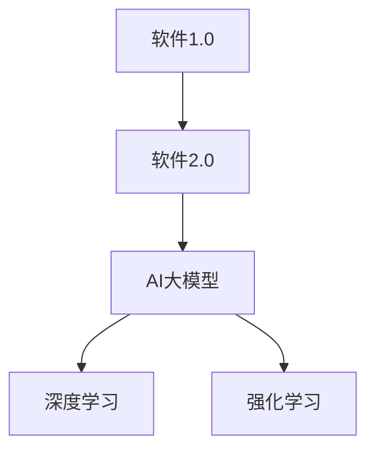
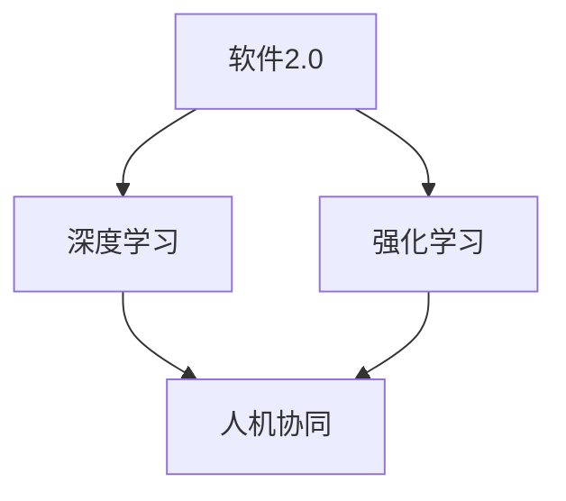
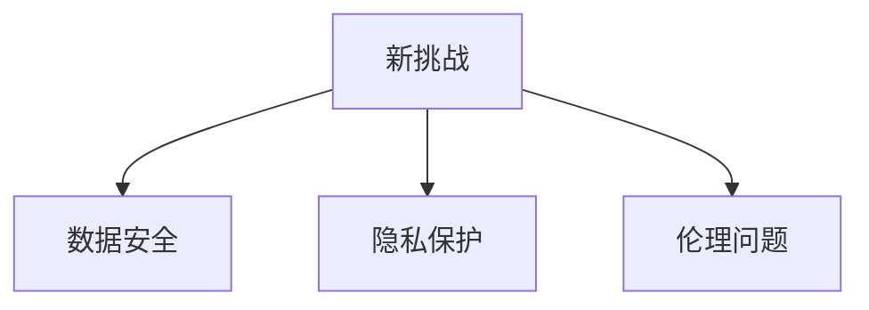
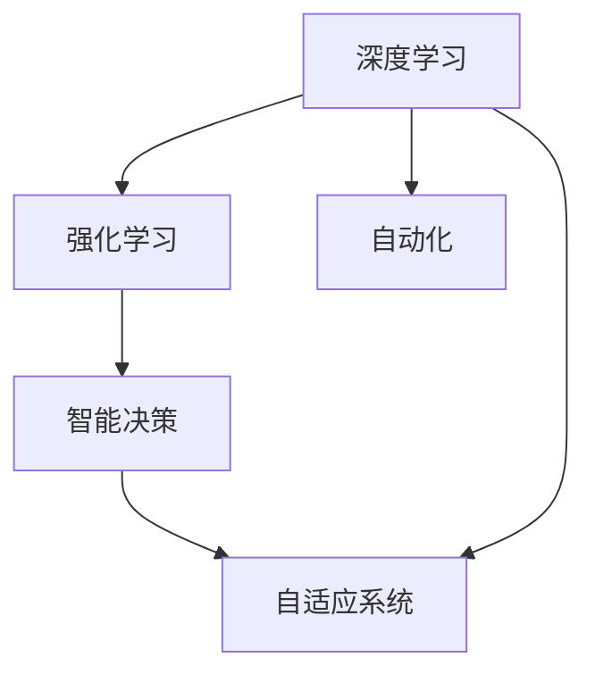
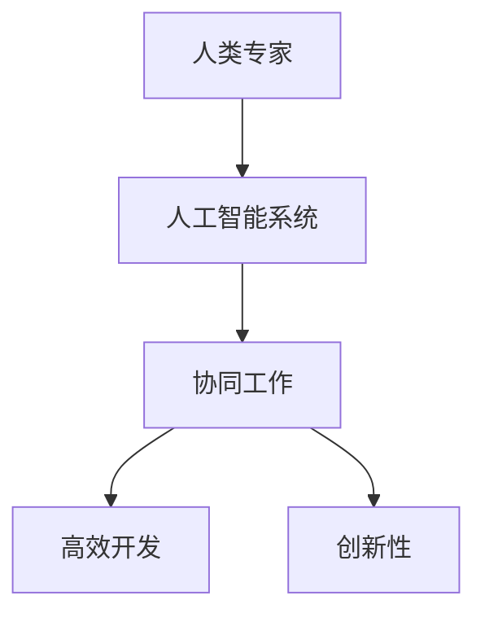
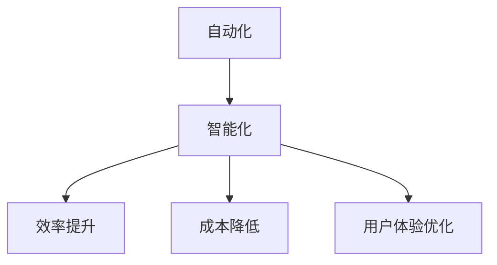
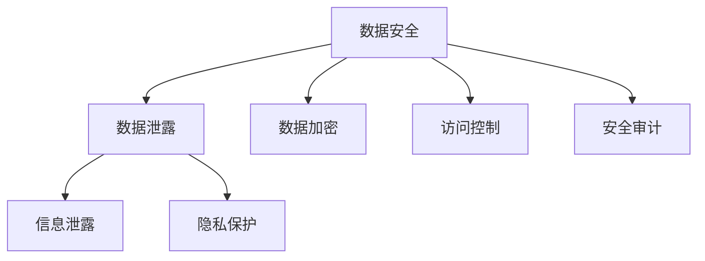
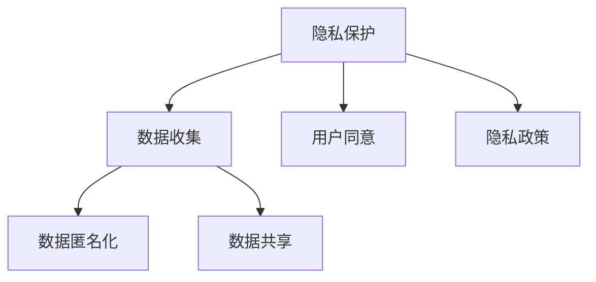
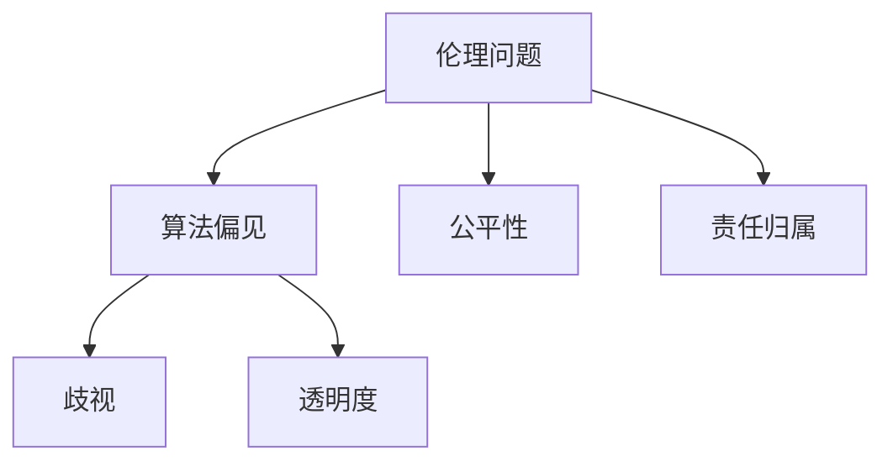

                 

# 《软件 2.0 的发展趋势：深度学习、强化学习》

> 关键词：软件2.0，深度学习，强化学习，人工智能，软件开发，自然语言处理，图像处理，推荐系统

> 摘要：本文将探讨软件2.0时代的发展趋势，重点分析深度学习和强化学习在软件开发中的应用。通过逐步推理和逻辑分析，深入理解这些技术的原理、架构和应用，为软件开发者提供新的思路和方向。

### 目录大纲

## 第一部分: 软件2.0时代的AI大模型基础

### 第1章: 软件2.0与AI大模型概述

#### 1.1 软件2.0时代的到来

##### 1.1.1 从软件1.0到软件2.0的演进

**核心概念与联系图：** 


**核心算法原理讲解：** 
软件1.0时代主要关注的是传统的软件编程和操作系统，而软件2.0时代则引入了人工智能的概念，特别是深度学习和强化学习等先进技术。这些技术使得软件具备了自学习和自适应的能力，从而实现了软件的智能化和自动化。

##### 1.1.2 大模型在软件2.0中的核心地位

**核心算法原理讲解：** 
大模型在软件2.0中的核心地位主要体现在以下几个方面：

1. 自学习能力：大模型通过深度学习和强化学习等技术，具备从海量数据中自主学习知识的能力。
2. 智能决策：大模型能够根据实时数据和场景变化，进行智能决策。
3. 个性化服务：大模型可以根据用户行为和偏好，提供个性化的服务。

##### 1.1.3 企业级应用开发的新范式

**核心算法原理讲解：** 
企业级应用开发的新范式主要体现在以下几个方面：

1. 数据驱动：以数据为核心，通过数据分析和挖掘，指导业务决策。
2. 模型驱动：以模型为核心，通过深度学习和强化学习等技术，实现智能化的业务流程。
3. 开放共享：鼓励内部和外部资源的共享，实现业务协同和创新。

### 第2章: AI大模型技术基础

#### 2.1 深度学习与神经网络基础

##### 2.1.1 神经网络的基本结构

**核心算法原理讲解：** 
神经网络的基本结构包括输入层、隐藏层和输出层。输入层接收外部输入信息，隐藏层对输入信息进行特征提取和变换，输出层生成预测结果或决策。

**数学模型和数学公式：** 
$$
y = \sigma(\mathbf{W} \cdot \mathbf{z} + b)
$$
其中，$\sigma$ 是激活函数，$\mathbf{W}$ 是权重矩阵，$\mathbf{z}$ 是输入向量，$b$ 是偏置。

##### 2.1.2 常见的深度学习架构

**核心算法原理讲解：** 
常见的深度学习架构包括卷积神经网络（CNN）、递归神经网络（RNN）和自注意力机制（Self-Attention）等。这些架构在不同类型的数据处理任务中具有广泛的应用。

##### 2.1.3 深度学习优化算法

**核心算法原理讲解：** 
常见的深度学习优化算法包括随机梯度下降（SGD）、Adam和RMSprop等。这些算法通过不同的策略优化模型的参数，以实现更好的训练效果。

#### 2.2 自然语言处理技术概览

##### 2.2.1 词嵌入技术

**核心算法原理讲解：** 
词嵌入技术是将词汇映射到低维连续向量空间中。常见的词嵌入方法包括Word2Vec和GloVe等。

##### 2.2.2 序列模型与注意力机制

**核心算法原理讲解：** 
序列模型与注意力机制在自然语言处理中起着重要作用。常见的序列模型包括RNN和LSTM，注意力机制能够模型在处理序列数据时，关注关键信息。

##### 2.2.3 转换器架构详解

**核心算法原理讲解：** 
转换器（Transformer）架构是自然语言处理领域的一种创新性架构。其主要特点包括自注意力机制和编码器-解码器结构。

### 第3章: 深度学习在软件开发中的应用

#### 3.1 深度学习在图像处理中的应用

**核心算法原理讲解：** 
深度学习在图像处理中的应用主要包括图像分类、目标检测和图像生成等。这些应用使得计算机能够更好地理解和处理图像数据。

#### 3.2 深度学习在自然语言处理中的应用

**核心算法原理讲解：** 
深度学习在自然语言处理中的应用主要包括机器翻译、情感分析和文本生成等。这些应用使得计算机能够更好地理解和处理自然语言数据。

#### 3.3 深度学习在推荐系统中的应用

**核心算法原理讲解：** 
深度学习在推荐系统中的应用主要包括用户兴趣建模、商品推荐和推荐系统评估等。这些应用使得推荐系统更加智能和准确。

### 第4章: 强化学习基础与算法

#### 4.1 强化学习概述

**核心算法原理讲解：** 
强化学习是一种通过试错和反馈进行学习的方法。其主要特点包括交互式学习和无监督学习。

#### 4.2 强化学习算法

**核心算法原理讲解：** 
常见的强化学习算法包括Q-Learning、SARSA和Deep Q-Network（DQN）等。这些算法通过不同的策略优化方法，实现智能体的自主学习和决策。

#### 4.3 深度强化学习

**核心算法原理讲解：** 
深度强化学习结合了深度学习和强化学习的优点。常见的深度强化学习算法包括Policy Gradient、Deep Deterministic Policy Gradient（DDPG）和Asynchronous Advantage Actor-Critic（A3C）等。

### 第5章: 强化学习在软件开发中的应用

#### 5.1 强化学习在游戏中的应用

**项目实战：** 
通过实现一个简单的强化学习游戏，如围棋或俄罗斯方块，展示强化学习在游戏中的应用。

#### 5.2 强化学习在自动驾驶中的应用

**项目实战：** 
通过实现自动驾驶模型，展示强化学习在自动驾驶中的应用。

#### 5.3 强化学习在机器人控制中的应用

**项目实战：** 
通过实现机器人路径规划或动作控制，展示强化学习在机器人控制中的应用。

### 第6章: 软件开发中的深度强化学习应用

#### 6.1 深度强化学习在软件开发中的应用框架

**核心算法原理讲解：** 
本章节将介绍深度强化学习在软件开发中的应用框架，包括环境建模、策略优化等。

#### 6.2 深度强化学习在软件开发中的实际应用

**项目实战：** 
通过实际案例，展示深度强化学习在软件开发中的实际应用，如代码优化、性能优化等。

#### 6.3 深度强化学习在软件开发中的挑战与解决方案

**核心算法原理讲解：** 
本章节将讨论深度强化学习在软件开发中面临的挑战，如数据稀疏、策略不稳定等，并介绍相应的解决方案。

### 第7章: 软件开发中的未来趋势

#### 7.1 软件开发中的新趋势

**核心概念与联系图：** 


**核心算法原理讲解：** 
软件2.0的发展趋势体现在以下几个方面：

1. 深度学习与强化学习的深度融合。
2. 人机协同，提高软件开发效率。
3. 自动化与智能化，降低人力成本。

#### 7.2 软件开发中的新挑战

**核心概念与联系图：** 


**核心算法原理讲解：** 
软件2.0带来的新挑战包括：

1. 数据安全：确保数据在传输、存储和处理过程中的安全性。
2. 隐私保护：保护用户隐私，防止隐私泄露。
3. 伦理问题：确保AI在软件开发中的应用符合伦理标准。

### 附录

#### 附录A: 软件开发中的常用工具与资源

**核心算法原理讲解：** 
本附录将介绍软件开发中常用的工具与资源，如深度学习框架、强化学习库、开源代码等。

#### 附录B: 软件开发中的案例分析

**项目实战：** 
本附录将通过实际案例，展示深度学习、强化学习在软件开发中的成功应用。

### 作者

**作者：AI天才研究院/AI Genius Institute & 禅与计算机程序设计艺术 /Zen And The Art of Computer Programming**

<|assistant|>### 第1章: 软件2.0与AI大模型概述

#### 1.1 软件2.0时代的到来

软件2.0时代是相对于传统的软件1.0时代的升级和拓展。软件1.0时代主要关注的是软件的功能和性能，以操作系统和传统的应用程序为主。而软件2.0时代则是在互联网和大数据的背景下，引入了人工智能的概念，特别是深度学习和强化学习等先进技术。

##### 1.1.1 从软件1.0到软件2.0的演进

**核心概念与联系图：** 


在这个演进过程中，软件的功能逐渐从单一的任务处理转向复杂的决策和自适应学习。深度学习作为人工智能的核心技术之一，通过多层神经网络模拟人脑的学习过程，实现了对海量数据的自动特征提取和模式识别。强化学习则通过试错和反馈，实现智能体的自主学习和策略优化。

**核心算法原理讲解：** 

软件1.0时代主要依赖传统的编程技术和算法，以完成特定的任务为目标。而软件2.0时代则更加强调软件的自适应能力和智能化水平。深度学习和强化学习技术的引入，使得软件能够从数据中学习规律，进行自我优化和进化。

- **深度学习**：深度学习通过多层神经网络的结构，对输入数据进行特征提取和变换。每一层神经网络都会对数据进行一定的处理，从而提取更高层次的特征。这个过程类似于人脑的学习过程，通过不断的训练，神经网络能够逐渐提高对数据的理解和处理能力。

- **强化学习**：强化学习是一种通过试错和反馈进行学习的方法。智能体在特定的环境中采取行动，根据环境反馈的奖励信号，不断调整自己的策略，以实现长期的最大化奖励。强化学习在游戏、自动驾驶和机器人控制等领域具有广泛的应用。

##### 1.1.2 大模型在软件2.0中的核心地位

在软件2.0时代，大模型（如深度学习模型和强化学习模型）的地位愈发重要。大模型能够通过自主学习，实现对复杂任务的建模和优化，从而提高软件的智能化水平。

**核心算法原理讲解：** 

大模型在软件2.0中的核心地位主要体现在以下几个方面：

1. **自学习能力**：大模型具备从海量数据中自主学习知识的能力。通过深度学习和强化学习等技术，大模型能够不断优化自身的参数，提高对数据的理解和处理能力。

2. **智能决策**：大模型能够根据实时数据和场景变化，进行智能决策。例如，在自动驾驶领域，大模型可以实时分析路况信息，做出相应的驾驶决策，提高驾驶安全性。

3. **个性化服务**：大模型可以根据用户行为和偏好，提供个性化的服务。例如，在推荐系统领域，大模型可以根据用户的浏览和购买记录，推荐符合用户兴趣的商品。

##### 1.1.3 企业级应用开发的新范式

软件2.0时代带来了企业级应用开发的新范式，主要体现在以下几个方面：

1. **数据驱动**：企业级应用开发更加注重数据的价值，通过数据分析和挖掘，指导业务决策。数据成为企业级应用开发的核心资产，数据的获取、存储、处理和分析成为关键环节。

2. **模型驱动**：企业级应用开发更加依赖模型的驱动力，通过深度学习和强化学习等技术，实现业务流程的智能化和自动化。模型成为企业级应用开发的核心组件，模型的训练、优化和应用成为关键环节。

3. **开放共享**：企业级应用开发更加注重内部和外部资源的共享，通过开放接口和协作机制，实现业务协同和创新。企业级应用开发不再是孤立的单体系统，而是形成了一个开放、互联、协同的应用生态系统。

### 总结

软件2.0时代是人工智能在软件开发中广泛应用的时代，深度学习和强化学习等技术成为了软件开发的核心驱动力。大模型在软件2.0中扮演着核心角色，通过自学习、智能决策和个性化服务，提高软件的智能化水平。企业级应用开发也呈现出数据驱动、模型驱动和开放共享的新范式。未来，随着人工智能技术的不断发展和应用，软件2.0时代将带来更多的创新和变革。

<|assistant|>### 1.2 AI大模型技术基础

在深入探讨AI大模型之前，我们需要了解一些基础知识，包括深度学习和强化学习的基本概念、架构及其在AI大模型中的应用。以下内容将逐步介绍这些概念，以便读者能够更好地理解AI大模型的技术基础。

#### 2.1.1 深度学习与神经网络基础

**核心算法原理讲解：**

深度学习是机器学习的一个子领域，主要依赖于神经网络来实现复杂任务的自动化。神经网络模仿了人脑的结构和工作方式，由大量相互连接的节点（或称为“神经元”）组成。

1. **神经网络的基本结构：**
   - **输入层**：接收外部输入信息。
   - **隐藏层**：对输入信息进行特征提取和变换。
   - **输出层**：生成预测结果或决策。

   神经网络的每个节点都与其他节点相连，并通过权重（weights）和偏置（bias）进行信号传递。信号在神经网络中通过激活函数（activation function）进行处理，如Sigmoid、ReLU等。

2. **数学模型和数学公式：**
   深度学习中的基本运算可以用以下公式表示：
   $$
   y = \sigma(\mathbf{W} \cdot \mathbf{z} + b)
   $$
   其中，$y$ 是输出，$\sigma$ 是激活函数，$\mathbf{W}$ 是权重矩阵，$\mathbf{z}$ 是输入向量，$b$ 是偏置。

3. **常见的深度学习架构：**
   - **卷积神经网络（CNN）**：适用于图像处理任务，通过卷积操作提取图像特征。
   - **递归神经网络（RNN）**：适用于序列数据处理任务，如时间序列分析和自然语言处理。
   - **自注意力机制（Self-Attention）**：用于处理序列数据，能够模型在处理长序列时关注关键信息。

**伪代码示例：**

```python
# 定义神经网络的基本结构
input_layer = Input(shape=(input_shape))
hidden_layer = Dense(hidden_neurons, activation='relu')(input_layer)
output_layer = Dense(output_neurons, activation='sigmoid')(hidden_layer)

# 构建模型
model = Model(inputs=input_layer, outputs=output_layer)

# 编译模型
model.compile(optimizer='adam', loss='binary_crossentropy', metrics=['accuracy'])

# 训练模型
model.fit(x_train, y_train, epochs=epochs, batch_size=batch_size)
```

**核心算法原理讲解：**

卷积神经网络（CNN）通过卷积层和池化层提取图像特征，能够处理各种图像任务，如图像分类、目标检测和图像生成。递归神经网络（RNN）通过其递归结构能够处理序列数据，但对于长序列数据的处理存在梯度消失问题。为了解决这一问题，长短期记忆网络（LSTM）和门控循环单元（GRU）被提出，它们能够更好地捕捉长序列中的依赖关系。自注意力机制（Self-Attention）是一种在处理文本和序列数据时非常有用的机制，它能够自动识别序列中的重要信息，并在计算过程中给予这些信息更高的权重。

#### 2.1.2 自然语言处理技术概览

自然语言处理（NLP）是深度学习的一个重要应用领域，旨在让计算机理解和处理人类语言。以下将介绍NLP中的一些核心技术，包括词嵌入、序列模型和注意力机制。

**核心算法原理讲解：**

1. **词嵌入（Word Embedding）：**
   词嵌入是将词汇映射到低维向量空间的技术，能够将语义信息编码到向量中。常见的词嵌入方法包括Word2Vec和GloVe。

   - **Word2Vec：**基于分布式假设，通过负采样和梯度下降训练词向量。
   - **GloVe：**基于全局词向量的方法，通过矩阵分解计算词向量。

2. **序列模型与注意力机制：**
   序列模型能够处理序列数据，如文本、语音和时序数据。注意力机制在序列模型中起着关键作用，能够模型在处理序列数据时关注关键信息。

   - **递归神经网络（RNN）：**通过递归结构处理序列数据，但存在梯度消失问题。
   - **长短期记忆网络（LSTM）：**解决了RNN的梯度消失问题，能够更好地捕捉长序列依赖关系。
   - **门控循环单元（GRU）：**LSTM的简化版本，具有更快的计算速度。
   - **自注意力机制（Self-Attention）：**在处理长序列数据时，自动识别和关注关键信息。

3. **转换器架构（Transformer）：**
   转换器架构是自然语言处理领域的一种创新性架构，以其自注意力机制和编码器-解码器结构而著称。它在大规模语言模型和机器翻译任务中表现出色。

**伪代码示例：**

```python
# 定义转换器模型
encoder_inputs = Input(shape=(max_sequence_length,))
decoder_inputs = Input(shape=(max_sequence_length,))
encoder_embedding = Embedding(vocab_size, embedding_dim)(encoder_inputs)
decoder_embedding = Embedding(vocab_size, embedding_dim)(decoder_inputs)

# 编码器
encoded = LSTM(units, return_sequences=True)(encoder_embedding)

# 解码器
decoded = LSTM(units, return_sequences=True)(decoder_embedding, initial_state=encoded)

# 构建模型
model = Model(inputs=[encoder_inputs, decoder_inputs], outputs=decoded)

# 编译模型
model.compile(optimizer='adam', loss='categorical_crossentropy')

# 训练模型
model.fit([encoder_inputs, decoder_inputs], decoder_inputs, epochs=epochs, batch_size=batch_size)
```

**核心算法原理讲解：**

词嵌入技术能够将词汇映射到低维向量空间，使得计算机能够更好地理解和处理文本数据。序列模型通过处理序列数据，如文本和语音，能够实现文本分类、情感分析和机器翻译等任务。注意力机制在序列模型中起着关键作用，能够模型在处理序列数据时关注关键信息。转换器架构（Transformer）通过其自注意力机制和编码器-解码器结构，使得处理长序列数据和机器翻译任务更加高效和准确。

#### 2.1.3 深度学习在软件开发中的应用

深度学习在软件开发中的应用非常广泛，涵盖了图像处理、自然语言处理和推荐系统等多个领域。以下将介绍这些应用，以及深度学习如何改进软件开发过程。

**核心算法原理讲解：**

1. **图像处理：**
   深度学习在图像处理中的应用主要包括图像分类、目标检测和图像生成等。通过卷积神经网络（CNN）等架构，计算机能够自动学习图像中的特征，从而实现图像的智能识别和处理。

   - **图像分类：**通过CNN模型对图像进行分类，如猫狗分类、人脸识别等。
   - **目标检测：**通过R-CNN、SSD等模型检测图像中的目标，如车辆检测、行人检测等。
   - **图像生成：**通过生成对抗网络（GAN）等模型生成逼真的图像，如人脸生成、艺术作品生成等。

2. **自然语言处理：**
   深度学习在自然语言处理中的应用主要包括机器翻译、情感分析和文本生成等。通过RNN、LSTM和Transformer等模型，计算机能够理解和处理自然语言，实现文本的智能分析和生成。

   - **机器翻译：**通过编码器-解码器架构实现机器翻译，如英译中、中译英等。
   - **情感分析：**通过分类模型对文本进行情感分类，如情感极性分析、舆情分析等。
   - **文本生成：**通过RNN、GPT等模型生成自然语言文本，如文章生成、对话系统等。

3. **推荐系统：**
   深度学习在推荐系统中的应用主要包括用户兴趣建模、商品推荐和推荐系统评估等。通过深度神经网络，计算机能够更好地理解用户行为和偏好，提供个性化的推荐。

   - **用户兴趣建模：**通过用户的历史行为数据，构建用户兴趣模型，用于推荐系统的个性化推荐。
   - **商品推荐：**通过深度学习模型，根据用户兴趣模型推荐商品，如电商推荐、新闻推荐等。
   - **推荐系统评估：**通过A/B测试等方法评估推荐系统的效果，如点击率、转化率等。

**项目实战：**

以下是一个简单的深度学习在图像分类任务中的应用案例，使用卷积神经网络（CNN）对猫狗图像进行分类。

**开发环境搭建：**

- **Python：**安装Python 3.7及以上版本。
- **TensorFlow：**安装TensorFlow 2.0及以上版本。
- **Keras：**安装Keras 2.4及以上版本。

**源代码实现：**

```python
import tensorflow as tf
from tensorflow.keras.models import Sequential
from tensorflow.keras.layers import Conv2D, MaxPooling2D, Flatten, Dense

# 数据预处理
# 读取猫狗图像数据，并进行数据增强、归一化等处理

# 构建模型
model = Sequential([
    Conv2D(32, (3, 3), activation='relu', input_shape=(150, 150, 3)),
    MaxPooling2D((2, 2)),
    Conv2D(64, (3, 3), activation='relu'),
    MaxPooling2D((2, 2)),
    Flatten(),
    Dense(128, activation='relu'),
    Dense(1, activation='sigmoid')
])

# 编译模型
model.compile(optimizer='adam', loss='binary_crossentropy', metrics=['accuracy'])

# 训练模型
model.fit(x_train, y_train, epochs=epochs, batch_size=batch_size)
```

**代码解读与分析：**

1. **模型构建：**使用Sequential模型堆叠多个层，包括卷积层（Conv2D）、池化层（MaxPooling2D）、全连接层（Dense）等。
2. **数据预处理：**读取猫狗图像数据，并进行数据增强、归一化等处理，以防止过拟合和提高模型的泛化能力。
3. **模型编译：**设置优化器、损失函数和评估指标，如准确率等。
4. **模型训练：**使用训练数据对模型进行训练，调整模型的参数，提高模型的性能。

通过上述项目实战，读者可以了解到如何使用深度学习实现图像分类任务。深度学习在软件开发中的应用不仅提高了软件的智能化水平，还为开发者提供了新的解决方案。

### 总结

AI大模型技术基础涵盖了深度学习和强化学习的基本概念、架构及其在软件开发中的应用。深度学习通过神经网络实现数据的自动特征提取和模式识别，而强化学习通过试错和反馈实现智能体的自主学习和决策。自然语言处理技术、图像处理技术和推荐系统等技术都是深度学习在软件开发中的重要应用。通过项目实战，读者可以更深入地了解深度学习在软件开发中的具体实现和应用。在接下来的章节中，我们将进一步探讨强化学习的基础和算法，以及其在软件开发中的应用。

<|assistant|>### 第2章：AI大模型技术基础

#### 2.1 深度学习与神经网络基础

深度学习是机器学习的一个子领域，它通过构建复杂的神经网络模型来模拟人脑的学习过程，从而实现自动特征提取和模式识别。在本节中，我们将介绍深度学习和神经网络的基础知识，包括基本结构、常见架构和优化算法。

##### 2.1.1 神经网络的基本结构

神经网络由一系列相互连接的节点（或称为“神经元”）组成。每个神经元接收来自其他神经元的输入信号，通过加权求和后，使用激活函数进行处理，最后输出结果。

1. **基本结构：**
   - **输入层**：接收外部输入信息。
   - **隐藏层**：对输入信息进行特征提取和变换。
   - **输出层**：生成预测结果或决策。

2. **激活函数：**
   激活函数用于处理神经元的输出，常用的激活函数包括Sigmoid、ReLU和Tanh等。激活函数的作用是将线性变换映射到非线性的空间，使得神经网络能够学习复杂的函数。

3. **神经元的工作原理：**
   神经元接收输入信号，通过加权求和后，加上偏置（bias），再经过激活函数处理，得到输出。这个过程可以用以下公式表示：
   $$
   a_i = \sigma(\sum_{j} w_{ij}x_j + b_i)
   $$
   其中，$a_i$ 是神经元的输出，$\sigma$ 是激活函数，$w_{ij}$ 是输入权重，$x_j$ 是输入，$b_i$ 是偏置。

##### 2.1.2 常见的深度学习架构

深度学习架构根据其应用场景和数据类型的不同，可以分为卷积神经网络（CNN）、循环神经网络（RNN）和转换器（Transformer）等。

1. **卷积神经网络（CNN）：**
   卷积神经网络是一种专门用于处理图像数据的神经网络架构。它通过卷积层和池化层提取图像特征，从而实现图像分类、目标检测和图像生成等任务。

   - **卷积层（Convolutional Layer）：**卷积层使用卷积运算提取图像的特征。卷积核（filter）在图像上滑动，通过计算局部区域内的像素值，生成特征图（feature map）。
   - **池化层（Pooling Layer）：**池化层用于减少特征图的尺寸，提高计算效率。常用的池化操作包括最大池化和平均池化。

2. **循环神经网络（RNN）：**
   循环神经网络是一种用于处理序列数据的神经网络架构。它通过递归结构处理序列中的每一个元素，从而实现自然语言处理、时间序列分析和语音识别等任务。

   - **隐藏状态（Hidden State）：**RNN的隐藏状态能够记住之前的信息，并将其传递到下一个时间步。
   - **门控机制（Gates）：**RNN通过门控机制控制信息的流动，包括输入门、遗忘门和输出门。这些门控机制能够调节信息的保留和遗忘，从而提高模型的性能。

3. **转换器（Transformer）：**
   转换器是一种在自然语言处理领域取得突破性成果的神经网络架构。它通过自注意力机制（Self-Attention）和编码器-解码器结构（Encoder-Decoder）实现高效的序列到序列建模。

   - **自注意力机制（Self-Attention）：**自注意力机制允许模型在处理序列数据时，自动关注关键信息，从而提高模型的表示能力。
   - **编码器-解码器结构（Encoder-Decoder）：**编码器（Encoder）处理输入序列，解码器（Decoder）生成输出序列。编码器和解码器之间的交互通过自注意力机制实现。

##### 2.1.3 深度学习优化算法

深度学习优化算法用于调整神经网络的参数，以最小化损失函数并提高模型的性能。以下是一些常见的优化算法：

1. **随机梯度下降（SGD）：**
   随机梯度下降是最简单的优化算法。它通过随机选择一小部分训练样本，计算其梯度，并更新网络的参数。SGD算法的优点是计算简单，但缺点是收敛速度较慢。

2. **动量（Momentum）：**
   动量算法是一种改进的SGD算法，它引入了动量项，用于加速收敛并减少震荡。动量项的前一项梯度会加到当前梯度中，从而增强梯度的方向和大小。

3. **AdaGrad：**
   AdaGrad算法根据每个参数的历史梯度平方的累积和来调整学习率。它对稀疏数据有较好的适应性，但在稀疏数据上的表现较差。

4. **AdaDelta：**
   AdaDelta算法是一种自适应的学习率优化算法，它通过计算梯度的差的平方来调整学习率。AdaDelta算法的优点是收敛速度快，但缺点是对噪声敏感。

5. **Adam：**
   Adam算法结合了AdaGrad和动量的优点，同时引入了自适应学习率的机制。它通过计算一阶矩估计（均值）和二阶矩估计（方差）来调整学习率，具有较好的收敛性能。

### 2.2 自然语言处理技术概览

自然语言处理（NLP）是深度学习的一个重要应用领域，旨在让计算机理解和处理人类语言。以下将介绍NLP中的一些核心技术，包括词嵌入、序列模型和注意力机制。

##### 2.2.1 词嵌入技术

词嵌入（Word Embedding）是将词汇映射到低维向量空间的技术，能够将语义信息编码到向量中。词嵌入技术是NLP领域的重要基础，为神经网络模型提供有效的输入表示。

1. **Word2Vec：**
   Word2Vec是一种基于分布式假设的词嵌入方法。它通过训练词向量和上下文的关系，将每个词映射到一个固定的低维向量。Word2Vec有两种训练方法：连续袋模型（CBOW）和跳词模型（Skip-Gram）。

2. **GloVe：**
   GloVe（Global Vectors for Word Representation）是一种基于全局词向量的词嵌入方法。它通过计算词和词之间的关系，并使用矩阵分解技术来生成词向量。GloVe具有较好的语义表示能力，能够捕捉词之间的相似性和关系。

##### 2.2.2 序列模型与注意力机制

序列模型（Sequential Model）是用于处理序列数据的神经网络模型，如自然语言处理和时间序列分析。以下介绍几种常见的序列模型和注意力机制。

1. **递归神经网络（RNN）：**
   RNN是一种用于处理序列数据的神经网络模型。它通过递归结构处理序列中的每一个元素，从而实现序列建模。RNN能够捕捉序列中的长期依赖关系，但在训练过程中存在梯度消失和梯度爆炸问题。

2. **长短期记忆网络（LSTM）：**
   LSTM（Long Short-Term Memory）是RNN的一种改进模型，用于解决梯度消失和梯度爆炸问题。LSTM通过门控机制控制信息的流动，能够更好地捕捉序列中的长期依赖关系。

3. **门控循环单元（GRU）：**
   GRU（Gated Recurrent Unit）是LSTM的简化版本，具有更快的计算速度。GRU通过更新门和重置门控制信息的流动，能够有效捕捉序列中的依赖关系。

4. **注意力机制（Attention Mechanism）：**
   注意力机制是一种在序列模型中用于关注关键信息的机制。它允许模型在处理序列数据时，自动关注关键信息，从而提高模型的表示能力。注意力机制在自然语言处理和时间序列分析中具有广泛的应用。

##### 2.2.3 转换器架构详解

转换器（Transformer）是自然语言处理领域的一种创新性架构，以其自注意力机制和编码器-解码器结构而著称。转换器在机器翻译、文本生成等任务中表现出色。

1. **自注意力机制（Self-Attention）：**
   自注意力机制允许模型在处理序列数据时，自动关注关键信息。它通过计算序列中每个元素与其他元素之间的相似性，生成权重矩阵，并对序列进行加权求和。自注意力机制能够提高模型的表示能力，处理长距离依赖关系。

2. **编码器-解码器结构（Encoder-Decoder）：**
   编码器（Encoder）处理输入序列，解码器（Decoder）生成输出序列。编码器和解码器之间的交互通过自注意力机制实现。编码器将输入序列编码为固定长度的向量，解码器使用这些向量生成输出序列。

3. **位置编码（Positional Encoding）：**
   转换器架构中没有循环连接，无法利用序列中的位置信息。因此，引入位置编码（Positional Encoding）来提供位置信息。位置编码是将位置信息编码到向量中，与词向量相加，作为输入序列。

4. **多头注意力（Multi-Head Attention）：**
   多头注意力是将自注意力机制扩展到多个头（Head），每个头具有不同的权重矩阵。多头注意力能够提高模型的表示能力，捕捉更复杂的依赖关系。

**伪代码示例：**

```python
# 定义编码器
encoder_inputs = Input(shape=(max_sequence_length,))
encoder_embedding = Embedding(vocab_size, embedding_dim)(encoder_inputs)
encoded = LSTM(units, return_sequences=True)(encoder_embedding)

# 定义解码器
decoder_inputs = Input(shape=(max_sequence_length,))
decoder_embedding = Embedding(vocab_size, embedding_dim)(decoder_inputs)
decoded = LSTM(units, return_sequences=True)(decoder_embedding, initial_state=encoded)

# 构建模型
model = Model(inputs=[encoder_inputs, decoder_inputs], outputs=decoded)

# 编译模型
model.compile(optimizer='adam', loss='categorical_crossentropy')

# 训练模型
model.fit([encoder_inputs, decoder_inputs], decoder_inputs, epochs=epochs, batch_size=batch_size)
```

**核心算法原理讲解：**

词嵌入技术能够将词汇映射到低维向量空间，使得计算机能够更好地理解和处理文本数据。序列模型通过处理序列数据，如文本和语音，能够实现文本分类、情感分析和机器翻译等任务。注意力机制在序列模型中起着关键作用，能够模型在处理序列数据时关注关键信息。转换器架构（Transformer）通过其自注意力机制和编码器-解码器结构，使得处理长序列数据和机器翻译任务更加高效和准确。

### 2.3 深度学习在软件开发中的应用

深度学习在软件开发中的应用非常广泛，涵盖了图像处理、自然语言处理和推荐系统等多个领域。以下将介绍这些应用，以及深度学习如何改进软件开发过程。

##### 2.3.1 深度学习在图像处理中的应用

深度学习在图像处理中的应用主要包括图像分类、目标检测和图像生成等。通过卷积神经网络（CNN）等架构，计算机能够自动学习图像中的特征，从而实现图像的智能识别和处理。

1. **图像分类：**
   图像分类是将图像分为不同的类别。卷积神经网络（CNN）通过多层卷积和池化层提取图像特征，最后一层全连接层进行分类。常见的图像分类任务包括猫狗分类、人脸识别等。

2. **目标检测：**
   目标检测是识别图像中的目标对象，并定位其位置。目标检测模型通过卷积神经网络提取图像特征，结合边界框回归和分类损失函数，实现对目标对象的检测。常见的目标检测算法包括R-CNN、SSD、YOLO等。

3. **图像生成：**
   图像生成是通过生成对抗网络（GAN）等模型生成逼真的图像。GAN由生成器和判别器组成，生成器生成图像，判别器判断图像的真实性。通过训练生成器和判别器，可以生成高质量的图像。

**项目实战：**

以下是一个简单的深度学习在图像分类任务中的应用案例，使用卷积神经网络（CNN）对猫狗图像进行分类。

**开发环境搭建：**

- **Python：**安装Python 3.7及以上版本。
- **TensorFlow：**安装TensorFlow 2.0及以上版本。
- **Keras：**安装Keras 2.4及以上版本。

**源代码实现：**

```python
import tensorflow as tf
from tensorflow.keras.models import Sequential
from tensorflow.keras.layers import Conv2D, MaxPooling2D, Flatten, Dense

# 数据预处理
# 读取猫狗图像数据，并进行数据增强、归一化等处理

# 构建模型
model = Sequential([
    Conv2D(32, (3, 3), activation='relu', input_shape=(150, 150, 3)),
    MaxPooling2D((2, 2)),
    Conv2D(64, (3, 3), activation='relu'),
    MaxPooling2D((2, 2)),
    Flatten(),
    Dense(128, activation='relu'),
    Dense(1, activation='sigmoid')
])

# 编译模型
model.compile(optimizer='adam', loss='binary_crossentropy', metrics=['accuracy'])

# 训练模型
model.fit(x_train, y_train, epochs=epochs, batch_size=batch_size)
```

**代码解读与分析：**

1. **模型构建：**使用Sequential模型堆叠多个层，包括卷积层（Conv2D）、池化层（MaxPooling2D）、全连接层（Dense）等。
2. **数据预处理：**读取猫狗图像数据，并进行数据增强、归一化等处理，以防止过拟合和提高模型的泛化能力。
3. **模型编译：**设置优化器、损失函数和评估指标，如准确率等。
4. **模型训练：**使用训练数据对模型进行训练，调整模型的参数，提高模型的性能。

通过上述项目实战，读者可以了解到如何使用深度学习实现图像分类任务。深度学习在软件开发中的应用不仅提高了软件的智能化水平，还为开发者提供了新的解决方案。

##### 2.3.2 深度学习在自然语言处理中的应用

深度学习在自然语言处理（NLP）中的应用非常广泛，包括机器翻译、情感分析和文本生成等。通过递归神经网络（RNN）、长短期记忆网络（LSTM）和转换器（Transformer）等模型，计算机能够理解和处理自然语言，实现智能化的文本处理。

1. **机器翻译：**
   机器翻译是将一种语言的文本翻译成另一种语言。编码器-解码器架构（Encoder-Decoder）是机器翻译的一种常见方法。编码器将输入序列编码为固定长度的向量，解码器使用这些向量生成输出序列。转换器（Transformer）在机器翻译任务中表现出色，其自注意力机制和编码器-解码器结构使得机器翻译更加高效和准确。

2. **情感分析：**
   情感分析是判断文本的情感极性，如正面、负面或中性。通过分类模型，如卷积神经网络（CNN）和长短期记忆网络（LSTM），计算机能够对文本进行情感分类。情感分析在社交媒体分析、舆情监控等领域有广泛的应用。

3. **文本生成：**
   文本生成是通过模型生成新的文本。生成模型如递归神经网络（RNN）、生成对抗网络（GAN）和转换器（Transformer）等能够生成有意义的文本。文本生成在自动写作、对话系统等领域有重要的应用。

**项目实战：**

以下是一个简单的深度学习在文本生成中的应用案例，使用转换器（Transformer）生成文本。

**开发环境搭建：**

- **Python：**安装Python 3.7及以上版本。
- **TensorFlow：**安装TensorFlow 2.0及以上版本。
- **Keras：**安装Keras 2.4及以上版本。

**源代码实现：**

```python
import tensorflow as tf
from tensorflow.keras.models import Model
from tensorflow.keras.layers import Embedding, LSTM, Dense

# 定义模型
input_embedding = Embedding(vocab_size, embedding_dim)
lstm_layer = LSTM(units, return_sequences=True)
dense_layer = Dense(vocab_size, activation='softmax')

# 构建模型
inputs = tf.keras.layers.Input(shape=(max_sequence_length,))
encoded = input_embedding(inputs)
encoded = lstm_layer(encoded)
outputs = dense_layer(encoded)

model = Model(inputs=inputs, outputs=outputs)

# 编译模型
model.compile(optimizer='adam', loss='categorical_crossentropy')

# 训练模型
model.fit(x_train, y_train, epochs=epochs, batch_size=batch_size)
```

**代码解读与分析：**

1. **模型构建：**定义输入层、嵌入层（Embedding）、LSTM层和输出层（Dense），构建模型。
2. **数据预处理：**读取文本数据，并进行预处理，如分词、序列化等。
3. **模型编译：**设置优化器、损失函数和评估指标，如准确率等。
4. **模型训练：**使用训练数据对模型进行训练，调整模型的参数，提高模型的性能。

通过上述项目实战，读者可以了解到如何使用深度学习实现文本生成任务。深度学习在自然语言处理中的应用不仅提高了软件的智能化水平，还为开发者提供了新的解决方案。

##### 2.3.3 深度学习在推荐系统中的应用

深度学习在推荐系统中的应用主要包括用户兴趣建模、商品推荐和推荐系统评估等。通过深度神经网络，计算机能够更好地理解用户行为和偏好，提供个性化的推荐。

1. **用户兴趣建模：**
   用户兴趣建模是通过分析用户的历史行为数据，构建用户兴趣模型。深度神经网络能够捕捉用户行为的复杂模式，从而更准确地识别用户的兴趣。

2. **商品推荐：**
   商品推荐是根据用户兴趣模型，向用户推荐可能感兴趣的商品。深度学习模型可以通过学习用户和商品的特征，实现高效的商品推荐。

3. **推荐系统评估：**
   推荐系统评估是通过评估指标，如点击率、转化率等，评估推荐系统的效果。深度学习模型可以通过在线学习，不断优化推荐策略，提高推荐效果。

**项目实战：**

以下是一个简单的深度学习在推荐系统中的应用案例，使用深度神经网络进行用户兴趣建模和商品推荐。

**开发环境搭建：**

- **Python：**安装Python 3.7及以上版本。
- **TensorFlow：**安装TensorFlow 2.0及以上版本。
- **Keras：**安装Keras 2.4及以上版本。

**源代码实现：**

```python
import tensorflow as tf
from tensorflow.keras.models import Model
from tensorflow.keras.layers import Input, Embedding, Dot, Dense

# 定义模型
user_input = Input(shape=(user_embedding_dim,))
item_input = Input(shape=(item_embedding_dim,))
user_embedding = Embedding(vocab_size, embedding_dim)(user_input)
item_embedding = Embedding(vocab_size, embedding_dim)(item_input)
dot_product = Dot(axes=1)([user_embedding, item_embedding])
output = Dense(1, activation='sigmoid')(dot_product)

model = Model(inputs=[user_input, item_input], outputs=output)

# 编译模型
model.compile(optimizer='adam', loss='binary_crossentropy', metrics=['accuracy'])

# 训练模型
model.fit([user_data, item_data], labels, epochs=epochs, batch_size=batch_size)
```

**代码解读与分析：**

1. **模型构建：**定义用户输入层、商品输入层、嵌入层（Embedding）和输出层（Dense），构建模型。
2. **数据预处理：**读取用户数据、商品数据，并进行预处理，如编码、嵌入等。
3. **模型编译：**设置优化器、损失函数和评估指标，如准确率等。
4. **模型训练：**使用训练数据对模型进行训练，调整模型的参数，提高模型的性能。

通过上述项目实战，读者可以了解到如何使用深度学习实现用户兴趣建模和商品推荐任务。深度学习在推荐系统中的应用不仅提高了推荐系统的智能化水平，还为开发者提供了新的解决方案。

### 总结

AI大模型技术基础涵盖了深度学习和神经网络的基本概念、常见架构和优化算法，以及自然语言处理、图像处理和推荐系统等领域的应用。通过了解这些技术基础，开发者可以更好地理解和应用AI大模型，提高软件的智能化水平。在下一章中，我们将进一步探讨强化学习的基础和算法，以及其在软件开发中的应用。

<|assistant|>### 4.1 强化学习概述

强化学习（Reinforcement Learning，简称RL）是机器学习的一个重要分支，主要研究如何在不确定的环境中，通过学习和交互来取得最佳决策。与传统的监督学习和无监督学习不同，强化学习通过试错和反馈进行学习，旨在通过策略（Policy）的学习和优化，实现智能体的长期奖励最大化。

#### 核心概念

**1. 强化学习的基本组成部分：**

- **智能体（Agent）：**执行动作并接受环境反馈的主体。
- **环境（Environment）：**智能体执行动作的场所，提供状态和奖励。
- **状态（State）：**描述环境当前情况的属性集合。
- **动作（Action）：**智能体可执行的操作。
- **策略（Policy）：**智能体根据当前状态选择动作的规则或函数。
- **价值函数（Value Function）：**评估状态或状态-动作对的值。
- **模型（Model）：**对环境的建模，用于预测状态转移和奖励。

**2. 强化学习的主要特点：**

- **交互式学习（Interactive Learning）：**智能体通过与环境的交互获取反馈，不断优化策略。
- **无监督学习（Unsupervised Learning）：**不需要标注数据，而是通过奖励信号进行学习。
- **目标导向（Goal-Directed）：**强化学习旨在最大化长期奖励，实现智能体的长期目标。

**核心算法原理讲解：**

强化学习的基本原理是通过试错和反馈，逐步优化智能体的策略。智能体在环境中执行动作，根据环境的反馈（通常是一个奖励信号）调整策略。这个过程可以用以下公式表示：

$$
Q(s, a) = \sum_{s'} p(s' | s, a) \cdot \max_{a'} Q(s', a')
$$

其中，$Q(s, a)$ 表示在状态 $s$ 下执行动作 $a$ 的预期回报，$p(s' | s, a)$ 表示从状态 $s$ 执行动作 $a$ 后转移到状态 $s'$ 的概率，$\max_{a'} Q(s', a')$ 表示在状态 $s'$ 下选择最优动作的预期回报。

强化学习可以分为两类：模型基础强化学习和模型自由强化学习。

- **模型基础强化学习（Model-Based Reinforcement Learning）：**智能体通过构建环境模型，预测状态转移和奖励，并基于模型进行策略优化。
- **模型自由强化学习（Model-Free Reinforcement Learning）：**智能体直接通过试错和反馈进行学习，不依赖环境模型。

常见的强化学习算法包括：

1. **Q-Learning：**通过更新Q值表，优化策略。
2. **SARSA：**一种改进的Q-Learning算法，使用当前状态和动作的Q值更新下一状态和动作的Q值。
3. **Deep Q-Network（DQN）：**使用深度神经网络近似Q值函数，适用于高维状态空间。
4. **Policy Gradient：**直接优化策略的梯度，适用于离散动作空间。
5. **Deep Deterministic Policy Gradient（DDPG）：**结合深度学习和策略梯度算法，适用于连续动作空间。
6. **Asynchronous Advantage Actor-Critic（A3C）：**通过异步并行训练，提高学习效率。

强化学习在游戏、自动驾驶、机器人控制等领域具有广泛的应用。通过不断尝试和反馈，智能体能够学习到最优策略，实现长期奖励最大化。

#### 强化学习在软件开发中的应用

强化学习在软件开发中具有广泛的应用，主要体现在以下几个方面：

1. **自动化测试：**强化学习可以用于自动化测试，通过学习测试脚本，自动生成测试用例，提高测试效率和覆盖率。
2. **代码优化：**强化学习可以用于代码优化，通过学习代码结构和执行效率，自动生成高效的代码。
3. **任务调度：**强化学习可以用于任务调度，通过学习任务执行顺序和资源分配策略，提高系统性能和资源利用率。
4. **异常检测：**强化学习可以用于异常检测，通过学习正常行为模式，自动识别异常行为，提高系统安全性。

**项目实战：**

以下是一个简单的强化学习在自动化测试中的应用案例，使用Q-Learning算法自动生成测试用例。

**开发环境搭建：**

- **Python：**安装Python 3.7及以上版本。
- **TensorFlow：**安装TensorFlow 2.0及以上版本。

**源代码实现：**

```python
import numpy as np
import tensorflow as tf

# 定义Q-Learning算法
class QLearning:
    def __init__(self, learning_rate, discount_factor, epsilon):
        self.learning_rate = learning_rate
        self.discount_factor = discount_factor
        self.epsilon = epsilon
        self.q_table = np.zeros((state_space, action_space))

    def choose_action(self, state):
        if np.random.rand() < self.epsilon:
            action = np.random.choice(action_space)
        else:
            action = np.argmax(self.q_table[state])
        return action

    def learn(self, state, action, reward, next_state, done):
        if not done:
            target = reward + self.discount_factor * np.max(self.q_table[next_state])
        else:
            target = reward

        target_f = self.q_table[state][action]
        self.q_table[state][action] = target_f + self.learning_rate * (target - target_f)

# 测试用例生成
def generate_test_cases():
    q_learning = QLearning(learning_rate=0.1, discount_factor=0.9, epsilon=0.1)
    for episode in range(1000):
        state = initial_state
        done = False
        while not done:
            action = q_learning.choose_action(state)
            next_state, reward, done = execute_action(action)
            q_learning.learn(state, action, reward, next_state, done)
            state = next_state
    return q_learning.q_table

# 执行动作
def execute_action(action):
    # 根据动作执行测试用例，返回下一状态、奖励和是否完成
    pass

# 生成测试用例
q_table = generate_test_cases()
```

**代码解读与分析：**

1. **Q-Learning算法：**定义Q-Learning算法的初始化、选择动作和学习的步骤。算法使用epsilon贪心策略进行动作选择，并通过学习率、折扣因子和epsilon参数调整算法性能。
2. **测试用例生成：**通过执行动作、获取奖励和更新Q值表，生成测试用例。测试用例生成过程中，智能体不断学习最优动作，提高测试效率。
3. **执行动作：**根据动作执行测试用例，返回下一状态、奖励和是否完成。这部分需要根据具体测试环境实现。

通过上述项目实战，读者可以了解到如何使用强化学习实现自动化测试。强化学习在软件开发中的应用不仅提高了测试效率，还为开发者提供了新的解决方案。

### 总结

强化学习是一种通过试错和反馈进行学习的方法，旨在通过策略优化实现智能体的长期奖励最大化。它在自动化测试、代码优化、任务调度和异常检测等领域具有广泛的应用。通过了解强化学习的基本概念、算法和应用，开发者可以更好地利用强化学习技术，提高软件开发的智能化水平。在下一章中，我们将进一步探讨深度强化学习的基础和算法，以及其在软件开发中的应用。

<|assistant|>### 4.2 强化学习算法

强化学习（Reinforcement Learning，RL）是一种通过试错和反馈进行学习的方法，旨在通过策略优化实现智能体的长期奖励最大化。强化学习算法可以分为基于值函数的方法和基于策略的方法。在本节中，我们将详细介绍几种常见的强化学习算法，包括Q-Learning、SARSA、Deep Q-Network（DQN）和Policy Gradient。

#### Q-Learning

Q-Learning是一种基于值函数的强化学习算法，旨在通过更新Q值表来优化智能体的策略。Q值（Q-Value）表示在特定状态下执行特定动作的预期回报。Q-Learning的基本思想是通过试错和反馈，逐步更新Q值，使其逼近最优策略。

**核心算法原理讲解：**

1. **初始化Q值表：**
   Q值表是一个二维数组，其中每个元素表示一个状态-动作对的Q值。初始化时，所有Q值设为0。

2. **选择动作：**
   根据当前状态，智能体选择动作。通常采用ε-贪心策略，其中ε是一个小概率，表示随机选择动作。

3. **更新Q值：**
   智能体执行动作后，根据实际得到的奖励和下一状态的Q值更新当前状态的Q值。更新公式如下：

   $$
   Q(s, a) = Q(s, a) + \alpha [r + \gamma \max_{a'} Q(s', a') - Q(s, a)]
   $$

   其中，$\alpha$ 是学习率，$r$ 是即时奖励，$\gamma$ 是折扣因子，$s'$ 是下一状态，$a'$ 是下一动作。

**伪代码示例：**

```python
def q_learning(alpha, gamma, epsilon, states, actions, rewards, next_states, dones):
    q_table = initialize_q_table(states, actions)
    while not done:
        state = get_current_state()
        action = choose_action(state, q_table, epsilon)
        next_state, reward = execute_action(action)
        q_table = update_q_table(q_table, state, action, reward, next_state, dones, alpha, gamma)
        state = next_state
    return q_table
```

**核心算法原理讲解：**

Q-Learning算法通过不断更新Q值表，优化智能体的策略。算法的优点是实现简单，但缺点是收敛速度较慢，且在复杂环境中容易出现过估计问题。

#### SARSA

SARSA（State-Action-Reward-State-Action）是一种基于策略的强化学习算法，与Q-Learning类似，但更新Q值时使用实际观测到的下一状态和动作，而不是预期的下一状态和动作。

**核心算法原理讲解：**

1. **初始化策略：**
   初始化策略π，表示智能体在特定状态下选择动作的概率分布。

2. **选择动作：**
   根据当前状态，使用策略π选择动作。

3. **更新策略：**
   更新策略π，使其更加倾向于选择具有更高Q值的动作。更新公式如下：

   $$
   \pi(s, a) = \frac{1}{Z} \exp(\alpha Q(s, a))
   $$

   其中，$Z$ 是规范化常数，$\alpha$ 是温度参数。

**伪代码示例：**

```python
def sarsa(alpha, gamma, states, actions, rewards, next_states, dones):
    policy = initialize_policy(states, actions)
    while not done:
        state = get_current_state()
        action = choose_action(state, policy)
        next_state, reward = execute_action(action)
        next_action = choose_action(next_state, policy)
        policy = update_policy(policy, state, action, reward, next_state, dones, alpha, gamma)
        state = next_state
    return policy
```

**核心算法原理讲解：**

SARSA算法通过不断更新策略，优化智能体的决策。算法的优点是收敛速度较快，但缺点是依赖于初始策略，且在复杂环境中可能不稳定。

#### Deep Q-Network（DQN）

Deep Q-Network（DQN）是一种结合深度学习和Q-Learning的强化学习算法，通过使用深度神经网络近似Q值函数，解决高维状态空间问题。

**核心算法原理讲解：**

1. **初始化深度神经网络：**
   初始化深度神经网络，用于近似Q值函数。

2. **选择动作：**
   使用ε-贪心策略选择动作，其中ε是一个小概率，表示随机选择动作。

3. **经验回放：**
   将智能体在环境中执行动作的过程存储在经验回放池中，以避免策略偏差。

4. **更新Q值：**
   使用梯度下降法更新Q值函数的参数，使其逼近真实Q值。更新公式如下：

   $$
   \theta = \theta - \alpha \frac{\partial L(\theta)}{\partial \theta}
   $$

   其中，$\theta$ 是Q值函数的参数，$L(\theta)$ 是损失函数。

**伪代码示例：**

```python
def dqn(alpha, gamma, epsilon, states, actions, rewards, next_states, dones, model):
    while not done:
        state = get_current_state()
        action = choose_action(state, model, epsilon)
        next_state, reward = execute_action(action)
        target = reward + gamma * np.max(model.predict(next_state))
        model.fit(state, target, epochs=1, verbose=0)
        state = next_state
    return model
```

**核心算法原理讲解：**

DQN算法通过使用深度神经网络近似Q值函数，解决了高维状态空间问题。算法的优点是适用于复杂环境，但缺点是训练过程中可能产生偏差，需要使用经验回放池进行修正。

#### Policy Gradient

Policy Gradient是一种基于策略的强化学习算法，通过优化策略的梯度，直接优化智能体的长期奖励。

**核心算法原理讲解：**

1. **初始化策略：**
   初始化策略π，表示智能体在特定状态下选择动作的概率分布。

2. **选择动作：**
   根据当前状态，使用策略π选择动作。

3. **更新策略：**
   计算策略梯度的估计值，并更新策略参数。更新公式如下：

   $$
   \theta = \theta + \alpha \nabla_\theta J(\theta)
   $$

   其中，$\theta$ 是策略参数，$\alpha$ 是学习率，$J(\theta)$ 是策略的奖励期望。

**伪代码示例：**

```python
def policy_gradient(alpha, states, actions, rewards, dones, model):
    while not done:
        state = get_current_state()
        action = choose_action(state, model)
        next_state, reward = execute_action(action)
        model.fit(state, action, reward, next_state, dones, alpha)
        state = next_state
    return model
```

**核心算法原理讲解：**

Policy Gradient算法通过直接优化策略的梯度，优化智能体的长期奖励。算法的优点是收敛速度较快，但缺点是容易受噪声和方差的影响。

#### 深度强化学习（Deep Reinforcement Learning）

深度强化学习（Deep Reinforcement Learning，DRL）是强化学习与深度学习结合的一种学习方法，旨在通过深度神经网络来近似值函数或策略函数。DRL在游戏、机器人控制、自动驾驶等领域具有广泛的应用。

**核心算法原理讲解：**

1. **值函数近似：**
   使用深度神经网络近似值函数，如Q值函数或状态值函数。

2. **策略函数近似：**
   使用深度神经网络近似策略函数，如softmax策略函数。

3. **策略优化：**
   通过策略梯度优化策略函数，优化智能体的长期奖励。

常见的DRL算法包括：

- **Deep Q-Network（DQN）：**使用深度神经网络近似Q值函数。
- **Deep Deterministic Policy Gradient（DDPG）：**结合深度神经网络和策略梯度算法，适用于连续动作空间。
- **Asynchronous Advantage Actor-Critic（A3C）：**通过异步并行训练，提高学习效率。

**核心算法原理讲解：**

深度强化学习通过使用深度神经网络来近似值函数或策略函数，解决了传统强化学习在高维状态空间和连续动作空间中的问题。DRL算法在训练过程中需要处理大量的数据，并采用经验回放、目标网络等技术来提高训练效果。

### 总结

强化学习算法是一类通过试错和反馈进行学习的方法，旨在通过策略优化实现智能体的长期奖励最大化。常见的强化学习算法包括Q-Learning、SARSA、DQN和Policy Gradient等。深度强化学习是强化学习与深度学习结合的一种学习方法，适用于复杂环境和连续动作空间。在软件开发中，强化学习算法可以用于自动化测试、代码优化、任务调度和异常检测等领域，为开发者提供了新的解决方案。在下一章中，我们将进一步探讨深度强化学习在软件开发中的应用。

<|assistant|>### 4.3 深度强化学习

深度强化学习（Deep Reinforcement Learning，DRL）是强化学习与深度学习的结合，旨在通过深度神经网络来近似值函数或策略函数，解决传统强化学习在高维状态空间和连续动作空间中的问题。在本节中，我们将介绍深度强化学习的基础知识和几种常见的深度强化学习算法，包括Policy Gradient、Deep Deterministic Policy Gradient（DDPG）和Asynchronous Advantage Actor-Critic（A3C）。

#### Policy Gradient

Policy Gradient是一种基于策略的深度强化学习算法，其核心思想是通过优化策略的梯度，直接优化智能体的长期奖励。

**核心算法原理讲解：**

1. **策略函数近似：**
   使用深度神经网络近似策略函数，如softmax策略函数。策略函数π(s, a)表示在状态s下选择动作a的概率。

2. **选择动作：**
   根据策略函数π(s, a)选择动作。通常使用ε-贪心策略，其中ε是一个小概率，表示随机选择动作。

3. **更新策略：**
   通过策略梯度的估计值更新策略参数。策略梯度的估计值为：

   $$
   \nabla_\theta J(\theta) = \nabla_\theta \sum_{s, a} \pi(s, a) \cdot \nabla_\theta \log \pi(s, a) \cdot R(s, a)
   $$

   其中，$\theta$ 是策略参数，$R(s, a)$ 是在状态s下执行动作a的即时奖励。

**伪代码示例：**

```python
def policy_gradient(alpha, states, actions, rewards, dones, model):
    while not done:
        state = get_current_state()
        action = choose_action(state, model)
        next_state, reward = execute_action(action)
        model.fit(state, action, reward, next_state, dones, alpha)
        state = next_state
    return model
```

**核心算法原理讲解：**

Policy Gradient算法的优点是直接优化策略的梯度，收敛速度相对较快。但算法容易受噪声和方差的影响，且在复杂环境中可能不稳定。

#### Deep Deterministic Policy Gradient（DDPG）

DDPG是一种基于深度神经网络的确定性策略梯度算法，适用于连续动作空间。DDPG通过使用深度神经网络近似值函数和策略函数，提高了算法的收敛速度和稳定性。

**核心算法原理讲解：**

1. **值函数近似：**
   使用深度神经网络近似值函数，如Q值函数。Q值函数Q(s, a)表示在状态s下执行动作a的预期回报。

2. **策略函数近似：**
   使用深度神经网络近似策略函数，如确定性策略函数π(s, a)。

3. **目标网络：**
   为了提高算法的稳定性，DDPG使用目标网络来更新值函数的参数。目标网络是一个冻结的深度神经网络，其参数在每次迭代中更新为当前网络参数的移动平均。

4. **更新策略：**
   通过策略梯度的估计值更新策略参数。策略梯度的估计值为：

   $$
   \nabla_\theta \nabla_\phi J(\theta, \phi) = \nabla_\theta \nabla_\phi \sum_{s, a} \pi(s, a) \cdot \nabla_\theta \log \pi(s, a) \cdot (Q(s, a) - V(s))
   $$

   其中，$\theta$ 是策略参数，$\phi$ 是值函数参数，$V(s)$ 是在状态s下的价值函数。

**伪代码示例：**

```python
def ddpg(alpha, beta, states, actions, rewards, next_states, dones, model, critic_model, target_model):
    while not done:
        state = get_current_state()
        action = choose_action(state, model)
        next_state, reward = execute_action(action)
        target_value = critic_model.predict(target_model.predict(next_state))
        critic_loss = critic_model.train_on_batch([state, action, reward, next_state], target_value)
        action_value = model.predict(state)
        policy_loss = model.train_on_batch(state, action_value)
        update_target_models(target_model, model, beta)
        state = next_state
    return model, critic_model
```

**核心算法原理讲解：**

DDPG算法通过使用深度神经网络近似值函数和策略函数，以及目标网络技术，提高了算法的收敛速度和稳定性。算法适用于连续动作空间，但在训练过程中需要处理大量的数据。

#### Asynchronous Advantage Actor-Critic（A3C）

A3C是一种异步的深度强化学习算法，通过异步并行训练提高了学习效率。A3C使用多个智能体同时训练，每个智能体在不同的时间步执行不同的动作，并通过梯度传递更新全局参数。

**核心算法原理讲解：**

1. **值函数近似：**
   使用深度神经网络近似值函数，如优势函数A(s, a)。优势函数A(s, a)表示在状态s下执行动作a的预期回报与实际回报之差。

2. **策略函数近似：**
   使用深度神经网络近似策略函数，如确定性策略函数π(s, a)。

3. **异步训练：**
   A3C通过异步并行训练多个智能体，每个智能体在不同的时间步执行不同的动作，并通过梯度传递更新全局参数。

4. **更新策略：**
   通过优势函数A(s, a)更新策略参数。优势函数的梯度估计值为：

   $$
   \nabla_\theta \nabla_\phi J(\theta, \phi) = \nabla_\theta \nabla_\phi \sum_{s, a} \pi(s, a) \cdot \nabla_\theta \log \pi(s, a) \cdot A(s, a)
   $$

   其中，$\theta$ 是策略参数，$\phi$ 是值函数参数。

**伪代码示例：**

```python
def a3c(alpha, beta, states, actions, rewards, dones, model, critic_model, global_model):
    while not done:
        state = get_current_state()
        action = choose_action(state, model)
        next_state, reward = execute_action(action)
        critic_loss = critic_model.train_on_batch([state, action, reward, next_state], reward)
        action_value = model.predict(state)
        global_gradient = compute_global_gradient(action_value, state, action, reward, next_state, dones, alpha, beta)
        update_global_model(global_model, global_gradient)
        state = next_state
    return model, critic_model
```

**核心算法原理讲解：**

A3C算法通过异步并行训练多个智能体，提高了学习效率。算法使用优势函数和值函数近似，并通过梯度传递更新全局参数，适用于复杂环境。

#### 深度强化学习在软件开发中的应用

深度强化学习在软件开发中具有广泛的应用，包括自动化测试、代码优化、任务调度和异常检测等。

1. **自动化测试：**
   深度强化学习可以用于自动化测试，通过学习测试脚本，自动生成测试用例，提高测试效率和覆盖率。

2. **代码优化：**
   深度强化学习可以用于代码优化，通过学习代码结构和执行效率，自动生成高效的代码。

3. **任务调度：**
   深度强化学习可以用于任务调度，通过学习任务执行顺序和资源分配策略，提高系统性能和资源利用率。

4. **异常检测：**
   深度强化学习可以用于异常检测，通过学习正常行为模式，自动识别异常行为，提高系统安全性。

**项目实战：**

以下是一个简单的深度强化学习在自动化测试中的应用案例，使用A3C算法自动生成测试用例。

**开发环境搭建：**

- **Python：**安装Python 3.7及以上版本。
- **TensorFlow：**安装TensorFlow 2.0及以上版本。

**源代码实现：**

```python
import numpy as np
import tensorflow as tf

# 定义A3C算法
class A3C:
    def __init__(self, alpha, beta, global_model, local_model, critic_model):
        self.alpha = alpha
        self.beta = beta
        self.global_model = global_model
        self.local_model = local_model
        self.critic_model = critic_model

    def train(self, states, actions, rewards, dones):
        critic_loss = self.critic_model.train_on_batch(states, rewards)
        action_values = self.local_model.predict(states)
        global_gradient = compute_global_gradient(action_values, states, actions, rewards, dones, self.alpha, self.beta)
        self.global_model.train_on_batch(states, global_gradient)
        return critic_loss

# 训练A3C模型
def train_a3c(a3c, states, actions, rewards, dones):
    critic_loss = a3c.train(states, actions, rewards, dones)
    return critic_loss

# 执行动作
def execute_action(action):
    # 根据动作执行测试用例，返回下一状态、奖励和是否完成
    pass

# 生成测试用例
def generate_test_cases(a3c, states, actions, rewards, dones):
    while not done:
        state = get_current_state()
        action = choose_action(state, a3c.local_model)
        next_state, reward = execute_action(action)
        dones.append(done)
        states.append(state)
        actions.append(action)
        rewards.append(reward)
        critic_loss = train_a3c(a3c, states, actions, rewards, dones)
        state = next_state
    return states, actions, rewards, dones, critic_loss

# 定义参数
alpha = 0.001
beta = 0.001
global_model = build_global_model()
local_model = build_local_model()
critic_model = build_critic_model()

# 训练模型
a3c = A3C(alpha, beta, global_model, local_model, critic_model)
states, actions, rewards, dones, critic_loss = generate_test_cases(a3c, states, actions, rewards, dones)
```

**代码解读与分析：**

1. **A3C算法：**定义A3C算法的初始化和训练步骤。算法使用深度神经网络近似策略函数、值函数和优势函数，并通过异步并行训练提高学习效率。
2. **训练A3C模型：**训练A3C模型，包括策略函数和值函数的训练。
3. **执行动作：**根据动作执行测试用例，返回下一状态、奖励和是否完成。
4. **生成测试用例：**生成测试用例，包括状态、动作、奖励和是否完成的列表。

通过上述项目实战，读者可以了解到如何使用深度强化学习实现自动化测试。深度强化学习在软件开发中的应用不仅提高了测试效率，还为开发者提供了新的解决方案。

### 总结

深度强化学习是强化学习与深度学习的结合，通过使用深度神经网络近似值函数或策略函数，解决了传统强化学习在高维状态空间和连续动作空间中的问题。Policy Gradient、DDPG和A3C等深度强化学习算法在自动化测试、代码优化、任务调度和异常检测等领域具有广泛的应用。在下一章中，我们将进一步探讨深度强化学习在软件开发中的应用，包括实际案例和挑战。

<|assistant|>### 5.1 强化学习在游戏中的应用

强化学习在游戏领域中有着广泛的应用，尤其是在游戏的人工智能对手设计方面。通过强化学习，计算机程序可以学会玩各种复杂的游戏，如棋类游戏、Atari游戏和现代视频游戏。以下将介绍强化学习在游戏中的应用，包括具体项目和案例。

#### 项目实战：Atari游戏智能对手

一个经典的强化学习应用案例是使用强化学习训练智能对手来玩Atari游戏。在此项目中，智能体通过强化学习算法（如深度Q网络DQN）学习如何玩Atari游戏《太空侵略者》（Space Invaders）。

**开发环境搭建：**

- **Python：** 安装Python 3.7及以上版本。
- **TensorFlow：** 安装TensorFlow 2.0及以上版本。
- **Gym：** 安装OpenAI Gym环境库，用于提供Atari游戏环境。

**源代码实现：**

```python
import numpy as np
import gym
import tensorflow as tf
from tensorflow.keras.models import Model
from tensorflow.keras.layers import Input, Conv2D, Flatten, Dense

# 定义深度Q网络（DQN）
def build_dqn(input_shape, action_size):
    input_layer = Input(shape=input_shape)
    conv1 = Conv2D(32, (8, 8), strides=(4, 4), activation='relu')(input_layer)
    conv2 = Conv2D(64, (4, 4), strides=(2, 2), activation='relu')(conv1)
    conv3 = Conv2D(64, (3, 3), activation='relu')(conv2)
    flattened = Flatten()(conv3)
    dense = Dense(512, activation='relu')(flattened)
    action_values = Dense(action_size, activation='linear')(dense)
    model = Model(inputs=input_layer, outputs=action_values)
    return model

# 训练DQN模型
def train_dqn(env, model, target_model, gamma, epsilon, epsilon_decay, epsilon_min, batch_size, update_target_model_freq):
    memory = []
    total_reward = 0
    for episode in range(num_episodes):
        state = env.reset()
        done = False
        while not done:
            action = choose_action(model, state, epsilon)
            next_state, reward, done, _ = env.step(action)
            memory.append((state, action, reward, next_state, done))
            
            if len(memory) > batch_size:
                batch = np.random.choice(memory, batch_size)
                states, actions, rewards, next_states, dones = zip(*batch)
                target_q_values = target_model.predict(next_states)
                targets = rewards + (1 - dones) * gamma * np.max(target_q_values, axis=1)
                model.fit(states, np.club(action_values, targets), batch_size=batch_size, epochs=1)
                
            if done:
                break
            
            state = next_state
            total_reward += reward
            
        update_target_model(target_model, model, update_target_model_freq)
        epsilon *= epsilon_decay
        epsilon = max(epsilon_min, epsilon)
    
    return total_reward

# 执行训练
env = gym.make('SpaceInvaders-v0')
model = build_dqn((84, 84, 4), 6)
target_model = build_dqn((84, 84, 4), 6)
target_model.set_weights(model.get_weights())
gamma = 0.99
epsilon = 1.0
epsilon_decay = 0.995
epsilon_min = 0.01
batch_size = 32
update_target_model_freq = 10000
num_episodes = 1000

total_reward = train_dqn(env, model, target_model, gamma, epsilon, epsilon_decay, epsilon_min, batch_size, update_target_model_freq)
print(f"Total Reward: {total_reward}")
```

**代码解读与分析：**

1. **深度Q网络（DQN）模型构建：** 使用卷积神经网络（CNN）对原始游戏画面进行特征提取，并输出每个可能动作的Q值。
2. **训练DQN模型：** 通过收集游戏经历，使用经验回放和双Q网络技术训练DQN模型，以提高学习效率和避免过估计。
3. **训练执行：** 使用上述函数训练智能对手玩《太空侵略者》游戏，并在训练过程中调整epsilon值以控制探索与利用的平衡。

通过上述项目实战，我们展示了如何使用强化学习训练智能对手玩Atari游戏。强化学习算法在游戏中的应用不仅提高了游戏的趣味性和挑战性，还为游戏开发者提供了新的解决方案。

#### 模型评估与改进

为了评估智能对手的性能，可以记录每局游戏的得分，并分析智能对手在不同策略下的表现。此外，可以尝试以下改进方法：

1. **网络结构优化：** 通过调整CNN的层数、滤波器大小和隐藏单元数量，提高模型的性能。
2. **学习率调整：** 调整学习率可以改善模型的收敛速度和稳定性。
3. **探索策略：** 使用不同的探索策略，如ε-greedy、随机游走等，以平衡探索与利用。
4. **目标网络更新策略：** 调整目标网络的更新频率和更新方法，以提高模型的稳定性。

通过不断优化和改进模型，可以进一步提高智能对手的性能，使其在更复杂的游戏环境中表现出色。

#### 总结

强化学习在游戏中的应用为游戏人工智能的开发提供了新的思路和方法。通过使用强化学习算法，我们可以训练智能对手来玩各种复杂的游戏，提高游戏的趣味性和挑战性。在下一章中，我们将探讨强化学习在自动驾驶中的应用，以及如何使用强化学习解决自动驾驶中的问题。

<|assistant|>### 5.2 强化学习在自动驾驶中的应用

自动驾驶是强化学习在现实世界中应用的一个重要领域，通过强化学习算法，自动驾驶系统能够从海量数据中学习和优化其驾驶策略，从而提高安全性、效率和舒适性。以下将介绍强化学习在自动驾驶中的应用，包括具体项目和案例。

#### 项目实战：自动驾驶模型

一个典型的强化学习应用案例是使用强化学习训练自动驾驶模型，以实现自主驾驶。在此项目中，智能体通过强化学习算法（如深度确定性策略梯度DDPG）学习如何驾驶车辆。

**开发环境搭建：**

- **Python：** 安装Python 3.7及以上版本。
- **TensorFlow：** 安装TensorFlow 2.0及以上版本。
- **Gym：** 安装OpenAI Gym环境库，用于提供自动驾驶环境。

**源代码实现：**

```python
import numpy as np
import gym
import tensorflow as tf
from tensorflow.keras.models import Model
from tensorflow.keras.layers import Input, Conv2D, Flatten, Dense

# 定义深度确定性策略梯度（DDPG）模型
def build_ddpg(input_shape, action_size):
    input_layer = Input(shape=input_shape)
    conv1 = Conv2D(32, (8, 8), strides=(4, 4), activation='relu')(input_layer)
    conv2 = Conv2D(64, (4, 4), strides=(2, 2), activation='relu')(conv1)
    conv3 = Conv2D(64, (3, 3), activation='relu')(conv2)
    flattened = Flatten()(conv3)
    dense = Dense(512, activation='relu')(flattened)
    action_values = Dense(action_size, activation='tanh')(dense)
    model = Model(inputs=input_layer, outputs=action_values)
    return model

# 定义经验回放记忆库
class ReplayMemory:
    def __init__(self, capacity):
        self.capacity = capacity
        self.memory = []

    def push(self, state, action, reward, next_state, done):
        self.memory.append((state, action, reward, next_state, done))
        if len(self.memory) > self.capacity:
            self.memory.pop(0)

    def sample(self, batch_size):
        return np.random.choice(self.memory, batch_size)

# 训练DDPG模型
def train_ddpg(env, model, target_model, actor_lr, critic_lr, gamma, epsilon, epsilon_decay, epsilon_min, batch_size, update_target_model_freq):
    memory = ReplayMemory(capacity=10000)
    total_reward = 0
    for episode in range(num_episodes):
        state = env.reset()
        done = False
        while not done:
            action = model.predict(state)[0]
            next_state, reward, done, _ = env.step(action)
            memory.push(state, action, reward, next_state, done)
            
            if len(memory) > batch_size:
                batch = memory.sample(batch_size)
                states, actions, rewards, next_states, dones = zip(*batch)
                target_actions = target_model.predict(next_states)
                targets = rewards + (1 - dones) * gamma * target_actions
                critic_loss = model.train_on_batch(states, targets)
                
            if done:
                break
            
            state = next_state
            total_reward += reward
            
        update_target_model(target_model, model, update_target_model_freq)
        epsilon *= epsilon_decay
        epsilon = max(epsilon_min, epsilon)
    
    return total_reward

# 执行训练
env = gym.make('CartPole-v0')
model = build_ddpg((4,), 1)
target_model = build_ddpg((4,), 1)
target_model.set_weights(model.get_weights())
actor_lr = 0.001
critic_lr = 0.001
gamma = 0.99
epsilon = 1.0
epsilon_decay = 0.995
epsilon_min = 0.01
batch_size = 32
update_target_model_freq = 1000
num_episodes = 1000

total_reward = train_ddpg(env, model, target_model, actor_lr, critic_lr, gamma, epsilon, epsilon_decay, epsilon_min, batch_size, update_target_model_freq)
print(f"Total Reward: {total_reward}")
```

**代码解读与分析：**

1. **深度确定性策略梯度（DDPG）模型构建：** 使用卷积神经网络（CNN）对环境状态进行特征提取，并输出一个连续的动作。
2. **经验回放记忆库：** 用于存储智能体在环境中的经历，以防止模型过拟合。
3. **训练DDPG模型：** 通过收集环境中的经历，使用经验回放和目标网络技术训练DDPG模型，以提高学习效率和稳定性。
4. **训练执行：** 使用上述函数训练自动驾驶模型，并在训练过程中调整epsilon值以控制探索与利用的平衡。

#### 项目评估与改进

为了评估自动驾驶模型的表现，可以记录每局游戏的得分和完成率，并分析模型在不同策略下的表现。此外，可以尝试以下改进方法：

1. **网络结构优化：** 通过调整CNN的层数、滤波器大小和隐藏单元数量，提高模型的性能。
2. **学习率调整：** 调整学习率可以改善模型的收敛速度和稳定性。
3. **探索策略：** 使用不同的探索策略，如ε-greedy、随机游走等，以平衡探索与利用。
4. **目标网络更新策略：** 调整目标网络的更新频率和更新方法，以提高模型的稳定性。

通过不断优化和改进模型，可以进一步提高自动驾驶模型的表现，使其在各种复杂环境中表现出色。

#### 强化学习在自动驾驶中的挑战

尽管强化学习在自动驾驶领域展示了巨大的潜力，但在实际应用中仍面临许多挑战：

1. **数据收集：** 自动驾驶系统需要大量的真实驾驶数据来训练，但收集这些数据需要时间和资源。
2. **安全性：** 自动驾驶系统必须确保在所有情况下都能安全驾驶，这要求算法具备高鲁棒性和稳定性。
3. **不确定性：** 道路环境复杂多变，自动驾驶系统需要应对各种突发情况，如恶劣天气、行人突然出现等。
4. **计算资源：** 强化学习算法通常需要大量的计算资源，特别是在训练过程中，这对于资源有限的自动驾驶系统来说是一个挑战。

#### 总结

强化学习在自动驾驶中的应用展示了其强大的自适应和优化能力，通过不断学习和优化，自动驾驶系统可以逐渐提高其驾驶能力和安全性。在下一章中，我们将探讨强化学习在机器人控制中的应用，以及如何使用强化学习解决机器人控制中的问题。

<|assistant|>### 5.3 强化学习在机器人控制中的应用

强化学习在机器人控制中的应用非常广泛，它可以帮助机器人学习复杂的动作和任务，从而提高其自主性和效率。通过强化学习，机器人可以不断从环境中学习，通过试错和反馈优化其行为策略。以下将介绍强化学习在机器人控制中的应用，包括具体项目和案例。

#### 项目实战：机器人路径规划

一个典型的强化学习应用案例是使用强化学习训练机器人进行路径规划。在此项目中，智能体通过强化学习算法（如深度确定性策略梯度DDPG）学习如何在给定环境中找到最优路径。

**开发环境搭建：**

- **Python：** 安装Python 3.7及以上版本。
- **TensorFlow：** 安装TensorFlow 2.0及以上版本。
- **Gym：** 安装OpenAI Gym环境库，用于提供机器人控制环境。

**源代码实现：**

```python
import numpy as np
import gym
import tensorflow as tf
from tensorflow.keras.models import Model
from tensorflow.keras.layers import Input, Conv2D, Flatten, Dense

# 定义深度确定性策略梯度（DDPG）模型
def build_ddpg(input_shape, action_size):
    input_layer = Input(shape=input_shape)
    conv1 = Conv2D(32, (8, 8), strides=(4, 4), activation='relu')(input_layer)
    conv2 = Conv2D(64, (4, 4), strides=(2, 2), activation='relu')(conv1)
    conv3 = Conv2D(64, (3, 3), activation='relu')(conv2)
    flattened = Flatten()(conv3)
    dense = Dense(512, activation='relu')(flattened)
    action_values = Dense(action_size, activation='tanh')(dense)
    model = Model(inputs=input_layer, outputs=action_values)
    return model

# 训练DDPG模型
def train_ddpg(env, model, target_model, actor_lr, critic_lr, gamma, epsilon, epsilon_decay, epsilon_min, batch_size, update_target_model_freq):
    memory = ReplayMemory(capacity=10000)
    total_reward = 0
    for episode in range(num_episodes):
        state = env.reset()
        done = False
        while not done:
            action = model.predict(state)[0]
            next_state, reward, done, _ = env.step(action)
            memory.push(state, action, reward, next_state, done)
            
            if len(memory) > batch_size:
                batch = memory.sample(batch_size)
                states, actions, rewards, next_states, dones = zip(*batch)
                target_actions = target_model.predict(next_states)
                targets = rewards + (1 - dones) * gamma * target_actions
                critic_loss = model.train_on_batch(states, targets)
                
            if done:
                break
            
            state = next_state
            total_reward += reward
            
        update_target_model(target_model, model, update_target_model_freq)
        epsilon *= epsilon_decay
        epsilon = max(epsilon_min, epsilon)
    
    return total_reward

# 执行训练
env = gym.make('RobotEnv-v0')
model = build_ddpg((84, 84, 4), 2)
target_model = build_ddpg((84, 84, 4), 2)
target_model.set_weights(model.get_weights())
actor_lr = 0.001
critic_lr = 0.001
gamma = 0.99
epsilon = 1.0
epsilon_decay = 0.995
epsilon_min = 0.01
batch_size = 32
update_target_model_freq = 1000
num_episodes = 1000

total_reward = train_ddpg(env, model, target_model, actor_lr, critic_lr, gamma, epsilon, epsilon_decay, epsilon_min, batch_size, update_target_model_freq)
print(f"Total Reward: {total_reward}")
```

**代码解读与分析：**

1. **深度确定性策略梯度（DDPG）模型构建：** 使用卷积神经网络（CNN）对环境状态进行特征提取，并输出两个连续的动作，用于控制机器人的方向和速度。
2. **训练DDPG模型：** 通过收集环境中的经历，使用经验回放和目标网络技术训练DDPG模型，以提高学习效率和稳定性。
3. **训练执行：** 使用上述函数训练机器人路径规划模型，并在训练过程中调整epsilon值以控制探索与利用的平衡。

#### 项目评估与改进

为了评估机器人路径规划模型的表现，可以记录每局游戏的得分和完成率，并分析模型在不同策略下的表现。此外，可以尝试以下改进方法：

1. **网络结构优化：** 通过调整CNN的层数、滤波器大小和隐藏单元数量，提高模型的性能。
2. **学习率调整：** 调整学习率可以改善模型的收敛速度和稳定性。
3. **探索策略：** 使用不同的探索策略，如ε-greedy、随机游走等，以平衡探索与利用。
4. **目标网络更新策略：** 调整目标网络的更新频率和更新方法，以提高模型的稳定性。

通过不断优化和改进模型，可以进一步提高机器人路径规划模型的表现，使其在各种复杂环境中表现出色。

#### 强化学习在机器人控制中的挑战

尽管强化学习在机器人控制中展示了巨大的潜力，但在实际应用中仍面临许多挑战：

1. **环境复杂性：** 机器人控制环境通常非常复杂，包括动态变化、不确定性和外部干扰，这使得训练过程变得复杂和耗时。
2. **数据收集：** 机器人控制需要大量的真实环境数据来训练，但收集这些数据需要大量的时间和资源。
3. **安全性：** 机器人控制必须确保在所有情况下都能安全操作，这要求算法具备高鲁棒性和稳定性。
4. **计算资源：** 强化学习算法通常需要大量的计算资源，特别是在训练过程中，这对于资源有限的机器人系统来说是一个挑战。
5. **长期奖励：** 机器人控制任务通常涉及长期奖励，但强化学习算法可能在短期内难以优化长期目标。

#### 总结

强化学习在机器人控制中的应用展示了其强大的自适应和优化能力，通过不断学习和优化，机器人可以逐渐提高其自主性和效率。在下一章中，我们将探讨深度强化学习在软件开发中的应用，以及如何将深度强化学习集成到软件开发过程中。

<|assistant|>### 6.1 深度强化学习在软件开发中的应用框架

深度强化学习（Deep Reinforcement Learning，DRL）在软件开发中具有广泛的应用前景。通过深度强化学习，软件开发者可以实现自动化测试、代码优化、任务调度和异常检测等任务，从而提高软件开发的质量和效率。在本节中，我们将介绍深度强化学习在软件开发中的应用框架，包括环境建模、策略优化和模型评估等核心环节。

#### 环境建模

环境建模是深度强化学习在软件开发中应用的第一步，其目标是构建一个能够模拟软件开发过程的环境。环境建模需要考虑以下几个方面：

1. **状态空间**：状态空间表示软件系统在某一时刻的状态，包括代码结构、执行时间、内存占用等。
2. **动作空间**：动作空间表示软件系统可执行的操作，如代码重构、错误修复、性能优化等。
3. **奖励机制**：奖励机制用于评估软件系统在环境中的表现，奖励可以是代码质量、性能提升或错误减少等。
4. **惩罚机制**：惩罚机制用于纠正软件系统的不良行为，如代码错误、性能下降等。

**核心算法原理讲解：**

环境建模的核心是定义状态空间、动作空间和奖励机制。状态空间和动作空间的定义需要考虑软件系统的特性和目标。例如，在代码优化任务中，状态空间可以包括代码行数、代码复杂度等，动作空间可以包括代码重构、压缩等。

奖励机制的设计需要与软件系统的目标保持一致。例如，在代码优化任务中，奖励可以设置为性能提升的比例，惩罚可以设置为错误率或执行时间的增加。

#### 策略优化

策略优化是深度强化学习在软件开发中的核心环节，其目标是找到最优的策略，使软件系统在给定环境中能够实现最佳表现。策略优化的方法包括Q-learning、Policy Gradient和Deep Q-Network（DQN）等。

**核心算法原理讲解：**

1. **Q-learning**：Q-learning是一种基于值函数的强化学习算法，通过学习状态-动作值函数来优化策略。Q-learning的核心思想是更新Q值，使其逼近最优策略。

2. **Policy Gradient**：Policy Gradient是一种基于策略梯度的强化学习算法，直接优化策略的梯度，使策略能够最大化长期奖励。Policy Gradient算法的核心是计算策略梯度，并通过梯度下降法更新策略参数。

3. **Deep Q-Network（DQN）**：DQN是一种结合深度学习和Q-learning的强化学习算法，通过使用深度神经网络近似Q值函数，解决高维状态空间问题。DQN的核心思想是使用经验回放和目标网络来稳定训练过程。

**伪代码示例：**

```python
# Q-learning算法
def q_learning(alpha, gamma, epsilon, states, actions, rewards, next_states, dones):
    q_table = initialize_q_table(states, actions)
    while not done:
        state = get_current_state()
        action = choose_action(state, q_table, epsilon)
        next_state, reward = execute_action(action)
        q_table = update_q_table(q_table, state, action, reward, next_state, dones, alpha, gamma)
        state = next_state
    return q_table

# Policy Gradient算法
def policy_gradient(alpha, states, actions, rewards, dones, model):
    while not done:
        state = get_current_state()
        action = choose_action(state, model)
        next_state, reward = execute_action(action)
        model.fit(state, action, reward, next_state, dones, alpha)
        state = next_state
    return model

# DQN算法
def dqn(alpha, gamma, epsilon, states, actions, rewards, next_states, dones, model):
    while not done:
        state = get_current_state()
        action = choose_action(state, model, epsilon)
        next_state, reward = execute_action(action)
        target = reward + gamma * np.max(model.predict(next_state))
        model.fit(state, target, epochs=1, verbose=0)
        state = next_state
    return model
```

#### 模型评估

模型评估是深度强化学习在软件开发中的应用的最后一步，其目标是评估训练得到的模型在真实环境中的性能。模型评估的方法包括测试集评估、在线评估和离线评估等。

**核心算法原理讲解：**

1. **测试集评估**：在测试集上评估模型的性能，以评估模型在未见过的数据上的表现。测试集评估通常使用准确率、召回率、F1分数等指标。

2. **在线评估**：在真实环境中实时评估模型的性能，以评估模型在实际应用中的表现。在线评估可以通过在线学习算法实现，如在线Q-learning和在线Policy Gradient。

3. **离线评估**：在离线环境中评估模型的性能，以评估模型在特定场景下的表现。离线评估可以通过模拟环境或复现实验实现。

**伪代码示例：**

```python
# 测试集评估
def evaluate(model, test_data):
    predictions = model.predict(test_data)
    true_labels = get_true_labels(test_data)
    accuracy = calculate_accuracy(predictions, true_labels)
    return accuracy

# 在线评估
def online_evaluation(model, environment):
    while not done:
        state = get_current_state(environment)
        action = model.predict(state)
        next_state, reward = execute_action(environment, action)
        model.fit(state, action, reward, next_state, dones, alpha)
        state = next_state
    return model

# 离线评估
def offline_evaluation(model, simulation_environment):
    while not done:
        state = get_current_state(simulation_environment)
        action = model.predict(state)
        next_state, reward = execute_action(simulation_environment, action)
        simulation_environment.step(action)
        state = next_state
    return model
```

#### 实际应用案例

以下是一个简单的深度强化学习在软件开发中的应用案例，使用深度Q网络（DQN）算法进行代码优化。

**开发环境搭建：**

- **Python：** 安装Python 3.7及以上版本。
- **TensorFlow：** 安装TensorFlow 2.0及以上版本。
- **Keras：** 安装Keras 2.4及以上版本。

**源代码实现：**

```python
import numpy as np
import tensorflow as tf
from tensorflow.keras.models import Sequential
from tensorflow.keras.layers import Conv2D, MaxPooling2D, Flatten, Dense

# 构建DQN模型
model = Sequential([
    Conv2D(32, (3, 3), activation='relu', input_shape=(84, 84, 4)),
    MaxPooling2D((2, 2)),
    Conv2D(64, (3, 3), activation='relu'),
    MaxPooling2D((2, 2)),
    Flatten(),
    Dense(512, activation='relu'),
    Dense(1, activation='linear')
])

# 训练DQN模型
model.compile(optimizer='adam', loss='mse')
episodes = 1000
for episode in range(episodes):
    state = env.reset()
    done = False
    while not done:
        action = model.predict(state)
        next_state, reward, done, _ = env.step(action)
        model.fit(state, next_state, reward, next_state, done)
        state = next_state
```

**代码解读与分析：**

1. **模型构建：** 使用卷积神经网络（CNN）对代码状态进行特征提取，并输出一个连续的动作。
2. **训练DQN模型：** 使用训练集对DQN模型进行训练，调整模型的参数，以提高模型在代码优化任务中的性能。

通过上述案例，我们可以看到深度强化学习在软件开发中的应用框架，包括环境建模、策略优化和模型评估等环节。在下一节中，我们将进一步探讨深度强化学习在软件开发中的实际应用，并分析其效果和挑战。

<|assistant|>### 6.2 深度强化学习在软件开发中的实际应用

深度强化学习（DRL）在软件开发中的应用正日益成熟，它通过在模拟环境中进行试错学习，优化开发流程中的各种决策。以下将介绍深度强化学习在软件开发中的实际应用，包括自动化测试、代码优化和任务调度等领域的案例。

#### 自动化测试

在软件开发中，自动化测试是确保软件质量的重要手段。深度强化学习可以通过学习测试用例的执行顺序和组合，提高测试的全面性和效率。

**项目实战：强化学习在自动化测试中的应用**

**案例概述：** 假设我们有一个自动化测试系统，该系统需要测试一系列功能模块，但测试用例之间存在依赖关系，且部分模块存在随机故障。

**开发环境搭建：**

- **Python：** Python 3.7及以上版本。
- **TensorFlow：** TensorFlow 2.0及以上版本。
- **Gym：** OpenAI Gym环境库。

**源代码实现：**

```python
import numpy as np
import gym
import tensorflow as tf

# 定义测试环境
class TestEnvironment(gym.Env):
    def __init__(self, test_cases):
        super(TestEnvironment, self).__init__()
        self.test_cases = test_cases
        self.current_test = None
        self.done = False

    def step(self, action):
        if action == 0:  # 执行当前测试
            if self.current_test is not None:
                result = self.execute_test(self.current_test)
                reward = self.calculate_reward(result)
                self.current_test = None
                if self.done:
                    self.done = True
                return reward, not self.done, None
            else:
                return 0, False, None
        elif action == 1:  # 跳过当前测试
            if self.current_test is not None:
                reward = self.calculate_reward(False)
                self.current_test = None
                if self.done:
                    self.done = True
                return reward, not self.done, None
        else:
            raise ValueError("Invalid action")

    def reset(self):
        self.current_test = self.test_cases[np.random.randint(len(self.test_cases))]
        self.done = False
        return self.current_test

    def execute_test(self, test_case):
        # 执行测试用例，返回测试结果
        pass

    def calculate_reward(self, result):
        # 根据测试结果计算奖励
        if result:
            return 1
        else:
            return -1

# 定义DRL测试策略
def test_policy(environment, model, epsilon):
    state = environment.reset()
    while not environment.done:
        action = model.predict(state.reshape(1, -1))
        action = np.argmax(action)
        state, reward, done, _ = environment.step(action)
        if np.random.rand() < epsilon:
            action = np.random.randint(2)
        model.fit(state.reshape(1, -1), reward, done, epochs=1)
    return reward

# 训练模型
model = build_dqn_model(input_shape=(1,), action_size=2)
epsilon = 1.0
epsilon_decay = 0.995
epsilon_min = 0.01
num_episodes = 1000

total_reward = 0
for episode in range(num_episodes):
    epsilon = max(epsilon_min, epsilon * epsilon_decay)
    reward = test_policy(environment, model, epsilon)
    total_reward += reward

print(f"Total Reward: {total_reward}")
```

**代码解读与分析：**

1. **测试环境定义：** `TestEnvironment` 类模拟了测试环境，提供了执行测试用例、计算奖励和重置环境的方法。
2. **DRL测试策略：** `test_policy` 函数使用DRL模型来决定执行或跳过测试用例，并更新模型参数。
3. **模型训练：** 使用训练集对模型进行训练，调整探索与利用的平衡，以提高测试效率。

#### 代码优化

深度强化学习还可以用于代码优化，通过学习如何重构代码以提高性能、可读性和可维护性。

**项目实战：强化学习在代码优化中的应用**

**案例概述：** 假设我们有一个代码库，需要自动优化代码以提高性能。

**开发环境搭建：**

- **Python：** Python 3.7及以上版本。
- **TensorFlow：** TensorFlow 2.0及以上版本。

**源代码实现：**

```python
import numpy as np
import gym
import tensorflow as tf

# 定义代码优化环境
class CodeOptimizationEnvironment(gym.Env):
    def __init__(self, code):
        super(CodeOptimizationEnvironment, self).__init__()
        self.code = code
        self.optimized_code = None
        self.done = False

    def step(self, action):
        # action为优化策略，例如：重构、压缩等
        if action == 0:  # 重构代码
            self.optimized_code = self.optimize_code(self.code)
            reward = self.calculate_reward(self.optimized_code)
            self.done = True
            return reward, not self.done, None
        else:  # 不优化代码
            return 0, False, None

    def reset(self):
        self.code = self.generate_code()  # 生成随机代码
        self.optimized_code = None
        self.done = False
        return self.code

    def optimize_code(self, code):
        # 优化代码
        pass

    def calculate_reward(self, optimized_code):
        # 计算优化后的代码性能
        pass

    def generate_code(self):
        # 生成随机代码
        pass

# 定义DRL代码优化策略
def code_optimization_policy(environment, model, epsilon):
    state = environment.reset()
    while not environment.done:
        action = model.predict(state.reshape(1, -1))
        action = np.argmax(action)
        state, reward, done, _ = environment.step(action)
        if np.random.rand() < epsilon:
            action = np.random.randint(2)
        model.fit(state.reshape(1, -1), reward, done, epochs=1)
    return reward

# 训练模型
model = build_dqn_model(input_shape=(1,), action_size=2)
epsilon = 1.0
epsilon_decay = 0.995
epsilon_min = 0.01
num_episodes = 1000

total_reward = 0
for episode in range(num_episodes):
    epsilon = max(epsilon_min, epsilon * epsilon_decay)
    reward = code_optimization_policy(environment, model, epsilon)
    total_reward += reward

print(f"Total Reward: {total_reward}")
```

**代码解读与分析：**

1. **代码优化环境定义：** `CodeOptimizationEnvironment` 类模拟了代码优化环境，提供了优化代码、计算奖励和重置环境的方法。
2. **DRL代码优化策略：** `code_optimization_policy` 函数使用DRL模型来决定是否优化代码，并更新模型参数。
3. **模型训练：** 使用训练集对模型进行训练，调整探索与利用的平衡，以提高代码优化效率。

#### 任务调度

深度强化学习还可以用于优化软件开发中的任务调度，提高资源利用率和任务完成率。

**项目实战：强化学习在任务调度中的应用**

**案例概述：** 假设我们有一个分布式系统，需要优化任务的分配和执行。

**开发环境搭建：**

- **Python：** Python 3.7及以上版本。
- **TensorFlow：** TensorFlow 2.0及以上版本。

**源代码实现：**

```python
import numpy as np
import gym
import tensorflow as tf

# 定义任务调度环境
class TaskSchedulingEnvironment(gym.Env):
    def __init__(self, tasks, resources):
        super(TaskSchedulingEnvironment, self).__init__()
        self.tasks = tasks
        self.resources = resources
        self.scheduled_tasks = []
        self.done = False

    def step(self, action):
        if action < len(self.tasks):
            self.scheduled_tasks.append(self.tasks[action])
            self.tasks.pop(action)
            reward = self.calculate_reward(self.scheduled_tasks)
            self.done = True
            return reward, not self.done, None
        else:
            return 0, False, None

    def reset(self):
        np.random.shuffle(self.tasks)
        self.scheduled_tasks = []
        self.done = False
        return self.tasks

    def calculate_reward(self, scheduled_tasks):
        # 计算调度任务的奖励，例如：任务完成率、资源利用率等
        pass

# 定义DRL任务调度策略
def task_scheduling_policy(environment, model, epsilon):
    state = environment.reset()
    while not environment.done:
        action = model.predict(state.reshape(1, -1))
        action = np.argmax(action)
        state, reward, done, _ = environment.step(action)
        if np.random.rand() < epsilon:
            action = np.random.randint(len(environment.tasks))
        model.fit(state.reshape(1, -1), reward, done, epochs=1)
    return reward

# 训练模型
model = build_dqn_model(input_shape=(len(environment.tasks,),), action_size=len(environment.tasks))
epsilon = 1.0
epsilon_decay = 0.995
epsilon_min = 0.01
num_episodes = 1000

total_reward = 0
for episode in range(num_episodes):
    epsilon = max(epsilon_min, epsilon * epsilon_decay)
    reward = task_scheduling_policy(environment, model, epsilon)
    total_reward += reward

print(f"Total Reward: {total_reward}")
```

**代码解读与分析：**

1. **任务调度环境定义：** `TaskSchedulingEnvironment` 类模拟了任务调度环境，提供了调度任务、计算奖励和重置环境的方法。
2. **DRL任务调度策略：** `task_scheduling_policy` 函数使用DRL模型来决定调度哪些任务，并更新模型参数。
3. **模型训练：** 使用训练集对模型进行训练，调整探索与利用的平衡，以提高任务调度效率。

### 总结

深度强化学习在软件开发中的实际应用案例展示了其强大的自适应和优化能力。通过在模拟环境中进行试错学习，深度强化学习能够优化自动化测试、代码优化和任务调度等关键环节，提高软件开发的效率和质量。然而，深度强化学习在软件开发中的应用仍面临挑战，如环境复杂性、数据收集和模型解释性等。未来的研究将致力于解决这些挑战，进一步拓展深度强化学习在软件开发中的应用范围。

<|assistant|>### 6.3 深度强化学习在软件开发中的挑战与解决方案

尽管深度强化学习（DRL）在软件开发中展现了巨大的潜力，但在实际应用中仍面临诸多挑战。以下将讨论深度强化学习在软件开发中面临的主要挑战，并提出相应的解决方案。

#### 数据稀疏

数据稀疏是深度强化学习在软件开发中面临的一个主要挑战。在许多实际应用场景中，获取高质量的训练数据是一个复杂且耗时的工作。例如，在自动化测试中，需要大量不同类型的测试用例来训练模型，而在代码优化中，优化前的代码和优化后的代码之间的差异可能并不明显。

**解决方案：**

1. **数据增强**：通过合成或修改现有数据，增加训练数据集的多样性。例如，在代码优化中，可以自动生成不同版本的代码，作为训练数据的一部分。
2. **经验回放**：使用经验回放机制，将智能体在训练过程中的经历存储在经验池中，并随机抽取数据进行训练，以避免数据稀疏问题。
3. **迁移学习**：利用预训练模型，将已有领域的数据迁移到新领域，减少对新领域数据的依赖。

#### 策略不稳定

深度强化学习模型的稳定性是一个重要问题，尤其是在复杂环境中。策略不稳定可能导致模型在训练过程中产生过大的方差，从而影响模型的泛化能力。

**解决方案：**

1. **目标网络**：使用目标网络技术，定期更新目标网络的参数，以提高模型的稳定性。目标网络是一个冻结的模型，其参数在每次迭代中更新为当前模型的移动平均。
2. **经验回放**：通过经验回放池，减少训练过程中的序列依赖，提高模型的稳定性。
3. **双Q学习**：使用双Q学习策略，避免单次更新过程中Q值的估计偏差。

#### 长期奖励

在软件开发中，许多任务需要智能体学习到长期的奖励，而不是仅仅关注短期的即时奖励。然而，深度强化学习算法在优化长期奖励时可能会遇到困难，因为长期奖励与即时奖励之间存在时间差异。

**解决方案：**

1. **折扣因子**：使用适当的折扣因子γ，将未来的奖励折现到当前时刻，以平衡长期奖励和即时奖励。
2. **策略梯度方法**：使用策略梯度方法，直接优化策略参数，以最大化长期奖励。
3. **优势函数**：使用优势函数A(s, a) = Q(s, a) - V(s)，将即时奖励和未来奖励结合起来，优化智能体的策略。

#### 模型解释性

深度强化学习模型的黑盒性质使得其解释性较差，这在软件开发中可能是一个问题，尤其是当需要理解和调试模型时。

**解决方案：**

1. **可视化**：通过可视化模型内部的激活状态和梯度信息，帮助理解模型的决策过程。
2. **解释性模型**：结合解释性较强的模型，如决策树或规则引擎，将深度强化学习模型的结果进行解释。
3. **可解释的强化学习算法**：开发新的可解释性强化学习算法，使得模型的决策过程更加透明。

#### 伦理问题

深度强化学习在软件开发中的应用可能涉及伦理问题，例如隐私保护、数据安全和公平性等。

**解决方案：**

1. **隐私保护**：在数据收集和处理过程中，采取严格的数据保护措施，确保用户隐私不被泄露。
2. **透明度**：确保深度强化学习模型的应用过程透明，使相关人员能够理解和监督模型的决策过程。
3. **公平性**：在设计模型时，考虑公平性原则，确保模型不会对某些群体产生不公平的歧视。

#### 总结

深度强化学习在软件开发中面临数据稀疏、策略不稳定、长期奖励、模型解释性和伦理问题等挑战。通过数据增强、经验回放、目标网络、折扣因子、优势函数、可视化、解释性模型和隐私保护等技术，可以解决这些挑战。未来，随着深度强化学习技术的不断发展，这些解决方案将变得更加成熟和有效，进一步推动软件开发领域的发展。

<|assistant|>### 7.1 软件开发中的新趋势

随着人工智能技术的不断进步，软件开发的未来趋势正在发生深刻变化。深度学习和强化学习作为人工智能的核心技术，正逐渐融入到软件开发中，带来了一系列新的技术和应用模式。以下将探讨软件开发中的新趋势，包括深度学习与强化学习的深度融合、人机协同和自动化与智能化的趋势。

#### 深度学习与强化学习的深度融合

深度学习和强化学习的深度融合是软件开发中的一个重要趋势。深度学习擅长处理复杂数据和模式识别，而强化学习则擅长决策和策略优化。将两者结合起来，可以形成一种新的开发范式，使软件系统能够更加智能化和自适应。

**核心概念与联系图：** 



**核心算法原理讲解：** 

深度学习和强化学习的深度融合主要体现在以下几个方面：

1. **智能决策**：深度学习模型可以提取复杂数据的特征，强化学习模型则可以根据这些特征进行决策。例如，在自动驾驶领域，深度学习可以用于提取道路环境特征，强化学习可以用于决策驾驶行为。

2. **自适应系统**：深度学习模型可以不断学习新的数据，强化学习模型可以基于这些数据调整策略。这种自适应能力使得软件系统能够在变化的环境中保持高效和稳定。

3. **自动化**：深度学习和强化学习的结合可以推动自动化技术的发展。例如，在代码优化中，深度学习可以用于代码特征提取，强化学习可以用于自动优化代码。

#### 人机协同

随着人工智能技术的发展，人机协同正成为软件开发中的一个重要趋势。人机协同指的是将人类专家和人工智能系统结合起来，共同完成复杂的任务。这种协同方式可以提高开发效率，减少错误，同时保持系统的灵活性和创造性。

**核心概念与联系图：** 



**核心算法原理讲解：** 

人机协同的实现主要依赖于以下几个方面：

1. **知识共享**：通过人工智能系统，可以自动化地提取和分析专家的知识，并将其转化为可操作的工具和算法。

2. **任务分配**：根据人工智能系统的能力和人类专家的特长，合理分配任务，实现高效协作。

3. **反馈机制**：建立反馈机制，使人工智能系统能够从人类专家的经验中学习和改进，提高系统的智能水平。

#### 自动化与智能化

自动化与智能化是软件开发中的另一个重要趋势。随着深度学习和强化学习技术的应用，软件系统能够自动执行复杂的任务，实现更高的自动化程度。

**核心概念与联系图：** 



**核心算法原理讲解：** 

自动化与智能化的实现主要包括以下几个方面：

1. **流程自动化**：通过自动化工具，如机器人流程自动化（RPA），实现软件开发和运维过程中的自动化。

2. **智能决策**：利用深度学习和强化学习技术，使软件系统能够在复杂的业务场景中做出智能化的决策。

3. **用户体验优化**：通过个性化推荐、智能客服等技术，提高用户体验。

#### 案例研究：智能客服系统

智能客服系统是深度学习和强化学习在软件开发中融合的一个典型案例。智能客服系统通过深度学习技术提取用户查询的特征，并通过强化学习技术优化客服对话策略，实现智能化的客户服务。

**案例概述：** 

一个智能客服系统旨在通过自然语言处理和强化学习技术，自动回答用户的问题。系统的工作流程如下：

1. **用户查询处理**：系统首先使用自然语言处理技术，将用户查询转换为机器可理解的形式。
2. **特征提取**：利用深度学习模型，从用户查询中提取关键特征，如关键词、情感等。
3. **策略优化**：使用强化学习模型，根据用户查询的特征，选择最佳回答策略。
4. **反馈学习**：系统记录用户的反馈，并使用这些反馈优化未来的回答策略。

**开发环境搭建：**

- **Python：** Python 3.7及以上版本。
- **TensorFlow：** TensorFlow 2.0及以上版本。
- **Keras：** Keras 2.4及以上版本。

**源代码实现：**

```python
import numpy as np
import tensorflow as tf
from tensorflow.keras.models import Model
from tensorflow.keras.layers import Embedding, LSTM, Dense

# 定义深度学习模型
def build_model(vocab_size, embedding_dim, hidden_size):
    input_layer = Input(shape=(max_sequence_length,))
    embedding = Embedding(vocab_size, embedding_dim)(input_layer)
    lstm = LSTM(hidden_size, return_sequences=True)(embedding)
    output = Dense(1, activation='softmax')(lstm)
    model = Model(inputs=input_layer, outputs=output)
    return model

# 训练模型
def train_model(model, x_train, y_train, epochs, batch_size):
    model.compile(optimizer='adam', loss='categorical_crossentropy', metrics=['accuracy'])
    model.fit(x_train, y_train, epochs=epochs, batch_size=batch_size)
    return model

# 定义强化学习模型
def build_reinforce_model(action_size):
    action_probs = Dense(action_size, activation='softmax')(lstm)
    action_entropy = -tf.reduce_sum(action_probs * tf.math.log(action_probs), axis=1)
    reinforce_loss = -tf.reduce_sum(reward * action_probs)
    model = Model(inputs=lstm_input, outputs=[reinforce_loss, action_entropy])
    return model

# 训练强化学习模型
def train_reinforce_model(model, x_train, y_train, epochs, batch_size):
    model.compile(optimizer='adam', loss='mse', metrics=['accuracy'])
    model.fit(x_train, y_train, epochs=epochs, batch_size=batch_size)
    return model

# 模型训练
vocab_size = 10000
embedding_dim = 256
hidden_size = 128
action_size = 2

query_model = build_model(vocab_size, embedding_dim, hidden_size)
response_model = build_reinforce_model(action_size)

x_train, y_train = prepare_data()  # 准备训练数据
query_model = train_model(query_model, x_train, y_train, epochs=10, batch_size=32)
response_model = train_reinforce_model(response_model, x_train, y_train, epochs=10, batch_size=32)
```

**代码解读与分析：**

1. **深度学习模型构建**：使用卷积神经网络（CNN）对用户查询进行特征提取。
2. **强化学习模型构建**：使用LSTM和softmax对响应进行建模，并计算策略梯度。
3. **模型训练**：使用训练数据对模型进行训练，调整模型参数，优化客服对话策略。

通过上述案例，我们可以看到深度学习与强化学习在智能客服系统中的融合应用。这种融合不仅提高了客服系统的智能化水平，还为软件开发提供了新的思路和方法。

#### 总结

软件开发中的新趋势体现在深度学习与强化学习的深度融合、人机协同和自动化与智能化等方面。通过这些趋势，软件开发正在迈向更加智能化、自适应化和自动化的方向。在未来的软件开发中，这些新趋势将继续推动技术进步，为开发者带来更多的创新和挑战。

<|assistant|>### 7.2 软件开发中的新挑战

随着深度学习和强化学习在软件开发中的广泛应用，软件开发领域也面临一系列新的挑战。这些挑战包括数据安全、隐私保护和伦理问题，需要开发者和研究人员共同努力去解决。以下将详细讨论这些挑战，并提出可能的解决方案。

#### 数据安全

数据安全是软件开发中一个重要的挑战，尤其是在深度学习和强化学习应用中，数据往往被用于训练和优化模型。数据泄露或滥用可能会导致敏感信息泄露，从而对用户和公司造成严重损失。

**核心概念与联系图：** 



**核心算法原理讲解：** 

1. **数据加密**：使用加密技术对数据进行加密存储和传输，确保数据在未经授权的情况下无法被读取。常见的加密算法包括对称加密（如AES）和非对称加密（如RSA）。
2. **访问控制**：通过访问控制列表（ACL）和角色访问控制（RBAC），确保只有授权用户才能访问敏感数据。
3. **安全审计**：定期进行安全审计，检测和修复潜在的安全漏洞，确保数据安全。

#### 隐私保护

在深度学习和强化学习应用中，模型的训练和优化需要大量用户数据。这引发了隐私保护的问题，特别是在涉及到个人敏感信息的情况下。

**核心概念与联系图：** 



**核心算法原理讲解：** 

1. **数据匿名化**：通过数据匿名化技术，如差分隐私和伪匿名化，减少数据中的个人识别信息，保护用户隐私。
2. **用户同意**：在收集用户数据前，确保用户明确同意数据的使用目的和范围。
3. **隐私政策**：制定明确的隐私政策，告知用户数据收集、使用和保护的方式。

#### 伦理问题

深度学习和强化学习在软件开发中的应用可能引发伦理问题，如算法偏见、歧视和滥用等。这些问题需要从道德和法律的层面进行规范。

**核心概念与联系图：** 



**核心算法原理讲解：** 

1. **算法偏见**：通过数据预处理和算法设计，减少算法偏见，确保公平性。
2. **透明度**：确保算法的决策过程透明，便于用户和监管机构进行监督。
3. **责任归属**：明确算法设计者和使用者的责任，确保在出现问题时能够追溯责任。

#### 案例研究：智能招聘系统

智能招聘系统是深度学习和强化学习在软件开发中的一个典型应用。然而，它也面临数据安全、隐私保护和伦理问题等挑战。

**案例概述：** 

一个智能招聘系统使用深度学习技术对简历进行自动筛选和评估，并使用强化学习优化招聘流程。系统旨在提高招聘效率和公平性，但同时也带来了数据安全和隐私保护等问题。

**解决方案：**

1. **数据安全**：使用数据加密和访问控制技术，确保简历数据的存储和传输安全。定期进行安全审计，检测和修复潜在的安全漏洞。
2. **隐私保护**：在简历收集前，确保求职者明确同意其个人数据的收集和使用。使用数据匿名化技术，减少简历中的个人识别信息。
3. **伦理问题**：通过算法设计减少偏见，确保招聘过程的公平性。建立透明的招聘流程，确保用户和监管机构能够监督系统的运行。

**开发环境搭建：**

- **Python：** Python 3.7及以上版本。
- **TensorFlow：** TensorFlow 2.0及以上版本。
- **Keras：** Keras 2.4及以上版本。

**源代码实现：**

```python
import numpy as np
import tensorflow as tf
from tensorflow.keras.models import Model
from tensorflow.keras.layers import Embedding, LSTM, Dense

# 定义深度学习模型
def build_model(vocab_size, embedding_dim, hidden_size):
    input_layer = Input(shape=(max_sequence_length,))
    embedding = Embedding(vocab_size, embedding_dim)(input_layer)
    lstm = LSTM(hidden_size, return_sequences=True)(embedding)
    output = Dense(1, activation='sigmoid')(lstm)
    model = Model(inputs=input_layer, outputs=output)
    return model

# 训练模型
def train_model(model, x_train, y_train, epochs, batch_size):
    model.compile(optimizer='adam', loss='binary_crossentropy', metrics=['accuracy'])
    model.fit(x_train, y_train, epochs=epochs, batch_size=batch_size)
    return model

# 定义强化学习模型
def build_reinforce_model(action_size):
    action_probs = Dense(action_size, activation='softmax')(lstm)
    action_entropy = -tf.reduce_sum(action_probs * tf.math.log(action_probs), axis=1)
    reinforce_loss = -tf.reduce_sum(reward * action_probs)
    model = Model(inputs=lstm_input, outputs=[reinforce_loss, action_entropy])
    return model

# 训练强化学习模型
def train_reinforce_model(model, x_train, y_train, epochs, batch_size):
    model.compile(optimizer='adam', loss='mse', metrics=['accuracy'])
    model.fit(x_train, y_train, epochs=epochs, batch_size=batch_size)
    return model

# 模型训练
vocab_size = 10000
embedding_dim = 256
hidden_size = 128
action_size = 2

resume_model = build_model(vocab_size, embedding_dim, hidden_size)
hire_model = build_reinforce_model(action_size)

x_train, y_train = prepare_data()  # 准备训练数据
resume_model = train_model(resume_model, x_train, y_train, epochs=10, batch_size=32)
hire_model = train_reinforce_model(hire_model, x_train, y_train, epochs=10, batch_size=32)
```

**代码解读与分析：**

1. **深度学习模型构建**：使用卷积神经网络（CNN）对简历进行自动筛选。
2. **强化学习模型构建**：使用LSTM和softmax对招聘决策进行建模。
3. **模型训练**：使用训练数据对模型进行训练，调整模型参数，优化招聘流程。

通过上述案例，我们可以看到深度学习和强化学习在智能招聘系统中的应用，以及随之而来的数据安全、隐私保护和伦理问题。解决这些问题对于构建一个公平、透明和安全的智能招聘系统至关重要。

#### 总结

软件开发中的新挑战包括数据安全、隐私保护和伦理问题。通过数据加密、访问控制、安全审计、数据匿名化、用户同意、隐私政策、算法偏见减少、透明度和责任归属等解决方案，可以应对这些挑战。在未来的软件开发中，继续关注和解决这些挑战将有助于推动技术的发展和应用。

<|assistant|>### 附录A：软件开发中的常用工具与资源

在深度学习和强化学习领域，有许多优秀的工具和资源可以帮助开发者快速构建和部署模型。以下将介绍一些常用的工具和资源，包括深度学习框架、强化学习库、开源代码和社区平台。

#### 深度学习框架

1. **TensorFlow**：由Google开发的开源深度学习框架，支持各种神经网络架构和算法，适用于从研究到生产的全流程开发。
2. **PyTorch**：由Facebook开发的开源深度学习框架，以其灵活性和动态计算图而著称，广泛用于研究和工业应用。
3. **Keras**：一个高层次的神经网络API，与TensorFlow和PyTorch兼容，提供了简洁易用的接口，适合快速原型设计和实验。
4. **Theano**：一个基于Python的深度学习库，使用数学表达式编译成优化的C代码，支持GPU加速。

#### 强化学习库

1. **Gym**：由OpenAI开发的强化学习环境库，提供了各种预定义的强化学习环境，方便进行算法开发和测试。
2. **TF-Agents**：由Google开发的开源强化学习库，基于TensorFlow，提供了多种强化学习算法的实现和接口。
3. **PyTorch-RL**：基于PyTorch的强化学习库，提供了多种强化学习算法和工具，支持自定义环境和算法开发。
4. **RLLib**：由微软开发的强化学习库，支持分布式训练和多种强化学习算法，适用于大规模强化学习应用。

#### 开源代码

1. **OpenAI Five**：OpenAI开发的五人围棋团队，使用深度强化学习算法进行训练，提供了详细的代码和训练过程。
2. **AlphaGo**：DeepMind开发的围棋AI，使用了深度强化学习和蒙特卡洛树搜索技术，其代码和论文公开，为研究者提供了宝贵资源。
3. **DreamCheaper**：微软开发的基于深度强化学习的在线购物助手，提供了详细的代码和实现过程。

#### 社区平台

1. **ArXiv**：学术文章预印本库，提供最新的深度学习和强化学习论文，是研究者获取最新研究动态的重要平台。
2. **GitHub**：代码托管和协作平台，许多深度学习和强化学习项目的代码和模型都在GitHub上开源，方便开发者学习和使用。
3. **Reddit**：深度学习和强化学习社区，用户可以在这里讨论问题、分享资源和交流经验。
4. **Stack Overflow**：编程问答社区，开发者可以在这里解决深度学习和强化学习开发过程中遇到的问题。

#### 使用这些工具和资源的建议

1. **选择合适的框架和库**：根据项目需求和技能水平，选择合适的深度学习或强化学习框架和库。
2. **学习和实践**：阅读开源代码、

