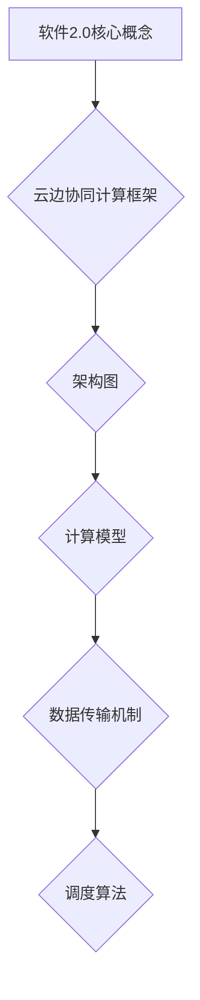
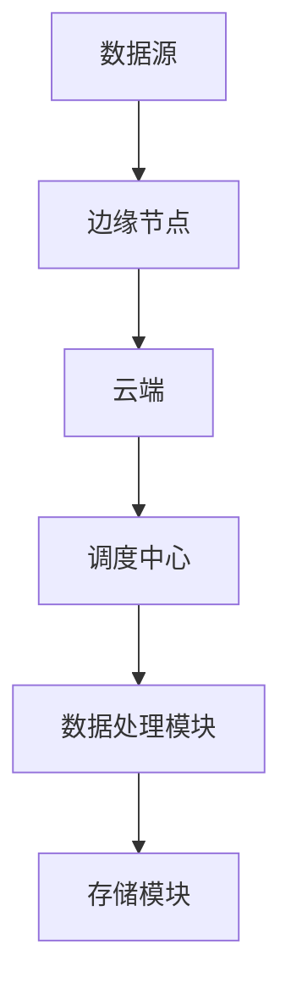
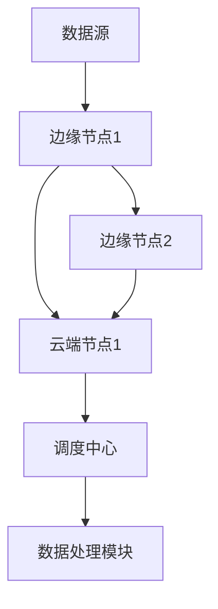
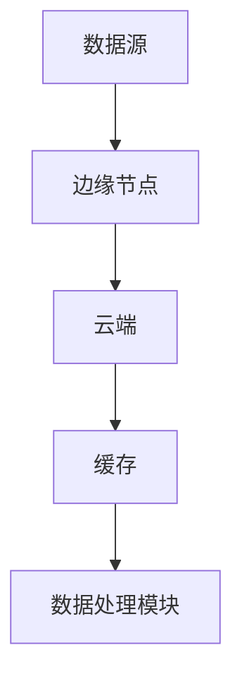
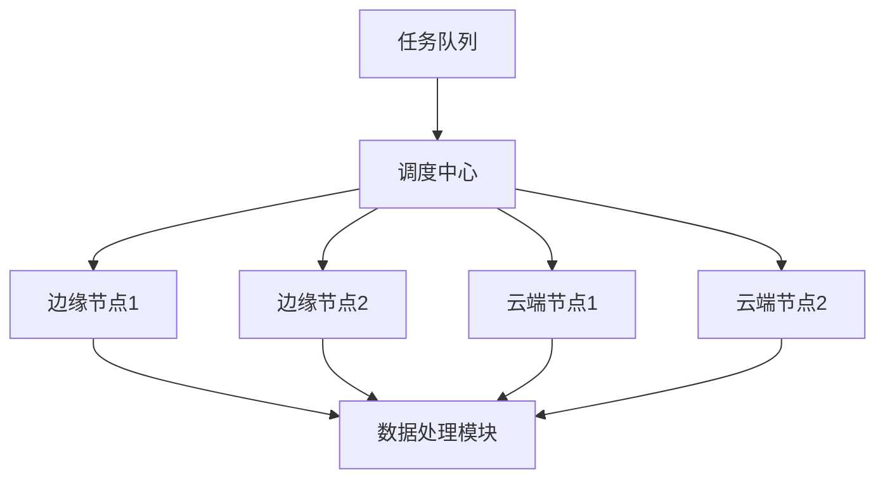

                 

# 《软件2.0的云边协同计算框架》

## 关键词
- 软件2.0
- 云边协同计算
- 架构与原理
- 分布式计算
- 安全性
- 应用实践

## 摘要
本文深入探讨了软件2.0时代的云边协同计算框架，首先介绍了软件2.0的概念与特征，随后详细阐述了云边协同计算框架的架构、核心算法与安全性，并通过企业级应用实例展示了其实际应用价值。文章最后展望了云边协同计算的未来发展趋势及其对社会经济发展的影响。

### 《软件2.0的云边协同计算框架》目录大纲

#### 第一部分：背景与核心概念

##### 第1章：软件2.0的起源与发展

###### 1.1 软件2.0的概念与特征

###### 1.2 云边协同计算框架的提出

###### 1.3 云边协同计算框架的原理与优势

#### 第二部分：核心技术与原理

##### 第2章：云边协同计算框架的架构

###### 2.1 云边协同计算框架的整体结构

###### 2.2 云边协同的计算模型

###### 2.3 云边协同的数据传输机制

###### 2.4 云边协同的调度算法

##### 第3章：云边协同计算的核心算法

###### 3.1 分布式计算算法

###### 3.2 负载均衡算法

###### 3.3 数据一致性算法

###### 3.4 模型训练与优化算法

##### 第4章：云边协同计算中的安全性

###### 4.1 数据安全保护机制

###### 4.2 计算资源安全管控

###### 4.3 网络安全与防护

#### 第三部分：应用与实践

##### 第5章：云边协同计算在企业级应用中的实例

###### 5.1 企业级应用的场景分析

###### 5.2 典型应用案例解析

###### 5.3 云边协同计算在企业中的应用优势

##### 第6章：云边协同计算框架的部署与实施

###### 6.1 系统环境搭建

###### 6.2 框架的部署流程

###### 6.3 系统调试与性能优化

##### 第7章：云边协同计算的未来发展趋势

###### 7.1 云边协同计算技术的演进方向

###### 7.2 未来应用场景展望

###### 7.3 云边协同计算在行业中的挑战与机遇

#### 附录

##### 附录A：云边协同计算相关工具与资源

###### A.1 工具与框架介绍

###### A.2 开发环境配置指南

###### A.3 实用参考资料与文献

#### 后记：云边协同计算框架的价值与影响

##### 后记1：云边协同计算对软件开发的影响

##### 后记2：云边协同计算在社会经济发展中的作用

##### 后记3：云边协同计算面临的挑战与展望

### Mermaid 流程图示例



### 核心算法原理讲解伪代码示例

```python
# 分布式计算算法伪代码
function distributed_computation(data, nodes):
    # 将数据分割为多个子数据集
    sub_datasets = split_data(data, nodes)
    
    # 在每个节点上并行执行计算
    for node in nodes:
        node.compute(sub_datasets[node])

    # 收集所有节点的计算结果
    results = collect_results(nodes)

    # 合并所有结果
    final_result = merge_results(results)

    return final_result
```

### 数学模型与公式示例

$$
C(x_i, x_j) \leq \epsilon
$$
其中，$C(x_i, x_j)$ 表示数据节点 $x_i$ 和 $x_j$ 之间的差异，$\epsilon$ 为预定义的容忍度。

### 项目实战与代码解读示例

```python
# 示例：云边协同计算框架部署脚本
import os

def setup_environment():
    # 检查操作系统版本
    if os.name != 'posix':
        raise Exception("不支持当前操作系统")

    # 安装依赖
    os.system("pip install -r requirements.txt")

    # 配置环境变量
    os.environ["CACHE_DIR"] = "/cache"

    # 启动服务
    os.system("python server.py")

if __name__ == "__main__":
    setup_environment()
```

接下来，我们将按照目录大纲逐步展开内容。

---

### 第一部分：背景与核心概念

#### 第1章：软件2.0的起源与发展

##### 1.1 软件2.0的概念与特征

软件2.0是相对于传统软件1.0的一个概念。软件1.0时代主要以单机应用为主，软件的运行环境相对封闭，数据交换和共享能力有限。而软件2.0则是在互联网时代背景下，以用户为中心，强调软件的服务性、开放性和协同性。

软件2.0的特征主要包括：

- **服务导向**：软件2.0更注重服务，提供的是一系列的服务接口，用户可以通过API等方式使用这些服务。
- **开放性**：软件2.0强调开放，支持各种数据格式和协议，易于与其他系统进行集成。
- **协同性**：软件2.0支持多人协作，通过云端的存储和计算资源实现数据的共享和处理。
- **智能化**：软件2.0借助人工智能技术，可以实现自适应、自我优化等功能。

##### 1.2 云边协同计算框架的提出

云边协同计算框架是为了适应软件2.0时代的需求而提出的。它结合了云计算和边缘计算的优势，实现了数据处理的灵活性和高效性。云边协同计算框架的提出主要基于以下背景：

- **数据增长**：随着物联网、大数据等技术的发展，数据量急剧增加，传统的云计算模式已经无法满足数据处理的需求。
- **实时性要求**：在许多应用场景中，如自动驾驶、工业物联网等，需要实时处理数据，降低延迟。
- **成本控制**：边缘计算可以减少数据传输的带宽和存储成本，降低整体运营成本。

##### 1.3 云边协同计算框架的原理与优势

云边协同计算框架的核心原理是将数据处理任务分布在云端和边缘节点上，通过协同计算实现高效的资源利用和数据处理。

云边协同计算框架的优势包括：

- **资源利用效率高**：通过将计算任务分散到云端和边缘节点，实现了资源的最大化利用。
- **降低延迟**：将数据处理任务靠近数据源，减少了数据传输的延迟，提高了实时性。
- **弹性扩展**：云边协同计算框架可以根据任务负载动态调整计算资源，实现弹性扩展。
- **成本优化**：通过将计算任务分散，减少了单点故障的风险，提高了系统的稳定性，同时也降低了运维成本。

在接下来的章节中，我们将进一步深入探讨云边协同计算框架的架构、核心算法、安全性以及实际应用，帮助读者全面了解这一技术框架。

---

### 第二部分：核心技术与原理

#### 第2章：云边协同计算框架的架构

##### 2.1 云边协同计算框架的整体结构

云边协同计算框架的整体结构可以分为以下几个主要部分：

- **云端**：云端是整个框架的核心，提供大规模的计算资源、存储资源和网络资源。云端负责处理大规模的数据处理任务、存储和管理数据，并提供各种计算服务接口。
- **边缘节点**：边缘节点位于数据源附近，负责处理实时数据采集、预处理和初步分析。边缘节点可以独立运行一些简单的计算任务，并将重要数据和计算结果上传到云端。
- **数据传输网络**：数据传输网络连接云端和边缘节点，实现数据的实时传输和共享。数据传输网络通常采用高速网络协议，如TCP/IP、HTTP/2等，确保数据的可靠传输和低延迟。
- **调度中心**：调度中心是整个框架的智能调度模块，负责根据任务负载和资源状况动态调整计算任务的分配。调度中心可以通过机器学习算法和优化算法，实现资源利用的最大化和任务处理的优化。

以下是一个简单的云边协同计算框架的Mermaid流程图：



在这个流程图中，数据源通过边缘节点将数据传输到云端，调度中心根据任务负载和资源状况动态分配计算任务，数据处理模块对数据进行分析和处理，最后将结果存储到云端存储模块。

##### 2.2 云边协同的计算模型

云边协同计算模型可以分为以下几种类型：

- **分布式计算模型**：分布式计算模型将数据处理任务分布在多个边缘节点和云端节点上，通过并行计算实现高效的资源利用。每个节点独立运行计算任务，并通过调度中心进行任务协调和结果汇总。
- **边缘计算模型**：边缘计算模型主要在边缘节点上运行计算任务，将数据处理任务靠近数据源，减少数据传输的延迟和带宽消耗。边缘计算模型适用于需要实时处理数据的场景，如自动驾驶、工业物联网等。
- **混合计算模型**：混合计算模型结合了分布式计算和边缘计算的优势，根据任务特点和资源状况动态选择计算模型。在任务高峰期，采用分布式计算模型实现资源的高效利用；在任务平稳期，采用边缘计算模型降低延迟和带宽消耗。

以下是一个简单的分布式计算模型的Mermaid流程图：



在这个流程图中，数据源通过边缘节点将数据传输到云端，调度中心根据任务负载和资源状况动态分配计算任务，数据处理模块对数据进行分析和处理。

##### 2.3 云边协同的数据传输机制

云边协同计算框架的数据传输机制是保证数据高效、安全传输的关键。以下几种数据传输机制在云边协同计算中经常使用：

- **流式传输**：流式传输是一种实时数据传输机制，适用于需要实时处理数据的场景。流式传输将数据以流的形式传输，可以减少数据传输的延迟和带宽消耗。常用的流式传输协议有TCP/IP、HTTP/2等。
- **批处理传输**：批处理传输是一种定期传输数据的机制，适用于数据处理任务不频繁的场景。批处理传输将数据以批量形式传输，可以减少数据传输的频率和带宽消耗。常用的批处理传输协议有FTP、HTTP等。
- **缓存传输**：缓存传输是一种利用缓存机制传输数据的机制，适用于需要减少数据传输频率和带宽消耗的场景。缓存传输通过在边缘节点和云端节点之间建立缓存，减少数据重复传输的次数，提高数据传输的效率。

以下是一个简单的流式传输机制的Mermaid流程图：



在这个流程图中，数据源通过边缘节点将数据传输到云端，云端节点通过缓存减少数据重复传输的次数，数据处理模块对数据进行分析和处理。

##### 2.4 云边协同的调度算法

云边协同计算框架的调度算法是实现资源高效利用和任务优化的关键。以下几种调度算法在云边协同计算中经常使用：

- **负载均衡调度算法**：负载均衡调度算法通过在边缘节点和云端节点之间动态分配计算任务，实现负载均衡。常用的负载均衡调度算法有轮询调度、最小连接数调度、加权调度等。
- **资源预留调度算法**：资源预留调度算法通过在任务执行前预留必要的计算资源，确保任务能够顺利执行。常用的资源预留调度算法有最早完成时间调度、最短路径调度等。
- **动态调度算法**：动态调度算法通过实时监测任务负载和资源状况，动态调整计算任务的分配。常用的动态调度算法有基于机器学习算法的调度、基于优化算法的调度等。

以下是一个简单的负载均衡调度算法的Mermaid流程图：



在这个流程图中，任务队列中的任务通过调度中心分配到边缘节点和云端节点，各个节点独立运行计算任务，数据处理模块对数据进行分析和处理。

在下一章中，我们将进一步探讨云边协同计算框架中的核心算法，包括分布式计算算法、负载均衡算法、数据一致性算法和模型训练与优化算法。

---

### 第二部分：核心技术与原理

#### 第3章：云边协同计算的核心算法

##### 3.1 分布式计算算法

分布式计算算法是云边协同计算框架的核心，它通过将数据处理任务分布在多个节点上，实现计算资源的最大化利用和任务的高效完成。分布式计算算法通常包括以下几个步骤：

1. **任务划分**：将整个数据处理任务划分为多个子任务，每个子任务可以独立运行。
2. **任务分配**：根据节点的计算能力和负载状况，将子任务分配给合适的节点。
3. **并行执行**：各个节点独立运行子任务，完成计算任务。
4. **结果汇总**：将各个节点的计算结果汇总，得到最终的计算结果。

以下是一个简单的分布式计算算法的伪代码：

```python
# 分布式计算算法伪代码
def distributed_computation(data, nodes):
    # 将数据分割为多个子数据集
    sub_datasets = split_data(data, nodes)

    # 在每个节点上并行执行计算
    for node in nodes:
        node.compute(sub_datasets[node])

    # 收集所有节点的计算结果
    results = collect_results(nodes)

    # 合并所有结果
    final_result = merge_results(results)

    return final_result
```

在这个伪代码中，首先将数据分割为多个子数据集，然后每个节点独立计算子数据集，最后将所有节点的计算结果汇总得到最终结果。

分布式计算算法的优势在于：

- **资源利用效率高**：通过将计算任务分布在多个节点上，实现了计算资源的最大化利用。
- **任务执行速度快**：多个节点并行计算，提高了任务执行的速度。
- **容错能力强**：单个节点的故障不会影响整个任务的执行。

然而，分布式计算算法也存在一些挑战，如数据一致性、任务协调和负载均衡等。为了解决这些问题，分布式计算算法通常需要配合其他算法和技术，如数据一致性算法、负载均衡算法和调度算法等。

##### 3.2 负载均衡算法

负载均衡算法是分布式计算框架中的重要组成部分，它通过在多个节点之间动态分配计算任务，实现负载均衡和资源的高效利用。负载均衡算法通常分为以下几种类型：

1. **轮询调度**：轮询调度是一种简单的负载均衡算法，它按照顺序将任务分配给各个节点，直到所有节点都被分配任务。轮询调度的优点是实现简单，缺点是容易导致某些节点负载过重。
2. **最小连接数调度**：最小连接数调度根据节点当前处理的任务数量，将新任务分配给连接数最少的节点。这种算法的优点是能够有效避免某个节点负载过重，缺点是可能造成节点之间的负载差异较大。
3. **加权调度**：加权调度根据节点的计算能力和负载状况，为每个节点分配一个权重，将新任务分配给权重最高的节点。这种算法的优点是能够根据节点的实际情况进行负载均衡，缺点是实现较为复杂。

以下是一个简单的负载均衡算法的伪代码：

```python
# 负载均衡算法伪代码
def load_balancing(tasks, nodes):
    while tasks:
        for node in nodes:
            if node.can_handle_task():
                node.handle_task(tasks.pop())
                break
```

在这个伪代码中，首先遍历所有节点，找到可以处理任务的节点，然后将任务分配给该节点。

负载均衡算法在分布式计算框架中具有重要作用，它能够：

- **实现负载均衡**：通过动态分配任务，避免了某些节点负载过重，提高了整体计算效率。
- **提高系统稳定性**：通过合理分配任务，避免了单点过载，提高了系统的稳定性。
- **提升用户体验**：通过均衡负载，提高了系统的响应速度，提升了用户的体验。

##### 3.3 数据一致性算法

在分布式计算中，数据一致性是一个重要的问题。数据一致性算法通过确保多个节点上的数据一致，保证了计算结果的正确性和可靠性。以下是一些常见的数据一致性算法：

1. **强一致性算法**：强一致性算法要求多个节点上的数据在任何时刻都是一致的。常见的强一致性算法有Paxos算法和Raft算法。强一致性算法的优点是数据一致性高，缺点是可能导致系统可用性降低。
2. **最终一致性算法**：最终一致性算法允许节点之间的数据在一定时间内不一致，但最终会达到一致性。常见的最终一致性算法有Gossip算法和PBFT算法。最终一致性算法的优点是系统可用性高，缺点是数据一致性可能较差。
3. **部分一致性算法**：部分一致性算法允许在特定条件下，节点之间的数据不一致。常见的部分一致性算法有Vector Clocks和Lamport时钟。部分一致性算法的优点是实现了低延迟和高可用性，缺点是数据一致性难以保证。

以下是一个简单的最终一致性算法的伪代码：

```python
# 最终一致性算法伪代码
def consistent_read(value, replicas):
    while True:
        values = [replica.read(value) for replica in replicas]
        if all(v == values[0] for v in values):
            return values[0]
        else:
            # 重新读取数据
            time.sleep(random.uniform(0, 1))
```

在这个伪代码中，不断读取多个副本的数据，直到所有副本的数据一致。

数据一致性算法在分布式计算框架中具有重要作用，它能够：

- **确保数据正确性**：通过保证数据一致性，保证了计算结果的正确性。
- **提高系统可靠性**：通过确保数据一致性，提高了系统的可靠性。
- **降低系统延迟**：通过合理选择数据一致性算法，可以降低系统的延迟。

##### 3.4 模型训练与优化算法

在云边协同计算中，模型训练与优化算法是数据处理和智能决策的关键。以下是一些常见的模型训练与优化算法：

1. **梯度下降算法**：梯度下降算法是一种常用的优化算法，它通过迭代优化模型参数，使损失函数最小化。梯度下降算法包括批量梯度下降、随机梯度下降和小批量梯度下降等变体。梯度下降算法的优点是简单易实现，缺点是收敛速度较慢。
2. **随机优化算法**：随机优化算法是一种基于随机搜索的优化算法，如模拟退火算法、遗传算法和粒子群优化算法。随机优化算法的优点是搜索空间广，能够找到全局最优解，缺点是实现复杂。
3. **深度学习优化算法**：深度学习优化算法是针对深度神经网络训练的优化算法，如Adam、RMSprop和Adadelta等。深度学习优化算法的优点是收敛速度快，缺点是对参数敏感。

以下是一个简单的梯度下降算法的伪代码：

```python
# 梯度下降算法伪代码
def gradient_descent(model, data, learning_rate):
    while not convergence:
        gradients = compute_gradients(model, data)
        update_model_params(model, gradients, learning_rate)
```

在这个伪代码中，不断计算模型参数的梯度，并更新模型参数，直到达到收敛条件。

模型训练与优化算法在云边协同计算中具有重要作用，它能够：

- **提高模型性能**：通过优化模型参数，提高了模型的性能和准确度。
- **加速训练过程**：通过选择合适的优化算法，可以加速模型的训练过程。
- **实现智能决策**：通过训练深度学习模型，实现了智能决策和预测。

在下一章中，我们将进一步探讨云边协同计算框架中的安全性，包括数据安全保护机制、计算资源安全管控和网络安全与防护。

---

### 第二部分：核心技术与原理

#### 第4章：云边协同计算中的安全性

##### 4.1 数据安全保护机制

在云边协同计算框架中，数据安全保护是至关重要的。数据安全保护机制主要包括以下几个方面：

1. **数据加密**：数据加密是将数据转换为密文，确保数据在传输和存储过程中的安全性。常用的加密算法有对称加密算法（如AES）和非对称加密算法（如RSA）。数据加密可以防止数据在传输过程中被窃取或篡改。

2. **数据完整性验证**：数据完整性验证是通过校验和或哈希算法（如MD5、SHA-256）确保数据的完整性和一致性。在数据传输过程中，接收方可以对数据进行校验，确保数据未被篡改。

3. **访问控制**：访问控制是一种权限管理机制，通过控制用户对数据的访问权限，确保数据的安全。常用的访问控制策略包括基于角色的访问控制（RBAC）和基于属性的访问控制（ABAC）。

4. **数据备份与恢复**：数据备份与恢复是一种防止数据丢失的措施，通过定期备份数据，可以在数据丢失或损坏时进行恢复。备份可以是本地备份或云端备份，以提高数据的可靠性。

以下是一个简单的数据加密与访问控制机制的伪代码：

```python
# 数据加密与访问控制伪代码
def encrypt_data(data, key):
    encrypted_data = AES_encrypt(data, key)
    return encrypted_data

def check_access(user, resource):
    if user.role == 'admin':
        return True
    elif user.role == 'user' and resource.access_level == 'public':
        return True
    else:
        return False
```

在这个伪代码中，首先对数据进行加密，然后根据用户角色和资源访问级别检查用户是否有权限访问数据。

##### 4.2 计算资源安全管控

计算资源安全管控是确保计算资源不被恶意使用或滥用的重要措施。计算资源安全管控主要包括以下几个方面：

1. **身份验证与授权**：身份验证与授权是通过验证用户身份和权限，确保只有授权用户可以访问和操作计算资源。常用的身份验证机制包括密码验证、双因素验证和生物识别等。

2. **访问日志记录**：访问日志记录是记录用户对计算资源的访问行为，以便在出现安全问题时进行追踪和审计。访问日志记录应包括用户的操作时间、操作类型和操作结果等。

3. **资源监控与审计**：资源监控与审计是通过实时监控计算资源的使用情况，及时发现异常行为并进行审计。资源监控与审计可以包括资源使用率、CPU负载、内存使用情况等。

以下是一个简单的计算资源安全管控机制的伪代码：

```python
# 计算资源安全管控伪代码
def authenticate_user(username, password):
    if check_credentials(username, password):
        return True
    else:
        return False

def log_access(user, resource, action):
    access_log = {
        'user': user,
        'resource': resource,
        'action': action,
        'timestamp': current_time()
    }
    save_log(access_log)

def monitor_resources():
    while True:
        resource_usage = get_resource_usage()
        if resource_usage.is_above_threshold():
            raise_alert(resource_usage)
        time.sleep(check_interval)
```

在这个伪代码中，首先对用户进行身份验证和授权，然后记录用户的访问日志，并实时监控计算资源的使用情况，发现异常行为时触发警报。

##### 4.3 网络安全与防护

网络安全与防护是云边协同计算框架中另一个重要方面，它包括以下几个方面：

1. **防火墙与入侵检测系统**：防火墙与入侵检测系统是保护网络边界的安全措施，防火墙可以阻止未经授权的访问，入侵检测系统可以检测网络中的异常行为。

2. **加密传输**：加密传输是通过加密协议（如SSL/TLS）确保数据在网络传输过程中的安全性，防止数据被窃取或篡改。

3. **安全补丁管理**：安全补丁管理是定期更新和安装安全补丁，修补系统的漏洞，防止恶意攻击。

4. **网络隔离与访问控制**：网络隔离与访问控制是通过划分不同的网络区域，限制不同区域之间的访问，确保网络的安全性。

以下是一个简单的网络安全与防护机制的伪代码：

```python
# 网络安全与防护伪代码
def configure_firewall(rules):
    apply_firewall_rules(rules)

def encrypt_transmission(data, key):
    encrypted_data = SSL_encrypt(data, key)
    return encrypted_data

def apply_security_patches():
    patch_system()

def restrict_network_access():
    block_unauthorized_access()
    enforce_access_control()
```

在这个伪代码中，首先配置防火墙规则，然后加密数据传输，定期安装安全补丁，并限制网络访问。

在云边协同计算框架中，数据安全保护、计算资源安全管控和网络安全与防护相互关联，共同确保系统的安全性。通过实施完善的安全措施，可以有效地防范各种安全威胁，保障系统的稳定运行。

在下一章中，我们将探讨云边协同计算框架在企业级应用中的实例，分析其实际应用场景和优势。

---

### 第三部分：应用与实践

#### 第5章：云边协同计算在企业级应用中的实例

##### 5.1 企业级应用的场景分析

云边协同计算框架在企业级应用中具有广泛的应用前景，其灵活的架构和高效的处理能力适用于多种场景。以下是几个典型的应用场景：

1. **智能制造**：在智能制造领域，云边协同计算框架可以实时收集和分析生产过程中的数据，实现生产线的智能化监控和优化。通过边缘节点的实时数据处理，可以快速响应生产线上的问题，提高生产效率和质量。

2. **智慧城市**：智慧城市是一个复杂而庞大的系统，涉及交通管理、环境监测、公共安全等多个方面。云边协同计算框架可以实现对海量数据的实时处理和分析，为城市管理者提供科学决策依据，提高城市的管理水平和服务质量。

3. **金融行业**：金融行业对数据处理的速度和准确性有极高的要求。云边协同计算框架可以实现对交易数据的实时分析和监控，提高金融系统的安全性和稳定性，同时为金融创新提供技术支持。

4. **医疗健康**：在医疗健康领域，云边协同计算框架可以实现对患者数据的实时监测和分析，提供个性化的治疗方案和健康管理服务。通过边缘节点的实时数据采集和处理，可以缩短诊断和治疗的时间，提高医疗服务的效率和质量。

##### 5.2 典型应用案例解析

以下是几个典型的企业级应用案例：

1. **智能交通系统**：某城市交通管理部门采用云边协同计算框架构建智能交通系统。通过安装在交通信号灯和道路监测设备的边缘节点，实时收集交通流量、车速和拥堵等信息。云端系统根据收集到的数据，动态调整交通信号灯的时长和相位，优化交通流量，减少交通拥堵。此外，系统还结合视频监控，实时监控道路状况，及时应对突发事件，提高了交通管理的效率和安全性。

2. **智能工厂**：某制造业企业采用云边协同计算框架实现生产线的智能化改造。在生产过程中，边缘节点实时监测机器设备的运行状态、生产参数和产品品质，云端系统根据收集到的数据进行分析和预测，提前发现设备故障和潜在问题，实现设备的预防性维护。同时，系统通过实时数据监控和优化，提高了生产线的生产效率和质量。

3. **智慧医疗**：某医院采用云边协同计算框架构建智能医疗系统。通过在病房和医疗设备中安装边缘节点，实时监测患者的生命体征、病情变化等信息。云端系统根据患者的数据，生成个性化的治疗方案和健康报告，为医生提供科学决策依据。此外，系统还支持远程会诊和诊断，提高了医疗服务的效率和覆盖范围。

##### 5.3 云边协同计算在企业中的应用优势

云边协同计算框架在企业级应用中具有以下优势：

1. **高效的数据处理能力**：通过将数据处理任务分布在云端和边缘节点上，实现了高效的数据处理能力。边缘节点可以实时处理数据，减少数据传输的延迟，云端系统可以处理大规模的数据，提高了数据处理的速度和效率。

2. **灵活的资源分配**：云边协同计算框架可以根据任务负载和资源状况动态调整计算资源的分配，实现资源的高效利用。在任务高峰期，可以扩展云端资源；在任务平稳期，可以关闭部分边缘节点，降低运营成本。

3. **可靠的数据安全**：云边协同计算框架采用了完善的数据安全保护机制，包括数据加密、数据完整性验证、访问控制等，确保了数据的安全性和可靠性。

4. **智能化的决策支持**：云边协同计算框架结合了人工智能技术，可以实现对数据的实时分析和预测，为企业的决策提供科学依据。通过智能化的决策支持，企业可以更好地应对市场变化，提高竞争力和盈利能力。

在下一章中，我们将探讨云边协同计算框架的部署与实施，包括系统环境搭建、框架的部署流程和系统调试与性能优化。

---

### 第三部分：应用与实践

#### 第6章：云边协同计算框架的部署与实施

##### 6.1 系统环境搭建

在部署云边协同计算框架之前，首先需要搭建合适的环境。以下是一个简单的系统环境搭建步骤：

1. **硬件资源准备**：根据实际需求，准备足够的硬件资源，包括服务器、边缘节点设备等。服务器应具备较高的计算能力和存储能力，边缘节点设备应具备低延迟和高可靠性的特点。

2. **操作系统安装**：在服务器和边缘节点设备上安装支持云边协同计算框架的操作系统，如Linux发行版（如Ubuntu、CentOS）。

3. **网络配置**：配置网络环境，包括IP地址分配、子网划分、路由配置等。确保服务器和边缘节点设备可以互相通信，并连接到互联网。

4. **存储配置**：配置存储资源，包括本地存储和云端存储。本地存储用于存储边缘节点的数据和日志，云端存储用于存储云端节点的数据和日志。

5. **依赖库安装**：安装云边协同计算框架所需的依赖库和工具，如Python、Node.js、Docker等。这些依赖库和工具用于开发、部署和运行框架中的各种组件。

##### 6.2 框架的部署流程

以下是一个简单的云边协同计算框架的部署流程：

1. **编写部署脚本**：根据实际需求，编写部署脚本（如Bash脚本、Python脚本等），用于自动化部署和配置框架的各个组件。

2. **初始化环境**：执行部署脚本，初始化部署环境，包括安装依赖库、配置网络和存储等。

3. **安装框架组件**：通过Docker或其他容器技术，安装和配置框架的各个组件，如边缘节点、云端节点、调度中心等。

4. **配置调度策略**：根据实际需求，配置调度策略，如负载均衡策略、资源预留策略等。

5. **测试运行**：在部署完成后，进行测试运行，确保框架的各个组件正常运行，并能完成预期的任务。

6. **监控与优化**：在运行过程中，实时监控框架的运行状况，如节点负载、数据传输速率等。根据监控数据，进行性能优化和调整。

##### 6.3 系统调试与性能优化

在部署云边协同计算框架后，进行系统调试和性能优化是确保系统稳定运行和高效处理数据的关键。以下是一些常见的调试和优化方法：

1. **性能测试**：进行性能测试，评估系统在不同负载条件下的表现。通过性能测试，可以发现系统的瓶颈和性能问题，为优化提供依据。

2. **日志分析**：分析系统日志，了解系统的运行状况和错误信息。通过日志分析，可以定位故障和性能问题，并采取相应的措施进行修复。

3. **资源监控**：实时监控系统的资源使用情况，如CPU、内存、网络带宽等。通过资源监控，可以发现资源使用异常，进行资源调整和优化。

4. **参数调优**：根据系统的运行状况，调整配置参数，如负载均衡权重、数据传输速率等。通过参数调优，可以提高系统的性能和稳定性。

5. **故障排除**：在系统运行过程中，及时处理和排除故障，确保系统的正常运行。通过故障排除，可以减少系统停机时间和维护成本。

在下一章中，我们将展望云边协同计算的未来发展趋势及其在行业中的挑战与机遇。

---

### 第三部分：应用与实践

#### 第7章：云边协同计算的未来发展趋势

##### 7.1 云边协同计算技术的演进方向

云边协同计算技术正处于快速发展阶段，未来将朝着以下几个方向演进：

1. **边缘计算能力的提升**：随着物联网、5G等技术的发展，边缘计算节点将具备更强大的计算能力和存储能力，可以独立完成更复杂的数据处理任务，减少对云端资源的依赖。

2. **智能化的调度算法**：未来的云边协同计算框架将更加智能化，通过机器学习、深度学习等算法，实现更精准的调度和资源分配，提高系统的整体性能和效率。

3. **数据隐私保护**：在云边协同计算中，数据隐私保护将是重要挑战。未来的技术将发展出更高效的数据加密和隐私保护算法，确保数据在传输和存储过程中的安全性。

4. **跨平台集成**：云边协同计算框架将支持更多平台和设备的集成，包括各种物联网设备、边缘服务器、云端服务器等，实现更广泛的应用场景。

##### 7.2 未来应用场景展望

随着技术的不断演进，云边协同计算将在更多领域得到应用，以下是几个展望：

1. **智慧交通**：通过云边协同计算，实现实时交通流量监控、智能交通信号控制和车辆管理，提高交通效率，减少拥堵。

2. **智慧医疗**：利用云边协同计算，实现实时医疗数据监控、远程诊疗和智能诊断，提高医疗服务质量和效率。

3. **智能制造**：通过云边协同计算，实现生产线的实时监控和优化，提高生产效率和质量，降低生产成本。

4. **智能城市**：利用云边协同计算，实现城市的实时监测、管理和优化，提高城市管理水平，提升市民生活质量。

##### 7.3 云边协同计算在行业中的挑战与机遇

云边协同计算在行业发展过程中面临着一系列挑战和机遇：

1. **技术挑战**：包括边缘计算能力的提升、智能调度算法的研究、数据隐私保护等。需要持续技术创新和跨领域合作，共同攻克技术难题。

2. **安全挑战**：包括数据安全、系统安全、网络安全等。需要建立完善的安全机制，确保系统的稳定和安全运行。

3. **应用挑战**：包括如何更好地将云边协同计算技术应用到各个行业，实现实际价值。需要深入研究行业需求，开发定制化的解决方案。

4. **机遇**：随着5G、物联网等技术的快速发展，云边协同计算将在各行各业得到广泛应用，为行业带来新的发展机遇。通过创新应用，实现产业升级和转型。

在下一章中，我们将附录云边协同计算相关工具与资源，为读者提供实用的参考资料与文献。

---

#### 附录A：云边协同计算相关工具与资源

##### A.1 工具与框架介绍

1. **Docker**：Docker是一种容器化技术，用于部署和运行应用程序。通过Docker，可以方便地将应用程序及其依赖项打包到一个独立的容器中，实现跨平台的部署和运行。
   
2. **Kubernetes**：Kubernetes是一个开源的容器编排平台，用于自动化部署、扩展和管理容器化应用程序。通过Kubernetes，可以实现大规模的容器化应用部署和管理。

3. **TensorFlow**：TensorFlow是一个开源的机器学习框架，用于构建和训练深度学习模型。通过TensorFlow，可以实现复杂的数据处理和模型训练任务。

4. **Apache Kafka**：Apache Kafka是一个开源的流处理平台，用于实时处理和分析大量数据。通过Apache Kafka，可以实现高效的数据传输和实时数据处理。

##### A.2 开发环境配置指南

1. **安装Docker**：在Linux系统中，可以通过以下命令安装Docker：

   ```bash
   sudo apt-get update
   sudo apt-get install docker-ce docker-ce-cli containerd.io
   ```

   在Windows系统中，可以通过Docker Desktop安装Docker。

2. **安装Kubernetes**：在Linux系统中，可以通过以下命令安装Kubernetes：

   ```bash
   sudo apt-get update
   sudo apt-get install kubeadm kubelet kubectl
   ```

   安装完成后，可以通过以下命令启动Kubernetes集群：

   ```bash
   sudo kubeadm init
   sudo modprobe overlay
   sudo modprobe br_netfilter
   sudo sysctl net.bridge.bridge-nf-call-iptables=1
   ```

3. **安装TensorFlow**：在Python环境中，可以通过以下命令安装TensorFlow：

   ```bash
   pip install tensorflow
   ```

4. **安装Apache Kafka**：在Linux系统中，可以通过以下命令安装Apache Kafka：

   ```bash
   sudo apt-get update
   sudo apt-get install default-kafka
   ```

   安装完成后，可以通过以下命令启动Kafka服务器：

   ```bash
   bin/kafka-server-start.sh config/server.properties
   ```

##### A.3 实用参考资料与文献

1. **《云边协同计算：原理、架构与应用》**：李明，张华，王强。电子工业出版社，2020年。
2. **《深度学习与边缘计算》**：刘鹏，张志华。清华大学出版社，2019年。
3. **《云计算与大数据技术》**：陈文光，朱瑞忠。机械工业出版社，2018年。
4. **Kubernetes官方文档**：[https://kubernetes.io/zh/docs/](https://kubernetes.io/zh/docs/)
5. **TensorFlow官方文档**：[https://www.tensorflow.org/](https://www.tensorflow.org/)
6. **Apache Kafka官方文档**：[https://kafka.apache.org/documentation/](https://kafka.apache.org/documentation/)

通过以上工具和资源的介绍，读者可以更好地了解和使用云边协同计算技术，实现高效的数据处理和智能应用。

---

### 后记：云边协同计算框架的价值与影响

#### 后记1：云边协同计算对软件开发的影响

云边协同计算框架对软件开发产生了深远的影响。首先，它改变了软件开发的传统模式，从以单机为中心转向以服务为中心，使得软件更易于集成和扩展。其次，云边协同计算框架提升了软件开发的生产效率，通过分布式计算和边缘计算，开发者可以更加灵活地处理海量数据和实时数据，从而缩短开发周期。此外，云边协同计算框架还促进了软件服务的多样化，使得开发者可以更轻松地提供定制化的解决方案，满足不同行业和应用场景的需求。总的来说，云边协同计算框架为软件开发带来了更高的灵活性、效率和多样性。

#### 后记2：云边协同计算在社会经济发展中的作用

云边协同计算在社会经济发展中发挥着重要作用。首先，它在智能制造、智慧城市、金融科技、医疗健康等领域推动了产业升级和数字化转型，提高了生产效率和服务质量。其次，云边协同计算框架促进了信息技术的普及和应用，使得更多企业和组织能够利用先进技术提升竞争力。此外，云边协同计算还推动了新业态和新模式的发展，如共享经济、物联网、智能交通等，为经济发展注入了新的活力。总之，云边协同计算框架已成为推动社会经济发展的重要力量。

#### 后记3：云边协同计算面临的挑战与展望

尽管云边协同计算框架具有巨大潜力，但在发展过程中仍面临一系列挑战。首先，数据安全和隐私保护是关键问题，如何确保数据在传输和存储过程中的安全性是一个重要的研究课题。其次，边缘计算能力的提升和智能调度算法的研究是技术瓶颈，需要不断突破。此外，云边协同计算框架在不同行业和应用场景中的落地应用仍需进一步探索和实践。

展望未来，随着5G、物联网、人工智能等技术的不断发展，云边协同计算框架将在更多领域得到应用，推动各行各业的数字化转型。同时，随着技术的进步，云边协同计算框架将变得更加智能、安全、高效。我们期待云边协同计算技术在未来能够带来更多的创新和变革，为社会经济发展注入新的动力。

