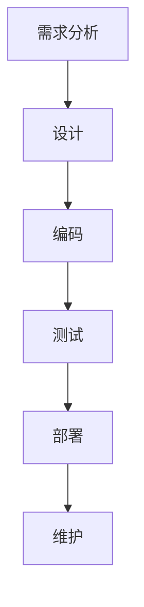
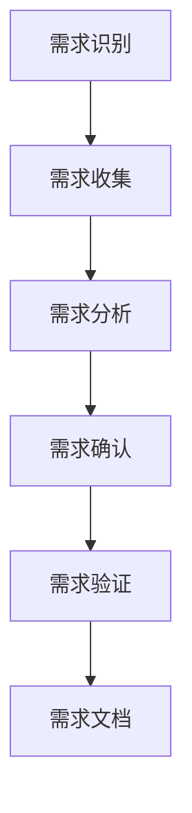
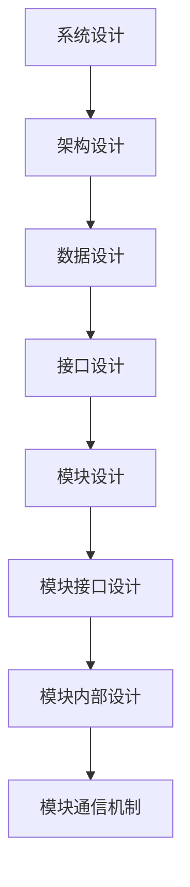
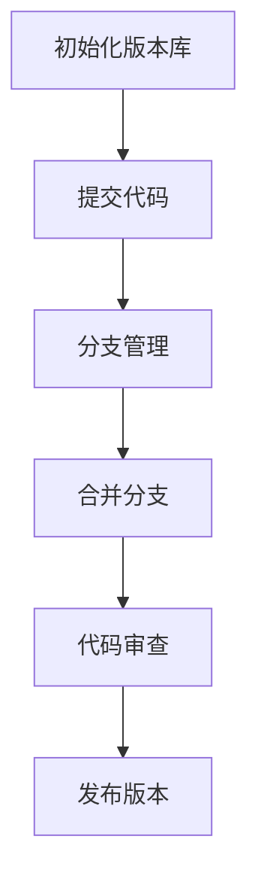
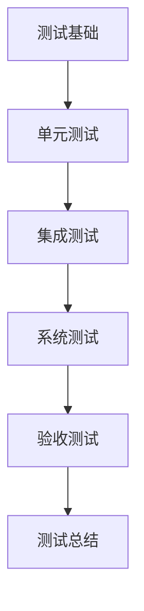
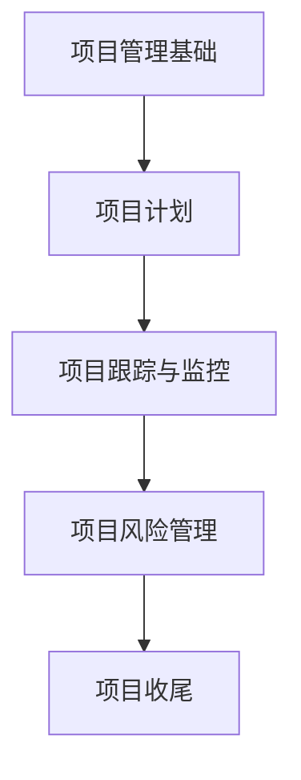
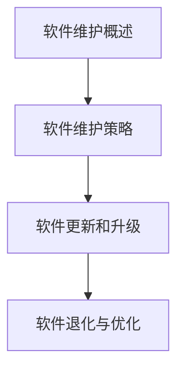
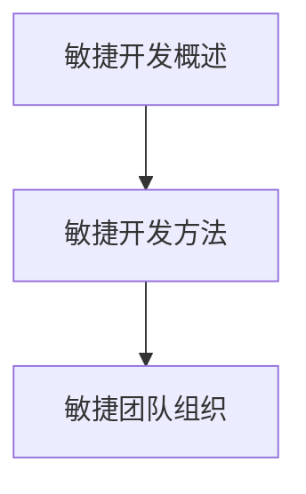

                 

# 《软件工程》

> 关键词：软件工程、软件生命周期、需求工程、设计模式、测试驱动开发、项目管理、敏捷开发、DevOps、持续集成、版本控制、AI、区块链、大数据

> 摘要：本文将深入探讨软件工程的核心概念、原则和实践，从基础理论到现代方法，从工具应用到新兴领域，全面解析软件工程的各个方面。通过详细的讲解、实例分析和实际项目案例，帮助读者全面理解软件工程的本质和实际应用。

## 目录大纲

### 第一部分：软件工程基础

### 第1章 软件工程概述
#### 1.1 软件工程的定义与目标
#### 1.2 软件生命周期
#### 1.3 软件工程的发展历程

### 第2章 软件需求工程
#### 2.1 需求工程概述
#### 2.2 需求获取
#### 2.3 需求分析
#### 2.4 需求验证和确认

### 第3章 软件设计
#### 3.1 软件设计概述
#### 3.2 系统设计
#### 3.3 模块设计
#### 3.4 设计模式

### 第4章 软件实现
#### 4.1 编程语言概述
#### 4.2 编码规范与最佳实践
#### 4.3 测试驱动开发（TDD）
#### 4.4 版本控制

### 第5章 软件测试
#### 5.1 测试基础
#### 5.2 单元测试
#### 5.3 集成测试
#### 5.4 系统测试
#### 5.5 验收测试

### 第6章 软件项目管理
#### 6.1 项目管理基础
#### 6.2 项目计划
#### 6.3 项目跟踪与监控
#### 6.4 项目风险管理

### 第7章 软件维护
#### 7.1 软件维护概述
#### 7.2 软件维护策略
#### 7.3 软件更新和升级
#### 7.4 软件退化与优化

### 第二部分：现代软件工程

### 第8章 敏捷开发
#### 8.1 敏捷开发概述
#### 8.2 敏捷开发方法
#### 8.3 敏捷团队组织

### 第9章 DevOps与持续集成
#### 9.1 DevOps概述
#### 9.2 持续集成
#### 9.3 持续交付
#### 9.4 持续部署

### 第10章 软件工程工具与实践
#### 10.1 版本控制工具
#### 10.2 集成开发环境（IDE）
#### 10.3 测试自动化工具
#### 10.4 项目管理工具

### 第11章 软件工程中的创新技术
#### 11.1 AI与软件工程
#### 11.2 区块链在软件工程中的应用
#### 11.3 大数据与软件工程

### 第12章 软件工程中的伦理问题
#### 12.1 软件工程伦理概述
#### 12.2 数据隐私保护
#### 12.3 软件工程与社会责任

### 第三部分：软件工程案例研究

### 第13章 软件工程经典案例
#### 13.1 案例一：微软Windows操作系统开发
#### 13.2 案例二：苹果iOS系统开发
#### 13.3 案例三：谷歌Android系统开发

### 第14章 新兴领域的软件工程挑战
#### 14.1 物联网软件工程
#### 14.2 区块链软件开发
#### 14.3 自动驾驶汽车软件工程

### 第15章 未来的软件工程
#### 15.1 软件工程发展趋势
#### 15.2 软件工程教育
#### 15.3 软件工程的未来挑战

### 附录

#### 附录A：软件工程参考资料
#### 附录B：软件工程术语表
#### 附录C：软件工程工具列表

### 第一部分：软件工程基础

### 第1章 软件工程概述

#### 1.1 软件工程的定义与目标

软件工程是关于软件开发、操作和维护的一门工程学科。它涉及一系列的概念、方法、工具和最佳实践，旨在确保软件开发的高效性、可靠性和可维护性。

**核心概念：**
- **软件：** 计算机程序及其相关文档和资源。
- **软件开发：** 创建软件产品的过程。
- **软件工程：** 应用系统化、规范化和可度量的方法进行软件开发和维护。

**核心目标：**
- **功能性：** 确保软件满足用户需求。
- **可靠性：** 确保软件在各种条件下都能稳定运行。
- **可维护性：** 确保软件易于修改和维护。
- **效率：** 在资源和时间上优化软件开发过程。

#### 1.2 软件生命周期

软件生命周期是指软件从概念到退役的整个过程，包括多个阶段：

1. **需求分析：** 确定用户需求，形成软件需求规格说明书。
2. **设计：** 确定软件系统的结构和接口，包括系统设计、模块设计等。
3. **编码：** 将设计转换为实际代码，遵循编码规范和最佳实践。
4. **测试：** 检验软件是否满足需求和设计，包括单元测试、集成测试、系统测试和验收测试。
5. **部署：** 将软件部署到实际环境中，包括安装、配置和调试。
6. **维护：** 在软件使用过程中进行修改、更新和优化，以适应新的需求和环境变化。

#### 1.3 软件工程的发展历程

软件工程的发展经历了几个阶段：

- **手工编码阶段：** 软件开发主要依靠个人技能，缺乏系统性和规范化。
- **结构化编程阶段：** 强调代码的可读性和模块化，引入了流程图和结构化编程方法。
- **面向对象编程阶段：** 将数据和操作封装为对象，提高了代码的复用性和可维护性。
- **敏捷开发阶段：** 强调快速迭代、用户反馈和团队协作，提高了软件开发的灵活性和响应能力。
- **现代软件工程阶段：** 结合了云计算、大数据、人工智能等新技术，推动了软件开发方法的不断创新。

#### Mermaid流程图



#### 核心算法原理讲解

软件生命周期中的每个阶段都有其核心算法原理和方法：

1. **需求分析：** 使用需求工程方法（如场景分析、用例建模等）获取用户需求，并通过需求规格说明书进行明确。
2. **设计：** 使用设计模式（如MVC、REST等）和架构风格（如微服务、SOA等）设计软件结构，通过UML图等工具进行详细描述。
3. **编码：** 使用编程语言和工具（如IDE、代码库等）编写代码，遵循编码规范和最佳实践，如DRY（Don't Repeat Yourself）、KISS（Keep It Simple, Stupid）等。
4. **测试：** 使用自动化测试工具（如JUnit、Selenium等）进行单元测试、集成测试、系统测试和验收测试，确保软件质量。
5. **部署：** 使用自动化部署工具（如Jenkins、Docker等）进行安装、配置和部署，确保软件快速交付。
6. **维护：** 使用持续集成和持续交付（CI/CD）方法，快速响应用户反馈和需求变更，进行软件更新和优化。

```python
# 需求分析
class RequirementAnalysis:
    def __init__(self, user_stories):
        self.user_stories = user_stories

    def analyze_requirements(self):
        # 分析用户需求
        for user_story in self.user_stories:
            print("Analyzing user story:", user_story)
            # 需求规格说明
            spec = self.generate_requirement_specification(user_story)
            print("Generated requirement specification:", spec)
        
    def generate_requirement_specification(self, user_story):
        # 生成需求规格说明书
        return f"User Story: {user_story}\nDescription: TODO\nFunctional Requirements: TODO\nNon-functional Requirements: TODO"

# 设计
class SoftwareDesign:
    def __init__(self, requirements):
        self.requirements = requirements

    def design_system(self):
        # 设计系统
        print("Designing system based on requirements:")
        for requirement in self.requirements:
            print(" -", requirement)

    def create_uml_diagrams(self):
        # 创建UML图
        print("Creating UML diagrams for system design...")

# 编码
class CodeImplementation:
    def __init__(self, design):
        self.design = design

    def implement_code(self):
        # 编写代码
        print("Implementing code based on design:")
        for component in self.design:
            print(" -", component)

# 测试
class SoftwareTesting:
    def __init__(self, implementation):
        self.implementation = implementation

    def perform_unit_tests(self):
        # 进行单元测试
        print("Performing unit tests:")
        for test in self.implementation.unit_tests:
            print(" -", test)

    def perform_integration_tests(self):
        # 进行集成测试
        print("Performing integration tests:")
        for test in self.implementation.integration_tests:
            print(" -", test)

# 部署
class SoftwareDeployment:
    def __init__(self, implementation):
        self.implementation = implementation

    def deploy_software(self):
        # 部署软件
        print("Deploying software to production environment...")

# 维护
class SoftwareMaintenance:
    def __init__(self, implementation):
        self.implementation = implementation

    def update_software(self):
        # 更新软件
        print("Updating software based on user feedback...")

    def optimize_software(self):
        # 优化软件
        print("Optimizing software for better performance...")
```

这些伪代码展示了软件生命周期中各阶段的核心算法原理和方法。通过具体示例，读者可以更好地理解每个阶段的流程和关键步骤。

### 第2章 软件需求工程

#### 2.1 需求工程概述

软件需求工程是软件工程的重要组成部分，涉及需求获取、需求分析、需求验证和确认等过程。其主要目标是确保软件产品满足用户需求和业务目标。

**核心概念：**
- **需求：** 用户对软件产品或服务的需求。
- **需求工程：** 确定和管理软件需求的过程。
- **需求获取：** 收集和理解用户需求。
- **需求分析：** 确定软件系统的功能和性能要求。
- **需求验证和确认：** 确保软件需求是正确和完整的。

**核心目标：**
- **明确需求：** 确保软件产品满足用户需求。
- **减少变更：** 在软件开发过程中减少需求变更，降低风险。
- **提高质量：** 通过需求工程确保软件质量。
- **降低成本：** 通过有效的需求管理降低开发成本。

#### 2.2 需求获取

需求获取是需求工程的第一步，涉及收集和理解用户需求。以下方法和技术可以帮助获取需求：

- **访谈：** 与用户、利益相关者面对面交流，了解他们的需求。
- **问卷调查：** 通过问卷调查收集用户意见和反馈。
- **观察：** 观察用户在使用现有系统时的行为和需求。
- **案例研究：** 通过分析类似项目的需求获取过程，借鉴经验。
- **场景分析：** 建立用户使用软件的场景，分析需求。

**需求获取过程：**
1. **需求识别：** 确定项目目标和潜在需求。
2. **需求收集：** 通过访谈、问卷调查等方式获取用户需求。
3. **需求分析：** 对收集到的需求进行分析和分类。
4. **需求确认：** 与用户和利益相关者确认需求的准确性和完整性。

#### 2.3 需求分析

需求分析是需求工程的第二步，涉及分析用户需求，确定软件系统的功能和性能要求。以下方法和技术可以帮助进行需求分析：

- **功能需求分析：** 确定软件系统应提供哪些功能。
- **性能需求分析：** 确定软件系统的性能指标和约束条件。
- **非功能需求分析：** 确定软件系统的非功能需求，如安全性、可靠性、易用性等。
- **用例建模：** 通过用例图描述用户与系统的交互。
- **需求规格说明书：** 编写详细的需求规格说明书，描述软件需求。

**需求分析过程：**
1. **需求识别：** 确定项目目标和潜在需求。
2. **需求收集：** 通过访谈、问卷调查等方式获取用户需求。
3. **需求分析：** 对收集到的需求进行分析和分类。
4. **需求确认：** 与用户和利益相关者确认需求的准确性和完整性。
5. **需求规格说明书：** 编写详细的需求规格说明书，描述软件需求。

#### 2.4 需求验证和确认

需求验证和确认是需求工程的最后一步，确保软件需求是正确和完整的。以下方法和技术可以帮助进行需求验证和确认：

- **需求验证：** 检查需求是否满足规定的要求和标准。
- **需求确认：** 确认需求是否与用户和利益相关者的期望一致。
- **评审：** 通过评审会议或评审文档检查需求的正确性和完整性。
- **测试：** 通过测试验证需求是否在软件实现中得到正确实现。
- **用户确认：** 与用户和利益相关者确认需求的准确性和完整性。

**需求验证和确认过程：**
1. **需求验证：** 通过评审、测试等方法检查需求的正确性和完整性。
2. **需求确认：** 与用户和利益相关者确认需求的准确性和完整性。
3. **需求文档：** 更新需求文档，记录验证和确认的结果。

#### Mermaid流程图



#### 核心算法原理讲解

需求工程中的核心算法原理包括：

1. **需求识别：** 使用信息收集和分析方法，如访谈、问卷调查和观察等，识别用户需求。
2. **需求收集：** 使用场景分析和用例建模方法，收集和记录用户需求。
3. **需求分析：** 使用需求分类和规格化方法，分析用户需求，确定软件系统的功能和性能要求。
4. **需求确认：** 使用评审和用户确认方法，确保需求的准确性和完整性。
5. **需求验证：** 使用测试和验证方法，确保需求在软件实现中得到正确实现。

```python
# 需求识别
class RequirementIdentification:
    def __init__(self, stakeholders):
        self.stakeholders = stakeholders

    def identify_requirements(self):
        # 识别需求
        for stakeholder in self.stakeholders:
            print("Identifying requirements from:", stakeholder)
            # 收集需求
            requirements = self.collect_requirements(stakeholder)
            print("Collected requirements:", requirements)

    def collect_requirements(self, stakeholder):
        # 收集需求
        return ["Requirement 1", "Requirement 2", "Requirement 3"]

# 需求收集
class RequirementCollection:
    def __init__(self, identification_results):
        self.identification_results = identification_results

    def collect_requirements(self):
        # 收集需求
        for requirement in self.identification_results:
            print("Collecting requirement:", requirement)
            # 收集需求细节
            details = self.collect_requirement_details(requirement)
            print("Collected requirement details:", details)

    def collect_requirement_details(self, requirement):
        # 收集需求细节
        return {"requirement": requirement, "description": "TODO", "priority": "TODO"}

# 需求分析
class RequirementAnalysis:
    def __init__(self, collection_results):
        self.collection_results = collection_results

    def analyze_requirements(self):
        # 分析需求
        for requirement in self.collection_results:
            print("Analyzing requirement:", requirement)
            # 分析需求细节
            analysis = self.analyze_requirement_details(requirement)
            print("Requirement analysis:", analysis)

    def analyze_requirement_details(self, requirement):
        # 分析需求细节
        return {"requirement": requirement, "functionality": "TODO", "performance": "TODO"}

# 需求确认
class RequirementConfirmation:
    def __init__(self, analysis_results, stakeholders):
        self.analysis_results = analysis_results
        self.stakeholders = stakeholders

    def confirm_requirements(self):
        # 确认需求
        for requirement in self.analysis_results:
            print("Confirming requirement:", requirement)
            # 与利益相关者确认需求
            confirmation = self.confirm_with_stakeholders(requirement)
            print("Requirement confirmation:", confirmation)

    def confirm_with_stakeholders(self, requirement):
        # 与利益相关者确认需求
        return "Confirmed"

# 需求验证
class RequirementValidation:
    def __init__(self, confirmation_results):
        self.confirmation_results = confirmation_results

    def validate_requirements(self):
        # 验证需求
        for requirement in self.confirmation_results:
            print("Validating requirement:", requirement)
            # 验证需求实现
            validation = self.validate_requirement_implementation(requirement)
            print("Requirement validation:", validation)

    def validate_requirement_implementation(self, requirement):
        # 验证需求实现
        return "Validated"

# 需求文档
class RequirementDocumentation:
    def __init__(self, validation_results):
        self.validation_results = validation_results

    def document_requirements(self):
        # 文档化需求
        for requirement in self.validation_results:
            print("Documenting requirement:", requirement)
            # 创建需求文档
            document = self.create_requirement_document(requirement)
            print("Created requirement document:", document)

    def create_requirement_document(self, requirement):
        # 创建需求文档
        return "Requirement Document"
```

这些伪代码展示了需求工程中的核心算法原理和方法，包括需求识别、需求收集、需求分析、需求确认、需求验证和需求文档。通过具体示例，读者可以更好地理解需求工程的过程和关键步骤。

### 第3章 软件设计

#### 3.1 软件设计概述

软件设计是软件开发过程中的关键阶段，旨在将需求转化为具体的软件结构和实现方案。良好的软件设计可以提高软件的可靠性、可维护性和扩展性。软件设计可以分为系统设计、模块设计和设计模式三个层次。

**核心概念：**
- **系统设计：** 确定软件系统的整体结构和功能模块。
- **模块设计：** 确定各个模块的内部结构和接口。
- **设计模式：** 提供解决常见问题的通用解决方案。

**核心目标：**
- **可靠性：** 确保软件系统能够在各种条件下稳定运行。
- **可维护性：** 确保软件易于修改和维护。
- **可扩展性：** 确保软件系统能够适应未来需求的变化。

#### 3.2 系统设计

系统设计是软件设计的最高层次，旨在确定软件系统的整体结构和功能模块。以下方法和技术可以帮助进行系统设计：

- **需求分析：** 根据需求规格说明书，确定软件系统的功能和性能要求。
- **架构设计：** 确定软件系统的总体架构，包括系统分层、组件划分和通信机制。
- **数据设计：** 确定软件系统的数据结构和存储方式。
- **接口设计：** 确定软件系统各组件之间的接口和交互方式。

**系统设计过程：**
1. **需求分析：** 确定软件系统的功能和性能要求。
2. **架构设计：** 确定软件系统的总体架构，包括系统分层、组件划分和通信机制。
3. **数据设计：** 确定软件系统的数据结构和存储方式。
4. **接口设计：** 确定软件系统各组件之间的接口和交互方式。
5. **系统设计文档：** 编写详细的系统设计文档，描述软件系统的设计和实现方案。

#### 3.3 模块设计

模块设计是软件设计的中间层次，旨在确定各个模块的内部结构和接口。以下方法和技术可以帮助进行模块设计：

- **模块划分：** 根据功能需求，将软件系统划分为若干个模块。
- **模块接口设计：** 确定各个模块的输入和输出接口。
- **模块内部设计：** 确定各个模块的内部结构和实现细节。
- **模块通信机制：** 确定模块之间的通信方式和交互协议。

**模块设计过程：**
1. **模块划分：** 根据功能需求，将软件系统划分为若干个模块。
2. **模块接口设计：** 确定各个模块的输入和输出接口。
3. **模块内部设计：** 确定各个模块的内部结构和实现细节。
4. **模块通信机制：** 确定模块之间的通信方式和交互协议。
5. **模块设计文档：** 编写详细的模块设计文档，描述各个模块的设计和实现方案。

#### 3.4 设计模式

设计模式是软件设计中的一种通用解决方案，用于解决常见的软件设计问题。以下是一些常见的设计模式：

- **创建型模式：** 用于对象的创建和管理，如工厂模式、单例模式等。
- **结构型模式：** 用于组合类和对象实现更大范围的接口，如适配器模式、装饰器模式等。
- **行为型模式：** 用于描述对象之间的通信和协作，如观察者模式、策略模式等。

**设计模式的应用：**
1. **提高代码复用性：** 通过设计模式，将通用解决方案抽象为可复用的代码模块。
2. **提高代码可维护性：** 通过设计模式，降低系统的复杂性和耦合度，提高代码的可维护性。
3. **提高代码可扩展性：** 通过设计模式，设计灵活的模块和组件，便于未来的扩展和修改。

#### Mermaid流程图



#### 核心算法原理讲解

软件设计中的核心算法原理包括：

1. **系统设计：** 使用需求规格说明书，确定软件系统的功能和性能要求，并设计系统的总体架构。
2. **模块设计：** 根据功能需求，将软件系统划分为若干个模块，并设计各个模块的内部结构和接口。
3. **设计模式：** 使用通用解决方案（设计模式），解决常见的软件设计问题，提高代码的复用性、可维护性和可扩展性。

```python
# 系统设计
class SystemDesign:
    def __init__(self, requirements):
        self.requirements = requirements

    def design_system(self):
        # 设计系统
        print("Designing system based on requirements:")
        for requirement in self.requirements:
            print(" -", requirement)

    def create_architecture(self):
        # 创建架构
        print("Creating system architecture...")

    def create_data_design(self):
        # 创建数据设计
        print("Creating data design...")

    def create_interface_design(self):
        # 创建接口设计
        print("Creating interface design...")

# 模块设计
class ModuleDesign:
    def __init__(self, system_design):
        self.system_design = system_design

    def design_modules(self):
        # 设计模块
        print("Designing modules based on system design:")
        for module in self.system_design:
            print(" -", module)

    def create_module_interfaces(self):
        # 创建模块接口
        print("Creating module interfaces...")

    def create_module_internal_design(self):
        # 创建模块内部设计
        print("Creating module internal design...")

    def create_module_communication_mechanism(self):
        # 创建模块通信机制
        print("Creating module communication mechanism...")

# 设计模式
class DesignPattern:
    def __init__(self, pattern_name):
        self.pattern_name = pattern_name

    def apply_pattern(self):
        # 应用设计模式
        print("Applying", self.pattern_name, "pattern...")
```

这些伪代码展示了软件设计中的核心算法原理和方法，包括系统设计、模块设计和设计模式。通过具体示例，读者可以更好地理解软件设计的过程和关键步骤。

### 第4章 软件实现

#### 4.1 编程语言概述

编程语言是用于编写计算机程序的语言，它提供了人类可读的语法和语义，使计算机能够理解和执行特定的操作。以下是一些常见的编程语言及其特点：

- **Python：** 易于学习，具有简洁的语法和丰富的库支持，适用于数据科学、人工智能和Web开发。
- **Java：** 强类型的编程语言，具有跨平台性和安全性，适用于企业级应用和Android开发。
- **C++：** 高性能的编程语言，具有面向对象和过程式编程特性，适用于系统编程和游戏开发。
- **JavaScript：** 用于前端开发，支持异步编程和事件驱动模型，是现代Web开发的必备语言。
- **C#：** 由微软开发，具有面向对象的特性，适用于Windows平台开发。

**核心概念：**
- **语法：** 编程语言的语法规则，包括变量、控制结构、函数和数据类型等。
- **编译器：** 将源代码转换为可执行代码的工具。
- **解释器：** 直接执行源代码的工具。
- **库和框架：** 提供预编译的代码和工具，用于简化开发过程。

#### 4.2 编码规范与最佳实践

良好的编码规范和最佳实践可以提高代码的可读性、可维护性和可扩展性。以下是一些常见的编码规范和最佳实践：

- **命名规范：** 使用有意义的变量名和函数名，避免使用缩写和简写。
- **代码结构：** 使用合适的缩进和空白，保持代码结构的清晰。
- **注释：** 添加必要的注释，解释代码的功能和意图。
- **代码复用：** 避免重复代码，使用函数、类和模块进行复用。
- **代码测试：** 编写单元测试，确保代码的正确性和可靠性。
- **代码审查：** 进行代码审查，发现和修复潜在的问题和缺陷。
- **代码格式化：** 使用代码格式化工具，保持代码的统一格式。

**核心概念：**
- **代码质量：** 代码的可读性、可维护性和可扩展性。
- **代码复用：** 减少重复代码，提高开发效率。
- **代码测试：** 确保代码的正确性和可靠性。
- **代码审查：** 提高代码质量，发现和修复潜在的问题。

#### 4.3 测试驱动开发（TDD）

测试驱动开发（Test-Driven Development，TDD）是一种软件开发方法，强调先编写测试，然后编写代码以通过测试。TDD的主要目标是提高代码的质量和可靠性，减少缺陷和错误。

**核心概念：**
- **测试先行：** 先编写测试用例，然后编写实现代码。
- **重构：** 在测试通过后，对代码进行重构，提高代码质量。
- **代码覆盖率：** 测试覆盖率越高，代码质量越好。

**核心步骤：**
1. **编写测试：** 编写测试用例，确保代码实现后的功能符合预期。
2. **运行测试：** 运行测试用例，检查代码是否通过所有测试。
3. **编写代码：** 根据测试用例编写实现代码，确保代码能够通过测试。
4. **重构代码：** 在测试通过后，对代码进行重构，提高代码质量。
5. **重复循环：** 不断重复上述步骤，逐步完善代码。

#### 4.4 版本控制

版本控制是一种管理代码变更和版本的技术，它确保代码库的一致性和可追踪性。以下是一些常见的版本控制工具：

- **Git：** 分布式版本控制系统，支持快速分支和合并，广泛用于开源项目和团队协作。
- **SVN：** 中心化版本控制系统，用于管理文件版本和更改历史。
- **Mercurial：** 分布式版本控制系统，类似于Git。

**核心概念：**
- **分支：** 用于并行开发，避免主分支的冲突。
- **合并：** 将分支的更改合并到主分支。
- **提交：** 将代码更改保存到版本库。
- **历史记录：** 记录代码变更的历史和追踪。

**核心步骤：**
1. **初始化版本库：** 创建新的版本库。
2. **提交代码：** 将代码更改提交到版本库。
3. **分支管理：** 创建和合并分支，实现并行开发。
4. **代码审查：** 进行代码审查，确保代码质量。
5. **发布版本：** 发布新的代码版本。

#### Mermaid流程图



#### 核心算法原理讲解

软件实现中的核心算法原理包括：

1. **编程语言：** 选择合适的编程语言，根据项目需求和开发环境。
2. **编码规范：** 遵循编码规范和最佳实践，提高代码质量。
3. **测试驱动开发：** 先编写测试，然后编写代码，确保代码的正确性和可靠性。
4. **版本控制：** 使用版本控制工具管理代码变更和版本，确保代码库的一致性和可追踪性。

```python
# 编程语言选择
class ProgrammingLanguageSelector:
    def __init__(self, requirements):
        self.requirements = requirements

    def select_language(self):
        # 选择编程语言
        if "data science" in self.requirements:
            print("Selected language: Python")
        elif "enterprise application" in self.requirements:
            print("Selected language: Java")
        elif "system programming" in self.requirements:
            print("Selected language: C++")
        elif "web development" in self.requirements:
            print("Selected language: JavaScript")
        elif "Windows platform" in self.requirements:
            print("Selected language: C#")

# 编码规范
class CodingStandard:
    def __init__(self, language):
        self.language = language

    def apply_standard(self):
        # 应用编码规范
        if self.language == "Python":
            print("Applying Python coding standard...")
        elif self.language == "Java":
            print("Applying Java coding standard...")
        elif self.language == "C++":
            print("Applying C++ coding standard...")
        elif self.language == "JavaScript":
            print("Applying JavaScript coding standard...")
        elif self.language == "C#":
            print("Applying C# coding standard...")

# 测试驱动开发
class TestDrivenDevelopment:
    def __init__(self, requirements):
        self.requirements = requirements

    def develop_code(self):
        # 开发代码
        print("Developing code based on requirements:")
        for requirement in self.requirements:
            print(" -", requirement)

    def write_tests(self):
        # 编写测试
        print("Writing tests for code implementation...")

    def refactor_code(self):
        # 代码重构
        print("Refactoring code for better quality...")

# 版本控制
class VersionControl:
    def __init__(self, repository):
        self.repository = repository

    def initialize_repository(self):
        # 初始化版本库
        print("Initializing version control repository...")

    def commit_changes(self):
        # 提交代码更改
        print("Committing changes to version control...")

    def branch_management(self):
        # 分支管理
        print("Managing branches in version control...")

    def merge_branches(self):
        # 合并分支
        print("Merging branches in version control...")

    def code_review(self):
        # 代码审查
        print("Performing code review...")
```

这些伪代码展示了软件实现中的核心算法原理和方法，包括编程语言选择、编码规范、测试驱动开发和版本控制。通过具体示例，读者可以更好地理解软件实现的过程和关键步骤。

### 第5章 软件测试

#### 5.1 测试基础

软件测试是确保软件质量的关键环节，它涉及各种测试方法和技术的应用，以发现和修复软件中的缺陷。以下是对软件测试基础概念和方法的详细探讨：

**核心概念：**
- **测试：** 对软件进行验证，以确认其是否符合预期功能、性能和可靠性要求。
- **缺陷：** 软件中的错误或异常行为，可能导致功能失效或性能下降。
- **测试用例：** 用于测试软件的一组输入和预期输出。
- **测试计划：** 描述测试活动、测试策略和资源分配的文档。
- **测试环境：** 进行测试所需的硬件、软件和网络配置。

**核心目标：**
- **发现缺陷：** 通过测试发现软件中的缺陷，确保软件质量。
- **验证功能：** 确保软件功能符合需求规格说明书。
- **性能评估：** 评估软件的性能和响应时间，确保满足性能要求。

#### 5.2 单元测试

单元测试是针对软件中最小的可测试单元（通常是函数、方法或类）进行的测试。它有助于验证单元的独立性和正确性。以下方法和技术可以帮助编写单元测试：

- **测试用例设计：** 设计包含各种输入条件和预期输出的测试用例。
- **测试框架：** 使用测试框架（如JUnit、TestNG等）自动化编写和执行测试用例。
- **测试覆盖率：** 测试覆盖率是已测试代码与总代码的比例，用于评估测试的全面性。

**核心步骤：**
1. **编写测试用例：** 根据单元的功能和接口编写测试用例。
2. **执行测试：** 使用测试框架执行测试用例，记录结果。
3. **分析结果：** 分析测试结果，发现和报告缺陷。
4. **重构代码：** 在测试通过后，对代码进行重构，提高质量。

#### 5.3 集成测试

集成测试是在单元测试之后，针对多个单元集成的软件部分进行的测试。它的目标是验证模块之间的接口和交互。以下方法和技术可以帮助进行集成测试：

- **集成测试用例设计：** 设计包含不同模块交互的测试用例。
- **集成测试框架：** 使用集成测试框架（如Selenium、Cucumber等）自动化执行测试。
- **集成测试工具：** 使用集成测试工具（如Jenkins、Travis CI等）管理测试流程。

**核心步骤：**
1. **构建软件：** 使用构建工具（如Maven、Gradle等）构建软件。
2. **部署测试环境：** 部署软件到测试环境。
3. **执行测试：** 执行集成测试用例，验证模块之间的交互。
4. **分析结果：** 分析测试结果，发现和报告缺陷。
5. **修复缺陷：** 根据测试结果修复缺陷，并重新测试。

#### 5.4 系统测试

系统测试是对整个软件系统进行的测试，以验证系统是否符合需求规格说明书。它包括功能测试、性能测试、安全测试和兼容性测试。以下方法和技术可以帮助进行系统测试：

- **功能测试：** 验证软件功能是否按预期工作。
- **性能测试：** 评估软件的性能和响应时间。
- **安全测试：** 检测软件的安全漏洞和弱点。
- **兼容性测试：** 确保软件在不同操作系统、浏览器和设备上正常运行。

**核心步骤：**
1. **制定测试计划：** 制定详细的测试计划和测试用例。
2. **搭建测试环境：** 搭建与生产环境相似的测试环境。
3. **执行测试：** 执行系统测试用例，验证软件系统。
4. **分析结果：** 分析测试结果，发现和报告缺陷。
5. **修复缺陷：** 根据测试结果修复缺陷，并重新测试。

#### 5.5 验收测试

验收测试是最终用户对软件系统进行的测试，以确认其是否符合业务需求和预期。以下方法和技术可以帮助进行验收测试：

- **用户验收测试（UAT）：** 用户亲自使用软件系统，验证功能、性能和用户体验。
- **测试用例设计：** 设计包含用户典型操作和场景的测试用例。
- **验收标准：** 制定验收标准，用于评估软件系统是否符合要求。

**核心步骤：**
1. **制定验收计划：** 制定详细的验收测试计划。
2. **用户参与：** 吸引最终用户参与测试，收集反馈。
3. **执行测试：** 执行验收测试用例，验证软件系统。
4. **分析结果：** 分析测试结果，发现和报告缺陷。
5. **交付软件：** 根据测试结果交付软件系统，或根据反馈进行改进。

#### Mermaid流程图



#### 核心算法原理讲解

软件测试中的核心算法原理包括：

1. **测试用例设计：** 使用边界值分析、等价类划分和因果图等方法，设计覆盖全面的测试用例。
2. **自动化测试：** 使用自动化测试工具（如Selenium、JUnit等），提高测试效率和覆盖率。
3. **缺陷管理：** 使用缺陷管理工具（如JIRA、Bugzilla等），跟踪和修复缺陷。

```python
# 测试用例设计
class TestCaseDesign:
    def __init__(self, function, inputs, expected_outputs):
        self.function = function
        self.inputs = inputs
        self.expected_outputs = expected_outputs

    def design_test_cases(self):
        # 设计测试用例
        print("Designing test cases for function:", self.function)
        for input, expected_output in zip(self.inputs, self.expected_outputs):
            print(" -", input, "==>", expected_output)

# 自动化测试
class AutomatedTesting:
    def __init__(self, test_cases):
        self.test_cases = test_cases

    def execute_tests(self):
        # 执行测试用例
        print("Executing test cases:")
        for test_case in self.test_cases:
            print(" -", test_case.function, "with input:", test_case.inputs)
            output = test_case.function(*test_case.inputs)
            print("Expected output:", test_case.expected_outputs, "Actual output:", output)
            assert output == test_case.expected_outputs

# 缺陷管理
class DefectManagement:
    def __init__(self, defects):
        self.defects = defects

    def manage_defects(self):
        # 管理缺陷
        print("Managing defects:")
        for defect in self.defects:
            print(" -", defect["id"], ":", defect["description"])
            print("Status:", defect["status"])
            print("Resolution:", defect["resolution"])
```

这些伪代码展示了软件测试中的核心算法原理和方法，包括测试用例设计、自动化测试和缺陷管理。通过具体示例，读者可以更好地理解软件测试的过程和关键步骤。

### 第6章 软件项目管理

#### 6.1 项目管理基础

软件项目管理是确保软件开发项目按计划、按预算和高质量完成的实践活动。项目管理涉及规划、执行、监控和关闭项目的过程。以下是对项目管理基础概念的详细探讨：

**核心概念：**
- **项目：** 是一个有明确开始和结束日期、目标明确、资源有限的临时活动。
- **项目经理：** 负责规划、执行、监控和关闭项目的人。
- **项目计划：** 描述项目范围、目标、时间表、资源分配和风险管理的文档。
- **项目执行：** 实施项目计划，完成项目工作。
- **项目监控：** 监控项目进度、成本和质量，确保项目按计划进行。
- **项目风险：** 可能影响项目目标实现的不确定因素。

**核心目标：**
- **按时交付：** 确保项目按计划完成。
- **预算控制：** 控制项目成本，确保项目在预算范围内完成。
- **质量保证：** 确保项目交付的产品满足质量要求。
- **团队协作：** 促进团队成员之间的协作和沟通。

#### 6.2 项目计划

项目计划是项目管理的关键步骤，它涉及确定项目范围、目标、时间表、资源和风险。以下是对项目计划过程和方法的详细探讨：

**核心概念：**
- **项目范围：** 项目定义的工作内容和边界。
- **项目目标：** 项目希望实现的结果和成果。
- **时间表：** 项目计划的时间框架，包括里程碑和交付日期。
- **资源分配：** 项目所需的人员、设备和资金。
- **风险管理：** 识别、评估和计划应对项目风险。

**核心步骤：**
1. **项目启动：** 明确项目目标、范围和关键利益相关者。
2. **需求分析：** 收集和理解项目需求。
3. **项目计划：** 制定详细的项目计划，包括时间表、资源分配和风险管理计划。
4. **计划评审：** 对项目计划进行评审和批准。
5. **项目执行：** 实施项目计划，完成项目工作。
6. **项目监控：** 监控项目进度、成本和质量，确保项目按计划进行。
7. **项目收尾：** 完成项目工作，进行项目评估和总结。

**工具和方法：**
- **项目计划工具：** 如Microsoft Project、JIRA、Asana等。
- **时间管理方法：** 如敏捷开发、看板（Kanban）等。
- **风险管理方法：** 如风险识别、风险评估、风险应对计划等。

#### 6.3 项目跟踪与监控

项目跟踪与监控是确保项目按计划进行的关键环节，它涉及收集项目数据、分析项目状态、识别偏差并采取纠正措施。以下是对项目跟踪与监控过程的详细探讨：

**核心概念：**
- **项目数据：** 项目进度、成本、质量等关键指标。
- **项目状态：** 项目的当前进展和成果。
- **偏差分析：** 分析项目实际进度与计划之间的差异。
- **纠正措施：** 采取措施纠正项目偏差，确保项目按计划进行。

**核心步骤：**
1. **数据收集：** 收集项目进度、成本和质量等关键指标的数据。
2. **数据分析：** 分析项目数据，识别项目状态和偏差。
3. **偏差识别：** 识别项目进度、成本和质量等方面的偏差。
4. **报告生成：** 生成项目报告，包括项目状态、偏差分析和纠正措施。
5. **纠正措施执行：** 实施纠正措施，确保项目按计划进行。
6. **持续监控：** 持续监控项目状态，确保项目进展顺利。

**工具和方法：**
- **项目管理工具：** 如JIRA、Trello、Microsoft Project等。
- **进度监控方法：** 如里程碑评审、定期报告等。
- **质量监控方法：** 如代码审查、测试覆盖分析等。

#### 6.4 项目风险管理

项目风险管理是识别、评估和应对项目风险的过程，它有助于降低项目风险对项目目标实现的影响。以下是对项目风险管理过程的详细探讨：

**核心概念：**
- **风险识别：** 识别项目中可能遇到的风险。
- **风险评估：** 评估风险的严重性和发生概率。
- **风险应对：** 制定应对措施，降低风险影响。
- **风险监控：** 持续监控项目风险，确保应对措施有效。

**核心步骤：**
1. **风险识别：** 使用访谈、文档分析、头脑风暴等方法识别项目风险。
2. **风险评估：** 使用风险矩阵、定量分析方法等评估风险严重性和发生概率。
3. **风险应对：** 制定应对计划，包括风险规避、转移、减轻和接受等策略。
4. **风险监控：** 持续监控项目风险，确保应对措施有效，并根据实际情况进行调整。

**工具和方法：**
- **风险管理工具：** 如Risk Management Software、JIRA等。
- **风险识别方法：** 如专家评估、历史数据分析等。
- **风险评估方法：** 如风险矩阵、定量分析方法等。

#### Mermaid流程图



#### 核心算法原理讲解

软件项目管理中的核心算法原理包括：

1. **项目计划：** 使用工作分解结构（WBS）、关键路径法（CPM）和资源平衡等方法，制定详细的项目计划。
2. **项目跟踪与监控：** 使用进度偏差分析（SPI、CPI）和挣值管理（EVM）等方法，监控项目进度和成本。
3. **项目风险管理：** 使用蒙特卡洛模拟、敏感性分析等方法，评估项目风险并制定应对措施。

```python
# 项目计划
class ProjectPlanning:
    def __init__(self, project_details):
        self.project_details = project_details

    def create_work_breakdown_structure(self):
        # 创建工作分解结构
        print("Creating Work Breakdown Structure...")

    def schedule_activities(self):
        # 安排活动
        print("Scheduling activities based on project details:")
        for activity in self.project_details:
            print(" -", activity)

    def allocate_resources(self):
        # 分配资源
        print("Allocating resources to activities...")

# 项目跟踪与监控
class ProjectMonitoring:
    def __init__(self, project_plan, actual_data):
        self.project_plan = project_plan
        self.actual_data = actual_data

    def calculate_schedule_performance_index(self):
        # 计算进度绩效指数
        print("Calculating Schedule Performance Index...")

    def calculate_cost_performance_index(self):
        # 计算成本绩效指数
        print("Calculating Cost Performance Index...")

    def generate_project_status_report(self):
        # 生成项目状态报告
        print("Generating Project Status Report...")

# 项目风险管理
class ProjectRiskManagement:
    def __init__(self, project_risks):
        self.project_risks = project_risks

    def identify_risks(self):
        # 识别风险
        print("Identifying project risks:")
        for risk in self.project_risks:
            print(" -", risk)

    def assess_risks(self):
        # 评估风险
        print("Assessing risks based on severity and probability:")
        for risk in self.project_risks:
            print(" -", risk)

    def plan_risk_responses(self):
        # 计划风险应对
        print("Planning risk responses...")
```

这些伪代码展示了软件项目管理中的核心算法原理和方法，包括项目计划、项目跟踪与监控和项目风险管理。通过具体示例，读者可以更好地理解软件项目管理的实践过程和关键步骤。

### 第7章 软件维护

#### 7.1 软件维护概述

软件维护是软件生命周期中的重要环节，它涉及对已交付软件进行修改、更新和优化，以适应新的需求和环境变化。软件维护的主要目标是确保软件的可靠性、性能和安全性，并延长其使用寿命。

**核心概念：**
- **软件维护：** 对已交付软件进行修改、更新和优化，以提高其性能和适应性。
- **维护需求：** 随着时间推移，用户和环境变化对软件提出的新的需求。
- **维护类型：** 包括纠正性维护、适应性维护、完善性维护和预防性维护。

**核心目标：**
- **可靠性：** 确保软件在各种条件下都能稳定运行。
- **性能：** 提高软件的响应速度和资源利用率。
- **安全性：** 加强软件的安全措施，防止漏洞和攻击。
- **适应性：** 确保软件能够适应新的硬件、软件和环境变化。

#### 7.2 软件维护策略

软件维护策略是指为了有效管理和实施软件维护活动而制定的一组原则和方法。以下是一些常见的软件维护策略：

- **定期维护：** 定期对软件进行维护，确保其性能和安全性。
- **需求驱动维护：** 根据用户需求进行维护，优先解决用户反馈的问题。
- **预防性维护：** 预测潜在问题，提前进行修复，以减少故障发生。
- **持续性维护：** 持续监控软件运行状态，及时修复问题。

**核心步骤：**
1. **需求分析：** 识别和维护需求，确定维护目标。
2. **计划制定：** 制定维护计划，包括维护任务、资源和时间表。
3. **任务分配：** 分配维护任务，确保任务按时完成。
4. **执行维护：** 实施维护任务，修复问题，优化软件性能。
5. **测试验证：** 对维护后的软件进行测试，确保修复效果和性能。
6. **文档更新：** 更新维护文档，记录维护过程和结果。

#### 7.3 软件更新和升级

软件更新和升级是软件维护的重要部分，它涉及修改和改进软件的功能、性能和安全性。以下是对软件更新和升级过程的详细探讨：

**核心概念：**
- **软件更新：** 对现有软件进行小的修改和改进，通常用于修复缺陷和增强性能。
- **软件升级：** 从一个版本升级到另一个版本，通常涉及大的功能和性能改进。

**核心步骤：**
1. **需求分析：** 识别用户需求和市场趋势，确定更新和升级的目标。
2. **计划制定：** 制定更新和升级计划，包括任务、资源和时间表。
3. **开发新功能：** 开发新的功能模块和改进，满足用户需求。
4. **测试验证：** 对更新和升级后的软件进行全面的测试，确保性能和安全性。
5. **用户反馈：** 收集用户反馈，识别和修复潜在问题。
6. **发布更新：** 发布更新和升级版本，通知用户并指导安装。

**工具和方法：**
- **版本控制工具：** 如Git、SVN等，用于管理代码变更和版本。
- **自动化测试工具：** 如Selenium、JUnit等，用于测试软件更新和升级后的功能。
- **部署工具：** 如Jenkins、Docker等，用于自动化部署更新和升级版本。

#### 7.4 软件退化与优化

软件退化是指软件在长时间运行过程中，由于缺陷、性能问题和功能缺失而导致性能下降和质量下降。软件优化是指通过改进代码、优化数据库和硬件资源等方法，提高软件的性能和响应速度。

**核心概念：**
- **软件退化：** 随着时间的推移，软件性能下降和质量下降。
- **软件优化：** 通过改进代码和硬件资源，提高软件的性能和响应速度。

**核心步骤：**
1. **性能监控：** 监控软件的性能指标，如响应时间、CPU使用率和内存占用。
2. **问题识别：** 识别软件退化的问题，如性能瓶颈、内存泄漏和资源竞争。
3. **代码优化：** 优化代码，如使用更高效的算法和数据结构。
4. **数据库优化：** 优化数据库查询和索引，减少查询时间和数据访问量。
5. **硬件优化：** 优化硬件资源，如增加内存、升级处理器和存储设备。
6. **性能测试：** 对优化后的软件进行性能测试，验证性能改进效果。

**工具和方法：**
- **性能监控工具：** 如New Relic、AppDynamics等，用于监控软件性能。
- **代码优化工具：** 如SonarQube、FindBugs等，用于识别和修复代码问题。
- **数据库优化工具：** 如Explain Plan、DB Console等，用于优化数据库查询。

#### Mermaid流程图



#### 核心算法原理讲解

软件维护中的核心算法原理包括：

1. **需求分析：** 使用访谈、问卷调查和观察等方法，收集和维护需求。
2. **缺陷修复：** 使用测试驱动开发（TDD）和自动化测试方法，修复软件缺陷。
3. **性能优化：** 使用算法优化、数据库优化和硬件优化方法，提高软件性能和响应速度。

```python
# 需求分析
class RequirementAnalysis:
    def __init__(self, stakeholders):
        self.stakeholders = stakeholders

    def analyze_requirements(self):
        # 分析需求
        for stakeholder in self.stakeholders:
            print("Analyzing requirements from:", stakeholder)
            # 收集需求
            requirements = self.collect_requirements(stakeholder)
            print("Collected requirements:", requirements)

    def collect_requirements(self, stakeholder):
        # 收集需求
        return ["Requirement 1", "Requirement 2", "Requirement 3"]

# 缺陷修复
class DefectFixing:
    def __init__(self, defects):
        self.defects = defects

    def fix_defects(self):
        # 修复缺陷
        for defect in self.defects:
            print("Fixing defect:", defect)
            # 编写测试用例
            test_cases = self.create_test_cases(defect)
            # 执行测试用例
            result = self.execute_test_cases(test_cases)
            # 验证修复效果
            print("Defect fixed:", result)

    def create_test_cases(self, defect):
        # 创建测试用例
        return ["Test Case 1", "Test Case 2", "Test Case 3"]

    def execute_test_cases(self, test_cases):
        # 执行测试用例
        for test_case in test_cases:
            print("Executing test case:", test_case)
        return "Test cases passed"

# 性能优化
class PerformanceOptimization:
    def __init__(self, software):
        self.software = software

    def optimize_performance(self):
        # 优化性能
        print("Optimizing software performance:")
        # 优化代码
        self.optimize_code()
        # 优化数据库
        self.optimize_database()
        # 优化硬件
        self.optimize_hardware()

    def optimize_code(self):
        # 优化代码
        print("Optimizing code...")

    def optimize_database(self):
        # 优化数据库
        print("Optimizing database...")

    def optimize_hardware(self):
        # 优化硬件
        print("Optimizing hardware...")
```

这些伪代码展示了软件维护中的核心算法原理和方法，包括需求分析、缺陷修复和性能优化。通过具体示例，读者可以更好地理解软件维护的实践过程和关键步骤。

### 第二部分：现代软件工程

### 第8章 敏捷开发

#### 8.1 敏捷开发概述

敏捷开发是一种以人为中心、迭代、增量和灵活响应变化的软件开发方法。它强调快速迭代、用户反馈和团队协作，以适应不断变化的需求和市场动态。

**核心概念：**
- **敏捷开发：** 一种软件开发方法，注重快速迭代、用户反馈和团队协作。
- **迭代：** 软件开发过程中的小周期，通常持续几周到几个月。
- **增量：** 在每个迭代中逐步交付可用的软件功能。
- **用户反馈：** 不断收集用户反馈，以指导后续开发工作。

**核心目标：**
- **快速响应变化：** 通过快速迭代和用户反馈，适应需求变化。
- **提高软件质量：** 通过持续集成和自动化测试，确保软件质量。
- **增强团队协作：** 通过每日站会和迭代评审，促进团队协作和沟通。
- **提高客户满意度：** 通过快速交付功能和及时反馈，提高客户满意度。

#### 8.2 敏捷开发方法

敏捷开发方法包括一系列原则和实践，旨在提高软件开发的效率和灵活性。以下是一些常见的敏捷开发方法：

- **Scrum：** 一种敏捷开发框架，包括迭代（Sprint）、每日站会和迭代评审。
- **Kanban：** 一种视觉化的工作流管理方法，通过看板板和卡片管理任务。
- **XP（极限编程）：** 一种敏捷开发方法，强调代码质量、测试和持续集成。
- **看板（Kanban）：** 一种视觉化的工作流管理方法，通过看板板和卡片管理任务。
- **看板（Kanban）：** 一种视觉化的工作流管理方法，通过看板板和卡片管理任务。

**核心实践：**
- **迭代：** 每个迭代持续几周到几个月，每个迭代交付可用的软件功能。
- **用户故事：** 描述用户需求的小功能或任务，以用户的角度进行描述。
- **每日站会：** 团队成员每日站在一起，讨论进展、问题和计划。
- **迭代评审：** 在每个迭代结束时，团队评审已完成的工作，收集用户反馈。
- **自动化测试：** 通过自动化测试确保软件质量，减少手动测试的工作量。

**核心步骤：**
1. **规划会议：** 确定每个迭代的目标和任务。
2. **每日站会：** 团队成员每日站在一起，讨论进展、问题和计划。
3. **迭代开发：** 在每个迭代中逐步交付可用的软件功能。
4. **迭代评审：** 在每个迭代结束时，团队评审已完成的工作，收集用户反馈。
5. **持续改进：** 根据用户反馈和团队经验，不断优化开发流程。

#### 8.3 敏捷团队组织

敏捷团队组织旨在提高团队的协作和效率，通常采用小型、自治和跨职能的团队结构。以下是对敏捷团队组织的详细探讨：

**核心概念：**
- **敏捷团队：** 由多学科专家组成的小型团队，负责整个软件的开发和交付。
- **自治团队：** 团队成员有权自主决定工作方式和任务分配。
- **跨职能团队：** 团队成员具有不同技能和背景，可以完成整个软件开发的各个任务。

**核心目标：**
- **提高协作：** 通过小型、自治和跨职能的团队结构，提高团队协作和沟通效率。
- **快速响应：** 通过灵活的团队结构，快速响应需求变化和市场动态。
- **提高质量：** 通过多学科专家的合作，确保软件的高质量和可靠性。

**核心实践：**
- **团队建设：** 通过培训、团队合作活动和沟通工具，提高团队协作能力。
- **角色定义：** 确定团队成员的角色和职责，确保团队的高效运作。
- **资源共享：** 通过共享资源和工具，提高团队的工作效率和响应速度。
- **反馈机制：** 通过定期反馈和回顾，不断改进团队的工作流程和协作方式。

**核心步骤：**
1. **团队组建：** 组建由多学科专家组成的小型团队。
2. **角色分配：** 确定团队成员的角色和职责。
3. **团队建设：** 通过培训、团队合作活动和沟通工具，提高团队协作能力。
4. **反馈机制：** 通过定期反馈和回顾，不断改进团队的工作流程和协作方式。
5. **项目执行：** 在敏捷团队的组织下，执行软件开发的各个阶段。

#### Mermaid流程图



#### 核心算法原理讲解

敏捷开发中的核心算法原理包括：

1. **迭代开发：** 使用迭代模型，逐步交付可用的软件功能。
2. **用户故事：** 使用用户故事描述用户需求，以用户的角度进行描述。
3. **每日站会：** 使用每日站会保持团队成员之间的沟通和协作。
4. **自动化测试：** 使用自动化测试确保软件质量，减少手动测试的工作量。

```python
# 迭代开发
class IterativeDevelopment:
    def __init__(self, user_stories):
        self.user_stories = user_stories

    def develop_iterations(self):
        # 开发迭代
        for user_story in self.user_stories:
            print("Developing iteration for user story:", user_story)
            self.develop_user_story(user_story)

    def develop_user_story(self, user_story):
        # 开发用户故事
        print("Developing user story:", user_story)

# 用户故事
class UserStory:
    def __init__(self, title, description):
        self.title = title
        self.description = description

    def display(self):
        # 显示用户故事
        print("User Story:", self.title)
        print("Description:", self.description)

# 每日站会
class DailyStandup:
    def __init__(yesterday, today, problems, actions):
        self.yesterday = yesterday
        self.today = today
        self.problems = problems
        self.actions = actions

    def conduct_standup(self):
        # 进行每日站会
        print("Yesterday:", self.yesterday)
        print("Today:", self.today)
        print("Problems:", self.problems)
        print("Actions:", self.actions)

# 自动化测试
class AutomatedTesting:
    def __init__(test_cases):
        self.test_cases = test_cases

    def execute_tests(self):
        # 执行测试用例
        for test_case in self.test_cases:
            print("Executing test case:", test_case)
            result = self.execute_test_case(test_case)
            print("Test case result:", result)

    def execute_test_case(self, test_case):
        # 执行测试用例
        print("Executing test case:", test_case)
        return "Pass" if test_case["expected_result"] == test_case["actual_result"] else "Fail"
```

这些伪代码展示了敏捷开发中的核心算法原理和方法，包括迭代开发、用户故事、每日站会和自动化测试。通过具体示例，读者可以更好地理解敏捷开发的实践过程和关键步骤。

### 第9章 DevOps与持续集成

#### 9.1 DevOps概述

DevOps是一种软件开发和运维的实践方法，旨在通过开发和运维团队的紧密协作，实现更快速、更可靠的软件交付。DevOps的核心思想是将开发和运维视为一个整体，通过自动化、协作和持续改进，提高软件交付的速度和质量。

**核心概念：**
- **DevOps：** 开发（Development）和运维（Operations）的融合，通过紧密协作和自动化实现更快速的软件交付。
- **持续集成（CI）：** 通过自动化工具，将代码集成到共享的主分支，确保集成过程中的错误和缺陷及早发现。
- **持续交付（CD）：** 在持续集成的基

