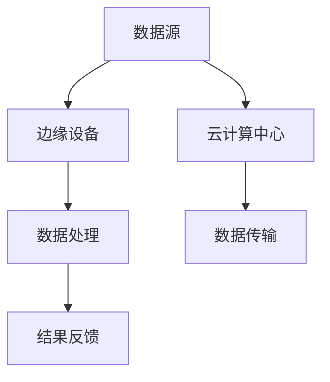
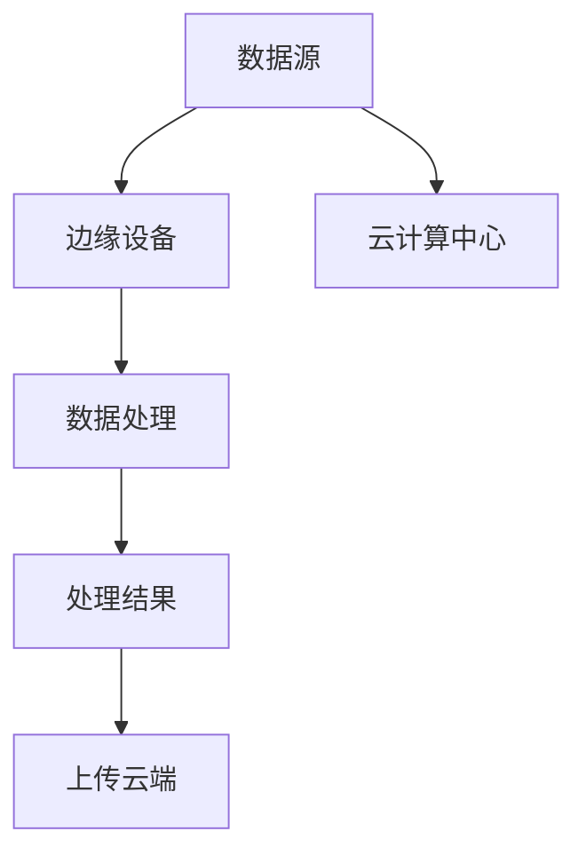
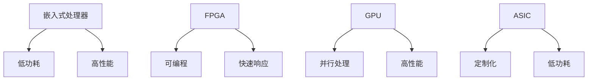

                 

# 边缘AI:将智能带到设备端的技术突破

## 关键词
边缘AI、深度学习、边缘计算、硬件平台、软件框架、智能家居、自动驾驶、工业自动化

## 摘要
边缘AI是一种将人工智能算法部署在靠近数据源的设备端的技术，它能够显著提高数据处理效率、减少延迟，并提高数据安全性。本文将详细探讨边缘AI的核心技术、硬件平台、软件框架、应用案例以及开发实战，帮助读者全面了解并掌握边缘AI的开发与部署。

### 目录大纲设计

为了设计《边缘AI:将智能带到设备端的技术突破》这本书的完整目录大纲，我们需要确保内容丰富、逻辑清晰，并且覆盖边缘AI的各个方面。以下是这本书的目录大纲：

## 第一部分: 边缘AI概述

### 第1章: 边缘AI的定义与重要性
- 1.1 边缘AI的定义
- 1.2 边缘AI与传统云计算的关系
- 1.3 边缘AI的重要性与挑战

### 第2章: 边缘AI的核心技术
- 2.1 深度学习算法
- 2.2 卷积神经网络（CNN）在边缘AI中的应用
- 2.3 循环神经网络（RNN）与长短期记忆网络（LSTM）

### 第3章: 边缘AI硬件平台
- 3.1 边缘计算硬件概述
- 3.2 嵌入式处理器与专用集成电路（ASIC）
- 3.3 常见的边缘AI芯片和开发板

### 第4章: 边缘AI软件框架
- 4.1 主流边缘AI框架
- 4.2 TensorFlow Lite
- 4.3 PyTorch Mobile

### 第5章: 边缘AI应用案例
- 5.1 智能家居
- 5.2 自动驾驶
- 5.3 工业自动化

## 第二部分: 边缘AI开发实战

### 第6章: 边缘AI项目规划与设计
- 6.1 项目规划步骤
- 6.2 系统架构设计
- 6.3 资源分配与性能优化

### 第7章: 实现边缘AI模型
- 7.1 数据收集与预处理
- 7.2 模型选择与训练
- 7.3 模型评估与优化

### 第8章: 部署边缘AI应用
- 8.1 边缘设备集成
- 8.2 实时数据传输与处理
- 8.3 安全性与隐私保护

### 第9章: 构建边缘AI生态系统
- 9.1 产业链协同
- 9.2 开源社区参与
- 9.3 未来发展趋势与挑战

## 附录
- 附录A: 边缘AI开发资源与工具

### 第1章: 边缘AI的定义与重要性

#### 1.1 边缘AI的定义

边缘AI（Edge AI）是一种将人工智能（AI）算法和模型部署在靠近数据源或最终用户的设备端的技术。与传统的云计算模式不同，边缘AI将数据处理和分析任务从中心化的数据中心转移到分布式设备上，从而实现实时响应和降低延迟。

**核心概念与联系**

边缘AI的核心在于将计算能力扩展到网络边缘，这包括各种类型的设备，如智能手机、平板电脑、嵌入式系统、物联网（IoT）设备、工业控制系统和车载设备等。

**Mermaid 流程图**



在这个流程图中，数据源（如传感器或用户设备）产生数据，这些数据首先在边缘设备上处理，得到结果后，如果需要，再上传到云计算中心进行进一步处理或存储。

#### 1.2 边缘AI与传统云计算的关系

传统云计算模式依赖于中心化的数据中心来处理大量数据，这可能导致以下几个问题：

- **延迟问题**：由于数据需要传输到云端进行处理，可能导致较高的延迟。
- **带宽限制**：大量的数据传输到云端可能会占用大量的带宽资源。
- **安全性问题**：将敏感数据传输到云端可能会增加数据泄露的风险。

而边缘AI通过在靠近数据源的设备上进行数据处理，可以有效地解决这些问题：

- **降低延迟**：数据处理在本地完成，大大减少了传输延迟。
- **节省带宽**：只有处理后的数据需要上传到云端，节省了带宽资源。
- **提高安全性**：敏感数据在本地处理，减少了数据泄露的风险。

**Mermaid 流程图**



在这个流程图中，数据源将数据发送到边缘设备进行处理，处理结果再上传到云计算中心进行进一步处理。

#### 1.3 边缘AI的重要性与挑战

边缘AI的重要性体现在以下几个方面：

- **提高数据处理效率**：边缘AI可以在本地实时处理数据，减少了数据传输和等待时间，从而提高了整个系统的响应速度。
- **降低网络延迟**：由于数据处理在本地完成，大大降低了数据传输的延迟，这对于实时性要求高的应用尤为重要。
- **增强数据安全性**：敏感数据在本地处理，减少了数据在传输过程中的风险。
- **减轻云端负担**：边缘AI可以分担云端的数据处理任务，减轻了云服务器的负担，提高了整个系统的性能。

然而，边缘AI也面临一些挑战：

- **硬件资源限制**：边缘设备通常硬件资源有限，需要选择适合的硬件平台和算法来优化性能。
- **算法优化问题**：为了在有限的资源下实现高效的处理，需要对算法进行优化，这涉及到复杂的数学和编程技巧。
- **数据隐私和安全问题**：边缘设备可能面临数据泄露和安全攻击的风险，需要采取有效的措施来保护数据的安全。

综上所述，边缘AI作为一种新兴技术，具有显著的优势和潜力，但同时也需要克服一些挑战。在接下来的章节中，我们将深入探讨边缘AI的核心技术、硬件平台、软件框架以及实际应用。

#### 第2章: 边缘AI的核心技术

边缘AI的核心技术主要包括深度学习算法、卷积神经网络（CNN）、循环神经网络（RNN）与长短期记忆网络（LSTM）。这些技术使得边缘设备能够在本地进行高效的数据处理和分析。

##### 2.1 深度学习算法

深度学习算法是边缘AI的基础，它们通过多层神经网络自动提取数据特征，实现智能识别和分类。以下是深度学习算法的基本原理：

```python
# 深度学习算法的基本原理
def deep_learning_algorithm(data):
    # 数据预处理
    processed_data = preprocess_data(data)
    
    # 定义多层神经网络
    model = create_model()
    
    # 训练模型
    model.fit(processed_data, labels)
    
    # 预测
    predictions = model.predict(new_data)
    
    return predictions
```

在这个伪代码中，`preprocess_data` 用于对输入数据进行预处理，`create_model` 用于创建多层神经网络模型，`fit` 方法用于训练模型，`predict` 方法用于对新数据进行预测。

##### 2.2 卷积神经网络（CNN）在边缘AI中的应用

卷积神经网络（CNN）是一种专门用于图像处理的深度学习算法。它在边缘AI中的应用非常广泛，可以用于图像分类、目标检测和图像分割等任务。

**核心算法原理讲解**

CNN 通过卷积层、池化层和全连接层等结构，自动提取图像特征，并实现分类和识别。以下是CNN的基本原理：

```python
# CNN的基本原理
def cnn_algorithm(input_image):
    # 卷积层
    conv1 = Conv2D(filters=32, kernel_size=(3, 3), activation='relu')(input_image)
    # 池化层
    pool1 = MaxPooling2D(pool_size=(2, 2))(conv1)
    # 卷积层
    conv2 = Conv2D(filters=64, kernel_size=(3, 3), activation='relu')(pool1)
    # 池化层
    pool2 = MaxPooling2D(pool_size=(2, 2))(conv2)
    # 全连接层
    flatten = Flatten()(pool2)
    # 输出层
    output = Dense(units=10, activation='softmax')(flatten)
    
    return output
```

在这个伪代码中，`Conv2D` 用于实现卷积操作，`MaxPooling2D` 用于实现池化操作，`Flatten` 用于将多维数据展平为一维数据，`Dense` 用于实现全连接层。

##### 2.3 循环神经网络（RNN）与长短期记忆网络（LSTM）

循环神经网络（RNN）适用于处理序列数据，如文本、语音和时序数据。长短期记忆网络（LSTM）是RNN的一种变体，能够更好地处理长序列数据，并防止梯度消失问题。

**核心算法原理讲解**

LSTM 通过引入记忆单元和三个门（输入门、遗忘门和输出门），能够有效地捕捉序列数据中的长期依赖关系。以下是LSTM的基本原理：

```python
# LSTM的基本原理
def lstm_algorithm(input_sequence):
    # 输入门
    input_gate = sigmoid(dot(input_sequence, W_i) + b_i)
    # 遗忘门
    forget_gate = sigmoid(dot(input_sequence, W_f) + b_f)
    # 输出门
    output_gate = sigmoid(dot(input_sequence, W_o) + b_o)
    # 计算新的记忆单元
    candidate = tanh(dot(input_sequence, W_c) + b_c + input_gate * input)
    # 更新记忆单元
    C = forget_gate * C + input_gate * candidate
    # 更新隐藏状态
    H = output_gate * tanh(C)
    
    return H, C
```

在这个伪代码中，`sigmoid` 函数用于实现Sigmoid激活函数，`dot` 用于实现矩阵乘法，`b_i`、`b_f`、`b_o` 和 `b_c` 分别是输入门、遗忘门、输出门和记忆单元的偏置。

通过上述核心技术的介绍，我们可以看到边缘AI在深度学习算法、CNN和LSTM等方面的应用。这些技术为边缘设备提供了强大的数据处理能力，使得边缘AI在智能家居、自动驾驶和工业自动化等领域具有广泛的应用前景。

#### 第3章: 边缘AI硬件平台

边缘AI硬件平台是实现边缘计算的基础，它包括嵌入式处理器、FPGA、GPU和专用集成电路（ASIC）等。这些硬件平台提供了不同的性能和功耗特性，适用于不同的应用场景。

##### 3.1 边缘计算硬件概述

边缘计算硬件是指在靠近数据源或终端用户的地方进行数据处理和计算的设备。这些设备通常具有较低的功耗、较高的计算性能和良好的可扩展性。以下是几种常见的边缘计算硬件：

- **嵌入式处理器**：嵌入式处理器是一种集成了CPU、内存和I/O接口的微处理器，通常用于低功耗、高性能的应用场景。
- **FPGA**：现场可编程门阵列（FPGA）是一种可编程逻辑器件，可以通过软件编程来配置其硬件逻辑。FPGA适用于需要高度定制化和快速响应的应用场景。
- **GPU**：图形处理单元（GPU）最初用于图形渲染，但近年来也广泛应用于深度学习和其他计算密集型任务。GPU具有强大的并行处理能力和较高的计算性能。
- **ASIC**：专用集成电路（ASIC）是一种为特定应用定制的集成电路。ASIC具有优化的硬件结构和较低的功耗，适用于高性能和低延迟的应用场景。

**Mermaid 流程图**



在这个流程图中，每种硬件平台都有其独特的优势和适用场景。嵌入式处理器适用于低功耗和低成本的应用，FPGA适用于可编程和快速响应的应用，GPU适用于计算密集型的应用，ASIC适用于定制化和高性能的应用。

##### 3.2 嵌入式处理器与专用集成电路（ASIC）

嵌入式处理器和ASIC是两种常用的边缘计算硬件。嵌入式处理器具有较高的性能和能效，适用于低功耗应用。ASIC则是一种定制化的集成电路，可以优化特定算法的执行效率。

**核心概念与联系**

嵌入式处理器通常具有以下特点：

- **低功耗**：嵌入式处理器通常设计用于低功耗应用，如物联网设备和智能手表。
- **高性能**：尽管功耗较低，但嵌入式处理器仍然具备较高的计算性能。
- **集成度高**：嵌入式处理器集成了CPU、内存、I/O接口和其他功能模块，简化了系统设计。

ASIC的特点如下：

- **定制化**：ASIC是专门为特定应用定制的集成电路，具有优化的硬件结构和指令集。
- **低功耗**：由于ASIC是针对特定应用设计的，可以在功耗和性能之间进行优化。
- **高性能**：ASIC具有优化的硬件结构和指令集，可以显著提高计算性能。

**Mermaid 流

