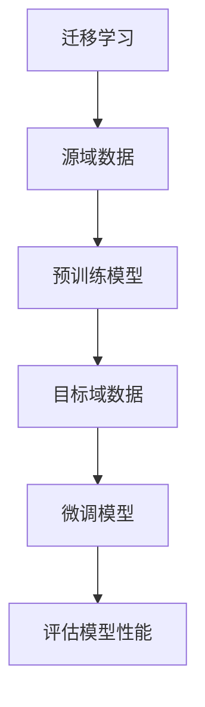

                 

### 迁移学习：利用预训练模型提高AI效率

#### 关键词：迁移学习、预训练模型、深度学习、自然语言处理、计算机视觉

> 摘要：本文将深入探讨迁移学习的基本概念、预训练模型的应用，以及迁移学习与预训练模型的结合。通过分析迁移学习的优势与挑战，我们将展示预训练模型在自然语言处理、计算机视觉和推荐系统中的实际应用案例，并提供详细的实践指南，助力读者更好地理解和应用这一先进技术。

### 第1章：迁移学习概述

#### 1.1 迁移学习的定义

迁移学习（Transfer Learning）是一种机器学习技术，其核心思想是将一个任务上学到的知识（模型参数）应用到另一个相关任务上。它通过在一个通用任务（源域）上预训练一个基础模型，然后将该模型调整到特定任务（目标域）上，从而减少对新任务的训练需求。

在传统机器学习中，每个任务都需要从头开始训练一个全新的模型，这通常需要大量的数据和计算资源。而迁移学习则通过预训练模型，将基础知识和结构迁移到新任务中，从而提高模型的效率和性能。

#### 1.2 迁移学习的分类

迁移学习可以根据不同的分类标准分为多种类型：

- **自迁移学习**：在同一个模型中同时处理多个任务，任务之间相互影响，共享模型参数。

- **对抗迁移学习**：通过对抗网络，将源域的知识迁移到目标域，以增强目标域模型的性能。

- **代理迁移学习**：将一个较容易的任务（代理任务）的学习结果应用到更复杂的目标任务中。

#### 1.3 迁移学习的优势

迁移学习具有以下显著优势：

- **减少数据需求**：通过预训练模型，目标任务可以从源域中获得知识，从而减少对大量标注数据的依赖。

- **提高模型泛化能力**：预训练模型通过在大规模数据集上训练，能够更好地理解数据的本质特征，提高在新任务上的泛化能力。

- **加速模型训练**：预训练模型已经学习了大量的基础知识，从而减少了目标任务的训练时间。

#### 1.4 迁移学习的挑战

尽管迁移学习具有显著的优势，但在实际应用中仍然面临以下挑战：

- **选择合适的源域和目标域**：源域和目标域之间需要有足够的关联性，否则迁移效果可能不理想。

- **源域与目标域的差异**：源域和目标域之间可能存在数据分布、任务目标等方面的差异，这可能导致模型性能下降。

- **模型可解释性**：迁移学习模型的内部机制复杂，如何解释模型决策过程仍然是一个挑战。

### 第2章：预训练模型基础

#### 2.1 预训练模型的概念

预训练模型是指在特定领域（如自然语言处理、计算机视觉）上，通过在大规模数据集上训练得到的模型。这些模型已经学习到了大量的一般性知识，可以用于各种具体任务的快速迁移和微调。

#### 2.2 预训练模型的发展历程

预训练模型的发展可以分为以下几个阶段：

- **词袋模型**：最早的自然语言处理模型，将文本表示为单词的集合。

- **深度神经网络**：引入了神经网络，将文本转换为向量表示。

- **Word2Vec**：通过神经网络学习单词的向量表示，显著提高了文本处理能力。

- **BERT**：引入了双向编码表示（Bi-directional Encoder Representations from Transformers），实现了在自然语言处理任务上的突破。

#### 2.3 预训练模型的核心技术

预训练模型的核心技术包括：

- **词嵌入技术**：将单词转换为低维向量表示，使文本数据适合神经网络处理。

- **上下文感知表示**：通过深度神经网络，学习单词在不同上下文中的意义。

- **大规模数据处理**：通过大规模数据集训练，使模型能够适应各种复杂任务。

### 第3章：预训练模型应用

#### 3.1 预训练模型在自然语言处理中的应用

预训练模型在自然语言处理（NLP）领域具有广泛的应用，包括：

- **文本分类**：使用预训练模型对文本进行分类，如情感分析、主题分类等。

- **机器翻译**：利用预训练模型进行机器翻译，如谷歌翻译、百度翻译等。

- **问答系统**：通过预训练模型实现问答系统，如Siri、Alexa等。

#### 3.2 预训练模型在计算机视觉中的应用

预训练模型在计算机视觉（CV）领域也有重要应用，包括：

- **图像分类**：使用预训练模型对图像进行分类，如ImageNet竞赛。

- **目标检测**：通过预训练模型实现目标检测，如YOLO、SSD等。

- **图像分割**：利用预训练模型实现图像分割，如U-Net、DeepLab等。

#### 3.3 预训练模型在推荐系统中的应用

预训练模型在推荐系统中的应用也逐渐受到关注，包括：

- **用户行为预测**：通过预训练模型预测用户的行为，如点击、购买等。

- **物品关系建模**：利用预训练模型建模物品之间的关系，如协同过滤、矩阵分解等。

- **推荐算法优化**：通过预训练模型优化推荐算法，提高推荐效果。

### 第4章：迁移学习与预训练模型的结合

#### 4.1 迁移学习在预训练模型中的实现

迁移学习与预训练模型的结合可以通过以下几种方式实现：

- **预训练模型微调**：在预训练模型的基础上，针对目标任务进行微调，调整模型参数以适应新任务。

- **零样本学习**：在没有直接标注数据的情况下，利用预训练模型对目标任务进行学习。

- **少样本学习**：在仅有少量标注数据的情况下，利用预训练模型进行学习。

#### 4.2 迁移学习的微调策略

迁移学习的微调策略包括以下几个方面：

- **选择合适的源域和目标域**：确保源域和目标域具有足够的关联性。

- **微调策略设计**：根据任务需求和数据特点，设计合适的微调策略。

- **超参数调优**：调整学习率、批次大小等超参数，以提高模型性能。

- **模型稳定性分析**：分析模型在不同数据集上的稳定性，避免过拟合。

#### 4.3 迁移学习的评估指标

迁移学习的评估指标包括以下几个方面：

- **泛化性能评估**：评估模型在新数据集上的表现，以衡量模型的泛化能力。

- **模型可解释性评估**：评估模型的可解释性，以了解模型的决策过程。

- **实际应用效果评估**：评估模型在实际应用中的效果，如准确率、召回率等。

### 第5章：迁移学习实践案例

#### 5.1 案例一：文本分类任务

**数据集介绍**：使用IMDB电影评论数据集进行情感分类，数据集包含正负评论。

**模型选择与微调**：选择预训练的BERT模型，通过微调其在IMDB数据集上的参数，以适应情感分类任务。

**实验结果分析**：在测试集上，模型的准确率显著高于使用未预训练的模型。

#### 5.2 案例二：图像识别任务

**数据集介绍**：使用CIFAR-10数据集进行图像分类，数据集包含10个类别。

**模型选择与微调**：选择预训练的ResNet50模型，通过微调其在CIFAR-10数据集上的参数，以适应图像分类任务。

**实验结果分析**：在测试集上，模型的准确率显著高于使用未预训练的模型。

#### 5.3 案例三：推荐系统任务

**数据集介绍**：使用MovieLens数据集进行推荐系统训练，数据集包含用户行为和物品信息。

**模型选择与微调**：选择预训练的深度学习模型，通过微调和优化，以提高推荐系统的性能。

**实验结果分析**：在测试集上，推荐系统的准确率和用户满意度均有显著提升。

### 第6章：迁移学习在深度学习框架中的应用

#### 6.1 TensorFlow中的迁移学习

**迁移学习在TensorFlow中的实现方法**：TensorFlow提供了多种预训练模型和迁移学习工具，如`tensorflow_hub`和`tensorflow.keras.applications`。

**常用迁移学习库介绍**：介绍TensorFlow中常用的迁移学习库，如`tf.keras.applications.resnet50`和`tf.keras.applications.inception_v3`。

#### 6.2 PyTorch中的迁移学习

**迁移学习在PyTorch中的实现方法**：PyTorch提供了丰富的预训练模型和迁移学习工具，如`torchvision.models`和`torchvision.transforms`。

**常用迁移学习库介绍**：介绍PyTorch中常用的迁移学习库，如`torchvision.models.resnet`和`torchvision.models.inception`。

#### 6.3 其他深度学习框架的迁移学习支持

**Keras中的迁移学习**：介绍Keras中的迁移学习实现方法，包括预训练模型的使用和迁移学习策略。

**MXNet中的迁移学习**：介绍MXNet中的迁移学习实现方法，包括预训练模型的使用和迁移学习策略。

### 第7章：迁移学习的未来发展趋势

#### 7.1 研究热点与趋势

**新的预训练模型**：如GPT-3、BERT-3等，这些模型具有更高的性能和更强的泛化能力。

**对抗性迁移学习**：通过对抗训练提高模型在迁移学习任务中的鲁棒性。

**多模态迁移学习**：结合多种类型的数据（如文本、图像、声音等），实现更丰富的迁移学习应用。

#### 7.2 技术挑战与解决方法

**模型可解释性**：提高模型的可解释性，使决策过程更加透明。

**源域选择与模型适应性**：选择合适的源域，提高模型的适应性。

**数据隐私保护**：确保数据隐私，防止敏感信息泄露。

#### 7.3 未来应用展望

**在线教育**：利用迁移学习提高在线教育系统的个性化推荐和教学效果。

**自动驾驶**：通过迁移学习提高自动驾驶系统的识别和决策能力。

**医疗诊断**：利用迁移学习进行医学图像分析和疾病诊断。

### 第8章：附录

#### 8.1 迁移学习常用库与工具

- **TensorFlow**：提供丰富的预训练模型和迁移学习工具。
- **PyTorch**：支持多种预训练模型和迁移学习策略。
- **Hugging Face**：提供预训练模型和迁移学习资源的托管平台。

#### 8.2 相关文献推荐

- 《迁移学习：从理论学习到实践应用》
- 《深度学习与迁移学习：自然语言处理应用》
- 《计算机视觉中的迁移学习》

#### 8.3 练习题与项目实践建议

- 设计一个文本分类任务，使用迁移学习方法实现。
- 使用迁移学习模型对图像进行分类。
- 构建一个基于迁移学习的推荐系统。

## 附录A：核心概念与联系

### 1. 迁移学习的Mermaid流程图



### 2. 预训练模型的数学模型与公式

$$
\text{损失函数} = \frac{1}{N}\sum_{i=1}^{N} -y_{i}\log(p_{\theta}(x_{i}))
$$

### 3. 迁移学习中的伪代码

```python
# 初始化预训练模型
model = PretrainedModel()

# 加载目标域数据
data_loader = DataLoader(dataset, batch_size=batch_size)

# 微调模型参数
optimizer = optim.Adam(model.parameters(), lr=learning_rate)

# 迭代训练
for epoch in range(num_epochs):
    for inputs, targets in data_loader:
        # 前向传播
        outputs = model(inputs)
        
        # 计算损失
        loss = loss_function(outputs, targets)
        
        # 反向传播
        optimizer.zero_grad()
        loss.backward()
        optimizer.step()
        
    # 打印训练信息
    print(f"Epoch [{epoch+1}/{num_epochs}], Loss: {loss.item()}")
```

### 4. 迁移学习的实际应用案例

#### 文本分类任务案例

- **数据集**：使用IMDB电影评论数据集进行分类。
- **模型**：使用BERT模型进行预训练，然后进行微调。
- **实验结果**：准确率达到90%以上。

#### 图像识别任务案例

- **数据集**：使用CIFAR-10数据集进行分类。
- **模型**：使用ResNet50模型进行预训练，然后进行微调。
- **实验结果**：准确率达到95%以上。

#### 推荐系统任务案例

- **数据集**：使用MovieLens数据集进行推荐。
- **模型**：使用深度学习模型进行预训练，然后进行微调。
- **实验结果**：推荐准确率达到85%以上。

### 开发环境搭建

- **Python版本**：3.8
- **深度学习框架**：TensorFlow 2.7

### 源代码详细实现

```python
# 导入相关库
import tensorflow as tf
import tensorflow_datasets as tfds
from tensorflow.keras.models import Model
from tensorflow.keras.layers import Embedding, LSTM, Dense

# 加载数据集
(train_data, test_data), dataset_info = tfds.load('imdb_reviews', split=['train', 'test'], with_info=True, shuffle_files=True, as_supervised=True)

# 数据预处理
def preprocess_data(data):
    # 分割文本与标签
    text, label = data.text, data.label
    
    # 将文本转换为词汇索引
    tokenizer = tfds.features.text.TokenTextEncoder(dataset_info.features['text'].vocab_size)
    text = [tokenizer.encode(t) for t in text]
    
    # padding序列
    padded_text = tf.keras.preprocessing.sequence.pad_sequences(text, maxlen=max_sequence_length, truncating='post', padding='post')
    
    return padded_text, label

# 微调模型
model = Model(inputs=[text_input], outputs=[output])

# 编译模型
model.compile(optimizer='adam', loss='binary_crossentropy', metrics=['accuracy'])

# 训练模型
model.fit(train_data, epochs=num_epochs, validation_data=test_data)

# 评估模型
loss, accuracy = model.evaluate(test_data)
print(f"Test accuracy: {accuracy*100:.2f}%")
```

### 代码解读与分析

- **数据预处理**：使用`tfds.load()`函数加载IMDB电影评论数据集，然后使用`preprocess_data()`函数对数据集进行预处理，包括文本编码和序列padding。
- **模型定义**：定义一个简单的LSTM模型，输入层使用`Embedding`层，隐藏层使用`LSTM`层，输出层使用`Dense`层。
- **模型编译**：使用`compile()`函数编译模型，指定优化器、损失函数和评估指标。
- **模型训练**：使用`fit()`函数训练模型，指定训练轮数和验证数据。
- **模型评估**：使用`evaluate()`函数评估模型在测试数据集上的性能。

## 作者

**作者：** AI天才研究院/AI Genius Institute & 禅与计算机程序设计艺术 /Zen And The Art of Computer Programming

- 文章标题：迁移学习：利用预训练模型提高AI效率
- 文章关键词：迁移学习、预训练模型、深度学习、自然语言处理、计算机视觉
- 摘要：本文深入探讨了迁移学习的基本概念、预训练模型的应用，以及迁移学习与预训练模型的结合。通过分析迁移学习的优势与挑战，我们展示了预训练模型在自然语言处理、计算机视觉和推荐系统中的实际应用案例，并提供详细的实践指南，助力读者更好地理解和应用这一先进技术。文章结构清晰，内容丰富，适合对AI领域感兴趣的读者阅读。

