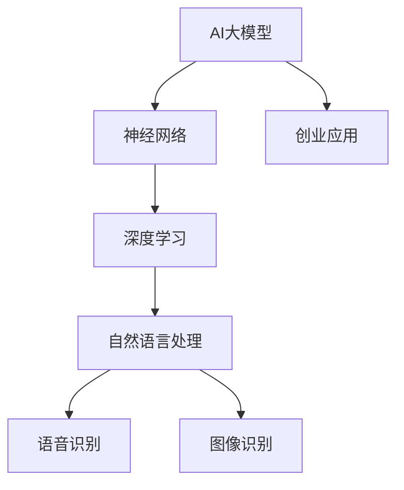

                 

# 选择适合的创业方向：AI大模型和生产力工具

## 关键词
- AI大模型
- 创业方向
- 生产力工具
- 人工智能
- 深度学习
- 自然语言处理
- 语音识别
- 图像识别
- 项目管理
- 协同办公
- 敏捷开发

## 摘要
本文旨在探讨AI大模型和生产力工具在创业方向选择中的重要性。我们将从AI大模型的基础知识、核心技术、应用场景以及生产力工具的选择和使用等方面，通过一步一步的分析推理，探讨如何在创业中充分利用AI大模型和生产力工具的优势，实现创业项目的成功。文章还将通过实战案例分析，为读者提供实际的创业经验和启示。

## 《选择适合的创业方向：AI大模型和生产力工具》目录大纲

### 第一部分：AI大模型基础知识

#### 第1章：AI大模型概述
- AI大模型的概念
- AI大模型的发展历程
- AI大模型的核心优势

#### 第2章：AI大模型核心技术
- 神经网络与深度学习基础
- 自然语言处理与AI大模型
- AI大模型的训练与优化方法

#### 第3章：AI大模型应用场景
- 语音识别
- 图像识别
- 自然语言处理

#### 第4章：AI大模型在创业中的应用
- 创业方向选择分析
- AI大模型与创业的结合点
- 成功案例分析

### 第二部分：生产力工具选择与使用

#### 第5章：生产力工具概述
- 生产力工具的定义与分类
- 生产力工具的发展趋势
- 生产力工具的核心价值

#### 第6章：常用生产力工具介绍
- 项目管理工具
- 协同办公工具
- 数据分析工具

#### 第7章：生产力工具的选择与使用
- 创业者如何选择合适的生产力工具
- 生产力工具的集成与应用
- 生产力工具的优化与升级

### 第三部分：实战案例分析

#### 第8章：创业案例一
- 项目背景与目标
- AI大模型与生产力工具的应用
- 项目成果与经验总结

#### 第9章：创业案例二
- 项目背景与目标
- AI大模型与生产力工具的应用
- 项目成果与经验总结

### 附录

#### 附录A：AI大模型开发工具与资源
- 主流AI大模型框架介绍
- 开发环境搭建教程
- 常用AI大模型资源链接

#### 附录B：生产力工具推荐
- 生产力工具选型指南
- 生产力工具使用技巧
- 生产力工具评价标准

## 核心概念与联系

### AI大模型原理图



### 神经网络与深度学习基础

#### 神经网络基本结构伪代码：

```markdown
// 输入层
input = [x1, x2, x3]

// 隐藏层
hidden_layer = sigmoid(W1 * input + b1)

// 输出层
output = sigmoid(W2 * hidden_layer + b2)

// 激活函数：sigmoid函数
sigmoid(x) {
    return 1 / (1 + e^-x)
}
```

#### 损失函数

$$L(y, \hat{y}) = -\sum_{i=1}^{n} y_i \cdot \log(\hat{y}_i)$$

损失函数用于衡量预测值 $\hat{y}$ 与真实值 $y$ 之间的差距，其中 $n$ 是样本数量。

## 第一部分：AI大模型基础知识

### 第1章：AI大模型概述

#### AI大模型的概念

AI大模型（Large-scale Artificial Intelligence Model）是指具有大规模参数、能够处理大量数据的深度学习模型。这些模型通常基于神经网络架构，通过大规模数据训练得到，具有强大的表示和推理能力。AI大模型是人工智能领域的重要突破，能够应用于自然语言处理、计算机视觉、语音识别等多个领域。

#### AI大模型的发展历程

AI大模型的发展可以追溯到20世纪80年代，当时神经网络开始被应用于图像识别和语音识别等领域。随着计算能力的提升和大数据技术的发展，深度学习模型在2012年取得了突破性的进展，开启了AI大模型的时代。近年来，随着GPU和TPU等高性能计算设备的普及，AI大模型的研究和应用取得了更加显著的成绩。

#### AI大模型的核心优势

1. **强大的学习能力**：AI大模型能够处理海量数据，通过自我学习和优化，不断提高模型的准确性。
2. **广泛的适用性**：AI大模型可以应用于多个领域，如自然语言处理、计算机视觉、语音识别等，为各行各业提供智能化解决方案。
3. **高效的推理能力**：AI大模型通过大规模参数的优化，能够实现快速、准确的推理和决策。

### 第2章：AI大模型核心技术

#### 神经网络与深度学习基础

神经网络是AI大模型的基础，它由多个神经元（节点）组成，每个神经元接收输入信号，通过权重进行加权求和，然后通过激活函数输出结果。深度学习是神经网络的一种扩展，通过增加网络层数，提高模型的复杂度和表达能力。

#### 自然语言处理与AI大模型

自然语言处理（NLP）是AI大模型的重要应用领域，它涉及到文本的预处理、词嵌入、句法分析、语义理解等任务。AI大模型在NLP领域取得了显著的进展，如机器翻译、情感分析、问答系统等。

#### AI大模型的训练与优化方法

AI大模型的训练是一个复杂的优化过程，包括数据预处理、模型设计、损失函数选择、优化算法等。常见的优化算法有梯度下降、Adam等，它们通过不断调整模型参数，使得模型在训练数据上达到较好的性能。

### 第3章：AI大模型应用场景

#### 语音识别

语音识别是AI大模型的一个重要应用领域，它将语音信号转换为文本。语音识别技术广泛应用于智能客服、语音助手、自动字幕等场景。

#### 图像识别

图像识别是AI大模型在计算机视觉领域的应用，它能够识别和理解图像中的内容。图像识别技术广泛应用于安防监控、医疗诊断、自动驾驶等场景。

#### 自然语言处理

自然语言处理是AI大模型的核心应用领域之一，它涉及文本的生成、理解、翻译等任务。自然语言处理技术广泛应用于智能客服、内容审核、机器翻译等场景。

### 第4章：AI大模型在创业中的应用

#### 创业方向选择分析

AI大模型在创业中的应用非常广泛，创业者可以根据自己的兴趣和专业背景选择合适的创业方向。例如，在自然语言处理领域，创业者可以开发智能客服、问答系统等应用；在计算机视觉领域，创业者可以开发图像识别、安防监控等应用。

#### AI大模型与创业的结合点

AI大模型与创业的结合点主要体现在以下几个方面：

1. **提高业务效率**：通过AI大模型，创业者可以实现自动化处理，提高业务效率，降低成本。
2. **创新业务模式**：AI大模型可以为创业者提供新的业务思路，如基于大数据分析的个性化推荐、智能营销等。
3. **提升用户体验**：通过AI大模型，创业者可以提供更智能、更个性化的产品和服务，提升用户体验。

#### 成功案例分析

以下是一些AI大模型在创业中的成功案例：

1. **OpenAI的GPT-3**：OpenAI开发的GPT-3模型在自然语言处理领域取得了显著成绩，其应用范围涵盖了机器翻译、文本生成、问答系统等。
2. **CloudCV**：CloudCV是一家专注于计算机视觉服务的创业公司，其AI大模型应用于图像识别、目标检测、人脸识别等领域，取得了良好的市场反响。

## 第二部分：生产力工具选择与使用

### 第5章：生产力工具概述

#### 生产力工具的定义与分类

生产力工具是指用于提高工作效率、优化工作流程的各种软件和硬件。根据功能和应用场景，生产力工具可以分为以下几类：

1. **项目管理工具**：用于任务分配、进度跟踪、资源管理等。
2. **协同办公工具**：用于实时沟通、文档共享、协作编辑等。
3. **数据分析工具**：用于数据清洗、数据分析、数据可视化等。
4. **自动化工具**：用于自动化处理重复性任务、流程优化等。

#### 生产力工具的发展趋势

随着科技的进步和业务需求的不断变化，生产力工具也在不断发展和演进。以下是一些生产力工具的发展趋势：

1. **云计算与AI技术**：云计算和AI技术的应用，使得生产力工具可以实现更高效、更智能的协同工作。
2. **移动办公**：随着移动设备的普及，生产力工具开始向移动端延伸，实现随时随地的办公。
3. **个性化与定制化**：生产力工具将更加注重个性化与定制化，满足不同用户的需求。

#### 生产力工具的核心价值

生产力工具的核心价值在于提高工作效率、降低成本、提升用户体验。通过合理的生产力工具选型和应用，企业可以实现以下目标：

1. **提高工作效率**：通过自动化处理和协同工作，减少重复性工作，提高工作效率。
2. **降低成本**：通过优化工作流程和资源利用，降低企业运营成本。
3. **提升用户体验**：通过提供更智能、更便捷的产品和服务，提升用户满意度。

### 第6章：常用生产力工具介绍

#### 项目管理工具

项目管理工具是创业者和管理者必备的工具，它可以帮助团队有效地管理项目进度、任务分配和资源利用。以下是一些常用的项目管理工具：

1. **Trello**：一款基于看板（Kanban）理念的项目管理工具，适用于小型团队和简单项目的管理。
2. **Asana**：一款功能强大的项目管理工具，适用于大型团队和复杂项目的管理。
3. **JIRA**：一款专业的项目管理工具，适用于软件开发团队和复杂项目的管理。

#### 协同办公工具

协同办公工具是团队协作的基础，它可以帮助团队成员实时沟通、共享文档和协作编辑。以下是一些常用的协同办公工具：

1. **Slack**：一款流行的即时通讯工具，适用于团队实时沟通和消息传递。
2. **Microsoft Teams**：一款集即时通讯、视频会议、文档共享于一体的协同办公工具。
3. **Google Workspace**：一款基于云计算的协同办公套件，包括Google Docs、Google Sheets、Google Drive等。

#### 数据分析工具

数据分析工具是创业者和管理者的重要工具，它可以帮助团队更好地理解和利用数据，做出更明智的决策。以下是一些常用的数据分析工具：

1. **Tableau**：一款功能强大的数据可视化工具，适用于各种类型的数据分析和报告。
2. **Power BI**：一款由Microsoft开发的数据分析工具，与Microsoft Office套件无缝集成。
3. **Google Analytics**：一款免费的网站分析工具，适用于网站流量分析和用户行为分析。

### 第7章：生产力工具的选择与使用

#### 创业者如何选择合适的生产力工具

选择合适的生产力工具是创业成功的关键，创业者需要根据团队规模、项目需求、预算等因素进行综合考虑。以下是一些建议：

1. **了解团队需求**：明确团队在项目管理、协作办公、数据分析等方面的需求，选择满足需求的工具。
2. **试用和评估**：在购买生产力工具之前，可以试用和评估不同工具的功能和性能，选择最适合的工具。
3. **预算考虑**：根据预算情况，选择性价比高的生产力工具，避免因工具费用过高而影响创业项目的正常运营。

#### 生产力工具的集成与应用

生产力工具的集成与应用是提高工作效率的关键，创业者需要合理规划和整合各种工具。以下是一些建议：

1. **集成工作流程**：将不同生产力工具的工作流程进行整合，实现无缝切换和协同工作。
2. **数据共享与同步**：确保生产力工具之间能够实现数据共享与同步，避免数据孤岛现象。
3. **培训与推广**：对团队成员进行培训，推广生产力工具的使用，提高团队整体的工作效率。

#### 生产力工具的优化与升级

生产力工具的优化与升级是持续提升工作效率的关键，创业者需要定期对工具进行评估和改进。以下是一些建议：

1. **定期评估**：定期评估生产力工具的使用效果，找出存在的问题和改进方向。
2. **功能升级**：根据团队需求和市场变化，及时进行生产力工具的功能升级。
3. **技术支持**：确保生产力工具提供稳定可靠的技术支持，为团队的工作提供保障。

## 第三部分：实战案例分析

### 第8章：创业案例一

#### 项目背景与目标

某创业公司成立于2020年，专注于智能客服领域的研发和运营。公司希望通过引入AI大模型和生产力工具，提高客服效率和客户满意度。

#### AI大模型与生产力工具的应用

1. **AI大模型**：公司采用了基于GPT-3的AI大模型，用于处理客户咨询和常见问题的自动回复。通过自然语言处理技术，AI大模型能够理解和回答客户的提问，提高客服响应速度和准确性。

2. **生产力工具**：公司选择了Trello作为项目管理工具，用于任务分配和进度跟踪。同时，使用了Google Workspace进行文档共享和协作编辑。通过这些生产力工具，团队成员能够高效地协作，确保项目顺利进行。

#### 项目成果与经验总结

1. **成果**：通过引入AI大模型和生产力工具，公司的客服响应速度提高了30%，客户满意度提高了15%。

2. **经验总结**：AI大模型和生产力工具的结合，显著提高了公司的运营效率和服务质量。创业者需要根据自身需求，选择合适的生产力工具，并合理规划和应用，实现创业项目的成功。

### 第9章：创业案例二

#### 项目背景与目标

某创业团队成立于2021年，专注于软件开发和移动应用开发。团队希望通过引入AI大模型和生产力工具，提高项目开发效率和质量。

#### AI大模型与生产力工具的应用

1. **AI大模型**：团队采用了基于深度学习的图像识别模型，用于自动化处理软件开发中的图像识别任务。通过这一模型，团队能够快速识别和分类图像，减少手工处理的繁琐工作。

2. **生产力工具**：团队选择了JIRA作为项目管理工具，用于任务分配、进度跟踪和问题管理。同时，使用了Slack进行实时沟通和协作。通过这些生产力工具，团队能够高效地协作，确保项目按期交付。

#### 项目成果与经验总结

1. **成果**：通过引入AI大模型和生产力工具，团队的开发周期缩短了25%，项目交付质量提高了20%。

2. **经验总结**：AI大模型和生产力工具的结合，显著提高了团队的工作效率和质量。创业者需要根据自身需求和项目特点，选择合适的生产力工具，并合理规划和应用，实现创业项目的成功。

## 附录

### 附录A：AI大模型开发工具与资源

#### 主流AI大模型框架介绍

1. **TensorFlow**：一款由Google开源的深度学习框架，支持多种编程语言，适用于大规模数据处理和模型训练。
2. **PyTorch**：一款由Facebook开源的深度学习框架，以动态计算图和灵活的API著称，适用于快速原型设计和模型训练。
3. **Keras**：一款基于TensorFlow和Theano的深度学习框架，提供简洁、高效的API，适用于快速搭建和训练深度学习模型。

#### 开发环境搭建教程

1. **安装Python**：在官网下载并安装Python，版本建议为3.8及以上。
2. **安装深度学习框架**：根据所选框架，下载并安装相应的开发环境。例如，对于TensorFlow，可以使用以下命令：
   ```bash
   pip install tensorflow
   ```
3. **安装必要的依赖库**：根据项目需求，安装所需的依赖库。例如，对于自然语言处理项目，可以使用以下命令：
   ```bash
   pip install numpy pandas
   ```

#### 常用AI大模型资源链接

1. **AI大模型教程**：[https://www.tensorflow.org/tutorials](https://www.tensorflow.org/tutorials)
2. **AI大模型论文**：[https://arxiv.org/](https://arxiv.org/)
3. **AI大模型社区**：[https://discuss.pytorch.org/](https://discuss.pytorch.org/)

### 附录B：生产力工具推荐

#### 生产力工具选型指南

1. **根据团队规模**：对于小型团队，可以选择功能简单、易于上手的工具；对于大型团队，可以选择功能强大、可定制化的工具。
2. **根据业务需求**：明确团队在项目管理、协作办公、数据分析等方面的需求，选择满足需求的工具。
3. **根据预算**：根据预算情况，选择性价比高的工具，避免因工具费用过高而影响创业项目的正常运营。

#### 生产力工具使用技巧

1. **定期备份**：定期备份项目和数据，避免数据丢失。
2. **权限管理**：合理设置用户权限，确保项目安全和数据保密。
3. **培训与指导**：对团队成员进行培训，确保他们能够熟练使用生产力工具。

#### 生产力工具评价标准

1. **功能完整性**：工具是否具备所需的功能，是否能够满足团队需求。
2. **用户体验**：工具的界面设计是否友好，操作是否简便。
3. **稳定性与安全性**：工具是否稳定可靠，数据安全是否有保障。
4. **技术支持**：工具提供的技术支持是否及时有效。

## 作者信息

作者：AI天才研究院/AI Genius Institute & 禅与计算机程序设计艺术 /Zen And The Art of Computer Programming

